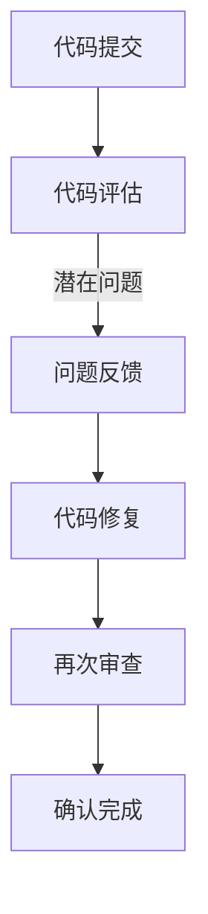

                 

### 第一部分：代码审查系统概述

#### 1.1 问题背景与核心概念

**代码审查的重要性**

在现代软件开发过程中，代码审查是一个不可或缺的质量保证步骤。它不仅能够帮助团队及早发现并修复代码中的错误和漏洞，还能够提高代码的可维护性和可读性。传统的代码审查通常依赖人工进行，效率低下且易出错。随着软件开发项目的规模不断扩大，传统代码审查方式已经难以满足现代软件开发的高效、高质量要求。

**智能化代码审查的必要性**

为了应对传统代码审查的局限性，智能化代码审查逐渐成为了一个热门研究方向。智能化代码审查通过引入人工智能、机器学习等先进技术，能够自动化地识别代码中的潜在问题，提高代码审查的效率和准确性。这不仅能够减轻开发人员的工作负担，还能够提高代码的整体质量。

**代码审查系统的边界与外延**

代码审查系统不仅仅是一个单独的工具，它通常与代码管理工具、持续集成/持续部署（CI/CD）流程等系统集成，形成一套完整的代码质量控制体系。代码审查系统的边界包括代码的提交、评估、反馈、修复等环节，其外延则涉及到与开发、测试、运维等环节的协同工作。

#### 1.2 智能化代码审查的核心概念

**代码质量标准**

代码质量标准是评价代码质量的重要依据，通常包括代码的规范性、可读性、可维护性、性能等方面。这些标准不仅能够帮助开发人员编写高质量的代码，还能够为代码审查提供具体的评估指标。

**代码审查流程**

代码审查流程包括代码提交、代码评估、问题反馈和代码修复等环节。智能化代码审查系统能够自动化这些流程，提高审查效率。

**智能化代码审查的关键技术**

智能化代码审查的关键技术包括静态代码分析、动态代码分析、代码质量模型构建、自然语言处理等。这些技术共同作用，实现代码审查的自动化和智能化。

#### 1.3 代码审查系统设计原则

**可扩展性**

代码审查系统需要具备良好的可扩展性，以适应不同规模和复杂度的项目需求。这包括支持多种编程语言、代码库和开发工具。

**易用性**

易用性是代码审查系统成功的关键因素。系统需要提供直观的用户界面、简洁的操作流程和丰富的文档，降低用户的学习成本。

**安全性**

安全性是代码审查系统的基本要求。系统需要确保审查过程的安全性，防止恶意代码的传播和破坏。

#### 1.4 代码审查系统架构

**系统架构设计**

代码审查系统的架构设计需要考虑系统的可扩展性、可维护性和高性能。常见的架构设计包括集中式和分布式两种模式。

**数据流与控制流**

数据流与控制流是代码审查系统设计的关键部分。系统需要有效地处理代码数据，进行自动化评估和反馈。

**系统接口设计**

系统接口设计需要考虑与其他系统的集成，如代码管理工具、项目管理工具等。这包括API接口和数据交换格式的设计。

#### 1.5 本章小结

本章对代码审查系统进行了概述，介绍了其问题背景、核心概念、设计原则和架构设计。在接下来的章节中，我们将进一步探讨智能化代码审查的具体技术、实现方法和实际应用案例。

---

### 1.2 智能化代码审查的核心概念

#### 1.2.1 代码质量标准

代码质量标准是评价代码质量的重要依据，它涵盖了代码的多个方面，包括但不限于：

- **规范性**：代码应遵循一定的编码规范，如命名规则、代码结构、注释等，以提高代码的可读性和一致性。
- **可读性**：代码应具有良好的可读性，便于其他开发人员理解和维护。
- **可维护性**：代码应易于修改和扩展，以适应未来的需求变更。
- **性能**：代码应具有高效的数据处理和计算能力，避免不必要的资源浪费。
- **安全性**：代码应具备良好的安全性，防止潜在的安全漏洞和攻击。

**代码质量标准的对比表格**

| 项目     | 规范性 | 可读性 | 可维护性 | 性能 | 安全性 |
|----------|--------|--------|----------|------|--------|
| 编码规范 | 高     | 高     | 中       | 中   | 中     |
| 注释清晰 | 中     | 高     | 高       | 中   | 中     |
| 结构简洁 | 高     | 高     | 高       | 中   | 中     |
| 性能优化 | 中     | 中     | 中       | 高   | 中     |
| 安全检查 | 中     | 中     | 中       | 中   | 高     |

**代码质量标准的 ER 实体关系图**

```mermaid
erDiagram
    Class1 ||--|{ Class2 : 借款关系 }
    Class1 ||--|{ Class3 : 贷款关系 }
    Class2 ||--|{ Class4 : 合同关系 }
    Class3 ||--|{ Class4 : 合同关系 }
```

#### 1.2.2 代码审查流程

代码审查流程是确保代码质量的关键环节，通常包括以下步骤：

1. **代码提交**：开发人员将代码提交到代码库，触发审查流程。
2. **代码评估**：代码审查系统对提交的代码进行自动化评估，识别潜在的问题。
3. **问题反馈**：系统生成详细的代码质量报告，指出存在的问题。
4. **代码修复**：开发人员根据报告对代码进行修复，并重新提交。
5. **再次审查**：修复后的代码再次进行审查，确保问题已得到解决。

**代码审查流程的 mermaid 流程图**



#### 1.2.3 智能化代码审查的关键技术

智能化代码审查的关键技术包括静态代码分析、动态代码分析、代码质量模型构建和自然语言处理等。

**静态代码分析**

静态代码分析是一种不运行程序就对代码进行分析的技术，主要用于检查代码的语法、结构和逻辑错误。常见的静态代码分析工具有 SonarQube、FindBugs 等。

**动态代码分析**

动态代码分析是在程序运行时对代码进行分析的技术，可以捕捉运行时的问题，如性能瓶颈、内存泄漏等。常见的动态代码分析工具有 Valgrind、JProfiler 等。

**代码质量模型构建**

代码质量模型构建是通过机器学习等技术，将代码质量特征与代码质量评分关联起来，用于预测代码的质量。常见的机器学习算法包括决策树、随机森林、支持向量机等。

**自然语言处理**

自然语言处理（NLP）用于处理代码中的自然语言注释和文档，提取关键信息，如代码用途、功能描述等。常见的 NLP 工具有 NLTK、spaCy 等。

**算法原理讲解**

**静态代码分析算法**

静态代码分析通常采用抽象语法树（AST）对代码进行分析。以下是一个简单的静态代码分析算法：

```python
class Node:
    def visit(self):
        pass

class ExpressionNode(Node):
    def visit(self):
        print("Expression Node")

class BinaryOperationNode(ExpressionNode):
    def __init__(self, left, right):
        self.left = left
        self.right = right

    def visit(self):
        self.left.visit()
        self.right.visit()
        print("Binary Operation Node")

class NumberNode(ExpressionNode):
    def __init__(self, value):
        self.value = value

    def visit(self):
        print(f"Number Node: {self.value}")

# 示例
root = BinaryOperationNode(NumberNode(1), NumberNode(2))
root.visit()
```

**动态代码分析算法**

动态代码分析通常使用程序断点、日志记录等技术来捕捉运行时的问题。以下是一个简单的动态代码分析算法：

```python
class Program:
    def run(self):
        print("Program running...")
        # 执行代码
        print("Program finished.")

    def analyze(self):
        print("Analyzing program...")
        # 分析代码
        print("Analysis finished.")

# 示例
program = Program()
program.run()
program.analyze()
```

**代码质量模型构建算法**

代码质量模型构建通常使用机器学习算法来关联代码特征与代码质量评分。以下是一个简单的决策树算法：

```python
from sklearn.tree import DecisionTreeRegressor

# 示例数据
X = [[1, 2], [3, 4], [5, 6]]  # 代码特征
y = [1, 2, 3]  # 代码质量评分

# 训练模型
model = DecisionTreeRegressor()
model.fit(X, y)

# 预测
print(model.predict([[2, 3]]))  # 输出预测的代码质量评分
```

**自然语言处理算法**

自然语言处理算法用于提取代码中的自然语言注释和文档。以下是一个简单的词云生成算法：

```python
from wordcloud import WordCloud

# 示例文本
text = "这是一个示例文本，用于生成词云。"

# 生成词云
wordcloud = WordCloud(background_color="white").generate(text)

# 显示词云
plt.imshow(wordcloud, interpolation="bilinear")
plt.axis("off")
plt.show()
```

#### 1.2.4 代码质量标准与审查流程的关联

代码质量标准与审查流程密切相关。代码质量标准为审查流程提供了明确的评估依据，而审查流程则通过自动化工具和技术，对代码进行评估和反馈。以下是一个简单的关联模型：

**关联模型**

| 代码质量标准 | 审查流程步骤 |
|--------------|--------------|
| 规范性       | 代码提交、代码评估 |
| 可读性       | 代码评估、问题反馈 |
| 可维护性     | 代码评估、问题反馈、代码修复 |
| 性能         | 代码评估、性能分析 |
| 安全性       | 代码评估、安全性检查 |

#### 1.2.5 智能化代码审查的优势

智能化代码审查具有以下优势：

- **提高效率**：通过自动化工具和技术，显著提高代码审查的速度和准确性。
- **减轻负担**：减轻开发人员的工作负担，使他们能够将更多精力投入到创造性工作中。
- **减少错误**：通过提前发现和修复问题，降低代码中的错误和漏洞。
- **持续改进**：通过持续评估和反馈，促进团队代码质量的不断提升。

#### 1.2.6 智能化代码审查的应用场景

智能化代码审查适用于多种应用场景，包括但不限于：

- **大型项目**：在大型项目中，代码规模庞大，传统代码审查效率低下，智能化代码审查能够显著提高审查效率。
- **敏捷开发**：在敏捷开发过程中，需求频繁变更，智能化代码审查能够快速适应需求变化。
- **多人协作**：在多人协作项目中，智能化代码审查能够促进团队成员之间的沟通和协作，提高代码质量。

#### 1.2.7 智能化代码审查的挑战与应对策略

智能化代码审查面临以下挑战：

- **误报和漏报**：自动化工具可能会出现误报和漏报，需要开发人员进行人工干预。
- **复杂性和多样性**：不同项目、不同编程语言和开发工具的复杂性，增加了智能化代码审查的难度。
- **数据质量和标注**：代码质量模型构建依赖于高质量的数据和准确的标注，数据质量和标注的准确性直接影响模型性能。

应对策略：

- **优化算法和模型**：不断优化算法和模型，提高自动化工具的准确性和鲁棒性。
- **人工与自动化结合**：在关键环节引入人工审查，确保代码质量的准确性。
- **持续学习和改进**：通过持续学习和改进，不断提高智能化代码审查系统的性能和可靠性。

#### 1.2.8 智能化代码审查的未来发展趋势

随着人工智能技术的不断发展，智能化代码审查将呈现出以下发展趋势：

- **更智能的自动化**：通过引入深度学习、迁移学习等技术，提高自动化工具的智能化程度。
- **跨语言支持**：支持多种编程语言，提高智能化代码审查的普适性。
- **集成化**：与代码管理工具、持续集成/持续部署（CI/CD）流程等系统集成，形成一套完整的代码质量控制体系。
- **个性化**：根据团队特点和项目需求，提供个性化的代码审查服务。

### 总结

智能化代码审查通过引入人工智能技术，显著提高了代码审查的效率和准确性。在接下来的章节中，我们将进一步探讨智能化代码审查的具体实现方法、系统架构设计和实际应用案例。通过这些探讨，我们将更好地理解智能化代码审查的核心概念，为实际应用提供指导。

