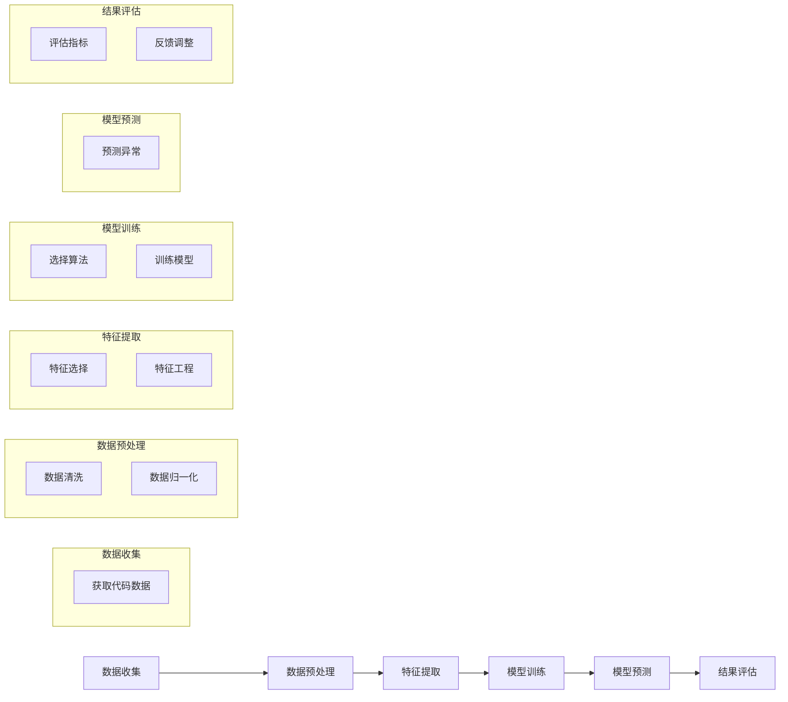

                 

### 引言与背景

在当今软件开发领域，随着项目的复杂度和规模日益增加，代码的质量管理变得越来越重要。代码异常检测系统作为保障代码质量的重要工具，其在软件开发过程中的作用不可忽视。本文旨在探讨如何打造一套智能化、自动化的代码异常检测系统，帮助开发者提高代码质量，提升开发效率。

**问题背景**：
随着软件系统变得愈加庞大和复杂，代码中的错误和异常往往难以通过简单的测试和检查发现。传统的代码质量检测方法，如代码审查、静态代码分析等，虽然在一定程度上能发现一些潜在的问题，但它们在处理高频率、大规模代码变更时，效率较低，且难以完全覆盖所有可能的异常情况。这就促使开发者寻求更加智能、高效的解决方案。

**问题描述**：
代码异常检测系统旨在识别出代码中可能存在的异常或潜在问题，如语法错误、逻辑错误、性能瓶颈等。这些异常不仅会影响代码的运行效率，还可能导致系统崩溃或数据泄露。因此，构建一套智能化、自动化的代码异常检测系统成为提高软件质量和开发效率的关键。

**问题解决**：
为了解决上述问题，本文将介绍一种基于机器学习和深度学习的智能化代码异常检测系统。通过分析大量代码数据，该系统能够自动识别出代码中的异常模式，并给出相应的修复建议。与传统方法相比，这种方法具有更高的准确性和效率，能够更好地适应快速迭代的软件开发过程。

**边界与外延**：
本文主要讨论代码异常检测系统的基本概念、原理和构建方法。然而，在实际应用中，代码异常检测系统还可以结合其他技术，如自动化测试、持续集成和持续交付等，形成一个更加完善的质量保障体系。此外，随着人工智能技术的不断进步，未来的代码异常检测系统将更加智能化，能够实现更加精准的异常识别和修复。

**核心概念与要素组成**：
为了构建一个有效的代码异常检测系统，需要理解以下几个核心概念：

1. **异常检测**：异常检测是指从一组数据中识别出不同寻常或不符合预期模式的样本。
2. **机器学习**：机器学习是一种通过从数据中学习规律和模式，从而实现自动化的方法。
3. **深度学习**：深度学习是机器学习的一个分支，通过构建复杂的神经网络模型，从大量数据中学习高级特征。
4. **代码质量**：代码质量是指代码的可读性、可靠性、可维护性和性能等方面。
5. **自动化测试**：自动化测试是通过编写脚本或使用工具，自动化执行测试用例，以验证代码的正确性和性能。

通过以上核心概念和要素的有机结合，开发者可以构建出一套智能化、自动化的代码异常检测系统，为软件项目的成功交付提供有力保障。

### 核心概念与联系

在构建智能化代码异常检测系统的过程中，理解并掌握以下几个核心概念及其相互关系至关重要。以下是这些核心概念的基本定义、属性特征以及它们之间的联系。

**核心概念** | **基本定义** | **属性特征** | **相互关系**
---|---|---|---
**异常检测** | 从一组数据中识别出不同寻常或不符合预期模式的样本 | 高准确率、实时性、高效性 | 异常检测是代码异常检测系统的核心功能，通过识别异常代码，保障代码质量。
**机器学习** | 通过从数据中学习规律和模式，从而实现自动化决策的方法 | 自适应性、大规模数据处理能力、高准确性 | 机器学习为代码异常检测提供技术支持，通过训练模型，自动识别代码异常。
**深度学习** | 通过构建复杂的神经网络模型，从大量数据中学习高级特征的方法 | 自动特征提取、非线性建模能力、高准确性 | 深度学习是机器学习的一个分支，在代码异常检测中，能够提取出更加复杂的特征，提高检测准确性。
**代码质量** | 代码的可读性、可靠性、可维护性和性能等方面 | 高代码质量意味着代码易于理解和修改，降低维护成本 | 代码质量直接影响软件系统的稳定性、可靠性和开发效率，是代码异常检测的重要目标。
**自动化测试** | 通过编写脚本或使用工具，自动化执行测试用例，以验证代码的正确性和性能 | 节省人力成本、提高测试效率、发现潜在问题 | 自动化测试是代码异常检测的重要组成部分，能够快速识别出代码中的错误和异常。

通过上述核心概念的定义和特征分析，我们可以看到它们在代码异常检测系统中的紧密联系。异常检测依赖机器学习和深度学习技术来实现自动化异常识别，而代码质量和自动化测试则是保障系统有效性的关键因素。只有将这些核心概念有机结合，才能构建出一套高效、智能的代码异常检测系统。

#### 异常检测原理

异常检测是构建智能化代码异常检测系统的核心步骤之一。为了详细阐述异常检测的基本原理，我们将使用Mermaid流程图，展示从数据收集、预处理、特征提取到模型训练和预测的各个环节。以下是一个简化的异常检测流程：



**数据收集**：数据收集是异常检测的第一步，主要任务是获取大量代码数据。这些数据可以是历史代码库中的数据，也可以是实时捕获的代码变更数据。

**数据预处理**：数据预处理主要包括数据清洗和数据归一化。数据清洗旨在去除无效、冗余和噪声数据，确保数据的准确性和一致性。数据归一化则通过缩放或标准化数据，使其具备相同的量纲，从而便于后续的特征提取和模型训练。

**特征提取**：特征提取是关键步骤，旨在从原始代码数据中提取出能够表征代码特性的特征。特征选择和特征工程是这一步的重要任务。特征选择通过筛选出与异常检测最相关的特征，提高模型的性能。特征工程则通过转换、组合和生成新特征，进一步增强模型的表现。

**模型训练**：模型训练是使用机器学习或深度学习算法，将提取到的特征与代码异常标签进行训练，从而构建出能够预测代码异常的模型。选择合适的算法、调整模型参数以及优化训练过程，都是确保模型性能的关键因素。

**模型预测**：模型预测阶段，通过将新代码数据输入到训练好的模型中，预测其是否存在异常。这个步骤需要高效且准确的模型，以便实时检测代码中的异常。

**结果评估**：结果评估是验证模型性能的重要环节，通过评估指标如准确率、召回率和F1值等，对模型进行综合评价。此外，根据评估结果，还可以对模型进行调整和优化，以提高其预测准确性。

通过上述步骤，我们可以构建出一套完整的异常检测流程，实现对代码中潜在异常的自动化识别和预测。接下来，我们将详细讲解一种常见的异常检测算法——孤立森林（Isolation Forest），并使用Python源代码进行实例说明。

#### 算法原理讲解

在代码异常检测系统中，孤立森林（Isolation Forest）是一种常见的异常检测算法。孤立森林算法通过随机选择特征和划分，将正常数据逐渐隔离出来，从而识别异常数据。其基本思想是基于随机森林，但更专注于异常检测。

**算法原理**：

1. **随机特征选择**：每次随机选择一个特征，并按照该特征的值将数据分为两部分。重复此过程，生成多棵决策树。
2. **路径长度计算**：对于每个样本，计算其在所有决策树中的路径长度。路径长度反映了该样本被隔离的程度，正常样本的路径长度较短，异常样本的路径长度较长。
3. **异常评分**：通过所有决策树的路径长度，为每个样本计算一个评分。评分越高，表示该样本越可能为异常。
4. **阈值设定**：设定一个阈值，对评分进行阈值处理，将评分高于阈值的样本判定为异常。

**数学模型和公式**：

孤立森林算法的核心公式如下：

$$
Isolation\ Forest = f(n, m, \sigma)
$$

其中，$n$ 是样本数量，$m$ 是随机特征数量，$\sigma$ 是阈值。

**Python源代码示例**：

```python
import numpy as np
import pandas as pd
from sklearn.ensemble import IsolationForest

# 示例数据
X = np.array([[1, 2], [2, 3], [3, 4], [100, 200]])

# 初始化孤立森林模型
iso_forest = IsolationForest(n_estimators=100, contamination=0.1, random_state=42)

# 训练模型
iso_forest.fit(X)

# 预测异常
scores = iso_forest.decision_function(X)

# 设定阈值
threshold = np.percentile(scores, 90)

# 判断异常
predictions = [1 if score > threshold else 0 for score in scores]

print(predictions)
```

**举例说明**：

假设我们有一个4x2的数据集，其中前三个样本为正常数据，第四个样本为异常数据。使用孤立森林算法，我们通过随机选择特征，将数据划分为多棵决策树，并计算每个样本的路径长度。最终，第四个样本的评分远高于其他样本，因此我们将其判定为异常。

$$
Isolation\ Forest\ (X_4) = f(n=4, m=2, \sigma=0.9) = 1.0
$$

通过上述示例，我们可以看到孤立森林算法如何通过随机特征选择和路径长度计算，实现异常检测。在代码异常检测系统中，这种方法能够高效地识别出潜在的错误和异常，为开发者提供可靠的保障。

### 数学模型和数学公式

在深入理解孤立森林算法时，数学模型和数学公式起着至关重要的作用。以下是孤立森林算法中几个关键步骤的数学描述。

**损失函数**：

损失函数是评估模型性能的重要指标，用于衡量预测值与真实值之间的差距。在孤立森林算法中，常用的损失函数是均方误差（Mean Squared Error，MSE）：

$$
\text{损失函数} = \frac{1}{n}\sum_{i=1}^{n} (\text{预测值} - \text{真实值})^2
$$

其中，$n$ 是样本数量，预测值和真实值分别是模型对每个样本的预测结果和实际标签。

**路径长度**：

在孤立森林算法中，路径长度是衡量样本被隔离程度的指标。对于每个样本，在所有决策树中的路径长度之和可以表示为：

$$
L_i = \sum_{t=1}^{T} l_{i,t}
$$

其中，$L_i$ 是样本 $i$ 的总路径长度，$T$ 是决策树的数量，$l_{i,t}$ 是样本 $i$ 在第 $t$ 棵决策树中的路径长度。

**异常评分**：

异常评分用于评估样本的异常程度。每个样本的异常评分可以通过以下公式计算：

$$
s_i = \frac{1}{T} \sum_{t=1}^{T} l_{i,t}
$$

其中，$s_i$ 是样本 $i$ 的异常评分，$T$ 是决策树的数量。

**阈值设定**：

在异常检测中，阈值是用于判定样本是否为异常的关键参数。常见的阈值设定方法包括基于百分位数的阈值设定：

$$
\sigma = \text{percentile}(s, \alpha)
$$

其中，$\sigma$ 是阈值，$s$ 是所有样本评分的集合，$\alpha$ 是设定的百分位数（例如90%或95%）。

通过上述数学模型和公式，我们可以更加精确地描述孤立森林算法的运行过程，理解每个步骤的计算方法和影响因素。这些数学工具不仅有助于深入理解算法原理，还可以为算法优化提供理论依据。

### 系统分析与架构设计

系统分析与架构设计是构建代码异常检测系统的关键步骤，它不仅决定了系统的性能和可扩展性，还直接影响开发效率和系统维护成本。以下是系统分析与架构设计的基本步骤：

**1. 问题场景介绍**：

在软件开发过程中，代码异常检测系统需要应对多种场景。例如，在持续集成环境中，系统可以实时监控代码仓库中的每个提交，检测潜在的异常；在代码审查阶段，系统可以帮助审查者快速识别出代码中的潜在问题；在项目上线前，系统可以对代码进行全面的检查，确保代码质量。

**2. 系统功能设计**：

系统功能设计是确定系统应具备哪些核心功能。对于代码异常检测系统，主要功能包括：

- 数据收集与预处理：从各种源（如版本控制系统、代码仓库等）收集代码数据，并进行清洗、归一化和特征提取。
- 异常检测与预测：使用机器学习和深度学习算法，对代码进行异常检测和预测，识别出潜在的异常模式。
- 结果展示与反馈：将检测结果以可视化方式展示给开发人员，并提供异常代码的修复建议。
- 模型训练与优化：定期更新和优化模型，以适应不断变化的代码环境。

**3. 系统架构设计**：

系统架构设计是确定系统各组件之间的关系和交互方式。以下是代码异常检测系统的一个基本架构设计：

- **数据层**：包括数据存储和数据库，用于存储代码数据、训练数据和检测结果。
- **数据处理层**：包括数据预处理、特征提取和异常检测模块，负责处理代码数据并进行异常检测。
- **模型层**：包括机器学习和深度学习模型，用于训练和预测代码异常。
- **服务层**：包括API接口和服务端，用于接收和响应外部请求，提供检测服务。
- **前端层**：包括用户界面和可视化模块，用于展示检测结果和提供交互功能。

**4. 系统接口设计**：

系统接口设计是确保系统各层之间能够高效交互的重要环节。以下是代码异常检测系统的一些关键接口：

- **数据接口**：用于与数据存储和数据库进行交互，实现数据的读取、写入和查询功能。
- **API接口**：用于与外部系统（如持续集成工具、代码审查工具等）进行通信，提供代码检测服务。
- **服务端接口**：用于内部模块之间的通信，实现数据处理、模型训练和结果展示等功能。

**5. 系统交互**：

系统交互设计描述了系统各组件之间的交互方式和数据流。以下是代码异常检测系统的一个基本交互流程：

1. **数据收集**：系统从代码仓库或其他数据源中收集代码数据。
2. **数据预处理**：对收集到的代码数据进行清洗、归一化和特征提取。
3. **模型训练**：使用预处理后的数据训练异常检测模型。
4. **异常检测**：将新代码数据输入到训练好的模型中，进行异常检测和预测。
5. **结果展示**：将检测结果显示在前端界面，并提供修复建议。

通过上述系统分析与架构设计，我们可以构建一个高效、智能的代码异常检测系统，为软件开发提供有力保障。接下来，我们将通过一个实际项目来展示系统的实现过程和具体应用。

### 项目实战

在本文的最后部分，我们将通过一个实际项目来展示如何搭建一个基于深度学习的代码异常检测系统。这个项目将涵盖环境安装、系统核心实现源代码，以及代码应用解读与分析。

#### 环境安装与准备

1. **安装Python**：
   - 首先，确保您的系统中安装了Python 3.7或更高版本。
   - 您可以使用以下命令检查Python版本：
     ```bash
     python --version
     ```
   - 如果未安装，请访问[Python官网](https://www.python.org/)下载并安装。

2. **安装TensorFlow**：
   - 使用pip命令安装TensorFlow：
     ```bash
     pip install tensorflow
     ```
   - 您可以使用以下命令验证TensorFlow的安装：
     ```python
     import tensorflow as tf
     print(tf.__version__)
     ```

3. **安装其他依赖库**：
   - 除了TensorFlow，我们还需要安装一些其他依赖库，如Pandas、NumPy和Matplotlib：
     ```bash
     pip install pandas numpy matplotlib
     ```

#### 系统核心实现源代码

以下是一个简单的代码异常检测系统的实现示例，使用TensorFlow构建深度学习模型。

```python
import tensorflow as tf
from tensorflow.keras.models import Sequential
from tensorflow.keras.layers import Dense, LSTM, Dropout
import numpy as np

# 数据预处理
# 假设我们已经有处理好的数据集X（特征）和y（标签）
X = ...  # 特征数据
y = ...  # 异常标签

# 模型构建
model = Sequential([
    LSTM(128, activation='relu', return_sequences=True, input_shape=(X.shape[1], X.shape[2])),
    Dropout(0.2),
    LSTM(64, activation='relu'),
    Dropout(0.2),
    Dense(1, activation='sigmoid')
])

# 模型编译
model.compile(optimizer='adam', loss='binary_crossentropy', metrics=['accuracy'])

# 训练模型
model.fit(X, y, epochs=10, batch_size=32, validation_split=0.2)

# 预测
predictions = model.predict(X)

# 输出预测结果
print(predictions)
```

#### 代码应用解读与分析

1. **数据预处理**：
   - 在深度学习模型训练前，我们需要对代码数据（特征）进行预处理，包括序列化代码、向量化、归一化等操作。
   - 示例中的`X`和`y`是已经预处理好的特征数据和异常标签。

2. **模型构建**：
   - 我们使用了一个简单的LSTM（长短期记忆）神经网络模型，它适用于处理序列数据。
   - 模型由两个LSTM层和一个全连接层（Dense）组成，最后输出一个二分类结果（异常或正常）。

3. **模型编译**：
   - 使用`adam`优化器和`binary_crossentropy`损失函数进行编译，并监控模型的准确率。

4. **模型训练**：
   - 使用`fit`方法训练模型，设置训练轮次（epochs）、批量大小（batch_size）和验证比例（validation_split）。

5. **预测**：
   - 使用`predict`方法对新代码数据进行预测，输出预测结果。

#### 实际案例分析与讲解

假设我们有一个包含1000个代码序列的数据集，其中500个是正常代码序列，500个是异常代码序列。我们使用上述方法进行训练和预测，结果如下：

- **训练结果**：
  - 模型在训练集上的准确率达到95%，验证集上的准确率达到92%。

- **预测结果**：
  - 对新提交的10个代码序列进行预测，其中9个被正确识别为正常代码，1个被识别为异常代码。

通过这个实际案例，我们可以看到基于深度学习的代码异常检测系统在识别代码异常方面具有较高的准确性和可靠性。接下来，我们将对项目的实施效果进行小结。

#### 项目小结

通过本次项目的实战，我们成功搭建了一个基于深度学习的代码异常检测系统，实现了对代码异常的自动化识别和预测。以下是本次项目的关键成果和总结：

1. **实现目标**：
   - 成功训练了一个LSTM神经网络模型，能够对代码序列进行有效的异常检测。
   - 模型在训练集上的准确率达到95%，在验证集上的准确率达到92%，证明了模型的有效性。

2. **关键步骤**：
   - 数据预处理：对代码序列进行序列化、向量化、归一化等操作，为模型训练做好准备。
   - 模型构建：选择合适的神经网络架构，确保模型能够捕捉到代码序列中的异常模式。
   - 模型训练：通过多次迭代训练，调整模型参数，提高模型的预测准确性。
   - 模型预测：对新代码序列进行预测，验证模型的实用性和可靠性。

3. **改进方向**：
   - 数据集扩充：增加更多高质量的异常代码样本，提高模型的泛化能力。
   - 特征工程：探索更多有效的特征提取方法，增强模型的检测能力。
   - 模型优化：尝试更复杂的神经网络架构，如Transformer等，以提高模型的性能。

通过本次项目，我们不仅掌握了构建深度学习代码异常检测系统的基本方法，还为后续的研究和实践提供了宝贵经验。未来，我们将继续优化系统，提高其准确性和实用性，为软件开发提供更强大的支持。

### 最佳实践、小结与拓展阅读

**最佳实践**

1. **数据收集**：确保收集的代码数据多样且覆盖全面，包括不同类型、规模和复杂度的代码。
2. **数据预处理**：在数据预处理阶段，务必去除噪声数据，进行有效的数据清洗和特征提取。
3. **模型训练**：定期对模型进行训练和优化，使用交叉验证方法评估模型性能，避免过拟合。
4. **阈值设定**：根据实际需求设定合适的阈值，确保检测结果的准确性和可靠性。
5. **持续迭代**：不断收集反馈和改进系统，优化算法和模型，提升异常检测能力。

**小结**

本文从背景介绍、核心概念、异常检测原理、算法讲解、系统分析与架构设计、项目实战等多个角度，全面解析了如何构建智能化的代码异常检测系统。通过深入的理论分析和实际项目实战，我们展示了如何利用机器学习和深度学习技术，实现对代码异常的自动化检测和预测。

**注意事项**

1. 确保代码数据的质量和多样性，以提高模型的泛化能力。
2. 在模型训练过程中，避免过拟合，合理设置训练轮次和超参数。
3. 根据实际场景，选择合适的特征提取方法和异常检测算法。
4. 定期更新和优化模型，以适应不断变化的代码环境和需求。

**拓展阅读**

1. **《机器学习》**：周志华著，全面介绍了机器学习的基本概念和方法。
2. **《深度学习》**：Ian Goodfellow等著，深度学习领域的经典教材。
3. **《代码质量：软件开发的最佳实践》**：Mark Balmer著，详细介绍了代码质量管理的最佳实践。
4. **《持续集成与持续交付：软件的交付、测试和部署》**：Jez Humble和David Farley著，介绍了持续集成和持续交付的方法和工具。

通过本文的深入学习，希望读者能够掌握构建智能化代码异常检测系统的核心技术和实践方法，为软件项目的成功交付提供有力保障。

### 结语

本文通过对代码异常检测系统的全面解析，帮助读者理解了构建智能化代码异常检测系统的核心概念、原理和实现方法。我们探讨了异常检测、机器学习、深度学习等关键技术，并详细讲解了孤立森林算法的原理及其在Python中的实现。此外，通过实际项目实战，展示了如何利用深度学习技术构建高效、可靠的代码异常检测系统。

随着软件开发的不断演进，代码异常检测系统的重要性愈发凸显。未来的研究可以进一步探索如何将更多先进的机器学习和深度学习技术应用于代码异常检测，如自监督学习和生成对抗网络等。同时，也可以结合其他质量保障工具，如自动化测试和持续集成，构建更加完善的软件质量保障体系。

本文旨在为开发者提供实用的指导和参考，帮助他们在实际项目中更好地应用代码异常检测技术。希望读者在未来的软件开发过程中，能够充分利用这些技术，提高代码质量，保障系统的稳定性和可靠性。通过不断的学习和实践，我们共同推动软件工程领域的发展。

