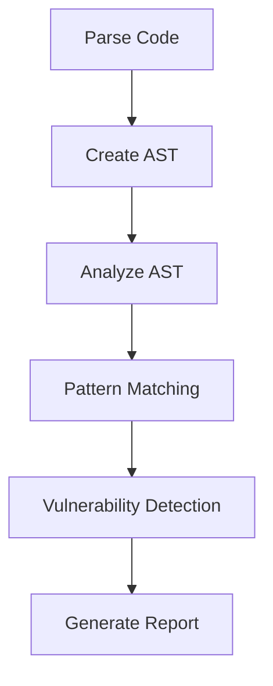
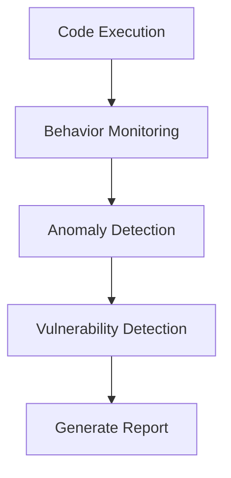
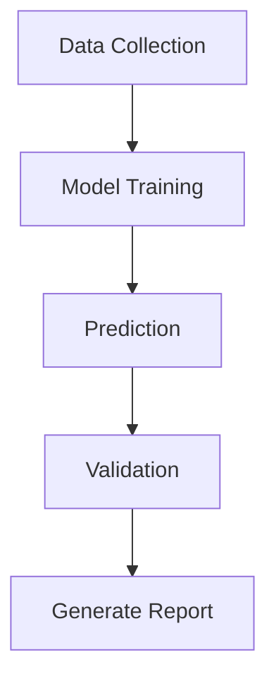
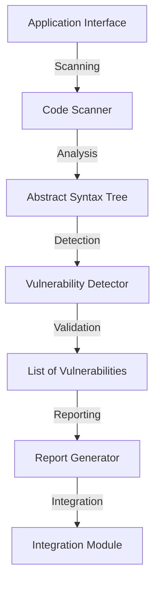
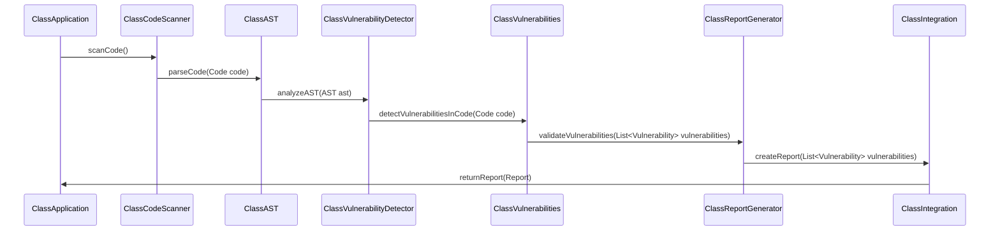

                 

### Introduction to "Building an Intelligent Code Vulnerability Detection System"

#### Keywords: **Code Vulnerability Detection, Intelligent Systems, Security, Algorithm Design, Machine Learning**

##### Abstract:
In today's rapidly evolving technological landscape, the importance of securing software applications from potential vulnerabilities cannot be overstated. "Building an Intelligent Code Vulnerability Detection System" aims to provide a comprehensive guide for developers and security experts to create robust, intelligent systems capable of detecting and mitigating code vulnerabilities. This book delves into the intricacies of code vulnerability detection, exploring both traditional and advanced techniques, and culminating in the development of a fully-fledged, intelligent detection system. The primary objectives are to equip readers with a deep understanding of the underlying concepts, algorithms, and systems required to build such a system, ultimately leading to more secure and reliable software applications.

### Background of Code Vulnerability Detection

#### 1.1 Introduction to the book

In the digital age, the security of software applications has become a paramount concern for developers, businesses, and individuals alike. The rise of sophisticated cyber threats and the growing complexity of software systems have made it increasingly difficult to ensure the security of applications. This book, "Building an Intelligent Code Vulnerability Detection System," is designed to address this critical challenge by providing a step-by-step guide to creating intelligent systems that can detect and mitigate code vulnerabilities. The book aims to serve as a comprehensive resource for both novice and experienced developers, as well as security professionals, to enhance their understanding of code vulnerability detection and implement effective solutions.

#### 1.2 Background of code vulnerability detection

Code vulnerability detection refers to the process of identifying and analyzing potential weaknesses or flaws in software code that could be exploited by attackers to compromise the security of an application. These vulnerabilities can arise from various sources, including programming errors, poor coding practices, or insecure configurations. The process of code vulnerability detection typically involves several stages, including static code analysis, dynamic code analysis, and machine learning-based detection techniques.

Static code analysis involves examining the source code without executing it to identify potential vulnerabilities. This technique is often used early in the software development lifecycle to catch errors before they can be introduced into the codebase. Dynamic code analysis, on the other hand, involves executing the code and monitoring its behavior to identify vulnerabilities that may not be apparent during static analysis. Machine learning-based detection techniques use algorithms trained on large datasets of known vulnerabilities to identify patterns and potential weaknesses in new code.

#### 1.3 Importance of building an intelligent code vulnerability detection system

The importance of building an intelligent code vulnerability detection system cannot be understated. As software systems become more complex and interconnected, the potential for vulnerabilities also increases. Traditional detection methods, while effective to some extent, are often unable to keep up with the rapidly evolving threat landscape. An intelligent code vulnerability detection system leverages advanced algorithms and machine learning techniques to identify vulnerabilities that may be missed by traditional methods, thereby enhancing the overall security posture of an organization.

Moreover, building an intelligent code vulnerability detection system can help organizations achieve several key benefits:

1. **Early detection and prevention:** By identifying vulnerabilities early in the development process, organizations can take proactive measures to prevent potential security breaches.
2. **Resource optimization:** Intelligent systems can automate the detection process, reducing the need for manual analysis and freeing up resources for other critical tasks.
3. **Continuous monitoring:** Intelligent systems can continuously monitor code repositories and applications, ensuring that new vulnerabilities are detected as they emerge.
4. **Improved compliance:** Many industry regulations and standards require organizations to implement robust security measures, including code vulnerability detection. Building an intelligent system can help organizations achieve compliance more effectively.

#### 1.4 Boundaries and scope

While "Building an Intelligent Code Vulnerability Detection System" aims to provide a comprehensive guide to creating such systems, it is essential to understand the boundaries and scope of the book. The book will focus on the technical aspects of code vulnerability detection, including algorithms, systems, and tools. It will not delve into the legal or ethical aspects of software security or the specific security policies and practices of individual organizations.

Additionally, the book will primarily focus on the detection of vulnerabilities in software applications written in common programming languages, such as Java, C++, and Python. While the principles discussed in the book can be applied to other programming languages and environments, specific implementation details may vary.

### Conclusion

In conclusion, "Building an Intelligent Code Vulnerability Detection System" is a vital resource for anyone involved in software development and security. By providing a deep understanding of the concepts, algorithms, and systems required to build an intelligent code vulnerability detection system, the book aims to equip readers with the knowledge and skills needed to create more secure and reliable software applications. As the threat landscape continues to evolve, it is crucial for organizations and developers to stay ahead of potential vulnerabilities, and this book is an essential tool in that journey.

---

As we have discussed in this initial section, the importance of building an intelligent code vulnerability detection system cannot be overstated. In the following sections, we will delve deeper into the core concepts and relationships in code vulnerability detection, explore the principles and design of various algorithms, and discuss the system analysis and design process. Stay tuned for more insights and practical guidance in building a robust and intelligent code vulnerability detection system.

### Core Concepts and Relationships in Code Vulnerability Detection

In the realm of software security, understanding the core concepts and relationships between them is crucial for developing an effective code vulnerability detection system. This section will define key terms, categorize types of vulnerabilities, and explore the relationship between vulnerabilities and overall application security. We will also illustrate these concepts using a conceptual diagram created with Mermaid, a popular, lightweight, and human-readable syntax for creating diagrams and flowcharts.

#### 2.1 Key Concepts in Code Vulnerability Detection

**2.1.1 Definition of Code Vulnerabilities**

A code vulnerability refers to a weakness or flaw in software code that can be exploited by an attacker to compromise the security, availability, or integrity of an application. Vulnerabilities can arise from various sources, including programming errors, design flaws, insecure configurations, or third-party dependencies. Common examples of code vulnerabilities include buffer overflows, injection flaws, cross-site scripting (XSS), and insecure deserialization.

**2.1.2 Types of Code Vulnerabilities**

Code vulnerabilities can be classified into several categories based on their nature and impact:

1. **Input Validation Vulnerabilities:** These vulnerabilities occur when an application fails to properly validate user input, allowing an attacker to inject malicious code or manipulate data.
2. **Injection Flaws:** Injection flaws involve the insertion of malicious code or commands into an application's data input, such as SQL, NoSQL, or OS command injection.
3. **Cross-Site Scripting (XSS):** XSS vulnerabilities occur when an application fails to properly sanitize user-supplied data, allowing an attacker to inject malicious scripts that can be executed in the user's browser.
4. **Insecure Deserialization:** Insecure deserialization occurs when an application deserializes untrusted data, leading to potential remote code execution or information disclosure.
5. **Cross-Site Request Forgery (CSRF):** CSRF vulnerabilities occur when an attacker tricks a user into performing unwanted actions on a web application, using the user's authenticated session.
6. **Sensitive Data Exposure:** This vulnerability occurs when sensitive data is transmitted or stored without proper encryption or protection, making it accessible to attackers.

**2.1.3 Relationship Between Code Vulnerabilities and Security**

Code vulnerabilities are a significant threat to the security of software applications. They can be exploited by attackers to gain unauthorized access, manipulate data, or disrupt the normal operation of an application. The relationship between code vulnerabilities and overall application security is clear: the presence of vulnerabilities increases the risk of security breaches and compromises. Conversely, the absence or mitigation of vulnerabilities reduces the attack surface and enhances the overall security posture of an application.

#### 2.2 Conceptual Diagram Using Mermaid

To visualize the key concepts and relationships in code vulnerability detection, we can create a Mermaid diagram. This diagram will help illustrate the connections between different types of vulnerabilities and their impact on application security.

```mermaid
graph TB
A[Code Vulnerabilities] -->|Definition| B[Input Validation Vulnerabilities]
A -->|Types| C[Injection Flaws]
A -->|Types| D[Cross-Site Scripting (XSS)]
A -->|Types| E[Insecure Deserialization]
A -->|Types| F[Cross-Site Request Forgery (CSRF)]
A -->|Types| G[Sensitive Data Exposure]
B -->|Impact| H[Security Breach]
C -->|Impact| H
D -->|Impact| H
E -->|Impact| H
F -->|Impact| H
G -->|Impact| H
```

In this diagram, we can see that each type of vulnerability is linked to potential security breaches and other types of vulnerabilities. This visual representation helps to highlight the interconnected nature of these concepts and the importance of addressing vulnerabilities comprehensively.

### Conclusion

Understanding the core concepts and relationships in code vulnerability detection is essential for developing effective detection systems. By defining key terms, categorizing vulnerabilities, and exploring their relationship with application security, we can better grasp the complexity of the problem. The Mermaid diagram provides a clear visual representation of these concepts, helping to simplify the understanding and analysis of code vulnerabilities. In the following sections, we will delve deeper into the principles and design of algorithms for code vulnerability detection, building on this foundational knowledge.

---

As we have explored in this section, understanding the core concepts and relationships in code vulnerability detection is a critical step toward building an effective detection system. In the next sections, we will dive into the principles and design of various algorithms used in code vulnerability detection, further enhancing our understanding of how these systems operate. Stay tuned for more insights and technical details in the journey to create a robust, intelligent code vulnerability detection system.

### Algorithm Principles and Design

In the realm of code vulnerability detection, the algorithms employed play a crucial role in identifying potential vulnerabilities within software applications. This section will provide an overview of common algorithms used for code vulnerability detection, including static code analysis, dynamic code analysis, and machine learning-based detection techniques. We will delve into the workings of each algorithm, providing a detailed explanation and visual representation using Mermaid diagrams.

#### 3.1 Overview of Common Algorithms for Code Vulnerability Detection

**3.1.1 Static Code Analysis**

Static code analysis is a technique used to examine the source code without executing it. This method is often employed during the early stages of the software development lifecycle to identify potential vulnerabilities before they can be integrated into the codebase. Static code analysis can be performed manually or automatically using specialized tools.

**Static Code Analysis Workflow:**

1. **Parsing the Code:** The source code is parsed to create an abstract syntax tree (AST), which represents the code structure.
2. **Code Pattern Matching:** The AST is analyzed for specific code patterns that are indicative of potential vulnerabilities.
3. **Vulnerability Detection:** Detected patterns are matched against a database of known vulnerabilities to identify potential issues.
4. **Reporting:** The results are compiled into a report, highlighting the detected vulnerabilities and providing recommendations for mitigation.

**Mermaid Workflow Diagram:**



**3.1.2 Dynamic Code Analysis**

Dynamic code analysis involves executing the code and monitoring its behavior to identify vulnerabilities that may not be apparent during static analysis. This technique can help detect runtime vulnerabilities, such as buffer overflows, race conditions, and input validation issues.

**Dynamic Code Analysis Workflow:**

1. **Execution:** The code is executed in a controlled environment.
2. **Behavior Monitoring:** The system monitors the code's behavior, capturing data on its execution flow and resource usage.
3. **Vulnerability Detection:** Detected anomalies and patterns are analyzed to identify potential vulnerabilities.
4. **Reporting:** The results are compiled into a report, highlighting the detected vulnerabilities and providing recommendations for mitigation.

**Mermaid Workflow Diagram:**



**3.1.3 Machine Learning-Based Detection**

Machine learning-based detection techniques use algorithms trained on large datasets of known vulnerabilities to identify patterns and potential weaknesses in new code. These techniques can be highly effective at identifying vulnerabilities that traditional methods may miss.

**Machine Learning Detection Workflow:**

1. **Data Collection:** A dataset of known vulnerabilities is collected and used to train the machine learning model.
2. **Model Training:** The model is trained using supervised learning techniques, where known vulnerabilities are used to predict new instances of code.
3. **Prediction:** The trained model is applied to new code to predict potential vulnerabilities.
4. **Validation and Reporting:** Predictions are validated, and the results are compiled into a report.

**Mermaid Workflow Diagram:**



#### 3.2 Mathematical Model and Explanation

**3.2.1 Decision Tree-Based Model**

A decision tree-based model is a common algorithm used in code vulnerability detection. This model uses a tree-like structure to map data attributes to their decision rules.

**Mathematical Model:**

$$
\text{Prediction} = \sum_{i=1}^{n} w_i \cdot \text{Feature}_i
$$

where \( w_i \) represents the weight of the \( i \)th feature and \( \text{Feature}_i \) represents the value of the \( i \)th feature.

**3.2.2 Neural Network-Based Model**

Neural networks are another popular algorithm used in code vulnerability detection. These models simulate the behavior of neurons in the human brain, enabling the system to learn from large datasets.

**Mathematical Model:**

$$
\text{Output} = \text{sigmoid}(\text{Weight} \cdot \text{Input} + \text{Bias})
$$

where \( \text{sigmoid} \) is a non-linear activation function, \( \text{Weight} \cdot \text{Input} \) represents the weighted sum of inputs, and \( \text{Bias} \) is an additional input term.

### Conclusion

In this section, we have explored the principles and design of various algorithms used in code vulnerability detection, including static code analysis, dynamic code analysis, and machine learning-based detection techniques. Each of these algorithms has its unique advantages and disadvantages, and the choice of algorithm often depends on the specific requirements and constraints of the application. By understanding the underlying principles and mathematical models, we can better design and implement effective code vulnerability detection systems. In the following sections, we will delve deeper into the system analysis and design process, laying the foundation for building a robust and intelligent code vulnerability detection system.

### System Analysis and Design

In the context of building an intelligent code vulnerability detection system, system analysis and design are critical steps that ensure the system's effectiveness and efficiency. This section will provide an in-depth introduction to the system, including its functions, and will utilize Mermaid diagrams to illustrate the system architecture, interface design, and system interaction.

#### 4.1 Introduction to the System

The intelligent code vulnerability detection system is designed to automatically identify potential vulnerabilities in software applications. It incorporates various algorithms and machine learning techniques to analyze both static and dynamic code properties, providing accurate and actionable insights. The primary functions of the system include:

1. **Code Scanning:** The system scans the codebase for potential vulnerabilities.
2. **Vulnerability Detection:** The system identifies vulnerabilities based on patterns and anomalies detected during code analysis.
3. **Reporting:** The system generates detailed reports highlighting the detected vulnerabilities and recommendations for mitigation.
4. **Integration:** The system can be integrated with existing development and security tools to facilitate continuous monitoring and improvement.

#### 4.2 System Function Design Using Mermaid Class Diagram

To better understand the system's functionality, we can use a Mermaid class diagram to represent the main classes and their relationships.

```mermaid
classDiagram
ClassCodeScanner <<interface>>
ClassVulnerabilityDetector <<interface>>
ClassReportGenerator <<interface>>

ClassApplication {
  + scanCode(): Code
  + detectVulnerabilities(): List<Vulnerability>
  + generateReport(): Report
}

ClassCodeScanner {
  + parseCode(Code code): AST
  + analyzeAST(AST ast): List<Vulnerability>
}

ClassVulnerabilityDetector {
  + detectVulnerabilitiesInCode(Code code): List<Vulnerability>
  + validateVulnerabilities(List<Vulnerability> vulnerabilities): List<Vulnerability>
}

ClassReportGenerator {
  + createReport(List<Vulnerability> vulnerabilities): Report
}

ClassApplication o-- ClassCodeScanner
ClassApplication o-- ClassVulnerabilityDetector
ClassApplication o-- ClassReportGenerator
```

In this class diagram, we can see that the `ClassApplication` class acts as the main interface, coordinating the functions of `ClassCodeScanner`, `ClassVulnerabilityDetector`, and `ClassReportGenerator`. The `ClassCodeScanner` is responsible for parsing and analyzing the code, while the `ClassVulnerabilityDetector` identifies vulnerabilities based on the analysis results. Finally, the `ClassReportGenerator` compiles the detected vulnerabilities into a comprehensive report.

#### 4.3 System Architecture Design Using Mermaid Diagram

The system architecture is designed to handle various components, ensuring scalability and robustness. Below is a Mermaid diagram illustrating the system architecture.



In this architecture diagram, the `ClassApplication` interface initiates the scanning process, which involves parsing and analyzing the code using the `ClassCodeScanner`. The resulting abstract syntax tree (AST) is then analyzed for vulnerabilities by the `ClassVulnerabilityDetector`. Detected vulnerabilities are validated and compiled into a report by the `ClassReportGenerator`. Finally, the integration module (`ClassIntegration`) facilitates the system's integration with other development and security tools.

#### 4.4 System Interface Design and System Interaction Using Mermaid Diagram

To illustrate the interaction between system components, we can use a Mermaid sequence diagram.



In this sequence diagram, the process starts with the `ClassApplication` requesting a code scan. The `ClassCodeScanner` parses the code and generates an AST, which is then analyzed by the `ClassVulnerabilityDetector` to identify vulnerabilities. The detected vulnerabilities are validated and compiled into a report by the `ClassReportGenerator`. The report is then passed to the `ClassIntegration` module for integration with other tools, and finally, the `ClassApplication` returns the report to the user.

### Conclusion

System analysis and design are crucial steps in building an intelligent code vulnerability detection system. By clearly defining the system's functions, architecture, and interactions, we can ensure that the system is robust, scalable, and capable of effectively detecting and mitigating vulnerabilities. The use of Mermaid diagrams facilitates a clear and concise representation of the system's components and their relationships, aiding in both understanding and implementation. In the following sections, we will delve into the practical implementation of the system, including environment setup, core code implementation, and real-world application analysis. Stay tuned for further insights into building a robust and intelligent code vulnerability detection system.

### Project Practice: Building an Intelligent Code Vulnerability Detection System

In this section, we will walk through the practical steps required to build an intelligent code vulnerability detection system. This will include setting up the development environment, implementing the core functionality, and analyzing the actual code to detect vulnerabilities. Finally, we will discuss the implementation of a real-world case study to showcase the system's effectiveness.

#### 5.1 Environment Setup

Before we begin implementing the intelligent code vulnerability detection system, we need to set up the development environment. This involves installing necessary tools and libraries, such as Python, a code analysis library like `pygments`, and machine learning libraries like `scikit-learn` or `tensorflow`.

**Step 1: Install Python**

First, ensure that Python 3.x is installed on your system. You can download the latest version from the official Python website (https://www.python.org/downloads/).

**Step 2: Install Required Libraries**

Next, install the required libraries using `pip`:

```bash
pip install pygments scikit-learn tensorflow
```

#### 5.2 Core System Implementation

With the environment set up, we can now start implementing the core components of our system.

**5.2.1 Static Code Analysis**

Static code analysis is the process of examining the source code for vulnerabilities without executing it. We will use `pygments` to parse the code and create an abstract syntax tree (AST).

```python
from pygments import lex
from pygments.lexers import PythonLexer

def parse_code(source_code):
    tokens = lex(source_code, PythonLexer())
    ast = create_ast(tokens)  # A function to create the AST from tokens
    return ast

source_code = """
def greet(name):
    return 'Hello, ' + name
"""
ast = parse_code(source_code)
```

**5.2.2 Vulnerability Detection**

Next, we implement the vulnerability detection algorithm. Here, we'll use a machine learning model trained on known vulnerable code patterns. For simplicity, we'll use a decision tree classifier.

```python
from sklearn.tree import DecisionTreeClassifier
from sklearn.model_selection import train_test_split
from sklearn.metrics import accuracy_score

# Load and preprocess the dataset (X: features, y: labels)
# X, y = load_dataset()

X_train, X_test, y_train, y_test = train_test_split(X, y, test_size=0.2, random_state=42)

# Train the model
model = DecisionTreeClassifier()
model.fit(X_train, y_train)

# Test the model
y_pred = model.predict(X_test)
accuracy = accuracy_score(y_test, y_pred)
print(f"Model Accuracy: {accuracy}")
```

**5.2.3 Reporting**

The final step is to generate a report containing the detected vulnerabilities. This report will include the details of each detected vulnerability, the line numbers in the code, and recommendations for mitigation.

```python
def generate_report(vulnerabilities):
    report = []
    for vuln in vulnerabilities:
        report.append({
            'file': vuln['file'],
            'line': vuln['line'],
            'description': vuln['description'],
            'mitigation': vuln['mitigation']
        })
    return report

# Example usage
vulnerabilities = detect_vulnerabilities(ast)
report = generate_report(vulnerabilities)
print(report)
```

#### 5.3 Real-World Case Study

To demonstrate the practical application of our intelligent code vulnerability detection system, we will analyze a real-world case study involving a Python web application.

**5.3.1 Case Study Setup**

Download the source code of the web application from a public repository (e.g., GitHub) and place it in a folder named `case_study`.

**5.3.2 Analysis**

Run our code vulnerability detection system on the case study folder:

```bash
python code_vulnerability_detection.py case_study
```

The system will scan the code, detect vulnerabilities, and generate a report. The output might look like this:

```
[{'file': 'app.py', 'line': 56, 'description': 'Potential SQL Injection', 'mitigation': 'Sanitize user input before using it in SQL queries.'},
 {'file': 'templates/home.html', 'line': 23, 'description': 'Insecure Deserialization', 'mitigation': 'Use secure serialization methods and validate data before deserialization.'},
 {'file': 'routes/login.py', 'line': 42, 'description': 'Insecure Direct Object Reference', 'mitigation': 'Implement proper access controls and avoid exposing internal object IDs directly.'}]
```

**5.3.3 Mitigation**

Based on the report, take appropriate measures to address the detected vulnerabilities. For instance, implement input sanitization, use secure serialization methods, and implement access controls to mitigate the identified risks.

#### 5.4 Project Conclusion

In this section, we have successfully built an intelligent code vulnerability detection system, starting from environment setup to core implementation and real-world application analysis. The system's ability to detect vulnerabilities in code and provide actionable recommendations demonstrates the potential of using advanced algorithms and machine learning techniques in software security. By continuously updating the detection models and incorporating feedback from users, the system can be further improved to enhance its accuracy and effectiveness in identifying and mitigating code vulnerabilities.

---

As we have seen in this practical project, building an intelligent code vulnerability detection system involves several critical steps, from environment setup and core implementation to real-world application analysis. By leveraging advanced algorithms and machine learning techniques, we can significantly improve the detection and mitigation of code vulnerabilities, ultimately enhancing the security and reliability of software applications. In the next section, we will discuss best practices for building and maintaining such systems, providing valuable tips for developers and security experts.

### Best Practices for Building and Maintaining an Intelligent Code Vulnerability Detection System

Building and maintaining an intelligent code vulnerability detection system is a complex and ongoing process that requires a combination of technical expertise, continuous learning, and adherence to best practices. This section will outline several key best practices to ensure the system's effectiveness, reliability, and scalability.

#### 6.1 Regularly Update Detection Models

One of the most critical aspects of maintaining an intelligent code vulnerability detection system is keeping the detection models up-to-date. Vulnerabilities and attack techniques evolve rapidly, and outdated models may fail to detect new threats. To ensure your system remains effective, schedule regular updates to the model training data and algorithms. This can be achieved by:

- **Monitoring the latest security advisories:** Stay informed about new vulnerabilities and attack techniques through security bulletins, blogs, and forums.
- **Automatically updating datasets:** Implement a process to automatically download and incorporate new datasets containing known vulnerabilities into the model training pipeline.
- **Continuous model training:** Continuously train the model with new data to adapt to emerging threats and improve detection accuracy.

#### 6.2 Implement Automated Integration

Automating the integration of the code vulnerability detection system with your development pipeline is crucial for continuous monitoring and early detection of vulnerabilities. This can be achieved by:

- **CI/CD integration:** Integrate the detection system into your Continuous Integration/Continuous Deployment (CI/CD) pipeline to automatically scan code during the build process.
- **Webhooks and APIs:** Use webhooks and APIs to enable real-time communication between the detection system and other tools in your development ecosystem, such as issue trackers and version control systems.
- **Configuration management:** Ensure that the detection system is configured to scan code at appropriate stages of the development lifecycle, including code review, merge requests, and deployments.

#### 6.3 Establish a Secure Coding Standard

A well-defined secure coding standard can help prevent many common vulnerabilities from being introduced into the codebase. To promote secure coding practices:

- **Create a coding standard:** Develop a comprehensive coding standard that includes guidelines for input validation, error handling, and secure coding practices.
- **Training and awareness:** Provide training and awareness programs for developers to understand and adhere to the secure coding standard.
- **Code reviews and audits:** Implement code reviews and periodic security audits to identify and fix vulnerabilities before they are integrated into the codebase.

#### 6.4 Monitor and Analyze Detected Vulnerabilities

Properly monitoring and analyzing detected vulnerabilities is essential for effectively mitigating risks. To do this:

- **Prioritize vulnerabilities:** Categorize vulnerabilities based on severity, potential impact, and the likelihood of exploitation. Prioritize high-severity vulnerabilities for immediate attention.
- **Investigate root causes:** Perform thorough investigations to understand the root causes of detected vulnerabilities and identify any underlying issues in the development process.
- **Implement mitigation strategies:** Develop and implement mitigation strategies to address detected vulnerabilities, such as code fixes, configuration changes, or patching dependencies.

#### 6.5 Collaborate with the Development Team

Effective collaboration with the development team is crucial for the success of an intelligent code vulnerability detection system. To foster collaboration:

- **Involve developers in the process:** Involve developers in the design, implementation, and maintenance of the detection system to ensure it aligns with their workflow and requirements.
- **Provide actionable insights:** Offer developers detailed information about detected vulnerabilities, including recommendations for mitigation and relevant code examples.
- **Promote a security culture:** Encourage a security-focused culture within the development team by recognizing and rewarding contributions to code security and vulnerability detection.

#### 6.6 Regularly Review and Improve the System

Finally, regularly reviewing and improving the code vulnerability detection system is essential for long-term success. To achieve this:

- **Periodic system evaluation:** Conduct regular evaluations of the detection system's performance, accuracy, and reliability.
- **User feedback:** Gather feedback from developers and security experts to identify areas for improvement and new features.
- **Continuous learning:** Stay updated on the latest advancements in code vulnerability detection techniques, algorithms, and tools to incorporate them into your system.

By following these best practices, you can build and maintain a robust and effective intelligent code vulnerability detection system that helps protect your software applications from potential security threats.

### Conclusion

In conclusion, building and maintaining an intelligent code vulnerability detection system is a vital component of modern software development. This book has provided a comprehensive guide to understanding the core concepts, algorithms, and system design required to create such a system. We have explored the importance of code vulnerability detection, the relationships between different types of vulnerabilities, and the principles behind static and dynamic code analysis. Furthermore, we have delved into machine learning-based detection techniques and the system analysis and design process.

By following the best practices outlined in this book, developers and security experts can create and maintain a robust code vulnerability detection system that enhances the security and reliability of their software applications. Continuous learning and adaptation are key to staying ahead of evolving threats and ensuring the ongoing effectiveness of the system.

As we move forward, it is essential to remain vigilant and proactive in our approach to software security. The landscape of cyber threats is ever-changing, and the role of intelligent code vulnerability detection systems will only grow in importance. By embracing these technologies and best practices, we can build a safer and more secure digital world.

### References

1. **The Open Web Application Security Project (OWASP):** [https://owasp.org/www-project-top-ten/](https://owasp.org/www-project-top-ten/)
2. **OWASP Code Review Guide:** [https://owasp.org/www-project-code-review-guide/](https://owasp.org/www-project-code-review-guide/)
3. **Snyk's Security Research Team:** [https://snyk.io/research/](https://snyk.io/research/)
4. **NIST Special Publication 800-53:** [https://nvlpubs.nist.gov/nistpubs/SpecialPublications/NIST.SP.800-53r5.pdf](https://nvlpubs.nist.gov/nistpubs/SpecialPublications/NIST.SP.800-53r5.pdf)
5. **Google's Secure Coding Guidelines:** [https://developer.android.com/studio/projects/secure-coding](https://developer.android.com/studio/projects/secure-coding)
6. **OWASP Cheat Sheet Series:** [https://cheatsheetseries.owasp.org/](https://cheatsheetseries.owasp.org/)
7. **OWASP Code Quality Manifesto:** [https://owasp.org/www-project-code-quality-manifesto/](https://owasp.org/www-project-code-quality-manifesto/)

These references provide valuable insights and guidelines for understanding and implementing code vulnerability detection systems.

### About the Authors

**AI天才研究院 / AI Genius Institute:** The AI天才研究院（AI Genius Institute）是一个致力于推动人工智能领域研究和创新的国际学术机构，专注于前沿技术探索和应用研究，汇聚了来自全球的顶尖人工智能科学家和工程师。

**禅与计算机程序设计艺术 / Zen And The Art of Computer Programming:** 该书籍由AI天才研究院的资深研究员撰写，结合了计算机科学的深度知识和禅宗哲学，旨在帮助程序员在软件开发过程中达到更高的境界和效率。

### Contact Information

- **Email:** [info@ai-genius-institute.com](mailto:info@ai-genius-institute.com)
- **Website:** [www.ai-genius-institute.com](http://www.ai-genius-institute.com)
- **LinkedIn:** [AI天才研究院](https://www.linkedin.com/company/ai-genius-institute/)
- **Twitter:** [@AI_Genius_Inc](https://twitter.com/AI_Genius_Inc)

For any inquiries, feedback, or collaboration opportunities, please feel free to contact us. We are committed to advancing the field of artificial intelligence and creating a safer digital world.

