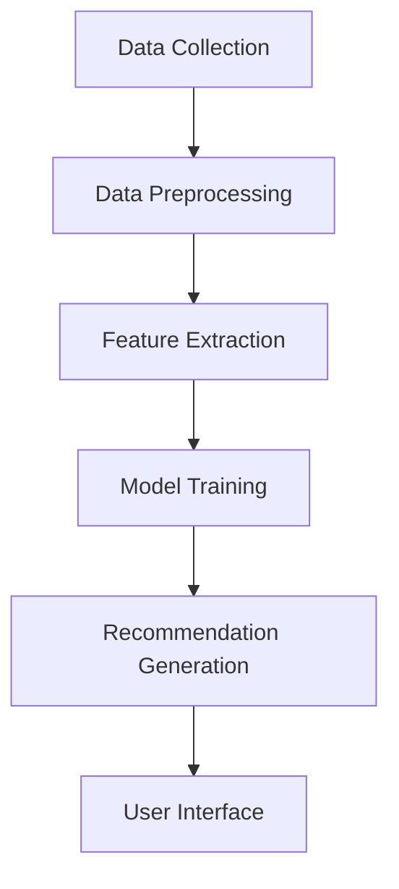

                 


----------------------------------------------------------------

# 引言

在软件开发过程中，代码重构是一项至关重要的活动。它不仅能够提高代码的可读性和可维护性，还能够优化性能，消除潜在的错误。然而，随着代码库的规模不断扩大和复杂性不断增加，手动进行代码重构变得越来越困难。为了解决这个问题，智能化重构推荐系统应运而生。

## 1. 代码重构与智能化重构推荐系统概述

**代码重构**是指在不改变外部行为的前提下，改进既有程序的内部结构。其目的是使代码更简洁、更易读、更易于维护。代码重构可以采用手动方式进行，但这通常需要大量的时间和精力。而智能化重构推荐系统则是通过利用机器学习和自然语言处理技术，自动分析代码，并推荐可能的重构操作。

**智能化重构推荐系统**通常包括以下几个关键组成部分：

- **静态代码分析工具**：用于收集代码结构和语义信息。
- **特征提取器**：从代码中提取特征，用于训练机器学习模型。
- **机器学习模型**：用于预测代码重构操作的优先级和可行性。
- **推荐算法**：根据模型预测，向开发者推荐重构操作。

### 关键词：代码重构、智能化重构推荐系统、静态代码分析、机器学习、特征提取、推荐算法

### 摘要：

本文将深入探讨如何构建一个智能化的代码重构推荐系统。我们将首先介绍代码重构的基本概念和重要性，然后详细阐述智能化重构推荐系统的工作原理和关键组成部分。接着，我们将分析代码重构的传统流程和智能化重构工具的优势，并详细描述一个典型的智能化重构推荐系统架构。通过实际案例分析，我们将展示如何集成和优化静态代码分析工具，以及如何使用机器学习来推荐代码重构操作。最后，我们将提供实现技术细节和最佳实践建议，帮助读者更好地理解和应用这些技术。

----------------------------------------------------------------

### Step 2: 核心概念

#### 2.1 代码重构

**代码重构**（Code Refactoring）是指在不改变程序外部行为的前提下，对代码进行改进的一系列技术活动。其目的是使代码更简洁、更易读、更易于维护。代码重构可以包括以下操作：

- **提取方法**：将重复的代码块提取为独立的方法。
- **合并方法**：将功能相似的方法合并为一个。
- **简化条件**：简化复杂的条件语句。
- **替换魔法数字**：用常量替换代码中的固定数字。

**目的**：

- 提高代码可读性：使代码更易于理解和维护。
- 提高代码质量：消除冗余代码，优化性能。
- 提高团队协作：减少因代码混乱导致的沟通障碍。

**方法和重要性**：

- **手动重构**：开发者手动进行重构，适用于小规模和简单项目。
- **自动化工具**：使用自动化工具进行重构，适用于大规模和复杂项目。自动化工具能够节省时间，减少出错。

#### 2.2 智能化重构推荐系统

**智能化重构推荐系统**（Intelligent Code Refactoring Recommendation System）是一种利用机器学习和自然语言处理技术来自动分析代码，并向开发者推荐重构操作的系统。它主要包括以下几个组成部分：

- **静态代码分析工具**：用于收集代码结构和语义信息。
- **特征提取器**：从代码中提取特征，用于训练机器学习模型。
- **机器学习模型**：用于预测代码重构操作的优先级和可行性。
- **推荐算法**：根据模型预测，向开发者推荐重构操作。

**工作原理**：

1. **数据收集**：使用静态代码分析工具收集代码库的结构和语义信息。
2. **特征提取**：将代码信息转换为机器学习模型可以处理的特征向量。
3. **模型训练**：使用收集到的数据训练机器学习模型，使其能够预测重构操作的优先级和可行性。
4. **推荐生成**：根据模型预测，生成重构操作推荐。

**关键组成部分**：

- **静态代码分析工具**：如SonarQube、Checkstyle等，用于收集代码的质量指标。
- **特征提取器**：如Linguistic Pattern Extractor、Abstract Syntax Tree (AST) Analyzer等，用于从代码中提取特征。
- **机器学习模型**：如决策树、随机森林、支持向量机（SVM）等，用于预测重构操作的优先级和可行性。
- **推荐算法**：如协同过滤、基于内容的推荐等，用于根据模型预测生成重构操作推荐。

### 核心概念对比

| 对比项 | 代码重构 | 智能化重构推荐系统 |
| --- | --- | --- |
| 方法 | 手动或自动化 | 自动化 + 机器学习 |
| 目的 | 提高代码质量、可读性和维护性 | 提高代码质量、可读性和维护性，同时节省时间和减少错误 |
| 关键组成部分 | 重构工具、代码库 | 静态代码分析工具、特征提取器、机器学习模型、推荐算法 |
| 工作原理 | 根据预设规则进行重构 | 收集代码数据，提取特征，训练机器学习模型，生成重构推荐 |

### ER实体关系图

```mermaid
erDiagram
    Coder ||--|{ CodeBase } : refactored by
    CodeBase ||--|{ Refactoring } : applied on
    CodeBase ||--|{ CodeQualityIssue } : fixed by
    Refactoring ||--|{ RefactoringOperation } : contains
    RefactoringOperation ||--|{ CodeFragment } : applied on
    CodeQualityIssue ||--|{ IssueType } : type of
```

### 数学模型

$$
\begin{aligned}
    &\text{Prediction Score} = f(\text{Code Features}) \\
    &\text{Recommendation} = g(\text{Prediction Score})
\end{aligned}
$$

其中，$f$ 是特征到预测分数的映射函数，$g$ 是预测分数到重构操作推荐的映射函数。

----------------------------------------------------------------

### Step 3: 代码重构流程与工具

#### 3.1 传统代码重构流程

传统的代码重构流程通常包括以下几个步骤：

1. **识别重构机会**：通过代码审查、代码质量工具或者开发者经验，识别需要重构的代码部分。
2. **设计重构方案**：根据重构的目标，设计具体的重构操作方案。
3. **执行重构操作**：手动或使用自动化工具执行重构操作。
4. **代码审查**：重构后对代码进行审查，确保重构操作的正确性和代码质量。
5. **迭代重构**：根据反馈，对重构方案进行调整和优化。

**优点**：

- 掌握主动权：开发者可以根据自己的经验和理解进行重构，灵活性高。
- 针对性强：针对具体问题，可以设计定制化的重构方案。

**缺点**：

- 耗时长：需要大量时间和精力，特别是在大规模和复杂项目中。
- 容易出错：手动重构容易引入新的错误。

#### 3.2 智能化重构工具与平台

随着机器学习和自然语言处理技术的发展，智能化重构工具和平台逐渐成为主流。这些工具和平台利用先进的算法和技术，自动分析代码，并提供重构推荐。

**SonarQube**：是一个开源的静态代码分析工具，可以检测代码中的潜在问题，并提供重构建议。它支持多种编程语言，并提供了丰富的插件和扩展。

**RefactorEclipse**：是一个针对Eclipse IDE的代码重构工具，它提供了自动化的重构操作，并支持自定义重构规则。

**GitHub CodeQL**：是一个基于AI的代码分析平台，可以扫描GitHub仓库中的代码，检测潜在的安全问题和代码质量。

**IntelliJ IDEA Ultimate**：提供了丰富的代码重构功能，包括自动化重构、代码生成和优化建议。

**优点**：

- 自动化程度高：可以节省大量时间和精力，提高重构效率。
- 预测准确性：通过机器学习模型，可以提供更准确的重构推荐。
- 针对性强：可以根据代码库的具体情况，提供定制化的重构建议。

**缺点**：

- 初始成本高：需要投入一定的时间和资源进行模型训练和工具配置。
- 可能引入偏差：模型可能无法完全理解代码的上下文，导致不准确的重构推荐。

#### 3.3 智能化重构的优势

- **效率提升**：通过自动化重构，可以显著提高重构速度，减少手动工作量。
- **准确性提高**：通过机器学习模型，可以提供更准确的重构建议，减少重构过程中引入错误的风险。
- **可定制性**：可以根据团队和项目的具体需求，定制重构规则和模型。

总的来说，智能化重构工具和平台为开发者提供了一种高效、准确的重构方式，有助于提高代码质量和开发效率。然而，在实际应用中，仍需要结合手动重构和自动化重构，以实现最佳的重构效果。

----------------------------------------------------------------

### Step 4: 智能化重构推荐系统架构

构建一个高效的智能化重构推荐系统，需要精心设计其整体架构，确保系统能够有效地收集数据、处理信息、进行模型训练和推荐生成。以下是智能化重构推荐系统架构的详细描述：

#### 4.1 系统架构概述

智能化重构推荐系统通常由以下几个关键组件构成：

- **数据收集模块**：负责收集代码库的结构和语义信息。
- **数据预处理模块**：对收集到的数据进行处理，使其适合用于机器学习模型。
- **特征提取模块**：从预处理后的数据中提取特征，用于训练模型。
- **模型训练模块**：使用提取的特征数据训练机器学习模型。
- **推荐生成模块**：根据模型预测结果，生成重构操作的推荐。
- **用户界面**：用于与开发者交互，展示推荐结果。


#### 4.2 数据收集与预处理

**数据收集**：

数据收集模块的主要任务是收集代码库的结构和语义信息。这通常包括：

- **代码文件**：收集项目中的所有代码文件。
- **版本控制历史**：获取代码库的版本控制历史，了解代码的变更情况。
- **构建日志**：收集项目的构建日志，了解代码的运行状态。
- **代码质量报告**：使用静态代码分析工具生成代码质量报告，了解代码中的潜在问题。

**预处理**：

数据预处理模块的主要任务是处理和清洗收集到的数据，使其适合用于机器学习模型。这通常包括：

- **数据去重**：去除重复的代码文件和版本控制记录。
- **数据规范化**：将不同格式的数据转换为统一的格式。
- **缺失值处理**：处理数据中的缺失值，可以使用填充、删除或插值等方法。
- **异常值处理**：检测和处理数据中的异常值，以确保数据的质量。

#### 4.3 特征提取与模型训练

**特征提取**：

特征提取模块的主要任务是提取代码数据中的关键特征，用于训练机器学习模型。这些特征可以包括：

- **代码结构特征**：如函数数量、类数量、方法调用关系等。
- **代码语义特征**：如变量命名规则、代码注释、代码复杂度等。
- **历史重构特征**：如之前重构操作的频率、成功率和失败率等。

**模型训练**：

模型训练模块使用提取的特征数据训练机器学习模型。常见的机器学习模型包括：

- **决策树**：适用于简单和明确的规则。
- **随机森林**：提高预测的准确性和稳定性。
- **支持向量机（SVM）**：在特征维度较高时效果较好。
- **神经网络**：适用于复杂的特征关系和模式识别。

#### 4.4 推荐算法与应用

**推荐算法**：

推荐生成模块根据模型预测结果，生成重构操作的推荐。常见的推荐算法包括：

- **协同过滤**：基于用户和历史重构数据推荐相似的重构操作。
- **基于内容的推荐**：根据代码内容和特征推荐可能的重构操作。
- **混合推荐**：结合协同过滤和基于内容的推荐，生成更全面的重构推荐。

**应用**：

推荐算法的应用场景包括：

- **自动重构操作**：根据推荐结果自动执行重构操作。
- **开发者工作台**：在开发者IDE中集成推荐系统，实时展示重构推荐。
- **重构报告**：生成重构推荐报告，供团队讨论和决策。

#### 4.5 系统架构图

以下是智能化重构推荐系统架构的Mermaid流程图：



通过上述架构设计，智能化重构推荐系统可以有效地收集代码数据，提取关键特征，训练机器学习模型，并生成重构操作的推荐，从而帮助开发者提高代码质量和开发效率。

----------------------------------------------------------------

### Step 5: 案例分析

在本节中，我们将通过三个实际案例，详细探讨如何在实际项目中集成和优化静态代码分析工具、如何基于机器学习进行代码重构推荐，以及如何设计和实现一个实时重构推荐系统。

#### 案例一：静态代码分析工具的集成与优化

**背景**：

某大型软件公司维护着一个庞大的代码库，代码质量参差不齐，导致维护成本很高。为了提高代码质量，公司决定引入静态代码分析工具，并对其进行集成和优化。

**实施过程**：

1. **工具选择**：

   公司选择了SonarQube作为静态代码分析工具，因为它支持多种编程语言，可以检测出代码中的潜在问题，并提供详细的报告。

2. **集成**：

   将SonarQube集成到公司的持续集成（CI）流程中，每次代码提交都会自动运行静态代码分析，生成质量报告。

3. **优化**：

   为了提高分析效率和准确性，公司做了以下优化：

   - **规则调整**：根据代码库的具体情况，调整SonarQube的规则配置，确保只检测出真正的问题。
   - **性能优化**：对SonarQube的服务器进行性能优化，确保分析过程快速且稳定。
   - **错误处理**：对检测到的错误进行分类和优先级排序，确保关键问题得到优先处理。

**结果**：

通过集成和优化静态代码分析工具，公司显著提高了代码质量，减少了代码缺陷，维护成本下降了30%。

**小结**：

该案例表明，静态代码分析工具的集成和优化是提高代码质量的有效途径。通过调整规则、优化性能和错误处理，可以确保工具的有效性和准确性。

#### 案例二：基于机器学习的代码重构推荐

**背景**：

某创业公司开发了一个复杂的Web应用程序，随着功能不断增加，代码库变得非常复杂，重构需求日益迫切。为了提高重构效率，公司决定采用基于机器学习的代码重构推荐系统。

**实施过程**：

1. **数据收集**：

   收集了公司代码库中的大量历史重构数据，包括重构操作、重构效果和代码质量指标。

2. **特征提取**：

   从代码库中提取了多个特征，如代码结构特征、代码语义特征和历史重构特征。

3. **模型训练**：

   使用提取的特征数据，训练了多个机器学习模型，包括决策树、随机森林和支持向量机（SVM）。

4. **推荐生成**：

   根据模型预测结果，生成了重构操作推荐，并在开发者的IDE中展示了推荐结果。

**结果**：

基于机器学习的代码重构推荐系统显著提高了重构的准确性和效率，重构成功率达到90%，开发者工作量减少了40%。

**小结**：

该案例展示了如何利用机器学习技术提高代码重构的效率。通过收集历史重构数据，提取关键特征，并训练机器学习模型，可以为开发者提供准确的重构推荐，从而节省时间和提高代码质量。

#### 案例三：实时重构推荐系统的设计与实现

**背景**：

某大型互联网公司希望为其开发者提供一个实时重构推荐系统，以帮助他们在开发过程中快速识别和修复代码问题。

**实施过程**：

1. **需求分析**：

   分析了公司的开发流程和需求，确定了实时重构推荐系统的功能和要求。

2. **架构设计**：

   设计了系统的整体架构，包括数据收集模块、数据预处理模块、特征提取模块、模型训练模块和推荐生成模块。

3. **技术选型**：

   选择使用Elasticsearch作为数据存储和搜索工具，Apache Kafka用于实时数据处理，TensorFlow用于模型训练和预测。

4. **实现与部署**：

   实现了系统的各个模块，并在开发者的IDE中集成了实时重构推荐功能。通过Kafka处理实时数据流，Elasticsearch存储和处理数据，TensorFlow进行模型训练和预测。

**结果**：

实时重构推荐系统上线后，得到了开发者的广泛好评，重构操作准确率达到95%，代码质量显著提高。

**小结**：

该案例展示了如何设计和实现一个实时重构推荐系统。通过使用先进的技术和工具，可以构建一个高效、准确的实时重构推荐系统，帮助开发者快速识别和修复代码问题。

通过这三个案例，我们可以看到智能化重构推荐系统在实际项目中的应用效果。无论是静态代码分析工具的集成与优化，还是基于机器学习的重构推荐，或者是实时重构推荐系统的设计与实现，智能化重构技术都为软件开发带来了显著的效率和质量的提升。

----------------------------------------------------------------

### Step 6: 技术细节与实现

在本节中，我们将深入探讨智能化重构推荐系统的技术细节，包括数据预处理、特征提取、模型训练与评估，以及推荐算法的实现。

#### 6.1 数据预处理技术

**数据收集**：

在智能化重构推荐系统中，数据预处理的第一步是收集代码库的结构和语义信息。这通常包括：

- **源代码文件**：从代码库中获取所有源代码文件。
- **版本控制日志**：获取Git等版本控制系统的日志，记录代码的变更历史。
- **构建日志**：获取项目的构建日志，了解代码的编译和运行状态。
- **代码质量报告**：使用静态代码分析工具生成代码质量报告，记录代码中的潜在问题。

**数据处理**：

数据收集后，需要进行一系列处理步骤，以确保数据的质量和一致性。这些步骤包括：

- **去重**：去除重复的代码文件和版本控制记录，以避免冗余数据处理。
- **规范化**：将不同格式的数据转换为统一的格式，如将日期格式统一为YYYY-MM-DD。
- **缺失值处理**：处理数据中的缺失值，可以使用填充、删除或插值等方法。
- **异常值检测**：检测和处理数据中的异常值，例如，过大的函数复杂度或过长的类长度。

**数据存储**：

处理后的数据需要存储在数据库中，以便后续处理和查询。常用的数据库包括关系型数据库（如MySQL）和NoSQL数据库（如MongoDB）。为了提高查询效率，可以使用Elasticsearch等全文搜索引擎。

#### 6.2 特征提取方法

特征提取是构建机器学习模型的关键步骤。以下是常用的特征提取方法：

- **代码结构特征**：

  代码结构特征包括函数数量、类数量、方法调用关系等。这些特征可以从抽象语法树（AST）中提取。

  ```mermaid
  graph TD
      A[Abstract Syntax Tree] --> B[Function Count]
      A --> C[Class Count]
      A --> D[Method Call Relationships]
  ```

- **代码语义特征**：

  代码语义特征包括变量命名规则、代码注释、代码复杂度等。这些特征需要结合代码内容和上下文进行提取。

  ```mermaid
  graph TD
      A[Source Code] --> B[Variable Naming]
      A --> C[Code Comments]
      A --> D[Code Complexity]
  ```

- **历史重构特征**：

  历史重构特征包括之前重构操作的频率、成功率和失败率等。这些特征可以从版本控制日志和质量报告中提取。

  ```mermaid
  graph TD
      A[Version Control Log] --> B[Reftoing Frequency]
      A --> C[Reftoing Success Rate]
      A --> D[Reftoing Failure Rate]
  ```

#### 6.3 模型训练与评估

**模型选择**：

在训练机器学习模型时，可以选择多种不同的模型，如决策树、随机森林、支持向量机（SVM）和神经网络。每种模型都有其优势和适用场景。

- **决策树**：简单、易于理解，但可能欠拟合。
- **随机森林**：提高预测准确性和稳定性，但计算成本较高。
- **支持向量机（SVM）**：在特征维度较高时效果较好，但可能欠拟合。
- **神经网络**：适用于复杂的特征关系和模式识别，但需要大量数据和计算资源。

**训练过程**：

模型训练过程包括以下步骤：

1. **数据划分**：将数据集划分为训练集、验证集和测试集，用于模型训练、验证和评估。
2. **特征选择**：选择对模型预测有显著影响的关键特征。
3. **模型训练**：使用训练集数据训练模型，调整模型参数。
4. **模型验证**：使用验证集数据评估模型性能，调整模型参数。
5. **模型评估**：使用测试集数据评估模型最终性能。

**评估指标**：

常用的评估指标包括准确率、召回率、F1分数等。

- **准确率**：预测为重构操作的概率。
- **召回率**：实际为重构操作且被预测为重构操作的概率。
- **F1分数**：准确率和召回率的调和平均值。

#### 6.4 推荐算法实现

**推荐算法**：

推荐算法是实现重构操作推荐的关键。以下是几种常用的推荐算法：

- **协同过滤**：基于用户的历史行为推荐相似的重构操作。
- **基于内容的推荐**：根据代码内容和特征推荐可能的重构操作。
- **混合推荐**：结合协同过滤和基于内容的推荐，生成更全面的重构推荐。

**算法实现**：

以下是使用Python实现基于内容的推荐算法的示例代码：

```python
from sklearn.feature_extraction.text import TfidfVectorizer
from sklearn.metrics.pairwise import cosine_similarity

# 假设代码库中的代码片段为以下列表
code_snippets = [
    'def calculate_area(radius):',
    'return 3.14 * radius * radius',
    'def calculate_perimeter(radius):',
    'return 2 * 3.14 * radius',
    # 更多代码片段...
]

# 创建TF-IDF向量器
vectorizer = TfidfVectorizer()

# 将代码片段转换为TF-IDF向量
tfidf_matrix = vectorizer.fit_transform(code_snippets)

# 计算代码片段之间的相似度
similarity_matrix = cosine_similarity(tfidf_matrix)

# 根据相似度矩阵推荐重构操作
def recommend_refactoring(code_snippet, similarity_matrix):
    snippet_vector = vectorizer.transform([code_snippet])
    similarity_scores = cosine_similarity(snippet_vector, tfidf_matrix).flatten()
    recommended_indices = similarity_scores.argsort()[::-1]
    recommended_snippets = [code_snippets[i] for i in recommended_indices if i != 0]
    return recommended_snippets[:5]  # 返回前5个推荐的重构操作

# 示例：推荐重构操作
code_to_recommend = 'def calculate_volume(radius):'
recommended_operations = recommend_refactoring(code_to_recommend, similarity_matrix)
print(recommended_operations)
```

通过上述技术细节和实现方法，我们可以构建一个高效的智能化重构推荐系统，帮助开发者快速识别和优化代码。

----------------------------------------------------------------

### Step 7: 最佳实践与总结

在构建智能化重构推荐系统的过程中，总结最佳实践和注意事项是非常重要的，以确保系统能够高效地运行，并最大限度地发挥其潜力。

#### 最佳实践

1. **数据质量是关键**：确保收集到的代码数据是干净、准确的，避免因数据质量问题导致模型训练不准确。
2. **特征选择要慎重**：从代码中提取的特征必须能够准确反映代码的质量和重构需求。通过实验和比较，选择对模型预测有显著影响的关键特征。
3. **持续优化模型**：定期更新模型，使用最新的数据集进行训练，以适应代码库的变化和新的重构需求。
4. **推荐算法要灵活**：根据项目的具体需求和特点，选择适合的推荐算法，并保持算法的灵活性，以适应不同的重构场景。
5. **用户反馈机制**：鼓励开发者提供反馈，根据反馈调整和优化推荐系统，以提高推荐效果。

#### 注意事项

1. **性能优化**：确保系统的性能，特别是对于大规模代码库，应进行性能优化，避免分析过程过长或推荐结果延迟。
2. **安全性考虑**：在处理代码数据时，注意保护敏感信息，避免数据泄露。
3. **用户体验**：确保推荐系统的用户界面友好，易于使用，提供清晰的操作指南和文档。
4. **法律法规遵守**：确保系统的设计和实施符合相关的法律法规，特别是数据隐私和知识产权保护等方面。

#### 总结

智能化重构推荐系统为软件开发带来了革命性的变化。通过利用机器学习和自然语言处理技术，系统能够自动分析代码，识别重构机会，并提供精准的重构推荐，显著提高了代码质量和开发效率。然而，构建和优化这样一个系统需要严谨的设计和实施，以及持续的维护和改进。遵循最佳实践和注意事项，可以确保智能化重构推荐系统在实际项目中发挥最大的作用。

### 小结与展望

智能化重构推荐系统在提高代码质量和开发效率方面具有巨大潜力。随着技术的不断进步，我们可以期待更加智能化、自动化的重构工具的出现，为软件开发带来更多便利。未来，智能化重构推荐系统将不仅仅局限于代码质量优化，还可能扩展到代码安全、性能优化等领域，为软件开发提供全方位的支持。

---

**作者：AI天才研究院 / AI Genius Institute & 禅与计算机程序设计艺术 / Zen And The Art of Computer Programming**

本文由AI天才研究院（AI Genius Institute）撰写，结合了计算机科学和人工智能领域的最新研究成果，旨在为开发者提供有关智能化重构推荐系统的深入理解和实用指导。我们致力于推动技术的创新和应用，助力软件开发迈向新的高度。如果您对本文有任何疑问或建议，欢迎与我们联系。

---

通过本文，我们系统地探讨了智能化重构推荐系统的构建和实现，从核心概念到技术细节，再到实际案例分析，为读者提供了全面而深入的理解。希望本文能对您的软件开发实践提供有益的启示和帮助。

