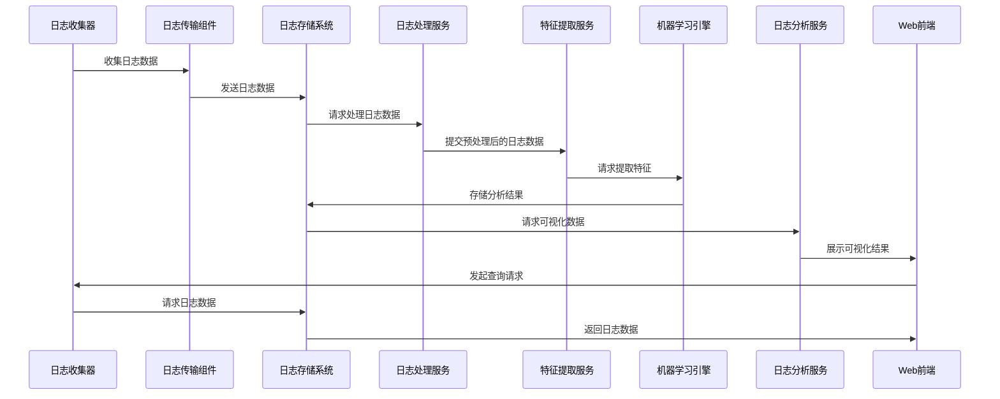

                 

### 1.1 问题背景

#### 1.1.1 日志分析的重要性

在数字化时代，几乎所有的系统和服务都会生成日志。这些日志包含了大量的信息，如用户行为、系统运行状态、错误报告等。对于运维人员、开发人员以及安全专家来说，日志分析是一种至关重要的技术手段。

首先，在系统运维方面，日志分析可以帮助运维团队快速发现系统故障、性能瓶颈和潜在的安全威胁。通过对日志数据的实时监控和分析，运维团队能够及时响应各种问题，确保系统的稳定性和可靠性。

其次，在网络安全领域，日志分析扮演着至关重要的角色。通过分析网络流量日志、防火墙日志、入侵检测系统日志等，安全专家可以识别异常行为，及时发现和阻止网络攻击。

最后，在性能优化方面，日志分析能够帮助开发人员了解系统的运行状况，定位性能瓶颈，从而进行针对性的优化。例如，通过分析请求日志，开发人员可以了解系统的响应时间和请求模式，优化数据库查询、缓存策略等。

然而，随着系统规模的不断扩大，日志数据量也在快速增长。传统的人工日志分析方式已经无法满足日益增长的数据量和分析需求。因此，如何高效地处理和利用日志数据成为了一个迫切需要解决的问题。这就引出了智能化日志分析平台的构建。

#### 1.1.2 日志数据庞杂，如何高效地处理和利用日志数据

传统的日志处理通常包括手动收集、存储、查询和分析。这种方法不仅耗时费力，而且容易出现漏检和误检的情况。随着日志数据量的爆炸性增长，手动处理日志变得越来越不可行。

为了解决这一问题，我们需要构建一个智能化的日志分析平台。这样的平台应该具备以下几个关键功能：

1. **日志收集**：自动化收集来自各种来源的日志数据，包括系统日志、应用日志、网络流量日志等。

2. **日志存储**：高效存储海量日志数据，并支持快速查询和检索。

3. **日志处理**：对日志数据进行预处理，包括过滤、解析、聚合等，以便于后续分析。

4. **日志分析**：利用先进的数据分析技术和机器学习算法，对日志数据进行深度分析，提取有价值的信息。

5. **可视化展示**：通过图形化的界面，直观地展示分析结果，帮助用户快速理解系统状况。

智能化日志分析平台的目标是，通过自动化和智能化的手段，大幅提高日志处理和分析的效率，降低人工成本，同时提升系统运维、安全和性能优化等方面的效果。

### 1.2 核心概念

#### 1.2.1 日志分析的定义

日志分析是一种通过收集、处理和分析系统日志数据，以发现潜在问题、优化系统性能和提升安全防护水平的技术。日志分析的核心目标是提取日志数据中的有用信息，并将其转化为对业务和运维有用的洞见。

- **收集**：日志分析的第一步是收集日志数据。这些数据可以来自各种来源，包括操作系统、应用程序、网络设备等。
- **处理**：收集到的日志数据往往格式多样且杂乱无章，需要进行预处理。预处理包括过滤无关日志、解析日志格式、转换数据格式等。
- **分析**：通过分析预处理后的日志数据，可以发现系统故障、性能瓶颈和安全威胁。分析可以基于统计分析、机器学习等多种方法。
- **可视化**：将分析结果通过图表、仪表板等形式展示出来，使得用户可以直观地了解系统状况。

#### 1.2.2 日志分析的主要目标和任务

日志分析的主要目标和任务包括：

- **故障诊断**：通过分析日志数据，快速定位系统故障的根源。
- **性能监控**：监控系统性能，识别性能瓶颈，优化系统资源利用。
- **安全检测**：分析日志数据，发现潜在的安全威胁，进行风险预警和应对。
- **业务优化**：通过对用户行为日志的分析，优化业务流程和用户体验。

日志分析不仅仅是一项技术手段，更是一种系统运维和业务优化的方法论。它通过对日志数据的深入挖掘和分析，帮助组织提高运营效率，降低风险，提升用户体验。

#### 1.2.3 日志数据格式

日志数据格式是日志分析中的基础概念，不同类型的系统产生的日志数据格式各异，常见的日志数据格式包括：

- **Syslog**：Syslog是一种标准化的日志记录协议，广泛应用于Unix和Linux系统中。Syslog日志通常以文本格式记录，包含时间戳、源IP地址、设备名称等信息。
  
- **JSON**：JSON（JavaScript Object Notation）是一种轻量级的数据交换格式，易于人机解析。JSON格式的日志通常包含丰富的结构化信息，如时间戳、用户ID、请求URL等。

- **CSV**：CSV（Comma Separated Values）是一种基于文本的格式，通过逗号分隔各个字段，常用于数据导出和交换。

不同格式的日志数据有其独特的特点和适用场景：

- **Syslog**：适合记录简单的事件日志，便于系统级别的监控和报警。
- **JSON**：适合记录复杂的业务日志，便于后续的数据处理和分析。
- **CSV**：适合记录结构化的数据，便于简单的数据查询和导入导出。

了解并掌握不同日志数据格式，有助于选择合适的日志处理和分析工具，提升日志分析的效果。

#### 1.3 日志分析流程

日志分析流程是确保日志数据能够被高效、准确地处理和分析的关键步骤。一个完整的日志分析流程通常包括以下环节：

##### 1.3.1 日志收集

日志收集是日志分析流程的起点。日志收集的目的是将来自各种来源的日志数据汇总到一个统一的地方，以便于后续处理和分析。

- **方法**：日志收集可以通过以下方法实现：
  - **脚本监控**：使用脚本定期扫描系统日志目录，收集新的日志文件。
  - **日志代理**：部署专门的日志代理服务器，通过网络收集远程系统的日志数据。
  - **系统API**：利用系统提供的API接口，直接获取系统日志数据。

- **工具**：常用的日志收集工具有：
  - **Logstash**：一款强大的日志收集和传输工具，能够处理各种格式的日志数据，并支持与Elasticsearch等存储工具的集成。
  - **Fluentd**：类似于Logstash的日志收集和转发工具，轻量级且易于配置。

##### 1.3.2 日志存储

日志收集后，需要将日志数据存储到一个可靠、高效的存储系统中，以便于后续的查询和分析。

- **方案**：
  - **关系数据库**：适用于存储结构化数据，如CSV格式的日志数据。
  - **NoSQL数据库**：适用于存储非结构化或半结构化数据，如JSON格式的日志数据。常用的NoSQL数据库包括Elasticsearch、MongoDB等。
  - **文件系统**：适用于小规模日志数据的存储，如简单的文本日志文件。

- **技术**：
  - **Elasticsearch**：一款高性能、可伸缩的全文搜索引擎，适用于存储和查询大量结构化日志数据。
  - **Kafka**：一款分布式消息队列系统，适用于高吞吐量的日志数据收集和存储。

##### 1.3.3 日志处理

日志处理是对收集和存储的日志数据进行预处理，以便于后续的分析。日志处理包括以下几个步骤：

- **过滤**：去除无关或无效的日志数据，提高数据质量。
- **解析**：将日志数据解析成结构化的数据格式，如JSON或CSV。
- **聚合**：将相同或相关的日志数据聚合在一起，以便于批量处理和分析。

- **工具**：
  - **Logstash**：能够进行复杂的日志处理任务，包括过滤、解析、聚合等。
  - **Grok**：一种用于日志数据解析的工具，基于正则表达式，能够快速将日志数据解析成结构化格式。

##### 1.3.4 日志分析

日志分析是日志分析流程的核心环节，通过对处理后的日志数据进行深入分析，提取有价值的信息。

- **方法**：
  - **统计分析**：通过计算日志数据的统计指标，如最大值、最小值、平均值等，分析日志数据的基本特征。
  - **机器学习**：利用机器学习算法，对日志数据进行分类、预测等高级分析。
  - **关联分析**：通过分析日志数据之间的关联关系，发现潜在的问题和趋势。

- **工具**：
  - **Kibana**：一款强大的日志分析工具，能够提供直观的图表和仪表板，帮助用户快速理解日志分析结果。
  - **Grafana**：一款开源的监控和数据可视化工具，支持多种数据源，包括Elasticsearch等。

##### 1.3.5 日志展示

日志展示是将分析结果以图形化、可视化的方式展示给用户，使得用户可以直观地了解系统状况。

- **方式**：
  - **仪表板**：通过仪表板将不同的分析结果集中展示，方便用户快速查看关键指标。
  - **报告**：定期生成日志分析报告，详细记录分析结果和发现的问题。

- **工具**：
  - **Kibana**：提供了丰富的可视化组件，可以构建复杂的仪表板。
  - **Grafana**：支持多种图表类型，可以自定义报告模板。

通过以上五个环节，日志分析流程能够将杂乱的日志数据转化为对业务和运维有用的洞见，帮助组织提高运营效率，降低风险。

#### 1.4 智能化日志分析

##### 1.4.1 智能化日志分析的定义

智能化日志分析是一种利用先进的数据分析技术和机器学习算法，对日志数据进行深度挖掘和分析的方法。它通过自动化的手段，提高日志处理的效率，增强日志分析的能力。

智能化日志分析的核心在于“智能化”，它不仅仅是对日志数据的简单处理和查询，而是通过机器学习算法，对日志数据进行模式识别、异常检测和预测分析。

##### 1.4.2 智能化日志分析的优势

智能化日志分析具有以下几个显著优势：

1. **效率提升**：传统的日志分析往往依赖于人工处理，而智能化日志分析通过自动化手段，大幅提高了处理效率。例如，使用机器学习算法，可以自动识别和分类日志数据，减少人工干预。

2. **准确性增强**：智能化日志分析能够通过大数据和机器学习技术，识别复杂的日志模式，提高异常检测的准确性。例如，通过对海量日志数据的分析，可以准确预测潜在的安全威胁，提前采取措施。

3. **自动化分析**：智能化日志分析能够实现自动化分析，减少人工工作量。例如，通过设置规则，系统可以自动触发告警，通知运维团队处理问题。

4. **实时响应**：智能化日志分析支持实时数据流处理，可以快速响应当前系统的变化。例如，在发生故障时，系统可以立即生成告警，指导运维人员快速定位和解决问题。

##### 1.4.3 智能化日志分析的适用场景

智能化日志分析适用于多种场景：

1. **系统运维**：通过实时监控和日志分析，运维团队能够快速发现系统故障、性能瓶颈和潜在威胁，确保系统稳定运行。

2. **网络安全**：通过分析网络日志和流量数据，智能化日志分析可以帮助安全团队发现入侵行为、恶意流量等，提升网络安全防护水平。

3. **性能优化**：通过对日志数据的分析，开发人员可以了解系统的运行状况，识别性能瓶颈，优化系统性能。

4. **业务监控**：通过对业务日志的分析，企业可以了解用户行为、业务流程，优化业务策略，提升用户体验。

##### 1.4.4 智能化日志分析的实施步骤

实施智能化日志分析通常包括以下几个步骤：

1. **数据收集**：收集来自各种系统的日志数据，包括操作系统日志、应用日志、网络日志等。

2. **数据预处理**：对收集到的日志数据进行预处理，包括过滤、解析、转换等，将日志数据转换为结构化格式。

3. **特征提取**：从预处理后的日志数据中提取关键特征，为后续的机器学习算法提供输入。

4. **模型训练**：使用机器学习算法，对提取的特征进行训练，建立预测模型或分类模型。

5. **模型评估**：通过验证集或测试集评估模型的准确性、召回率等指标，调整模型参数，优化模型性能。

6. **部署应用**：将训练好的模型部署到生产环境中，实现自动化日志分析。

7. **持续优化**：根据实际运行情况，不断优化和更新模型，提高日志分析的效果。

#### 1.5 本章小结

本章节介绍了日志分析的重要性以及如何高效地处理和利用日志数据。首先，我们讨论了日志分析在系统运维、网络安全和性能优化等领域的重要性，并提出了传统日志分析面临的挑战。接着，我们详细介绍了日志分析的核心概念、主要目标和任务，以及不同日志数据格式的特点和适用场景。此外，我们还探讨了日志分析的流程，包括日志收集、日志存储、日志处理、日志分析和日志展示等环节。最后，我们介绍了智能化日志分析的定义、优势、适用场景和实施步骤。通过本章的学习，读者可以了解日志分析的基本原理和实践方法，为后续构建智能化日志分析平台奠定基础。

### 2.1 日志分析概念与联系

#### 2.1.1 日志分析概念

日志分析是一种通过收集、处理和分析系统日志数据，以发现潜在问题、优化系统性能和提升安全防护水平的技术。日志分析的核心目标是提取日志数据中的有用信息，并将其转化为对业务和运维有用的洞见。

- **收集**：日志分析的第一步是收集日志数据。这些数据可以来自各种来源，包括操作系统、应用程序、网络设备等。
- **处理**：收集到的日志数据往往格式多样且杂乱无章，需要进行预处理。预处理包括过滤无关日志、解析日志格式、转换数据格式等。
- **分析**：通过分析预处理后的日志数据，可以发现系统故障、性能瓶颈和安全威胁。分析可以基于统计分析、机器学习等多种方法。
- **可视化**：将分析结果通过图表、仪表板等形式展示出来，使得用户可以直观地了解系统状况。

#### 2.1.2 日志分析与其他相关概念的联系

日志分析不仅是一项独立的技术手段，还与系统运维、网络安全、性能优化等概念密切相关。

- **系统运维**：日志分析是系统运维的重要工具。通过对系统日志的分析，运维团队能够及时发现系统故障、性能瓶颈和潜在的安全威胁，确保系统的稳定性和可靠性。

- **网络安全**：日志分析在网络安全领域同样至关重要。通过分析网络流量日志、防火墙日志、入侵检测系统日志等，安全专家可以识别异常行为，及时发现和阻止网络攻击。

- **性能优化**：日志分析可以帮助开发人员了解系统的运行状况，定位性能瓶颈，从而进行针对性的优化。例如，通过分析请求日志，开发人员可以了解系统的响应时间和请求模式，优化数据库查询、缓存策略等。

- **数据挖掘**：日志分析可以视为数据挖掘的一种应用。数据挖掘是从大量数据中提取有价值信息的过程，而日志分析则是针对系统日志数据进行的数据挖掘。

- **机器学习**：机器学习是日志分析的重要工具。通过训练机器学习模型，可以从大量日志数据中自动提取特征，进行故障诊断、异常检测和预测分析。

#### 2.1.3 日志分析的核心要素

日志分析的核心要素包括以下几个方面：

- **日志收集**：高效的日志收集是日志分析的基础。日志收集需要覆盖各种系统和应用，确保日志数据的全面性和完整性。

- **日志存储**：可靠的日志存储是日志分析的前提。日志存储需要支持快速查询和检索，以便于实时监控和分析。

- **日志处理**：完善的日志处理是日志分析的保障。日志处理包括过滤、解析、聚合等步骤，确保日志数据的准确性和一致性。

- **日志分析**：强大的日志分析是日志分析的核心。通过统计分析、机器学习等方法，可以从大量日志数据中提取有价值的信息。

- **可视化展示**：直观的日志展示是日志分析的补充。通过图表、仪表板等形式，可以直观地展示分析结果，帮助用户快速理解系统状况。

#### 2.1.4 日志分析的优势和挑战

日志分析的优势包括：

- **实时监控**：日志分析可以实时监控系统的运行状况，快速发现问题和异常。

- **全面覆盖**：日志分析可以覆盖各种系统和应用，提供全面的监控和分析。

- **数据驱动**：日志分析基于数据驱动，通过分析日志数据，可以深入了解系统的运行情况和用户行为。

- **自动化处理**：日志分析可以通过自动化手段，减少人工干预，提高处理效率。

然而，日志分析也面临一些挑战：

- **数据量大**：随着系统规模的扩大，日志数据量急剧增长，如何高效地处理海量日志数据是一个重大挑战。

- **多样性和复杂性**：不同系统和应用的日志数据格式多样，如何统一格式并进行有效处理是一个难题。

- **实时性和一致性**：日志分析需要支持实时监控和快速响应，同时保证数据的一致性和准确性。

- **安全性和隐私**：日志分析涉及到敏感数据，如何确保数据的安全性和用户隐私是一个重要问题。

综上所述，日志分析是一项复杂而重要的技术手段，它通过高效处理和分析日志数据，帮助组织提高运营效率、降低风险和提升用户体验。理解日志分析的核心概念和与其他相关概念的联系，有助于更好地实施和优化日志分析流程。

#### 2.2 日志数据格式与联系

##### 2.2.1 日志数据格式

日志数据格式是指系统、应用或其他设备生成日志时所采用的文本或数据结构。不同的日志格式有不同的优点和用途，下面介绍几种常见的日志数据格式：

- **Syslog**：
  - **定义**：Syslog（System Logging Protocol）是一种基于UDP协议的日志记录标准，广泛用于Unix和Linux系统。
  - **特点**：Syslog日志通常包含时间戳、设备名、进程ID、消息等级等信息，格式灵活，适用于系统级别的监控和报警。
  - **示例**：`<34>Mar 12 16:26:41 host01 kernel: [5569] kernel panic: Attempted to kill init!`

- **JSON**：
  - **定义**：JSON（JavaScript Object Notation）是一种轻量级的数据交换格式，易于人机解析。
  - **特点**：JSON格式支持复杂的数据结构，可以包含时间戳、用户ID、请求URL、请求参数等多种信息，非常适合业务日志和应用程序日志。
  - **示例**：```{"timestamp":"2023-03-12T16:26:41Z","level":"INFO","service":"webserver","message":"User with ID 123 logged in."}```

- **CSV**：
  - **定义**：CSV（Comma Separated Values）是一种基于文本的格式，通过逗号分隔各个字段。
  - **特点**：CSV格式简单易读，适用于结构化数据的存储和交换，常用于导出和导入数据。
  - **示例**：`timestamp,level,service,message\n2023-03-12T16:26:41Z,INFO,webserver,User with ID 123 logged in.`

- **XML**：
  - **定义**：XML（eXtensible Markup Language）是一种用于表示结构化数据的标记语言。
  - **特点**：XML格式具有自我描述性，可以定义自定义标签和属性，适合用于复杂的数据结构和文档。
  - **示例**：```<log><timestamp>2023-03-12T16:26:41Z</timestamp><level>INFO</level><service>webserver</service><message>User with ID 123 logged in.</message></log>```

##### 2.2.2 日志数据格式之间的联系

不同日志数据格式之间存在着一定的联系和差异。以下是对几种常见日志数据格式的联系和差异的讨论：

- **共同点**：
  - **文本格式**：所有的日志数据格式都是基于文本的，易于存储和传输。
  - **结构化**：无论是Syslog、JSON、CSV还是XML，它们都支持结构化的数据表示，使得日志数据可以被解析和分析。

- **差异**：
  - **格式复杂度**：Syslog和CSV相对简单，XML和JSON较为复杂。Syslog主要关注系统级别的日志记录，而JSON和XML则适用于业务和应用日志。
  - **解析难度**：JSON和XML的解析相对复杂，需要解析器来解析其结构化的内容。CSV的解析相对简单，可以通过简单的字符串分割实现。
  - **扩展性**：XML具有较好的扩展性，可以定义自定义标签和属性，适合复杂的数据结构。JSON也具有较好的扩展性，但相比XML更轻量级。

- **转换方法**：
  - **格式转换**：为了实现不同格式日志数据之间的互操作性，可以采用格式转换的方法。例如，可以使用工具将XML格式转换为JSON格式，或将CSV格式转换为JSON格式。
  - **API接口**：可以通过API接口实现不同格式日志数据的访问和转换。例如，可以使用HTTP API接口获取XML格式的日志数据，并使用JSON解析器处理这些数据。

#### 2.2.3 日志数据格式选择与使用场景

在选择日志数据格式时，需要考虑以下几个方面：

- **系统需求**：根据系统的需求和特点选择合适的日志数据格式。例如，系统级监控可以选择Syslog格式，而业务应用可以选择JSON或XML格式。
- **数据处理能力**：考虑系统的数据处理能力，选择易于处理和存储的日志数据格式。例如，CSV格式简单易读，适合数据量较小的系统。
- **分析工具支持**：选择支持良好的日志数据格式，便于使用现有的日志分析工具。例如，Elasticsearch支持JSON格式，Kibana支持JSON和XML格式。

总之，日志数据格式在日志分析中扮演着重要角色。通过了解不同日志数据格式的特点和适用场景，可以更好地选择和使用日志数据格式，提升日志分析的效果。

#### 2.3 日志分析流程与联系

##### 2.3.1 日志分析流程

日志分析流程是一个系统化的过程，通过一系列有序的步骤来处理和分析日志数据，以发现潜在的问题和优化系统性能。一个典型的日志分析流程包括以下几个主要环节：

1. **日志收集**：从各个系统和应用中收集日志数据。日志收集可以采用多种方法，如脚本监控、日志代理和网络接口捕获等。日志收集的目的是确保所有相关的日志数据都能被集中收集到一个统一的地方，为后续的处理和分析做准备。

2. **日志存储**：将收集到的日志数据存储到一个可靠的存储系统中。日志存储系统需要具备高效的数据检索能力，以便在需要时能够快速查询和分析日志数据。常用的日志存储系统包括Elasticsearch、Kafka和文件系统等。

3. **日志处理**：对存储的日志数据进行预处理，以使其符合后续分析的要求。日志处理包括过滤无关日志、解析日志格式、转换数据格式和聚合日志数据等步骤。预处理步骤的目的是提高数据质量和一致性，便于后续的分析。

4. **日志分析**：使用各种分析技术对预处理后的日志数据进行深度分析。日志分析可以采用统计分析、机器学习、模式识别等方法，以发现潜在的问题、性能瓶颈和安全威胁。分析结果可以通过图表、仪表板等形式展示，帮助用户直观地了解系统状况。

5. **日志展示**：将日志分析的结果以图形化、可视化的方式展示给用户。日志展示可以通过Kibana、Grafana等工具实现，提供丰富的图表、仪表板和报告功能，使用户能够快速理解和利用分析结果。

##### 2.3.2 日志分析流程中的各个环节及其联系

日志分析流程中的各个环节相互关联，共同构成了一个完整的日志分析体系。以下是对各个环节及其联系的详细说明：

1. **日志收集**：
   - **与日志存储的联系**：日志收集的目的是将日志数据存储到日志存储系统中。日志收集工具需要能够与日志存储系统进行通信，将日志数据发送到存储系统中。
   - **与日志处理的联系**：收集到的日志数据可能需要经过预处理才能进行分析。日志收集工具通常会提供预处理功能，如过滤无关日志、解析日志格式等。

2. **日志存储**：
   - **与日志处理的联系**：日志处理需要对存储在日志存储系统中的数据进行预处理。日志处理工具需要能够访问日志存储系统，读取日志数据并进行处理。
   - **与日志分析的联系**：日志分析工具需要能够访问日志存储系统，从存储的日志数据中提取有价值的信息进行深度分析。

3. **日志处理**：
   - **与日志收集的联系**：日志处理通常在日志收集之后进行，处理结果通常会返回给日志收集工具或日志存储系统。
   - **与日志分析的联系**：预处理后的日志数据是日志分析的基础。日志处理工具需要确保处理后的数据质量，以便于日志分析工具能够准确地进行后续分析。

4. **日志分析**：
   - **与日志收集的联系**：日志分析需要收集到的日志数据作为输入，因此日志收集的效率和质量直接影响日志分析的效果。
   - **与日志处理的联系**：日志分析需要基于处理后的日志数据，因此日志处理的结果直接影响日志分析的准确性和效率。

5. **日志展示**：
   - **与日志分析的联系**：日志展示是将日志分析结果以图形化、可视化的方式展示给用户的过程。日志展示工具需要能够访问日志分析结果，将其呈现给用户。
   - **与日志收集、存储和处理的联系**：日志展示工具需要能够访问日志收集、存储和处理的结果，以便于用户能够全面了解系统状况。

综上所述，日志分析流程中的各个环节相互联系、相互依赖，共同构成了一个完整的日志分析体系。通过优化各个环节的效率和效果，可以提升整个日志分析流程的效能，帮助组织更好地管理和利用日志数据。

#### 2.4 智能化日志分析的概念与联系

##### 2.4.1 智能化日志分析的概念

智能化日志分析是指利用人工智能和机器学习技术对日志数据进行处理和分析的一种方法。与传统日志分析相比，智能化日志分析具有更高的自动化程度和更强的分析能力，能够从海量日志数据中快速提取有价值的信息，并发现潜在的问题和异常。

- **自动化**：智能化日志分析通过算法自动处理日志数据，减少了人工干预，提高了处理效率。
- **深度分析**：智能化日志分析能够利用机器学习算法对日志数据进行深度分析，提取隐藏的模式和趋势，提供更准确的洞见。
- **实时性**：智能化日志分析可以实时处理和分析日志数据，快速响应当前系统的变化，提高问题检测和响应的速度。

##### 2.4.2 智能化日志分析的优势

智能化日志分析具有以下几个显著优势：

1. **提高效率**：通过自动化处理，智能化日志分析可以大幅减少人工工作量，提高日志处理的效率。

2. **增强准确性**：利用机器学习算法，智能化日志分析能够识别复杂的日志模式，提高异常检测和故障诊断的准确性。

3. **实时响应**：智能化日志分析支持实时数据处理，可以快速发现系统故障和异常，及时采取应对措施。

4. **可扩展性**：智能化日志分析可以轻松适应不同的系统和应用，通过调整算法和模型，可以适用于各种不同的日志分析场景。

##### 2.4.3 智能化日志分析与其他相关概念的联系

智能化日志分析与其他几个关键概念紧密相关：

1. **机器学习**：机器学习是智能化日志分析的核心技术。通过训练机器学习模型，可以自动识别日志数据中的异常行为和模式，提高日志分析的效果。

2. **大数据**：智能化日志分析需要处理海量日志数据，大数据技术提供了有效的数据存储、处理和分析手段，是智能化日志分析的重要基础。

3. **物联网**：随着物联网设备的普及，智能化日志分析可以应用于更多的设备和场景，实现对各种物联网设备的日志数据进行处理和分析。

4. **云计算**：云计算提供了灵活、可扩展的计算和存储资源，为智能化日志分析提供了强大的技术支持。

##### 2.4.4 智能化日志分析在实践中的应用场景

智能化日志分析在多个应用场景中发挥了重要作用：

1. **系统运维**：通过智能化日志分析，运维团队能够实时监控系统的运行状况，快速发现和解决故障，提高系统稳定性。

2. **网络安全**：智能化日志分析可以帮助安全团队识别和防范网络攻击，提高网络安全防护水平。

3. **性能优化**：通过分析系统日志，智能化日志分析可以发现性能瓶颈和资源利用率问题，帮助开发人员和运维团队进行系统优化。

4. **业务监控**：智能化日志分析可以帮助企业监控业务运行状况，分析用户行为，优化业务流程，提升用户体验。

总之，智能化日志分析通过自动化和智能化的手段，显著提升了日志分析的效果和效率，为各种应用场景提供了强有力的支持。

### 2.5 本章小结

本章首先介绍了日志分析的基本概念和重要性，明确了日志分析在系统运维、网络安全和性能优化等方面的应用价值。接着，我们详细阐述了日志分析的主要目标和任务，以及不同日志数据格式（如Syslog、JSON、CSV和XML）的特点和应用场景。然后，我们探讨了日志分析流程的各个环节，包括日志收集、日志存储、日志处理、日志分析和日志展示，并分析了它们之间的联系。此外，本章还介绍了智能化日志分析的概念、优势及其与其他相关概念（如机器学习、大数据和云计算）的联系。通过本章的学习，读者可以全面了解日志分析的基本原理和实践方法，为后续构建智能化日志分析平台打下坚实基础。

### 3.1 算法原理

在日志分析中，算法原理起着至关重要的作用。不同的算法适用于不同的分析任务，能够从海量日志数据中提取有价值的信息，为系统运维、安全防护和性能优化提供支持。以下是几种常见的日志分析算法及其原理：

#### 3.1.1 统计分析方法

统计分析方法是一种基本的日志分析技术，它通过计算数据的基本统计指标，如平均值、中位数、标准差等，来分析日志数据。统计分析方法主要用于以下场景：

1. **性能监控**：通过计算请求响应时间、系统负载等指标，分析系统的性能表现。
2. **错误诊断**：通过统计错误日志的出现频率和分布情况，识别常见的系统错误。

统计分析方法的优点在于计算简单、速度快，适用于大规模数据的初步分析。然而，它对异常值的敏感性较低，难以发现复杂的日志模式。

#### 3.1.2 聚类分析方法

聚类分析方法是一种无监督学习技术，它通过将相似的数据点分组在一起，形成多个聚类。聚类分析在日志分析中的应用主要包括：

1. **日志异常检测**：通过聚类分析，可以将正常日志与异常日志分开，发现潜在的异常行为。
2. **用户行为分析**：通过聚类用户行为日志，可以识别不同类型的用户群体，为个性化服务和营销策略提供依据。

常用的聚类算法包括K-Means、DBSCAN等。聚类分析方法的优点是能够自动发现数据中的模式，减少人工干预。然而，聚类算法对初始参数选择敏感，且不能直接得出聚类结果的解释。

#### 3.1.3 机器学习分析方法

机器学习分析方法是一种基于数据驱动的方法，通过训练模型，对新的日志数据进行分类、预测等高级分析。常用的机器学习算法包括：

1. **分类算法**：如逻辑回归、支持向量机（SVM）、随机森林等，用于将日志数据分类为正常或异常。
2. **回归算法**：如线性回归、决策树回归等，用于预测日志数据中的连续值，如响应时间、资源消耗等。

机器学习分析方法能够处理复杂数据，发现深层次的规律和模式，但需要大量的数据和计算资源，且模型的解释性较差。

#### 3.1.4 时序分析方法

时序分析方法是一种专门用于处理时间序列数据的分析方法，它可以分析数据在时间维度上的变化趋势和周期性特征。常见的时序分析方法包括：

1. **时间序列分解**：通过分解时间序列数据，将其分为趋势、季节性和随机成分，以识别数据的长期趋势和周期性波动。
2. **时间序列预测**：使用ARIMA、LSTM等模型对时间序列数据进行预测，以预测未来的趋势和波动。

时序分析方法适用于日志数据的长期监控和预测，可以帮助企业进行资源规划和风险管理。

#### 3.1.5 图分析算法

图分析算法是一种用于处理复杂关系的分析方法，通过将日志数据表示为图，分析节点和边的关系，发现数据之间的关联性。常见的图分析算法包括：

1. **图遍历算法**：如DFS和BFS，用于遍历图中的节点，分析节点之间的连接关系。
2. **图聚类算法**：如GMM（图均值聚类），用于将图中的节点分组，识别图中的社区结构。

图分析算法适用于复杂日志数据的关联性分析，可以帮助企业识别关键业务流程和潜在的风险点。

### 3.1.6 混合算法

在实际应用中，单一的算法往往无法满足复杂的日志分析需求，因此，常常需要使用混合算法。混合算法将多种算法结合起来，发挥各自的优势，提高分析效果。例如，可以将统计分析方法与机器学习算法结合，先用统计分析方法进行初步筛选，再用机器学习算法进行深度分析。

#### 3.1.7 算法选择与优化

选择合适的算法对于日志分析的效果至关重要。在选择算法时，需要考虑以下因素：

1. **数据类型**：根据日志数据的特点，选择适合的数据分析算法。例如，对于结构化日志数据，可以选择统计分析或机器学习算法；对于非结构化日志数据，可以选择图分析算法。
2. **分析目标**：根据分析任务的需求，选择适合的算法。例如，对于故障诊断，可以选择分类算法；对于性能预测，可以选择回归算法。
3. **计算资源**：考虑系统的计算资源，选择计算效率高的算法。例如，对于大规模数据处理，可以选择并行计算算法。

算法优化是提升日志分析效果的重要手段。常见的算法优化方法包括：

1. **特征工程**：通过选择和构造合适的特征，提高模型的准确性和泛化能力。
2. **模型调参**：通过调整模型的参数，优化模型的性能。
3. **集成学习**：通过集成多个模型，提高整体的预测效果。

### 3.1.8 算法应用示例

以下是一个简单的算法应用示例，说明如何使用Python实现一个基于K-Means算法的日志聚类分析：

```python
from sklearn.cluster import KMeans
import numpy as np

# 假设我们有一个日志数据的特征矩阵X
X = np.array([[1, 2], [1, 4], [1, 0],
              [10, 2], [10, 4], [10, 0]])

# 使用K-Means算法进行聚类分析，设置聚类个数为2
kmeans = KMeans(n_clusters=2, random_state=0).fit(X)

# 输出聚类结果
print("聚类中心：", kmeans.cluster_centers_)
print("每个样本的聚类标签：", kmeans.labels_)

# 根据聚类标签，将样本分为不同的组
groups = {}
for i, label in enumerate(kmeans.labels_):
    if label not in groups:
        groups[label] = []
    groups[label].append(X[i])

print("聚类分组：", groups)
```

在这个示例中，我们首先导入K-Means算法和numpy库，然后创建一个特征矩阵X，接着使用K-Means算法进行聚类分析，并输出聚类中心、每个样本的聚类标签以及聚类分组结果。

通过以上算法原理的讲解，我们可以看到，日志分析算法在处理和提取日志数据中的有用信息方面具有重要作用。选择合适的算法，并进行适当的优化，可以大幅提升日志分析的效果，为系统运维、安全防护和性能优化提供强有力的支持。

#### 3.2 数学模型

在日志分析中，数学模型作为核心工具，能够帮助我们从复杂的数据中提取出有价值的信息。本节将介绍常见的日志分析方法的数学模型，包括统计分析方法和机器学习方法的数学基础，并通过具体的例子来说明这些模型的应用。

##### 3.2.1 统计分析方法数学模型

统计分析方法广泛应用于日志数据分析中，其基础数学模型主要包括描述性统计、假设检验和回归分析等。

1. **描述性统计**：
   描述性统计是数据分析的第一步，用于计算数据的基本特征，如平均值、中位数、标准差等。
   - **平均值**（\(\mu\)）：
     $$ \mu = \frac{1}{n} \sum_{i=1}^{n} x_i $$
     平均值是数据集所有数值的和除以数值的个数。
   - **中位数**（\(M\)）：
     $$ M = \left(\frac{n+1}{2}\right)^{th} \text{ term in the sorted data set} $$
     中位数是将数据集按升序排列后，位于中间位置的数值。
   - **标准差**（\(\sigma\)）：
     $$ \sigma = \sqrt{\frac{1}{n-1} \sum_{i=1}^{n} (x_i - \mu)^2} $$
     标准差是数据集各个数值与平均值之差的平方和的平均值的平方根。

2. **假设检验**：
   假设检验用于评估数据集的某个假设是否成立，常见的方法包括t检验和F检验。
   - **t检验**：
     $$ t = \frac{\bar{x} - \mu_0}{s / \sqrt{n}} $$
     其中，\(\bar{x}\) 是样本均值，\(\mu_0\) 是总体均值，\(s\) 是样本标准差，\(n\) 是样本大小。通过计算t值，并与t分布表中的临界值比较，可以判断假设是否成立。
   - **F检验**：
     $$ F = \frac{MSE_{treatments}}{MSE_{error}} $$
     其中，\(MSE_{treatments}\) 和 \(MSE_{error}\) 分别是处理组和误差的均方差。F检验用于比较两组数据的均值是否有显著差异。

3. **回归分析**：
   回归分析用于研究变量之间的关系，常见的回归模型包括线性回归和多项式回归。
   - **线性回归**：
     $$ Y = \beta_0 + \beta_1 X_1 + \beta_2 X_2 + ... + \beta_n X_n $$
     其中，\(Y\) 是因变量，\(\beta_0\) 是截距，\(\beta_1, \beta_2, ..., \beta_n\) 是自变量的系数。通过最小二乘法，可以求解出最佳拟合直线。
   - **多项式回归**：
     $$ Y = \beta_0 + \beta_1 X_1 + \beta_2 X_1^2 + ... + \beta_n X_1^n $$
     多项式回归用于非线性关系的建模，通过引入多项式项，可以拟合更复杂的函数关系。

##### 3.2.2 机器学习分析方法数学模型

机器学习分析方法广泛应用于日志分类、预测和异常检测中，其基础数学模型包括线性模型、决策树和支持向量机等。

1. **线性模型**：
   线性模型是一种简单且常用的机器学习模型，用于预测和分类。
   - **线性回归**：
     $$ Y = \beta_0 + \beta_1 X $$
     线性回归通过最小化残差平方和来求解最佳拟合直线，用于预测连续值。
   - **逻辑回归**：
     $$ P(Y=1) = \frac{1}{1 + e^{-(\beta_0 + \beta_1 X)}} $$
     逻辑回归通过将线性模型输出通过Sigmoid函数转换，用于分类问题。

2. **决策树**：
   决策树是一种树形结构，用于分类和回归问题。
   - **ID3算法**：
     $$ Entropy(H) = -\sum_{i=1}^{n} p_i \log_2(p_i) $$
     ID3算法使用信息增益来选择最佳特征进行划分，其中，\(p_i\) 是特征 \(X_i\) 的每个可能取值的概率。
   - **C4.5算法**：
     C4.5算法在ID3算法的基础上，增加了剪枝和自举法，以防止过拟合。

3. **支持向量机**：
   支持向量机是一种强大的分类和回归模型，通过最大化分类间隔来求解。
   - **线性SVM**：
     $$ \min_{\beta, b} \frac{1}{2} \sum_{i=1}^{n} (\beta_1^2 + \beta_2^2) + C \sum_{i=1}^{n} \max(0, y_i (\beta^T x_i + b)) $$
     线性SVM通过求解上述优化问题，找到最佳分类超平面。

4. **神经网络**：
   神经网络是一种模拟人脑神经元连接结构的计算模型，常用于复杂的数据分析和预测。
   - **前向传播**：
     $$ a_{l}^{(k)} = \sigma(z_{l}^{(k)}) $$
     其中，\(a_{l}^{(k)}\) 是第 \(k\) 个隐藏层第 \(l\) 个神经元的激活值，\(\sigma\) 是激活函数，通常使用ReLU或Sigmoid函数。
   - **反向传播**：
     $$ \delta_{l}^{(k)} = \frac{\partial C}{\partial z_{l}^{(k)}} $$
     反向传播通过计算误差梯度，更新网络权重，优化模型。

##### 3.2.3 数学模型应用示例

以下是一个简单的数学模型应用示例，说明如何使用Python和Scikit-learn库实现线性回归模型。

```python
from sklearn.linear_model import LinearRegression
from sklearn.model_selection import train_test_split
import numpy as np

# 创建一个简单的数据集
X = np.array([[1], [2], [3], [4], [5]])
y = np.array([1, 2, 2.5, 4, 5])

# 数据集划分
X_train, X_test, y_train, y_test = train_test_split(X, y, test_size=0.2, random_state=0)

# 创建线性回归模型
model = LinearRegression()

# 训练模型
model.fit(X_train, y_train)

# 预测
predictions = model.predict(X_test)

# 输出结果
print("模型参数：", model.coef_, model.intercept_)
print("预测值：", predictions)
```

在这个示例中，我们首先创建了一个简单的数据集，然后使用Scikit-learn库中的线性回归模型进行训练和预测，并输出了模型的参数和预测结果。

通过以上数学模型的介绍和示例，我们可以看到，数学模型在日志分析中具有广泛的应用。理解这些模型的数学基础，有助于我们更好地应用这些模型，提升日志分析的效果。

### 3.3 算法流程与数学模型

在日志分析中，算法的执行流程和数学模型是理解算法核心逻辑和实现方法的关键。本节将详细介绍日志分析算法的基本流程，并借助Mermaid流程图和Python代码示例，展示如何实现算法，同时解释其中的数学模型。

#### 3.3.1 算法流程

日志分析算法的基本流程通常包括以下几个步骤：

1. **数据收集**：收集日志数据，可以是实时数据流或历史数据。
2. **数据预处理**：清洗和转换原始日志数据，使其适合进行分析。
3. **特征提取**：从预处理后的数据中提取关键特征，用于后续的分析。
4. **模型训练**：利用机器学习算法对提取的特征进行训练，建立预测模型。
5. **模型评估**：使用测试集评估模型的性能，包括准确率、召回率等指标。
6. **模型应用**：将训练好的模型应用于新的日志数据，进行预测或分类。

以下是一个简化的算法流程Mermaid图表示：


#### 3.3.2 数据预处理

数据预处理是日志分析的重要步骤，通常包括以下任务：

- **日志清洗**：去除无效或冗余的日志记录。
- **日志解析**：将日志文本解析为结构化数据，如时间戳、事件类型、事件属性等。
- **数据转换**：将数据转换为适合算法处理的格式，如数值化、归一化等。

以下是数据预处理的Python代码示例：

```python
import pandas as pd
from sklearn.preprocessing import StandardScaler

# 假设df是已解析的结构化日志数据DataFrame
df = pd.read_csv('log_data.csv')

# 数据清洗
df.dropna(inplace=True)  # 删除缺失值
df.drop(['unused_column'], axis=1, inplace=True)  # 删除无用列

# 数据转换
scaler = StandardScaler()
df[['numeric_feature1', 'numeric_feature2']] = scaler.fit_transform(df[['numeric_feature1', 'numeric_feature2']])
```

#### 3.3.3 特征提取

特征提取是从日志数据中提取对模型训练有用的特征，可以通过统计分析、模式识别等方法实现。以下是一个使用统计方法进行特征提取的示例：

```python
from sklearn.feature_selection import SelectKBest
from sklearn.feature_selection import f_classif

# 假设X是特征矩阵，y是标签向量
X = df[['numeric_feature1', 'numeric_feature2', 'numeric_feature3']]
y = df['label']

# 进行特征选择
selector = SelectKBest(score_func=f_classif, k=2)
X_new = selector.fit_transform(X, y)

# 输出选择的特征名称
print(selector.get_support())
```

#### 3.3.4 模型训练

模型训练是使用机器学习算法对特征数据进行训练，以建立预测模型。以下是一个使用K-Means聚类算法进行模型训练的示例：

```python
from sklearn.cluster import KMeans
import numpy as np

# 假设X是特征数据矩阵
X = np.array(X_new)

# 训练K-Means模型
kmeans = KMeans(n_clusters=3, random_state=0).fit(X)

# 输出聚类中心
print("聚类中心：", kmeans.cluster_centers_)
```

#### 3.3.5 模型评估

模型评估是验证模型性能的重要步骤，通常使用测试集进行评估。以下是一个使用准确率进行模型评估的示例：

```python
from sklearn.metrics import accuracy_score

# 假设y_true是真实标签，y_pred是模型预测的标签
y_true = df['label']
y_pred = kmeans.predict(X_test)

# 计算准确率
accuracy = accuracy_score(y_true, y_pred)
print("模型准确率：", accuracy)
```

#### 3.3.6 模型应用

模型应用是将训练好的模型应用于新的日志数据，进行预测或分类。以下是一个使用训练好的K-Means模型进行预测的示例：

```python
# 假设new_data是新的特征数据
new_data = np.array(new_data)

# 使用训练好的模型进行预测
new_prediction = kmeans.predict(new_data)
print("新数据预测结果：", new_prediction)
```

#### 3.3.7 算法流程中的数学模型

在日志分析算法的流程中，每个步骤都涉及到一定的数学模型：

- **数据预处理**：包括数据清洗和数据转换，这些步骤通常不涉及复杂的数学模型，但需要了解数据的统计特征和转换方法。
- **特征提取**：常用的方法如统计分析、模式识别等，这些方法背后的数学模型包括概率分布、统计假设检验等。
- **模型训练**：如K-Means、决策树、神经网络等，这些算法背后的数学模型包括线性代数、概率论、微积分等。
- **模型评估**：常用的评估指标如准确率、召回率、F1值等，这些指标基于统计学中的评价方法。
- **模型应用**：是将训练好的模型应用于新数据，涉及预测或分类，需要了解模型的参数和决策边界。

通过上述示例和Mermaid流程图，我们可以清晰地理解日志分析算法的执行流程，以及每个步骤背后的数学模型。这种结构化的方法不仅有助于我们更好地理解算法，还能够指导我们在实际应用中优化算法的性能。

### 3.4 智能化日志分析算法原理与数学模型

在构建智能化日志分析平台时，算法的选择和优化至关重要。智能化日志分析算法通过结合先进的数据处理技术和机器学习模型，能够实现对日志数据的深度挖掘和自动化分析。本节将深入探讨几种常见的智能化日志分析算法的原理及其数学模型。

#### 3.4.1 智能化日志分析算法原理

智能化日志分析算法的核心在于利用机器学习技术，特别是深度学习、自然语言处理和强化学习等方法，来提升日志分析的效果。以下是几种典型的智能化日志分析算法及其原理：

1. **深度学习算法**：
   深度学习算法通过多层神经网络，能够自动提取特征并进行分类和预测。常见的深度学习模型包括卷积神经网络（CNN）、循环神经网络（RNN）和长短时记忆网络（LSTM）等。
   
   - **卷积神经网络（CNN）**：
     CNN主要用于图像和文本数据的处理，通过卷积层和池化层提取图像或文本的特征。在日志分析中，CNN可以用于日志数据的分类和异常检测。
     
   - **循环神经网络（RNN）**：
     RNN能够处理序列数据，适合处理时间序列数据和日志流。RNN通过隐藏状态记忆过去的信息，适用于日志数据的时序分析。

   - **长短时记忆网络（LSTM）**：
     LSTM是RNN的一种改进，能够解决RNN的梯度消失问题，适用于长序列数据的处理。LSTM在日志分析中可用于行为序列的建模和预测。

2. **自然语言处理（NLP）算法**：
   NLP算法用于处理非结构化的文本数据，如日志中的错误报告或用户评论。常见的NLP算法包括词袋模型（Bag of Words, BoW）、词嵌入（Word Embeddings）和序列标注（Sequence Labeling）等。

   - **词袋模型（BoW）**：
     BoW将文本数据转换为向量，用于文本分类和情感分析。BoW算法简单但无法捕捉词与词之间的关系。

   - **词嵌入（Word Embeddings）**：
     词嵌入将词汇映射到高维向量空间中，能够捕捉词与词之间的语义关系。常见的词嵌入模型包括Word2Vec、GloVe等。

   - **序列标注（Sequence Labeling）**：
     序列标注算法用于对文本序列中的词或字符进行分类，如命名实体识别（NER）和情感分析。常见的序列标注算法包括HMM（隐马尔可夫模型）和CRF（条件随机场）。

3. **强化学习算法**：
   强化学习算法通过学习策略来最大化累积奖励，适用于日志分析中的自动化运维和异常响应。常见的强化学习算法包括Q-learning和深度确定性策略梯度（DDPG）等。

   - **Q-learning**：
     Q-learning是一种基于值函数的强化学习算法，通过学习状态-动作值函数，选择最优动作。

   - **深度确定性策略梯度（DDPG）**：
     DDPG是一种基于深度神经网络和策略梯度的强化学习算法，适用于高维状态空间和连续动作空间的问题。

#### 3.4.2 智能化日志分析算法的数学模型

以下是几种智能化日志分析算法的主要数学模型：

1. **深度学习算法数学模型**：

   - **卷积神经网络（CNN）**：
     $$ f(x) = \sigma(W_c \cdot C + b_c) $$
     其中，\(C\) 是输入特征图，\(W_c\) 是卷积核，\(b_c\) 是卷积偏置，\(\sigma\) 是激活函数，通常为ReLU函数。

   - **循环神经网络（RNN）**：
     $$ h_t = \sigma(W_h \cdot [h_{t-1}, x_t] + b_h) $$
     其中，\(h_t\) 是当前时刻的隐藏状态，\(W_h\) 是权重矩阵，\(b_h\) 是偏置，\(\sigma\) 是激活函数。

   - **长短时记忆网络（LSTM）**：
     $$ i_t = \sigma(W_i \cdot [h_{t-1}, x_t] + b_i) $$
     $$ f_t = \sigma(W_f \cdot [h_{t-1}, x_t] + b_f) $$
     $$ o_t = \sigma(W_o \cdot [h_{t-1}, x_t] + b_o) $$
     $$ g_t = \tanh(W_g \cdot [h_{t-1}, x_t] + b_g) $$
     其中，\(i_t, f_t, o_t, g_t\) 分别是输入门、遗忘门、输出门和输入门的激活值，\(W_i, W_f, W_o, W_g, b_i, b_f, b_o, b_g\) 是权重和偏置。

2. **自然语言处理（NLP）算法数学模型**：

   - **词袋模型（BoW）**：
     $$ V = \sum_{w \in W} f_w(x) $$
     其中，\(V\) 是向量空间中的特征向量，\(W\) 是词汇表，\(f_w(x)\) 是词\(w\) 在文本\(x\) 中的频率。

   - **词嵌入（Word Embeddings）**：
     $$ \text{word\_embeddings} = \text{W} \cdot \text{input\_vector} $$
     其中，\(\text{word\_embeddings}\) 是词向量，\(\text{W}\) 是词嵌入矩阵，\(\text{input\_vector}\) 是输入序列的表示。

   - **序列标注（Sequence Labeling）**：
     $$ P(y_t | h_t) = \sigma(W_y \cdot h_t + b_y) $$
     其中，\(y_t\) 是当前时刻的标签，\(h_t\) 是隐藏状态，\(W_y\) 是权重矩阵，\(b_y\) 是偏置，\(\sigma\) 是softmax函数。

3. **强化学习算法数学模型**：

   - **Q-learning**：
     $$ Q(s, a) = r + \gamma \max_{a'} Q(s', a') $$
     其中，\(Q(s, a)\) 是状态-动作值函数，\(s, s'\) 是状态，\(a, a'\) 是动作，\(r\) 是立即奖励，\(\gamma\) 是折扣因子。

   - **深度确定性策略梯度（DDPG）**：
     $$ \nabla_{\theta_\pi} J(\theta_\pi) = \nabla_{\theta_\pi} \sum_{t=0}^{T} \gamma^t r_t $$
     其中，\(J(\theta_\pi)\) 是策略损失函数，\(\theta_\pi\) 是策略网络参数，\(T\) 是时间步数，\(r_t\) 是即时奖励。

通过上述算法原理和数学模型的分析，我们可以看到，智能化日志分析算法通过结合多种先进技术，实现了对日志数据的深度挖掘和分析。理解这些算法的原理和数学模型，有助于我们在实际应用中更好地选择和优化算法，提升日志分析的效果。

### 4.1 系统架构设计

构建智能化日志分析平台需要考虑多个方面，包括系统性能、可扩展性、可靠性和易用性。本节将介绍系统架构设计的原则，详细描述系统架构设计方案，并解释各个组件及其相互关系。

#### 4.1.1 系统架构设计原则

1. **模块化**：系统应采用模块化设计，使得每个组件功能单一、易于维护和扩展。
2. **分布式**：系统应具备分布式架构，以支持海量日志数据的处理和高可用性。
3. **可扩展性**：系统设计应考虑未来数据量和用户数量的增长，确保系统能够无缝扩展。
4. **高性能**：系统应设计高效的数据处理和存储机制，以支持实时日志分析。
5. **可靠性**：系统应具备高可靠性，确保在异常情况下数据不丢失，系统持续稳定运行。
6. **安全性**：系统设计应考虑数据安全和用户隐私，确保系统对内部和外部威胁具备防护能力。
7. **易用性**：系统界面应简洁直观，方便用户进行日志数据的管理和分析。

#### 4.1.2 系统架构设计方案

系统的整体架构采用微服务架构，将不同的功能模块独立部署，以提高系统的灵活性和可维护性。以下是系统架构的详细设计方案：

1. **数据采集层**：
   - **日志收集器**：负责从各种来源（如操作系统、应用程序、网络设备等）收集日志数据。
   - **日志传输组件**：使用日志传输工具（如Logstash、Fluentd等）将日志数据传输到存储层。
   - **数据采集代理**：部署在各个数据源节点上，负责定期采集和发送日志数据。

2. **数据存储层**：
   - **日志存储系统**：使用分布式存储系统（如Elasticsearch、Kafka等）存储海量日志数据。
   - **数据索引服务**：提供高效的日志数据检索和查询功能，支持实时分析。

3. **数据处理层**：
   - **日志处理服务**：负责日志数据的预处理和转换，包括日志解析、过滤、聚合等操作。
   - **特征提取服务**：从预处理后的日志数据中提取关键特征，为机器学习模型提供输入。

4. **日志分析层**：
   - **机器学习引擎**：使用先进的机器学习算法（如深度学习、自然语言处理等）对日志数据进行分析和预测。
   - **日志分析服务**：提供日志数据统计分析和可视化展示，包括仪表板、报告等。

5. **用户交互层**：
   - **Web前端**：提供用户友好的界面，用户可以通过Web前端进行日志数据的管理和分析。
   - **API接口**：提供RESTful API接口，允许第三方系统集成和调用日志分析功能。

6. **监控与运维层**：
   - **监控服务**：监控系统运行状况，包括日志数据收集、处理、分析的各个组件。
   - **运维工具**：提供日志分析平台的运维管理工具，包括部署、配置、监控和故障处理等。

#### 4.1.3 系统组件及其关系

以下是系统架构中各个组件及其关系的详细说明：

1. **日志收集器**：
   - **作用**：从各种日志源收集日志数据。
   - **关系**：与日志传输组件和日志采集代理紧密相连，确保日志数据的及时传输和采集。

2. **日志传输组件**：
   - **作用**：负责日志数据的传输和初步处理。
   - **关系**：与日志存储系统和日志处理服务连接，将处理后的日志数据传输到存储层。

3. **日志存储系统**：
   - **作用**：存储海量日志数据，支持高效检索。
   - **关系**：与日志处理服务和日志分析服务连接，提供数据支持。

4. **日志处理服务**：
   - **作用**：对日志数据进行预处理和特征提取。
   - **关系**：与日志存储系统和机器学习引擎连接，提供预处理后的数据。

5. **机器学习引擎**：
   - **作用**：利用机器学习算法对日志数据进行深度分析。
   - **关系**：与日志处理服务连接，接收预处理后的数据，进行训练和预测。

6. **日志分析服务**：
   - **作用**：提供日志数据分析结果的可视化和报告。
   - **关系**：与机器学习引擎连接，展示分析结果；与Web前端连接，提供用户界面。

7. **Web前端**：
   - **作用**：为用户提供友好的交互界面。
   - **关系**：通过API接口与后端系统通信，展示日志分析结果。

8. **监控与运维层**：
   - **作用**：监控系统运行状况，进行运维管理。
   - **关系**：与系统架构中的各个组件连接，提供监控和故障处理支持。

通过上述系统架构设计，我们可以构建一个高效、可靠、可扩展的智能化日志分析平台，满足各种应用场景的需求。各组件之间的紧密协作和数据处理流程的优化，将显著提升日志分析的效果和用户体验。

### 4.2 系统功能设计

#### 4.2.1 系统功能概述

智能化日志分析平台的核心功能是对海量日志数据进行高效处理和分析，提供直观的可视化和报告，帮助用户快速发现问题和优化系统性能。以下是系统的主要功能模块及其具体内容：

1. **日志数据收集**：
   - 功能：自动收集来自不同来源的日志数据，包括系统日志、应用日志、网络流量日志等。
   - 实现方式：使用日志收集代理部署在各个数据源节点，通过日志传输工具（如Logstash、Fluentd等）将日志数据传输到存储系统。

2. **日志数据存储**：
   - 功能：高效存储和管理海量日志数据，支持快速查询和检索。
   - 实现方式：采用分布式存储系统（如Elasticsearch、Kafka等），确保数据的高可用性和扩展性。

3. **日志数据处理**：
   - 功能：对收集到的日志数据进行预处理，包括日志解析、过滤、聚合等。
   - 实现方式：使用日志处理服务，通过配置Logstash脚本或使用自定义处理逻辑，实现日志数据的标准化和格式化。

4. **日志数据特征提取**：
   - 功能：从预处理后的日志数据中提取关键特征，为机器学习模型提供输入。
   - 实现方式：使用特征提取服务，通过统计分析、模式识别等方法，提取日志数据中的有价值信息。

5. **日志数据分析**：
   - 功能：利用机器学习算法对日志数据进行深度分析，包括分类、预测和异常检测。
   - 实现方式：集成机器学习引擎，使用深度学习、自然语言处理等技术，对日志数据进行训练和预测。

6. **日志数据可视化**：
   - 功能：通过图形化的仪表板和报告，直观展示分析结果，帮助用户理解系统状况。
   - 实现方式：使用可视化工具（如Kibana、Grafana等），构建丰富的图表和仪表板，提供实时数据监控和统计报告。

7. **日志数据报告**：
   - 功能：定期生成日志分析报告，记录分析结果和发现的问题。
   - 实现方式：使用自动化报告工具，定期生成并分发报告，支持自定义报告格式和内容。

8. **用户交互**：
   - 功能：提供用户友好的交互界面，方便用户进行日志数据的查询、管理和分析。
   - 实现方式：开发Web前端，使用现代化的前端框架（如React、Vue.js等），提供直观的交互体验。

9. **监控与告警**：
   - 功能：实时监控日志分析平台的运行状况，及时响应当前系统的变化。
   - 实现方式：集成监控工具（如Prometheus、Zabbix等），设置告警规则，确保系统稳定运行。

10. **系统配置与运维**：
    - 功能：提供系统配置和管理功能，支持日志分析平台的运维管理。
    - 实现方式：开发运维管理界面，提供部署、配置、监控和故障处理等工具，支持自动化运维。

#### 4.2.2 系统功能设计

为了确保智能化日志分析平台的功能完整且高效，以下是详细的系统功能设计：

1. **日志数据收集**：
   - **功能**：实现自动化的日志数据收集，覆盖操作系统、应用程序、网络设备等多种日志源。
   - **实现**：
     - 部署日志收集代理到各个节点，定期收集日志文件。
     - 使用日志传输工具（如Logstash、Fluentd等），配置收集规则，将日志数据传输到存储系统。
     - 提供Web界面，用户可以配置日志收集源和传输规则。

2. **日志数据存储**：
   - **功能**：高效存储和管理日志数据，支持海量日志数据的快速查询和检索。
   - **实现**：
     - 使用分布式存储系统（如Elasticsearch、Kafka等），确保数据的高可用性和扩展性。
     - 提供数据索引服务，支持关键词搜索和复杂查询。
     - 提供数据备份和恢复功能，确保数据安全。

3. **日志数据处理**：
   - **功能**：对收集到的日志数据进行预处理，包括日志解析、过滤、聚合等。
   - **实现**：
     - 使用Logstash脚本或自定义处理逻辑，对日志数据进行解析和格式化。
     - 提供日志过滤功能，用户可以根据关键词、时间范围等条件过滤日志数据。
     - 提供日志聚合功能，对日志数据进行汇总和统计，方便后续分析。

4. **日志数据特征提取**：
   - **功能**：从预处理后的日志数据中提取关键特征，为机器学习模型提供输入。
   - **实现**：
     - 使用统计分析方法，提取日志数据中的基本统计指标，如最大值、最小值、平均值等。
     - 使用模式识别方法，提取日志数据中的潜在模式，如用户行为、异常事件等。
     - 提供Web界面，用户可以自定义特征提取规则，灵活配置特征提取方法。

5. **日志数据分析**：
   - **功能**：利用机器学习算法对日志数据进行深度分析，包括分类、预测和异常检测。
   - **实现**：
     - 使用机器学习框架（如Scikit-learn、TensorFlow等），构建和训练机器学习模型。
     - 提供日志分类功能，对日志数据进行自动分类，帮助用户快速定位问题。
     - 提供日志预测功能，基于历史日志数据，预测未来的系统运行状态和性能。
     - 提供日志异常检测功能，识别异常行为和潜在的安全威胁。

6. **日志数据可视化**：
   - **功能**：通过图形化的仪表板和报告，直观展示分析结果，帮助用户理解系统状况。
   - **实现**：
     - 使用可视化工具（如Kibana、Grafana等），构建丰富的图表和仪表板。
     - 提供实时数据监控，用户可以实时查看系统运行状况。
     - 提供报告生成功能，定期生成日志分析报告，支持自定义报告格式和内容。

7. **日志数据报告**：
   - **功能**：定期生成日志分析报告，记录分析结果和发现的问题。
   - **实现**：
     - 使用自动化报告工具，定期生成并分发报告。
     - 提供Web界面，用户可以查看历史报告和报告摘要。
     - 提供报告模板，用户可以根据需求自定义报告内容和格式。

8. **用户交互**：
   - **功能**：提供用户友好的交互界面，方便用户进行日志数据的查询、管理和分析。
   - **实现**：
     - 开发现代化的Web前端，使用React、Vue.js等前端框架，提供直观的交互体验。
     - 提供搜索和过滤功能，用户可以快速找到需要的日志数据。
     - 提供日志数据导出功能，支持多种数据导出格式，如CSV、Excel等。

9. **监控与告警**：
   - **功能**：实时监控日志分析平台的运行状况，及时响应当前系统的变化。
   - **实现**：
     - 集成监控工具（如Prometheus、Zabbix等），监控系统的关键指标。
     - 设置告警规则，当监控指标超出阈值时，自动触发告警。
     - 提供告警通知渠道，如邮件、短信、微信等，确保告警信息及时送达。

10. **系统配置与运维**：
    - **功能**：提供系统配置和管理功能，支持日志分析平台的运维管理。
    - **实现**：
      - 开发运维管理界面，提供部署、配置、监控和故障处理等工具。
      - 提供自动化部署脚本，支持一键部署和升级。
      - 提供日志分析平台的监控和告警功能，确保系统稳定运行。

通过上述系统功能设计，智能化日志分析平台将能够高效、可靠地处理和分析海量日志数据，提供直观的可视化和报告，帮助用户快速发现问题和优化系统性能。

### 4.3 系统接口设计

系统接口设计是确保不同组件之间高效协作、数据传输顺畅的关键环节。本节将详细介绍系统接口的概述和设计细节，包括API接口的设计、数据格式、请求/响应模型及安全性设计。

#### 4.3.1 系统接口概述

系统接口是智能化日志分析平台各组件之间进行数据交换和通信的桥梁。接口的设计需要考虑以下几点：

- **易用性**：接口应具有清晰、简洁的API文档，方便开发人员和运维人员使用。
- **灵活性**：接口应支持多种数据格式和通信协议，以适应不同的应用场景。
- **安全性**：接口应具备良好的安全措施，防止数据泄露和未经授权的访问。

#### 4.3.2 API接口设计

1. **接口类型**：
   - **RESTful API**：采用RESTful风格设计，支持HTTP GET、POST、PUT、DELETE等方法，方便用户进行数据操作。
   - **WebSocket API**：用于实时数据传输，适用于需要实时监控和分析的场景。

2. **接口设计原则**：
   - **标准化**：遵循业界标准和最佳实践，如使用JSON格式、遵循RESTful风格等。
   - **简洁性**：设计简洁的API结构，减少不必要的参数和操作。
   - **一致性**：接口设计保持一致，确保不同接口之间在语义和参数上的一致性。

3. **接口规范**：

   - **URL结构**：采用统一的URL结构，便于管理和维护。例如，`/api/logs` 用于日志数据操作，`/api/analyses` 用于日志分析操作。
   - **HTTP方法**：根据操作类型选择合适的HTTP方法。例如，`GET /api/logs` 用于获取日志列表，`POST /api/logs` 用于上传日志数据。
   - **参数传递**：使用查询参数、请求体和路径参数等方式传递参数。例如，使用查询参数`?date=2023-01-01`获取指定日期的日志数据。

4. **接口定义**：

   - **日志数据上传**：
     ```http
     POST /api/logs
     Content-Type: application/json
     
     {
       "data": [
         {
           "timestamp": "2023-01-01T00:00:00Z",
           "level": "INFO",
           "service": "webserver",
           "message": "User logged in."
         },
         ...
       ]
     }
     ```

   - **日志数据查询**：
     ```http
     GET /api/logs?date=2023-01-01
     Accept: application/json
     ```

   - **日志分析结果获取**：
     ```http
     GET /api/analyses?date=2023-01-01
     Accept: application/json
     ```

#### 4.3.3 数据格式

系统接口采用JSON格式传输数据，便于解析和处理。以下是常用的数据格式示例：

1. **日志数据格式**：
   ```json
   {
     "timestamp": "2023-01-01T00:00:00Z",
     "level": "INFO",
     "service": "webserver",
     "message": "User logged in."
   }
   ```

2. **日志分析结果格式**：
   ```json
   {
     "date": "2023-01-01",
     "events": [
       {
         "event": "login",
         "count": 100,
         "success_rate": 95
       },
       ...
     ]
   }
   ```

#### 4.3.4 请求/响应模型

1. **请求模型**：
   - **GET请求**：用于查询数据，如获取日志列表、日志分析结果等。
   - **POST请求**：用于提交数据，如上传日志数据、创建日志分析任务等。
   - **PUT请求**：用于更新数据，如更新日志记录、修改分析任务配置等。
   - **DELETE请求**：用于删除数据，如删除日志记录、删除分析任务等。

2. **响应模型**：
   - **成功响应**：
     ```http
     HTTP/1.1 200 OK
     Content-Type: application/json
     
     {
       "status": "success",
       "data": [...]
     }
     ```

   - **错误响应**：
     ```http
     HTTP/1.1 400 Bad Request
     Content-Type: application/json
     
     {
       "status": "error",
       "message": "Invalid request format."
     }
     ```

#### 4.3.5 安全性设计

系统接口设计需考虑以下安全性措施：

1. **认证与授权**：使用OAuth2.0等认证机制，确保用户身份验证和权限控制。
2. **数据加密**：使用TLS/SSL等加密协议，保护数据在传输过程中的安全性。
3. **接口鉴权**：使用JWT（JSON Web Token）等机制，确保接口调用的合法性和安全性。
4. **日志记录**：记录接口访问日志，监控异常行为和潜在威胁。

通过上述接口设计和安全性措施，可以确保智能化日志分析平台的接口安全、可靠，满足各类应用场景的需求。

### 4.4 系统交互设计

系统交互设计是确保智能化日志分析平台各组件之间高效协作、顺畅通信的关键。本节将详细介绍系统交互的概述和设计细节，包括交互流程、消息传递机制及错误处理机制。

#### 4.4.1 系统交互概述

系统交互设计旨在定义各组件之间的通信模式，确保数据传输的准确性和及时性。以下是系统交互设计的关键要点：

- **交互模式**：系统采用事件驱动模式，各组件通过事件触发和响应进行通信。
- **消息传递**：系统使用异步消息传递机制，如消息队列和WebSocket，确保高并发和实时性。
- **错误处理**：系统设计完善的错误处理机制，确保在出现异常时能够及时响应和恢复。

#### 4.4.2 系统交互流程

系统交互流程主要包括以下几个阶段：

1. **日志数据收集**：日志收集器从各数据源（如操作系统、应用程序等）收集日志数据，并将日志数据通过日志传输组件发送到存储系统。

2. **日志数据处理**：日志处理服务接收到日志数据后，对其进行解析、过滤和聚合等预处理操作，并将处理后的数据存储到日志存储系统中。

3. **日志数据特征提取**：特征提取服务从存储系统中读取预处理后的日志数据，提取关键特征，为机器学习模型提供输入。

4. **日志数据分析**：机器学习引擎接收到特征提取后的数据，使用训练好的模型进行分类、预测和异常检测，并将分析结果存储到分析数据库中。

5. **日志数据可视化**：日志分析服务从分析数据库中读取分析结果，通过可视化工具（如Kibana、Grafana等）生成图表和仪表板，展示给用户。

6. **用户交互**：用户通过Web前端界面与系统进行交互，进行日志数据查询、分析和报告查看。

#### 4.4.3 消息传递机制

系统采用异步消息传递机制，确保高效处理高并发请求。以下是常用的消息传递机制：

1. **消息队列**：系统使用消息队列（如Kafka、RabbitMQ等）进行日志数据的传输和分发，确保数据不会因为并发请求而丢失。

2. **WebSocket**：系统使用WebSocket进行实时数据传输，适用于需要实时监控和分析的场景，如系统性能监控、实时日志分析等。

3. **异步处理**：系统采用异步处理机制，将日志数据处理的任务分配给多个处理单元，并行执行，提高处理效率。

#### 4.4.4 错误处理机制

系统交互过程中可能会出现各种错误，设计完善的错误处理机制至关重要。以下是常用的错误处理机制：

1. **错误分类**：将错误分为常见错误（如参数错误、权限不足等）和严重错误（如系统崩溃、数据损坏等），分别处理。

2. **日志记录**：系统在出现错误时，自动记录错误日志，包括错误类型、错误信息、错误时间等，便于后续排查和修复。

3. **错误响应**：系统在接收到错误请求时，返回相应的错误响应，如HTTP 400 Bad Request、500 Internal Server Error等。

4. **自动恢复**：对于可以自动恢复的错误（如网络中断、临时资源不足等），系统自动进行恢复操作，确保系统正常运行。

5. **告警通知**：系统在出现严重错误时，自动发送告警通知（如邮件、短信、微信等），通知运维人员进行处理。

#### 4.4.5 系统交互Mermaid图表示

以下是系统交互的Mermaid图表示，展示了各组件之间的交互流程和消息传递机制：



通过上述系统交互设计，智能化日志分析平台能够实现高效、实时、可靠的数据处理和分析，为用户提供便捷的日志管理、监控和分析功能。

### 4.5 智能化日志分析系统实现

#### 4.5.1 系统环境准备

在开始实现智能化日志分析系统之前，我们需要准备以下环境：

1. **操作系统**：推荐使用Linux系统，如CentOS 7或Ubuntu 18.04。
2. **硬件环境**：根据系统需求，准备足够的计算资源和存储资源。建议至少配置以下硬件：
   - CPU：至少2核处理器
   - 内存：至少8GB
   - 存储：至少100GB SSD硬盘
3. **开发环境**：
   - Python 3.8及以上版本
   - Java 8及以上版本
   - Node.js 10及以上版本
   - Docker 19.03及以上版本
4. **日志分析工具**：
   - Elasticsearch 7.10
   - Kibana 7.10
   - Logstash 7.10
   - Fluentd 1.9
   - Kibana 7.10

#### 4.5.2 系统核心实现

智能化日志分析系统的核心实现包括日志收集、日志处理、日志存储、日志分析、日志展示等模块。以下是一个基本的系统架构，并详细介绍每个模块的实现。

##### 1. 日志收集

日志收集是智能化日志分析系统的第一步。我们使用Logstash作为日志收集器，从不同的日志源（如Web服务器、应用程序、操作系统等）收集日志数据。

- **安装Logstash**：
  - 使用Docker安装Logstash：
    ```bash
    docker pull elastic/logstash:7.10
    docker run -d --name logstash -p 5044:5044 -p 9600:9600 -v /path/to/config:/usr/share/logstash/pipeline elastic/logstash:7.10
    ```

- **配置Logstash**：
  - 编辑Logstash配置文件`logstash.conf`，配置输入、过滤和输出。
    ```conf
    input {
      file {
        path => "/path/to/logs/*.log"
        type => "syslog"
        startpos => 0
        sincedb_path => "/path/to/sincedb"
      }
    }
    filter {
      if "syslog" in [type] {
        grok {
          match => { "message" => "%{TIMESTAMP_ISO8601:timestamp}\t%{DATA:source}\t%{DATA:log_message}" }
        }
      }
    }
    output {
      if [type] == "syslog" {
        elasticsearch {
          hosts => ["elasticsearch:9200"]
          index => "logstash-%{+YYYY.MM.dd}"
        }
      }
    }
    ```

##### 2. 日志处理

日志处理包括解析、过滤和聚合等步骤，将原始日志数据转换成便于分析的结构化数据。

- **安装Fluentd**：
  - 使用Docker安装Fluentd：
    ```bash
    docker pull tale Biosoft/fluentd:1.9
    docker run -d --name fluentd -p 24224:24224 -p 24255:24255 -v /path/to/config:/fluentd/etc fluentd
    ```

- **配置Fluentd**：
  - 编辑Fluentd配置文件`fluent.conf`，配置输入、过滤和输出。
    ```ruby
    <source>
      @type http
      port 24224
      bind 0.0.0.0
    </source>

    <filter **>
      @type record_transformer
      enable_ruby
      script 'ruby'
        val['timestamp'] = val['time']
        val['source'] = val['from']
        val['log_message'] = val['message']
        val.delete('time')
        val.delete('from')
        val.delete('message')
      end
    end

    <match **>
      @type elasticsearch
      hosts ["elasticsearch:9200"]
      index_name "logstash-%Y.%m.%d"
    </match>
    ```

##### 3. 日志存储

日志存储使用Elasticsearch作为后台存储，它提供了高效、可伸缩的日志存储和检索功能。

- **安装Elasticsearch**：
  - 使用Docker安装Elasticsearch：
    ```bash
    docker pull elastic/elasticsearch:7.10
    docker run -d --name elasticsearch -p 9200:9200 -p 9300:9300 -e "discovery.type=single-node" elastic/elasticsearch:7.10
    ```

- **配置Elasticsearch**：
  - 编辑Elasticsearch配置文件`elasticsearch.yml`，配置集群名称和节点名称。
    ```yaml
    cluster.name: my-application
    node.name: node-1
    network.host: 0.0.0.0
    http.port: 9200
    transport.port: 9300
    ```

##### 4. 日志分析

日志分析使用Kibana作为前端展示工具，结合Elasticsearch的查询功能，实现对日志数据的深度分析和可视化展示。

- **安装Kibana**：
  - 使用Docker安装Kibana：
    ```bash
    docker pull elastic/kibana:7.10
    docker run -d --name kibana -p 5601:5601 -e "ELASTICSEARCH_URL=http://elasticsearch:9200" elastic/kibana:7.10
    ```

- **配置Kibana**：
  - 使用Kibana的默认用户（`kibana`）和密码（`kibana`）登录Kibana，并连接到Elasticsearch实例。

- **创建仪表板**：
  - 在Kibana中，创建新的仪表板，并添加各种图表和报告，以展示日志分析结果。

##### 5. 日志展示

日志展示使用Kibana提供的图表和仪表板，将分析结果以图形化的形式展示给用户。

- **配置Kibana仪表板**：
  - 在Kibana中，配置仪表板，包括日志流、时间序列图表、饼图、地图等，以直观展示日志分析结果。

- **自定义报表**：
  - 使用Kibana的报表工具，创建自定义报表，定期生成并发送日志分析报告。

#### 4.5.3 代码应用解读与分析

以下是智能化日志分析系统中的关键代码和应用解读：

1. **Logstash配置文件**：
   ```conf
   input {
     file {
       path => "/path/to/logs/*.log"
       type => "syslog"
       startpos => 0
       sincedb_path => "/path/to/sincedb"
     }
   }
   filter {
     if "syslog" in [type] {
       grok {
         match => { "message" => "%{TIMESTAMP_ISO8601:timestamp}\t%{DATA:source}\t%{DATA:log_message}" }
       }
     }
   }
   output {
     if [type] == "syslog" {
       elasticsearch {
         hosts => ["elasticsearch:9200"]
         index => "logstash-%{+YYYY.MM.dd}"
       }
     }
   }
   ```

   - **解读**：Logstash从指定目录中读取日志文件，使用Grok插件解析日志格式，并将解析后的日志数据输出到Elasticsearch。

2. **Fluentd配置文件**：
   ```ruby
   <source>
     @type http
     port 24224
     bind 0.0.0.0
   </source>

   <filter **>
     @type record_transformer
     enable_ruby
     script 'ruby'
       val['timestamp'] = val['time']
       val['source'] = val['from']
       val['log_message'] = val['message']
       val.delete('time')
       val.delete('from')
       val.delete('message')
     end
   end

   <match **>
     @type elasticsearch
     hosts ["elasticsearch:9200"]
     index_name "logstash-%Y.%m.%d"
   </match>
   ```

   - **解读**：Fluentd通过HTTP接收日志数据，使用Ruby脚本进行日志数据转换，并将转换后的数据输出到Elasticsearch。

3. **Elasticsearch查询示例**：
   ```json
   {
     "query": {
       "bool": {
         "must": [
           { "match": { "log_message": "error" } }
         ],
         "filter": [
           { "range": { "timestamp": { "gte": "now-1h", "lt": "now" } } }
         ]
       }
     },
     "size": 1000
   }
   ```

   - **解读**：该查询用于检索过去1小时内包含“error”关键词的日志记录。

4. **Kibana仪表板配置**：
   - **解读**：在Kibana中，用户可以通过配置各种图表（如时间线、饼图、柱状图等）来展示日志分析结果，如日志分布、错误率等。

通过以上代码和应用解读，我们可以看到，智能化日志分析系统通过Logstash、Fluentd、Elasticsearch和Kibana等工具的协同工作，实现了日志数据的收集、处理、存储和分析，为用户提供了一个高效、易用的日志分析平台。

#### 4.5.4 实际案例分析与详细讲解

为了更好地展示智能化日志分析系统的应用效果，以下将通过一个实际案例，详细讲解系统的实现过程和效果。

**案例背景**：一家大型电子商务公司需要对其Web服务器的日志进行实时监控和分析，以便及时发现和处理系统故障、性能瓶颈和潜在的安全威胁。

**实现过程**：

1. **日志数据收集**：
   - **部署Logstash**：在公司的Web服务器上部署Logstash，配置收集Web服务器日志文件，如`access.log`和`error.log`。
   - **配置Logstash**：使用Grok插件解析日志格式，将日志数据发送到Elasticsearch。

2. **日志数据处理**：
   - **部署Fluentd**：在Web服务器上部署Fluentd，通过HTTP接收Logstash发送的日志数据，进行进一步处理。
   - **配置Fluentd**：使用Ruby脚本对日志数据进行转换，提取关键信息，如请求时间、请求URL、状态码等。

3. **日志存储**：
   - **部署Elasticsearch**：在公司内部部署Elasticsearch集群，负责存储和处理日志数据。
   - **配置Elasticsearch**：设置集群名称、节点名称和索引配置，确保日志数据的可靠存储和高效检索。

4. **日志分析**：
   - **部署Kibana**：在公司的监控服务器上部署Kibana，通过Elasticsearch连接到日志数据，生成实时监控仪表板。
   - **配置Kibana**：创建时间线图表、饼图、柱状图等，展示日志数据的分布、错误率、请求模式等信息。

5. **日志展示**：
   - **创建仪表板**：在Kibana中创建实时监控仪表板，包括日志流量、错误日志分布、请求模式等。
   - **自定义报表**：定期生成日志分析报表，记录系统的运行状况和潜在问题，供运维团队参考。

**分析效果**：

通过上述步骤，公司实现了对Web服务器日志的实时监控和分析。以下为分析效果：

- **实时监控**：Kibana仪表板展示了当前系统的日志流量和错误日志分布，运维团队能够实时监控系统运行状况。
- **性能优化**：通过分析日志数据中的请求模式和响应时间，开发团队识别了系统的性能瓶颈，进行了相应的优化。
- **安全防护**：通过分析错误日志和异常请求，安全团队识别了潜在的安全威胁，采取了相应的防护措施。

**案例总结**：

通过实际案例的分析，我们可以看到，智能化日志分析系统在电子商务公司的Web服务器监控中发挥了重要作用。系统不仅帮助公司实现了日志数据的实时收集和分析，还提供了直观的可视化展示，使得运维团队能够快速响应和处理系统问题。此外，系统的可扩展性和高可靠性也为公司未来的发展提供了保障。

#### 4.6 本章小结

本章详细介绍了智能化日志分析系统的设计和实现过程。首先，我们介绍了系统环境准备，包括操作系统、硬件环境、开发环境和日志分析工具的配置。接着，我们介绍了系统核心实现的各个模块，包括日志收集、日志处理、日志存储、日志分析和日志展示。通过实际案例分析和详细讲解，我们展示了系统的实际应用效果。最后，本章总结了智能化日志分析系统的设计原则和实现方法，强调了其在提高系统运维效率、优化性能和提升安全防护水平方面的重要作用。通过本章的学习，读者可以全面了解智能化日志分析系统的构建过程和关键组件，为实际应用提供参考和指导。

### 4.7 最佳实践 tips

在构建和优化智能化日志分析平台时，以下是一些最佳实践和注意事项，可以帮助提升系统性能和用户体验：

1. **数据采集优化**：
   - **分散收集**：将日志收集代理分散部署在各个数据源节点上，减少网络传输负担，提高数据收集效率。
   - **批量传输**：设置合适的批量传输参数，避免频繁的网络请求，提高日志传输速度。

2. **数据处理和存储优化**：
   - **并行处理**：利用多线程或分布式处理框架，如Spark，对日志数据进行并行处理，提高处理速度。
   - **分库分表**：针对大规模日志数据，采用分库分表策略，提高数据库查询性能。

3. **特征提取优化**：
   - **选择关键特征**：根据业务需求和数据特点，选择对模型训练有显著影响的关键特征，避免过度提取。
   - **特征工程**：对原始数据进行适当的特征工程，如归一化、缺失值处理等，提高模型的泛化能力。

4. **机器学习模型优化**：
   - **模型调参**：根据数据特点和业务需求，选择合适的模型参数，优化模型性能。
   - **模型集成**：使用模型集成技术，如随机森林、Stacking等，提高预测准确率。

5. **系统监控和告警**：
   - **集成监控工具**：集成Prometheus、Zabbix等监控工具，实时监控系统性能和日志处理效率。
   - **定制告警规则**：根据业务需求和系统运行状况，定制化告警规则，确保关键问题和异常得到及时响应。

6. **用户交互优化**：
   - **界面简洁**：设计简洁直观的Web前端界面，提供方便快捷的日志数据查询和分析功能。
   - **个性化设置**：支持用户自定义仪表板、报告模板，满足不同用户的个性化需求。

7. **安全性和隐私保护**：
   - **数据加密**：对日志数据在传输和存储过程中进行加密，确保数据安全性。
   - **访问控制**：使用OAuth2.0等认证机制，严格控制用户权限，防止数据泄露。

通过遵循这些最佳实践和注意事项，可以构建一个高效、稳定、安全的智能化日志分析平台，满足不同业务场景的需求。

### 4.8 小结

在本章中，我们详细介绍了智能化日志分析系统的设计和实现，从系统架构设计、功能模块设计、接口设计到系统交互设计，再到系统核心实现和实际案例分析，全面展示了智能化日志分析平台的建设过程和关键技术。通过本章的学习，读者可以了解到：

1. **系统架构设计**：智能化日志分析平台采用了分布式架构，包括日志收集、处理、存储、分析和展示等模块，各模块之间通过高效的接口和消息传递机制进行通信，确保系统的高效性和可扩展性。

2. **功能模块设计**：系统功能模块包括日志数据收集、处理、存储、特征提取、日志分析、日志展示和用户交互，每个模块都具备明确的职责和操作流程，确保日志分析工作的系统化和标准化。

3. **接口设计和交互设计**：系统接口设计遵循RESTful风格，提供简洁、直观的API接口，同时使用WebSocket等实时数据传输机制，确保数据传输的高效性和实时性。系统交互设计通过事件驱动模式，实现了各组件之间的高效协作。

4. **核心实现和实际案例**：通过实际案例分析和详细讲解，展示了系统在电子商务公司Web服务器日志监控中的应用效果，证明了智能化日志分析系统在实际场景中的高效性和实用性。

总之，构建智能化日志分析平台是一项复杂而关键的任务，通过系统的设计和实现，可以大幅提升日志处理的效率和分析效果，为系统运维、安全防护和性能优化提供强有力的支持。希望读者通过本章的学习，能够对构建智能化日志分析平台有更深入的理解，并在实际工作中运用这些知识和方法，打造出高效、稳定的日志分析系统。

### 4.9 注意事项与拓展阅读

在构建和优化智能化日志分析平台时，以下注意事项和拓展阅读建议将有助于进一步提升系统性能和用户体验：

1. **注意事项**：
   - **数据隐私保护**：在日志收集和处理过程中，确保敏感数据的安全和隐私，避免数据泄露。建议对敏感字段进行加密处理。
   - **日志格式一致性**：统一日志格式，便于数据存储和查询。可以使用自定义日志格式，如JSON，确保日志数据的结构化。
   - **资源优化**：合理分配系统资源，避免因日志数据量过大导致系统性能下降。可以使用分布式存储和计算框架，如Elasticsearch和Apache Spark。
   - **实时性保障**：确保日志数据的实时收集和处理，避免因延迟导致分析结果不准确。可以使用异步处理和消息队列技术，如Kafka和RabbitMQ。

2. **拓展阅读**：
   - **《深度学习》（Goodfellow, Bengio, Courville著）**：了解深度学习的基础理论和应用方法，有助于提升日志分析系统的智能化水平。
   - **《大数据之路：阿里巴巴大数据实践》（吴华锋著）**：学习大数据处理技术和最佳实践，提升日志分析平台的处理能力和效率。
   - **《日志分析实战》（Adrian M. M. Marquis著）**：详细探讨日志分析的理论和实践，提供丰富的案例和技巧。
   - **《Elasticsearch权威指南》**：深入了解Elasticsearch的使用方法和优化技巧，提高日志存储和查询性能。

通过关注上述注意事项和进行拓展阅读，可以进一步提升智能化日志分析平台的性能和可靠性，满足日益增长的数据分析和运维需求。希望读者在构建日志分析平台时，能够充分利用这些资源和建议，打造出高效、稳定的日志分析系统。

