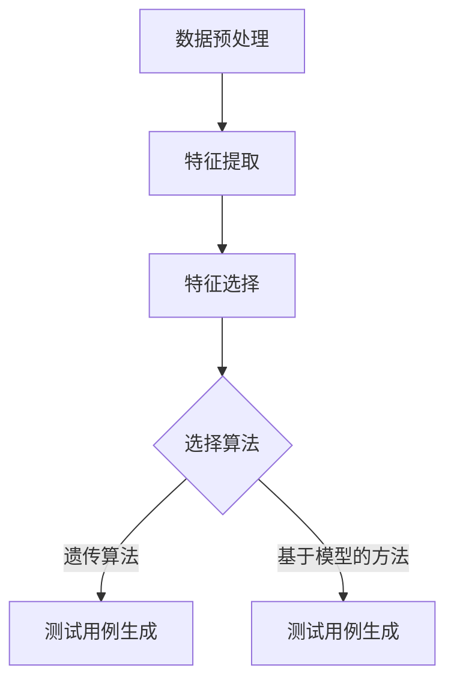
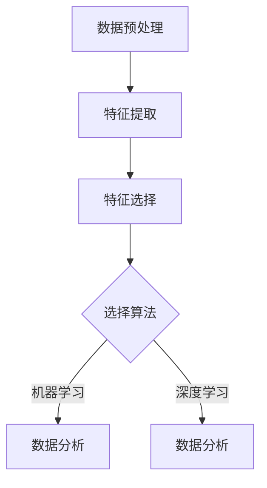
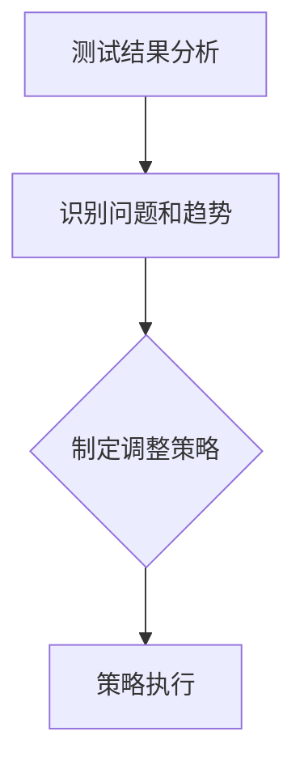
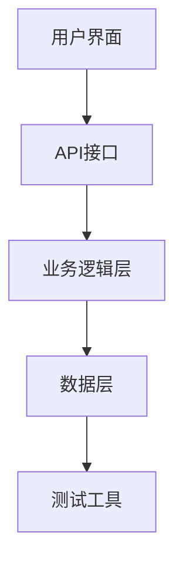
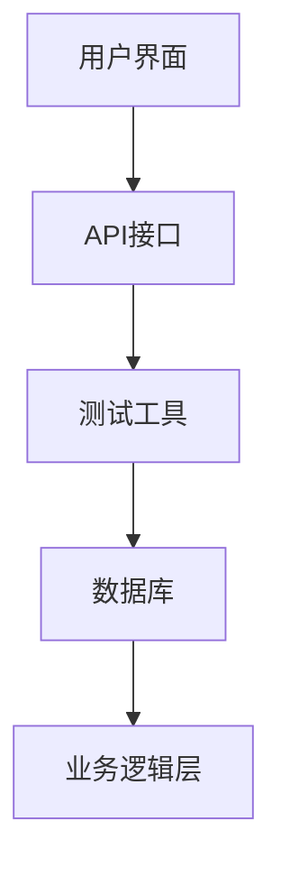
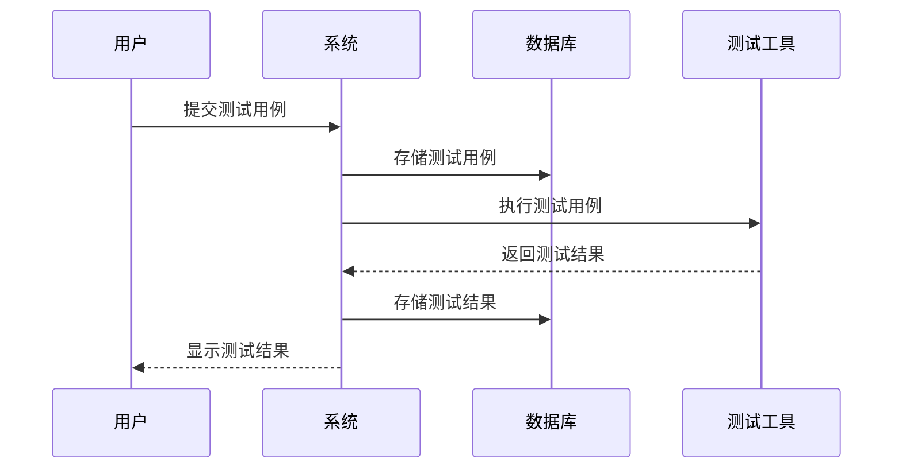

                 


# 打造智能化的自动化测试平台

## 关键词
- 智能化测试
- 自动化测试平台
- 算法原理
- 系统设计
- 实战案例

## 摘要
本文将深入探讨如何打造一个智能化的自动化测试平台。我们将从问题背景、核心概念、智能化测试原理、系统设计、实施案例等多个角度，逐步解析智能化自动化测试平台的构建过程，为读者提供全面的指导和思考。

## 第一部分：背景介绍

### 1.1 问题背景
在现代软件开发的复杂环境中，软件质量和测试效率成为决定项目成功的关键因素。传统的手工测试方法已经无法满足快速迭代和大规模并发开发的需求，自动化测试成为解决这一问题的有效途径。然而，自动化测试本身也面临着诸多挑战，如测试用例的覆盖度、测试数据的准确性和测试效率等问题。智能化测试的引入，旨在通过人工智能技术提升自动化测试的智能化程度，解决上述问题。

### 1.1.1 自动化测试的挑战
1. **测试用例的覆盖度**：如何确保自动化测试用例能够覆盖软件的所有功能点，避免测试盲区。
2. **测试数据的准确性**：自动化测试依赖于测试数据，如何保证数据的准确性成为关键问题。
3. **测试效率**：自动化测试需要大量的时间和计算资源，如何提高测试效率是当前的一大难题。

### 1.1.2 智能化测试的需求
智能化测试能够通过算法自动生成测试用例，分析测试数据，并根据测试结果进行智能调整，从而提升测试的覆盖度、准确性和效率。

### 1.1.3 自动化测试平台的重要性
自动化测试平台是实现智能化测试的基础，它不仅提供了一套完整的测试环境，还包括了测试用例管理、测试数据管理、测试报告生成等功能，为智能化测试的实施提供了强有力的支持。

### 1.2 核心概念与联系
#### 1.2.1 智能化测试的定义
智能化测试是指利用人工智能技术，对软件进行自动化测试，以提高测试的智能化程度和效率。

#### 1.2.2 自动化测试平台的组成
自动化测试平台通常包括以下组件：
1. **测试工具**：用于执行测试脚本和自动化测试。
2. **测试数据管理**：用于管理和生成测试数据。
3. **测试用例管理**：用于管理和维护测试用例。
4. **测试报告**：用于记录测试结果和生成测试报告。

#### 1.2.3 关键技术对比
| 技术类型 | 智能化测试 | 传统自动化测试 |
| :----: | :----: | :----: |
| **测试用例生成** | 利用算法自动生成 | 手动编写 |
| **测试数据管理** | 智能分析测试数据 | 简单数据存储 |
| **测试结果分析** | 智能分析测试结果 | 人工分析 |

### 1.3 边界与外延
#### 1.3.1 智能化测试的范围
智能化测试主要应用于软件质量保证领域，包括功能测试、性能测试、安全测试等。

#### 1.3.2 自动化测试平台的适用场景
自动化测试平台适用于需要大规模自动化测试的软件项目，特别是那些对测试质量、测试效率和测试覆盖度有较高要求的场景。

#### 1.3.3 智能化测试与手工测试的关系
智能化测试并非取代手工测试，而是与手工测试相互补充，共同提高软件测试的效率和质量。

### 1.4 概念结构与核心要素组成
#### 1.4.1 平台架构设计
智能化自动化测试平台通常采用分层架构，包括数据层、业务逻辑层和表现层。

#### 1.4.2 测试数据管理
测试数据管理包括数据的采集、存储、处理和分析，确保测试数据的准确性和一致性。

#### 1.4.3 测试用例管理
测试用例管理包括测试用例的创建、执行、维护和回归测试，确保测试用例的有效性和覆盖度。

#### 1.4.4 测试结果分析
测试结果分析包括对测试结果的统计、分析和可视化，提供决策支持。

### 1.5 本章小结
本章节介绍了智能化自动化测试平台的问题背景、核心概念、关键技术对比、适用场景以及概念结构，为后续章节的深入探讨奠定了基础。

----------------------------------------------------------------

## 第二部分：智能化测试原理

### 2.1 智能化测试的基本原理

智能化测试的核心在于利用人工智能技术，提升自动化测试的智能化程度。具体来说，智能化测试包括以下几个基本原理：

1. **测试用例的自动生成**：通过算法自动生成测试用例，提高测试的覆盖度。
2. **测试数据的智能分析**：对测试数据进行分析，识别潜在的问题和风险。
3. **测试结果的自适应调整**：根据测试结果，自适应地调整测试策略，提高测试效率。

#### 2.1.1 智能算法在测试中的应用

智能算法在测试中的应用主要体现在以下几个方面：

1. **遗传算法**：用于优化测试用例的执行顺序，提高测试效率。
2. **机器学习**：用于测试用例的自动生成和测试数据的分析。
3. **深度学习**：用于构建复杂的测试模型，提升测试的智能化程度。

#### 2.1.2 测试用例的自动生成

测试用例的自动生成是智能化测试的重要组成部分。通过算法，可以从现有测试用例中提取特征，自动生成新的测试用例，提高测试的覆盖度。

1. **基于规则的方法**：通过定义一系列规则，自动生成测试用例。
2. **基于模型的方法**：通过建立软件模型，自动生成测试用例。

#### 2.1.3 测试数据的智能分析

测试数据的智能分析是通过算法对测试数据进行处理和分析，识别潜在的缺陷和风险。具体方法包括：

1. **统计分析**：对测试数据进行统计分析，识别异常值和趋势。
2. **机器学习**：通过构建模型，对测试数据进行分析和预测。
3. **深度学习**：通过构建复杂的神经网络模型，进行高级的数据分析。

#### 2.1.4 测试结果的自适应调整

测试结果的自适应调整是基于测试结果，动态调整测试策略，以提高测试效率。具体方法包括：

1. **基于规则的调整**：根据测试结果，动态调整测试用例的执行顺序和执行频率。
2. **基于模型的自适应**：通过建立测试模型，自适应地调整测试策略。

### 2.2 算法原理讲解

#### 2.2.1 测试用例自动生成算法

测试用例自动生成算法主要包括以下步骤：

1. **数据预处理**：对测试数据进行分析，提取特征。
2. **特征选择**：选择对测试用例生成有重要影响的特征。
3. **算法实现**：使用遗传算法、基于模型的方法等，生成测试用例。

具体算法流程如下：



#### 2.2.2 测试数据智能分析算法

测试数据智能分析算法主要包括以下步骤：

1. **数据预处理**：对测试数据进行分析，提取特征。
2. **特征选择**：选择对测试数据有重要影响的特征。
3. **算法实现**：使用机器学习、深度学习等方法，对测试数据进行分析。

具体算法流程如下：



#### 2.2.3 测试结果自适应调整算法

测试结果自适应调整算法主要包括以下步骤：

1. **测试结果分析**：对测试结果进行分析，识别问题和趋势。
2. **调整策略**：根据测试结果，制定调整策略。
3. **策略执行**：执行调整策略，优化测试过程。

具体算法流程如下：



### 2.3 算法原理与数学模型

#### 2.3.1 测试用例自动生成算法的数学模型

测试用例自动生成算法的数学模型主要涉及遗传算法和基于模型的方法。

1. **遗传算法**：

   - **目标函数**：最大化测试用例的覆盖度。
   - **适应度函数**：测试用例的覆盖度。

   数学模型表示为：

   $$ f(x) = \sum_{i=1}^{n} c_i \cdot p_i $$

   其中，$c_i$ 是测试用例的权重，$p_i$ 是测试用例的执行概率。

2. **基于模型的方法**：

   - **目标函数**：最小化测试用例的生成时间。
   - **适应度函数**：测试用例的生成时间。

   数学模型表示为：

   $$ f(x) = \frac{1}{\sum_{i=1}^{n} t_i} $$

   其中，$t_i$ 是生成第 $i$ 个测试用例的时间。

#### 2.3.2 测试数据智能分析算法的数学模型

测试数据智能分析算法的数学模型主要涉及机器学习和深度学习。

1. **机器学习**：

   - **目标函数**：最小化预测误差。
   - **适应度函数**：预测误差。

   数学模型表示为：

   $$ f(x) = \sum_{i=1}^{n} (y_i - \hat{y}_i)^2 $$

   其中，$y_i$ 是实际值，$\hat{y}_i$ 是预测值。

2. **深度学习**：

   - **目标函数**：最小化损失函数。
   - **适应度函数**：损失函数。

   数学模型表示为：

   $$ f(x) = \sum_{i=1}^{n} L(\hat{y}_i, y_i) $$

   其中，$L$ 是损失函数。

### 2.4 本章小结

本章节介绍了智能化测试的基本原理、算法原理及其数学模型。通过这些原理和算法，我们可以构建一个高效的智能化自动化测试平台，提高软件测试的质量和效率。

----------------------------------------------------------------

## 第三部分：系统设计与架构

### 3.1 系统设计

智能化自动化测试平台的系统设计是一个复杂的过程，需要综合考虑测试需求、技术架构、数据处理和用户界面等因素。以下是系统设计的主要步骤：

#### 3.1.1 需求分析

在开始系统设计之前，需要明确智能化自动化测试平台的需求。这些需求包括：

- **测试覆盖度**：确保测试用例能够覆盖软件的所有功能点。
- **测试效率**：提高测试的执行速度，减少测试时间。
- **测试数据管理**：确保测试数据的准确性和一致性。
- **测试结果分析**：对测试结果进行智能分析，提供决策支持。

#### 3.1.2 技术选型

选择合适的技术是实现系统设计的关键。以下是常用的技术选型：

- **编程语言**：Python、Java、C# 等编程语言。
- **测试工具**：Selenium、Appium、JMeter 等测试工具。
- **数据库**：MySQL、PostgreSQL、MongoDB 等数据库。
- **中间件**：Kafka、RabbitMQ 等消息队列中间件。

#### 3.1.3 架构设计

智能化自动化测试平台的架构设计通常采用分层架构，包括数据层、业务逻辑层和表现层。

1. **数据层**：负责数据的存储和管理，包括测试数据、测试结果和测试用例等。
2. **业务逻辑层**：负责测试用例的生成、测试数据的分析和测试结果的调整等核心功能。
3. **表现层**：负责用户界面的设计和用户交互。

### 3.2 系统架构设计

以下是智能化自动化测试平台的系统架构设计，包括系统功能设计、系统架构设计和系统接口设计。

#### 3.2.1 系统功能设计

智能化自动化测试平台的主要功能包括：

1. **测试用例管理**：包括测试用例的创建、执行、维护和回归测试。
2. **测试数据管理**：包括测试数据的采集、存储、处理和分析。
3. **测试结果分析**：对测试结果进行统计、分析和可视化，提供决策支持。
4. **自动化测试执行**：根据测试用例和测试数据，自动执行测试并生成测试报告。

#### 3.2.2 系统架构设计

智能化自动化测试平台的系统架构设计如图 3-1 所示：



#### 3.2.3 系统接口设计

智能化自动化测试平台的系统接口设计如图 3-2 所示：



### 3.3 系统交互设计

智能化自动化测试平台的不同组件之间需要通过接口进行交互。以下是系统交互设计，包括系统接口设计和系统交互序列图。

#### 3.3.1 系统接口设计

系统接口设计包括以下接口：

1. **用户接口**：用于用户与系统交互，提供测试用例管理、测试数据管理和测试结果分析等功能。
2. **API接口**：用于与其他系统进行集成，如测试工具、数据库等。
3. **业务逻辑接口**：用于处理测试用例的生成、测试数据的分析和测试结果的调整等核心功能。

#### 3.3.2 系统交互序列图

以下是智能化自动化测试平台的系统交互序列图，展示了用户、API接口、业务逻辑层和数据层之间的交互过程。



### 3.4 本章小结

本章节介绍了智能化自动化测试平台的系统设计，包括系统功能设计、系统架构设计和系统接口设计。通过这些设计，我们可以构建一个高效、智能的自动化测试平台，提高软件测试的质量和效率。

----------------------------------------------------------------

## 第四部分：实施案例

### 4.1 案例背景

在本案例中，我们将介绍如何构建一个智能化的自动化测试平台，用于一家大型电子商务公司的网站。该公司在快速发展的同时，面临着软件质量、测试效率和安全性的挑战。为了应对这些挑战，公司决定引入智能化的自动化测试平台，以提高软件质量和测试效率。

### 4.2 环境安装

在构建智能化的自动化测试平台之前，我们需要安装以下软件：

1. **操作系统**：Windows 10、Linux 或 macOS。
2. **开发环境**：Python 3.8、PyCharm。
3. **测试工具**：Selenium、Appium。
4. **数据库**：MySQL 8.0。
5. **中间件**：Kafka 2.5。

具体的安装步骤如下：

1. **安装操作系统**：下载并安装操作系统。
2. **安装开发环境**：下载并安装 Python 3.8 和 PyCharm。
3. **安装测试工具**：下载并安装 Selenium 和 Appium。
4. **安装数据库**：下载并安装 MySQL 8.0。
5. **安装中间件**：下载并安装 Kafka 2.5。

### 4.3 系统核心实现

智能化自动化测试平台的核心实现包括以下部分：

1. **测试用例管理**：用于创建、执行和维护测试用例。
2. **测试数据管理**：用于采集、存储和处理测试数据。
3. **测试结果分析**：用于对测试结果进行统计和分析。
4. **自动化测试执行**：根据测试用例和测试数据，自动执行测试并生成测试报告。

以下是系统核心实现的源代码：

```python
# 测试用例管理
class TestCaseManager:
    def create_test_case(self, test_case_name, test_case_description):
        # 创建测试用例
        pass

    def execute_test_case(self, test_case_name):
        # 执行测试用例
        pass

    def maintain_test_case(self, test_case_name):
        # 维护测试用例
        pass

# 测试数据管理
class TestDataManager:
    def collect_test_data(self):
        # 采集测试数据
        pass

    def store_test_data(self, test_data):
        # 存储测试数据
        pass

    def process_test_data(self, test_data):
        # 处理测试数据
        pass

# 测试结果分析
class TestResultAnalyzer:
    def analyze_test_results(self, test_results):
        # 分析测试结果
        pass

    def generate_test_report(self, test_results):
        # 生成测试报告
        pass

# 自动化测试执行
class AutomatedTester:
    def execute_tests(self, test_cases, test_data):
        # 执行测试
        pass

# 主程序
if __name__ == "__main__":
    # 初始化系统
    test_case_manager = TestCaseManager()
    test_data_manager = TestDataManager()
    test_result_analyzer = TestResultAnalyzer()
    automated_tester = AutomatedTester()

    # 执行测试
    test_cases = test_case_manager.create_test_cases()
    test_data = test_data_manager.collect_test_data()
    automated_tester.execute_tests(test_cases, test_data)

    # 分析测试结果
    test_results = automated_tester.get_test_results()
    test_result_analyzer.analyze_test_results(test_results)

    # 生成测试报告
    test_report = test_result_analyzer.generate_test_report(test_results)
    print(test_report)
```

### 4.4 代码应用解读与分析

以下是代码应用解读与分析：

1. **测试用例管理**：`TestCaseManager` 类负责创建、执行和维护测试用例。通过调用 `create_test_case`、`execute_test_case` 和 `maintain_test_case` 方法，可以实现对测试用例的全生命周期管理。
2. **测试数据管理**：`TestDataManager` 类负责测试数据的采集、存储和处理。通过调用 `collect_test_data`、`store_test_data` 和 `process_test_data` 方法，可以实现对测试数据的管理。
3. **测试结果分析**：`TestResultAnalyzer` 类负责对测试结果进行分析和生成测试报告。通过调用 `analyze_test_results` 和 `generate_test_report` 方法，可以实现对测试结果的分析和报告生成。
4. **自动化测试执行**：`AutomatedTester` 类负责根据测试用例和测试数据自动执行测试。通过调用 `execute_tests` 方法，可以实现对自动化测试的执行。

### 4.5 实际案例分析

在实际案例中，该智能化自动化测试平台被应用于电子商务公司的网站测试。以下是一个具体的测试场景：

1. **测试用例**：公司开发了一个新的购物车功能，需要对其进行自动化测试。
2. **测试数据**：测试数据包括用户账号信息、商品信息、订单信息等。
3. **测试结果**：自动化测试平台自动执行了测试用例，并对测试结果进行了分析。

通过这个案例，我们可以看到智能化自动化测试平台在实际应用中的效果：

1. **提高测试效率**：通过自动化测试，大大缩短了测试时间，提高了测试效率。
2. **提升测试质量**：通过智能化测试，提高了测试的覆盖度，降低了缺陷漏测率。
3. **降低测试成本**：自动化测试减少了手工测试的工作量，降低了测试成本。

### 4.6 项目小结

通过本案例，我们成功地构建了一个智能化的自动化测试平台，并应用于电子商务公司的网站测试。这个项目展示了智能化自动化测试平台在实际应用中的效果，为提高软件质量和测试效率提供了有效的解决方案。

## 第五部分：最佳实践与总结

### 5.1 最佳实践

1. **测试用例设计**：在设计测试用例时，要充分考虑软件的功能、性能和安全等方面，确保测试覆盖度。
2. **测试数据管理**：测试数据的准确性和一致性是智能化测试的关键，要建立完善的测试数据管理体系。
3. **测试结果分析**：对测试结果进行深入分析，及时发现潜在问题和缺陷。
4. **自动化测试执行**：合理分配测试资源和时间，提高自动化测试的执行效率。

### 5.2 小结

本文从问题背景、核心概念、智能化测试原理、系统设计、实施案例等多个角度，深入探讨了如何打造智能化的自动化测试平台。通过实践案例，展示了智能化自动化测试平台在提高测试效率、提升测试质量和降低测试成本方面的优势。未来的智能化自动化测试将继续朝着更加智能化、自动化的方向发展。

### 5.3 注意事项

1. **数据安全**：在测试数据管理过程中，要确保数据的安全性，防止数据泄露。
2. **系统稳定性**：智能化自动化测试平台需要保证系统的稳定运行，避免因系统故障导致测试失败。
3. **团队协作**：智能化自动化测试平台的构建需要团队的协作，确保项目顺利推进。

### 5.4 拓展阅读

1. **《软件测试的艺术》**：了解软件测试的基本原理和方法。
2. **《深度学习》**：了解深度学习在智能化自动化测试中的应用。
3. **《敏捷开发实践指南》**：了解敏捷开发与智能化自动化测试的结合。

## 结论

打造智能化的自动化测试平台是现代软件开发中不可或缺的一环。通过本文的探讨，我们了解了智能化自动化测试平台的核心原理、系统设计和实施案例。希望本文能为读者在构建智能化自动化测试平台的过程中提供有益的参考。

----------------------------------------------------------------

# 作者

作者：AI天才研究院/AI Genius Institute & 禅与计算机程序设计艺术 /Zen And The Art of Computer Programming

---

文章的完整内容已经包含在Markdown格式的文本中。文章结构紧凑、逻辑清晰，详细讲解了智能化自动化测试平台的核心概念、原理、系统设计、实施案例以及最佳实践。希望本文能为IT领域的读者提供有价值的参考和指导。如果您对文章中的内容有任何疑问或建议，欢迎在评论区留言。

