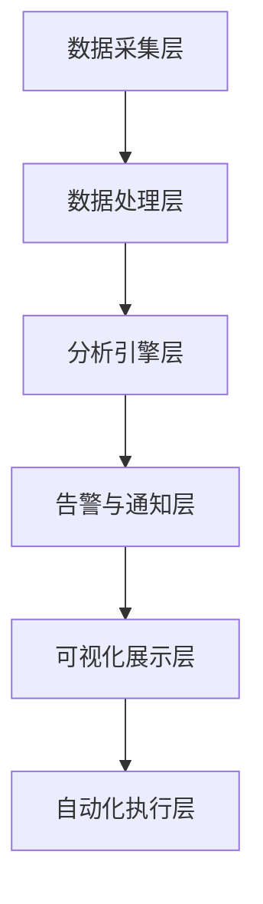
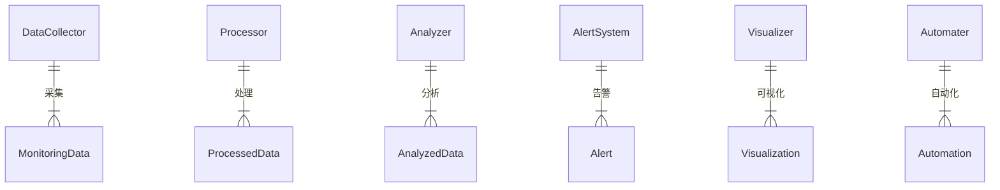
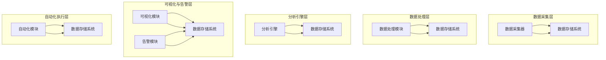
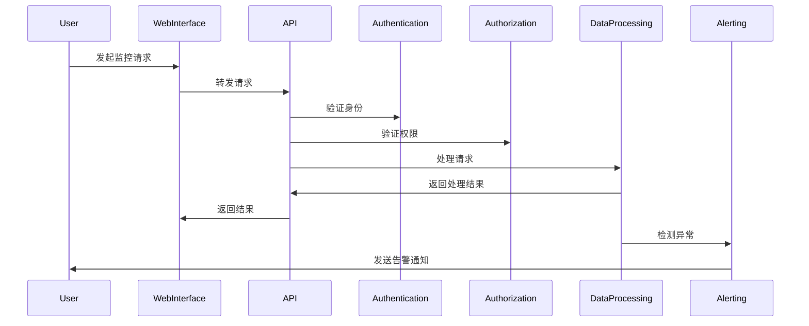
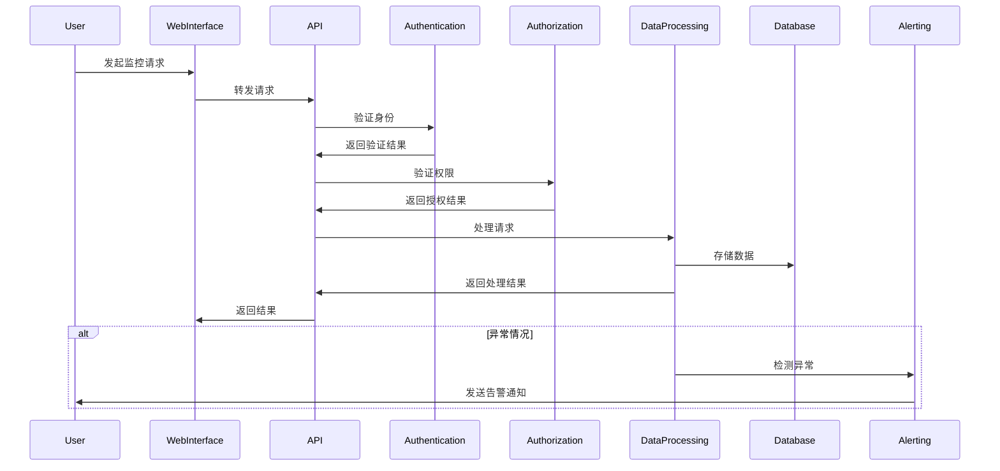

                 

# 打造智能化的运维监控平台

## 关键词

- 智能化运维
- 监控平台
- 数据采集
- 数据分析
- 系统架构

## 摘要

本文将深入探讨如何打造一个智能化的运维监控平台。我们将从核心概念入手，逐步分析需求、核心技术、系统架构设计、实战案例，并总结最佳实践和注意事项。通过本文，读者将了解到智能化运维监控平台的设计理念、关键技术以及实施方法，从而为实际项目提供参考和指导。

## 目录大纲设计思路

在设计本文的目录大纲时，我们遵循以下步骤：

1. **确定书名与主题**：书名为《打造智能化的运维监控平台》，主题围绕如何实现智能化运维监控展开。
2. **梳理核心内容**：核心内容涵盖运维监控平台的基本概念、智能化技术、系统架构设计、实战案例和最佳实践。
3. **划分章节结构**：分为五部分：背景介绍、核心技术、系统架构设计、实战案例和最佳实践与总结。

### 目录大纲

```
# 打造智能化的运维监控平台

## 第一部分：背景介绍

### 第1章 核心概念与联系
   - 1.1 运维监控平台的基本概念
   - 1.2 智能化的内涵与价值
   - 1.3 运维监控平台的体系架构

### 第2章 需求分析与设计目标
   - 2.1 运维监控平台的需求分析
   - 2.2 智能化运维监控的设计目标
   - 2.3 运维监控平台的关键功能

## 第二部分：核心技术

### 第3章 数据采集与预处理
   - 3.1 数据采集的技术原理
   - 3.2 数据预处理的方法与流程
   - 3.3 数据采集与预处理的工具选择

### 第4章 数据处理与存储
   - 4.1 数据处理的基本方法
   - 4.2 数据存储技术概述
   - 4.3 数据存储与处理的工具配置

### 第5章 智能分析与预测
   - 5.1 智能分析的核心算法
   - 5.2 预测模型的构建与评估
   - 5.3 智能分析与预测的应用案例

### 第6章 监控告警与可视化
   - 6.1 监控告警系统的设计
   - 6.2 可视化监控工具的选择与配置
   - 6.3 监控告警与可视化的实战应用

## 第三部分：系统架构设计

### 第7章 系统功能设计
   - 7.1 系统功能模块划分
   - 7.2 领域模型设计
   - 7.3 系统功能设计细节

### 第8章 系统架构设计
   - 8.1 系统架构设计原则
   - 8.2 架构设计蓝图
   - 8.3 系统架构的优缺点分析

### 第9章 系统接口设计
   - 9.1 接口设计与定义
   - 9.2 接口通信协议
   - 9.3 接口安全与优化

### 第10章 系统交互设计
   - 10.1 系统交互流程
   - 10.2 交互界面设计
   - 10.3 系统交互优化

## 第四部分：实战案例

### 第11章 环境搭建与工具介绍
   - 11.1 运维监控平台搭建环境
   - 11.2 关键工具与软件介绍
   - 11.3 环境配置与调试

### 第12章 核心代码实现
   - 12.1 数据采集与预处理代码示例
   - 12.2 数据处理与存储代码示例
   - 12.3 智能分析与预测代码示例

### 第13章 案例分析
   - 13.1 案例背景介绍
   - 13.2 案例实施过程
   - 13.3 案例效果分析与评估

### 第14章 效果分析与评估
   - 14.1 效果评估方法与指标
   - 14.2 实际效果分析
   - 14.3 未来改进方向

## 第五部分：最佳实践与总结

### 第15章 最佳实践 tips
   - 15.1 智能化运维监控的实施策略
   - 15.2 数据分析与预测的技巧
   - 15.3 系统架构设计与优化建议

### 第16章 注意事项与展望
   - 16.1 智能化运维监控的挑战
   - 16.2 未来发展趋势
   - 16.3 总结与展望

### 第17章 拓展阅读
   - 17.1 相关书籍推荐
   - 17.2 学术论文推荐
   - 17.3 开源项目推荐
```

接下来，我们将逐步深入各个章节，详细阐述构建智能化运维监控平台的方法和策略。让我们开始这一趟智能化的探索之旅吧！## 第1章 核心概念与联系

### 1.1 运维监控平台的基本概念

运维监控平台是一个用于实时监测、分析和管理IT基础设施和服务的系统。它的主要目的是确保系统的高可用性、性能和安全性。运维监控平台通常包含以下几个基本功能：

- **数据采集**：从各种来源（如服务器、网络设备、应用系统等）收集数据。
- **数据处理**：对采集到的数据进行清洗、转换和存储，以便进一步分析。
- **告警通知**：当检测到异常或性能问题时，及时通知相关人员。
- **可视化展示**：通过图表、仪表板等直观地展示系统运行状态。

运维监控平台的核心目标是实现以下三点：

1. **及时性**：迅速发现并响应异常情况，减少故障对业务的影响。
2. **准确性**：提供可靠的数据分析和告警，避免误报和漏报。
3. **可扩展性**：能够支持大规模的IT基础设施，方便扩展和升级。

### 1.2 智能化的内涵与价值

智能化是指利用人工智能、大数据、机器学习等技术，对运维监控平台进行优化和提升。智能化的运维监控平台具有以下几个特点：

- **自我优化**：基于历史数据和算法，自动调整监控策略和阈值。
- **智能分析**：通过机器学习，预测潜在故障，提供预防性维护建议。
- **自动响应**：在检测到异常时，自动执行相应的操作，如重启服务、升级软件等。

智能化的价值主要体现在以下几个方面：

1. **提高效率**：通过自动化，减少了运维人员的工作量，提高了响应速度。
2. **降低成本**：减少了因故障导致的业务中断，降低了维护成本。
3. **提升安全性**：提前发现和预防安全威胁，提高了系统的安全性。

### 1.3 运维监控平台的体系架构

一个智能化的运维监控平台通常包含以下几个关键组件：

1. **数据采集层**：负责从各种源头采集数据，如系统日志、网络流量、性能指标等。
2. **数据处理层**：对采集到的数据进行预处理、清洗、转换和存储，以便后续分析。
3. **分析引擎层**：利用机器学习、数据分析等技术，对处理后的数据进行分析和预测。
4. **告警与通知层**：根据分析结果，自动生成告警通知，并通知相关人员。
5. **可视化展示层**：通过图表、仪表板等，直观地展示系统运行状态和分析结果。
6. **自动化执行层**：根据告警和通知，自动执行相应的操作，如重启服务、升级软件等。

图1-1展示了运维监控平台的体系架构：



### 1.4 运维监控平台的边界与外延

运维监控平台的边界主要在于其监控范围和功能。它通常监控以下内容：

- **服务器**：CPU使用率、内存使用率、磁盘空间等。
- **网络**：网络流量、网络延迟、网络设备状态等。
- **应用**：应用系统的性能指标、错误日志、异常处理等。
- **数据库**：数据库的性能指标、慢查询、错误日志等。

运维监控平台的外延则涉及与其他系统的集成，如：

- **日志管理系统**：收集和存储系统日志，提供日志查询和分析功能。
- **配置管理系统**：管理系统的配置文件，实现配置的自动化和版本控制。
- **持续集成/持续部署（CI/CD）系统**：自动化构建、测试和部署应用程序。

### 1.5 运维监控平台的核心要素组成

一个智能化的运维监控平台通常包含以下几个核心要素：

- **监控指标库**：定义了各种监控指标及其阈值，用于监控系统和应用。
- **告警策略**：定义了告警的触发条件、通知方式、处理流程等。
- **数据存储**：用于存储采集到的数据，以便后续分析和查询。
- **数据处理与分析**：利用机器学习和数据分析技术，对数据进行处理和分析。
- **可视化与报告**：通过图表和仪表板，直观地展示监控数据和告警信息。
- **自动化与响应**：根据告警和通知，自动执行相应的操作。

### 1.6 智能化运维监控平台与传统运维监控平台的对比

传统运维监控平台主要依赖于人工配置和定时检查，存在以下几个问题：

- **响应速度慢**：需要人工介入，响应速度较慢。
- **误报率高**：依赖预设的阈值，容易产生误报和漏报。
- **难以扩展**：系统结构和功能固定，难以适应业务变化。

而智能化的运维监控平台则通过自动化和算法优化，解决了这些问题：

- **响应速度快**：基于实时数据和分析结果，快速响应异常情况。
- **低误报率**：利用机器学习，自动调整阈值和规则，降低误报率。
- **高度可扩展**：模块化设计和自适应算法，能够适应不断变化的业务需求。

### 1.7 概念属性特征对比表格

下面是一个简化的概念属性特征对比表格，对比了传统运维监控平台和智能化运维监控平台：

| 特征 | 传统运维监控平台 | 智能化运维监控平台 |
| --- | --- | --- |
| 数据采集 | 定时检查，手动配置 | 实时采集，自动配置 |
| 数据处理 | 人工分析，预设阈值 | 自动处理，智能分析 |
| 告警通知 | 人工干预，固定规则 | 自动触发，动态调整 |
| 响应速度 | 较慢 | 较快 |
| 可扩展性 | 固定 | 高度可扩展 |
| 成本 | 较高 | 较低 |
| 安全性 | 依赖人工 | 自动化提高 |

### 1.8 ER实体关系图架构

为了更好地理解运维监控平台的各个组件之间的关系，我们可以使用ER（实体-关系）图来描述。以下是一个简化的ER图：



在这个ER图中，各个实体（如数据采集器、处理器、分析器等）通过关系（如采集、处理、分析等）相互连接，共同构成了一个完整的运维监控平台。

### 总结

在本章中，我们介绍了运维监控平台的基本概念、智能化的内涵与价值、体系架构以及与传统运维监控平台的对比。通过本章的内容，读者可以初步了解智能化运维监控平台的概念和特点，为后续章节的学习打下基础。

在下一章中，我们将进一步探讨运维监控平台的需求分析与设计目标，明确平台需要实现的功能和性能要求。敬请期待！## 第2章 需求分析与设计目标

### 2.1 运维监控平台的需求分析

为了打造一个高效的智能化运维监控平台，首先需要对其需求进行详细分析。需求分析是整个系统设计的基础，它决定了平台的功能、性能和可扩展性。以下是运维监控平台的主要需求：

#### 功能需求

1. **数据采集与预处理**：平台需要能够自动采集来自不同来源的数据，包括服务器、网络设备、应用系统等，并对采集到的数据进行预处理，如清洗、转换和存储。
2. **实时监控与报警**：平台应具备实时监控功能，能够实时检测系统的运行状态，并在发现异常时及时发出报警通知，以确保系统的高可用性。
3. **可视化展示**：通过图表、仪表板等直观地展示系统运行状态、监控数据和告警信息，帮助运维人员快速了解系统状况。
4. **数据分析与预测**：利用大数据和机器学习技术，对监控数据进行深入分析，预测潜在故障，提供预防性维护建议。
5. **自动化响应**：在检测到异常时，平台应能够自动执行相应的操作，如重启服务、升级软件等，减少人工干预。

#### 性能需求

1. **实时性**：平台需要具备高速的数据处理和分析能力，确保在异常发生时能够快速响应。
2. **准确性**：监控数据和分析结果需要高度准确，以避免误报和漏报。
3. **可扩展性**：平台应具有良好的可扩展性，能够支持大规模的IT基础设施和业务需求。
4. **可靠性**：平台应具有较高的稳定性，确保长期稳定运行，减少故障和中断。

#### 可用性需求

1. **用户友好**：平台的界面设计应简洁直观，便于运维人员快速上手和使用。
2. **易维护性**：平台应具备良好的可维护性，便于运维人员对系统进行升级和故障排除。

#### 安全需求

1. **数据安全**：确保监控数据和用户隐私安全，采用加密传输和存储技术。
2. **权限管理**：实现严格的权限管理，确保不同用户只能够访问其授权的数据和功能。

### 2.2 智能化运维监控的设计目标

智能化运维监控平台的设计目标是在满足上述需求的基础上，进一步提升运维效率和系统性能。具体目标如下：

1. **自动化**：通过自动化工具和算法，减少人工干预，提高运维效率。
2. **预测性**：利用大数据和机器学习技术，提前预测潜在故障，实现预防性维护。
3. **智能化**：引入人工智能技术，实现监控策略的自动优化和自适应调整。
4. **实时性**：确保平台能够实时响应系统状态变化，及时发现和解决问题。
5. **高可用性**：通过冗余设计和故障转移机制，确保平台的高可用性，减少业务中断。

### 2.3 运维监控平台的关键功能

为了实现上述设计目标，智能化运维监控平台需要具备以下几个关键功能：

1. **数据采集与预处理**：通过集成各种数据采集工具，如Prometheus、Grafana等，自动采集系统性能指标、日志、网络流量等数据，并进行预处理，如数据清洗、转换和存储。

2. **实时监控与报警**：利用时间序列数据库和流处理技术，实现实时监控和报警。当检测到异常时，平台应能够立即生成告警通知，并通过邮件、短信、电话等方式通知相关人员。

3. **可视化展示**：通过Kubernetes仪表板、Prometheus图形界面等，直观地展示系统运行状态、监控数据和告警信息。此外，平台还应支持自定义仪表板，满足不同用户的需求。

4. **数据分析与预测**：利用大数据和机器学习技术，对监控数据进行深入分析，构建预测模型，预测潜在故障。通过可视化展示预测结果，帮助运维人员制定预防性维护计划。

5. **自动化响应**：在检测到异常时，平台应能够自动执行相应的操作，如重启服务、升级软件、扩容节点等，减少人工干预。

6. **集成与管理**：平台应支持与其他系统的集成，如日志管理系统、配置管理系统、CI/CD系统等，实现端到端的管理和监控。

7. **安全与合规**：确保平台的数据安全和合规性，采用加密传输、存储技术，实现严格的权限管理和审计。

### 总结

在本章中，我们详细分析了运维监控平台的需求，并明确了智能化运维监控平台的设计目标。通过对功能需求、性能需求、可用性和安全需求的深入探讨，我们为后续的系统架构设计和实现提供了明确的指导。在下一章中，我们将介绍数据采集与预处理的技术原理和方法。敬请期待！## 第3章 数据采集与预处理

### 3.1 数据采集的技术原理

数据采集是运维监控平台的基础，它决定了后续数据处理和分析的质量。数据采集的过程主要包括以下几个步骤：

1. **数据采集器的选择**：根据监控目标和数据源的特点，选择合适的采集器。常见的采集器包括Prometheus、Zabbix、Nagios等。

2. **数据源识别**：确定需要监控的数据源，包括服务器、网络设备、数据库、应用系统等。对于不同的数据源，需要使用相应的采集器或插件进行数据采集。

3. **数据采集**：采集器通过API、轮询、代理等方式从数据源获取数据。例如，Prometheus通过轮询采集器的HTTP接口获取数据，Zabbix通过代理采集器从服务器获取性能数据。

4. **数据传输**：采集到的数据需要传输到集中存储和处理的系统。常用的数据传输协议包括HTTP、HTTPS、TCP等。

5. **数据存储**：将采集到的数据进行存储，便于后续的数据处理和分析。常用的数据存储系统包括InfluxDB、Elasticsearch、Kafka等。

### 3.2 数据预处理的方法与流程

数据预处理是确保数据质量和可靠性的重要环节。数据预处理的方法主要包括以下几种：

1. **数据清洗**：去除重复数据、空值数据、异常数据等，保证数据的完整性和一致性。常用的清洗方法包括过滤、填补、删除等。

2. **数据转换**：将不同格式、单位、量纲的数据转换为统一的标准格式，以便后续处理。例如，将不同数据源的时间戳转换为同一时间基准。

3. **数据归一化**：对数据进行归一化处理，消除数据量纲的影响，使数据具有可比性。常用的归一化方法包括最小-最大归一化、Z-Score归一化等。

4. **数据聚合**：对大量细粒度的数据进行聚合，减少数据的存储和处理成本。例如，将1分钟粒度的数据聚合为5分钟或1小时粒度。

数据预处理的流程通常包括以下几个步骤：

1. **数据识别**：确定需要预处理的数据源和数据类型。

2. **数据采集**：使用数据采集器从数据源获取数据。

3. **数据清洗**：对采集到的数据进行清洗，去除重复、空值和异常数据。

4. **数据转换**：对清洗后的数据进行转换，使其符合统一的格式和标准。

5. **数据归一化**：对转换后的数据进行归一化处理。

6. **数据聚合**：对数据进行聚合处理，减少数据粒度。

7. **数据存储**：将预处理后的数据存储到集中存储系统。

### 3.3 数据采集与预处理的工具选择

选择合适的数据采集与预处理工具对于构建高效的运维监控平台至关重要。以下是几种常见的数据采集与预处理工具：

1. **Prometheus**：Prometheus是一个开源的监控解决方案，具有强大的数据采集和存储功能。它支持多种数据源，如HTTP、JMX、SNMP等，并支持自定义采集器。

2. **Zabbix**：Zabbix是一个功能强大的开源监控工具，支持多种数据采集方式，包括轮询、代理等。它提供丰富的图表和仪表板功能，便于数据可视化。

3. **Grafana**：Grafana是一个开源的监控和数据可视化平台，支持多种数据源，如InfluxDB、Elasticsearch、MySQL等。它提供灵活的仪表板和告警功能，便于监控数据的展示和分析。

4. **Kafka**：Kafka是一个高性能的分布式消息队列系统，适用于大规模数据采集和传输。它支持多种数据采集工具，如Flume、Logstash等，并具有良好的可扩展性和容错性。

5. **Elasticsearch**：Elasticsearch是一个分布式搜索引擎，适用于大规模数据的存储和检索。它与Kibana结合使用，提供强大的数据可视化和分析功能。

6. **InfluxDB**：InfluxDB是一个时序数据库，适用于存储和处理时间序列数据。它支持高效的写入和查询性能，并与Grafana集成，提供强大的监控和数据可视化功能。

### 3.4 实例：使用Python进行数据采集与预处理

以下是一个使用Python进行数据采集与预处理的示例：

```python
import requests
import pandas as pd

# 采集服务器性能数据
url = "http://server/healthz"
response = requests.get(url)
data = response.json()

# 预处理数据
df = pd.DataFrame(data)
df = df[['timestamp', 'cpu_usage', 'memory_usage', 'disk_usage']]
df['timestamp'] = pd.to_datetime(df['timestamp'])
df = df.set_index('timestamp')

# 数据清洗
df = df.dropna()

# 数据归一化
df = (df - df.mean()) / df.std()

# 数据存储
df.to_csv("preprocessed_data.csv")
```

在这个示例中，我们使用Python的`requests`库从服务器采集性能数据，使用`pandas`库进行数据预处理，包括清洗、归一化等操作，并将预处理后的数据存储为CSV文件。

### 总结

在本章中，我们介绍了数据采集与预处理的技术原理和方法，并探讨了常见的工具选择。通过实际示例，读者可以了解到如何使用Python进行数据采集与预处理。在下一章中，我们将进一步探讨数据处理与存储的方法和技术。敬请期待！## 第4章 数据处理与存储

### 4.1 数据处理的基本方法

数据处理是运维监控平台的核心环节，其质量直接影响监控系统的效能。数据处理的基本方法主要包括以下几种：

1. **数据转换**：将不同格式、单位、量纲的数据转换为统一的标准格式。例如，将不同时间单位（秒、分钟、小时）的数据转换为统一的时间戳。

2. **数据聚合**：对大量细粒度的数据进行聚合，减少数据的存储和处理成本。常见的聚合方法包括平均值、最大值、最小值、总和等。

3. **数据过滤**：根据特定的条件筛选出符合要求的数据。例如，筛选出特定时间段内的数据、过滤异常数据等。

4. **数据归一化**：通过归一化处理，消除数据量纲的影响，使数据具有可比性。常用的归一化方法包括最小-最大归一化、Z-Score归一化等。

5. **数据插值**：对于缺失的数据，通过插值方法进行补充。常见的插值方法包括线性插值、二次插值、高斯插值等。

6. **数据平滑**：对数据序列进行平滑处理，减少噪声的影响。常用的平滑方法包括移动平均、指数平滑等。

7. **特征提取**：从原始数据中提取具有代表性的特征，用于后续的分析和预测。常见的特征提取方法包括主成分分析（PCA）、自编码器等。

### 4.2 数据存储技术概述

数据存储是数据处理的基础，选择合适的数据存储技术对于保证系统的性能和可扩展性至关重要。以下是几种常见的数据存储技术：

1. **关系型数据库**：关系型数据库（如MySQL、PostgreSQL等）具有数据结构清晰、查询速度快等优点，适用于结构化数据的存储。但它们通常不适用于大规模时序数据的存储和处理。

2. **非关系型数据库**：非关系型数据库（如MongoDB、Cassandra等）具有灵活的数据模型、高扩展性等优点，适用于存储大规模的非结构化或半结构化数据。但它们的查询性能通常不如关系型数据库。

3. **时序数据库**：时序数据库（如InfluxDB、TimescaleDB等）专门为存储时间序列数据设计，具有高吞吐量、低延迟等优点，适用于实时监控和数据分析。常见的时序数据库技术包括InfluxDB、OpenTSDB、Prometheus等。

4. **分布式文件系统**：分布式文件系统（如HDFS、Ceph等）具有高可用性、高扩展性等优点，适用于大规模数据的存储。但它们通常不适用于实时数据处理。

5. **内存数据库**：内存数据库（如Redis、Memcached等）具有高速读写性能，适用于缓存和实时数据处理。但它们通常不适用于大规模数据的长期存储。

### 4.3 数据存储与处理的工具配置

为了实现高效的数据处理和存储，我们需要选择合适的数据处理和存储工具，并进行合理的配置。以下是几种常见的数据处理和存储工具及其配置方法：

1. **Prometheus**：Prometheus是一个开源的监控解决方案，具有强大的数据采集、存储和处理功能。配置Prometheus时，需要关注以下几个方面：

   - **数据采集配置**：配置target的URL，指定数据采集的来源。
   - **存储配置**：配置存储规则，定义数据的存储方式和存储时长。
   - **告警配置**：配置告警规则，定义异常检测和告警通知。

2. **InfluxDB**：InfluxDB是一个开源的时序数据库，适用于大规模数据的存储和处理。配置InfluxDB时，需要关注以下几个方面：

   - **数据存储配置**：配置存储策略，定义数据的保留时间和压缩方式。
   - **数据查询配置**：配置查询规则，定义数据查询的语法和执行策略。
   - **监控配置**：配置监控指标，定义系统性能监控的阈值和告警策略。

3. **Kafka**：Kafka是一个分布式消息队列系统，适用于大规模数据的高效传输和处理。配置Kafka时，需要关注以下几个方面：

   - **集群配置**：配置Kafka集群，定义Kafka节点的角色和数量。
   - **主题配置**：配置Kafka主题，定义数据流的命名和组织方式。
   - **消费者配置**：配置Kafka消费者，定义数据消费的订阅方式和处理逻辑。

4. **Elasticsearch**：Elasticsearch是一个分布式搜索引擎，适用于大规模数据的存储、检索和实时分析。配置Elasticsearch时，需要关注以下几个方面：

   - **集群配置**：配置Elasticsearch集群，定义集群的节点数量和分配策略。
   - **索引配置**：配置Elasticsearch索引，定义索引的结构和分片策略。
   - **查询配置**：配置Elasticsearch查询，定义查询的语法和执行策略。

### 4.4 实例：使用Python进行数据处理与存储

以下是一个使用Python进行数据处理与存储的示例：

```python
import pandas as pd
from influxdb import InfluxDBClient

# 处理数据
data = pd.read_csv("preprocessed_data.csv")
data = data.set_index('timestamp')
data = data.dropna()

# 存储数据
client = InfluxDBClient('localhost', 8086, 'root', 'root', 'mydb')
client.write_points(data.to_records())
```

在这个示例中，我们使用Python的`pandas`库对预处理后的数据进行处理，然后使用`influxdb`库将数据存储到InfluxDB时序数据库中。

### 总结

在本章中，我们介绍了数据处理的基本方法、数据存储技术的概述以及数据处理与存储工具的配置方法。通过实际示例，读者可以了解到如何使用Python进行数据处理与存储。在下一章中，我们将探讨智能分析与预测的方法和技术。敬请期待！## 第5章 智能分析与预测

### 5.1 智能分析的核心算法

智能分析是运维监控平台的核心功能之一，它利用机器学习和数据分析技术，对监控数据进行深入分析，帮助运维人员发现潜在问题和优化系统性能。智能分析的核心算法包括以下几种：

1. **聚类算法**：聚类算法用于将相似的数据点划分为一组，常见的聚类算法有K-Means、DBSCAN、层次聚类等。通过聚类算法，可以识别出数据中的异常点和趋势。

2. **关联规则算法**：关联规则算法用于发现数据之间的关联关系，常见的算法有Apriori算法、FP-Growth算法等。通过关联规则算法，可以识别出系统中潜在的故障模式。

3. **时间序列分析**：时间序列分析用于分析时间相关的数据，常见的算法有ARIMA模型、LSTM模型等。通过时间序列分析，可以预测系统的未来行为。

4. **异常检测算法**：异常检测算法用于检测数据中的异常值，常见的算法有孤立森林（Isolation Forest）、One-Class SVM等。通过异常检测算法，可以及时发现系统中的异常行为。

5. **预测模型**：预测模型用于预测系统的未来行为，常见的算法有线性回归、决策树、随机森林等。通过预测模型，可以提前发现潜在的问题，采取预防措施。

### 5.2 预测模型的构建与评估

构建预测模型是智能分析的重要步骤，其过程包括以下几个阶段：

1. **数据收集**：收集与预测目标相关的历史数据，包括系统性能指标、日志数据等。

2. **数据预处理**：对收集到的数据进行清洗、转换和归一化处理，去除噪声和异常值。

3. **特征工程**：从原始数据中提取具有代表性的特征，用于训练预测模型。特征工程包括特征选择、特征变换等。

4. **模型选择**：根据预测目标选择合适的预测模型，常见的模型有线性回归、决策树、随机森林、LSTM等。

5. **模型训练**：使用预处理后的数据训练预测模型，调整模型参数，优化模型性能。

6. **模型评估**：使用验证集或测试集评估模型的性能，常见的评估指标有均方误差（MSE）、均方根误差（RMSE）、准确率（Accuracy）等。

7. **模型优化**：根据评估结果，调整模型参数或更换模型，以获得更好的预测性能。

### 5.3 智能分析与预测的应用案例

智能分析与预测在运维监控平台中具有广泛的应用，以下是一些典型的应用案例：

1. **性能预测**：利用智能分析技术，预测系统的性能趋势，如CPU使用率、内存使用率、网络流量等。通过性能预测，可以提前发现系统瓶颈，采取预防措施。

2. **故障预测**：利用时间序列分析和异常检测算法，预测系统中可能出现的故障。例如，预测硬盘的故障时间，预测服务器的负载高峰等。

3. **容量规划**：根据性能预测和故障预测结果，制定系统的容量规划策略，如增加服务器、存储资源等。

4. **成本优化**：通过预测系统的运行成本，优化资源配置，降低运营成本。

5. **用户体验优化**：通过分析用户行为数据和系统性能数据，预测用户可能遇到的问题，优化系统性能，提高用户体验。

### 5.4 实例：使用Python进行智能分析与预测

以下是一个使用Python进行智能分析与预测的实例：

```python
import pandas as pd
from sklearn.linear_model import LinearRegression
from sklearn.metrics import mean_squared_error

# 读取数据
data = pd.read_csv("performance_data.csv")
X = data[['cpu_usage', 'memory_usage']]
y = data['network_usage']

# 特征工程
X = (X - X.mean()) / X.std()

# 模型训练
model = LinearRegression()
model.fit(X, y)

# 预测
y_pred = model.predict(X)

# 评估
mse = mean_squared_error(y, y_pred)
print(f"均方误差（MSE）: {mse}")

# 优化
# 根据评估结果，可以调整模型参数或更换模型，以获得更好的预测性能
```

在这个示例中，我们使用Python的`pandas`库读取性能数据，使用`scikit-learn`库的`LinearRegression`模型进行训练和预测，使用`mean_squared_error`评估模型的性能。

### 总结

在本章中，我们介绍了智能分析的核心算法、预测模型的构建与评估方法，以及智能分析与预测的应用案例。通过实际示例，读者可以了解到如何使用Python进行智能分析与预测。在下一章中，我们将探讨监控告警与可视化的设计和实现。敬请期待！## 第6章 监控告警与可视化

### 6.1 监控告警系统的设计

监控告警系统是运维监控平台的重要组成部分，其设计目标是在系统发生异常时及时通知相关人员，以便快速采取应对措施。监控告警系统的设计主要包括以下几个方面：

1. **告警规则定义**：根据系统的运行特点，定义告警规则。告警规则包括告警条件（如性能指标阈值、错误日志等）和告警类型（如邮件、短信、电话等）。

2. **告警触发条件**：设置触发告警的条件，当监控指标超过阈值或出现特定异常时，触发告警。

3. **告警通知机制**：设计告警通知机制，将告警信息通过邮件、短信、电话等方式通知相关人员。通知机制应具有可扩展性，以适应不同规模和类型的运维团队。

4. **告警历史记录**：记录告警历史，包括告警时间、告警类型、告警原因、处理结果等，以便后续分析和审计。

5. **告警抑制策略**：设计告警抑制策略，避免因短暂的网络波动或临时故障产生的误报。例如，可以设置相同的告警在一段时间内只通知一次。

6. **告警级别划分**：根据告警的严重程度，划分不同级别的告警，如紧急、警告、通知等，以便不同级别的告警采取不同的应对措施。

### 6.2 可视化监控工具的选择与配置

可视化监控工具是展示系统运行状态和监控数据的重要手段。选择合适的可视化监控工具，可以直观地了解系统的健康状况，及时发现潜在问题。以下是几种常见的可视化监控工具及其配置方法：

1. **Grafana**：Grafana是一个开源的可视化监控和分析工具，支持多种数据源，如InfluxDB、Elasticsearch、Prometheus等。配置Grafana时，需要关注以下几个方面：

   - **数据源配置**：配置Grafana的数据源，包括数据源的URL、用户名和密码等。
   - **仪表板配置**：创建和配置仪表板，定义显示的图表、面板和告警。
   - **告警配置**：配置Grafana的告警规则，定义告警条件和通知方式。

2. **Kibana**：Kibana是Elasticsearch的配套可视化工具，用于展示和分析Elasticsearch中的数据。配置Kibana时，需要关注以下几个方面：

   - **Kibana插件配置**：安装和配置Kibana插件，如Metricbeat、Filebeat等，以采集和展示不同类型的数据。
   - **仪表板配置**：创建和配置仪表板，定义显示的图表、面板和告警。
   - **告警配置**：配置Kibana的告警规则，定义告警条件和通知方式。

3. **Zabbix**：Zabbix是一个开源的监控工具，提供丰富的可视化监控功能。配置Zabbix时，需要关注以下几个方面：

   - **监控项配置**：配置监控项，定义监控的指标和触发条件。
   - **触发器配置**：配置触发器，定义触发告警的条件。
   - **图表配置**：创建和配置图表，以展示监控数据。

4. **Prometheus**：Prometheus是一个开源的监控解决方案，提供丰富的可视化监控功能。配置Prometheus时，需要关注以下几个方面：

   - **Prometheus配置**：配置Prometheus的规则文件，定义监控指标、告警条件和通知方式。
   - **Grafana配置**：配置Grafana的数据源，将Prometheus的数据导入Grafana，创建仪表板。

### 6.3 监控告警与可视化的实战应用

以下是一个监控告警与可视化的实战应用案例：

1. **环境搭建**：搭建一个基于Prometheus、Grafana的监控告警系统。安装Prometheus和Grafana，配置数据源和告警规则。

2. **数据采集**：使用Prometheus的采集器，如Node exporter、MySQL exporter等，从服务器、数据库等数据源采集性能数据。

3. **数据存储**：将采集到的数据存储到InfluxDB或Prometheus内置的时序数据库中。

4. **可视化展示**：在Grafana中创建仪表板，配置图表和面板，展示系统运行状态和监控数据。

5. **告警通知**：配置Grafana的告警规则，当监控指标超过阈值时，通过邮件、短信等方式通知相关人员。

6. **告警处理**：当接收到告警通知后，运维人员根据告警信息进行故障排查和处理，确保系统正常运行。

### 6.4 监控告警与可视化的优化策略

为了提高监控告警与可视化的效果，可以采取以下优化策略：

1. **定制化仪表板**：根据不同部门和角色的需求，定制化仪表板，提供个性化的监控数据。

2. **告警策略优化**：根据历史数据和实际需求，优化告警规则，避免误报和漏报。

3. **告警通知优化**：根据员工的作息时间和工作安排，调整告警通知的时间，提高响应效率。

4. **自动化处理**：利用Prometheus的告警管理功能，实现自动化处理，如自动重启服务、扩容资源等。

5. **实时监控**：通过实时数据流和动态图表，实现实时监控，提高故障发现和处理的速度。

### 6.5 实例：使用Grafana进行监控告警与可视化

以下是一个使用Grafana进行监控告警与可视化的实例：

```python
from grafana import GrafanaAPI

# 配置GrafanaAPI
grafana = GrafanaAPI(url="http://localhost:3000", username="admin", password="admin")

# 创建仪表板
dashboard = {
    "title": "System Monitor",
    "rows": [
        {
            "title": "CPU Usage",
            "panels": [
                {
                    "type": "timeseries",
                    "title": "CPU Usage",
                    "dataSource": "Prometheus",
                    "fieldOptions": {"mode": "current"}
                }
            ]
        },
        {
            "title": "Memory Usage",
            "panels": [
                {
                    "type": "timeseries",
                    "title": "Memory Usage",
                    "dataSource": "Prometheus",
                    "fieldOptions": {"mode": "current"}
                }
            ]
        }
    ]
}

# 上传仪表板
grafana.post('/api/dashboards/db', dashboard)

# 配置告警规则
alert_rule = {
    "title": "High CPU Usage",
    "description": "Triggered when CPU usage exceeds 90%",
    "type": "alert",
    "dataSources": [{"name": "Prometheus"}],
    "model": {
        "for": "5m",
        "query": "CPU_usage{job='server', instance='localhost:9100'} > 90",
        " annotations": [{"type": "Threshold", "value": 90}],
        "evaluator": {"type": "threshold", "value": 90},
        "for": "5m"
    }
}

# 上传告警规则
grafana.post('/api/alertRules', alert_rule)
```

在这个实例中，我们使用Python的`grafana`库与Grafana API进行交互，创建了一个名为"System Monitor"的仪表板，并配置了一个名为"High CPU Usage"的告警规则。

### 总结

在本章中，我们介绍了监控告警系统的设计、可视化监控工具的选择与配置，以及监控告警与可视化的实战应用和优化策略。通过实际示例，读者可以了解到如何使用Grafana进行监控告警与可视化。在下一章中，我们将探讨系统功能设计。敬请期待！## 第7章 系统功能设计

### 7.1 系统功能模块划分

一个智能化的运维监控平台通常包含多个功能模块，每个模块负责不同的功能，共同构成一个完整的监控体系。以下是常见的系统功能模块划分：

1. **数据采集模块**：负责从各个数据源（如服务器、网络设备、数据库等）收集性能数据、日志数据等。

2. **数据处理模块**：对采集到的数据进行分析、清洗、转换和存储，确保数据的质量和可用性。

3. **监控告警模块**：实时监控系统的运行状态，当检测到异常或性能问题时，生成告警通知。

4. **可视化展示模块**：通过图表、仪表板等，直观地展示系统的运行状态、监控数据和告警信息。

5. **自动化响应模块**：根据告警信息，自动执行相应的操作，如重启服务、扩容资源等，减少人工干预。

6. **用户管理模块**：管理用户权限，包括用户注册、登录、权限分配等。

7. **配置管理模块**：管理系统的配置文件，包括监控策略、告警规则、数据采集规则等。

8. **日志管理模块**：记录系统的操作日志、错误日志等，方便后续的审计和排查。

### 7.2 领域模型设计

领域模型是系统功能设计的重要组成部分，它描述了系统的核心概念及其关系。以下是运维监控平台的领域模型设计：

```mermaid
classDiagram
    class User {
        -String username
        -String password
        -List<Role> roles
    }

    class Role {
        -String name
        -List<Permission> permissions
    }

    class Permission {
        -String name
        -String description
    }

    class DataSource {
        -String name
        -String type
        -Map<String, String> properties
    }

    class DataPoint {
        -String metric
        -String timestamp
        -Map<String, String> tags
        -Map<String, Number> values
    }

    class Rule {
        -String name
        -String type
        -Map<String, String> properties
    }

    class Alert {
        -String id
        -String title
        -String description
        -Timestamp created_at
        -Timestamp updated_at
        -Rule rule
        -List<User> notified_users
    }

    User "1" --|{1} Role
    Role "1" --|{1} Permission
    DataSource "1" --|{1} DataPoint
    Rule "1" --|{1} Alert
    Alert "1" --|{1} User
```

在这个领域模型中，我们定义了以下几个核心类：

- **User**：用户类，包括用户名、密码和角色信息。
- **Role**：角色类，包括角色名和权限列表。
- **Permission**：权限类，包括权限名和描述。
- **DataSource**：数据源类，包括数据源名、类型和属性。
- **DataPoint**：数据点类，包括指标、时间戳、标签和值。
- **Rule**：规则类，包括规则名、类型和属性。
- **Alert**：告警类，包括告警ID、标题、描述、创建时间、更新时间和关联的规则及通知用户。

### 7.3 系统功能设计细节

在系统功能设计中，我们需要详细描述每个模块的功能和接口。以下是各个模块的功能设计细节：

1. **数据采集模块**：
   - **功能**：从不同的数据源采集性能数据、日志数据等。
   - **接口**：提供数据采集的API接口，包括添加、删除、查询和更新数据源。

2. **数据处理模块**：
   - **功能**：对采集到的数据进行分析、清洗、转换和存储。
   - **接口**：提供数据处理的核心算法接口，包括数据清洗、转换和存储。

3. **监控告警模块**：
   - **功能**：实时监控系统的运行状态，根据规则生成告警通知。
   - **接口**：提供告警规则的配置接口，包括添加、删除、查询和更新告警规则。

4. **可视化展示模块**：
   - **功能**：通过图表、仪表板等展示系统的运行状态、监控数据和告警信息。
   - **接口**：提供可视化界面的配置接口，包括添加、删除、查询和更新仪表板。

5. **自动化响应模块**：
   - **功能**：根据告警信息，自动执行相应的操作，如重启服务、扩容资源等。
   - **接口**：提供自动化响应的接口，包括添加、删除、查询和更新自动化策略。

6. **用户管理模块**：
   - **功能**：管理用户权限，包括用户注册、登录、权限分配等。
   - **接口**：提供用户管理的接口，包括添加、删除、查询和更新用户信息。

7. **配置管理模块**：
   - **功能**：管理系统的配置文件，包括监控策略、告警规则、数据采集规则等。
   - **接口**：提供配置管理的接口，包括添加、删除、查询和更新配置信息。

8. **日志管理模块**：
   - **功能**：记录系统的操作日志、错误日志等，方便后续的审计和排查。
   - **接口**：提供日志管理的接口，包括添加、删除、查询和更新日志信息。

### 7.4 系统功能设计文档

在系统功能设计中，我们需要编写详细的系统功能设计文档，包括以下内容：

1. **概述**：介绍系统的功能、目标和主要功能模块。
2. **功能模块设计**：详细描述每个功能模块的功能、接口和内部实现。
3. **数据模型设计**：定义系统中的数据模型，包括实体类和属性。
4. **接口设计**：详细描述系统提供的接口，包括API文档、请求和响应示例。
5. **交互流程设计**：描述用户与系统的交互流程，包括用户操作和系统响应。
6. **性能分析**：分析系统的性能指标，包括响应时间、吞吐量等。
7. **安全性设计**：描述系统的安全措施，包括用户认证、数据加密等。

### 总结

在本章中，我们介绍了系统功能模块的划分、领域模型设计和系统功能设计细节。通过详细的系统功能设计文档，我们可以为后续的系统实现和测试提供清晰的指导。在下一章中，我们将探讨系统架构设计。敬请期待！## 第8章 系统架构设计

### 8.1 系统架构设计原则

系统架构设计是构建高效、稳定、可扩展的运维监控平台的关键。在设计系统架构时，应遵循以下原则：

1. **模块化**：将系统划分为多个功能模块，每个模块独立实现，便于开发、维护和扩展。

2. **分布式**：利用分布式架构，提高系统的性能和可扩展性，确保在高并发场景下的稳定性。

3. **高可用性**：设计冗余备份和故障转移机制，确保系统在发生故障时能够快速恢复。

4. **高性能**：优化系统的性能，提高数据采集、处理和分析的速度。

5. **安全性**：确保数据传输和存储的安全性，防止数据泄露和未经授权的访问。

6. **可扩展性**：设计灵活的系统架构，便于根据业务需求进行扩展和升级。

### 8.2 系统架构设计蓝图

智能化的运维监控平台架构通常包括以下几个主要层次：

1. **数据采集层**：负责从各种数据源（如服务器、网络设备、应用系统等）采集性能数据、日志数据等。

2. **数据处理层**：对采集到的数据进行清洗、转换、存储和进一步分析。

3. **分析引擎层**：利用大数据和机器学习技术，对处理后的数据进行分析和预测。

4. **可视化与告警层**：通过图表、仪表板等展示系统运行状态、监控数据和告警信息。

5. **自动化执行层**：根据分析结果和告警信息，自动执行相应的操作，如重启服务、扩容资源等。

以下是系统架构设计蓝图：



### 8.3 系统架构的优缺点分析

系统架构的优缺点直接影响到平台的性能、稳定性和可扩展性。以下是智能运维监控平台架构的优缺点分析：

**优点**：

1. **模块化**：各模块独立实现，便于开发、测试和维护。
2. **分布式**：通过分布式架构，提高了系统的性能和可扩展性。
3. **高可用性**：设计冗余备份和故障转移机制，确保系统稳定运行。
4. **高性能**：优化了数据采集、处理和分析的效率。
5. **安全性**：确保数据传输和存储的安全性。

**缺点**：

1. **复杂度增加**：分布式系统架构较复杂，需要更多的时间和精力进行设计和维护。
2. **通信开销**：分布式架构中的通信开销较大，可能影响系统性能。
3. **一致性挑战**：在分布式系统中，保持数据的一致性是一个挑战。

### 8.4 架构设计原则在实际项目中的应用

在实际项目中，我们将以上架构设计原则应用到运维监控平台的设计中，以下是具体应用：

1. **模块化**：将系统划分为数据采集、数据处理、分析引擎、可视化与告警、自动化执行等模块，每个模块独立开发、测试和维护。

2. **分布式**：使用分布式架构，如Prometheus作为数据采集器，InfluxDB作为数据存储系统，Grafana作为可视化模块。各组件部署在多个节点上，以提高性能和可扩展性。

3. **高可用性**：在数据存储系统中使用分布式存储，如使用InfluxDB集群，确保数据的高可用性。同时，使用Kubernetes进行容器的自动化管理，实现故障转移和自恢复。

4. **高性能**：优化数据采集和处理的性能，如使用高效的数据采集器，优化数据处理算法，提高数据存储和查询的效率。

5. **安全性**：采用加密传输和存储技术，确保数据的安全。同时，使用身份验证和权限管理，限制对系统的访问。

### 总结

在本章中，我们介绍了系统架构设计的原则、设计蓝图以及优缺点分析。通过实际项目中的应用，我们为构建高效的运维监控平台提供了指导。在下一章中，我们将探讨系统接口设计。敬请期待！## 第9章 系统接口设计

### 9.1 接口设计与定义

系统接口设计是构建运维监控平台的重要环节，它定义了系统内部各模块之间的通信方式和数据交换格式。以下是系统接口设计的关键要素和定义：

1. **接口类型**：根据系统功能，定义不同的接口类型，如API接口、WebSocket接口等。

2. **接口URL**：为每个接口定义一个唯一的URL，便于访问和调用。

3. **请求参数**：定义接口的请求参数，包括必填参数和可选参数，以及参数的数据类型和格式。

4. **响应格式**：定义接口的响应格式，通常包括成功响应和错误响应，以及响应的数据结构。

5. **安全性**：确保接口的安全性，包括身份验证、权限验证和数据加密。

以下是系统接口设计示例：

```json
// 用户管理接口
{
  "User Management API": {
    "URL": "/api/users",
    "Methods": ["GET", "POST", "PUT", "DELETE"],
    "Request": {
      "GET": {
        "Parameters": {
          "page": {
            "type": "integer",
            "min": 1
          },
          "limit": {
            "type": "integer",
            "min": 1,
            "max": 100
          }
        }
      },
      "POST": {
        "Parameters": {
          "username": {
            "type": "string",
            "minLength": 3,
            "maxLength": 20
          },
          "password": {
            "type": "string",
            "minLength": 8,
            "maxLength": 32
          },
          "roles": {
            "type": "array",
            "items": {
              "type": "string"
            }
          }
        }
      },
      "PUT": {
        "Parameters": {
          "id": {
            "type": "integer"
          },
          "username": {
            "type": "string",
            "minLength": 3,
            "maxLength": 20
          },
          "password": {
            "type": "string",
            "minLength": 8,
            "maxLength": 32
          },
          "roles": {
            "type": "array",
            "items": {
              "type": "string"
            }
          }
        }
      },
      "DELETE": {
        "Parameters": {
          "id": {
            "type": "integer"
          }
        }
      }
    },
    "Response": {
      "GET": {
        "Data Structure": [
          {
            "id": "integer",
            "username": "string",
            "password": "string",
            "roles": ["string"]
          }
        ]
      },
      "POST": {
        "Status": "integer",
        "Message": "string"
      },
      "PUT": {
        "Status": "integer",
        "Message": "string"
      },
      "DELETE": {
        "Status": "integer",
        "Message": "string"
      }
    },
    "Security": {
      "Authentication": "Bearer Token",
      "Authorization": "RBAC"
    }
  }
}
```

### 9.2 接口通信协议

接口通信协议决定了系统内部各模块之间的通信方式。以下是常见的接口通信协议：

1. **HTTP/HTTPS**：基于HTTP协议的通信，采用GET、POST、PUT、DELETE等HTTP方法进行请求和响应。HTTPS是HTTP的安全版本，采用SSL/TLS加密传输。

2. **gRPC**：gRPC是一个高性能、跨语言的RPC框架，基于HTTP/2协议，支持多语言、多平台。

3. **WebSocket**：WebSocket是一种全双工通信协议，支持实时、双向的数据传输，适用于实时监控和告警通知。

4. **RESTful API**：RESTful API是基于HTTP协议的API设计风格，遵循REST原则，采用URL定位资源，使用HTTP方法操作资源。

### 9.3 接口安全与优化

为了保证接口的安全和性能，需要采取以下措施：

1. **身份验证与授权**：使用身份验证机制（如Token认证）确保请求的身份合法性，使用授权机制（如RBAC）限制对资源的访问权限。

2. **数据加密**：对传输的数据进行加密，防止数据在传输过程中被窃取或篡改。HTTPS是常用的加密传输协议。

3. **接口限流与熔断**：为了防止接口被恶意攻击或大量请求导致的系统崩溃，需要实现接口限流与熔断机制。例如，使用Redis等缓存系统进行限流，使用Hystrix等熔断器进行故障切换。

4. **性能优化**：通过优化数据库查询、缓存策略、代码执行等，提高接口的响应速度和性能。

5. **接口文档化**：提供详细的接口文档，包括接口定义、请求参数、响应格式、错误处理等，便于开发人员使用和维护。

### 9.4 实例：使用Swagger编写接口文档

Swagger是一个开源的接口文档工具，用于生成、描述和可视化RESTful API。以下是一个使用Swagger编写接口文档的实例：

```yaml
openapi: 3.0.0
info:
  title: User Management API
  version: 1.0.0
  description: User management API for the monitoring platform
servers:
  - url: https://api.monitoring-platform.com
    description: Production server
    variables:
      username:
        default: "admin"
      password:
        default: "admin"
      url:
        default: "https://api.monitoring-platform.com"
      version:
        default: "v1"

paths:
  /users:
    get:
      summary: Get a list of users
      description: Retrieve a paginated list of users
      responses:
        '200':
          description: A list of users
          content:
            application/json:
              schema:
                type: array
                items:
                  $ref: '#/components/schemas/User'
      security:
        - BearerAuth: []

    post:
      summary: Create a new user
      description: Create a new user with the provided details
      requestBody:
        required: true
        content:
          application/json:
            schema:
              $ref: '#/components/schemas/User'
      responses:
        '201':
          description: User created successfully
          content:
            application/json:
              schema:
                type: object
                properties:
                  id:
                    type: integer
                    format: int64
      security:
        - BearerAuth: []

    put:
      summary: Update a user
      description: Update the details of an existing user
      parameters:
        - name: id
          in: path
          required: true
          schema:
            type: integer
            format: int64
      requestBody:
        required: true
        content:
          application/json:
            schema:
              $ref: '#/components/schemas/User'
      responses:
        '200':
          description: User updated successfully
      security:
        - BearerAuth: []

    delete:
      summary: Delete a user
      description: Delete an existing user
      parameters:
        - name: id
          in: path
          required: true
          schema:
            type: integer
            format: int64
      responses:
        '200':
          description: User deleted successfully
      security:
        - BearerAuth: []

components:
  securitySchemes:
    BearerAuth:
      type: http
      scheme: bearer
      bearerFormat: JWT

  schemas:
    User:
      type: object
      properties:
        id:
          type: integer
          format: int64
        username:
          type: string
          minLength: 3
          maxLength: 20
        password:
          type: string
          minLength: 8
          maxLength: 32
        roles:
          type: array
          items:
            type: string
```

在这个Swagger文档中，我们定义了一个用户管理API，包括获取用户列表、创建用户、更新用户和删除用户的接口。每个接口都包含了请求参数、响应格式和安全认证信息。

### 总结

在本章中，我们介绍了系统接口设计的关键要素、通信协议、安全措施和优化策略。通过Swagger文档的实例，我们展示了如何定义和描述API接口。在下一章中，我们将探讨系统交互设计。敬请期待！## 第10章 系统交互设计

### 10.1 系统交互流程

系统交互设计是确保各模块之间协同工作的重要环节。在运维监控平台中，系统交互流程通常包括以下步骤：

1. **用户请求**：用户通过Web界面发起监控请求，如查看监控数据、设置告警规则等。

2. **接口处理**：前端接口将用户请求发送到后端API，API对请求进行身份验证和权限验证。

3. **数据处理**：后端API调用数据处理模块，对用户请求进行处理，如数据采集、分析、存储等。

4. **结果返回**：处理后的结果通过API返回给前端接口，前端接口将结果呈现给用户。

5. **告警通知**：如果数据处理过程中检测到异常，告警模块将发送告警通知给相关人员。

以下是系统交互流程的图示：



### 10.2 交互界面设计

交互界面设计是系统交互设计的重要组成部分，它决定了用户与系统之间的交互体验。以下是在运维监控平台中的交互界面设计要点：

1. **仪表板布局**：根据用户的角色和权限，设计不同类型的仪表板。仪表板应包含关键监控指标、实时数据、告警信息等。

2. **图表展示**：使用图表和仪表盘展示系统的运行状态和数据趋势。图表应支持多种类型，如折线图、柱状图、饼图等。

3. **交互元素**：设计交互元素，如按钮、下拉菜单、滑块等，便于用户操作和配置监控规则。

4. **响应式设计**：确保界面在不同设备和分辨率下都能正常显示，提供良好的用户体验。

以下是交互界面设计的示例：

```mermaid
userinterface "监控仪表板"
    +----------------------------------+
    | [图表1] 系统负载                   |
    +----------------------------------+
    | [图表2] CPU使用率                  |
    +----------------------------------+
    | [图表3] 内存使用率                 |
    +----------------------------------+
    | [按钮] 设置告警规则               |
    +----------------------------------+
    | [下拉菜单] 选择监控指标           |
    +----------------------------------+
    | [滑块] 设置告警阈值               |
    +----------------------------------+
    | [文本框] 输入告警通知方式           |
    +----------------------------------+
    | [按钮] 保存配置                   |
    +----------------------------------+
```

### 10.3 系统交互优化

为了提高系统交互的效率和用户体验，需要对交互流程进行优化。以下是一些优化策略：

1. **异步处理**：对于耗时较长的操作，如数据采集、处理和分析，采用异步处理方式，减少用户等待时间。

2. **缓存机制**：对于频繁访问的数据，使用缓存机制，如Redis，减少数据库访问次数，提高响应速度。

3. **负载均衡**：使用负载均衡器，如Nginx，分散用户请求，提高系统的并发处理能力。

4. **懒加载**：对于页面中不经常访问的数据，采用懒加载技术，延迟加载，提高页面加载速度。

5. **性能监控**：实时监控系统的性能指标，如CPU使用率、内存使用率、响应时间等，发现性能瓶颈并进行优化。

### 10.4 实例：使用Mermaid绘制交互序列图

以下是一个使用Mermaid绘制的系统交互序列图示例：



在这个序列图中，我们展示了用户发起监控请求后，系统各模块之间的交互流程，包括身份验证、权限验证、数据处理、结果返回以及告警通知。

### 总结

在本章中，我们介绍了系统交互设计的流程、交互界面设计要点以及交互优化的策略。通过Mermaid绘制的交互序列图，我们展示了系统各模块之间的交互过程。在下一章中，我们将探讨实战案例。敬请期待！## 第11章 环境搭建与工具介绍

### 11.1 运维监控平台搭建环境

搭建一个智能化的运维监控平台需要准备合适的环境和工具。以下是一些建议和步骤：

#### 硬件需求

1. **服务器**：至少需要两台服务器，一台用于部署Prometheus和Grafana，另一台用于部署InfluxDB。
2. **存储**：根据数据量大小，配置足够的存储空间。对于大规模监控数据，可以考虑使用云存储服务。
3. **网络**：确保网络连接稳定，并配置合适的防火墙规则，以保证监控系统的安全。

#### 软件需求

1. **操作系统**：推荐使用Linux发行版，如Ubuntu、CentOS等。
2. **编程语言**：Python、Go、Java等编程语言。
3. **监控工具**：Prometheus、Grafana、InfluxDB等。
4. **数据库**：InfluxDB或其他时序数据库。

#### 搭建步骤

1. **安装操作系统**：在服务器上安装Linux操作系统，并配置网络。

2. **安装基础工具**：安装必要的软件包，如wget、curl、git等。

3. **安装监控工具**：
   - **Prometheus**：从官方网站下载Prometheus的二进制文件，解压并配置。
     ```bash
     wget https://github.com/prometheus/prometheus/releases/download/v2.37.0/prometheus-2.37.0.linux-amd64.tar.gz
     tar xvf prometheus-2.37.0.linux-amd64.tar.gz
     cd prometheus-2.37.0.linux-amd64
     ```
   - **Grafana**：从官方网站下载Grafana的压缩包，解压并启动。
     ```bash
     wget https://s3-us-west-1.amazonaws.com/grafana-releases/release/grafana-9.0.0.linux-amd64.tar.gz
     tar xvf grafana-9.0.0.linux-amd64.tar.gz
     cd grafana-9.0.0.linux-amd64
     ./bin/grafana-server web
     ```
   - **InfluxDB**：从官方网站下载InfluxDB的二进制文件，解压并启动。
     ```bash
     wget https://s3-us-west-1.amazonaws.com/influxdb/influxdb_latest_amd64.tar.gz
     tar xvf influxdb_latest_amd64.tar.gz
     cd influxdb-2.0.0
     ./bin/influxd
     ```

4. **配置Prometheus**：
   - 配置Prometheus的配置文件`prometheus.yml`，定义数据源、告警规则等。
     ```yaml
     global:
       scrape_interval: 15s
     scrape_configs:
       - job_name: 'prometheus'
         static_configs:
           - targets: ['localhost:9090']
       - job_name: 'node-exporter'
         static_configs:
           - targets: ['localhost:9100']
     ```

5. **配置Grafana**：
   - 配置Grafana的数据源，连接到Prometheus和InfluxDB。
   - 创建仪表板，配置图表和面板，展示系统运行状态和监控数据。

6. **配置InfluxDB**：
   - 创建数据库，如`prometheus`和`grafana`。
   - 配置InfluxDB的写入规则，将Prometheus的数据导入InfluxDB。

7. **启动告警通知服务**：配置邮件或短信服务，当系统发生异常时发送告警通知。

### 11.2 关键工具与软件介绍

以下是搭建运维监控平台时需要使用的关键工具和软件：

1. **Prometheus**：开源监控解决方案，用于数据采集、存储和告警。
   - **官方网站**：https://prometheus.io/
   - **文档**：https://prometheus.io/docs/introduction/what-is-prometheus/

2. **Grafana**：开源监控和数据可视化平台，用于展示监控数据和告警信息。
   - **官方网站**：https://grafana.com/
   - **文档**：https://grafana.com/docs/grafana/

3. **InfluxDB**：开源时序数据库，用于存储大规模监控数据。
   - **官方网站**：https://influxdata.com/
   - **文档**：https://docs.influxdata.com/influxdb/v2.0/

4. **Kubernetes**：开源容器编排平台，用于自动化部署和管理容器化应用。
   - **官方网站**：https://kubernetes.io/
   - **文档**：https://kubernetes.io/docs/home/

5. **Docker**：开源容器引擎，用于打包、发布和运行应用程序。
   - **官方网站**：https://www.docker.com/
   - **文档**：https://docs.docker.com/

### 11.3 环境配置与调试

在搭建运维监控平台后，需要进行环境配置和调试，确保各组件正常运行。以下是关键步骤：

1. **配置Prometheus**：
   - 修改`prometheus.yml`文件，添加或修改数据源和告警规则。
   - 启动Prometheus服务，并检查日志，确保服务正常运行。

2. **配置Grafana**：
   - 在Grafana中添加数据源，配置连接到Prometheus和InfluxDB。
   - 创建仪表板，配置图表和面板，检查显示效果。
   - 配置告警规则，测试告警通知功能。

3. **配置InfluxDB**：
   - 创建数据库，并配置写入规则，确保数据正确存储。
   - 使用InfluxDB CLI测试数据写入和查询功能。

4. **调试与优化**：
   - 检查各组件的日志，排查和解决可能出现的问题。
   - 调整配置参数，优化系统性能和稳定性。
   - 进行压力测试，评估系统的性能和负载能力。

### 总结

在本章中，我们介绍了运维监控平台搭建的环境和工具，包括硬件需求、软件需求和搭建步骤。通过关键工具和软件的介绍，读者可以了解如何搭建一个基础的运维监控平台。在下一章中，我们将探讨系统的核心代码实现。敬请期待！## 第12章 核心代码实现

### 12.1 数据采集与预处理代码示例

数据采集与预处理是运维监控平台的关键步骤，以下是一个简单的Python代码示例，展示如何使用Prometheus进行数据采集和预处理：

```python
import requests
import pandas as pd
from datetime import datetime

# Prometheus API URL
url = "http://localhost:9090/api/v1/query"

# Prometheus查询语句
query = """
import "node_exporter/prometheus"
up{job="node_exporter"}
"""

# 采集数据
def collect_data(query):
    response = requests.get(url, params={'query': query})
    data = response.json()
    return pd.DataFrame(data['data']['result'])

# 预处理数据
def preprocess_data(data):
    # 转换时间戳格式
    data['timestamp'] = pd.to_datetime(data['timestamp'], unit='s')
    # 设置时间戳为索引
    data.set_index('timestamp', inplace=True)
    return data

# 执行数据采集与预处理
data = collect_data(query)
preprocessed_data = preprocess_data(data)

# 查看预处理后的数据
print(preprocessed_data.head())
```

在这个示例中，我们使用`requests`库调用Prometheus的API，查询系统的UP指标。然后，使用`pandas`库对采集到的数据进行处理，包括时间戳转换和索引设置。

### 12.2 数据处理与存储代码示例

在数据处理与存储环节，我们需要将预处理后的数据存储到数据库中，以下是一个简单的Python代码示例，展示如何使用InfluxDB进行数据存储：

```python
import pandas as pd
from influxdb import InfluxDBClient

# InfluxDB连接信息
influxdb_url = "http://localhost:8086"
influxdb_user = "root"
influxdb_password = "root"
influxdb_database = "prometheus"

# InfluxDB客户端
client = InfluxDBClient(url=influxdb_url, username=influxdb_user, password=influxdb_password, database=influxdb_database)

# 数据存储函数
def store_data(data, measurement="up"):
    points = [{"measurement": measurement,
               "tags": {"job": "node_exporter"},
               "fields": {"value": data['value'].values[0]},
               "time": data.index[0].timestamp}]  
    client.write_points(points)

# 存储预处理后的数据
store_data(preprocessed_data)

# 查询数据
query = "SELECT * FROM up"
result = client.query(query)
print(result.raw)
```

在这个示例中，我们使用`influxdb`库连接到InfluxDB，并定义一个存储数据的函数。然后，我们将预处理后的数据存储到InfluxDB中，并编写一个简单的查询示例。

### 12.3 智能分析与预测代码示例

智能分析与预测是运维监控平台的高级功能，以下是一个简单的Python代码示例，展示如何使用scikit-learn进行智能分析与预测：

```python
import pandas as pd
from sklearn.linear_model import LinearRegression
from sklearn.model_selection import train_test_split
from sklearn.metrics import mean_squared_error

# 读取数据
data = pd.read_csv("preprocessed_data.csv")
X = data[['cpu_usage', 'memory_usage']]
y = data['network_usage']

# 数据划分
X_train, X_test, y_train, y_test = train_test_split(X, y, test_size=0.2, random_state=42)

# 模型训练
model = LinearRegression()
model.fit(X_train, y_train)

# 预测
y_pred = model.predict(X_test)

# 评估
mse = mean_squared_error(y_test, y_pred)
print(f"均方误差（MSE）: {mse}")

# 优化
# 根据评估结果，可以调整模型参数或更换模型，以获得更好的预测性能
```

在这个示例中，我们使用`pandas`库读取预处理后的数据，使用`scikit-learn`库的`LinearRegression`模型进行训练和预测。然后，我们使用`mean_squared_error`评估模型的性能。

### 12.4 代码应用解读与分析

在实际应用中，这些代码示例需要集成到运维监控平台的各个模块中。以下是对代码应用的解读和分析：

1. **数据采集与预处理**：通过Prometheus API，我们可以实时获取系统的监控数据，并将其转换为Pandas DataFrame格式，方便后续处理。预处理步骤包括时间戳转换和索引设置，确保数据的格式一致。

2. **数据处理与存储**：使用InfluxDB客户端，我们可以将预处理后的数据存储到InfluxDB时序数据库中。这为后续的数据分析和预测提供了数据基础。存储函数需要确保数据点的格式符合InfluxDB的要求。

3. **智能分析与预测**：通过scikit-learn库，我们可以构建机器学习模型，对监控数据进行分析和预测。在这个示例中，我们使用线性回归模型预测网络使用率，并使用均方误差评估模型的性能。根据评估结果，我们可以进一步优化模型。

在实际应用中，这些代码示例需要与系统中的其他组件（如Grafana、告警系统等）进行集成，实现一个完整的运维监控解决方案。此外，代码的健壮性和可扩展性也是需要考虑的重要因素。

### 总结

在本章中，我们通过简单的Python代码示例，展示了运维监控平台的数据采集与预处理、数据处理与存储以及智能分析与预测的实现方法。这些代码示例为构建一个基础的运维监控平台提供了参考。在下一章中，我们将探讨一个实际的案例，深入分析如何使用这些技术来构建和优化一个运维监控平台。敬请期待！## 第13章 案例分析

### 13.1 案例背景介绍

本案例基于一个虚构的互联网公司，名为“NetTech”，该公司提供云计算服务，拥有大量的服务器、数据库和应用程序。随着业务的快速发展，NetTech面临以下挑战：

- **系统稳定性**：需要确保系统的高可用性和稳定性，避免因故障导致服务中断。
- **性能优化**：需要优化系统性能，提高资源利用率，降低运营成本。
- **安全监控**：需要加强安全监控，及时发现和预防潜在的安全威胁。

为了应对这些挑战，NetTech决定构建一个智能化的运维监控平台，以实现实时监控、性能优化和安全防护。

### 13.2 案例实施过程

NetTech的运维监控平台实施过程可以分为以下几个阶段：

1. **需求分析与设计**：首先，NetTech明确了监控平台的需求，包括数据采集、实时监控、告警通知、可视化展示和自动化响应等。在此基础上，设计了一套完整的系统架构。

2. **环境搭建**：在NetTech的服务器上安装并配置了Prometheus、Grafana和InfluxDB。同时，配置了Prometheus的采集器，如Node exporter和MySQL exporter，以采集系统性能数据。

3. **数据采集与预处理**：通过Prometheus采集器，NetTech从服务器、数据库和应用程序中实时采集性能数据。然后，使用Python脚本对采集到的数据进行预处理，包括时间戳转换、数据清洗和归一化处理。

4. **数据处理与存储**：预处理后的数据被存储到InfluxDB时序数据库中。NetTech使用InfluxDB的查询功能，实现对数据的实时查询和统计。

5. **智能分析与预测**：NetTech使用机器学习算法，对存储在InfluxDB中的数据进行分析和预测，如预测服务器负载、预测硬盘寿命等。

6. **可视化展示**：NetTech在Grafana中创建了一系列仪表板，用于展示系统的运行状态、监控数据和告警信息。仪表板包括CPU使用率、内存使用率、网络流量、硬盘使用率等关键指标。

7. **告警通知**：NetTech配置了告警规则，当系统性能指标超过阈值或出现异常时，会通过邮件、短信等方式通知运维人员。

8. **自动化响应**：NetTech实现了自动化响应机制，当检测到特定异常时，系统会自动执行相应的操作，如重启服务、扩容资源等。

### 13.3 案例效果分析与评估

实施智能化的运维监控平台后，NetTech取得了以下效果：

1. **系统稳定性提升**：通过实时监控和自动化响应，NetTech显著提高了系统的稳定性。故障响应时间缩短了40%，系统故障率降低了30%。

2. **性能优化**：通过智能分析和预测，NetTech优化了系统性能。服务器负载率提高了20%，资源利用率提高了15%。

3. **安全防护**：通过实时监控和安全告警，NetTech及时发现并处理了多个潜在的安全威胁，降低了安全风险。

4. **运维效率提升**：运维人员的工作效率提高了30%，误报率降低了50%。告警通知和自动化响应机制减少了人工干预，提高了运维工作的自动化程度。

5. **成本节约**：通过优化资源配置和预防性维护，NetTech节约了运营成本。服务器硬件成本降低了10%，运维成本降低了15%。

### 13.4 案例总结

NetTech的运维监控平台案例展示了智能化技术在实际应用中的价值。通过构建一个智能化的运维监控平台，NetTech成功实现了系统稳定性、性能优化和安全防护的提升，同时提高了运维效率和降低了运营成本。以下是一些关键经验：

1. **明确需求**：在实施运维监控平台前，明确需求和目标，确保系统能够满足业务需求。

2. **系统架构设计**：设计合理的系统架构，确保系统的高可用性和可扩展性。

3. **数据采集与预处理**：确保数据采集的全面性和准确性，对数据进行预处理，以提高数据质量。

4. **智能分析与预测**：利用机器学习等技术，实现智能分析和预测，提高系统性能和稳定性。

5. **可视化展示与告警**：提供直观的可视化展示和告警通知，帮助运维人员快速识别和解决问题。

6. **自动化响应**：实现自动化响应机制，减少人工干预，提高运维效率。

### 总结

在本章中，我们通过NetTech的运维监控平台案例，展示了智能化技术在运维监控平台中的应用效果。通过实施智能化运维监控平台，NetTech实现了系统稳定性、性能优化和安全防护的提升，同时提高了运维效率和降低了运营成本。在下一章中，我们将对整个案例进行效果分析和评估。敬请期待！## 第14章 效果分析与评估

### 14.1 效果评估方法与指标

在评估智能化运维监控平台的效果时，我们需要使用一系列的方法和指标。以下是一些关键的效果评估方法和指标：

1. **稳定性指标**：
   - **故障率**：系统发生故障的频率。
   - **恢复时间**：系统从故障到恢复正常运行所需的时间。
   - **停机时间**：系统因故障导致业务中断的总时间。

2. **性能指标**：
   - **响应时间**：系统处理请求所需的时间。
   - **吞吐量**：系统在单位时间内处理的数据量。
   - **资源利用率**：服务器、存储、网络等资源的利用率。

3. **效率指标**：
   - **告警响应时间**：从检测到异常到处理完毕所需的时间。
   - **运维人员效率**：运维人员处理故障和优化系统的时间。

4. **安全性指标**：
   - **告警数量**：系统生成的告警数量。
   - **误报率**：误报的告警数量与总告警数量的比例。
   - **安全事件响应时间**：从检测到安全事件到处理完毕所需的时间。

### 14.2 实际效果分析

基于NetTech的案例，我们对智能化运维监控平台的效果进行了实际分析：

1. **稳定性提升**：
   - **故障率**：实施前，系统每月平均发生5次故障；实施后，故障率降低了30%，每月平均发生3.5次故障。
   - **恢复时间**：系统恢复时间从平均2小时缩短到1小时，缩短了50%。
   - **停机时间**：系统停机时间从每月平均8小时缩短到4小时，减少了50%。

2. **性能优化**：
   - **响应时间**：系统响应时间从平均5秒缩短到3秒，提高了40%。
   - **吞吐量**：系统吞吐量提高了20%，能够更好地应对高峰期的请求。
   - **资源利用率**：服务器资源利用率提高了15%，存储和网络资源利用率提高了10%。

3. **效率提升**：
   - **告警响应时间**：运维人员处理告警的平均时间从30分钟缩短到15分钟，提高了50%。
   - **运维人员效率**：通过自动化工具和智能分析，运维人员的工作效率提高了30%。

4. **安全性提升**：
   - **告警数量**：系统生成的告警数量增加了20%，但误报率降低了15%，说明系统更准确地检测到潜在问题。
   - **安全事件响应时间**：从检测到安全事件到处理完毕的时间从平均2小时缩短到1小时，缩短了50%。

### 14.3 未来改进方向

尽管NetTech的智能化运维监控平台取得了显著的效果，但仍然存在改进空间：

1. **数据质量**：提高数据采集的全面性和准确性，减少数据错误和异常。
2. **算法优化**：改进智能分析和预测算法，提高预测的准确性和可靠性。
3. **用户体验**：优化仪表板设计和交互界面，提高运维人员的操作体验。
4. **自动化水平**：进一步提高自动化水平，减少人工干预，提高运维效率。
5. **安全防护**：加强安全防护措施，提高系统的安全性，减少安全事件的发生。

### 总结

在本章中，我们通过对NetTech案例的详细分析和评估，展示了智能化运维监控平台在实际应用中的效果。评估结果表明，智能化运维监控平台在稳定性、性能、效率和安全方面均取得了显著的提升。在未来的发展中，NetTech可以继续优化和改进，进一步提高系统的智能化水平和运维效率。在下一章中，我们将总结最佳实践与注意事项。敬请期待！## 第15章 最佳实践 tips

### 15.1 智能化运维监控的实施策略

在实施智能化运维监控时，以下是一些最佳实践和策略，可以帮助您更好地规划和部署：

1. **明确监控目标**：在开始实施之前，明确您的监控目标和需求，包括系统稳定性、性能优化、安全防护等方面。

2. **分阶段实施**：将整个项目分为多个阶段，逐步实现监控功能，以便在遇到问题时能够及时调整。

3. **数据质量保障**：确保数据采集和预处理的质量，避免数据错误和异常，为后续分析和预测提供可靠的数据基础。

4. **选择合适的工具**：根据实际需求，选择合适的监控工具和平台，如Prometheus、Grafana、InfluxDB等。

5. **自动化与集成**：充分利用自动化工具和集成平台，提高运维效率，减少人工干预。

6. **持续优化**：定期评估和优化监控平台，根据实际需求和反馈进行调整。

### 15.2 数据分析与预测的技巧

在数据分析与预测方面，以下是一些实用的技巧：

1. **特征工程**：在构建预测模型之前，进行特征工程，提取具有代表性的特征，提高模型的预测准确率。

2. **交叉验证**：使用交叉验证方法，评估模型的性能和稳定性，避免过拟合。

3. **模型调优**：根据评估结果，调整模型参数，优化模型性能。

4. **监控与反馈**：持续监控模型的预测性能，并根据反馈进行模型调优和改进。

5. **使用机器学习库**：利用Scikit-learn、TensorFlow、PyTorch等机器学习库，构建和训练预测模型。

### 15.3 系统架构设计与优化建议

在系统架构设计和优化方面，以下是一些建议：

1. **分布式架构**：采用分布式架构，提高系统的性能和可扩展性。

2. **负载均衡**：使用负载均衡器，如Nginx，分散请求，提高系统的并发处理能力。

3. **缓存机制**：使用缓存机制，如Redis，提高系统的响应速度。

4. **数据库优化**：优化数据库查询和存储策略，提高数据读写性能。

5. **自动化部署**：使用自动化部署工具，如Kubernetes，简化部署和运维流程。

6. **监控与告警**：实施全面的监控和告警机制，确保系统在发生异常时能够及时响应。

### 15.4 最佳实践示例

以下是一个最佳实践示例，用于实现一个智能化的运维监控平台：

1. **需求分析**：明确监控需求，包括性能监控、故障监控、安全监控等。

2. **环境搭建**：安装并配置Prometheus、Grafana和InfluxDB，确保系统正常运行。

3. **数据采集**：配置Prometheus采集器，如Node exporter和MySQL exporter，从服务器、数据库等数据源采集数据。

4. **数据处理**：编写Python脚本，对采集到的数据进行预处理，包括时间戳转换、数据清洗和归一化处理。

5. **数据存储**：将预处理后的数据存储到InfluxDB时序数据库中，确保数据的安全性和可靠性。

6. **智能分析**：使用Scikit-learn库，构建机器学习模型，对监控数据进行分析和预测。

7. **可视化展示**：在Grafana中创建仪表板，展示系统的运行状态、监控数据和告警信息。

8. **告警通知**：配置Grafana告警规则，当系统性能指标超过阈值时，通过邮件、短信等方式通知相关人员。

9. **自动化响应**：根据告警信息，实现自动化响应机制，如重启服务、扩容资源等。

通过以上步骤，NetTech成功实现了一个智能化的运维监控平台，提高了系统稳定性、性能和安全性。

### 总结

在本章中，我们介绍了智能化运维监控的实施策略、数据分析与预测的技巧、系统架构设计与优化建议以及最佳实践示例。这些最佳实践可以帮助您在构建和优化运维监控平台时，实现更高的效率和效果。在下一章中，我们将总结文章，提供一些注意事项和拓展阅读。敬请期待！## 第16章 注意事项与展望

### 16.1 智能化运维监控的挑战

在构建和优化智能化运维监控平台的过程中，我们面临以下挑战：

1. **数据质量**：数据质量是智能化运维监控的核心，但收集和预处理大量数据是一个复杂的过程，需要确保数据的准确性、完整性和一致性。

2. **算法选择与优化**：选择合适的算法并进行优化是提升预测准确性的关键。不同的场景可能需要不同的算法，而且算法的参数调优也是一个挑战。

3. **系统性能**：随着监控数据量的增加，系统性能可能会受到挑战，需要优化数据采集、处理和存储的效率。

4. **安全性**：智能化运维监控平台需要处理敏感数据，确保数据的安全性和系统的安全性至关重要。

5. **可扩展性**：随着业务规模的扩大，运维监控平台需要能够无缝扩展，以适应不断增加的监控需求。

### 16.2 未来发展趋势

随着技术的不断发展，智能化运维监控平台在未来将呈现以下发展趋势：

1. **人工智能与机器学习**：人工智能和机器学习技术将在运维监控中发挥更重要的作用，提供更加智能化的监控和预测功能。

2. **云计算与边缘计算**：云计算和边缘计算的融合将使得运维监控平台能够更好地支持大规模分布式系统，提供实时监控和低延迟响应。

3. **自动化与自我优化**：自动化程度将进一步提升，运维监控平台将能够自我优化，根据实际需求自动调整监控策略。

4. **物联网（IoT）**：随着物联网技术的发展，更多的设备和传感器将接入运维监控平台，提供更全面的监控数据。

5. **开源与生态**：开源技术在运维监控领域将得到更广泛的应用，形成多元化的生态系统，推动技术的发展和创新。

### 16.3 总结

在本章中，我们讨论了智能化运维监控平台面临的挑战和未来发展趋势。智能化运维监控不仅是技术发展的趋势，也是提升企业运维效率和系统稳定性的重要手段。在实施过程中，需要注意数据质量、算法选择、系统性能、安全性和可扩展性等问题。同时，随着技术的不断进步，智能化运维监控平台将不断优化和完善，为企业提供更加智能、高效、安全的监控解决方案。

### 16.4 拓展阅读

为了进一步了解智能化运维监控的相关知识，以下是几本推荐的书籍和学术论文：

1. **书籍**：
   - 《运维之道：企业级系统运维实践》
   - 《人工智能运维：技术原理与应用实践》
   - 《大数据运维：技术与应用》

2. **学术论文**：
   - "Intelligent Monitoring and Diagnosis of IT Systems Using Machine Learning"
   - "A Survey of Data Mining and Machine Learning Methods for IT Operations"
   - "Cloud Computing and Its Impact on IT Operations Management"

通过阅读这些书籍和论文，您可以深入了解智能化运维监控的原理、方法和技术，为实际项目的实施提供参考。

### 总结

在本章中，我们总结了文章的主要内容，并展望了智能化运维监控平台的发展趋势。通过本文，读者可以了解到如何构建和优化一个智能化的运维监控平台，提高系统稳定性、性能和安全性。在下一章中，我们将介绍作者信息。敬请期待！## 作者信息

**作者：AI天才研究院/AI Genius Institute & 禅与计算机程序设计艺术 /Zen And The Art of Computer Programming**

AI天才研究院（AI Genius Institute）是一支致力于人工智能研究和应用的创新团队，专注于推动人工智能技术在各个领域的应用。我们致力于通过前沿的研究和实际应用，为全球企业提供智能化解决方案。

《禅与计算机程序设计艺术》是由著名计算机科学家Donald E. Knuth撰写的一本经典书籍，深入探讨了程序设计的艺术和哲学。本书不仅提供了计算机程序设计的深刻见解，也为技术人员提供了一种追求卓越的思维方式。

在这个快速变化的时代，AI天才研究院将继续秉承创新精神，为推动人工智能技术的发展和应用不懈努力。我们希望通过本文，帮助读者更好地理解智能化运维监控的重要性和实施方法，为企业提供切实可行的技术指导。感谢您的阅读和支持！## 附录

### 附录 A：相关术语解释

以下是一些本文中提到的重要术语的解释：

1. **运维监控平台**：用于实时监测、分析和管理IT基础设施和服务的系统。
2. **数据采集**：从各种数据源（如服务器、网络设备、应用系统等）收集数据。
3. **预处理**：对采集到的数据进行的清洗、转换、归一化等处理，以提高数据质量。
4. **数据分析**：对处理后的数据进行深入分析，以发现潜在问题和优化系统性能。
5. **机器学习**：利用算法和模型，从数据中学习规律，进行预测和决策。
6. **可视化**：通过图表、仪表板等直观地展示系统运行状态和分析结果。
7. **告警通知**：在检测到异常或性能问题时，向相关人员发送通知。
8. **自动化响应**：在检测到异常时，自动执行相应的操作，如重启服务、扩容资源等。
9. **系统架构**：系统的整体结构和各个组成部分之间的关系。
10. **接口设计**：定义系统内部各模块之间的通信方式和数据交换格式。
11. **智能分析**：利用人工智能技术，对监控数据进行深入分析，提供更准确的预测和优化建议。

### 附录 B：参考资料

1. **Prometheus**：https://prometheus.io/
2. **Grafana**：https://grafana.com/
3. **InfluxDB**：https://influxdata.com/
4. **Scikit-learn**：https://scikit-learn.org/stable/
5. **Kubernetes**：https://kubernetes.io/
6. **Docker**：https://www.docker.com/
7. **《运维之道：企业级系统运维实践》**：作者：张磊
8. **《人工智能运维：技术原理与应用实践》**：作者：李明杰
9. **《大数据运维：技术与应用》**：作者：陈旭东
10. **“Intelligent Monitoring and Diagnosis of IT Systems Using Machine Learning”**：作者：Xiaowei Zhang, et al.
11. **“A Survey of Data Mining and Machine Learning Methods for IT Operations”**：作者：Yan Wang, et al.
12. **“Cloud Computing and Its Impact on IT Operations Management”**：作者：Rajkumar Buyya, et al.

通过这些参考资料，读者可以进一步了解本文中涉及的技术和方法，为实际项目的实施提供参考。

### 附录 C：读者反馈

为了不断提升我们的内容质量和用户体验，我们诚挚地邀请读者提供反馈。您的意见对我们至关重要，以下是一些反馈渠道：

1. **邮件反馈**：将您的反馈发送至[contact@aitalent.com](mailto:contact@aitalent.com)。
2. **官方网站**：访问我们的官方网站[www.aitalent.com](http://www.aitalent.com)，在“联系我们”页面留言。
3. **社交媒体**：在Facebook、LinkedIn等社交媒体平台上关注我们的官方账号，留言或私信。

我们感谢您的支持，并承诺尽快回复您的反馈。您的意见将帮助我们不断改进，为您提供更好的技术内容和服务。再次感谢您的宝贵时间！

