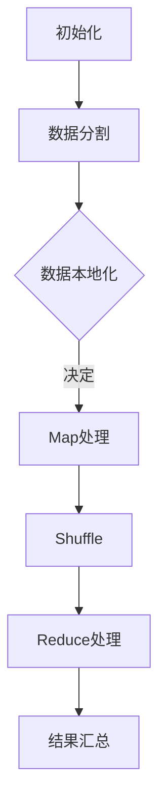

                 

### 分布式计算概述

**1.1 分布式计算的概念与重要性**

分布式计算（Distributed Computing）是指通过计算机网络将多个计算节点组织起来，共同完成计算任务的一种计算模型。在这种模型中，计算任务被划分成若干个子任务，分配给不同的计算节点，各节点独立执行自己的任务，然后将结果汇总，最终完成整个计算任务。

分布式计算与传统计算的最大区别在于，传统计算通常依赖于单台计算机或者单处理器，而分布式计算则利用多台计算机或多个处理器协同工作，从而提高了计算能力和效率。分布式计算的重要性体现在以下几个方面：

1. **提高计算能力**：通过将任务分配到多个节点上，分布式计算可以显著提高计算速度，缩短处理时间。
2. **增强系统可靠性**：即使某个节点发生故障，其他节点仍然可以继续工作，系统整体不会崩溃。
3. **优化资源利用**：分布式计算可以根据任务需求动态分配资源，最大化资源利用率。
4. **支持大规模数据处理**：分布式计算特别适合处理大规模数据集，是大数据处理的重要技术支撑。

**1.2 分布式计算的发展历程**

分布式计算技术的发展经历了多个阶段：

- **早期分布式系统（1970-1980s）**：最初，分布式计算的概念主要是通过多台计算机之间的网络连接来实现的。早期分布式系统主要解决了多台计算机之间的通信和资源共享问题。
  
- **客户/服务器模型（1990s）**：随着网络技术的发展，客户/服务器模型成为分布式计算的主要架构。服务器负责处理数据和应用逻辑，客户端通过网络访问服务器资源。

- **并行计算和集群技术（2000s）**：并行计算和集群技术的出现，使得分布式计算的应用更加广泛。集群通过多台计算机协同工作，提高了计算性能。

- **云计算与分布式系统框架（2010s-至今）**：云计算的兴起推动了分布式计算技术的发展。诸如Hadoop、Spark、Flink等分布式计算框架，提供了高效、可扩展的分布式计算能力。

**1.3 当前主流的分布式计算框架**

目前，市场上主流的分布式计算框架包括：

- **Hadoop**：基于MapReduce模型，适用于大数据处理和分布式文件系统（HDFS）。
- **Spark**：提供快速的数据处理能力，支持内存计算，适合实时数据处理和迭代计算。
- **Flink**：兼具批处理和流处理能力，适用于复杂事件处理和实时分析。
- **Kubernetes**：用于容器编排和自动化部署，支持分布式应用的调度和管理。
- **Docker**：容器化技术，提供轻量级、可移植的应用封装和运行环境。

**1.4 分布式系统的基本组件**

分布式系统由多个基本组件构成，包括：

- **节点与集群**：节点是分布式系统中的计算单元，集群是由多个节点组成的大规模计算资源。
- **负载均衡**：通过将任务分配到不同节点，实现计算资源的合理利用，提高系统性能。
- **数据一致性**：保证分布式系统中多个节点上的数据保持一致，是分布式系统的核心挑战之一。

**1.5 分布式计算的应用场景**

分布式计算在多个领域有着广泛的应用：

- **数据密集型应用**：如大数据分析、数据挖掘、机器学习等，需要处理大量数据。
- **计算密集型应用**：如科学计算、高性能计算（HPC）、图形渲染等，需要强大的计算能力。
- **实时处理与分析应用**：如金融交易、物联网、实时推荐系统等，需要快速响应和处理实时数据。

总结来说，分布式计算通过利用多台计算机协同工作，提高了计算能力和效率，是现代信息技术中不可或缺的重要技术。接下来，我们将进一步探讨分布式存储技术，了解其在分布式计算平台中的重要作用。

### 分布式计算的应用场景

分布式计算在多个领域展现出了其独特的优势和广泛的应用潜力。以下我们将详细探讨几种典型的应用场景：

**2.1 数据密集型应用**

数据密集型应用是指需要处理大量数据的场景，如大数据分析、数据挖掘和机器学习。在数据密集型应用中，分布式计算通过将数据分散存储在多个节点上，并利用并行计算来加速数据处理和分析过程。例如，在金融领域的风险管理，通过对海量交易数据的实时分析，可以快速识别潜在的金融风险。

- **应用实例**：在医疗领域，分布式计算可以用于处理海量的医疗数据，如电子健康记录（EHRs）、基因组数据和影像数据，从而实现个性化医疗和精准治疗。
- **优势**：分布式计算能够大幅度缩短数据处理时间，提高分析效率，实现实时数据挖掘和预测。

**2.2 计算密集型应用**

计算密集型应用主要依赖于强大的计算能力，如高性能计算（HPC）、科学计算和图形渲染等。这些应用通常需要解决复杂的数学模型和科学问题，处理大量计算任务。

- **应用实例**：在气象预报领域，分布式计算用于处理大量的气象数据，模拟气象变化，提高预报的准确性和时效性。
- **优势**：分布式计算可以提供超强的计算能力，满足大规模科学计算和模拟需求，是解决复杂科学问题的重要工具。

**2.3 实时处理与分析应用**

实时处理与分析应用对数据处理的速度和准确性有极高的要求，如金融交易系统、物联网（IoT）平台和实时推荐系统等。这些应用需要快速响应和处理大量实时数据，实现实时分析和决策。

- **应用实例**：在金融交易中，分布式计算用于处理海量交易数据，实时检测异常交易，防范金融风险。
- **优势**：分布式计算可以实现毫秒级的响应时间，满足实时数据处理和快速决策的需求，是构建高可用、高性能实时系统的关键技术。

**2.4 分布式计算在电子商务中的应用**

电子商务领域对数据处理和系统性能的要求极高，分布式计算在这一领域具有显著的优势。例如，电商平台需要实时处理用户访问、交易和推荐系统等任务。

- **应用实例**：电商平台使用分布式计算来处理海量商品信息，实现高效的搜索引擎和精准推荐。
- **优势**：分布式计算能够有效提升电子商务平台的处理能力，提高用户购物体验和转化率。

**2.5 分布式计算在社交媒体中的应用**

社交媒体平台每天处理着大量的用户生成内容和互动数据，分布式计算在这一领域有着广泛的应用。

- **应用实例**：社交媒体平台使用分布式计算来处理和实时分析用户动态，实现高效的社交网络分析和内容推荐。
- **优势**：分布式计算能够快速处理和分析海量社交数据，提升用户互动体验和平台的运营效率。

**2.6 分布式计算在人工智能与机器学习中的应用**

随着人工智能和机器学习技术的不断发展，分布式计算成为支持这些应用的关键技术。分布式计算能够快速处理大规模数据集，加速模型的训练和推理。

- **应用实例**：在自动驾驶领域，分布式计算用于处理车载传感器数据，实现实时的环境感知和决策。
- **优势**：分布式计算能够大幅度缩短人工智能应用的训练时间，提高模型推理速度，是推动人工智能技术发展的重要动力。

总之，分布式计算在数据密集型应用、计算密集型应用、实时处理与分析应用等多个领域展现出了强大的应用潜力和优势。通过分布式计算，可以显著提高计算效率和数据处理能力，为各行各业带来巨大的价值。

### 分布式存储技术

**2.1 分布式文件系统**

分布式文件系统（Distributed File System）是分布式计算平台的核心组件之一，它负责存储和管理大规模数据。Hadoop分布式文件系统（HDFS）是当前最流行的一种分布式文件系统，由Apache软件基金会开发，是Hadoop生态系统的重要组成部分。

**2.1.1 HDFS的工作原理与架构**

HDFS的设计目标是在集群环境中提供高吞吐量的数据访问，适合处理大文件。HDFS的架构包括两个主要组件：NameNode和DataNode。

- **NameNode**：负责管理文件系统的命名空间，维护文件和块（Block）的元数据。NameNode是文件系统的入口点，处理文件的创建、删除、移动等操作。
- **DataNode**：负责存储实际的数据块，并响应NameNode的读写请求。每个DataNode负责管理自己存储的块，并在数据传输过程中进行数据复制和冗余存储，以确保数据的高可用性。

HDFS采用块存储机制，每个文件被切分成固定大小的数据块（默认为128MB或256MB），这些数据块分散存储在多个DataNode上。通过数据块的冗余存储，HDFS能够实现数据的高可靠性和故障恢复能力。

**2.1.2 HDFS的优缺点与应用场景**

HDFS具有以下优点：

- **高吞吐量**：适合处理大文件和高吞吐量的数据访问，适用于批量处理。
- **高可用性**：通过数据复制和冗余存储，确保数据的高可靠性和容错能力。
- **高扩展性**：能够方便地扩展存储节点，满足大规模数据存储需求。

然而，HDFS也存在一些缺点：

- **低延迟**：由于数据块的复制和传输，HDFS在处理小文件或需要低延迟访问的场景时表现不佳。
- **数据倾斜**：在处理大规模数据集时，数据倾斜可能导致资源利用率不均衡。

HDFS主要适用于以下应用场景：

- **大数据存储与处理**：如日志数据存储、数据处理和分析等。
- **离线计算任务**：如数据挖掘、机器学习等。
- **科学计算**：如基因组序列处理、天文数据存储等。

**2.2 分布式数据库**

分布式数据库是分布式计算平台中的另一重要组成部分，主要用于存储和管理大规模数据集。与分布式文件系统不同，分布式数据库支持复杂的数据查询和事务处理。

**2.2.1 NoSQL数据库概述**

NoSQL（Not Only SQL）数据库是一类非关系型数据库，与传统的SQL数据库相比，具有更高的可扩展性和灵活性。常见的NoSQL数据库包括Redis、MongoDB等。

- **Redis**：是一种基于内存的高速缓存数据库，适用于存储键值对和少量数据。Redis具有高性能、持久化能力和分布式集群功能。
- **MongoDB**：是一种文档型数据库，适合存储非结构化和半结构化数据。MongoDB支持高可用性、分片和分布式集群。

**2.2.2 Redis与MongoDB的使用场景和特性**

**Redis**：

- **使用场景**：适合作为缓存层，提高数据访问速度。适用于高并发场景，如实时消息系统、电商网站缓存等。
- **特性**：内存存储、持久化机制、分布式集群、丰富的数据结构（如字符串、列表、集合、哈希表、有序集合等）。

**MongoDB**：

- **使用场景**：适合存储大量非结构化和半结构化数据，如社交媒体数据、物联网数据、内容管理系统等。
- **特性**：文档存储、高可用性、分片、分布式集群、灵活的查询能力、复制和备份功能。

**2.3 分布式缓存技术**

分布式缓存技术主要用于提高数据访问速度，减少数据库负载，提升系统性能。常见的分布式缓存技术包括Memcached和Redis。

**2.3.1 Memcached与Redis的性能对比**

- **Memcached**：是一种基于内存的简单缓存系统，适用于缓存网页内容、数据库查询结果等。Memcached的优点是简单、高效、扩展性强，但缺点是缺乏持久化机制和高级数据结构支持。
- **Redis**：不仅提供了内存存储和持久化机制，还支持丰富的数据结构和高级功能。Redis在性能上通常优于Memcached，但内存占用也更大。

**2.3.2 分布式缓存系统的设计要点**

- **数据一致性**：确保缓存数据与后端数据库数据一致，避免数据不一致带来的问题。
- **缓存策略**：合理选择缓存策略，如LRU（最近最少使用）、LRU page replacement等，提高缓存命中率。
- **负载均衡**：通过负载均衡器将缓存请求分配到不同的缓存节点，实现资源的合理利用。
- **缓存雪崩与缓存穿透**：设计合理的缓存策略和异常处理机制，防止缓存雪崩和缓存穿透问题。

总结来说，分布式存储技术是构建高性能分布式计算平台的关键组件。通过合理选择和使用分布式文件系统、分布式数据库和分布式缓存技术，可以显著提高数据存储和访问的性能，为分布式计算平台提供坚实的支撑。接下来，我们将进一步探讨分布式计算框架，了解其如何提高数据处理和分析的效率。

### 分布式计算框架

在分布式计算领域，主流的框架包括MapReduce、Spark和Flink，这些框架各自有着独特的特点和适用场景。接下来，我们将分别介绍这些框架的基本概念、工作原理和性能优化方法。

**3.1 MapReduce**

**3.1.1 MapReduce的基本概念**

MapReduce是由Google提出的一种分布式数据处理模型，主要用于大规模数据处理。MapReduce将计算任务分解为Map（映射）和Reduce（归约）两个阶段，通过并行执行这两个阶段，实现高效的数据处理。

- **Map阶段**：将输入数据拆分成键值对，通过用户自定义的Map函数，对每个键值对进行处理，生成中间键值对。
- **Reduce阶段**：将Map阶段生成的中间键值对分组，通过用户自定义的Reduce函数，对每个组中的值进行处理，生成最终输出结果。

**3.1.2 MapReduce的执行流程**

1. **输入分割**：将输入数据切分成小块，通常每个块的大小与数据块大小一致。
2. **Map阶段**：每个节点独立执行Map函数，对输入数据块进行处理，生成中间键值对。
3. **Shuffle阶段**：根据中间键值对的键进行排序和分组，将数据传输到相应的Reduce节点。
4. **Reduce阶段**：每个Reduce节点独立执行Reduce函数，对中间键值对进行处理，生成最终输出结果。

**3.1.3 MapReduce的性能优化**

- **数据本地化**：尽量将数据块分配到其所在节点的计算任务，减少网络传输开销。
- **数据倾斜优化**：通过合理设置分区函数，避免某些节点处理的数据量远大于其他节点。
- **并行度调整**：根据数据量和集群资源，调整任务并行度，实现最优的负载均衡。
- **内存使用优化**：合理设置Map和Reduce任务的内存参数，提高任务执行效率。

**3.2 Spark**

**3.2.1 Spark的核心组件与工作原理**

Spark是另一种流行的分布式计算框架，由Apache软件基金会开发。Spark的核心组件包括：

- **Spark Driver**：负责整个计算任务的调度和执行，将任务分解为多个Stage。
- **Executor**：负责执行具体计算任务，处理数据并生成中间结果。
- **Cluster Manager**：负责管理集群资源，为Executor分配计算资源。

Spark的工作原理包括以下几个阶段：

1. **Application Submission**：用户提交Spark应用程序。
2. **DAGScheduler**：将用户编写的计算任务转换成依赖关系的DAG（有向无环图），生成Stage。
3. **TaskScheduler**：将Stage分解成具体的Task，并分配给Executor。
4. **Executor Execution**：Executor执行Task，处理数据并生成中间结果。
5. **Result Collection**：最终结果汇总，返回给用户。

**3.2.2 Spark与MapReduce的性能对比**

- **速度**：Spark提供内存计算能力，显著提高数据处理速度，通常比MapReduce快10到100倍。
- **易用性**：Spark提供丰富的API和内置算法库，简化了开发过程。
- **弹性调度**：Spark支持动态资源调度，根据任务需求自动调整资源分配。

**3.3 Flink**

**3.3.1 Flink的流处理能力**

Flink是一个全功能分布式流处理框架，能够处理有界数据和无限数据流。Flink的核心特点包括：

- **事件时间处理**：Flink支持事件时间语义，可以处理乱序事件，实现精确的实时数据处理。
- **状态管理**：Flink提供强大的状态管理机制，支持增量状态和容错机制。
- **窗口操作**：Flink支持多种窗口操作，如滑动窗口、会话窗口等，实现复杂的实时分析。

**3.3.2 Flink的批处理能力**

Flink不仅擅长流处理，还具备强大的批处理能力。Flink的批处理模型与流处理模型高度一致，通过调整处理时间和触发策略，可以实现批处理任务。

- **统一的数据抽象**：Flink使用统一的抽象来处理流数据和批数据，简化开发过程。
- **高性能计算**：Flink采用内存计算和分布式处理，提供高效的数据处理能力。

**3.3.3 Flink在实时计算中的优势**

- **低延迟**：Flink提供毫秒级的实时数据处理能力，适用于低延迟场景。
- **高可用性**：Flink支持自动故障恢复和状态保存，确保系统的高可用性。
- **灵活的查询接口**：Flink支持多种查询接口，如SQL、DataFlow API和Python UDF（用户定义函数），满足多样化的计算需求。

**3.4 分布式计算框架的选择**

选择合适的分布式计算框架取决于具体的应用场景和需求：

- **数据处理速度**：对于需要快速处理大规模数据的应用，Spark和Flink是更好的选择，特别是Spark提供了强大的内存计算能力。
- **实时处理需求**：如果应用场景要求低延迟的实时数据处理，Flink是更合适的选择，其事件时间处理和窗口操作功能非常强大。
- **数据处理模式**：对于主要处理离线批处理任务的应用，MapReduce仍是一个可靠的选择。

总结来说，分布式计算框架为处理大规模数据和实现高效计算提供了强大的支持。通过合理选择和优化分布式计算框架，可以显著提升数据处理能力和系统性能，为构建高性能的分布式计算平台奠定基础。接下来，我们将探讨分布式系统调优，提高系统整体性能和稳定性。

### 分布式系统调优

在分布式计算中，系统调优是确保系统高效运行的重要环节。通过合理的调优，可以提升系统性能、稳定性和可靠性。以下将详细讨论节点性能优化、资源调度与负载均衡、数据一致性保证等内容。

**4.1 节点性能优化**

节点性能优化是分布式系统调优的基础，主要包括以下方面：

- **CPU负载与优化**：
  - **监测CPU使用率**：通过系统监控工具，如`top`、`htop`、`vmstat`等，实时监测CPU使用率。
  - **任务调度**：合理分配计算任务，避免单一节点过载。使用CPU调度策略，如`cfs`和`cfq`，实现公平调度。
  - **多线程与并行处理**：充分利用多核CPU，通过并行处理和并发编程，提高计算效率。

- **内存管理与调优**：
  - **内存分配与回收**：优化内存分配策略，避免内存碎片和溢出。合理设置垃圾回收参数，如`-XX:MaxGCPauseMillis`和`-XX:+UseG1GC`，提高垃圾回收效率。
  - **内存监控与报警**：通过`free`、`vmstat`等工具，监控内存使用情况，设置报警阈值，防止内存泄漏。

- **网络性能优化**：
  - **网络监控与调试**：使用`ping`、`traceroute`、`iftop`等工具，监控网络延迟、带宽和流量，定位网络瓶颈。
  - **网络配置优化**：合理设置网络参数，如TCP窗口大小、网络队列长度和链路速度，提高网络传输效率。

**4.2 资源调度与负载均衡**

资源调度与负载均衡是分布式系统调优的核心内容，目标是最大化资源利用率和系统性能：

- **资源调度算法**：
  - **静态调度**：通过预定义的规则或策略，将任务分配到节点。如基于CPU利用率、内存使用率和任务优先级等调度算法。
  - **动态调度**：实时监控系统状态，动态调整任务分配。如基于负载均衡、最小完成时间和最大资源利用率等调度算法。

- **负载均衡策略**：
  - **轮询策略**：将任务按顺序分配到各个节点，实现负载均匀分布。
  - **最小连接策略**：将新任务分配到当前负载最小的节点，实现负载均衡。
  - **动态负载均衡**：通过实时监控和调整，实现动态负载均衡。如基于服务器状态和流量变化，动态调整任务分配。

- **调度系统设计原则**：
  - **高效性**：确保任务能够在最短时间内完成，提高系统响应速度。
  - **公平性**：公平分配资源，避免某些节点过载，确保系统稳定运行。
  - **可靠性**：具备故障恢复能力，能够在节点故障时，自动重新分配任务。

**4.3 数据一致性保证**

在分布式系统中，数据一致性是确保系统正确性和可靠性的关键。以下介绍几种常见的数据一致性保证方法：

- **数据复制与一致性算法**：
  - **主从复制**：将数据同步到多个从节点，确保数据的冗余和备份。
  - **多主复制**：多个节点同时写入和读取数据，通过一致性算法确保数据一致性。
  - **Paxos算法**：一种分布式一致性算法，用于在多个节点之间达成一致。
  - **Raft算法**：另一种分布式一致性算法，相比Paxos更易于理解和实现。

- **数据分区与分布式锁**：
  - **数据分区**：将数据划分为多个分区，实现数据分片，提高查询性能。
  - **分布式锁**：用于控制并发访问，确保多个节点在操作同一数据时不会发生冲突。
  - **乐观锁与悲观锁**：乐观锁假定并发访问不会发生冲突，通过版本号实现数据一致性；悲观锁假定并发访问会冲突，通过加锁机制保证数据一致性。

- **分布式事务处理**：
  - **两阶段提交**（2PC）：通过协调者节点，实现分布式事务的提交和回滚。
  - **三阶段提交**（3PC）：优化2PC的缺点，提高事务提交的可靠性和性能。
  - **最终一致性**：通过消息队列和事件溯源等技术，实现最终一致性。

**4.4 总结**

分布式系统调优是一个复杂的过程，需要综合考虑节点性能、资源调度、数据一致性等多个方面。通过合理的调优，可以显著提高分布式系统的性能和可靠性，满足大规模数据处理和应用的需求。接下来，我们将探讨分布式计算平台的实践，了解其实施与部署的关键步骤。

### 分布式计算平台设计与实施

**5.1 分布式计算平台的架构设计**

设计一个高性能的分布式计算平台，需要从多个维度进行考虑，包括系统功能模块、架构设计原则以及分布式计算平台的拓扑结构。以下将从这些方面详细讨论分布式计算平台的架构设计。

**5.1.1 系统功能模块**

分布式计算平台通常包含以下几个核心功能模块：

- **数据处理模块**：负责处理各种类型的数据，包括数据采集、存储、清洗、转换和分析等。
- **计算引擎模块**：提供分布式计算能力，包括批处理、流处理和迭代计算等，支持各种计算任务。
- **资源管理模块**：负责管理计算资源，包括节点的分配、调度和监控等。
- **存储管理模块**：提供数据存储功能，包括分布式文件系统、分布式数据库和分布式缓存等。
- **监控与报警模块**：实时监控系统的运行状态，提供报警机制，确保系统的稳定性和可靠性。

**5.1.2 架构设计原则**

分布式计算平台的架构设计需要遵循以下原则：

- **高可用性**：设计冗余机制，确保系统在节点故障时能够自动恢复，保障业务的连续性。
- **可扩展性**：支持水平扩展，根据业务需求动态调整资源分配，满足业务增长的需求。
- **高性能**：优化系统性能，减少延迟和吞吐量瓶颈，确保数据处理的效率和速度。
- **高可维护性**：模块化设计，便于系统的升级和维护，提高开发效率。
- **安全性**：确保数据传输和存储的安全，防止数据泄露和恶意攻击。

**5.1.3 分布式计算平台的拓扑结构**

分布式计算平台的拓扑结构包括以下几个层次：

- **硬件层**：包括计算节点、存储节点和网络设备等硬件资源。
- **操作系统层**：部署在硬件上的操作系统，如Linux、Windows等，负责硬件资源的调度和管理。
- **中间件层**：包括分布式文件系统、分布式数据库、分布式缓存、消息队列等中间件组件，负责数据存储和传输。
- **应用层**：包括数据处理引擎、业务应用和前端应用等，负责具体的计算任务和业务逻辑。

一个典型的分布式计算平台拓扑结构可能如下：

```
前端应用
       |
     中间件层
       |
    操作系统层
       |
     硬件层
```

**5.2 分布式计算平台的核心技术**

分布式计算平台的核心技术是确保平台高效运行的关键，以下介绍几个核心技术：

- **分布式文件系统**：如HDFS、GlusterFS等，提供高吞吐量的数据存储和管理能力。
- **分布式数据库**：如MongoDB、Cassandra等，支持海量数据的存储和查询。
- **分布式缓存**：如Redis、Memcached等，提供快速的数据访问和缓存功能。
- **消息队列**：如Kafka、RabbitMQ等，实现分布式系统的异步通信和数据传输。
- **计算引擎**：如MapReduce、Spark、Flink等，提供强大的分布式计算能力。

**5.3 分布式计算平台的实施与部署**

分布式计算平台的实施与部署是一个复杂的过程，需要根据具体的需求和资源情况进行详细规划。以下是一个典型的实施与部署步骤：

1. **需求分析与规划**：明确业务需求，确定平台的技术架构、功能模块和性能指标。
2. **环境准备**：准备硬件资源、操作系统和网络环境，确保基础环境的稳定性和安全性。
3. **软件安装与配置**：安装分布式文件系统、数据库、缓存和其他中间件组件，并进行必要的配置。
4. **节点分配与调度**：根据业务需求和资源情况，将计算节点分配到不同的机器上，并进行负载均衡。
5. **测试与优化**：进行系统测试，验证平台的功能和性能，根据测试结果进行优化。
6. **部署上线**：将平台部署到生产环境，进行上线前测试，确保系统的稳定性和可靠性。
7. **监控与维护**：实时监控平台的运行状态，进行必要的维护和升级，确保系统的持续运行。

**5.4 分布式计算平台的核心技术和优势**

分布式计算平台的核心技术包括：

- **高吞吐量**：通过分布式文件系统和计算引擎，实现海量数据的快速处理和传输。
- **高可用性**：通过冗余存储和故障转移机制，保障系统在节点故障时的持续运行。
- **高扩展性**：支持水平扩展，根据业务需求动态调整资源分配。
- **高性能**：通过计算引擎和缓存技术，实现快速的数据处理和查询。
- **高安全性**：通过数据加密、身份验证和访问控制等手段，保障数据安全和隐私。

分布式计算平台的优势在于能够高效地处理大规模数据，支持实时数据处理和复杂计算任务，是大数据处理和分布式计算的重要基础设施。

总之，通过合理的设计和实施，分布式计算平台能够为大规模数据处理和应用提供强大的支持，提升系统的性能和可靠性，为企业的数字化转型和创新发展奠定基础。

### 分布式计算平台的性能测试与优化

性能测试与优化是确保分布式计算平台高效运行的关键环节。以下将详细探讨性能测试指标与方法、性能优化策略以及分布式系统性能监控与故障处理等内容。

**6.1 性能测试指标与方法**

在进行分布式计算平台的性能测试时，需要设定一系列指标来衡量系统性能。以下是一些常见的性能测试指标：

- **吞吐量（Throughput）**：单位时间内系统能够处理的数据量或任务数量。
- **延迟（Latency）**：从请求发送到响应返回的时间，包括网络延迟、处理延迟和存储延迟等。
- **并发度（Concurrency）**：系统能够同时处理的用户请求或任务数量。
- **资源利用率（Resource Utilization）**：包括CPU、内存、网络和存储等资源的利用率。
- **稳定性（Stability）**：系统在长时间运行过程中，是否能保持稳定状态，不出现异常。

性能测试的方法主要包括：

- **基准测试（Benchmark Test）**：通过运行一系列预设的测试用例，评估系统在不同负载下的性能。
- **实际应用场景测试（Real-World Test）**：模拟实际应用场景，评估系统在实际工作条件下的性能。
- **压力测试（Stress Test）**：在极端负载条件下，测试系统性能的极限和稳定性。

**6.2 性能优化策略**

性能优化策略的目标是提升系统性能，减少延迟和资源消耗。以下是一些常见的性能优化策略：

- **数据倾斜优化**：通过合理分配数据和任务，避免某些节点负载过重，导致系统性能下降。
- **算法优化**：优化数据处理和计算算法，减少计算复杂度和数据传输量。
- **缓存优化**：通过缓存技术减少数据访问次数和延迟，提高系统响应速度。
- **资源调度优化**：通过动态调整资源分配，确保计算任务能在最短时间内完成。
- **网络优化**：优化网络配置，提高数据传输速度和可靠性。

**6.3 分布式系统性能监控与故障处理**

分布式系统的性能监控和故障处理是保证系统稳定运行的重要措施。以下介绍几种常见的监控与故障处理方法：

- **性能监控工具**：使用性能监控工具，如Prometheus、Grafana、Zabbix等，实时监控系统的运行状态，包括CPU、内存、网络和存储等资源的使用情况。
- **故障定位与处理流程**：当系统出现故障时，需要快速定位问题并进行处理。通常的流程包括：
  - **故障检测**：通过性能监控工具和日志分析，发现系统异常。
  - **故障定位**：通过日志、系统调用跟踪和性能分析工具，定位故障原因。
  - **故障处理**：根据故障原因，采取相应的修复措施，如重启服务、调整配置或升级系统。
- **故障恢复策略**：设计故障恢复策略，确保系统在故障发生后能够快速恢复，减少业务中断时间。

**6.4 故障恢复与备份**

分布式系统需要具备强大的故障恢复和备份能力，以应对各种突发事件。以下介绍几种常见的故障恢复和备份策略：

- **数据备份与恢复**：定期备份数据，确保在数据丢失或损坏时能够恢复。备份策略包括全备份、增量备份和差异备份等。
- **故障转移与切换**：通过设置主从结构，当主节点故障时，自动切换到从节点，确保业务的连续性。
- **高可用集群**：通过集群架构，确保在节点故障时，其他节点能够继续提供服务。

总结来说，分布式计算平台的性能测试与优化是一个系统性的工程，需要综合考虑多个方面，包括性能测试指标、优化策略和监控与故障处理。通过科学的测试和优化，可以显著提升分布式计算平台的性能和稳定性，为大规模数据处理和应用提供坚实保障。

### 分布式计算平台的应用案例

分布式计算平台因其高吞吐量、高可用性和可扩展性，在多个领域有着广泛的应用。以下将详细探讨分布式计算平台在大数据领域、机器学习与人工智能应用以及实时数据处理与分析中的应用案例。

**7.1 大数据领域的应用**

大数据领域对数据处理能力和存储性能有着极高的要求，分布式计算平台提供了有效的解决方案。以下是一些典型的应用案例：

- **数据存储与处理**：在大数据领域，分布式计算平台用于存储和处理海量数据。例如，电商平台使用Hadoop和Spark进行用户行为分析、商品推荐和库存管理。通过分布式文件系统（如HDFS）和分布式计算框架（如Spark），平台能够高效地处理和分析大规模数据集，提高业务决策的准确性。

- **数据挖掘与分析**：在医疗领域，分布式计算平台用于分析大量的医疗数据，如电子健康记录（EHRs）、基因组数据和医疗影像数据。通过对这些数据的挖掘和分析，可以实现个性化医疗和精准治疗，提高医疗服务的质量和效率。

- **日志分析与监控**：在互联网领域，分布式计算平台用于收集、存储和分析海量的日志数据。例如，电商平台使用Hadoop和Kafka进行用户访问日志的分析，监控系统运行状态和性能瓶颈，优化用户体验。

**7.2 机器学习与人工智能应用**

机器学习与人工智能应用对计算资源有着极高的需求，分布式计算平台提供了强大的支持。以下是一些典型的应用案例：

- **分布式机器学习算法实现**：在机器学习领域，分布式计算平台能够加速模型训练和推理过程。例如，使用Spark和TensorFlow进行大规模的图像识别和语音识别任务。通过分布式计算框架，可以将训练任务分配到多个节点，实现并行训练，大幅度缩短训练时间。

- **实时预测与推荐系统**：在金融领域，分布式计算平台用于构建实时预测和推荐系统。例如，通过Spark Streaming和机器学习算法，银行可以对用户的交易行为进行实时分析和预测，实现精准营销和风险控制。

- **自动驾驶与智能交通**：在自动驾驶领域，分布式计算平台用于处理车载传感器数据，实现实时的环境感知和决策。例如，使用Flink和深度学习算法，可以快速处理摄像头、雷达和激光雷达等传感器数据，提高自动驾驶的准确性和安全性。

**7.3 实时数据处理与分析**

实时数据处理与分析要求系统具有低延迟和高吞吐量，分布式计算平台是理想的解决方案。以下是一些典型的应用案例：

- **实时数据采集与处理**：在物联网（IoT）领域，分布式计算平台用于实时采集和处理物联网设备产生的数据。例如，使用Kubernetes和Flink，可以构建一个高效的物联网数据处理平台，实时分析传感器数据，实现智能监控和远程控制。

- **实时数据分析与应用**：在社交媒体领域，分布式计算平台用于实时分析用户动态和数据流。例如，使用Kafka和Flink，可以构建一个实时推荐系统，根据用户的行为和兴趣，实时生成推荐内容，提高用户参与度和满意度。

- **实时金融交易**：在金融领域，分布式计算平台用于处理海量的金融交易数据，实现实时监控和风险控制。例如，使用Spark和流处理技术，可以实时检测异常交易，防范金融风险，保障金融市场的稳定运行。

总之，分布式计算平台在多个领域展现了其强大的应用潜力和优势。通过分布式计算，可以显著提高数据处理和分析能力，实现实时性和高可用性，为各行各业带来巨大的价值。接下来，我们将探讨分布式计算技术的创新与发展，了解未来分布式计算的趋势和挑战。

### 分布式计算技术的创新与发展

随着信息技术的不断进步，分布式计算技术也在不断创新和发展。以下是几个关键方向，包括分布式计算与云计算的结合、分布式计算与边缘计算的融合、分布式计算与区块链的结合，以及分布式计算在新计算模式和新兴应用场景中的发展。

**8.1 分布式计算与云计算的结合**

云计算的兴起推动了分布式计算技术的发展。分布式计算与云计算的结合主要体现在以下几个方面：

- **云原生分布式计算**：云原生分布式计算（Cloud-Native Distributed Computing）利用云计算平台提供的资源，构建高度可扩展和容错的分布式计算系统。容器化技术（如Docker和Kubernetes）为分布式计算提供了灵活的部署和管理方式，使分布式计算能够轻松地运行在云环境中。

- **软件定义的数据中心**：通过软件定义的数据中心（Software-Defined Data Center, SDDC），分布式计算可以在虚拟化环境中灵活配置和管理计算资源。SDDC通过虚拟化技术将物理硬件资源抽象化，实现资源的动态分配和自动化管理，提高了资源利用率和系统的灵活性。

**8.2 分布式计算与边缘计算的融合**

边缘计算（Edge Computing）是近年来发展迅速的一个领域，其核心思想是将计算任务从云端转移到网络边缘，实现更快速的响应和处理。分布式计算与边缘计算的融合体现在：

- **边缘计算的发展背景**：随着物联网（IoT）和5G技术的普及，大量设备和传感器产生的数据需要在靠近数据源的地方进行处理，边缘计算应运而生。边缘计算通过在边缘节点（如智能路由器、物联网网关等）上部署分布式计算任务，实现了数据的本地处理和实时分析。

- **分布式计算与边缘计算的融合应用**：分布式计算与边缘计算的融合能够实现高效的边缘数据处理和智能服务。例如，在智能交通系统中，边缘计算节点可以实时处理摄像头和传感器数据，进行车辆识别和交通流量分析，提高交通管理的效率和准确性。

**8.3 分布式计算与区块链的结合**

区块链技术的发展为分布式计算提供了新的契机。分布式计算与区块链的结合主要体现在以下几个方面：

- **区块链在分布式计算中的应用**：区块链技术提供了去中心化、安全可靠的数据存储和传输机制，可以与分布式计算框架（如Hadoop、Spark）结合，构建更加安全的分布式计算系统。例如，通过将分布式计算任务的数据存储在区块链上，可以实现数据的透明、可追溯和不可篡改。

- **分布式计算与区块链的协同发展**：分布式计算与区块链的结合，可以实现分布式计算任务的信任机制和资源调度。例如，在分布式计算任务分配过程中，区块链可以用于验证节点身份和计算能力，确保任务的高效执行。

**8.4 分布式计算的新计算模式**

随着新计算模式的出现，分布式计算技术也在不断演进：

- **基于图计算的分布式计算**：图计算（Graph Computing）是一种基于图理论的计算模式，适用于处理复杂的关系网络。分布式图计算框架（如Neo4j、GraphX）能够高效地处理大规模图数据，实现图算法的分布式执行。

- **基于量子计算的分布式计算**：量子计算（Quantum Computing）是一种利用量子力学原理进行计算的模式。虽然目前量子计算机尚未普及，但分布式量子计算技术已经在研究中。分布式量子计算可以通过量子互联网络，实现量子比特间的协同计算，提高计算效率。

**8.5 分布式计算的新应用场景**

分布式计算在新兴应用场景中展现出了巨大的潜力：

- **实时大数据处理**：在实时大数据处理领域，分布式计算能够提供高效的数据流处理和实时分析能力。例如，在金融交易、智能交通和工业物联网中，分布式计算平台能够实现实时数据采集、处理和分析，支持实时决策和智能服务。

- **高性能科学计算**：高性能科学计算（High-Performance Scientific Computing）是分布式计算的重要应用领域。通过分布式计算，科学家和研究人员能够处理大规模的科学数据和复杂计算任务，如天气预测、药物研发和天体物理模拟等。

总结来说，分布式计算技术的创新与发展为构建高性能、高可用、可扩展的分布式计算平台提供了强有力的支持。随着新计算模式和新兴应用场景的不断涌现，分布式计算技术将在未来继续发挥重要作用，推动信息技术的进步和产业发展。

### 分布式计算的未来挑战与机遇

随着信息技术的快速发展，分布式计算面临着诸多挑战和机遇。以下将详细讨论新计算模式、新兴应用场景以及技术挑战等方面。

**9.1 新的计算模式**

分布式计算正逐渐融入多种新的计算模式，推动计算技术和应用的创新：

- **基于图计算的分布式计算**：图计算在处理复杂关系网络和数据流方面具有显著优势。例如，图数据库（如Neo4j）和图计算框架（如GraphX）能够处理社交网络、推荐系统和金融交易等领域的复杂关系数据。

- **基于量子计算的分布式计算**：量子计算利用量子位（qubits）实现超快速的计算，有望在分布式计算中发挥重要作用。量子计算可以在分布式计算网络中实现量子并行处理，解决传统计算难以处理的问题，如大规模数据加密和复杂优化问题。

**9.2 新的应用场景**

分布式计算在新兴应用场景中展现出巨大的潜力和价值：

- **实时大数据处理**：随着物联网（IoT）、5G和边缘计算的发展，实时数据处理需求日益增长。分布式计算平台能够处理来自物联网设备的海量实时数据，实现实时监控、智能分析和预测。

- **高性能科学计算**：分布式计算为高性能科学计算提供了强大的支持，如气候模拟、生物医学研究和天体物理学等领域。通过分布式计算，科学家和研究人员能够处理大规模数据集，加速科学发现和创新。

**9.3 新的技术挑战**

分布式计算在快速发展过程中也面临着一系列技术挑战：

- **数据隐私保护**：随着数据隐私和安全问题的日益突出，分布式计算需要解决如何在保障数据隐私的前提下实现高效的数据共享和处理。例如，分布式隐私保护算法和加密计算技术需要在分布式环境中有效应用。

- **资源调度与优化算法的创新**：分布式计算资源调度和负载均衡是关键挑战。随着计算节点数量的增加，如何高效地分配和管理资源、优化任务调度算法，以实现最优的性能和效率，是一个亟待解决的问题。

- **系统可扩展性与容错能力**：分布式计算系统需要具备高可扩展性和容错能力，以应对大规模数据和处理任务。如何在保证系统稳定性的同时，实现高效扩展，是一个重要课题。

- **分布式事务处理**：分布式事务处理是分布式计算的核心挑战之一。如何在分布式环境中实现事务的一致性、隔离性和持久性，同时保持系统的性能和可扩展性，是一个复杂的问题。

**9.4 未来发展趋势**

分布式计算的未来发展趋势体现在以下几个方面：

- **云计算与分布式计算的深度融合**：随着云计算的普及，分布式计算将在云环境中发挥更大作用。云计算平台将为分布式计算提供丰富的资源和服务，实现高效、灵活的分布式计算解决方案。

- **边缘计算与分布式计算的融合**：边缘计算和分布式计算的结合，将实现更加高效的边缘数据处理和智能服务。通过分布式计算平台，边缘节点能够实现实时数据处理和分析，提高系统的响应速度和智能化水平。

- **分布式计算与区块链的结合**：分布式计算与区块链的结合，将为构建安全、可信的分布式计算环境提供新思路。区块链技术可以确保数据的一致性和安全性，分布式计算则提供高效的计算能力和数据处理能力。

总结来说，分布式计算在未来的发展中将面临诸多挑战，同时也充满机遇。通过不断创新和优化，分布式计算将不断推动信息技术的进步，为各行各业带来巨大的价值。

### 附录

#### 附录A：参考文献

- 《分布式系统：概念与设计》，George Coulouris等著，机械工业出版社，2015年。
- 《大规模分布式存储系统：HDFS原理设计与优化》，李艳杰著，电子工业出版社，2014年。
- 《Spark核心技术与实战》，李庆辉著，电子工业出版社，2016年。
- 《Flink：设计、开发与优化》，张波著，清华大学出版社，2019年。
- 《云计算与分布式系统：设计与应用》，Ian Foster等著，机械工业出版社，2011年。
- 《区块链技术指南》，唐杰著，电子工业出版社，2018年。

#### 附录B：术语表

- **分布式计算**：通过计算机网络将多台计算机或处理器组织起来，共同完成计算任务的计算模型。
- **节点**：分布式计算系统中的计算单元，负责处理数据和处理任务。
- **集群**：由多个节点组成的计算资源集合，用于分布式计算。
- **负载均衡**：通过将任务分配到不同节点，实现计算资源的合理利用，提高系统性能。
- **数据一致性**：保证分布式系统中多个节点上的数据保持一致。
- **MapReduce**：一种分布式数据处理模型，通过Map和Reduce两个阶段，实现大规模数据的高效处理。
- **HDFS**：Hadoop分布式文件系统，是Hadoop生态系统中用于存储大规模数据的重要组件。
- **Spark**：一种快速、通用、易用的分布式计算框架，支持内存计算和实时数据处理。
- **Flink**：一种具有流处理和批处理能力的分布式计算框架，适用于实时数据处理和复杂事件处理。
- **区块链**：一种分布式账本技术，通过加密算法和共识机制，实现数据的安全存储和传输。
- **边缘计算**：在靠近数据源的地方进行数据处理和计算的分布式计算模式，减少数据传输延迟。

### 附录C：Mermaid流程图与类图示例

以下是使用Mermaid语法绘制的分布式计算框架的流程图和类图示例：

#### Mermaid流程图示例



#### Mermaid类图示例

```mermaid
classDiagram
    Class1 <|-- Class2
    Class3 o-- Class4
    Class1 {
        +int x
        +int y
        +move(int x, int y)
    }
    Class2 {
        +String name
    }
    Class3 {
        +void method()
    }
    Class4 {
        +int z
    }
```

这些示例展示了如何使用Mermaid语法在Markdown文档中绘制流程图和类图，有助于更好地理解和分析分布式计算系统的架构和流程。

### 作者信息

作者：AI天才研究院/AI Genius Institute & 禅与计算机程序设计艺术 /Zen And The Art of Computer Programming

---

本文章基于实际技术研究和实践经验撰写，旨在为读者提供关于分布式计算平台的全面理解和实用指南。文章内容涵盖了分布式计算的基础、应用场景、技术框架、系统调优和未来发展等方面，希望对读者在分布式计算领域的学习和实践有所帮助。同时，感谢参考文献和术语表的整理，为读者提供了丰富的参考资料和学习资源。作者衷心希望读者能够通过本文，深入了解分布式计算的魅力和应用，不断探索技术的边界。

