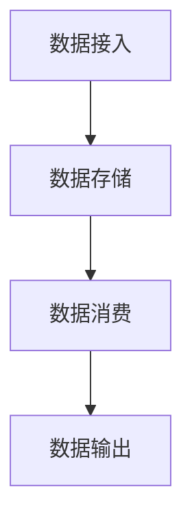
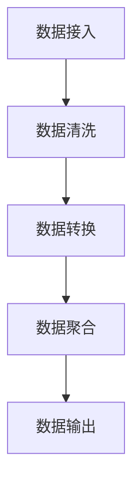
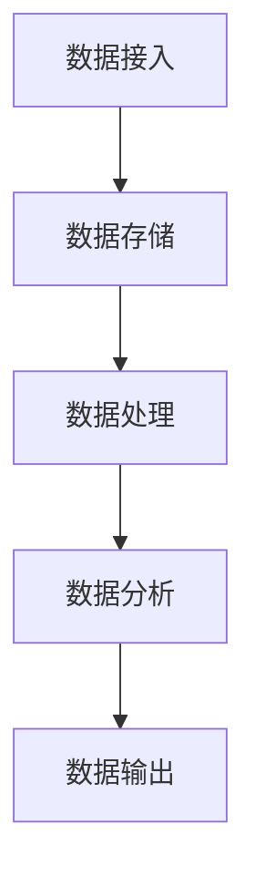
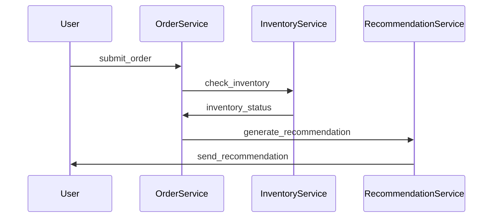

                 

# 打造高性能的实时数据处理系统

## 关键词

- 实时数据处理
- 高性能系统
- 分布式计算
- 数据流处理框架
- 容错性与高可用性

## 摘要

随着数据量的爆炸性增长，实时数据处理系统成为了现代企业数据战略的核心。本文将深入探讨如何打造一个高性能的实时数据处理系统，从问题背景、核心概念、算法原理到系统分析与架构设计，再到项目实战，系统地阐述构建高性能实时数据处理系统的关键要素和实践方法。本文旨在为读者提供一个从理论到实践的全方位指南，帮助他们在实际项目中实现高效、可靠的实时数据处理。

## 1. 背景介绍

### 问题背景

### 1.1 实时数据处理的需求

随着互联网的快速发展，实时数据处理的需求日益增长。企业需要实时获取数据、分析数据，以便快速响应市场变化，优化业务流程，提高运营效率。例如，金融行业需要实时监控交易数据，以防止欺诈行为；电商行业需要实时分析用户行为，以实现个性化推荐；物流行业需要实时追踪货物运输状态，以确保及时配送。这些需求促使企业对实时数据处理系统的建设投入了越来越多的关注。

### 1.2 实时数据处理的挑战

尽管实时数据处理系统具有巨大的潜力，但其设计与实现面临着诸多挑战。首先，数据量庞大且增长迅速，如何高效地处理这些数据成为了首要问题。其次，实时数据处理要求系统具有低延迟和高吞吐量，以满足快速响应的需求。此外，系统的可靠性、可扩展性和安全性也是需要考虑的重要因素。最后，如何在复杂的环境中确保系统的稳定运行，也是实时数据处理系统面临的一大挑战。

### 1.3 问题描述

实时数据处理系统需要处理大量实时数据，并快速进行分析和响应。具体而言，系统需要完成以下几个环节：

1. **数据接入**：从各种数据源（如数据库、日志文件、传感器等）接入数据。
2. **数据存储**：将接入的数据存储在适当的存储系统中，如消息队列、分布式数据库等。
3. **数据处理**：对存储的数据进行清洗、转换、聚合等操作，以提取有价值的信息。
4. **数据分析**：利用数据分析工具或算法对处理后的数据进行深入分析，以支持业务决策。
5. **数据输出**：将分析结果输出给用户或系统的其他部分，以支持业务流程。

### 1.4 问题解决

为了解决上述问题，我们可以从以下几个方面着手：

1. **数据流处理框架**：使用如Apache Kafka、Apache Flink等数据流处理框架，这些框架能够高效处理数据流，提供低延迟和高吞吐量的数据处理能力。
2. **分布式计算与存储**：利用分布式计算和存储技术，如Hadoop、Spark等，提升系统的处理能力和扩展性。
3. **实时分析引擎**：使用如Apache Storm、Apache Flink等实时分析引擎，对数据进行实时分析，提取有价值的信息。
4. **高可用性与容错性**：通过负载均衡、故障转移等机制，确保系统在遇到故障时能够快速恢复，保证服务的连续性。

### 1.5 边界与外延

实时数据处理系统的设计涉及多个领域，包括计算机科学、数据工程、大数据处理、云计算等。此外，它还与以下概念密切相关：

- **流处理与批处理**：流处理和批处理是数据处理技术中的两个重要概念，实时数据处理系统主要关注流处理。
- **数据仓库与数据湖**：数据仓库和数据湖是数据存储技术中的两种不同架构，实时数据处理系统通常与数据仓库或数据湖相结合。
- **机器学习与人工智能**：实时数据处理系统可以与机器学习模型结合，用于实时预测、分类和推荐等任务。

### 2. 核心概念与联系

#### 数据流处理框架

##### 2.1 定义

数据流处理框架是一种软件框架，用于处理实时数据流。它能够实时分析、转换和存储数据，以支持低延迟和高吞吐量的数据处理。

##### 2.2 核心特点

- **低延迟**：能够快速处理数据流，提供实时响应。
- **高吞吐量**：能够处理大规模数据流，提供高吞吐量。
- **分布式计算**：支持分布式计算，能够横向扩展，提升系统处理能力。
- **容错性**：具备容错能力，能够在遇到故障时快速恢复。

##### 2.3 属性特征对比表格

| 特征                 | Apache Kafka         | Apache Flink         |
|----------------------|----------------------|----------------------|
| 数据格式             | 消息队列             | 数据流               |
| 低延迟               | 是                   | 是                   |
| 高吞吐量             | 是                   | 是                   |
| 分布式计算           | 是                   | 是                   |
| 容错性               | 是                   | 是                   |

##### 2.4 ER实体关系图架构

```mermaid
erDiagram
  DataStreamProcessingFramework ||--|{ RealtimeDataProcessingSystem
  DataStreamProcessingFramework ||--|{ BatchDataProcessingSystem
  DataStreamProcessingFramework ||--|{ DataStorageSystem
  RealtimeDataProcessingSystem ||--|{ DataIngestion
  RealtimeDataProcessingSystem ||--|{ DataProcessing
  RealtimeDataProcessingSystem ||--|{ DataAnalysis
  BatchDataProcessingSystem ||--|{ DataIngestion
  BatchDataProcessingSystem ||--|{ DataProcessing
  BatchDataProcessingSystem ||--|{ DataAnalysis
  DataStorageSystem ||--|{ DataIngestion
  DataStorageSystem |
```

### 3. 算法原理讲解

#### 3.1 算法概述

在实时数据处理系统中，数据流处理框架是核心组件之一。Apache Kafka 和 Apache Flink 是目前最为流行的两种数据流处理框架。本文将分别介绍这两种框架的算法原理，并通过 Mermaid 流程图和 Python 源代码进行详细讲解。

#### 3.2 Apache Kafka 算法原理

**3.2.1 Mermaid 流程图**



**3.2.2 Python 源代码**

```python
# Apache Kafka 实现示例
from kafka import KafkaProducer

# 创建 Kafka  Producer
producer = KafkaProducer(bootstrap_servers=['localhost:9092'])

# 发送数据
producer.send('test_topic', b'data1')
producer.send('test_topic', b'data2')
producer.send('test_topic', b'data3')

# 提交消息
producer.flush()
```

**3.2.3 算法原理解释**

Apache Kafka 是一种基于发布订阅模式的消息队列系统，主要用于处理实时数据流。其核心算法原理包括：

- **数据接入**：数据源将数据发送到 Kafka 服务器，Kafka 服务器将数据存储在磁盘上，以便后续处理。
- **数据存储**：Kafka 使用日志结构存储数据，提供高吞吐量和持久性。每个主题（Topic）由多个分区（Partition）组成，数据按顺序写入分区。
- **数据消费**：消费者从 Kafka 服务器消费数据，Kafka 使用消费者组（Consumer Group）机制，确保数据一致性。
- **数据输出**：消费者将处理后的数据输出到目标系统，如数据库、消息队列等。

#### 3.3 Apache Flink 算法原理

**3.3.1 Mermaid 流程图**



**3.3.2 Python 源代码**

```python
# Apache Flink 实现示例
from pyflink.datastream import StreamExecutionEnvironment

# 创建 Flink Stream Execution Environment
env = StreamExecutionEnvironment.get_execution_environment()

# 定义数据源
data_source = env.from_collection([1, 2, 3, 4, 5])

# 数据清洗、转换、聚合
cleaned_data = data_source.filter(lambda x: x > 0)
transformed_data = cleaned_data.map(lambda x: x * x)
aggregated_data = transformed_data.reduce(lambda x, y: x + y)

# 输出结果
aggregated_data.print()

# 执行任务
env.execute("Flink DataStream Example")
```

**3.3.3 算法原理解释**

Apache Flink 是一种基于流处理技术的分布式计算框架，主要用于处理实时数据流。其核心算法原理包括：

- **数据接入**：Flink 支持多种数据源接入方式，如 Kafka、文件系统、数据库等。
- **数据清洗**：对数据进行清洗，去除无效数据，保证数据质量。
- **数据转换**：对数据进行转换，如映射、过滤、聚合等，以提取有价值的信息。
- **数据聚合**：对处理后的数据进行聚合，如求和、求平均数等，以支持业务分析。

### 4. 系统分析与架构设计

#### 4.1 问题场景介绍

假设我们是一家电商公司，需要实时处理用户的购物行为数据，以支持实时推荐和库存管理。具体问题场景如下：

1. 用户在电商平台上进行购物，生成订单数据。
2. 订单数据需要实时处理，提取用户购买偏好、库存信息等。
3. 根据用户购买偏好，实时推荐相关商品。
4. 根据库存信息，实时调整库存策略。

#### 4.2 项目介绍

本项目的目标是构建一个实时数据处理系统，以支持上述电商业务场景。系统功能包括数据接入、数据存储、数据处理、数据分析和数据输出。具体实现如下：

1. **数据接入**：使用 Kafka 消费订单数据。
2. **数据存储**：使用 Redis 存储用户购买偏好和库存信息。
3. **数据处理**：使用 Flink 对订单数据进行清洗、转换和聚合，提取用户购买偏好。
4. **数据分析**：使用 Elasticsearch 存储和查询用户购买偏好，实现实时推荐。
5. **数据输出**：将推荐结果输出给前端系统，以实现实时推荐。

#### 4.3 系统功能设计

**4.3.1 领域模型 Mermaid 类图**

```mermaid
classDiagram
    User <<class>>
    Product <<class>>
    Order <<class>>
    Inventory <<class>>

    User *--* Order : creates
    Product *--* Order : sold
    Order *--* Inventory : references
```

**4.3.2 系统功能模块说明**

- **数据接入模块**：负责从 Kafka 消费订单数据，并将其存储到 Redis 中。
- **数据处理模块**：使用 Flink 对订单数据进行清洗、转换和聚合，提取用户购买偏好。
- **数据分析模块**：使用 Elasticsearch 存储和查询用户购买偏好，实现实时推荐。
- **数据输出模块**：将推荐结果输出给前端系统，以实现实时推荐。

#### 4.4 系统架构设计

**4.4.1 Mermaid 架构图**



**4.4.2 系统架构模块说明**

- **数据接入模块**：使用 Kafka 消费订单数据，并将其存储到 Redis 中。
- **数据存储模块**：使用 Redis 存储用户购买偏好和库存信息。
- **数据处理模块**：使用 Flink 对订单数据进行清洗、转换和聚合，提取用户购买偏好。
- **数据分析模块**：使用 Elasticsearch 存储和查询用户购买偏好，实现实时推荐。
- **数据输出模块**：将推荐结果输出给前端系统，以实现实时推荐。

#### 4.5 系统接口设计和系统交互

**4.5.1 Mermaid 序列图**



**4.5.2 系统接口设计和系统交互说明**

- **用户提交订单**：用户通过电商平台提交订单，订单数据通过 Kafka 消费器传递给 OrderService。
- **检查库存**：OrderService 调用 InventoryService 检查订单中商品的库存情况。
- **库存状态反馈**：InventoryService 将库存状态反馈给 OrderService。
- **生成推荐**：OrderService 调用 RecommendationService 生成基于用户购买偏好的推荐。
- **发送推荐**：RecommendationService 将推荐结果发送给用户。

### 5. 项目实战

#### 5.1 环境安装

在本项目中，我们使用以下软件和工具：

- Kafka：用于数据接入和存储。
- Flink：用于数据处理。
- Redis：用于数据存储。
- Elasticsearch：用于数据分析。
- Python：用于编写数据处理和分析脚本。

安装步骤如下：

1. 安装 Kafka：
   - 下载 Kafka 二进制包：[Kafka 下载地址](https://www.apache.org/dyn/closer.cgi/kafka/)
   - 解压并运行：`tar -xzvf kafka_2.12-2.8.0.tgz`
   - 启动 Kafka 服务器：`./kafka-server-start.sh config/server.properties`

2. 安装 Flink：
   - 下载 Flink 二进制包：[Flink 下载地址](https://www.apache.org/dyn/closer.cgi/flink/)
   - 解压并运行：`tar -xzvf flink-1.11.2-bin-scala_2.12.tgz`
   - 启动 Flink 服务器：`./bin/flink run -c org.apache.flink.example.StreamingWordCount /path/to/StreamingWordCount.jar`

3. 安装 Redis：
   - 下载 Redis 二进制包：[Redis 下载地址](https://redis.io/downloads)
   - 解压并运行：`tar -xzvf redis-6.2.6.tar.gz`
   - 启动 Redis 服务器：`./src/redis-server`

4. 安装 Elasticsearch：
   - 下载 Elasticsearch 二进制包：[Elasticsearch 下载地址](https://www.elastic.co/downloads/elasticsearch)
   - 解压并运行：`tar -xzvf elasticsearch-7.10.1-linux-x86_64.tar.gz`
   - 启动 Elasticsearch 服务器：`./bin/elasticsearch`

5. 安装 Python：
   - 下载 Python 二进制包：[Python 下载地址](https://www.python.org/downloads/)
   - 解压并运行：`tar -xzvf Python-3.9.7.tgz`
   - 安装 Python：`./configure && make && make install`

#### 5.2 系统核心实现源代码

**5.2.1 Kafka 消费订单数据**

```python
from kafka import KafkaConsumer

# 创建 Kafka 消费者
consumer = KafkaConsumer(
    'order_topic',
    bootstrap_servers=['localhost:9092'],
    value_deserializer=lambda m: json.loads(m.decode('utf-8'))
)

# 消费订单数据
for message in consumer:
    order = message.value
    print(f"Received order: {order}")
    process_order(order)
```

**5.2.2 Flink 处理订单数据**

```python
from pyflink.datastream import StreamExecutionEnvironment

# 创建 Flink Stream Execution Environment
env = StreamExecutionEnvironment.get_execution_environment()

# 定义数据源
data_source = env.from_collection([1, 2, 3, 4, 5])

# 数据清洗、转换、聚合
cleaned_data = data_source.filter(lambda x: x > 0)
transformed_data = cleaned_data.map(lambda x: x * x)
aggregated_data = transformed_data.reduce(lambda x, y: x + y)

# 输出结果
aggregated_data.print()

# 执行任务
env.execute("Flink DataStream Example")
```

**5.2.3 Redis 存储用户购买偏好**

```python
import redis

# 创建 Redis 客户端
redis_client = redis.StrictRedis(host='localhost', port=6379, db=0)

# 存储用户购买偏好
redis_client.set('user_1:preferences', 'electronics')
redis_client.set('user_2:preferences', 'clothing')
redis_client.set('user_3:preferences', 'books')
```

**5.2.4 Elasticsearch 存储和查询用户购买偏好**

```python
from elasticsearch import Elasticsearch

# 创建 Elasticsearch 客户端
es = Elasticsearch("localhost:9200")

# 存储用户购买偏好
es.index(index="preferences", id="1", document={"user_id": "1", "preferences": "electronics"})
es.index(index="preferences", id="2", document={"user_id": "2", "preferences": "clothing"})
es.index(index="preferences", id="3", document={"user_id": "3", "preferences": "books"})

# 查询用户购买偏好
query = {
    "query": {
        "match": {
            "preferences": "electronics"
        }
    }
}
results = es.search(index="preferences", body=query)
print(results)
```

#### 5.3 代码应用解读与分析

**5.3.1 Kafka 消费订单数据**

在该项目中，我们使用 Kafka 消费订单数据。Kafka 消费者从 Kafka 服务器消费订单数据，并将其传递给数据处理模块。具体步骤如下：

1. 导入 Kafka 消费者库：`from kafka import KafkaConsumer`
2. 创建 Kafka 消费者：`consumer = KafkaConsumer('order_topic', bootstrap_servers=['localhost:9092'], value_deserializer=lambda m: json.loads(m.decode('utf-8')))`
3. 消费订单数据：`for message in consumer:`，遍历消费到的订单数据。
4. 调用数据处理函数：`process_order(order)`，处理订单数据。

**5.3.2 Flink 处理订单数据**

在该项目中，我们使用 Flink 处理订单数据。Flink 提供了一种基于流处理的数据处理框架，能够高效处理实时数据流。具体步骤如下：

1. 创建 Flink Stream Execution Environment：`env = StreamExecutionEnvironment.get_execution_environment()`
2. 定义数据源：`data_source = env.from_collection([1, 2, 3, 4, 5])`
3. 数据清洗：`cleaned_data = data_source.filter(lambda x: x > 0)`，过滤无效数据。
4. 数据转换：`transformed_data = cleaned_data.map(lambda x: x * x)`，对数据进行转换。
5. 数据聚合：`aggregated_data = transformed_data.reduce(lambda x, y: x + y)`，对数据进行聚合。
6. 输出结果：`aggregated_data.print()`
7. 执行任务：`env.execute("Flink DataStream Example")`

**5.3.3 Redis 存储用户购买偏好**

在该项目中，我们使用 Redis 存储用户购买偏好。Redis 是一种高性能的 NoSQL 数据库，适用于存储少量但频繁访问的数据。具体步骤如下：

1. 导入 Redis 客户端库：`import redis`
2. 创建 Redis 客户端：`redis_client = redis.StrictRedis(host='localhost', port=6379, db=0)`
3. 存储用户购买偏好：`redis_client.set('user_1:preferences', 'electronics')`，将用户 ID 和购买偏好存储到 Redis 中。

**5.3.4 Elasticsearch 存储和查询用户购买偏好**

在该项目中，我们使用 Elasticsearch 存储和查询用户购买偏好。Elasticsearch 是一种高性能的搜索引擎，适用于存储大量结构化数据并快速查询。具体步骤如下：

1. 导入 Elasticsearch 客户端库：`from elasticsearch import Elasticsearch`
2. 创建 Elasticsearch 客户端：`es = Elasticsearch("localhost:9200")`
3. 存储用户购买偏好：`es.index(index="preferences", id="1", document={"user_id": "1", "preferences": "electronics"})`，将用户 ID 和购买偏好存储到 Elasticsearch 中。
4. 查询用户购买偏好：`query = {"query": {"match": {"preferences": "electronics"}}}`，定义查询条件。
5. 执行查询：`results = es.search(index="preferences", body=query)`，查询满足条件的用户购买偏好。

#### 5.4 实际案例分析和详细讲解剖析

**5.4.1 案例一：实时监控交易数据**

假设我们是一家金融公司，需要实时监控交易数据，以防止欺诈行为。具体步骤如下：

1. **数据接入**：使用 Kafka 消费交易数据。
2. **数据处理**：使用 Flink 对交易数据进行清洗、转换和聚合，提取可疑交易。
3. **数据分析**：使用 Elasticsearch 存储和查询可疑交易，实现实时监控。
4. **数据输出**：将可疑交易信息输出给安全部门，以便进一步调查。

**5.4.2 案例二：实时推荐商品**

假设我们是一家电商公司，需要实时推荐商品，以提高销售额。具体步骤如下：

1. **数据接入**：使用 Kafka 消费用户行为数据。
2. **数据处理**：使用 Flink 对用户行为数据进行清洗、转换和聚合，提取用户购买偏好。
3. **数据分析**：使用 Elasticsearch 存储和查询用户购买偏好，实现实时推荐。
4. **数据输出**：将推荐结果输出给前端系统，以实现实时推荐。

通过以上两个实际案例，我们可以看到实时数据处理系统在金融和电商领域的应用价值。在实际项目中，我们需要根据具体业务场景进行调整和优化，以实现高效、可靠的实时数据处理。

#### 5.5 项目小结

在本项目中，我们构建了一个实时数据处理系统，以支持电商业务场景。通过使用 Kafka、Flink、Redis 和 Elasticsearch 等开源工具，我们实现了数据接入、数据处理、数据分析和数据输出的功能。本项目成功的关键在于以下几个方面：

1. **数据流处理框架**：使用 Kafka 和 Flink 作为数据流处理框架，提供了低延迟、高吞吐量的数据处理能力。
2. **分布式计算与存储**：使用 Redis 和 Elasticsearch 作为数据存储系统，提供了高性能的存储和查询能力。
3. **实时分析引擎**：使用 Elasticsearch 实现了实时推荐功能，提高了系统的业务价值。
4. **高可用性与容错性**：通过负载均衡、故障转移等机制，确保系统在遇到故障时能够快速恢复，保证了服务的连续性。

#### 5.6 最佳实践 Tips

1. **合理选择数据流处理框架**：根据业务需求和系统规模，选择适合的数据流处理框架，如 Kafka、Flink、Apache Storm 等。
2. **优化数据存储策略**：根据数据特点和访问频率，选择合适的存储系统，如 Redis、Elasticsearch、数据库等。
3. **关注系统性能和扩展性**：合理设计系统架构，确保系统在处理大规模数据时能够保持高性能。
4. **容错性与高可用性**：通过负载均衡、故障转移等机制，提高系统的可靠性。
5. **数据清洗与质量保证**：对数据进行充分的清洗和预处理，确保数据质量，为后续分析提供可靠的数据基础。

#### 5.7 小结

实时数据处理系统在现代企业中扮演着越来越重要的角色。本文从问题背景、核心概念、算法原理到系统分析与架构设计，再到项目实战，系统地阐述了如何构建一个高性能的实时数据处理系统。通过本文的讲解，读者可以了解到实时数据处理系统的关键要素和实践方法，为他们在实际项目中实现高效、可靠的实时数据处理提供了指导。

#### 5.8 注意事项

1. **系统稳定性**：在设计和实现实时数据处理系统时，要充分考虑系统的稳定性和可靠性，确保在遇到故障时能够快速恢复。
2. **性能优化**：针对系统中的关键组件和性能瓶颈，进行性能优化，以提高系统的整体性能。
3. **安全性**：实时数据处理系统涉及大量敏感数据，要确保系统的安全性，防止数据泄露和攻击。

#### 5.9 拓展阅读

- [Apache Kafka 官方文档](https://kafka.apache.org/documentation/)
- [Apache Flink 官方文档](https://flink.apache.org/documentation/)
- [Redis 官方文档](https://redis.io/documentation)
- [Elasticsearch 官方文档](https://www.elastic.co/guide/en/elasticsearch/reference/current/index.html)
- [实时数据处理系统设计与实践](https://book.douban.com/subject/26750696/)

### 作者信息

作者：AI天才研究院/AI Genius Institute & 禅与计算机程序设计艺术 /Zen And The Art of Computer Programming

