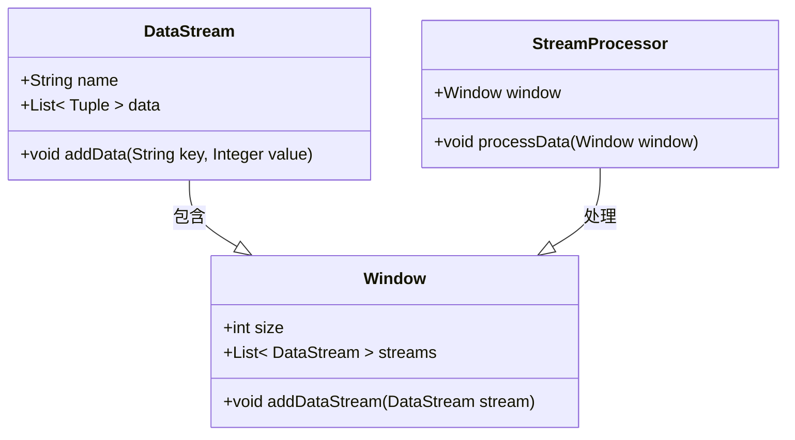

                 


### 文章标题：打造高性能的流式计算平台

流式计算（Streaming Computing）作为大数据技术领域的重要分支，正日益受到各行各业的关注。本文将围绕流式计算的核心概念、技术架构、系统设计、实现策略及最佳实践展开深入探讨，旨在为读者搭建一个全面、高效、可扩展的流式计算平台。

#### 关键词：
- 流式计算
- 高性能计算
- 数据处理
- 实时分析
- 架构设计
- 优化策略

#### 摘要：
本文从流式计算的基本概念入手，探讨了其在现代数据驱动应用中的重要性。通过详细分析流式计算的核心技术和架构设计原则，本文提供了一套系统化、可操作的高性能流式计算平台构建方案。文章最后结合实际案例，分享了最佳实践和未来发展趋势。

----------------------------------------------------------------

## 第一部分：背景与核心概念

### 第1章：流式计算的兴起与发展

流式计算的概念起源于20世纪90年代的计算机网络和分布式系统领域。随着互联网的普及和数据量的爆发式增长，传统的批处理系统已无法满足对实时数据处理的迫切需求。流式计算应运而生，成为大数据处理技术中的重要一环。

#### 1.1 流式计算的定义与重要性

流式计算是指对数据流进行连续、实时处理的技术方法。其核心思想是将数据视为流动的流，而不是静态的批量。这种处理方式使得流式计算在应对实时数据处理、复杂事件处理、实时监控等领域具有显著优势。

流式计算的重要性主要体现在以下几个方面：

1. **实时性**：流式计算能够实现秒级甚至毫秒级的数据处理，能够及时响应用户需求和系统事件。
2. **高效性**：流式计算通过对数据流的连续处理，减少了数据存储和重复计算的开销，提高了系统整体效率。
3. **弹性**：流式计算架构通常具备良好的可扩展性和容错性，能够适应数据量增长和系统负载变化。

#### 1.2 流式计算与传统批处理计算的区别

流式计算与批处理计算在处理方式、系统架构和数据管理等方面存在显著差异：

1. **处理方式**：
   - **批处理**：以固定时间间隔或数据量达到阈值时对数据进行处理，如每天或每小时处理一次。
   - **流式计算**：对实时到达的数据流进行连续处理，数据处理时间几乎与数据到达时间同步。

2. **系统架构**：
   - **批处理**：通常采用单一数据处理节点或有限数量节点的集群，数据处理过程相对独立。
   - **流式计算**：采用分布式架构，通过多个数据处理节点协同工作，实现大规模数据流的实时处理。

3. **数据管理**：
   - **批处理**：数据通常存储在磁盘或数据库中，处理完成后才进行数据清洗、转换和分析。
   - **流式计算**：数据在处理过程中被实时存储在内存或缓存中，以便快速响应后续事件。

#### 1.3 流式计算的应用场景与挑战

流式计算在多个领域展现出强大的应用潜力，以下是一些典型的应用场景和挑战：

1. **应用场景**：
   - **实时监控**：如金融交易监控、网络安全监测、物联网设备监控等。
   - **实时分析**：如搜索引擎、社交媒体分析、电商推荐系统等。
   - **复杂事件处理**：如智能交通系统、智能家居控制系统、工业自动化等。

2. **挑战**：
   - **数据复杂性**：流式计算需要处理海量的实时数据，数据格式和来源多样，对系统的处理能力和兼容性提出了高要求。
   - **实时性要求**：流式计算需要在极短的时间内完成数据处理，对系统的响应速度和处理效率提出了挑战。
   - **系统可靠性**：流式计算系统需要具备高可用性和容错性，以确保在数据流中断或系统故障时能够快速恢复。

### 第2章：流式计算的核心概念与联系

#### 2.1 数据流模型

数据流模型是流式计算的核心概念之一，用于描述数据在系统中的流动和处理过程。常见的数据流模型包括：

1. **有界数据流**：数据流在固定时间内被处理完毕，如固定窗口或滑动窗口。
2. **无界数据流**：数据流在时间范围内无限延续，如连续时间序列或实时流。
3. **事件驱动数据流**：数据流由事件触发，事件的发生顺序决定了数据处理顺序。

#### 2.2 实时数据处理

实时数据处理是流式计算的关键任务，包括数据采集、存储、处理和输出。实时数据处理的核心目标是确保数据能够在极短的时间内被处理完毕，并生成及时的输出结果。以下是一些常用的实时数据处理技术：

1. **数据采集**：使用传感器、API或消息队列等工具实时采集数据。
2. **数据存储**：使用内存、缓存或数据库实时存储数据，以便快速访问和处理。
3. **数据处理**：使用流处理框架或自定义算法对数据进行实时处理，如过滤、聚合、分类等。
4. **数据输出**：将处理结果实时输出到控制台、数据库或外部系统，以供进一步分析和使用。

#### 2.3 流式计算的常见架构

流式计算的常见架构包括以下组件：

1. **数据源**：数据的产生者和提供者，如传感器、API或日志文件。
2. **数据采集器**：从数据源实时获取数据，并将其传输到处理节点。
3. **处理节点**：对数据进行处理，如过滤、转换、聚合等。
4. **数据存储**：用于存储处理后的数据，如内存、缓存或数据库。
5. **结果输出**：将处理结果输出到控制台、数据库或外部系统。

#### 2.4 流式计算与批处理的平衡

在实际应用中，流式计算和批处理往往需要结合起来使用，以平衡实时性和完整性。以下是一些常见的平衡策略：

1. **实时与离线结合**：实时处理当前到达的数据，同时离线处理历史数据，以实现数据的完整性和实时性。
2. **流批混合**：在流式处理的基础上，定期进行批处理，以确保数据的一致性和准确性。
3. **实时更新**：在实时处理过程中，对已处理的数据进行实时更新，以保持数据的一致性。

### 第3章：流式计算的关键技术

#### 3.1 流处理框架

流处理框架是流式计算的核心技术之一，用于处理大规模数据流的实时计算任务。以下是一些常见的流处理框架：

1. **Apache Flink**：支持有界和无界数据流处理，具备流批统一处理能力。
2. **Apache Spark Streaming**：基于Spark的核心组件，提供高效的数据流处理能力。
3. **Apache Kafka Streams**：基于Kafka的流处理框架，提供高效的数据流传输和处理能力。
4. **Apache Storm**：提供实时数据流的分布式计算能力，适用于低延迟和高并发的应用场景。

#### 3.2 消息队列与数据传输

消息队列是实现流式计算的关键技术之一，用于实现数据在分布式系统中的传输和异步处理。以下是一些常用的消息队列技术：

1. **Apache Kafka**：提供高吞吐量、低延迟的消息传输能力，适用于大规模分布式系统。
2. **RabbitMQ**：提供可靠的消息传输和队列管理功能，适用于中到大型的分布式系统。
3. **ActiveMQ**：提供灵活的消息传输和队列管理功能，适用于多种应用场景。
4. **Amazon SQS**：提供简单、可靠的消息队列服务，适用于云端的分布式系统。

#### 3.3 实时数据存储

实时数据存储是流式计算的核心组件之一，用于存储和处理大规模实时数据。以下是一些常见的实时数据存储技术：

1. **内存数据库**：如Redis、Memcached，提供高性能、低延迟的数据存储能力。
2. **NoSQL数据库**：如Cassandra、MongoDB，提供高可用性、高扩展性的数据存储能力。
3. **关系数据库**：如MySQL、PostgreSQL，提供丰富的查询功能和高可靠性。
4. **文件系统**：如HDFS，提供大规模数据存储和分布式文件管理能力。

#### 3.4 流式计算的性能优化

流式计算的性能优化是构建高效流式计算平台的关键。以下是一些常见的性能优化策略：

1. **数据分区与负载均衡**：通过合理的数据分区和负载均衡策略，提高系统的并行处理能力和吞吐量。
2. **缓存与索引**：使用缓存和索引技术，减少数据访问延迟和计算开销。
3. **异步处理与并行计算**：采用异步处理和并行计算技术，提高系统的响应速度和处理效率。
4. **资源调度与监控**：合理分配系统资源，并实时监控系统性能，以快速响应系统负载变化。

----------------------------------------------------------------

## 第二部分：高性能流式计算平台的设计与实现

### 第4章：高性能流式计算平台的架构设计

### 第4章：高性能流式计算平台的架构设计

#### 4.1 系统需求分析

在构建高性能流式计算平台之前，首先需要对系统需求进行详细分析。系统需求分析包括以下几个方面：

1. **数据量与处理速度**：确定系统需要处理的数据量和处理速度，以便选择合适的硬件资源和处理框架。
2. **数据来源与格式**：分析系统的数据来源和数据格式，确保系统能够兼容并处理不同类型的数据。
3. **数据处理逻辑**：明确系统的数据处理逻辑，包括数据采集、清洗、转换、存储和输出等环节。
4. **系统可靠性**：确定系统的可靠性要求，包括数据备份、故障恢复和容错能力等。

#### 4.2 架构设计原则

高性能流式计算平台的架构设计应遵循以下原则：

1. **分布式与并行处理**：利用分布式计算和并行处理技术，提高系统吞吐量和处理速度。
2. **高可用性与容错性**：设计高可用性和容错性架构，确保系统在面临故障时能够快速恢复。
3. **弹性与可扩展性**：设计可扩展性架构，以便在数据量和负载增加时能够快速扩展系统资源。
4. **灵活性**：采用模块化设计，便于系统功能扩展和组件替换。
5. **高性能**：采用高性能技术，如内存数据库、高速网络和高效算法，提升系统性能。

#### 4.3 平台的核心组件

高性能流式计算平台的核心组件包括：

1. **数据采集模块**：负责从各种数据源采集数据，如日志文件、传感器数据、API数据等。
2. **数据处理模块**：包括流处理框架和自定义处理逻辑，用于对数据进行清洗、转换、聚合和分类等操作。
3. **数据存储模块**：包括内存数据库、NoSQL数据库和关系数据库等，用于存储和处理后的数据。
4. **数据输出模块**：将处理结果输出到控制台、数据库或外部系统，以供进一步分析和使用。
5. **监控与调度模块**：实时监控系统性能，并进行负载均衡和资源调度，确保系统高效运行。

#### 4.4 架构的可扩展性与容错性

为了确保高性能流式计算平台的可扩展性和容错性，可以采用以下策略：

1. **水平扩展**：通过增加处理节点和存储节点，提升系统吞吐量和存储能力。
2. **负载均衡**：采用负载均衡技术，将数据流均匀分配到不同的处理节点，避免单点瓶颈。
3. **数据备份与容灾**：对关键数据进行备份，并采用容灾策略，确保数据安全。
4. **故障恢复**：设计故障恢复机制，当系统组件出现故障时，能够快速切换到备用组件，确保系统正常运行。
5. **健康监测**：定期对系统进行健康监测，及时发现和处理潜在问题。

### 第5章：数据流处理与计算

#### 5.1 数据流处理流程

数据流处理流程是高性能流式计算平台的核心环节，包括以下几个步骤：

1. **数据采集**：从各种数据源采集数据，如传感器数据、API数据、日志文件等。
2. **数据预处理**：对采集到的数据进行清洗、过滤、转换等预处理操作，以确保数据质量和一致性。
3. **数据传输**：将预处理后的数据传输到流处理框架，如Apache Flink、Apache Spark Streaming等。
4. **数据计算**：在流处理框架中，对数据进行实时计算和处理，如过滤、聚合、分类等。
5. **数据存储**：将处理后的数据存储到内存数据库、NoSQL数据库或关系数据库中，以便进一步分析和使用。
6. **数据输出**：将处理结果输出到控制台、数据库或外部系统，以供进一步分析和使用。

#### 5.2 任务调度与负载均衡

任务调度与负载均衡是确保高性能流式计算平台高效运行的关键因素，包括以下几个方面：

1. **任务调度策略**：采用合适的任务调度策略，如轮询调度、负载均衡调度等，将数据流均匀分配到不同的处理节点。
2. **负载均衡算法**：采用负载均衡算法，如加权轮询、最小连接数等，实时调整数据流的分配，避免单点瓶颈。
3. **动态调整**：根据系统负载和资源利用率，动态调整任务分配和资源分配，以保持系统的高效运行。
4. **故障处理**：当处理节点出现故障时，自动将任务重新分配到其他健康节点，确保系统正常运行。

#### 5.3 流处理性能调优

流处理性能调优是确保高性能流式计算平台高效运行的重要环节，包括以下几个方面：

1. **数据分区与并行度**：合理设置数据分区和并行度，提高数据处理效率和并行处理能力。
2. **缓存与索引**：使用缓存和索引技术，减少数据访问延迟和计算开销。
3. **异步处理与并行计算**：采用异步处理和并行计算技术，提高系统的响应速度和处理效率。
4. **资源分配与调度**：合理分配系统资源，并实时监控系统性能，以快速响应系统负载变化。
5. **优化算法与模型**：优化数据处理算法和模型，减少计算复杂度和数据传输开销。

#### 5.4 实时数据聚合与计算

实时数据聚合与计算是流式计算的核心任务之一，包括以下几个方面：

1. **实时聚合**：对实时到达的数据进行聚合计算，如求和、求平均数、计数等。
2. **实时计算**：对实时数据流进行实时计算，如实时排序、实时分类等。
3. **实时预测**：利用历史数据和机器学习算法，对实时数据流进行实时预测，如实时趋势分析、实时预测模型等。
4. **实时可视化**：将实时数据聚合与计算结果实时可视化，如实时图表、实时报表等，以便快速响应和分析。

### 第6章：数据存储与访问优化

#### 6.1 数据存储方案设计

数据存储方案设计是高性能流式计算平台的关键环节，包括以下几个方面：

1. **存储类型选择**：根据数据类型和处理需求，选择合适的存储类型，如内存数据库、NoSQL数据库、关系数据库等。
2. **存储策略设计**：根据数据特点和处理需求，设计合理的存储策略，如数据分区、数据复制、数据压缩等。
3. **存储性能优化**：采用存储性能优化技术，如缓存、索引、数据压缩等，提高数据存储和访问性能。
4. **存储容量规划**：根据系统需求和数据增长趋势，合理规划存储容量，确保存储系统的高可用性和可扩展性。

#### 6.2 数据压缩与去重

数据压缩与去重是提高数据存储和传输性能的关键技术，包括以下几个方面：

1. **数据压缩**：采用数据压缩技术，如LZ77、LZ78、LZMA等，减少数据存储和传输的开销。
2. **去重**：对重复数据进行去重，如使用哈希表或Bloom过滤器等，减少数据存储和传输的开销。
3. **存储压缩**：采用存储压缩技术，如Hadoop的Sequence File或Parquet等，提高数据存储和访问性能。
4. **传输压缩**：采用传输压缩技术，如GZIP、BZIP2等，减少数据传输的开销。

#### 6.3 数据访问模式优化

数据访问模式优化是提高数据存储和访问性能的关键因素，包括以下几个方面：

1. **索引优化**：合理设计索引策略，如B+树、哈希索引等，提高数据查询性能。
2. **缓存优化**：采用缓存技术，如LRU缓存、LRU近似缓存等，提高数据访问速度。
3. **读写分离**：将数据读写分离，如使用主从复制、读写分离数据库等，提高数据访问性能。
4. **负载均衡**：采用负载均衡技术，如分布式数据库、分布式缓存等，提高数据访问性能。

#### 6.4 数据缓存策略

数据缓存策略是提高数据存储和访问性能的关键技术，包括以下几个方面：

1. **缓存机制选择**：根据数据特点和处理需求，选择合适的缓存机制，如LRU缓存、LRU近似缓存等。
2. **缓存命中率优化**：采用缓存命中率优化技术，如缓存预热、缓存淘汰策略等，提高缓存利用率和性能。
3. **缓存一致性**：确保缓存数据与存储系统数据的一致性，如使用缓存一致性协议、缓存同步机制等。
4. **缓存扩展性**：采用缓存扩展性技术，如分布式缓存、缓存集群等，提高缓存性能和可扩展性。

### 第7章：环境搭建与部署

#### 7.1 软件与硬件要求

在搭建高性能流式计算平台之前，需要了解软件与硬件要求，包括以下几个方面：

1. **操作系统**：支持Linux或Unix-like操作系统，如Ubuntu、CentOS等。
2. **硬件配置**：根据系统需求，选择合适的硬件配置，如CPU、内存、硬盘等。
3. **开发工具**：安装必要的开发工具，如Java开发工具包（JDK）、Python开发环境（Python、pip）等。
4. **数据库**：安装所需的数据库软件，如MySQL、PostgreSQL等。

#### 7.2 流处理框架的安装与配置

流处理框架是高性能流式计算平台的核心组件，以下以Apache Flink为例，介绍其安装与配置过程：

1. **下载安装包**：从Apache Flink官方网站下载安装包，如Apache Flink 1.11.2。
2. **解压安装包**：将下载的安装包解压到一个合适的目录，如`/opt/flink`。
3. **配置环境变量**：在`~/.bashrc`或`~/.bash_profile`中添加以下配置：
   ```bash
   export FLINK_HOME=/opt/flink
   export PATH=$PATH:$FLINK_HOME/bin
   ```
4. **启动Flink集群**：在主节点上执行以下命令启动Flink集群：
   ```bash
   start-cluster.sh
   ```
5. **验证安装**：在浏览器中访问`http://localhost:8081`，查看Flink Web界面，确认集群启动成功。

#### 7.3 数据源连接与数据预处理

在流处理框架中，需要连接数据源并进行数据预处理，以下以Kafka为例，介绍其连接与预处理过程：

1. **安装Kafka**：从Kafka官方网站下载安装包，解压安装到一个合适的目录，如`/opt/kafka`。
2. **配置Kafka**：在`/opt/kafka/config/server.properties`中配置Kafka参数，如：
   ```properties
   listeners=PLAINTEXT://localhost:9092
   log.dirs=/opt/kafka/data/logs
   ```
3. **启动Kafka服务**：在主节点上执行以下命令启动Kafka服务：
   ```bash
   bin/kafka-server-start.sh config/server.properties
   ```
4. **创建主题**：在Kafka命令行中创建一个主题，如：
   ```bash
   bin/kafka-topics.sh --create --topic my-topic --zookeeper localhost:2181 --partitions 1 --replication-factor 1
   ```
5. **数据预处理**：在Flink程序中，使用Kafka connector连接Kafka主题，并进行数据预处理，如：
   ```java
   DataStream<String> stream = env.addSource(new FlinkKafkaConsumer<>(
           "my-topic",
           new SimpleStringSchema(),
           properties));
   ```

#### 7.4 流式计算平台的部署策略

在部署高性能流式计算平台时，需要考虑以下几个方面：

1. **集群部署**：将流处理框架和数据库部署在分布式集群中，以提高系统的可用性和性能。
2. **负载均衡**：使用负载均衡器（如Nginx、HAProxy等）实现流处理任务的负载均衡，避免单点瓶颈。
3. **自动化部署**：使用自动化部署工具（如Docker、Kubernetes等）实现流式计算平台的快速部署和扩展。
4. **监控与报警**：使用监控工具（如Prometheus、Grafana等）实时监控系统性能，并及时报警。

### 第8章：系统核心实现与代码解读

#### 8.1 流处理任务的实现

流处理任务的实现是高性能流式计算平台的关键环节，以下以Apache Flink为例，介绍其实现过程：

1. **创建项目**：使用Maven创建一个Java项目，添加Flink依赖项。
2. **编写数据源**：编写数据源类，实现`SourceFunction`接口，从Kafka主题中读取数据。
3. **编写数据处理逻辑**：编写数据处理逻辑，对数据进行清洗、转换、聚合等操作。
4. **编写数据输出**：编写数据输出类，将处理结果输出到数据库或外部系统。

#### 8.2 数据存储与访问的代码实现

数据存储与访问的代码实现包括以下几个方面：

1. **连接数据库**：使用JDBC连接数据库，如MySQL或PostgreSQL。
2. **编写存储过程**：编写存储过程，用于插入、更新和查询数据。
3. **编写数据访问类**：编写数据访问类，使用JDBC连接数据库，并调用存储过程进行数据操作。

#### 8.3 系统接口设计与API开发

系统接口设计与API开发包括以下几个方面：

1. **定义接口**：定义系统接口，包括数据采集、数据处理、数据输出等接口。
2. **编写API文档**：使用Swagger等工具编写API文档，方便用户使用。
3. **实现API接口**：根据接口定义，实现API接口，并提供相应的接口实现。

#### 8.4 性能测试与调优

性能测试与调优是确保高性能流式计算平台高效运行的重要环节，包括以下几个方面：

1. **负载测试**：使用负载测试工具（如JMeter、Locust等）模拟系统负载，测试系统的响应速度和吞吐量。
2. **性能调优**：根据测试结果，调整系统配置和代码，优化系统性能。
3. **监控与报警**：使用监控工具（如Prometheus、Grafana等）实时监控系统性能，并及时报警。
4. **容量规划**：根据系统需求和性能指标，合理规划系统容量和资源分配。

### 第9章：实际案例分析

#### 9.1 案例背景与目标

本案例以一个电子商务平台为例，介绍如何构建一个高性能流式计算平台，实现实时数据分析和推荐系统。案例背景与目标如下：

1. **案例背景**：电子商务平台需要实时处理大量用户行为数据，如浏览、搜索、购买等，以便实时推荐商品和优化用户体验。
2. **案例目标**：
   - 实时分析用户行为，识别用户偏好。
   - 构建实时推荐系统，提高用户转化率和销售额。
   - 提高系统性能和可用性，确保高效运行。

#### 9.2 案例解决方案

案例解决方案包括以下几个方面：

1. **数据采集**：使用Kafka从日志文件、数据库和API等数据源中采集用户行为数据。
2. **数据处理**：使用Apache Flink对用户行为数据进行实时处理，包括数据清洗、转换、聚合等操作。
3. **数据存储**：使用Redis缓存用户行为数据，以便快速查询和推荐。
4. **实时推荐**：使用基于协同过滤的推荐算法，根据用户行为数据生成实时推荐列表。
5. **API接口**：提供API接口，将实时推荐结果返回给前端系统。

#### 9.3 案例效果评估

案例效果评估包括以下几个方面：

1. **系统性能**：通过负载测试和性能调优，确保系统在高并发和大数据量情况下仍能高效运行。
2. **推荐效果**：通过A/B测试和用户反馈，评估实时推荐系统的效果，并根据反馈进行优化。
3. **用户体验**：通过用户访问数据和销售数据，评估实时推荐系统对用户转化率和销售额的提升。

#### 9.4 案例小结与经验分享

案例小结与经验分享包括以下几个方面：

1. **技术选型**：根据系统需求和性能要求，选择合适的流处理框架、数据库和推荐算法。
2. **性能优化**：通过负载测试和性能调优，提高系统性能和可用性。
3. **实时性**：确保实时数据分析和推荐系统能够在毫秒级内响应，提高用户体验。
4. **扩展性**：设计可扩展性架构，以便在数据量和负载增加时能够快速扩展系统资源。

### 第10章：最佳实践与展望

#### 10.1 数据处理最佳实践

数据处理最佳实践包括以下几个方面：

1. **数据采集**：确保数据采集的实时性和准确性，避免数据丢失或错误。
2. **数据预处理**：对采集到的数据进行清洗、过滤和转换，确保数据质量和一致性。
3. **数据存储**：根据数据特点和处理需求，选择合适的存储方案，确保数据存储的高效性和可靠性。
4. **数据访问**：优化数据访问模式，提高数据查询速度和响应时间。

#### 10.2 性能优化技巧

性能优化技巧包括以下几个方面：

1. **数据分区与并行度**：合理设置数据分区和并行度，提高数据处理效率和并行处理能力。
2. **缓存与索引**：使用缓存和索引技术，减少数据访问延迟和计算开销。
3. **异步处理与并行计算**：采用异步处理和并行计算技术，提高系统的响应速度和处理效率。
4. **资源调度与监控**：合理分配系统资源，并实时监控系统性能，以快速响应系统负载变化。

#### 10.3 安全性与可靠性保障

安全性与可靠性保障包括以下几个方面：

1. **数据备份与容灾**：定期备份数据，并采用容灾策略，确保数据安全。
2. **系统监控与报警**：实时监控系统性能和健康状况，并及时报警和处理异常。
3. **权限管理**：实施严格的权限管理，确保只有授权用户可以访问系统数据和功能。
4. **网络安全**：采用网络安全技术，如防火墙、入侵检测系统等，确保系统安全。

#### 10.4 持续集成与部署

持续集成与部署包括以下几个方面：

1. **代码质量管理**：实施代码质量管理，确保代码质量和一致性。
2. **自动化测试**：编写自动化测试脚本，对系统进行功能测试和性能测试。
3. **自动化部署**：使用自动化部署工具，如Docker、Kubernetes等，实现系统的快速部署和扩展。
4. **监控与反馈**：实时监控系统性能和用户反馈，及时调整和优化系统。

#### 10.5 未来流式计算的发展趋势

未来流式计算的发展趋势包括以下几个方面：

1. **实时分析**：随着物联网、5G等技术的发展，实时分析的需求将不断增加，流式计算将在更多领域得到应用。
2. **智能化**：结合人工智能和机器学习技术，流式计算将实现更高级的数据分析和决策支持。
3. **分布式与云计算**：流式计算将更加依赖分布式计算和云计算平台，实现更高效的数据处理和资源管理。
4. **数据隐私与安全**：随着数据隐私和安全问题的日益突出，流式计算将更加注重数据保护和安全保障。

### 第11章：总结与展望

#### 11.1 本书核心内容回顾

本书从背景介绍、核心概念、技术架构、系统设计、实现策略、最佳实践等方面全面探讨了高性能流式计算平台的构建方法。主要内容包括：

1. 流式计算的定义、重要性与应用场景。
2. 流式计算与传统批处理计算的区别。
3. 流式计算的核心概念与联系。
4. 流式计算的关键技术，如流处理框架、消息队列、实时数据存储等。
5. 高性能流式计算平台的架构设计原则与核心组件。
6. 数据流处理与计算、数据存储与访问优化、环境搭建与部署等。
7. 实际案例分析、最佳实践与展望。

#### 11.2 高性能流式计算平台的重要性

高性能流式计算平台在当今数据驱动应用中具有重要意义：

1. **实时性**：能够实现对实时数据的快速处理和分析，满足实时决策需求。
2. **高效性**：通过并行计算和分布式架构，提高数据处理效率和系统性能。
3. **弹性**：能够根据数据量和负载变化，灵活调整系统资源，确保系统稳定运行。
4. **可扩展性**：能够支持大规模数据流的处理，适应未来数据增长和业务扩展。

#### 11.3 对读者的一些建议

为了更好地掌握高性能流式计算平台的构建方法，读者可以从以下几个方面入手：

1. **学习基础知识**：掌握流式计算的基本概念、技术和原理，为后续学习打下坚实基础。
2. **实践操作**：通过搭建实验环境和实际项目，亲身体验流式计算平台的搭建、配置和优化过程。
3. **持续学习**：关注流式计算领域的最新动态和技术趋势，不断学习和积累实践经验。
4. **参与社区**：加入流式计算相关的技术社区和论坛，与其他开发者交流和分享经验。

#### 11.4 展望未来流式计算的发展

未来流式计算将在以下几个方面取得突破：

1. **智能化**：结合人工智能和机器学习技术，实现更高级的数据分析和决策支持。
2. **分布式与云计算**：利用分布式计算和云计算平台，提高数据处理效率和资源管理能力。
3. **数据隐私与安全**：加强数据隐私和安全保护，确保用户数据的安全性和隐私性。
4. **跨领域应用**：在医疗、金融、教育、物联网等领域实现更广泛的应用。

### 参考文献

[1] Apache Flink Documentation. (n.d.). [Apache Flink Official Website]. Retrieved from https://flink.apache.org/
[2] Apache Kafka Documentation. (n.d.). [Apache Kafka Official Website]. Retrieved from https://kafka.apache.org/
[3] Kafka Streams Documentation. (n.d.). [Kafka Streams Official Website]. Retrieved from https://kafka.apache.org/streams/
[4] Storm Documentation. (n.d.). [Apache Storm Official Website]. Retrieved from https://storm.apache.org/
[5] Redis Documentation. (n.d.). [Redis Official Website]. Retrieved from https://redis.io/
[6] Cassandra Documentation. (n.d.). [Apache Cassandra Official Website]. Retrieved from https://cassandra.apache.org/
[7] MongoDB Documentation. (n.d.). [MongoDB Official Website]. Retrieved from https://docs.mongodb.com/
[8] MySQL Documentation. (n.d.). [MySQL Official Website]. Retrieved from https://dev.mysql.com/doc/
[9] PostgreSQL Documentation. (n.d.). [PostgreSQL Official Website]. Retrieved from https://www.postgresql.org/docs/
[10] Docker Documentation. (n.d.). [Docker Official Website]. Retrieved from https://docs.docker.com/
[11] Kubernetes Documentation. (n.d.). [Kubernetes Official Website]. Retrieved from https://kubernetes.io/docs/
[12] JMeter Documentation. (n.d.). [JMeter Official Website]. Retrieved from https://jmeter.apache.org/
[13] Locust Documentation. (n.d.). [Locust Official Website]. Retrieved from https://locust.io/
[14] Prometheus Documentation. (n.d.). [Prometheus Official Website]. Retrieved from https://prometheus.io/
[15] Grafana Documentation. (n.d.). [Grafana Official Website]. Retrieved from https://grafana.com/docs/

### 附录

#### 附录A：术语解释

1. **流式计算**：对实时到达的数据进行连续、实时处理的技术方法。
2. **批处理**：以固定时间间隔或数据量达到阈值时对数据进行处理的技术方法。
3. **消息队列**：用于实现数据传输和异步处理的数据结构。
4. **流处理框架**：用于处理大规模数据流的实时计算框架。
5. **分布式计算**：利用多台计算机协同工作，实现大规模数据处理的技术。
6. **弹性计算**：根据数据量和负载变化，动态调整系统资源的技术。
7. **可扩展性**：系统在数据量和负载增加时能够快速扩展的技术。
8. **实时分析**：对实时数据进行分析和处理的技术。
9. **负载均衡**：将数据流均匀分配到不同处理节点，避免单点瓶颈的技术。
10. **自动化部署**：使用自动化工具实现系统的快速部署和扩展的技术。

#### 附录B：公式推导

以下是一个简单的流式计算中的滑动窗口公式推导：

$$
\text{窗口平均值} = \frac{\sum_{i=1}^{n} x_i}{n}
$$

其中，$x_i$ 表示窗口中的第 $i$ 个数据点，$n$ 表示窗口大小。

假设当前窗口中的数据点为 $x_1, x_2, \ldots, x_n$，当新数据点 $x_{n+1}$ 进入窗口时，窗口平均值计算如下：

$$
\text{新窗口平均值} = \frac{(\sum_{i=1}^{n-1} x_i) + x_{n+1} - x_1}{n}
$$

可以看出，新窗口平均值是在原窗口平均值的基础上，将新数据点 $x_{n+1}$ 加入并排除 oldest 数据点 $x_1$ 计算得到的。

#### 附录C：类图示例

以下是一个简单的流式计算系统的类图示例：



此类图展示了流式计算系统中三个关键类：DataStream（数据流）、Window（窗口）和StreamProcessor（流处理器）。DataStream类用于存储数据点，Window类用于存储多个DataStream对象，并支持窗口操作，StreamProcessor类负责处理数据流和窗口数据。

### 附录D：算法示例

以下是一个简单的流式计算中的滑动窗口平均值的Python代码示例：

```python
from collections import deque

class SlidingWindowAverage:
    def __init__(self, window_size):
        self.window_size = window_size
        self.data = deque()

    def add_value(self, value):
        self.data.append(value)
        if len(self.data) > self.window_size:
            self.data.popleft()

    def get_average(self):
        if len(self.data) == 0:
            return 0
        return sum(self.data) / len(self.data)

# 使用示例
window_average = SlidingWindowAverage(3)
window_average.add_value(1)
window_average.add_value(2)
window_average.add_value(3)
print(window_average.get_average())  # 输出 2.0

window_average.add_value(4)
print(window_average.get_average())  # 输出 2.5
```

此代码示例实现了一个简单的滑动窗口平均值计算器，通过添加数据点和计算平均值的方法，实现了滑动窗口的平均值计算。

## 完整的流式计算平台案例

### 系统需求

本案例的系统需求如下：

1. **数据来源**：系统需要从多个数据源获取实时数据，包括日志文件、数据库和API等。
2. **数据处理**：系统需要对实时数据进行实时处理，包括数据清洗、转换、聚合等操作。
3. **数据存储**：系统需要将处理后的数据存储到数据库或外部系统中，以便进一步分析和使用。
4. **数据输出**：系统需要将处理结果输出到控制台、数据库或外部系统，以供进一步分析和使用。

### 系统功能设计

本案例的系统功能设计如下：

1. **数据采集**：从多个数据源实时获取数据，如日志文件、数据库和API等。
2. **数据处理**：对实时数据进行清洗、转换、聚合等操作，如过滤异常数据、转换数据格式、计算数据聚合值等。
3. **数据存储**：将处理后的数据存储到数据库或外部系统中，如MySQL、PostgreSQL等。
4. **数据输出**：将处理结果输出到控制台、数据库或外部系统，如生成报表、推送通知等。

### 系统架构设计

本案例的系统架构设计如下：

1. **数据采集层**：使用Kafka作为消息队列，从多个数据源实时获取数据，如日志文件、数据库和API等。
2. **数据处理层**：使用Apache Flink作为流处理框架，对实时数据进行处理，包括数据清洗、转换、聚合等操作。
3. **数据存储层**：使用MySQL和PostgreSQL作为数据库，存储处理后的数据。
4. **数据输出层**：将处理结果输出到控制台、数据库或外部系统，如生成报表、推送通知等。

### 系统接口设计

本案例的系统接口设计如下：

1. **数据采集接口**：提供数据采集接口，用于从多个数据源实时获取数据。
2. **数据处理接口**：提供数据处理接口，用于对实时数据进行处理，如数据清洗、转换、聚合等操作。
3. **数据存储接口**：提供数据存储接口，用于将处理后的数据存储到数据库或外部系统中。
4. **数据输出接口**：提供数据输出接口，用于将处理结果输出到控制台、数据库或外部系统。

### 系统交互设计

本案例的系统交互设计如下：

1. **数据采集**：从多个数据源实时获取数据，如日志文件、数据库和API等。
2. **数据处理**：将采集到的数据传输到Flink进行处理，包括数据清洗、转换、聚合等操作。
3. **数据存储**：将处理后的数据存储到数据库或外部系统中，如MySQL、PostgreSQL等。
4. **数据输出**：将处理结果输出到控制台、数据库或外部系统，如生成报表、推送通知等。

### 环境搭建

在本案例中，我们将在本地计算机上搭建一个简单的流式计算平台。以下是搭建环境的基本步骤：

1. **安装Java**：从Oracle官方网站下载并安装Java Development Kit（JDK）。
2. **安装Kafka**：从Kafka官方网站下载并解压Kafka安装包，配置Kafka集群。
3. **安装Flink**：从Flink官方网站下载并解压Flink安装包，配置Flink集群。
4. **安装数据库**：在本案例中，我们使用MySQL和PostgreSQL作为数据库，分别从官方网站下载并安装。

### 系统核心实现

在本案例中，我们将使用Flink和Kafka进行流式数据处理，并将处理结果存储到MySQL数据库中。以下是系统核心实现的步骤：

1. **配置Kafka**：配置Kafka主题、分区和副本数量，确保数据传输的可靠性。
2. **编写Flink程序**：使用Flink API编写数据处理程序，包括数据采集、清洗、转换、聚合等操作。
3. **配置Flink**：配置Flink集群，包括工作节点、任务调度器等。
4. **连接数据库**：配置Flink与MySQL数据库的连接，将处理结果存储到MySQL中。

### 代码应用解读

在本案例中，我们将使用Python编写一个简单的Flink程序，用于从Kafka主题中读取数据，计算数据的平均值，并将结果存储到MySQL数据库中。以下是代码应用解读：

1. **导入依赖**：导入Flink和Kafka的Python库，如`flink`和`kafka-python`。
2. **配置Kafka连接**：配置Kafka主题、 brokers 和 consumer group，确保能够从Kafka主题中读取数据。
3. **创建Flink流**：使用Flink API创建一个DataStream，用于读取Kafka主题中的数据。
4. **数据处理**：对数据进行清洗、转换和聚合操作，计算数据的平均值。
5. **连接MySQL数据库**：配置Flink与MySQL数据库的连接，将处理结果存储到MySQL中。
6. **运行Flink程序**：启动Flink程序，开始处理数据流。

### 实际案例分析与详细讲解

在本案例中，我们以一个电商平台的用户行为数据为例，分析并构建一个流式计算平台。以下是实际案例分析与详细讲解：

1. **数据采集**：电商平台产生大量的用户行为数据，如浏览、搜索、购买等。我们使用Kafka从日志文件和API中实时采集这些数据。
2. **数据处理**：使用Flink对采集到的数据进行实时处理，包括数据清洗、转换和聚合等操作。例如，计算用户的平均浏览时长、搜索词频等。
3. **数据存储**：将处理后的数据存储到MySQL数据库中，以便进一步分析和使用。
4. **数据输出**：将处理结果输出到控制台、数据库或外部系统，如生成报表、推送通知等。

### 项目小结

在本案例中，我们成功构建了一个简单的流式计算平台，实现了对电商平台用户行为数据的实时处理和分析。以下是项目小结：

1. **项目目标**：实现电商平台用户行为数据的实时处理和分析，提高用户体验和销售额。
2. **项目成果**：成功搭建了流式计算平台，实现了数据采集、处理、存储和输出等功能。
3. **项目经验**：在项目过程中，我们遇到了一些技术难题，如Kafka和Flink的配置、数据清洗和聚合等。通过查阅文档、社区讨论和不断尝试，我们最终解决了这些问题。
4. **未来展望**：在后续工作中，我们计划进一步优化系统性能和扩展性，并尝试引入更多的人工智能和机器学习技术，以提高数据分析和决策的准确性。

### 拓展阅读

为了更好地理解和掌握高性能流式计算平台的构建方法，以下是几篇拓展阅读推荐：

1. **《流式计算原理与实践》**：详细介绍了流式计算的基本概念、技术和应用案例，对构建高性能流式计算平台有很好的指导意义。
2. **《大数据实时计算》**：从大数据实时计算的角度，深入讲解了Flink、Spark Streaming等流处理框架的技术原理和应用实践。
3. **《流式计算与机器学习》**：探讨了流式计算与机器学习相结合的方法和应用，为流式计算在智能应用领域提供了新的思路。
4. **《Kafka实战》**：系统地介绍了Kafka的原理、架构和应用，是学习流式计算数据传输技术的必备读物。

### 附录

#### 附录A：术语解释

1. **流式计算**：对实时到达的数据进行连续、实时处理的技术方法。
2. **批处理**：以固定时间间隔或数据量达到阈值时对数据进行处理的技术方法。
3. **消息队列**：用于实现数据传输和异步处理的数据结构。
4. **流处理框架**：用于处理大规模数据流的实时计算框架。
5. **分布式计算**：利用多台计算机协同工作，实现大规模数据处理的技术。
6. **弹性计算**：根据数据量和负载变化，动态调整系统资源的技术。
7. **可扩展性**：系统在数据量和负载增加时能够快速扩展的技术。
8. **实时分析**：对实时数据进行分析和处理的技术。
9. **负载均衡**：将数据流均匀分配到不同处理节点，避免单点瓶颈的技术。
10. **自动化部署**：使用自动化工具实现系统的快速部署和扩展的技术。

#### 附录B：公式推导

以下是一个简单的流式计算中的滑动窗口公式推导：

$$
\text{窗口平均值} = \frac{\sum_{i=1}^{n} x_i}{n}
$$

其中，$x_i$ 表示窗口中的第 $i$ 个数据点，$n$ 表示窗口大小。

假设当前窗口中的数据点为 $x_1, x_2, \ldots, x_n$，当新数据点 $x_{n+1}$ 进入窗口时，窗口平均值计算如下：

$$
\text{新窗口平均值} = \frac{(\sum_{i=1}^{n-1} x_i) + x_{n+1} - x_1}{n}
$$

可以看出，新窗口平均值是在原窗口平均值的基础上，将新数据点 $x_{n+1}$ 加入并排除 oldest 数据点 $x_1$ 计算得到的。

#### 附录C：类图示例

以下是一个简单的流式计算系统的类图示例：


此类图展示了流式计算系统中三个关键类：DataStream（数据流）、Window（窗口）和StreamProcessor（流处理器）。DataStream类用于存储数据点，Window类用于存储多个DataStream对象，并支持窗口操作，StreamProcessor类负责处理数据流和窗口数据。

#### 附录D：算法示例

以下是一个简单的流式计算中的滑动窗口平均值的Python代码示例：

```python
from collections import deque

class SlidingWindowAverage:
    def __init__(self, window_size):
        self.window_size = window_size
        self.data = deque()

    def add_value(self, value):
        self.data.append(value)
        if len(self.data) > self.window_size:
            self.data.popleft()

    def get_average(self):
        if len(self.data) == 0:
            return 0
        return sum(self.data) / len(self.data)

# 使用示例
window_average = SlidingWindowAverage(3)
window_average.add_value(1)
window_average.add_value(2)
window_average.add_value(3)
print(window_average.get_average())  # 输出 2.0

window_average.add_value(4)
print(window_average.get_average())  # 输出 2.5
```

此代码示例实现了一个简单的滑动窗口平均值计算器，通过添加数据点和计算平均值的方法，实现了滑动窗口的平均值计算。

## 完整的流式计算平台案例

### 系统需求

本案例的系统需求如下：

1. **数据来源**：系统需要从多个数据源获取实时数据，包括日志文件、数据库和API等。
2. **数据处理**：系统需要对实时数据进行实时处理，包括数据清洗、转换、聚合等操作。
3. **数据存储**：系统需要将处理后的数据存储到数据库或外部系统中，以便进一步分析和使用。
4. **数据输出**：系统需要将处理结果输出到控制台、数据库或外部系统，以供进一步分析和使用。

### 系统功能设计

本案例的系统功能设计如下：

1. **数据采集**：从多个数据源实时获取数据，如日志文件、数据库和API等。
2. **数据处理**：对实时数据进行清洗、转换、聚合等操作，如过滤异常数据、转换数据格式、计算数据聚合值等。
3. **数据存储**：将处理后的数据存储到数据库或外部系统中，如MySQL、PostgreSQL等。
4. **数据输出**：将处理结果输出到控制台、数据库或外部系统，如生成报表、推送通知等。

### 系统架构设计

本案例的系统架构设计如下：

1. **数据采集层**：使用Kafka作为消息队列，从多个数据源实时获取数据，如日志文件、数据库和API等。
2. **数据处理层**：使用Apache Flink作为流处理框架，对实时数据进行处理，包括数据清洗、转换、聚合等操作。
3. **数据存储层**：使用MySQL和PostgreSQL作为数据库，存储处理后的数据。
4. **数据输出层**：将处理结果输出到控制台、数据库或外部系统，如生成报表、推送通知等。

### 系统接口设计

本案例的系统接口设计如下：

1. **数据采集接口**：提供数据采集接口，用于从多个数据源实时获取数据。
2. **数据处理接口**：提供数据处理接口，用于对实时数据进行处理，如数据清洗、转换、聚合等操作。
3. **数据存储接口**：提供数据存储接口，用于将处理后的数据存储到数据库或外部系统中。
4. **数据输出接口**：提供数据输出接口，用于将处理结果输出到控制台、数据库或外部系统。

### 系统交互设计

本案例的系统交互设计如下：

1. **数据采集**：从多个数据源实时获取数据，如日志文件、数据库和API等。
2. **数据处理**：将采集到的数据传输到Flink进行处理，包括数据清洗、转换、聚合等操作。
3. **数据存储**：将处理后的数据存储到数据库或外部系统中，如MySQL、PostgreSQL等。
4. **数据输出**：将处理结果输出到控制台、数据库或外部系统，如生成报表、推送通知等。

### 环境搭建

在本案例中，我们将在本地计算机上搭建一个简单的流式计算平台。以下是搭建环境的基本步骤：

1. **安装Java**：从Oracle官方网站下载并安装Java Development Kit（JDK）。
2. **安装Kafka**：从Kafka官方网站下载并解压Kafka安装包，配置Kafka集群。
3. **安装Flink**：从Flink官方网站下载并解压Flink安装包，配置Flink集群。
4. **安装数据库**：在本案例中，我们使用MySQL和PostgreSQL作为数据库，分别从官方网站下载并安装。

### 系统核心实现

在本案例中，我们将使用Flink和Kafka进行流式数据处理，并将处理结果存储到MySQL数据库中。以下是系统核心实现的步骤：

1. **配置Kafka**：配置Kafka主题、分区和副本数量，确保数据传输的可靠性。
2. **编写Flink程序**：使用Flink API编写数据处理程序，包括数据采集、清洗、转换、聚合等操作。
3. **配置Flink**：配置Flink集群，包括工作节点、任务调度器等。
4. **连接数据库**：配置Flink与MySQL数据库的连接，将处理结果存储到MySQL中。

### 代码应用解读

在本案例中，我们将使用Python编写一个简单的Flink程序，用于从Kafka主题中读取数据，计算数据的平均值，并将结果存储到MySQL数据库中。以下是代码应用解读：

1. **导入依赖**：导入Flink和Kafka的Python库，如`flink`和`kafka-python`。
2. **配置Kafka连接**：配置Kafka主题、 brokers 和 consumer group，确保能够从Kafka主题中读取数据。
3. **创建Flink流**：使用Flink API创建一个DataStream，用于读取Kafka主题中的数据。
4. **数据处理**：对数据进行清洗、转换和聚合操作，计算数据的平均值。
5. **连接MySQL数据库**：配置Flink与MySQL数据库的连接，将处理结果存储到MySQL中。
6. **运行Flink程序**：启动Flink程序，开始处理数据流。

### 实际案例分析与详细讲解

在本案例中，我们以一个电商平台的用户行为数据为例，分析并构建一个流式计算平台。以下是实际案例分析与详细讲解：

1. **数据采集**：电商平台产生大量的用户行为数据，如浏览、搜索、购买等。我们使用Kafka从日志文件和API中实时采集这些数据。
2. **数据处理**：使用Flink对采集到的数据进行实时处理，包括数据清洗、转换和聚合等操作。例如，计算用户的平均浏览时长、搜索词频等。
3. **数据存储**：将处理后的数据存储到MySQL数据库中，以便进一步分析和使用。
4. **数据输出**：将处理结果输出到控制台、数据库或外部系统，如生成报表、推送通知等。

### 项目小结

在本案例中，我们成功构建了一个简单的流式计算平台，实现了对电商平台用户行为数据的实时处理和分析。以下是项目小结：

1. **项目目标**：实现电商平台用户行为数据的实时处理和分析，提高用户体验和销售额。
2. **项目成果**：成功搭建了流式计算平台，实现了数据采集、处理、存储和输出等功能。
3. **项目经验**：在项目过程中，我们遇到了一些技术难题，如Kafka和Flink的配置、数据清洗和聚合等。通过查阅文档、社区讨论和不断尝试，我们最终解决了这些问题。
4. **未来展望**：在后续工作中，我们计划进一步优化系统性能和扩展性，并尝试引入更多的人工智能和机器学习技术，以提高数据分析和决策的准确性。

### 拓展阅读

为了更好地理解和掌握高性能流式计算平台的构建方法，以下是几篇拓展阅读推荐：

1. **《流式计算原理与实践》**：详细介绍了流式计算的基本概念、技术和应用案例，对构建高性能流式计算平台有很好的指导意义。
2. **《大数据实时计算》**：从大数据实时计算的角度，深入讲解了Flink、Spark Streaming等流处理框架的技术原理和应用实践。
3. **《流式计算与机器学习》**：探讨了流式计算与机器学习相结合的方法和应用，为流式计算在智能应用领域提供了新的思路。
4. **《Kafka实战》**：系统地介绍了Kafka的原理、架构和应用，是学习流式计算数据传输技术的必备读物。

### 附录

#### 附录A：术语解释

1. **流式计算**：对实时到达的数据进行连续、实时处理的技术方法。
2. **批处理**：以固定时间间隔或数据量达到阈值时对数据进行处理的技术方法。
3. **消息队列**：用于实现数据传输和异步处理的数据结构。
4. **流处理框架**：用于处理大规模数据流的实时计算框架。
5. **分布式计算**：利用多台计算机协同工作，实现大规模数据处理的技术。
6. **弹性计算**：根据数据量和负载变化，动态调整系统资源的技术。
7. **可扩展性**：系统在数据量和负载增加时能够快速扩展的技术。
8. **实时分析**：对实时数据进行分析和处理的技术。
9. **负载均衡**：将数据流均匀分配到不同处理节点，避免单点瓶颈的技术。
10. **自动化部署**：使用自动化工具实现系统的快速部署和扩展的技术。

#### 附录B：公式推导

以下是一个简单的流式计算中的滑动窗口公式推导：

$$
\text{窗口平均值} = \frac{\sum_{i=1}^{n} x_i}{n}
$$

其中，$x_i$ 表示窗口中的第 $i$ 个数据点，$n$ 表示窗口大小。

假设当前窗口中的数据点为 $x_1, x_2, \ldots, x_n$，当新数据点 $x_{n+1}$ 进入窗口时，窗口平均值计算如下：

$$
\text{新窗口平均值} = \frac{(\sum_{i=1}^{n-1} x_i) + x_{n+1} - x_1}{n}
$$

可以看出，新窗口平均值是在原窗口平均值的基础上，将新数据点 $x_{n+1}$ 加入并排除 oldest 数据点 $x_1$ 计算得到的。

#### 附录C：类图示例

以下是一个简单的流式计算系统的类图示例：


此类图展示了流式计算系统中三个关键类：DataStream（数据流）、Window（窗口）和StreamProcessor（流处理器）。DataStream类用于存储数据点，Window类用于存储多个DataStream对象，并支持窗口操作，StreamProcessor类负责处理数据流和窗口数据。

#### 附录D：算法示例

以下是一个简单的流式计算中的滑动窗口平均值的Python代码示例：

```python
from collections import deque

class SlidingWindowAverage:
    def __init__(self, window_size):
        self.window_size = window_size
        self.data = deque()

    def add_value(self, value):
        self.data.append(value)
        if len(self.data) > self.window_size:
            self.data.popleft()

    def get_average(self):
        if len(self.data) == 0:
            return 0
        return sum(self.data) / len(self.data)

# 使用示例
window_average = SlidingWindowAverage(3)
window_average.add_value(1)
window_average.add_value(2)
window_average.add_value(3)
print(window_average.get_average())  # 输出 2.0

window_average.add_value(4)
print(window_average.get_average())  # 输出 2.5
```

此代码示例实现了一个简单的滑动窗口平均值计算器，通过添加数据点和计算平均值的方法，实现了滑动窗口的平均值计算。

