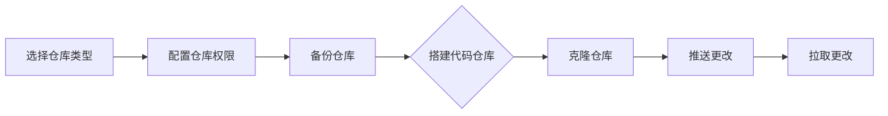
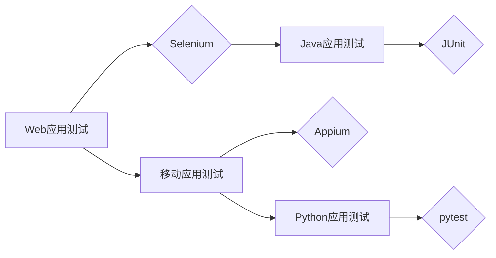

                 

### 打造高效的代码协作平台

在当今快速发展的信息技术时代，软件开发项目的规模和复杂性不断增加。传统的单点开发模式已经无法满足高效协作的需求。团队之间的沟通障碍、代码冲突、版本混乱等问题日益突出，严重影响了项目的进度和质量。为了解决这些问题，打造一个高效的代码协作平台变得至关重要。

**关键词：** 代码协作、平台、高效、版本控制、敏捷开发、分布式团队

**摘要：** 本文将探讨如何通过引入版本控制工具、代码仓库管理、敏捷开发与协作工具等现代技术手段，打造一个高效的代码协作平台。文章将详细阐述代码协作平台的基础技术、实际应用和最佳实践，以帮助开发团队提高协作效率，确保代码质量和项目进度。

### 第一部分：引言

#### 1.1 问题背景

在软件开发过程中，团队协作是至关重要的。然而，传统的单点开发模式往往存在以下问题：

1. **沟通障碍：** 团队成员分散在不同的地理位置，沟通效率低下。
2. **代码冲突：** 多人同时修改同一文件，容易导致代码冲突。
3. **版本混乱：** 缺乏有效的版本控制，导致代码历史记录不清晰。
4. **进度延迟：** 项目进度往往因协作问题而延迟。

为了解决这些问题，需要一个高效的代码协作平台，以实现团队成员之间的有效沟通、代码协同管理和版本控制。

#### 1.2 问题解决

通过引入以下技术手段，可以构建一个高效的代码协作平台：

1. **版本控制工具：** 如Git，用于管理代码版本，解决代码冲突和版本混乱问题。
2. **代码仓库管理：** 包括代码仓库的搭建、权限控制和备份，确保代码安全。
3. **敏捷开发与协作工具：** 如Jira、Trello等，用于项目管理和团队协作。
4. **分布式团队协作：** 利用工具实现远程团队的协同工作。
5. **自动化测试与持续集成：** 提高代码质量，确保项目进度。

#### 1.3 边界与外延

本文主要关注代码协作平台的技术实现和应用实践，不包括硬件、网络等底层基础设施的建设。同时，本文将探讨代码协作平台在不同场景下的应用，如企业内部开发、开源项目协作等。

### 1.4 核心概念与联系

在构建代码协作平台时，需要理解以下几个核心概念：

1. **版本控制：** 管理代码版本，解决多人协作时的代码冲突和版本混乱。
2. **代码仓库：** 存放代码的场所，支持版本控制、权限管理和备份。
3. **敏捷开发：** 以迭代和增量为原则，提高开发效率和代码质量。
4. **分布式团队协作：** 管理远程团队之间的协作，解决沟通和协调问题。

这些概念相互关联，共同构成一个高效的代码协作平台。下表对比了这些概念的主要属性和特征：

| 概念       | 主要属性        | 特征对比        |
|------------|----------------|----------------|
| 版本控制   | 管理代码版本   | Git、SVN等      |
| 代码仓库   | 存放代码的场所 | GitLab、GitHub等 |
| 敏捷开发   | 迭代和增量     | Scrum、XP等     |
| 分布式团队协作 | 远程协作     | Zoom、Slack等   |

图1-1展示了这些概念之间的实体关系：

```mermaid
erDiagram
  类 VersionControl ||--|{ 类 CodeRepository }|
  类 CodeRepository ||--|{ 类 AgileDevelopment }|
  类 AgileDevelopment ||--|{ 类 DistributedTeamCollaboration }|
```

通过理解这些概念及其联系，可以更好地构建和优化代码协作平台。

### 第二部分：代码协作平台的基础技术

#### 2.1 版本控制工具

版本控制工具是构建代码协作平台的核心组件，用于管理代码的版本和历史。Git是目前最流行的版本控制工具之一，它基于分布式模型，使得开发人员可以在本地维护完整的代码仓库，提高协作效率。

#### 2.1.1 Git简介

Git由Linux内核开发者Linus Torvalds创建，于2005年发布。与集中式版本控制工具（如SVN）相比，Git具有以下特点：

1. **分布式模型：** 每个开发人员都有一个完整的代码仓库，可以独立进行开发、提交和合并。
2. **高效性：** Git采用基于内容的地址存储，相比文件系统的目录结构，可以更高效地管理代码。
3. **分支管理：** 支持灵活的分支和合并操作，方便开发人员独立进行实验性开发。

#### 2.1.2 Git工作流程

Git的工作流程主要包括以下几个步骤：

1. **初始化仓库（Initialization）**：将本地文件夹初始化为Git仓库，通过`git init`命令完成。
2. **创建分支（Branching）**：在主分支（通常为master或main）上创建新分支，进行独立的开发工作。
3. **提交更改（Committing）**：将本地更改提交到仓库，使用`git commit`命令。
4. **合并分支（Merging）**：将开发分支合并到主分支，使用`git merge`命令。
5. **发布版本（Tagging）**：为合并后的代码打上版本标签，使用`git tag`命令。

以下是Git工作流程的Mermaid流程图：


#### 2.1.3 Git最佳实践

在实际应用中，以下Git最佳实践可以帮助开发人员更好地管理代码版本：

1. **合理组织分支**：使用主分支（如master或main）进行主干开发，使用功能分支进行特性开发，使用修复分支进行bug修复。
2. **使用Commit规范**：遵循一定的Commit规范，如Angular的Commit Message规范，确保提交信息清晰、易读。
3. **避免不必要的冲突**：通过频繁的合并操作，减少代码冲突的可能性。

#### 2.2 代码仓库管理

代码仓库是存储项目源代码的地方，它可以是本地的，也可以是远程的。通过代码仓库，开发人员可以方便地共享代码、协同工作。

#### 2.2.1 代码仓库的基本概念

1. **本地仓库（Local Repository）**：存储在本地计算机上的代码仓库，每个开发人员都有自己的本地仓库。
2. **远程仓库（Remote Repository）**：存储在远程服务器上的代码仓库，如GitHub、GitLab等。
3. **克隆仓库（Cloning）**：将远程仓库克隆到本地，使用`git clone`命令。
4. **推送更改（Pushing）**：将本地仓库的更改推送到远程仓库，使用`git push`命令。
5. **拉取更改（Pulling）**：从远程仓库拉取更改到本地仓库，使用`git pull`命令。

#### 2.2.2 代码仓库的搭建与管理

搭建代码仓库的步骤如下：

1. **选择仓库类型**：根据项目需求，选择私有仓库或公有仓库。
2. **配置仓库权限**：设置仓库的访问权限，确保代码安全。
3. **备份仓库**：定期备份仓库，以防数据丢失。

以下是一个简单的代码仓库搭建和管理流程的Mermaid流程图：



#### 2.2.3 代码仓库的权限控制

代码仓库的权限控制是确保代码安全的重要环节。以下是一些权限控制的方法：

1. **用户角色划分**：根据用户的职责和权限，划分不同的用户角色（如管理员、开发者、贡献者等）。
2. **权限配置**：使用代码仓库的权限配置功能，设置用户角色的权限。
3. **代码审计**：定期进行代码审计，防止恶意代码的提交。

以下是一个简单的权限控制流程的Mermaid流程图：


### 第三部分：高效代码协作的实际应用

#### 3.1 分布式团队协作

随着全球化的发展，越来越多的软件开发团队采用分布式协作模式。这种模式能够充分利用全球各地的开发资源，提高团队的整体效率。然而，分布式团队协作也面临着一些挑战，如沟通障碍、时间差异等。

#### 3.1.1 分布式团队协作的优势

1. **资源利用最大化**：分布式团队可以充分利用全球各地的开发资源，提高团队的规模和多样性。
2. **工作时间灵活性**：团队成员可以在不同的时区工作，提高工作效率。
3. **专业技能互补**：分布式团队可以汇集不同地区的专业技能，解决项目中的复杂问题。

#### 3.1.2 分布式团队协作的挑战与解决方案

1. **沟通障碍**：解决方法：使用实时通讯工具（如Slack、Zoom）进行沟通，确保信息的及时传递。
2. **时间差异**：解决方法：制定统一的开发计划和会议时间，减少时间差异带来的影响。
3. **协作效率**：解决方法：引入敏捷开发工具（如Jira、Trello），提高团队协作效率。

以下是一个分布式团队协作流程的Mermaid流程图：


#### 3.1.3 分布式团队协作的实际案例

以某国际知名互联网公司为例，该公司在全球范围内拥有多个开发团队。通过引入GitLab、Jira、Slack等工具，实现了高效的分布式团队协作。以下是一个实际案例：

1. **资源利用最大化**：公司在全球范围内招募优秀开发者，充分利用各地人才资源。
2. **工作时间灵活性**：团队成员根据个人时间安排工作，提高工作效率。
3. **专业技能互补**：不同地区的团队具备不同的专业技能，共同解决项目中的问题。
4. **沟通与协作**：通过GitLab进行代码管理，通过Slack进行实时沟通，通过Jira进行任务跟踪，确保项目的顺利进行。

### 第四部分：自动化测试与持续集成

#### 4.1 自动化测试的基本概念

自动化测试是一种通过脚本或工具自动执行测试的方法，用于验证软件的功能、性能和安全性。自动化测试能够提高测试效率、减少测试成本，并确保软件质量。

#### 4.1.1 自动化测试的优势

1. **提高测试效率**：自动化测试可以节省测试时间，减少人工测试的工作量。
2. **减少测试成本**：自动化测试可以反复执行，降低测试成本。
3. **提高测试覆盖度**：自动化测试可以覆盖更多的测试场景，提高测试覆盖度。

#### 4.1.2 自动化测试的工具选型

根据不同的项目需求和测试场景，可以选择不同的自动化测试工具。以下是一些常见的自动化测试工具：

1. **Selenium**：用于Web应用的自动化测试，支持多种编程语言。
2. **Appium**：用于移动应用的自动化测试，支持iOS和Android平台。
3. **JUnit**：用于Java应用的单元测试，支持各种测试框架。
4. **pytest**：用于Python应用的自动化测试，具有强大的功能。

以下是一个自动化测试工具选型的Mermaid流程图：



#### 4.2 自动化测试的应用

自动化测试在软件开发过程中的应用主要包括以下方面：

1. **单元测试**：测试单个模块的功能和性能，确保模块的正确性。
2. **集成测试**：测试模块之间的接口和集成，确保系统的整体性能。
3. **回归测试**：在代码更改后进行测试，确保更改没有引入新的问题。

以下是一个自动化测试应用的Mermaid流程图：


#### 4.3 持续集成与持续部署

持续集成（CI）和持续部署（CD）是一种软件开发和部署的方法，通过自动化测试和部署流程，提高软件质量和交付效率。

#### 4.3.1 持续集成的基本概念

持续集成是一种软件开发和测试的方法，通过将代码库中的每次更改都集成到主干，并立即进行测试，确保代码的稳定性和质量。

#### 4.3.2 持续集成的工作流程

持续集成的工作流程主要包括以下几个步骤：

1. **代码提交**：开发人员将代码提交到代码库。
2. **构建和测试**：自动化构建和测试系统自动执行构建和测试。
3. **反馈**：测试结果和问题反馈给开发人员，确保问题的及时解决。

以下是一个持续集成的工作流程的Mermaid流程图：


#### 4.3.3 持续部署的基本概念

持续部署是一种将软件自动部署到生产环境的方法，通过自动化部署流程，提高软件交付的效率和可靠性。

#### 4.3.4 持续部署的工作流程

持续部署的工作流程主要包括以下几个步骤：

1. **代码集成**：将代码集成到主干。
2. **自动化测试**：执行自动化测试，确保代码的质量。
3. **部署**：将经过测试的代码自动部署到生产环境。

以下是一个持续部署的工作流程的Mermaid流程图：


### 第五部分：持续学习与反馈优化

#### 5.1 代码协作中的持续学习

在代码协作过程中，持续学习是非常重要的。通过持续学习，开发人员可以不断提高自己的技能，跟上技术发展的步伐。

#### 5.1.1 持续学习的途径

1. **在线课程和教程**：参加在线课程和教程，学习新的编程语言和技术。
2. **阅读技术博客和文档**：阅读技术博客和文档，了解行业动态和最佳实践。
3. **实践项目**：参与实践项目，将所学知识应用到实际工作中。

#### 5.1.2 持续学习的策略

1. **设定学习目标**：明确自己的学习目标，制定学习计划。
2. **定期复习**：定期复习所学知识，巩固记忆。
3. **交流与分享**：与同事和同行进行交流与分享，提高自己的表达能力。

#### 5.2 反馈机制的建立与优化

在代码协作过程中，建立有效的反馈机制是非常重要的。通过反馈，可以及时发现和解决问题，提高代码质量和团队协作效率。

#### 5.2.1 反馈机制的基本原则

1. **及时性**：及时反馈问题，避免问题的积累和恶化。
2. **准确性**：准确描述问题和解决方案，避免误解和歧义。
3. **全面性**：从多个角度和层面进行反馈，提高反馈的全面性和有效性。

#### 5.2.2 反馈机制的建立步骤

1. **定义反馈流程**：明确反馈的流程和步骤，确保反馈的及时性和准确性。
2. **建立反馈渠道**：建立多种反馈渠道，如邮件、即时通讯工具、会议等。
3. **培训反馈技巧**：对团队成员进行反馈技巧的培训，提高反馈的质量。

#### 5.2.3 反馈机制的优化

1. **定期回顾**：定期回顾反馈机制的实施效果，发现和解决问题。
2. **持续改进**：根据反馈机制的实施效果，持续改进和优化反馈流程。
3. **数据驱动**：利用数据分析和反馈统计，发现和解决团队协作中的问题。

### 第六部分：最佳实践与总结

#### 6.1 版本控制最佳实践

1. **合理组织分支**：使用主分支进行主干开发，使用功能分支进行特性开发，使用修复分支进行bug修复。
2. **使用Commit规范**：遵循Angular的Commit Message规范，确保提交信息清晰、易读。
3. **避免不必要的冲突**：通过频繁的合并操作，减少代码冲突的可能性。

#### 6.2 代码仓库管理最佳实践

1. **选择合适的仓库类型**：根据项目需求，选择私有仓库或公有仓库。
2. **配置仓库权限**：设置仓库的访问权限，确保代码安全。
3. **定期备份仓库**：定期备份仓库，以防数据丢失。

#### 6.3 敏捷开发与协作工具最佳实践

1. **选择合适的敏捷开发工具**：根据项目需求和团队规模，选择合适的敏捷开发工具，如Jira、Trello等。
2. **制定统一的开发计划**：确保团队成员对项目进度有清晰的认识。
3. **定期回顾与总结**：定期回顾敏捷开发的效果，总结经验和教训，持续改进。

### 9.1 书籍总结

本文通过详细的阐述和实例分析，探讨了如何打造一个高效的代码协作平台。本文首先介绍了代码协作平台的重要性，然后详细介绍了版本控制工具、代码仓库管理、敏捷开发与协作工具等基础技术，以及分布式团队协作、自动化测试与持续集成等实际应用。最后，本文总结了最佳实践和注意事项，为开发团队提供了宝贵的经验和指导。

### 9.2 未来发展趋势

随着技术的发展，代码协作平台将朝着更加智能化、自动化的方向发展。以下是一些未来发展趋势：

1. **智能化代码协作**：利用人工智能技术，实现代码审查、bug预测和优化建议等功能。
2. **多云和混合云协作**：支持多云和混合云环境，实现跨云平台的协作。
3. **区块链技术在代码协作中的应用**：利用区块链技术，提高代码的安全性和可信度。
4. **自动化部署与运维**：实现自动化部署和运维，提高开发效率和系统稳定性。

### 9.3 拓展阅读

1. **《Git权威指南》**：了解Git的基本概念和工作流程，掌握Git的最佳实践。
2. **《敏捷开发实践指南》**：学习敏捷开发的方法和工具，提高团队协作效率。
3. **《持续集成实践》**：了解持续集成和持续部署的基本概念和工作流程。
4. **《分布式系统设计》**：学习分布式系统的设计原则和架构模式，提高分布式团队协作效率。

### 参考文献

1. **Git官方文档**：[https://git-scm.com/docs](https://git-scm.com/docs)
2. **Jira官方文档**：[https://www.atlassian.com/software/jira/documentation](https://www.atlassian.com/software/jira/documentation)
3. **Trello官方文档**：[https://trello.com/docs](https://trello.com/docs)
4. **Selenium官方文档**：[https://www.selenium.dev/documentation/](https://www.selenium.dev/documentation/)
5. **Appium官方文档**：[https://appium.io/docs/](https://appium.io/docs/)
6. **JUnit官方文档**：[https://junit.org/junit5/docs/current/user/html/index.html](https://junit.org/junit5/docs/current/user/html/index.html)
7. **pytest官方文档**：[https://docs.pytest.org/en/7.1.x/](https://docs.pytest.org/en/7.1.x/)

### 作者信息

**作者：** AI天才研究院/AI Genius Institute & 禅与计算机程序设计艺术 /Zen And The Art of Computer Programming

