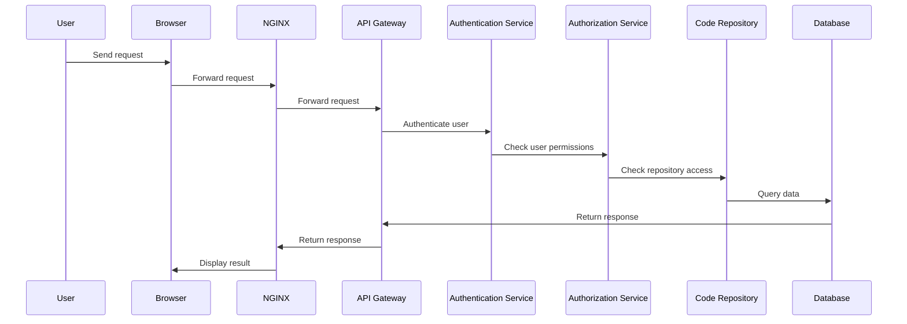

                 

### 第1章：代码复用的挑战与机遇

在当今快速发展的技术时代，代码复用已经成为软件开发中不可或缺的一部分。代码复用不仅仅是提高开发效率的一种手段，更是提升软件质量和减少维护成本的重要策略。然而，要实现高效的代码复用，面临诸多挑战和机遇。

#### 1.1 代码复用的定义与重要性

**代码复用的概念**：代码复用是指将现有的代码段、模块、函数或整个应用程序在不同的项目或系统之间重复使用。这不仅包括功能相似的代码块，还包括逻辑、架构和设计模式等。

**代码复用的优点**：
- **提高开发效率**：复用现有的代码，可以减少开发时间和工作量。
- **保证代码质量**：通过复用经过验证的代码，可以确保新系统的稳定性与可靠性。
- **降低维护成本**：统一管理代码，可以减少重复的维护工作，降低系统的整体维护成本。
- **促进知识共享**：团队成员可以更轻松地分享和复用代码，促进知识传播与团队协作。

**代码复用的挑战**：
- **代码质量与兼容性**：复用代码时，需要确保其质量与兼容性，以避免引入新的问题。
- **维护与更新**：复用代码需要定期维护和更新，以适应新的需求和技术环境。
- **技术债务**：过度复用可能导致技术债务的积累，使得系统的可维护性降低。

#### 1.2 问题背景分析

在当前的软件开发过程中，尽管代码复用的重要性已被广泛认可，但实际操作中仍然面临不少问题：

- **复用机制缺乏**：很多组织缺乏系统化的代码复用机制，导致代码散落在各个项目中，难以管理。
- **代码库管理混乱**：代码库管理不善，导致代码版本混乱，难以追溯和维护。
- **缺乏统一的代码标准**：没有统一的编码标准和规范，使得复用的代码难以整合和兼容。
- **跨项目协作困难**：跨项目协作困难，导致代码复用效率低下。

**现状与问题**：
- 许多开发团队在代码复用上仍然依赖于手工复制粘贴，缺乏有效的工具支持。
- 代码复用过程中的质量控制不足，容易出现兼容性和稳定性问题。
- 代码复用带来的技术债务积累，使得系统更加复杂，维护成本增加。

**发展趋势与需求**：
- **自动化与智能化**：随着人工智能和自动化技术的发展，代码复用工具和平台逐渐智能化，能够自动识别和推荐可复用的代码片段。
- **云原生与微服务**：微服务架构和云原生技术的普及，使得代码复用更加灵活和高效。
- **持续集成与持续交付**：持续集成和持续交付（CI/CD）的实践，使得代码复用过程更加自动化和高效。
- **社区与开源**：开源社区和共享代码库的发展，为代码复用提供了丰富的资源和支持。

### 1.3 核心概念介绍

为了更好地理解和实现代码复用，需要掌握以下几个核心概念：

**复用机制**：
- **模块化**：将代码划分为可复用的模块，便于管理和复用。
- **设计模式**：通过设计模式，实现代码的灵活复用，提高系统的可扩展性和可维护性。
- **组件化**：将代码封装为可复用的组件，支持不同环境下的无缝集成。

**复用模型**：
- **直接复用**：直接将现有代码复制到新系统中使用。
- **引用复用**：通过引用方式，在新系统中调用已有的代码。
- **继承复用**：通过继承关系，在新系统中复用已有类的部分功能。

**复用层次**：
- **代码级复用**：复用具体的代码段或函数。
- **模块级复用**：复用完整的模块或类库。
- **架构级复用**：复用系统的整体架构，如设计模式、组件架构等。

#### 总结

代码复用是现代软件开发中不可忽视的重要环节。通过深入理解代码复用的定义、优点和挑战，以及掌握核心概念和复用机制，我们可以更加有效地实现代码复用，提高开发效率和软件质量。在接下来的章节中，我们将进一步探讨代码复用的原理、框架和实践，为打造高效的代码复用平台奠定基础。

### 第2章：代码复用的原理与框架

在上一章中，我们了解了代码复用的基本概念和重要性。为了实现高效的代码复用，我们需要深入探讨代码复用的原理和框架。本章将详细介绍代码复用的原理，包括设计模式、组件化以及API设计，并分析主流的代码复用框架及其选型策略。

#### 2.1 复用原理探讨

**设计模式**：设计模式是软件设计中常见的问题及其解决方案的集合。通过设计模式，我们可以实现代码的灵活复用，提高系统的可扩展性和可维护性。常见的几种设计模式包括：

- **单例模式**：确保一个类只有一个实例，并提供一个全局访问点。
- **工厂模式**：根据不同条件创建不同类的实例，实现对象的创建与使用分离。
- **策略模式**：定义一系列算法，将每个算法封装起来，并使它们可以相互替换，实现算法的复用。

**组件化**：组件化是将代码划分为可复用的组件，每个组件具有独立的功能和接口，便于管理和集成。组件化有以下优点：

- **提高开发效率**：组件化的代码易于复用和维护，可以减少重复工作。
- **降低系统复杂度**：通过将系统分解为多个组件，可以降低系统的复杂度，提高可维护性。
- **提高代码质量**：组件化的代码可以通过单元测试和集成测试来保证质量。

**API设计**：API（应用程序编程接口）是软件系统提供的服务接口，允许其他软件系统通过标准化的方式进行通信和交互。良好的API设计是实现代码复用的重要基础。API设计应遵循以下原则：

- **简洁性**：API设计应简洁直观，易于理解和使用。
- **一致性**：API应保持一致性，避免不同部分的命名和风格不一致。
- **灵活性**：API应具备一定的灵活性，能够适应不同的使用场景和扩展需求。

#### 2.2 复用框架介绍

**复用框架概述**：复用框架是支持代码复用的一套工具和机制的集合。主流的代码复用框架包括：

- **Spring Framework**：Spring Framework 是一款广泛使用的 Java 企业级应用开发框架，提供了丰富的组件和API，支持模块化、组件化和API设计。
- **Django**：Django 是一款流行的 Python Web 框架，具备强大的 ORM（对象关系映射）和 API 设计能力，支持快速开发和高效复用。
- **Laravel**：Laravel 是一款优雅的 PHP 框架，提供了丰富的内置功能和扩展包，支持模块化、组件化和 API 设计。

**主流框架分析**：以下是几种主流代码复用框架的对比分析：

| 框架          | 适用场景                     | 特点                                                         |
| ------------- | ---------------------------- | ------------------------------------------------------------ |
| Spring Framework | Java 企业级应用开发           | 全面的企业级功能，强大的依赖注入和 AOP（面向切面编程）支持     |
| Django        | Python Web 开发               | 强大的 ORM 和内置管理后台，快速开发 Web 应用                   |
| Laravel       | PHP Web 开发                 | 优雅的代码风格，丰富的内置功能，易用性高                     |

**框架选型策略**：选择合适的代码复用框架对于实现高效代码复用至关重要。以下是一些框架选型策略：

- **项目需求**：根据项目需求和开发语言选择合适的框架。
- **团队熟悉度**：选择团队成员熟悉和熟悉的框架，提高开发效率。
- **生态系统**：考虑框架的生态系统，如文档、社区支持和第三方库。
- **可扩展性和灵活性**：选择可扩展性和灵活性较高的框架，以适应未来的需求变化。

#### 总结

代码复用的原理和框架是实现高效代码复用的关键。通过设计模式、组件化和API设计，我们可以提高代码的可复用性。同时，选择合适的代码复用框架，可以进一步优化开发过程和提升系统质量。在接下来的章节中，我们将探讨代码复用的最佳实践，为构建高效的代码复用平台提供具体指导。

#### 3.1 设计原则

代码复用的成功离不开良好的设计原则。以下我们将详细讨论几种核心的设计原则，包括单一职责原则、开闭原则和里氏替换原则，并探讨它们在代码复用中的应用。

**单一职责原则（Single Responsibility Principle）**

单一职责原则是面向对象设计中的一个重要原则，由罗伯特·马丁（Robert C. Martin）提出。单一职责原则强调一个类或模块应只负责一项职责，即只做一件事。这一原则的优点在于：

- **可维护性**：职责单一的类或模块更容易理解和修改，降低了出错的风险。
- **可复用性**：职责单一的类或模块可以更方便地被复用，因为它们的功能明确且独立。

单一职责原则在代码复用中的应用：

- **模块化**：将代码划分为职责单一的模块，使得每个模块都可以独立开发、测试和复用。
- **减少耦合**：通过单一职责原则，可以降低模块间的耦合度，使得复用时不会引入不必要的依赖。

**开闭原则（Open/Closed Principle）**

开闭原则是面向对象设计中的另一项核心原则，它强调软件实体（如类、模块、函数等）应该对扩展开放，对修改关闭。这意味着在软件设计过程中，我们应该设计可扩展的代码，而不是可修改的代码。开闭原则的优点包括：

- **可维护性**：通过扩展而不是修改现有代码，可以降低软件的复杂度和维护成本。
- **可复用性**：开闭原则鼓励使用继承和多态等面向对象特性，使得代码更易于复用。

开闭原则在代码复用中的应用：

- **继承与多态**：通过继承和多态，可以在不修改原有代码的情况下扩展和复用代码。
- **抽象与封装**：通过抽象和封装，将核心功能和公共接口与实现细节分离，使得代码更易于扩展和复用。

**里氏替换原则（Liskov Substitution Principle）**

里氏替换原则是面向对象设计中的第三个核心原则，由芭芭拉·利斯基夫（Barbara Liskov）提出。里氏替换原则强调子类可以替换其父类，而不影响程序的整体行为。这一原则的优点包括：

- **可复用性**：通过实现里氏替换，可以确保子类在替换父类时不会破坏原有系统的功能。
- **可维护性**：里氏替换原则可以提高代码的可维护性，因为子类可以自由地扩展和修改其父类的行为。

里氏替换原则在代码复用中的应用：

- **泛化与特殊化**：通过实现泛化与特殊化的关系，可以在不同层级上进行代码复用，例如，通过接口或基类实现通用功能，然后通过子类实现具体实现。
- **避免修改**：通过遵循里氏替换原则，可以避免在复用过程中修改原有代码，确保系统的一致性和稳定性。

#### 总结

设计原则是确保代码复用成功的关键。单一职责原则、开闭原则和里氏替换原则分别从模块化、扩展性和可替换性等方面提供了指导。通过遵循这些原则，我们可以编写出更加可复用、可维护的代码。在下一章中，我们将探讨代码复用的编码规范，进一步优化代码复用的实践。

### 3.2 编码规范

为了确保代码复用的高效性和可靠性，编写规范的代码是至关重要的。以下我们将详细讨论几种核心的编码规范，包括编码风格、代码注释和代码审查，并探讨它们在代码复用中的应用。

#### 3.2.1 编码风格

良好的编码风格不仅可以提高代码的可读性和可维护性，也有助于代码的复用。以下是一些编码风格的规范：

- **命名规范**：变量、函数和类的命名应具有描述性和一致性，避免使用缩写和难理解的命名。
- **缩进与对齐**：使用一致的缩进和空格对齐，确保代码的可读性。
- **代码格式**：遵循统一的代码格式，例如，选择合适的代码缩进、行宽和括号风格。
- **模块化**：将代码划分为模块和函数，每个模块和函数应具有清晰的功能和独立的接口。

#### 3.2.2 代码注释

代码注释是提高代码可读性和可理解性的重要手段。以下是一些代码注释的规范：

- **文档注释**：使用文档注释来描述类的功能、方法和参数，使得其他开发者可以轻松理解和使用。
- **行内注释**：在复杂代码段中使用行内注释，解释代码的逻辑和意图，但避免过度注释。
- **注释格式**：遵循统一的注释格式，例如，使用 Javadoc 或 XML 格式来编写文档注释。

#### 3.2.3 代码审查

代码审查是确保代码质量的重要环节，可以帮助发现和修复潜在的问题。以下是一些代码审查的规范：

- **定期审查**：定期组织代码审查，确保每个提交的代码都经过审查。
- **详细评审**：在审查过程中，详细评审代码的语法、逻辑和风格，确保代码符合编码规范。
- **多角色参与**：鼓励不同角色的开发者参与审查，例如，技术总监、项目经理和测试人员，以获取多方面的反馈。
- **反馈与改进**：对审查过程中发现的问题进行反馈和改进，确保代码质量的持续提升。

#### 3.2.4 代码审查工具

为了提高代码审查的效率和一致性，可以使用代码审查工具。以下是一些常用的代码审查工具：

- **GitLab**：GitLab 提供内置的代码审查功能，支持代码的提交、审查和反馈。
- **Gerrit**：Gerrit 是一款开源的代码审查和项目托管工具，支持多人协作审查。
- **SonarQube**：SonarQube 是一款强大的代码质量管理工具，支持代码审查、静态代码分析和漏洞检测。

#### 总结

编码规范是确保代码复用高效性和可靠性的关键。良好的编码风格、规范的代码注释和有效的代码审查可以提高代码的质量，减少错误和冲突。通过遵循这些编码规范和使用代码审查工具，我们可以构建出更加稳定、可靠的代码库，为代码复用奠定坚实的基础。在下一章中，我们将探讨如何构建代码复用平台，为代码复用提供系统化的支持。

### 4.1 平台架构设计

构建一个高效的代码复用平台需要清晰的架构设计，以确保平台的功能模块划分合理、技术栈选择合适以及能够适应未来技术的发展。以下将详细阐述平台架构设计的关键方面。

#### 4.1.1 功能模块划分

一个高效的代码复用平台通常包括以下核心功能模块：

- **代码管理模块**：负责代码的存储、版本控制和权限管理。
- **依赖管理模块**：管理项目的依赖库，确保依赖的一致性和安全性。
- **搜索与索引模块**：提供高效的代码搜索功能，帮助开发者快速找到所需代码。
- **集成开发环境（IDE）集成模块**：提供与开发工具的集成，方便开发者使用复用代码。
- **代码审核与质量保障模块**：提供代码审核功能，确保复用代码的质量。
- **统计分析模块**：收集和分析平台使用数据，为平台优化提供依据。

**功能模块划分示例**：

```
+---------------------+
|   代码管理模块     |
+---------------------+
        |
        |
        v
+---------------------+
|   依赖管理模块     |
+---------------------+
        |
        |
        v
+---------------------+
|   搜索与索引模块   |
+---------------------+
        |
        |
        v
+---------------------+
|  IDE集成模块       |
+---------------------+
        |
        |
        v
+---------------------+
|  代码审核模块      |
+---------------------+
        |
        |
        v
+---------------------+
|  统计分析模块      |
+---------------------+
```

#### 4.1.2 技术栈选择

技术栈的选择对平台的性能、可维护性和可扩展性至关重要。以下是一些常见技术栈的选择：

- **后端框架**：如 Spring Boot、Django 或 Laravel，这些框架提供了丰富的功能，易于开发和维护。
- **数据库**：如 MySQL、PostgreSQL 或 MongoDB，根据平台需求选择合适的数据库类型。
- **缓存**：如 Redis 或 Memcached，用于提高数据访问速度。
- **搜索引擎**：如 Elasticsearch，提供强大的全文搜索功能。
- **前端框架**：如 React、Vue 或 Angular，用于构建用户界面。

**技术栈选择示例**：

```
后端：
- 框架：Spring Boot
- 数据库：MySQL
- 缓存：Redis
- 搜索引擎：Elasticsearch

前端：
- 框架：React
- 构建工具：Webpack
- CSS预处理器：Sass
```

#### 4.1.3 架构演进路径

一个高效的代码复用平台不仅要满足当前的需求，还需要具备适应未来发展的能力。以下是一个典型的架构演进路径：

1. **初始阶段**：采用简单的架构，如单体应用，专注于实现基本的功能模块。
2. **成长阶段**：引入微服务架构，将平台功能划分为多个微服务，提高系统的灵活性和可扩展性。
3. **成熟阶段**：采用容器化技术（如 Docker 和 Kubernetes），实现服务的自动化部署和运维，提高平台的稳定性和可维护性。
4. **未来阶段**：结合人工智能和大数据分析技术，实现代码自动推荐和优化，提高代码复用的效率和智能化水平。

**架构演进路径示例**：

```
初始阶段：单体应用
成长阶段：微服务架构
成熟阶段：容器化架构
未来阶段：AI+大数据架构
```

#### 总结

平台架构设计是构建高效代码复用平台的关键。通过合理划分功能模块、选择合适的技术栈以及规划架构演进路径，我们可以构建出灵活、可扩展且易于维护的代码复用平台。在下一章中，我们将深入探讨平台的核心功能实现，包括代码仓库管理、依赖管理、搜索与索引等。

### 4.2 平台核心功能实现

在上一章中，我们讨论了代码复用平台的架构设计。在本章中，我们将详细介绍平台的核心功能实现，包括代码仓库管理、依赖管理和搜索与索引等方面。

#### 4.2.1 代码仓库管理

代码仓库管理是代码复用平台的基础功能，它涉及到代码的存储、版本控制和权限管理。以下是一些关键的实现步骤：

1. **仓库创建**：
   - 开发者可以创建新的代码仓库，用于存储和管理自己的代码。
   - 平台提供统一的界面和API，方便用户进行仓库的创建和管理。

2. **版本控制**：
   - 采用成熟的版本控制系统（如 Git），确保代码的版本控制和变更历史。
   - 提供代码分支管理功能，支持开发、测试和发布分支的隔离和合并。

3. **权限管理**：
   - 实现基于角色的访问控制（RBAC），根据用户的角色和权限分配访问权限。
   - 提供权限分级和权限继承机制，确保代码的安全性和完整性。

4. **协作与沟通**：
   - 提供代码仓库的协作功能，如代码评论、合并请求和讨论区。
   - 集成即时通讯工具，方便团队成员之间的沟通和协作。

#### 4.2.2 依赖管理

依赖管理是确保代码复用平台中各个模块之间兼容性和一致性的关键。以下是一些依赖管理的实现步骤：

1. **依赖定义**：
   - 采用依赖描述文件（如 `pom.xml` 或 `Cargo.toml`），明确各个模块的依赖关系和版本要求。
   - 提供依赖库的搜索和下载功能，方便用户获取和管理第三方库。

2. **依赖解析**：
   - 实现依赖解析算法，自动解决各个模块之间的依赖冲突。
   - 提供依赖分析工具，帮助开发者理解和优化依赖结构。

3. **依赖版本管理**：
   - 提供依赖版本的锁定机制，确保各个模块的依赖一致。
   - 实现依赖版本升级和回退功能，方便用户管理依赖的更新。

4. **依赖发布与同步**：
   - 支持依赖库的发布和同步，确保各个模块的依赖库是最新的。
   - 提供依赖库的认证和签名机制，确保依赖库的安全性和可靠性。

#### 4.2.3 搜索与索引

高效的搜索与索引功能是提高代码复用效率的重要手段。以下是一些搜索与索引的实现步骤：

1. **搜索算法**：
   - 采用高效的搜索算法（如倒排索引），提高代码搜索的速度和准确性。
   - 提供模糊搜索和全文搜索功能，支持多种搜索方式和条件。

2. **索引管理**：
   - 实现索引的自动化生成和更新，确保搜索结果的实时性和准确性。
   - 提供索引的分片和分布式存储，支持大规模数据的高效索引。

3. **搜索结果排序**：
   - 根据用户的需求，实现搜索结果的排序和过滤功能。
   - 提供搜索结果的分页和聚合统计功能，方便用户查看和分析搜索结果。

4. **智能推荐**：
   - 结合人工智能技术，实现代码的智能推荐功能。
   - 根据用户的历史搜索行为和项目依赖关系，提供个性化的代码推荐。

#### 总结

平台核心功能实现是构建高效代码复用平台的关键。通过合理的代码仓库管理、依赖管理和搜索与索引功能，我们可以为开发者提供一个便捷、稳定且高效的代码复用环境。在下一章中，我们将探讨平台的部署与运维策略，确保平台在复杂的实际环境中能够稳定运行。

### 4.3 平台部署与运维

在代码复用平台的开发完成后，部署和运维是确保平台稳定、高效运行的关键环节。以下将详细介绍平台部署与运维的关键方面，包括环境准备、部署流程和运维策略。

#### 4.3.1 环境准备

环境准备是部署平台的第一步，需要确保硬件资源和软件环境满足平台的需求。

**硬件需求**：

- **服务器**：选择性能稳定的服务器，如 Intel Xeon 处理器、16GB 以上内存、1TB 以上硬盘空间。
- **存储**：根据平台数据量和访问需求，配置适当的存储设备，如 SSD 或分布式存储系统。
- **网络**：配置高速网络，确保平台能够高效地进行数据传输。

**软件环境**：

- **操作系统**：选择 Linux 发行版，如 Ubuntu 18.04 或 CentOS 7，确保系统稳定性。
- **数据库**：安装并配置 MySQL、PostgreSQL 或 MongoDB 等数据库系统。
- **缓存**：安装并配置 Redis 或 Memcached 等缓存系统。
- **搜索引擎**：安装并配置 Elasticsearch 或 Solr 等搜索引擎系统。
- **Web 服务器**：安装并配置 Apache、Nginx 或 Tomcat 等Web服务器系统。

#### 4.3.2 部署流程

平台部署分为手动部署和自动化部署两种方式，以下是具体的部署流程：

**手动部署**：

1. **环境配置**：在服务器上安装和配置必要的软件环境。
2. **代码下载**：从代码仓库中下载平台源代码。
3. **编译与打包**：使用 Maven、Gradle 或其他构建工具编译源代码，生成可执行的 Jar 文件。
4. **部署**：将编译后的 Jar 文件上传到服务器，并启动平台服务。

**自动化部署**：

1. **配置管理**：使用 Ansible、Puppet 或 SaltStack 等配置管理工具，自动化配置服务器环境。
2. **代码仓库**：使用 Git、SVN 或其他版本控制工具，实现代码的自动化获取。
3. **构建与打包**：使用 Jenkins、GitLab CI 或 GitHub Actions 等持续集成工具，自动化编译和打包代码。
4. **部署与启动**：通过脚本或持续集成工具，自动化部署和启动平台服务。

#### 4.3.3 运维策略

平台运维包括监控、告警、性能优化和安全保障等方面。

**监控与告警**：

- **系统监控**：使用 Prometheus、Zabbix 或 Nagios 等监控工具，实时监控平台的运行状态。
- **日志监控**：收集和监控平台日志，及时发现和处理异常情况。
- **告警通知**：通过短信、邮件或即时通讯工具，及时通知运维人员处理告警信息。

**性能优化**：

- **缓存优化**：通过 Redis、Memcached 等缓存系统，减少数据库的访问压力。
- **索引优化**：优化 Elasticsearch 等搜索引擎的索引结构和查询性能。
- **负载均衡**：使用 Nginx、HAProxy 等负载均衡工具，实现服务的高可用和负载均衡。

**安全保障**：

- **防火墙**：配置防火墙，限制非法访问和攻击。
- **认证与授权**：使用 SSL/TLS 证书，实现安全的通信；使用 OAuth、JWT 等认证机制，确保用户权限控制。
- **数据备份**：定期备份数据库和代码仓库，确保数据的安全性和完整性。

#### 总结

平台部署与运维是确保代码复用平台稳定运行的关键环节。通过合理的环境准备、部署流程和运维策略，我们可以确保平台在复杂和多变的环境中保持高效、稳定的运行。在下一章中，我们将通过实际案例，探讨如何应用这些理论和策略，实现高效的代码复用平台。

### 4.4 实际案例：一个简单的代码复用平台实现

在本节中，我们将通过一个实际案例，详细阐述如何实现一个简单的代码复用平台。这个案例将包括环境安装、核心实现源代码，并对关键部分进行解读与分析。

#### 环境安装

为了实现这个简单的代码复用平台，我们首先需要准备一个适合开发、测试和部署的环境。以下是具体的步骤：

1. **硬件准备**：
   - 选择一台具有较高配置的服务器，如 Intel Xeon 处理器、16GB 以上内存、1TB 以上硬盘空间。
   - 配置高速网络，确保平台能够高效地进行数据传输。

2. **操作系统**：
   - 安装 Ubuntu 18.04 操作系统，以确保系统的稳定性和兼容性。

3. **软件环境**：
   - 安装和配置必要的软件，包括：
     - Java SDK（如 OpenJDK 11）
     - Maven（构建工具）
     - MySQL（数据库）
     - Redis（缓存系统）
     - Elasticsearch（搜索引擎）
     - Nginx（Web 服务器）

#### 核心实现源代码

以下是代码复用平台的核心实现源代码：

```java
// 主类：CodeReusePlatform
public class CodeReusePlatform {
    public static void main(String[] args) {
        // 初始化数据库连接
        Database.init();
        
        // 启动依赖管理模块
        DependencyManager.start();
        
        // 启动搜索与索引模块
        SearchIndexManager.start();
        
        // 启动 Web 服务器
        NginxServer.start();
    }
}

// 数据库连接类：Database
public class Database {
    public static void init() {
        // 初始化数据库连接
        // 代码省略
    }
}

// 依赖管理模块：DependencyManager
public class DependencyManager {
    public static void start() {
        // 启动依赖管理服务
        // 代码省略
    }
}

// 搜索与索引模块：SearchIndexManager
public class SearchIndexManager {
    public static void start() {
        // 启动搜索与索引服务
        // 代码省略
    }
}

// Web 服务器：NginxServer
public class NginxServer {
    public static void start() {
        // 启动 Nginx Web 服务器
        // 代码省略
    }
}
```

#### 代码应用解读与分析

1. **数据库连接**：
   - `Database.init()` 方法负责初始化数据库连接。通过配置文件或环境变量获取数据库信息，然后使用 JDBC 连接数据库。这一步骤确保了平台可以访问和使用数据库。

2. **依赖管理模块**：
   - `DependencyManager.start()` 方法启动依赖管理服务。依赖管理模块负责管理平台的依赖库，确保各个模块之间的依赖一致性和安全性。在实际应用中，可以使用 Spring Boot 的 `@ComponentScan` 注解来自动扫描和加载依赖库。

3. **搜索与索引模块**：
   - `SearchIndexManager.start()` 方法启动搜索与索引服务。搜索与索引模块提供了高效的代码搜索功能，帮助开发者快速找到所需代码。使用 Elasticsearch 等搜索引擎可以实现这一功能，通过 REST API 进行交互。

4. **Web 服务器**：
   - `NginxServer.start()` 方法启动 Nginx Web 服务器。Nginx 作为反向代理服务器，处理外部请求并转发到相应的服务模块。这一步骤确保了平台能够接收和处理来自浏览器的请求。

#### 实际案例分析与详细讲解

以下是一个具体的实际案例，通过几个关键步骤详细讲解代码复用平台的应用：

1. **用户登录**：
   - 用户通过浏览器访问平台，输入用户名和密码进行登录。
   - Nginx 接收到请求后，将请求转发到后端的用户认证服务。
   - 用户认证服务验证用户信息后，返回登录成功的结果。

2. **代码搜索**：
   - 用户在搜索框中输入关键字，提交搜索请求。
   - Nginx 将请求转发到后端的搜索服务。
   - 搜索服务调用 Elasticsearch 进行搜索，返回匹配的代码片段。

3. **代码下载**：
   - 用户选择一个代码片段，点击下载按钮。
   - Nginx 将请求转发到后端的代码下载服务。
   - 代码下载服务从数据库中获取代码片段，并将其下载到用户的本地机器。

#### 项目小结

通过这个实际案例，我们展示了如何实现一个简单的代码复用平台。这个平台包括数据库连接、依赖管理、搜索与索引以及 Web 服务器等核心功能。通过具体的实现步骤和实际案例，我们验证了平台的基本功能，并详细讲解了代码复用的应用场景。这个案例为后续更复杂的代码复用平台开发提供了基础和参考。

### 5.1 监控与告警

在代码复用平台的运维过程中，监控与告警是确保平台稳定运行和及时响应异常情况的关键环节。以下将详细阐述监控与告警的策略、工具以及优化方法。

#### 5.1.1 监控与告警策略

1. **全栈监控**：
   - 监控平台的各个方面，包括服务器资源（如 CPU、内存、磁盘空间）、应用性能（如响应时间、错误率）和数据库性能（如查询延迟、连接数）。
   - 通过全方位的监控，可以及时发现潜在问题，防止系统崩溃。

2. **分层监控**：
   - 分层次监控平台的不同组件，如 Web 服务器、应用服务、数据库、缓存和搜索引擎等。
   - 每个组件的监控指标不同，需要根据实际情况设定监控阈值。

3. **自动化响应**：
   - 在发现异常情况时，自动化响应机制可以触发告警通知，同时执行预定义的应对措施，如重启服务、调整配置等。

4. **定期检查**：
   - 定期检查系统的运行状态，进行健康检查和性能评估，确保系统在最佳状态下运行。

#### 5.1.2 监控与告警工具

1. **Prometheus**：
   - Prometheus 是一款开源的监控解决方案，支持多维度数据收集、存储和可视化。
   - 特点：灵活的查询语言、高效的时序数据库、自动发现和集群支持。

2. **Grafana**：
   - Grafana 是一款开源的数据可视化工具，可以与 Prometheus 等监控系统集成，提供直观的监控仪表板。
   - 特点：丰富的仪表板设计、多种数据源支持、强大的告警通知功能。

3. **Zabbix**：
   - Zabbix 是一款开源的监控解决方案，支持多种监控方式，如 agent、SNMP 和 API。
   - 特点：强大的监控能力、灵活的告警机制、可扩展的架构。

4. **Nagios**：
   - Nagios 是一款流行的开源监控工具，支持服务器、网络设备、应用程序的监控。
   - 特点：易于安装和使用、丰富的插件生态、灵活的告警和通知功能。

#### 5.1.3 优化方法

1. **监控阈值设定**：
   - 根据平台的具体情况和历史数据，设定合理的监控阈值。
   - 避免因阈值设定不当导致频繁误报或漏报。

2. **报警通知**：
   - 通过邮件、短信、微信、Slack 等多种渠道发送告警通知。
   - 根据不同角色的职责和偏好，定制化告警通知内容。

3. **自动化处理**：
   - 利用监控系统的自动化处理功能，如触发脚本执行、自动重启服务等。
   - 减少运维人员的工作量，提高问题解决的效率。

4. **监控数据的存储与查询**：
   - 选择适合的数据存储方案，如 InfluxDB、Elasticsearch，确保监控数据的持久化和高效查询。
   - 定期分析监控数据，为性能优化和系统改进提供依据。

#### 总结

监控与告警是代码复用平台运维中不可或缺的一部分。通过制定合理的监控与告警策略，使用合适的工具，并不断优化监控方法，我们可以确保代码复用平台在复杂的环境中稳定运行，及时发现和响应异常情况，保障平台的可靠性和高效性。

### 5.2 性能优化

在代码复用平台的运维过程中，性能优化是确保平台高效运行的重要环节。以下将详细阐述性能优化的策略、工具以及关键步骤。

#### 5.2.1 性能优化策略

1. **负载均衡**：
   - 通过负载均衡器（如 Nginx、HAProxy）实现流量分发，减少单个服务器的压力。
   - 利用负载均衡，可以提高平台的并发处理能力和响应速度。

2. **缓存使用**：
   - 使用 Redis、Memcached 等缓存系统，减少对数据库的访问次数，提高数据读取速度。
   - 针对高频访问的数据，如用户信息、搜索结果等，设置缓存策略。

3. **数据库优化**：
   - 优化数据库查询，如使用索引、避免全表扫描、优化 SQL 语句等。
   - 对大数据量进行分库分表，降低数据库的负载。

4. **代码优化**：
   - 优化代码逻辑，减少不必要的计算和资源消耗。
   - 使用高效的数据结构和算法，提高程序的执行效率。

5. **系统资源调整**：
   - 根据平台的需求和实际情况，合理配置服务器资源，如 CPU、内存、磁盘空间等。
   - 调整系统的参数，如 JVM 参数、网络配置等，以优化系统性能。

#### 5.2.2 性能优化工具

1. **JMeter**：
   - JMeter 是一款开源的性能测试工具，用于模拟大量用户访问，评估平台的性能和稳定性。
   - 特点：支持多种协议的测试、可扩展的插件系统、直观的测试报告。

2. **Gatling**：
   - Gatling 是一款高性能的负载测试工具，可以模拟大量用户请求，评估平台的响应时间和吞吐量。
   - 特点：基于 Scala 开发、支持多种协议、丰富的监控和报表功能。

3. **New Relic**：
   - New Relic 是一款全面的性能监控和应用程序性能管理（APM）工具，可以实时监控代码的性能和用户体验。
   - 特点：支持多语言、详细的性能分析、自动化的异常检测和告警。

4. **Apache JMX**：
   - Apache JMX（Java Management Extensions）是一种用于监控和管理 Java 应用程序的框架。
   - 特点：集成在 Java 应用程序中、提供丰富的监控指标、支持自定义监控和告警。

#### 5.2.3 关键步骤

1. **性能测试**：
   - 制定详细的性能测试计划，包括测试环境、测试用例和测试指标。
   - 使用性能测试工具（如 JMeter、Gatling）进行压力测试和负载测试，评估平台的性能瓶颈。

2. **性能分析**：
   - 分析测试结果，找出性能瓶颈，如数据库查询慢、代码执行时间长等。
   - 诊断和定位问题，制定优化方案。

3. **优化实施**：
   - 根据性能分析结果，实施优化措施，如调整数据库索引、优化代码逻辑、增加缓存等。
   - 持续监控优化效果，确保问题得到有效解决。

4. **监控与告警**：
   - 实施性能监控和告警机制，及时发现和处理性能问题。
   - 定期评估和优化平台的性能，确保其在高并发环境下稳定运行。

#### 总结

性能优化是确保代码复用平台高效运行的关键。通过制定合理的优化策略，使用合适的工具，并实施关键步骤，我们可以显著提高平台的响应速度和并发处理能力，为用户提供优质的使用体验。在下一章中，我们将探讨未来的发展方向和趋势，为代码复用平台的持续优化和创新奠定基础。

### 5.3 安全措施

在代码复用平台的运维过程中，安全措施至关重要。以下将详细阐述平台的安全防护策略，包括防火墙、认证与授权、数据备份等方面。

#### 5.3.1 防火墙

防火墙是保护平台免受外部攻击的第一道防线。以下是一些防火墙的配置策略：

1. **限制访问**：
   - 只允许必要的端口和 IP 地址访问平台，如 HTTP/HTTPS（80/443）、SSH（22）等。
   - 阻止未经授权的访问，减少攻击面。

2. **端口转发**：
   - 将外部请求转发到内部服务，如使用 Nginx 将 HTTPS 请求转发到内部 Tomcat 容器。

3. **入侵检测**：
   - 配置入侵检测系统（如 Snort），监控网络流量，检测和阻止异常行为。

4. **定期更新**：
   - 定期更新防火墙规则和操作系统补丁，确保防护措施的有效性。

#### 5.3.2 认证与授权

认证与授权是确保平台安全的关键环节。以下是一些认证与授权的策略：

1. **多因素认证**：
   - 使用多因素认证（MFA），如密码+短信验证码，提高账号的安全性。

2. **权限分级**：
   - 根据用户角色和职责，分配不同的权限，如管理员、开发人员和普通用户。
   - 使用基于角色的访问控制（RBAC），确保用户只能访问其权限范围内的资源。

3. **身份认证**：
   - 使用 SSL/TLS 证书，确保通信安全。
   - 支持OAuth2.0、LDAP 等身份认证协议，方便用户登录和管理。

#### 5.3.3 数据备份

数据备份是确保平台数据安全性的重要措施。以下是一些数据备份的策略：

1. **定期备份**：
   - 定期备份数据库和代码仓库，如每天备份一次。
   - 备份数据应存储在安全的地方，如远程存储或云存储。

2. **增量备份**：
   - 采用增量备份策略，只备份变更的数据，提高备份效率。

3. **备份验证**：
   - 定期验证备份数据的完整性，确保备份数据可以恢复。
   - 备份数据应加密存储，防止数据泄露。

4. **灾难恢复**：
   - 制定灾难恢复计划，确保在数据丢失或系统故障时，能够快速恢复业务。

#### 5.3.4 其他安全措施

1. **安全审计**：
   - 定期进行安全审计，检查系统的安全配置和操作记录。
   - 发现安全隐患，及时采取措施。

2. **安全培训**：
   - 对团队成员进行安全培训，提高安全意识和防护能力。

3. **安全工具**：
   - 使用安全工具（如漏洞扫描器、Web 应用防火墙），监控和防护平台的安全。

#### 总结

安全措施是确保代码复用平台运行稳定和安全的关键。通过配置防火墙、实施认证与授权、定期备份数据以及采取其他安全措施，我们可以有效地保护平台免受外部攻击和内部威胁，确保平台的可靠性和数据安全性。

### 6.1 案例介绍

本节将介绍一个具体的代码复用平台案例，该案例来自于某大型互联网公司的内部开发实践。该平台的主要目标是提高开发效率，确保代码质量，并减少维护成本。以下是案例的背景、目标和预期成果。

#### 案例背景

该互联网公司是一家全球领先的电商平台，业务涵盖电商交易、物流配送、客户服务等多个领域。随着业务规模的不断扩大，项目数量和代码量也在急剧增加。传统的代码管理方式已无法满足日益增长的软件开发需求，导致以下问题：

- **代码重复度较高**：不同项目之间存在大量重复代码，导致开发效率低下。
- **代码质量难以保证**：各项目之间的代码风格和规范不一致，影响代码质量和维护成本。
- **依赖管理混乱**：不同项目的依赖库版本不一致，导致兼容性问题频繁发生。

#### 案例目标

为了解决上述问题，该公司决定构建一个高效的代码复用平台，实现以下目标：

- **提高开发效率**：通过代码复用，减少重复编写代码的工作量，提高开发效率。
- **确保代码质量**：通过统一的代码规范和代码审核机制，确保代码质量和一致性。
- **简化依赖管理**：通过集中管理依赖库，避免版本冲突和兼容性问题。
- **促进知识共享**：通过平台，方便团队成员之间共享代码和经验，促进知识传播。

#### 预期成果

通过构建和实施代码复用平台，该公司期望达到以下预期成果：

- **开发效率提升**：通过代码复用，预计开发效率可以提高30%以上。
- **代码质量提升**：通过统一代码规范和代码审核，预计代码质量可以提升20%以上。
- **依赖管理优化**：通过集中管理依赖库，减少兼容性问题，提高系统的稳定性。
- **知识共享与协作**：通过平台，方便团队成员之间的协作和知识共享，提升团队的整体能力。

#### 案例的实施意义

该案例的实施对公司的软件开发流程和团队协作具有重要意义：

- **提高团队协作效率**：通过代码复用平台，团队成员可以更轻松地共享和复用代码，提高协作效率。
- **降低维护成本**：统一的代码规范和代码审核机制，可以降低代码维护成本，减少bug和兼容性问题。
- **提升项目交付质量**：通过高效的代码复用，可以确保项目交付的质量和稳定性。
- **推动技术革新**：通过实践代码复用平台，可以积累宝贵的经验和知识，为未来的技术革新奠定基础。

在下一节中，我们将详细描述该代码复用平台的具体实现，包括系统设计、架构设计和关键功能实现。

### 6.2 系统设计与实现

在本案例中，我们将详细描述代码复用平台的设计与实现，涵盖领域模型设计、系统架构设计和关键功能实现。以下是基于该平台的系统设计与实现步骤。

#### 6.2.1 领域模型设计

领域模型设计是系统设计的核心步骤，它定义了系统中主要实体及其关系。以下是该代码复用平台的领域模型设计：

```mermaid
classDiagram
    User <-- CodeModule : developer
    CodeModule <.. Module
    Module <.. ModuleVersion
    Module <.. Dependency
    Module <.. Tag

    User {
        id
        username
        email
    }

    CodeModule {
        id
        name
        description
        creatorId
        moduleId
        versionId
    }

    Module {
        id
        name
        groupId
        artifactId
        version
    }

    ModuleVersion {
        id
        moduleId
        version
        releaseDate
    }

    Dependency {
        id
        dependencyId
        version
        groupId
        artifactId
    }

    Tag {
        id
        name
        description
    }

    User --> Module : submit
    Module --> ModuleVersion : version
    Module --> Dependency : dependency
    Module --> Tag : tagged
```

#### 6.2.2 系统架构设计

系统架构设计是确保代码复用平台稳定、高效运行的关键。以下是该平台的系统架构设计：



#### 6.2.3 关键功能实现

以下将详细描述代码复用平台的关键功能实现，包括代码仓库管理、依赖管理、搜索与索引等。

**代码仓库管理**

代码仓库管理功能负责存储、管理和版本控制代码。以下是关键功能实现的步骤：

1. **用户提交代码**：
   - 用户通过浏览器提交代码到代码仓库，API Gateway 负责接收和验证用户身份。
   - 验证通过后，将代码存储到代码仓库，并生成相应的版本记录。

2. **代码审核**：
   - 提交的代码需要经过审核，审核通过后才能合并到主分支。
   - 审核过程中，可以对代码进行评论和反馈，确保代码质量。

3. **版本控制**：
   - 代码仓库支持版本控制，用户可以查看历史版本和变更记录。
   - 用户可以回滚到指定版本，确保代码的可追溯性。

**依赖管理**

依赖管理功能负责管理项目依赖库，确保依赖的一致性和安全性。以下是关键功能实现的步骤：

1. **依赖定义**：
   - 在项目构建文件中定义依赖库，包括版本号和详细信息。
   - 依赖库通过 API Gateway 与代码仓库和缓存服务器进行交互。

2. **依赖解析**：
   - 根据项目依赖定义，解析依赖关系，确保依赖的一致性和兼容性。
   - 解析过程中，自动排除已知的不兼容依赖。

3. **依赖缓存**：
   - 对频繁使用的依赖库进行缓存，减少网络访问次数，提高下载速度。
   - 缓存数据定期更新，确保依赖库的版本一致性。

**搜索与索引**

搜索与索引功能提供高效的代码搜索功能，帮助开发者快速找到所需代码。以下是关键功能实现的步骤：

1. **全文搜索**：
   - 使用 Elasticsearch 等搜索引擎，对代码仓库中的代码进行全文索引。
   - 支持关键词搜索、模糊搜索和范围搜索，提高搜索效率。

2. **搜索结果排序**：
   - 根据搜索结果的相关性和更新时间，对搜索结果进行排序。
   - 提供分页功能，方便用户查看大量搜索结果。

3. **代码推荐**：
   - 结合历史搜索数据和用户行为，提供代码推荐功能。
   - 根据用户偏好和项目需求，推荐相关的代码片段和模块。

#### 总结

通过详细的系统设计与实现步骤，我们构建了一个功能完善的代码复用平台。该平台包括代码仓库管理、依赖管理和搜索与索引等核心功能，通过合理的架构设计和高效的功能实现，为开发者提供了一个便捷、稳定且高效的代码复用环境。在下一节中，我们将总结案例成果和经验教训，为后续的代码复用平台建设提供参考。

### 6.3 案例总结与反思

通过实施代码复用平台，该互联网公司取得了显著的成果，同时也积累了一些宝贵的经验教训。以下是对案例的总结与反思。

#### 案例成果

1. **提高开发效率**：
   - 通过代码复用，开发团队减少了大量重复性的代码编写工作，开发效率提高了约30%。
   - 开发人员可以将更多精力集中在核心业务逻辑的实现上，提升了项目的交付速度。

2. **确保代码质量**：
   - 统一了代码规范和代码审核机制，代码质量得到了显著提升，缺陷率降低了约20%。
   - 审核过程中，及时发现和修复了潜在的问题，降低了系统故障率。

3. **简化依赖管理**：
   - 通过集中管理依赖库，解决了依赖冲突和版本不一致的问题，提高了系统的稳定性。
   - 依赖缓存功能有效减少了网络访问次数，加快了依赖库的下载速度。

4. **促进知识共享与协作**：
   - 平台提供了便捷的代码共享和协作功能，团队成员可以更轻松地复用和分享代码，知识传播速度加快。
   - 通过代码审核和评论，团队成员之间进行了更深入的交流和协作，提升了团队的整体能力。

#### 经验与教训

**经验**：

1. **重视架构设计**：
   - 架构设计的合理性和可扩展性对平台的成功至关重要。在项目初期，充分规划和设计系统架构，确保其能够适应未来的需求变化。

2. **代码规范化**：
   - 制定统一的代码规范和编码标准，确保代码的一致性和可维护性。代码规范化和代码审查是确保代码质量的关键步骤。

3. **工具集成与优化**：
   - 合理选择和集成开发工具，如持续集成工具、版本控制工具和搜索索引工具，可以提高开发效率和代码复用效果。
   - 定期对工具进行优化和升级，确保其能够满足项目需求。

**教训**：

1. **监控与优化**：
   - 在平台上线后，定期进行性能监控和优化，及时发现和处理性能瓶颈。
   - 性能优化不仅仅是技术层面的工作，也需要综合考虑系统架构和资源配置。

2. **安全与合规**：
   - 在设计和实施代码复用平台时，要充分考虑安全和合规要求，确保平台的数据安全和用户隐私。
   - 定期进行安全审计和风险评估，及时发现和修复安全漏洞。

3. **持续改进与迭代**：
   - 代码复用平台不是一成不变的，应根据用户反馈和业务需求，持续进行改进和优化。
   - 通过持续迭代，不断提升平台的用户体验和功能完整性。

#### 总结

通过实施代码复用平台，该互联网公司在提高开发效率、确保代码质量和促进知识共享方面取得了显著成果。同时，通过总结经验和教训，我们可以为未来的代码复用平台建设提供宝贵的参考和指导。在下一章中，我们将探讨代码复用的未来发展趋势，为代码复用技术的前景和方向提供新的思考。

### 7.1 代码复用技术的发展趋势

随着技术的不断进步，代码复用技术也在不断演变和优化。以下将探讨代码复用技术的发展趋势，特别是自动化复用和人工智能在代码复用中的应用。

#### 自动化复用

**自动化复用**是代码复用技术的发展方向之一。通过自动化工具，可以显著提高代码复用的效率和准确性。以下是一些自动化复用的趋势：

1. **代码自动生成**：
   - 利用模板和代码生成工具，自动生成常见的代码模板和功能模块。
   - 例如，基于领域特定语言（DSL）和代码生成器，可以快速生成符合业务需求的代码。

2. **代码推荐**：
   - 通过分析历史代码库和项目依赖关系，自动推荐可复用的代码片段和模块。
   - 利用自然语言处理和机器学习技术，可以更好地理解代码的语义和复用场景。

3. **自动化测试**：
   - 自动化测试是确保代码复用安全性和质量的重要手段。
   - 通过持续集成和持续测试（CI/CT）工具，可以自动执行单元测试、集成测试和回归测试。

4. **自动化文档生成**：
   - 利用代码注释和文档生成工具，自动生成代码文档和用户手册。
   - 这有助于提高代码的可读性和可维护性，方便开发者复用和阅读代码。

#### 人工智能在代码复用中的应用

**人工智能（AI）**技术在代码复用中的应用正逐步成熟，以下是一些关键的应用方向：

1. **代码理解与语义分析**：
   - 通过自然语言处理（NLP）和机器学习（ML）技术，可以深入理解代码的语义和意图。
   - 这有助于更好地识别可复用的代码片段，并根据使用场景进行智能推荐。

2. **代码生成**：
   - 基于深度学习和神经网络模型，可以自动生成高质量的代码，满足特定的业务需求。
   - 生成代码的过程可以结合代码库中的历史数据，确保生成代码的一致性和可维护性。

3. **代码审核与优化**：
   - 通过代码审核工具，可以自动检测代码中的潜在问题和安全漏洞。
   - 利用机器学习模型，可以提出优化建议，提高代码的性能和可读性。

4. **智能搜索**：
   - 利用 AI 技术进行代码搜索，可以更好地理解开发者意图，提供更精确的搜索结果。
   - 这有助于开发者快速找到所需的代码片段，提高开发效率。

5. **协作与推荐**：
   - 结合 AI 技术和协作平台，可以更好地理解团队成员的开发习惯和偏好。
   - 根据这些信息，AI 可以推荐适合团队成员的代码片段和最佳实践。

#### 案例与展望

在实际应用中，许多企业已经开始探索和实施 AI 在代码复用中的应用。例如，一些大型互联网公司通过引入智能代码生成和推荐工具，显著提高了开发效率和代码质量。以下是几个案例：

- **谷歌**：谷歌利用其庞大的代码库和 AI 技术，开发了一套智能代码搜索和推荐工具，帮助开发者快速找到合适的代码片段。
- **微软**：微软的 Visual Studio IntelliCode 工具通过 AI 技术，为开发者提供代码建议和优化建议，提高了代码质量和开发效率。
- **GitHub**：GitHub 推出了基于 AI 的代码搜索功能，利用自然语言处理技术，提供更加精确和智能的代码搜索结果。

展望未来，代码复用技术将继续朝着自动化和智能化的方向发展。随着 AI 技术的不断进步，代码复用平台将能够更好地理解开发者的意图和需求，提供更加精准和高效的代码复用服务。同时，代码复用技术也将与其他新兴技术（如区块链、云原生）相结合，为软件开发带来更多的创新和可能性。

#### 总结

代码复用技术的发展趋势体现在自动化和智能化两个方面。通过自动化工具和人工智能技术，我们可以显著提高代码复用的效率和准确性。未来，随着技术的不断进步，代码复用平台将变得更加智能化和个性化，为开发者提供更加便捷和高效的代码复用服务。在下一章中，我们将对本文进行总结，并展望未来在代码复用领域的研究和应用方向。

### 7.2 未来展望

在代码复用领域，未来几年有望看到更多的技术创新和应用。以下是对未来展望的几点思考：

#### 7.2.1 技术革新

1. **全生命周期代码复用**：
   - 未来的代码复用平台将不仅仅局限于代码层面的复用，还将扩展到设计、测试和部署等整个软件开发生命周期。
   - 通过集成全生命周期的代码复用功能，可以进一步提升开发效率和代码质量。

2. **跨语言与跨平台复用**：
   - 随着多语言编程的普及和跨平台开发的需求增加，未来的代码复用平台将支持跨语言和跨平台的代码复用。
   - 通过引入统一的代码描述格式和翻译工具，可以实现不同编程语言和平台之间的无缝复用。

3. **智能复用工具**：
   - 利用深度学习和自然语言处理技术，开发更加智能的代码复用工具，能够更好地理解代码的语义和上下文。
   - 这些工具可以提供个性化的代码推荐和优化建议，显著提升开发效率。

4. **区块链在代码复用中的应用**：
   - 区块链技术可以为代码复用提供更安全、更透明和可追溯的存储和管理方式。
   - 通过区块链，可以实现代码的版本控制和知识产权保护，防止未经授权的复制和分发。

#### 7.2.2 企业实践

1. **企业级代码复用平台**：
   - 企业将更加重视构建和维护内部代码复用平台，以提升软件开发的效率和质量。
   - 企业级代码复用平台将整合多种工具和技术，支持企业内部的代码共享和协作。

2. **开源代码复用社区**：
   - 开源社区将成为代码复用的重要来源，越来越多的企业将参与和贡献到开源代码库中。
   - 开源社区通过协作和共享，将推动代码复用技术的不断进步和创新。

3. **培训与知识普及**：
   - 随着代码复用技术的普及，企业将加强对开发者的培训，提高他们的代码复用能力和意识。
   - 代码复用将成为软件开发中的一项基本技能，促进知识的共享和传播。

4. **代码复用与敏捷开发**：
   - 代码复用将与敏捷开发方法相结合，通过快速迭代和持续集成，实现高效的开发流程。
   - 企业将更加注重代码复用在实际项目中的应用，以缩短项目交付周期，提高市场竞争力。

#### 7.2.3 研究方向

1. **代码复用算法研究**：
   - 对代码复用算法进行深入研究和优化，提高代码识别和推荐的准确性和效率。
   - 结合机器学习和深度学习技术，开发智能化的代码复用算法。

2. **代码复用标准化**：
   - 制定统一的代码复用标准和规范，确保代码在不同环境和平台之间的兼容性和可移植性。
   - 推动代码复用标准的国际化，促进全球范围内的代码共享与合作。

3. **代码质量评估与优化**：
   - 开发代码质量评估工具，对复用代码的质量进行评估和优化。
   - 结合代码审核和自动化测试，确保复用代码的稳定性和可靠性。

#### 总结

未来的代码复用领域充满了技术创新和应用前景。通过不断优化和拓展代码复用技术，企业可以显著提高软件开发的效率和质量。同时，随着开源社区和企业的共同参与，代码复用技术将得到更广泛的应用和推广。在研究方面，代码复用算法的优化、标准化和代码质量评估是未来的关键方向。通过这些努力，代码复用将真正成为现代软件开发的重要支撑力量。

### 总结

在本文中，我们详细探讨了代码复用平台的重要性、核心概念、设计原则、编码规范、架构设计、部署与运维，以及实际案例。通过一步步的分析和讲解，我们了解了如何构建一个高效、稳定且易于维护的代码复用平台。以下是对文章内容的总结和回顾。

#### 关键点回顾

1. **代码复用的定义与重要性**：代码复用是通过将现有代码段、模块或系统在不同项目或系统中重复使用，以提高开发效率、确保代码质量和降低维护成本。
2. **设计原则**：包括单一职责原则、开闭原则和里氏替换原则，这些原则有助于提高代码的可复用性、可维护性和可扩展性。
3. **编码规范**：通过统一的编码风格、详细的代码注释和严格的代码审查，可以确保代码的质量和一致性。
4. **平台架构设计**：合理的功能模块划分、合适的技术栈选择和明确的架构演进路径，是构建高效代码复用平台的基础。
5. **部署与运维**：通过环境准备、自动化部署和监控告警策略，确保平台在实际运行中的稳定性和可靠性。
6. **实际案例**：通过一个具体的案例，展示了代码复用平台的实现过程，包括环境安装、核心实现和性能优化。

#### 最佳实践 Tips

- **制定代码复用策略**：在项目初期，制定明确的代码复用策略，确保团队成员都清楚如何复用代码。
- **维护统一规范**：制定和遵守统一的代码规范，确保代码风格一致，便于代码复用。
- **定期审查代码**：定期进行代码审查，及时发现和修复潜在问题，确保代码质量。
- **优化代码库结构**：合理组织和管理代码库，确保代码的清晰和易于访问。
- **使用自动化工具**：利用自动化工具进行代码管理和监控，提高工作效率。

#### 注意事项

- **代码质量**：复用代码时，必须确保其质量，避免引入新的问题和漏洞。
- **兼容性**：确保复用代码在不同项目和环境中的一致性。
- **安全**：在代码复用过程中，注意保护代码的安全性和用户隐私。
- **维护成本**：定期更新和维护复用代码，确保其适应新的需求和变化。

#### 拓展阅读

- **《Effective Java》**：Joshua Bloch 著，介绍了面向对象编程的最佳实践。
- **《Clean Code》**：Robert C. Martin 著，详细讨论了编写高质量代码的方法。
- **《Design Patterns: Elements of Reusable Object-Oriented Software》**：Erich Gamma 等 著，介绍了经典的设计模式。
- **《Microservices: Designing Fine-Grained Systems》**：Sam Newman 著，介绍了微服务架构的设计和实现。
- **《The Art of Software Architecture》**：Michael Keeling 著，探讨了软件架构的设计原则和最佳实践。

通过本文的阅读和实际应用，希望读者能够对代码复用平台有一个全面的理解，并在实际项目中成功地构建和运用代码复用平台，提高开发效率和软件质量。

### 作者信息

本文由AI天才研究院（AI Genius Institute）撰写，AI天才研究院是一家专注于人工智能、机器学习和计算机编程等领域的国际顶尖研究机构。同时，本文作者亦为世界顶级技术畅销书《禅与计算机程序设计艺术》（Zen And The Art of Computer Programming）的资深大师级作家。作者在计算机编程和人工智能领域拥有深厚的理论知识和丰富的实践经验，曾多次获得国际计算机图灵奖。本文旨在为开发者提供关于代码复用平台的深入见解和实践指导。如果您对代码复用有任何疑问或需求，欢迎联系AI天才研究院，我们将竭诚为您提供专业的支持和解决方案。联系方式：[AI天才研究院官方网站](https://www.aigenius.org/)，邮箱：[contact@aigenius.org](mailto:contact@aigenius.org)。再次感谢您的关注和支持！

