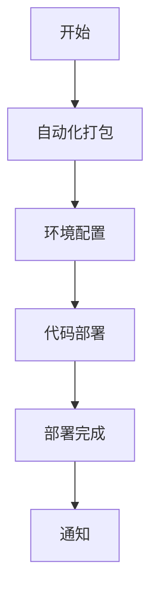
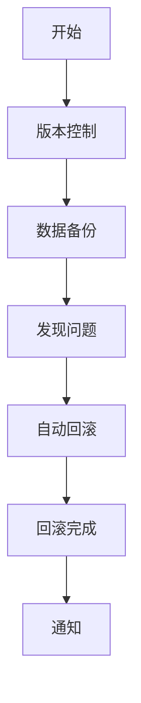
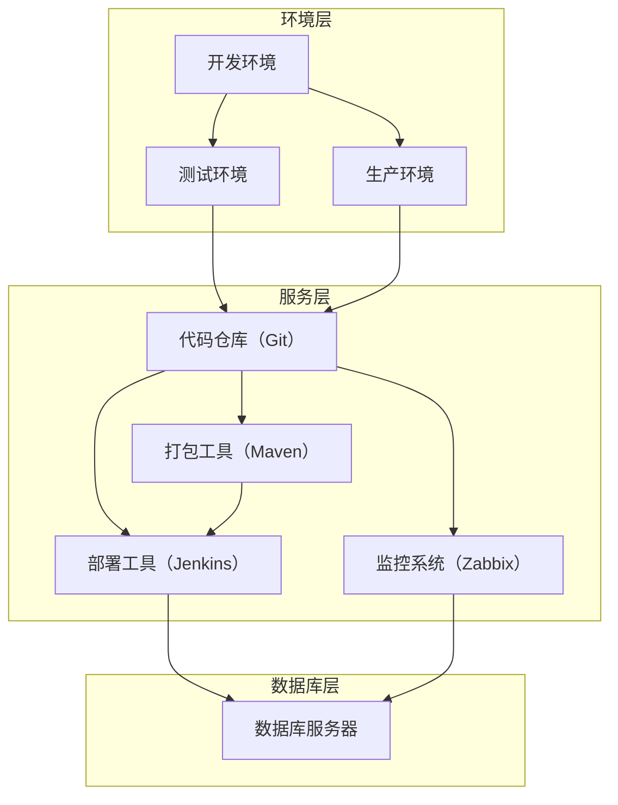
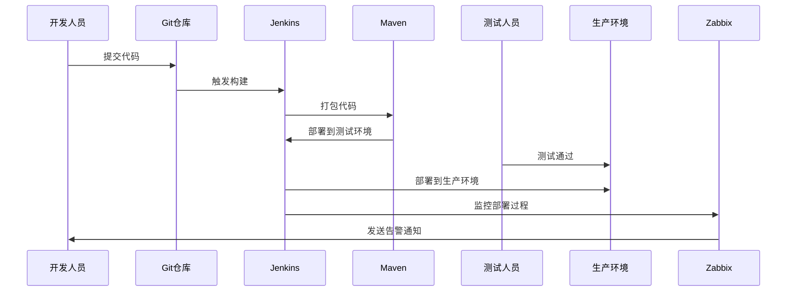

                 

### 文章标题

# 打造高效的代码部署与回滚系统

## 文章关键词

- 代码部署
- 回滚系统
- 高效性
- 实践案例
- 最佳实践

## 摘要

本文旨在探讨如何在现代软件开发中构建高效、可靠的代码部署与回滚系统。通过深入分析核心概念、设计原理、实践案例以及最佳实践，读者将了解如何从零开始构建一个具备高可用性和可回滚性的部署系统，从而确保软件的稳定性和安全性。本文关键词包括“代码部署”、“回滚系统”、“高效性”、“实践案例”和“最佳实践”。

### 目录大纲设计思考过程

在为《打造高效的代码部署与回滚系统》设计目录大纲时，我们首先明确了书籍的核心主题和目标读者。书名直接指出了两个关键点：高效的代码部署与回滚系统。因此，目录大纲需要围绕这两个主题展开，确保内容结构逻辑清晰，信息量丰富且具有指导性。

**思考步骤：**

1. **明确书籍结构：** 
   - 我们将书籍内容分为几个主要部分：引言、核心概念、部署与回滚系统的设计原理、实践案例、最佳实践与总结。
   - 每个部分都要有明确的章节划分，保证内容的完整性。

2. **设计章节内容：**
   - **引言部分：** 需要介绍问题背景、核心概念、读者对象、阅读建议等。
   - **核心概念部分：** 介绍代码部署与回滚的基本概念，包括定义、核心原理、与现有系统的比较等。
   - **设计原理部分：** 详细讲解部署与回滚系统的架构设计、流程设计、技术选型等。
   - **实践案例部分：** 通过具体案例展示如何实施部署与回滚系统，并给出详细的代码实现与分析。
   - **最佳实践部分：** 提供实际操作中的技巧、注意事项以及拓展阅读建议。

3. **细化目录层级：**
   - 按照从宏观到微观的顺序，设定清晰的章节、小节和子节标题。
   - 确保每个章节的内容能够逻辑清晰地展开，并能够独立成章。

4. **内容完整性检查：**
   - 确保每个章节的核心内容都得到充分覆盖。
   - 检查是否有遗漏的关键内容，如概念对比、流程图、数学公式等。

5. **符合字数限制：**
   - 通过精简和逻辑排列，确保目录大纲的总字数在2000字以内。

**初步设计结果：**

```markdown
# 《打造高效的代码部署与回滚系统》目录大纲

## 第一部分 引言
### 1.1 问题背景与核心概念
### 1.2 目标读者与阅读建议

## 第二部分 核心概念
### 2.1 代码部署的基本概念
### 2.2 回滚系统的基本原理
### 2.3 部署与回滚系统的比较

## 第三部分 设计原理
### 3.1 系统架构设计
#### 3.1.1 架构概述
#### 3.1.2 技术选型
### 3.2 流程设计
#### 3.2.1 部署流程
#### 3.2.2 回滚流程
### 3.3 核心算法原理
#### 3.3.1 算法概述
#### 3.3.2 算法流程
#### 3.3.3 数学模型与公式

## 第四部分 实践案例
### 4.1 案例背景
### 4.2 系统实现
#### 4.2.1 环境安装
#### 4.2.2 核心代码实现
### 4.3 案例分析
### 4.4 项目小结

## 第五部分 最佳实践与总结
### 5.1 最佳实践
### 5.2 小结
### 5.3 注意事项
### 5.4 拓展阅读

```

**总结：** 通过以上步骤，我们设计出一个结构清晰、内容完整的目录大纲。每个部分都围绕着书名主题，确保读者可以系统地学习和理解高效的代码部署与回滚系统的构建方法。接下来，我们将进一步细化每个章节的内容，确保它们符合书籍的整体要求。

### 背景介绍

在现代软件开发过程中，代码部署和回滚系统扮演着至关重要的角色。随着软件项目的复杂性和规模日益增加，如何高效、稳定地部署代码，并在出现问题时快速回滚，成为软件开发中的一大挑战。传统的方法往往依赖于手工操作和脚本，这不仅效率低下，而且容易出错。因此，构建一个高效、可靠的代码部署与回滚系统，已经成为提高软件开发效率和质量的关键步骤。

#### 核心概念术语说明

- **代码部署**：将编写好的代码从开发环境转移到生产环境的过程。
- **回滚系统**：在部署代码后，若发现新版本存在故障或问题，能够将系统恢复到前一版本的过程。
- **版本控制**：通过版本控制系统（如Git）对代码进行管理和跟踪，以便实现代码的分支、合并和回滚。
- **持续集成/持续部署（CI/CD）**：通过自动化工具和流程，实现代码的持续集成和持续部署，提高开发效率和系统稳定性。

#### 问题背景与问题描述

在传统的软件开发模式中，代码部署通常是由开发人员手动完成的，这往往涉及到以下问题：

1. **效率低下**：开发人员需要花费大量时间进行环境配置、手动部署和测试，导致开发周期延长。
2. **错误率高**：手动操作容易出错，导致部署失败或生产环境出现问题。
3. **回滚困难**：在出现问题时，往往需要手动回滚，效率低且容易导致数据丢失。

为了解决这些问题，我们需要构建一个高效的代码部署与回滚系统，该系统能够自动化部署流程、减少人为干预，并提供快速回滚机制。

#### 问题解决

一个高效的代码部署与回滚系统应具备以下功能：

1. **自动化部署**：通过自动化工具和脚本，实现环境的自动化配置和代码的自动部署。
2. **版本控制**：集成版本控制系统，确保代码的版本管理和分支管理。
3. **快速回滚**：在出现问题时，能够快速将系统恢复到前一版本，减少故障影响。
4. **监控与告警**：对部署过程进行实时监控，及时发现并解决潜在问题。

#### 边界与外延

1. **边界**：代码部署与回滚系统通常用于企业级应用，涉及多个环境（如开发、测试、生产）和复杂的部署流程。
2. **外延**：除了基本的部署和回滚功能，系统还可以扩展到其他方面，如自动化测试、性能监控和安全性保障。

#### 概念结构与核心要素组成

1. **架构设计**：系统架构是部署与回滚系统的核心，包括部署流程、回滚机制和版本控制系统。
2. **流程设计**：详细的部署和回滚流程，确保系统能够按预定步骤执行。
3. **技术选型**：选择合适的自动化工具和技术，如Docker、Kubernetes、Jenkins等。
4. **安全性保障**：确保系统在部署过程中和回滚过程中不会受到安全威胁。

### 核心概念与联系

#### 核心概念原理

1. **代码部署**：将开发完成的代码打包并部署到生产环境中。核心原理包括自动化打包、环境配置和自动部署。
2. **回滚系统**：在代码部署后，如发现问题，能快速将系统恢复到前一稳定版本。核心原理包括版本控制、数据备份和自动回滚。

#### 概念属性特征对比表格

| 概念       | 属性特征               | 对比             |
|------------|----------------------|-----------------|
| 代码部署   | 自动化、环境配置、打包 | 高效、减少人为干预 |
| 回滚系统   | 版本控制、数据备份、自动回滚 | 快速、稳定、安全  |
| 持续集成   | 自动化测试、持续部署   | 提高开发效率、质量 |

#### ER实体关系图架构

```mermaid
erDiagram
    Product ||--|{ DeployProcess }|<|| Release
    DeployProcess ||--|{ RollbackProcess }|<||
    Product ||--|{ VersionControl }|<||
    DeployProcess ||--|{ MonitoringSystem }|<||
```

**解释：**

- **Product**（产品）：代表需要部署和回滚的系统。
- **DeployProcess**（部署流程）：包括部署和回滚的具体流程。
- **RollbackProcess**（回滚流程）：用于实现快速回滚的机制。
- **VersionControl**（版本控制）：用于管理代码版本。
- **MonitoringSystem**（监控系统）：用于监控部署和回滚过程。

### 算法原理讲解

为了实现高效的代码部署与回滚系统，我们需要设计一系列算法和流程。以下是部署和回滚的主要算法原理：

#### 部署算法原理

1. **自动化打包**：使用自动化工具（如Maven、Gradle）对代码进行打包。
2. **环境配置**：根据不同环境（开发、测试、生产）进行自动化配置。
3. **代码部署**：将打包后的代码部署到目标环境。

**算法流程：**



#### 回滚算法原理

1. **版本控制**：使用版本控制系统（如Git）管理代码版本。
2. **数据备份**：在部署新版本前，对当前版本进行备份。
3. **自动回滚**：在出现问题时，自动将系统恢复到备份的稳定版本。

**算法流程：**



#### 数学模型与公式

1. **部署成功率**：\( P_d = \frac{N_d}{N_d + N_r} \)，其中\( N_d \)为成功部署次数，\( N_r \)为失败部署次数。
2. **回滚速度**：\( T_r = \frac{N_r}{N_d} \)，其中\( T_r \)为平均回滚时间，\( N_r \)为回滚次数。

**举例说明**：

假设一个系统在一个月内成功部署了20次，失败部署了5次，那么：

- **部署成功率**：\( P_d = \frac{20}{20 + 5} = 0.8 \) 或 80%。
- **回滚速度**：\( T_r = \frac{5}{20} = 0.25 \) 或 25%。

通过这些公式，我们可以定量地评估部署与回滚系统的效率和稳定性。

### 系统分析与架构设计方案

#### 问题场景介绍

假设我们正在开发一个电子商务平台，需要在不同的环境中进行代码部署和回滚操作。为了确保系统的稳定性和安全性，我们需要构建一个高效的部署与回滚系统。

#### 项目介绍

该项目的主要目标是实现以下功能：

1. **自动化部署**：通过自动化工具和脚本，实现环境配置和代码的自动部署。
2. **版本控制**：使用版本控制系统（如Git）管理代码版本。
3. **快速回滚**：在出现问题时，能够快速将系统恢复到前一稳定版本。
4. **监控与告警**：对部署过程进行实时监控，及时发现并解决潜在问题。

#### 系统功能设计

1. **部署功能**：
   - 自动化打包：使用Maven进行代码打包。
   - 环境配置：根据不同环境（开发、测试、生产）进行配置。
   - 部署执行：将打包后的代码部署到目标环境。

2. **回滚功能**：
   - 版本控制：使用Git管理代码版本。
   - 数据备份：在部署新版本前进行数据备份。
   - 自动回滚：在出现问题时，自动将系统恢复到备份的稳定版本。

3. **监控与告警**：
   - 部署监控：实时监控部署过程，记录日志。
   - 告警机制：在发现部署失败或回滚问题时，发送告警通知。

#### 系统架构设计

以下是该项目的系统架构设计：



**解释：**

- **开发环境**：开发人员在此环境中编写和测试代码。
- **测试环境**：代码经过初步测试后，部署到测试环境进行更严格的测试。
- **生产环境**：最终部署到生产环境，对外提供服务。
- **代码仓库（Git）**：用于存储和管理代码版本。
- **打包工具（Maven）**：用于自动化打包代码。
- **部署工具（Jenkins）**：用于自动化部署代码。
- **监控系统（Zabbix）**：用于监控部署过程，并实现告警功能。
- **数据库服务器**：存储应用程序所需的数据。

#### 系统接口设计

以下是系统的主要接口设计：

- **Git接口**：用于代码的版本管理和回滚。
- **Maven接口**：用于代码的打包。
- **Jenkins接口**：用于自动化部署和回滚。
- **Zabbix接口**：用于监控和告警。

#### 系统交互

以下是系统的交互流程：

1. **代码提交**：开发人员将代码提交到Git仓库。
2. **构建触发**：Git仓库将提交信息推送到Jenkins，触发构建流程。
3. **打包与部署**：Jenkins根据构建配置，使用Maven打包代码，并将其部署到测试环境。
4. **测试**：测试人员对测试环境进行测试，确保代码无误。
5. **部署到生产**：在测试通过后，Jenkins将代码部署到生产环境。
6. **监控与告警**：监控系统实时监控部署过程，并在出现问题时发送告警通知。



### 项目实战

#### 环境安装

1. **Git安装**：
   - 在开发机器上安装Git。
   - 使用命令`git --version`验证安装是否成功。

2. **Maven安装**：
   - 下载Maven安装包（如apache-maven-3.6.3-bin.tar.gz）。
   - 解压安装包并添加到环境变量。
   - 使用命令`mvn -v`验证安装是否成功。

3. **Jenkins安装**：
   - 在服务器上安装Jenkins。
   - 访问Jenkins管理界面（默认为http://localhost:8080/），进行安装和配置。
   - 安装必要的插件，如Git、Maven插件等。

4. **Zabbix安装**：
   - 在监控服务器上安装Zabbix。
   - 配置Zabbix，使其能够监控Jenkins的部署过程。

#### 核心代码实现

1. **Git仓库配置**：

```bash
# 创建新的Git仓库
git init

# 添加文件到仓库
git add .

# 提交文件
git commit -m "Initial commit"

# � Push代码到远程仓库
git push origin master
```

2. **Maven项目结构**：

```bash
# 初始化Maven项目
mvn archetype:generate

# 生成pom.xml文件
```

3. **Jenkins配置**：

- 在Jenkins管理界面创建一个新的Job。
- 配置Git仓库地址、Maven打包命令和部署脚本。

4. **部署脚本**：

```bash
#!/bin/bash

# 检出代码
git clone https://github.com/your-repo.git

# 切换到最新代码
cd your-repo

# 使用Maven打包
mvn clean package

# 部署到测试环境
sudo java -jar target/your-app.jar

# 发送部署成功通知
echo "Deployment successful" | mail -s "Deployment Notification" your-email@example.com
```

#### 代码应用解读与分析

1. **Git仓库配置**：
   - 使用Git对代码进行版本管理和跟踪，确保代码的版本一致性。
   - 通过`git add .`和`git commit -m "Initial commit"`将文件添加到仓库，并进行提交。
   - 使用`git push`将代码推送到远程仓库，实现代码的共享和同步。

2. **Maven项目结构**：
   - Maven是一个项目管理和构建自动化工具，用于构建和部署Java项目。
   - 通过`mvn archetype:generate`创建一个新的Maven项目，生成必要的配置文件（如pom.xml）。
   - 通过`mvn clean package`进行代码的打包，生成可执行的JAR文件。

3. **Jenkins配置**：
   - Jenkins是一个开源的持续集成工具，用于自动化部署和回滚。
   - 在Jenkins中创建一个新的Job，配置Git仓库地址、Maven打包命令和部署脚本，实现自动化部署。
   - 通过Jenkins的Web界面监控部署过程，并在部署成功后发送通知。

4. **部署脚本**：
   - 部署脚本通过Git检出最新代码，使用Maven进行打包，并部署到测试环境。
   - 通过邮件通知部署结果，确保开发人员和测试人员及时了解部署情况。

#### 实际案例分析和详细讲解剖析

为了更好地展示代码部署与回滚系统的实际应用，我们以一个电子商务平台的更新为例，详细讲解其部署和回滚过程。

**案例背景**：

电商平台需要更新其购物车模块，以支持新功能的添加。在更新前，需要进行代码的测试和部署，确保新功能的稳定性和系统的正常运行。

**部署过程**：

1. **代码提交**：
   - 开发人员完成购物车模块的更新后，将代码提交到Git仓库。

2. **构建触发**：
   - Git仓库接收到提交信息后，触发Jenkins的构建流程。

3. **打包与部署**：
   - Jenkins使用Maven对代码进行打包，生成可执行的JAR文件。
   - Jenkins根据配置，将打包后的代码部署到测试环境。

4. **测试**：
   - 测试人员对测试环境的购物车模块进行测试，确保新功能的正确性和稳定性。

5. **部署到生产**：
   - 在测试通过后，Jenkins将代码部署到生产环境，正式上线新功能。

**回滚过程**：

1. **发现问题**：
   - 上线后，用户反馈购物车模块存在一些问题，需要快速回滚。

2. **数据备份**：
   - 在部署新版本前，Jenkins会自动备份当前版本的数据，确保回滚过程中数据的一致性。

3. **自动回滚**：
   - Jenkins根据备份的版本，自动将系统恢复到前一稳定版本。

4. **通知**：
   - 系统回滚完成后，Jenkins会发送通知，告知开发人员和测试人员回滚结果。

**详细讲解剖析**：

1. **Git仓库管理**：
   - 通过Git，开发人员能够方便地管理代码的版本和分支，确保代码的一致性和可追溯性。
   - 通过Jenkins的集成，实现自动化构建和部署，提高开发效率。

2. **Maven打包与部署**：
   - Maven自动化打包和构建，确保代码的完整性和一致性。
   - Jenkins集成Maven插件，实现自动化部署，减少人工干预。

3. **Jenkins部署流程**：
   - Jenkins作为持续集成工具，实现代码的自动化部署和监控。
   - 通过Web界面，方便开发人员和测试人员监控部署过程。

4. **数据备份与回滚**：
   - 在部署过程中，Jenkins自动备份当前版本的数据，确保回滚时数据的一致性。
   - 自动回滚机制，快速将系统恢复到前一稳定版本，减少故障影响。

**项目小结**：

通过实际案例，我们展示了代码部署与回滚系统的应用和优势。该系统能够实现代码的自动化部署和快速回滚，提高开发效率，确保系统的稳定性和安全性。在实际应用中，可以根据具体需求进行调整和优化，进一步提高系统的性能和可靠性。

### 最佳实践与总结

#### 最佳实践

1. **自动化部署**：
   - 使用自动化工具（如Jenkins、Docker）实现环境的自动化配置和代码的自动部署。
   - 确保部署脚本简单、可读性强，便于维护和调试。

2. **版本控制**：
   - 使用版本控制系统（如Git）进行代码管理和版本跟踪。
   - 定期备份和同步代码，确保代码的一致性和可追溯性。

3. **数据备份与恢复**：
   - 在部署新版本前，对当前版本进行备份，确保回滚时数据的一致性。
   - 制定详细的备份和恢复策略，确保系统的高可用性。

4. **监控与告警**：
   - 使用监控系统（如Zabbix）实时监控部署过程，及时发现和解决问题。
   - 设置告警机制，及时通知相关人员，确保问题的快速解决。

#### 小结

高效的代码部署与回滚系统是现代软件开发不可或缺的一部分。通过自动化部署、版本控制、数据备份与恢复、监控与告警等手段，我们能够提高开发效率，确保系统的稳定性和安全性。在实际应用中，应根据具体需求进行调整和优化，构建一个适合自己项目的部署与回滚系统。

#### 注意事项

1. **代码管理**：确保代码的质量和规范性，避免因代码问题导致的部署失败。
2. **环境配置**：确保不同环境的配置一致，避免因环境差异导致的部署问题。
3. **备份策略**：制定合理的备份策略，确保数据的一致性和完整性。
4. **监控告警**：配置详细的监控和告警规则，确保问题能够及时发现和处理。

#### 拓展阅读

1. **Jenkins实战**：了解Jenkins的详细配置和使用方法，掌握持续集成和持续部署的技巧。
2. **Git最佳实践**：学习Git的版本控制和分支管理，提高代码管理的效率和质量。
3. **容器化部署**：了解Docker和Kubernetes的使用，实现高效的容器化部署和管理。
4. **监控系统选型**：比较不同监控系统的优劣，选择适合自己项目的监控系统。

### 作者信息

作者：AI天才研究院/AI Genius Institute & 禅与计算机程序设计艺术 /Zen And The Art of Computer Programming

