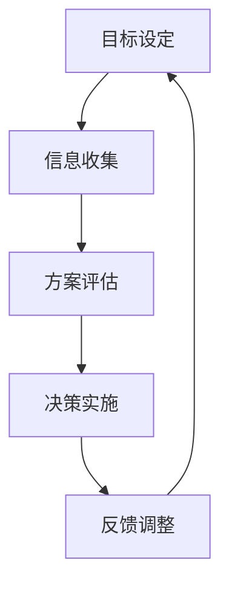

                 

## 打造高效的技术决策机制

### 关键词：技术决策、高效、机制、数据分析、团队协作

#### 摘要：
技术决策是企业实现创新发展的重要环节。构建一个高效的技术决策机制，能够帮助企业更好地应对复杂多变的技术环境，确保决策的科学性和准确性。本文将深入探讨技术决策机制的重要性、挑战、关键要素以及构建和优化的策略，结合实际案例，提供最佳实践指南，以帮助企业打造一个高效的技术决策体系。

### 目录大纲

----------------------------------------------------------------
## 第一部分：了解技术决策机制

## 第1章：技术决策机制概述

## 1.1 技术决策机制的重要性

## 1.2 技术决策的挑战

## 1.3 技术决策的关键要素

## 1.4 技术决策机制的分类

## 1.5 本章小结

----------------------------------------------------------------

## 第二部分：构建高效的技术决策机制

## 第2章：明确技术决策目标

## 2.1 确定技术决策的目标和需求

## 2.2 制定技术决策的战略

## 2.3 分析技术风险和不确定性

## 2.4 技术决策的目标评估和优化

## 2.5 本章小结

----------------------------------------------------------------

## 第3章：招聘与培养技术决策人才

## 3.1 技术决策人才的招聘策略

## 3.2 技术决策人才的培养策略

## 3.3 技术决策团队的构建和协作

## 3.4 技术决策人才的能力评估和激励

## 3.5 本章小结

----------------------------------------------------------------

## 第4章：设计科学的技术决策流程

## 4.1 技术决策流程的设计原则

## 4.2 技术决策流程的步骤和方法

## 4.3 技术决策流程的优化策略

## 4.4 技术决策流程的实践案例

## 4.5 本章小结

----------------------------------------------------------------

## 第5章：利用数据与工具支持技术决策

## 5.1 数据在技术决策中的应用

## 5.2 技术决策工具的选型和运用

## 5.3 数据驱动的技术决策

## 5.4 案例分析：数据与工具在技术决策中的成功应用

## 5.5 本章小结

----------------------------------------------------------------

## 第6章：管理与优化技术决策

## 6.1 技术决策的管理机制

## 6.2 技术决策的反馈与调整

## 6.3 技术决策的持续优化策略

## 6.4 案例分析：技术决策的实践与管理

## 6.5 本章小结

----------------------------------------------------------------

## 第7章：高效技术决策机制的最佳实践

## 7.1 最佳实践案例分析

## 7.2 实践中的教训与总结

## 7.3 持续改进与创新

## 7.4 本章小结

----------------------------------------------------------------

## 附录

## 附录A：技术决策相关术语表

## 附录B：技术决策流程图示例

## 附录C：技术决策工具推荐列表

## 附录D：进一步阅读资源

----------------------------------------------------------------

### 第一部分：了解技术决策机制

#### 第1章：技术决策机制概述

#### 1.1 技术决策机制的重要性

技术决策机制是企业在面对技术变革和创新时的一种系统性、规范化的决策模式。它的重要性体现在以下几个方面：

1. **提升决策效率**：通过建立明确的决策流程和规则，技术决策机制可以减少信息传递过程中的失真，提高决策的速度和效率。

2. **确保决策质量**：科学的技术决策机制可以帮助企业全面评估技术风险、成本和收益，从而确保决策的科学性和准确性。

3. **促进技术创新**：技术决策机制能够鼓励和支持技术创新，推动企业持续发展。

4. **提升竞争力**：通过高效的技术决策，企业可以更快地响应市场变化，抢占市场先机，提升竞争力。

#### 1.2 技术决策的挑战

技术决策过程中面临的主要挑战包括：

1. **复杂性**：技术的快速发展使得技术决策面临更多的不确定性和复杂性。

2. **不确定性**：技术发展的不可预测性增加了技术决策的风险。

3. **多样性**：技术的多样性使得企业在选择合适的技术方案时面临更多的选择。

4. **外部环境变化**：技术环境的变化、市场竞争的加剧、政策法规的变化等因素都可能影响技术决策。

#### 1.3 技术决策的关键要素

技术决策的关键要素包括：

1. **目标明确**：明确的技术决策目标可以帮助企业更好地制定决策策略。

2. **数据支持**：充分的数据支持是技术决策的基础，数据可以帮助企业更准确地评估技术方案的风险和收益。

3. **团队协作**：技术决策需要跨部门、跨领域的协作，建立高效的技术决策团队是关键。

4. **决策流程**：科学的技术决策流程可以帮助企业规范决策过程，提高决策效率。

#### 1.4 技术决策机制的分类

技术决策机制可以根据不同的标准进行分类：

1. **按决策层次分类**：战略级、战术级和操作级。

2. **按决策方式分类**：数据驱动决策、经验决策和混合决策。

3. **按决策环境分类**：确定性决策、不确定性决策和风险决策。

#### 1.5 本章小结

本章对技术决策机制的重要性、挑战、关键要素和分类进行了概述，为后续章节的深入探讨奠定了基础。在接下来的章节中，我们将详细分析如何构建和优化高效的技术决策机制。

----------------------------------------------------------------

## 第二部分：构建高效的技术决策机制

### 第2章：明确技术决策目标

#### 2.1 确定技术决策的目标和需求

明确的技术决策目标对于构建高效的技术决策机制至关重要。技术决策的目标通常包括：

1. **提升产品或服务质量**：通过引入新技术来提升产品或服务的性能、功能或用户体验。

2. **降低成本**：通过技术优化来降低生产和运营成本。

3. **提高效率**：通过自动化和智能化技术提升生产效率和管理效率。

4. **增强竞争力**：通过技术创新来增强企业的市场竞争力和地位。

在确定技术决策的目标和需求时，需要考虑以下几个方面：

1. **企业战略**：技术决策需要与企业的整体战略目标相一致。

2. **市场需求**：技术决策应该满足市场需求，解决客户问题。

3. **技术发展趋势**：技术决策应该紧跟技术发展趋势，确保技术的先进性和适用性。

4. **资源限制**：技术决策需要在预算、人力资源和基础设施等方面进行合理规划。

#### 2.2 制定技术决策的战略

技术决策战略是指企业在进行技术决策时采取的总体方针和策略。制定技术决策战略需要考虑以下几个关键因素：

1. **技术路线**：确定企业技术发展的路线图，包括短期和长期目标。

2. **技术优先级**：根据企业战略和市场需求，确定技术的优先级。

3. **研发投入**：合理规划研发预算，确保技术决策的可行性。

4. **合作伙伴**：建立与外部技术合作伙伴的关系，共享资源，共同发展。

制定技术决策战略的方法包括：

1. **SWOT分析**：分析企业的优势、劣势、机会和威胁，制定相应的技术决策战略。

2. **市场研究**：通过市场调研，了解市场需求和技术趋势，制定针对性的技术决策战略。

3. **专家咨询**：咨询行业专家和技术顾问，获取专业意见和建议。

#### 2.3 分析技术风险和不确定性

技术决策过程中不可避免地面临风险和不确定性。分析技术风险和不确定性是确保技术决策有效性的重要环节。分析技术风险和不确定性需要考虑以下几个方面：

1. **技术可行性**：评估技术方案的实施可行性，包括技术成熟度、研发难度和成本等。

2. **市场适应性**：评估技术方案在市场中的适应性和竞争力。

3. **法律合规性**：确保技术方案符合相关法律法规要求。

4. **环境影响**：评估技术方案对环境的影响，确保可持续发展。

分析技术风险和不确定性可以使用以下方法：

1. **风险评估矩阵**：根据风险的可能性和影响程度，对风险进行定量和定性分析。

2. **情景分析**：通过构建不同的情景，分析技术方案在不同情景下的表现。

3. **专家评审**：邀请技术专家进行评审，获取专业的意见和建议。

#### 2.4 技术决策的目标评估和优化

技术决策目标评估和优化是确保技术决策效果的关键环节。技术决策目标评估和优化的步骤包括：

1. **设定评估指标**：根据技术决策目标，设定相应的评估指标，如成本效益比、技术成熟度、市场适应性等。

2. **数据收集和分析**：收集相关数据，进行分析和评估，判断技术决策目标的实现程度。

3. **调整和优化**：根据评估结果，对技术决策目标进行调整和优化，确保技术决策的有效性。

技术决策目标评估和优化的方法包括：

1. **关键绩效指标（KPI）**：设定关键绩效指标，监控技术决策目标的实现情况。

2. **平衡计分卡**：从财务、客户、内部流程和学习与成长四个维度，全面评估技术决策效果。

3. **持续改进**：通过定期评估和反馈，持续优化技术决策目标。

#### 2.5 本章小结

本章详细介绍了如何明确技术决策的目标和需求，制定技术决策的战略，分析技术风险和不确定性，以及评估和优化技术决策目标。通过构建和优化技术决策机制，企业可以更好地应对复杂多变的技术环境，确保技术决策的科学性和有效性。

----------------------------------------------------------------

## 第3章：招聘与培养技术决策人才

#### 3.1 技术决策人才的招聘策略

技术决策人才是企业构建高效技术决策机制的核心。招聘合适的技术决策人才需要考虑以下几个方面：

1. **专业知识**：技术决策人才应具备扎实的技术背景和专业知识，能够深入理解技术方案的优势和劣势。

2. **战略思维**：技术决策人才应具备战略思维，能够从企业整体战略角度出发，制定和执行技术决策。

3. **沟通能力**：技术决策人才应具备良好的沟通能力，能够与不同部门和层级的员工进行有效沟通，确保技术决策的顺利实施。

4. **团队协作**：技术决策人才应具备团队协作精神，能够与团队成员共同解决问题，实现技术决策的目标。

招聘策略包括：

1. **内部培养**：从内部选拔有潜力的人才，进行系统的培训和发展，提升其技术决策能力。

2. **外部引进**：从外部招聘具有丰富经验和专业知识的人才，为企业的技术决策注入新的活力。

3. **专业招聘渠道**：利用专业的招聘网站、招聘会和猎头公司等渠道，寻找合适的技术决策人才。

#### 3.2 技术决策人才的培养策略

技术决策人才的培养是确保其能够持续发挥重要作用的关键。培养策略包括：

1. **专业培训**：定期组织技术培训，更新技术决策人才的专业知识，提升其技术能力。

2. **实践机会**：提供丰富的实践机会，让技术决策人才在实际项目中锻炼和提升能力。

3. **导师制度**：建立导师制度，为技术决策人才配备经验丰富的导师，指导其成长和发展。

4. **绩效激励**：通过绩效激励，鼓励技术决策人才不断提升自己的能力，实现个人与企业的共同发展。

#### 3.3 技术决策团队的构建和协作

技术决策团队是实施技术决策的关键。构建高效的技术决策团队需要考虑以下几个方面：

1. **多元化背景**：团队成员应具备多元化背景，包括技术、业务、市场等方面的专业知识，以便全面评估技术决策的各个方面。

2. **明确职责**：为团队成员明确职责，确保每个成员都能在其专业领域发挥最大的作用。

3. **团队协作**：鼓励团队成员之间的协作，建立良好的沟通机制，确保技术决策的顺利实施。

4. **定期沟通**：定期召开团队会议，讨论技术决策的进展情况和遇到的问题，确保团队协作的顺畅。

#### 3.4 技术决策人才的能力评估和激励

技术决策人才的能力评估和激励是确保其持续发挥重要作用的重要手段。能力评估和激励包括：

1. **能力评估**：通过定期的能力评估，了解技术决策人才的能力水平和成长情况，为后续的培养和发展提供依据。

2. **激励措施**：制定合理的激励措施，包括奖金、晋升、培训等，激发技术决策人才的积极性和创造力。

3. **长期激励**：建立长期激励制度，如股票期权、绩效奖金等，鼓励技术决策人才长期为企业发展贡献力量。

#### 3.5 本章小结

本章详细介绍了招聘与培养技术决策人才、构建技术决策团队以及评估和激励技术决策人才的方法和策略。通过科学的人才管理和培养，企业可以打造一支高效的技术决策团队，为企业的技术创新和发展提供强有力的支持。

----------------------------------------------------------------

## 第4章：设计科学的技术决策流程

#### 4.1 技术决策流程的设计原则

科学的技术决策流程是确保技术决策有效性和效率的关键。设计技术决策流程应遵循以下原则：

1. **系统性**：技术决策流程应具备系统性，包括从目标设定、方案评估、决策实施到反馈调整的完整环节。

2. **规范性**：技术决策流程应具备规范性，确保每个环节都有明确的操作规范和标准，减少信息传递过程中的失真。

3. **灵活性**：技术决策流程应具备一定的灵活性，能够根据实际情况进行调整，适应不断变化的技术环境和市场需求。

4. **数据驱动**：技术决策流程应以数据为基础，通过数据分析和评估，确保决策的科学性和准确性。

5. **协同性**：技术决策流程应注重跨部门、跨领域的协同，确保不同部门和技术领域的专业知识和资源能够充分整合。

#### 4.2 技术决策流程的步骤和方法

技术决策流程通常包括以下步骤：

1. **目标设定**：明确技术决策的目标和需求，确保技术决策与企业的战略目标和市场需求相一致。

2. **信息收集**：收集与技术决策相关的信息，包括市场趋势、技术发展、竞争对手情况等，为后续的方案评估提供数据支持。

3. **方案评估**：根据收集到的信息，制定多个技术方案，并对其进行评估，包括技术可行性、成本效益、风险等因素。

4. **决策实施**：选择最优技术方案，制定详细的实施计划，包括时间表、预算、资源分配等，确保技术决策能够顺利实施。

5. **反馈调整**：在技术决策实施过程中，及时收集反馈信息，对决策进行调整和优化，确保技术决策能够达到预期目标。

具体的方法包括：

1. **SWOT分析**：通过SWOT分析，评估技术方案的优劣势、机会和威胁，为决策提供依据。

2. **成本效益分析**：通过成本效益分析，评估技术方案的成本和收益，选择性价比最高的方案。

3. **风险评估**：通过风险评估，识别技术决策可能面临的风险，制定相应的风险应对策略。

4. **专家评审**：邀请行业专家进行评审，提供专业的意见和建议，提高技术决策的科学性和准确性。

#### 4.3 技术决策流程的优化策略

技术决策流程的优化是确保其持续有效性的关键。优化策略包括：

1. **流程简化**：通过简化流程，减少冗余环节，提高决策效率。

2. **信息化支持**：利用信息技术，建立技术决策管理平台，实现数据的高效收集、分析和共享，提高决策的科学性和准确性。

3. **流程标准化**：制定统一的流程规范和标准，确保不同项目和技术决策的一致性和规范性。

4. **持续改进**：通过定期评估和反馈，持续优化技术决策流程，提高决策的质量和效率。

具体方法包括：

1. **流程再造**：通过流程再造，优化流程设计，消除瓶颈和浪费，提高流程效率。

2. **流程监控**：建立流程监控机制，实时跟踪决策流程的进展情况，及时发现和解决问题。

3. **流程反馈**：建立流程反馈机制，收集决策过程中的意见和建议，持续优化流程。

#### 4.4 技术决策流程的实践案例

以下是一个技术决策流程的实践案例：

**案例背景**：某企业计划引入新的生产技术，提高生产效率和产品质量。

**目标设定**：明确技术决策的目标是提高生产效率和产品质量，降低生产成本。

**信息收集**：收集国内外相关技术资料，了解市场趋势和技术发展情况。

**方案评估**：制定多个技术方案，包括自动化生产线、智能控制系统等，进行成本效益分析。

**决策实施**：选择自动化生产线方案，制定详细的实施计划，包括时间表、预算、资源分配等。

**反馈调整**：在实施过程中，定期收集反馈信息，对方案进行调整和优化，确保达到预期目标。

**结果**：通过科学的技术决策流程，企业成功引入了自动化生产线，实现了生产效率和质量的大幅提升。

#### 4.5 本章小结

本章详细介绍了设计科学的技术决策流程的原则、步骤和方法，以及优化策略和实践案例。通过构建和优化技术决策流程，企业可以确保技术决策的科学性和有效性，为企业的技术创新和发展提供有力支持。

----------------------------------------------------------------

## 第5章：利用数据与工具支持技术决策

#### 5.1 数据在技术决策中的应用

数据是技术决策的重要基础，通过有效的数据收集、分析和利用，可以帮助企业做出更明智的决策。数据在技术决策中的应用主要包括以下几个方面：

1. **市场趋势分析**：通过分析市场数据，了解技术需求和市场趋势，为技术决策提供方向。

2. **技术评估**：通过收集和分析技术数据，评估不同技术方案的性能、成本和风险，为决策提供依据。

3. **成本效益分析**：利用数据对技术方案的成本和效益进行量化分析，选择最具性价比的方案。

4. **风险评估**：通过数据分析和预测，识别技术决策可能面临的风险，制定相应的风险应对策略。

#### 5.2 技术决策工具的选型和运用

为了有效地支持技术决策，企业需要选用合适的工具。以下是一些常用的技术决策工具及其选型考虑：

1. **数据分析工具**：如Excel、Power BI等，用于数据收集、处理和分析。

2. **风险分析工具**：如Qualys、RiskLens等，用于识别和评估技术风险。

3. **项目管理工具**：如Jira、Trello等，用于管理技术决策项目，跟踪进度和资源。

4. **决策支持系统**：如IBM Watson、Tableau等，提供智能化的数据分析和决策支持。

选型考虑包括：

1. **功能需求**：根据技术决策的具体需求，选择具备相应功能的工具。

2. **用户界面**：工具应具备直观易用的用户界面，降低使用难度。

3. **兼容性和扩展性**：工具应具有良好的兼容性和扩展性，能够适应企业的未来发展需求。

4. **成本效益**：综合考虑工具的成本和效益，选择性价比最高的工具。

#### 5.3 数据驱动的技术决策

数据驱动的技术决策是指通过数据分析和挖掘，指导技术决策的制定和执行。数据驱动的技术决策具有以下优势：

1. **客观性**：基于数据的事实和分析，减少主观判断的影响，提高决策的客观性。

2. **准确性**：通过数据分析和预测，提高决策的准确性和可靠性。

3. **实时性**：实时数据支持，使决策更加及时和灵活。

4. **优化性**：通过持续的数据分析和反馈，不断优化决策，提高企业的竞争力。

数据驱动的技术决策步骤包括：

1. **数据收集**：收集与决策相关的数据，包括市场数据、技术数据、成本数据等。

2. **数据清洗**：清洗和整理数据，确保数据的质量和准确性。

3. **数据分析**：运用数据分析工具，对数据进行处理和分析，提取有价值的信息。

4. **决策制定**：基于数据分析结果，制定技术决策方案。

5. **决策执行**：执行技术决策方案，并进行监控和调整。

#### 5.4 案例分析：数据与工具在技术决策中的成功应用

以下是一个成功应用数据与工具进行技术决策的案例：

**案例背景**：某科技企业计划开发一款新型智能设备，提高市场竞争力。

**数据收集**：通过市场调研和数据分析，收集了关于消费者需求、竞争对手产品和市场趋势的数据。

**数据清洗**：清洗和整理收集到的数据，确保数据的质量和准确性。

**数据分析**：利用数据分析工具，分析了消费者需求、竞争对手产品和市场趋势，确定了设备的功能和特性。

**决策制定**：基于数据分析结果，制定了新型智能设备的开发方案，包括功能设计、技术路线和成本预算。

**决策执行**：执行开发方案，进行产品设计和生产。

**反馈调整**：通过市场反馈和数据分析，不断优化产品性能和用户体验，提高市场竞争力。

**结果**：通过数据驱动的技术决策，该企业成功开发了市场竞争力强的智能设备，取得了良好的市场反响和商业成功。

#### 5.5 本章小结

本章介绍了数据在技术决策中的应用、技术决策工具的选型和运用，以及数据驱动的技术决策方法。通过结合实际案例，展示了数据与工具在技术决策中的成功应用。企业应充分利用数据和技术工具，构建数据驱动的技术决策机制，提高决策的科学性和准确性，推动企业的持续发展。

----------------------------------------------------------------

## 第6章：管理与优化技术决策

#### 6.1 技术决策的管理机制

技术决策的管理机制是确保技术决策科学性、规范性和有效性的关键。建立完善的技术决策管理机制需要考虑以下几个方面：

1. **组织结构**：明确技术决策的组织结构，包括决策委员会、项目团队和相关部门的职责和权限。

2. **决策流程**：建立规范的技术决策流程，包括目标设定、信息收集、方案评估、决策实施和反馈调整等环节。

3. **规章制度**：制定相应的规章制度，明确技术决策的标准和程序，确保决策过程的规范性和透明度。

4. **权限分配**：明确技术决策的权限分配，确保各级决策者能够在其权限范围内做出科学合理的决策。

#### 6.2 技术决策的反馈与调整

技术决策的反馈与调整是确保技术决策有效性的重要环节。技术决策的反馈与调整包括以下几个方面：

1. **信息反馈**：在技术决策实施过程中，及时收集来自市场、客户、内部员工等方面的反馈信息。

2. **问题识别**：根据反馈信息，识别技术决策过程中存在的问题，包括技术实施难度、成本超支、市场需求变化等。

3. **调整策略**：针对识别出的问题，制定相应的调整策略，包括技术方案的优化、资源重新分配、市场策略调整等。

4. **持续改进**：通过持续的反馈和调整，不断优化技术决策，提高决策的科学性和有效性。

#### 6.3 技术决策的持续优化策略

技术决策的持续优化是确保技术决策长期有效性的关键。持续优化策略包括以下几个方面：

1. **定期评估**：定期对技术决策的效果进行评估，包括成本效益、市场竞争力、客户满意度等指标。

2. **反馈机制**：建立有效的反馈机制，及时收集和分析决策过程中的问题和改进建议。

3. **创新驱动**：鼓励技术创新和思维，通过引入新技术、新方法，持续优化技术决策。

4. **培训与学习**：定期组织培训和学习活动，提升决策团队的决策能力和技术水平。

#### 6.4 案例分析：技术决策的实践与管理

以下是一个技术决策实践与管理的案例：

**案例背景**：某大型企业计划引入智能化生产系统，提升生产效率和质量。

**决策管理机制**：

1. **组织结构**：成立由技术总监、生产经理和市场部门组成的决策委员会，负责技术决策的制定和实施。

2. **决策流程**：建立从目标设定、方案评估、决策实施到反馈调整的完整决策流程。

3. **规章制度**：制定《技术决策管理办法》，明确技术决策的标准和程序。

4. **权限分配**：明确各级决策者的职责和权限，确保决策的科学性和规范性。

**反馈与调整**：

1. **信息反馈**：在智能化生产系统实施过程中，定期收集来自生产一线、客户和市场部门的反馈信息。

2. **问题识别**：根据反馈信息，识别出生产效率低、设备故障率高、客户满意度下降等问题。

3. **调整策略**：针对问题，制定优化生产流程、提升设备性能、改进客户服务等一系列调整策略。

4. **持续改进**：通过持续的反馈和调整，不断优化智能化生产系统，提高生产效率和质量。

**结果**：通过科学的技术决策管理，该企业成功引入了智能化生产系统，生产效率提高了30%，产品质量提升了20%，客户满意度显著提升，取得了显著的经济效益。

#### 6.5 本章小结

本章介绍了技术决策的管理机制、反馈与调整策略以及持续优化策略。通过实际案例，展示了技术决策实践与管理的方法和效果。企业应建立完善的技术决策管理机制，通过反馈与调整和持续优化，确保技术决策的科学性、规范性和有效性，推动企业的持续发展。

----------------------------------------------------------------

## 第7章：高效技术决策机制的最佳实践

### 7.1 最佳实践案例分析

为了更好地理解如何构建高效的技术决策机制，我们可以通过几个实际案例来学习。

#### 案例一：阿里巴巴的技术决策机制

**背景**：阿里巴巴作为中国最大的电子商务公司，面对快速变化的市场和技术环境，如何进行高效的技术决策是一个关键问题。

**解决方案**：
1. **数据驱动**：阿里巴巴通过构建强大的数据平台，实现了全公司的数据驱动决策。例如，淘宝的推荐系统利用用户行为数据，实现个性化推荐，提高了用户满意度和转化率。

2. **跨部门协作**：阿里巴巴通过建立跨部门的技术决策委员会，确保不同部门的专家能够共同参与决策，减少了信息不对称和决策失误。

3. **快速迭代**：阿里巴巴采用敏捷开发的方法，通过快速迭代和反馈，不断优化技术解决方案，提高了决策的及时性和灵活性。

**效果**：这些措施使阿里巴巴能够快速响应市场变化，持续提升技术和服务质量，保持了在电子商务领域的领先地位。

#### 案例二：谷歌的技术决策机制

**背景**：谷歌作为全球领先的技术公司，其技术决策机制对于技术创新和业务扩展起到了至关重要的作用。

**解决方案**：
1. **创新实验室**：谷歌通过建立多个创新实验室，鼓励内部员工提出创新想法，并通过内部竞争机制筛选出最具潜力的项目。

2. **外部合作**：谷歌积极与学术界和初创公司合作，通过合作共赢的模式，快速获取新技术和新理念。

3. **透明的决策流程**：谷歌建立了透明的技术决策流程，确保所有员工都能够了解决策过程，提高了决策的透明度和员工的参与度。

**效果**：通过这些措施，谷歌能够持续推动技术创新，保持了其在搜索、人工智能等多个领域的领先地位。

### 7.2 实践中的教训与总结

通过上述案例分析，我们可以总结出一些在构建高效技术决策机制时的重要教训：

1. **数据是基础**：数据驱动是现代技术决策的核心，没有数据支持的决策往往是盲目的。

2. **跨部门协作**：技术决策不仅仅是一个技术问题，还涉及到业务、市场等多个方面，因此跨部门的协作至关重要。

3. **快速迭代**：快速迭代和反馈能够帮助企业及时调整决策，减少风险。

4. **创新激励**：建立创新激励机制，鼓励员工和外部合作伙伴共同参与技术创新，是推动技术决策有效性的重要手段。

5. **透明和参与**：建立透明的决策流程，让员工参与决策，能够提高决策的接受度和执行力。

### 7.3 持续改进与创新

技术决策机制不是一成不变的，随着外部环境和内部条件的变化，需要持续改进和创新。以下是一些持续改进和创新的方法：

1. **定期评估**：定期对技术决策机制进行评估，识别问题和不足，制定改进计划。

2. **收集反馈**：通过多种渠道收集员工的反馈，了解决策过程中的痛点和改进方向。

3. **培训和发展**：定期组织培训和发展活动，提升决策团队的技能和知识水平。

4. **引入新技术**：积极引入新的技术和方法，如人工智能、大数据分析等，提升决策的科学性和准确性。

5. **外部合作**：与外部合作伙伴建立合作关系，共同探讨和解决技术决策中的难题。

### 7.4 本章小结

通过案例分析和教训总结，我们了解了高效技术决策机制的重要性以及如何构建和优化。持续改进和创新是技术决策机制不断发展的重要动力。企业应结合自身实际情况，不断优化技术决策机制，以适应快速变化的市场和技术环境，保持竞争优势。

----------------------------------------------------------------

### 附录

#### 附录A：技术决策相关术语表

1. **技术决策**：指企业或组织在技术方面进行的选择和实施过程，涉及技术方案的选择、评估和执行。
2. **数据驱动决策**：基于数据分析和挖掘，指导决策过程，提高决策的科学性和准确性。
3. **风险评估**：识别和分析技术决策过程中的风险，制定相应的风险应对策略。
4. **跨部门协作**：不同部门之间的合作和沟通，共同参与技术决策过程，提高决策的全面性和效率。
5. **敏捷开发**：通过快速迭代和反馈，缩短产品开发周期，提高产品的质量。

#### 附录B：技术决策流程图示例

#### 附录C：技术决策工具推荐列表

1. **数据分析工具**：Excel、Power BI、Tableau
2. **项目管理工具**：Jira、Trello、Asana
3. **风险评估工具**：Qualys、RiskLens、Nessus
4. **决策支持系统**：IBM Watson、Oracle BI、SAS

#### 附录D：进一步阅读资源

1. 《决策分析：理论与实务》- 张伟伟
2. 《大数据决策》- 周志华
3. 《企业技术创新管理》- 郭克莎
4. 《敏捷开发实践指南》- Jeff Sutherland

----------------------------------------------------------------

### 文章末尾作者信息

**作者：AI天才研究院/AI Genius Institute & 禅与计算机程序设计艺术 /Zen And The Art of Computer Programming**

