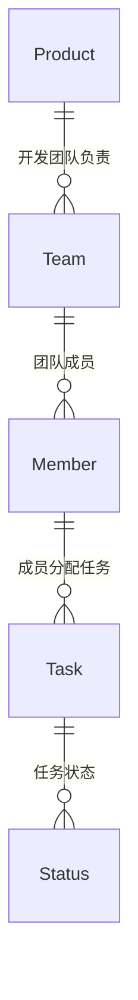
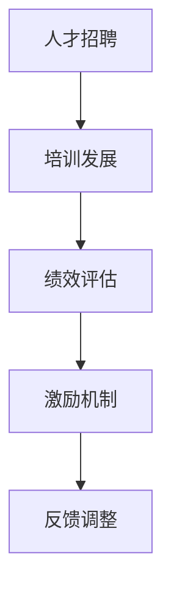
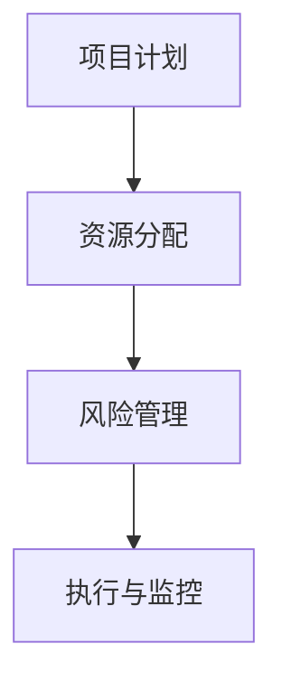
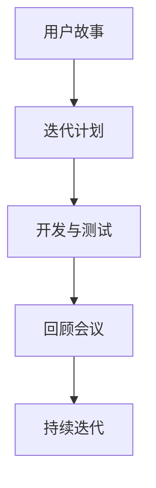
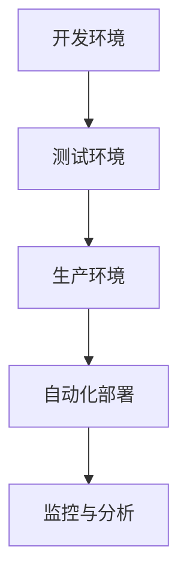

                 

# 打造高效研发团队的10个关键策略

## 关键词

- 敏捷开发
- DevOps
- 团队管理
- 人才激励
- 持续改进

## 摘要

本文旨在探讨如何打造高效研发团队，通过10个关键策略来提升研发效能。从明确团队目标和规划、构建高效的团队协作机制，到优化人才结构、建立有效的绩效评估体系，再到激励与激励文化、加强团队沟通与协作，每一个策略都将为团队的成功奠定基础。通过这些策略的实施，企业可以大幅提升研发效率，加快产品迭代，最终在竞争激烈的市场中立于不败之地。

## 第一部分：背景与理论基础

### 第1章：高效研发团队的重要性

#### 1.1 研发团队在企业发展中的作用

**问题背景**：在当今快速变化的市场环境中，技术创新成为企业发展的关键驱动因素。然而，许多企业在研发过程中面临着一系列挑战，如研发效率低下、产品迭代缓慢、人才流失等。

**问题描述**：这些问题不仅影响了企业的市场竞争力，还可能导致研发项目失败，最终影响企业的长期发展。

**问题解决**：建立高效研发团队是企业应对上述挑战的有效途径。一个高效研发团队能够快速响应市场需求，提高产品迭代速度，降低开发成本，并吸引和留住优秀人才。

#### 1.2 高效研发团队的核心理念

**核心概念**：

- **敏捷开发**：敏捷开发强调灵活性和迭代速度，通过快速交付可用的软件产品来满足客户需求。
- **DevOps**：DevOps通过自动化和紧密协作，实现持续交付和部署，提高软件交付的效率和质量。
- **持续集成/持续部署（CI/CD）**：持续集成和持续部署通过自动化测试和部署流程，确保软件的高可靠性和快速迭代。

**概念属性特征对比表格**：

| 理念               | 特点                       | 适用场景                      |
|--------------------|----------------------------|-------------------------------|
| 敏捷开发           | 灵活、迭代快速、客户参与    | 产品需求变化频繁的情况        |
| DevOps             | 自动化、协作紧密、持续交付  | IT基础设施变化快速的情况      |
| 持续集成/持续部署  | 自动化测试、快速反馈、高可靠 | 稳定性和安全性要求高的项目    |

#### 1.3 高效研发团队面临的挑战与机遇

**挑战**：技术变革、市场变化、团队管理困难等。

**机遇**：技术进步、市场扩张、团队协作优化等。

### 第2章：核心概念与联系

#### 2.1 研发管理与项目管理

**概念原理**：研发管理方法论（如Scrum、Kanban）通过明确的任务分配、灵活的迭代过程和持续反馈，提高团队的研发效率。

**ER实体关系图架构**：



#### 2.2 人才管理与激励机制

**核心概念**：人才发展、绩效评估、激励机制。

**Mermaid流程图**：



## 第二部分：关键策略实施

### 第3章：策略一：建立明确的团队目标和规划

#### 3.1 制定清晰的团队目标

**目标设定原则**：SMART原则（具体、可测量、可实现、相关性、时限性）。

**目标设定案例分析**：

```markdown
- **目标设定**：实现产品A的1.0版本，包括10个主要功能，目标发布日期为2023年6月30日。
- **目标分解**：为每个功能分配具体任务和负责人，制定详细的时间表和里程碑。
- **进度监控**：每周召开进度会议，检查任务完成情况，及时调整计划。
```

#### 3.2 制定详细的团队规划

**规划内容**：项目计划、资源分配、风险管理。

**团队规划流程图**：



### 第4章：策略二：构建高效的团队协作机制

#### 4.1 敏捷开发实践

**敏捷开发原则**：用户故事、迭代计划、回顾会议。

**敏捷开发流程图**：



#### 4.2 DevOps实践

**DevOps核心**：自动化、持续交付、监控。

**DevOps架构图**：



### 第5章：策略三：优化人才结构

#### 5.1 人才招聘策略

**招聘渠道选择**：内部推荐、外部招聘、专业猎头。

**招聘流程优化**：

```markdown
- **需求分析**：明确岗位需求和技能要求。
- **面试流程**：多轮面试，包括技术面试、行为面试和情景面试。
- **背景调查**：对候选人进行背景调查，确保其能力和诚信。
```

#### 5.2 人才培养与发展

**培训计划**：技术培训、领导力培养。

**职业发展规划**：

```markdown
- **初级阶段**：提供基础技术培训和职业发展指导。
- **中级阶段**：鼓励参加技术研讨会、培训课程，提升专业技能。
- **高级阶段**：培养技术专家和团队领导者，进行领导力培训和项目经验积累。
```

### 第6章：策略四：建立有效的绩效评估体系

#### 6.1 绩效评估指标

**关键绩效指标（KPI）**：工作量、项目质量、团队合作。

**绩效评估工具与方法**：

```markdown
- **绩效评估工具**：KPI设定工具、360度评估工具。
- **评估方法**：定量评估（如工作量统计）和定性评估（如项目质量评估、团队反馈）。
```

#### 6.2 绩效反馈与改进

**反馈机制**：定期反馈、即时反馈。

**改进措施**：

```markdown
- **绩效反馈**：通过会议、报告和一对一沟通进行绩效反馈。
- **绩效改进计划**：根据反馈结果，制定改进计划，并跟踪执行情况。
- **团队建设活动**：通过团队活动提高团队凝聚力和协作效率。
```

### 第7章：策略五：激励与激励文化

#### 7.1 激励理论

**激励理论**：期望理论、公平理论、双因素理论。

**激励方式**：物质激励、精神激励。

#### 7.2 建立激励文化

**文化塑造**：公平、透明、认可与尊重。

**激励机制案例分析**：

```markdown
- **案例一**：通过绩效奖金和晋升机会激励员工。
- **案例二**：通过定期组织团队建设活动，增强团队凝聚力和归属感。
- **案例三**：通过公开表彰和奖励优秀员工，提升员工自豪感和荣誉感。
```

### 第8章：策略六：加强团队沟通与协作

#### 8.1 沟通技巧

**有效沟通**：倾听、反馈、表达清晰。

**沟通障碍与解决方法**：

```markdown
- **障碍一**：信息不对称，解决方法：建立透明的沟通渠道。
- **障碍二**：沟通不畅，解决方法：定期召开沟通会议，确保信息传递无误。
- **障碍三**：文化差异，解决方法：加强跨文化培训，提升团队协作能力。
```

#### 8.2 协作工具与平台

**常用协作工具**：JIRA、Trello、Slack。

**协作平台案例分析**：

```markdown
- **案例一**：使用JIRA进行任务追踪和管理，提高团队协作效率。
- **案例二**：使用Trello进行项目规划和进度跟踪，确保项目按时交付。
- **案例三**：使用Slack进行实时沟通和文件共享，提升团队响应速度。
```

### 第9章：策略七：持续改进与创新

#### 9.1 持续改进实践

**改进流程**：问题识别、原因分析、措施实施、效果评估。

**改进案例分享**：

```markdown
- **案例一**：通过定期的代码审查和测试，发现并修复了多个潜在问题。
- **案例二**：通过流程优化，减少了项目开发周期，提高了产品质量。
```

#### 9.2 创新方法

**创新思维**：头脑风暴、六顶思考帽、设计思维。

**创新案例研究**：

```markdown
- **案例一**：通过头脑风暴，团队提出了一种新的产品设计方案，最终成功推出。
- **案例二**：通过设计思维，团队解决了用户反馈的一个痛点，提升了用户体验。
```

### 第10章：策略八：项目管理与风险管理

#### 10.1 项目管理

**项目管理方法**：敏捷项目管理、经典项目管理。

**项目计划与执行**：

```markdown
- **计划内容**：项目范围、时间表、预算、资源分配。
- **执行监控**：项目进度跟踪、风险管理、变更控制。
```

#### 10.2 风险管理

**风险识别**：技术风险、市场风险、团队风险。

**风险应对策略**：

```markdown
- **技术风险**：通过技术评估和测试，降低技术实现风险。
- **市场风险**：通过市场调研和竞争分析，了解市场趋势和潜在风险。
- **团队风险**：通过团队培训和激励机制，提高团队应对风险的能力。
```

### 第11章：策略九：搭建学习型组织

**学习型组织的建立**：

```markdown
- **文化氛围**：鼓励学习和知识分享，建立开放的学习环境。
- **培训计划**：定期组织内部培训和外部学习交流活动。
- **知识管理**：建立知识库，记录团队经验教训，供团队成员学习和参考。
```

### 第12章：策略十：关注团队健康与福利

**团队健康与福利**：

```markdown
- **健康检查**：定期组织健康检查，关注团队成员的身体健康。
- **福利政策**：提供竞争力的薪资待遇、福利制度和职业发展机会。
- **员工关怀**：关注员工的心理健康，提供心理咨询和团队建设活动。
```

## 总结

通过以上10个关键策略的实施，企业可以打造出一支高效、协作紧密的研发团队，提高研发效率，缩短产品上市时间，提升市场竞争力。同时，这些策略也有助于提升团队成员的满意度和忠诚度，为企业可持续发展奠定坚实基础。

### 作者信息

- 作者：AI天才研究院/AI Genius Institute & 禅与计算机程序设计艺术 /Zen And The Art of Computer Programming

