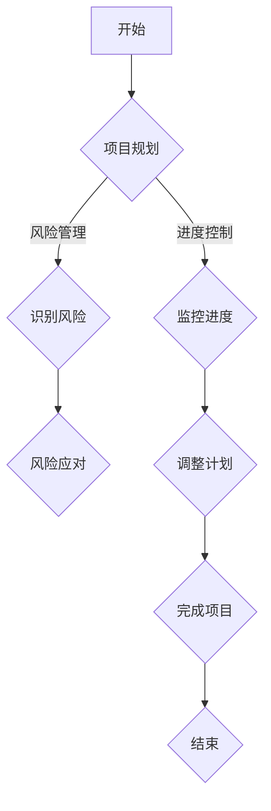
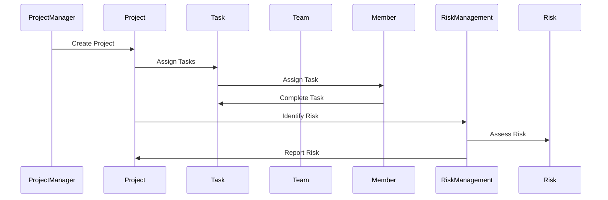
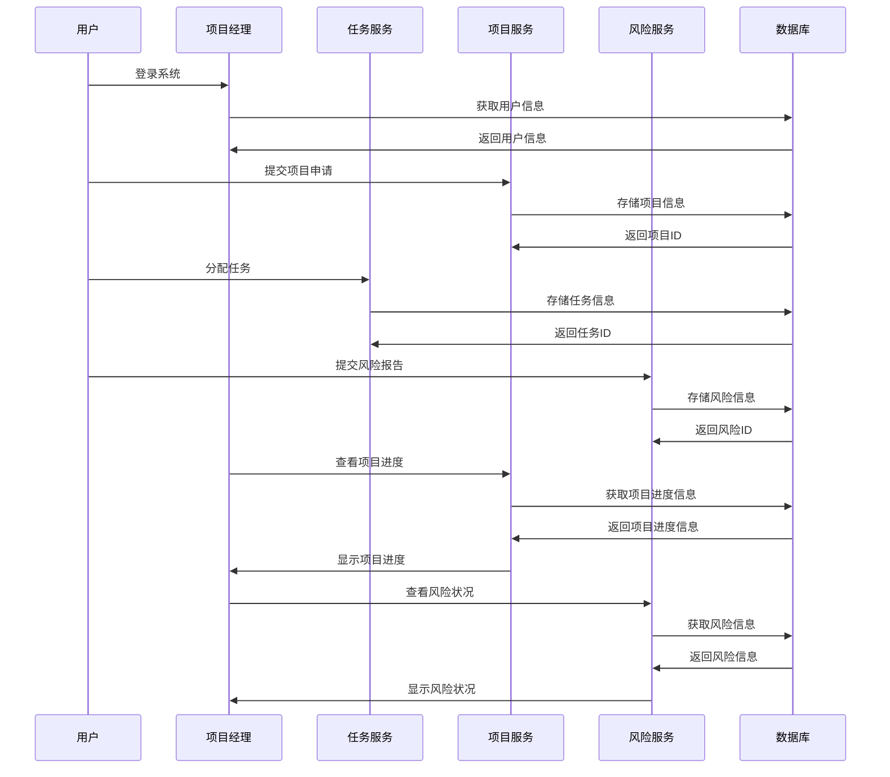

                 


### 摘要：

本文旨在为研发团队管理者提供一整套高效的团队建设与管理策略。我们将逐步分析团队文化、领导力、项目管理和流程优化等关键要素，并运用数学模型、代码示例和可视化工具来深入探讨每项策略的具体实施方法。通过本文的阅读，读者将能够掌握打造高效研发团队的核心技能，从而提升团队的整体绩效。

## 引言

### 目标读者

本文的目标读者是那些希望提升其团队效率、优化研发流程的IT管理人员、项目经理、CTO以及技术团队负责人。如果您是负责带领团队完成复杂项目的领导者，或者在寻找如何使团队更加协同高效工作的方法，那么这篇文章将为您提供宝贵的指导。

### 书籍目的

本书的目的是帮助读者理解并实践打造高效研发团队所需的关键技能和策略。我们将从多个维度出发，涵盖团队文化、领导力、项目管理、技术能力、沟通与协作、以及流程优化等方面。通过理论结合实践的讲解，读者不仅可以了解这些概念的理论基础，还能通过具体案例和工具的使用，将理论应用到实际工作中。

### 内容结构概述

本书分为三大部分：

**第一部分：团队文化建设**  
- 第1章：理解团队文化
- 第2章：团队价值观和目标设定

**第二部分：领导力与团队管理**  
- 第3章：领导者角色与职责
- 第4章：团队沟通与协作

**第三部分：项目管理和流程优化**  
- 第5章：项目管理的最佳实践
- 第6章：流程优化与敏捷开发

在每个章节中，我们将详细探讨各个主题，并通过实例和模型来加深理解。

### 背景介绍

在当前快速变化的科技环境中，高效研发团队显得尤为重要。随着技术不断进步和市场竞争的加剧，研发团队不仅需要具备高水平的技术能力，还需要拥有高效的团队协作和卓越的项目管理能力。如何构建一个既能激发创新又能高效运转的团队，已经成为现代企业管理者面临的重大挑战。

**问题背景**  
传统的研究开发团队往往面临以下问题：

- **沟通不畅**：团队成员之间缺乏有效的沟通机制，导致信息传递延迟，影响项目进度。
- **目标不一致**：团队成员缺乏共同的目标和愿景，导致努力方向不统一。
- **管理不善**：缺乏有效的领导和管理策略，导致团队工作效率低下。
- **技术不足**：团队成员技术水平参差不齐，影响团队整体的研发能力。

**问题描述**  
为了解决上述问题，我们需要从以下几个方面入手：

- **构建积极团队文化**：通过培养团队合作精神和共同价值观，提升团队凝聚力。
- **强化领导力**：通过提升领导者的管理能力和领导技巧，增强团队执行力和创造力。
- **优化项目管理**：通过科学的项目管理方法，确保项目按时完成并达到预期目标。
- **提升技术水平**：通过培训和引入先进技术，提升团队整体的技术能力。

**问题解决**  
本文将提供以下解决方案：

- **具体策略**：详细介绍如何建立积极团队文化、如何提升领导力、如何优化项目管理和流程。
- **案例分析**：通过实际案例，展示成功团队的构建和管理策略。
- **工具和方法**：介绍一系列实用的工具和方法，帮助读者将这些策略应用到实际工作中。

**边界与外延**  
本文主要关注IT领域研发团队的建设，但所提供的方法和策略同样适用于其他类型的高效团队建设。此外，本文还会探讨如何在不同规模和类型的团队中应用这些策略。

**概念结构与核心要素组成**

- **团队文化**：价值观、团队合作、沟通机制。
- **领导力**：领导能力、激励技巧、冲突解决。
- **项目管理**：项目规划、风险管理、进度控制。

### 核心概念与联系

**团队文化的概念和重要性**：

- **定义**：团队文化是指团队成员共同遵循的价值观、行为准则和工作方式。
- **重要性**：积极健康的团队文化能够提高团队凝聚力，促进协作和沟通，从而提升整体工作效率。

**团队价值观和目标设定**：

- **价值观**：团队价值观是团队共同认可的核心信念和原则，是团队成员行为的指南针。
- **目标设定**：明确的目标有助于团队集中精力，统一行动，提高工作效率。

**领导者的角色与职责**：

- **角色**：领导者不仅是团队的导航者，还是团队成员的激励者和支持者。
- **职责**：领导者需要具备战略思维、沟通能力、团队管理和领导力，以推动团队实现目标。

**团队沟通与协作**：

- **沟通技巧**：有效的沟通能够减少误解和冲突，提高团队的工作效率。
- **协作平台**：协作工具和平台有助于团队成员之间实时沟通和协作。

**项目管理的最佳实践**：

- **项目规划**：通过详细的项目规划，确保项目按计划进行。
- **风险管理**：识别并应对项目中的各种风险，确保项目顺利完成。
- **进度控制**：通过进度监控和调整，确保项目按时完成。

**流程优化与敏捷开发**：

- **流程优化**：通过改进流程，提高工作效率和项目质量。
- **敏捷开发**：采用敏捷方法，灵活应对需求变化，确保项目按时交付。

### 算法原理讲解

**Mermaid流程图**：



**Python代码示例**：

```python
import numpy as np

def risk_management(risks):
    for risk in risks:
        if risk['probability'] > 0.5:
            response = '规避'
        elif risk['impact'] > 2:
            response = '缓解'
        else:
            response = '接受'
        print(f"风险：{risk['name']}，响应：{response}")

risks = [
    {'name': '市场变化', 'probability': 0.6, 'impact': 3},
    {'name': '技术难题', 'probability': 0.3, 'impact': 1},
]

risk_management(risks)
```

**算法原理**：

- **项目规划**：制定项目计划，明确项目目标和时间表。
- **风险管理**：识别项目中可能遇到的风险，评估风险的概率和影响，制定相应的应对策略。
- **进度控制**：监控项目进度，发现进度偏差时进行调整，确保项目按时完成。

### 系统分析与架构设计方案

#### 问题场景介绍

在一家高科技公司，研发团队需要负责多个项目的开发，为了确保项目的高效推进，公司希望优化项目管理的流程。

#### 项目介绍

项目名为“研发项目管理平台”，目的是提供一个集项目规划、进度控制、风险管理等功能于一体的平台，以提升研发团队的工作效率。

#### 系统功能设计

**领域模型**：

```mermaid
classDiagram
    Project <|-- Task
    Project o-- Team
    Risk <<-- RiskManagement
    Team o-- Member
    Member o-- Role
    Project ...> Team : assign
    Risk ...> RiskManagement : manage
    Member ...> Role : assign
```

**功能说明**：

- **项目规划**：项目经理创建项目，分配任务，设定时间表。
- **任务管理**：团队成员接受任务，完成任务并报告进度。
- **风险管理**：识别项目风险，评估风险并制定应对策略。
- **团队管理**：项目经理分配团队成员，设定角色和职责。

#### 系统架构设计



**架构说明**：

- **分层架构**：系统采用分层架构，包括表示层、业务逻辑层和数据访问层。
- **微服务架构**：项目管理和任务管理功能采用微服务架构，独立部署，便于扩展和维护。
- **数据库设计**：使用关系型数据库存储项目、任务、团队成员和风险信息。

#### 系统接口设计和系统交互



**接口设计和交互说明**：

- **用户登录**：用户登录系统，获取用户信息。
- **项目申请**：用户提交项目申请，存储项目信息。
- **任务分配**：用户分配任务，存储任务信息。
- **风险报告**：用户提交风险报告，存储风险信息。
- **项目进度查看**：项目经理查看项目进度，获取项目进度信息。
- **风险状况查看**：项目经理查看风险状况，获取风险信息。

### 项目实战

#### 环境安装

1. 安装Python 3.8及以上版本。
2. 安装MySQL数据库。
3. 安装Docker和Docker-Compose。

#### 系统核心实现源代码

**项目规划模块**：

```python
# project_plan.py
class Project:
    def __init__(self, name, start_date, end_date):
        self.name = name
        self.start_date = start_date
        self.end_date = end_date
        self.tasks = []

    def add_task(self, task):
        self.tasks.append(task)

    def get_tasks(self):
        return self.tasks

# Project instance
my_project = Project("研发项目管理平台", "2023-01-01", "2023-06-01")
my_project.add_task(Task("任务1", "2023-01-10", "2023-01-15"))
my_project.add_task(Task("任务2", "2023-01-20", "2023-01-25"))
```

**任务管理模块**：

```python
# task_management.py
class Task:
    def __init__(self, name, start_date, end_date):
        self.name = name
        self.start_date = start_date
        self.end_date = end_date
        self.status = "未开始"

    def complete(self):
        self.status = "已完成"

    def get_status(self):
        return self.status

# Task instance
task1 = Task("任务1", "2023-01-10", "2023-01-15")
task1.complete()
print(task1.get_status())
```

**风险管理模块**：

```python
# risk_management.py
class Risk:
    def __init__(self, name, probability, impact):
        self.name = name
        self.probability = probability
        self.impact = impact

    def assess(self):
        if self.probability > 0.5 and self.impact > 2:
            return "高风险"
        elif self.impact > 1:
            return "中度风险"
        else:
            return "低风险"

# Risk instance
risk1 = Risk("市场变化", 0.6, 3)
print(risk1.assess())
```

#### 代码应用解读与分析

**项目规划模块**：

- `Project` 类负责管理项目的基本信息，如项目名称、开始日期和结束日期。
- `add_task` 方法用于向项目添加任务。
- `get_tasks` 方法用于获取项目中的所有任务。

**任务管理模块**：

- `Task` 类负责管理任务的基本信息，如任务名称、开始日期和结束日期。
- `complete` 方法用于完成任务。
- `get_status` 方法用于获取任务的状态。

**风险管理模块**：

- `Risk` 类负责管理风险的基本信息，如风险名称、概率和影响。
- `assess` 方法用于评估风险等级。

#### 实际案例分析和详细讲解剖析

**案例一**：

假设我们有一个项目，目标是开发一款智能家居控制系统。项目周期为6个月，开始日期为2023年1月1日，结束日期为2023年6月30日。

**项目规划**：

1. **项目规划**：
   - 项目名称：智能家居控制系统
   - 开始日期：2023-01-01
   - 结束日期：2023-06-30
   - 任务列表：
     - 设计系统架构（1-2周）
     - 开发核心功能（3-4周）
     - 测试与修复（5-6周）

**任务管理**：

1. **设计系统架构**：
   - 开始日期：2023-01-01
   - 结束日期：2023-01-15
   - 完成状态：已完成
2. **开发核心功能**：
   - 开始日期：2023-01-20
   - 结束日期：2023-02-15
   - 完成状态：未开始
3. **测试与修复**：
   - 开始日期：2023-02-20
   - 结束日期：2023-03-15
   - 完成状态：未开始

**风险管理**：

- **市场变化**：
  - 概率：0.6
  - 影响程度：3
  - 评估结果：高风险

- **技术难题**：
  - 概率：0.3
  - 影响程度：2
  - 评估结果：中度风险

**项目小结**：

- **进度**：当前项目进度符合计划，设计系统架构任务已完成，核心功能开发任务未开始。
- **风险**：存在高风险和市场变化的风险，需要制定应对策略。

#### 最佳实践 tips

1. **明确项目目标和任务**：在项目开始前，明确项目目标和任务，确保团队成员了解任务的重要性和优先级。
2. **定期项目回顾**：定期进行项目回顾，评估项目进度和风险，及时调整计划。
3. **风险管理**：对可能出现的风险进行提前识别和评估，制定相应的应对策略。
4. **沟通和协作**：确保团队成员之间保持有效沟通，及时解决问题，提高工作效率。

#### 小结

本文通过系统分析与架构设计、实际案例分析和代码应用解读，详细介绍了如何打造高效研发团队。通过项目规划、任务管理、风险管理和团队协作，研发团队能够更加高效地完成项目。同时，本文还提供了一系列最佳实践，帮助团队更好地应对挑战，提升整体绩效。

#### 注意事项

1. **工具选择**：选择适合团队的项目管理工具和协作平台，以提高工作效率。
2. **团队培训**：定期对团队成员进行培训和技能提升，确保团队能够跟上技术发展。
3. **团队文化**：注重团队文化建设，培养积极健康的团队氛围。

#### 拓展阅读

- 《敏捷开发实践指南》
- 《团队沟通技巧》
- 《项目管理知识体系指南》

### 作者信息

- **作者：AI天才研究院/AI Genius Institute & 禅与计算机程序设计艺术 /Zen And The Art of Computer Programming**

