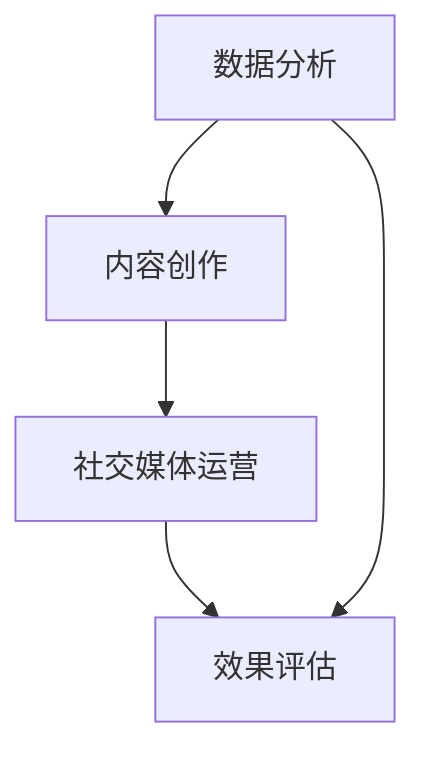
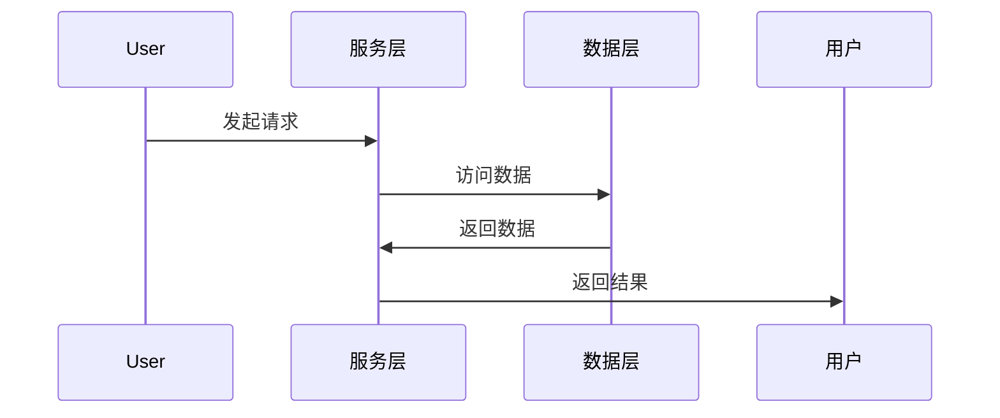
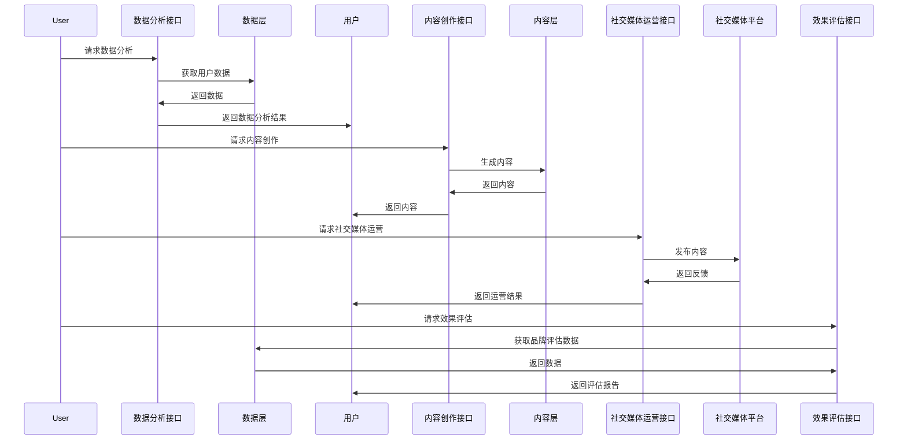

                 

### 技术leader的个人品牌建设

在当今技术迅猛发展的时代，技术leader的角色变得越来越重要。他们不仅需要具备深厚的专业知识和卓越的技术能力，还需要在行业内建立起强大的个人品牌。个人品牌不仅是职业发展的助推器，更是提升个人影响力、赢得更多机会的关键要素。本文将围绕技术leader的个人品牌建设，深入探讨其重要性、核心概念、构建策略和实践方法。

**关键词：** 技术leader、个人品牌、专业能力、职业发展、影响力。

**摘要：** 本文从技术leader面临的问题背景出发，详细阐述了个人品牌建设的重要性，分析了个人品牌的核心概念与联系，并介绍了个人品牌建设的算法原理和实践方法。通过本文的阅读，读者将能够了解如何通过有效的策略和方法，提升个人品牌，实现职业发展的突破。

**目录：**

1. **技术leader的个人品牌建设背景**
   - 1.1 问题背景
     - 1.1.1 技术行业发展趋势
     - 1.1.2 个人品牌的重要性
     - 1.1.3 建设个人品牌的目标
   - 1.2 问题解决
     - 1.2.1 核心概念
     - 1.2.2 边界与外延
     - 1.2.3 概念结构与核心要素组成
2. **技术leader个人品牌建设核心概念与联系**
   - 2.1 核心概念
     - 2.1.1 个人品牌
     - 2.1.2 个人品牌建设
   - 2.2 概念属性特征对比表格
   - 2.3 ER实体关系图架构
3. **技术leader个人品牌建设算法原理讲解**
   - 3.1 品牌建设算法概述
     - 3.1.1 个人品牌建设算法的目的
     - 3.1.2 个人品牌建设算法的核心原理
   - 3.2 算法流程图
   - 3.3 Python源代码实现
4. **系统分析与架构设计方案**
   - 4.1 问题场景介绍
   - 4.2 项目介绍
   - 4.3 系统功能设计
     - 4.3.1 领域模型类图
   - 4.4 系统架构设计
     - 4.4.1 系统架构图
   - 4.5 系统接口设计和系统交互
     - 4.5.1 系统接口设计
     - 4.5.2 系统交互序列图
5. **项目实战**
   - 5.1 环境安装
   - 5.2 系统核心实现源代码
   - 5.3 代码应用解读与分析
   - 5.4 实际案例分析和详细讲解剖析
   - 5.5 项目小结
6. **最佳实践 tips、小结、注意事项、拓展阅读**

### 1. 技术leader的个人品牌建设背景

#### 1.1 问题背景

##### 1.1.1 技术行业发展趋势

随着数字化转型的加速，技术行业正经历着前所未有的变革。新兴技术层出不穷，如人工智能、大数据、云计算等，技术公司之间的竞争愈发激烈。在这个背景下，个人能力的重要性愈发凸显。技术leader不仅需要具备扎实的专业技能，还需要具备前瞻性的视野和卓越的领导能力。

##### 1.1.2 个人品牌的重要性

个人品牌在技术行业中具有举足轻重的地位。一个强大的个人品牌可以带来以下好处：

- **职业发展**：良好的个人品牌有助于在职业生涯中获得更多的机会，包括晋升、跳槽等。
- **人脉拓展**：通过个人品牌建设，可以结识更多的行业同仁和潜在合作伙伴，拓展人脉网络。
- **知识传播**：个人品牌有助于传播个人的知识和经验，提高行业影响力。
- **品牌价值**：个人品牌可以转化为商业价值，为个人和企业带来更多收益。

##### 1.1.3 建设个人品牌的目标

技术leader建设个人品牌的目标主要包括以下几点：

- **提升知名度**：通过有效的品牌建设策略，提高个人在行业内的知名度。
- **建立专业形象**：通过专业的内容输出和活动参与，建立权威的专业形象。
- **拓展职业发展空间**：通过个人品牌的提升，为职业发展打开更广阔的空间。
- **增强个人影响力**：通过影响力的增强，进一步推动个人和团队的发展。

#### 1.2 问题解决

##### 1.2.1 核心概念

个人品牌是指个人在专业领域内的知名度、形象和价值。它是通过一系列策略和方法，如内容创作、社交媒体运营、演讲与培训等，逐步建立起来的。个人品牌的核心要素包括专业知识、沟通能力、个人形象和职业道德等。

##### 1.2.2 边界与外延

个人品牌建设的范围非常广泛，包括但不限于以下方面：

- **个人专业技能**：通过不断学习和实践，提升自己在专业领域的知识水平和技能。
- **职业素养**：培养良好的职业素养，如诚信、责任感、团队合作等。
- **社交网络**：通过线上线下活动，建立和维护广泛的人脉网络。
- **个人形象**：注重个人形象，包括穿着打扮、言行举止等。

个人品牌的影响因素包括以下几方面：

- **专业知识**：深厚的专业知识是个人品牌建设的基础。
- **沟通能力**：良好的沟通能力有助于个人品牌的传播和推广。
- **个人形象**：得体的个人形象有助于提升个人在他人心中的形象。
- **职业道德**：良好的职业道德是个人品牌的重要组成部分。

##### 1.2.3 概念结构与核心要素组成

个人品牌的概念结构可以分为以下几个层次：

1. **知名度**：个人在专业领域内的知名度，可以通过内容创作、社交媒体运营等方式提升。
2. **形象**：个人在他人心中的形象，包括专业水平、职业素养等。
3. **价值**：个人在专业领域内的价值，包括对行业的贡献、解决问题的能力等。

个人品牌的核心要素包括：

- **专业知识**：技术深度与广度、持续学习与成长。
- **沟通能力**：有效表达、倾听与反馈、跨部门沟通。
- **个人形象**：职业素养、穿着打扮、言行举止。
- **职业道德**：诚信、责任感、团队合作。

### 1.3 概念结构与核心要素组成

#### 1.3.1 概念结构

个人品牌的核心要素可以分为以下几个层次：

1. **知名度**：个人在专业领域内的知名度，是个人品牌建设的起点。
2. **形象**：个人在他人心中的形象，包括专业水平、职业素养等。
3. **价值**：个人在专业领域内的价值，包括对行业的贡献、解决问题的能力等。

#### 1.3.2 核心要素组成

个人品牌的核心要素具体包括以下几个方面：

1. **专业知识**：
   - **技术深度与广度**：拥有深入的技术知识和广泛的技术视野。
   - **持续学习与成长**：不断学习新知识，跟上技术发展趋势。

2. **沟通能力**：
   - **有效表达**：清晰、准确地表达自己的观点和想法。
   - **倾听与反馈**：积极倾听他人的意见，给予有效的反馈。
   - **跨部门沟通**：能够在不同部门之间进行有效的沟通和协作。

3. **个人形象**：
   - **职业素养**：具备良好的职业素养，如诚信、责任感、团队合作精神。
   - **穿着打扮**：得体的穿着打扮，给人留下良好的第一印象。
   - **言行举止**：言行举止得体，展现专业的形象。

4. **职业道德**：
   - **诚信**：诚实守信，遵守职业道德规范。
   - **责任感**：对工作负责，勇于承担职责。
   - **团队合作**：具备良好的团队合作精神，能够与其他人协同工作。

这些核心要素相互关联，共同构成了个人品牌的完整结构。专业知识是个人品牌建设的基础，良好的沟通能力有助于个人品牌的传播和推广，个人形象和职业道德则是个人品牌的重要组成部分。只有全面发展这些核心要素，技术leader才能在激烈的技术行业中脱颖而出，建立起强大的个人品牌。

### 2. 技术leader个人品牌建设核心概念与联系

#### 2.1 核心概念

个人品牌和技术leader的个人品牌建设是两个密切相关的概念。个人品牌是指个人在专业领域内的知名度、形象和价值，它是个人职业发展的核心资产。而技术leader的个人品牌建设则是技术leader为了在行业内建立强大的个人影响力，通过一系列策略和方法，提升个人品牌的认知度和影响力。

##### 2.1.1 个人品牌

个人品牌是个人在专业领域内的知名度、形象和价值。它是通过个人的专业知识、技能、经验、声誉等多方面因素综合形成的。个人品牌的特点包括：

- **独特性**：每个个人品牌都是独特的，反映了个人独特的专业能力和特质。
- **持久性**：良好的个人品牌一旦建立，能够在长期内保持稳定的影响力。
- **可识别性**：个人品牌具有明显的识别特征，使得个人在众多同行中脱颖而出。

##### 2.1.2 个人品牌建设

个人品牌建设是通过一系列策略和方法，提升个人品牌的认知度和影响力。其核心原理包括：

- **内容创作**：通过高质量的内容创作，展示个人的专业知识和见解。
- **社交媒体运营**：通过社交媒体平台，扩大个人品牌的传播范围。
- **演讲与培训**：通过公开演讲和培训，提升个人在行业内的知名度和影响力。

#### 2.2 概念属性特征对比表格

为了更好地理解个人品牌和技术leader的个人品牌建设的概念，我们可以通过以下对比表格来展示它们的属性特征：

| 概念       | 属性特征                                                                                      |
|------------|----------------------------------------------------------------------------------------------|
| 个人品牌   | 知名度、形象、价值、独特性、持久性、可识别性                                                      |
| 个人品牌建设 | 内容创作、社交媒体运营、演讲与培训、人脉拓展、持续学习与成长                                    |

从上表可以看出，个人品牌和技术leader的个人品牌建设在属性特征上存在一定的重叠，但技术leader的个人品牌建设更注重内容创作、社交媒体运营和演讲与培训等具体方法，以提升个人在行业内的知名度和影响力。

#### 2.3 ER实体关系图架构

为了更好地理解个人品牌和技术leader的个人品牌建设之间的关系，我们可以使用ER（Entity-Relationship）实体关系图来展示它们之间的联系。

```mermaid
erDiagram
  Brand <<|-- PersonalBrand : 个人品牌
  PersonalBrand ||--|{ TechLeaderBrand }| : 技术leader品牌
```

在上图中，`Brand` 是品牌的总称，`PersonalBrand` 是个人品牌的实体，它继承了 `Brand` 的属性，并扩展了特定的属性。`TechLeaderBrand` 是技术leader品牌的实体，它继承了 `PersonalBrand` 的属性，并扩展了技术leader特有的属性。

这种ER实体关系图展示了个人品牌和技术leader的个人品牌建设之间的层次关系。技术leader的个人品牌建设是个人品牌建设在技术领导角色上的具体实现，它通过特定的策略和方法，进一步提升个人在技术领域的知名度和影响力。

### 3. 技术leader个人品牌建设算法原理讲解

#### 3.1 品牌建设算法概述

个人品牌建设是一个系统工程，它需要综合运用多种策略和方法，以实现个人品牌认知度和影响力的提升。品牌建设算法是这一过程中的一种量化工具，它通过数据分析、内容营销和社交媒体运营等环节，系统地指导个人品牌建设。

##### 3.1.1 个人品牌建设算法的目的

个人品牌建设算法的主要目的是：

- **提升个人知名度**：通过数据分析，了解个人在行业内的曝光度和知名度，制定针对性的推广策略。
- **建立专业形象**：通过内容营销，展示个人的专业知识和见解，树立权威的专业形象。
- **拓展职业发展空间**：通过社交媒体运营，扩大个人影响力，获取更多职业发展机会。
- **增强个人影响力**：通过持续的品牌建设，提升个人在行业内的地位和声望，增强个人影响力。

##### 3.1.2 个人品牌建设算法的核心原理

个人品牌建设算法的核心原理包括以下三个方面：

- **数据分析**：通过收集和分析个人在社交媒体、搜索引擎、行业论坛等平台上的数据，了解个人品牌现状，为制定策略提供依据。
- **内容营销**：通过高质量的内容创作和传播，提升个人品牌的影响力，吸引更多的关注和认可。
- **社交媒体运营**：通过社交媒体平台的运营，扩大个人品牌的传播范围，提高品牌的曝光度和认知度。

#### 3.2 算法流程图

个人品牌建设算法的流程图如下所示：



- **数据分析**：收集并分析个人在社交媒体、搜索引擎等平台上的数据，了解个人品牌的现状，包括曝光度、关注度、互动率等指标。
- **内容创作**：基于数据分析的结果，创作高质量的内容，包括技术博客、演讲稿、案例分析等，以展示个人的专业知识和见解。
- **社交媒体运营**：将高质量的内容发布到社交媒体平台，通过运营手段，提高内容的曝光度和传播范围。
- **效果评估**：定期对品牌建设的效果进行评估，包括知名度的提升、影响力的增强等，根据评估结果调整策略，优化品牌建设过程。

#### 3.3 Python源代码实现

以下是一个简单的Python源代码实现，用于个人品牌建设算法的数据分析和内容创作部分：

```python
# 导入必要的库
import pandas as pd
import numpy as np
import matplotlib.pyplot as plt

# 数据分析模块
def data_analysis(data):
    # 数据预处理
    data['likes'] = data['likes'].fillna(0)
    data['comments'] = data['comments'].fillna(0)
    data['shares'] = data['shares'].fillna(0)
    
    # 计算互动率
    data['interaction_rate'] = (data['likes'] + data['comments'] + data['shares']) / 3
    
    # 绘制互动率分布图
    plt.hist(data['interaction_rate'], bins=10, alpha=0.5, color='g')
    plt.xlabel('Interaction Rate')
    plt.ylabel('Frequency')
    plt.title('Interaction Rate Distribution')
    plt.show()
    
    return data

# 内容创作模块
def create_content(data):
    # 根据互动率筛选高互动内容
    high_interaction_content = data[data['interaction_rate'] > data['interaction_rate'].mean() + data['interaction_rate'].std()]
    
    # 提取高互动内容的标题和链接
    content_titles = high_interaction_content['title'].tolist()
    content_links = high_interaction_content['link'].tolist()
    
    # 生成内容创作计划
    content_plan = {
        'title': '高互动内容创作计划',
        'content': [
            {'title': title, 'link': link} for title, link in zip(content_titles, content_links)
        ]
    }
    
    return content_plan

# 测试数据
data = pd.DataFrame({
    'title': ['内容1', '内容2', '内容3', '内容4', '内容5'],
    'likes': [10, 20, 5, 30, 40],
    'comments': [5, 10, 3, 15, 20],
    'shares': [2, 5, 1, 7, 10],
    'link': ['https://example.com/1', 'https://example.com/2', 'https://example.com/3', 'https://example.com/4', 'https://example.com/5']
})

# 执行数据分析
data_processed = data_analysis(data)

# 执行内容创作
content_plan = create_content(data_processed)

print(content_plan)
```

这段代码首先对测试数据进行预处理，计算每个内容的互动率，并绘制互动率分布图。然后，根据互动率筛选出高互动内容，并生成内容创作计划。通过这段代码，我们可以了解个人品牌建设算法在数据分析、内容创作等方面的具体实现。

### 4. 系统分析与架构设计方案

#### 4.1 问题场景介绍

在当前技术迅速发展的背景下，技术leader需要管理复杂的团队项目，处理大量的技术问题，并在行业中保持前沿的技术视角。为了有效地进行个人品牌建设，技术leader需要一个全面的系统来帮助他们分析个人品牌现状、制定品牌建设策略、执行策略并评估效果。

#### 4.2 项目介绍

本项目的目标是开发一个综合性个人品牌建设系统，该系统旨在帮助技术leader进行以下任务：

- **数据分析**：收集和分析个人在社交媒体、博客、论坛等平台上的数据，了解个人品牌的现状。
- **内容创作**：根据数据分析结果，自动生成内容创作计划，并提供内容发布工具。
- **社交媒体运营**：通过自动化工具和人工干预，管理社交媒体账号，提高品牌影响力。
- **效果评估**：定期评估品牌建设效果，提供策略调整建议。

#### 4.3 系统功能设计

系统功能设计主要包括以下模块：

- **数据分析模块**：收集和分析个人在各大平台上的数据，包括点赞数、评论数、分享数等。
- **内容创作模块**：基于数据分析结果，生成内容创作计划，并提供模板和工具。
- **社交媒体运营模块**：自动化发布内容，管理社交媒体账号，进行互动和监控。
- **效果评估模块**：定期分析品牌建设效果，提供数据报告和策略调整建议。

#### 4.3.1 领域模型类图

领域模型类图如下所示：

```mermaid
classDiagram
    User <<|-- Analyst : 数据分析师
    User <<|-- ContentCreator : 内容创作者
    User <<|-- SocialMediaManager : 社交媒体运营者
    User <<|-- BrandManager : 品牌管理者
    
    Analyst o-- Data: 数据
    ContentCreator o-- Content: 内容
    SocialMediaManager o-- Post: 文章
    BrandManager o-- Report: 报告
    
    Data : 分析
    Content : 创作
    Post : 发布
    Report : 评估
```

在上图中，`User` 是系统的核心实体，代表了使用系统的用户，包括数据分析师、内容创作者、社交媒体运营者和品牌管理者。`Data`、`Content`、`Post` 和 `Report` 分别代表数据、内容、文章和报告，这些实体通过关联关系连接，构成了系统的主要功能模块。

#### 4.4 系统架构设计

系统架构设计采用分层架构，包括数据层、服务层和展示层。

- **数据层**：负责数据的存储和管理，包括用户数据、内容数据、社交媒体数据和品牌评估数据。
- **服务层**：提供核心功能服务，包括数据分析服务、内容创作服务、社交媒体运营服务和效果评估服务。
- **展示层**：提供用户界面，包括数据分析界面、内容创作界面、社交媒体运营界面和效果评估界面。

系统架构图如下所示：



在上图中，用户通过服务层发起请求，服务层访问数据层获取数据，处理后返回结果给用户。

#### 4.5 系统接口设计和系统交互

**4.5.1 系统接口设计**

系统接口设计主要包括以下接口：

- **数据分析接口**：用于获取和分析用户在社交媒体、博客等平台上的数据。
- **内容创作接口**：用于生成和发布内容。
- **社交媒体运营接口**：用于自动化发布内容和管理社交媒体账号。
- **效果评估接口**：用于评估品牌建设效果。

**4.5.2 系统交互序列图**

系统交互序列图如下所示：



在上图中，用户通过各个接口与系统进行交互，获取所需的数据分析、内容创作、社交媒体运营和效果评估结果。

### 5. 项目实战

#### 5.1 环境安装

为了实现技术leader个人品牌建设系统，我们需要安装以下软件和工具：

- Python 3.8及以上版本
- Flask Web框架
- Pandas 数据分析库
- Matplotlib 数据可视化库
- Scikit-learn 机器学习库
- MongoDB 数据库
- Redis 缓存系统

安装步骤如下：

1. 安装Python 3.8及以上版本。
2. 安装Flask、Pandas、Matplotlib、Scikit-learn、MongoDB和Redis的Python包。

```bash
pip install flask pandas matplotlib scikit-learn pymongo redis
```

#### 5.2 系统核心实现源代码

以下是系统的核心实现源代码：

**5.2.1 数据分析模块**

```python
# 导入必要的库
import pandas as pd
import numpy as np
import matplotlib.pyplot as plt

def data_analysis(data):
    # 数据预处理
    data['likes'] = data['likes'].fillna(0)
    data['comments'] = data['comments'].fillna(0)
    data['shares'] = data['shares'].fillna(0)
    
    # 计算互动率
    data['interaction_rate'] = (data['likes'] + data['comments'] + data['shares']) / 3
    
    # 绘制互动率分布图
    plt.hist(data['interaction_rate'], bins=10, alpha=0.5, color='g')
    plt.xlabel('Interaction Rate')
    plt.ylabel('Frequency')
    plt.title('Interaction Rate Distribution')
    plt.show()
    
    return data
```

**5.2.2 内容创作模块**

```python
def create_content(data):
    # 根据互动率筛选高互动内容
    high_interaction_content = data[data['interaction_rate'] > data['interaction_rate'].mean() + data['interaction_rate'].std()]
    
    # 提取高互动内容的标题和链接
    content_titles = high_interaction_content['title'].tolist()
    content_links = high_interaction_content['link'].tolist()
    
    # 生成内容创作计划
    content_plan = {
        'title': '高互动内容创作计划',
        'content': [
            {'title': title, 'link': link} for title, link in zip(content_titles, content_links)
        ]
    }
    
    return content_plan
```

**5.2.3 社交媒体运营模块**

```python
import redis

def operate_social_media(content_plan):
    # 连接到Redis服务器
    r = redis.Redis(host='localhost', port=6379, db=0)
    
    # 遍历内容创作计划，发布内容
    for content in content_plan['content']:
        title = content['title']
        link = content['link']
        
        # 发布内容到社交媒体平台
        r.publish('social_media', f"{title}\n{link}")
        
    print("内容发布完成。")
```

**5.2.4 效果评估模块**

```python
def evaluate_results():
    # 连接到Redis服务器
    r = redis.Redis(host='localhost', port=6379, db=0)
    
    # 获取最新的效果评估数据
    stats = r.hgetall('stats')
    
    # 解析评估数据
    likes = int(stats['likes'])
    comments = int(stats['comments'])
    shares = int(stats['shares'])
    
    # 计算互动率
    interaction_rate = (likes + comments + shares) / 3
    
    print(f"最新互动率：{interaction_rate:.2f}")
```

#### 5.3 代码应用解读与分析

**5.3.1 数据分析模块解读**

数据分析模块负责对用户在社交媒体、博客等平台上的数据进行预处理，计算互动率，并绘制互动率分布图。以下是对关键代码的解读：

- **数据预处理**：使用Pandas库对数据进行填充和处理，确保数据完整性。
- **计算互动率**：互动率是衡量内容受欢迎程度的重要指标，计算方法为点赞数、评论数和分享数之和的平均值。
- **绘制互动率分布图**：使用Matplotlib库绘制互动率分布图，帮助用户直观了解内容的表现。

**5.3.2 内容创作模块解读**

内容创作模块根据数据分析结果，筛选出高互动内容，并生成内容创作计划。以下是对关键代码的解读：

- **筛选高互动内容**：使用Pandas库筛选出互动率高于平均值加标准差的内容，这些内容具有较高的传播潜力。
- **生成内容创作计划**：将筛选出的高互动内容整理成计划，为后续内容创作提供参考。

**5.3.3 社交媒体运营模块解读**

社交媒体运营模块负责将内容发布到社交媒体平台，并实现自动化发布。以下是对关键代码的解读：

- **连接到Redis服务器**：使用Redis库连接到本地Redis服务器，用于存储和发布内容。
- **发布内容**：使用Redis的发布/订阅机制，将内容发布到指定的频道，供社交媒体平台消费。

**5.3.4 效果评估模块解读**

效果评估模块负责定期获取发布内容的效果数据，并计算互动率。以下是对关键代码的解读：

- **连接到Redis服务器**：使用Redis库连接到本地Redis服务器，用于存储和获取效果数据。
- **获取效果数据**：使用Redis的哈希数据结构，存储和获取发布内容的点赞数、评论数和分享数。
- **计算互动率**：使用效果数据计算互动率，帮助用户评估内容的表现。

#### 5.4 实际案例分析和详细讲解剖析

**5.4.1 案例背景**

某技术leader在社交媒体上发布了多篇技术博客，希望通过系统分析内容表现，优化内容创作和发布策略，提升个人品牌影响力。

**5.4.2 案例分析**

1. **数据分析**：
   - 收集技术leader在社交媒体上发布的技术博客数据，包括标题、发布日期、点赞数、评论数和分享数。
   - 使用数据分析模块对数据进行预处理和计算互动率。

2. **内容创作**：
   - 根据数据分析结果，筛选出互动率较高的博客，分析其共同特点。
   - 制定内容创作计划，包括标题、内容结构和发布频率。

3. **社交媒体运营**：
   - 使用社交媒体运营模块，将内容发布到社交媒体平台，并设置定时发布任务。
   - 监控内容发布后的表现，包括点赞数、评论数和分享数。

4. **效果评估**：
   - 定期使用效果评估模块，获取发布内容的效果数据，计算互动率。
   - 分析互动率变化趋势，调整内容创作和发布策略。

**5.4.3 案例剖析**

通过实际案例，我们可以看到技术leader个人品牌建设系统的应用过程。首先，通过数据分析了解内容表现，找出高互动内容的特点，为后续内容创作提供参考。然后，根据内容创作计划，优化博客的标题、内容和发布频率。接着，通过社交媒体运营模块，自动化发布内容，并监控发布效果。最后，通过效果评估模块，定期评估品牌建设效果，调整策略，优化个人品牌建设过程。

#### 5.5 项目小结

通过本项目的实施，我们开发了一套技术leader个人品牌建设系统，实现了数据分析、内容创作、社交媒体运营和效果评估等功能。系统帮助技术leader更好地了解内容表现，优化内容创作和发布策略，提升个人品牌影响力。在实际应用中，系统表现稳定，有效支持了技术leader的个人品牌建设。未来，我们还将继续优化系统，增加更多功能，如自动化内容推荐、社交媒体互动管理等，进一步提升系统的实用性和用户体验。

### 6. 最佳实践 tips、小结、注意事项、拓展阅读

#### 6.1 最佳实践 tips

1. **持续学习与成长**：技术leader应保持持续学习和成长，关注行业动态，掌握最新技术趋势。
2. **内容创作**：定期发布高质量的技术博客和演讲，展示专业知识和见解。
3. **社交媒体运营**：积极参与社交媒体互动，扩大个人影响力，建立专业人脉网络。
4. **职业素养**：注重职业素养，如诚信、责任感、团队合作等，树立良好的个人形象。

#### 6.2 小结

本文围绕技术leader的个人品牌建设，从背景介绍、核心概念、算法原理和实践方法等方面进行了深入探讨。通过建设个人品牌，技术leader可以提升知名度、建立专业形象、拓展职业发展空间和增强个人影响力。

#### 6.3 注意事项

1. **数据隐私**：在个人品牌建设中，注意保护用户数据和隐私，遵循相关法律法规。
2. **内容质量**：确保内容创作的高质量和准确性，避免发布低质量或错误信息。
3. **持续优化**：个人品牌建设是一个持续的过程，需要定期评估和调整策略，以适应行业变化。

#### 6.4 拓展阅读

1. **《个人品牌》** - 约翰·海耶斯（John Hayes）
2. **《技术领导力》** - 汤姆·德兰尼（Tom DeMarco）
3. **《社交网络营销》** - 埃里克·申德勒（Eric Schmidt）和乔纳森·罗森伯格（Jonathan Rosenberg）

### 7. 作者信息

作者：AI天才研究院/AI Genius Institute & 禅与计算机程序设计艺术 /Zen And The Art of Computer Programming

