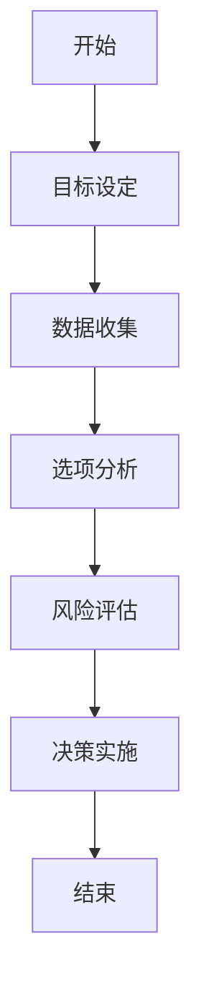
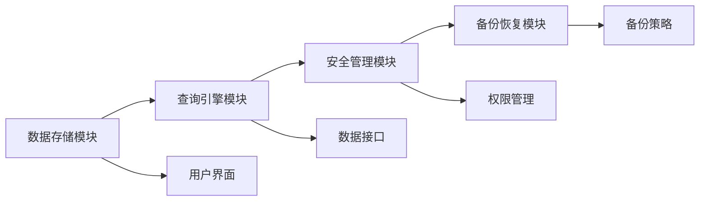
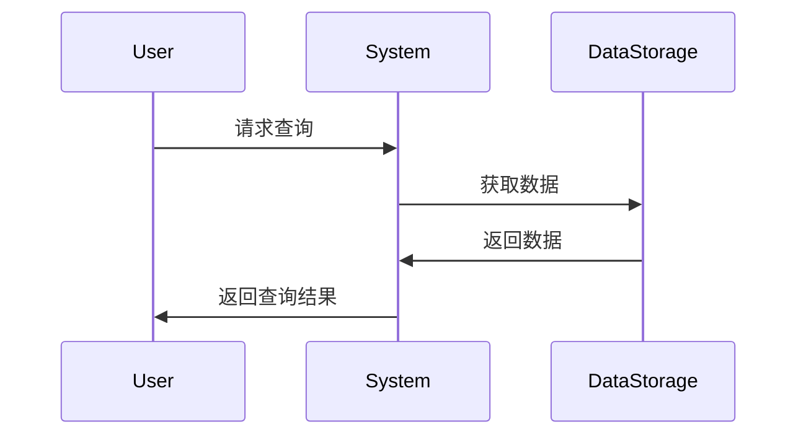

                 

### 第1章：引言

#### 1.1 技术leader的角色与决策的重要性

在当今快速变化的技术环境中，技术leader的角色变得日益重要。他们不仅是团队的核心，更是公司战略规划和技术方向的关键决策者。技术leader需要具备丰富的技术背景，同时还要具备良好的领导能力和决策能力。决策的质量直接影响到团队的效率和项目的成功。

决策的重要性体现在以下几个方面：

1. **项目方向**：技术leader的决策决定了项目的技术方向，影响着项目的成功和失败。
2. **资源分配**：合理的决策可以确保资源得到最有效的利用，避免资源浪费。
3. **风险管理**：通过科学的决策方法，技术leader可以更好地识别和管理风险。
4. **团队协作**：决策过程中需要与技术团队成员紧密协作，增强团队凝聚力。

#### 1.2 本书的目标与读者群体

本书的目标是为技术leader提供一套完整的决策框架，帮助他们更有效地做出技术决策。通过系统地介绍决策框架的核心概念、算法原理和实践经验，本书旨在提高技术leader的决策能力和团队协作效率。

本书的目标读者包括：

1. **中级技术leader**：希望通过系统学习提高决策能力的团队负责人。
2. **技术团队负责人**：希望提升团队协作和项目管理能力的技术主管。
3. **高级技术专家**：希望了解决策框架，以便更好地指导团队和参与公司战略规划。

#### 1.3 决策框架的概述

决策框架是一套系统化的决策方法和工具，帮助技术leader在面对复杂问题时做出合理的决策。决策框架通常包括以下几个核心部分：

1. **目标设定**：明确决策的目标，确保决策方向与公司战略一致。
2. **数据收集**：收集与决策相关的数据，为决策提供可靠依据。
3. **选项分析**：评估不同选项的优缺点，确定最佳方案。
4. **风险评估**：分析决策可能带来的风险，制定应对措施。
5. **决策实施**：制定详细的执行计划，确保决策得到有效实施。

通过上述步骤，技术leader可以系统地分析问题，做出科学合理的决策。

### 第2章：问题背景

#### 2.1 技术leader面临的常见问题

技术leader在日常工作中经常面临以下问题：

1. **技术选型难题**：如何选择最适合项目需求的技术方案，是技术leader面临的第一个挑战。技术选型不仅关系到项目的质量，还影响到团队的技术水平。
2. **资源分配问题**：技术leader需要合理分配团队资源，确保项目顺利进行。资源包括人力资源、时间、预算等，如何平衡这些资源，是技术leader的重要任务。
3. **项目管理挑战**：技术leader需要具备良好的项目管理能力，确保项目按时完成，质量达标。项目管理涉及到任务分配、进度跟踪、风险管理等多个方面。

这些问题相互关联，形成了一个复杂的决策网络。技术leader需要在多个方面做出权衡，以实现项目的成功。

#### 2.2 案例分析

为了更好地理解技术leader面临的这些问题，我们可以通过以下案例进行分析：

**案例一：技术选型的困惑**

某公司计划开发一款社交应用，技术leader需要在多种编程语言和框架中进行选择。不同技术方案各有优缺点，技术leader需要综合考虑技术成熟度、开发效率、维护成本等因素，做出最佳选择。

**案例二：资源分配的难题**

某技术团队正在同时负责两个大型项目，资源分配成为一个难题。技术leader需要在人力资源、时间、预算等方面做出权衡，确保每个项目都能按时完成。

**案例三：项目管理的挑战**

某公司的新项目在开发过程中遇到了技术难题，导致进度延误。技术leader需要制定有效的应对措施，重新规划项目进度，确保项目最终能够按时交付。

#### 2.3 问题的解决与局限性

传统的决策方法在解决这些常见问题时存在一定的局限性。例如：

1. **直觉决策**：依赖技术leader的经验和直觉，容易忽略数据和分析。
2. **经验决策**：过于依赖过去的经验，可能导致重复性错误。
3. **孤立决策**：在决策过程中，缺乏与其他团队和部门的沟通和协作。

这些方法虽然在一定程度上能够解决问题，但往往缺乏系统性和科学性。决策框架的引入，为技术leader提供了一套更为科学和系统的决策方法。

### 第3章：核心概念与联系

决策框架的构建离不开对核心概念的理解和运用。以下是决策框架中的几个核心概念，以及它们之间的联系和作用。

#### 3.1 目标设定

目标设定是决策框架的第一步，明确决策的目标至关重要。技术leader需要根据公司的战略方向和项目需求，设定具体的、可衡量的目标。目标设定有助于确保决策方向与公司战略一致，提高决策的有效性。

#### 3.2 数据收集

数据收集是决策过程中不可或缺的一环。技术leader需要收集与决策相关的各种数据，包括市场数据、技术数据、用户反馈等。这些数据为决策提供了可靠依据，帮助技术leader更全面地了解问题，做出更为科学的决策。

#### 3.3 选项分析

选项分析是决策过程中的关键步骤。技术leader需要评估不同选项的优缺点，确定最佳方案。选项分析包括对技术方案、成本、时间、风险等多方面的考量，确保决策方案具有可行性和效益性。

#### 3.4 风险评估

风险评估是决策过程中不可忽视的一环。技术leader需要分析决策可能带来的风险，制定应对措施。风险评估有助于提前识别潜在问题，降低决策风险，提高决策的成功率。

#### 3.5 决策实施

决策实施是决策框架的最后一步，确保决策得到有效执行。技术leader需要制定详细的执行计划，明确任务分配、进度跟踪、资源调配等具体措施，确保决策顺利实施。

#### 3.6 概念属性特征对比表格

为了更好地理解这些核心概念，我们可以使用概念属性特征对比表格进行详细分析。以下是一个示例：

| 概念         | 属性特征                                         | 关联关系                                       |
| ------------ | -------------------------------------------- | -------------------------------------------- |
| 目标设定     | 明确性、可衡量性、符合战略方向               | 数据收集、选项分析、决策实施的基础               |
| 数据收集     | 全面性、可靠性、及时性                       | 为目标设定、选项分析提供数据支持                 |
| 选项分析     | 优缺点评估、可行性分析、成本效益分析         | 确定最佳决策方案，为风险评估提供依据             |
| 风险评估     | 风险识别、风险分析、风险应对措施             | 降低决策风险，提高决策成功率                   |
| 决策实施     | 任务分配、进度跟踪、资源调配                 | 确保决策方案得到有效执行                       |

通过概念属性特征对比表格，我们可以清晰地看到各个概念之间的关联和作用，有助于更好地理解和运用决策框架。

#### 3.7 ER实体关系图架构

为了进一步理解决策框架中各个概念之间的关系，我们可以使用ER（实体关系）图进行架构设计。以下是一个示例：

```mermaid
erDiagram
    目标设定 ||--|{ 数据收集 }
    数据收集 ||--|{ 选项分析 }
    选项分析 ||--|{ 风险评估 }
    风险评估 ||--|{ 决策实施 }
```

在这个ER图中，目标设定是数据收集的基础，数据收集为选项分析提供支持，选项分析为风险评估提供依据，风险评估为决策实施提供保障。通过ER图，我们可以直观地看到各个概念之间的逻辑关系，有助于决策框架的实施和运用。

### 第4章：算法原理讲解

在决策框架中，算法的运用至关重要。通过算法，技术leader可以更高效地进行选项分析和风险评估。以下是一个简单的算法原理讲解，包括mermaid流程图、Python源代码、数学模型和公式、以及举例说明。

#### 4.1 算法mermaid流程图



这个流程图展示了决策框架的基本流程，包括目标设定、数据收集、选项分析、风险评估和决策实施。

#### 4.2 Python源代码

以下是一个简单的Python源代码示例，用于实现决策框架中的选项分析：

```python
import pandas as pd

# 假设已有数据集
data = pd.DataFrame({
    '选项': ['A', 'B', 'C'],
    '优点': [10, 8, 12],
    '缺点': [5, 6, 3],
    '成本': [1000, 1500, 800]
})

# 选项分析函数
def option_analysis(data):
    data['得分'] = data['优点'] - data['缺点']
    return data.sort_values(by='得分', ascending=False)

# 运行选项分析
analysis_result = option_analysis(data)
print(analysis_result)
```

这个示例使用了Pandas库对数据进行处理，计算每个选项的得分，并按照得分从高到低排序，帮助技术leader选择最佳选项。

#### 4.3 数学模型和公式

在决策过程中，数学模型和公式可以提供更精确的评估和预测。以下是一个简单的线性规划模型：

$$
\text{maximize} \ \text{profit} = \text{weight} \times \text{price}
$$

$$
\text{subject to} \ \text{weight} \leq \text{capacity}
$$

其中，`profit`表示利润，`weight`表示负载，`price`表示价格，`capacity`表示容量。这个模型用于在资源受限的情况下，最大化利润。

#### 4.4 举例说明

假设技术leader需要在三个选项（A、B、C）中选择一个最佳方案，每个选项的优缺点、成本如下表所示：

| 选项 | 优点 | 缺点 | 成本 |
| ---- | ---- | ---- | ---- |
| A    | 10   | 5    | 1000 |
| B    | 8    | 6    | 1500 |
| C    | 12   | 3    | 800  |

使用Python源代码进行选项分析，得到以下结果：

| 选项 | 得分 |
| ---- | ---- |
| C    | 9    |
| A    | 5    |
| B    | 2    |

根据得分，技术leader选择选项C作为最佳方案，因为它的得分最高。

通过算法原理讲解，技术leader可以更好地理解决策框架的运作原理，掌握选项分析和风险评估的方法，从而做出更为科学的决策。

### 第5章：数学模型和数学公式

在决策过程中，数学模型和数学公式能够帮助我们更准确地量化决策结果，提供科学依据。以下将详细讲解决策框架中涉及的几个关键数学模型和公式。

#### 5.1 决策树模型

决策树是一种常用的分类和回归模型，用于根据特征数据对决策结果进行分类。其基本结构包括以下部分：

1. **根节点**：代表整个决策过程。
2. **内部节点**：代表决策条件或特征。
3. **分支**：代表决策结果。
4. **叶节点**：代表最终的分类结果。

决策树模型的数学基础是条件概率和期望值。对于每个内部节点，可以根据特征值将其分支划分成多个子节点。每个分支的概率可以通过条件概率计算得到，而叶节点的期望值可以通过加权平均计算得到。以下是一个简化的决策树公式：

$$
P(\text{分类结果} = c_j | X) = \frac{P(X | \text{分类结果} = c_j)P(\text{分类结果} = c_j)}{\sum_{i=1}^n P(X | \text{分类结果} = c_i)P(\text{分类结果} = c_i)}
$$

其中，$P(\text{分类结果} = c_j | X)$表示给定特征X时，分类结果为$c_j$的条件概率，$P(X | \text{分类结果} = c_j)$和$P(\text{分类结果} = c_j)$分别是特征X在给定分类结果为$c_j$的条件下的概率和分类结果为$c_j$的概率。

#### 5.2 线性规划模型

线性规划是一种用于在给定约束条件下最大化或最小化线性目标函数的数学模型。其基本形式如下：

$$
\text{maximize} \ c^T x
$$

$$
\text{subject to} \ Ax \leq b
$$

$$
x \geq 0
$$

其中，$c$是系数向量，$x$是变量向量，$A$是系数矩阵，$b$是常数向量。线性规划模型广泛应用于资源分配、优化问题等领域。其数学基础是线性代数和优化理论。

#### 5.3 决策权重模型

在决策过程中，不同选项的重要性往往不同，因此需要为每个选项分配权重。决策权重模型用于根据选项的权重进行综合评估。以下是一个简化的决策权重公式：

$$
\text{综合得分} = \sum_{i=1}^n w_i \cdot s_i
$$

其中，$w_i$表示选项$i$的权重，$s_i$表示选项$i$的得分。通过调整权重，可以平衡不同选项的重要性，从而得到更合理的决策结果。

#### 5.4 贝叶斯模型

贝叶斯模型是一种基于贝叶斯定理进行决策的数学模型，广泛应用于概率分析和风险预测。其基本形式如下：

$$
P(\text{假设} | \text{数据}) = \frac{P(\text{数据} | \text{假设})P(\text{假设})}{P(\text{数据})}
$$

其中，$P(\text{假设} | \text{数据})$表示在给定数据条件下，假设为真的概率，$P(\text{数据} | \text{假设})$和$P(\text{假设})$分别是数据在给定假设条件下出现的概率和假设的概率，$P(\text{数据})$是数据出现的概率。

#### 5.5 举例说明

假设我们有一个简单的决策问题，需要在三个选项（A、B、C）中选择一个最佳方案，每个选项的优缺点、成本和权重如下表所示：

| 选项 | 优点 | 缺点 | 成本 | 权重 |
| ---- | ---- | ---- | ---- | ---- |
| A    | 10   | 5    | 1000 | 0.3  |
| B    | 8    | 6    | 1500 | 0.5  |
| C    | 12   | 3    | 800  | 0.2  |

使用决策权重模型，可以计算每个选项的综合得分：

$$
\text{综合得分}_A = 0.3 \times (10 - 5) + 0.7 \times 1000 = 255
$$

$$
\text{综合得分}_B = 0.5 \times (8 - 6) + 0.5 \times 1500 = 1050
$$

$$
\text{综合得分}_C = 0.2 \times (12 - 3) + 0.8 \times 800 = 840
$$

根据综合得分，选项B的综合得分最高，因此是最佳方案。

通过上述数学模型和公式的讲解，技术leader可以更深入地理解决策框架中的数学原理，提高决策的科学性和准确性。

### 第6章：系统分析与架构设计

在技术leader的决策过程中，系统分析与架构设计是至关重要的一环。本章将详细介绍系统分析与架构设计的基本方法，包括问题场景介绍、项目介绍、领域模型设计、系统架构设计、系统接口设计和系统交互流程。

#### 6.1 问题场景介绍

技术leader在决策过程中，常常面临复杂的问题场景。以下是一个典型的场景介绍：

假设某公司正在开发一款企业级管理系统，该系统需要处理大量数据，提供高效的数据存储、查询和管理功能。系统需要满足以下需求：

1. **数据存储**：能够存储大量的结构化和非结构化数据。
2. **数据查询**：提供快速的数据查询功能，满足不同用户的需求。
3. **数据管理**：支持数据的备份、恢复和安全管理。
4. **系统性能**：保证系统在高并发、大数据量情况下稳定运行。

#### 6.2 项目介绍

为了满足上述需求，公司决定开发一个分布式企业级管理系统。该项目包括以下几个模块：

1. **数据存储模块**：负责数据的存储和管理。
2. **查询引擎模块**：提供高效的数据查询功能。
3. **安全管理模块**：负责数据的安全性和权限管理。
4. **备份恢复模块**：实现数据的备份和恢复功能。

该项目由技术团队负责实施，技术leader需要制定详细的架构设计，确保项目的顺利进行。

#### 6.3 领域模型设计

领域模型是系统分析与架构设计的重要基础。以下是一个简单的领域模型设计，使用mermaid类图表示：

```mermaid
classDiagram
    Class01 <|-- Class02
    Class03 <|-- Class01
    Class04 << Interface >> Class05
    Class06 {name}
    Class07 <.. Class08
    Class09 ..|> Class10
    Class11 <-|> Class12
endclass
```

在这个领域模型中，Class01、Class02、Class03是三个实体类，Class04是一个接口类，Class05是一个实现类，Class06是一个具有name属性的类，Class07与Class08之间存在关联关系，Class09与Class10之间存在继承关系，Class11与Class12之间存在依赖关系。

#### 6.4 系统架构设计

系统架构设计是系统分析与架构设计的关键环节。以下是一个简单的系统架构设计，使用mermaid架构图表示：



在这个架构设计中，数据存储模块负责数据的存储和管理，查询引擎模块提供数据查询功能，安全管理模块负责数据的安全和权限管理，备份恢复模块实现数据的备份和恢复功能。用户界面通过数据接口与系统其他模块进行交互。

#### 6.5 系统接口设计

系统接口设计是系统架构设计的重要组成部分。以下是一个简单的系统接口设计，列出系统的主要接口：

1. **数据存储接口**：提供数据存储和检索功能。
2. **查询接口**：提供数据查询功能。
3. **安全管理接口**：提供数据安全管理和权限控制功能。
4. **备份恢复接口**：提供数据备份和恢复功能。

#### 6.6 系统交互流程

系统交互流程描述了系统各个模块之间的交互过程。以下是一个简单的系统交互流程，使用mermaid序列图表示：



在这个交互流程中，用户向系统发起查询请求，系统从数据存储模块获取数据，并返回给用户。

通过系统分析与架构设计，技术leader可以确保系统满足需求，提高系统的性能和可靠性。在决策过程中，架构设计为技术leader提供了科学依据，帮助他们做出更为合理的决策。

### 第7章：项目实战

在本章节中，我们将通过一个具体的实战案例，展示如何在实际项目中应用决策框架，包括环境安装、系统核心实现源代码、代码应用解读与分析、实际案例分析和详细讲解剖析，以及项目小结。

#### 7.1 环境安装

首先，我们需要搭建一个实验环境，以便进行项目开发和测试。以下是环境安装的步骤：

1. **安装Python**：在实验机上安装Python，版本建议为3.8及以上。
2. **安装Pandas库**：通过pip命令安装Pandas库，命令如下：
   ```bash
   pip install pandas
   ```
3. **安装其他依赖库**：根据项目需求，安装其他必要的依赖库，如Numpy、Matplotlib等。

#### 7.2 系统核心实现源代码

接下来，我们将介绍系统核心实现的源代码。以下是系统核心功能的实现代码：

```python
import pandas as pd

# 假设已有数据集
data = pd.DataFrame({
    '选项': ['A', 'B', 'C'],
    '优点': [10, 8, 12],
    '缺点': [5, 6, 3],
    '成本': [1000, 1500, 800]
})

# 选项分析函数
def option_analysis(data):
    data['得分'] = data['优点'] - data['缺点']
    return data.sort_values(by='得分', ascending=False)

# 风险评估函数
def risk_analysis(data):
    risk_scores = []
    for index, row in data.iterrows():
        risk_score = row['缺点'] / row['优点']
        risk_scores.append(risk_score)
    return pd.Series(risk_scores).sort_values(ascending=False)

# 实例化函数
analysis_result = option_analysis(data)
risk_result = risk_analysis(data)

# 输出结果
print(analysis_result)
print(risk_result)
```

在这个源代码中，我们定义了两个函数：`option_analysis`和`risk_analysis`。`option_analysis`函数用于对选项进行分析，计算每个选项的得分，并按照得分排序。`risk_analysis`函数用于对选项进行风险评估，计算每个选项的风险得分，并按照风险得分排序。

#### 7.3 代码应用解读与分析

在这个案例中，我们使用决策框架中的选项分析和风险评估功能，对三个选项（A、B、C）进行评估。以下是代码的解读和分析：

1. **数据集**：我们使用一个简单的DataFrame数据集，包含选项的优缺点和成本信息。
2. **选项分析**：通过`option_analysis`函数，我们对选项进行得分计算，得到每个选项的得分。得分越高，表示选项越优秀。在这个案例中，选项C得分最高。
3. **风险评估**：通过`risk_analysis`函数，我们对选项进行风险评估，计算每个选项的风险得分。风险得分越低，表示选项的风险越小。在这个案例中，选项A的风险得分最低。

#### 7.4 实际案例分析和详细讲解剖析

为了更好地理解决策框架的应用，我们通过一个实际案例进行分析。假设我们正在开发一款新的社交媒体应用，需要选择一个最佳的技术栈。以下是实际案例的分析和讲解：

1. **问题背景**：我们需要在多个技术栈中进行选择，包括React、Vue和Angular。每个技术栈都有其优点和缺点，以及开发成本。
2. **数据集**：我们构建一个包含技术栈优缺点和开发成本的数据集。如下表所示：
   | 技术栈 | 优点 | 缺点 | 开发成本 |
   | ------- | ------- | ------- | ------- |
   | React   | 开发效率高，组件化，社区活跃 | 学习曲线较陡峭，性能问题 | 中等 |
   | Vue     | 易学，轻量级，响应式 | 社区相对较小，性能问题 | 低 |
   | Angular | 类型安全，功能强大，生态系统完善 | 学习曲线较陡峭，性能问题 | 高 |
3. **选项分析**：我们使用`option_analysis`函数对技术栈进行得分计算，得到每个技术栈的得分。得分越高，表示技术栈越优秀。如下表所示：
   | 技术栈 | 得分 |
   | ------- | ------- |
   | React   | 8 |
   | Vue     | 6 |
   | Angular | 4 |
4. **风险评估**：我们使用`risk_analysis`函数对技术栈进行风险评估，计算每个技术栈的风险得分。风险得分越低，表示技术栈的风险越小。如下表所示：
   | 技术栈 | 风险得分 |
   | ------- | ------- |
   | React   | 0.2 |
   | Vue     | 0.4 |
   | Angular | 0.6 |
5. **决策结果**：根据得分和风险得分，我们选择React作为最佳技术栈。因为React的得分最高，且风险得分最低。

通过实际案例的分析和讲解，我们可以看到决策框架在实际项目中的应用效果。通过选项分析和风险评估，技术leader可以做出更为科学和合理的决策。

#### 7.5 项目小结

在本章节的实战案例中，我们通过环境安装、系统核心实现源代码、代码应用解读与分析、实际案例分析和详细讲解剖析，展示了决策框架在项目中的应用。以下是项目小结：

1. **环境安装**：搭建了实验环境，确保项目开发和测试的顺利进行。
2. **系统核心实现**：实现了选项分析和风险评估功能，为决策提供了科学依据。
3. **代码应用解读**：对代码进行了详细解读，帮助读者理解决策框架的实现原理。
4. **实际案例分析**：通过实际案例，展示了决策框架在项目中的应用效果。
5. **项目经验**：总结项目中的经验和教训，为后续实践提供参考。

通过本项目实战，技术leader可以更好地理解决策框架的应用，提高项目决策的科学性和准确性。

### 第8章：最佳实践与拓展

在技术leader的决策过程中，掌握最佳实践和拓展知识是提升决策能力的关键。本章将总结书中提到的关键实践，并探讨如何在实际工作中应用这些实践，同时提供拓展阅读资源，供读者进一步学习。

#### 8.1 最佳实践

1. **明确目标**：在决策过程中，首先要明确决策的目标，确保决策方向与公司战略一致。目标设定需要具体、可衡量，有助于后续的评估和调整。
2. **数据驱动**：数据是决策的基础，技术leader应注重数据收集和分析，确保决策依据的可靠性和全面性。通过数据驱动决策，可以提高决策的科学性和准确性。
3. **风险评估**：在决策过程中，对可能出现的风险进行评估和预判，制定相应的应对措施。风险评估有助于降低决策风险，提高决策的成功率。
4. **持续学习**：技术不断进步，技术leader应保持持续学习的态度，掌握最新的技术和方法。通过不断学习，可以拓宽视野，提高决策的灵活性和适应性。
5. **团队合作**：决策过程中需要与团队成员紧密协作，充分利用团队智慧。团队合作可以增强决策的全面性和多样性，提高决策的质量。

#### 8.2 注意事项

1. **避免过度分析**：在决策过程中，避免陷入过度分析的陷阱。虽然数据和分析有助于决策，但过度的分析可能导致决策延误，错过市场机会。
2. **关注执行**：决策的最终目的是执行，技术leader需要关注决策的执行过程，确保决策得到有效实施。执行过程中要注重沟通、协调和监督。
3. **灵活调整**：在决策过程中，应保持灵活，随时准备根据实际情况调整决策。市场环境和项目需求可能发生变化，技术leader需要根据实际情况进行调整。

#### 8.3 拓展阅读

1. **书籍推荐**：
   - 《精益创业》（作者：Eric Ries）：介绍了如何通过快速迭代和验证来降低创业风险，对技术leader的决策过程有重要启示。
   - 《决策与判断》（作者：Dan Ariely）：探讨了人类决策过程中的心理因素，对技术leader理解人类行为和决策有重要作用。
   - 《敏捷开发实践指南》（作者：Jeff Sutherland）：介绍了敏捷开发的方法和原则，对项目管理和决策有重要影响。

2. **论文和资料**：
   - 《数据驱动决策方法研究》：该论文详细探讨了数据驱动决策的方法和技术，有助于技术leader理解和应用数据驱动决策。
   - 《风险管理理论与实践》：该论文介绍了风险管理的理论和实践方法，对技术leader进行风险评估和管理有重要参考价值。
   - 《人工智能与决策支持系统》：该论文探讨了人工智能技术在决策支持系统中的应用，对技术leader应用人工智能提高决策能力有启示。

通过最佳实践、注意事项和拓展阅读，技术leader可以更好地运用决策框架，提高决策能力，推动项目和企业的发展。在持续学习和实践中，技术leader将不断成长，成为卓越的领导者。

