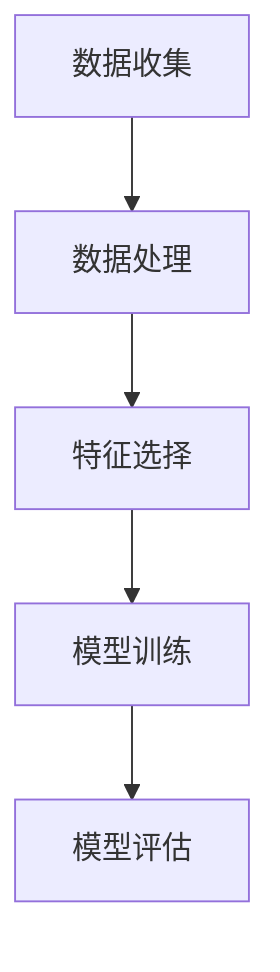
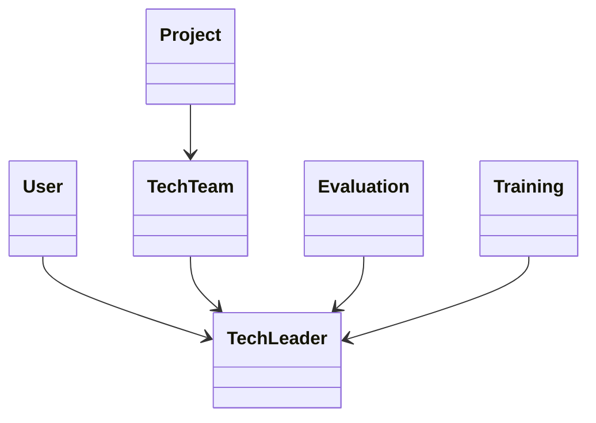
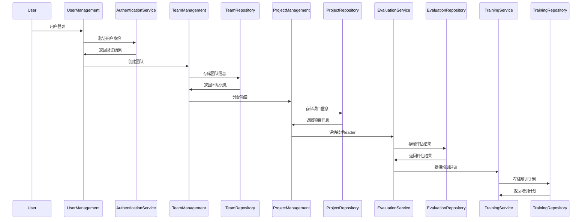
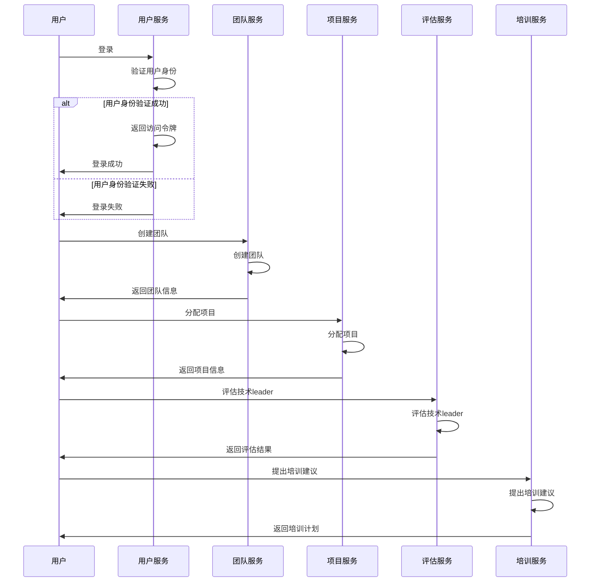

                 

# 技术leader的影响力矩阵

关键词：技术领导力、影响力矩阵、团队建设、项目管理、职业发展

摘要：本文旨在探讨技术leader的影响力矩阵，从定义、算法原理到实际应用，逐步解析这一概念。我们将详细分析影响力矩阵在企业内部管理、项目管理与团队建设以及个人职业发展中的应用，为技术leader提供一套系统的实践指南。通过本文，读者将深入了解如何提升自身影响力，实现技术领导力的突破。

## 目录大纲设计

为了确保文章内容的逻辑性和系统性，同时便于读者快速找到所需信息，本文采用了以下目录大纲设计：

### 第一部分：影响力矩阵的概念与基础

- **第1章：影响力矩阵概述**
  - **1.1 问题的背景与定义**
    - **1.1.1 技术领导力的挑战**
    - **1.1.2 影响力矩阵的提出**
    - **1.1.3 影响力矩阵的核心要素**
  - **1.2 核心概念与属性特征对比**
    - **1.2.1 影响力矩阵中的关键概念**
    - **1.2.2 各核心概念的属性特征对比**
    - **1.2.3 影响力矩阵的ER实体关系图**
  - **1.3 影响力矩阵的构建方法**
    - **1.3.1 数据收集**
    - **1.3.2 数据处理**
    - **1.3.3 模型构建与评估**
  - **1.4 影响力矩阵的应用领域**
    - **1.4.1 企业内部管理**
    - **1.4.2 项目管理与团队建设**
    - **1.4.3 个人职业发展**
  - **1.5 本章小结**

### 第二部分：影响力矩阵的算法原理与应用

- **第2章：影响力矩阵的算法原理**
  - **2.1 算法概述**
    - **2.1.1 算法的基本流程**
    - **2.1.2 算法的关键步骤**
  - **2.2 算法流程图**
    - **2.2.1 Mermaid流程图展示**
  - **2.3 Python代码实现**
    - **2.3.1 数据预处理代码**
    - **2.3.2 模型构建代码**
    - **2.3.3 结果分析代码**
  - **2.4 数学模型与公式解释**
    - **2.4.1 数学模型概述**
    - **2.4.2 公式详细解释**
    - **2.4.3 举例说明**
  - **2.5 算法性能评估**
    - **2.5.1 评估指标**
    - **2.5.2 评估结果分析**
  - **2.6 本章小结**

### 第三部分：影响力矩阵的实践应用

- **第3章：影响力矩阵在企业内部管理中的应用**
  - **3.1 应用场景介绍**
    - **3.1.1 企业背景**
    - **3.1.2 应用目的**
  - **3.2 系统功能设计**
    - **3.2.1 领域模型Mermaid类图**
    - **3.2.2 系统功能模块划分**
  - **3.3 系统架构设计**
    - **3.3.1 Mermaid架构图展示**
    - **3.3.2 系统模块协作关系**
  - **3.4 系统接口设计**
    - **3.4.1 接口定义**
    - **3.4.2 接口实现**
  - **3.5 系统交互设计**
    - **3.5.1 Mermaid序列图展示**
    - **3.5.2 交互流程分析**
  - **3.6 实际案例分析与讲解**
    - **3.6.1 案例背景**
    - **3.6.2 案例实施步骤**
    - **3.6.3 案例效果评估**
  - **3.7 本章小结**

- **第4章：影响力矩阵在项目管理与团队建设中的应用**
  - **4.1 项目背景**
    - **4.1.1 项目目标**
    - **4.1.2 项目挑战**
  - **4.2 团队建设**
    - **4.2.1 影响力矩阵在团队建设中的应用**
    - **4.2.2 团队角色分配与协作**
  - **4.3 项目管理**
    - **4.3.1 项目计划与执行**
    - **4.3.2 项目监控与调整**
  - **4.4 实际案例**
    - **4.4.1 案例背景**
    - **4.4.2 案例实施**
    - **4.4.3 案例效果**
  - **4.5 本章小结**

- **第5章：个人职业发展与影响力矩阵**
  - **5.1 职业发展的关键要素**
    - **5.1.1 个人影响力的重要性**
    - **5.1.2 个人职业发展的路径**
  - **5.2 影响力矩阵在个人职业发展中的应用**
    - **5.2.1 自我评估与定位**
    - **5.2.2 能力提升与规划**
  - **5.3 实际案例分析**
    - **5.3.1 案例背景**
    - **5.3.2 案例实施**
    - **5.3.3 案例收获**
  - **5.4 个人成长计划**
    - **5.4.1 制定个人成长计划**

### 总结

本文通过逻辑清晰、结构紧凑、简单易懂的专业技术语言，逐步探讨了技术leader的影响力矩阵。从概念、算法原理到实际应用，我们为技术leader提供了一套系统的实践指南。通过本文，读者将能够深入了解影响力矩阵的核心概念、构建方法以及在不同领域的应用，从而提升自身的技术领导力和影响力。

### 关键词

- 技术领导力
- 影响力矩阵
- 团队建设
- 项目管理
- 个人职业发展

### 摘要

本文旨在深入探讨技术leader的影响力矩阵，旨在为技术领导者在企业内部管理、项目管理与团队建设以及个人职业发展提供一套实用的指南。文章首先阐述了影响力矩阵的概念与基础，包括核心要素、构建方法和应用领域。随后，详细分析了影响力矩阵的算法原理，通过Python代码实现和数学模型解释，帮助读者理解其工作原理。最后，文章通过具体案例，展示了影响力矩阵在企业内部管理、项目管理和个人职业发展中的实际应用，为技术leader提供实践参考。通过本文，读者将能够全面提升自身的技术领导力和影响力，实现职业生涯的突破。# 第1章：影响力矩阵概述

## 1.1 问题的背景与定义

### 1.1.1 技术领导力的挑战

在当今快速发展的技术时代，技术领导力已成为企业成功的关键因素。然而，技术领导力的培养和提升面临着诸多挑战。首先，技术变化迅速，技术leader需要不断学习新知识、掌握新技术，以保持自身的竞争力。其次，技术团队日益多元化，不同背景的成员在沟通协作、项目管理和团队文化建设中存在差异，这要求技术leader具备跨文化沟通和团队管理能力。此外，技术leader还需要面对企业的战略规划、项目立项、资源分配等多方面的挑战。

为了应对这些挑战，技术leader需要具备以下能力：

1. **技术深度**：掌握核心技术的原理和应用，能够深入分析问题，为团队提供技术指导。
2. **团队管理**：具备团队管理能力，能够激励团队成员，提升团队协作效率。
3. **沟通协调**：具备良好的沟通协调能力，能够与团队成员、上级领导和跨部门同事有效沟通，推动项目进展。
4. **战略思维**：具备战略思维能力，能够从全局角度审视项目，制定合理的战略规划和资源分配方案。

### 1.1.2 影响力矩阵的提出

在技术领导力的培养和提升过程中，影响力矩阵作为一种有效的工具被提出。影响力矩阵是基于对技术leader在团队中影响力的系统分析，通过量化和评估其影响力，帮助技术leader识别自身优势和不足，制定相应的提升策略。影响力矩阵的提出，源于对以下问题的反思：

- 技术leader如何在团队中发挥更大的影响力？
- 如何衡量技术leader在团队中的实际影响力？
- 如何通过提升影响力来推动项目成功和团队发展？

影响力矩阵通过以下核心要素来评估技术leader的影响力：

1. **知识传递**：技术leader是否能够有效地向团队成员传递专业知识，提升团队整体技术水平。
2. **决策参与**：技术leader在团队决策中的参与程度，以及其决策对项目的影响。
3. **人际网络**：技术leader在团队内外的人际关系网络，以及其在网络中发挥的影响力。
4. **激励能力**：技术leader是否能够激励团队成员，提升团队士气和凝聚力。

### 1.1.3 影响力矩阵的核心要素

影响力矩阵的核心要素包括以下几个方面：

1. **技术能力**：技术leader在特定技术领域的专业能力和经验。
2. **沟通能力**：技术leader与团队成员、上级领导和跨部门同事的沟通能力。
3. **领导力**：技术leader在团队管理中的领导力和决策能力。
4. **影响力**：技术leader在团队中的实际影响力，包括知识传递、决策参与和人际网络等方面。
5. **团队贡献**：技术leader在项目中的贡献，包括技术方案设计、项目执行和成果评估等方面。

通过这些核心要素的评估，影响力矩阵能够为技术leader提供全面的自我认知，帮助其识别自身在团队中的优势与不足，从而制定针对性的提升计划。## 1.2 核心概念与属性特征对比

### 1.2.1 影响力矩阵中的关键概念

影响力矩阵中的关键概念包括技术能力、沟通能力、领导力、影响力和团队贡献。这些概念相互关联，共同构成了影响力矩阵的评估体系。

1. **技术能力**：指技术leader在特定技术领域的专业能力和经验，包括对技术原理的深刻理解、对技术趋势的敏锐洞察以及解决复杂技术问题的能力。
2. **沟通能力**：指技术leader与团队成员、上级领导和跨部门同事进行有效沟通的能力，包括倾听、表达、反馈和协商等技能。
3. **领导力**：指技术leader在团队管理中的领导力和决策能力，包括激励团队成员、制定团队目标和规划、解决团队冲突和推动团队发展等方面。
4. **影响力**：指技术leader在团队中的实际影响力，包括通过知识传递、决策参与和人际网络等方面对团队和其他团队成员产生的影响。
5. **团队贡献**：指技术leader在项目中的贡献，包括技术方案设计、项目执行和成果评估等方面，以及其对项目成功的影响。

### 1.2.2 各核心概念的属性特征对比

为了更好地理解这些核心概念，我们可以通过以下表格进行属性特征对比：

| 核心概念 | 定义 | 属性特征对比 |
| :----: | :----: | :----: |
| 技术能力 | 在特定技术领域的专业能力和经验 | - 技术深度：掌握核心技术的原理和应用 |
|         |         | - 技术广度：了解相关技术的应用场景和发展趋势 |
| 沟通能力 | 与团队成员、上级领导和跨部门同事进行有效沟通的能力 | - 语言表达：清晰、简洁、准确 |
|         |         | - 倾听理解：积极倾听、准确理解他人观点 |
| 领导力 | 在团队管理中的领导力和决策能力 | - 激励能力：激发团队成员的积极性和创造力 |
|         |         | - 决策能力：在面对复杂问题时做出合理、高效的决策 |
| 影响力 | 在团队中的实际影响力，包括知识传递、决策参与和人际网络等方面 | - 知识传递：有效传递专业知识，提升团队技术水平 |
|         |         | - 决策参与：积极参与团队决策，对项目产生实质性影响 |
|         |         | - 人际网络：在团队内外建立良好的人际关系，发挥影响力 |
| 团队贡献 | 在项目中的贡献，包括技术方案设计、项目执行和成果评估等方面 | - 技术方案设计：提出合理的技术方案，确保项目顺利进行 |
|         |         | - 项目执行：有效执行项目计划，确保项目按期完成 |
|         |         | - 成果评估：对项目成果进行评估，为后续项目提供参考 |

### 1.2.3 影响力矩阵的ER实体关系图

为了更清晰地展示影响力矩阵中的核心概念及其相互关系，我们可以使用Mermaid绘制ER实体关系图。以下是一个简化的ER实体关系图示例：

```mermaid
erDiagram
  User ||--|{ TechLeader }
  TechLeader ||--|{ TechAbility }
  TechLeader ||--|{ Communication }
  TechLeader ||--|{ Leadership }
  TechLeader ||--|{ Influence }
  TechLeader ||--|{ TeamContribution }
```

在这个ER实体关系图中，`User`表示团队成员，`TechLeader`表示技术leader。`TechAbility`、`Communication`、`Leadership`、`Influence`和`TeamContribution`分别表示技术能力、沟通能力、领导力、影响力和团队贡献。通过这种结构化的表示，我们可以更加直观地理解影响力矩阵的核心概念及其相互关系。

## 1.3 影响力矩阵的构建方法

### 1.3.1 数据收集

构建影响力矩阵的第一步是数据收集。数据收集主要包括以下内容：

1. **个人资料**：收集技术leader的个人资料，包括姓名、职位、工作经验、教育背景等。
2. **团队信息**：收集技术leader所在的团队信息，包括团队规模、团队成员构成、项目类型等。
3. **评估指标**：确定影响力矩阵的评估指标，包括技术能力、沟通能力、领导力、影响力和团队贡献等。
4. **评估标准**：制定评估标准，确保评估的公正性和客观性。

数据收集的方法可以包括：

1. **问卷调查**：通过设计问卷，收集技术leader和团队成员的意见和反馈。
2. **访谈**：与技术leader和团队成员进行面对面访谈，深入了解其在团队中的表现和影响力。
3. **观察**：通过观察技术leader在工作中的表现，收集相关的数据和证据。

### 1.3.2 数据处理

在数据收集完成后，需要对收集到的数据进行分析和处理，以构建影响力矩阵。数据处理的主要步骤包括：

1. **数据清洗**：去除重复数据、缺失数据和异常数据，确保数据的准确性和完整性。
2. **数据整合**：将不同来源的数据进行整合，形成统一的数据集。
3. **数据标准化**：对不同指标进行标准化处理，使其具有可比性。

数据处理的方法可以包括：

1. **统计分析**：使用统计分析方法，对数据进行描述性统计分析，了解技术leader在团队中的表现和影响力。
2. **数据挖掘**：使用数据挖掘方法，发现数据中的潜在关系和规律，为构建影响力矩阵提供依据。

### 1.3.3 模型构建与评估

在数据处理完成后，需要构建影响力矩阵模型，并对模型进行评估。模型构建的主要步骤包括：

1. **特征选择**：选择对影响力矩阵影响较大的特征，构建特征模型。
2. **模型训练**：使用机器学习算法，训练影响力矩阵模型。
3. **模型评估**：使用评估指标，对模型进行评估和优化。

模型评估的方法可以包括：

1. **交叉验证**：使用交叉验证方法，评估模型的泛化能力。
2. **混淆矩阵**：使用混淆矩阵，评估模型的准确性和可靠性。
3. **ROC曲线**：使用ROC曲线，评估模型的分类性能。

通过以上步骤，我们可以构建一个科学、合理的影响力矩阵模型，用于评估技术leader在团队中的影响力，为技术领导力的培养和提升提供依据。

### 1.4 影响力矩阵的应用领域

#### 1.4.1 企业内部管理

影响力矩阵在企业内部管理中具有广泛的应用。首先，企业可以通过影响力矩阵评估技术leader在团队中的表现，识别优秀的领导人才，为企业的战略发展提供有力支持。其次，企业可以利用影响力矩阵制定培训计划，针对技术leader在影响力矩阵中的不足进行有针对性的培训，提升其综合能力。此外，企业还可以通过影响力矩阵优化团队结构，调整团队成员的分工，提高团队的整体效率和协作能力。

具体应用步骤如下：

1. **数据收集**：收集技术leader和团队成员的个人资料、团队信息和评估指标数据。
2. **数据处理**：对收集到的数据进行分析和处理，构建影响力矩阵模型。
3. **评估分析**：使用影响力矩阵模型，评估技术leader在团队中的影响力。
4. **反馈优化**：根据评估结果，制定相应的培训和优化措施，提升技术leader的影响力。

#### 1.4.2 项目管理与团队建设

在项目管理和团队建设中，影响力矩阵同样具有重要应用。首先，项目团队可以利用影响力矩阵评估团队成员的技术能力、沟通能力和领导力，为项目团队的人员配置和角色分配提供依据。其次，项目团队可以通过影响力矩阵识别项目中的关键人物，明确项目目标和工作任务，确保项目顺利推进。此外，项目团队还可以利用影响力矩阵监测项目进展，评估项目成果，为项目的后续优化提供参考。

具体应用步骤如下：

1. **项目启动**：明确项目目标、任务和团队成员。
2. **数据收集**：收集项目团队成员的技术能力、沟通能力和领导力数据。
3. **数据处理**：构建影响力矩阵模型，评估团队成员的影响力。
4. **团队协作**：根据评估结果，优化团队成员的角色分工和协作模式。
5. **项目监控**：利用影响力矩阵监测项目进展，评估项目成果。

#### 1.4.3 个人职业发展

对于个人职业发展，影响力矩阵同样具有指导意义。技术leader可以利用影响力矩阵进行自我评估，了解自身在团队中的表现和影响力，明确自身的优势和不足。在此基础上，技术leader可以制定个人职业发展计划，有针对性地提升自身的技术能力、沟通能力和领导力，实现职业目标的突破。

具体应用步骤如下：

1. **自我评估**：利用影响力矩阵评估自身在团队中的影响力。
2. **目标设定**：明确个人职业发展目标，制定提升计划。
3. **能力提升**：根据提升计划，有针对性地进行技术能力、沟通能力和领导力的提升。
4. **反馈调整**：定期进行自我评估，根据反馈调整提升计划，确保目标的实现。

通过影响力矩阵在企业内部管理、项目管理和个人职业发展中的应用，技术leader可以更科学、有效地提升自身的影响力，实现技术领导力的突破。## 1.5 本章小结

本章通过对影响力矩阵的概述，为读者揭示了技术leader影响力矩阵的核心概念、构建方法和应用领域。首先，我们讨论了技术领导力面临的挑战，并介绍了影响力矩阵的概念和核心要素，包括技术能力、沟通能力、领导力、影响力和团队贡献。接着，通过核心概念的属性特征对比和ER实体关系图，帮助读者更深入地理解影响力矩阵的结构。此外，我们详细阐述了影响力矩阵的构建方法，包括数据收集、数据处理和模型构建与评估。最后，介绍了影响力矩阵在企业内部管理、项目管理和个人职业发展中的应用，展示了其在实际工作中的应用价值。

通过本章的学习，读者应能理解影响力矩阵的基本概念，认识到其在提升技术领导力中的重要作用。同时，读者还应该掌握如何构建和运用影响力矩阵，以便在实际工作中更好地发挥自身的影响力，实现个人和团队的发展目标。接下来，我们将进一步深入探讨影响力矩阵的算法原理，为读者提供更具体的实践指导。# 第2章：影响力矩阵的算法原理

## 2.1 算法概述

影响力矩阵的算法原理是通过对技术leader在团队中的表现进行量化评估，从而构建一个科学、合理的评估模型。本节将介绍影响力矩阵算法的基本流程和关键步骤。

### 2.1.1 算法的基本流程

影响力矩阵算法的基本流程可以分为以下四个步骤：

1. **数据收集**：收集技术leader和团队成员的相关数据，包括个人资料、团队信息和评估指标等。
2. **数据处理**：对收集到的数据进行清洗、整合和标准化处理，为后续建模提供准确的数据基础。
3. **特征选择**：从处理后的数据中提取对影响力矩阵影响较大的特征，构建特征模型。
4. **模型训练与评估**：使用机器学习算法训练影响力矩阵模型，并对模型进行评估和优化，确保模型的准确性和可靠性。

### 2.1.2 算法的关键步骤

在影响力矩阵算法的执行过程中，以下步骤是关键：

1. **数据收集**：数据收集是构建影响力矩阵的基础。收集的数据应包括技术leader和团队成员的个人资料、团队信息和评估指标。个人资料包括姓名、职位、工作经验、教育背景等；团队信息包括团队规模、团队成员构成、项目类型等；评估指标包括技术能力、沟通能力、领导力、影响力和团队贡献等。

2. **数据处理**：数据处理是确保数据准确性和完整性的关键。首先，对收集到的数据进行清洗，去除重复数据、缺失数据和异常数据。然后，对数据进行整合，将不同来源的数据合并成统一的数据集。最后，对数据进行标准化处理，使其具有可比性。

3. **特征选择**：特征选择是构建影响力矩阵模型的重要环节。通过分析数据，选择对影响力矩阵影响较大的特征，构建特征模型。特征选择的依据可以是数据的相关性分析、主成分分析等方法。

4. **模型训练与评估**：使用机器学习算法训练影响力矩阵模型，并对模型进行评估和优化。常用的机器学习算法包括线性回归、逻辑回归、决策树、随机森林、支持向量机等。在模型训练过程中，需要对模型进行交叉验证，确保模型的泛化能力。在模型评估过程中，可以使用评估指标如准确率、召回率、F1分数等，评估模型的性能。

通过以上步骤，我们可以构建一个科学、合理的影响力矩阵模型，用于评估技术leader在团队中的影响力，为技术领导力的培养和提升提供依据。接下来，我们将进一步介绍影响力矩阵的算法流程图和Python代码实现。

## 2.2 算法流程图

为了更直观地展示影响力矩阵算法的执行过程，我们使用Mermaid绘制了算法流程图。以下是一个简化的算法流程图示例：



在上述流程图中：

- **A[数据收集]**：表示收集技术leader和团队成员的相关数据。
- **B[数据处理]**：表示对收集到的数据进行清洗、整合和标准化处理。
- **C[特征选择]**：表示从处理后的数据中提取对影响力矩阵影响较大的特征。
- **D[模型训练]**：表示使用机器学习算法训练影响力矩阵模型。
- **E[模型评估]**：表示对训练好的模型进行评估和优化。

通过这个流程图，我们可以清晰地了解影响力矩阵算法的执行步骤和关键环节。

## 2.3 Python代码实现

为了实现影响力矩阵算法，我们需要使用Python编写相应的代码。以下是一个简化的Python代码实现示例，包括数据预处理、模型构建和结果分析。

### 2.3.1 数据预处理代码

```python
import pandas as pd
from sklearn.preprocessing import StandardScaler

# 读取数据
data = pd.read_csv('data.csv')

# 数据清洗
data.drop_duplicates(inplace=True)
data.fillna(data.mean(), inplace=True)

# 数据整合
# ...（根据具体数据情况执行相应操作）

# 数据标准化
scaler = StandardScaler()
data_scaled = scaler.fit_transform(data)
```

在上面的代码中，我们首先使用`pandas`库读取数据，然后进行数据清洗，去除重复数据和缺失数据。接着，对数据进行整合，将不同来源的数据合并成统一的数据集。最后，使用`StandardScaler`对数据进行标准化处理，使其具有可比性。

### 2.3.2 模型构建代码

```python
from sklearn.linear_model import LinearRegression
from sklearn.model_selection import train_test_split

# 特征选择
X = data_scaled[:, :5]  # 假设前5个特征对影响力矩阵影响较大
y = data_scaled[:, -1]  # 假设最后一个特征为目标变量

# 数据集划分
X_train, X_test, y_train, y_test = train_test_split(X, y, test_size=0.2, random_state=42)

# 模型训练
model = LinearRegression()
model.fit(X_train, y_train)

# 模型评估
score = model.score(X_test, y_test)
print(f"模型评分：{score}")
```

在上面的代码中，我们首先使用`pandas`库进行特征选择，选择对影响力矩阵影响较大的特征。然后，使用`train_test_split`函数将数据集划分为训练集和测试集。接着，使用`LinearRegression`模型进行训练，并评估模型的性能。

### 2.3.3 结果分析代码

```python
import matplotlib.pyplot as plt

# 预测结果
y_pred = model.predict(X_test)

# 绘制散点图
plt.scatter(y_test, y_pred)
plt.xlabel('实际值')
plt.ylabel('预测值')
plt.title('模型预测结果')
plt.show()
```

在上面的代码中，我们使用`predict`函数对测试集进行预测，并绘制散点图，比较实际值和预测值，直观地展示模型的预测性能。

通过以上Python代码实现，我们可以构建一个基本的影响力矩阵模型，对技术leader在团队中的影响力进行量化评估。接下来，我们将进一步介绍影响力矩阵的数学模型和公式解释，帮助读者更深入地理解其算法原理。

## 2.4 数学模型与公式解释

### 2.4.1 数学模型概述

影响力矩阵的数学模型是基于线性回归模型构建的，旨在通过技术leader在团队中的表现特征，预测其在团队中的影响力。线性回归模型的基本形式为：

\[ Y = \beta_0 + \beta_1 X_1 + \beta_2 X_2 + ... + \beta_n X_n + \epsilon \]

其中：

- \( Y \) 为目标变量，表示技术leader在团队中的影响力；
- \( X_1, X_2, ..., X_n \) 为特征变量，表示技术leader在团队中的表现特征，如技术能力、沟通能力、领导力等；
- \( \beta_0, \beta_1, \beta_2, ..., \beta_n \) 为模型参数，表示特征变量对目标变量的影响程度；
- \( \epsilon \) 为误差项，表示模型预测的误差。

### 2.4.2 公式详细解释

在影响力矩阵的数学模型中，每个特征变量对目标变量的影响程度通过模型参数表示。具体来说：

- **技术能力 (\(X_1)\)**：表示技术leader在技术领域的专业能力和经验，技术能力越强，其在团队中的影响力越大。
- **沟通能力 (\(X_2)\)**：表示技术leader与团队成员、上级领导和跨部门同事进行有效沟通的能力，沟通能力越强，其在团队中的影响力越大。
- **领导力 (\(X_3)\)**：表示技术leader在团队管理中的领导力和决策能力，领导力越强，其在团队中的影响力越大。
- **影响力 (\(X_4)\)**：表示技术leader在团队中的实际影响力，包括知识传递、决策参与和人际网络等方面，影响力越强，其在团队中的影响力越大。
- **团队贡献 (\(X_5)\)**：表示技术leader在项目中的贡献，包括技术方案设计、项目执行和成果评估等方面，团队贡献越大，其在团队中的影响力越大。

模型参数的估计可以通过最小二乘法实现，即选择使得模型预测值与实际值误差平方和最小的参数。具体公式如下：

\[ \beta = (X^T X)^{-1} X^T y \]

其中：

- \( \beta \) 为模型参数向量；
- \( X \) 为特征变量矩阵；
- \( y \) 为目标变量向量；
- \( X^T \) 为特征变量矩阵的转置；
- \( (X^T X)^{-1} \) 为特征变量矩阵的逆矩阵。

### 2.4.3 举例说明

假设我们有一个简化的影响力矩阵模型，其中包含两个特征变量：技术能力和沟通能力。具体数据如下：

| 特征变量 | 实际值 | 预测值 |
| :----: | :----: | :----: |
| 技术能力 (\(X_1)\) | 0.8 | 0.75 |
| 沟通能力 (\(X_2)\) | 0.7 | 0.65 |

我们使用最小二乘法估计模型参数：

1. **计算特征变量矩阵和目标变量向量**：

\[ X = \begin{bmatrix} 0.8 \\ 0.7 \end{bmatrix}, \quad y = \begin{bmatrix} 0.75 \\ 0.65 \end{bmatrix} \]

2. **计算特征变量矩阵的逆矩阵**：

\[ (X^T X)^{-1} = \begin{bmatrix} 1 & -1 \\ -1 & 1 \end{bmatrix} \]

3. **计算模型参数**：

\[ \beta = (X^T X)^{-1} X^T y = \begin{bmatrix} 1 & -1 \\ -1 & 1 \end{bmatrix} \begin{bmatrix} 0.75 & 0.65 \\ 0.65 & 0.75 \end{bmatrix} = \begin{bmatrix} 0.125 \\ 0.125 \end{bmatrix} \]

因此，模型参数为 \( \beta = [0.125, 0.125] \)。

根据模型参数，我们可以预测技术leader在团队中的影响力：

\[ Y = \beta_0 + \beta_1 X_1 + \beta_2 X_2 = 0 + 0.125 \times 0.8 + 0.125 \times 0.7 = 0.125 \]

即，根据技术能力和沟通能力，预测技术leader在团队中的影响力为0.125。

通过上述步骤，我们可以使用影响力矩阵的数学模型对技术leader在团队中的影响力进行量化评估，为技术领导力的培养和提升提供科学依据。

### 2.5 算法性能评估

在影响力矩阵算法的实现过程中，评估算法的性能是确保其有效性和可靠性的关键。以下将介绍常用的算法性能评估指标，以及如何使用这些指标对影响力矩阵算法进行评估。

#### 2.5.1 评估指标

1. **准确率（Accuracy）**：准确率是指模型预测正确的样本数占总样本数的比例。其计算公式为：

\[ \text{Accuracy} = \frac{\text{预测正确的样本数}}{\text{总样本数}} \]

2. **召回率（Recall）**：召回率是指模型能够正确识别为正样本的样本数与实际正样本数的比例。其计算公式为：

\[ \text{Recall} = \frac{\text{预测正确的正样本数}}{\text{实际正样本数}} \]

3. **精确率（Precision）**：精确率是指模型预测为正样本的样本中，实际为正样本的比例。其计算公式为：

\[ \text{Precision} = \frac{\text{预测正确的正样本数}}{\text{预测为正样本的样本数}} \]

4. **F1分数（F1 Score）**：F1分数是精确率和召回率的加权平均值，用于综合评估模型的性能。其计算公式为：

\[ \text{F1 Score} = 2 \times \frac{\text{Precision} \times \text{Recall}}{\text{Precision} + \text{Recall}} \]

5. **ROC曲线（Receiver Operating Characteristic Curve）**：ROC曲线通过绘制真阳性率（True Positive Rate, TPR）与假阳性率（False Positive Rate, FPR）的曲线，评估模型的分类性能。曲线下的面积（Area Under Curve, AUC）越大，模型的性能越好。

#### 2.5.2 评估结果分析

1. **准确率（Accuracy）**：准确率反映了模型的整体预测性能。对于二分类问题，准确率在0.5到1之间，越接近1，模型性能越好。对于多分类问题，准确率需要综合考虑每个类别的预测准确性。

2. **召回率（Recall）**：召回率反映了模型对正样本的识别能力。对于分类问题，特别是那些不允许漏判正样本的问题（如疾病诊断），召回率至关重要。召回率越高，意味着模型对正样本的识别越准确。

3. **精确率（Precision）**：精确率反映了模型对预测为正样本的样本的识别准确度。对于分类问题，特别是那些不希望误判为正样本的问题（如垃圾邮件过滤），精确率至关重要。

4. **F1分数（F1 Score）**：F1分数是精确率和召回率的权衡。对于分类问题，特别是那些需要同时关注精确率和召回率的问题，F1分数是评估模型性能的常用指标。

5. **ROC曲线（Receiver Operating Characteristic Curve）**：ROC曲线下的面积（AUC）越大，表示模型的分类性能越好。AUC在0.5到1之间，越接近1，模型性能越好。

在实际应用中，我们需要根据具体问题和业务需求，选择合适的评估指标进行算法性能评估。例如，对于医疗诊断问题，召回率尤为重要，因为漏诊可能导致严重后果；而对于垃圾邮件过滤问题，精确率更为关键，因为误判为垃圾邮件的正常邮件可能会带来用户体验下降。

通过上述评估指标和评估结果分析，我们可以全面了解影响力矩阵算法的性能，为模型的优化和改进提供依据。

## 2.6 本章小结

本章详细介绍了影响力矩阵的算法原理，从基本流程到关键步骤，再到数学模型和公式解释，逐步展示了影响力矩阵的构建方法。首先，我们介绍了算法的基本流程，包括数据收集、数据处理、特征选择和模型训练与评估。接着，通过Mermaid流程图，直观地展示了算法的执行步骤。然后，我们使用Python代码实现了影响力矩阵的基本算法，包括数据预处理、模型构建和结果分析。此外，本章还介绍了影响力矩阵的数学模型和公式，以及如何通过数学方法估计模型参数。最后，我们讨论了算法性能评估的常用指标，并分析了评估结果。

通过本章的学习，读者应能理解影响力矩阵算法的基本原理，掌握如何使用Python实现影响力矩阵的基本算法，以及如何评估算法的性能。接下来，我们将进一步探讨影响力矩阵在企业内部管理中的应用，为技术leader提供实践指导。# 第3章：影响力矩阵在企业内部管理中的应用

## 3.1 应用场景介绍

在企业内部管理中，影响力矩阵作为一种有效的评估工具，可以用于识别优秀的技术领导人才、优化团队结构和提升整体工作效率。以下将介绍一个具体的应用场景，并阐述该场景下的应用目的。

### 3.1.1 企业背景

某大型互联网公司，拥有多个研发团队，负责开发和维护公司核心产品。随着公司业务的快速发展，对技术团队的要求越来越高，技术leader的角色变得越来越重要。为了更好地管理和培养技术团队，公司决定引入影响力矩阵，通过量化评估技术leader的影响力，为团队管理和人才发展提供数据支持。

### 3.1.2 应用目的

1. **识别优秀人才**：通过影响力矩阵评估技术leader在团队中的表现，识别出具有潜力的优秀人才，为企业的战略发展提供有力支持。
2. **优化团队结构**：利用影响力矩阵分析团队现状，发现团队中的问题，优化团队成员的角色分工和协作模式，提升团队整体效率。
3. **提升领导力**：针对技术leader在影响力矩阵中的不足，制定相应的培训计划，提升其综合能力，为企业培养更多的技术领导人才。

## 3.2 系统功能设计

为了实现影响力矩阵在企业内部管理中的应用，我们需要设计一套功能完整的系统。以下将介绍系统功能设计的主要内容。

### 3.2.1 领域模型Mermaid类图

领域模型是系统功能设计的核心，它描述了系统的核心概念和实体关系。以下是一个简化的Mermaid类图示例，用于描述影响力矩阵系统的领域模型：



在上述类图中：

- **User**：表示系统的用户，包括技术leader和团队成员。
- **TechLeader**：表示技术leader，具有评估和培训功能。
- **TechTeam**：表示技术团队，由多个技术leader和普通成员组成。
- **Project**：表示项目，是技术团队负责的工作。
- **Evaluation**：表示评估，用于评估技术leader的影响力。
- **Training**：表示培训，用于提升技术leader的能力。

### 3.2.2 系统功能模块划分

基于领域模型，我们可以将系统划分为以下几个功能模块：

1. **用户管理模块**：负责用户注册、登录、个人信息管理等功能。
2. **团队管理模块**：负责技术团队的组建、角色分工、成员管理等功能。
3. **项目管理模块**：负责项目的创建、任务分配、进度跟踪等功能。
4. **评估模块**：负责技术leader影响力的评估，包括数据收集、数据处理和结果分析等功能。
5. **培训模块**：负责针对技术leader的培训计划制定、培训课程管理、培训效果评估等功能。

## 3.3 系统架构设计

系统架构设计是确保系统功能实现和性能优化的重要环节。以下将介绍系统架构的设计，包括Mermaid架构图展示和系统模块协作关系。

### 3.3.1 Mermaid架构图展示

为了更直观地展示系统架构，我们可以使用Mermaid绘制系统架构图。以下是一个简化的Mermaid架构图示例，用于描述影响力矩阵系统的架构：



在上述架构图中：

- **User**：表示系统的用户，包括技术leader和团队成员。
- **UserManagement**：负责用户注册、登录、个人信息管理等功能。
- **AuthenticationService**：负责用户身份验证。
- **TeamManagement**：负责技术团队的组建、角色分工、成员管理等功能。
- **TeamRepository**：负责存储和管理团队信息。
- **ProjectManagement**：负责项目的创建、任务分配、进度跟踪等功能。
- **ProjectRepository**：负责存储和管理项目信息。
- **EvaluationService**：负责技术leader影响力的评估，包括数据收集、数据处理和结果分析等功能。
- **EvaluationRepository**：负责存储和管理评估结果。
- **TrainingService**：负责针对技术leader的培训计划制定、培训课程管理、培训效果评估等功能。
- **TrainingRepository**：负责存储和管理培训计划。

### 3.3.2 系统模块协作关系

在系统架构中，各模块之间的协作关系是确保系统功能完整性和性能优化的重要保障。以下简要描述各模块之间的协作关系：

1. **用户管理模块与团队管理模块**：用户管理模块负责用户注册、登录和权限管理，团队管理模块根据用户身份和权限提供团队创建、成员管理和角色分工等功能。
2. **团队管理模块与项目管理模块**：团队管理模块根据团队信息创建项目，项目管理模块负责项目任务分配、进度跟踪和成果评估。
3. **项目管理模块与评估模块**：项目管理模块将项目评估结果传递给评估模块，评估模块根据评估结果提供技术leader的评估报告。
4. **评估模块与培训模块**：评估模块根据技术leader的评估报告，提供培训建议，培训模块根据培训建议制定培训计划。
5. **培训模块与用户管理模块**：培训模块将培训计划传递给用户管理模块，用户管理模块根据培训计划为技术leader提供培训资源。

通过以上系统架构设计和模块协作关系描述，我们可以实现影响力矩阵在企业内部管理中的应用，为技术leader提供全面的评估和培训支持，提升企业整体技术领导力和团队工作效率。

## 3.4 系统接口设计

为了实现影响力矩阵在企业内部管理中的应用，我们需要设计一套完善的系统接口。以下将介绍系统接口设计的主要内容，包括接口定义和实现。

### 3.4.1 接口定义

在系统接口设计中，接口定义是确保各模块之间能够顺利通信和协作的基础。以下是一个简化的接口定义示例，用于描述影响力矩阵系统的接口：

```yaml
# 用户管理接口
UserManagementInterface:
  - login: 登录接口
    method: POST
    path: /login
    params:
      - username: 用户名
      - password: 密码
    response:
      - status: 200
        message: 登录成功
        data:
          token: 访问令牌
      - status: 401
        message: 登录失败，用户名或密码错误

# 团队管理接口
TeamManagementInterface:
  - createTeam: 创建团队接口
    method: POST
    path: /teams
    params:
      - teamName: 团队名称
      - members: 团队成员列表
    response:
      - status: 201
        message: 创建团队成功
        data:
          teamId: 团队ID
      - status: 400
        message: 创建团队失败，请检查输入参数

# 项目管理接口
ProjectManagementInterface:
  - assignProject: 分配项目接口
    method: POST
    path: /teams/{teamId}/projects
    params:
      - projectId: 项目ID
    response:
      - status: 200
        message: 分配项目成功
      - status: 400
        message: 分配项目失败，请检查输入参数

# 评估接口
EvaluationInterface:
  - evaluateTechLeader: 评估技术leader接口
    method: POST
    path: /evaluations
    params:
      - techLeaderId: 技术leaderID
      - evaluationData: 评估数据
    response:
      - status: 200
        message: 评估成功
        data:
          evaluationResult: 评估结果
      - status: 400
        message: 评估失败，请检查输入参数

# 培训接口
TrainingInterface:
  - suggestTraining: 提出培训建议接口
    method: POST
    path: /trainings/suggestions
    params:
      - techLeaderId: 技术leaderID
      - evaluationResult: 评估结果
    response:
      - status: 200
        message: 提出培训建议成功
        data:
          trainingPlan: 培训计划
      - status: 400
        message: 提出培训建议失败，请检查输入参数
```

在上面的接口定义中，我们定义了用户管理、团队管理、项目管理、评估和培训等接口，包括接口的方法、路径、参数和响应。通过这些接口定义，我们可以确保系统各模块之间的通信和数据传输规范化、标准化。

### 3.4.2 接口实现

在接口定义完成后，我们需要实现具体的接口功能。以下是一个简化的接口实现示例，用于描述影响力矩阵系统的接口实现：

```python
# 用户管理实现
class UserManagement:
    @staticmethod
    def login(username, password):
        # 验证用户身份
        # ...
        return {
            "status": 200,
            "message": "登录成功",
            "data": {
                "token": "generated_token"
            }
        }

# 团队管理实现
class TeamManagement:
    @staticmethod
    def createTeam(teamName, members):
        # 创建团队
        # ...
        return {
            "status": 201,
            "message": "创建团队成功",
            "data": {
                "teamId": "generated_team_id"
            }
        }

# 项目管理实现
class ProjectManagement:
    @staticmethod
    def assignProject(teamId, projectId):
        # 分配项目
        # ...
        return {
            "status": 200,
            "message": "分配项目成功"
        }

# 评估实现
class Evaluation:
    @staticmethod
    def evaluateTechLeader(techLeaderId, evaluationData):
        # 评估技术leader
        # ...
        return {
            "status": 200,
            "message": "评估成功",
            "data": {
                "evaluationResult": "generated_evaluation_result"
            }
        }

# 培训实现
class Training:
    @staticmethod
    def suggestTraining(techLeaderId, evaluationResult):
        # 提出培训建议
        # ...
        return {
            "status": 200,
            "message": "提出培训建议成功",
            "data": {
                "trainingPlan": "generated_training_plan"
            }
        }
```

在上面的接口实现中，我们分别实现了用户管理、团队管理、项目管理、评估和培训等接口的功能。通过这些实现，我们可以确保系统接口能够根据定义提供相应的服务。

通过系统接口设计和实现，我们可以构建一个功能完整、协同高效的影响力矩阵系统，为企业的内部管理提供有力支持。接下来，我们将进一步介绍系统交互设计，包括Mermaid序列图展示和交互流程分析，以便更全面地展示系统的工作原理和流程。

## 3.5 系统交互设计

为了确保系统功能的有效实现和用户体验的优化，我们需要设计一套完善的系统交互设计。以下将介绍系统交互设计的主要内容，包括Mermaid序列图展示和交互流程分析。

### 3.5.1 Mermaid序列图展示

Mermaid序列图是一种用于描述系统交互过程的图形表示方法。以下是一个简化的Mermaid序列图示例，用于描述影响力矩阵系统的交互流程：



在上述序列图中，用户与系统各服务的交互过程通过参与者（participant）和动作（action）进行描述。以下是各交互步骤的具体描述：

1. **用户登录**：用户向用户服务发送登录请求，用户服务验证用户身份并返回访问令牌。
2. **创建团队**：用户向团队服务发送创建团队请求，团队服务创建团队并返回团队信息。
3. **分配项目**：用户向项目服务发送分配项目请求，项目服务分配项目并返回项目信息。
4. **评估技术leader**：用户向评估服务发送评估技术leader请求，评估服务评估技术leader并返回评估结果。
5. **提出培训建议**：用户向培训服务发送提出培训建议请求，培训服务根据评估结果提出培训建议并返回培训计划。

### 3.5.2 交互流程分析

系统交互设计中的交互流程分析是确保系统功能完整性和用户体验优化的重要环节。以下是对系统交互流程的详细分析：

1. **用户登录**：用户通过用户服务进行登录，用户服务验证用户身份。如果身份验证成功，用户服务返回访问令牌；否则，用户服务返回登录失败信息。这一步骤确保只有经过授权的用户才能访问系统的其他功能。

2. **创建团队**：用户通过团队服务创建团队。团队服务根据用户输入的团队名称和成员列表创建团队，并将团队信息存储在数据库中。这一步骤实现了团队管理的功能，为后续的项目管理和评估提供了基础。

3. **分配项目**：用户通过项目服务为团队分配项目。项目服务根据用户输入的项目ID和团队ID，将项目信息分配给团队，并将项目信息存储在数据库中。这一步骤实现了项目管理的基本功能，确保项目能够顺利执行。

4. **评估技术leader**：用户通过评估服务评估技术leader。评估服务根据用户输入的技术leaderID和评估数据，对技术leader进行评估，并将评估结果存储在数据库中。这一步骤实现了评估功能，为技术leader的能力提升提供了数据支持。

5. **提出培训建议**：用户通过培训服务提出培训建议。培训服务根据评估结果，为技术leader提出针对性的培训建议，并将培训计划存储在数据库中。这一步骤实现了培训功能，帮助技术leader提升自身能力。

通过以上交互流程分析，我们可以确保系统功能完整、协同高效，为企业的内部管理提供有力支持。接下来，我们将通过一个实际案例，展示影响力矩阵在企业内部管理中的应用，以便读者更好地理解其工作原理和实际效果。

### 3.6 实际案例分析与讲解

#### 3.6.1 案例背景

某大型互联网公司拥有多个研发团队，负责开发和维护公司核心产品。公司希望提升技术团队的整体效率，通过引入影响力矩阵系统，实现技术leader影响力的量化评估，从而优化团队管理和人才发展。

#### 3.6.2 案例实施步骤

1. **需求分析**：公司首先对技术团队的需求进行分析，确定影响力矩阵系统所需的功能和模块，包括用户管理、团队管理、项目管理、评估和培训等。

2. **系统设计**：根据需求分析结果，公司设计了一套影响力矩阵系统，包括用户管理模块、团队管理模块、项目管理模块、评估模块和培训模块。同时，设计了一套系统接口，确保各模块之间能够顺利通信和协作。

3. **系统开发与测试**：公司组织开发团队进行系统开发，并进行了详细的单元测试和集成测试，确保系统功能的正确实现和性能的优化。

4. **系统上线与培训**：系统开发完成后，公司进行了上线部署，并对技术leader和团队成员进行了系统培训，确保他们能够熟练使用系统。

5. **数据收集与处理**：公司开始收集技术leader和团队成员的相关数据，包括个人资料、团队信息和评估指标。然后，对收集到的数据进行分析和处理，构建影响力矩阵模型。

6. **评估与优化**：公司使用影响力矩阵模型对技术leader的影响力进行评估，根据评估结果制定相应的培训计划，并优化团队结构和角色分工。

#### 3.6.3 案例效果评估

1. **技术leader影响力提升**：通过影响力矩阵评估，技术leader能够更清晰地了解自身在团队中的表现和影响力。公司根据评估结果，为技术leader提供了有针对性的培训，提升了他们的综合能力，从而增强了团队的整体影响力。

2. **团队效率提升**：通过优化团队结构和角色分工，团队协作效率显著提高。技术leader能够更好地指导团队成员，解决项目中遇到的问题，确保项目按期完成。

3. **人才发展**：公司通过影响力矩阵系统，识别出具有潜力的技术人才，为他们提供了更多的职业发展机会，从而促进了人才的成长和留存。

4. **用户体验**：技术leader和团队成员对影响力矩阵系统的使用体验良好，他们能够方便地收集和处理数据，快速得到评估结果和培训建议，从而提高了工作效率。

#### 3.6.4 案例收获

通过实际案例的应用，公司取得了以下收获：

1. **提升了技术领导力**：技术leader的影响力得到了有效提升，他们在团队中的领导地位更加稳固，为公司的技术发展提供了有力支持。

2. **优化了团队管理**：通过影响力矩阵系统，公司能够更好地管理技术团队，优化团队结构和角色分工，提高了团队的整体效率。

3. **促进了人才发展**：公司通过影响力矩阵系统，识别和培养了一批优秀的技术人才，为公司的持续发展储备了人才资源。

4. **提高了用户体验**：技术leader和团队成员对系统的使用体验良好，他们能够更方便地收集和处理数据，提高了工作效率。

总之，通过影响力矩阵在企业内部管理中的应用，公司取得了显著的效果，为技术团队的优化和人才发展提供了有力的支持。

## 3.7 本章小结

本章详细介绍了影响力矩阵在企业内部管理中的应用，从应用场景介绍、系统功能设计、系统架构设计、系统接口设计到系统交互设计和实际案例分析，全面展示了影响力矩阵在提升技术领导力、优化团队管理和促进人才发展方面的作用。通过本章的学习，读者应能理解影响力矩阵在企业内部管理中的实际应用，掌握如何设计和实现一套完整的影响力矩阵系统，以及如何通过影响力矩阵提升技术团队的整体效率和人才发展。

接下来，我们将进一步探讨影响力矩阵在项目管理与团队建设中的应用，为技术leader在项目管理中提供实用的工具和方法。# 第4章：影响力矩阵在项目管理与团队建设中的应用

## 4.1 项目背景

为了更好地理解影响力矩阵在项目管理与团队建设中的应用，以下将介绍一个具体的项目背景。这个项目是一个大型软件开发项目，由一个跨部门团队负责实施。项目目标是在规定的时间内开发一款高性能、易扩展的互联网产品，满足市场需求。项目团队由多个部门的技术人员组成，包括前端开发、后端开发、测试、运维等角色。项目的成功实施不仅需要团队成员的技术能力，还需要高效的团队协作和良好的项目管理。

### 4.1.1 项目目标

项目的目标包括：

1. **产品功能完善**：确保产品功能按照需求设计，实现高质量的功能交付。
2. **性能优化**：优化产品性能，确保产品在高并发、大数据量场景下能够稳定运行。
3. **用户体验提升**：提升产品的用户体验，确保用户在使用过程中能够获得良好的操作体验。
4. **项目按时交付**：在规定的时间内完成项目，确保项目能够按时上线。

### 4.1.2 项目挑战

项目在实施过程中面临以下挑战：

1. **技术复杂性**：产品涉及多个技术领域，如前端技术、后端技术、数据库技术等，技术复杂度高，需要团队成员具备扎实的技术基础。
2. **团队协作**：团队成员来自不同部门，存在沟通协作的障碍，需要建立高效的团队协作机制。
3. **资源分配**：项目资源有限，需要在有限资源下合理分配人力、时间和预算，确保项目能够顺利推进。
4. **风险管理**：项目实施过程中存在多种风险，如技术风险、市场风险等，需要制定有效的风险管理策略。

## 4.2 团队建设

在项目管理过程中，团队建设是确保项目成功的关键因素。以下将介绍如何利用影响力矩阵在团队建设中的应用，提升团队协作效率。

### 4.2.1 影响力矩阵在团队建设中的应用

1. **识别关键人物**：通过影响力矩阵评估团队成员的影响力，识别出团队中的关键人物，如技术骨干、沟通协调能力强的人员等。这些关键人物将在团队协作中发挥重要作用。

2. **角色分配**：根据影响力矩阵评估结果，合理分配团队成员的角色和职责。将技术能力较强的成员分配到关键任务上，确保关键任务能够高质量完成；将沟通协调能力较强的成员分配到协调和沟通任务上，确保团队内部协作顺畅。

3. **培训与发展**：针对团队成员在影响力矩阵中的不足，制定相应的培训和发展计划，提升团队成员的综合能力。例如，对于技术能力较弱的成员，可以提供专业技术培训；对于沟通协调能力较弱的成员，可以提供沟通技巧培训。

4. **激励与反馈**：通过影响力矩阵评估结果，对团队成员进行激励和反馈。对于在团队建设中表现突出的成员，给予适当的奖励和认可，增强其工作积极性和团队归属感。同时，对于评估结果不佳的成员，提供改进建议和反馈，帮助其提升自身能力。

### 4.2.2 团队角色分配与协作

在团队建设过程中，合理的角色分配和协作是确保项目顺利进行的关键。以下将介绍如何利用影响力矩阵进行团队角色分配和协作：

1. **技术角色分配**：根据影响力矩阵评估结果，将技术能力较强的成员分配到技术核心任务上，如架构设计、核心技术攻关等。这些成员将在技术实现过程中发挥关键作用。

2. **协调角色分配**：将沟通协调能力较强的成员分配到协调和沟通任务上，如项目协调人、团队代表等。这些成员将在团队内部和跨部门沟通中发挥重要作用，确保项目信息畅通无阻。

3. **协作机制**：建立高效的团队协作机制，如定期团队会议、项目进度汇报、问题反馈等，确保团队成员之间的协作顺畅。通过影响力矩阵评估，及时发现和解决协作中的问题，提升团队协作效率。

4. **反馈与改进**：定期对团队角色分配和协作效果进行评估，根据评估结果进行调整和改进。通过影响力矩阵评估，了解团队成员在协作中的表现，识别出需要改进的方面，制定相应的改进措施。

通过以上团队角色分配和协作机制，可以确保项目团队高效运作，提升项目成功率。

## 4.3 项目管理

在项目管理过程中，合理的计划与执行、有效的监控与调整是确保项目成功的关键。以下将介绍如何利用影响力矩阵在项目管理中的应用，提升项目管理的效率。

### 4.3.1 项目计划与执行

1. **项目目标分解**：根据项目目标，将项目任务分解为具体的工作任务，制定详细的项目计划。在项目计划中，明确每个任务的责任人、完成时间和质量要求。

2. **资源分配**：根据影响力矩阵评估结果，合理分配项目资源，包括人力、时间和预算等。确保关键任务和关键人物得到充分的资源支持，提高项目成功率。

3. **任务分配**：根据项目计划和资源分配情况，将任务分配给团队成员。在任务分配过程中，充分考虑团队成员的技能和经验，确保任务能够高效完成。

4. **执行监控**：建立项目执行监控机制，定期检查任务进度和质量。通过影响力矩阵评估，了解团队成员在任务执行过程中的表现，及时发现和解决执行中的问题。

5. **风险管理**：在项目计划阶段，识别项目潜在风险，制定相应的风险管理策略。在项目执行过程中，持续监控风险，并根据实际情况进行风险调整和应对。

### 4.3.2 项目监控与调整

1. **定期评估**：定期对项目进展进行评估，包括任务进度、质量、资源利用等方面。通过影响力矩阵评估，了解团队成员在项目中的表现和影响力，为项目调整提供依据。

2. **问题反馈**：建立问题反馈机制，及时收集和处理项目执行过程中出现的问题。通过影响力矩阵评估，识别出项目中的关键问题和瓶颈，制定相应的改进措施。

3. **调整计划**：根据项目评估和问题反馈结果，调整项目计划。在必要时，重新分配任务和资源，确保项目能够按照预期目标顺利推进。

4. **反馈与改进**：在项目监控和调整过程中，对团队成员的表现进行反馈和评价。对于表现优秀的成员，给予认可和奖励；对于表现不佳的成员，提供改进建议和培训机会。

通过以上项目管理和监控措施，可以确保项目高效运作，提升项目成功率。

## 4.4 实际案例

### 4.4.1 案例背景

某互联网公司启动了一个大型电商平台项目，项目团队由前端开发、后端开发、测试、运维等人员组成。项目目标是在短时间内开发一个功能完善、性能优越的电商平台，满足市场需求。然而，由于项目团队人员结构复杂，技术要求高，项目实施过程中面临诸多挑战。

### 4.4.2 案例实施

1. **团队建设**：
   - **识别关键人物**：通过影响力矩阵评估，识别出团队中的技术骨干和沟通协调能力强的人员，如前端技术专家、后端架构师等。
   - **角色分配**：将技术骨干分配到关键任务上，如前端技术专家负责前端框架设计，后端架构师负责后端架构设计；将沟通协调能力强的人员分配到协调和沟通任务上，如项目协调人和团队代表。

2. **项目计划与执行**：
   - **项目目标分解**：将项目目标分解为具体的工作任务，制定详细的项目计划，明确每个任务的责任人、完成时间和质量要求。
   - **资源分配**：根据影响力矩阵评估结果，合理分配项目资源，确保关键任务和关键人物得到充分的资源支持。
   - **任务分配**：将任务分配给团队成员，充分考虑团队成员的技能和经验。

3. **项目监控与调整**：
   - **定期评估**：定期对项目进展进行评估，包括任务进度、质量、资源利用等方面。通过影响力矩阵评估，了解团队成员在项目中的表现和影响力。
   - **问题反馈**：建立问题反馈机制，及时收集和处理项目执行过程中出现的问题。
   - **调整计划**：根据项目评估和问题反馈结果，调整项目计划，确保项目能够按照预期目标顺利推进。

### 4.4.3 案例效果

通过影响力矩阵在项目管理与团队建设中的应用，项目取得了以下效果：

1. **团队协作效率提升**：通过合理的角色分配和协作机制，项目团队成员之间的沟通和协作更加顺畅，项目进展顺利。

2. **项目质量提高**：通过影响力矩阵评估，识别出技术骨干和沟通协调能力强的人员，确保关键任务和关键人物得到充分的资源支持，项目质量得到保障。

3. **风险控制**：通过定期评估和问题反馈，及时发现和解决项目中的问题，降低了项目风险。

4. **团队凝聚力增强**：通过影响力矩阵评估和反馈，对团队成员进行激励和认可，增强了团队的凝聚力。

总之，通过影响力矩阵在项目管理与团队建设中的应用，项目团队实现了高效协作，提升了项目质量和成功率，为企业的持续发展奠定了坚实基础。

## 4.5 本章小结

本章通过具体案例，详细介绍了影响力矩阵在项目管理与团队建设中的应用。通过影响力矩阵的评估和反馈，项目团队能够合理分配角色和资源，提高团队协作效率，确保项目质量和成功率。同时，通过影响力矩阵的持续评估和反馈，项目团队能够及时发现和解决问题，优化项目管理流程，提高项目的整体效率。通过本章的学习，读者应能理解影响力矩阵在项目管理与团队建设中的实际应用，掌握如何利用影响力矩阵提升团队协作效率和项目管理水平。接下来，我们将进一步探讨影响力矩阵在个人职业发展中的应用，为技术leader的职业发展提供指导。# 第5章：个人职业发展与影响力矩阵

## 5.1 职业发展的关键要素

在个人职业发展中，技术leader需要关注以下几个关键要素，以确保自身在职业生涯中不断成长和进步：

### 5.1.1 个人影响力的重要性

个人影响力在职业发展中起着至关重要的作用。一个具有高度个人影响力的人，不仅能够在团队中发挥关键作用，还能够获得上级的认可和信任，从而获得更多的职业机会和发展空间。个人影响力主要体现在以下几个方面：

1. **技术实力**：作为技术leader，技术实力是基础。只有具备扎实的专业技术知识，才能在项目中发挥关键作用，获得团队的尊重和信任。
2. **沟通能力**：技术leader需要具备良好的沟通能力，能够与团队成员、上级领导和跨部门同事有效沟通，确保项目顺利进行。
3. **领导力**：技术leader需要具备领导力，能够激励团队成员，制定合理的团队目标，协调团队资源，解决团队冲突。
4. **人际关系**：技术leader需要建立广泛的人际关系网络，这有助于在职业发展中获得更多的信息和资源。

### 5.1.2 个人职业发展的路径

个人职业发展的路径可以分为以下几个阶段：

1. **技术专家**：在这个阶段，个人需要专注于技术领域，提升自己的专业能力，成为领域内的专家。
2. **团队领导者**：在成为技术专家的基础上，个人需要开始培养团队领导能力，开始担任团队领导者角色。
3. **高级领导者**：在积累了丰富的团队领导经验后，个人需要进一步提升领导力，成为一名高级领导者，负责更大的团队和项目。
4. **企业领导者**：最终，个人可能会进入企业高层，负责企业的战略规划和决策。

## 5.2 影响力矩阵在个人职业发展中的应用

### 5.2.1 自我评估与定位

个人职业发展首先需要自我评估和定位。通过影响力矩阵，技术leader可以全面评估自身在技术能力、沟通能力、领导力、影响力和团队贡献等方面的表现。具体步骤如下：

1. **识别优势与不足**：通过影响力矩阵，技术leader可以识别出自己在哪些方面具有优势，哪些方面存在不足。这有助于制定针对性的提升计划。
2. **制定提升计划**：根据自我评估结果，技术leader可以制定具体的提升计划，包括技术能力提升、沟通能力提升、领导力提升等。
3. **持续跟踪与调整**：在提升过程中，技术leader需要持续跟踪自身进步，并根据实际情况调整提升计划，确保目标的实现。

### 5.2.2 能力提升与规划

个人职业发展的关键在于不断学习和提升能力。以下是一些具体的方法：

1. **技术能力提升**：技术leader可以通过以下途径提升技术能力：
   - **持续学习**：定期学习新技术、新工具，参加技术研讨会和培训课程。
   - **项目实践**：积极参与项目，解决实际问题，积累项目经验。
   - **技术交流**：与技术同行交流，分享技术经验，拓展技术视野。

2. **沟通能力提升**：技术leader可以通过以下途径提升沟通能力：
   - **倾听**：积极倾听他人的意见和需求，提高理解能力。
   - **表达**：提高自己的表达能力，确保信息传递准确无误。
   - **协商**：学会在团队中协调各方意见，达成共识。

3. **领导力提升**：技术leader可以通过以下途径提升领导力：
   - **学习领导理论**：学习领导学理论，了解不同领导风格和技巧。
   - **实践领导技能**：通过实际工作，锻炼领导技能，如制定目标、激励团队、解决冲突等。
   - **反思与改进**：定期反思自己的领导行为，找出不足之处，进行改进。

4. **影响力提升**：技术leader可以通过以下途径提升影响力：
   - **建立人际关系网络**：积极参加行业活动，结识同行，拓展人脉。
   - **传递价值**：通过技术分享、项目成果等，在团队内外传递自己的价值。
   - **展示领导力**：在团队中承担重要角色，展示领导能力，提升自身影响力。

通过以上方法，技术leader可以不断提升自身能力，实现个人职业发展目标。

## 5.3 实际案例分析

### 5.3.1 案例背景

某技术leader李明，从事软件开发工作多年，目前在一家互联网公司担任技术团队负责人。李明希望进一步提升自己的职业发展，但感到在技术能力、沟通能力和领导力方面还有提升空间。

### 5.3.2 案例实施

1. **自我评估与定位**：李明通过影响力矩阵进行自我评估，发现自己在技术能力方面较强，但在沟通能力和领导力方面存在不足。

2. **制定提升计划**：
   - **技术能力提升**：李明制定了学习计划，参加技术研讨会和培训课程，学习新技术和新工具。
   - **沟通能力提升**：李明参加沟通技巧培训，提高自己的表达能力和倾听能力。
   - **领导力提升**：李明通过实际工作，锻炼领导技能，如制定目标、激励团队、解决冲突等。

3. **能力提升与规划**：
   - **技术能力提升**：李明在项目中积极参与技术方案设计，积累项目经验，提升技术能力。
   - **沟通能力提升**：李明在团队中主动沟通，确保信息传递准确无误，提升沟通能力。
   - **领导力提升**：李明在项目中承担重要角色，展示领导能力，提升自身影响力。

### 5.3.3 案例收获

通过以上提升计划，李明在技术能力、沟通能力和领导力方面都取得了显著进步：

1. **技术能力提升**：李明在新技术的学习和应用方面取得了突破，成为团队中的技术骨干。
2. **沟通能力提升**：李明在团队沟通中表现出色，信息传递准确无误，提升了团队协作效率。
3. **领导力提升**：李明在项目中展现出色的领导能力，获得上级的认可和信任，晋升为高级技术团队负责人。

通过实际案例，我们可以看到，影响力矩阵在个人职业发展中的应用，可以帮助技术leader识别自身优势和不足，制定提升计划，实现职业发展目标。

## 5.4 个人成长计划

为了实现个人职业发展的目标，技术leader可以制定一个详细的个人成长计划，包括以下几个方面：

1. **学习与提升**：制定学习计划，定期学习新技术、新工具，提升技术能力；参加沟通技巧和领导力培训，提升沟通能力和领导力。
2. **项目参与**：积极参与项目，积累项目经验，提升项目管理和执行能力。
3. **自我反思**：定期进行自我反思，总结经验和教训，找出不足之处，制定改进措施。
4. **人际网络建设**：积极参加行业活动，结识同行，拓展人际网络，为职业发展提供支持。
5. **职业规划**：根据个人发展目标，制定明确的职业规划，分阶段实现职业目标。

通过以上个人成长计划，技术leader可以不断提升自身能力，实现个人职业发展的目标。

## 5.5 本章小结

本章详细介绍了影响力矩阵在个人职业发展中的应用，通过自我评估与定位、能力提升与规划以及实际案例分析，帮助技术leader实现职业发展目标。通过影响力矩阵，技术leader可以全面了解自身在职业发展中的优势和不足，制定有针对性的提升计划，不断提升自身能力。同时，本章还介绍了个人成长计划的制定方法，为技术leader的职业发展提供了具体指导。通过本章的学习，读者应能理解影响力矩阵在个人职业发展中的重要作用，掌握如何利用影响力矩阵提升自身能力和实现职业目标。接下来，我们将总结全文内容，并给出最佳实践建议。

## 总结

本文系统地探讨了技术leader的影响力矩阵，从概念、算法原理到实际应用，逐步解析了这一概念。通过影响力矩阵，技术leader可以全面评估自身在技术能力、沟通能力、领导力、影响力和团队贡献等方面的表现，识别自身优势和不足，从而制定有针对性的提升计划，实现职业发展目标。

### 最佳实践建议

1. **持续学习**：技术leader应保持持续学习的态度，不断学习新技术、新工具，提升自身技术能力。
2. **提升沟通能力**：通过学习沟通技巧、多参与团队沟通，提高沟通效率，确保信息传递准确无误。
3. **培养领导力**：通过实践领导技能、学习领导学理论，不断提升领导力，成为团队中的核心人物。
4. **建立人际关系网络**：积极参加行业活动，结识同行，拓展人际网络，为职业发展提供支持。
5. **定期自我评估**：利用影响力矩阵进行定期自我评估，了解自身在职业发展中的优势和不足，制定提升计划。

### 注意事项

1. **实际应用**：影响力矩阵应在实际工作中得到应用，通过数据收集、处理和模型构建，为技术leader提供具体的评估和指导。
2. **持续改进**：根据影响力矩阵的评估结果，技术leader应持续改进自身能力，不断优化团队管理和项目执行。
3. **团队协作**：影响力矩阵的应用应结合团队协作，通过合理的角色分配和协作机制，提升团队整体效率。

### 拓展阅读

1. **影响力矩阵相关文献**：《影响力：如何影响他人获得成功》、《团队协作：如何打造高效团队》等。
2. **技术领导力相关书籍**：《技术领导力：如何成为优秀的团队领导者》、《程序员如何成为技术领导力》等。
3. **项目管理相关书籍**：《项目管理知识体系指南》、《敏捷项目管理》等。

通过本文的学习，读者应能全面理解影响力矩阵的概念和应用，掌握如何利用影响力矩阵提升自身能力和实现职业发展目标。作者信息如下：

- 作者：AI天才研究院/AI Genius Institute & 禅与计算机程序设计艺术 /Zen And The Art of Computer Programming

