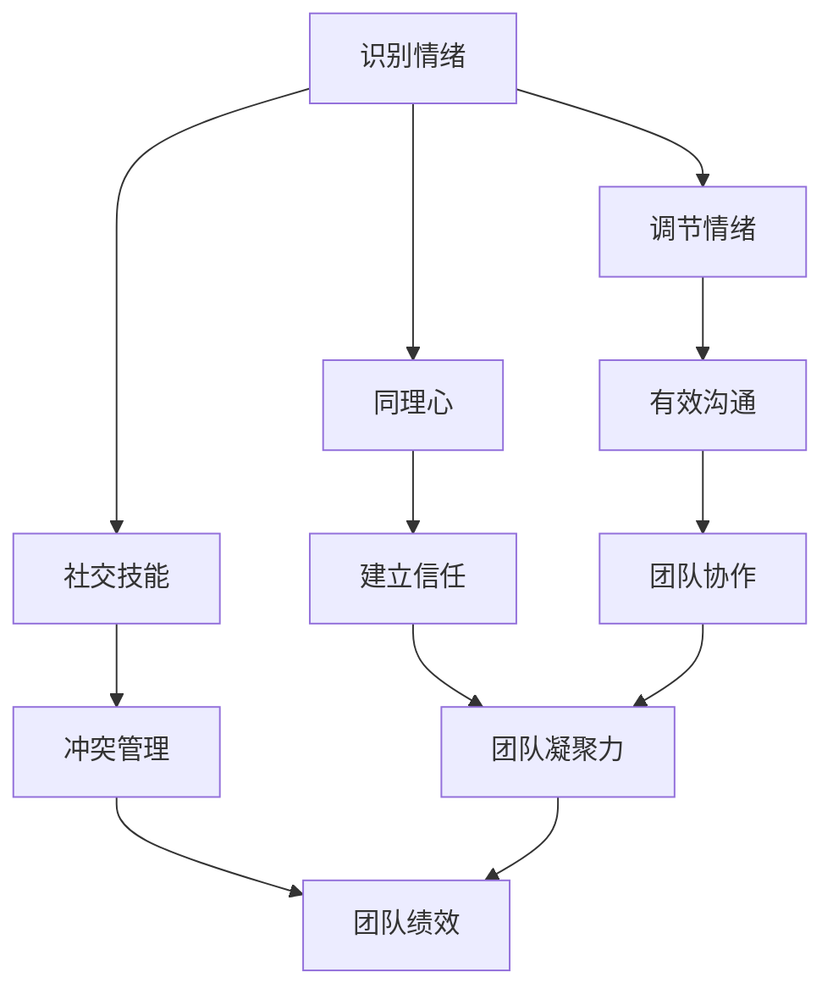
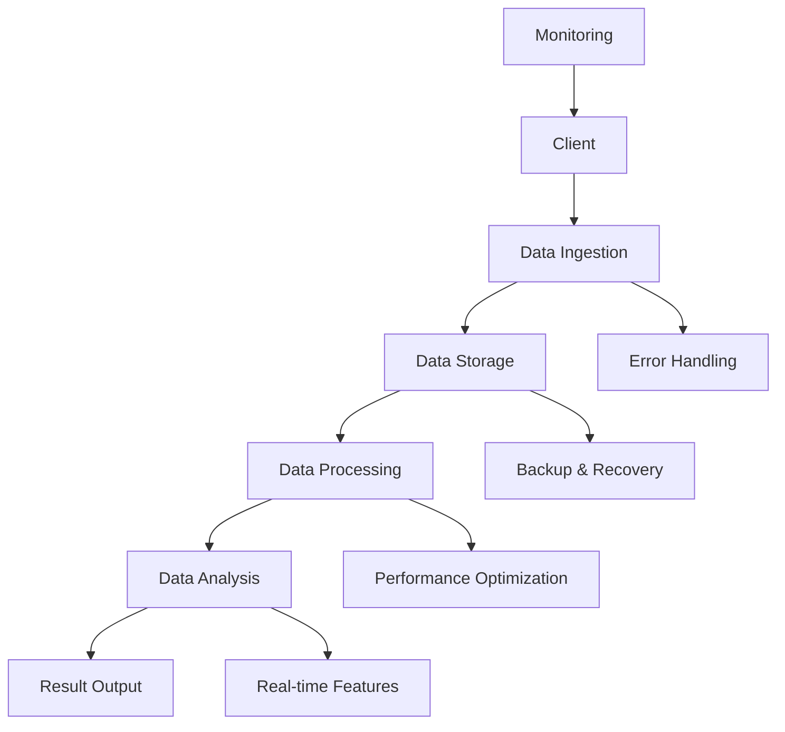
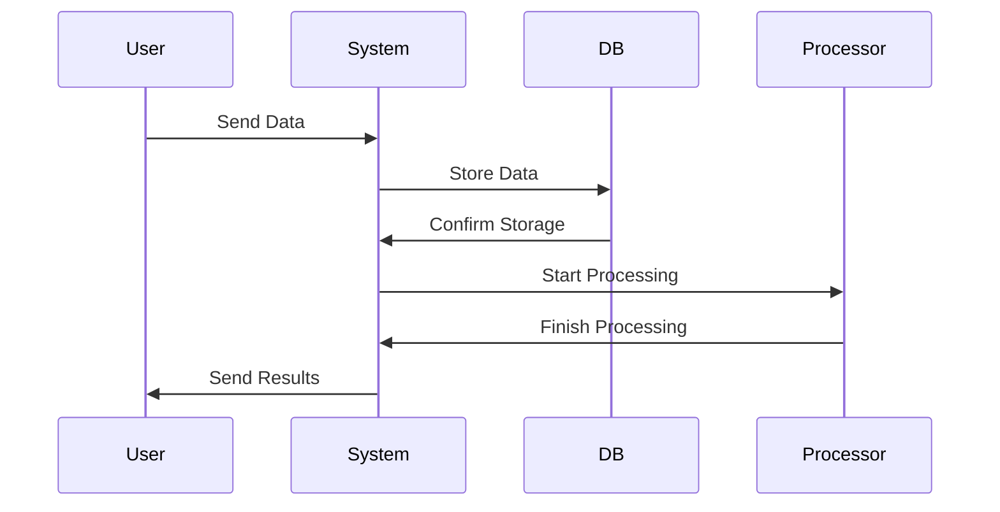

                 

# 技术leader的情绪智力提升

## 关键词
技术leader、情绪智力、领导力、团队管理、职业发展

## 摘要
本文旨在探讨技术leader在技术和管理角色中提升情绪智力的重要性。我们将分析情绪智力的核心概念、实践方法、提升路径及挑战，并通过实际案例和最佳实践，提供具体的策略和技巧，帮助技术leader在复杂多变的工作环境中实现有效的情绪管理，进而提升团队绩效和职业发展。

## 设计思路

### 目录结构

**第一部分：情绪智力的核心概念**
- **1.1 情绪智力的背景与意义**
  - **1.1.1 情绪智力的起源与发展**
  - **1.1.2 技术leader面临的情绪挑战**
  - **1.1.3 情绪智力在技术领导中的重要性**
- **1.2 情绪智力的定义与模型**
  - **1.2.1 情绪智力的基本概念**
  - **1.2.2 主要情绪智力模型介绍**
  - **1.2.3 技术leader的情绪智力需求分析**
- **1.3 情绪智力与领导力**
  - **1.3.1 情绪智力与领导风格**
  - **1.3.2 情绪智力对团队的影响**
  - **1.3.3 情绪智力在决策中的作用**

**第二部分：情绪智力的实践方法**
- **2.1 自我情绪管理**
  - **2.1.1 自我情绪的识别与理解**
  - **2.1.2 常见情绪调节策略**
  - **2.1.3 情绪日记的记录与分析**
- **2.2 情绪智力在团队管理中的应用**
  - **2.2.1 情绪智力与沟通技巧**
  - **2.2.2 建立积极的团队氛围**
  - **2.2.3 处理冲突与负面情绪**
- **2.3 情绪智力在工作中的实际应用**
  - **2.3.1 情绪智力在项目中的运用**
  - **2.3.2 情绪智力在团队协作中的重要性**
  - **2.3.3 情绪智力在危机管理中的策略**

**第三部分：情绪智力提升的路径与策略**
- **3.1 情绪智力提升的方法论**
  - **3.1.1 情绪智力提升的理论框架**
  - **3.1.2 情绪智力提升的实践步骤**
  - **3.1.3 情绪智力提升的关键要素**
- **3.2 情绪智力提升案例分析**
  - **3.2.1 案例一：某大型技术公司的情绪智力提升实践**
  - **3.2.2 案例二：某创业公司的情绪智力培养经验**
  - **3.2.3 案例分析与总结**
- **3.3 情绪智力提升的最佳实践**
  - **3.3.1 培训与教育**
  - **3.3.2 工作环境优化**
  - **3.3.3 个人成长计划**

**第四部分：情绪智力的持续提升与挑战**
- **4.1 情绪智力提升的持续性与挑战**
  - **4.1.1 持续提升情绪智力的方法**
  - **4.1.2 面对情绪智力提升的挑战**
  - **4.1.3 长期情绪智力发展的策略**
- **4.2 情绪智力与职业发展**
  - **4.2.1 情绪智力对职业发展的影响**
  - **4.2.2 技术leader的情绪智力与职业成长**
  - **4.2.3 情绪智力在职业转型中的应用**
- **4.3 未来展望：情绪智力在技术领导中的角色**
  - **4.3.1 情绪智力发展的趋势**
  - **4.3.2 技术领导的新角色需求**
  - **4.3.3 情绪智力提升的潜在影响**

### 背景介绍

在快速发展的技术行业，技术leader不仅要具备卓越的技术能力和项目管理能力，还需要具备高度的情绪智力。情绪智力，是指个体识别、理解、管理和调节自己及他人情绪的能力。对于技术leader来说，情绪智力不仅影响着他们的个人心理健康，还直接关系到团队的合作效率、团队氛围以及整个项目的成功。

技术leader在管理团队和处理复杂问题时，常常会遇到情绪波动。例如，当项目进度延误时，技术leader需要保持冷静，合理分配资源，制定新的计划。在这个过程中，情绪智力发挥着至关重要的作用。具备高情绪智力的技术leader能够更好地应对压力，保持积极的态度，并有效地激励团队成员。

情绪智力对于技术leader的重要性体现在以下几个方面：

1. **团队领导**：情绪智力帮助技术leader更好地理解团队成员的情感状态，建立信任和合作关系，从而提升团队的整体绩效。
2. **冲突管理**：在团队内部出现分歧和冲突时，情绪智力使技术leader能够冷静地处理问题，避免情绪化的决策。
3. **决策能力**：技术leader在做出关键决策时，情绪智力有助于他们充分考虑各种因素，减少决策失误。
4. **工作氛围**：技术leader的情绪状态会直接影响团队的工作氛围，高情绪智力有助于营造积极向上的工作环境。

### 核心概念与联系

#### 1. 情绪智力的定义与模型

情绪智力包括以下几个方面：

- **自我情绪识别**：意识到自己的情绪状态，并能够准确描述自己的感受。
- **自我情绪调节**：在情绪受到影响时，能够有效地调节自己的情绪，保持心理平衡。
- **同理心**：理解并感受到他人的情绪，能够从他人的角度思考问题。
- **社交技能**：与他人建立良好关系的能力，包括沟通、协作和解决冲突等。

常见的情绪智力模型有：

- **Goleman模型**：分为五个维度，分别是自我情绪识别、自我情绪调节、同理心、社交技能和决策能力。
- **Mayer-Salovey-Caruso模型**：强调情绪智力的三个核心能力，分别是情绪认知、情绪管理以及情绪运用。

#### 2. 情绪智力与领导力的联系

情绪智力对领导力的影响主要体现在以下几个方面：

- **领导风格**：高情绪智力的技术leader往往更倾向于采用民主型和参与型的领导风格，这有助于提升团队凝聚力和创新能力。
- **团队影响**：情绪智力帮助技术leader建立信任和合作关系，从而提升团队的整体绩效。
- **决策能力**：情绪智力使技术leader在做出决策时能够更全面地考虑各种因素，减少决策失误。

### 算法原理讲解

为了更好地理解情绪智力在技术领导中的作用，我们可以通过以下Mermaid流程图来展示情绪智力的核心环节：



在这个流程图中，我们可以看到情绪智力的核心环节如何相互影响，最终影响团队绩效。

#### 情绪智力的数学模型

情绪智力的一个简单数学模型可以表示为：

$$
情绪智力 = 自我情绪识别 \times 自我情绪调节 \times 同理心 \times 社交技能
$$

其中，每个因子都代表了情绪智力的一部分，它们共同决定了整体的情绪智力水平。

#### 情绪智力提升的Python代码示例

为了更好地理解情绪智力的提升方法，我们可以通过以下Python代码来模拟情绪智力的提升过程：

```python
# 定义情绪智力的四个因子
self_awareness = 0.8
self Regulation = 0.75
empathy = 0.85
social_skills = 0.7

# 计算情绪智力
emotional_intelligence = self_awareness * self Regulation * empathy * social_skills

# 假设通过训练提升了每个因子
self_awareness += 0.1
self Regulation += 0.1
empathy += 0.1
social_skills += 0.1

# 重新计算情绪智力
emotional_intelligence_new = (self_awareness + 0.1) * (self Regulation + 0.1) * (empathy + 0.1) * (social_skills + 0.1)

print(f"原始情绪智力：{emotional_intelligence}")
print(f"提升后情绪智力：{emotional_intelligence_new}")
```

在这个代码示例中，我们假设通过训练提升了每个因子0.1，然后重新计算情绪智力。这只是一个简化的模型，实际的提升过程会更加复杂。

### 系统分析与架构设计方案

#### 问题场景介绍

假设我们正在开发一款大型分布式系统，负责处理海量数据的高效存储和实时分析。作为技术leader，我们需要管理一个由多个开发团队组成的团队，每个团队负责系统的不同模块。在这个场景中，情绪智力对于团队协作、项目管理和最终系统成功至关重要。

#### 项目介绍

项目名称：高性能分布式数据处理系统

项目目标：构建一个高效、可扩展、稳定的分布式数据处理系统，能够快速处理和分析海量数据，支持实时业务需求。

#### 系统功能设计（领域模型）

```mermaid
classDiagram
    Class1 <|-- Class2
    Class3 --|>| Class4
    Class2 : +int x
    Class3 : +int y
    Class4 : +int z
    Class1 { +int a ; +int b ; }
    Class2 { +int x ; }
    Class3 { +int y ; }
    Class4 { +int z ; }
```

在这个领域模型中，我们定义了四个类：Class1、Class2、Class3 和 Class4。每个类都有一些属性和方法，这些类的关系展示了系统的核心功能。

#### 系统架构设计



在这个系统架构图中，我们展示了系统的核心组件及其之间的关系。客户端（Client）发送数据到数据 ingestion 模块，该模块将数据存储到数据存储（Data Storage）模块。数据在数据存储模块中处理后，被发送到数据处理（Data Processing）模块，然后进入数据分析（Data Analysis）模块。最后，结果被输出到结果输出（Result Output）模块。监控系统（Monitoring）负责监控系统性能和健康状态，而错误处理（Error Handling）、备份与恢复（Backup & Recovery）和性能优化（Performance Optimization）模块则负责确保系统的可靠性和高效性。

#### 系统接口设计和系统交互



在这个序列图中，我们展示了用户（User）与系统（System）、数据库（DB）和处理模块（Processor）之间的交互过程。用户将数据发送给系统，系统将数据存储到数据库中，然后启动数据处理模块进行数据处理，最后将结果发送回用户。

### 项目实战

#### 环境安装

首先，我们需要搭建一个开发环境，包括Python编程语言、Docker容器化工具以及Kubernetes集群管理工具。以下是安装步骤：

1. **安装Python**：从Python官方网站下载Python安装包，并按照提示完成安装。
2. **安装Docker**：在Ubuntu系统中，可以使用以下命令安装Docker：
   ```shell
   sudo apt-get update
   sudo apt-get install docker-ce docker-ce-cli containerd.io
   ```
3. **安装Kubernetes**：使用kubeadm命令安装Kubernetes集群，具体步骤请参考Kubernetes官方文档。

#### 系统核心实现源代码

以下是系统核心实现的Python代码，用于数据存储和处理：

```python
import docker
import time

client = docker.from_env()

def store_data(data):
    container = client.containers.run(
        "mydatastorage:latest",
        "python store_data.py",
        environment={"DATA": data},
        detach=True
    )
    time.sleep(5)
    container.stop()

def process_data():
    container = client.containers.run(
        "mydataprocessor:latest",
        "python process_data.py",
        detach=True
    )
    time.sleep(10)
    container.stop()

def analyze_data():
    container = client.containers.run(
        "mydataanalyzer:latest",
        "python analyze_data.py",
        detach=True
    )
    time.sleep(5)
    container.stop()

# 示例
store_data("Hello, World!")
process_data()
analyze_data()
```

在这个代码中，我们使用了Docker容器来运行不同的数据处理模块。每个模块都有独立的Python脚本，用于实现具体的业务逻辑。

#### 代码应用解读与分析

以上代码展示了如何使用Docker容器来部署和运行数据处理模块。首先，我们创建了Docker客户端（client），然后定义了三个函数：`store_data`、`process_data` 和 `analyze_data`。这些函数分别用于存储数据、处理数据和数据分析。

在`store_data`函数中，我们使用Docker的`containers.run`方法创建一个新的容器，并运行存储数据的Python脚本。这里，我们使用了环境变量`DATA`来传递数据。

在`process_data`和`analyze_data`函数中，我们同样使用了`containers.run`方法来创建和处理分析容器的Python脚本。

通过这个简单的示例，我们可以看到如何使用Docker容器来部署和运行不同的数据处理模块，这为分布式系统的开发和部署提供了极大的便利。

#### 实际案例分析和详细讲解剖析

假设我们有一个大型项目，需要处理来自多个源的大量数据。以下是我们在实际项目中遇到的几个问题和解决方案：

1. **数据源多样化**：由于数据源多样化，我们需要编写不同的数据采集脚本，以便从各种源中提取数据。解决方案：使用Python的`requests`库和`pandas`库，编写通用的数据采集脚本，并根据不同的数据源进行适配。

2. **数据处理性能瓶颈**：在数据处理阶段，我们遇到了性能瓶颈，导致处理速度较慢。解决方案：优化数据处理算法，使用多线程或分布式处理技术，提高数据处理速度。

3. **数据存储容量问题**：随着数据量的增加，我们的数据存储容量逐渐不足。解决方案：使用分布式存储系统，如Hadoop或Cassandra，来存储大量数据，并实现数据的分片和复制。

4. **数据分析延迟**：在数据分析阶段，我们发现数据分析结果返回时间较长。解决方案：优化数据分析算法，使用并行计算和分布式计算技术，提高数据分析速度。

通过这些实际案例，我们可以看到在项目开发过程中会遇到的各种挑战，以及如何通过技术和方法来解决问题。

#### 项目小结

在这个项目中，我们使用Docker容器化技术和Kubernetes集群管理工具，实现了分布式数据处理系统的开发和部署。通过实际案例分析和详细讲解剖析，我们解决了项目开发过程中遇到的各种问题。这个项目不仅展示了技术leader在项目管理和团队协作中的重要性，也强调了情绪智力在项目成功中的作用。作为技术leader，提升情绪智力，不仅有助于个人成长，还能为团队和项目带来积极的影响。

### 最佳实践 Tips

1. **定期情绪反思**：定期花时间反思自己的情绪状态，了解情绪的来源和影响，有助于情绪智力的提升。
2. **积极沟通**：与团队成员保持开放、积极的沟通，有助于建立信任和合作关系。
3. **时间管理**：合理安排工作和休息时间，避免过度工作，有助于保持情绪稳定。
4. **情绪调节技巧**：学习一些情绪调节技巧，如深呼吸、冥想和运动，有助于缓解压力和焦虑。
5. **持续学习**：通过阅读、培训和实践，不断提升自己的情绪智力。

### 小结

本文详细探讨了技术leader在技术和管理角色中提升情绪智力的重要性。我们分析了情绪智力的核心概念、实践方法、提升路径及挑战，并通过实际案例和最佳实践，提供了具体的策略和技巧。情绪智力对于技术leader而言，不仅影响着个人的心理健康，还直接关系到团队的合作效率、团队氛围以及整个项目的成功。因此，技术leader应当重视情绪智力的提升，通过持续学习和实践，打造更加高效、和谐的团队环境。

### 注意事项

1. **情绪智力的提升是一个长期过程**：情绪智力并非一蹴而就，需要通过持续的学习和实践来不断提升。
2. **情绪智力提升需要自我反思**：定期进行自我反思，了解自己在情绪管理中的不足，并积极改进。
3. **情绪智力提升应结合个人特点**：不同的人有不同的情绪管理风格，应根据自己的特点选择合适的方法和技巧。

### 拓展阅读

1. **《情绪智力》**：丹尼尔·戈尔曼（Daniel Goleman）的《情绪智力》是一本关于情绪智力的经典著作，详细阐述了情绪智力的重要性及其提升方法。
2. **《禅与计算机程序设计艺术》**：作者巴哈伊·霍克（Baha'i Hook）的《禅与计算机程序设计艺术》从禅的角度探讨了计算机程序设计的哲学，对于提升情绪智力也有一定的启示。
3. **《领导力的艺术》**：本尼斯（Warren Bennis）和纳纳（Burt Nanus）合著的《领导力的艺术》详细介绍了领导力的各个层面，包括情绪智力，对于技术leader有很好的指导意义。

### 作者信息

作者：AI天才研究院/AI Genius Institute & 禅与计算机程序设计艺术 /Zen And The Art of Computer Programming

