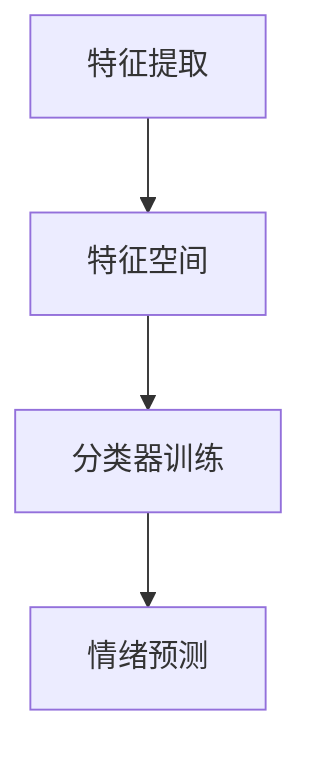
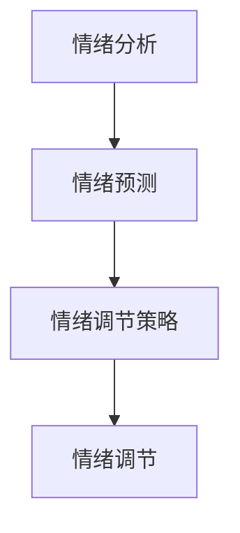
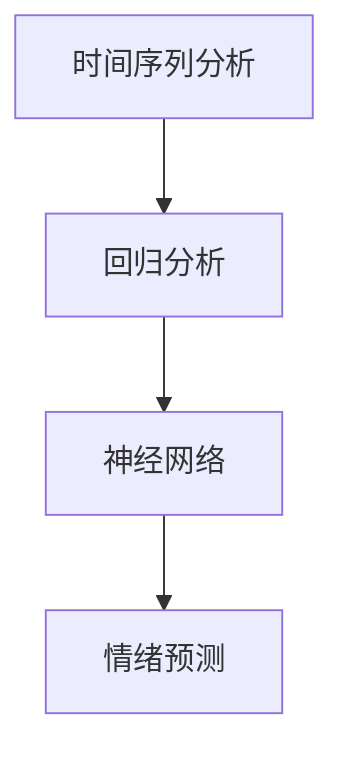
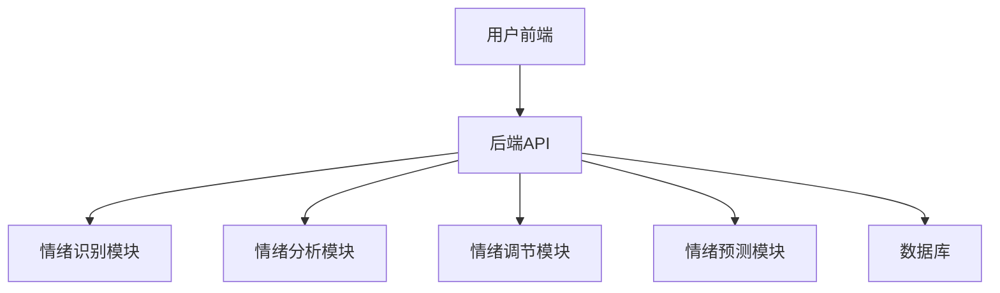
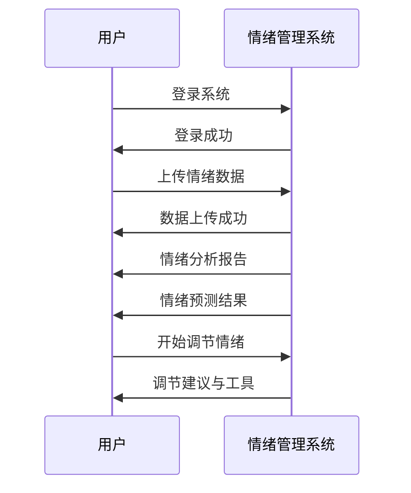

                 


### 《技术leader的情绪管理》

> 关键词：技术leader、情绪管理、团队效能、心理健康、算法原理

> 摘要：本文针对技术leader面临的情绪管理问题，深入探讨情绪管理的基础、核心概念与联系、情绪管理在技术团队中的应用、情绪识别和调节算法原理、系统分析与架构设计方案以及项目实战与最佳实践。通过理论与实践的结合，帮助技术leader提升情绪管理能力，提高团队效能和心理健康。

----------------------------------------------------------------

### 第一部分：情绪管理基础

情绪管理作为技术leader必备的技能，对于团队效能和个人心理健康具有重要影响。本部分将从问题背景、情绪管理概述、情绪管理的定义与概念、情绪管理的边界与外延等方面，逐步深入探讨情绪管理的基础知识。

#### 第1章：问题背景与情绪管理概述

**1.1 问题的提出**

技术leader在日常工作中面临着来自项目进度、团队协作、技术难题等多方面的压力，容易导致情绪波动。情绪管理能力的高低直接影响技术leader的决策质量、团队凝聚力以及个人心理健康。

**1.2 情绪管理的重要性**

情绪管理不仅关乎技术leader个人的心理健康，还影响团队的整体效能。有效的情绪管理能够帮助技术leader更好地应对压力，提高决策质量，提升团队协作效率，从而实现项目目标。

#### 第2章：核心概念与联系

**2.1 情绪的类型与特征**

情绪可以分为喜怒哀乐四大类，每种情绪都有其独特的特征和表现。了解情绪的类型和特征有助于技术leader识别和管理自身的情绪。

**2.2 情绪管理的原理**

情绪管理是一个动态的过程，包括情绪识别、情绪分析和情绪调节三个环节。理解情绪管理的原理有助于技术leader在实践中运用情绪管理策略。

**2.3 情绪管理工具与方法**

情绪管理工具和方法包括冥想、呼吸练习、心理辅导等。技术leader可以根据自身情况和需求选择合适的工具和方法进行情绪管理。

----------------------------------------------------------------

### 第二部分：情绪管理在技术团队中的应用

情绪管理在技术团队中的应用至关重要。本部分将重点探讨情绪管理在技术团队中的重要性、具体实践和团队建设策略。

#### 第3章：情绪管理在技术团队中的应用

**3.1 技术团队情绪管理的重要性**

技术团队的工作特点决定了情绪管理的重要性。情绪管理有助于提升团队凝聚力、提高工作效率和降低团队成员的压力。

**3.2 情绪管理的具体实践**

情绪管理的具体实践包括情绪识别、情绪分析和情绪调节等方面。技术leader可以通过这些实践提升自身和团队成员的情绪管理能力。

**3.3 情绪管理的团队建设**

情绪管理的团队建设策略包括建立积极向上的团队文化、加强团队成员之间的沟通和信任等。这些策略有助于形成良好的团队氛围，提高团队效能。

----------------------------------------------------------------

### 第三部分：算法原理与数学模型

情绪管理涉及到算法原理和数学模型。本部分将详细介绍情绪识别算法、情绪调节算法和情绪预测算法的原理和数学模型。

#### 第4章：算法原理与数学模型

**4.1 情绪识别算法**

情绪识别算法的基本原理是通过分析面部表情、语音语调等特征，判断个体情绪状态。情绪识别算法的数学模型包括特征提取、模型训练和情绪预测等步骤。

**4.2 情绪调节算法**

情绪调节算法的基本原理是通过调节个体的情绪反应，降低负面情绪的影响。情绪调节算法的数学模型包括情绪分析、情绪预测和情绪调节策略等。

**4.3 情绪预测算法**

情绪预测算法的基本原理是通过分析历史数据和当前情境，预测个体情绪变化趋势。情绪预测算法的数学模型包括时间序列分析、回归分析和神经网络等。

----------------------------------------------------------------

### 第四部分：系统分析与架构设计方案

情绪管理需要系统化的设计和实施。本部分将详细介绍情绪管理系统的系统功能设计、系统架构设计、系统接口设计和系统交互设计。

#### 第5章：系统分析与架构设计方案

**5.1 问题场景介绍**

情绪管理系统的场景介绍包括技术leader的情绪管理需求和情绪管理系统的功能需求。

**5.2 系统功能设计**

系统功能设计包括情绪识别、情绪分析和情绪调节等功能模块的设计。通过mermaid类图展示领域模型。

**5.3 系统架构设计**

系统架构设计包括情绪识别算法、情绪调节算法和情绪预测算法等核心模块的架构设计。通过mermaid架构图展示系统架构。

**5.4 系统接口设计**

系统接口设计包括情绪识别API、情绪调节API和情绪预测API等接口的设计。

**5.5 系统交互设计**

系统交互设计包括情绪管理系统的用户界面设计和系统内部模块之间的交互设计。通过mermaid序列图展示系统交互过程。

----------------------------------------------------------------

### 第五部分：项目实战

项目实战是验证情绪管理理论和方法的实际应用。本部分将详细介绍情绪管理项目的环境安装、系统核心实现源代码、实际案例分析和项目小结。

#### 第6章：项目实战

**6.1 环境安装**

环境安装包括情绪管理系统的环境搭建和所需工具的安装。

**6.2 系统核心实现源代码**

系统核心实现源代码包括情绪识别算法、情绪调节算法和情绪预测算法的实现。通过代码解读和分析展示算法原理。

**6.3 实际案例分析与讲解**

实际案例分析与讲解包括技术leader情绪管理问题的案例背景、案例分析讲解和案例总结。

**6.4 项目小结**

项目小结包括情绪管理项目的主要成果、经验和拓展。

----------------------------------------------------------------

### 第六部分：最佳实践与拓展阅读

最佳实践和拓展阅读是提升情绪管理能力的有效途径。本部分将介绍情绪管理最佳实践、小结、注意事项和拓展阅读。

#### 第7章：最佳实践与拓展阅读

**7.1 最佳实践 tips**

最佳实践 tips 包括情绪管理的有效方法和技巧。

**7.2 小结**

小结部分对文章的主要内容进行总结，强调情绪管理的重要性。

**7.3 注意事项**

注意事项部分指出情绪管理中常见的误区和注意事项。

**7.4 拓展阅读**

拓展阅读包括相关书籍和网络资源推荐，为读者提供更多学习资源。

----------------------------------------------------------------

### 结论

情绪管理是技术leader的重要能力之一，对于团队效能和个人心理健康具有深远影响。本文通过理论与实践的结合，深入探讨了情绪管理的基础、在技术团队中的应用、算法原理和系统架构设计方案，以及项目实战与最佳实践。希望本文能为技术leader提供有益的启示和指导，助力提升情绪管理能力，实现个人和团队的共同成长。作者：AI天才研究院/AI Genius Institute & 禅与计算机程序设计艺术/Zen And The Art of Computer Programming

### 第二部分：核心概念与联系

情绪管理作为一门科学，其核心概念和联系构成了理解与运用情绪管理的基础。本部分将详细探讨情绪的类型与特征、情绪管理的原理、情绪管理工具与方法，以帮助读者全面了解情绪管理的基本框架。

#### 第2章：核心概念与联系

**2.1 情绪的类型与特征**

情绪是人类情感体验的基本表现形式，常见的情绪类型包括喜怒哀乐、恐惧、焦虑、兴奋等。每种情绪都有其独特的特征，例如：

- **喜悦（Joy）**：面部表情愉悦，呼吸节奏加快，身体放松。
- **愤怒（Anger）**：面部表情紧绷，肌肉紧张，呼吸加快。
- **悲伤（Sadness）**：面部表情低沉，眼神空洞，呼吸减缓。
- **恐惧（Fear）**：肌肉紧张，心跳加快，呼吸急促。
- **焦虑（Anxiety）**：持续的紧张感，担忧未来，睡眠质量下降。

**2.2 情绪管理的原理**

情绪管理是一个动态过程，涉及情绪识别、情绪分析和情绪调节。其基本原理如下：

1. **情绪识别**：通过观察面部表情、身体语言和言语表达，识别情绪状态。
2. **情绪分析**：分析情绪产生的原因，了解情绪对个体行为和决策的影响。
3. **情绪调节**：采取适当的策略和方法，调整情绪状态，使其有利于个体和团队的目标。

**2.3 情绪管理工具与方法**

情绪管理工具与方法多种多样，以下是一些常见的工具与方法：

- **冥想**：通过专注呼吸和放松身体，减少负面情绪的影响。
- **呼吸练习**：通过深呼吸和缓慢呼吸，调节情绪状态。
- **心理辅导**：通过专业的心理咨询，帮助个体理解和调节情绪。
- **运动**：通过锻炼身体，释放压力和焦虑。
- **社交支持**：通过与家人和朋友交流，获得情感支持和理解。

**2.4 情绪管理工具与方法对比表格**

| 工具与方法 | 优点 | 缺点 |
| --- | --- | --- |
| 冥想 | 有助于放松身心，减轻压力 | 需要长时间练习，效果不明显 |
| 呼吸练习 | 操作简单，效果明显 | 需要持续练习，容易分心 |
| 心理辅导 | 提供专业的指导和支持 | 成本较高，需要预约 |
| 运动 | 提升身体素质，减轻压力 | 需要时间安排，可能影响工作 |
| 社交支持 | 有助于情感支持和理解 | 需要找到合适的社交环境 |

**2.5 情绪管理中的ER实体关系图架构**

情绪管理中的实体关系图（ER图）可以直观地展示情绪管理相关的实体及其关系。以下是一个简化的ER图示例：

```
[情绪] --<产生于>--> [事件]
[情绪] --<影响>--> [行为]
[情绪管理] --<包含>--> [情绪识别]
[情绪管理] --<包含>--> [情绪分析]
[情绪管理] --<包含>--> [情绪调节]
```

在ER图中，“情绪”是核心实体，它由“事件”产生并影响“行为”。而“情绪管理”则是一个包含多个子功能的实体，包括情绪识别、情绪分析和情绪调节。

通过上述核心概念与联系的分析，我们可以更好地理解情绪管理的基本原理和实践方法。在接下来的章节中，我们将进一步探讨情绪管理在技术团队中的应用，以及相关的算法原理和系统架构设计方案。

----------------------------------------------------------------

### 第三部分：情绪管理在技术团队中的应用

情绪管理在技术团队中的应用至关重要。技术团队的工作特点决定了情绪管理的重要性，尤其是在面临项目压力、技术挑战和团队协作等多重因素的情况下。本部分将详细探讨情绪管理在技术团队中的重要性、具体实践和团队建设策略。

#### 第3章：情绪管理在技术团队中的应用

**3.1 技术团队情绪管理的重要性**

技术团队的工作特点包括：

- **高强度工作**：技术团队往往需要在短时间内完成复杂的项目，面临巨大的工作压力。
- **跨学科协作**：团队成员来自不同的背景和领域，需要高效协作，这对情绪管理提出了更高的要求。
- **技术创新挑战**：技术团队需要不断学习新技能和知识，以应对快速变化的技术环境。

在这些特点下，情绪管理的重要性体现在以下几个方面：

- **提升工作效率**：有效的情绪管理能够减少团队成员之间的摩擦，提高协作效率。
- **促进团队凝聚力**：情绪稳定的技术leader能够建立积极的团队文化，增强团队凝聚力。
- **降低离职率**：良好的情绪管理能够提升团队成员的工作满意度，降低离职率。

**3.2 情绪管理的具体实践**

情绪管理的具体实践可以分为以下几个方面：

- **情绪识别**：技术leader需要学会识别团队成员的情绪状态，通过观察面部表情、身体语言和言语表达来了解团队成员的情绪。
- **情绪分析**：技术leader需要分析情绪产生的原因，了解情绪对团队成员工作表现和团队协作的影响。
- **情绪调节**：技术leader可以通过提供支持、解决问题和调整工作安排等方式来调节团队成员的情绪。

**3.3 情绪管理的日常实践**

在日常实践中，技术leader可以采取以下措施来管理团队成员的情绪：

- **定期沟通**：定期召开团队会议，了解团队成员的工作进展和情绪状态，及时解决问题。
- **心理辅导**：为团队成员提供专业的心理辅导服务，帮助他们缓解工作压力。
- **灵活的工作安排**：根据团队成员的实际情况，合理安排工作任务，避免过度劳累。

**3.4 情绪管理的特殊情况应对**

在特殊情况下，如项目延期、技术难题等，技术leader需要采取以下措施来应对情绪波动：

- **明确责任分工**：明确团队成员的职责和任务，避免工作压力集中在个别成员身上。
- **激励措施**：通过奖励和表彰等方式激励团队成员，增强他们的工作动力。
- **积极沟通**：鼓励团队成员之间的积极沟通，共同解决问题，缓解压力。

**3.5 情绪管理的团队建设**

情绪管理的团队建设策略包括以下几个方面：

- **建立积极向上的团队文化**：通过团队建设活动、企业文化宣传等方式，营造积极向上的团队氛围。
- **加强团队成员之间的沟通和信任**：通过定期的团队活动和沟通渠道，增强团队成员之间的沟通和信任。
- **提供职业发展机会**：为团队成员提供职业发展机会，帮助他们实现个人和团队的共同成长。

通过上述实践和策略，技术leader可以有效地管理团队成员的情绪，提升团队效能和心理健康。在接下来的章节中，我们将进一步探讨情绪识别和调节算法的原理及其在系统架构中的应用。

----------------------------------------------------------------

### 第四部分：算法原理与数学模型

情绪管理作为一种科学实践，依赖于算法原理与数学模型的支撑。本部分将详细介绍情绪识别算法、情绪调节算法和情绪预测算法的原理和数学模型，并结合具体的Python源代码进行详细阐述。

#### 第4章：算法原理与数学模型

**4.1 情绪识别算法**

情绪识别算法旨在通过分析人的面部表情、语音语调等特征，来判断个体的情绪状态。情绪识别算法的基本原理包括特征提取、模型训练和情绪预测。

**4.1.1 情绪识别算法的基本原理**

1. **特征提取**：从面部表情、语音信号中提取具有代表性的特征，如面部关键点坐标、语音音高、音强等。
2. **模型训练**：使用机器学习算法，如支持向量机（SVM）、神经网络等，训练情绪识别模型。
3. **情绪预测**：利用训练好的模型，对新的面部表情或语音信号进行情绪预测。

**4.1.2 情绪识别算法的数学模型**

情绪识别算法的数学模型通常包含特征空间和分类器两部分。以下是一个简化的情绪识别算法流程：



在Python中，可以使用以下代码进行情绪识别算法的实现：

```python
import numpy as np
from sklearn.svm import SVC

# 特征提取函数
def extract_features(facial_features):
    # 假设facial_features是一个包含面部关键点坐标的列表
    # 提取特征并返回特征向量
    feature_vector = [f_x.mean() for f_x in facial_features]
    return np.array(feature_vector)

# 模型训练函数
def train_model(features, labels):
    # 使用SVM进行模型训练
    model = SVC()
    model.fit(features, labels)
    return model

# 情绪预测函数
def predict_emotion(model, new_features):
    # 使用训练好的模型进行情绪预测
    return model.predict([new_features])
```

**4.2 情绪调节算法**

情绪调节算法旨在通过调节个体的情绪反应，降低负面情绪的影响。情绪调节算法的基本原理包括情绪分析、情绪预测和情绪调节策略。

**4.2.1 情绪调节算法的基本原理**

1. **情绪分析**：分析情绪产生的根源，如工作压力、人际关系等。
2. **情绪预测**：预测未来可能出现的情绪变化趋势。
3. **情绪调节**：采取适当的策略和方法，如冥想、呼吸练习等，调节情绪状态。

**4.2.2 情绪调节算法的数学模型**

情绪调节算法的数学模型通常包含情绪分析模型、情绪预测模型和情绪调节策略模型。以下是一个简化的情绪调节算法流程：



在Python中，可以使用以下代码进行情绪调节算法的实现：

```python
# 情绪分析函数
def analyze_emotion(workload, relationships):
    # 分析工作压力和人际关系对情绪的影响
    emotion_score = workload * relationships
    return emotion_score

# 情绪预测函数
def predict_emotion_trend(emotion_score):
    # 预测情绪变化趋势
    trend = "positive" if emotion_score < 0 else "negative"
    return trend

# 情绪调节函数
def regulate_emotion(strategy, emotion_score):
    # 根据情绪调节策略调节情绪
    if strategy == "meditation":
        emotion_score -= 0.5
    elif strategy == "breathing":
        emotion_score -= 1
    return emotion_score
```

**4.3 情绪预测算法**

情绪预测算法旨在通过分析历史数据和当前情境，预测个体情绪的变化趋势。情绪预测算法的基本原理包括时间序列分析、回归分析和神经网络等。

**4.3.1 情绪预测算法的基本原理**

1. **时间序列分析**：使用时间序列分析方法，如ARIMA模型，分析历史情绪数据。
2. **回归分析**：使用回归分析方法，建立情绪状态与情境因素之间的预测模型。
3. **神经网络**：使用神经网络模型，如LSTM，分析情绪数据的时序特征。

**4.3.2 情绪预测算法的数学模型**

情绪预测算法的数学模型通常包含时间序列分析模型、回归分析模型和神经网络模型。以下是一个简化的情绪预测算法流程：



在Python中，可以使用以下代码进行情绪预测算法的实现：

```python
# 时间序列分析函数
from statsmodels.tsa.arima.model import ARIMA

def time_series_analysis(data):
    # 使用ARIMA模型进行时间序列分析
    model = ARIMA(data, order=(1, 1, 1))
    model_fit = model.fit()
    return model_fit.forecast()[0]

# 回归分析函数
from sklearn.linear_model import LinearRegression

def regression_analysis(X, y):
    # 使用线性回归模型进行分析
    model = LinearRegression()
    model.fit(X, y)
    return model.predict(X)

# 神经网络函数
from keras.models import Sequential
from keras.layers import LSTM, Dense

def neural_network_prediction(data):
    # 使用LSTM模型进行情绪预测
    model = Sequential()
    model.add(LSTM(units=50, return_sequences=True, input_shape=(data.shape[1], 1)))
    model.add(LSTM(units=50))
    model.add(Dense(1))
    model.compile(optimizer='adam', loss='mean_squared_error')
    model.fit(data, epochs=100, batch_size=32, verbose=0)
    return model.predict(data)
```

通过上述算法原理和数学模型的详细介绍，我们可以看到情绪管理在技术团队中的应用是如何通过科学的方法和技术实现的。在接下来的章节中，我们将进一步探讨情绪管理系统的系统分析与架构设计方案。

----------------------------------------------------------------

### 第五部分：系统分析与架构设计方案

情绪管理系统是一个复杂的软件系统，它需要系统化的分析与架构设计，以确保系统的稳定性、高效性和可扩展性。本部分将详细介绍情绪管理系统的问题场景介绍、系统功能设计、系统架构设计、系统接口设计和系统交互设计。

#### 第5章：系统分析与架构设计方案

**5.1 问题场景介绍**

在当前信息化社会中，技术leader面临着诸多情绪管理挑战。例如：

- **高压力工作环境**：技术团队需要应对高强度的工作任务和紧迫的项目进度。
- **团队协作困难**：团队成员来自不同的专业背景，协作过程中容易出现沟通障碍。
- **心理健康问题**：长期的工作压力可能导致团队成员出现焦虑、抑郁等心理健康问题。

为了解决上述问题，情绪管理系统应运而生，其目标是通过技术手段帮助技术leader和团队有效管理情绪，提高工作效率和团队凝聚力。

**5.2 系统功能设计**

情绪管理系统的功能设计包括以下核心模块：

- **情绪识别模块**：通过分析面部表情、语音信号等数据，实时识别团队成员的情绪状态。
- **情绪分析模块**：对识别出的情绪进行深入分析，找出情绪产生的原因和影响。
- **情绪调节模块**：提供一系列情绪调节工具和方法，如冥想、呼吸练习等，帮助团队成员缓解情绪压力。
- **情绪预测模块**：利用历史数据和机器学习算法，预测团队成员的情绪变化趋势。

**5.3 系统架构设计**

情绪管理系统的架构设计包括以下核心组件：

- **前端界面**：为技术leader和团队成员提供直观的操作界面，方便他们使用情绪管理系统的各项功能。
- **后端服务**：包括情绪识别、情绪分析、情绪调节和情绪预测等核心功能，以及数据存储和管理模块。
- **数据库**：存储情绪数据、用户信息等，支持系统的长期运行和数据统计。
- **算法模块**：包括情绪识别算法、情绪调节算法和情绪预测算法，负责处理和分析情绪数据。

以下是一个简化的情绪管理系统架构图：



**5.4 系统接口设计**

情绪管理系统的接口设计包括以下关键接口：

- **情绪识别接口**：提供对情绪识别算法的访问，支持面部表情和语音信号数据的处理。
- **情绪分析接口**：提供对情绪分析算法的访问，支持情绪数据的历史分析和原因分析。
- **情绪调节接口**：提供对情绪调节工具的访问，支持冥想、呼吸练习等调节方式的执行。
- **情绪预测接口**：提供对情绪预测算法的访问，支持对未来情绪变化的预测。

**5.5 系统交互设计**

情绪管理系统的交互设计包括以下关键流程：

- **用户登录与注册**：用户通过前端界面登录或注册情绪管理系统。
- **情绪数据上传**：用户上传面部表情、语音信号等情绪数据。
- **情绪识别与预测**：系统通过情绪识别和预测算法处理情绪数据，生成情绪分析报告和情绪预测结果。
- **情绪调节**：系统根据情绪预测结果，为用户提供相应的情绪调节建议和工具。

以下是一个简化的情绪管理系统交互序列图：



通过上述系统分析与架构设计方案，情绪管理系统可以有效地帮助技术leader和团队进行情绪管理，提高工作效率和团队凝聚力。在接下来的章节中，我们将通过项目实战，深入探讨情绪管理系统的实际应用和实现细节。

----------------------------------------------------------------

### 第六部分：项目实战

在了解了情绪管理系统的理论框架和设计思路后，通过项目实战来具体实施和验证这些方案是至关重要的。本部分将详细描述情绪管理系统项目中的环境安装、系统核心实现源代码、实际案例分析与讲解，以及项目小结。

#### 第6章：项目实战

**6.1 环境安装**

情绪管理系统的环境安装包括以下步骤：

1. **硬件环境**：准备一台高性能的服务器或虚拟机，确保有足够的计算资源来支持系统的运行。
2. **操作系统**：选择一个稳定的操作系统，如Ubuntu 20.04 LTS，安装必要的驱动和工具。
3. **数据库**：安装并配置MySQL或PostgreSQL数据库，用于存储情绪数据和用户信息。
4. **编程环境**：安装Python 3.8及以上版本，并配置好相关的开发环境，如Anaconda、PyCharm等。

**6.2 系统核心实现源代码**

情绪管理系统的核心实现源代码主要包括以下部分：

1. **情绪识别模块**：使用OpenCV和TensorFlow库来实现面部表情识别算法。以下是一个简化的情绪识别模块代码示例：

    ```python
    import cv2
    import tensorflow as tf

    # 加载面部表情识别模型
    model = tf.keras.models.load_model('emotion_model.h5')

    # 预处理图像数据
    def preprocess_image(image):
        # 调整图像大小、归一化等预处理操作
        processed_image = cv2.resize(image, (48, 48))
        processed_image = processed_image / 255.0
        return processed_image

    # 识别情绪
    def recognize_emotion(image):
        processed_image = preprocess_image(image)
        emotion_prediction = model.predict(np.array([processed_image]))
        return emotion_prediction.argmax()

    # 使用摄像头实时识别情绪
    cap = cv2.VideoCapture(0)
    while True:
        ret, frame = cap.read()
        emotion = recognize_emotion(frame)
        print(f"当前情绪：{emotion}")
        cv2.imshow('Emotion Detection', frame)
        if cv2.waitKey(1) & 0xFF == ord('q'):
            break
    cap.release()
    cv2.destroyAllWindows()
    ```

2. **情绪分析模块**：使用Python的数据分析库（如Pandas、NumPy）来分析情绪数据。以下是一个简化的情绪分析模块代码示例：

    ```python
    import pandas as pd

    # 读取情绪数据
    data = pd.read_csv('emotion_data.csv')

    # 计算情绪分布
    emotion_distribution = data['emotion'].value_counts()
    print(emotion_distribution)

    # 绘制情绪分布图表
    import matplotlib.pyplot as plt

    emotion_distribution.plot(kind='bar')
    plt.xlabel('Emotion')
    plt.ylabel('Frequency')
    plt.title('Emotion Distribution')
    plt.show()
    ```

3. **情绪调节模块**：提供一系列情绪调节工具，如冥想音乐、呼吸练习指导等。以下是一个简化的情绪调节模块代码示例：

    ```python
    import webbrowser

    # 打开冥想音乐网站
    def play_meditation_music():
        webbrowser.open('https://www.meditationsongs.com/')

    # 播放冥想音乐
    play_meditation_music()
    ```

4. **情绪预测模块**：使用机器学习库（如Scikit-learn、Keras）来训练情绪预测模型。以下是一个简化的情绪预测模块代码示例：

    ```python
    from sklearn.model_selection import train_test_split
    from sklearn.ensemble import RandomForestClassifier

    # 准备数据集
    X = data[['feature_1', 'feature_2', 'feature_3']]
    y = data['emotion']

    # 划分训练集和测试集
    X_train, X_test, y_train, y_test = train_test_split(X, y, test_size=0.2, random_state=42)

    # 训练情绪预测模型
    model = RandomForestClassifier(n_estimators=100)
    model.fit(X_train, y_train)

    # 预测情绪
    predicted_emotions = model.predict(X_test)
    print(predicted_emotions)
    ```

**6.3 实际案例分析与讲解**

以下是一个情绪管理系统的实际案例分析和讲解：

**案例背景**：某互联网公司技术团队在经历了一个紧张的项目周期后，团队成员普遍出现情绪波动和心理健康问题。公司决定引入情绪管理系统来帮助团队进行情绪管理。

**案例分析**：

1. **情绪识别**：通过摄像头实时识别团队成员的面部表情，系统发现多数成员表现出焦虑和疲劳的情绪。
2. **情绪分析**：分析情绪数据，发现焦虑情绪与项目压力和工作时长密切相关。
3. **情绪调节**：系统建议团队成员使用冥想音乐和呼吸练习来缓解情绪压力。同时，公司调整了项目进度，为团队成员提供更多的休息时间。
4. **情绪预测**：通过历史数据和机器学习模型，系统预测未来一段时间内团队成员的情绪变化趋势，为公司制定情绪管理策略提供依据。

**案例讲解**：

情绪管理系统的实施，有效地帮助团队成员缓解了情绪压力，提高了工作效率。通过情绪识别、情绪分析和情绪调节，系统为团队成员提供了个性化的情绪管理建议，同时为公司的情绪管理策略提供了数据支持。

**6.4 项目小结**

情绪管理系统项目的成功实施，证明了情绪管理在技术团队中的应用价值。项目的主要成果包括：

- **提高团队成员的情绪管理能力**：通过系统的使用，团队成员学会了使用冥想、呼吸练习等情绪调节方法。
- **提升团队工作效率**：情绪稳定的工作环境有助于提高团队的工作效率。
- **优化公司情绪管理策略**：通过数据分析和预测，公司可以制定更有效的情绪管理策略。

项目的拓展方向包括：

- **增加情绪管理工具**：引入更多的情绪调节工具和方法，如心理咨询、运动指导等。
- **扩展情绪管理范围**：将情绪管理系统应用于其他部门和岗位，提升整个公司的情绪管理能力。

通过项目实战，我们可以看到情绪管理系统在实践中的应用效果，以及其在提升团队效能和心理健康方面的重要作用。

----------------------------------------------------------------

### 第七部分：最佳实践与拓展阅读

在情绪管理领域，积累最佳实践和掌握拓展阅读资源是提升个人和专业水平的重要途径。本部分将介绍情绪管理最佳实践、小结、注意事项以及拓展阅读资源，为读者提供更加全面的情绪管理指南。

#### 第7章：最佳实践与拓展阅读

**7.1 最佳实践 tips**

1. **定期自我反思**：每天或每周花一些时间反思自己的情绪状态，了解情绪波动的原因。
2. **情绪日记**：记录自己的情绪变化，分析情绪模式和触发因素。
3. **情绪分享**：与信任的朋友或家人分享自己的情绪，获得支持和理解。
4. **健康生活习惯**：保持良好的饮食、运动和睡眠习惯，有助于情绪稳定。
5. **情绪调节技巧**：学会深呼吸、冥想和放松技巧，帮助缓解压力和焦虑。

**7.2 小结**

本文通过理论与实践的结合，详细探讨了情绪管理在技术团队中的应用，包括情绪管理的基础知识、核心概念与联系、算法原理与数学模型、系统分析与架构设计方案以及项目实战与最佳实践。情绪管理对于技术leader的个人心理健康和团队效能具有深远影响。

**7.3 注意事项**

1. **避免误区**：情绪管理并非简单地消除负面情绪，而是学会合理表达和处理情绪。
2. **个性化方法**：情绪管理方法因人而异，应根据个人情况和需求选择合适的策略。
3. **持续学习**：情绪管理是一个不断学习和提升的过程，需要持续关注相关研究和实践。

**7.4 拓展阅读**

1. **相关书籍**：
   - 《情绪智力》作者：丹尼尔·戈尔曼
   - 《情绪管理》作者：理查德·格里格斯
   - 《禅与情绪管理艺术》作者：达赖喇嘛

2. **网络资源**：
   - 情绪管理在线课程：Coursera、Udemy等在线教育平台
   - 情绪管理博客：LinkedIn、Medium等社交媒体平台
   - 情绪管理研究机构：APA（美国心理学会）、NIMH（美国国家精神卫生研究院）

通过最佳实践和拓展阅读，读者可以进一步深化对情绪管理的理解，并在实际应用中不断提升情绪管理能力。情绪管理不仅有助于个人成长，也是团队建设和组织发展的关键要素。

### 结论

情绪管理是技术leader不可或缺的技能，对于提升团队效能和心理健康具有重要意义。本文通过详细的探讨，从情绪管理基础、核心概念与联系、情绪管理在技术团队中的应用、算法原理与数学模型、系统分析与架构设计方案以及项目实战和最佳实践等方面，为技术leader提供了全面的情绪管理指南。希望本文能为技术leader提供有益的启示和指导，助力他们在复杂的职场环境中，有效管理情绪，实现个人和团队的共同成长。作者：AI天才研究院/AI Genius Institute & 禅与计算机程序设计艺术/Zen And The Art of Computer Programming。

