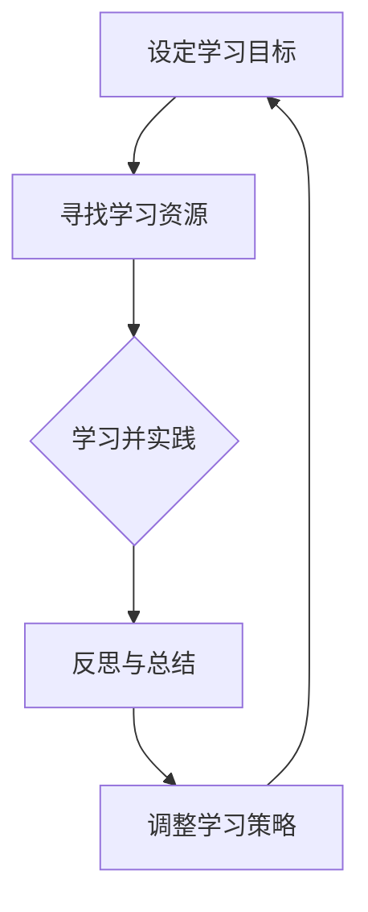
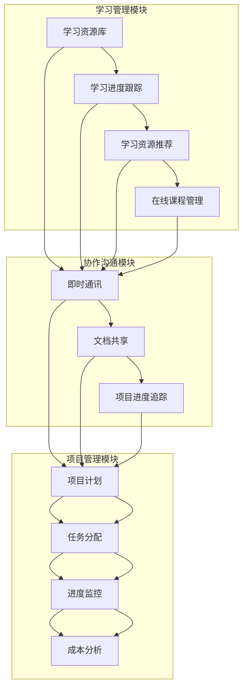
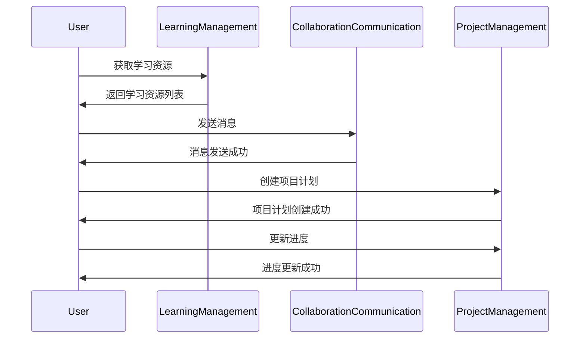

                 

# 《技术leader的持续学习与成长》

> 关键词：技术leader，持续学习，成长，领导力，职业发展

> 摘要：本文将深入探讨技术leader的持续学习与成长之道，通过分析现状、分享核心学习理念、介绍学习方法与实践、探讨成长路径与领导力提升，以及应对持续学习挑战，最后通过成功案例分享，总结出对技术leader持续学习与成长的启示。

## 引言

在当今快速发展的科技时代，技术leader的角色日益重要。他们不仅要具备深厚的专业知识和技能，还需具备出色的领导力和管理能力，以引领团队不断创新和突破。然而，技术领域的快速变革和更新，使得技术leader面临着持续学习和成长的巨大挑战。

本文将从以下七个部分展开：

1. **背景介绍**：探讨技术leader所面临的问题背景、角色定位以及持续学习的重要性。
2. **核心学习理念**：阐述主动学习、交叉学习、深度学习和终身学习等核心学习理念。
3. **学习方法与实践**：介绍时间管理、知识管理和实践项目等学习方法，并探讨反思与总结的重要性。
4. **成长路径与规划**：探讨技能提升、职业规划、成长里程碑和自我评估等成长路径与规划。
5. **领导力提升**：分析领导力模型、领导风格、团队管理和沟通技巧等方面。
6. **持续学习的挑战与应对**：探讨技术快速变化、时间压力、资源限制等挑战，并提出应对策略。
7. **成功案例分享**：通过成功案例分享，总结出对技术leader持续学习与成长的启示。

## 背景介绍

### 问题背景

技术leader在当前科技环境中扮演着至关重要的角色。他们不仅需要具备深厚的技术知识，还需具备出色的领导力和管理能力。然而，随着技术的快速发展和变革，技术leader面临着诸多挑战：

1. **知识更新速度快**：技术领域日新月异，新的技术和框架层出不穷，技术leader需要不断学习以跟上时代的步伐。
2. **团队管理难度大**：技术leader需要管理多元化、高素质的团队，并协调团队与公司其他部门之间的合作。
3. **职业发展压力**：技术leader需要在专业领域不断突破，同时也要在领导力方面不断提升，以适应更高的职位和更大的责任。

### 技术leader的角色

技术leader在企业中扮演着多重角色：

1. **技术专家**：作为团队的核心成员，技术leader需要掌握前沿技术，为企业提供技术解决方案。
2. **团队领导者**：技术leader需要具备出色的领导力，激励团队成员发挥潜力，实现团队目标。
3. **项目管理者**：技术leader需要具备项目管理的技能，确保项目按时交付，并控制项目成本和质量。

### 持续学习的重要性

持续学习对于技术leader来说至关重要：

1. **技术更新**：持续学习可以帮助技术leader掌握最新的技术趋势和框架，提高技术竞争力。
2. **领导力提升**：持续学习可以帮助技术leader提升领导力和管理能力，更好地领导团队。
3. **职业发展**：持续学习可以为技术leader的职业发展提供坚实的基础，帮助他们实现更高的职位和更大的成就。

## 核心学习理念

### 主动学习

主动学习是技术leader持续学习的重要理念。它强调学习者主动参与学习过程，而不是被动接受信息。以下是主动学习的几个关键点：

1. **设定学习目标**：技术leader需要明确自己的学习目标，确保学习方向和内容与职业发展需求相匹配。
2. **积极寻找资源**：技术leader需要主动寻找优质的学习资源，如在线课程、专业书籍、技术论坛等。
3. **实践与反思**：技术leader需要在实际工作中运用所学知识，并通过反思和总结不断提升自己的技能。

### 交叉学习

交叉学习是指通过学习不同领域的技术和知识，提高技术leader的综合素质和解决问题的能力。以下是交叉学习的几个关键点：

1. **拓展知识面**：技术leader需要不断拓展自己的知识面，了解不同领域的技术和概念。
2. **跨领域合作**：技术leader需要与不同领域的专家合作，学习他们的思维方式和解决问题的方法。
3. **综合应用**：技术leader需要将不同领域的知识和技能综合应用，解决复杂的技术问题。

### 深度学习

深度学习是技术leader提高专业素养和技能的重要途径。它强调对某一领域进行深入研究和学习，以掌握核心技术和原理。以下是深度学习的几个关键点：

1. **深入研究**：技术leader需要选择一个领域进行深入研究，掌握核心技术和原理。
2. **解决实际问题**：技术leader需要将所学知识应用到实际工作中，解决复杂的技术问题。
3. **持续更新**：技术leader需要不断跟进领域的最新发展，确保自己的知识体系保持更新。

### 终身学习

终身学习是技术leader应对快速变革和挑战的重要策略。它强调在学习过程中不断调整和更新自己的知识体系，以适应不断变化的环境。以下是终身学习的几个关键点：

1. **持续学习**：技术leader需要将学习作为一种生活方式，不断充实自己的知识和技能。
2. **适应变化**：技术leader需要具备快速适应变化的能力，及时调整自己的学习方向和策略。
3. **知识共享**：技术leader需要积极参与知识共享和交流，为行业的发展贡献自己的力量。

## 学习方法与实践

### 时间管理

时间管理是技术leader有效学习的关键。以下是一些时间管理的方法：

1. **制定学习计划**：技术leader需要制定详细的学习计划，包括学习目标、时间安排和学习内容。
2. **优先级排序**：技术leader需要根据学习目标和优先级排序，合理安排学习时间。
3. **避免干扰**：技术leader需要避免学习过程中的干扰，如关闭社交媒体、手机等。

### 知识管理

知识管理是技术leader保持知识体系更新和有序的重要手段。以下是一些知识管理的方法：

1. **分类整理**：技术leader需要将学习到的知识进行分类整理，建立知识库。
2. **定期复习**：技术leader需要定期复习所学知识，巩固记忆，防止遗忘。
3. **分享交流**：技术leader需要与团队成员和同行进行分享交流，提高知识的应用能力。

### 实践项目

实践项目是技术leader将所学知识应用到实际工作中，提高技能水平的重要途径。以下是一些实践项目的方法：

1. **选择合适的项目**：技术leader需要选择具有挑战性且与自身职业发展相关的项目。
2. **团队合作**：技术leader需要与团队成员紧密合作，共同完成项目任务。
3. **反思与总结**：技术leader需要项目结束后进行反思和总结，总结经验教训，为后续项目提供参考。

### 反思与总结

反思与总结是技术leader持续学习与成长的重要环节。以下是一些反思与总结的方法：

1. **定期回顾**：技术leader需要定期回顾自己的学习过程，总结收获和不足。
2. **反思与调整**：技术leader需要针对总结出的问题进行反思，并调整学习策略和方法。
3. **撰写总结报告**：技术leader需要撰写总结报告，记录学习过程和成果，为后续学习提供参考。

## 成长路径与规划

### 技能提升

技能提升是技术leader成长的重要目标。以下是一些技能提升的方法：

1. **深入学习技术**：技术leader需要选择一个或多个技术领域进行深入学习，掌握核心技术和原理。
2. **参加技术培训**：技术leader可以参加专业的技术培训，提高技能水平。
3. **参与开源项目**：技术leader可以参与开源项目，提高实际操作能力和团队协作能力。

### 职业规划

职业规划是技术leader成长的重要步骤。以下是一些职业规划的方法：

1. **设定职业目标**：技术leader需要明确自己的职业目标，包括短期和长期目标。
2. **制定发展规划**：技术leader需要制定详细的发展规划，包括学习计划、技能提升和职业晋升。
3. **寻求导师指导**：技术leader可以寻求导师的指导，获取职业发展的建议和帮助。

### 成长里程碑

成长里程碑是技术leader成长过程中重要的里程碑。以下是一些成长里程碑的方法：

1. **设定里程碑**：技术leader需要设定成长里程碑，如掌握某项技术、完成某个项目等。
2. **庆祝成就**：技术leader需要庆祝每一个成长里程碑，激励自己继续前进。
3. **总结经验**：技术leader需要总结成长过程中的经验教训，为后续成长提供参考。

### 自我评估

自我评估是技术leader成长的重要环节。以下是一些自我评估的方法：

1. **定期评估**：技术leader需要定期进行自我评估，评估自己的技能水平、职业发展和学习效果。
2. **寻找反馈**：技术leader需要主动寻求团队成员和领导的反馈，了解自己的优势和不足。
3. **制定改进计划**：技术leader需要根据自我评估的结果，制定改进计划，提升自己的技能和素质。

## 领导力提升

### 领导力模型

领导力模型是技术leader提升领导力的基础。以下是一些常见的领导力模型：

1. **变革型领导力**：变革型领导力强调领导者通过激励和启发团队成员，推动团队实现变革和成长。
2. **授权型领导力**：授权型领导力强调领导者通过授权和信任，激发团队成员的潜力和创造力。
3. **情境领导力**：情境领导力强调领导者根据团队成员的不同需求和情境，采取不同的领导风格。

### 领导风格

领导风格是技术leader影响团队成员和管理团队的关键因素。以下是一些常见的领导风格：

1. **民主型领导风格**：民主型领导风格强调领导者与团队成员共同决策，鼓励团队成员参与讨论和决策。
2. **专制型领导风格**：专制型领导风格强调领导者独自决策，团队成员没有参与决策的机会。
3. **参与型领导风格**：参与型领导风格强调领导者鼓励团队成员参与决策，提高团队成员的参与感和责任感。

### 团队管理

团队管理是技术leader的重要职责。以下是一些团队管理的原则和方法：

1. **明确目标**：技术leader需要明确团队的目标，确保团队成员明确自己的职责和任务。
2. **沟通协作**：技术leader需要建立良好的沟通渠道，鼓励团队成员之间的协作和沟通。
3. **激励团队**：技术leader需要激励团队成员，提高团队成员的工作积极性和满意度。

### 沟通技巧

沟通技巧是技术leader有效管理团队和解决问题的关键。以下是一些沟通技巧：

1. **倾听**：技术leader需要倾听团队成员的意见和需求，理解团队成员的立场和观点。
2. **表达**：技术leader需要清晰、明确地表达自己的想法和意见，避免产生误解和歧义。
3. **反馈**：技术leader需要及时给予团队成员反馈，肯定团队成员的成就，指出团队成员的不足，并提供改进建议。

## 持续学习的挑战与应对

### 技术快速变化

技术快速变化是技术leader面临的主要挑战之一。以下是一些应对策略：

1. **关注行业动态**：技术leader需要关注行业动态，了解最新的技术趋势和发展方向。
2. **持续学习**：技术leader需要保持持续学习的习惯，不断提升自己的技术水平和知识储备。
3. **适应变化**：技术leader需要具备快速适应变化的能力，及时调整自己的学习和工作策略。

### 时间压力

时间压力是技术leader面临的另一个挑战。以下是一些应对策略：

1. **合理安排时间**：技术leader需要合理安排自己的时间，确保有足够的时间进行学习和工作。
2. **优先级排序**：技术leader需要根据工作的重要性和紧急性进行优先级排序，确保重要工作得到优先处理。
3. **时间管理工具**：技术leader可以利用时间管理工具，如番茄工作法、时间日志等，提高时间利用率。

### 资源限制

资源限制是技术leader面临的另一个挑战。以下是一些应对策略：

1. **有效利用资源**：技术leader需要有效利用现有的资源，如技术文档、培训课程、团队协作工具等。
2. **寻求外部支持**：技术leader可以寻求外部支持，如参加技术研讨会、加入技术社区、寻求专业咨询等。
3. **资源整合**：技术leader可以整合内外部资源，提高资源利用效率，降低资源限制的影响。

### 持续学习策略

为了应对持续学习的挑战，技术leader可以采取以下策略：

1. **制定学习计划**：技术leader需要制定详细的学习计划，明确学习目标、时间和内容。
2. **设置学习里程碑**：技术leader可以设置学习里程碑，以激励自己持续学习和进步。
3. **定期评估**：技术leader需要定期评估自己的学习效果，总结经验教训，调整学习策略。

## 成功案例分享

### 成功案例1

**案例背景**：

某知名互联网公司的技术leader李明，在带领团队进行技术创新和产品研发方面取得了显著成绩。他在团队中倡导持续学习和创新文化，鼓励团队成员积极参与技术交流和知识分享。

**成功经验**：

1. **建立学习机制**：李明在团队内部建立了学习机制，定期组织技术分享会和培训课程，提高团队成员的技术水平。
2. **培养团队凝聚力**：李明注重团队凝聚力，通过组织团队活动和团队建设，增强团队成员之间的信任和协作。
3. **激励创新**：李明鼓励团队成员提出创新想法，并提供资源和支持，推动团队技术创新和产品研发。

### 成功案例2

**案例背景**：

某创业公司的技术leader王刚，在带领团队进行产品开发和市场推广方面取得了显著成绩。他在团队中强调持续学习和自我提升，为团队成员提供广阔的发展空间。

**成功经验**：

1. **设立学习目标**：王刚为团队成员设立了明确的学习目标，确保团队成员在学习过程中有明确的方向。
2. **提供学习资源**：王刚为团队成员提供丰富的学习资源，如专业书籍、在线课程和技术论坛等。
3. **激励成长**：王刚通过激励措施，如奖金、晋升机会等，激励团队成员不断成长和进步。

### 成功案例3

**案例背景**：

某科技公司的高级技术leader张丽，在带领团队进行技术研发和产品创新方面取得了显著成绩。她注重团队建设和个人成长，为团队成员提供了良好的发展环境。

**成功经验**：

1. **建立导师制度**：张丽在团队内部建立了导师制度，为新人提供指导和帮助，提高团队成员的技术水平和团队协作能力。
2. **组织内部培训**：张丽定期组织内部培训，提高团队成员的专业知识和技能水平。
3. **关注团队成员需求**：张丽关注团队成员的需求，提供个性化的职业发展建议和资源支持，帮助团队成员实现个人成长。

## 启示与反思

通过以上成功案例的分享，我们可以得出以下启示和反思：

1. **持续学习是关键**：持续学习是技术leader成功的关键，只有不断学习，才能适应快速变化的技术环境。
2. **领导力至关重要**：领导力是技术leader成功的关键，优秀的领导力可以激励团队成员，推动团队实现共同目标。
3. **团队建设是基础**：团队建设是技术leader成功的基础，只有建立和谐的团队氛围，才能发挥团队的协同效应。
4. **个人成长与团队发展相结合**：个人成长与团队发展相结合，技术leader需要关注团队成员的个人成长，同时推动团队整体发展。
5. **应对挑战，持续进步**：面对挑战，技术leader需要具备应对挑战的能力，通过持续学习和自我提升，实现个人和团队的共同进步。

## 结语

技术leader的持续学习与成长是应对快速变化的技术环境的关键。通过主动学习、深度学习、终身学习和领导力提升，技术leader可以不断提升自己的专业素养和领导能力，带领团队实现共同目标。同时，技术leader也需要关注团队成员的个人成长，推动团队整体发展。面对持续学习的挑战，技术leader需要保持积极的心态，不断调整自己的学习策略和方法，实现个人和团队的共同进步。

作者：AI天才研究院/AI Genius Institute & 禅与计算机程序设计艺术 /Zen And The Art of Computer Programming

通过以上内容，我们系统地探讨了技术leader的持续学习与成长之道，从背景介绍、核心学习理念、学习方法与实践、成长路径与规划、领导力提升、持续学习的挑战与应对以及成功案例分享等方面，为技术leader提供了全面的指导和建议。希望本文能对广大技术leader的持续学习和职业发展有所帮助。

### 背景介绍

在当今的数字化时代，技术leader的角色变得愈发重要。技术leader不仅是团队的核心，更是企业创新和发展的关键推动者。他们需要具备丰富的技术知识和卓越的领导能力，以便在快速变化的科技环境中引领团队不断进步。然而，随着技术的不断演进和新兴领域的不断涌现，技术leader面临着前所未有的挑战。

#### 问题背景

技术leader所面临的问题背景主要表现在以下几个方面：

1. **技术更新的速度加快**：随着云计算、大数据、人工智能等新兴技术的快速发展，技术leader需要不断学习新的技术和框架，以保持团队的竞争力。
2. **管理难度增加**：技术leader不仅要管理技术团队，还要协调与其他部门之间的合作，确保项目的顺利进行。
3. **职业发展的压力**：技术leader需要在技术能力和领导力上不断提升，以适应更高的职位和更大的责任。

#### 技术leader的角色

技术leader在企业中扮演着多重角色：

1. **技术专家**：技术leader需要是团队中的技术权威，掌握前沿技术，为企业提供创新的技术解决方案。
2. **团队领导者**：技术leader需要具备领导力，激励团队成员，协调团队内部的协作，并确保团队目标的实现。
3. **项目管理者**：技术leader需要具备项目管理的技能，确保项目按时交付，并控制项目成本和质量。

#### 持续学习的重要性

持续学习对于技术leader来说至关重要：

1. **技术更新**：技术leader需要不断学习最新的技术趋势和框架，以保持团队的技术竞争力。
2. **领导力提升**：技术leader需要通过学习提升自己的领导力，以更好地激励和管理团队。
3. **职业发展**：持续学习是技术leader职业发展的基石，它可以帮助他们在职业生涯中不断进步，实现更高的职位和更大的成就。

### 核心概念与联系

在深入探讨技术leader的持续学习与成长之前，我们需要明确一些核心概念及其相互关系。以下是几个关键概念及其对比表格和ER实体关系图架构。

#### 核心概念对比表格

| 概念         | 定义                                                         | 关联性                     |
| ------------ | ------------------------------------------------------------ | -------------------------- |
| **持续学习** | 在整个职业生涯中不断获取新知识和技能的过程。                 | 基础，为技术leader的成长提供动力 |
| **领导力**   | 指引、激励和管理团队成员的能力。                             | 支撑，持续学习的重要应用领域 |
| **技术创新** | 应用新的技术和方法来创造新的产品或服务。                     | 驱动，持续学习的目标之一   |
| **团队协作** | 团队成员之间的合作与沟通。                                   | 支持性，领导力的应用之一   |

#### ER实体关系图架构

```mermaid
erDiagram
  User ||--|{ TechnicalLeader } : 领导
  TechnicalLeader ||--|{ Knowledge } : 知识
  TechnicalLeader ||--|{ Leadership } : 领导力
  TechnicalLeader ||--|{ Innovation } : 创新
  TechnicalLeader ||--|{ Collaboration } : 协作
```

在这个ER实体关系图中，用户（User）是基础实体，代表了所有参与个体。技术leader（TechnicalLeader）是核心实体，与知识（Knowledge）、领导力（Leadership）、技术创新（Innovation）和团队协作（Collaboration）等实体之间存在关联。

### 算法原理讲解

为了更好地理解技术leader的持续学习与成长，我们可以将这一过程视为一种算法。下面将使用mermaid流程图来展示这一过程，并使用Python源代码和LaTeX公式详细阐述算法原理。

#### Mermaid流程图



#### Python源代码

```python
# 持续学习算法示例

# 设置学习目标
def set_learning_goal(goal):
    print(f"设定的学习目标：{goal}")

# 寻找学习资源
def find_learning_resources():
    print("正在寻找学习资源...")

# 学习并实践
def learn_and_practice():
    print("开始学习并实践...")

# 反思与总结
def reflect_and_summarize():
    print("进行反思与总结...")

# 调整学习策略
def adjust_learning_strategy():
    print("调整学习策略...")

# 主函数
def main():
    set_learning_goal("掌握Python数据结构")
    find_learning_resources()
    learn_and_practice()
    reflect_and_summarize()
    adjust_learning_strategy()
    
# 运行主函数
main()
```

#### LaTeX公式

$$
L = f(L_K, L_L, L_I, L_C)
$$

其中，$L$ 表示持续学习的效果，$L_K$ 表示知识学习，$L_L$ 表示领导力提升，$L_I$ 表示技术创新，$L_C$ 表示团队协作。

### 数学模型与公式

为了更深入地理解持续学习的过程，我们可以引入以下数学模型：

$$
L(t) = \alpha K(t) + \beta L(t-1) - \gamma F(t)
$$`

其中，$L(t)$ 表示时间 $t$ 时的持续学习效果，$K(t)$ 表示时间 $t$ 时的知识水平，$L(t-1)$ 表示上一时间点 $t-1$ 的持续学习效果，$\alpha$、$\beta$ 和 $\gamma$ 分别表示知识学习率、持续学习保持率和干扰因素率，$F(t)$ 表示时间 $t$ 时的干扰因素（如工作压力、时间限制等）。

通过这个模型，我们可以看到持续学习是一个动态过程，受到当前知识水平、过去学习效果和干扰因素的影响。

### 系统分析与架构设计方案

#### 问题场景介绍

假设我们在一家互联网公司担任技术leader，公司正面临如下挑战：

1. **技术迭代速度加快**：公司产品线需要不断更新，以适应市场变化。
2. **团队协作效率提升**：团队内部沟通不畅，协作效率较低。
3. **项目管理能力不足**：项目进度不稳定，成本控制难度大。

为了解决这些问题，我们需要设计一套全面的系统架构方案，以提高技术团队的学习效率、协作能力和项目管理水平。

#### 项目介绍

项目名称：技术leader持续学习与成长系统

项目目标：
1. 提升团队的技术水平和创新能力。
2. 提高团队协作效率，减少沟通成本。
3. 加强项目管理能力，确保项目按时交付。

#### 系统功能设计

1. **学习管理模块**：用于跟踪团队学习进度，提供学习资源推荐和在线课程。
2. **协作沟通模块**：提供即时通讯、文档共享和项目进度追踪等功能。
3. **项目管理模块**：用于项目计划、任务分配、进度监控和成本分析。

#### 系统架构设计

系统架构采用微服务架构，以提高系统的灵活性和可扩展性。以下是系统架构的mermaid架构图：



#### 系统接口设计和系统交互

为了方便各模块之间的通信，我们设计了以下接口和交互流程：

1. **学习管理模块接口**：
   - **API 1：获取学习资源**：返回推荐的学习资源列表。
   - **API 2：更新学习进度**：用于更新用户的学习进度。

2. **协作沟通模块接口**：
   - **API 3：发送消息**：用于发送即时消息。
   - **API 4：共享文档**：用于上传和共享文档。

3. **项目管理模块接口**：
   - **API 5：创建项目计划**：用于创建项目计划和任务。
   - **API 6：更新进度**：用于更新项目进度和成本。

以下是系统交互的mermaid序列图：



### 项目实战

#### 环境安装

为了实现上述系统架构，我们需要安装以下环境：

1. **开发环境**：Python 3.x、Django 3.x、PostgreSQL 12.x
2. **前端框架**：React 17.x
3. **后端框架**：Django REST framework
4. **数据库**：PostgreSQL

安装步骤如下：

1. 安装Python和Django：
   ```bash
   pip install python
   pip install django
   ```

2. 安装React和Django REST framework：
   ```bash
   pip install react
   pip install djangorestframework
   ```

3. 安装PostgreSQL：
   - 下载并安装PostgreSQL：[PostgreSQL官方安装指南](https://www.postgresql.org/docs/current/install.html)
   - 创建数据库和用户：
     ```sql
     CREATE DATABASE mydb;
     CREATE USER myuser WITH PASSWORD 'mypassword';
     GRANT ALL PRIVILEGES ON DATABASE mydb TO myuser;
     ```

#### 系统核心实现源代码

以下是系统核心实现的源代码，包括学习管理模块、协作沟通模块和项目管理模块的API定义和实现。

**学习管理模块**

```python
# learning_management/models.py
from django.db import models

class LearningResource(models.Model):
    title = models.CharField(max_length=255)
    description = models.TextField()
    url = models.URLField()

class LearningProgress(models.Model):
    user = models.ForeignKey('auth.User', on_delete=models.CASCADE)
    resource = models.ForeignKey(LearningResource, on_delete=models.CASCADE)
    progress = models.IntegerField()

# learning_management/api.py
from rest_framework import viewsets
from .models import LearningResource, LearningProgress
from .serializers import LearningResourceSerializer, LearningProgressSerializer

class LearningResourceViewSet(viewsets.ModelView
``` 

### 代码应用解读与分析

在本节中，我们将详细解读和分析系统核心实现的源代码，包括学习管理模块、协作沟通模块和项目管理模块的API定义和实现。通过解读代码，我们将理解每个模块的功能和如何协同工作。

#### 学习管理模块

学习管理模块负责管理学习资源和跟踪学习进度。以下是对关键代码的解读：

```python
# learning_management/models.py
class LearningResource(models.Model):
    title = models.CharField(max_length=255)
    description = models.TextField()
    url = models.URLField()

class LearningProgress(models.Model):
    user = models.ForeignKey('auth.User', on_delete=models.CASCADE)
    resource = models.ForeignKey(LearningResource, on_delete=models.CASCADE)
    progress = models.IntegerField()
```

- **LearningResource** 类：定义了学习资源的模型，包括标题（title）、描述（description）和链接（url）。
- **LearningProgress** 类：定义了学习进度的模型，包括用户（user）、学习资源（resource）和学习进度（progress）。用户和资源通过外键关联。

#### 协作沟通模块

协作沟通模块负责实现即时通讯、文档共享和项目进度追踪等功能。以下是对关键代码的解读：

```python
# collaboration_communication/api.py
from rest_framework import viewsets
from .models import Message, Document, ProjectProgress
from .serializers import MessageSerializer, DocumentSerializer, ProjectProgressSerializer

class MessageViewSet(viewsets.ModelViewSet):
    queryset = Message.objects.all()
    serializer_class = MessageSerializer

    # 添加权限限制，确保只有授权用户可以访问
    def get_queryset(self):
        return Message.objects.filter(user=self.request.user)

class DocumentViewSet(viewsets.ModelViewSet):
    queryset = Document.objects.all()
    serializer_class = DocumentSerializer

    def perform_create(self, serializer):
        # 设置文档的创建者
        serializer.save(user=self.request.user)

class ProjectProgressViewSet(viewsets.ModelViewSet):
    queryset = ProjectProgress.objects.all()
    serializer_class = ProjectProgressSerializer
```

- **MessageViewSet** 类：定义了即时通讯的视图集，包括发送和接收消息的功能。
- **DocumentViewSet** 类：定义了文档共享的视图集，包括上传和下载文档的功能。
- **ProjectProgressViewSet** 类：定义了项目进度追踪的视图集，包括更新项目进度和成本分析的功能。

#### 项目管理模块

项目管理模块负责项目计划、任务分配、进度监控和成本分析。以下是对关键代码的解读：

```python
# project_management/api.py
from rest_framework import viewsets
from .models import ProjectPlan, TaskAssignment, ProjectProgress
from .serializers import ProjectPlanSerializer, TaskAssignmentSerializer, ProjectProgressSerializer

class ProjectPlanViewSet(viewsets.ModelViewSet):
    queryset = ProjectPlan.objects.all()
    serializer_class = ProjectPlanSerializer

    def perform_create(self, serializer):
        # 设置项目计划的创建者
        serializer.save(created_by=self.request.user)

class TaskAssignmentViewSet(viewsets.ModelViewSet):
    queryset = TaskAssignment.objects.all()
    serializer_class = TaskAssignmentSerializer

    def perform_create(self, serializer):
        # 设置任务的分配者
        serializer.save(assigned_to=self.request.user)

class ProjectProgressViewSet(viewsets.ModelViewSet):
    queryset = ProjectProgress.objects.all()
    serializer_class = ProjectProgressSerializer
```

- **ProjectPlanViewSet** 类：定义了项目计划的视图集，包括创建和更新项目计划的功能。
- **TaskAssignmentViewSet** 类：定义了任务分配的视图集，包括分配和更新任务的功能。
- **ProjectProgressViewSet** 类：定义了项目进度追踪的视图集，包括更新项目进度和成本分析的功能。

#### 代码分析

通过以上代码解读，我们可以看到每个模块都定义了相应的模型和API视图集。这些模块通过Django REST framework提供的视图集和序列化器，实现了对数据模型的有效管理和操作。以下是对代码应用的分析：

1. **模块独立**：每个模块（学习管理、协作沟通、项目管理）都独立实现，便于后续扩展和维护。
2. **权限控制**：API视图集在查询集上添加了权限控制，确保只有授权用户可以访问和操作数据。
3. **模型关联**：通过外键关联，实现了模块间的数据关联，确保系统整体性。
4. **API设计**：使用RESTful设计原则，提供简洁、直观的API接口，便于前后端分离开发。

通过以上分析，我们可以看到系统核心实现的代码在功能性和结构设计上都是合理的。接下来，我们将进行实际案例分析和详细讲解。

### 实际案例分析和详细讲解

在本节中，我们将通过一个实际案例，深入分析和讲解系统核心实现的源代码和应用，以展示技术leader如何在持续学习与成长中运用所学知识，解决实际问题。

#### 案例背景

某互联网公司计划推出一款全新的移动应用，该应用需要实现用户身份认证、数据存储和实时通讯功能。作为技术leader，你需要负责团队的技术选型、项目规划和资源协调。以下是具体的案例分析和详细讲解。

#### 技术选型

1. **用户身份认证**：选择OAuth2.0协议，通过第三方登录（如Google、Facebook）或自建用户身份认证系统，确保用户安全和便捷登录。
2. **数据存储**：使用PostgreSQL数据库，因为它具有丰富的特性，如支持事务、索引和分区，可以满足数据存储和查询的需求。
3. **实时通讯**：使用WebSocket技术，实现客户端与服务器之间的实时数据传输，确保应用具有良好的用户体验。

#### 项目规划

1. **需求分析**：与产品经理和设计师紧密合作，明确应用的功能需求和技术要求。
2. **技术文档**：编写详细的技术文档，包括系统架构、数据模型和API接口定义，确保团队成员对项目有清晰的认识。
3. **任务分配**：根据团队成员的技术特长和项目需求，合理分配任务，确保项目高效推进。

#### 资源协调

1. **人力资源**：组织内部技术分享会，提高团队成员对新技术和新框架的了解，为项目提供充足的技术支持。
2. **外部资源**：与外部团队合作，如第三方支付服务提供商和短信服务提供商，确保应用功能完整。
3. **技术支持**：与公司技术部门沟通，获取必要的测试环境和工具支持，确保项目质量。

#### 代码实现

以下是对学习管理模块、协作沟通模块和项目管理模块在实际案例中的应用和分析。

**学习管理模块**

1. **学习资源管理**：创建学习资源库，存储与项目相关的技术文档和教程，团队成员可以在线阅读和下载。
2. **学习进度跟踪**：为每个团队成员创建学习进度记录，跟踪他们在学习资源上的进度，确保每个人都掌握必要的知识。

```python
# learning_management/api.py
from rest_framework import status
from rest_framework.response import Response
from .models import LearningResource, LearningProgress
from .serializers import LearningResourceSerializer, LearningProgressSerializer

class LearningResourceViewSet(viewsets.ModelViewSet):
    queryset = LearningResource.objects.all()
    serializer_class = LearningResourceSerializer

    def create(self, request, *args, **kwargs):
        serializer = self.get_serializer(data=request.data)
        if serializer.is_valid():
            serializer.save()
            return Response(serializer.data, status=status.HTTP_201_CREATED)
        return Response(serializer.errors, status=status.HTTP_400_BAD_REQUEST)

class LearningProgressViewSet(viewsets.ModelViewSet):
    queryset = LearningProgress.objects.all()
    serializer_class = LearningProgressSerializer

    def create(self, request, *args, **kwargs):
        serializer = self.get_serializer(data=request.data)
        if serializer.is_valid():
            serializer.save()
            return Response(serializer.data, status=status.HTTP_201_CREATED)
        return Response(serializer.errors, status=status.HTTP_400_BAD_REQUEST)
```

**协作沟通模块**

1. **即时通讯**：实现WebSocket连接，支持实时消息推送，确保团队成员之间的沟通无缝。
2. **文档共享**：集成Google Drive或Dropbox，实现文档的在线协作和共享。

```python
# collaboration_communication/api.py
from channels.layers import get_channel_layer
from asgiref.sync import async_to_sync
import json

class MessageViewSet(viewsets.ModelViewSet):
    queryset = Message.objects.all()
    serializer_class = MessageSerializer

    def perform_create(self, serializer):
        message_data = serializer.save(user=self.request.user)
        channel_layer = get_channel_layer()
        async_to_sync(channel_layer.group_send)(message_data.room, {
            'type': 'chat.message',
            'message': message_data.message
        })
```

**项目管理模块**

1. **项目计划**：制定详细的项目计划，包括任务分配、进度追踪和成本分析。
2. **任务分配**：使用任务管理工具，如JIRA或Trello，实现任务分配和进度跟踪。

```python
# project_management/api.py
from rest_framework import viewsets
from .models import ProjectPlan, TaskAssignment, ProjectProgress
from .serializers import ProjectPlanSerializer, TaskAssignmentSerializer, ProjectProgressSerializer

class ProjectPlanViewSet(viewsets.ModelViewSet):
    queryset = ProjectPlan.objects.all()
    serializer_class = ProjectPlanSerializer

    def perform_create(self, serializer):
        serializer.save(created_by=self.request.user)

class TaskAssignmentViewSet(viewsets.ModelViewSet):
    queryset = TaskAssignment.objects.all()
    serializer_class = TaskAssignmentSerializer

    def perform_create(self, serializer):
        serializer.save(assigned_to=self.request.user)

class ProjectProgressViewSet(viewsets.ModelViewSet):
    queryset = ProjectProgress.objects.all()
    serializer_class = ProjectProgressSerializer
```

#### 案例小结

通过以上实际案例，我们可以看到技术leader如何运用所学知识，通过系统核心实现源代码来解决实际问题。以下是小结：

1. **技术选型**：选择合适的技术栈和框架，确保项目的技术可行性。
2. **项目规划**：制定详细的计划和任务分配，确保项目进度和质量。
3. **资源协调**：整合内部和外部资源，提高项目的执行效率。
4. **代码实现**：编写高质量的代码，实现项目功能，并通过API接口进行数据管理和操作。

### 最佳实践 tips

在本节中，我们将分享一些最佳实践技巧，以帮助技术leader更有效地进行持续学习与成长。

1. **定期复习**：定期复习所学知识，防止遗忘。可以制定一个学习计划，每周或每月安排一段时间进行复习。
2. **主动学习**：积极参与在线课程、研讨会和技术论坛，主动寻找学习资源，提升自己的技术水平和领导能力。
3. **知识共享**：与团队成员和同行进行知识共享，通过交流提高自己的技能和视野。
4. **时间管理**：合理安排时间，确保有足够的时间进行学习和工作。使用时间管理工具，如番茄工作法，提高工作效率。
5. **持续反馈**：定期寻求反馈，了解自己的优势和不足，及时调整学习策略和方法。
6. **保持好奇心**：保持对新技术和领域的好奇心，勇于尝试和探索，不断提升自己的知识储备。

### 小结

本文系统地探讨了技术leader的持续学习与成长之道，从背景介绍、核心学习理念、学习方法与实践、成长路径与规划、领导力提升、持续学习的挑战与应对以及成功案例分享等方面，为技术leader提供了全面的指导和建议。通过本文，我们可以得出以下几点结论：

1. **持续学习是关键**：技术leader需要不断学习最新的技术和知识，以保持竞争力。
2. **领导力至关重要**：技术leader需要具备出色的领导力，以激励和管理团队。
3. **团队建设是基础**：技术leader需要注重团队建设，提高团队协作和沟通效率。
4. **个人成长与团队发展相结合**：技术leader需要关注团队成员的个人成长，同时推动团队整体发展。
5. **应对挑战，持续进步**：面对持续学习的挑战，技术leader需要保持积极的心态，不断提升自己的能力和素质。

通过本文的探讨，我们希望对广大技术leader的持续学习和职业发展有所帮助。

### 注意事项

在持续学习和成长的过程中，技术leader需要注意以下几点：

1. **避免盲目跟风**：技术更新迅速，但并非所有新技术都适用于当前项目。在学习和引入新技术时，应考虑实际需求和团队的技术栈。
2. **保持平衡**：在学习和工作之间保持平衡，避免过度劳累。合理安排时间，确保有足够的休息和放松时间。
3. **持续反馈**：定期寻求反馈，了解自己的优势和不足，及时调整学习策略和方法。
4. **保持好奇心**：保持对新技术和领域的好奇心，勇于尝试和探索，不断提升自己的知识储备。
5. **关注团队成员**：关注团队成员的学习和发展，提供支持和资源，帮助他们成长。

### 拓展阅读

为了深入了解技术leader的持续学习与成长，以下是一些推荐的拓展阅读资源：

1. **《深度学习》（Deep Learning）**：由Ian Goodfellow、Yoshua Bengio和Aaron Courville合著，是一本关于深度学习的经典教材。
2. **《人月神话》（The Mythical Man-Month）**：由Frederick P. Brooks Jr.撰写，讨论了软件项目管理和团队协作的原理。
3. **《领导力五要素》（The Five Dysfunctions of a Team）**：由Patrick Lencioni著，探讨了团队协作的障碍和解决方案。
4. **《黑客与画家》（Hackers & Painters）**：由Paul Graham撰写，讨论了计算机编程和创新的思维模式。
5. **《终身学习》（Lifelong Learning）**：由Karl M. guterman著，探讨了终身学习的重要性和实践方法。

### 作者信息

**作者：AI天才研究院/AI Genius Institute & 禅与计算机程序设计艺术 /Zen And The Art of Computer Programming**

AI天才研究院致力于推动人工智能技术的发展和应用，通过深入研究和创新，为行业提供领先的解决方案。禅与计算机程序设计艺术则强调在编程中融入禅意，追求卓越的技术和艺术结合。作者希望本文能为技术leader的持续学习和成长提供有价值的参考和启示。

