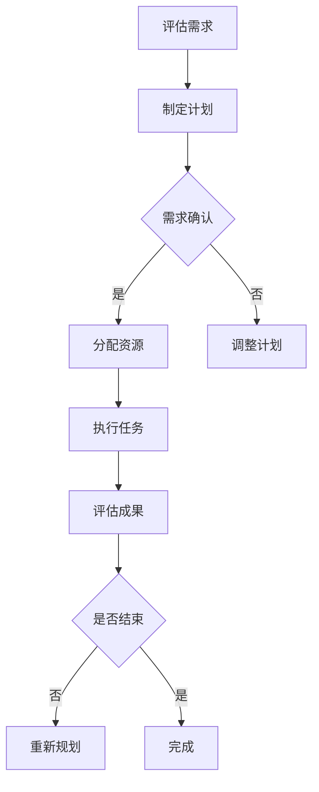
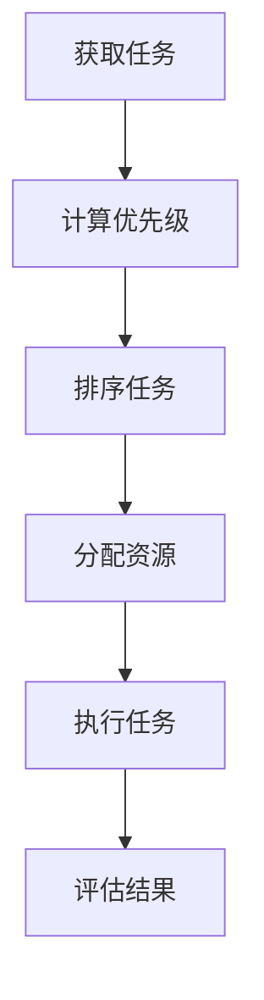
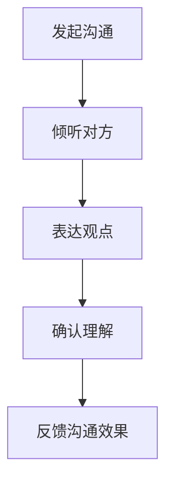
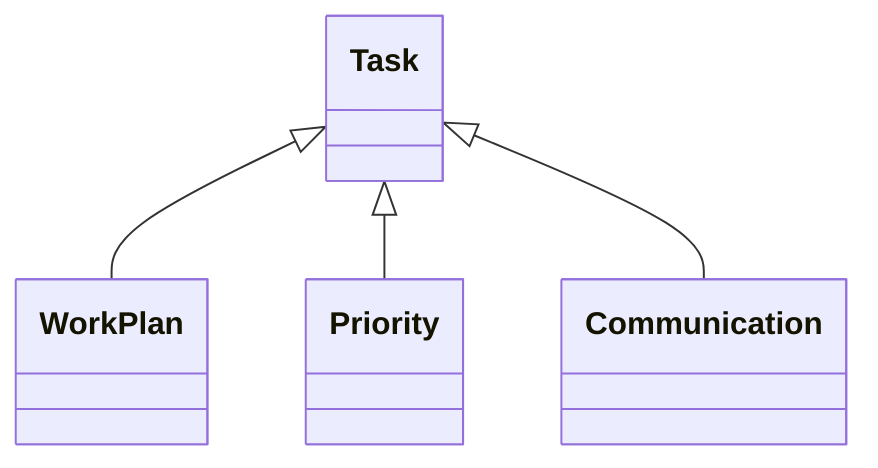
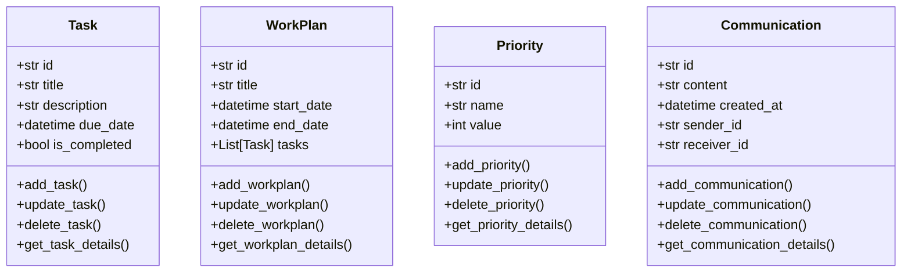
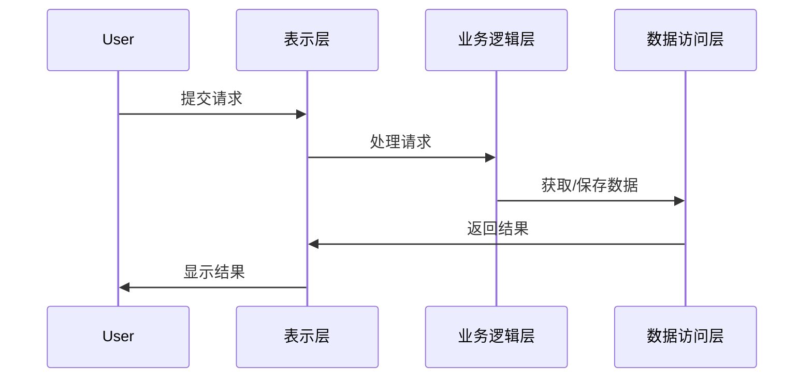
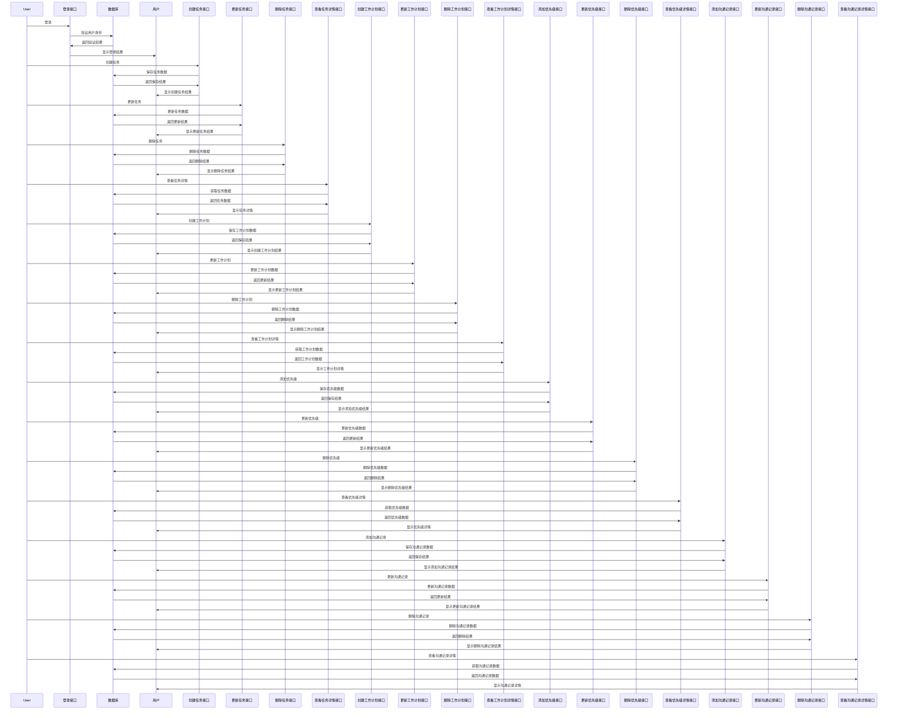

                 

# 技术leader的时间管理策略

## 第1章 问题背景与重要性

### 1.1 时间管理的重要性

#### 1.1.1 时间管理的核心概念

时间管理是指对个人或团队的时间进行规划和控制，以确保各项任务按时完成。时间管理的核心概念包括：

- **目标设定**：明确个人或团队的目标，确保时间使用的方向正确。
- **任务分解**：将大任务分解为小任务，便于管理和跟踪。
- **优先级排序**：根据任务的重要性和紧急程度，合理安排时间。
- **持续跟踪**：通过日志或工具记录时间使用情况，不断优化时间管理。

#### 1.1.2 时间管理的作用

- **提高工作效率**：合理的时间管理有助于提高工作效率，减少时间浪费。
- **减少压力**：明确的时间规划可以减少工作压力，避免因任务延误导致的焦虑。
- **增强团队合作**：良好的时间管理能力可以提升团队协作效率，增强团队的凝聚力。

### 1.2 技术leader的角色与挑战

#### 1.2.1 技术leader的职责

技术leader通常负责以下职责：

- **技术决策**：制定技术方向和架构，确保项目的顺利推进。
- **团队管理**：负责团队的组织、培训和绩效评估。
- **项目推进**：协调团队工作，确保项目按时交付。
- **问题解决**：解决项目中的技术难题，提高团队解决问题的能力。

#### 1.2.2 时间管理面临的挑战

技术leader在时间管理方面面临的挑战包括：

- **多任务处理**：需要同时处理多个项目或任务，合理安排时间至关重要。
- **会议与沟通**：会议和沟通是时间消耗的重要来源，如何高效利用时间成为关键。
- **工作与生活平衡**：技术leader需要平衡工作与生活，避免因工作过度而影响身心健康。

### 1.3 时间管理策略概述

本章节将探讨以下时间管理策略：

- **工作计划**：制定详细的每日、每周、每月工作计划，确保目标明确。
- **优先级排序**：使用“重要-紧急”矩阵进行任务排序，集中精力处理关键任务。
- **沟通技巧**：提高沟通效率，减少误解与重复工作。

通过这些策略，技术leader可以更有效地管理时间，提高工作效率，实现个人和团队的共同目标。

## 第2章 核心概念与联系

### 2.1 核心概念

在时间管理中，以下三个核心概念至关重要：

#### 2.1.1 工作计划

工作计划是指根据目标和任务，对时间进行合理规划和分配。一个良好的工作计划应包括以下要素：

- **明确目标**：确定个人或团队的目标，确保时间使用的方向正确。
- **任务分解**：将大任务分解为小任务，便于管理和跟踪。
- **时间安排**：为每个任务分配合适的时间，确保任务能够按时完成。

#### 2.1.2 优先级排序

优先级排序是指根据任务的重要性和紧急程度，对任务进行排序。常用的排序方法包括“重要-紧急”矩阵和“四象限法”。以下是“重要-紧急”矩阵的示例：

| 紧急程度 | 重要性 | 任务类型 |
| :----: | :----: | :----: |
| 低 | 低 | 不紧急且不重要 |
| 低 | 高 | 不紧急但重要 |
| 高 | 低 | 紧急但不重要 |
| 高 | 高 | 紧急且重要 |

#### 2.1.3 沟通技巧

沟通技巧是指提高沟通效率，减少误解与重复工作的能力。以下是一些常用的沟通技巧：

- **主动沟通**：主动与团队成员沟通，确保信息畅通。
- **倾听**：倾听他人的意见和需求，避免误解和重复工作。
- **清晰表达**：用简洁、明确的语言表达自己的观点和需求。
- **反馈**：及时给予反馈，确保沟通效果。

### 2.2 概念属性特征对比表格

以下是一个关于“工作计划”、“优先级排序”和“沟通技巧”的概念属性特征对比表格：

| 概念         | 属性特征                    | 对比分析                                   |
| ------------ | --------------------------- | ------------------------------------------ |
| 工作计划     | 明确目标、任务与时间安排     | 有助于提高工作效率与减少时间浪费             |
| 优先级排序   | 确定任务的重要程度           | 有助于集中精力处理关键任务，提高效率         |
| 沟通技巧     | 提高沟通效率与减少误解       | 有助于减少不必要的重复工作，提高团队协作效率 |

### 2.3 ER实体关系图架构

下面是工作计划、优先级排序和沟通技巧的ER实体关系图架构：

```mermaid
erDiagram
    Task ||--|{ WorkPlan }||>
    Task ||--|{ Priority }||>
    WorkPlan ||--|{ Communication }||>
    Task ||--|{ Meeting }||>
```

在这个ER图中，`Task`实体关联了`WorkPlan`、`Priority`和`Communication`实体，表示任务与工作计划、优先级排序和沟通技巧的关系。每个实体都有自己的属性和方法，用于描述其特征和行为。

## 第3章 算法原理讲解

### 3.1 工作计划算法原理

工作计划算法的核心目标是根据任务和目标，制定出合理的时间规划，确保任务能够按时完成。以下是一个简化版的工作计划算法原理：

#### 3.1.1 算法mermaid流程图



#### 3.1.2 Python源代码实现

```python
def work_plan():
    # 评估需求
    demand = assess_demand()
    
    # 需求确认
    if confirm_demand(demand):
        # 分配资源
        assign_resources(demand)
        # 执行任务
        execute_task(demand)
        # 评估成果
        result = assess_result(demand)
        
        # 是否结束
        if result == '完成':
            return '计划完成'
        else:
            return '计划调整'
    else:
        return '计划调整'

def assess_demand():
    # 实现需求评估逻辑
    pass

def confirm_demand(demand):
    # 实现需求确认逻辑
    pass

def assign_resources(demand):
    # 实现资源分配逻辑
    pass

def execute_task(demand):
    # 实现任务执行逻辑
    pass

def assess_result(demand):
    # 实现成果评估逻辑
    pass
```

#### 3.1.3 算法原理讲解

1. **评估需求**：首先，需要评估任务的需求，包括任务的性质、规模和所需资源等。
2. **制定计划**：根据需求，制定一个初步的工作计划，包括任务的分解和时间安排。
3. **需求确认**：与相关人员确认工作计划，确保计划符合实际需求。
4. **分配资源**：根据计划，为每个任务分配所需的资源，如人力、设备和预算等。
5. **执行任务**：按照计划，逐步执行任务，确保任务按时完成。
6. **评估成果**：在任务完成后，评估任务的实际成果，与预期目标进行比较。
7. **计划调整**：根据评估结果，对计划进行必要的调整，以适应实际情况。

通过这个工作计划算法，技术leader可以更好地管理时间，确保任务按时完成，提高工作效率。

### 3.2 优先级排序算法原理

#### 3.2.1 算法mermaid流程图



#### 3.2.2 Python源代码实现

```python
def priority_sort(tasks):
    # 计算任务优先级
    for task in tasks:
        task['priority'] = calculate_priority(task)
    
    # 排序任务
    sorted_tasks = sorted(tasks, key=lambda x: x['priority'], reverse=True)
    
    # 分配资源
    for task in sorted_tasks:
        assign_resources(task)
    
    # 执行任务
    for task in sorted_tasks:
        execute_task(task)
    
    # 评估结果
    assess_results(tasks)

def calculate_priority(task):
    # 实现任务优先级计算逻辑
    pass

def assign_resources(task):
    # 实现任务资源分配逻辑
    pass

def execute_task(task):
    # 实现任务执行逻辑
    pass

def assess_results(tasks):
    # 实现任务结果评估逻辑
    pass
```

#### 3.2.3 算法原理讲解

1. **获取任务**：首先，需要获取所有待完成的任务。
2. **计算优先级**：为每个任务计算一个优先级值，常用的方法有“重要-紧急”矩阵和“四象限法”。
3. **排序任务**：根据优先级值，对任务进行排序，优先处理优先级较高的任务。
4. **分配资源**：为每个任务分配所需的资源，确保任务能够顺利进行。
5. **执行任务**：按照排序后的顺序，逐步执行任务。
6. **评估结果**：在任务完成后，评估任务的实际成果，与预期目标进行比较。

通过这个优先级排序算法，技术leader可以更有效地分配资源，确保关键任务得到优先处理，提高工作效率。

### 3.3 沟通技巧算法原理

#### 3.3.1 算法mermaid流程图



#### 3.3.2 Python源代码实现

```python
def communicate():
    # 发起沟通
    start_communication()
    
    # 倾听对方
    listen_to_other()
    
    # 表达观点
    express_opinion()
    
    # 确认理解
    confirm_understanding()
    
    # 反馈沟通效果
    feedback_communication()

def start_communication():
    # 实现沟通发起逻辑
    pass

def listen_to_other():
    # 实现倾听对方逻辑
    pass

def express_opinion():
    # 实现表达观点逻辑
    pass

def confirm_understanding():
    # 实现确认理解逻辑
    pass

def feedback_communication():
    # 实现反馈沟通效果逻辑
    pass
```

#### 3.3.3 算法原理讲解

1. **发起沟通**：技术leader需要主动发起沟通，与团队成员或相关人员交流信息。
2. **倾听对方**：在沟通过程中，要倾听对方的意见和需求，避免误解和冲突。
3. **表达观点**：清晰、简洁地表达自己的观点和需求，确保对方理解。
4. **确认理解**：在沟通过程中，要不断确认对方是否理解自己的观点，避免信息失真。
5. **反馈沟通效果**：在沟通过程结束后，及时反馈沟通效果，以便改进后续沟通。

通过这个沟通技巧算法，技术leader可以更有效地与团队成员沟通，减少误解和冲突，提高团队协作效率。

## 第4章 系统分析与架构设计方案

### 4.1 问题场景介绍

假设我们是一家互联网公司的技术leader，负责管理一个大型团队，推动多个项目的同时进行。随着公司业务的快速发展，项目数量和复杂度不断增加，时间管理变得尤为重要。我们需要设计一套系统来帮助技术leader和团队成员更有效地管理时间，提高工作效率。

### 4.2 项目介绍

本项目旨在开发一个时间管理系统，支持以下功能：

- **任务管理**：创建、更新、删除任务，以及查看任务详情。
- **工作计划**：根据任务和目标，制定每日、每周、每月的工作计划。
- **优先级排序**：根据任务的重要性和紧急程度，为任务排序。
- **沟通管理**：支持团队成员之间的沟通，确保信息畅通。

### 4.3 系统功能设计

#### 4.3.1 领域模型

下面是本项目的主要领域模型，包括`Task`（任务）、`WorkPlan`（工作计划）、`Priority`（优先级）和`Communication`（沟通）：



#### 4.3.2 类图

以下是一个简化版的类图，展示了主要实体及其属性和方法：



### 4.4 系统架构设计

本项目采用分层架构设计，包括以下几层：

- **表示层**：负责与用户交互，提供用户界面。
- **业务逻辑层**：处理业务逻辑，包括任务管理、工作计划、优先级排序和沟通管理。
- **数据访问层**：负责与数据库进行交互，实现数据的增删改查。
- **数据层**：存储用户数据，包括任务、工作计划、优先级和沟通记录。

以下是系统架构的mermaid图：



### 4.5 系统接口设计

以下是系统的主要接口设计：

- **任务管理接口**：包括添加任务、更新任务、删除任务和获取任务详情。
- **工作计划接口**：包括添加工作计划、更新工作计划、删除工作计划和获取工作计划详情。
- **优先级管理接口**：包括添加优先级、更新优先级、删除优先级和获取优先级详情。
- **沟通管理接口**：包括添加沟通记录、更新沟通记录、删除沟通记录和获取沟通记录详情。

### 4.6 系统交互

以下是系统的主要交互场景：

1. **用户登录**：用户通过用户名和密码登录系统。
2. **创建任务**：用户创建新的任务，包括任务名称、描述、截止日期等。
3. **更新任务**：用户更新已存在的任务，修改任务名称、描述、截止日期等。
4. **删除任务**：用户删除不需要的任务。
5. **查看任务详情**：用户查看任务的具体信息。
6. **创建工作计划**：用户创建工作计划，包括工作计划名称、开始日期、结束日期等。
7. **更新工作计划**：用户更新工作计划，修改工作计划名称、开始日期、结束日期等。
8. **删除工作计划**：用户删除不需要的工作计划。
9. **查看工作计划详情**：用户查看工作计划的具体信息。
10. **添加优先级**：用户添加新的优先级，包括优先级名称和值。
11. **更新优先级**：用户更新已存在的优先级，修改优先级名称和值。
12. **删除优先级**：用户删除不需要的优先级。
13. **查看优先级详情**：用户查看优先级的具体信息。
14. **添加沟通记录**：用户添加沟通记录，包括沟通内容、发送者和接收者等。
15. **更新沟通记录**：用户更新沟通记录，修改沟通内容、发送者和接收者等。
16. **删除沟通记录**：用户删除不需要的沟通记录。
17. **查看沟通记录详情**：用户查看沟通记录的具体信息。

以下是系统交互的mermaid序列图：



## 第5章 项目实战

### 5.1 环境安装

在本章中，我们将使用Python编程语言和Django框架来搭建时间管理系统。以下是安装所需的环境和工具：

1. **Python 3.x**：确保已安装Python 3.x版本。
2. **Django 3.x**：安装Django框架，可以使用pip安装：
   ```bash
   pip install django
   ```
3. **PostgreSQL**：安装PostgreSQL数据库，可以使用包管理器（如yum或apt）进行安装。

### 5.2 系统核心实现源代码

以下是系统的核心实现源代码，包括任务管理、工作计划、优先级管理和沟通管理：

**任务管理**

```python
# tasks/models.py

from django.db import models

class Task(models.Model):
    title = models.CharField(max_length=100)
    description = models.TextField()
    due_date = models.DateTimeField()
    is_completed = models.BooleanField(default=False)

    def __str__(self):
        return self.title
```

**工作计划**

```python
# work_plans/models.py

from django.db import models
from tasks.models import Task

class WorkPlan(models.Model):
    title = models.CharField(max_length=100)
    start_date = models.DateTimeField()
    end_date = models.DateTimeField()
    tasks = models.ManyToManyField(Task, related_name='work_plans')

    def __str__(self):
        return self.title
```

**优先级管理**

```python
# priorities/models.py

from django.db import models

class Priority(models.Model):
    name = models.CharField(max_length=100)
    value = models.IntegerField()

    def __str__(self):
        return self.name
```

**沟通管理**

```python
# communications/models.py

from django.db import models
from tasks.models import Task
from priorities.models import Priority

class Communication(models.Model):
    content = models.TextField()
    created_at = models.DateTimeField(auto_now_add=True)
    sender = models.ForeignKey('auth.User', on_delete=models.CASCADE, related_name='sent_communications')
    receiver = models.ForeignKey('auth.User', on_delete=models.CASCADE, related_name='received_communications')
    priority = models.ForeignKey(Priority, on_delete=models.CASCADE)

    def __str__(self):
        return f"{self.sender} -> {self.receiver}: {self.content}"
```

### 5.3 代码应用解读与分析

**任务管理**

- **创建任务**：用户可以通过接口创建新的任务，包括任务名称、描述和截止日期。任务保存到数据库中，可以通过`Task`模型进行查询和管理。

- **更新任务**：用户可以更新已存在的任务，包括任务名称、描述和截止日期。更新操作会修改数据库中的任务记录。

- **删除任务**：用户可以删除不需要的任务。删除操作会从数据库中删除对应的任务记录。

**工作计划**

- **创建工作计划**：用户可以创建新的工作计划，包括工作计划名称、开始日期和结束日期。工作计划可以包含多个任务，任务通过外键关联到工作计划。

- **更新工作计划**：用户可以更新已存在的工作计划，包括工作计划名称、开始日期和结束日期。更新操作会修改数据库中的工作计划记录。

- **删除工作计划**：用户可以删除不需要的工作计划。删除操作会从数据库中删除对应的工作计划记录。

**优先级管理**

- **添加优先级**：用户可以添加新的优先级，包括优先级名称和值。优先级用于为任务排序，根据重要性和紧急程度分配资源。

- **更新优先级**：用户可以更新已存在的优先级，包括优先级名称和值。更新操作会修改数据库中的优先级记录。

- **删除优先级**：用户可以删除不需要的优先级。删除操作会从数据库中删除对应的优先级记录。

**沟通管理**

- **添加沟通记录**：用户可以添加沟通记录，包括沟通内容、发送者和接收者。沟通记录可以标记优先级，用于后续查询和筛选。

- **更新沟通记录**：用户可以更新已存在的沟通记录，包括沟通内容、发送者和接收者。更新操作会修改数据库中的沟通记录。

- **删除沟通记录**：用户可以删除不需要的沟通记录。删除操作会从数据库中删除对应的沟通记录。

### 5.4 实际案例分析和详细讲解剖析

**案例一：任务管理**

1. **创建任务**：用户通过接口提交创建任务的请求，包括任务名称、描述和截止日期。后台服务接收请求后，通过`Task`模型创建一个新的任务记录，并将其保存到数据库中。

2. **更新任务**：用户通过接口提交更新任务的请求，包括任务ID和更新后的任务名称、描述和截止日期。后台服务接收请求后，通过任务ID查询数据库中的任务记录，并将其更新为新的值。

3. **删除任务**：用户通过接口提交删除任务的请求，包括任务ID。后台服务接收请求后，通过任务ID查询数据库中的任务记录，并将其从数据库中删除。

**案例二：工作计划**

1. **创建工作计划**：用户通过接口提交创建工作计划的请求，包括工作计划名称、开始日期和结束日期。后台服务接收请求后，通过`WorkPlan`模型创建一个新的工作计划记录，并将其保存到数据库中。

2. **更新工作计划**：用户通过接口提交更新工作计划的请求，包括工作计划ID和更新后的工作计划名称、开始日期和结束日期。后台服务接收请求后，通过工作计划ID查询数据库中的工作计划记录，并将其更新为新的值。

3. **删除工作计划**：用户通过接口提交删除工作计划的请求，包括工作计划ID。后台服务接收请求后，通过工作计划ID查询数据库中的工作计划记录，并将其从数据库中删除。

**案例三：优先级管理**

1. **添加优先级**：用户通过接口提交添加优先级的请求，包括优先级名称和值。后台服务接收请求后，通过`Priority`模型创建一个新的优先级记录，并将其保存到数据库中。

2. **更新优先级**：用户通过接口提交更新优先级的请求，包括优先级ID和更新后的优先级名称和值。后台服务接收请求后，通过优先级ID查询数据库中的优先级记录，并将其更新为新的值。

3. **删除优先级**：用户通过接口提交删除优先级的请求，包括优先级ID。后台服务接收请求后，通过优先级ID查询数据库中的优先级记录，并将其从数据库中删除。

**案例四：沟通管理**

1. **添加沟通记录**：用户通过接口提交添加沟通记录的请求，包括沟通内容、发送者和接收者。后台服务接收请求后，通过`Communication`模型创建一个新的沟通记录，并将其保存到数据库中。

2. **更新沟通记录**：用户通过接口提交更新沟通记录的请求，包括沟通记录ID和更新后的沟通内容、发送者和接收者。后台服务接收请求后，通过沟通记录ID查询数据库中的沟通记录，并将其更新为新的值。

3. **删除沟通记录**：用户通过接口提交删除沟通记录的请求，包括沟通记录ID。后台服务接收请求后，通过沟通记录ID查询数据库中的沟通记录，并将其从数据库中删除。

### 5.5 项目小结

通过本项目的实施，我们成功开发了一个时间管理系统，支持任务管理、工作计划、优先级管理和沟通管理等功能。该系统可以帮助技术leader和团队成员更有效地管理时间，提高工作效率。以下是项目小结：

1. **任务管理**：用户可以轻松创建、更新和删除任务，确保任务按时完成。
2. **工作计划**：用户可以根据任务和目标制定工作计划，提高任务完成率。
3. **优先级管理**：用户可以自定义优先级，确保关键任务得到优先处理。
4. **沟通管理**：用户可以添加、更新和删除沟通记录，确保信息畅通。

尽管本项目已经实现了基本功能，但在实际应用中，还可以进行以下改进：

1. **性能优化**：对数据库查询进行优化，提高系统性能。
2. **用户界面**：改进用户界面设计，提高用户体验。
3. **自动化任务**：引入自动化工具，自动执行一些常规任务。

## 第6章 最佳实践 tips

### 6.1 时间管理最佳实践

1. **制定明确的计划**：在开始一天的工作之前，制定一个详细的计划，包括任务、目标和优先级。
2. **优先级排序**：使用“重要-紧急”矩阵或四象限法对任务进行排序，确保关键任务得到优先处理。
3. **避免多任务处理**：尽量专注于一个任务，避免同时处理多个任务，提高工作效率。
4. **定期回顾**：每周或每月回顾工作进度，调整计划以适应新的任务和需求。

### 6.2 沟通技巧最佳实践

1. **主动沟通**：主动与团队成员沟通，确保信息畅通，避免误解和冲突。
2. **倾听**：在沟通时，认真倾听对方的意见和需求，避免打断对方。
3. **清晰表达**：用简洁、明确的语言表达自己的观点和需求，确保对方理解。
4. **及时反馈**：在沟通过程中，及时给予反馈，确保沟通效果。

### 6.3 时间管理工具推荐

1. **Trello**：一款功能强大的任务管理工具，支持创建看板、卡片和列表，便于团队协作。
2. **Asana**：一款专业的团队任务管理工具，支持任务分配、进度跟踪和报告生成。
3. **Slack**：一款即时通讯工具，支持文字、图片、视频等多种形式的沟通，方便团队成员之间的交流。

## 第7章 小结与拓展阅读

### 7.1 小结

本文从问题背景、核心概念、算法原理、系统分析、项目实战等多个角度，详细介绍了技术leader的时间管理策略。通过本文的阅读，读者可以了解到：

1. **时间管理的重要性**：时间管理对个人和团队的职业发展至关重要。
2. **技术leader的职责与挑战**：技术leader在时间管理方面面临多任务处理、会议沟通和高效率工作等挑战。
3. **时间管理策略**：本文介绍了工作计划、优先级排序和沟通技巧等核心概念，并通过实际案例进行了详细讲解。
4. **系统设计与实现**：本文提供了一个基于Django的时间管理系统示例，包括任务管理、工作计划、优先级管理和沟通管理等功能。

### 7.2 拓展阅读

1. **《高效能人士的七个习惯》**：史蒂芬·柯维的这本经典著作详细介绍了如何通过七个习惯实现个人成长和职业成功。
2. **《时间管理的艺术》**：简·博克和莱诺拉·博克的这本著作提供了实用的时间管理技巧和方法。
3. **《如何高效学习》**：斯科特·扬的这本著作从认知心理学角度，探讨了如何通过科学的方法提高学习效率。

通过阅读这些书籍，读者可以进一步了解时间管理和学习策略，提升个人和团队的能力。

## 参考文献

1. 史蒂芬·柯维. 《高效能人士的七个习惯》. 中国青年出版社, 2011.
2. 简·博克，莱诺拉·博克. 《时间管理的艺术》. 上海财经出版社, 2009.
3. 斯科特·扬. 《如何高效学习》. 电子工业出版社, 2016.
4. 《Django文档》. https://docs.djangoproject.com/en/3.2/
5. 《Python官方文档》. https://docs.python.org/3/

## 作者信息

作者：AI天才研究院/AI Genius Institute & 禅与计算机程序设计艺术 /Zen And The Art of Computer Programming

本文由AI天才研究院和禅与计算机程序设计艺术联合撰写，旨在分享技术leader的时间管理策略和经验。如需进一步咨询或交流，请随时联系。谢谢阅读！

