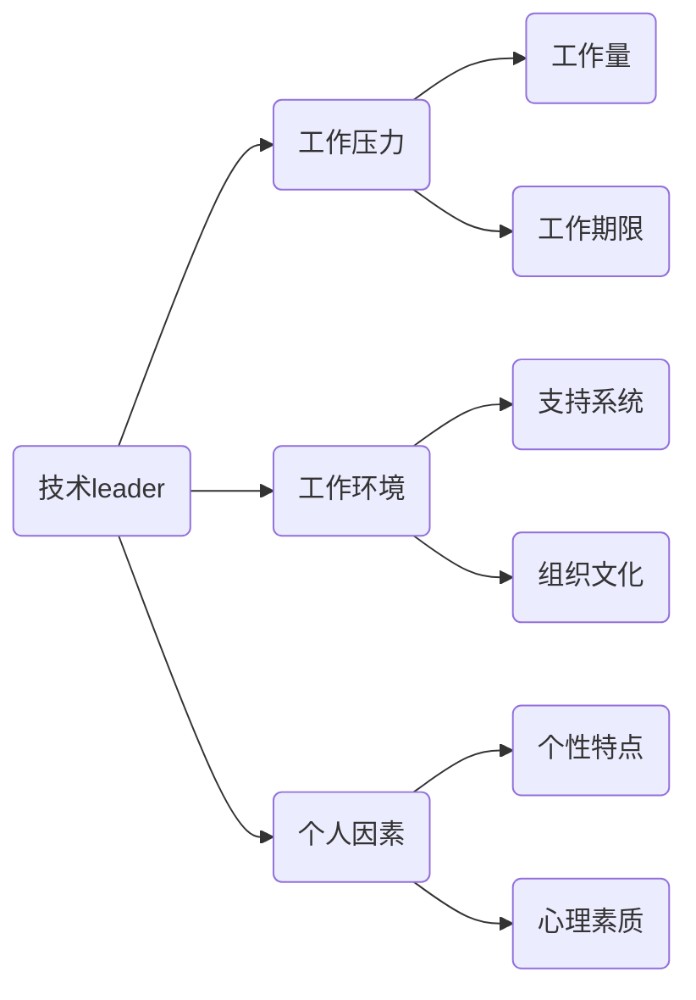

                 

## 技术leader的职业倦怠：识别与应对

### 关键词：技术leader、职业倦怠、识别、应对、心理健康、团队管理

> 摘要：技术leader作为团队的核心力量，承担着项目开发、团队管理和技术创新等多重职责。然而，长时间的工作压力、不断变化的技术环境和复杂的人际关系，使得技术leader面临着巨大的心理压力，职业倦怠现象日益凸显。本文将深入探讨技术leader职业倦怠的定义、识别与应对策略，旨在帮助技术leader识别自身状态，提高心理健康水平，从而更好地履行职责，促进团队和组织的长远发展。

### 第一部分：职业倦怠的概念与现象

#### 1.1 职业倦怠的定义与背景

职业倦怠（Burnout）是一个广泛应用于心理学和社会学领域的术语，最早由心理学家赫伯特·J·弗里德曼（Herbert J. Freudenberger）在1974年提出。职业倦怠是指个体在面对长期的工作压力和紧张的工作环境时，出现的一种情感耗竭、消极怠工和成就感丧失的综合现象。随着社会经济的发展和职场压力的增加，职业倦怠已经成为全球职场中的一个普遍问题。

#### 1.2 职业倦怠的背景

近年来，随着信息技术的快速发展，技术行业呈现出爆炸式增长。技术leader作为团队的核心，不仅要具备扎实的技术能力，还要具备管理能力和领导力。他们在工作中面临着不断更新迭代的技术、复杂的项目管理和激烈的市场竞争等多重挑战。这些因素共同导致了技术leader的职业倦怠现象日益严重。

#### 1.3 职业倦怠的主要表现

职业倦怠的主要表现包括以下几个方面：

1. **情感耗竭**：技术leader在工作中感到持续的精神疲惫，情绪低落，对工作缺乏热情。
2. **消极怠工**：在工作中表现出低效率，对任务敷衍了事，甚至产生抵触情绪。
3. **成就感丧失**：对工作产生负面认知，认为自己无法实现职业目标和价值。

#### 1.4 职业倦怠的影响因素

职业倦怠的影响因素主要包括以下几个方面：

1. **工作压力**：长时间的工作负担、紧迫的项目期限和持续的工作压力是职业倦怠的主要诱因。
2. **工作环境**：缺乏有效的支持系统、组织文化和团队氛围的不和谐都会加剧职业倦怠。
3. **个人因素**：个性特点、心理素质和应对压力的能力等个人因素也会影响职业倦怠的发生。

### 第二部分：技术leader的职业特点与压力

#### 2.1 技术leader的角色与职责

技术leader作为团队的核心，承担着多重职责：

1. **技术指导**：负责团队的技术决策和方向指引，确保项目的技术质量。
2. **团队管理**：负责团队的组织和管理，包括人员安排、绩效评估和团队文化建设。
3. **项目管理**：负责项目的计划、执行和监控，确保项目按时交付。

#### 2.2 技术leader的工作挑战

技术leader在工作过程中面临着以下挑战：

1. **技术更新**：技术行业日新月异，技术leader需要不断学习新技术，以保持竞争力。
2. **团队管理**：管理一个多元化的团队，需要具备丰富的管理经验和沟通技巧。
3. **项目压力**：在紧迫的项目期限内，需要确保项目质量，同时应对各种突发状况。

#### 2.3 技术leader的压力来源

技术leader的压力来源主要包括以下几个方面：

1. **技术挑战**：技术复杂度高，解决技术问题需要耗费大量时间和精力。
2. **项目责任**：作为团队的核心，技术leader需要承担项目失败的风险和责任。
3. **团队期望**：团队成员对技术leader有较高的期望，需要不断提升自己的能力和影响力。

#### 2.4 技术leader的心理状态分析

技术leader在高压环境下容易出现以下心理状态：

1. **焦虑**：对未来不确定性感到担忧，对项目进度和质量产生焦虑。
2. **压力**：长时间的工作负担导致身心俱疲，产生持续的压力。
3. **挫败感**：面对技术难题和项目管理挑战，可能会产生挫败感。

### 第三部分：技术leader职业倦怠的现状与影响

#### 3.1 技术leader职业倦怠的现状

据调查，技术leader职业倦怠现象在全球范围内普遍存在，尤其是在快速发展的技术行业。调查显示，超过60%的技术leader表示曾经或正在经历职业倦怠。

#### 3.2 职业倦怠对技术leader的影响

职业倦怠对技术leader的影响主要体现在以下几个方面：

1. **心理健康**：持续的情感耗竭和消极情绪可能导致心理健康问题，如抑郁症、焦虑症等。
2. **工作效率**：情感耗竭和成就感丧失导致工作效率降低，甚至产生抵触情绪。
3. **职业发展**：职业倦怠可能导致技术leader失去职业热情，影响职业发展。

#### 3.3 职业倦怠对团队和组织的影响

职业倦怠不仅影响技术leader的个人发展，也会对团队和组织产生负面影响：

1. **团队氛围**：技术leader的倦怠情绪可能导致团队士气低落，影响团队协作。
2. **项目质量**：技术leader的精力不足可能导致项目质量下降，影响项目交付。
3. **组织发展**：技术leader的职业倦怠可能影响组织的技术创新和竞争力。

### 第四部分：职业倦怠的识别与诊断

#### 4.1 自我评估的重要性

自我评估是识别职业倦怠的第一步，技术leader需要定期对自己的心理状态进行自我评估，以便及时发现和应对潜在问题。

#### 4.2 自我评估的工具与方法

以下是一些常见的自我评估工具和方法：

1. **量表评估**：如职业倦怠量表（MBI-GS）等，通过量化的方式评估职业倦怠程度。
2. **日记法**：通过记录日常情绪和工作状态，分析自己的心理变化。
3. **心理咨询服务**：通过专业的心理咨询服务，了解自己的心理状态和应对策略。

#### 4.3 自我评估的实际操作

技术leader可以按照以下步骤进行自我评估：

1. **确定评估目的**：明确自己进行自我评估的目的，如了解自己的心理状态、制定改善计划等。
2. **选择评估工具**：根据自身情况选择合适的评估工具，如职业倦怠量表、日记法等。
3. **进行评估**：按照评估工具的指导，认真填写问卷或记录日记，确保评估结果的准确性。
4. **分析评估结果**：结合评估结果，分析自己的心理状态和问题所在，制定相应的改善计划。

### 第五部分：职业倦怠的诊断与评估

#### 5.1 职业倦怠诊断的理论基础

职业倦怠的诊断主要基于心理学理论，如心理耗竭理论、压力—应对理论等。这些理论为职业倦怠的诊断提供了理论依据。

#### 5.2 职业倦怠评估的方法

职业倦怠评估的方法主要包括以下几种：

1. **问卷调查**：通过量化的方式评估职业倦怠程度，如职业倦怠量表（MBI-GS）等。
2. **心理测试**：通过专业的心理测试工具评估个体的心理状态，如压力测试、情绪测试等。
3. **临床评估**：通过专业心理医生的临床评估，诊断个体的职业倦怠程度。

#### 5.3 职业倦怠评估的实施步骤

职业倦怠评估的实施步骤如下：

1. **确定评估目的**：明确评估的目的，如诊断职业倦怠程度、制定改善计划等。
2. **选择评估方法**：根据评估目的和实际情况选择合适的评估方法，如问卷调查、心理测试等。
3. **收集评估数据**：按照评估方法的要求，收集相关的评估数据，如问卷结果、测试报告等。
4. **分析评估数据**：结合评估数据，分析个体的心理状态和问题所在。
5. **制定改善计划**：根据评估结果，制定针对性的改善计划，如心理调适、时间管理等。

### 第六部分：职业倦怠的风险因素与预警

#### 6.1 职业倦怠的风险因素

职业倦怠的风险因素主要包括以下几个方面：

1. **工作压力**：长时间的工作负担和紧迫的项目期限是职业倦怠的主要诱因。
2. **工作环境**：缺乏有效的支持系统、组织文化和团队氛围的不和谐都会加剧职业倦怠。
3. **个人因素**：个性特点、心理素质和应对压力的能力等个人因素也会影响职业倦怠的发生。

#### 6.2 职业倦怠的预警机制

为了及时识别和应对职业倦怠，技术leader和组织可以采取以下预警机制：

1. **定期评估**：定期进行心理状态和职业倦怠程度的评估，及时发现潜在问题。
2. **预警信号**：关注情感耗竭、消极怠工和成就感丧失等预警信号，及时采取应对措施。
3. **预警系统**：建立预警系统，通过数据分析和技术手段，实时监测职业倦怠的发生。

#### 6.3 预警机制的实施与效果评估

预警机制的实施与效果评估包括以下几个步骤：

1. **制定预警方案**：根据组织的实际情况和需求，制定详细的预警方案。
2. **实施预警机制**：按照预警方案，实施预警机制，如定期评估、预警信号监测等。
3. **效果评估**：对预警机制的实施效果进行评估，如评估预警准确率、问题解决率等。

### 第七部分：心理调适与自我管理

#### 7.1 心理调适的重要性

心理调适是应对职业倦怠的重要手段，通过调整心理状态，提高心理素质，技术leader可以更好地应对工作压力。

#### 7.2 自我管理的方法与技巧

以下是一些自我管理的方法与技巧：

1. **时间管理**：合理安排工作时间，提高工作效率，避免过度劳累。
2. **情绪管理**：学会情绪调节，保持积极乐观的心态，降低负面情绪的影响。
3. **目标管理**：设定明确的职业和个人目标，提高工作动力和成就感。

#### 7.3 心理调适的实际操作

技术leader可以按照以下步骤进行心理调适：

1. **认识自我**：了解自己的性格特点、兴趣爱好和职业倾向，明确自己的优势和不足。
2. **设定目标**：根据自身情况，设定合理的职业和个人目标，制定实现目标的计划。
3. **调整心态**：保持积极乐观的心态，面对困难和挑战，保持坚定的信念和耐心。
4. **寻求支持**：与家人、朋友和同事保持良好的沟通，寻求他们的支持和帮助。

### 第八部分：时间管理技巧

#### 8.1 时间管理的基本原则

时间管理的基本原则包括以下几个方面：

1. **明确目标**：明确自己的工作目标和优先级，合理安排时间。
2. **任务分解**：将大任务分解为小任务，逐步完成，避免拖延。
3. **优先处理**：根据任务的重要性和紧急程度，优先处理重要且紧急的任务。
4. **避免干扰**：减少无关事务的干扰，保持专注，提高工作效率。

#### 8.2 时间管理的方法

以下是一些常见的时间管理方法：

1. **番茄工作法**：将工作时间分为25分钟的工作周期，每个周期结束后休息5分钟，有助于提高工作效率。
2. **四象限法则**：将任务分为紧急且重要、紧急但不重要、不紧急但重要、不紧急且不重要四个象限，优先处理紧急且重要的任务。
3. **GTD法**（Getting Things Done）：通过清单和日程安排，系统地管理任务和事务。

#### 8.3 时间管理的实际操作

技术leader可以按照以下步骤进行时间管理：

1. **制定日程安排**：每天早晨或前一天晚上，制定第二天的日程安排，明确每个时间段的工作任务。
2. **任务清单**：将工作任务记录在清单上，按照紧急程度和重要性进行排序。
3. **定期回顾**：定期回顾自己的日程安排和任务完成情况，评估时间管理的有效性，及时调整和优化。

### 第九部分：工作与生活的平衡

#### 9.1 工作与生活平衡的重要性

工作与生活平衡对于技术leader的身心健康和职业发展至关重要。长时间的工作会导致身心健康问题，影响工作效率和创造力。而良好的生活平衡有助于提升心理健康，增强工作动力。

#### 9.2 平衡工作与生活的方法

以下是一些平衡工作与生活的方法：

1. **设定工作边界**：明确工作时间，避免工作侵入私人生活，确保充足的休息时间。
2. **合理安排假期**：定期安排休假，避免长时间连续工作，保持身心健康。
3. **培养兴趣爱好**：培养兴趣爱好，丰富业余生活，缓解工作压力。

#### 9.3 平衡工作与生活的实践案例

以下是一个技术leader平衡工作与生活的实践案例：

1. **设定工作边界**：每天晚上8点后不再处理工作邮件，确保家庭生活和私人时间不受打扰。
2. **合理安排假期**：每年安排至少两次假期，每次至少一周，用于度假或家庭活动。
3. **培养兴趣爱好**：每周至少安排一次运动或文化活动，如跑步、瑜伽、音乐会等，以缓解工作压力。

### 第十部分：组织支持与领导力提升

#### 10.1 组织支持的重要性

组织支持是技术leader应对职业倦怠的重要保障。组织可以通过以下方式提供支持：

1. **心理健康服务**：提供心理咨询服务，帮助技术leader缓解压力，提升心理健康。
2. **培训与发展**：提供培训和发展机会，提升技术leader的专业能力和管理能力。
3. **工作环境优化**：改善工作环境，如提供舒适的工作空间、设备等，提升工作舒适度。

#### 10.2 领导力提升的方法

以下是一些提升领导力的方法：

1. **自我反思**：定期进行自我反思，了解自己的优点和不足，制定改进计划。
2. **学习与培训**：参加领导力培训课程，学习先进的领导理论和实践经验。
3. **领导实践**：通过实际工作，锻炼领导能力和管理技巧。

#### 10.3 组织支持与领导力提升的结合

组织支持与领导力提升的结合是实现技术leader职业发展的关键。以下是一个结合的实践案例：

1. **心理咨询服务**：组织定期提供心理咨询服务，帮助技术leader缓解压力，提升心理健康。
2. **领导力培训**：组织提供领导力培训课程，提升技术leader的管理能力和领导力。
3. **工作环境优化**：改善工作环境，提供舒适的工作空间和设备，提升工作舒适度。

### 第十一部分：职业倦怠的预防策略

#### 11.1 职业倦怠预防的重要性

职业倦怠预防是维护技术leader心理健康和工作效率的关键。通过预防措施，可以减少职业倦怠的发生，提升团队和组织的整体绩效。

#### 11.2 预防策略的实施

以下是一些职业倦怠预防策略的实施方法：

1. **工作环境优化**：改善工作环境，如提供舒适的办公空间、合理的休息设施等。
2. **工作负荷管理**：合理安排工作任务，避免过度负荷，确保技术leader有足够的休息时间。
3. **心理健康教育**：开展心理健康教育，提高技术leader的心理素质和应对压力的能力。

#### 11.3 预防策略的效果评估

预防策略的效果评估包括以下几个方面：

1. **员工满意度调查**：定期进行员工满意度调查，了解技术leader对工作环境和心理健康的满意度。
2. **职业倦怠程度评估**：通过职业倦怠量表等工具，评估预防策略实施后技术leader的职业倦怠程度。
3. **绩效评估**：结合绩效评估，分析预防策略对技术leader工作绩效的影响。

### 第十二部分：职业倦怠的干预措施

#### 12.1 干预措施的选择

干预措施的选择应根据技术leader的具体情况和职业倦怠程度进行。以下是一些常见的干预措施：

1. **心理咨询**：提供专业的心理咨询，帮助技术leader缓解压力，改善心理状态。
2. **健康促进**：通过健康促进活动，如健身、瑜伽等，提升技术leader的身心健康。
3. **工作调整**：根据技术leader的能力和兴趣，调整工作职责和项目，减轻工作压力。

#### 12.2 干预措施的实施

干预措施的实施包括以下几个方面：

1. **制定干预计划**：根据技术leader的职业倦怠程度，制定个性化的干预计划。
2. **实施干预措施**：按照干预计划，逐步实施各种干预措施，如心理咨询、健康促进等。
3. **跟踪效果**：定期跟踪干预效果，根据反馈调整干预措施，确保达到预期效果。

#### 12.3 干预措施的效果评估

干预措施的效果评估包括以下几个方面：

1. **心理状态评估**：通过心理评估工具，评估干预措施实施后技术leader的心理状态变化。
2. **工作绩效评估**：结合绩效评估，评估干预措施对技术leader工作绩效的影响。
3. **满意度调查**：通过满意度调查，了解技术leader对干预措施的满意程度。

### 第十三部分：职业倦怠的长期管理

#### 13.1 长期管理的重要性

职业倦怠的长期管理是维护技术leader身心健康和职业发展的重要保障。通过长期管理，可以持续提升技术leader的心理素质和工作能力。

#### 13.2 长期管理的策略

以下是一些职业倦怠长期管理的策略：

1. **持续心理健康教育**：通过持续的心理健康教育，提高技术leader的心理素质和应对压力的能力。
2. **定期心理评估**：定期进行心理评估，及时发现和处理潜在的心理问题。
3. **职业发展规划**：制定明确的职业发展规划，帮助技术leader实现职业目标和价值。

#### 13.3 长期管理的实践案例

以下是一个职业倦怠长期管理的实践案例：

1. **持续心理健康教育**：组织定期开展心理健康讲座和工作坊，提高技术leader的心理素质和应对压力的能力。
2. **定期心理评估**：每年进行一次心理评估，及时发现和处理心理问题，确保技术leader的心理健康。
3. **职业发展规划**：为技术leader制定个性化的职业发展规划，提供培训和晋升机会，帮助实现职业目标和价值。

### 结论

#### 14.1 职业倦怠的研究总结

本文从职业倦怠的定义、技术leader的职业特点、职业倦怠的现状与影响、识别与诊断、风险因素与预警、心理调适与自我管理、时间管理技巧、工作与生活平衡、组织支持与领导力提升、职业倦怠的预防策略、干预措施到长期管理等方面，全面探讨了技术leader职业倦怠的问题。研究表明，职业倦怠对技术leader的身心健康和职业发展具有严重影响，需要引起重视。

#### 14.2 职业倦怠的展望

随着信息技术的发展和社会环境的变迁，技术leader面临的工作压力和挑战将持续存在。未来，职业倦怠的预防和干预措施将更加多样化和个性化，如通过大数据分析和人工智能技术，实现精准预防和干预。同时，组织和个人也将更加重视心理健康，推动形成积极健康的职场文化。

#### 14.3 对技术leader的启示

对技术leader而言，本文的研究提供了以下启示：

1. **重视心理健康**：关注自身心理健康，定期进行心理评估和调适，保持积极乐观的心态。
2. **平衡工作与生活**：合理安排工作和生活，设定工作边界，确保充足的休息和娱乐时间。
3. **提升领导力**：通过学习和实践，不断提升自己的领导力和管理能力，以应对工作中的挑战。
4. **积极参与组织支持**：积极参与组织的心理健康教育和职业发展活动，利用组织的资源和支持，提升自己的综合素质。

### 作者信息

作者：AI天才研究院/AI Genius Institute & 禅与计算机程序设计艺术 /Zen And The Art of Computer Programming

### 附录

本文章包含了丰富的图表和公式，以帮助读者更好地理解技术leader职业倦怠的相关概念和策略。以下为部分图表和公式的具体内容。

#### 图表1：职业倦怠核心概念属性特征对比表格

| 核心概念 | 情感耗竭 | 消极怠工 | 成就感丧失 |
| --- | --- | --- | --- |
| 定义 | 长期工作压力导致情感衰竭 | 对工作产生消极情绪 | 对工作失去兴趣和热情 |
| 表现形式 | 疲劳、冷漠、易怒 | 缺乏动力、消极对待任务 | 感觉自己的工作没有意义 |

#### 图表2：职业倦怠风险因素ER实体关系图

#### 公式1：职业倦怠程度计算公式

$$
\text{职业倦怠程度} = w_1 \times \text{情感耗竭} + w_2 \times \text{消极怠工} + w_3 \times \text{成就感丧失}
$$

其中，$w_1, w_2, w_3$ 为权重系数，可以根据具体情况调整。

#### 公式2：时间管理效率公式

$$
\text{时间管理效率} = \frac{\text{任务完成量}}{\text{工作时间}}
$$

#### 公式3：工作与生活平衡指数

$$
\text{工作与生活平衡指数} = \frac{\text{休息时间}}{\text{工作时间}}
$$

以上公式和图表为本文的研究提供了理论基础和直观的展示，帮助读者更好地理解技术leader职业倦怠的相关问题。在实际应用中，可以根据具体情况调整和优化这些公式和策略。

