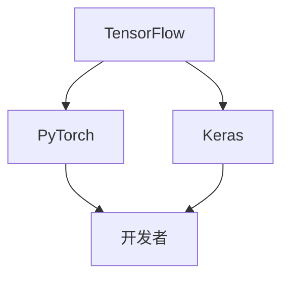
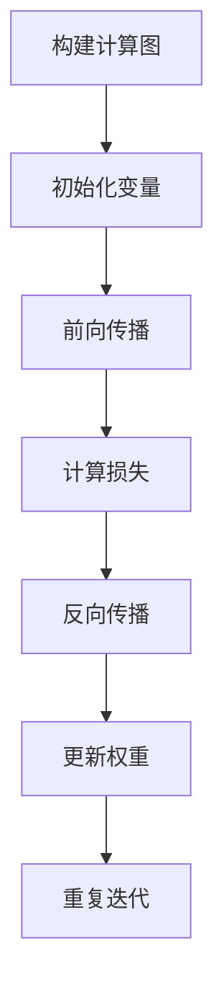
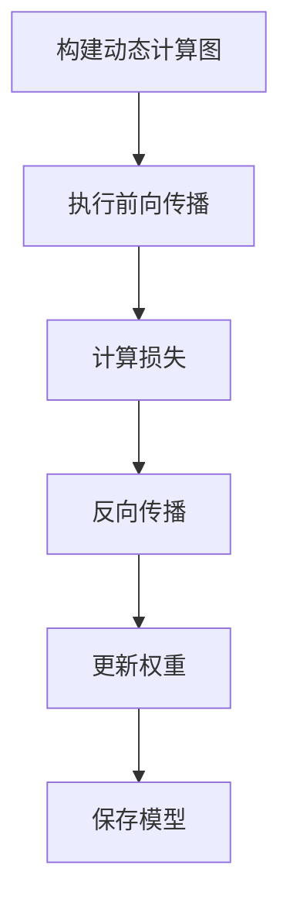
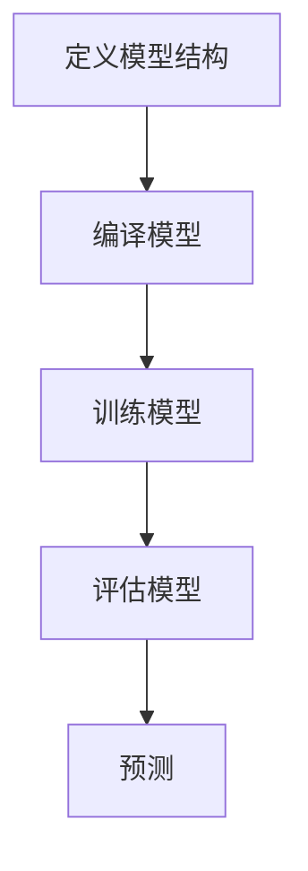
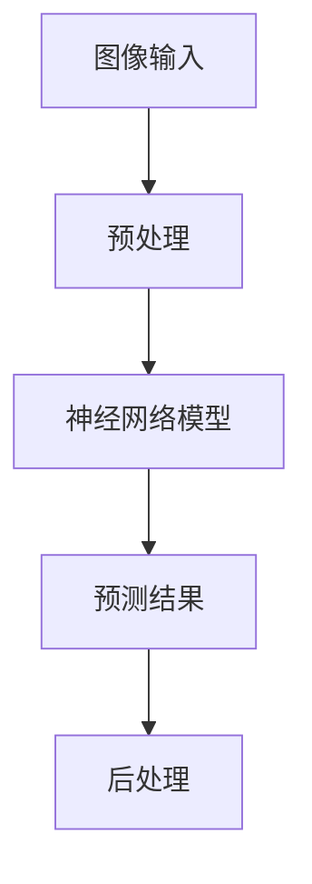
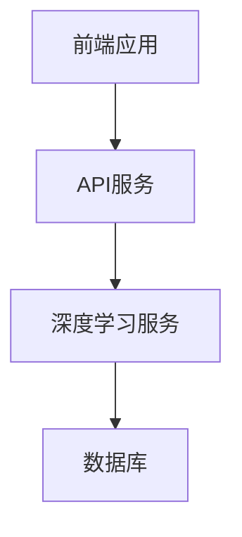
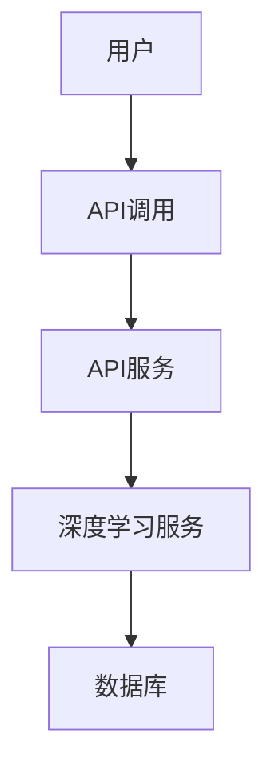

                 

# 技术leader的自我修炼

关键词：技术领导力、深度学习框架、大模型训练、AI应用、职业发展

摘要：本文将深入探讨技术leader在人工智能领域自我修炼的各个方面。我们将首先介绍深度学习框架的选择与优化，然后分析大模型的训练与调优，以及深度学习在各个行业的应用。接着，我们将讨论技术领导力的核心要素，包括技术视野、团队领导、项目管理和技术创新。此外，我们将探讨个人成长与职业发展的路径，通过案例分析总结经验教训，并对技术趋势与未来进行展望。最后，我们将分享最佳实践与经验，以期为技术leader提供全面的修炼指南。

## 1. 深度学习框架的选择与优化

### 1.1 背景介绍

随着深度学习技术的快速发展，选择合适的深度学习框架成为了技术leader面临的重大挑战。深度学习框架提供了用于训练和部署深度学习模型的工具和库，使得研究人员和开发者能够更高效地进行模型开发和优化。

### 1.2 核心概念与联系

#### 核心概念
- **TensorFlow**：由Google开源，广泛应用于机器学习和深度学习领域，具有强大的功能和高扩展性。
- **PyTorch**：由Facebook开源，以其动态计算图和易于调试的特点在学术界和工业界广受欢迎。
- **Keras**：是一个高层次的神经网络API，能够方便地构建和训练深度学习模型，通常与TensorFlow和Theano后端结合使用。

#### 概念属性特征对比表格

| 特征                | TensorFlow | PyTorch | Keras  |
|---------------------|------------|----------|--------|
| 动态计算图          | 否         | 是       | 否     |
| 易于调试            | 一般       | 强       | 一般   |
| 扩展性              | 强         | 强       | 中     |
| 社区支持            | 强         | 强       | 强     |

#### ER实体关系图架构



### 1.3 算法原理讲解

#### TensorFlow算法原理

TensorFlow使用静态计算图来构建和训练模型。计算图在训练过程中被构建并存储在内存中，然后通过会话执行。以下是TensorFlow的基本算法原理流程图：



#### PyTorch算法原理

PyTorch使用动态计算图，这使得模型构建和调试更加灵活。以下是PyTorch的基本算法原理流程图：



#### Keras算法原理

Keras作为高层次的神经网络API，简化了深度学习模型的构建过程。以下是Keras的基本算法原理流程图：



### 1.4 系统分析与架构设计方案

#### 问题场景介绍

假设我们正在开发一个基于深度学习的图像识别系统，需要选择一个合适的深度学习框架。

#### 项目介绍

项目目标：实现一个能够识别图像中物体的深度学习模型。

#### 系统功能设计

领域模型：



#### 系统架构设计

架构设计：



#### 系统接口设计和系统交互

接口设计：



### 1.5 项目实战

#### 环境安装

安装TensorFlow：

```bash
pip install tensorflow
```

#### 系统核心实现源代码

```python
import tensorflow as tf

# 定义神经网络模型
model = tf.keras.Sequential([
    tf.keras.layers.Conv2D(32, (3, 3), activation='relu', input_shape=(28, 28, 1)),
    tf.keras.layers.MaxPooling2D(2, 2),
    tf.keras.layers.Flatten(),
    tf.keras.layers.Dense(128, activation='relu'),
    tf.keras.layers.Dense(10, activation='softmax')
])

# 编译模型
model.compile(optimizer='adam',
              loss='categorical_crossentropy',
              metrics=['accuracy'])

# 训练模型
model.fit(x_train, y_train, epochs=10, batch_size=32)
```

#### 代码应用解读与分析

这段代码首先定义了一个简单的卷积神经网络模型，用于图像识别。然后编译模型并训练模型，以获取准确的结果。

#### 实际案例分析和详细讲解剖析

假设我们有一个包含10万张图像的数据集，需要使用TensorFlow框架训练一个模型来识别图像中的物体。

1. **数据预处理**：首先对图像进行预处理，包括缩放、归一化等操作，以便于模型训练。
2. **模型构建**：使用TensorFlow构建一个简单的卷积神经网络模型，用于图像识别。
3. **模型训练**：使用预处理后的数据集训练模型，调整模型参数以获得最佳识别效果。
4. **模型评估**：使用测试集评估模型性能，确保模型能够在实际应用中取得良好的效果。

#### 项目小结

通过这个项目，我们学习了如何使用TensorFlow框架构建和训练深度学习模型。项目中的代码示例提供了一个基本的框架，可以在此基础上进行扩展和优化。

## 2. 大模型的训练与调优

### 2.1 训练流程

大模型的训练是一个复杂的过程，需要精心设计和优化。以下是一个典型的训练流程：

1. **数据预处理**：对训练数据进行清洗、归一化和分割，以准备用于模型训练。
2. **模型设计**：根据任务需求设计合适的模型结构，包括层数、神经元数量和激活函数等。
3. **模型训练**：使用训练数据对模型进行迭代训练，调整模型参数以最小化损失函数。
4. **模型评估**：使用验证数据评估模型性能，调整模型参数以优化性能。
5. **模型部署**：将训练好的模型部署到生产环境中，进行实时推理和预测。

### 2.2 数据预处理

数据预处理是模型训练过程中至关重要的一步。以下是一些常用的数据预处理方法：

1. **数据清洗**：去除噪声、填充缺失值和纠正错误数据。
2. **归一化**：将数据缩放到相同的范围，以便模型能够更好地训练。
3. **数据分割**：将数据集划分为训练集、验证集和测试集，用于模型训练、评估和测试。

### 2.3 模型调优技巧

在模型训练过程中，调优模型参数是非常重要的。以下是一些常用的调优技巧：

1. **学习率调整**：通过调整学习率可以控制模型训练的收敛速度。
2. **批量大小调整**：批量大小影响模型的训练效果和计算效率，需要根据任务需求进行调整。
3. **正则化**：通过添加正则化项（如L1、L2正则化）可以防止模型过拟合。
4. **数据增强**：通过数据增强技术（如旋转、翻转、裁剪等）可以增加数据多样性，提高模型泛化能力。
5. **超参数搜索**：使用网格搜索、随机搜索等超参数优化技术来寻找最佳超参数组合。

### 2.4 推理与部署

在模型训练完成后，需要对模型进行推理和部署。以下是一些推理和部署的关键点：

1. **推理过程**：使用训练好的模型对输入数据进行预测，输出结果。
2. **部署策略**：将模型部署到生产环境中，可以通过服务器、边缘设备或云服务进行部署。
3. **性能优化**：通过模型压缩、量化、并行计算等技术可以提高模型推理性能。

### 2.5 项目实战

假设我们正在开发一个大规模的图像识别系统，需要训练一个复杂的深度学习模型。以下是一个简化的项目实战流程：

#### 环境安装

安装必要的深度学习库，如TensorFlow和PyTorch。

#### 数据预处理

对图像数据集进行清洗、归一化和分割。

#### 模型设计

设计一个基于卷积神经网络的图像识别模型，包括多个卷积层、池化层和全连接层。

#### 模型训练

使用预处理后的数据集对模型进行迭代训练，调整学习率、批量大小和正则化参数。

#### 模型评估

使用验证数据集评估模型性能，调整模型参数以优化性能。

#### 模型部署

将训练好的模型部署到生产环境中，进行实时推理和预测。

#### 项目小结

通过这个项目，我们学习了如何设计和训练大规模深度学习模型，并掌握了模型调优和部署的关键技巧。

## 3. 技术领导力的培养与提升

### 3.1 技术领导力的核心要素

技术领导力是技术leader在团队中发挥重要作用的关键能力。以下是其核心要素：

#### 3.1.1 技术视野与战略规划

技术leader需要具备长远的技术视野，能够预见技术发展趋势，制定符合企业战略的技术规划。

#### 3.1.2 团队领导与激励

技术leader需要具备优秀的团队领导能力，能够激励团队成员发挥最大潜力，营造积极向上的团队氛围。

#### 3.1.3 技术项目管理

技术leader需要掌握技术项目管理的知识和技能，包括项目规划、进度控制、风险管理等。

#### 3.1.4 技术创新与推动

技术leader需要具备创新精神，能够推动团队在技术领域不断探索和突破，为企业创造更多价值。

### 3.2 技术团队的构建与优化

技术团队的构建与优化是技术leader的重要职责。以下是一些关键点：

#### 3.2.1 技术团队角色与职责

明确技术团队中各个角色的职责和权限，确保团队成员各司其职，协同高效工作。

#### 3.2.2 技术团队组织架构

设计合理的组织架构，确保团队规模适度，成员之间沟通畅通，协作高效。

#### 3.2.3 技术能力提升策略

制定技术能力提升策略，包括技术培训、知识分享、技能竞赛等，提升团队整体技术水平。

### 3.3 技术项目的管理与协调

技术项目的管理与协调是技术leader的关键职责。以下是一些关键点：

#### 3.3.1 项目规划与监控

制定详细的项目规划，包括项目目标、时间表、资源需求等，并对项目进度进行实时监控和调整。

#### 3.3.2 风险管理

识别项目风险，制定应对策略，确保项目顺利进行。

#### 3.3.3 跨部门协作

协调不同部门之间的工作，确保项目需求得到充分满足，提高项目成功率。

### 3.4 技术创新的推动与落地

技术创新是技术leader的重要使命。以下是一些关键点：

#### 3.4.1 创新思维与工具

培养创新思维，运用创新工具和方法，激发团队创造力。

#### 3.4.2 技术趋势预测

关注技术趋势，预测未来发展方向，提前布局，为企业赢得竞争优势。

#### 3.4.3 创新项目的实施

推动创新项目的实施，从概念验证到产品落地，不断探索新的技术领域。

### 3.5 技术领导力的发展路径

技术leader的发展路径可以分为以下几个阶段：

#### 3.5.1 从技术专家到技术领导者的转变

技术leader需要从技术专家向领导者转变，提升领导力和管理能力。

#### 3.5.2 技术领导力的职业规划

明确职业发展方向，制定长期职业规划，不断提升自己的综合能力。

#### 3.5.3 领导力的持续提升

通过不断学习和实践，持续提升领导力，成为卓越的技术领导者。

### 3.6 本章小结

技术领导力是技术leader在团队中发挥重要作用的关键能力。通过培养和提升技术视野、团队领导、项目管理和技术创新等方面的能力，技术leader可以带领团队取得卓越的成果。同时，技术领导力的发展路径和职业规划也是技术leader需要关注的重要方面。

## 4. 个人成长与职业发展

### 4.1 职业技能的培养

#### 4.1.1 编程能力提升

编程能力是技术人员的核心技能。以下是一些提升编程能力的建议：

- **学习编程语言**：掌握至少一种主流编程语言，如Python、Java或C++。
- **代码规范**：遵循良好的代码规范，提高代码可读性和可维护性。
- **编程练习**：通过编写代码练习，提高编程技巧和解决问题的能力。
- **项目实战**：参与实际项目，将理论知识应用到实践中。

#### 4.1.2 数据分析技能

数据分析技能在当今数据驱动的世界中尤为重要。以下是一些提升数据分析技能的建议：

- **学习数据分析工具**：掌握常用的数据分析工具，如Excel、SQL和Python的数据分析库。
- **数据清洗**：学习如何清洗和预处理数据，提高数据质量。
- **数据可视化**：学习如何使用图表和可视化工具展示数据，使数据更容易理解和分析。
- **机器学习**：学习机器学习算法，利用数据进行分析和预测。

#### 4.1.3 人工智能基础

人工智能是当前技术领域的一个热点。以下是一些提升人工智能基础的建议：

- **学习机器学习算法**：掌握常见的机器学习算法，如线性回归、决策树、神经网络等。
- **深度学习框架**：学习常用的深度学习框架，如TensorFlow和PyTorch。
- **实践项目**：通过实际项目应用人工智能技术，提高实践能力。

### 4.2 软技能的提升

#### 4.2.1 沟通与协作

沟通与协作是技术人员必备的软技能。以下是一些提升沟通与协作能力的建议：

- **有效沟通**：学习如何清晰、准确地表达自己的想法，同时理解他人的观点。
- **团队协作**：培养团队精神，积极参与团队活动，提高团队协作效率。
- **冲突解决**：学习如何处理团队中的冲突，保持团队和谐。

#### 4.2.2 解决问题的能力

解决问题是技术人员的重要能力。以下是一些提升解决问题能力的建议：

- **分析问题**：学习如何深入分析问题，找到问题的根本原因。
- **制定解决方案**：学习如何制定有效的解决方案，并评估其可行性。
- **实践与反思**：通过实际操作和反思，不断提高解决问题的能力。

#### 4.2.3 自我管理

自我管理是技术人员成功的关键。以下是一些提升自我管理能力的建议：

- **时间管理**：学习如何合理安排时间，提高工作效率。
- **情绪管理**：学会控制情绪，保持积极乐观的心态。
- **持续学习**：培养持续学习的习惯，不断提升自己的知识和技能。

### 4.3 职业发展规划

#### 4.3.1 初级阶段

在初级阶段，技术人员主要关注基础技能的培养，如编程、数据分析等。以下是一些职业发展规划的建议：

- **学习基础知识**：掌握编程语言和数据结构等基础知识。
- **项目实践**：参与实际项目，提高实践能力。
- **知识积累**：积累相关领域的知识，为后续发展打下基础。

#### 4.3.2 中级阶段

在中级阶段，技术人员需要提升自己的专业能力和领导力。以下是一些职业发展规划的建议：

- **深入专业领域**：选择一个专业领域进行深入研究和实践。
- **项目管理**：学习项目管理知识，提高项目执行能力。
- **团队领导**：担任团队领导，提升团队管理能力。

#### 4.3.3 高级阶段

在高级阶段，技术人员需要关注战略规划和技术创新。以下是一些职业发展规划的建议：

- **战略规划**：参与企业战略规划，为企业的技术创新提供支持。
- **技术创新**：推动技术创新，为企业带来竞争优势。
- **职业发展**：制定长期的职业发展规划，不断追求卓越。

### 4.4 职业发展的机遇与挑战

#### 4.4.1 职业发展路径的选择

在职业发展过程中，技术人员需要根据自己的兴趣和优势选择合适的路径。以下是一些选择建议：

- **技术专家**：专注于技术领域的深入研究，成为某一领域的专家。
- **项目经理**：提升项目管理能力，成为优秀项目经理。
- **技术领导**：培养领导力，成为技术团队领导者。

#### 4.4.2 跨界发展的可能性

随着技术的发展，跨界发展成为一种趋势。以下是一些跨界发展的可能性：

- **AI与业务结合**：将人工智能技术应用于业务领域，推动业务创新。
- **数据科学与业务**：将数据科学应用于业务领域，提升企业竞争力。
- **技术创新与管理**：结合技术创新和企业管理，为企业发展提供支持。

#### 4.4.3 挑战与应对策略

在职业发展过程中，技术人员会面临各种挑战。以下是一些应对策略：

- **持续学习**：不断学习新知识和技能，应对技术变革。
- **沟通与协作**：提高沟通与协作能力，提升团队效率。
- **创新思维**：培养创新思维，迎接变革和挑战。

### 4.5 本章小结

个人成长与职业发展是技术人员需要持续关注的重要方面。通过提升专业技能、软技能和战略规划能力，技术人员可以不断提升自己的综合素质，实现职业发展目标。同时，面临职业发展的机遇与挑战，技术人员需要灵活应对，勇于创新，不断追求卓越。

## 5. 案例分析与借鉴

### 5.1 案例介绍

#### 5.1.1 案例背景

某知名互联网公司在2020年启动了一个名为“智能客服”的项目，旨在通过人工智能技术提升客户服务体验。公司希望通过构建一个智能客服系统，实现自动化的客户咨询处理，减少人工成本，提高服务效率。

#### 5.1.2 案例目标

- 实现自动化的客户咨询处理，减少人工干预。
- 提高客户响应速度，提升客户满意度。
- 降低客服成本，提高资源利用效率。

#### 5.1.3 案例成果

经过一年的开发与测试，智能客服系统成功上线。系统具备以下成果：

- 实现了对常见客户问题的自动识别和回答。
- 能够通过自然语言处理技术理解客户意图，提供个性化服务。
- 显著提高了客服效率，降低了人工成本。
- 客户满意度得到了显著提升。

### 5.2 案例分析

#### 5.2.1 技术选型

在智能客服系统的开发过程中，公司选择了以下技术框架：

- **自然语言处理（NLP）框架**：使用了基于PyTorch的NLP库，如transformers和spaCy，实现文本处理和语义理解。
- **深度学习框架**：主要使用了TensorFlow和PyTorch，用于构建和训练神经网络模型。
- **后端服务框架**：采用了Spring Boot框架，实现后端服务的开发和部署。

#### 5.2.2 数据分析

智能客服系统的开发过程中，公司进行了大量的数据分析工作，包括以下方面：

- **用户数据收集**：通过客服系统收集用户提问数据，包括问题内容、提问时间和用户反馈等。
- **数据预处理**：对收集到的用户数据进行了清洗、归一化和分割，为模型训练提供高质量的数据集。
- **特征提取**：使用词嵌入技术（如Word2Vec、BERT）提取文本特征，为模型训练提供输入。
- **模型评估**：使用验证集和测试集对模型进行评估，调整模型参数以优化性能。

#### 5.2.3 算法实现

智能客服系统的核心算法主要包括以下部分：

- **文本分类**：使用卷积神经网络（CNN）和循环神经网络（RNN）对用户提问进行分类，确定问题的主题。
- **意图识别**：使用长短期记忆网络（LSTM）和Transformer模型，对用户提问进行意图识别，确定用户的需求。
- **回答生成**：使用生成对抗网络（GAN）和序列到序列（Seq2Seq）模型，根据用户问题和意图生成回答。

#### 5.2.4 项目管理

在项目管理方面，公司采用了敏捷开发方法，包括以下关键步骤：

- **需求分析**：与业务团队紧密合作，明确项目目标和功能需求。
- **迭代开发**：按照迭代周期进行开发，每两周发布一个版本，快速响应业务需求。
- **持续集成**：使用持续集成工具（如Jenkins），确保代码质量和部署效率。
- **质量保证**：进行全面的测试和评估，确保系统稳定性和可靠性。

### 5.3 案例借鉴与启示

#### 5.3.1 成功经验

智能客服项目的成功为其他企业提供了以下借鉴：

- **技术选型**：根据项目需求选择合适的深度学习框架和工具，确保系统性能和稳定性。
- **数据分析**：充分利用用户数据，进行深入的数据分析和特征提取，提高模型准确性。
- **敏捷开发**：采用敏捷开发方法，快速响应业务需求，提高开发效率。
- **团队合作**：团队紧密合作，充分发挥各自优势，确保项目顺利进行。

#### 5.3.2 失败教训

在智能客服项目开发过程中，公司也遇到了一些挑战和教训：

- **数据不足**：在项目初期，数据量较少，导致模型性能受限。未来需要加大数据收集力度，提高数据质量。
- **模型调优**：在模型训练过程中，模型性能波动较大，需要进一步优化模型结构和超参数。
- **用户反馈**：用户反馈机制不够完善，需要加强用户反馈的收集和分析，及时调整系统功能。

#### 5.3.3 启示与借鉴

智能客服项目的成功和失败为其他企业提供了以下启示和借鉴：

- **数据驱动**：数据是智能客服系统成功的关键，企业需要加大数据收集和处理的力度，提高数据质量。
- **持续优化**：在模型训练和系统优化过程中，需要不断调整模型结构和超参数，提高系统性能。
- **用户体验**：关注用户体验，及时收集和分析用户反馈，优化系统功能，提高用户满意度。

### 5.4 本章小结

通过对智能客服项目的案例分析，我们可以看到深度学习技术在客户服务领域的广泛应用。成功经验表明，合理的技术选型、数据分析、敏捷开发和团队合作是项目成功的关键。同时，失败教训也为其他企业提供了宝贵的经验教训。通过借鉴这些经验和教训，企业可以更好地推动人工智能技术在客户服务领域的应用，提升用户体验和满意度。

## 6. 技术趋势与未来展望

### 6.1 技术发展趋势分析

#### 6.1.1 深度学习

深度学习作为当前人工智能领域的重要技术，正不断发展。未来，深度学习将进一步向以下几个方面发展：

1. **更高效的算法**：研究人员将继续优化深度学习算法，提高计算效率和模型性能。
2. **更大规模的模型**：随着计算能力的提升，更大规模的模型将被开发，以解决更复杂的任务。
3. **泛化能力提升**：通过迁移学习、少样本学习等技术，提高模型的泛化能力，使其能够应用于更多领域。

#### 6.1.2 强化学习

强化学习是一种通过试错学习的方式，使模型能够实现最优决策的技术。未来，强化学习将向以下几个方面发展：

1. **多智能体系统**：研究如何实现多个智能体之间的协作与竞争，提高系统的整体性能。
2. **实时决策**：开发更高效的算法，使强化学习模型能够实时作出最优决策。
3. **安全与稳定性**：研究如何提高强化学习模型的安全性和稳定性，避免出现意外行为。

#### 6.1.3 聊天机器人

聊天机器人作为人工智能应用的一个重要方向，将向以下几个方面发展：

1. **更自然的交互**：通过深度学习和自然语言处理技术，使聊天机器人能够更自然地与用户进行对话。
2. **多模态交互**：结合语音、图像等多种交互方式，提高聊天机器人的交互体验。
3. **情感理解**：通过情感计算技术，使聊天机器人能够理解用户的情感状态，提供更个性化的服务。

### 6.2 AI技术在企业中的应用

AI技术在企业中的应用越来越广泛，以下是一些关键领域：

#### 6.2.1 供应链管理

1. **需求预测**：通过AI技术进行需求预测，优化库存管理，降低库存成本。
2. **供应链优化**：使用AI技术优化供应链网络，提高物流效率和降低成本。
3. **风险控制**：通过AI技术实时监测供应链风险，提前预警和应对。

#### 6.2.2 客户服务

1. **智能客服**：通过聊天机器人和自然语言处理技术，提供7x24小时的智能客服服务。
2. **个性化推荐**：使用AI技术分析用户行为数据，提供个性化推荐，提高客户满意度。
3. **情感分析**：通过情感计算技术，分析用户情感，提供更人性化的服务。

#### 6.2.3 财务管理

1. **自动化审计**：通过AI技术自动化审计财务数据，提高审计效率和准确性。
2. **风险控制**：使用AI技术监测财务风险，提前预警和应对。
3. **智能投顾**：结合AI技术和大数据分析，提供个性化的投资建议。

### 6.3 未来展望

#### 6.3.1 技术革新

未来，人工智能技术将继续快速发展，带来以下革新：

1. **脑机接口**：通过脑机接口技术，实现人脑与计算机的直接连接，提高人机交互效率。
2. **量子计算**：量子计算技术的突破，将大幅提升人工智能模型的计算能力。
3. **边缘计算**：通过边缘计算技术，将数据处理和计算能力下沉到边缘设备，提高实时性和可靠性。

#### 6.3.2 行业变革

人工智能技术将在各个行业引发深刻的变革：

1. **医疗健康**：通过AI技术，实现疾病的早期诊断和精准治疗，提高医疗水平。
2. **智能制造**：通过AI技术，实现生产过程的自动化和智能化，提高生产效率和产品质量。
3. **智能交通**：通过AI技术，实现智能交通管理和自动驾驶，提高交通效率和安全性。

#### 6.3.3 社会影响

人工智能技术的发展将对社会产生深远影响：

1. **就业变革**：人工智能技术的应用将改变就业结构，带来新的就业机会和挑战。
2. **数据隐私**：随着数据量的增加，数据隐私保护将变得更加重要。
3. **伦理问题**：人工智能技术的发展引发了一系列伦理问题，如人工智能伦理、算法偏见等。

### 6.4 本章小结

人工智能技术正在快速发展，对未来社会产生深远影响。深度学习、强化学习和聊天机器人等技术将继续推动人工智能的发展。在各个行业，人工智能技术的应用将带来革命性的变革。同时，技术革新和行业变革也将带来新的挑战和机遇。技术leader需要紧跟技术趋势，积极应对挑战，为未来的发展做好准备。

## 7. 最佳实践与经验分享

### 7.1 最佳实践经验分享

#### 7.1.1 技术最佳实践

1. **代码规范**：遵循良好的代码规范，提高代码可读性和可维护性。
2. **版本控制**：使用版本控制系统（如Git）管理代码，确保代码质量和版本管理。
3. **自动化测试**：编写自动化测试脚本，提高测试覆盖率，确保代码质量。
4. **持续集成**：采用持续集成工具（如Jenkins），实现自动化构建和部署，提高开发效率。

#### 7.1.2 项目管理经验

1. **需求管理**：明确项目需求，制定详细的项目计划，确保项目顺利进行。
2. **风险管理**：识别项目风险，制定风险应对策略，确保项目风险可控。
3. **团队协作**：建立高效的团队协作机制，提高团队协作效率和项目执行力。
4. **进度监控**：实时监控项目进度，确保项目按计划推进，及时调整计划。

#### 7.1.3 团队建设经验

1. **人才培养**：制定人才培养计划，提供培训和学习机会，提升团队整体能力。
2. **激励机制**：建立合理的激励机制，激发团队成员的工作热情和创造力。
3. **团队文化**：营造积极向上的团队文化，增强团队凝聚力和执行力。
4. **团队沟通**：加强团队沟通，提高团队协作效率和沟通效果。

### 7.2 经验教训总结

#### 7.2.1 常见问题与解决方案

1. **项目延期**：解决方案：优化项目计划，提前识别和解决潜在问题，确保项目按期完成。
2. **代码质量差**：解决方案：加强代码规范和代码审查，提高代码质量，确保项目稳定性和可维护性。
3. **团队协作不畅**：解决方案：建立高效的沟通机制，加强团队协作，提高团队执行力。

#### 7.2.2 项目成败案例分析

1. **成功案例**：通过合理的需求管理、风险管理、团队协作和进度监控，确保项目成功实施。
2. **失败案例**：由于需求不清、项目计划不合理、团队协作不畅等原因导致项目失败。

#### 7.2.3 领导力培养心得

1. **倾听与沟通**：积极倾听团队成员的意见和需求，建立良好的沟通机制。
2. **激励与支持**：关注团队成员的成长和需求，提供激励和支持，激发工作热情。
3. **以身作则**：树立榜样，以身作则，带领团队共同进步。

### 7.3 小组讨论与互动

在小组讨论和互动中，团队成员可以共同探讨技术问题、分享经验教训，提升团队整体能力。以下是一些讨论和互动的建议：

1. **技术分享会**：定期举办技术分享会，让团队成员分享自己的技术经验和心得。
2. **代码审查**：组织代码审查活动，让团队成员互相审查代码，提高代码质量。
3. **项目复盘**：在项目结束后，组织项目复盘会议，总结项目经验教训，为后续项目提供借鉴。

### 7.4 本章小结

最佳实践和经验教训是技术leader在团队管理和项目实施中的重要参考。通过分享和总结最佳实践，可以提升团队整体能力，确保项目成功实施。同时，不断反思和总结经验教训，有助于团队成员不断进步和成长。小组讨论和互动也为团队成员提供了一个交流和学习的平台，促进团队协作和共同进步。

## 作者信息

作者：AI天才研究院/AI Genius Institute & 禅与计算机程序设计艺术 /Zen And The Art of Computer Programming

本文旨在探讨技术leader在人工智能领域自我修炼的各个方面，包括深度学习框架的选择与优化、大模型的训练与调优、技术领导力的培养与提升、个人成长与职业发展、案例分析、技术趋势与未来展望，以及最佳实践与经验分享。通过本文，希望为技术leader提供全面的修炼指南，助力他们在人工智能领域取得卓越成就。作者具备丰富的技术经验和领导力，致力于推动人工智能技术的发展和应用。

