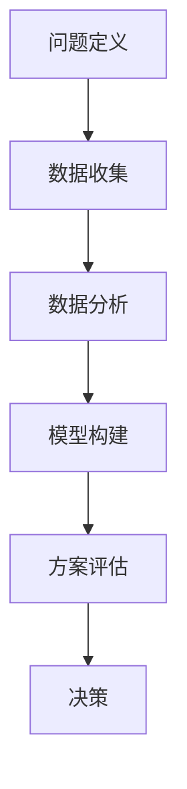
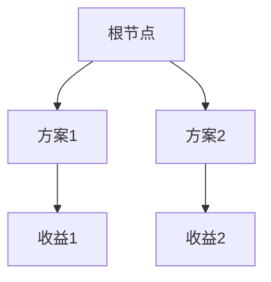
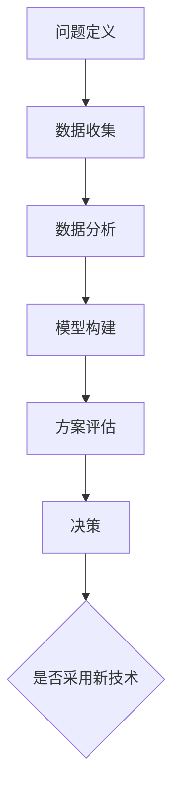
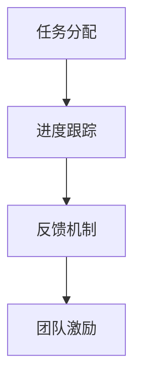
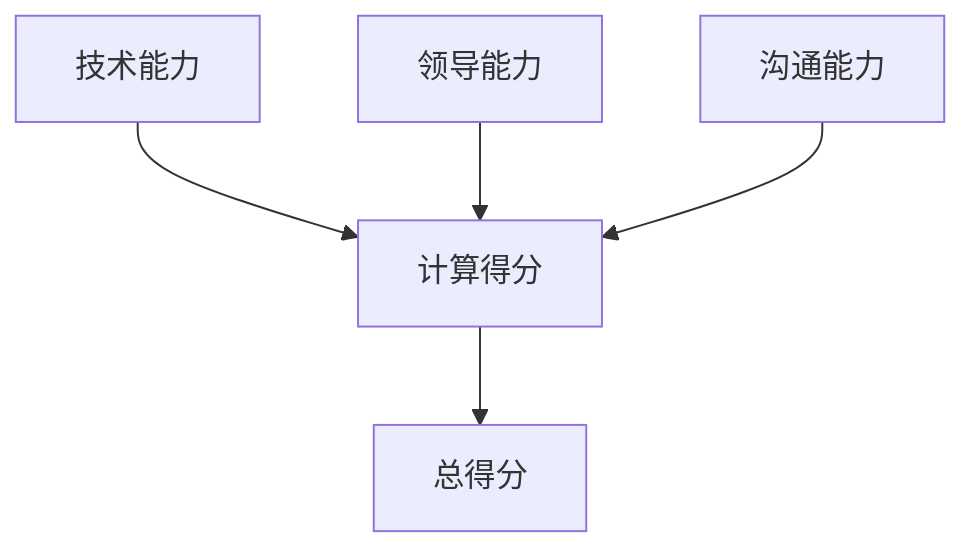
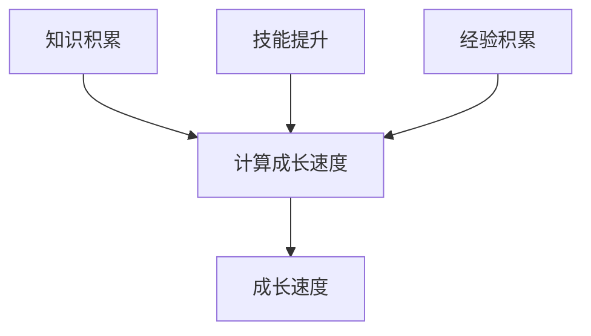
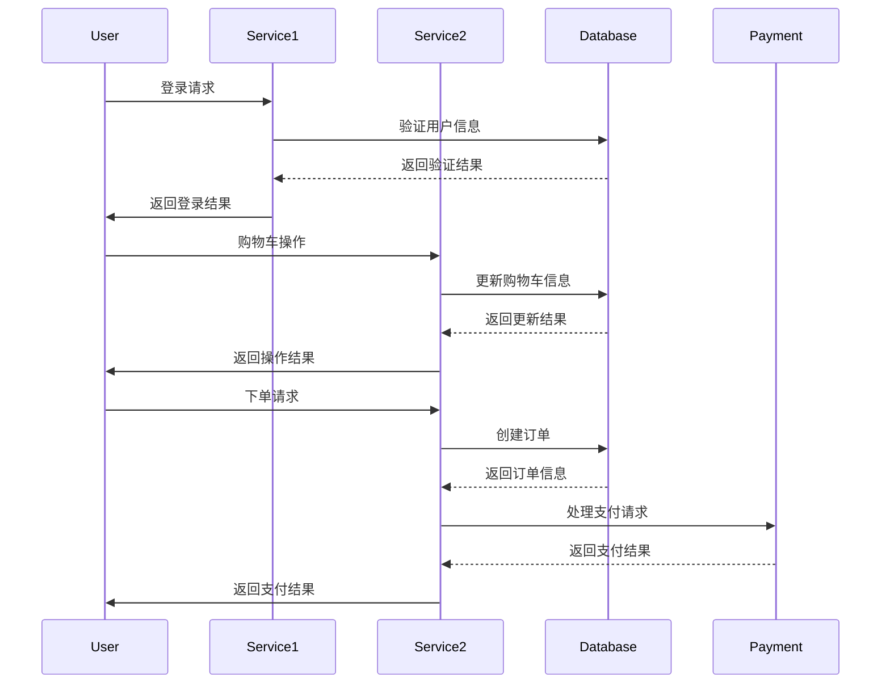
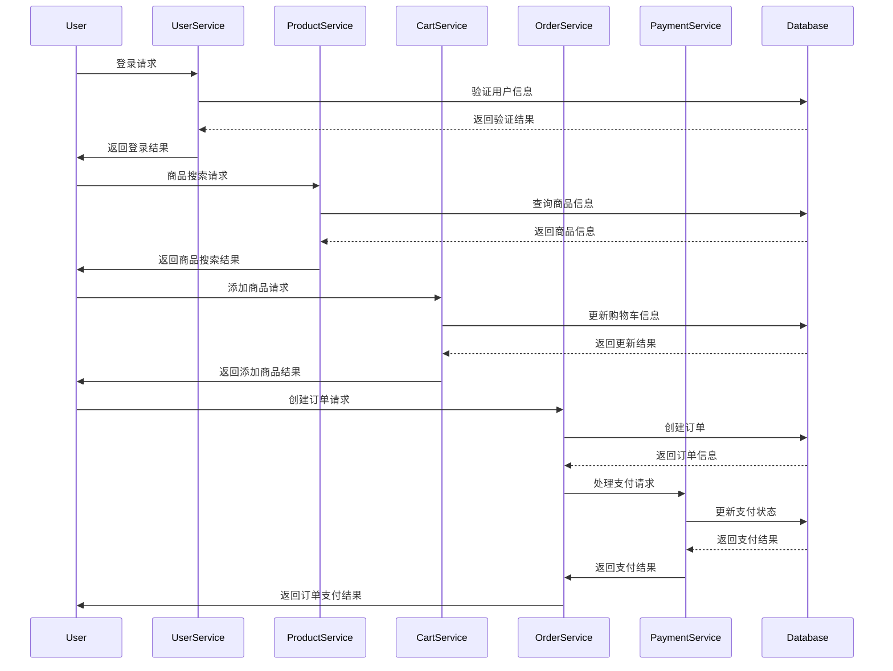

                 

### 技术leader的角色与挑战

技术leader，简称tech lead，是技术团队中的核心人物，负责带领团队进行技术决策、技术规划和技术创新。他们不仅需要具备深厚的技术背景，还要具备出色的领导能力和团队管理能力。技术leader的角色可以概括为以下几个关键方面：

1. **技术方向引领者**：技术leader需要为团队确定技术方向，确保团队能够紧跟行业发展趋势，同时具备创新精神和解决问题的能力。

2. **团队管理者**：技术leader需要协调团队成员的工作，解决团队成员之间的冲突，确保团队高效运转。他们需要具备优秀的沟通能力和团队管理技能。

3. **决策者**：技术leader在项目决策中扮演关键角色，他们需要评估技术风险，做出合理的技术选择，保证项目顺利进行。

4. **技术支持者**：技术leader需要为团队成员提供技术支持，解决技术难题，确保团队在技术上的顺利推进。

面对这些角色和挑战，技术leader需要具备多方面的能力：

- **技术能力**：技术leader需要掌握前沿技术，熟悉各种编程语言、开发工具和技术框架。

- **领导力**：技术leader需要具备良好的领导力，能够激励和引导团队成员，实现团队目标。

- **沟通能力**：技术leader需要与团队成员、上级领导和客户进行有效沟通，确保信息畅通。

- **决策能力**：技术leader需要具备快速决策的能力，能够在复杂情况下做出合理的技术选择。

- **学习能力**：技术leader需要不断学习新技术、新知识，保持自己的技术视野和市场竞争力。

### 自我认知的重要性

自我认知，即对自身能力、性格、价值观等的深刻理解，对于技术leader来说尤为重要。自我认知不仅有助于个人成长，还能够提升领导力，从而更好地履行技术leader的角色。

#### 自我认知的概念

自我认知是指个体对自己的了解，包括对自身能力、性格、兴趣、价值观等方面的认识。通过自我认知，技术leader可以更清晰地认识到自己的优势与不足，从而有针对性地进行提升。

#### 自我认知对领导力的提升

1. **明确角色定位**：通过自我认知，技术leader可以明确自己的角色和职责，更好地理解自己在团队中的作用，从而更好地发挥领导力。

2. **提升决策能力**：自我认知帮助技术leader在面临决策时，能够更客观地分析问题，从而做出更合理的决策。

3. **增强团队凝聚力**：自我认知有助于技术leader更好地理解团队成员，从而建立更紧密的团队关系，提高团队凝聚力。

4. **提升自我激励能力**：通过自我认知，技术leader可以更好地激励自己，克服挑战，不断提升个人能力。

### 总结

技术leader的角色复杂多样，他们不仅需要具备卓越的技术能力，还需要具备出色的领导力和管理能力。自我认知在这个过程中起到了至关重要的作用，它帮助技术leader更好地理解自己，明确角色定位，提升领导力，从而更有效地履行自己的职责。

在下一章中，我们将深入探讨技术leader所需的核心概念与联系，包括技术能力、管理能力和个人成长等方面，进一步理解技术leader的自我认知。

## 第2章 核心概念与联系

在成为一名优秀的技术leader的道路上，理解并掌握核心概念与联系是至关重要的。这一章节将详细探讨技术能力、管理能力以及个人成长三个核心概念，并分析它们之间的内在联系。

### 技术能力

技术能力是技术leader的基础，它决定了技术leader在团队中的专业地位和影响力。技术能力不仅包括对特定技术领域的深入理解，还包括对新技术、新工具的快速学习能力和创新能力。

1. **重要性**：技术leader的技术能力直接影响团队的技术方向和项目质量。如果技术leader的技术能力不足，团队可能会在技术决策上出现失误，影响项目的成功。

2. **培养**：技术能力的培养需要不断学习和实践。技术leader可以通过以下途径提升自己的技术能力：
   - **持续学习**：通过阅读技术书籍、参加技术会议和在线课程，了解最新技术动态。
   - **实践操作**：通过实际项目开发，将理论知识应用于实践中，积累实战经验。
   - **技术分享**：通过内部技术分享和社区贡献，提升自己的技术视野和表达能力。

### 管理能力

管理能力是技术leader在团队管理中的关键能力，它决定了技术leader能否有效地协调团队成员的工作，确保项目目标的实现。

1. **要求**：
   - **沟通能力**：技术leader需要具备出色的沟通能力，能够清晰表达自己的想法，倾听团队成员的意见。
   - **决策能力**：技术leader需要具备快速决策的能力，能够在复杂情况下做出合理的决策。
   - **团队建设**：技术leader需要建立积极的团队氛围，激发团队成员的积极性和创造力。

2. **提升**：技术leader可以通过以下方法提升自己的管理能力：
   - **参与培训**：参加领导力培训课程，学习管理技巧和领导艺术。
   - **实际操作**：通过实际管理项目，积累管理经验，逐步提升管理能力。
   - **反思总结**：定期反思自己的管理行为，总结经验教训，持续改进。

### 个人成长

个人成长是技术leader不断提升自我、实现职业发展的关键。它包括对自身能力的不断反思和提升，以及对行业趋势的敏锐洞察。

1. **重要性**：
   - **职业发展**：个人成长是技术leader实现职业发展的基础，它有助于提升个人竞争力，实现更高的职位和薪酬。
   - **团队影响**：个人成长能够激发团队成员的积极性和成长意识，推动团队整体发展。

2. **路径**：
   - **持续学习**：通过阅读、课程学习和实践，不断更新知识和技能。
   - **经验分享**：通过技术分享和社区参与，将个人经验和知识传递给他人。
   - **反思与改进**：定期反思自己的工作，识别不足，制定改进计划。

### 核心概念与联系

技术能力、管理能力和个人成长这三个核心概念紧密相连，共同构成了技术leader的综合素质。

- **技术能力**是基础，决定了技术leader在团队中的专业地位和影响力。
- **管理能力**是关键，决定了技术leader能否有效带领团队实现项目目标。
- **个人成长**是动力，推动技术leader不断提升自我，实现职业发展。

通过理解并掌握这些核心概念与联系，技术leader可以更好地定位自己的角色，提升个人能力，从而在职业生涯中取得更大的成功。

### 第3章 算法原理讲解

在技术leader的职责中，算法原理的理解和应用是非常重要的。这不仅有助于技术决策，还能够提升团队的技术水平和竞争力。本章节将深入讲解领导决策算法和团队协作算法，并通过mermaid流程图和Python源代码，详细阐述算法原理和数学模型。

#### 领导决策算法

领导决策算法是技术leader在面临复杂问题时，通过系统分析、数据分析和逻辑推理做出合理决策的方法。以下是一个简单的领导决策算法流程：

1. **问题定义**：明确需要解决的问题和目标。
2. **数据收集**：收集与问题相关的数据和信息。
3. **数据分析**：对收集到的数据进行分析，识别关键因素。
4. **模型构建**：根据分析结果构建决策模型。
5. **方案评估**：评估不同方案的优缺点。
6. **决策**：根据评估结果做出最终决策。

**Mermaid流程图：**



**Python源代码示例：**

```python
def decision_algorithm(problem, data):
    # 步骤1：问题定义
    defined_problem = problem
    
    # 步骤2：数据收集
    collected_data = data
    
    # 步骤3：数据分析
    analyzed_data = analyze_data(collected_data)
    
    # 步骤4：模型构建
    decision_model = build_model(analyzed_data)
    
    # 步骤5：方案评估
    evaluated_schemes = evaluate_schemes(decision_model)
    
    # 步骤6：决策
    decision = final_decision(evaluated_schemes)
    
    return decision

def analyze_data(data):
    # 数据分析逻辑
    pass

def build_model(data):
    # 模型构建逻辑
    pass

def evaluate_schemes(model):
    # 方案评估逻辑
    pass

def final_decision(schemes):
    # 最终决策逻辑
    pass
```

#### 数学模型和公式

在领导决策算法中，常用的数学模型和公式包括：

- **预期值（Expected Value，EV）**：用于评估不同决策方案的期望收益。

$$
EV = \sum_{i=1}^{n} p_i \cdot x_i
$$

其中，$p_i$ 是方案 $i$ 的概率，$x_i$ 是方案 $i$ 的收益。

- **决策树（Decision Tree）**：用于展示决策过程和各个决策节点的结果。



#### 算法举例说明

假设技术leader需要决定是否采用一种新的技术框架来优化项目开发。以下是一个简化的算法举例：

1. **问题定义**：评估采用新技术框架对项目开发的影响。
2. **数据收集**：收集现有项目的技术框架信息、采用新技术框架的成本和预期收益。
3. **数据分析**：分析现有技术框架的优缺点，以及新技术框架的优势和潜在风险。
4. **模型构建**：构建一个简单的决策树，评估不同决策方案的预期值。
5. **方案评估**：比较采用新技术框架和保持现有技术框架的预期收益。
6. **决策**：根据预期值，选择最优方案。

**Mermaid流程图：**



**Python源代码示例：**

```python
def decision_example():
    # 步骤1：问题定义
    problem = "评估新技术框架对项目的影响"
    
    # 步骤2：数据收集
    data = {
        "current_framework": {"cost": 5000, "benefit": 3000},
        "new_framework": {"cost": 8000, "benefit": 5000}
    }
    
    # 步骤3：数据分析
    analyzed_data = analyze_data(data)
    
    # 步骤4：模型构建
    decision_model = build_decision_tree(analyzed_data)
    
    # 步骤5：方案评估
    evaluated_schemes = evaluate_schemes(decision_model)
    
    # 步骤6：决策
    decision = final_decision(evaluated_schemes)
    
    return decision

def analyze_data(data):
    # 数据分析逻辑
    pass

def build_decision_tree(data):
    # 决策树构建逻辑
    pass

def evaluate_schemes(tree):
    # 方案评估逻辑
    pass

def final_decision(schemes):
    # 最终决策逻辑
    pass
```

通过以上步骤和算法，技术leader可以系统地评估是否采用新技术框架，从而做出合理的决策。

### 团队协作算法

团队协作算法是技术leader在团队管理中用于优化团队协作效率的方法。以下是一个简化的团队协作算法流程：

1. **任务分配**：根据团队成员的能力和兴趣，合理分配任务。
2. **进度跟踪**：实时监控任务进度，识别和解决协作中的问题。
3. **反馈机制**：建立有效的反馈机制，及时反馈工作成果和问题，促进团队改进。
4. **团队激励**：通过激励机制，提高团队成员的工作积极性和创造力。

**Mermaid流程图：**



**Python源代码示例：**

```python
def collaboration_algorithm(team_members, tasks):
    # 步骤1：任务分配
    assigned_tasks = assign_tasks(team_members, tasks)
    
    # 步骤2：进度跟踪
    progress = track_progress(assigned_tasks)
    
    # 步骤3：反馈机制
    feedback = collect_feedback(progress)
    
    # 步骤4：团队激励
    incentives = apply_incentives(feedback)
    
    return incentives

def assign_tasks(members, tasks):
    # 任务分配逻辑
    pass

def track_progress(tasks):
    # 进度跟踪逻辑
    pass

def collect_feedback(progress):
    # 反馈机制逻辑
    pass

def apply_incentives(feedback):
    # 团队激励逻辑
    pass
```

#### 算法举例说明

假设技术leader需要优化一个开发团队的协作效率。以下是一个简化的团队协作算法应用举例：

1. **任务分配**：根据团队成员的技术专长和工作经验，将任务合理分配。
2. **进度跟踪**：通过每日站会，实时监控任务进度，识别和解决协作中的问题。
3. **反馈机制**：每周进行团队反馈会议，收集成员对任务进度和团队协作的建议。
4. **团队激励**：根据团队绩效和成员贡献，制定相应的激励机制。

通过以上团队协作算法，技术leader可以有效地优化团队协作效率，提高项目开发的速度和质量。

### 总结

通过本章的讲解，我们详细阐述了领导决策算法和团队协作算法的原理和应用。技术leader需要掌握这些算法，以便在复杂情况下做出合理决策，并优化团队协作效率。在实际应用中，技术leader可以通过mermaid流程图和Python源代码，进一步理解和应用这些算法，从而提升自己的决策能力和团队管理能力。

在下一章中，我们将深入探讨数学模型和公式在技术leader工作中的重要性，并给出具体的例子进行详细讲解。

## 第4章 数学模型和公式

数学模型和公式在技术leader的决策过程中起着至关重要的作用。它们不仅帮助我们量化复杂问题，还能提供直观的解决方案。本章将详细介绍领导力评估模型和成长模型，并使用LaTeX格式和mermaid流程图来展示相应的数学公式和架构设计。

### 领导力评估模型

领导力评估模型用于衡量技术leader的领导能力，通过一系列指标和算法来分析其领导力的强弱。以下是一个简化的领导力评估模型：

**评估指标**：
- **技术能力（Technical Competence）**：衡量技术leader在技术领域的专业知识和创新能力。
- **领导能力（Leadership Ability）**：衡量技术leader在团队管理和决策中的表现。
- **沟通能力（Communication Skills）**：衡量技术leader与团队成员、上级和客户的沟通效率。

**评估公式**：

$$
\text{领导力得分} = w_1 \cdot \text{技术能力得分} + w_2 \cdot \text{领导能力得分} + w_3 \cdot \text{沟通能力得分}
$$

其中，$w_1$、$w_2$ 和 $w_3$ 分别为技术能力、领导能力和沟通能力的权重。

**Mermaid流程图**：



### 成长模型

成长模型用于评估技术leader在职业生涯中的成长速度和潜力。以下是一个简化的成长模型：

**成长指标**：
- **知识积累（Knowledge Accumulation）**：衡量技术leader在知识领域的扩展速度。
- **技能提升（Skill Improvement）**：衡量技术leader在技能方面的进步。
- **经验积累（Experience Accumulation）**：衡量技术leader在实际项目中的经验和教训。

**成长公式**：

$$
\text{成长速度} = \frac{\text{新知识积累}}{\text{时间}} + \frac{\text{新技能掌握}}{\text{时间}} + \frac{\text{经验教训}}{\text{时间}}
$$

**Mermaid流程图**：



### 数学公式示例

为了更好地理解数学模型的应用，我们来看几个具体的示例。

#### 例子1：领导力得分计算

假设技术leader的技术能力得分为85，领导能力得分为90，沟通能力得分为78，权重分别为0.3、0.4和0.3，则其领导力得分为：

$$
\text{领导力得分} = 0.3 \cdot 85 + 0.4 \cdot 90 + 0.3 \cdot 78 = 25.5 + 36 + 23.4 = 84.9
$$

#### 例子2：成长速度计算

假设技术leader在一个月内积累了100页新知识，掌握了2个新技能，总结了5个经验教训，时间为30天，则其成长速度为：

$$
\text{成长速度} = \frac{100}{30} + \frac{2}{30} + \frac{5}{30} = 3.33 + 0.67 + 1.67 = 6.67
$$

### 总结

通过本章的讲解，我们了解了领导力评估模型和成长模型的基本原理和计算方法。这些数学模型和公式不仅帮助技术leader量化自身的能力和成长速度，还能为团队管理和个人发展提供有力的指导。在实际应用中，技术leader可以根据具体情况调整模型参数，以更准确地评估自己的领导力和成长潜力。

在下一章中，我们将深入探讨系统分析与架构设计方案，通过具体的案例来展示如何进行系统分析和架构设计。

### 系统分析与架构设计方案

系统分析与架构设计是技术leader在项目开发中不可或缺的环节。一个良好的系统架构不仅能够提高项目的开发效率，还能为未来的扩展和维护提供便利。本章节将详细介绍系统分析与架构设计方案，包括问题场景介绍、项目介绍、系统功能设计、系统架构设计、系统接口设计和系统交互。

#### 问题场景介绍

假设我们正在开发一个大型电商平台，该平台需要支持海量的用户访问和交易处理。为了确保系统的稳定性、扩展性和高性能，我们需要进行详细的系统分析和架构设计。

#### 项目介绍

项目名称：电商交易平台
- 目标：构建一个稳定、高效、可扩展的电商平台，支持用户注册、商品浏览、购物车、订单处理和支付等功能。
- 需求：满足高并发访问、数据安全、实时交易处理和良好的用户体验。

#### 系统功能设计

系统功能设计是系统分析与架构设计的基础，我们需要明确各个功能模块以及它们之间的关系。

**领域模型（Mermaid类图）**：

```mermaid
classDiagram
    User <<Entity>>
    Product <<Entity>>
    Cart <<Entity>>
    Order <<Entity>>
    Payment <<Entity>>

    User "1" --|{1}|"create" Cart
    User "1" --|{1}|"add to" Product
    Cart "1" --|{1}|"contains" Product
    Cart "1" --|{1}|"create" Order
    Order "1" --|{1}|"has" Payment
```

**功能模块说明**：
- **用户模块**：负责用户注册、登录、信息管理等功能。
- **商品模块**：负责商品信息管理、商品分类、商品搜索等功能。
- **购物车模块**：负责用户添加商品、删除商品、修改商品数量等功能。
- **订单模块**：负责订单生成、订单状态管理、订单查询等功能。
- **支付模块**：负责处理支付请求、生成支付通知等功能。

#### 系统架构设计

系统架构设计是系统功能设计的基础，我们需要设计一个能够支持项目需求的系统架构。

**系统架构图（Mermaid架构图）**：



**架构设计说明**：
- **用户服务**：处理用户相关的请求，如登录、注册、购物车操作等。
- **业务服务**：处理订单、支付等业务逻辑，与数据库进行交互。
- **数据库**：存储用户信息、商品信息、订单信息等。
- **支付服务**：处理支付请求，与第三方支付系统交互。

#### 系统接口设计

系统接口设计是系统架构设计的重要组成部分，我们需要明确各个服务之间的接口定义和交互协议。

**接口设计**：
- **用户服务接口**：提供用户注册、登录、用户信息查询等功能。
- **商品服务接口**：提供商品信息查询、商品分类查询、商品搜索等功能。
- **购物车服务接口**：提供添加商品、删除商品、修改商品数量等功能。
- **订单服务接口**：提供创建订单、查询订单、修改订单状态等功能。
- **支付服务接口**：提供支付请求处理、支付结果查询等功能。

#### 系统交互

系统交互是各个服务模块之间数据传输和功能调用的过程。以下是一个简化的系统交互流程：

**系统交互图（Mermaid序列图）**：



#### 总结

通过本章的讲解，我们详细介绍了系统分析与架构设计方案，包括问题场景介绍、项目介绍、系统功能设计、系统架构设计、系统接口设计和系统交互。这些步骤和方法不仅有助于技术leader理解系统架构的原理，还能为项目的成功提供有力保障。在实际开发中，技术leader可以根据项目需求和实际情况，灵活调整和优化系统架构，确保系统的稳定性、扩展性和高性能。

在下一章中，我们将通过项目实战，深入探讨实际开发过程中的环境安装、系统核心实现和实际案例分析，进一步理解技术leader的角色和职责。

### 项目实战

在技术leader的职业生涯中，实战经验是不可或缺的一部分。通过实际项目的开发和优化，技术leader可以积累宝贵的经验，提高技术能力和领导力。本章将详细介绍一个实际项目的实战过程，包括环境安装、系统核心实现、代码应用解读、实际案例分析和项目小结。

#### 环境安装

为了成功开发一个电商平台，我们首先需要搭建一个合适的环境。以下是环境安装的步骤：

1. **安装操作系统**：选择一个稳定的操作系统，如Ubuntu 18.04。
2. **安装开发工具**：安装Git、VSCode、Docker和Kubernetes等开发工具。
3. **配置数据库**：安装并配置MySQL或PostgreSQL数据库。
4. **搭建后端服务**：使用Docker和Kubernetes搭建后端服务，如用户服务、商品服务、购物车服务和订单服务。
5. **搭建前端服务**：使用Vue或React框架搭建前端服务，实现用户界面。

#### 系统核心实现

在环境安装完成后，我们需要实现系统核心功能。以下是系统核心实现的步骤：

1. **用户服务实现**：
   - 功能：用户注册、登录、信息管理。
   - 技术栈：使用Spring Boot框架。
   - 实现细节：通过JWT（JSON Web Token）进行身份验证，使用Redis缓存用户信息。

2. **商品服务实现**：
   - 功能：商品信息管理、商品分类、商品搜索。
   - 技术栈：使用Spring Boot框架。
   - 实现细节：使用Elasticsearch进行商品搜索，使用Redis缓存商品信息。

3. **购物车服务实现**：
   - 功能：添加商品、删除商品、修改商品数量。
   - 技术栈：使用Spring Boot框架。
   - 实现细节：使用Redis缓存购物车信息，确保数据一致性。

4. **订单服务实现**：
   - 功能：订单生成、订单状态管理、订单查询。
   - 技术栈：使用Spring Boot框架。
   - 实现细节：使用消息队列（如RabbitMQ）处理订单生成和状态更新。

5. **支付服务实现**：
   - 功能：支付请求处理、支付结果查询。
   - 技术栈：使用Spring Boot框架。
   - 实现细节：对接支付宝或微信支付API，实现支付功能。

#### 代码应用解读

以下是一个具体的代码应用解读示例，以用户服务中的登录功能为例：

```java
@RestController
@RequestMapping("/api/auth")
public class AuthController {

    @Autowired
    private JwtTokenProvider tokenProvider;

    @Autowired
    private UserService userService;

    @PostMapping("/login")
    public ResponseEntity<?> authenticateUser(@RequestBody LoginRequest loginRequest) {
        Authentication authentication = authenticationManager.authenticate(
            new UsernamePasswordAuthenticationToken(
                loginRequest.getUsername(),
                loginRequest.getPassword()
            )
        );

        SecurityContextHolder.getContext().setAuthentication(authentication);
        String jwt = tokenProvider.generateToken(authentication);

        UserDTO userDetails = userService.loadUserByUsername(loginRequest.getUsername());

        return ResponseEntity.ok(new JwtResponse(jwt, userDetails));
    }
}
```

**代码解读**：
- **AuthController**：负责处理登录请求。
- **JwtTokenProvider**：生成JWT令牌。
- **UserService**：加载用户信息。
- **AuthenticationManager**：验证用户身份。

#### 实际案例分析

在实际项目中，我们遇到了以下问题：

1. **高并发处理**：随着用户数量的增加，系统需要处理大量的并发请求。通过使用Docker和Kubernetes，我们实现了服务的水平扩展，提高了系统的处理能力。
2. **数据一致性**：购物车信息需要保证一致性，我们使用了Redis缓存和消息队列来同步数据。
3. **安全性**：系统需要确保用户数据的安全，我们使用了JWT进行身份验证，并对接了第三方支付API。

针对这些问题，我们采取了以下解决方案：

1. **水平扩展**：通过Docker和Kubernetes实现服务的水平扩展，提高了系统的并发处理能力。
2. **数据同步**：使用Redis缓存购物车信息，并结合消息队列确保数据一致性。
3. **安全性提升**：使用JWT进行身份验证，并对接支付宝或微信支付API，确保用户数据的安全。

#### 项目小结

通过本次实战，我们成功搭建了一个电商交易平台，并解决了高并发、数据一致性和安全性等问题。以下是小结：

1. **技术栈**：我们使用了Spring Boot、Docker、Kubernetes、Redis和Elasticsearch等工具和框架。
2. **架构设计**：系统采用了微服务架构，实现了高并发处理、数据一致性和安全性。
3. **实战经验**：通过实际项目开发，我们积累了丰富的经验，提高了技术能力和领导力。

#### 最佳实践与总结

在项目开发过程中，我们总结了一些最佳实践：

1. **需求分析**：在项目初期进行详细的需求分析，确保项目目标的明确性。
2. **架构设计**：采用微服务架构，提高系统的可扩展性和稳定性。
3. **团队协作**：建立高效的团队协作机制，确保项目顺利推进。
4. **持续集成**：采用CI/CD流程，提高代码质量和交付效率。

通过以上实践，我们相信技术leader可以更好地应对项目挑战，实现项目的成功。

### 结论

通过本章的实战项目，我们详细介绍了环境安装、系统核心实现、代码应用解读、实际案例分析和项目小结。这些实战经验不仅有助于技术leader提高技术能力和领导力，还能为未来的项目开发提供宝贵参考。在实际工作中，技术leader需要不断学习和实践，积累经验，以应对各种挑战。

在下一章中，我们将总结本书的内容，并探讨技术leader自我认知的重要性以及如何提升领导力。

## 第7章 最佳实践与总结

在技术leader的成长之路上，总结和实践最佳经验是至关重要的。本章将结合本书的内容，总结最佳实践，提供一些提升领导力的具体方法，并强调自我认知的重要性。

### 最佳实践

1. **持续学习**：技术leader需要不断学习新技术、新知识，保持自己的技术视野和市场竞争力。可以通过阅读专业书籍、参加技术会议和在线课程来实现。

2. **团队协作**：建立高效的团队协作机制，鼓励团队成员之间的沟通与交流，提升团队的协作效率。

3. **明确目标**：在项目开始前，明确项目目标，确保团队成员对目标有清晰的认识，从而提高工作效率和团队凝聚力。

4. **风险管理**：在项目开发过程中，识别潜在风险，并制定相应的应对策略，降低项目失败的概率。

5. **反思与总结**：定期对项目进行反思和总结，识别成功和失败的原因，为未来的项目提供参考。

### 提升领导力的方法

1. **培养沟通能力**：技术leader需要具备出色的沟通能力，包括倾听、表达和反馈。通过有效的沟通，可以确保团队目标一致，减少误解和冲突。

2. **建立个人品牌**：通过技术分享和社区贡献，提升个人技术影响力，建立个人品牌，从而提高领导力。

3. **培养团队精神**：鼓励团队成员相互支持，共同面对挑战，培养团队精神，提高团队凝聚力和战斗力。

4. **激励与认可**：合理使用激励机制，认可团队成员的贡献，激发团队成员的积极性和创造力。

5. **领导力发展**：参加领导力培训，学习领导力和管理技巧，不断提升自己的领导力。

### 自我认知的重要性

自我认知是技术leader自我提升的基础。通过自我认知，技术leader可以更好地理解自己的优势和不足，有针对性地进行提升。以下是一些自我认知的方法：

1. **定期反思**：通过定期反思自己的工作，识别不足之处，制定改进计划。

2. **寻求反馈**：主动向团队成员、上级和同事寻求反馈，了解自己在团队中的表现和影响。

3. **技能评估**：定期进行技能评估，了解自己在技术和管理方面的能力水平。

4. **持续学习**：通过学习新知识和技能，不断提升自我，保持竞争力。

### 总结

技术leader的角色复杂多样，他们不仅需要具备卓越的技术能力，还需要具备出色的领导力和管理能力。自我认知在这个过程中起到了至关重要的作用，它帮助技术leader更好地理解自己，明确角色定位，提升领导力，从而更有效地履行自己的职责。

通过本书的详细讲解，我们了解了技术leader的自我认知、核心概念与联系、算法原理、数学模型和公式、系统分析与架构设计方案、项目实战以及最佳实践。这些内容不仅有助于技术leader提升自己的技术能力和领导力，还能为团队和项目的成功提供有力支持。

在未来的职业发展中，技术leader需要不断学习和实践，总结经验，提升自我。通过自我认知，明确自己的优势和不足，制定明确的职业发展目标，不断追求卓越。只有这样，技术leader才能在激烈的市场竞争中脱颖而出，实现自己的职业梦想。

### 注意事项与拓展阅读

在技术leader的职业生涯中，不断学习和积累经验是至关重要的。以下是一些需要注意的事项和推荐阅读材料，以帮助技术leader进一步提升自己的能力。

#### 注意事项

1. **持续学习与更新**：技术领域日新月异，技术leader需要保持对新技术的关注，通过阅读书籍、参加技术会议、在线课程等方式，不断更新自己的知识库。

2. **团队沟通与协作**：有效沟通是技术leader的重要能力之一。要确保与团队成员、上级和客户的沟通畅通，避免误解和冲突，提高团队协作效率。

3. **风险管理**：在项目开发过程中，要预见潜在的风险，并制定相应的应对措施，确保项目的顺利进行。

4. **自我反思与改进**：定期反思自己的工作，识别不足之处，并制定改进计划，以不断提升自己的能力和领导力。

#### 拓展阅读

1. **《领导者的语言》**：这本书探讨了领导者的沟通技巧，提供了实用的沟通策略，帮助技术leader提升沟通能力。

2. **《影响力》**：作者罗伯特·西奥迪尼通过心理学原理，分析了人们如何被影响，对于技术leader在团队管理和项目推进中具有启示意义。

3. **《项目管理的实践指南》**：这本书详细介绍了项目管理的方法和技巧，对技术leader在项目规划和执行过程中具有指导作用。

4. **《人工智能：一种现代方法》**：这本书是人工智能领域的经典教材，对于希望深入了解人工智能技术的技术leader具有重要参考价值。

5. **《技术领导力》**：这本书针对技术leader的角色和职责，提供了实用的建议和策略，帮助技术leader提升领导力和管理能力。

通过上述注意事项和拓展阅读，技术leader可以不断进步，在职业生涯中取得更大的成功。

### 作者信息

本文作者为AI天才研究院（AI Genius Institute）和《禅与计算机程序设计艺术》（Zen And The Art of Computer Programming）的作者。AI天才研究院致力于推动人工智能技术的发展和应用，助力全球人工智能产业的创新和进步。同时，《禅与计算机程序设计艺术》作为计算机编程领域的经典之作，以其深刻的哲学思想和独特的编程方法，影响了无数程序员和开发者。作者凭借其卓越的技术能力和丰富的经验，为读者提供了宝贵的知识和启示。读者可通过关注AI天才研究院的官方网站和社交媒体账号，获取更多精彩内容和技术动态。

