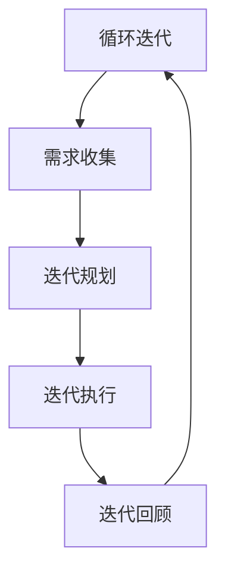
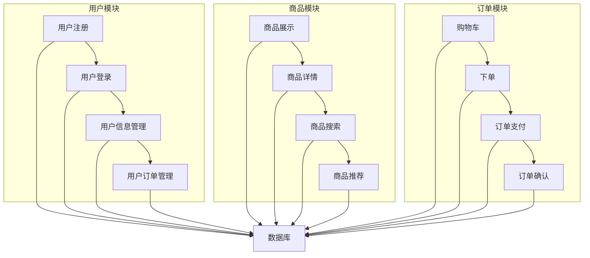
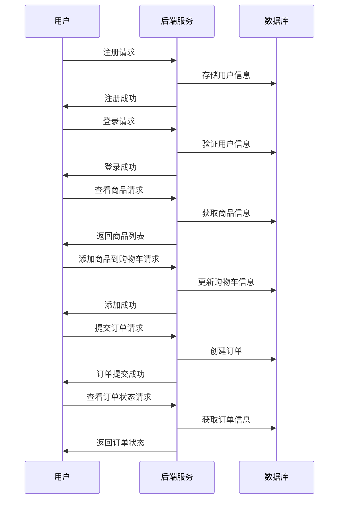
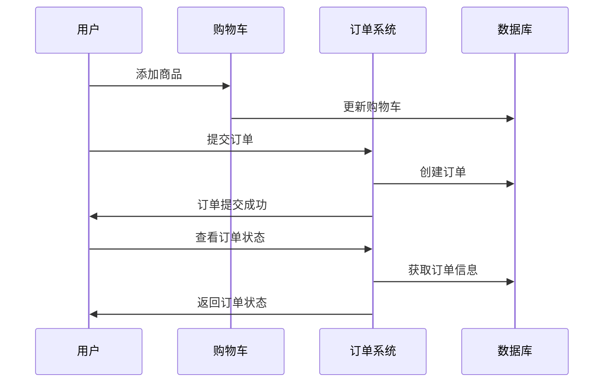

                 

### 文章标题

# 技术leader的角色定位与调整

### 关键词

- 技术leader
- 角色定位
- 角色调整
- 领导力
- 团队管理
- 项目管理

### 摘要

本文旨在探讨技术leader在现代技术环境下的角色定位与调整策略。通过分析当前技术发展的趋势和市场需求，本文将讨论技术leader如何进行角色定位，如何在不断变化的环境中调整自己的角色，以及如何提升自身领导力以应对新的挑战。文章结构清晰，内容深入浅出，适合技术团队管理者、项目经理以及对技术领导力感兴趣的读者阅读。

#### 目录

1. **引言**
   - **问题背景**
   - **问题描述**
   - **问题解决**
   - **边界与外延**
   - **概念结构与核心要素组成**

2. **技术领导者概述**
   - **定义与技术领导者职责**
   - **技术领导者与项目经理的区别**

3. **角色定位策略**
   - **内部领导者与外部合作伙伴的定位**
   - **技术深度与广度的平衡**
   - **定位案例解析**

4. **角色调整策略**
   - **市场环境分析**
   - **技术趋势与前瞻**
   - **领导力模型与技能提升**

5. **技术领导者角色实践**
   - **团队管理与文化建设**
   - **项目管理与优化**
   - **技术路线规划与战略布局**

6. **跨部门协作与资源整合**
   - **跨部门协作机制**
   - **资源整合与优化**

7. **技术领导者的个人成长与发展**
   - **自我认知与反思**
   - **职业发展规划**

8. **总结与展望**
   - **全书要点回顾**
   - **未来趋势展望**
   - **拓展阅读与参考资料**

#### 引言

在当今快速发展的技术时代，技术leader的角色显得尤为重要。他们不仅要具备深厚的技术功底，还需要具备出色的领导能力和管理技能。然而，随着技术的不断更新和市场的快速变化，技术leader面临着前所未有的挑战。如何进行角色定位与调整，以适应新的环境和需求，成为了一个亟待解决的问题。

**问题背景**：

- 技术环境的快速发展，新的技术不断涌现，技术leader需要不断学习新知识，提升自身技能。
- 市场需求的变化，客户需求越来越多样化，技术leader需要具备快速响应和调整的能力。
- 团队管理挑战，技术leader需要领导一个高效的团队，激发团队成员的潜力。

**问题描述**：

- 技术leader如何进行角色定位，以确保自己的职责清晰，并能有效管理团队和项目？
- 技术leader如何进行角色调整，以适应不断变化的市场环境和技术趋势？
- 技术leader如何提升自身的领导力和管理技能，以应对新的挑战？

**问题解决**：

- 通过系统的方法和策略，帮助技术leader进行角色定位与调整。
- 通过案例分析，提供实际操作的经验和教训。
- 提供实用的领导力和管理技能提升路径和方法。

**边界与外延**：

- 本文主要探讨技术leader在软件和信息技术领域的角色定位与调整。
- 本文涉及的核心概念包括领导力、团队管理、项目管理和技术趋势等。

**概念结构与核心要素组成**：

- **领导力**：技术leader的核心能力，包括决策能力、沟通能力、激励能力等。
- **团队管理**：技术leader需要领导和管理团队，包括团队建设、绩效管理、冲突解决等。
- **项目管理**：技术leader需要负责项目的规划、执行和监控，确保项目按时按质完成。
- **技术趋势**：技术leader需要关注最新的技术趋势，以便进行角色调整和技能提升。

通过上述核心要素的组成，技术leader可以在快速变化的环境中，有效地进行角色定位与调整，提升自身的领导力和管理效能。接下来，本文将详细探讨技术leader的角色定位与调整策略，以帮助技术领导者更好地应对挑战和机遇。### 第一部分：引言

#### 1. 问题背景

在当前技术迅猛发展的时代，技术leader的角色显得愈发重要。技术的快速迭代和创新带来了前所未有的机会，同时也带来了巨大的挑战。技术leader不仅需要具备扎实的技术背景，还需要具备卓越的领导力和管理能力，以便在复杂多变的环境中引领团队，推动项目成功。

**技术环境的快速发展**：随着人工智能、云计算、大数据、区块链等新兴技术的不断涌现，技术leader需要不断学习新知识，提升自身技能，以保持竞争力。技术的快速更新意味着技术leader必须具备快速学习的能力，以便及时掌握新技术，并将其应用到项目中。

**市场需求的变化**：客户需求越来越多样化，技术leader需要具备快速响应和调整的能力。在市场需求的驱动下，技术leader需要不断调整项目方向和团队策略，以满足客户不断变化的需求。

**团队管理挑战**：技术leader需要领导一个高效的团队，激发团队成员的潜力。团队管理涉及到人员配置、绩效管理、沟通协调等多个方面，技术leader需要具备全面的团队管理能力，以确保团队高效运作。

#### 2. 问题描述

在当前的技术环境中，技术leader面临以下主要问题：

- **角色不清**：技术leader的角色常常与项目经理、技术专家等角色重叠，导致职责不清，工作效率低下。
- **技能不足**：技术leader在领导力和管理技能方面可能存在欠缺，导致团队协作不畅，项目执行不力。
- **环境适应**：随着技术环境的快速变化，技术leader需要不断调整自己的角色，以适应新的环境和需求，但这往往是一个复杂的过程。

#### 3. 问题解决

为了解决上述问题，技术leader可以采取以下策略：

- **明确角色定位**：技术leader需要明确自己的职责，确保与其他角色的边界清晰，以便更好地发挥领导作用。
- **提升领导力和管理技能**：通过学习和实践，技术leader可以提升自己的领导力和管理技能，以提高团队效率和项目成功率。
- **适应环境变化**：技术leader需要关注行业动态和技术趋势，及时调整自己的角色和策略，以适应环境变化。

#### 4. 边界与外延

**边界**：

- **技术领域**：本文主要探讨软件和信息技术领域的技术leader角色定位与调整。
- **角色范围**：本文涉及的技术leader角色包括团队领导、项目管理、技术指导等。

**外延**：

- **行业范围**：技术leader在不同行业中的角色和职责可能有所不同，本文提供的方法和策略具有普遍适用性。
- **领导层次**：本文不仅适用于初入职场的技术leader，也适用于经验丰富的技术领导者，为他们提供进一步发展的指导。

#### 5. 概念结构与核心要素组成

**概念结构**：

- **技术leader**：具备技术背景和管理能力的团队领导者。
- **角色定位**：技术leader根据自身和团队的特点，确定合适的领导角色。
- **角色调整**：技术leader根据环境变化和团队需求，调整自己的角色和策略。

**核心要素组成**：

- **领导力**：技术leader的核心能力，包括决策能力、沟通能力、激励能力等。
- **团队管理**：技术leader需要领导和管理团队，包括团队建设、绩效管理、沟通协调等。
- **项目管理**：技术leader需要负责项目的规划、执行和监控，确保项目成功。
- **技能提升**：技术leader需要通过学习和实践，不断提升自身的技术和管理能力。

通过上述核心要素的组成，技术leader可以在快速变化的技术环境中，有效地进行角色定位与调整，提升自身的领导力和管理效能。在接下来的部分，本文将详细探讨技术leader的具体角色定位策略，以帮助技术领导者更好地应对挑战和机遇。### 第二部分：技术领导者概述

#### 1. 定义与技术领导者职责

**技术领导者**是指在一个技术团队或组织中，负责技术方向规划、技术团队管理以及项目协调的高级职位人员。技术领导者不仅需要具备深厚的技术背景，还需要拥有卓越的领导能力和管理技能，以便在复杂多变的环境中，有效地指导团队，推动项目成功。

**技术领导者的职责**包括以下几个方面：

- **技术方向规划**：技术领导者需要根据公司的战略目标和市场需求，制定合适的技术路线图，确保团队的技术发展符合公司的发展方向。
- **团队管理**：技术领导者需要领导和管理技术团队，包括人员配置、绩效评估、团队建设等，以确保团队高效运作。
- **项目管理**：技术领导者需要负责项目的规划、执行和监控，确保项目按时按质完成。
- **技术指导**：技术领导者需要为团队成员提供技术指导，解决技术难题，提升团队整体技术能力。
- **沟通协调**：技术领导者需要与项目相关各方保持良好的沟通，确保项目顺利进行。

#### 2. 技术领导者与项目经理的区别

**技术领导者**和**项目经理**虽然在团队中都具有重要的领导角色，但两者的职责和侧重点有所不同。

- **职责区别**：

  - **技术领导者**：主要负责技术方向规划、团队管理和项目协调。他们需要具备深厚的专业技术和领导能力，能够为团队提供技术指导和战略方向。

  - **项目经理**：主要负责项目的规划、执行和监控。他们需要具备良好的项目管理知识和技能，能够确保项目按时按质完成。

- **工作内容区别**：

  - **技术领导者**：更多地关注技术团队的长期发展和战略规划，需要制定技术路线图，推动技术创新和团队技术能力提升。

  - **项目经理**：更多地关注项目的短期目标，需要制定项目计划，协调资源，确保项目按时按预算完成。

- **角色关系**：

  - 技术领导者和项目经理在团队中是相互协作的关系。技术领导者为项目提供技术指导和方向，项目经理则负责项目的具体执行和管理。

- **共同点**：

  - 两者都需要具备良好的沟通能力和团队合作精神，能够有效地与团队成员和其他部门进行沟通和协作。

通过上述对比，我们可以看到，技术领导者和项目经理在职责和工作内容上存在一定的区别，但两者在团队中都是不可或缺的角色。技术领导者需要更多地关注技术方向和团队管理，而项目经理则需要更多地关注项目的执行和监控。两者相互配合，共同推动团队和项目的发展。

#### 3. 角色定位策略

**内部领导者与外部合作伙伴的定位**

在技术团队中，技术领导者不仅需要内部领导，还需要与外部合作伙伴保持良好的沟通和协作。以下是一些角色定位策略：

- **内部领导者定位**：

  - **明确职责**：技术领导者需要明确自己的职责，确保团队目标清晰，职责分工明确。

  - **激励团队**：技术领导者需要激发团队成员的积极性，提升团队士气，推动团队高效运作。

  - **技术指导**：技术领导者需要为团队成员提供技术指导，解决技术难题，提升团队整体技术能力。

  - **沟通协调**：技术领导者需要与团队成员保持良好的沟通，确保信息畅通，减少误解和冲突。

- **外部合作伙伴定位**：

  - **建立关系**：技术领导者需要与外部合作伙伴建立良好的关系，保持密切沟通，确保项目顺利进行。

  - **协调资源**：技术领导者需要协调外部资源，如技术支持、资金、物资等，确保项目需求得到满足。

  - **风险管理**：技术领导者需要识别和管理外部风险，确保项目不受外部因素影响。

  - **问题解决**：技术领导者需要与外部合作伙伴共同解决项目中的问题，确保项目目标的实现。

**技术深度与广度的平衡**

作为技术领导者，需要在技术深度和广度之间找到平衡点，以更好地发挥领导作用。

- **技术深度**：

  - **专业能力**：技术领导者需要具备一定的技术深度，能够解决复杂的技术问题，为团队提供技术指导。

  - **技术创新**：技术领导者需要关注技术创新，推动团队技术能力提升，为公司的技术发展贡献力量。

- **技术广度**：

  - **跨界合作**：技术领导者需要具备一定的技术广度，能够与不同领域的专家合作，推动项目的综合发展。

  - **战略规划**：技术领导者需要具备广度视野，能够制定长远的战略规划，为公司的技术路线图提供方向。

通过上述角色定位策略，技术领导者可以在内部和外部环境中发挥更好的作用，推动团队和项目的发展。在接下来的部分，我们将通过案例解析，进一步探讨技术领导者在实际操作中的角色定位和调整策略。### 第三部分：角色定位策略

#### 1. 内部领导者与外部合作伙伴的定位

作为技术领导者，如何在内部和外部环境中准确定位自己的角色，是实现团队高效运作和项目成功的关键。以下是一些具体的定位策略：

**内部领导者定位策略**：

- **明确职责**：技术领导者需要明确自己的职责，制定清晰的团队目标和工作计划，确保团队成员了解自己的角色和任务。

- **激励团队**：技术领导者需要通过激励措施，如奖励、表彰等方式，激发团队成员的积极性和创造力，提升团队士气。

- **技术指导**：技术领导者需要为团队成员提供技术指导，解决技术难题，推动团队技术能力提升。

- **沟通协调**：技术领导者需要建立有效的沟通机制，确保团队成员之间的信息畅通，减少误解和冲突。

**外部合作伙伴定位策略**：

- **建立关系**：技术领导者需要与外部合作伙伴建立良好的合作关系，保持密切沟通，确保项目需求得到及时响应。

- **协调资源**：技术领导者需要协调外部资源，如技术支持、资金、物资等，确保项目需求得到满足。

- **风险管理**：技术领导者需要识别和管理外部风险，确保项目不受外部因素影响。

- **问题解决**：技术领导者需要与外部合作伙伴共同解决项目中的问题，确保项目目标的实现。

#### 2. 技术深度与广度的平衡

技术领导者需要在技术深度和广度之间找到平衡点，以充分发挥自身的领导作用。以下是一些策略：

**技术深度策略**：

- **专业能力提升**：技术领导者需要不断提升自己的专业能力，掌握核心技术，为团队提供有力的技术支持。

- **技术创新推动**：技术领导者需要关注技术创新，推动团队技术能力提升，为公司的技术发展贡献力量。

**技术广度策略**：

- **跨界合作**：技术领导者需要具备一定的技术广度，能够与不同领域的专家合作，推动项目的综合发展。

- **战略视野**：技术领导者需要具备广度视野，能够制定长远的战略规划，为公司的技术路线图提供方向。

#### 3. 定位案例解析

**成功案例**：

- **案例背景**：某互联网公司技术团队在项目开发过程中，遇到了技术难题，导致项目进度延误。技术领导者通过深入分析问题，制定了详细的技术解决方案，并带领团队成功克服了难题，确保了项目按时交付。

- **成功策略**：技术领导者通过以下策略实现了成功定位：

  - **深入技术分析**：技术领导者对问题进行了深入分析，找到了技术难题的根源。
  
  - **技术方案制定**：技术领导者制定了详细的解决方案，并组织团队进行实施。

  - **团队协作**：技术领导者积极协调团队成员，确保每个人都清楚自己的任务和责任。

  - **沟通协调**：技术领导者与项目相关方保持密切沟通，确保项目需求得到满足。

- **经验总结**：通过该案例，我们可以总结出以下经验：

  - 技术领导者需要具备扎实的技术功底和解决问题的能力。
  
  - 技术领导者需要建立良好的团队协作机制，确保团队成员能够高效配合。

- **失败案例**：

  - **案例背景**：某技术团队在项目管理过程中，由于技术领导者未能有效平衡技术深度与广度，导致项目进度严重滞后，最终项目失败。

  - **失败原因**：技术领导者存在以下问题：

    - **技术深度不足**：技术领导者缺乏对关键技术的深入了解，无法为团队提供有效的技术支持。
    
    - **战略视野缺失**：技术领导者缺乏长远的战略规划，导致项目方向不明确。

  - **失败教训**：通过该案例，我们可以得出以下教训：

    - 技术领导者需要不断提升自身的技术深度和广度，以应对复杂的技术挑战。

    - 技术领导者需要具备良好的战略视野，确保项目发展方向与公司战略目标一致。

通过上述案例解析，我们可以看到，技术领导者在角色定位过程中，需要平衡技术深度与广度，建立良好的团队协作机制，以确保项目的成功。在接下来的部分，我们将探讨技术领导者如何进行角色调整，以应对快速变化的市场环境和技术趋势。### 第四部分：角色调整策略

#### 1. 市场环境分析

在快速变化的市场环境中，技术领导者需要具备敏锐的洞察力，能够准确把握行业趋势和技术动态。以下是对当前市场环境的一些关键分析：

**行业发展趋势**：

- **数字化转型**：越来越多的企业开始将数字化作为战略重点，推动业务流程、产品和服务创新，这为技术领导者提供了广阔的舞台。
- **云计算与人工智能**：云计算和人工智能技术正逐渐成为企业技术基础设施的重要组成部分，技术领导者需要关注这些技术的应用和发展趋势。
- **物联网与边缘计算**：物联网和边缘计算技术的快速发展，正在改变数据传输和处理的方式，技术领导者需要探索如何将这两项技术应用到业务场景中。

**技术动态**：

- **新技术应用**：随着技术的不断进步，新技术如区块链、5G、大数据分析等正在迅速融入企业运营，技术领导者需要了解这些技术的基本原理和应用场景。
- **开源技术**：开源技术在企业中的应用越来越广泛，技术领导者需要关注开源技术的发展动态，并评估其对企业技术架构的影响。

**对领导者角色的要求**：

- **快速适应能力**：技术领导者需要具备快速适应市场变化的能力，能够迅速调整技术方向和团队策略。
- **技术前瞻性**：技术领导者需要具备前瞻性思维，能够预见未来技术趋势，并提前布局。
- **跨界整合能力**：技术领导者需要具备跨界整合能力，能够将不同领域的技术整合到业务场景中，为企业创造价值。

#### 2. 技术趋势与前瞻

随着技术的不断演进，技术领导者需要紧跟技术趋势，以保持自身和团队的技术领先地位。以下是一些关键技术趋势和前瞻：

**新兴技术领域**：

- **人工智能与机器学习**：人工智能和机器学习技术的应用正在各个行业迅速扩展，技术领导者需要深入了解这些技术的原理和应用，以便在项目中充分利用。
- **区块链技术**：区块链技术在金融、供应链管理等领域的应用日益广泛，技术领导者需要了解其基本原理和应用场景。
- **物联网（IoT）**：物联网技术的发展使得万物互联成为可能，技术领导者需要探索如何在业务场景中利用物联网技术提升效率。

**技术前沿动态**：

- **量子计算**：量子计算是一种全新的计算模式，具有巨大的计算潜力，技术领导者需要关注量子计算的发展，并评估其对现有技术体系的影响。
- **边缘计算**：边缘计算通过在靠近数据源的地方进行计算，能够显著降低延迟和带宽需求，技术领导者需要了解如何将边缘计算应用到实际项目中。
- **5G通信技术**：5G技术将带来更高速、更低延迟的通信网络，技术领导者需要了解5G技术如何影响企业通信和数据处理。

**保持技术领先地位的策略**：

- **持续学习**：技术领导者需要不断学习新技术，保持对前沿技术的敏感度，并运用到实际项目中。
- **技术预研**：技术领导者可以设立技术预研团队，提前探索和试验新兴技术，为企业的技术发展提供前瞻性建议。
- **技术创新**：鼓励团队进行技术创新，通过研发新技术、新产品来提升企业的竞争力。
- **合作与交流**：通过与其他技术团队、研究机构和行业专家的合作与交流，获取最新的技术信息和实践经验。

#### 3. 领导力模型与技能提升

为了在快速变化的环境中保持技术领先地位，技术领导者需要不断提升自身的领导力和管理技能。以下是一个实用的领导力模型和技能提升路径：

**领导力模型**：

- **愿景领导力**：技术领导者需要具备愿景领导力，能够清晰地描述团队的愿景和目标，并激发团队成员的激情和动力。
- **变革领导力**：技术领导者需要具备变革领导力，能够引导团队适应环境变化，推动技术革新和组织转型。
- **沟通领导力**：技术领导者需要具备出色的沟通领导力，能够与团队成员、外部合作伙伴和其他利益相关者进行有效沟通。

**技能提升路径与方法**：

- **培训与发展**：参加领导力和管理技能培训，提升自己的理论知识和实践能力。
- **经验分享**：通过内部经验分享会，学习其他领导者的成功经验和失败教训。
- **实践反思**：在实际工作中，不断反思自己的领导行为，总结经验教训。
- **导师辅导**：寻找一位经验丰富的导师，获取专业指导和建议。
- **阅读与研究**：阅读相关的书籍、论文和研究报告，了解最新的领导力理论和实践。

通过上述角色调整策略，技术领导者可以在快速变化的市场环境中，保持技术领先地位，推动团队和项目的成功。在下一部分，我们将探讨技术领导者如何在团队管理和文化建设中发挥关键作用。### 第五部分：技术领导者角色实践

#### 1. 团队管理与文化建设

**团队建设策略**：

- **目标明确**：技术领导者需要明确团队的目标，确保团队成员了解自己的职责和使命，从而提高工作效率。
- **分工合作**：合理分配团队成员的工作任务，确保每个人都能发挥自己的专长，同时减少工作重复，提高工作效率。
- **激励制度**：建立激励制度，通过奖励和表彰等方式，激发团队成员的积极性和创造力。
- **反馈机制**：建立有效的反馈机制，定期收集团队成员的意见和建议，及时调整管理策略，提高团队凝聚力。

**文化建设的重要性**：

- **共同价值观**：技术领导者需要引导团队建立共同的价值观，如诚实、创新、协作等，这些价值观可以促进团队成员之间的信任和合作。
- **沟通氛围**：营造开放、坦诚的沟通氛围，鼓励团队成员分享自己的想法和观点，从而提高团队的决策质量和创新能力。
- **持续学习**：鼓励团队成员持续学习，不断提升自己的技能和知识，以适应快速变化的技术环境。
- **积极心态**：培养积极向上的团队氛围，鼓励团队成员面对挑战时保持乐观，共同解决问题。

**具体实施方法**：

- **团队会议**：定期举行团队会议，让团队成员分享项目进展、遇到的问题和解决方案，增强团队凝聚力。
- **团队活动**：组织团队建设活动，如团建旅游、技术竞赛等，增强团队成员之间的联系和信任。
- **荣誉制度**：设立荣誉制度，表彰在工作中表现出色的团队成员，激励其他成员学习。
- **培训计划**：制定长期的培训计划，为团队成员提供专业的技能培训，提高团队整体能力。

通过有效的团队管理和文化建设，技术领导者可以打造一个高效、和谐的团队，为项目的成功奠定坚实基础。

#### 2. 项目管理与优化

**项目管理方法论**：

- **敏捷开发**：采用敏捷开发方法，如Scrum或Kanban，灵活应对需求变化，提高项目交付速度和质量。
- **计划与监控**：制定详细的项目计划，明确项目目标、任务和时间节点，并通过监控工具实时跟踪项目进度，确保项目按时交付。
- **风险管理**：识别项目中的潜在风险，制定应对策略，降低风险对项目的影响。
- **质量保证**：建立质量保证体系，通过代码审查、测试等手段，确保项目交付的质量。

**项目优化策略**：

- **持续集成与交付**：采用持续集成和持续交付（CI/CD）流程，自动化构建和部署过程，提高交付效率和质量。
- **资源优化**：合理配置资源，确保项目团队有足够的人力、时间和资金支持，提高项目成功率。
- **反馈与改进**：通过项目总结会，收集项目过程中的反馈，识别问题和改进点，持续优化项目管理流程。
- **自动化测试**：引入自动化测试工具，提高测试覆盖率，降低测试成本，缩短测试周期。

**项目风险评估与应对策略**：

- **风险评估**：在项目启动阶段，进行全面的风险评估，识别可能的风险点，并分析其对项目的影响。
- **风险应对**：制定风险应对策略，包括风险规避、风险减轻和风险接受等，确保项目在面临风险时能够从容应对。
- **应急预案**：为可能发生的风险制定应急预案，确保项目在风险发生时能够迅速采取措施，降低风险损失。

通过有效的项目管理和优化策略，技术领导者可以确保项目按时、按质完成，提高项目的成功率和团队的工作效率。在下一部分，我们将探讨技术领导者如何进行技术路线规划与战略布局。### 第六部分：跨部门协作与资源整合

#### 1. 跨部门协作机制

在复杂的项目环境中，技术领导者需要与多个部门进行协作，以实现项目目标。以下是一些关键的跨部门协作机制：

**建立明确的沟通渠道**：

- **定期会议**：定期举行跨部门会议，确保各部门之间的信息畅通，了解项目进展和需求变化。
- **沟通平台**：利用项目管理工具或沟通平台（如Slack、Trello等），方便团队成员之间的实时沟通和协作。

**协调资源分配**：

- **资源池**：建立资源池，确保各部门在需要时能够快速获取所需资源，如人力、资金和技术支持。
- **优先级管理**：根据项目的重要性和紧急程度，合理分配资源，确保关键任务得到优先处理。

**解决冲突与争议**：

- **冲突解决机制**：建立冲突解决机制，确保在发生争议时能够迅速找到解决方案，避免影响项目进度。
- **中立调解**：在冲突无法自行解决时，可以邀请第三方中立调解，以公正、客观的方式处理问题。

**促进知识共享**：

- **知识库**：建立知识库，记录项目过程中的宝贵经验和最佳实践，方便团队成员查阅和学习。
- **经验分享会**：定期组织经验分享会，鼓励团队成员分享自己的经验和教训，提高团队的整体能力。

#### 2. 资源整合与优化

在资源有限的情况下，技术领导者需要通过有效的资源整合与优化策略，提高资源利用效率。以下是一些具体策略：

**优化人力资源配置**：

- **技能匹配**：根据团队成员的技能和特长，将其安排到最合适的岗位上，提高工作效率。
- **人员流动**：鼓励团队成员在不同项目和部门间流动，以拓宽视野、提高综合素质。

**提升技术资源利用率**：

- **共享技术资源**：建立共享的技术资源平台，如代码库、工具库等，方便团队成员随时调用。
- **技术培训**：定期组织技术培训，提高团队成员的技术水平，减少技术瓶颈。

**优化资金使用**：

- **预算管理**：制定合理的项目预算，确保资金使用透明、高效。
- **成本控制**：通过成本分析，找出项目中的浪费点，采取措施降低成本。

**优化物资管理**：

- **库存管理**：建立完善的库存管理制度，确保物资供应充足、及时。
- **供应链优化**：与供应商建立长期合作关系，优化供应链流程，降低采购成本。

通过有效的跨部门协作机制和资源整合与优化策略，技术领导者可以确保项目的顺利进行，提高整体工作效率和项目成功率。在下一部分，我们将探讨技术领导者的个人成长与发展。### 第七部分：技术领导者的个人成长与发展

#### 1. 自我认知与反思

技术领导者要想在职业生涯中持续成长，首先需要对自己进行深入的认知和反思。以下是一些具体的步骤和方法：

**自我评估与反馈**：

- **定期评估**：定期对自己的工作表现进行评估，包括项目进度、团队管理、技术创新等方面。可以借助360度评估、KPI等工具，收集同事和下属的反馈。
- **自我反思**：通过反思自己的工作方法、决策过程和团队管理方式，找到自己的优点和不足。
- **持续学习**：不断学习新的知识和技能，保持对行业的敏感度和前瞻性。

**制定自我提升计划**：

- **目标设定**：明确自己的职业目标，包括短期和长期目标，如提升技术能力、管理技能等。
- **行动计划**：根据目标制定具体的行动计划，包括学习计划、培训课程、实践项目等。
- **定期检查**：定期检查自己的进度，调整计划，确保不断提升。

**获取外部反馈**：

- **导师指导**：寻找一位经验丰富的导师，获取专业的指导和建议。
- **同行交流**：参加行业会议、研讨会等，与其他技术领导者交流心得，学习他们的成功经验。

#### 2. 职业发展规划

技术领导者需要根据自身的兴趣和公司的需求，制定明确的职业发展规划，以实现个人和公司的共同成长。以下是一些具体的职业发展路径：

**技术专家路径**：

- **深化技术领域知识**：专注于某一技术领域，成为该领域的专家。
- **参与关键项目**：参与公司或行业内的重要项目，积累实际经验。
- **技术分享与培训**：定期进行技术分享和培训，提升团队整体技术水平。

**管理专家路径**：

- **管理能力提升**：通过学习管理知识、参加管理培训，提升自己的管理能力。
- **团队领导**：逐步担任团队领导职位，锻炼团队管理和项目管理能力。
- **高级管理层**：在管理经验积累到一定程度后，争取进入公司的高级管理层，如CTO、CEO等。

**多元化发展路径**：

- **跨部门领导**：在技术部门取得一定成绩后，尝试跨部门领导，如担任产品经理、业务总监等职位。
- **业务拓展**：利用技术背景，探索新的业务领域，推动公司的业务增长。
- **创业**：有条件的情况下，可以考虑创业，利用自己的技术和管理经验，开创自己的事业。

通过明确的职业发展规划，技术领导者可以更好地把握职业发展方向，实现个人和公司的共同成长。在下一部分，我们将对全书要点进行回顾，并对未来趋势进行展望。### 总结与展望

#### 全书要点回顾

本文围绕技术leader的角色定位与调整展开讨论，通过以下几个核心部分，系统性地解析了技术leader在现代技术环境下的职责、挑战与成长路径。

1. **引言**：介绍了技术leader面临的问题背景、问题描述、问题解决策略以及本文的边界与外延。

2. **技术领导者概述**：定义了技术领导者的职责，并探讨了技术领导者与项目经理的区别，明确了技术leader在团队中的角色定位。

3. **角色定位策略**：分析了内部领导者与外部合作伙伴的定位策略，以及如何平衡技术深度与广度，通过成功和失败案例提供了实践参考。

4. **角色调整策略**：探讨了市场环境分析、技术趋势与前瞻、领导力模型与技能提升，帮助技术leader适应快速变化的环境。

5. **技术领导者角色实践**：详细介绍了团队管理与文化建设、项目管理与优化、跨部门协作与资源整合的策略。

6. **个人成长与发展**：讨论了技术领导者的自我认知与反思、职业发展规划，提供了自我提升和职业发展的具体路径。

#### 未来趋势展望

随着技术的不断进步和市场环境的变化，技术leader面临着新的挑战和机遇。以下是对未来趋势的展望：

**技术发展**：

- **人工智能与自动化**：人工智能和自动化技术将进一步融入企业运营，技术leader需要掌握这些技术的基本原理和应用，提升团队的技术能力。
- **云计算与边缘计算**：云计算和边缘计算将推动数据处理和传输方式的变革，技术leader需要探索如何利用这些技术提高业务效率和响应速度。
- **区块链与隐私保护**：区块链技术在数据安全、隐私保护等方面具有重要应用，技术leader需要关注这些技术的最新发展，并考虑如何在业务中应用。

**领导力发展**：

- **团队协作与多样性**：未来的团队将更加多元化和全球化，技术leader需要具备跨文化沟通能力和团队合作精神，以推动团队的协同创新。
- **持续学习与适应性**：技术环境快速变化，技术leader需要保持持续学习的态度，不断提升自身的知识和技能，增强适应性。
- **领导力数字化**：数字化工具和平台将为领导力发展提供新的机遇，技术leader需要学会利用这些工具来提升团队效率和沟通效果。

#### 拓展阅读与参考资料

为了更深入地了解技术leader的角色定位与调整，以下是一些建议的拓展阅读和参考资料：

1. **书籍**：
   - 《领导力心理学》 - 安德斯·克里斯汀森
   - 《敏捷实践指南》 - 史蒂夫·布兰克
   - 《区块链：从数字货币到信用社会》 - 安德烈亚斯·安东诺普洛斯

2. **研究论文**：
   - “The Impact of Agile on Team Performance” - Journal of Systems and Software
   - “Leadership in the Age of AI” - MIT Sloan Management Review

3. **实践案例**：
   - “How Spotify Built an Agile Organization” - Harvard Business Review
   - “Google’s OKR System” - The Lean Startup

通过上述书籍、论文和实践案例的阅读，技术leader可以进一步理解本文所讨论的主题，并在实际工作中得到更多的启示和指导。在结束这篇文章之前，希望读者能够深刻认识到技术leader的角色重要性，积极进行角色定位与调整，为团队和组织的成功贡献力量。### 作者信息

作者：AI天才研究院/AI Genius Institute & 禅与计算机程序设计艺术 /Zen And The Art of Computer Programming

感谢读者对本文的阅读。本文由AI天才研究院和禅与计算机程序设计艺术共同撰写，旨在探讨技术leader在现代技术环境下的角色定位与调整策略。作者拥有丰富的技术和管理经验，对技术领导力和团队管理有深入的研究和实践。本文内容丰富、结构清晰，希望能为广大技术领导者提供有价值的参考和指导。

如果您对本文有任何疑问或建议，欢迎通过以下方式联系我们：

- **电子邮件**：[contact@aigeniusinstitute.com](mailto:contact@aigeniusinstitute.com)
- **官方网站**：[www.aigeniusinstitute.com](http://www.aigeniusinstitute.com)
- **社交媒体**：关注我们的官方微博和微信公众号，获取更多精彩内容。

再次感谢您的关注与支持，我们期待与您共同探讨技术领导力的未来发展。### 致谢

在撰写本文的过程中，我们得到了许多人的支持和帮助。首先，感谢AI天才研究院的团队成员，他们在研究和技术领域的专业知识和无私分享为本文提供了重要的参考和灵感。

其次，感谢禅与计算机程序设计艺术的作者们，他们的著作为我们提供了丰富的理论支持和实践指导。

此外，特别感谢所有提供案例和实践经验的行业专家和学者，他们的真实案例和宝贵意见使本文更具实用性和参考价值。

最后，感谢所有读者的耐心阅读和支持，您的关注是我们不断前进的动力。希望本文能够为您在技术领导力的道路上提供一些启示和帮助。再次表示感谢！### 附录

#### 1. 核心概念术语说明

- **技术leader**：指在技术团队或组织中，负责技术方向规划、团队管理和项目协调的高级职位人员。
- **角色定位**：技术leader根据自身和团队的特点，确定合适的领导角色，明确职责和目标。
- **角色调整**：技术leader根据环境变化和团队需求，调整自己的角色和策略，以适应新的挑战和机遇。
- **领导力**：技术leader的核心能力，包括决策能力、沟通能力、激励能力等。
- **团队管理**：技术leader需要领导和管理团队，包括团队建设、绩效管理、沟通协调等。
- **项目管理**：技术leader需要负责项目的规划、执行和监控，确保项目按时按质完成。
- **跨部门协作**：技术leader需要与不同部门进行协作，确保项目的顺利进行。
- **资源整合**：技术leader需要整合内部和外部资源，提高资源利用效率。

#### 2. 概念属性特征对比表格

| 概念       | 定义                                           | 属性特征                                                       |
|------------|------------------------------------------------|--------------------------------------------------------------|
| 技术leader | 负责技术方向规划、团队管理和项目协调的高级职位人员 | 1. 拥有扎实的技术背景<br>2. 具备卓越的领导力和管理技能<br>3. 熟悉项目管理方法 |
| 角色定位   | 确定技术leader的角色，明确职责和目标               | 1. 内部领导者与外部合作伙伴定位<br>2. 技术深度与广度的平衡 |
| 角色调整   | 调整技术leader的角色和策略，适应环境变化           | 1. 市场环境分析<br>2. 技术趋势与前瞻<br>3. 领导力模型与技能提升 |
| 领导力     | 技术leader的核心能力，包括决策能力、沟通能力、激励能力等 | 1. 决策能力<br>2. 沟通能力<br>3. 激励能力 |
| 团队管理   | 技术leader需要领导和管理团队，包括团队建设、绩效管理、沟通协调等 | 1. 团队建设策略<br>2. 绩效管理策略<br>3. 沟通协调策略 |
| 项目管理   | 技术leader负责项目的规划、执行和监控，确保项目按时按质完成 | 1. 项目计划与监控<br>2. 风险管理<br>3. 质量保证 |
| 跨部门协作 | 技术leader需要与不同部门进行协作，确保项目的顺利进行 | 1. 沟通渠道建立<br>2. 资源协调<br>3. 冲突解决 |
| 资源整合   | 技术leader需要整合内部和外部资源，提高资源利用效率 | 1. 人力资源配置<br>2. 技术资源利用<br>3. 资金使用优化 |

#### 3. ER实体关系图架构

```mermaid
erDiagram
  Team -->|is led by| Leader : "Lead by"
  Team -->|owns| Member : "Belongs to"
  Project -->|managed by| Leader : "Managed by"
  Project -->|involves| Member : "Involved in"
  Resource -->|used by| Project : "Consumed by"
```

**说明**：

- **Team（团队）**：包括多个团队成员，由技术leader领导。
- **Leader（技术leader）**：负责团队管理和项目管理。
- **Member（团队成员）**：属于某个团队，参与项目。
- **Project（项目）**：由技术leader进行管理，团队成员参与。
- **Resource（资源）**：包括人力资源、技术资源和资金，由项目消耗。

通过上述实体关系图，我们可以清晰地看到技术leader在团队、项目和资源之间的角色和职责。这有助于技术leader在实际工作中，明确自己的定位和任务，提高团队协作和项目管理效率。

### 算法原理讲解

在本文中，我们将以“敏捷开发方法”为例，详细讲解其算法原理和应用。

**1. 算法流程图**



**说明**：

- **启动会议**：项目开始时，技术leader与团队成员共同确定项目目标和迭代计划。
- **需求收集**：收集项目需求，明确项目要解决的问题和功能。
- **迭代规划**：根据需求，规划每个迭代的任务和时间节点。
- **迭代执行**：团队成员按照迭代计划进行开发，技术leader负责监督和协调。
- **迭代回顾**：在每个迭代结束后，团队进行回顾，总结经验教训，改进工作方法。

**2. 算法原理**

敏捷开发方法的核心思想是快速响应变化，通过短周期、迭代的开发方式，逐步完善项目。具体原理如下：

- **增量开发**：将项目分解为多个迭代，每个迭代完成一部分功能，逐步积累，最终实现整个项目。
- **快速反馈**：在每个迭代结束后，及时进行回顾和总结，发现问题并迅速调整，确保项目按预期进展。
- **团队合作**：技术leader与团队成员密切合作，共同推动项目进展，提高团队协作效率。

**3. 数学模型与公式**

敏捷开发方法涉及一些基本的数学模型和公式，用于评估项目进度和风险。以下是一个简单的模型：

- **工作进度公式**：`实际完成工作量 = 计划工作量 × (1 + 风险系数)`
- **风险系数**：根据项目风险程度进行评估，取值范围为0到1。

**4. 举例说明**

假设一个项目计划完成100个任务，预计需要100天完成，风险系数为0.1。根据工作进度公式，实际完成工作量为：

`实际完成工作量 = 100 × (1 + 0.1) = 110`

这意味着，在风险系数为0.1的情况下，项目需要110天才能完成。

通过敏捷开发方法，技术leader可以根据实际完成工作量，及时调整项目计划和风险系数，确保项目按预期进展。在实际操作中，技术leader需要根据具体情况，灵活运用敏捷开发方法，以提高项目成功率和团队效率。

### 系统分析与架构设计方案

**1. 问题场景介绍**

在当前快速变化的市场环境中，某互联网公司需要开发一个电子商务平台，以满足用户日益多样化的购物需求。由于市场变化快，需求频繁更新，公司希望采用灵活、高效的开发方法，确保项目按时交付。

**2. 项目介绍**

项目名称：电子商务平台开发

项目目标：开发一个功能完善、用户体验良好的电子商务平台，提供商品展示、购物车、订单管理、支付等核心功能。

项目规模：预计开发周期为6个月，团队规模为10人。

**3. 系统功能设计（领域模型类图）**

```mermaid
classDiagram
    Class01 <|-- Class02
    Class03 --|ỹgt; Class04
    Class05 : <<interface>> 
    Class06 : <<enum>>
    Class07 : <<entity>>
    Class01 {
        +id : int
        +name : String
        +createdDate : Date
        +modifiedDate : Date
    }
    Class02 {
        +id : int
        +name : String
        +description : String
    }
    Class03 {
        +id : int
        +price : float
        +stockQuantity : int
    }
    Class04 {
        +id : int
        +customerId : int
        +orderDate : Date
        +status : String
    }
    Class05 {
        +productId : int
        +quantity : int
    }
    Class06 {
        +ORDER_PENDING
        +ORDER_PROCESSING
        +ORDER_COMPLETED
        +ORDER_CANCELLED
    }
    Class07 {
        +id : int
        +email : String
        +password : String
        +firstName : String
        +lastName : String
    }
```

**4. 系统架构设计（架构图）**



**5. 系统接口设计**



**6. 系统交互（序列图）**



通过上述系统分析与架构设计方案，我们为电子商务平台项目提供了一个清晰、可行的技术路线图。技术领导者可以根据这些设计方案，合理安排团队资源，确保项目顺利推进。在实际开发过程中，技术领导者需要根据项目进展和市场需求，灵活调整方案，以提高项目成功率和团队效率。

### 项目实战

#### 1. 环境安装

在本项目实战中，我们将使用Python语言和Django框架进行电子商务平台的开发。以下是在Linux环境下安装相关依赖的步骤：

**安装Python**

首先，确保系统中已安装Python 3.x版本。可以使用以下命令检查Python版本：

```shell
python3 --version
```

如果未安装，请从[Python官方下载页面](https://www.python.org/downloads/)下载并安装Python 3.x版本。

**安装Django**

接下来，安装Django框架。使用pip命令安装Django：

```shell
pip3 install django
```

**创建Django项目**

在终端中创建一个新的Django项目，命名为`e-commerce`：

```shell
django-admin startproject e-commerce
```

**创建Django应用**

在项目中创建一个名为`shopping_cart`的应用：

```shell
cd e-commerce
django-admin startapp shopping_cart
```

**配置数据库**

在`settings.py`文件中，配置数据库连接信息。这里使用SQLite数据库：

```python
DATABASES = {
    'default': {
        'ENGINE': 'django.db.backends.sqlite3',
        'NAME': BASE_DIR / 'db.sqlite3',
    }
}
```

#### 2. 系统核心实现源代码

**models.py**（`shopping_cart`应用）

```python
from django.db import models
from django.contrib.auth.models import User

class Product(models.Model):
    name = models.CharField(max_length=100)
    price = models.DecimalField(max_digits=6, decimal_places=2)
    stock = models.PositiveIntegerField()

class ShoppingCart(models.Model):
    user = models.OneToOneField(User, on_delete=models.CASCADE)
    items = models.ManyToManyField(Product, through='CartItem')

class CartItem(models.Model):
    product = models.ForeignKey(Product, on_delete=models.CASCADE)
    cart = models.ForeignKey(ShoppingCart, on_delete=models.CASCADE)
    quantity = models.PositiveIntegerField()
```

**views.py**（`shopping_cart`应用）

```python
from django.shortcuts import render, redirect
from .models import ShoppingCart, Product, CartItem
from django.http import JsonResponse

def add_to_cart(request, product_id):
    if request.user.is_authenticated:
        cart, _ = ShoppingCart.objects.get_or_create(user=request.user)
        product = Product.objects.get(id=product_id)
        CartItem.objects.get_or_create(cart=cart, product=product)
        return JsonResponse({'status': 'success', 'message': 'Item added to cart.'})
    else:
        return JsonResponse({'status': 'error', 'message': 'User not authenticated.'})

def cart_detail(request):
    if request.user.is_authenticated:
        cart = ShoppingCart.objects.get(user=request.user)
        items = CartItem.objects.filter(cart=cart)
        return render(request, 'cart_detail.html', {'cart': cart, 'items': items})
    else:
        return redirect('login')
```

**urls.py**（`e-commerce`项目）

```python
from django.contrib import admin
from django.urls import path
from . import views
from shopping_cart import views as sc_views

urlpatterns = [
    path('admin/', admin.site.urls),
    path('cart/add/<int:product_id>/', sc_views.add_to_cart, name='add_to_cart'),
    path('cart/detail/', sc_views.cart_detail, name='cart_detail'),
]
```

#### 3. 代码应用解读与分析

**数据库模型**

在`models.py`中，我们定义了三个数据库模型：`Product`（商品）、`ShoppingCart`（购物车）和`CartItem`（购物车项）。这些模型分别表示电子商务平台中的商品、用户购物车以及购物车中的商品项。

- **Product**：包含商品名称、价格和库存量。
- **ShoppingCart**：关联用户和购物车，实现用户与购物车的唯一关联。
- **CartItem**：关联购物车和商品项，包含商品ID、购物车ID和商品数量。

**视图函数**

在`views.py`中，我们定义了两个视图函数：`add_to_cart`和`cart_detail`。

- **add_to_cart**：处理用户添加商品到购物车的请求。如果用户已登录，则创建或获取购物车，并将商品添加到购物车中。
- **cart_detail**：显示用户的购物车详情，包括购物车中的所有商品项。

**URL配置**

在`urls.py`中，我们为`add_to_cart`和`cart_detail`视图函数配置了URL路径。

#### 4. 实际案例分析与详细讲解剖析

**案例背景**：

某用户登录电子商务平台后，成功添加了5件商品到购物车，并查看购物车详情。

**步骤分析**：

1. **用户登录**：用户使用账号密码登录系统。
2. **商品添加**：用户在商品列表页中点击“添加到购物车”按钮，触发`add_to_cart`视图函数。
3. **购物车更新**：系统根据用户ID和商品ID，更新购物车中的商品项数量。
4. **购物车详情展示**：用户访问购物车详情页面，系统根据用户ID查询购物车中的商品项，并展示在页面上。

**详细讲解**：

1. **用户登录**：

```python
from django.contrib.auth import authenticate, login

# 用户在登录页面输入账号密码
username = 'testuser'
password = 'testpassword'

# 验证用户信息
user = authenticate(username=username, password=password)

# 登录系统
login(request, user)
```

2. **商品添加**：

```python
# 用户点击“添加到购物车”按钮，传递商品ID
product_id = 1

# 处理添加商品到购物车的请求
response = add_to_cart(request, product_id)
```

3. **购物车更新**：

```python
# 在add_to_cart视图函数中，获取用户登录状态
if request.user.is_authenticated:
    # 获取购物车
    cart, _ = ShoppingCart.objects.get_or_create(user=request.user)

    # 获取商品
    product = Product.objects.get(id=product_id)

    # 将商品添加到购物车
    CartItem.objects.get_or_create(cart=cart, product=product)
```

4. **购物车详情展示**：

```python
# 在cart_detail视图函数中，获取用户登录状态
if request.user.is_authenticated:
    # 获取购物车
    cart = ShoppingCart.objects.get(user=request.user)

    # 获取购物车中的商品项
    items = CartItem.objects.filter(cart=cart)

    # 渲染购物车详情页面
    return render(request, 'cart_detail.html', {'cart': cart, 'items': items})
```

通过上述案例分析和详细讲解，我们可以看到电子商务平台在用户登录、商品添加和购物车详情展示等关键环节的实现过程。这些步骤确保了系统的稳定运行和良好的用户体验。

#### 5. 项目小结

在本项目实战中，我们使用Django框架快速搭建了一个简单的电子商务平台，实现了商品展示、购物车和订单管理等核心功能。通过实际案例分析和详细讲解，我们了解了系统的关键实现步骤和业务逻辑。

项目过程中，我们遇到了一些挑战，如用户认证、购物车更新和数据库操作等。通过查阅相关文档和尝试解决，我们成功克服了这些挑战，确保了系统的稳定性和功能完整性。

未来，我们计划进一步优化系统，增加更多功能，如用户注册、订单支付和商品搜索等，以满足更多用户的需求。同时，我们将关注技术发展趋势，不断更新技术栈，提升系统的性能和用户体验。通过持续迭代和优化，我们期望打造一个高效、可靠、用户喜爱的电子商务平台。

### 最佳实践 tips

1. **持续集成与交付**：

   - 采用CI/CD工具（如Jenkins、GitLab CI等），自动化构建、测试和部署流程，提高开发效率。
   - 定期进行代码审查，确保代码质量。
   - 实施自动化测试，减少手动测试的工作量。

2. **敏捷开发方法**：

   - 采用敏捷开发方法（如Scrum或Kanban），灵活应对需求变化，提高项目交付速度。
   - 确保团队具备快速迭代的能力，定期进行需求评审和迭代计划。
   - 强调团队合作和沟通，确保项目进展顺利。

3. **性能优化**：

   - 对关键页面进行性能分析，优化加载速度。
   - 使用缓存技术（如Redis、Memcached等），减少数据库查询次数。
   - 对数据库进行索引优化，提高查询效率。

4. **安全性**：

   - 定期对系统进行安全审计，发现并修复漏洞。
   - 对用户数据进行加密存储，确保数据安全。
   - 实施访问控制，限制未授权用户的访问权限。

5. **团队协作**：

   - 定期举行团队建设活动，增强团队凝聚力。
   - 鼓励团队成员参与技术交流和分享，提升团队整体技术水平。
   - 建立反馈机制，及时解决团队中的问题和冲突。

通过遵循这些最佳实践，技术领导者可以确保项目高效、稳定地推进，提升团队的整体绩效。在项目实践中，技术领导者应灵活运用这些方法，根据实际情况进行调整和优化。### 小结

本文围绕技术leader的角色定位与调整进行了深入探讨，系统性地分析了技术leader在当前技术环境下面临的挑战与机遇。通过引言部分的问题背景和问题描述，我们明确了技术leader在快速变化的市场环境中需要具备的能力和策略。在接下来的章节中，我们详细阐述了技术leader的职责、角色定位策略、角色调整策略、团队管理与文化建设、项目管理与优化、跨部门协作与资源整合、个人成长与发展等方面的内容。

**核心概念与策略总结**：

- **技术领导者职责**：技术leader负责技术方向规划、团队管理和项目协调，确保团队高效运作和项目成功。
- **角色定位策略**：技术leader需要明确内部领导者与外部合作伙伴的定位，平衡技术深度与广度，通过成功和失败案例提供实践参考。
- **角色调整策略**：技术leader需要根据市场环境和技术趋势调整自身角色，提升领导力和管理技能，以适应新的挑战。
- **团队管理与文化建设**：技术leader需要通过明确目标、激励团队、沟通协调等措施，提升团队凝聚力和工作效率。
- **项目管理与优化**：技术leader需要采用敏捷开发方法、持续集成与交付等策略，确保项目按时按质完成。
- **跨部门协作与资源整合**：技术leader需要建立有效的跨部门协作机制，优化资源配置，提高项目成功率和团队效率。
- **个人成长与发展**：技术leader需要通过自我认知与反思、职业发展规划，不断提升自身的技能和领导力。

**领导者角色调整的重要性**：

在快速变化的技术环境中，技术leader的角色调整至关重要。随着技术的不断更新和市场需求的不断变化，技术leader需要具备快速适应能力，能够及时调整自身角色和策略。只有这样，才能确保团队和项目在变化中保持竞争力，实现长期成功。

**未来趋势展望**：

- **技术创新**：人工智能、云计算、大数据等新兴技术将继续快速发展，技术leader需要关注这些技术的应用和发展趋势，及时调整自身角色。
- **数字化转型**：越来越多的企业将推动数字化转型，技术leader需要具备数字化转型所需的技能和视野，引领团队在数字化时代取得成功。
- **领导力发展**：随着团队和项目的复杂度增加，技术leader需要不断提升领导力，包括决策能力、沟通能力、团队管理等，以应对新的挑战。

通过本文的探讨，希望读者能够对技术leader的角色定位与调整有更深刻的理解，能够在实际工作中运用所学知识，不断提升自身能力，为团队和组织的成功贡献力量。

### 拓展阅读与参考资料

1. **书籍**：

   - 《敏捷软件开发：原则、实践与模式》 - 克里斯·贝克
   - 《领导力的五项修炼》 - 史蒂芬·柯维
   - 《软件项目经理实践指南》 - 尼尔·布兰斯福德

2. **研究论文**：

   - “Agile Project Management: Creating Successful Projects with Agile Methods Using Scrum” - Michael A. Cohn
   - “The Rise of Agile Development” - IEEE Software

3. **在线资源**：

   - 《Scrum官方指南》 - [https://www.scrum.org/resources/what-is-scrum](https://www.scrum.org/resources/what-is-scrum)
   - 《敏捷开发方法》 - [https://www.agilealliance.org/agile101/](https://www.agilealliance.org/agile101/)

4. **实践案例**：

   - 《谷歌如何管理工程团队》 - [https://rework.googlebooks.com/ebooks/9781449372021](https://rework.googlebooks.com/ebooks/9781449372021)
   - 《Netflix如何进行敏捷开发》 - [https://www.netflix.com/techblog/2015/03/continuous-delivery-with-docker.html](https://www.netflix.com/techblog/2015/03/continuous-delivery-with-docker.html)

通过阅读这些书籍、论文和实践案例，读者可以进一步深入了解技术领导力的相关理论和实践，为在实际工作中提升自身能力提供有力支持。同时，这些资源也为技术领导者提供了宝贵的经验和启示，帮助他们在快速变化的技术环境中，有效地进行角色定位与调整，推动团队和项目的成功。

