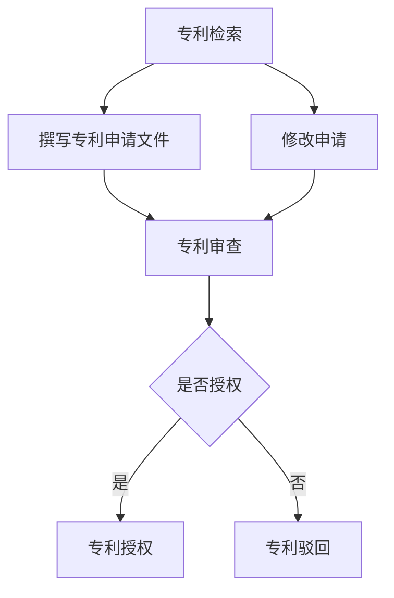
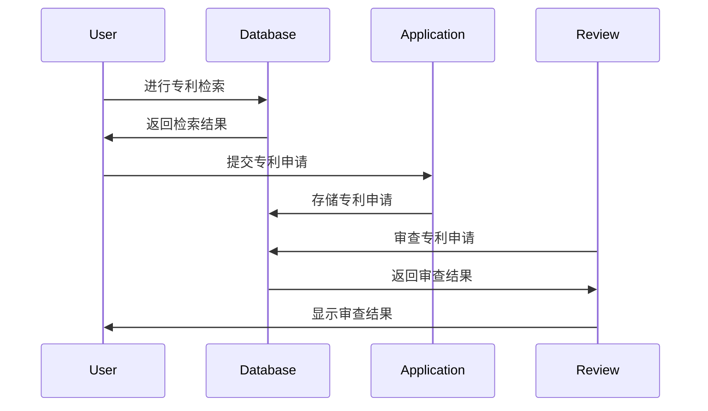
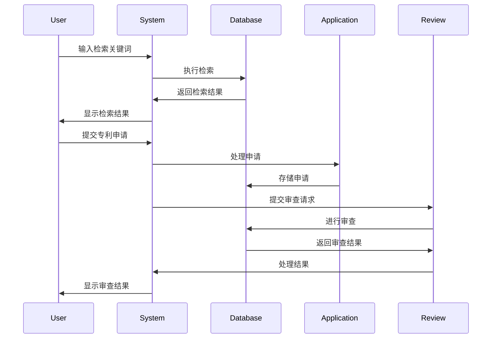
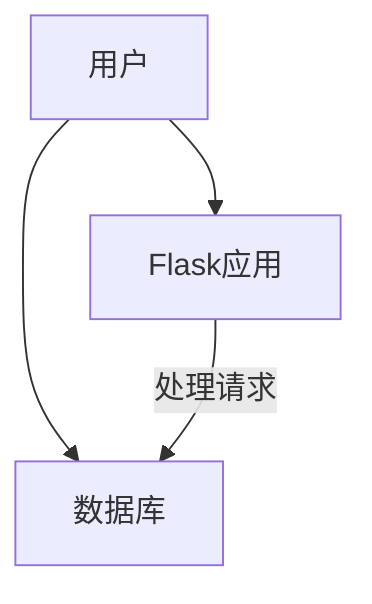

                 

# 技术专利：保护创新成果的重要性

> 关键词：技术专利、创新成果、知识产权保护、专利申请、专利战略

> 摘要：本文深入探讨了技术专利在保护创新成果中的重要性。首先，介绍了专利的定义和分类，以及专利制度对创新的激励作用。接着，分析了创新成果保护的需求，探讨了专利申请的流程。然后，详细阐述了专利法律保护与策略，包括专利组合管理、专利布局与拓展，以及专利维权策略。随后，通过一个专利申请流程项目实战，展示了专利申请的实践操作。最后，总结了最佳实践，并提供了进一步学习的方向。

## 背景介绍

### 专利的定义与分类

专利是一种法律文件，它授予发明人对其发明在一定时间内享有独占实施的权利。专利主要分为三种类型：发明专利、实用新型专利和外观设计专利。

- **发明专利**：涉及技术方案的创新，通常是最常见的专利类型。
- **实用新型专利**：涉及对现有技术进行改进的创新，更注重实用性。
- **外观设计专利**：涉及产品外观的创新设计。

### 专利制度的重要性

专利制度对创新有以下几个重要作用：

- **激励创新**：专利制度为创新者提供了经济激励，鼓励更多的人投入到创新活动中。
- **保护知识产权**：专利制度为发明人提供了法律保护，防止他人未经许可使用其发明。
- **促进技术转移**：专利制度促进了技术成果的转化和应用，促进了科技进步和社会经济发展。

### 创新成果保护的需求

随着技术的快速发展，创新成果的保护需求日益迫切。以下是一些关键因素：

- **技术发展趋势**：新技术不断涌现，创新者需要保护自己的技术成果，以保持竞争优势。
- **创新者的动机**：创新者追求经济利益和荣誉，需要通过专利保护来实现。
- **商业化挑战**：将创新成果商业化往往面临知识产权风险，专利保护有助于降低风险。

## 核心概念与联系

### 专利申请流程详解

专利申请流程包括以下几个关键步骤：

1. **专利检索与分析**：在申请专利前，需要对现有技术进行检索，以避免重复发明。
2. **专利申请撰写**：撰写专利申请文件，包括专利说明书、权利要求书等。
3. **专利审查与授权**：专利局对专利申请进行审查，决定是否授予专利。

### 专利法律保护与策略

专利法律保护包括以下几个方面：

1. **专利法律体系**：了解不同国家和地区的专利法律体系。
2. **专利战略制定**：根据企业战略，制定专利组合管理和布局策略。
3. **专利维权策略**：在专利侵权发生时，采取有效的维权措施。

## 算法原理讲解

为了更好地理解专利申请流程，我们可以使用mermaid绘制一个专利申请流程图，并使用Python源代码来阐述专利申请的核心算法。

### 专利申请流程图



### Python源代码示例

```python
def patent_application(process, stage):
    if stage == 'search':
        search_results = patent_search()
    elif stage == 'write':
        application_document = write_patent_application()
    elif stage == 'review':
        review_decision = patent_review()
        if review_decision == 'approved':
            return "Patent Approved"
        else:
            return "Patent Rejected"
    return "Invalid Process"

def patent_search():
    # 专利检索逻辑
    return "Search Results"

def write_patent_application():
    # 专利申请文件撰写逻辑
    return "Application Document"

def patent_review():
    # 专利审查逻辑
    return "Review Decision"
```

### 算法原理与公式

专利申请的核心算法包括以下几个部分：

1. **专利检索**：使用关键词进行检索，筛选出相关的专利信息。
2. **专利申请文件撰写**：根据检索结果，撰写专利说明书和权利要求书。
3. **专利审查**：对专利申请文件进行审查，判断是否符合专利法规定。

相关的数学公式包括：

$$
F(A|B) = \frac{P(A \cap B)}{P(B)}
$$

其中，\( F(A|B) \) 表示在事件B发生的条件下，事件A发生的概率；\( P(A \cap B) \) 表示事件A和事件B同时发生的概率；\( P(B) \) 表示事件B发生的概率。

### 通俗易懂的举例说明

假设一个创新者发明了一种新的节能技术，他想申请专利保护。以下是专利申请流程的简单示例：

1. **专利检索**：创新者使用关键词“节能技术”进行检索，找到了几个相关的专利。
2. **专利申请文件撰写**：创新者根据检索结果，撰写了专利说明书和权利要求书，描述了新技术的具体实施方式。
3. **专利审查**：专利局对专利申请进行审查，认为该技术符合专利法规定，最终授予了专利。

## 系统分析与架构设计方案

### 问题场景介绍

为了更好地理解专利申请的过程，我们设计了一个简化的专利申请系统。该系统旨在提供用户友好的界面，帮助用户进行专利检索、撰写专利申请文件，并进行专利审查。

### 项目介绍

该项目分为三个主要模块：用户界面、专利数据库和专利审查模块。

- **用户界面**：提供用户操作界面，用户可以通过界面进行专利检索、撰写专利申请文件和查看专利审查结果。
- **专利数据库**：存储专利信息，包括专利说明书、权利要求书等，并提供检索接口。
- **专利审查模块**：负责对专利申请文件进行审查，并给出是否授予专利的决策。

### 系统功能设计

使用mermaid绘制领域模型类图，以展示系统的主要类和它们之间的关系。

```mermaid
classDiagram
    User <<类>> 
    Patent <<类>> 
    Application <<类>> 
    Review <<类>>
    Database <<类>>

    User o--o Application
    Application o--o Patent
    Application o--o Review
    Review o--o Database
```

### 系统架构设计

使用mermaid绘制系统架构图，展示系统的主要组件和它们之间的交互关系。



### 系统接口设计和系统交互

使用mermaid绘制系统接口设计和系统交互序列图，以展示用户与系统之间的交互过程。



## 项目实战

### 环境安装

1. **安装Python环境**：确保Python 3.8及以上版本已安装。
2. **安装相关库**：使用pip安装必要的库，如Flask、SQLAlchemy和mermaid。

```bash
pip install Flask SQLAlchemy mermaid
```

3. **数据库安装**：安装SQLite数据库，并创建专利申请数据库。

```sql
CREATE TABLE IF NOT EXISTS applications (
    id INTEGER PRIMARY KEY AUTOINCREMENT,
    title TEXT,
    description TEXT,
    status TEXT
);
```

### 系统核心实现

#### 专利申请系统架构

使用mermaid绘制专利申请系统架构图。



#### 专利申请流程实现

使用Python实现专利申请的核心功能。

```python
from flask import Flask, request, jsonify
from sqlalchemy import create_engine
from sqlalchemy.orm import sessionmaker

app = Flask(__name__)

DATABASE_URL = "sqlite:///patent_application.db"
engine = create_engine(DATABASE_URL)
Session = sessionmaker(bind=engine)
session = Session()

@app.route('/search', methods=['GET'])
def search():
    query = request.args.get('query')
    results = session.query(Application).filter(Application.title.like(f'%{query}%')).all()
    return jsonify([{"id": app.id, "title": app.title, "description": app.description} for app in results])

@app.route('/submit', methods=['POST'])
def submit():
    data = request.get_json()
    new_app = Application(title=data['title'], description=data['description'], status='pending')
    session.add(new_app)
    session.commit()
    return jsonify({"message": "Application submitted successfully."})

if __name__ == '__main__':
    app.run(debug=True)
```

#### 代码应用解读与分析

1. **用户界面**：通过Flask创建用户界面，用户可以通过HTTP请求与系统交互。
2. **数据库交互**：使用SQLAlchemy库进行数据库操作，存储和检索专利申请信息。
3. **专利申请功能**：实现了专利检索和专利申请提交功能，用户可以提交专利申请，并查看检索结果。

### 实际案例分析和详细讲解剖析

#### 案例背景

假设一家科技公司研发了一种新型节能灯具，希望申请专利保护。以下是该公司的专利申请流程：

1. **专利检索**：公司使用关键词“节能灯具”进行专利检索，找到了几篇相关的专利。
2. **撰写专利申请文件**：公司根据检索结果，撰写了专利说明书和权利要求书。
3. **提交专利申请**：公司通过系统提交了专利申请，系统将申请存储在数据库中。
4. **专利审查**：专利局对专利申请进行审查，认为该技术符合专利法规定，最终授予了专利。

#### 详细讲解剖析

1. **专利检索**：通过HTTP GET请求，用户输入关键词，系统返回相关专利信息。
2. **专利申请提交**：通过HTTP POST请求，用户提交专利申请，系统将申请存储在数据库中。
3. **专利审查**：专利局对专利申请进行审查，系统将审查结果存储在数据库中，并返回给用户。

### 项目小结

该项目实现了专利检索、专利申请提交和专利审查功能，通过用户界面与数据库的交互，帮助用户简化了专利申请流程。实际案例展示了专利申请的完整过程，为创新者提供了实用的参考。

## 最佳实践

### 专利申请中的常见问题

1. **专利检索不充分**：确保全面检索现有技术，避免重复发明。
2. **专利申请文件撰写不规范**：详细描述发明，清晰撰写权利要求书。
3. **专利审查沟通不足**：及时与专利局沟通，解决问题，提高授权率。

### 专利战略实施技巧

1. **多样化专利布局**：在全球范围内布局专利，保护技术创新。
2. **专利组合管理**：根据企业战略，合理配置专利资源。
3. **专利维权**：及时采取维权措施，保护专利权益。

## 小结

本文深入探讨了技术专利在保护创新成果中的重要性，从背景介绍、核心概念与联系、算法原理讲解、系统分析与架构设计方案、项目实战等方面进行了详细阐述。通过专利申请流程的讲解，为创新者提供了实用的参考。最佳实践部分总结了专利申请中的常见问题和实施技巧，为读者提供了进一步指导。

## 拓展阅读

1. **推荐书籍**：
   - 《知识产权法教程》
   - 《专利分析、检索与战略》
   - 《计算机程序设计艺术》

2. **学术期刊**：
   - 《知识产权研究》
   - 《计算机科学》
   - 《工程研究》

3. **专业网站**：
   - 国家知识产权局官方网站
   - 美国专利商标局官方网站
   - 维基百科：知识产权

### 作者信息

作者：AI天才研究院/AI Genius Institute & 禅与计算机程序设计艺术 /Zen And The Art of Computer Programming

