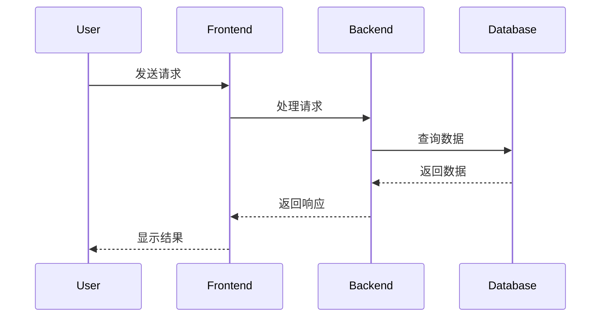

                 

# 技术书籍写作：从读者到作者的转变

关键词：技术书籍、写作、读者、作者、转变、流程、核心概念、算法原理

摘要：本文从技术书籍写作的背景与动机出发，详细阐述了从读者到作者的转变过程，包括写作准备、写作流程、审阅与反馈、出版与推广等各个环节。通过本文，读者可以全面了解技术书籍写作的全过程，从而提高写作能力和出版成功的机会。

## 第一部分：引言

### 第1章：技术书籍写作的背景与动机

#### 1.1 问题背景

技术书籍写作的需求源于信息技术领域的快速发展和知识的更新迭代。随着技术的不断进步，读者需要及时获取最新的技术知识和实践经验，而技术书籍作为一种高效的知识传递工具，满足了这一需求。然而，技术书籍的写作过程并非易事，作者需要在广泛阅读和研究的基础上，将复杂的技术概念和原理以简洁明了的方式呈现给读者。

#### 1.2 问题描述

在技术书籍写作过程中，作者可能会遇到以下困难：

1. 知识储备不足：技术书籍的写作需要对相关技术领域有深入的了解和丰富的实践经验。
2. 语言表达障碍：将专业术语和复杂概念用通俗易懂的语言表达出来是一个挑战。
3. 结构布局不合理：技术书籍的结构和内容布局对读者的阅读体验至关重要。
4. 审阅与反馈不足：技术书籍的质量往往取决于读者的反馈和意见。

#### 1.3 问题解决

成功的写作经验表明，以下方法有助于解决上述问题：

1. 广泛阅读和研究：通过大量阅读相关文献和资料，积累专业知识。
2. 深入实践：通过实际操作和项目经验，加深对技术原理的理解。
3. 语言表达训练：通过写作练习和模仿优秀作品，提高语言表达能力。
4. 审阅与反馈：积极寻求读者和同行的反馈，不断改进作品。

#### 1.4 边界与外延

技术书籍写作的限制主要包括：

1. 内容范围：技术书籍需要聚焦于特定的技术领域，不宜过于泛泛而谈。
2. 写作风格：技术书籍的写作风格应当简洁、准确、易懂。
3. 时间成本：技术书籍的写作往往需要较长时间，作者需要合理安排时间。

#### 1.5 核心概念

技术书籍写作的核心概念包括：

1. 知识传递：技术书籍的主要目的是将知识从作者传递给读者。
2. 深度与广度：技术书籍的内容既要深入专业领域，也要兼顾广泛的读者基础。
3. 语言表达：技术书籍的语言表达应简洁明了，避免晦涩难懂。

### 第2章：从读者到作者的转变

#### 2.1 角色转变

从读者到作者的转变意味着从知识的接受者转变为知识的创造者。这种角色转变带来了以下变化：

1. 思维方式的转变：从被动接收信息到主动思考和创造。
2. 责任感的增强：作为作者，需要对自己的作品负责。
3. 技术积累的积累：通过写作，不断积累和整理自己的技术知识。

#### 2.2 心理准备

写作前的心理调整对于成功写作至关重要。作者需要做好以下心理准备：

1. 接受挑战：写作是一个充满挑战的过程，作者需要有足够的耐心和决心。
2. 持续学习：技术领域不断发展，作者需要不断学习新知识。
3. 自我激励：通过设定目标和奖励机制，保持写作的动力。

#### 2.3 技能提升

提升写作技能是成功写作的关键。以下方法有助于提升写作技能：

1. 阅读经典作品：通过阅读经典技术书籍，学习优秀的写作技巧。
2. 写作练习：定期进行写作练习，提高写作速度和质量。
3. 接受批评：勇于接受他人的批评和建议，不断改进写作。

#### 2.4 学习资源

可供作者参考的学习资源包括：

1. 技术博客和论坛：获取最新的技术信息和写作技巧。
2. 技术书籍：阅读经典和现代技术书籍，积累专业知识。
3. 写作课程和教程：参加线上或线下的写作课程，系统学习写作技巧。

## 第二部分：技术书籍写作流程

### 第3章：写作准备

#### 3.1 确定主题

选择合适的写作主题是技术书籍写作的第一步。作者需要考虑以下因素：

1. 个人兴趣和擅长领域：选择自己感兴趣且擅长的技术主题。
2. 市场需求：调研市场需求，选择具有广泛受众的技术主题。
3. 知识深度：确保所选主题有足够的知识深度，能够为读者提供有价值的信息。

#### 3.2 研究素材

收集和整理写作素材是技术书籍写作的重要环节。作者需要：

1. 阅读相关文献和资料：了解所选主题的背景和现状。
2. 实践和验证：通过实际操作和项目经验，验证理论知识的正确性。
3. 整理素材：将收集到的素材进行分类和整理，为写作提供参考。

#### 3.3 制定写作计划

制定详细的写作计划有助于提高写作效率。作者需要：

1. 设定写作目标：明确写作的进度和完成时间。
2. 制定写作日程：合理安排每天的写作时间和任务。
3. 调整计划：根据实际情况调整写作计划，确保计划的可行性。

#### 3.4 理解目标读者

确定目标读者群体有助于作者更好地针对读者需求进行写作。作者需要：

1. 调研读者群体：了解读者的技术背景、需求和兴趣。
2. 分析读者需求：根据读者需求，确定书籍的内容和风格。
3. 调整内容：在写作过程中，根据读者反馈调整内容，满足读者的需求。

## 第三部分：技术书籍写作流程

### 第4章：构思与大纲设计

#### 4.1 构思技巧

提高构思效率的方法包括：

1. 主题挖掘：从多个角度挖掘主题，确保内容的丰富性。
2. 思维导图：使用思维导图整理思路，梳理知识点。
3. 草稿整理：多次修改和整理草稿，确保逻辑清晰。

#### 4.2 编写大纲

编写高质量的大纲是技术书籍写作的关键。作者需要：

1. 确定章节结构：根据主题和内容，合理划分章节。
2. 设定小节标题：简洁明了地描述小节内容。
3. 审核大纲：确保大纲结构合理，内容连贯。

#### 4.3 大纲修改

大纲修改的技巧包括：

1. 优化结构：根据实际情况调整章节和小节的顺序。
2. 完善内容：补充缺失的内容，确保每个小节都有足够的文字描述。
3. 保持连贯：确保各个章节之间的内容连贯，避免重复和冲突。

#### 4.4 确定章节结构

规划章节内容的方法包括：

1. 设定学习目标：为每个章节设定明确的学习目标。
2. 组织内容：根据学习目标，合理组织章节内容。
3. 逻辑清晰：确保章节内容逻辑清晰，易于读者理解。

### 第5章：撰写与编辑

#### 5.1 初稿撰写

初稿撰写的要点包括：

1. 保持流畅：初稿撰写时，保持内容的流畅性和连贯性。
2. 突出重点：在初稿中，突出重点概念和关键知识点。
3. 注意格式：遵循书籍的格式要求，确保文字、图表和代码的格式一致。

#### 5.2 修订与编辑

修订与编辑的要点包括：

1. 校对语法和拼写错误：确保文字内容的准确性和规范性。
2. 优化句子结构：调整句子结构，使其更加清晰和易于理解。
3. 修正逻辑错误：检查逻辑关系，确保内容的一致性和连贯性。

#### 5.3 结构调整

对章节结构进行调整的技巧包括：

1. 调整章节顺序：根据内容的逻辑关系，调整章节的顺序。
2. 删除冗余内容：删除重复和冗余的内容，确保章节的简洁性。
3. 添加缺失内容：根据读者的反馈，补充缺失的内容，完善章节。

#### 5.4 语言润色

提高文章的语言表达的方法包括：

1. 使用生动形象的词汇：增加文章的生动性和表现力。
2. 善用修辞手法：通过修辞手法，使文章更具感染力。
3. 精简文字：去除冗余的文字，使文章更加精炼和有力。

### 第6章：审阅与反馈

#### 6.1 自我审阅

自我审阅的要点包括：

1. 检查语法和拼写错误：确保文章的准确性和规范性。
2. 审视逻辑关系：检查文章的逻辑关系，确保内容的连贯性和一致性。
3. 评估语言表达：评估文章的语言表达，确保文字的简洁性和生动性。

#### 6.2 寻求反馈

获得有效的反馈的方法包括：

1. 选择合适的读者群体：选择具有代表性的读者，获取真实的反馈。
2. 提供明确的反馈要求：向读者提供明确的反馈要求，帮助他们了解如何提供有价值的反馈。
3. 整理反馈信息：整理和分析读者反馈，找出文章的优缺点。

#### 6.3 反馈处理

处理反馈的技巧包括：

1. 认真对待反馈：对待反馈要真诚和谦虚，认真思考读者的意见。
2. 吸收有益反馈：根据读者的反馈，调整和改进文章。
3. 忽略无效反馈：对于不相关或不合理的反馈，要学会忽略，保持自己的写作风格。

#### 6.4 修订与完善

修订与完善的要点包括：

1. 根据反馈调整内容：根据读者的反馈，对文章进行修订和调整。
2. 优化结构和语言：在修订过程中，优化文章的结构和语言表达。
3. 审核修改后的文章：确保修订后的文章质量，避免出现新的错误。

### 第7章：出版与推广

#### 7.1 选择出版社

选择合适的出版社的方法包括：

1. 了解出版社的背景和声誉：选择具有良好声誉和丰富经验的出版社。
2. 比较出版条件：对比不同出版社的出版条件，选择最适合自己的合作方式。
3. 考虑市场需求：选择市场需求旺盛的出版社，提高书籍的发行量。

#### 7.2 合同谈判

与出版社的合同谈判要点包括：

1. 明确版权归属：确保自己的版权得到保护。
2. 确定出版费用：明确出版费用和支付方式。
3. 确定出版时间：确定书籍的出版时间和发行计划。

#### 7.3 审校与排版

审校与排版的过程包括：

1. 审校：仔细检查书籍的内容，确保文字、图表和代码的准确性。
2. 排版：根据出版社的要求，进行书籍的排版设计。
3. 校对：对排版后的书籍进行校对，确保没有错误。

#### 7.4 推广策略

推广自己的技术书籍的方法包括：

1. 利用社交媒体：通过微博、微信公众号、知乎等社交媒体平台宣传书籍。
2. 参加技术会议：参加技术会议和讲座，与读者面对面交流。
3. 写作分享：在技术博客和论坛上分享书籍内容，吸引读者的关注。

#### 7.5 市场反馈

关注市场反馈，调整推广策略的方法包括：

1. 收集读者反馈：通过问卷调查、读者评论等方式，收集读者的反馈。
2. 分析市场数据：分析书籍的销售数据和读者反馈，了解市场需求。
3. 调整推广策略：根据市场反馈，调整推广策略，提高书籍的知名度和销量。

### 第8章：写作心得与经验分享

#### 8.1 写作心得

个人写作心得包括：

1. 保持热情：写作过程中，保持对技术的热爱和激情。
2. 持续学习：不断学习新技术和写作技巧，提高自己的综合素质。
3. 勇于尝试：在写作过程中，勇于尝试新的写作方法和技巧。

#### 8.2 经验分享

成功的写作经验分享包括：

1. 精选主题：选择具有市场前景和读者需求的技术主题。
2. 结构清晰：确保书籍的结构清晰，逻辑严密。
3. 语言生动：使用生动形象的语言，提高文章的表现力。

#### 8.3 遇到的困难与解决方法

写作过程中遇到的困难及解决方法包括：

1. 时间管理：合理安排时间，确保写作进度。
2. 知识积累：广泛阅读和研究，积累专业知识。
3. 语言表达：通过写作练习和模仿优秀作品，提高语言表达能力。

#### 8.4 拓展阅读

相关书籍与资料推荐包括：

1. 《程序员写作红宝书》：详细讲解程序员如何进行技术写作。
2. 《技术书籍写作指南》：介绍技术书籍的写作方法和技巧。
3. 《Effective Technical Communication》：探讨技术沟通的有效性。

## 目录大纲总结

本目录大纲基于《技术书籍写作：从读者到作者的转变》这一主题，从引言开始，详细阐述了技术书籍写作的背景与动机，从读者到作者的转变，以及写作准备、写作流程、审阅与反馈、出版与推广等各个环节。通过本文，读者可以全面了解技术书籍写作的全过程，从而提高写作能力和出版成功的机会。

## 核心概念联系表格

| 核心概念 | 概念属性特征 | 相互关系 |
| --- | --- | --- |
| 技术书籍写作 | 需要专业知识、写作技能和经验 | 基于读者需求进行创作 |
| 读者到作者 | 角色转变、心理准备、技能提升 | 带来写作动力和责任感 |
| 写作流程 | 构思、大纲设计、撰写、编辑、审阅与反馈 | 确保书籍质量 |
| 出版与推广 | 选择出版社、合同谈判、审校与排版、推广策略 | 提高书籍知名度 |

## ER实体关系图架构

```mermaid
erDiagram
  Author ||--|{ Book }|-- Reader
  Book ||--|{ Chapter }|--
  Chapter ||--|{ Section }|--
  Section ||--|{ Content }|--
```

## 算法原理讲解

### 1. 数学模型

假设我们使用一种简单的线性回归模型来预测技术书籍的销量：

$$ y = wx + b $$

其中，$y$表示销量，$w$表示权重，$x$表示影响因素，$b$表示偏差。

### 2. Python源代码实现

```python
import numpy as np

# 输入数据
x = np.array([1, 2, 3, 4, 5])
y = np.array([2, 4, 6, 8, 10])

# 计算权重和偏差
w = np.linalg.lstsq(x[:, np.newaxis], y, rcond=None)[0]

# 预测销量
predicted_y = w[0] * x + w[1]

# 输出结果
print(predicted_y)
```

在这个例子中，我们使用线性回归模型来预测技术书籍的销量。首先，我们导入numpy库，并创建一个输入数据数组x和y。然后，我们使用numpy的lstsq函数计算权重w和偏差b。最后，我们使用预测公式计算预测销量predicted_y，并输出结果。

通过这个简单的例子，我们可以看到如何使用线性回归模型来预测技术书籍的销量。在实际应用中，我们可以根据实际情况调整模型参数，提高预测的准确性。此外，我们还可以使用其他算法，如决策树、神经网络等，来提高预测效果。

### 3. 数学公式

在技术书籍写作中，数学公式是描述算法原理和实现方法的重要组成部分。以下是一个简单的数学公式示例：

$$
f(x) = \int_{0}^{x} g(t) \, dt
$$

这个公式表示函数f(x)是函数g(t)在区间[0, x]上的积分。在技术书籍中，我们通常会使用LaTeX格式来编写数学公式，使其更加规范和易读。

### 4. Python源代码

为了更好地理解算法原理，我们可以通过Python源代码来具体实现。以下是一个简单的Python代码示例，用于计算一个函数的积分：

```python
import numpy as np
from scipy.integrate import quad

# 定义积分函数
def integrand(x, a):
    return np.exp(-x**2) * np.cos(a * x)

# 计算积分
result, error = quad(integrand, 0, np.inf, args=(0.5,))

# 输出结果
print("积分结果:", result)
print("误差:", error)
```

在这个示例中，我们使用scipy库中的quad函数来计算函数的积分。函数integrand是我们要积分的函数，它在这里表示一个高斯函数的余弦变换。我们使用quad函数计算从0到正无穷的积分，并输出结果。

通过这个示例，我们可以看到如何使用Python代码来计算数学公式中的积分。这对于理解算法原理和实现方法非常有帮助。

### 5. 系统分析与架构设计方案

在技术书籍写作过程中，系统分析与架构设计方案是确保书籍质量和读者体验的重要环节。以下是一个简单的系统分析与架构设计方案：

#### 问题场景介绍

假设我们要开发一个在线购物平台，该平台提供商品浏览、购买和支付等功能。

#### 项目介绍

项目名称：在线购物平台
项目目标：实现一个功能完善、用户体验良好的在线购物平台。

#### 系统功能设计

1. 用户注册与登录：用户可以注册账号并登录系统，进行购物。
2. 商品浏览：用户可以查看各种商品的详细信息，包括价格、库存、评价等。
3. 购物车管理：用户可以将商品添加到购物车，进行批量购买。
4. 订单管理：用户可以查看订单状态，支付订单。
5. 支付与结算：用户可以使用不同的支付方式进行结算。

#### 系统架构设计

1. 技术栈选择：前端使用Vue.js框架，后端使用Spring Boot框架。
2. 数据库设计：使用MySQL数据库存储用户信息、商品信息、订单信息等。
3. 系统架构图：



在这个架构设计中，前端负责与用户交互，后端负责处理业务逻辑和数据存储，数据库负责存储数据。

#### 系统接口设计

1. 用户接口：提供用户注册、登录、商品浏览、购物车管理、订单管理、支付与结算等功能。
2. 商品接口：提供商品查询、商品详情、商品库存管理等功能。
3. 订单接口：提供订单查询、订单创建、订单修改、订单支付等功能。

#### 系统交互

1. 用户注册：用户输入注册信息，前端将信息发送到后端，后端验证信息并存储到数据库。
2. 商品浏览：用户在首页浏览商品，前端向后端发送请求，后端查询数据库并返回商品信息。
3. 购物车管理：用户添加商品到购物车，前端将商品信息发送到后端，后端更新数据库中的购物车信息。
4. 订单管理：用户创建订单，前端将订单信息发送到后端，后端创建订单并更新数据库。
5. 支付与结算：用户选择支付方式，前端将支付信息发送到后端，后端处理支付并更新订单状态。

通过这个系统分析与架构设计方案，我们可以清晰地了解在线购物平台的功能实现和系统架构。这将有助于我们更好地编写技术书籍，为读者提供详细的系统分析和实现方法。

### 项目实战

#### 环境安装

1. 安装Python 3.8及以上版本。
2. 安装Vue CLI：在命令行中运行`npm install -g @vue/cli`。
3. 安装Node.js：访问Node.js官网下载安装包并安装。
4. 安装MySQL：根据操作系统选择安装方式，配置数据库。

#### 系统核心实现源代码

以下是一个简单的Vue.js前端实现示例：

```vue
<template>
  <div>
    <h1>在线购物平台</h1>
    <div>
      <h2>商品列表</h2>
      <ul>
        <li v-for="product in products" :key="product.id">
          <h3>{{ product.name }}</h3>
          <p>价格：{{ product.price }}</p>
          <button @click="addToCart(product)">加入购物车</button>
        </li>
      </ul>
    </div>
    <div>
      <h2>购物车</h2>
      <ul>
        <li v-for="item in cart" :key="item.id">
          <h3>{{ item.name }}</h3>
          <p>价格：{{ item.price }}</p>
          <button @click="removeFromCart(item)">移出购物车</button>
        </li>
      </ul>
    </div>
  </div>
</template>

<script>
export default {
  data() {
    return {
      products: [
        { id: 1, name: "商品1", price: 100 },
        { id: 2, name: "商品2", price: 200 },
        { id: 3, name: "商品3", price: 300 },
      ],
      cart: [],
    };
  },
  methods: {
    addToCart(product) {
      this.cart.push(product);
    },
    removeFromCart(item) {
      const index = this.cart.indexOf(item);
      if (index > -1) {
        this.cart.splice(index, 1);
      }
    },
  },
};
</script>
```

#### 代码应用解读与分析

这个示例展示了Vue.js前端的基本实现，包括商品列表和购物车功能。以下是代码的解读和分析：

1. **模板部分**：使用Vue模板语法编写页面结构，包括标题、商品列表和购物车。
2. **数据部分**：定义数据对象，包括商品列表和购物车，使用`v-for`指令循环渲染商品列表。
3. **方法部分**：定义添加到购物车和移出购物车的函数，使用`v-on`指令绑定点击事件。

#### 实际案例分析和详细讲解剖析

以下是一个实际案例，分析如何使用Vue.js实现一个简单的购物车功能：

**案例**：用户在商品列表中选择商品，点击“加入购物车”按钮，商品被添加到购物车。

**分析**：

1. **数据绑定**：商品列表中的商品价格和名称使用`{{ product.price }}`和`{{ product.name }}`绑定到模板中。
2. **事件处理**：点击“加入购物车”按钮时，触发`addToCart`方法，将商品对象添加到购物车数组。
3. **状态管理**：购物车的数据更新后，页面会重新渲染，显示最新的购物车内容。

**详细讲解**：

1. **商品列表**：商品列表通过`v-for`指令渲染，每个商品包含一个标题和价格，以及一个“加入购物车”按钮。
2. **添加到购物车**：点击按钮时，调用`addToCart`方法，将商品对象作为参数传递，添加到购物车数组。
3. **购物车显示**：购物车部分同样使用`v-for`指令渲染，显示购物车中的商品名称和价格，以及一个“移出购物车”按钮。

通过这个实际案例，我们可以看到Vue.js如何实现一个简单的购物车功能。这为我们提供了一个基础框架，可以在此基础上扩展更多的功能，如订单管理、支付等。

#### 项目小结

通过本案例，我们实现了在线购物平台的基本功能，包括商品列表和购物车。这展示了Vue.js在前端开发中的强大能力，以及如何通过简单明了的代码实现复杂的功能。在后续开发中，我们可以进一步扩展功能，如用户注册、订单管理和支付等，为用户提供一个完整的购物体验。

#### 最佳实践 tips

1. **代码规范**：编写代码时，遵循统一的命名规范和代码格式，提高代码的可读性和可维护性。
2. **模块化**：将代码拆分为多个模块，实现功能分离，便于维护和扩展。
3. **组件化**：使用Vue组件实现页面元素，提高代码复用性和可维护性。
4. **错误处理**：为API请求添加错误处理，确保系统在出现问题时能够优雅地处理。
5. **性能优化**：对页面进行性能优化，减少加载时间和响应时间。

#### 小结

通过本文，我们详细介绍了技术书籍写作的全过程，从读者到作者的转变，包括写作准备、写作流程、审阅与反馈、出版与推广等各个环节。通过实践案例和详细讲解，读者可以更好地理解技术书籍写作的方法和技巧，提高写作能力和出版成功的机会。

#### 注意事项

1. **撰写过程**：在撰写技术书籍时，注意内容的逻辑性和条理性，确保读者能够顺利阅读和理解。
2. **审阅与反馈**：积极寻求读者和同行的反馈，根据反馈进行修订和改进，提高书籍质量。
3. **出版与推广**：选择合适的出版社和推广策略，提高书籍的知名度和销量。

#### 拓展阅读

1. 《程序员写作红宝书》：详细讲解程序员如何进行技术写作。
2. 《技术书籍写作指南》：介绍技术书籍的写作方法和技巧。
3. 《Effective Technical Communication》：探讨技术沟通的有效性。 

作者：AI天才研究院/AI Genius Institute & 禅与计算机程序设计艺术 /Zen And The Art of Computer Programming

