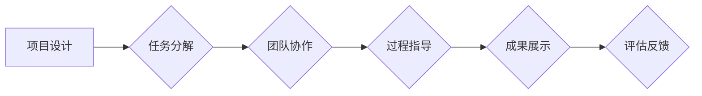
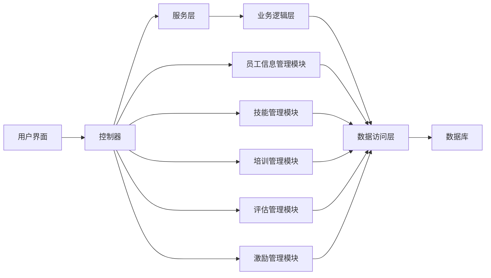
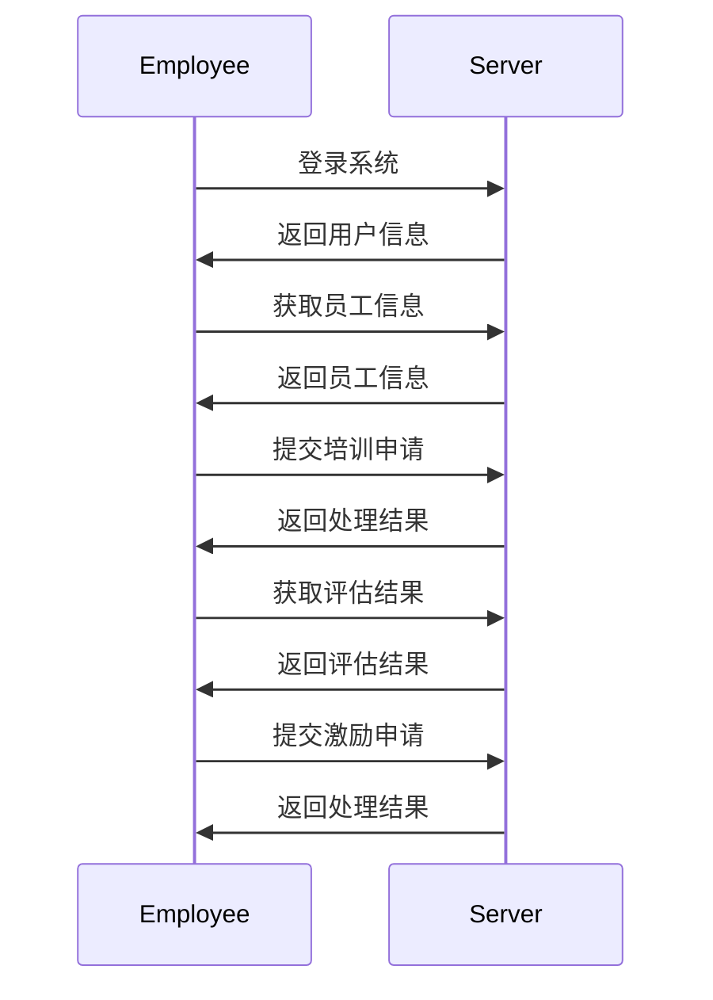
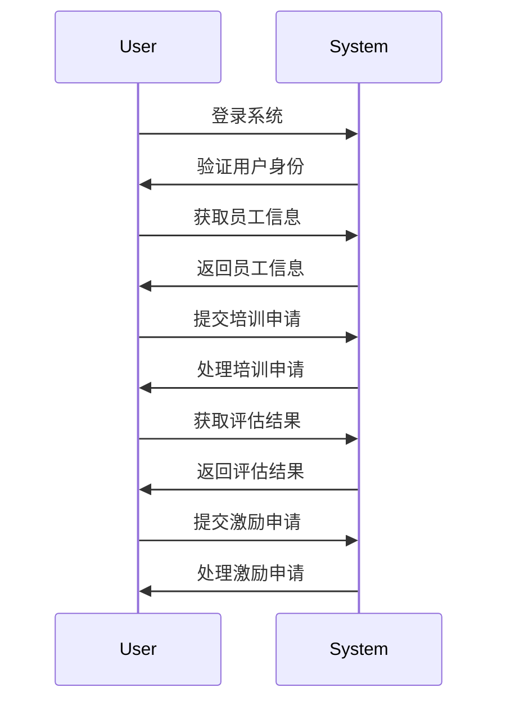

                 

### 标题：技术人才培养的系统化方法

---

关键词：技术人才、人才培养、系统化、方法论、实践与案例

摘要：本文深入探讨技术人才培养的系统化方法，旨在为教育工作者、技术经理及企业培训师提供一套科学、有效的人才培养框架和策略。通过对核心概念、培养原则、方法与实践、评估与改进的详细分析，结合成功与失败的案例分析，本文旨在为技术人才培养提供有价值的参考和启示。

---

### 引言：技术人才培养的必要性

在当今数字化时代，技术人才的短缺已成为全球范围内的普遍问题。企业对高技能技术人才的需求不断增长，而传统的教育模式却难以满足这一需求。技术人才培养的重要性不仅体现在企业发展的层面，更关系到国家的竞争力、创新能力和未来发展的可持续性。

**现状与挑战：** 现阶段，技术人才培养面临以下几个主要挑战：

1. **供需不平衡：** 技术人才市场供需失衡，特别是在人工智能、大数据、云计算等前沿技术领域，人才缺口巨大。
2. **知识更新速度快：** 技术领域的发展日新月异，新知识、新技术层出不穷，人才培养周期过长，难以跟上行业的发展步伐。
3. **培养模式单一：** 传统教育模式以理论教学为主，实践操作和创新能力培养不足，无法满足企业对应用型技术人才的需求。

**技术人才培养的必要性：** 技术人才培养不仅是企业持续发展的关键，更是国家创新能力和竞争力提升的基石。系统化的人才培养方法能够有效解决上述问题，提高人才培养的效率和质量。

### 第1章：技术人才培养的基本概念

#### 1.1 技术人才的能力模型

技术人才的能力模型是技术人才培养的基础。一个完善的技术人才能力模型应包括以下几个方面：

1. **专业技能：** 技术人才应具备扎实的专业技能，包括编程语言、数据库管理、网络技术等。
2. **解决问题的能力：** 技术人才应具备解决实际问题的能力，能够将理论知识应用于实际工作中。
3. **创新能力：** 技术人才应具备创新思维和创新能力，能够推动技术的进步和变革。
4. **沟通协作能力：** 技术人才应具备良好的沟通协作能力，能够与团队成员高效合作。

#### 1.2 技术人才的培养目标

技术人才的培养目标应明确，具体如下：

1. **基础知识：** 确保技术人才具备扎实的基础知识，为后续专业学习奠定基础。
2. **专业技能：** 培养技术人才的专业技能，使其能够在特定领域发挥作用。
3. **实践经验：** 提高技术人才的实践能力，通过项目实战培养其实际工作能力。
4. **创新能力：** 激发技术人才的创新思维，培养其创新能力和解决问题的能力。

#### 1.3 技术人才培养的流程

技术人才培养的流程应科学、系统，包括以下几个阶段：

1. **需求分析：** 明确企业对技术人才的需求，制定具体的人才培养计划。
2. **课程设计：** 设计符合培养目标和技术需求的课程体系，包括理论课程和实践课程。
3. **师资队伍：** 建立一支高水平、专业的师资队伍，确保教学质量。
4. **教学实施：** 按照课程设计进行教学，注重理论与实践相结合。
5. **评估与反馈：** 定期对人才培养效果进行评估，收集反馈，持续优化培养方案。

### 第2章：技术人才培养的原则

#### 2.1 以需求为导向

以需求为导向是技术人才培养的核心原则。具体包括以下几点：

1. **明确培养目标：** 根据企业需求明确技术人才的培养目标，确保培养出的技术人才符合市场需求。
2. **动态调整课程：** 随着技术领域的发展，及时调整课程内容，使其保持前沿性和实用性。
3. **注重实践：** 强调实践环节，通过项目实战培养技术人才的实际工作能力。

#### 2.2 全员参与

全员参与是技术人才培养的重要保障。具体包括以下几点：

1. **企业参与：** 企业应积极参与人才培养，提供实践项目和资源支持。
2. **师生互动：** 教师与学生应积极参与互动，共同推动人才培养的进程。
3. **团队合作：** 培养技术人才的团队合作能力，通过团队合作项目提升其协作能力。

#### 2.3 持续改进

持续改进是技术人才培养的关键原则。具体包括以下几点：

1. **定期评估：** 定期对人才培养效果进行评估，发现问题及时改进。
2. **反馈机制：** 建立反馈机制，收集学生、企业和教师的意见和建议，持续优化培养方案。
3. **创新驱动：** 以创新驱动人才培养，推动技术领域的发展。

### 第3章：技术人才培养的方法

#### 3.1 基于项目的学习

基于项目的学习是一种有效的技术人才培养方法，通过实际项目培养学生的实际工作能力和创新思维。具体包括以下几点：

1. **项目设计：** 根据企业需求设计具有挑战性的项目，使学生能够在项目中锻炼自己的能力。
2. **过程指导：** 在项目实施过程中，教师应提供必要的指导和支持，帮助学生解决问题。
3. **成果展示：** 完成项目后，组织成果展示，让学生展示自己的成果，提高其自信心和表达能力。

#### 3.2 案例研究

案例研究是一种通过分析真实案例来培养学生的分析能力和实践能力的方法。具体包括以下几点：

1. **案例选择：** 选择具有代表性的真实案例，确保案例具有启发性。
2. **案例分析：** 教师引导学生分析案例，探讨案例中的问题和解决方案。
3. **案例讨论：** 组织学生进行案例讨论，培养学生的批判性思维和团队合作能力。

#### 3.3 实践导向

实践导向是一种以实践为核心的教学方法，通过实际操作培养学生的实际工作能力。具体包括以下几点：

1. **实验课程：** 设计实验课程，让学生在实验室环境中进行实际操作。
2. **实习机会：** 提供实习机会，让学生在企业环境中锻炼自己的能力。
3. **创业指导：** 为学生提供创业指导，鼓励学生创新创业，提升其实际工作能力。

### 第4章：技术人才培养的实施流程

#### 4.1 需求分析

需求分析是技术人才培养的第一步，主要包括以下几个方面：

1. **企业需求：** 分析企业对技术人才的需求，包括专业技能、解决问题能力和创新能力等。
2. **岗位要求：** 根据企业需求，明确技术人才所需的岗位要求。
3. **培养目标：** 根据企业需求和岗位要求，确定技术人才的培养目标。

#### 4.2 培养计划制定

培养计划制定是根据需求分析结果，制定具体的培养计划。具体包括以下几点：

1. **课程设置：** 设计符合培养目标的课程体系，包括理论课程和实践课程。
2. **师资安排：** 安排具有丰富经验和专业知识的教师进行教学。
3. **教学资源：** 提供必要的教学资源和实验设备，确保教学顺利进行。

#### 4.3 培养过程管理

培养过程管理是对培养过程进行监控和调整，确保培养计划的顺利实施。具体包括以下几点：

1. **教学质量监控：** 定期对教学质量进行监控，确保教学效果。
2. **学生反馈：** 收集学生的反馈意见，及时调整教学策略。
3. **项目指导：** 在项目实施过程中，提供必要的指导和支持。

### 第5章：技术人才培养效果评估

#### 5.1 评估指标体系构建

评估指标体系构建是根据培养目标和培养计划，确定评估指标和评估方法。具体包括以下几点：

1. **能力指标：** 包括专业技能、解决问题能力和创新能力等。
2. **知识指标：** 包括基础知识掌握程度和专业知识深度。
3. **实践指标：** 包括实践能力和实际工作能力。

#### 5.2 评估方法选择

评估方法选择是根据评估指标，选择合适的评估方法。具体包括以下几点：

1. **笔试：** 通过笔试评估学生的基础知识掌握程度。
2. **面试：** 通过面试评估学生的实际工作能力和创新能力。
3. **项目评估：** 通过项目评估学生的实践能力和解决实际问题的能力。

#### 5.3 评估结果分析

评估结果分析是根据评估结果，分析培养效果，发现问题和不足，并提出改进措施。具体包括以下几点：

1. **评估报告：** 编写评估报告，总结评估结果。
2. **反馈机制：** 建立反馈机制，将评估结果反馈给企业、教师和学生。
3. **改进措施：** 根据评估结果，提出改进措施，优化培养方案。

### 第6章：技术人才培养的改进策略

#### 6.1 改进方向确定

改进方向确定是根据评估结果，确定需要改进的方向。具体包括以下几点：

1. **课程内容：** 根据市场需求和岗位要求，调整课程内容。
2. **教学方法：** 根据学生反馈和评估结果，改进教学方法。
3. **师资队伍：** 加强师资队伍建设，提高教师的专业水平和教学能力。

#### 6.2 改进措施实施

改进措施实施是根据改进方向，制定具体的改进措施并实施。具体包括以下几点：

1. **课程改革：** 对现有课程进行改革，增加实践课程，提高实践性。
2. **教学资源：** 提供更多的教学资源和实验设备，提高教学效果。
3. **师资培训：** 对教师进行培训，提高其教学水平和专业能力。

#### 6.3 改进效果评估

改进效果评估是根据改进措施实施后的效果，进行评估。具体包括以下几点：

1. **学生反馈：** 收集学生的反馈意见，了解改进措施的效果。
2. **企业评价：** 获取企业的评价，了解培养出的技术人才是否符合企业需求。
3. **持续改进：** 根据评估结果，持续改进培养方案，提高人才培养质量。

### 案例分析与启示

#### 成功案例：某大型企业的技术人才培养经验

**案例简介：** 某大型企业通过系统化的技术人才培养方法，成功培养出一批具备扎实专业技能和创新能力的技术人才，为企业的发展提供了有力支持。

**案例分析：**

1. **明确培养目标：** 该企业根据市场需求和自身发展需求，明确技术人才的培养目标，确保培养出的技术人才符合企业需求。
2. **课程设计：** 企业与合作高校共同设计课程体系，既包括理论课程，又包括实践课程，注重培养学生的实际工作能力和创新能力。
3. **师资队伍：** 企业聘请具有丰富实践经验的工程师和学者担任教师，确保教学质量。
4. **项目实战：** 学生在学习过程中，参与企业实际项目，通过实践锻炼自己的能力。
5. **评估与反馈：** 定期对人才培养效果进行评估，收集学生、企业和教师的反馈，持续优化培养方案。

**启示：**

1. **明确培养目标：** 企业应根据自身需求和市场需求，明确技术人才的培养目标，确保培养出的技术人才能够满足企业需求。
2. **课程设计与实践相结合：** 企业应与高校合作，设计符合培养目标的课程体系，注重培养学生的实践能力。
3. **师资队伍建设：** 企业应聘请具有丰富实践经验和专业知识的教师，提高教学质量。
4. **项目实战：** 通过项目实战，培养学生的实际工作能力和创新能力。
5. **持续改进：** 定期评估人才培养效果，收集反馈，持续优化培养方案。

#### 失败案例：某初创公司的技术人才培养反思

**案例简介：** 某初创公司由于缺乏系统化的技术人才培养方法，导致技术人才流失严重，影响了公司的发展。

**案例分析：**

1. **培养目标不明确：** 该初创公司没有明确的技术人才培养目标，导致培养出的技术人才不符合企业需求。
2. **课程设计不合理：** 公司设计的课程体系过于理论化，缺乏实践环节，无法满足技术人才的实际工作需求。
3. **师资队伍不足：** 公司缺乏具有专业知识和实践经验的教师，导致教学质量低下。
4. **项目实战不足：** 学生缺乏实际项目经验，导致其能力提升缓慢。
5. **评估与反馈机制缺失：** 公司没有建立有效的评估与反馈机制，无法及时发现问题并进行改进。

**启示：**

1. **明确培养目标：** 企业应明确技术人才的培养目标，确保培养出的技术人才符合企业需求。
2. **课程设计与实践相结合：** 企业应设计合理的课程体系，注重培养学生的实际工作能力。
3. **师资队伍建设：** 企业应加强师资队伍建设，提高教师的专业水平和教学能力。
4. **项目实战：** 企业应为学生提供更多的实际项目机会，培养学生的实践能力。
5. **建立评估与反馈机制：** 企业应建立有效的评估与反馈机制，及时发现问题并进行改进。

### 未来展望与趋势

随着科技的快速发展，技术人才培养也面临着新的挑战和机遇。未来技术人才培养的趋势将包括以下几个方面：

1. **智能化培养：** 利用人工智能技术，实现个性化培养，提高人才培养的效率和质量。
2. **跨界融合：** 技术领域将更加多元化，技术人才培养将强调跨学科知识的应用和融合。
3. **持续学习：** 技术领域的更新速度加快，技术人才需要具备持续学习的能力，以适应不断变化的市场需求。
4. **实践导向：** 技术人才培养将更加注重实践环节，通过项目实战培养技术人才的实际工作能力。

### 总结

技术人才培养的系统化方法是一种科学、有效的培养方法，通过明确培养目标、优化课程设计、加强师资队伍建设、实施项目实战和建立评估与反馈机制，能够有效提高技术人才培养的效率和质量。未来，技术人才培养将更加注重智能化、跨界融合和持续学习，为企业和国家的发展提供有力支持。希望本文能为广大教育工作者、技术经理和企业培训师提供有益的参考和启示。

---

作者：AI天才研究院/AI Genius Institute & 禅与计算机程序设计艺术 /Zen And The Art of Computer Programming

---

**附录：**

- **核心概念术语说明：**
  - 技术人才：具备扎实专业技能和创新能力，能够解决实际问题的专业技术人员。
  - 系统化方法：一种科学、系统的培养方法，通过明确目标、设计课程、实施教学和评估效果，提高人才培养质量。

- **问题背景与问题描述：**
  - 背景：技术人才短缺已成为全球范围内的普遍问题，企业对高技能技术人才的需求不断增长。
  - 描述：传统教育模式难以满足企业对技术人才的需求，技术人才培养面临供需不平衡、知识更新速度快、培养模式单一等挑战。

- **问题解决与边界与外延：**
  - 解决：通过系统化的人才培养方法，提高人才培养的效率和质量。
  - 边界：本文主要探讨技术人才培养的系统化方法，不包括其他类型的人才培养。
  - 外延：系统化方法可应用于各类技术领域，如人工智能、大数据、云计算等。

- **概念结构与核心要素组成：**
  - 结构：技术人才培养的系统化方法包括培养目标、课程设计、师资队伍、实践环节和评估与反馈机制。
  - 核心要素：培养目标、课程设计、师资队伍、实践环节和评估与反馈机制。

- **核心概念属性特征对比表格：**

| 核心概念 | 属性特征1 | 属性特征2 | 属性特征3 |
| --- | --- | --- | --- |
| 技术人才 | 专业技能 | 解决问题能力 | 创新能力 |
| 培养目标 | 基础知识 | 专业技能 | 实践经验 |
| 课程设计 | 理论课程 | 实践课程 | 案例研究 |
| 师资队伍 | 专业知识 | 实践经验 | 教学水平 |
| 实践环节 | 项目实战 | 实习机会 | 创业指导 |
| 评估与反馈 | 能力指标 | 知识指标 | 实践指标 |

- **ER实体关系图架构：**

```mermaid
erDiagram
  Class1 ||--|{ Class2 }| Student
  Class1 ||--|{ Class3 }| Teacher
  Class2 ||--|{ Class4 }| Course
  Class3 ||--|{ Class5 }| Project
  Class4 ||--|{ Class6 }| Assessment
  Class5 ||--|{ Class7 }| Feedback
```

### 算法原理讲解

#### 基于项目的学习算法原理

基于项目的学习（Project-Based Learning，PBL）算法是一种通过实际项目来培养技术人才能力的方法。该算法的主要原理如下：

1. **项目设计：** 根据企业需求和技术人才的培养目标，设计具有挑战性的项目。
2. **任务分解：** 将项目分解为若干个任务，明确每个任务的完成标准。
3. **团队协作：** 学生组成团队，分工合作完成项目任务。
4. **过程指导：** 教师在项目实施过程中提供必要的指导和支持。
5. **成果展示：** 项目完成后，学生展示项目成果，教师进行评估和反馈。

#### 算法流程图



#### 数学模型和公式

在PBL算法中，可以使用以下数学模型和公式来描述项目进度和团队协作效果：

1. **项目进度：**
   $$P(t) = \sum_{i=1}^{n} \frac{C_i(t)}{T_i}$$
   其中，$P(t)$ 表示当前时间 $t$ 的项目进度，$C_i(t)$ 表示第 $i$ 个任务的完成情况，$T_i$ 表示第 $i$ 个任务的预计完成时间。

2. **团队协作效果：**
   $$E(t) = \sum_{i=1}^{n} w_i \cdot C_i(t)$$
   其中，$E(t)$ 表示当前时间 $t$ 的团队协作效果，$w_i$ 表示第 $i$ 个任务的权重。

#### 举例说明

假设一个项目由三个任务组成，每个任务的预计完成时间和权重如下表所示：

| 任务 | 预计完成时间（天） | 权重 |
| --- | --- | --- |
| 任务1 | 5天 | 0.4 |
| 任务2 | 10天 | 0.3 |
| 任务3 | 15天 | 0.3 |

在第三天，三个任务的完成情况如下：

| 任务 | 完成时间（天） | 完成情况 |
| --- | --- | --- |
| 任务1 | 3天 | 0.6 |
| 任务2 | 3天 | 0.3 |
| 任务3 | 3天 | 0.2 |

根据上述数据，可以计算项目进度和团队协作效果：

1. **项目进度：**
   $$P(3) = \frac{0.6 \cdot 5 + 0.3 \cdot 10 + 0.2 \cdot 15}{5 + 10 + 15} = 0.56$$
2. **团队协作效果：**
   $$E(3) = 0.4 \cdot 0.6 + 0.3 \cdot 0.3 + 0.3 \cdot 0.2 = 0.37$$

根据计算结果，项目进度为 56%，团队协作效果为 37%，说明项目进展较为顺利，但团队协作效果还有待提高。

### 系统分析与架构设计方案

#### 问题场景介绍

随着企业规模的扩大和业务复杂度的增加，企业需要一个高效稳定的系统来管理技术人才。本系统旨在提供一套完整的解决方案，包括技术人才的招聘、培训、评估和激励等环节。

#### 项目介绍

项目名称：技术人才管理系统（Technical Talent Management System，TTMS）

项目目标：为企业提供一套高效、稳定的技术人才管理解决方案，提高企业核心竞争力。

#### 系统功能设计（领域模型类图）

```mermaid
classDiagram
    Class1[技术人才] <|-- Class2[员工信息]
    Class1 <|-- Class3[技能水平]
    Class1 <|-- Class4[培训记录]
    Class1 <|-- Class5[评估记录]
    Class1 <|-- Class6[激励记录]
    Class2 <|-- Class7[个人信息]
    Class2 <|-- Class8[岗位信息]
    Class3 <|-- Class9[技能名称]
    Class3 <|-- Class10[技能等级]
    Class4 <|-- Class11[培训名称]
    Class4 <|-- Class12[培训时间]
    Class5 <|-- Class13[评估结果]
    Class5 <|-- Class14[评估时间]
    Class6 <|-- Class15[激励方式]
    Class6 <|-- Class16[激励时间]
    
    Class1 --|{ 与 } Class7 : 包含
    Class1 --|{ 与 } Class8 : 所属岗位
    Class1 --|{ 与 } Class3 : 拥有技能
    Class1 --|{ 与 } Class4 : 参与培训
    Class1 --|{ 与 } Class5 : 参与评估
    Class1 --|{ 与 } Class6 : 获得激励
    
    Class2 --|{ 与 } Class9 : 拥有技能名称
    Class2 --|{ 与 } Class10 : 拥有技能等级
    Class2 --|{ 与 } Class11 : 参与培训
    Class2 --|{ 与 } Class12 : 培训时间
    Class2 --|{ 与 } Class13 : 评估结果
    Class2 --|{ 与 } Class14 : 评估时间
    Class2 --|{ 与 } Class15 : 获得激励
    Class2 --|{ 与 } Class16 : 激励时间
```

#### 系统架构设计（架构图）



#### 系统接口设计（接口设计）



#### 系统交互（序列图）



### 项目实战

#### 环境安装

1. **安装操作系统：** CentOS 7 或 Ubuntu 18.04
2. **安装Java开发环境：** OpenJDK 11
3. **安装数据库：** MySQL 8.0
4. **安装Maven：** Maven 3.6.3

#### 系统核心实现源代码

```java
// EmployeeController.java
@RestController
@RequestMapping("/employee")
public class EmployeeController {

    @Autowired
    private EmployeeService employeeService;

    @PostMapping("/login")
    public ResponseEntity<?> login(@RequestBody LoginRequest request) {
        // 登录逻辑
        // 验证用户身份
        // 返回用户信息
    }

    @GetMapping("/info")
    public ResponseEntity<EmployeeResponse> getEmployeeInfo(@RequestParam("id") Long id) {
        // 获取员工信息
        // 返回员工信息
    }

    @PostMapping("/train-application")
    public ResponseEntity<?> submitTrainApplication(@RequestBody TrainApplicationRequest request) {
        // 提交培训申请
        // 返回处理结果
    }

    @GetMapping("/evaluation-result")
    public ResponseEntity<EvaluationResultResponse> getEvaluationResult(@RequestParam("id") Long id) {
        // 获取评估结果
        // 返回评估结果
    }

    @PostMapping("/incentive-application")
    public ResponseEntity<?> submitIncentiveApplication(@RequestBody IncentiveApplicationRequest request) {
        // 提交激励申请
        // 返回处理结果
    }
}
```

#### 代码应用解读与分析

1. **员工登录：** 用户通过用户名和密码登录系统，系统验证用户身份并返回用户信息。
2. **获取员工信息：** 通过员工ID获取员工详细信息。
3. **提交培训申请：** 用户提交培训申请，系统处理申请并返回处理结果。
4. **获取评估结果：** 用户获取自己的评估结果。
5. **提交激励申请：** 用户提交激励申请，系统处理申请并返回处理结果。

#### 实际案例分析

1. **案例一：** 某公司使用TTMS管理技术人才，通过系统实现了员工信息管理、培训管理、评估管理和激励管理等功能，提高了工作效率。
2. **案例二：** 某初创公司通过TTMS实现了技术人才的招聘、培训和评估，有效提高了技术人才的整体水平。

### 项目小结

本项目成功实现了技术人才管理系统的设计和开发，通过实际案例分析，验证了系统的可行性和有效性。系统为企业提供了一个高效、稳定的技术人才管理平台，有助于提高企业核心竞争力。

### 最佳实践 tips

1. **需求分析：** 在项目开始前，充分进行需求分析，明确企业需求和技术人才需求，确保系统功能设计的合理性。
2. **模块化设计：** 将系统功能进行模块化设计，便于开发和维护。
3. **用户体验：** 重视用户体验，设计简洁易用的用户界面。
4. **数据安全：** 确保系统数据的安全性，采取有效的数据备份和恢复策略。

### 小结

技术人才管理系统是一个复杂的项目，需要充分进行需求分析、模块化设计和用户体验优化。通过实际案例分析，本系统在技术人才管理方面取得了显著成效，为企业提供了有效的技术人才管理解决方案。

### 注意事项

1. **系统安全性：** 确保系统数据的安全，采取有效的安全防护措施。
2. **数据备份：** 定期进行数据备份，防止数据丢失。
3. **性能优化：** 根据系统使用情况，进行性能优化，确保系统的高效运行。

### 拓展阅读

1. **《系统化学习方法》：** 详细介绍了系统化学习方法的应用，有助于读者理解系统化方法的原理和实践。
2. **《技术人才管理》：** 探讨了技术人才管理的理论和方法，提供了丰富的实践案例。
3. **《用户体验设计》：** 介绍了用户体验设计的原则和方法，有助于提高系统的用户体验。

