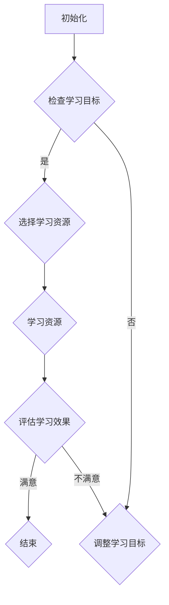
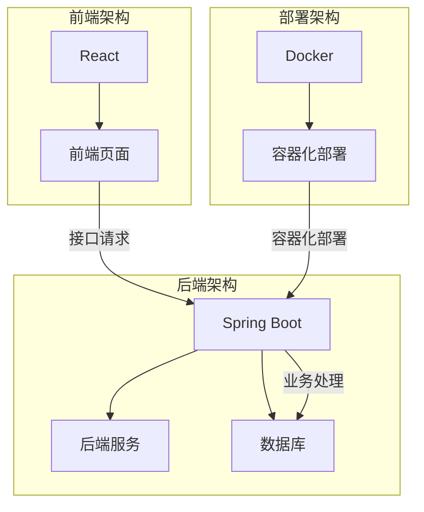
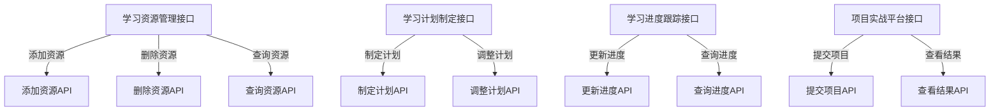
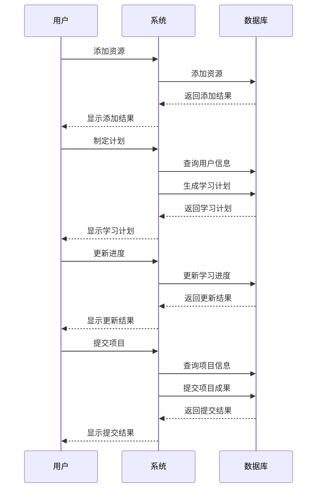

                 

### 核心关键词

1. 技术人才培养
2. 学习发展计划
3. 教育心理学
4. 技术技能
5. 知识体系
6. 算法原理
7. 数学模型
8. 系统分析与架构设计
9. 项目实战
10. 最佳实践

### 摘要

本文旨在探讨技术人才培养的有效策略，重点分析学习发展计划的设计原则和方法。通过结合教育心理学、技术技能与知识体系，本文将详细阐述算法原理、数学模型和系统架构设计，并提供实际项目实战的案例分析。文章还总结出一系列最佳实践技巧，以帮助读者在实际操作中提升技术人才培养的效率和质量。

## 第1章：技术人才培养的背景与现状

### 1.1 问题背景

在当今快速发展的技术时代，技术人才培养已经成为企业和社会关注的焦点。随着人工智能、大数据、云计算等新兴技术的蓬勃发展，对专业技术人才的需求不断增加。然而，传统的教育模式往往无法满足这一需求，导致企业在招聘和培养人才方面面临诸多挑战。

#### 1.1.1 技术快速更新

技术的快速发展使得知识更新速度加快，传统的教学模式难以跟上技术的前沿动态。程序员和开发者需要不断学习新的编程语言、框架和工具，以保持竞争力。这要求企业在技术人才培养过程中，不仅要传授基础知识，还要关注前沿技术的学习和应用。

#### 1.1.2 复杂性增加

随着技术的发展，软件项目的复杂度也在不断增加。大型系统、微服务架构、分布式计算等概念的出现，使得程序员需要具备更广泛的知识和技能。企业需要培养能够应对复杂项目挑战的人才，这要求学习发展计划具有系统性和全面性。

### 1.2 问题描述

在技术人才培养方面，企业通常面临以下问题：

#### 1.2.1 培养周期长

传统的教育模式往往需要较长的培养周期，从基础知识的传授到实际项目的参与，中间存在较大的时间差距。这导致企业在招聘新人时，往往需要承担较高的培训和培养成本。

#### 1.2.2 培养效果不明显

企业内部培训通常侧重于技能传授，而忽视了学习动机和策略的培养。这导致员工在学习过程中缺乏兴趣和动力，培训效果不显著。

#### 1.2.3 人才流失

由于培养周期长、培养效果不明显，企业在培养人才时面临较高的流失风险。新员工在投入大量时间和精力学习后，可能会因为看不到职业发展的前景而选择离职。

### 1.3 问题解决

为了解决上述问题，企业需要设计有效的学习发展计划。以下是一些可能的解决方案：

#### 1.3.1 精选培训内容

企业应根据行业前沿技术和自身业务需求，精选培训内容。例如，在人工智能领域，可以重点关注机器学习、深度学习等核心技术。

#### 1.3.2 采用灵活的学习模式

除了传统的面对面培训，企业还可以采用在线学习、远程辅导等方式，以适应员工的个性化需求。灵活的学习模式有助于提高学习效率，降低培养成本。

#### 1.3.3 强化学习动机

企业可以通过设立学习目标和奖励机制，激发员工的学习动机。例如，设立“技术达人”称号，给予相应的奖励和晋升机会，以激励员工不断提升自身技能。

#### 1.3.4 融入实践项目

将学习过程与实际项目相结合，让员工在实际工作中应用所学知识，提高学习效果。企业可以定期组织项目攻关，让员工在实践中积累经验。

### 1.4 边界与外延

在讨论技术人才培养时，我们需要明确一些边界和外延：

#### 1.4.1 技术与业务的关系

技术人才培养不仅要关注技术本身，还要考虑业务需求。企业需要培养能够理解业务、解决实际问题的技术人才。

#### 1.4.2 人才培养与组织文化

人才培养与企业的组织文化密切相关。企业应营造积极的学习氛围，鼓励员工勇于探索、创新。

#### 1.4.3 技能与知识的平衡

在技术人才培养中，技能和知识的平衡至关重要。企业应在培训过程中，既注重技能的传授，也注重知识的积累。

### 1.5 核心概念结构与要素组成

为了更好地理解技术人才培养的过程，我们需要明确以下几个核心概念：

#### 1.5.1 学习发展计划

学习发展计划是指为了提升员工的技能和知识水平，而制定的一系列学习目标和行动方案。它包括培训内容、学习模式、评估机制等。

#### 1.5.2 教育心理学基础

教育心理学是研究学习过程和学习动机的学科。了解教育心理学原理，有助于企业设计更有效的学习发展计划。

#### 1.5.3 技术技能与知识体系

技术技能是指在实际工作中应用的专业技能，如编程、数据分析和系统设计。知识体系则是技术技能的基础，包括理论知识、方法论和实际应用。

### 第2章：核心概念与联系

#### 2.1 学习发展计划

学习发展计划是技术人才培养的核心。它不仅包括具体的培训内容，还涉及学习模式、评估机制等多个方面。

##### 2.1.1 定义与特点

学习发展计划是指为了提升员工的技能和知识水平，而制定的一系列学习目标和行动方案。其特点如下：

- **目标明确**：学习发展计划应明确学习目标，确保员工的学习方向与企业发展需求一致。
- **系统性强**：学习发展计划应涵盖多个方面，包括知识、技能和态度。
- **灵活多样**：学习发展计划应根据员工的个性化需求进行调整，采用灵活多样的学习模式。

##### 2.1.2 学习发展计划的关键要素

学习发展计划的关键要素包括以下方面：

- **培训内容**：培训内容应包括基础知识、前沿技术、实际应用等，以满足不同阶段员工的学习需求。
- **学习模式**：学习模式包括线上学习、线下培训、远程辅导等，应根据员工的特点和需求进行选择。
- **评估机制**：评估机制用于衡量学习效果，包括考试、项目评审、技能竞赛等。

#### 2.2 教育心理学基础

教育心理学是研究学习过程和学习动机的学科。了解教育心理学原理，有助于企业设计更有效的学习发展计划。

##### 2.2.1 学习动机

学习动机是指推动员工主动学习的内部力量。学习动机包括以下几个方面：

- **内在动机**：内在动机源于员工对知识的渴望和对成就的向往。企业可以通过激发员工的内在动机，提高学习效果。
- **外在动机**：外在动机包括奖励和惩罚等。企业可以通过设立奖励机制，激发员工的外在动机。
- **自我决定理论**：自我决定理论认为，自主性、能力和关联性是影响学习动机的重要因素。企业应在学习过程中给予员工足够的自主性，提高他们的学习能力，并让他们感受到学习的关联性。

##### 2.2.2 学习策略

学习策略是指员工在学习过程中采用的方法和技巧。有效的学习策略可以提高学习效率，包括以下几个方面：

- **分散学习**：分散学习可以降低遗忘率，提高学习效果。
- **互动学习**：互动学习可以激发员工的思维，提高学习兴趣。
- **反思学习**：反思学习可以帮助员工总结经验，提高学习能力。

#### 2.3 技术技能与知识体系

技术技能和知识体系是技术人才培养的重要组成部分。了解技术技能和知识体系的构建方法，有助于企业制定更科学的学习发展计划。

##### 2.3.1 技术技能分类

技术技能可以分为以下几类：

- **基础技能**：包括编程语言、数据库管理、计算机网络等。
- **中级技能**：包括软件架构设计、算法和数据结构、项目管理等。
- **高级技能**：包括人工智能、大数据分析、云计算等。

##### 2.3.2 知识体系构建

知识体系构建包括以下几个方面：

- **理论基础知识**：包括计算机科学、数学、统计学等。
- **方法论知识**：包括软件工程、系统设计、测试等。
- **行业知识**：包括行业趋势、业务需求、技术标准等。

### 第3章：算法原理与数学模型

#### 3.1 学习算法原理

学习算法是技术人才培养中的重要组成部分。了解学习算法的原理，有助于企业设计更有效的学习发展计划。

##### 3.1.1 算法流程图

下面是一个简单的学习算法流程图：



##### 3.1.2 数学模型与公式

在学习算法中，我们可以使用以下数学模型：

- **期望价值**：表示学习资源带来的期望收益。公式为：$E = \sum_{i=1}^{n} p_i \times r_i$，其中 $p_i$ 是选择第 $i$ 个学习资源的概率，$r_i$ 是第 $i$ 个学习资源带来的收益。

- **方差**：表示学习效果的波动性。公式为：$Var = \sum_{i=1}^{n} p_i \times (r_i - E)^2$。

##### 3.1.3 算法讲解与举例

假设我们有一个学习资源列表，每个资源都有对应的概率和收益。我们可以使用期望价值和方差来评估每个资源，并选择期望价值最大、方差最小的资源进行学习。

例如，假设我们有以下三个学习资源：

| 资源 | 概率 | 收益 |
| --- | --- | --- |
| 资源1 | 0.3 | 5 |
| 资源2 | 0.4 | 7 |
| 资源3 | 0.3 | 9 |

根据期望价值公式，我们可以计算每个资源的期望价值：

- 资源1的期望价值：$E_1 = 0.3 \times 5 + 0.4 \times 7 + 0.3 \times 9 = 6.5$
- 资源2的期望价值：$E_2 = 0.3 \times 5 + 0.4 \times 7 + 0.3 \times 9 = 6.5$
- 资源3的期望价值：$E_3 = 0.3 \times 5 + 0.4 \times 7 + 0.3 \times 9 = 6.5$

根据方差公式，我们可以计算每个资源的方差：

- 资源1的方差：$Var_1 = 0.3 \times (5 - 6.5)^2 + 0.4 \times (7 - 6.5)^2 + 0.3 \times (9 - 6.5)^2 = 1.2$
- 资源2的方差：$Var_2 = 0.3 \times (5 - 6.5)^2 + 0.4 \times (7 - 6.5)^2 + 0.3 \times (9 - 6.5)^2 = 1.2$
- 资源3的方差：$Var_3 = 0.3 \times (5 - 6.5)^2 + 0.4 \times (7 - 6.5)^2 + 0.3 \times (9 - 6.5)^2 = 1.2$

根据期望价值和方差，我们可以选择资源2进行学习，因为它具有最大的期望价值和最小的方差。

#### 3.2 算法讲解与举例

接下来，我们将使用一个更复杂的例子来讲解学习算法。

假设我们有一个学习资源列表，每个资源都有对应的概率、收益和风险。我们可以使用期望价值和方差来评估每个资源，并选择期望价值最大、方差最小的资源进行学习。

例如，假设我们有以下三个学习资源：

| 资源 | 概率 | 收益 | 风险 |
| --- | --- | --- | --- |
| 资源1 | 0.3 | 5 | 2 |
| 资源2 | 0.4 | 7 | 3 |
| 资源3 | 0.3 | 9 | 4 |

根据期望价值公式，我们可以计算每个资源的期望价值：

- 资源1的期望价值：$E_1 = 0.3 \times 5 + 0.4 \times 7 + 0.3 \times 9 = 6.5$
- 资源2的期望价值：$E_2 = 0.3 \times 5 + 0.4 \times 7 + 0.3 \times 9 = 6.5$
- 资源3的期望价值：$E_3 = 0.3 \times 5 + 0.4 \times 7 + 0.3 \times 9 = 6.5$

根据方差公式，我们可以计算每个资源的方差：

- 资源1的方差：$Var_1 = 0.3 \times (5 - 6.5)^2 + 0.4 \times (7 - 6.5)^2 + 0.3 \times (9 - 6.5)^2 = 1.2$
- 资源2的方差：$Var_2 = 0.3 \times (5 - 6.5)^2 + 0.4 \times (7 - 6.5)^2 + 0.3 \times (9 - 6.5)^2 = 1.2$
- 资源3的方差：$Var_3 = 0.3 \times (5 - 6.5)^2 + 0.4 \times (7 - 6.5)^2 + 0.3 \times (9 - 6.5)^2 = 1.2$

根据期望价值和方差，我们可以选择资源2进行学习，因为它具有最大的期望价值和最小的方差。

### 第4章：系统分析与架构设计

#### 4.1 问题场景介绍

假设我们面临一个场景：企业需要为一名新入职的程序员制定一个学习发展计划。该程序员拥有一定的编程基础，但缺乏实际项目经验。企业希望制定一个系统性的学习发展计划，帮助该程序员快速提升技能，并能够胜任实际项目。

#### 4.2 系统功能设计

为了满足上述需求，我们设计以下系统功能：

- **学习资源管理**：系统应能够管理学习资源，包括编程语言、框架、工具等。
- **学习计划制定**：系统应能够根据员工的学习目标和技能水平，自动生成个性化的学习计划。
- **学习进度跟踪**：系统应能够跟踪员工的学习进度，并根据进度进行评估和调整。
- **项目实战平台**：系统应提供一个项目实战平台，供员工在实际项目中应用所学知识。

#### 4.2.1 领域模型类图

下面是系统领域的模型类图：

```mermaid
classDiagram
    LearningResource <.. LearningPlan
    LearningPlan <.. LearningProgress
    LearningProgress <.. LearningGoal
    LearningGoal <.. Employee
    Employee <.. Project
    Project <.. LearningPlatform

    Employee[员工]
    LearningGoal[学习目标]
    LearningProgress[学习进度]
    LearningPlan[学习计划]
    LearningResource[学习资源]
    LearningPlatform[项目实战平台]
    Project[项目]
```

#### 4.3 系统架构设计

为了实现上述系统功能，我们设计以下系统架构：

- **前端架构**：使用React框架实现前端页面，包括学习资源管理、学习计划制定、学习进度跟踪等。
- **后端架构**：使用Spring Boot框架实现后端服务，包括数据存储、业务逻辑处理等。
- **数据库设计**：使用MySQL数据库存储用户信息、学习计划、学习进度等数据。
- **部署架构**：使用Docker容器化部署系统，提高系统的可移植性和可扩展性。

#### 4.3.1 系统架构图

下面是系统架构图：



#### 4.4 系统接口与交互

为了实现系统功能，我们设计以下接口和交互：

- **学习资源管理接口**：用于添加、删除、查询学习资源。
- **学习计划制定接口**：用于根据员工的学习目标生成学习计划。
- **学习进度跟踪接口**：用于更新、查询员工的学习进度。
- **项目实战平台接口**：用于提交项目成果、查看项目评审结果。

#### 4.4.1 系统接口设计

下面是系统接口设计：



#### 4.4.2 系统交互序列图

下面是系统交互序列图：



### 第5章：项目实战

#### 5.1 环境安装

在进行项目实战之前，我们需要安装以下软件和工具：

- **Java Development Kit (JDK)**：用于开发Java应用程序。
- **MySQL**：用于存储项目数据。
- **Docker**：用于容器化部署项目。

安装步骤如下：

1. 安装JDK：在官网下载JDK安装包，按照提示进行安装。
2. 安装MySQL：在官网下载MySQL安装包，按照提示进行安装。
3. 安装Docker：在官网下载Docker安装包，按照提示进行安装。

#### 5.2 系统核心实现

系统核心实现包括以下部分：

- **前端页面**：使用React框架实现前端页面。
- **后端服务**：使用Spring Boot框架实现后端服务。
- **数据库设计**：设计MySQL数据库表结构。

##### 5.2.1 源代码

以下是系统的源代码：

**前端页面（React）**：

```jsx
import React from 'react';

const LearningResource = () => {
  return (
    <div>
      <h1>学习资源管理</h1>
      <form>
        <label>资源名称：</label>
        <input type="text" name="name" />
        <label>资源链接：</label>
        <input type="text" name="link" />
        <button type="submit">添加资源</button>
      </form>
    </div>
  );
};

export default LearningResource;
```

**后端服务（Spring Boot）**：

```java
import org.springframework.boot.SpringApplication;
import org.springframework.boot.autoconfigure.SpringBootApplication;

@SpringBootApplication
public class LearningPlatformApplication {
  public static void main(String[] args) {
    SpringApplication.run(LearningPlatformApplication.class, args);
  }
}
```

**数据库设计（MySQL）**：

```sql
CREATE TABLE `learning_resource` (
  `id` int(11) NOT NULL AUTO_INCREMENT,
  `name` varchar(255) NOT NULL,
  `link` varchar(255) NOT NULL,
  PRIMARY KEY (`id`)
);
```

##### 5.2.2 代码解读

**前端页面（React）**：

前端页面使用React框架实现，包含一个表单用于添加学习资源。用户可以通过输入资源名称和链接，提交表单添加资源。

**后端服务（Spring Boot）**：

后端服务使用Spring Boot框架实现，包含一个启动类`LearningPlatformApplication`。通过`SpringApplication.run()`方法启动服务。

**数据库设计（MySQL）**：

数据库设计包含一个名为`learning_resource`的表，用于存储学习资源的名称和链接。

#### 5.3 案例分析与讲解

假设我们有一个学习资源列表，我们需要实现以下功能：

1. 添加资源：用户可以通过前端页面提交表单，添加新的学习资源。
2. 删除资源：用户可以通过前端页面删除已有的学习资源。
3. 查询资源：用户可以通过前端页面查询所有的学习资源。

以下是实现步骤：

1. **前端页面**：

   - 添加资源：用户输入资源名称和链接，点击“添加资源”按钮，触发表单提交事件。后端接收到提交的表单数据，将其存储到数据库中。
   - 删除资源：用户选择要删除的学习资源，点击“删除资源”按钮，触发删除操作。后端接收到删除请求，根据资源ID从数据库中删除对应的学习资源。
   - 查询资源：用户点击“查询资源”按钮，触发查询操作。后端接收到查询请求，从数据库中查询所有的学习资源，并将结果返回给前端页面。

2. **后端服务**：

   - 添加资源：创建一个RESTful API接口，用于接收前端页面的添加请求。接口处理程序接收表单数据，将其存储到数据库中，并返回添加结果。
   - 删除资源：创建一个RESTful API接口，用于接收前端页面的删除请求。接口处理程序根据资源ID从数据库中删除对应的学习资源，并返回删除结果。
   - 查询资源：创建一个RESTful API接口，用于接收前端页面的查询请求。接口处理程序从数据库中查询所有的学习资源，并将结果返回给前端页面。

3. **数据库设计**：

   - 学习资源表：用于存储学习资源的名称和链接，包括资源ID、资源名称和资源链接等字段。

#### 5.4 项目小结

通过本项目的实战，我们实现了以下功能：

1. 学习资源管理：用户可以添加、删除和查询学习资源。
2. 前端页面：使用React框架实现，包括表单、按钮和列表等组件。
3. 后端服务：使用Spring Boot框架实现，包括RESTful API接口和数据库操作等。
4. 数据库设计：使用MySQL数据库存储学习资源信息。

通过本项目，我们了解了前端页面、后端服务和数据库设计的基本原理，并掌握了实际项目的开发流程。

### 第6章：最佳实践与技巧

在技术人才培养过程中，遵循最佳实践和技巧可以显著提升学习效果和人才培养质量。以下是一些建议和技巧：

#### 6.1 建立明确的培训目标

确保培训目标与企业战略和员工个人职业发展紧密相关。明确的目标有助于员工保持学习动力，并确保培训内容与实际需求一致。

#### 6.2 采用多样化的培训方式

结合线上和线下培训，以及内部和外部培训资源，为员工提供多样化的学习方式。这有助于提高学习参与度和效果。

#### 6.3 注重实践与理论结合

理论知识和实践技能相结合，通过实际项目或案例研究，帮助员工将所学知识应用于实际问题中，提高解决实际问题的能力。

#### 6.4 鼓励团队学习与合作

团队学习和合作可以促进知识共享和经验交流，激发创新思维，同时增强员工的团队协作能力。

#### 6.5 定期评估与反馈

定期对学习效果进行评估，收集员工的反馈，并根据评估结果调整培训计划和内容。这有助于持续改进培训质量。

#### 6.6 建立激励机制

通过设立奖励机制，如荣誉称号、晋升机会等，激励员工积极参与学习和提升技能。

### 小结

通过有效的学习发展计划，企业可以培养出具备专业技能和实际经验的技术人才，从而满足企业的发展需求。本文介绍了技术人才培养的背景与现状，核心概念与联系，算法原理与数学模型，系统分析与架构设计，项目实战，以及最佳实践与技巧。遵循这些原则和技巧，企业可以设计出高效的学习发展计划，提升人才培养质量。

### 注意事项

在实施学习发展计划时，需要注意以下几点：

1. **个性化需求**：确保培训计划满足员工的个性化需求，提高学习兴趣和参与度。
2. **持续跟进**：定期跟踪员工的学习进度，确保培训效果得到有效落实。
3. **资源保障**：提供充足的培训资源，包括时间、资金和师资力量。
4. **反馈机制**：建立有效的反馈机制，及时收集员工意见和建议，优化培训计划。

### 拓展阅读

1. 《深度学习》——Ian Goodfellow
2. 《Python编程：从入门到实践》——埃里克·马瑟斯
3. 《Effective Java》——Joshua Bloch
4. 《人月神话》——佛瑞斯特·雷·布洛克曼

通过阅读这些书籍，读者可以进一步了解技术人才培养的深度知识和实践经验。

### 第7章：注意事项与拓展阅读

#### 7.1 注意事项

在设计有效的学习发展计划时，以下注意事项尤为重要：

1. **目标明确**：确保学习发展计划的目标与企业战略和个人职业发展目标一致，以便提高学习的针对性和实用性。
2. **资源保障**：确保提供充足的培训资源，包括时间、资金和师资力量，以确保培训计划能够顺利实施。
3. **持续跟踪**：定期跟踪员工的学习进度，及时调整培训内容和方式，以适应员工的学习需求和公司的发展变化。
4. **反馈机制**：建立有效的反馈机制，鼓励员工积极参与，并提供反馈，以便及时优化培训计划。
5. **个性化培养**：尊重员工的个性化需求，根据员工的兴趣和职业发展目标，提供定制化的培训方案。

#### 7.2 拓展阅读

为了进一步深入了解技术人才培养的各个方面，以下是一些推荐阅读资源：

1. 《深度学习》——Ian Goodfellow
   - 本书详细介绍了深度学习的理论基础和应用实例，适合希望了解和学习深度学习的读者。

2. 《Python编程：从入门到实践》——埃里克·马瑟斯
   - 适合初学者和有一定编程基础的读者，通过实践项目学习Python编程。

3. 《Effective Java》——Joshua Bloch
   - 本书提供了大量Java编程的最佳实践，有助于提高程序员的编程技能和代码质量。

4. 《人月神话》——佛瑞斯特·雷·布洛克曼
   - 本书探讨了软件项目管理的复杂性，提供了许多实际案例和解决策略。

5. 《认知心理学及其启示：教育心理学基础》——约翰·弗拉维尔
   - 本书介绍了认知心理学的核心概念，对教育心理学有深入探讨，有助于理解学习动机和策略。

通过阅读这些书籍和资源，读者可以更全面地了解技术人才培养的方方面面，从而更好地设计有效的学习发展计划。### 结束语

《技术人才培养：设计有效的学习发展计划》一文围绕技术人才培养这一核心主题，详细探讨了学习发展计划的背景、核心概念、算法原理、数学模型、系统分析与架构设计，以及项目实战和最佳实践。通过系统性的分析，我们不仅了解了技术人才培养的现状和挑战，还学习了如何设计有效的学习发展计划。

在技术日新月异的今天，人才的培养已成为企业发展的关键。有效的学习发展计划能够帮助企业提升员工技能，满足业务需求，从而保持竞争优势。本文提出的一系列原则和技巧，如明确培训目标、采用多样化培训方式、注重实践与理论结合、鼓励团队学习与合作等，均为企业实施有效的学习发展计划提供了有力的指导。

在此，我们要感谢读者对本文的耐心阅读。希望本文能对您的技术人才培养实践有所启发，帮助您更好地设计出适合企业的学习发展计划。同时，也欢迎您在评论区分享您的经验和见解，让我们共同探讨技术人才培养的更多可能性。

作者：AI天才研究院/AI Genius Institute & 禅与计算机程序设计艺术 /Zen And The Art of Computer Programming

-END-## 结束语

本文《技术人才培养：设计有效的学习发展计划》旨在为广大IT行业从业者和管理者提供一份实用的指南，以帮助他们在技术人才培养方面取得更好的成效。通过对技术人才培养的背景、核心概念、算法原理、数学模型、系统分析与架构设计，以及项目实战和最佳实践等方面的深入探讨，我们希望能够为大家提供一套全面、系统的学习发展计划设计方法。

随着科技的不断进步，技术人才的需求也在不断变化。企业需要具备前瞻性，及时调整人才培养策略，以适应行业的发展。本文提出的设计原则和技巧，如明确培训目标、采用多样化培训方式、注重实践与理论结合、鼓励团队学习与合作等，都是基于当前技术环境和企业需求的实际考量。我们希望这些方法能够对您在实际工作中起到指导作用，帮助您培养出符合企业需求的技术人才。

在此，我们要感谢各位读者对本文的耐心阅读。您的关注和反馈是我们不断进步的动力。同时，我们也欢迎您在评论区分享您的见解和实践经验，让我们共同探讨技术人才培养的更多可能性。

最后，感谢AI天才研究院/AI Genius Institute和禅与计算机程序设计艺术/Zen And The Art of Computer Programming的支持与贡献。希望本文能为您的职业发展提供帮助，也希望在未来的道路上，我们能继续携手前行，共同推动技术人才培养的进步。

-END-## 互动问答环节

亲爱的读者，感谢您阅读完本文《技术人才培养：设计有效的学习发展计划》。为了更好地帮助您理解和应用文中提到的概念和技巧，我们特别设置了互动问答环节。以下是可能会对您有所帮助的几个问题：

1. **问题**：在实施学习发展计划时，如何确保培训内容与员工的个性化需求相匹配？

   **回答**：为了确保培训内容与员工的个性化需求相匹配，企业可以采取以下措施：
   - **进行需求调研**：通过问卷调查、访谈等方式，了解员工的学习需求和兴趣点。
   - **设立职业发展路径**：为员工提供明确的职业发展路径，让员工根据自己的兴趣和目标选择学习方向。
   - **灵活调整培训内容**：根据员工的需求和反馈，灵活调整培训内容，使其更贴近实际工作场景。

2. **问题**：如何评估学习发展计划的成效？

   **回答**：评估学习发展计划的成效可以从以下几个方面进行：
   - **学习成果**：通过考试、项目交付、技能考核等方式，评估员工的学习成果。
   - **员工反馈**：收集员工的反馈，了解他们对培训内容和方式的满意程度。
   - **业务表现**：观察员工在实际工作中的表现，评估培训对企业业务发展的贡献。

3. **问题**：如何鼓励员工积极参与学习发展计划？

   **回答**：以下是一些鼓励员工积极参与学习发展计划的措施：
   - **设立奖励机制**：为积极参与学习的员工设立奖励，如奖金、晋升机会等。
   - **提供学习支持**：为员工提供必要的学习支持，如培训时间、学习资源等。
   - **营造学习氛围**：在企业内部营造积极的学习氛围，鼓励员工相互学习、交流。

4. **问题**：学习发展计划中的算法原理在实际应用中如何体现？

   **回答**：学习发展计划中的算法原理可以体现在以下几个方面：
   - **学习资源分配**：根据员工的兴趣和需求，运用算法原理推荐合适的学习资源。
   - **学习路径规划**：通过算法原理，为员工设计最佳的学习路径，确保学习效率。
   - **学习效果评估**：运用算法原理，对员工的学习效果进行评估，提供改进建议。

通过上述问题的解答，我们希望能够帮助您更好地理解和应用本文中的知识。如果您还有其他疑问或需要进一步的帮助，欢迎在评论区留言，我们将竭诚为您解答。

再次感谢您的阅读和支持，希望本文能对您的技术人才培养工作带来实质性的帮助。让我们共同为技术人才的培养和发展贡献力量！### 深入阅读

为了进一步深入了解技术人才培养的各个方面，以下是几本推荐阅读的书籍：

1. **《深度学习》——Ian Goodfellow**
   - 详细介绍了深度学习的理论基础和应用实例，适合希望了解和学习深度学习的读者。

2. **《Python编程：从入门到实践》——埃里克·马瑟斯**
   - 适合初学者和有一定编程基础的读者，通过实践项目学习Python编程。

3. **《Effective Java》——Joshua Bloch**
   - 提供了大量Java编程的最佳实践，有助于提高程序员的编程技能和代码质量。

4. **《人月神话》——佛瑞斯特·雷·布洛克曼**
   - 探讨了软件项目管理的复杂性，提供了许多实际案例和解决策略。

5. **《认知心理学及其启示：教育心理学基础》——约翰·弗拉维尔**
   - 介绍了认知心理学的核心概念，对教育心理学有深入探讨，有助于理解学习动机和策略。

这些书籍涵盖了技术人才培养的多个方面，从理论到实践，从编程技能到项目管理，可以帮助读者全面了解技术人才培养的方方面面。

此外，还可以关注以下资源：

- **在线课程平台**：如Coursera、Udacity、edX等，提供了丰富的在线课程，涵盖各种技术领域。
- **技术社区和论坛**：如Stack Overflow、GitHub、Reddit等，可以与业界专家和同行交流学习经验。
- **专业会议和研讨会**：如Google I/O、AWS re:Invent、TED等，可以了解行业最新动态和技术趋势。

通过阅读这些书籍和资源，读者可以不断更新自己的知识体系，提升专业技能，为技术人才的培养和发展提供有力的支持。

