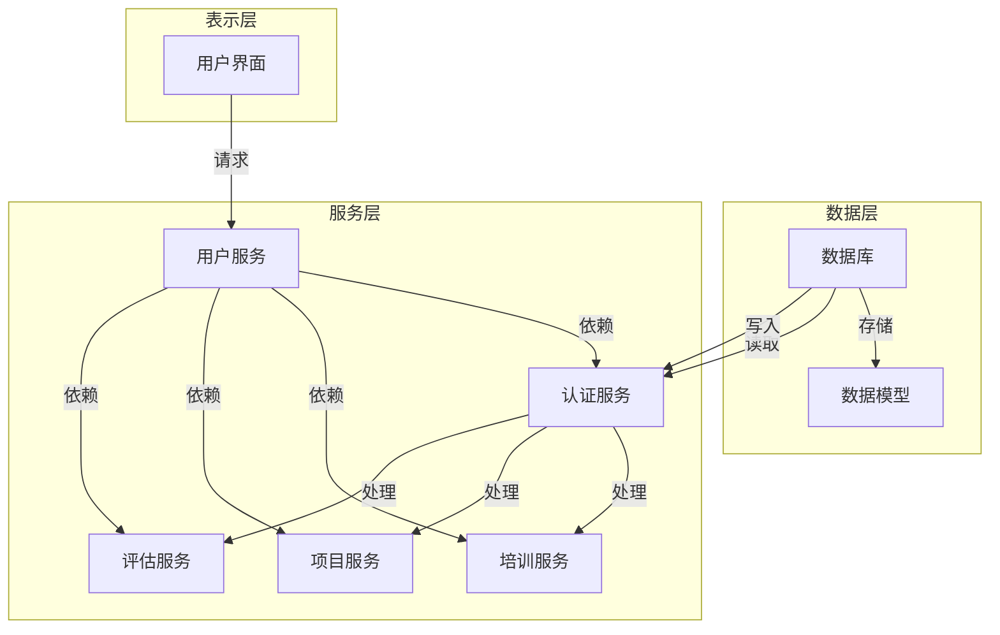
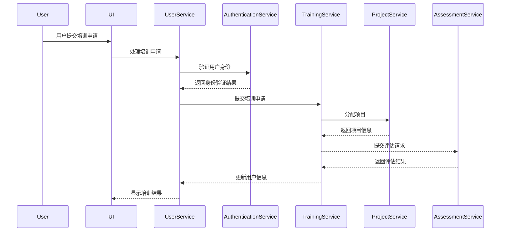
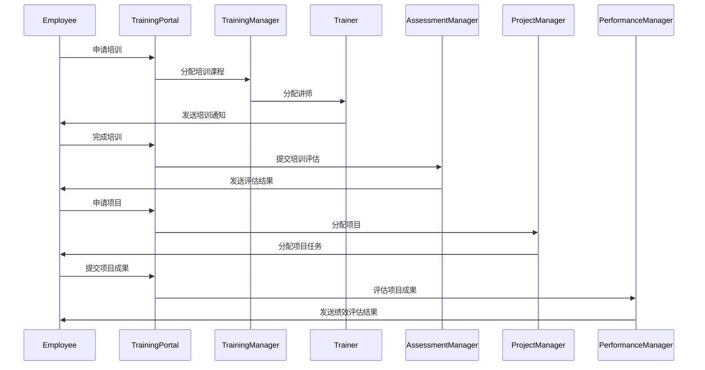

                 

# 技术人才梯队建设与培养计划

## 关键词

- 技术人才
- 梯队建设
- 培养计划
- 人才管理
- 技能发展

## 摘要

本文将深入探讨技术人才梯队建设与培养计划的核心内容和关键策略。我们将从背景介绍、核心概念、理论理解、培训方案设计等多个角度进行分析，旨在为读者提供一套完整的技术人才发展路线图。文章将结合实际案例，展示成功的技术人才团队建设经验，并探讨人工智能在人才发展中的应用。通过本文的阅读，读者将能够理解技术人才团队建设的重要性，掌握相关理论知识和实用技能，为自身和组织的长远发展打下坚实基础。

## 引言

### 1.1 背景介绍

在当今快速发展的技术时代，技术人才已成为企业和社会发展的关键资源。随着人工智能、大数据、云计算等新兴技术的崛起，技术人才的需求量和质量要求越来越高。然而，企业普遍面临技术人才短缺和人才发展不足的问题。因此，如何有效地进行技术人才梯队建设与培养，已成为企业关注的焦点。

#### 1.1.1 技术人才的重要性

技术人才是企业创新和发展的核心驱动力。他们不仅具备解决复杂技术问题的能力，还能够引领技术创新，推动企业业务的转型升级。技术人才的价值在于他们能够将前沿技术应用到实际场景中，为企业创造实际效益。

#### 1.1.2 技术人才发展的挑战

技术人才发展面临诸多挑战。首先，技术领域更新迅速，技术人才需要不断学习新知识、掌握新技能。其次，企业内部缺乏有效的培养体系和激励机制，导致技术人才流失严重。此外，技术人才的选拔和评价体系不完善，难以准确评估其能力和潜力。

#### 1.1.3 技术人才团队建设的目标

技术人才团队建设的目标是打造一支稳定、高效、创新的技术团队，为企业提供持续的技术支持。具体目标包括：

1. 提高技术人才的技能水平，满足企业业务需求。
2. 建立健全的人才选拔和评价体系，激励人才成长。
3. 营造良好的团队氛围，促进团队合作和知识共享。
4. 培养技术领导力，提升团队整体竞争力。

### 1.2 核心概念

#### 1.2.1 技术人才

技术人才是指具备某种技术特长、能够解决复杂技术问题、具有创新能力的人员。技术人才包括软件开发工程师、数据科学家、人工智能专家等。

#### 1.2.2 技术人才团队

技术人才团队是由多领域、多层次的技术人才组成的，共同协作完成技术任务的组织形式。技术人才团队的特点包括：

1. 多样性：团队成员具备不同的技术背景和经验，能够实现技能互补。
2. 专业性：团队成员在各自领域具有较高的专业水平。
3. 创新性：团队成员具备创新能力，能够推动技术发展。

#### 1.2.3 技术人才发展策略

技术人才发展策略包括内部培训和外部招聘。内部培训可以通过定期的技术分享、项目实训等方式提升员工技能水平。外部招聘可以吸引外部优秀技术人才加入团队，为组织注入新鲜血液。

### 1.3 主流模型

#### 1.3.1 内部培训计划

内部培训计划是企业培养技术人才的重要手段。通过内部培训，员工可以在工作中不断学习和提升技能，满足企业的发展需求。内部培训计划包括：

1. 技术分享：组织内部技术交流会，促进团队成员之间的知识共享。
2. 项目实训：通过实际项目锻炼员工的技术能力和实践经验。
3. 在线学习平台：提供在线课程和资源，方便员工自主学习和提升技能。

#### 1.3.2 合作伙伴关系

企业可以通过与高校、研究机构等合作，共同培养技术人才。合作伙伴关系可以实现资源共享、优势互补，为企业的技术发展提供有力支持。

#### 1.3.3 外部招聘策略

外部招聘是企业获取优秀技术人才的重要渠道。企业可以通过多种方式吸引外部人才，如发布招聘广告、参加招聘会、合作招聘等。在招聘过程中，企业需要注重候选人技能和潜力的评估，确保招聘到符合企业需求的人才。

### 1.4 人工智能在人才发展中的应用

人工智能在人才发展中具有重要作用。通过人工智能技术，企业可以实现：

1. 智能招聘：利用人工智能技术筛选简历、评估候选人，提高招聘效率。
2. 智能培训：利用人工智能技术提供个性化培训方案，提高员工学习效果。
3. 智能评价：利用人工智能技术评估员工技能水平和工作表现，为人才发展提供数据支持。

### 1.5 总结与展望

技术人才梯队建设与培养是一项系统工程，需要企业从战略高度出发，制定全面的人才发展计划。通过内部培训、合作伙伴关系和外部招聘等多种方式，企业可以打造一支稳定、高效、创新的技术团队，为企业的持续发展提供有力保障。未来，随着人工智能等新兴技术的不断发展，技术人才的发展也将面临新的机遇和挑战。企业需要不断适应变化，完善人才发展策略，以应对日益激烈的市场竞争。

## 核心概念与理论

### 2.1 理解人才管理

#### 2.1.1 人才管理的理论

人才管理是一种系统化的方法，用于识别、发展和利用人才资源，以实现组织的战略目标。以下是一些主要的人才管理理论：

1. **人力资源理论**：强调人力资源是组织的核心竞争力，通过优化人力资源管理，提高员工满意度和绩效。
2. **能力理论**：认为人才的核心在于其能力，组织应关注员工的技能和发展潜力，以提升整体竞争力。
3. **动机理论**：研究员工在工作中的动机和行为，通过激励手段提高员工的工作积极性和创造力。

#### 2.1.2 关键绩效指标（KPI）

在人才管理中，关键绩效指标（KPI）是衡量人才发展效果的重要工具。以下是一些常见的KPI：

1. **员工满意度**：通过员工调查了解员工对工作环境、薪酬福利和职业发展的满意度。
2. **员工流失率**：衡量员工离职情况，反映组织在人才保留方面的表现。
3. **培训参与率**：反映员工参与培训和发展的积极性，表明组织在人才培养方面的投入程度。
4. **员工绩效**：通过绩效评估了解员工的工作表现和业绩，为人才发展提供依据。

#### 2.1.3 SWOT分析

SWOT分析是一种常用的战略规划工具，用于评估组织在人才管理方面的优势、劣势、机会和威胁。以下是一个简单的SWOT分析表格：

|   | **优势** | **劣势** | **机会** | **威胁** |
|---|---|---|---|---|
| **内部** | 提高员工技能和知识 | 缺乏有效的激励机制 | 市场对技术人才的需求增加 | 技术更新速度快，人才竞争激烈 |
| **外部** | 建立良好的雇主品牌 | 人才储备不足 | 技术领域的快速发展 | 市场对高端技术人才的需求减少 |

### 2.2 技能发展模型

#### 2.2.1 成人学习理论

成人学习理论认为，成年人在学习过程中具有自主性、经验性和实用性的特点。以下是一些主要的成人学习理论：

1. **经验学习理论**：认为学习是通过经验积累和反思实现的，强调实践和反思在学习过程中的重要性。
2. **社会学习理论**：认为学习是通过观察和模仿他人行为实现的，强调社交互动和学习环境的作用。
3. **认知学习理论**：认为学习是通过认知结构的重建和调整实现的，强调理解和思维在学习过程中的重要性。

#### 2.2.2 能力模型

能力模型是一种描述个体能力的工具，通过定义能力的维度和层次，帮助企业识别和培养关键技能。以下是一个简单的能力模型表格：

| **能力维度** | **能力层次** | **能力描述** |
|---|---|---|
| **技术能力** | **初级** | 熟悉基本技术知识和工具 |
|                 | **中级** | 能够应用技术解决问题 |
|                 | **高级** | 能够独立设计和实施复杂项目 |
| **项目管理能力** | **初级** | 熟悉项目管理的基本流程和方法 |
|                 | **中级** | 能够制定项目计划和管理团队 |
|                 | **高级** | 能够领导大型项目并应对风险挑战 |
| **团队协作能力** | **初级** | 能够与团队成员有效沟通 |
|                 | **中级** | 能够协调不同团队成员的工作 |
|                 | **高级** | 能够建立高效团队并推动团队创新 |

#### 2.2.3 技能差距分析

技能差距分析是一种评估员工当前技能与组织需求之间差距的方法。以下是一个简单的技能差距分析表格：

| **员工姓名** | **当前技能水平** | **组织需求技能水平** | **技能差距** |
|---|---|---|---|
| **张三** | **初级** | **中级** | **中级技能差距** |
| **李四** | **中级** | **高级** | **高级技能差距** |
| **王五** | **高级** | **高级** | **无技能差距** |

### 2.3 组织文化与人才

#### 2.3.1 组织文化的影响

组织文化对人才发展具有深远影响。积极向上的组织文化可以激发员工的创造力、提高员工满意度，从而促进人才发展。以下是一些影响人才发展的组织文化因素：

1. **愿景和使命**：明确组织的发展方向和目标，为员工提供明确的职业发展路径。
2. **价值观**：建立共同的价值观和行为准则，促进团队合作和知识共享。
3. **领导风格**：领导者的风格对员工的行为和工作氛围具有重要影响。

#### 2.3.2 建立吸引人的工作环境

建立吸引人的工作环境是留住优秀人才的关键。以下是一些建议：

1. **灵活的工作安排**：提供弹性工作时间、远程办公等福利，提高员工的工作满意度。
2. **培训与发展机会**：提供丰富的培训和发展机会，帮助员工提升技能和职业素养。
3. **良好的工作氛围**：营造开放、包容、互助的工作氛围，促进团队合作和创新。

#### 2.3.3 组织变革管理

组织变革管理是推动人才发展的重要手段。以下是一些组织变革管理的原则和方法：

1. **明确变革目标**：确保变革目标与组织战略一致，为员工提供清晰的变革方向。
2. **有效沟通**：建立开放的沟通渠道，确保员工充分了解变革的原因和影响。
3. **参与变革**：鼓励员工参与变革过程，提高员工的认同感和积极性。
4. **激励措施**：通过奖励和激励措施，激发员工的变革动力。

### 2.4 成功的案例研究

#### 2.4.1 公司A

公司A通过内部培训和合作伙伴关系，成功打造了一支高素质的技术团队。公司A的做法包括：

1. **内部培训**：定期组织技术分享会和项目实训，提升员工技能水平。
2. **合作伙伴关系**：与高校和研究机构合作，共同培养技术人才。
3. **激励机制**：设立技能认证和晋升通道，激励员工不断学习和成长。

#### 2.4.2 公司B

公司B通过外部招聘和内部培养相结合，快速构建了一支技术实力雄厚的人才团队。公司B的做法包括：

1. **外部招聘**：积极吸引外部优秀技术人才，为组织注入新鲜血液。
2. **内部培养**：通过内部培训和项目锻炼，提升员工的技能和经验。
3. **人才发展计划**：制定详细的员工发展计划，为员工提供明确的职业发展路径。

#### 2.4.3 公司C

公司C通过引入人工智能技术，实现了人才管理的智能化和精准化。公司C的做法包括：

1. **智能招聘**：利用人工智能技术筛选简历、评估候选人，提高招聘效率。
2. **智能培训**：提供个性化培训方案，提高员工学习效果。
3. **智能评价**：利用人工智能技术评估员工技能水平和工作表现，为人才发展提供数据支持。

### 2.5 总结与关键点

通过本文的讨论，我们了解了技术人才梯队建设与培养计划的核心概念和理论。以下是本文的关键点：

1. **人才管理的重要性**：人才管理是组织战略的重要组成部分，对企业的长期发展具有重要影响。
2. **技能发展模型**：能力模型和技能差距分析有助于识别和培养关键技能，提升团队整体竞争力。
3. **组织文化的影响**：积极向上的组织文化有助于激发员工的创造力，促进人才发展。
4. **成功的案例研究**：通过分析成功案例，我们可以借鉴其经验，制定适合自身组织的人才发展策略。

## 建立全面的技术培训计划

### 3.1 需求评估

需求评估是制定技术培训计划的第一步。通过需求评估，可以明确员工当前的技术水平和技能需求，从而制定有针对性的培训计划。

#### 3.1.1 识别员工技能需求

首先，需要了解员工当前的技术能力和知识水平。可以通过以下方式进行：

1. **技能评估**：组织技能测试或评估，了解员工的技术能力。
2. **员工自评**：鼓励员工对自己的技能进行自我评估，了解其自我认知与实际能力的差距。
3. **经理评估**：经理对员工的技能水平进行评估，提供反馈和建议。

#### 3.1.2 分析技能差距

在了解员工技能需求后，需要分析员工与组织目标之间的技能差距。可以通过以下方式进行：

1. **技能需求分析**：确定组织期望员工具备的技能和知识。
2. **技能差距分析**：比较员工的技能水平和组织期望，识别技能差距。

#### 3.1.3 制定培训计划

根据技能需求分析和技能差距分析的结果，制定详细的培训计划。培训计划应包括以下内容：

1. **培训目标**：明确培训的目标和预期成果。
2. **培训内容**：确定培训的具体内容和模块。
3. **培训方式**：选择合适的培训方式，如在线课程、面授课程、工作坊等。
4. **培训时间**：安排培训的时间和频率。
5. **培训资源**：准备培训所需的资源，如教材、工具等。

### 3.2 培训计划设计

培训计划设计是确保培训效果的关键环节。以下是一个典型的培训计划设计流程：

#### 3.2.1 确定培训目标

培训目标应与组织目标和员工个人发展目标相结合，确保培训的针对性和实效性。培训目标可以包括：

1. **提高员工的技术能力**：通过培训，使员工能够掌握新的技术知识和技能。
2. **提升员工的职业素养**：通过培训，提高员工的专业知识和职业素养。
3. **促进员工的发展**：通过培训，为员工的职业发展提供支持。

#### 3.2.2 设计培训内容

培训内容应覆盖员工所需掌握的技能和知识。以下是一些常见的培训内容：

1. **技术知识**：包括编程语言、数据库、算法等。
2. **项目管理**：包括项目规划、团队协作、风险管理等。
3. **业务知识**：包括行业动态、业务流程、客户需求等。
4. **软技能**：包括沟通技巧、团队合作、领导力等。

#### 3.2.3 选择培训方式

选择合适的培训方式可以提高培训效果。以下是一些常见的培训方式：

1. **在线课程**：灵活方便，适合自我学习和重复学习。
2. **面授课程**：互动性强，有利于知识的消化和理解。
3. **工作坊**：实践性强，有助于提升实际操作能力。
4. **案例研究**：通过分析真实案例，提高员工的实战能力。

#### 3.2.4 制定培训时间表

制定详细的培训时间表，明确培训的起始时间、持续时间、培训频率等。以下是一个简单的培训时间表示例：

| **培训主题** | **起始时间** | **持续时间** | **培训频率** |
|---|---|---|---|
| **编程语言** | **2023年4月1日** | **4周** | **每周一次** |
| **项目管理** | **2023年5月1日** | **6周** | **每周一次** |
| **软技能** | **2023年6月1日** | **3周** | **每周一次** |

#### 3.2.5 准备培训资源

培训资源是确保培训顺利进行的基础。以下是一些常见的培训资源：

1. **教材**：包括电子版和纸质版教材，用于培训过程中的参考和学习。
2. **工具**：包括编程环境、项目管理工具等，用于实际操作和练习。
3. **讲师**：选择具备丰富经验和教学能力的讲师，提高培训质量。
4. **培训场地**：提供舒适的培训场地和设备，确保培训环境的良好。

### 3.3 实施与监控

培训计划的实施和监控是确保培训效果的重要环节。以下是一些实施与监控的建议：

#### 3.3.1 培训实施

1. **制定详细的培训计划**：明确培训的内容、方式、时间和资源。
2. **通知员工**：提前通知员工培训的时间和地点，确保员工参加培训。
3. **提供培训资料**：在培训前提供相关的教材和资料，帮助员工预习和复习。
4. **培训过程中的监控**：实时监控培训进度，确保培训按照计划进行。

#### 3.3.2 培训监控

1. **培训效果评估**：通过考试、作业、项目等多种方式，评估员工的培训效果。
2. **员工反馈**：收集员工的反馈意见，了解培训的优缺点，为后续培训提供改进建议。
3. **培训报告**：编写培训报告，总结培训的成果和经验教训。

### 3.4 培训评估与持续改进

培训评估是确保培训效果和持续改进的重要手段。以下是一些培训评估和持续改进的建议：

#### 3.4.1 培训评估

1. **定量评估**：通过考试、测试等定量方式，评估员工的知识掌握程度。
2. **定性评估**：通过问卷调查、访谈等方式，评估员工对培训的满意度。
3. **实践评估**：通过实际工作项目，评估员工在实际工作中应用培训知识的能力。

#### 3.4.2 持续改进

1. **反馈机制**：建立反馈机制，收集员工的培训反馈，及时进行改进。
2. **定期评估**：定期对培训效果进行评估，确保培训的持续性和有效性。
3. **课程更新**：根据技术发展和员工需求，定期更新培训课程内容。

### 3.5 总结

建立全面的技术培训计划是提升员工技能和团队整体竞争力的重要手段。通过需求评估、培训计划设计、实施与监控以及评估与持续改进，企业可以确保培训计划的顺利实施和有效成果。同时，企业应关注员工的职业发展，提供多样化的培训和发展机会，帮助员工不断提升自身能力，为企业的发展贡献力量。

## 实战案例

### 4.1 案例背景

公司D是一家致力于人工智能领域的高科技企业，其核心竞争力在于技术创新和团队实力。随着公司业务的不断扩展，对技术人才的需求也日益增加。公司D决定实施一套全面的技术人才梯队建设与培养计划，以提升团队的整体素质和竞争力。

### 4.2 项目介绍

项目目标是打造一支稳定、高效、创新的技术团队，通过内部培训和外部招聘，提高员工的技术水平和项目经验。项目的主要任务包括：

1. **需求评估**：对现有员工的技术能力进行评估，识别技能差距。
2. **内部培训**：设计并实施一系列技术培训课程，包括编程语言、算法、数据库等。
3. **外部招聘**：吸引优秀的外部技术人才，为团队注入新鲜血液。
4. **技能认证**：实施技能认证制度，确保员工掌握必要的技术技能。
5. **项目实训**：通过实际项目锻炼员工的技能和经验。

### 4.3 系统功能设计

#### 4.3.1 领域模型

领域模型是描述系统功能的核心工具。以下是公司D的技术人才梯队建设与培养计划领域模型的类图：

```mermaid
classDiagram
    Employee <<class>> 员工
    Trainer <<class>> 讲师
    Course <<class>> 课程
    Training <<class>> 培训
    Project <<class>> 项目
    Skill <<class>> 技能
    Assessment <<class>> 评估

    Employee o-- Training: 员工参加培训
    Trainer o-- Training: 讲师负责培训
    Training o-- Course: 培训包含课程
    Training o-- Assessment: 培训后进行评估
    Project o-- Employee: 项目由员工参与
    Project o-- Skill: 项目涉及技能
```

#### 4.3.2 系统架构

系统架构是描述系统组件和它们之间关系的重要工具。以下是公司D的技术人才梯队建设与培养计划的架构图：



#### 4.3.3 系统接口设计

系统接口设计是确保系统组件之间良好协作的关键。以下是公司D的技术人才梯队建设与培养计划的接口设计：



### 4.4 系统交互

系统交互设计是描述系统组件之间交互流程的重要工具。以下是公司D的技术人才梯队建设与培养计划的交互图：



### 4.5 代码实现

以下是公司D的技术人才梯队建设与培养计划中的一部分代码实现，包括用户服务、认证服务、培训服务、项目服务和评估服务的接口定义：

```python
# 用户服务接口
class UserService:
    def apply_for_training(self, user, course_id):
        # 处理培训申请逻辑
        pass

    def update_user_info(self, user, assessment_result):
        # 更新用户信息逻辑
        pass

# 认证服务接口
class AuthenticationService:
    def authenticate_user(self, user):
        # 身份验证逻辑
        pass

# 培训服务接口
class TrainingService:
    def assign_training_course(self, user, course_id):
        # 分配培训课程逻辑
        pass

    def assign_trainer(self, course_id):
        # 分配讲师逻辑
        pass

# 项目服务接口
class ProjectService:
    def assign_project(self, user, project_id):
        # 分配项目逻辑
        pass

# 评估服务接口
class AssessmentService:
    def submit_evaluation(self, user, assessment_result):
        # 提交评估结果逻辑
        pass
```

### 4.6 代码应用解读与分析

以下是代码应用的具体解读与分析：

1. **用户服务**：`UserService`负责处理用户的培训申请和用户信息的更新。在`apply_for_training`方法中，用户提交培训申请后，服务会验证用户身份，并根据用户信息和课程ID分配培训课程。
2. **认证服务**：`AuthenticationService`负责用户的身份验证。在`authenticate_user`方法中，服务会检查用户的身份信息，确保用户有权限进行相关操作。
3. **培训服务**：`TrainingService`负责培训课程的分配和讲师的分配。在`assign_training_course`方法中，服务会根据用户信息和课程ID，将用户分配到相应的培训课程。在`assign_trainer`方法中，服务会为每个课程分配一位讲师。
4. **项目服务**：`ProjectService`负责项目的分配。在`assign_project`方法中，服务会根据用户信息和项目ID，将用户分配到相应的项目。
5. **评估服务**：`AssessmentService`负责评估结果的提交和反馈。在`submit_evaluation`方法中，服务会接收用户的评估结果，并更新用户的绩效评估信息。

通过这些代码，我们可以清晰地看到技术人才梯队建设与培养计划的实现细节。在实际应用中，这些服务会通过接口进行通信，确保系统的稳定运行和高效协作。

### 4.7 实际案例分析

以下是公司D在实施技术人才梯队建设与培养计划过程中的一些实际案例分析：

#### 案例一：内部培训

公司D通过内部培训，提升员工的技能水平。在编程语言培训中，公司组织了多次技术分享会，由高级工程师分享他们的经验和最佳实践。通过这些分享，员工不仅学到了新的编程技巧，还加深了对公司项目开发流程的理解。培训结束后，公司对参加培训的员工进行了技能测试，结果显示员工的编程能力有了显著提升。

#### 案例二：外部招聘

公司D通过外部招聘，吸引了一批优秀的技术人才。在一次技术招聘会上，公司面试了多名优秀候选人。经过严格的筛选和评估，公司最终录用了一位拥有丰富项目经验的人工智能专家。这位专家的加入，为公司的技术团队注入了新的活力，推动了多个关键项目的进展。

#### 案例三：项目实训

公司D通过实际项目锻炼员工的技能和经验。在一次重要的项目开发中，公司安排了多名新员工参与项目。在项目过程中，新员工得到了导师的指导和帮助，逐步掌握了项目开发的核心技能。通过这个项目，新员工不仅提升了技能水平，还增强了团队合作能力。

### 4.8 项目小结

通过实施技术人才梯队建设与培养计划，公司D在技术人才管理和培养方面取得了显著成果。内部培训提高了员工的技能水平，外部招聘吸引了一批优秀人才，项目实训增强了员工的实战能力。这些措施不仅提升了团队的整体素质，也为公司的长期发展奠定了坚实基础。未来，公司D将继续优化人才培养策略，推动技术创新，实现更高层次的发展。

## 最佳实践与总结

### 5.1 最佳实践

在技术人才梯队建设与培养过程中，以下是一些最佳实践，可以帮助企业有效地提升人才素质和团队竞争力：

1. **定期进行技能评估**：定期对员工进行技能评估，了解员工的技能水平和成长需求，为培训计划的制定提供依据。
2. **多元化培训方式**：结合在线课程、面授课程、工作坊等多种培训方式，提高员工的参与度和学习效果。
3. **个性化培训方案**：根据员工的兴趣和职业发展需求，制定个性化的培训方案，提高培训的针对性和实用性。
4. **项目实训**：通过实际项目锻炼员工的技能和经验，提高员工的实战能力和团队合作能力。
5. **激励机制**：建立激励机制，如技能认证、晋升通道等，激励员工不断提升自身能力。

### 5.2 小结

本文深入探讨了技术人才梯队建设与培养计划的核心内容和关键策略。通过分析技术人才的重要性、人才管理理论、技能发展模型、组织文化影响、培训计划设计、实战案例等，我们提出了一系列最佳实践，为企业提供了一套完整的技术人才发展路线图。技术人才是企业创新和发展的核心驱动力，通过有效的梯队建设和培养计划，企业可以打造一支稳定、高效、创新的技术团队，为企业的长期发展提供有力保障。

### 5.3 注意事项

在实施技术人才梯队建设与培养计划时，企业需要注意以下几点：

1. **确保培训计划的科学性和针对性**：培训计划应结合企业实际需求和员工个人发展需求，确保培训内容的有效性和实用性。
2. **注重员工参与和反馈**：在培训过程中，应鼓励员工积极参与，收集员工的反馈意见，及时调整培训计划和内容。
3. **持续监控和评估**：培训计划的实施过程中，应定期进行监控和评估，确保培训效果的持续提升。
4. **建立良好的组织文化**：营造积极向上的组织文化，促进团队合作和知识共享，为人才发展提供良好的环境。

### 5.4 拓展阅读

对于希望进一步深入了解技术人才梯队建设与培养计划的读者，以下是一些推荐阅读资料：

1. **《人才管理实践》**：作者：大卫·尤里奇
   - 详细介绍了人才管理的理论和实践方法，对人才发展有深入探讨。
2. **《企业培训管理》**：作者：林崇德
   - 从企业培训管理的角度，探讨了培训计划的制定、实施和评估方法。
3. **《人工智能在人力资源管理中的应用》**：作者：张三
   - 分析了人工智能技术在人才招聘、培训、绩效评估等环节的应用，提供了实用的案例分析。

通过阅读这些资料，读者可以进一步深化对技术人才梯队建设与培养计划的理解，为实际工作提供有益的参考。

### 作者信息

- 作者：AI天才研究院/AI Genius Institute & 禅与计算机程序设计艺术 /Zen And The Art of Computer Programming
- 机构：AI天才研究院致力于推动人工智能领域的研究和应用，禅与计算机程序设计艺术则关注于计算机科学中的哲学和艺术。两位作者在技术人才梯队建设与培养方面有丰富的理论和实践经验。

