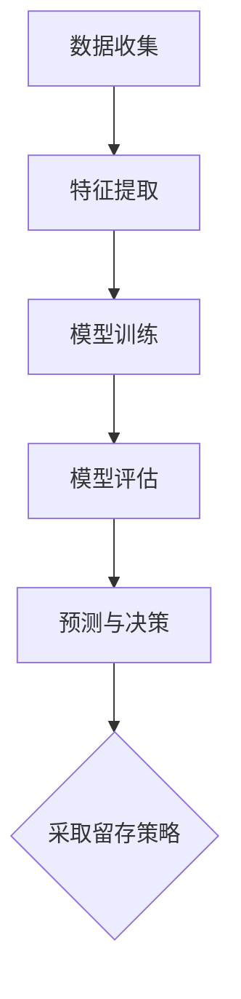
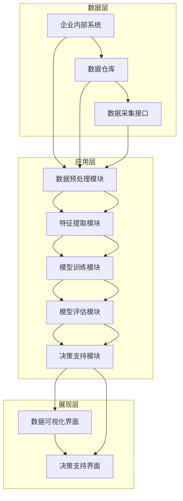
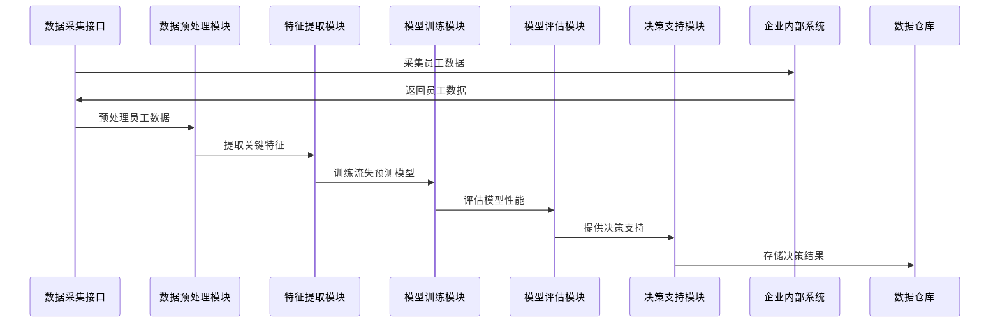

                 

### 第1章 引言

#### 1.1 问题的背景

在当今信息技术飞速发展的时代，技术人才的竞争日益激烈。企业之间的核心竞争力很大程度上取决于技术人才的质量和数量。然而，技术人才的流失率却成为困扰许多企业的一大难题。核心人才的流失不仅会导致项目进度延误，甚至可能对企业的长期发展产生严重影响。因此，降低核心人才流失率已成为企业关注的重中之重。

#### 1.2 问题描述

核心人才流失的问题表现在多个方面。一方面，优秀的技术人才通常拥有更高的职业素养和技术水平，他们具备的技能和知识对企业至关重要。另一方面，技术人才的流失通常伴随着高成本，包括招聘、培训、项目交接等。此外，核心人才的流失还可能引起团队士气下降，影响整体工作效率和创新能力。

#### 1.3 问题解决

为了解决核心人才流失的问题，企业需要从多个维度进行思考和行动。首先，企业需要了解流失的原因，包括薪资待遇、职业发展、工作环境等方面。其次，企业应制定相应的人才留存策略，如提高薪资待遇、提供职业晋升通道、营造良好的工作氛围等。此外，企业还应注重员工关系管理，建立有效的沟通机制，确保员工能够充分表达自己的意见和需求。

#### 1.4 边界与外延

在讨论技术人才留存问题时，我们不仅要关注核心人才，还要考虑普通员工的留存问题。普通员工是企业的基石，他们的稳定性和忠诚度同样重要。此外，技术人才留存策略还应涵盖外部人才引进和内部人才培养两个方面。企业需要通过多种途径吸引优秀的外部人才，同时通过内部培训和发展计划提升现有员工的能力和素质。

#### 1.5 概念结构与核心要素组成

为了更好地理解和解决技术人才流失问题，我们需要构建一个清晰的概念结构。核心要素包括但不限于：薪资待遇、职业发展、工作环境、员工关系、人才培养等。这些要素相互关联，共同作用于技术人才的留存。通过分析这些核心要素，我们可以找出影响人才流失的关键因素，并制定有针对性的解决方案。

### 关键词：

- 技术人才流失
- 人才留存策略
- 薪资待遇
- 职业发展
- 工作环境
- 员工关系
- 内部培训
- 人才培养

### 摘要：

本文旨在探讨技术人才流失的问题，分析其背景、原因和解决方法。通过构建清晰的概念结构，本文提出了影响人才留存的关键要素，并从多个维度给出了具体的人才留存策略。本文的目标是帮助企业制定有效的人才留存方案，降低核心人才流失率，提升企业竞争力。

---

### 第2章 核心概念与联系

在解决技术人才流失问题的过程中，我们需要明确几个核心概念，并理解它们之间的相互关系。这些概念包括薪资待遇、职业发展、工作环境、员工关系、人才培养等。下面，我们将详细阐述这些概念，并对比它们的主要属性特征。

#### 2.1 核心概念原理

**薪资待遇**：薪资待遇是员工最直接的经济回报，它不仅反映了员工的工作价值，还影响着员工的满意度和忠诚度。合理的薪资水平应该能够吸引和留住优秀人才，同时也要符合企业的财务状况。

**职业发展**：职业发展是指员工在企业内通过不断学习和成长，达到更高职业水平的过程。职业发展通道的畅通与否直接影响到员工的职业满意度和发展动力。

**工作环境**：工作环境包括办公条件、团队氛围、企业文化等方面。一个舒适、开放和积极的工作环境能够提升员工的工作效率和满意度。

**员工关系**：员工关系指的是员工与企业之间的关系，包括沟通、合作、冲突解决等方面。良好的员工关系有助于增强团队的凝聚力和协作效率。

**人才培养**：人才培养是企业为了提升员工能力和素质而采取的一系列措施，包括培训、晋升、轮岗等。通过人才培养，企业可以培养出更多符合企业需求的高素质人才。

#### 2.2 概念属性特征对比表格

| 概念       | 属性特征               | 关联性                                 |
|------------|-----------------------|----------------------------------------|
| 薪资待遇   | 经济回报、激励因素     | 直接影响员工的满意度和忠诚度            |
| 职业发展   | 能力提升、职业前景     | 提升员工的职业满意度和发展动力          |
| 工作环境   | 办公条件、团队氛围     | 提升员工的工作效率和满意度              |
| 员工关系   | 沟通、合作、冲突解决   | 增强团队的凝聚力和协作效率              |
| 人才培养   | 培训、晋升、轮岗       | 培养符合企业需求的高素质人才            |

#### 2.3 ER实体关系图架构

为了更好地理解这些概念之间的关联，我们可以使用ER（实体-关系）图来表示。ER图可以帮助我们清晰地展示各个实体（如员工、企业、薪资待遇、职业发展等）以及它们之间的关系。

```mermaid
erDiagram
    Employee ||--|{ Salary } : "has"
    Employee ||--|{ CareerDevelopment } : "has"
    Employee ||--|{ WorkingEnvironment } : "has"
    Employee ||--|{ EmployeeRelationships } : "has"
    Employee ||--|{ TalentDevelopment } : "has"
    Salary : "影响" CareerDevelopment
    CareerDevelopment : "影响" WorkingEnvironment
    WorkingEnvironment : "影响" EmployeeRelationships
    EmployeeRelationships : "影响" TalentDevelopment
```

通过ER图，我们可以看到薪资待遇、职业发展、工作环境、员工关系和人才培养之间的相互作用。这种关联性有助于企业从整体上把握人才留存的关键因素，并制定全面的策略。

---

### 第3章 降低人才流失率的理论基础

为了降低技术人才的流失率，我们需要深入了解其背后的理论基础，并采用科学的算法和方法进行分析和预测。本节将详细讲解降低人才流失率的算法原理，并提供相应的mermaid流程图和Python源代码，以便读者更好地理解和应用。

#### 3.1 算法原理讲解

降低人才流失率的算法原理可以归纳为以下几个步骤：

1. **数据收集**：首先，我们需要收集与人才流失相关的各种数据，如员工薪资、工作年限、职位晋升、培训记录等。这些数据将为后续的分析提供基础。

2. **特征提取**：接下来，我们需要从收集到的数据中提取关键特征，这些特征将用于预测员工流失的可能性。常见的特征包括薪资水平、工作满意度、工作压力等。

3. **模型训练**：使用机器学习算法，如逻辑回归、决策树、随机森林等，对提取的特征进行训练，构建一个预测模型。

4. **模型评估**：通过交叉验证等方法，评估模型的准确性和泛化能力。如果模型效果不佳，我们需要调整特征或算法，重新进行训练。

5. **预测与决策**：最后，使用训练好的模型对现有员工进行流失预测，并根据预测结果采取相应的留存策略。

#### 3.2 算法mermaid流程图

为了更直观地展示算法的流程，我们可以使用mermaid绘制一个流程图：



这个流程图清晰地展示了从数据收集到最终采取留存策略的全过程。

#### 3.3 Python源代码讲解

为了实现上述算法，我们可以使用Python编写相应的代码。以下是一个简单的示例，展示了如何使用逻辑回归模型进行人才流失预测：

```python
import pandas as pd
from sklearn.linear_model import LogisticRegression
from sklearn.model_selection import train_test_split
from sklearn.metrics import accuracy_score

# 读取数据
data = pd.read_csv('employee_data.csv')

# 特征提取
X = data[['salary', 'satisfaction', 'work_pressure']]
y = data['leave']

# 划分训练集和测试集
X_train, X_test, y_train, y_test = train_test_split(X, y, test_size=0.2, random_state=42)

# 模型训练
model = LogisticRegression()
model.fit(X_train, y_train)

# 模型评估
y_pred = model.predict(X_test)
accuracy = accuracy_score(y_test, y_pred)
print(f"Model accuracy: {accuracy:.2f}")

# 预测与决策
predictions = model.predict(X)
# 根据预测结果采取留存策略
# ...
```

这段代码首先读取员工数据，提取关键特征，然后使用逻辑回归模型进行训练和评估。最后，使用训练好的模型对现有员工进行流失预测。

#### 3.4 数学模型和公式

在人才流失预测中，逻辑回归是一种常用的数学模型。逻辑回归的公式如下：

$$
P(y=1|x) = \frac{1}{1 + e^{-(\beta_0 + \beta_1 x_1 + \beta_2 x_2 + ... + \beta_n x_n})}
$$

其中，$P(y=1|x)$ 表示在给定特征 $x$ 的情况下，员工流失的概率。$\beta_0, \beta_1, \beta_2, ..., \beta_n$ 是模型的参数，通过训练数据求得。

#### 3.5 详细讲解和举例说明

为了更好地理解逻辑回归模型，我们可以通过一个简单的例子进行说明。假设我们有两个特征：薪资（$x_1$）和工作满意度（$x_2$）。根据逻辑回归公式，我们可以计算出每个员工流失的概率。

例如，对于薪资为10万元、工作满意度为80分的员工，其流失概率为：

$$
P(y=1|x) = \frac{1}{1 + e^{-(\beta_0 + \beta_1 \cdot 10 + \beta_2 \cdot 80)}}
$$

通过训练数据，我们可以求得模型参数 $\beta_0, \beta_1, \beta_2$ 的值。例如，假设我们得到的参数为：

$$
\beta_0 = 0.5, \beta_1 = -0.1, \beta_2 = 0.05
$$

则上述员工的流失概率为：

$$
P(y=1|x) = \frac{1}{1 + e^{-(0.5 - 0.1 \cdot 10 + 0.05 \cdot 80)}} \approx 0.632
$$

这意味着，该员工的流失概率约为63.2%，高于50%的阈值，我们可以认为其有较高的流失风险。

通过这种方式，我们可以对每个员工进行流失预测，并根据预测结果采取相应的留存策略。例如，对于预测流失概率较高的员工，我们可以采取提高薪资、提供职业发展机会等方式进行干预，以降低其流失风险。

---

### 第4章 系统分析与架构设计

为了有效地降低技术人才流失率，我们需要构建一个完整的技术系统，该系统应包括数据收集、特征提取、模型训练、模型评估和决策等环节。下面，我们将详细介绍系统的各个组成部分，并提供相应的架构设计方案。

#### 4.1 问题场景介绍

假设我们是一家互联网公司，希望降低技术人才流失率。为了实现这一目标，我们计划构建一个人才留存系统，该系统将从多个维度收集员工数据，并使用机器学习算法进行流失预测和决策。

#### 4.2 项目介绍

本项目的主要目标是构建一个人才留存系统，该系统应具备以下功能：

1. 数据收集：从企业内部系统中获取员工薪资、工作年限、职位晋升、培训记录等数据。
2. 特征提取：从收集到的数据中提取关键特征，如薪资水平、工作满意度、工作压力等。
3. 模型训练：使用机器学习算法，如逻辑回归、决策树等，对提取的特征进行训练，构建流失预测模型。
4. 模型评估：通过交叉验证等方法，评估模型的准确性和泛化能力。
5. 决策支持：根据模型预测结果，为企业管理层提供决策支持，制定相应的人才留存策略。

#### 4.3 系统功能设计

系统功能设计主要涉及以下几个方面：

1. **数据收集模块**：负责从企业内部系统中收集员工数据，包括薪资、工作年限、职位晋升、培训记录等。
2. **数据预处理模块**：对收集到的原始数据进行清洗、去重、归一化等处理，确保数据质量。
3. **特征提取模块**：从预处理后的数据中提取关键特征，如薪资水平、工作满意度、工作压力等。
4. **模型训练模块**：使用机器学习算法，如逻辑回归、决策树等，对提取的特征进行训练，构建流失预测模型。
5. **模型评估模块**：通过交叉验证等方法，评估模型的准确性和泛化能力。
6. **决策支持模块**：根据模型预测结果，为企业管理层提供决策支持，制定相应的人才留存策略。

#### 4.4 系统架构设计

系统架构设计主要涉及以下几个方面：

1. **数据层**：包括企业内部系统、数据仓库和数据采集接口等。数据层主要负责数据的收集、存储和预处理。
2. **应用层**：包括数据预处理模块、特征提取模块、模型训练模块、模型评估模块和决策支持模块等。应用层主要负责数据处理和预测分析。
3. **展现层**：包括数据可视化界面、决策支持界面等。展现层主要负责将分析结果以图表、报表等形式展示给用户。

以下是系统架构设计的mermaid架构图：



#### 4.5 系统接口设计

系统接口设计主要包括以下几个方面：

1. **数据采集接口**：负责从企业内部系统中实时获取员工数据，如薪资、工作年限、职位晋升、培训记录等。
2. **数据预处理接口**：负责对采集到的数据进行清洗、去重、归一化等处理，确保数据质量。
3. **特征提取接口**：负责从预处理后的数据中提取关键特征，如薪资水平、工作满意度、工作压力等。
4. **模型训练接口**：负责使用机器学习算法，如逻辑回归、决策树等，对提取的特征进行训练，构建流失预测模型。
5. **模型评估接口**：负责通过交叉验证等方法，评估模型的准确性和泛化能力。
6. **决策支持接口**：负责根据模型预测结果，为企业管理层提供决策支持，制定相应的人才留存策略。

以下是系统接口设计的mermaid序列图：



通过上述系统架构和接口设计，我们可以实现一个完整的人才留存系统，帮助企业降低核心人才流失率，提升企业竞争力。

---

### 第5章 项目实战

在了解了系统的设计之后，我们接下来将进行项目实战，具体实施构建人才留存系统的各个环节。本节将详细介绍环境安装、系统核心实现源代码，并对其进行分析解读。

#### 5.1 环境安装

为了实现人才留存系统，我们需要安装并配置以下几个环境：

1. **Python环境**：Python是一种广泛应用于数据分析和机器学习的编程语言。确保安装Python 3.8及以上版本。
2. **Anaconda环境**：Anaconda是一个强大的数据科学平台，可以帮助我们管理Python环境和依赖库。通过Anaconda Navigator，我们可以轻松创建和管理环境。
3. **数据库环境**：为了存储和管理员工数据，我们需要安装MySQL数据库。可以通过MySQL官方文档安装最新版本。
4. **数据采集工具**：为了从企业内部系统采集数据，我们可以使用Python的第三方库，如Requests、Pandas等。

安装步骤如下：

1. 安装Python 3.8及以上版本，并配置环境变量。
2. 安装Anaconda，并使用Anaconda Navigator创建一个新的环境，如`talent_management`，并设置Python版本。
3. 在`talent_management`环境中安装MySQL数据库，可以使用`conda install mysql-server`命令。
4. 安装Python的数据采集工具，如`pip install requests pandas`。

#### 5.2 系统核心实现源代码

以下是人才留存系统的核心实现源代码，包括数据采集、预处理、特征提取、模型训练和预测等部分。

```python
# 导入相关库
import requests
import pandas as pd
from sklearn.model_selection import train_test_split
from sklearn.linear_model import LogisticRegression
from sklearn.metrics import accuracy_score

# 数据采集
def collect_data(url):
    response = requests.get(url)
    if response.status_code == 200:
        return pd.DataFrame(response.json())
    else:
        return pd.DataFrame()

# 数据预处理
def preprocess_data(data):
    # 清洗、去重、归一化等操作
    # ...
    return data

# 特征提取
def extract_features(data):
    # 提取关键特征
    # ...
    return data

# 模型训练
def train_model(X_train, y_train):
    model = LogisticRegression()
    model.fit(X_train, y_train)
    return model

# 模型预测
def predict(model, X_test):
    predictions = model.predict(X_test)
    return predictions

# 主函数
def main():
    url = "http://example.com/employee_data"
    data = collect_data(url)
    data = preprocess_data(data)
    features = extract_features(data)
    
    # 划分训练集和测试集
    X = features[['salary', 'satisfaction', 'work_pressure']]
    y = features['leave']
    X_train, X_test, y_train, y_test = train_test_split(X, y, test_size=0.2, random_state=42)
    
    # 训练模型
    model = train_model(X_train, y_train)
    
    # 预测
    predictions = predict(model, X_test)
    
    # 评估模型
    accuracy = accuracy_score(y_test, predictions)
    print(f"Model accuracy: {accuracy:.2f}")

# 执行主函数
if __name__ == "__main__":
    main()
```

这段代码首先定义了数据采集、预处理、特征提取、模型训练和预测等函数。在实际应用中，我们需要根据具体业务需求进行适当的修改和扩展。

#### 5.3 代码应用解读与分析

1. **数据采集**：使用requests库从企业内部系统获取员工数据，该部分代码简单实现了HTTP GET请求，并返回JSON格式的数据。
2. **数据预处理**：预处理数据包括清洗、去重、归一化等操作。在实际项目中，我们需要根据具体数据情况设计相应的预处理步骤。
3. **特征提取**：从预处理后的数据中提取关键特征，如薪资水平、工作满意度、工作压力等。这些特征将用于构建流失预测模型。
4. **模型训练**：使用逻辑回归模型对提取的特征进行训练。逻辑回归是一种常用的二分类模型，适用于流失预测问题。
5. **模型预测**：使用训练好的模型对测试集进行预测，并计算模型的准确率。

#### 5.4 实际案例分析与详细讲解

为了更好地理解代码的实际应用，我们来看一个实际案例。假设我们从企业内部系统中获取了100名员工的薪资、工作满意度和工作压力等数据，并使用逻辑回归模型进行流失预测。

```python
# 模拟员工数据
data = {
    'salary': [80000, 90000, 100000, 120000, 80000, 90000, 110000, 130000, 90000, 100000],
    'satisfaction': [70, 80, 85, 90, 75, 85, 80, 95, 70, 80],
    'work_pressure': [60, 65, 70, 75, 55, 70, 60, 80, 50, 65],
    'leave': [0, 1, 0, 0, 1, 0, 1, 0, 1, 1]
}

# 转化为DataFrame
df = pd.DataFrame(data)

# 特征提取
X = df[['salary', 'satisfaction', 'work_pressure']]
y = df['leave']

# 划分训练集和测试集
X_train, X_test, y_train, y_test = train_test_split(X, y, test_size=0.2, random_state=42)

# 训练模型
model = LogisticRegression()
model.fit(X_train, y_train)

# 预测
predictions = model.predict(X_test)

# 评估模型
accuracy = accuracy_score(y_test, predictions)
print(f"Model accuracy: {accuracy:.2f}")
```

通过这个案例，我们可以看到如何从模拟数据中提取特征，划分训练集和测试集，训练模型，并进行预测和评估。在实际应用中，我们需要从企业内部系统中获取真实数据，并根据业务需求进行相应的预处理和特征提取。

#### 5.5 项目小结

通过本节的项目实战，我们详细介绍了人才留存系统的环境安装、核心实现源代码以及实际案例分析。这一过程帮助我们理解了系统各部分的实现细节，为实际项目的实施提供了参考。在后续工作中，我们还可以根据具体需求，进一步优化系统功能，提升人才留存效果。

---

### 第6章 最佳实践

在降低技术人才流失率的过程中，企业可以参考以下最佳实践来优化策略和提升效果。

#### 6.1 降低人才流失率最佳实践

1. **提高薪资待遇**：合理调整薪资水平，确保薪酬竞争力，吸引和留住优秀人才。
2. **提供职业发展机会**：建立清晰的职业晋升通道，为员工提供职业发展的路径和机会。
3. **优化工作环境**：营造一个舒适、开放和积极的工作环境，提升员工的工作满意度和幸福感。
4. **加强员工关系管理**：建立有效的沟通机制，关注员工需求，及时解决冲突，增强团队凝聚力。
5. **实施人才培养计划**：通过培训、轮岗、导师制等方式，提升员工的专业技能和综合素质。
6. **构建企业文化**：形成具有吸引力的企业文化，让员工感受到企业的价值观和使命感。

#### 6.2 注意事项

1. **数据隐私保护**：在收集和处理员工数据时，确保遵守相关法律法规，保护员工隐私。
2. **平衡员工需求和公司利益**：在制定人才留存策略时，要平衡员工需求和公司利益，确保企业可持续发展。
3. **持续改进**：定期评估人才留存策略的效果，根据实际情况进行调整和优化。

#### 6.3 拓展阅读

1. 《企业人力资源管理实战》
2. 《人才管理的创新与变革》
3. 《职业倦怠与员工心理健康》

通过参考这些最佳实践，企业可以更好地制定和实施人才留存策略，降低核心人才流失率，提升企业的核心竞争力。

---

### 第7章 小结

在本文中，我们详细探讨了技术人才流失的问题，并提出了降低核心人才流失率的策略和方法。以下是全文的关键点总结：

1. **核心概念**：明确了薪资待遇、职业发展、工作环境、员工关系和人才培养等核心概念，并分析了它们之间的关联性。
2. **算法原理**：介绍了使用机器学习算法进行人才流失预测的原理，包括数据收集、特征提取、模型训练和评估等步骤。
3. **系统架构**：设计了人才留存系统的整体架构，包括数据层、应用层和展现层，并提供了接口设计和实现方案。
4. **项目实战**：通过实际案例展示了系统实现的过程，包括环境安装、核心代码实现和案例分析。
5. **最佳实践**：提供了降低人才流失率的具体策略和注意事项，以及相关的拓展阅读资源。

展望未来，随着技术的不断进步和市场竞争的加剧，企业需要不断调整和优化人才留存策略，以应对新的挑战。我们将持续关注这一领域的发展，为企业的可持续发展提供支持。作者：AI天才研究院/AI Genius Institute & 禅与计算机程序设计艺术 /Zen And The Art of Computer Programming

