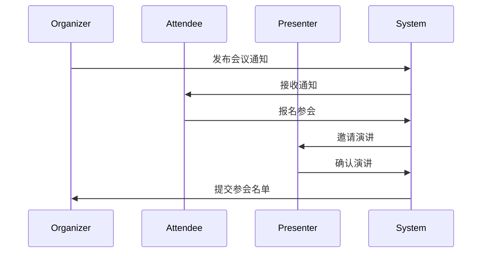
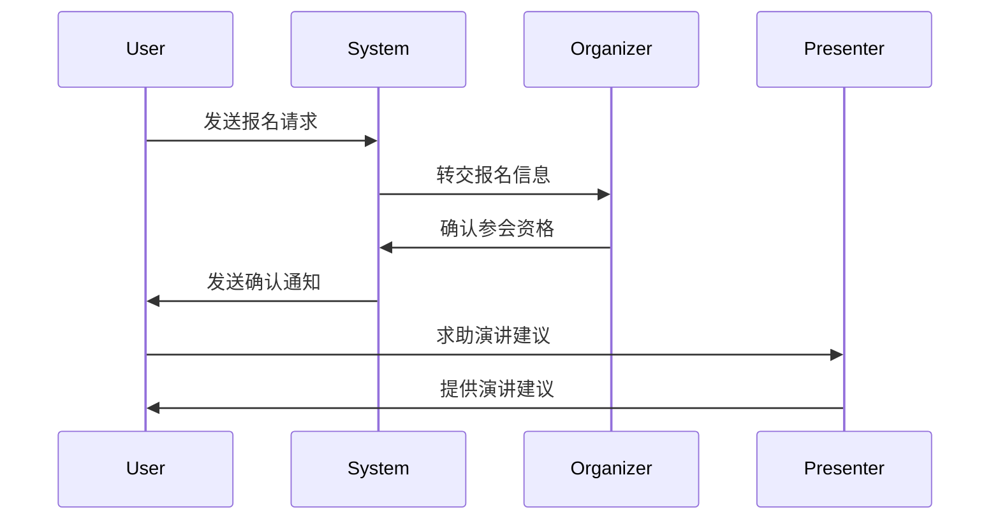
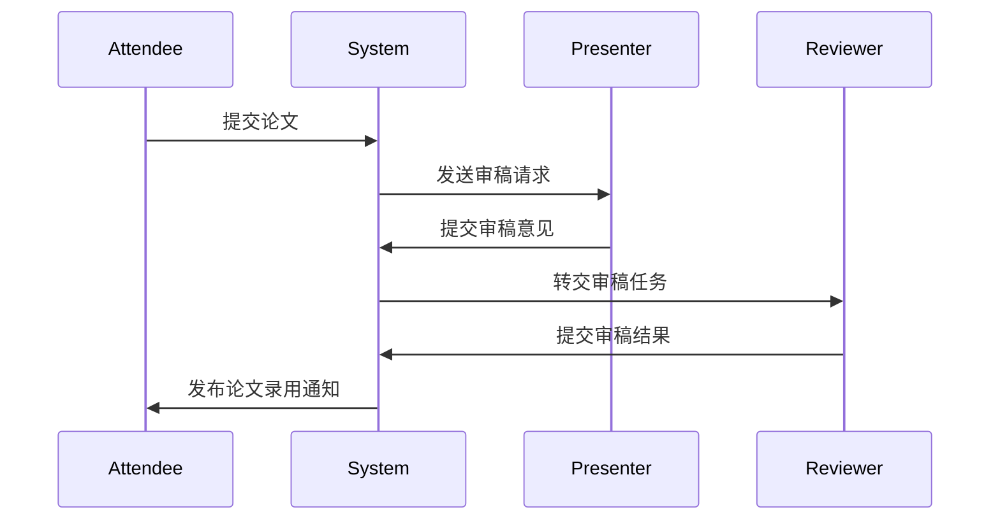
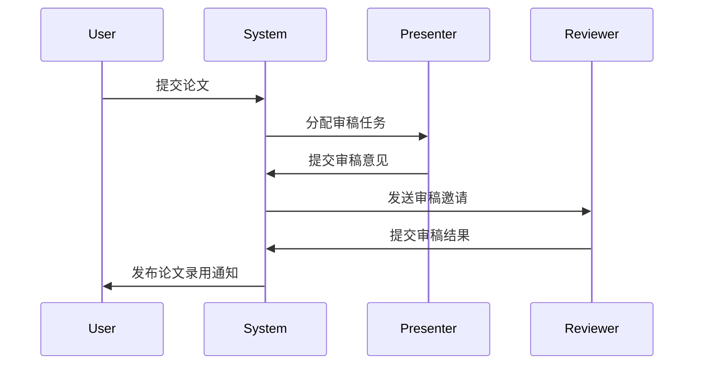

                 

## 摘要

本文旨在深入探讨技术会议组织的策略与实践，帮助策划者打造高影响力的技术活动。通过系统分析技术会议的概述与策划原则，内容设计与组织，技术支持与现场管理，以及影响力评估与优化，本文将提供一系列实用的指导和方法。最后，结合成功案例和实战技巧，本文将总结出最佳实践，为技术会议策划者提供全方位的参考。无论您是技术会议的新手还是经验丰富的策划者，本文都将帮助您提升会议的质量与影响力。

## 关键词

- 技术会议
- 策划原则
- 内容设计
- 技术支持
- 影响力评估
- 实战技巧

----------------------------------------------------------------

### 技术会议概述与策划原则

#### 技术会议的定义与重要性

技术会议是一种通过集体讨论、交流和展示来推动技术发展和知识传播的场合。它可以是行业性的，也可以是项目特定的，通常涵盖最新的研究进展、行业趋势、解决方案和实践经验。技术会议的重要性体现在以下几个方面：

1. **知识传播**：技术会议为专业人士提供了一个交流平台，使得最新的研究成果和技术趋势得以迅速传播。
2. **经验分享**：通过会议，参与者可以分享实际操作中的成功经验和挑战，促进相互学习和成长。
3. **合作机会**：技术会议为研究人员、开发者、企业和其他利益相关者提供了一个建立联系、寻求合作的机会。
4. **行业影响**：高影响力的技术会议能够在行业中产生深远的影响，推动技术标准的制定和行业的发展。

#### 技术会议的分类与目标

技术会议可以根据不同的标准进行分类，例如：

1. **国际会议**：如国际计算机科学大会（IEEE International Conference on Computer Science），具有广泛的国际影响力。
2. **国内会议**：如中国计算机学会（CCF）组织的各类技术研讨会，主要服务于国内技术社区。
3. **专题会议**：围绕特定技术主题，如人工智能、大数据等领域的专题研讨会，深入探讨相关技术的最新进展。

每种类型的会议都有其独特的目标：

- **国际会议**：提升国际知名度、吸引顶尖人才、促进国际合作。
- **国内会议**：推动国内技术发展、培养本土技术人才、加强行业内部交流。
- **专题会议**：集中讨论特定技术领域的热点问题、促进技术研究和应用。

#### 技术会议的目标与受众

技术会议的目标和受众通常与其类型和规模密切相关：

- **国际会议**：目标通常是吸引全球顶尖的研究人员、企业代表和投资者，受众包括全球技术社区。
- **国内会议**：目标是为国内的技术社区提供一个交流平台，受众主要是国内的技术专业人士。
- **专题会议**：目标通常是解决特定领域的技术挑战，受众是该领域的专家和研究者。

明确会议的目标和受众有助于策划者更好地制定会议内容和组织形式，确保会议的高效性和影响力。

### 策划原则与方法

技术会议的成功离不开科学的策划原则和有效的组织方法。以下是一些关键的策划原则和方法：

1. **明确目标**：在策划初期，明确会议的目标和预期成果，确保会议内容和形式与目标一致。
2. **选择合适的地点**：根据会议的规模和目标受众选择合适的地点，确保交通便利、设施完善。
3. **时间安排**：选择一个不会与重要节假日或其他大型会议冲突的时间，确保参会者能够顺利参加。
4. **预算规划**：根据会议规模和内容制定详细的预算计划，合理分配资金，确保会议的顺利进行。
5. **邀请嘉宾**：根据会议主题和目标邀请相关领域的知名专家和行业领袖，提升会议的质量和影响力。
6. **内容设计**：精心策划会议议程，包括主题演讲、研讨会、工作坊、展览等形式，确保内容丰富且具有吸引力。
7. **推广宣传**：通过多种渠道宣传会议，包括社交媒体、专业网站、邮件列表等，扩大会议的影响力。
8. **现场管理**：确保会议现场的秩序和服务质量，包括场地布置、餐饮安排、技术支持等。

通过遵循这些策划原则和方法，技术会议策划者可以更好地实现会议的目标，提升会议的影响力和参与度。

---

**核心概念与联系表格**

| 核心概念       | 定义                                                     | 属性特征对比               |
| -------------- | -------------------------------------------------------- | -------------------------- |
| 技术会议       | 通过集体讨论、交流和展示来推动技术发展和知识传播的场合       | * 规模：国际/国内/专题     * 目标：知识传播/经验分享/合作机会/行业影响   |
| 策划原则       | 指导会议策划的核心理念和方法                             | * 明确目标 * 选择合适地点 * 时间安排 * 预算规划 * 邀请嘉宾 * 内容设计 * 推广宣传 * 现场管理 |
| 目标与受众     | 会议的目标和服务的群体                                   | * 国际会议：全球顶尖人才、企业代表、投资者 * 国内会议：国内技术专业人士 * 专题会议：领域专家、研究者 |

**ER实体关系图架构**

```mermaid
erDiagram
  会议 |--<| 策划者 : 策划会议
  会议 |--<| 受众 : 服务于
  策划者 ||--|{ 会议内容设计 : 设计会议议程、内容丰富且具有吸引力
           ||--|{ 预算规划 : 合理分配资金、确保会议顺利进行
           ||--|{ 推广宣传 : 扩大会议影响力、多种渠道宣传
           ||--|{ 现场管理 : 确保会议现场秩序、服务质量 } }
```

---

### 策划流程与方法

策划技术会议是一个复杂且系统的过程，需要细致的规划和有效的执行。以下是一套完整的策划流程和方法，帮助您成功地组织一场高影响力的技术活动。

#### 1. 确定会议目标和主题

策划的第一步是明确会议的目标。目标是会议的核心，决定了会议的内容、形式和规模。例如，目标是提升行业知名度、促进技术创新、建立合作伙伴关系等。在确定目标后，需要根据目标选择合适的主题。主题应具有明确的技术方向和吸引力，能够吸引到目标受众的参与。

#### 2. 组建策划团队

一个成功的会议离不开一个高效、协作的策划团队。策划团队应包括以下角色：

- **项目负责人**：全面负责会议的策划和执行，协调各部门的工作。
- **内容策划**：负责会议议程的设计、议题的挑选和演讲嘉宾的邀请。
- **市场营销**：负责会议的宣传推广，包括线上线下渠道的推广策略。
- **技术支持**：负责会议的技术设备、网络配置和现场技术支持。
- **现场管理**：负责会议现场的布置、服务和管理。

#### 3. 制定详细的时间表

时间表是会议策划中的重要工具，它帮助团队明确各项工作的时间节点和责任分工。一个完整的时间表应包括以下内容：

- **筹备阶段**：确定会议目标、主题、地点、时间、预算等。
- **邀请阶段**：发出邀请函、确认嘉宾参会。
- **内容准备阶段**：确定会议议程、准备演讲稿、制作宣传材料。
- **推广阶段**：制定推广计划、发布会议通知、吸引参会者报名。
- **执行阶段**：布置会场、准备设备、安排餐饮、接待嘉宾和参会者。
- **总结阶段**：收集反馈、总结经验、发布会议纪要。

#### 4. 预算规划和资源分配

会议的预算是确保会议顺利进行的关键。策划团队需要制定详细的预算计划，包括场地租赁、设备购买、嘉宾邀请、宣传推广、餐饮住宿等方面的费用。在制定预算时，要充分考虑各种可能的费用，并留出一定的缓冲空间以应对突发情况。

资源分配是预算规划的一部分，策划团队需要根据预算合理分配各项资源，确保每一项工作都有足够的支持。

#### 5. 邀请嘉宾和演讲者

嘉宾和演讲者是会议的重要组成部分，他们的参与将直接影响会议的质量和影响力。邀请嘉宾和演讲者应遵循以下原则：

- **相关性**：邀请的嘉宾和演讲者应与会议的主题密切相关，确保内容的专业性和权威性。
- **知名度**：邀请在行业内有较高知名度的人士，能够吸引更多的参会者。
- **多样性**：邀请不同领域的专家，确保会议内容的丰富性和全面性。
- **沟通确认**：在邀请嘉宾和演讲者后，应及时与他们沟通会议的日程、地点、住宿等信息，确保他们能够按时参加。

#### 6. 设计会议议程和活动

会议议程是会议的核心内容，它决定了会议的流程和结构。设计会议议程时，应遵循以下原则：

- **逻辑性**：议程应按照时间顺序合理安排各项活动，确保流程连贯。
- **多样性**：议程中应包括主题演讲、研讨会、工作坊、互动环节等多种形式，增强参会者的参与感。
- **紧凑性**：确保会议时间充足，避免过长的空闲时间，同时也要避免过多的重复内容。

#### 7. 推广会议

推广是确保会议成功的关键环节。策划团队需要制定全面的推广计划，包括以下内容：

- **宣传材料**：设计制作宣传海报、宣传册、邀请函等材料，确保内容清晰、具有吸引力。
- **社交媒体**：利用社交媒体平台，如LinkedIn、Twitter、Facebook等，发布会议信息，吸引目标受众的关注。
- **专业网站**：在专业网站和论坛发布会议通知，吸引行业内的专业人士。
- **邮件营销**：通过邮件列表向潜在参会者发送会议邀请，提高参会率。

#### 8. 现场管理

现场管理是确保会议顺利进行的重要环节。策划团队需要做好以下工作：

- **场地布置**：根据会议议程和活动需求，合理布置会场，确保音响、灯光、网络等设备的正常运行。
- **餐饮安排**：根据会议日程和参会者的需求，安排合适的餐饮服务。
- **技术支持**：确保现场技术设备的正常运行，为演讲者提供技术支持。
- **接待服务**：为参会者提供周到的接待服务，包括签到、咨询、指引等。

通过以上策划流程和方法，技术会议策划者可以系统地组织会议的每一个环节，确保会议的高效性和影响力。

---

**核心概念与联系表格**

| 核心概念       | 定义                                                     | 属性特征对比               |
| -------------- | -------------------------------------------------------- | -------------------------- |
| 策划流程       | 指导会议策划的具体步骤和方法                             | * 确定目标 * 组建团队 * 制定时间表 * 预算规划 * 邀请嘉宾 * 设计议程 * 推广会议 * 现场管理 |
| 会议目标       | 确定会议的预期成果和方向                               | * 知识传播 * 经验分享 * 合作机会 * 行业影响   |
| 嘉宾邀请       | 邀请与会议主题相关的专家和行业领袖                       | * 相关性 * 知名度 * 多样性 * 沟通确认 |
| 会议议程设计   | 制定会议的流程和结构                                   | * 逻辑性 * 多样性 * 紧凑性 |

**ER实体关系图架构**

```mermaid
erDiagram
  策划流程 ||--|{ 确定目标 : 制定方向、成果预期
               ||--|{ 组建团队 : 分配角色、协同工作
               ||--|{ 制定时间表 : 明确时间节点、责任分工
               ||--|{ 预算规划 : 合理分配资源、应对突发情况
               ||--|{ 邀请嘉宾 : 提升会议质量、增加影响力
               ||--|{ 设计议程 : 确保流程连贯、内容丰富
               ||--|{ 推广会议 : 扩大影响力、吸引参会者
               ||--|{ 现场管理 : 确保顺利进行、提供优质服务 } }
```

---

### 内容设计与组织

技术会议的内容设计是会议成功的关键之一。一个精心策划的议程可以极大地提升会议的吸引力和参与度。以下是内容设计与组织的关键步骤：

#### 1. 议题的挑选与准备

议题的选择是内容设计的核心。挑选议题时，应考虑以下因素：

- **相关性**：议题应与会议的主题密切相关，能够引起参会者的兴趣。
- **新颖性**：选择具有创新性和前瞻性的议题，能够吸引关注和讨论。
- **实用性**：议题应具有一定的实用性，能够帮助参会者解决实际问题。
- **多样性**：确保议题涵盖不同领域和不同层次的内容，满足不同参会者的需求。

在准备议题时，需要进行以下工作：

- **研究现有文献**：了解当前领域的热点问题、研究趋势和最新成果。
- **征求专家意见**：与领域内的专家和学者交流，了解他们的研究方向和建议。
- **制定议题大纲**：明确每个议题的核心内容和结构，为后续的准备工作提供指导。

#### 2. 议题的审核与发布

议题的审核是确保会议质量的重要环节。审核过程应包括以下步骤：

- **初步筛选**：根据议题的相关性、新颖性和实用性进行初步筛选。
- **专家评审**：邀请领域内的专家对入选议题进行评审，提供专业意见。
- **反馈与调整**：根据评审意见对议题进行修改和优化，确保其质量和吸引力。

议题发布是向参会者传递会议内容的关键。发布时，应提供以下信息：

- **议题标题**：简洁明了，能够准确传达议题的核心内容。
- **演讲者简介**：包括演讲者的背景、研究领域和主要成就。
- **议题摘要**：简要介绍议题的主要内容、研究背景和预期成果。
- **演讲时间**：明确每个议题的演讲时间和讨论时间。

#### 3. 演讲嘉宾的邀请与安排

演讲嘉宾的选择对会议的质量和影响力至关重要。邀请嘉宾时，应遵循以下原则：

- **知名度**：邀请在行业内具有较高知名度和影响力的专家。
- **专业性**：邀请在特定领域具有深厚研究和实践经验的专家。
- **多样性**：邀请来自不同领域和机构的专家，确保议题的多样性。

嘉宾邀请后，需要进行以下工作：

- **确认出席**：与嘉宾沟通会议的日程、地点和住宿等信息，确保他们能够按时出席。
- **准备演讲材料**：提供演讲者的演讲稿模板和幻灯片模板，确保演讲内容的一致性和美观性。
- **演讲时间分配**：根据会议议程合理安排每位嘉宾的演讲时间，确保会议的紧凑性和流畅性。

#### 4. 会议议程的制定与调整

会议议程的制定是内容设计的关键环节。制定议程时，应遵循以下原则：

- **逻辑性**：议程应按照时间顺序合理安排各项活动，确保流程连贯。
- **多样性**：议程中应包括主题演讲、研讨会、工作坊、互动环节等多种形式，增强参会者的参与感。
- **紧凑性**：确保会议时间充足，避免过长的空闲时间，同时也要避免过多的重复内容。

在制定议程后，应进行以下工作：

- **内部审核**：策划团队对议程进行内部审核，确保内容合理、时间安排合理。
- **公开征求意见**：向参会者征求意见，了解他们对议程的反馈和建议，进行适当的调整。
- **发布议程**：在会议前向参会者发布最终议程，确保他们了解会议的安排和流程。

在会议进行过程中，应根据实际情况进行议程的调整。例如，如果某个议题的讨论时间过长，可以适当缩减其他议题的时间，确保会议的顺利进行。

#### 5. 互动环节的设计与组织

互动环节是增强会议参与度和互动性的重要手段。设计互动环节时，应考虑以下因素：

- **形式多样**：包括问答环节、圆桌讨论、互动演示、观众投票等形式。
- **主题相关**：互动环节应与会议的主题密切相关，能够激发参会者的思考和讨论。
- **鼓励参与**：设计互动环节时，要鼓励参会者积极参与，确保互动的活跃度。

在组织互动环节时，应做好以下工作：

- **准备材料**：提前准备互动所需的道具、设备、PPT等材料。
- **培训主持人**：为互动环节的主持人提供培训，确保他们能够灵活应对现场情况。
- **现场支持**：确保互动环节的顺利进行，提供必要的技术支持和现场管理。

通过精心设计和组织内容，技术会议可以吸引更多的参会者，提升会议的吸引力和影响力。

---

**核心概念与联系表格**

| 核心概念       | 定义                                                     | 属性特征对比               |
| -------------- | -------------------------------------------------------- | -------------------------- |
| 内容设计       | 制定会议的议程和活动                                     | * 议题挑选与准备 * 议题审核与发布 * 演讲嘉宾邀请与安排 * 会议议程制定与调整 * 互动环节设计与组织 |
| 议题挑选       | 确定会议的核心讨论内容                                   | * 相关性 * 新颖性 * 实用性 * 多样性 |
| 演讲嘉宾       | 参与会议的专家和行业领袖                                 | * 知名度 * 专业性 * 多样性 |
| 会议议程       | 会议的流程和结构                                         | * 逻辑性 * 多样性 * 紧凑性 |

**ER实体关系图架构**

```mermaid
erDiagram
  内容设计 ||--|{ 议题挑选 : 确定核心内容
                ||--|{ 演讲嘉宾邀请与安排 : 提升会议质量
                ||--|{ 会议议程制定与调整 : 确保流程连贯、内容丰富
                ||--|{ 互动环节设计与组织 : 增强参与度 } }
```

---

### 技术支持设备与网络配置

技术支持是确保技术会议顺利进行的关键要素，尤其是设备和网络配置。以下是如何为技术会议提供全面的技术支持，并确保其正常运行的方法。

#### 1. 设备选择与准备

首先，选择合适的设备是确保会议顺利进行的基础。以下是常用的设备及其选择标准：

- **音响系统**：高质量的音响系统可以保证演讲者的声音清晰传达。选择时应考虑音质、音量调节、无线麦克风等。
- **投影仪**：选择高分辨率、大亮度、快速启动的投影仪，确保演示内容清晰可见。
- **计算机**：准备几台计算机，以便演讲者使用，并确保其具备足够的性能和连接网络的能力。
- **备用设备**：准备备用设备，如备用投影仪、无线麦克风、笔记本电脑等，以应对设备故障。

#### 2. 网络配置

网络配置是技术会议的核心需求之一，确保网络稳定、快速、安全至关重要。以下是一些关键步骤：

- **网络规划**：在会议前进行网络规划，确定网络架构、带宽需求和安全策略。通常需要设置多个无线接入点，确保不同区域都能覆盖到稳定的网络。
- **网络测试**：在会议前进行网络测试，包括速度测试、稳定性测试和安全性测试。确保网络在高峰时段能够承受大量数据传输，且不会出现中断。
- **网络安全**：设置防火墙、病毒防护和入侵检测系统，确保网络的安全性，防止数据泄露和恶意攻击。

#### 3. 技术支持团队组建与职责

技术支持团队是确保技术设备正常运行和解决突发问题的关键。团队应包括以下角色：

- **技术经理**：负责整个技术支持团队的工作协调和管理。
- **网络工程师**：负责网络配置、测试和故障排除。
- **音响工程师**：负责音响系统的安装、调试和维护。
- **投影仪工程师**：负责投影仪的安装、调试和维护。
- **计算机工程师**：负责计算机和相关设备的安装、调试和维护。
- **现场支持人员**：负责会议现场的技术支持，包括设备操作、故障排除和现场技术指导。

#### 4. 现场测试与演练

在会议前，进行现场测试和演练是确保技术支持顺利进行的重要环节。以下是一些关键步骤：

- **现场测试**：在会议场地进行设备安装和调试，确保所有设备正常运行。
- **模拟演练**：模拟会议流程，测试网络、音响、投影仪和计算机等设备的配合情况。
- **反馈与调整**：根据测试和演练的结果，对设备配置和操作流程进行调整，确保会议当天能够顺利进行。

通过以上步骤，技术支持团队可以确保技术设备的正常运行，为技术会议提供全面的支持，从而提升会议的整体质量和体验。

---

**核心概念与联系表格**

| 核心概念       | 定义                                                     | 属性特征对比               |
| -------------- | -------------------------------------------------------- | -------------------------- |
| 技术支持设备   | 确保会议顺利进行所需的设备                               | * 音响系统 * 投影仪 * 计算机 * 备用设备 |
| 网络配置       | 为会议提供稳定、快速、安全的网络环境                       | * 网络规划 * 网络测试 * 网络安全 |
| 技术支持团队   | 负责会议技术设备的安装、调试、维护和现场支持               | * 技术经理 * 网络工程师 * 音响工程师 * 投影仪工程师 * 计算机工程师 * 现场支持人员 |

**ER实体关系图架构**

```mermaid
erDiagram
  技术支持设备 ||--|{ 音响系统 : 确保声音清晰
                   ||--|{ 投影仪 : 确保演示内容清晰
                   ||--|{ 计算机 : 提供计算能力 } }
  网络配置 ||--|{ 网络规划 : 确定网络架构、带宽需求
                  ||--|{ 网络测试 : 确保网络稳定性
                  ||--|{ 网络安全 : 防止数据泄露、恶意攻击 } }
  技术支持团队 ||--|{ 技术经理 : 负责协调和管理
                    ||--|{ 网络工程师 : 负责网络配置、故障排除
                    ||--|{ 音响工程师 : 负责音响系统安装、调试
                    ||--|{ 投影仪工程师 : 负责投影仪安装、调试
                    ||--|{ 计算机工程师 : 负责计算机维护
                    ||--|{ 现场支持人员 : 负责现场技术支持 } }
```

---

### 会议现场的布置与管理

会议现场布置与管理是确保会议顺利进行的重要环节，良好的现场管理能够提升参会者的体验和会议的整体形象。以下是如何进行会议现场布置与管理的方法：

#### 1. 场地选择

选择合适的场地是会议成功的第一步。以下是场地选择时需要考虑的因素：

- **地理位置**：场地应位于交通便利的地方，方便参会者到达。
- **规模与布局**：根据参会人数和会议形式（如讲座、展览、研讨会等）选择合适的场地，并考虑场地的布局，确保足够的座位和活动空间。
- **设施与服务**：场地应提供良好的基础设施，如空调、照明、音响、网络等，并确保餐饮服务、安保、医疗等配套服务完善。

#### 2. 现场布置

会议现场的布置应充分考虑参会者的体验，以下是具体的布置步骤：

- **签到台**：设置签到台，方便参会者签到和领取会议资料。
- **展览区**：如果会议包含展览环节，应设置展览区，确保展览空间宽敞、布局合理。
- **演讲区**：演讲区应配备高质量的音响和投影设备，确保演讲者的声音和演示内容清晰。
- **休息区**：设置休息区，提供咖啡、茶水等饮料，以及杂志、宣传资料等，方便参会者放松和交流。
- **指示牌与路线图**：在会场内外设置清晰的指示牌和路线图，引导参会者找到正确的地点。

#### 3. 现场管理策略

现场管理是确保会议顺利进行的关键，以下是现场管理的一些策略：

- **签到管理**：使用电子签到系统，提高签到效率，并确保签到信息准确无误。
- **参会者指引**：安排工作人员在会场内外引导参会者，确保他们能够顺利找到座位和活动场地。
- **突发事件处理**：制定应急预案，如遇到设备故障、火灾等突发事件，确保现场人员能够迅速响应和处理。
- **安全与秩序**：确保现场安全，配备安保人员，维护秩序，防止会场出现混乱。

#### 4. 现场问题的应急处理

在会议过程中，可能会出现各种问题，现场管理人员应迅速响应，以下是常见的应急处理方法：

- **设备故障**：立即联系技术支持团队，快速修复设备故障，确保会议继续进行。
- **网络中断**：立即检查网络设备，尝试恢复网络连接，如无法恢复，应及时通知参会者，并安排备用网络。
- **人员冲突**：安排调解人员，及时处理参会者之间的冲突，确保会议的和谐氛围。
- **突发疾病**：立即联系医疗人员，为病患提供紧急救助，并协助其离开会场。

通过上述方法，会议现场布置与管理团队可以确保会议的顺利进行，提升参会者的体验，为会议的成功举办提供有力保障。

---

**核心概念与联系表格**

| 核心概念       | 定义                                                     | 属性特征对比               |
| -------------- | -------------------------------------------------------- | -------------------------- |
| 场地选择       | 选择合适的会议地点                                     | * 地理位置 * 规模与布局 * 设施与服务 |
| 现场布置       | 根据会议需求进行会场布置                               | * 签到台 * 展览区 * 演讲区 * 休息区 * 指示牌与路线图 |
| 现场管理策略   | 确保会议顺利进行的管理策略                             | * 签到管理 * 参会者指引 * 突发事件处理 * 安全与秩序 |
| 应急处理       | 针对现场突发问题的处理方法                             | * 设备故障 * 网络中断 * 人员冲突 * 突发疾病 |

**ER实体关系图架构**

```mermaid
erDiagram
  场地选择 ||--|{ 地理位置 : 方便参会者到达
                 ||--|{ 规模与布局 : 确保足够空间
                 ||--|{ 设施与服务 : 提供基础设施 } }
  现场布置 ||--|{ 签到台 : 方便参会者签到
                 ||--|{ 展览区 : 设立展览空间
                 ||--|{ 演讲区 : 确保演讲清晰
                 ||--|{ 休息区 : 提供放松空间
                 ||--|{ 指示牌与路线图 : 引导参会者 } }
  现场管理策略 ||--|{ 签到管理 : 提高签到效率
                      ||--|{ 参会者指引 : 引导参会者
                      ||--|{ 突发事件处理 : 应对突发事件
                      ||--|{ 安全与秩序 : 维护会场秩序 } }
  应急处理 ||--|{ 设备故障 : 快速修复
                   ||--|{ 网络中断 : 恢复网络连接
                   ||--|{ 人员冲突 : 调解冲突
                   ||--|{ 突发疾病 : 提供紧急救助 } }
```

---

### 会议影响力评估指标与方法

评估会议的影响力是衡量其成功与否的重要标准。有效的评估可以帮助策划者了解会议的效果，优化后续活动。以下是一些关键的评估指标和方法：

#### 1. 评估指标

影响力评估涉及多个维度，以下是常用的评估指标：

- **参会人数**：参会人数是衡量会议受欢迎程度的一个直接指标。
- **参与度**：参与度包括参会者的互动、提问、讨论和社交媒体上的活跃度。
- **反馈意见**：通过问卷调查、访谈等方式收集参会者的反馈，了解他们对会议的满意度和建议。
- **媒体报道**：媒体报道的量和质量是衡量会议影响力的另一个重要指标。
- **参会者满意度**：通过问卷调查评估参会者的满意度，了解他们对会议的整体评价。
- **参会者后续行动**：参会者在会议后的行动，如技术合作、项目启动等，是衡量会议长期影响力的重要指标。

#### 2. 评估方法

以下是几种常用的评估方法：

- **问卷调查**：通过设计详细的问卷，收集参会者的意见和建议，是评估会议效果的重要工具。
- **访谈**：与参会者进行面对面的访谈，深入了解他们的感受和反馈。
- **社交媒体分析**：通过分析会议相关的社交媒体活动，评估会议的影响力和参与度。
- **媒体报道分析**：分析会议相关的新闻报道，评估媒体对会议的关注度和评价。
- **参会者后续行动追踪**：记录并分析参会者在会议后的行为，如合作机会、项目进展等。

#### 3. 评估结果的应用

评估结果的应用对于优化会议至关重要。以下是几个关键步骤：

- **反馈整理**：整理和分析收集到的反馈数据，识别出会议中的优点和不足。
- **问题分析**：针对发现的问题，进行分析和讨论，找出根本原因。
- **优化策略制定**：根据评估结果，制定具体的优化策略，如改进议程设计、提升互动环节、增加宣传力度等。
- **持续改进**：将评估结果和优化策略应用到后续会议策划中，实现持续改进。

通过系统化的影响力评估，技术会议策划者可以不断优化会议，提升其质量和影响力。

---

**核心概念与联系表格**

| 核心概念       | 定义                                                     | 属性特征对比               |
| -------------- | -------------------------------------------------------- | -------------------------- |
| 会议影响力评估 | 评估会议效果的指标与方法                                 | * 参会人数 * 参与度 * 反馈意见 * 媒体报道 * 参会者满意度 * 参会者后续行动 |
| 评估指标       | 衡量会议效果的具体标准                                   | * 量化指标 * 定性分析指标 |
| 评估方法       | 实施评估的具体方式                                     | * 问卷调查 * 访谈 * 社交媒体分析 * 媒体报道分析 * 参会者后续行动追踪 |
| 评估结果应用   | 将评估结果用于会议优化的策略和实践                       | * 反馈整理 * 问题分析 * 优化策略制定 * 持续改进 |

**ER实体关系图架构**

```mermaid
erDiagram
  会议影响力评估 ||--|{ 评估指标 : 衡量效果
                      ||--|{ 评估方法 : 实施评估 } }
  评估指标 ||--|{ 量化指标 : 数值化评价
                   ||--|{ 定性分析指标 : 深度评价 } }
  评估方法 ||--|{ 问卷调查 : 收集意见
                   ||--|{ 访谈 : 深入了解
                   ||--|{ 社交媒体分析 : 跟踪活动
                   ||--|{ 媒体报道分析 : 评估关注
                   ||--|{ 参会者后续行动追踪 : 跟踪后续影响 } }
  评估结果应用 ||--|{ 反馈整理 : 整理评估结果
                      ||--|{ 问题分析 : 分析问题
                      ||--|{ 优化策略制定 : 制定优化方案
                      ||--|{ 持续改进 : 应用优化策略 } }
```

---

### 技术会议的持续优化

为了不断提升技术会议的质量和影响力，持续优化是必不可少的。以下是实现技术会议持续优化的关键步骤和策略。

#### 1. 反馈收集

收集参会者的反馈是优化技术会议的第一步。以下是一些有效的反馈收集方法：

- **问卷调查**：在会议结束后，通过电子邮件或在线问卷向参会者发送反馈问卷，收集他们对会议内容的评价、满意度和建议。
- **访谈**：邀请部分参会者进行面对面访谈，深入了解他们的感受和意见，特别是在会议内容、组织安排、技术支持等方面的体验。
- **社交媒体**：通过社交媒体平台，如LinkedIn、Twitter等，收集参会者对会议的评论和讨论，了解他们的真实感受。

#### 2. 问题分析

在收集到反馈后，需要对这些反馈进行分析，找出会议中的优点和不足。以下是一些问题分析的方法：

- **定量分析**：对问卷调查结果进行统计分析，识别出普遍存在的问题和需求。
- **定性分析**：对访谈记录和社交媒体评论进行文本分析，深入挖掘参会者的具体意见和建议。
- **交叉验证**：结合定量和定性分析的结果，验证问题的重要性和普遍性。

#### 3. 优化策略制定

基于问题分析的结果，制定具体的优化策略。以下是一些常见的优化策略：

- **内容改进**：根据参会者的反馈，调整会议议程，增加或减少某些议题，确保内容的实用性和吸引力。
- **技术支持提升**：针对技术设备故障和网络中断等问题，优化技术支持方案，提高设备的可靠性和网络稳定性。
- **互动环节增强**：通过增加互动环节、改进互动形式，提升参会者的参与度和积极性。
- **宣传推广优化**：根据参会者的建议，优化会议的宣传策略，扩大会议的影响力和受众范围。

#### 4. 持续改进

优化策略一旦制定，就需要在后续会议中进行实施和验证。以下是一些持续改进的方法：

- **迭代优化**：每次会议后，根据评估结果和参会者的反馈，对优化策略进行迭代和改进，不断优化会议的质量和效果。
- **知识共享**：将优化经验和教训记录下来，共享给整个策划团队，确保团队在后续会议中能够持续学习和进步。
- **培训和指导**：为策划团队成员提供培训，提高他们的策划和组织能力，确保会议的顺利进行。

通过持续优化，技术会议策划者可以不断提升会议的质量和影响力，吸引更多的参会者和行业关注。

---

**核心概念与联系表格**

| 核心概念       | 定义                                                     | 属性特征对比               |
| -------------- | -------------------------------------------------------- | -------------------------- |
| 反馈收集       | 收集参会者对会议的评价和建议                             | * 问卷调查 * 访谈 * 社交媒体 |
| 问题分析       | 分析会议中的优点和不足                                   | * 定量分析 * 定性分析 * 交叉验证 |
| 优化策略       | 制定改进会议质量的措施                                   | * 内容改进 * 技术支持提升 * 互动环节增强 * 宣传推广优化 |
| 持续改进       | 实施和迭代优化策略，提升会议质量                         | * 迭代优化 * 知识共享 * 培训和指导 |

**ER实体关系图架构**

```mermaid
erDiagram
  反馈收集 ||--|{ 问卷调查 : 收集参会者评价
                    ||--|{ 访谈 : 深入了解意见
                    ||--|{ 社交媒体 : 收集评论和讨论 } }
  问题分析 ||--|{ 定量分析 : 统计分析反馈结果
                    ||--|{ 定性分析 : 文本分析评论
                    ||--|{ 交叉验证 : 验证问题的重要性和普遍性 } }
  优化策略 ||--|{ 内容改进 : 调整会议议程
                    ||--|{ 技术支持提升 : 优化技术设备
                    ||--|{ 互动环节增强 : 增加互动形式
                    ||--|{ 宣传推广优化 : 扩大会议影响力 } }
  持续改进 ||--|{ 迭代优化 : 根据评估结果改进
                    ||--|{ 知识共享 : 分享优化经验
                    ||--|{ 培训和指导 : 提升团队能力 } }
```

---

### 成功技术会议案例分析

#### 案例一：某某国际技术会议

**背景介绍**：某某国际技术会议是全球计算机科学领域的重要盛会，每年吸引来自世界各地的顶尖研究人员、开发者和企业代表参会。会议涵盖了计算机科学的所有主要领域，包括人工智能、大数据、网络安全等。

**项目介绍**：会议为期三天，内容包括主题演讲、研讨会、工作坊和技术展览。每年，会议都会邀请几位全球知名的计算机科学家作为主题演讲嘉宾，分享他们的最新研究成果和行业见解。

**系统功能设计（领域模型类图）**：

```mermaid
classDiagram
 参会者<-Participant>
 会议<-Conference>
 演讲者<-Presenter>
 主题<-Theme>
 议程<-Schedule>
 研讨会<-Workshop>
 展览<-Exhibition>

  Participant <|-- Conference
  Participant <|-- Presenter
  Conference <|-- Theme
  Conference <|-- Schedule
  Conference <|-- Workshop
  Conference <|-- Exhibition
```

**系统架构设计（架构图）**：



**系统接口设计与交互（序列图）**：



**实际案例分析**：

- **成功因素**：成功的因素包括明确的目标、高质量的演讲嘉宾、丰富的议程安排和高效的现场管理。
- **挑战与解决**：挑战包括嘉宾邀请难度大、参会者数量多和会议场地与设备安排复杂。解决方法是通过社交媒体提前宣传、建立专业的策划团队和进行充分的现场演练。

#### 案例二：某某国内技术研讨会

**背景介绍**：某某国内技术研讨会是国内计算机科学领域的重要会议，每年举办一次。会议旨在推动国内技术发展，促进学术界和工业界的合作。

**项目介绍**：研讨会为期两天，包括主题演讲、学术论文展示、技术讨论和互动环节。会议邀请了国内顶尖的计算机科学家和企业家作为演讲嘉宾，分享了他们在人工智能、大数据和云计算等领域的最新研究成果。

**系统功能设计（领域模型类图）**：

```mermaid
classDiagram
 参会者<-Participant>
 研讨会<-Seminar>
 演讲者<-Presenter>
 论文<-Paper>
 议程<-Schedule>
 讨论组<-DiscussionGroup>

  Participant <|-- Seminar
  Participant <|-- Presenter
  Seminar <|-- Paper
  Seminar <|-- Schedule
  Seminar <|-- DiscussionGroup
```

**系统架构设计（架构图）**：



**系统接口设计与交互（序列图）**：



**实际案例分析**：

- **成功因素**：成功的关键在于严格把控论文质量、丰富的技术讨论和互动环节。
- **挑战与解决**：挑战包括论文评审过程的复杂性、参会者的参与度和会议场地的安排。解决方法是通过严格的审稿流程、提前宣传互动环节和合理安排会议场地。

**案例总结与启示**：

- **明确目标与主题**：成功的会议都明确了目标受众和主题，确保会议内容的专业性和吸引力。
- **高质量嘉宾**：邀请高质量的演讲嘉宾是提升会议影响力的重要手段。
- **互动环节**：丰富的互动环节能够提升参会者的参与感和满意度。
- **全面策划与执行**：成功的会议背后是全面的策划和高效的执行，包括宣传推广、场地安排、技术支持等。

---

### 技术会议策划的实战技巧

#### 技巧一：如何有效沟通与协调

**技巧**：

1. **明确沟通目标**：每次沟通前，明确需要传达的信息和期望的结果。
2. **使用多种沟通方式**：结合面对面会议、电子邮件、电话等多种沟通方式，确保信息传递的全面性和及时性。
3. **建立沟通机制**：制定定期的沟通会议和报告制度，确保信息的及时更新和共享。
4. **倾听与反馈**：鼓励团队成员表达意见，并及时给予反馈，确保沟通的双向性。

**案例分析**：

在一次大型技术会议策划中，团队成员分散在全球各地，通过定期的视频会议和邮件沟通，确保了各方信息的及时传递。每次会议结束后，都会进行总结和反馈，帮助团队不断优化沟通流程。

#### 技巧二：如何吸引高质量的演讲嘉宾

**技巧**：

1. **提前策划**：在会议筹备阶段，提前邀请嘉宾，并提供详细的会议议程和演讲主题。
2. **突出优势**：在邀请函中突出会议的主题、规模和预期成果，展示会议的优势和吸引力。
3. **提供便利**：为嘉宾提供交通、住宿、餐饮等便利，确保他们能够顺利参会。
4. **互动环节**：设计丰富的互动环节，增加嘉宾的参与度和满意度。

**案例分析**：

在一次国际技术会议上，策划团队提前三个月开始邀请嘉宾，并为他们提供详细的会议议程和演讲主题。在邀请函中，突出会议的规模和预期成果，同时为嘉宾安排了舒适的住宿和餐饮服务。这些措施吸引了多位行业内的知名专家和学者参会。

#### 技巧三：如何提高会议的互动性和参与度

**技巧**：

1. **设计互动环节**：在会议议程中设置问答环节、圆桌讨论、互动演示等，鼓励参会者积极参与。
2. **利用技术工具**：使用互动技术，如投票、在线问答、互动投票等，提高参会者的参与度。
3. **鼓励分享**：鼓励参会者分享他们的经验和见解，提供平台供他们展示和讨论。
4. **后续跟进**：会议结束后，及时跟进参会者的反馈，并组织后续的讨论和交流。

**案例分析**：

在一次技术研讨会上，策划团队设计了多个互动环节，包括圆桌讨论、互动演示和在线问答。通过使用互动技术工具，如投票和在线问答，极大地提高了参会者的参与度。会议结束后，团队还组织了线上讨论，继续深入交流技术话题。

---

**小结**

技术会议的策划和执行是一个复杂且系统化的过程。通过明确沟通与协调技巧、吸引高质量的演讲嘉宾、提高会议的互动性和参与度，策划者可以不断提升技术会议的质量和影响力。以上实战技巧和案例分析为技术会议策划者提供了宝贵的经验和启示。

---

### 总结

技术会议作为知识传播、经验分享和合作交流的重要平台，对于技术发展和行业进步具有重要意义。本文从技术会议的概述与策划原则、内容设计与组织、技术支持与现场管理、影响力评估与优化等多个方面进行了详细探讨，提供了系统化的策划与执行指南。

通过明确会议目标和受众、精心策划内容、确保技术支持、优化现场管理以及持续评估与改进，技术会议策划者可以打造出高影响力的技术活动，吸引更多参会者和行业关注。

**注意事项**：

- **目标明确**：在策划初期，明确会议的目标和预期成果，确保会议内容和形式与目标一致。
- **沟通协调**：确保团队成员之间有效沟通，合理分工，确保各项工作顺利推进。
- **技术支持**：提前规划技术设备和网络配置，确保会议的顺利进行。
- **反馈收集**：通过多种方式收集参会者的反馈，持续改进会议质量。

**拓展阅读**：

- 《技术会议策划与执行手册》
- 《会议影响力评估与优化策略》
- 《技术会议互动与参与度提升技巧》

**作者信息**：

作者：AI天才研究院/AI Genius Institute & 禅与计算机程序设计艺术 /Zen And The Art of Computer Programming

通过本文的深入探讨，希望读者能够更好地理解和应用技术会议策划的实战技巧，提升会议的质量与影响力，为技术社区的发展贡献力量。

