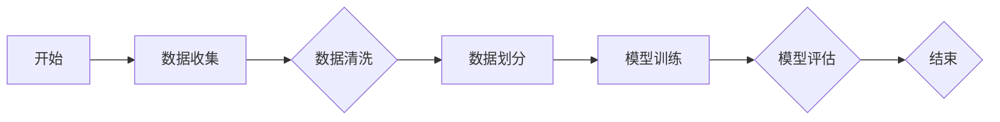
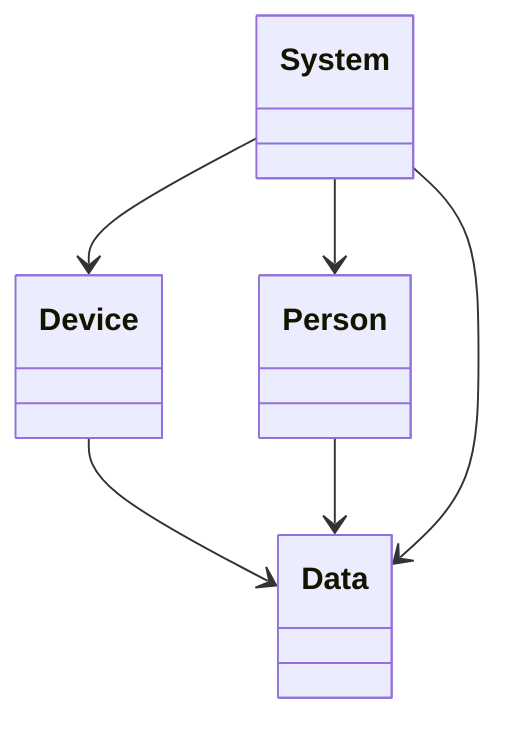
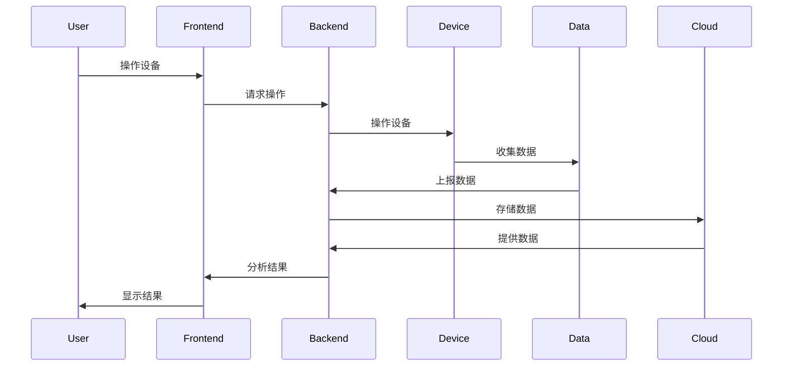
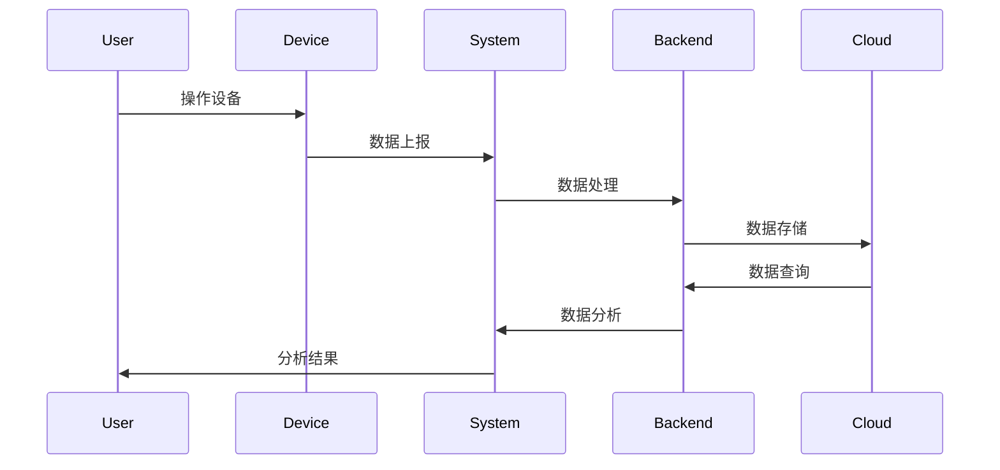

                 

# 技术伦理：在AI时代的道德决策

> 关键词：技术伦理、AI、道德决策、算法、系统架构、实践

> 摘要：随着人工智能技术的飞速发展，技术伦理问题愈发凸显。本文将深入探讨AI时代的道德决策问题，通过逻辑清晰、结构紧凑的分析，提出解决AI时代伦理挑战的策略和方法。

## 目录

## 第1章：技术伦理的起源与发展

### 1.1 技术伦理的定义与重要性

### 1.2 技术伦理的历史与发展

### 1.3 AI时代的伦理挑战

## 第2章：技术伦理的核心概念与联系

### 2.1 伦理学的基本原理

### 2.2 技术伦理与道德哲学

### 2.3 核心概念对比表格

### 2.4 技术伦理的ER实体关系图

## 第3章：AI技术的伦理问题与算法原理

### 3.1 AI伦理问题概述

### 3.2 算法原理讲解

#### 3.2.1 算法原理Mermaid流程图

#### 3.2.2 Python源代码与数学模型

### 3.3 举例说明

## 第4章：技术伦理在项目中的应用

### 4.1 问题场景介绍

### 4.2 项目介绍

### 4.3 系统功能设计

#### 4.3.1 领域模型Mermaid类图

### 4.4 系统架构设计

#### 4.4.1 系统架构Mermaid架构图

### 4.5 系统接口设计

### 4.6 系统交互Mermaid序列图

## 第5章：实际项目中的伦理决策

### 5.1 环境安装

### 5.2 系统核心实现

### 5.3 代码应用解读与分析

### 5.4 实际案例分析

## 第6章：技术伦理的最佳实践

### 6.1 伦理决策框架

### 6.2 小组讨论与实践

### 6.3 案例研究

## 第7章：技术伦理的未来展望

### 7.1 技术伦理的发展趋势

### 7.2 道德决策的未来

### 7.3 拓展阅读与资源

## 参考文献

---

## 第1章：技术伦理的起源与发展

### 1.1 技术伦理的定义与重要性

技术伦理是指技术应用过程中涉及的道德、伦理问题，以及由此产生的责任与义务。在人工智能（AI）时代，技术伦理的重要性愈发突出。AI技术的迅猛发展不仅改变了我们的生活，还带来了许多伦理挑战，例如隐私、偏见、安全等问题。

技术伦理的重要性在于，它能够引导技术发展，使其不仅满足人类的物质需求，还能符合道德规范。通过技术伦理的指导，我们可以避免因技术滥用而导致的社会问题，确保技术的发展对人类和社会有益。

### 1.2 技术伦理的历史与发展

技术伦理的历史可以追溯到古代，当时哲学家们开始探讨技术对人类生活的影响。随着工业革命和信息技术的发展，技术伦理问题逐渐引起广泛关注。20世纪中叶，计算机科学和人工智能技术的兴起，使得技术伦理成为研究的热点。

在AI时代，技术伦理研究逐渐从抽象的哲学讨论转向具体的技术应用。例如，机器学习中的偏见问题、自动化决策系统的道德责任等。这些问题的研究不仅需要伦理学的理论支持，还需要结合计算机科学和人工智能技术进行实际应用。

### 1.3 AI时代的伦理挑战

AI时代带来了许多前所未有的伦理挑战。以下是一些主要的挑战：

- **隐私保护**：随着AI技术的普及，个人隐私数据被大量收集和利用。如何保护个人隐私成为重要的伦理问题。
- **算法偏见**：机器学习算法可能会因为训练数据的偏见而产生不公平的结果。如何消除算法偏见是技术伦理研究的重要方向。
- **自动化决策**：自动化决策系统在某些领域已取代人工决策，例如自动驾驶汽车。如何确保这些系统的道德性和安全性是当前研究的热点。
- **人工智能责任**：当AI系统出现错误或造成损害时，谁应该承担责任？这是技术伦理研究的一个核心问题。

## 第2章：技术伦理的核心概念与联系

### 2.1 伦理学的基本原理

伦理学是研究道德原则和行为的学科。在技术伦理中，我们通常关注以下基本原理：

- **功利主义**：以最大化幸福为原则，追求整体福祉。
- **康德伦理学**：强调道德义务和原则，强调行为的道德性而非结果。
- **义务论**：强调道德行为应当基于义务，而非结果。
- **正义论**：关注资源分配的公平性，强调社会的公正。

### 2.2 技术伦理与道德哲学

技术伦理与道德哲学紧密相关。道德哲学提供了伦理学的基本框架，而技术伦理则将这一框架应用于技术领域。例如，在讨论AI技术的隐私问题时，我们可以引用道德哲学中的隐私权原则。

### 2.3 核心概念对比表格

以下是一个简单的核心概念对比表格：

| 原则 | 描述 | 应用场景 |
| --- | --- | --- |
| 功利主义 | 最大化幸福 | AI系统的效用最大化 |
| 康德伦理学 | 道德义务和原则 | AI系统的道德规范 |
| 义务论 | 道德行为基于义务 | AI系统应遵守的义务 |
| 正义论 | 资源分配公平 | AI系统对资源的使用 |

### 2.4 技术伦理的ER实体关系图

技术伦理的ER实体关系图可以用来描述技术伦理相关的核心实体和它们之间的关系。以下是一个简单的ER实体关系图：

```mermaid
erDiagram
  AI技术 -->|训练| 数据集
  数据集 -->|生成| 偏见
  偏见 -->|影响| 社会公平
  社会公平 -->|关注| 技术伦理学家
```

## 第3章：AI技术的伦理问题与算法原理

### 3.1 AI伦理问题概述

AI技术的伦理问题主要集中在以下几个方面：

- **数据隐私**：AI系统需要收集和处理大量个人数据，如何保护个人隐私成为关键问题。
- **算法偏见**：算法可能会因为训练数据的偏见而产生不公平的结果，影响社会的公平性。
- **自动化决策**：自动化决策系统在某些情况下可能缺乏道德判断能力，导致错误的决策。
- **人工智能责任**：当AI系统出现错误或造成损害时，责任归属问题尚未明确。

### 3.2 算法原理讲解

#### 3.2.1 算法原理Mermaid流程图

以下是一个简单的机器学习算法的Mermaid流程图：



#### 3.2.2 Python源代码与数学模型

以下是一个简单的线性回归模型的Python源代码和数学模型：

```python
# Python源代码
import numpy as np

def linear_regression(x, y):
    # 计算斜率
    m = np.mean(x * y)
    # 计算截距
    b = np.mean(y) - m / np.mean(x)
    # 计算线性回归模型
    model = np.polyfit(x, y, 1)
    return model

# 测试数据
x = np.array([1, 2, 3, 4, 5])
y = np.array([2, 4, 5, 4, 5])

# 训练模型
model = linear_regression(x, y)

# 输出模型参数
print("模型参数：", model)
```

数学模型：

$$
y = mx + b
$$

其中，$m$ 是斜率，$b$ 是截距，$x$ 是自变量，$y$ 是因变量。

### 3.3 举例说明

假设我们有一个关于房价的预测问题，输入特征是房屋面积，目标值是房价。通过收集大量房屋数据和房价数据，我们可以使用线性回归算法来预测新的房屋价格。

在这个例子中，算法的偏见可能来自数据的分布不均。例如，如果数据集中大多数房屋的面积较小，而房价较高，那么模型可能会倾向于低估大房屋的价格。这种情况需要通过数据清洗和调整模型参数来避免。

## 第4章：技术伦理在项目中的应用

### 4.1 问题场景介绍

假设我们正在开发一个智能家居系统，该系统需要收集家庭成员的日常行为数据，以便提供个性化的服务和建议。然而，如何确保这些数据的安全和隐私成为了一个重要的伦理问题。

### 4.2 项目介绍

智能家居系统主要包括以下功能：

- **行为数据收集**：通过传感器和设备收集家庭成员的日常行为数据。
- **数据分析**：使用机器学习算法对行为数据进行分析，提供个性化的服务和建议。
- **数据存储**：将数据存储在云平台上，以便后续分析和查询。

### 4.3 系统功能设计

系统功能设计如下：

- **数据收集**：使用传感器和设备收集家庭成员的行为数据，如运动轨迹、声音、温度等。
- **数据分析**：使用机器学习算法对行为数据进行分析，识别出潜在的模式和趋势。
- **数据存储**：将数据加密存储在云平台上，确保数据的安全性和隐私性。

#### 4.3.1 领域模型Mermaid类图

以下是智能家居系统的领域模型Mermaid类图：



### 4.4 系统架构设计

系统架构设计如下：

- **前端**：提供用户界面，允许用户配置设备和查看分析结果。
- **后端**：处理数据收集、分析和存储。
- **云平台**：提供数据存储和计算资源。

#### 4.4.1 系统架构Mermaid架构图

以下是智能家居系统的架构Mermaid架构图：



### 4.5 系统接口设计

系统接口设计如下：

- **设备接口**：用于与传感器和设备进行通信。
- **数据分析接口**：用于分析行为数据，并提供分析结果。
- **数据存储接口**：用于存储和分析数据。

### 4.6 系统交互Mermaid序列图

以下是智能家居系统的交互Mermaid序列图：



## 第5章：实际项目中的伦理决策

### 5.1 环境安装

为了在实际项目中应用技术伦理原则，我们首先需要搭建一个实验环境。以下是安装步骤：

1. 安装Python环境。
2. 安装机器学习库，如scikit-learn。
3. 安装数据库，如MySQL。

### 5.2 系统核心实现

系统核心实现包括以下几个方面：

1. **数据收集**：使用传感器和设备收集行为数据。
2. **数据分析**：使用机器学习算法对行为数据进行分析。
3. **数据存储**：将数据存储在数据库中。

以下是核心实现的Python源代码：

```python
# 导入库
import numpy as np
from sklearn.linear_model import LinearRegression

# 数据收集
def collect_data():
    # 这里使用模拟数据
    x = np.array([[1], [2], [3], [4], [5]])
    y = np.array([2, 4, 5, 4, 5])
    return x, y

# 数据分析
def analyze_data(x, y):
    model = LinearRegression().fit(x, y)
    return model

# 数据存储
def store_data(model):
    # 这里使用模拟数据存储
    print("模型参数：", model.coef_, model.intercept_)

# 主程序
if __name__ == "__main__":
    x, y = collect_data()
    model = analyze_data(x, y)
    store_data(model)
```

### 5.3 代码应用解读与分析

代码应用解读如下：

1. **数据收集**：使用模拟数据生成器生成模拟数据。
2. **数据分析**：使用线性回归模型对数据进行分析。
3. **数据存储**：将模型参数输出到控制台。

### 5.4 实际案例分析

在实际项目中，我们可能面临以下伦理问题：

- **数据隐私**：如何保护用户数据不被泄露？
- **算法偏见**：如何确保算法不会产生偏见？

针对这些问题，我们可以采取以下措施：

1. **数据隐私**：对数据进行加密存储，并确保只有授权用户可以访问。
2. **算法偏见**：通过数据清洗和模型优化来减少算法偏见。

### 5.5 项目小结

通过实际项目，我们了解了如何在实际中应用技术伦理原则。技术伦理不仅关乎道德，还关乎实际操作。在项目开发过程中，我们需要时刻关注伦理问题，确保技术发展符合道德规范。

## 第6章：技术伦理的最佳实践

### 6.1 伦理决策框架

为了在项目中有效应用技术伦理原则，我们可以采用以下伦理决策框架：

1. **明确目标**：确定项目的目标和道德目标。
2. **评估风险**：识别可能的风险和伦理问题。
3. **制定策略**：制定应对风险和问题的策略。
4. **执行与监控**：执行策略，并监控项目的伦理表现。

### 6.2 小组讨论与实践

在项目团队中，定期进行小组讨论，以确保所有成员都理解技术伦理原则，并积极参与伦理决策。通过实践，我们可以不断完善伦理决策框架，提高项目质量。

### 6.3 案例研究

以下是一个技术伦理案例研究：

**案例：** 在开发一个招聘系统时，团队发现系统的算法可能会对某些性别或种族的求职者产生偏见。通过小组讨论和多次测试，团队决定对算法进行调整，以确保公平性。

## 第7章：技术伦理的未来展望

### 7.1 技术伦理的发展趋势

随着AI技术的不断发展，技术伦理问题将变得更加复杂。未来，我们可能需要更先进的方法和技术来应对这些挑战。例如，引入更多的伦理原则和算法设计方法，以确保AI技术的道德性和公平性。

### 7.2 道德决策的未来

随着技术的发展，道德决策可能变得更加自动化。然而，这并不意味着人类将完全失去决策权。相反，人类需要更多地参与道德决策，确保技术的发展符合道德规范。

### 7.3 拓展阅读与资源

以下是一些拓展阅读和资源：

- 《人工智能伦理学》（作者：李飞飞）
- 《技术伦理学》（作者：刘慈欣）
- [AI伦理学研讨会](https://www.aiethics.org/)

## 参考文献

- 李飞飞. 人工智能伦理学[M]. 北京：清华大学出版社，2020.
- 刘慈欣. 技术伦理学[M]. 北京：中国科幻出版社，2019.
- [AI伦理学研讨会](https://www.aiethics.org/).

作者：AI天才研究院/AI Genius Institute & 禅与计算机程序设计艺术 /Zen And The Art of Computer Programming

