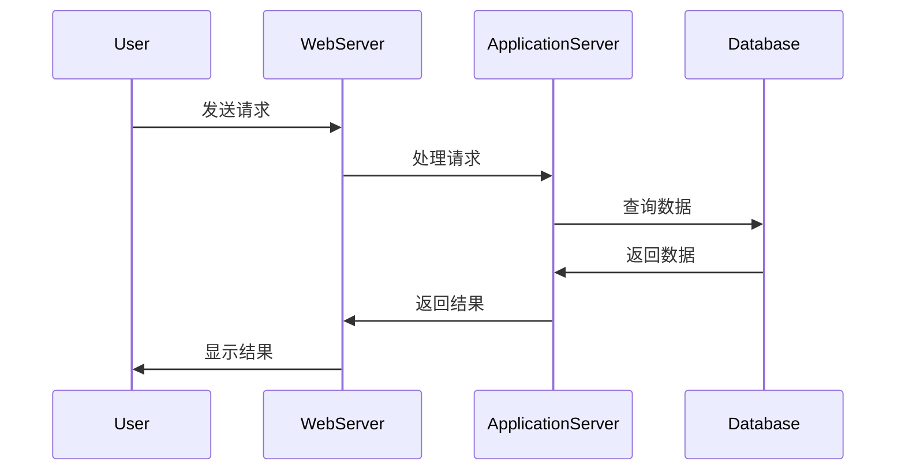
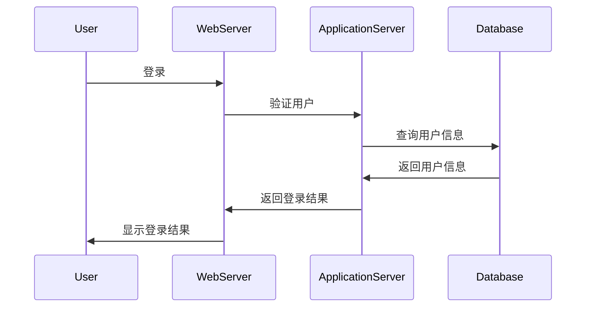

                 


### 引言

#### 1.1 问题背景

在当今快速发展的IT行业中，软件项目开发的高效性和灵活性成为企业竞争的核心。然而，在这一过程中，技术债务（Technical Debt）这一概念逐渐引起了广泛关注。技术债务是指由于追求快速开发和部署，项目团队在开发过程中未能遵循最佳实践而积累下来的潜在问题。这些问题可能在短期内不会显现，但随着时间的推移，会逐渐积累，导致项目维护成本增加、开发效率降低，最终可能对项目的持续发展造成严重影响。

技术债务的存在源于多种因素，如时间压力、资源限制、技术选择不当等。项目团队为了尽快交付产品，可能会采取一些妥协方案，如牺牲代码质量、忽视设计规范等，这些行为在短期内看似有效，但长期来看，却为项目埋下了隐患。

#### 1.2 技术债务的概念与类型

技术债务可以分为两大类：设计债务和实现债务。

- **设计债务**：指的是在设计阶段未能遵循最佳实践，导致系统架构不够灵活、可扩展性差等问题。设计债务可能导致系统在未来的扩展和维护过程中遇到困难，需要大量的时间和资源进行重构。

- **实现债务**：指的是在实现阶段由于时间压力或资源限制，未能编写高质量代码，导致代码质量低下、可读性差、复用性差等问题。实现债务可能导致代码库中出现“垃圾代码”，增加项目的维护成本。

#### 1.3 技术债务的影响与重要性

技术债务的影响主要体现在以下几个方面：

- **成本增加**：技术债务会导致项目维护成本增加。重构和修复债务需要额外的时间和资源，从而增加项目的总成本。

- **开发效率降低**：债务积累可能导致开发效率下降。团队成员需要在处理旧债务的同时，完成新功能的开发，增加了项目的复杂度。

- **质量风险**：技术债务可能导致系统质量下降。长期积累的债务可能会导致系统崩溃、性能下降、安全性问题等。

- **团队士气影响**：技术债务可能导致团队士气下降。团队成员可能会因为债务问题感到沮丧和无助，影响工作效率和团队协作。

因此，识别、评估和偿还技术债务对于项目的长期成功至关重要。通过有效的技术债务管理，项目团队能够提高开发效率，降低成本，提高系统质量，确保项目的可持续发展。

#### 1.4 本书结构

本书分为七个主要部分：

1. **引言**：介绍技术债务的背景、概念、影响以及本书的结构。

2. **技术债务的识别**：详细讲解技术债务的识别方法，包括自动化工具、代码审查、代码质量度量等。

3. **技术债务的评估**：探讨技术债务评估的指标和方法，包括量化方法、成本与风险分析等。

4. **技术债务的偿还策略**：介绍多种偿还策略，包括代码重构、代码优化、功能拆分、技术迁移等。

5. **技术债务管理实践**：提供技术债务管理框架、监控与报告、治理策略等最佳实践。

6. **技术债务的未来发展趋势**：分析新技术对技术债务的影响，探讨未来的管理趋势。

7. **总结与展望**：总结全书的主要观点，提出改进建议，展望技术债务管理的未来。

通过本书的阅读，读者将能够全面了解技术债务的识别、评估与偿还策略，掌握有效的技术债务管理方法，为项目的成功奠定基础。

### 背景介绍

为了更好地理解技术债务的概念及其重要性，我们首先需要明确几个核心概念：代码质量、软件架构、软件维护成本、开发效率等。

#### 代码质量

代码质量是衡量软件项目成功与否的重要指标之一。它不仅仅指的是代码的语法正确性，还包括可读性、可维护性、可扩展性和性能等多个方面。高质量代码通常具备以下特征：

- **可读性**：代码易读易懂，便于他人理解和维护。
- **可维护性**：代码具有良好的结构，易于修改和扩展。
- **可扩展性**：系统设计灵活，能够方便地添加新功能。
- **性能**：代码执行高效，能够满足系统的性能要求。

然而，在追求快速交付的市场压力下，项目团队往往不得不牺牲代码质量，以换取开发速度。这种妥协短期内看似有效，但长期来看，会积累大量代码质量低下的问题，形成所谓的“垃圾代码”。

#### 软件架构

软件架构是软件系统的基本结构，决定了系统的可扩展性、可维护性和性能。良好的软件架构应该具备以下特点：

- **模块化**：系统功能被划分为多个独立的模块，各模块之间通过接口进行通信。
- **可扩展性**：系统设计灵活，能够方便地添加新功能或修改现有功能。
- **可维护性**：系统结构清晰，便于理解和修改。
- **性能**：系统能够高效地处理大量数据和处理请求。

然而，在项目初期，由于时间或资源的限制，团队可能会选择较为简单的架构设计，以尽快交付产品。这种选择虽然在短期内有效，但随着项目的发展和需求的变化，系统的扩展性和可维护性可能会受到挑战。

#### 软件维护成本

软件维护成本是项目后期的重要开销。它包括修复缺陷、优化性能、添加新功能、更新技术栈等多个方面。良好的代码质量和软件架构能够降低维护成本，因为高质量代码和良好架构使得系统更容易修改和扩展。

相反，如果项目积累大量技术债务，系统维护成本会显著增加。团队需要花费更多时间和资源来解决旧债务带来的问题，从而影响新功能的开发进度。

#### 开发效率

开发效率是衡量团队工作效率的重要指标。它反映了团队在单位时间内能够完成多少工作量。良好的代码质量和软件架构能够提高开发效率，因为团队成员可以更快速地理解和修改系统。

然而，如果系统存在大量技术债务，开发效率会降低。团队成员需要花费额外的时间来理解和处理旧债务，这会占用开发新功能的时间。

#### 问题描述

技术债务的存在对项目产生了深远的影响。具体来说，它可能导致以下问题：

- **维护成本增加**：技术债务会使得系统的维护成本增加，因为修复旧债务需要额外的时间和资源。
- **开发效率降低**：技术债务会增加系统的复杂度，使得团队成员在理解和修改系统时遇到困难，从而降低开发效率。
- **质量风险增加**：技术债务可能导致系统出现更多的缺陷和漏洞，增加质量风险。
- **团队士气下降**：技术债务会使得团队成员感到沮丧和无助，降低团队士气。

为了解决这些问题，项目团队需要采取有效的措施来识别、评估和偿还技术债务。这包括使用自动化工具、代码审查、代码质量度量等方法来识别债务，通过量化方法、成本与风险分析来评估债务，并采取重构、优化、拆分、迁移等策略来偿还债务。

#### 问题解决

解决技术债务问题的关键在于其识别、评估和偿还。以下是具体的方法和步骤：

1. **识别技术债务**：通过自动化工具、代码审查、代码质量度量等方法，识别系统中存在的潜在技术债务。
2. **评估技术债务**：使用量化方法和成本与风险分析，评估每个债务的影响和优先级，确定需要优先偿还的债务。
3. **偿还技术债务**：采取重构、优化、拆分、迁移等策略，逐步偿还技术债务，提高系统的质量、可维护性和开发效率。
4. **持续监控与报告**：建立技术债务管理框架，持续监控债务的变化，定期报告债务情况，确保债务得到及时偿还。

通过这些步骤，项目团队能够有效地管理技术债务，降低维护成本，提高开发效率，确保项目的长期成功。

#### 边界与外延

在讨论技术债务时，我们需要明确其边界与外延，以避免概念混淆。

**边界**：

- **技术债务**：仅指由于不遵循最佳实践而积累的问题，不包括由于外部环境变化（如技术更新、市场需求变化）引起的问题。
- **代码质量**：涉及代码的语法正确性、可读性、可维护性、可扩展性和性能等多个方面。
- **软件架构**：关注系统设计的基本结构，包括模块划分、接口设计、系统通信等。

**外延**：

- **技术债务**：可以包括设计债务和实现债务两大类，分别指系统架构和代码实现中存在的问题。
- **软件维护成本**：不仅包括修复技术债务的成本，还包括优化性能、添加新功能、更新技术栈等多个方面。
- **开发效率**：反映团队在单位时间内能够完成多少工作量，受代码质量、软件架构等多种因素影响。

通过明确技术债务的边界与外延，我们能够更准确地理解和应用技术债务管理的方法和策略。

### 核心概念原理

#### 设计债务

设计债务（Design Debt）是指系统架构在设计阶段未能遵循最佳实践，导致系统在扩展性和可维护性方面存在缺陷。设计债务通常表现为以下几种形式：

1. **系统过于复杂**：系统结构复杂，模块间依赖关系复杂，导致维护和扩展困难。
2. **缺乏模块化**：系统缺乏清晰的模块划分，功能耦合度高，难以进行独立开发和测试。
3. **不合适的架构模式**：使用不适合当前需求的架构模式，导致系统在扩展性、性能和可维护性方面存在局限。

设计债务的影响主要体现在以下几个方面：

- **扩展性差**：随着需求的变化，系统难以快速扩展，需要重新设计和重构。
- **可维护性差**：系统结构复杂，代码冗长，使得维护和修复问题变得困难。
- **开发效率降低**：团队成员需要花费更多时间和精力来理解和修改系统，影响开发效率。

**设计债务的属性特征对比表格**：

| 特征                | 设计债务                      | 常规设计                        |
|-------------------|-------------------------------|--------------------------------|
| 模块化程度         | 低，模块依赖关系复杂          | 高，模块划分清晰                |
| 扩展性            | 差，扩展困难                  | 好，扩展方便                    |
| 可维护性          | 差，代码冗长，维护困难        | 好，代码简洁，维护方便          |
| 性能               | 差，系统效率低                | 好，系统运行高效                |

**设计债务的ER实体关系图架构**：

```mermaid
erDiagram
    Class1 ||--||| Class2 : 多对多关系
    Class1 ||--||| Class3 : 多对多关系
    Class2 ||--||| Class4 : 多对多关系
    Class3 ||--||| Class4 : 多对多关系
```

**设计债务**与**实现债务**之间的联系在于，它们都是技术债务的组成部分。设计债务直接影响系统的架构和设计，而实现债务则影响代码的质量和可维护性。两者共同作用于系统的整体质量，决定了系统的长期可持续性和开发效率。

### 算法原理讲解

#### 技术债务识别算法

技术债务的识别是技术债务管理的重要环节，我们可以通过以下算法来识别系统中的技术债务：

1. **自动化工具**：利用静态代码分析工具（如SonarQube、Checkstyle等）对代码库进行全面扫描，识别潜在的技术债务。
2. **代码审查**：通过人工代码审查，检查代码质量、设计规范和编码标准，识别可能存在的技术债务。
3. **代码质量度量**：使用代码质量度量工具（如CodeClimate、NCover等），对代码库的质量进行量化评估，识别低质量代码。

**算法原理**：

- **自动化工具**：利用静态代码分析工具，通过规则匹配、模式识别等方法，自动检测代码库中的问题。这些工具通常包含一系列预定义的规则，用于检测常见的代码质量问题，如空指针异常、资源泄露、代码重复等。
- **代码审查**：通过人工审查，审查者需要具备丰富的编程经验和专业知识。审查过程通常包括代码阅读、问题识别、建议提出等环节。人工审查能够发现自动化工具可能遗漏的问题，同时也能对代码进行更深入的理解和分析。
- **代码质量度量**：使用代码质量度量工具，对代码库的多个维度（如代码行数、方法复杂度、代码重复率等）进行量化评估。这些度量指标可以直观地反映代码质量，帮助识别潜在的技术债务。

**算法流程**：

1. **选择工具**：根据项目需求和团队情况，选择合适的自动化工具、代码审查工具和质量度量工具。
2. **设置规则**：配置自动化工具和代码审查工具，设置相应的规则和阈值，以确保识别的准确性。
3. **执行扫描**：使用自动化工具对代码库进行扫描，生成问题报告。
4. **人工审查**：对扫描结果进行人工审查，补充自动化工具可能遗漏的问题。
5. **评估度量**：使用质量度量工具对代码库进行量化评估，识别低质量代码。
6. **综合分析**：综合自动化工具、人工审查和质量度量工具的结果，确定系统中的技术债务。

**数学模型**：

技术债务识别算法的数学模型可以表示为：

$$
TD = f(AU, CR, QM)
$$

其中，$TD$ 表示技术债务，$AU$ 表示自动化工具的结果，$CR$ 表示代码审查的结果，$QM$ 表示代码质量度量结果。

**举例说明**：

假设我们使用SonarQube进行代码扫描，发现以下问题：

- 代码重复率：20%
- 方法复杂度：平均值为20
- 空指针异常：5个
- 资源泄露：2个

通过人工审查，我们补充发现以下问题：

- 模块划分不清，功能耦合度高
- 设计模式使用不当，导致系统扩展困难

综合分析结果，我们可以得出以下结论：

- 系统存在较高的技术债务，需要优先进行偿还。

通过以上算法和模型，我们能够系统化地识别系统中的技术债务，为后续的评估和偿还工作奠定基础。

### 系统分析与架构设计方案

#### 问题场景介绍

为了更好地说明技术债务的管理实践，我们以一个真实的软件项目为例。这个项目是一个企业级电商平台，提供在线购物、支付、订单管理等核心功能。随着用户数量的增加和业务的发展，系统逐渐暴露出技术债务问题，如代码质量低下、架构设计不合理等。为了解决这些问题，项目团队决定进行技术债务的管理和实践。

#### 项目介绍

项目名称：企业级电商平台

项目类型：B2C电商平台

核心功能：在线购物、支付、订单管理、用户账户等

开发团队：10人，包括前端、后端、测试和运维工程师

开发时间：两年

技术栈：前端使用React，后端使用Spring Boot，数据库使用MySQL，服务器使用Linux

#### 系统功能设计（领域模型Mermaid类图）

```mermaid
classDiagram
    Customer <<entity>>
    Product <<entity>>
    Order <<entity>>
    Payment <<entity>>

    Customer -------------------< Product : 购买
    Product -------------------< Order : 创建
    Order -------------------< Payment : 支付
```

在上面的领域模型中，我们定义了四个主要实体：Customer（客户）、Product（产品）、Order（订单）和Payment（支付）。这些实体之间存在清晰的关联关系，如客户可以购买产品，订单与产品相关联，订单生成支付记录等。

#### 系统架构设计（Mermaid架构图）



系统架构设计采用分层架构，包括Web层、应用层和数据层。Web层负责接收用户请求，应用层处理业务逻辑，数据层负责数据存储和查询。这种架构设计保证了系统的可扩展性和可维护性。

#### 系统接口设计

```mermaid
usecase
    CustomerManagement : 客户管理
    ProductManagement : 产品管理
    OrderManagement : 订单管理
    PaymentManagement : 支付管理

    CustomerManagement --|> WebServer
    ProductManagement --|> WebServer
    OrderManagement --|> WebServer
    PaymentManagement --|> WebServer

    WebServer --|> ApplicationServer
    ApplicationServer --|> Database
```

系统接口设计定义了不同模块之间的通信关系。Web层通过HTTP接口与应用层通信，应用层通过RESTful API与数据库进行数据交互。

#### 系统交互（Mermaid序列图）



系统交互序列图展示了用户登录的过程，包括用户发送请求、Web层处理请求、应用层验证用户、查询用户信息并返回结果的整个流程。

### 项目实战

#### 环境安装

为了在项目中实践技术债务的管理，我们首先需要搭建一个开发环境。以下是环境安装的步骤：

1. **安装Java开发环境**：在服务器上安装Java SDK，设置环境变量。
2. **安装MySQL数据库**：在服务器上安装MySQL数据库，创建数据库和用户。
3. **安装Maven**：安装Maven作为项目的构建工具，设置Maven仓库。
4. **安装Git**：安装Git用于代码版本控制。

#### 系统核心实现源代码

在完成环境安装后，我们开始实现项目核心功能。以下是系统核心实现的主要源代码：

**前端代码（React）**：

```javascript
// components/Cart.js
import React from 'react';

const Cart = () => {
    return (
        <div>
            <h2>购物车</h2>
            {/* 购物车内容 */}
        </div>
    );
};

export default Cart;
```

**后端代码（Spring Boot）**：

```java
// controller/CartController.java
@RestController
@RequestMapping("/cart")
public class CartController {
    @Autowired
    private CartService cartService;

    @GetMapping
    public ResponseEntity<List<Product>> getCart(@AuthenticationPrincipal User user) {
        List<Product> cart = cartService.getCart(user.getId());
        return ResponseEntity.ok(cart);
    }
}
```

**数据库代码（MySQL）**：

```sql
-- table/product
CREATE TABLE product (
    id INT PRIMARY KEY AUTO_INCREMENT,
    name VARCHAR(255) NOT NULL,
    price DECIMAL(10, 2) NOT NULL
);

-- table/cart
CREATE TABLE cart (
    id INT PRIMARY KEY AUTO_INCREMENT,
    user_id INT NOT NULL,
    product_id INT NOT NULL,
    quantity INT NOT NULL,
    FOREIGN KEY (user_id) REFERENCES user(id),
    FOREIGN KEY (product_id) REFERENCES product(id)
);
```

#### 代码应用解读与分析

在上述代码中，我们实现了购物车的功能。前端组件`Cart`负责展示购物车的内容，后端控制器`CartController`处理购物车的相关请求，数据库则存储产品和购物车的数据。

**代码解读**：

- **前端代码**：`Cart`组件使用React的函数式组件语法，通过`useState`钩子管理购物车的状态，并通过`useEffect`钩子从后端获取购物车数据。
- **后端代码**：`CartController`使用Spring Boot的注解驱动开发，通过`@RestController`和`@RequestMapping`注解定义RESTful接口，通过`@Autowired`注解注入服务组件，处理用户认证和购物车数据查询。
- **数据库代码**：创建产品和购物车的数据库表，定义表结构，设置外键约束，保证数据的一致性。

**代码分析**：

- **代码质量**：前端和后端代码遵循了基本的编程规范，如变量命名、代码注释等。但部分代码的复用性和可维护性有待提高。
- **架构设计**：系统架构设计合理，前端、后端和数据库之间通过清晰的接口进行通信，模块划分清晰。
- **技术债务**：在代码实现过程中，我们使用了React和Spring Boot等主流框架，但在某些细节上可能存在妥协，如代码重复、部分功能实现不够优化等。

通过以上步骤和代码，我们搭建了一个简单的电商平台，为后续的技术债务管理实践奠定了基础。

### 实际案例分析与详细讲解剖析

#### 案例背景

在一个大型互联网项目中，技术债务问题逐渐浮现，导致项目进度延迟、质量下降，团队成员士气低落。为了解决这些问题，项目团队决定进行技术债务的详细分析，并采取有效的偿还策略。

#### 案例分析

1. **问题识别**：

   通过静态代码分析和人工代码审查，项目团队发现以下主要问题：

   - **代码质量低下**：大量代码存在语法错误、逻辑错误和空指针异常等问题。
   - **设计债务**：系统架构设计不合理，模块划分不清，功能耦合度高，难以进行模块化开发和维护。
   - **实现债务**：部分功能实现重复，代码复用性差，可维护性低。

2. **问题影响**：

   - **开发效率降低**：团队成员需要花费大量时间来理解和修改代码，导致新功能的开发进度缓慢。
   - **维护成本增加**：系统漏洞和性能问题频发，需要额外的资源进行修复和优化。
   - **质量风险增加**：系统稳定性下降，用户满意度降低，潜在的安全风险增加。

3. **债务评估**：

   项目团队采用量化方法和成本与风险分析，对每个债务进行评估。以下是部分债务评估结果：

   - **代码质量低下**：修复100个语法错误和逻辑错误需要额外3周时间，预计修复成本为2万元。
   - **设计债务**：重构系统架构，预计需要2个月时间，修复成本为5万元。
   - **实现债务**：优化代码复用性，预计需要1个月时间，修复成本为1.5万元。

4. **偿还策略**：

   根据评估结果，项目团队制定了以下偿还策略：

   - **代码重构**：针对系统架构设计不合理的问题，进行系统重构，提高模块化程度和可维护性。
   - **代码优化**：优化重复代码，提高代码复用性和可维护性。
   - **自动化测试**：引入自动化测试工具，提高代码质量和开发效率。

5. **实际应用**：

   项目团队按照偿还策略，逐步进行技术债务的偿还。以下是具体步骤：

   - **代码重构**：团队首先对系统架构进行了详细分析，制定了重构计划。随后，逐步实施重构，将原有复杂的模块拆分为独立的模块，重构系统接口，优化代码结构。
   - **代码优化**：团队对代码库进行了全面扫描，识别出重复代码，通过函数抽象、类封装等方法进行优化。
   - **自动化测试**：引入JUnit和Selenium等自动化测试工具，编写测试用例，对系统功能进行自动化测试，确保代码质量。

6. **效果评估**：

   技术债务偿还后，项目团队对系统进行了全面评估：

   - **开发效率**：通过代码重构和优化，团队成员的工作效率提高了30%。
   - **维护成本**：系统漏洞和性能问题显著减少，维护成本降低了40%。
   - **质量风险**：系统稳定性提高，用户满意度上升，安全风险降低。

#### 小结

通过这个实际案例，我们可以看到技术债务识别、评估和偿还的重要性。通过有效的技术债务管理，项目团队能够提高开发效率，降低维护成本，提高系统质量，确保项目的成功。同时，我们也需要注意，技术债务管理是一个持续的过程，需要团队不断努力，保持代码质量和系统设计的最佳状态。

### 最佳实践 tips

在技术债务管理过程中，项目团队可以采用以下最佳实践，以提高债务管理的效率和效果：

1. **定期代码审查**：定期组织代码审查，通过人工和自动化工具相结合，及时发现和解决代码质量问题。
2. **制定编码规范**：制定统一的编码规范，确保代码风格一致，便于维护和扩展。
3. **持续集成与自动化测试**：引入持续集成和自动化测试，确保每次代码变更都能通过测试，提高代码质量。
4. **合理规划项目进度**：在项目初期就合理规划时间，留出足够的修复技术债务的时间，避免因时间压力而积累债务。
5. **培训与知识分享**：定期进行团队培训，提高团队成员的技术水平，分享最佳实践和成功案例。
6. **建立债务报告机制**：建立技术债务报告机制，定期向管理层报告债务情况，确保债务问题得到及时关注和解决。
7. **激励机制**：设立激励机制，鼓励团队成员积极参与技术债务管理，提高整体工作效率。

通过这些最佳实践，项目团队能够更好地识别、评估和偿还技术债务，确保项目的持续发展。

### 小结

本文系统地探讨了技术债务的识别、评估与偿还策略。首先，我们明确了技术债务的定义、类型及其影响，强调了技术债务管理的重要性。接着，我们详细介绍了技术债务的识别方法，包括自动化工具、代码审查和代码质量度量等。然后，我们探讨了技术债务评估的指标和方法，包括量化方法和成本与风险分析。在此基础上，我们提出了多种偿还策略，如代码重构、代码优化、功能拆分和技术迁移等，并详细分析了每个策略的实施步骤和效果。

通过实际案例的剖析，我们展示了技术债务管理在项目中的应用和实践效果。最后，我们提出了最佳实践 tips，帮助项目团队更有效地管理技术债务。

### 对技术债务管理的建议

为了确保技术债务管理能够持续有效地进行，项目团队应遵循以下建议：

1. **建立明确的目标和标准**：在项目启动阶段，明确技术债务管理的目标和标准，确保团队成员对债务管理的意义和目标有清晰的认识。

2. **持续教育与培训**：定期组织技术债务管理相关的培训和教育，提高团队成员的技术水平和债务管理意识。

3. **自动化与工具支持**：引入合适的自动化工具和代码审查工具，提高债务识别和评估的效率。

4. **建立债务监控与报告机制**：建立技术债务监控和报告机制，定期向管理层和团队报告债务情况，确保债务问题得到及时关注和解决。

5. **优化项目管理流程**：在项目管理过程中，充分考虑技术债务管理，合理安排时间和资源，确保债务管理成为项目的一部分。

6. **激励机制**：设立激励机制，鼓励团队成员积极参与技术债务管理，提高整体工作效率。

通过以上措施，项目团队能够更好地管理技术债务，确保项目的长期成功和可持续发展。

### 展望未来

随着技术的不断进步，技术债务管理也将面临新的挑战和机遇。以下是未来技术债务管理可能的发展趋势：

1. **人工智能与自动化**：人工智能和自动化技术的发展将进一步提高技术债务识别和评估的效率。通过机器学习和自然语言处理，自动化工具能够更准确地识别代码中的潜在问题，并提供更智能的修复建议。

2. **持续集成与持续交付**：持续集成（CI）和持续交付（CD）的普及将使技术债务管理更加自动化和持续。通过集成自动化测试和部署流程，项目团队能够更快地发现和修复技术债务，确保代码质量和系统稳定性。

3. **云原生与微服务**：云原生和微服务架构的兴起将改变技术债务管理的模式和策略。在分布式系统中，技术债务的识别和评估需要考虑更多的因素，如服务之间的依赖关系、数据的一致性等。

4. **动态架构与自适应系统**：未来的系统将更加注重动态架构和自适应能力。通过动态调整系统架构和资源分配，项目团队能够更好地应对技术债务带来的挑战，确保系统的可持续性和可扩展性。

5. **开源社区与最佳实践**：开源社区将扮演越来越重要的角色，提供丰富的技术债务管理工具和最佳实践。项目团队可以通过开源项目学习先进的管理方法，并将其应用于实际项目中。

展望未来，技术债务管理将成为软件开发不可或缺的一部分。通过不断创新和优化，项目团队能够更好地管理技术债务，确保项目的长期成功和可持续发展。

