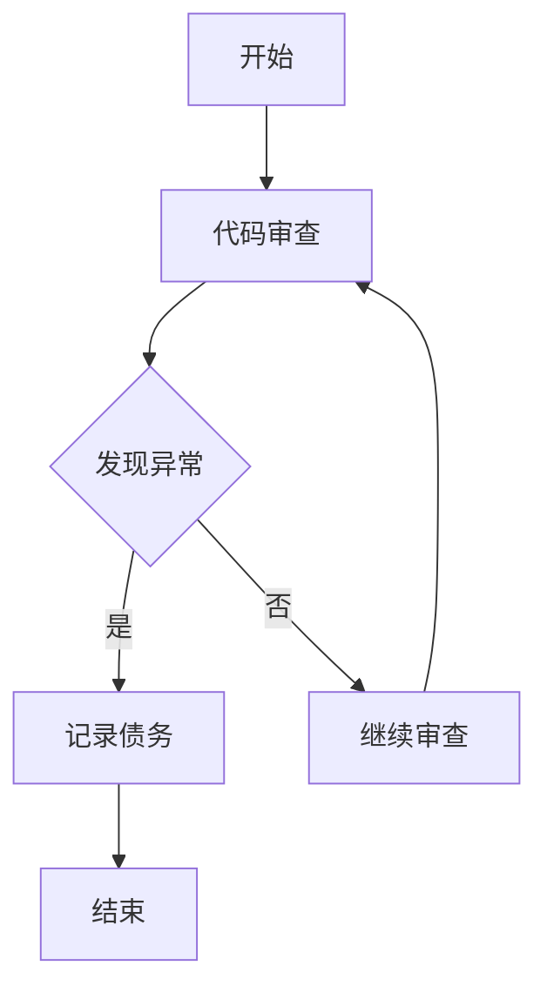
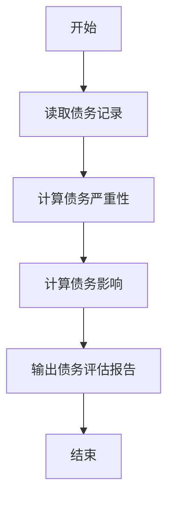
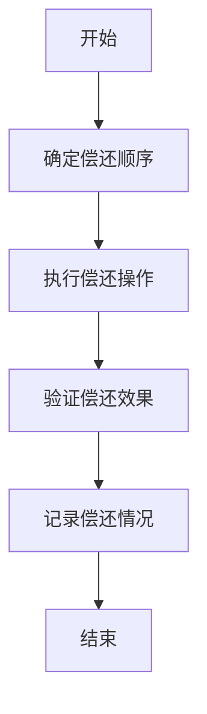

                 


# 技术债务管理策略：识别、量化与偿还

## 关键词
技术债务，管理策略，识别，量化，偿还，软件工程，软件开发，系统优化

## 摘要
技术债务是软件开发过程中不可避免的产物，它如同财务债务一样，如果不能有效管理，将对软件系统的持续健康发展构成威胁。本文将深入探讨技术债务管理策略，包括识别、量化和偿还技术债务的方法，旨在帮助开发团队理解和掌握这一关键技能，确保软件系统的质量和稳定性。

## 第一部分：背景介绍

### 问题背景

技术债务（Technical Debt）这一概念最早由软件工程师 Ward Cunningham 于1992年提出，用来描述在软件开发过程中，由于追求开发速度而暂时牺牲代码质量、性能、可维护性等方面所产生的欠债。随着时间的推移，技术债务逐渐成为软件工程领域的重要议题。

技术债务的存在是由于软件开发过程中的各种限制和压力。例如，市场需求的快速变化、项目时间的紧迫性、技术选型的局限等，都可能导致开发团队在代码质量和系统设计上做出妥协。这种妥协虽然能在短期内提升开发速度，但长远来看，却为软件系统埋下了隐患。

### 问题描述

技术债务管理策略的核心在于识别、量化和偿还技术债务。首先，识别技术债务是了解系统当前状态的关键步骤，可以帮助开发团队发现潜在的问题。其次，量化技术债务能够评估债务的严重程度，为后续的偿还工作提供依据。最后，偿还技术债务是通过重构、优化代码和系统，逐步消除债务的过程。

### 问题解决

要有效管理技术债务，需要一套完整的策略和方法。以下是一些基本的管理策略：

1. **代码审查**：通过定期进行代码审查，发现代码中的质量问题，如冗余代码、低效算法等。
2. **自动化测试**：建立完善的自动化测试体系，确保代码改动不会引入新的缺陷。
3. **持续集成/持续部署（CI/CD）**：通过自动化构建和部署流程，提高开发效率和质量。
4. **引入专业的债务管理工具**：使用专门的技术债务管理工具，如SonarQube、Codeclimate等，对代码进行全面检查和评估。

### 边界与外延

技术债务的范围不仅仅限于代码层面，还包括设计、架构、数据库、基础设施等多个方面。同时，技术债务也不局限于软件开发过程，还可能出现在运维、升级和扩展等阶段。

### 概念结构与核心要素组成

技术债务管理可以分解为三个核心环节：

1. **技术债务识别**：通过各种工具和方法，如代码审查、自动化测试、静态代码分析等，发现系统中的技术债务。
2. **技术债务量化**：对识别出的债务进行评估，确定其程度和影响。量化方法可以包括债务等级划分、风险评估等。
3. **技术债务偿还**：通过重构、优化代码和系统，逐步偿还债务。偿还策略可以根据债务的类型、程度和影响进行定制。

## 第二部分：核心概念与联系

### 核心概念与原理

#### 技术债务

技术债务是一种比喻，源自财务领域的债务概念，用来描述软件开发过程中，因追求速度而暂时牺牲质量产生的欠债。这种债务体现在代码质量、性能、可维护性等方面，类似于财务债务中的利息和本金。

#### 债务类型

技术债务可以分为以下几种类型：

1. **设计债务**：由于设计不合理或过度设计产生的欠债。
2. **代码债务**：由于代码质量低下、重复代码、冗余代码等产生的欠债。
3. **架构债务**：由于系统架构设计不当、缺乏弹性、难以扩展等产生的欠债。

#### 债务特征

技术债务具有以下几个特征：

1. **紧急性**：某些技术债务需要立即偿还，否则可能影响系统的正常运行。
2. **严重性**：债务的严重程度不同，有些债务可能对系统的影响较小，而有些则可能导致严重的问题。
3. **可修复性**：并非所有技术债务都能修复，有些债务可能因为时间、资源等原因无法彻底解决。

### 概念属性特征对比表格

| 类型         | 定义                                                         | 特征                     |
| ------------ | ------------------------------------------------------------ | ------------------------ |
| 设计债务     | 设计上的欠债，如过度设计、不合理的架构决策                   | 紧急性高，严重性高       |
| 代码债务     | 代码层面的欠债，如代码冗余、重复代码、低质量代码             | 紧急性中等，严重性中等   |
| 架构债务     | 系统架构层面的欠债，如缺乏弹性、难以扩展、性能瓶颈           | 紧急性低，严重性高       |

### ER实体关系图架构

```mermaid
erDiagram
  Project ||--|{ TechnicalDebt }|--| Project
  Developer ||--|{ TechnicalDebt }|--| Developer
  TechnicalDebt ||--|{ DebtType }|--| TechnicalDebt
  DebtType ||--|{ Description }|--| DebtType
```

- **Project（项目）**：记录项目的详细信息，如项目名称、项目描述等。
- **Developer（开发者）**：记录开发者的个人信息，如开发者姓名、职位等。
- **TechnicalDebt（技术债务）**：记录技术债务的详细信息，如债务类型、债务描述等。
- **DebtType（债务类型）**：记录债务类型的详细信息，如债务类型的名称、描述等。

## 第三部分：算法原理讲解

技术债务管理涉及到多种算法和技术，以下是一些基本的算法原理及其Mermaid流程图和Python源代码。

### 1. 负债识别算法

**Mermaid流程图：**



**Python源代码：**

```python
def identify_debt(code_reviews):
    debts = []
    for review in code_reviews:
        if review['is_anomalous']:
            debt = {
                'id': review['id'],
                'description': review['description'],
                'severity': review['severity']
            }
            debts.append(debt)
    return debts
```

在这个例子中，`code_reviews` 是一个包含多个代码审查记录的列表，每个审查记录都有一个 `is_anomalous` 属性，表示代码是否存在异常。如果存在异常，则将该代码审查记录作为技术债务记录下来。

### 2. 负债量化算法

**Mermaid流程图：**



**Python源代码：**

```python
def quantify_debt(debt_records):
    debt Assessments = []
    for debt in debt_records:
        assessment = {
            'id': debt['id'],
            'severity': debt['severity'],
            'impact': calculate_impact(debt['description'])
        }
        debt Assessments.append(assessment)
    return debt Assessments

def calculate_impact(debt_description):
    # 这里可以定义计算债务影响的逻辑，例如基于债务描述中的关键字进行权重计算
    impact_weights = {'critical': 3, 'major': 2, 'minor': 1}
    keywords = debt_description.split()
    total_weight = 0
    for keyword in keywords:
        if keyword in impact_weights:
            total_weight += impact_weights[keyword]
    return total_weight
```

在这个例子中，`debt_records` 是一个包含多个技术债务记录的列表，每个债务记录都有一个 `severity` 属性，表示债务的严重性。通过计算债务的影响，可以为每个债务分配一个权重，从而量化债务的严重程度。

### 3. 负债偿还算法

**Mermaid流程图：**



**Python源代码：**

```python
def repay_debt(debt_assessments):
    repay_records = []
    for debt in debt_assessments:
        if debt['impact'] > 0:
            repayment = {
                'id': debt['id'],
                'description': debt['description'],
                'status': 'repaid',
                'date': current_date()
            }
            repay_records.append(repayment)
    return repay_records

def current_date():
    # 这里可以定义获取当前日期的逻辑
    return '2023-10-01'
```

在这个例子中，`debt_assessments` 是一个包含多个技术债务评估记录的列表。通过确定偿还顺序，执行偿还操作，并验证偿还效果，可以逐步消除技术债务。

## 第四部分：系统分析与架构设计

### 问题场景介绍

在当前企业级软件开发过程中，随着系统规模的不断扩大和复杂度的不断提升，技术债务问题愈发凸显。为了确保软件系统的稳定性和可持续性，我们需要对技术债务进行系统分析与架构设计，提出一种有效的管理策略。

### 项目介绍

本项目旨在构建一个企业级分布式系统，用于处理海量数据的实时分析和管理。系统需要具备高可用性、高可扩展性和高性能，以满足企业不断增长的业务需求。在项目开发过程中，技术债务问题不可避免，因此需要制定一套完善的债务管理策略。

### 系统功能设计

系统功能设计主要包括以下几个方面：

1. **数据采集与存储**：负责从各种数据源采集数据，并将数据存储到分布式数据库中。
2. **实时分析**：对采集到的数据进行分析和计算，生成实时报表和统计结果。
3. **数据可视化**：将分析结果以图表形式展示，帮助用户快速了解数据状况。
4. **系统监控**：实时监控系统性能，及时发现和解决潜在问题。

### 系统架构设计

系统架构设计采用分布式架构，主要模块包括：

1. **数据采集模块**：负责从各种数据源（如日志文件、数据库等）采集数据。
2. **数据存储模块**：采用分布式数据库（如Hadoop、HBase等）存储海量数据。
3. **数据处理模块**：基于大数据技术（如Spark、Flink等）进行数据分析和计算。
4. **数据可视化模块**：使用前端技术（如D3.js、ECharts等）实现数据可视化。
5. **系统监控模块**：采用监控工具（如Zabbix、Prometheus等）实时监控系统性能。

### 系统接口设计

系统接口设计主要包括以下几个方面：

1. **API接口**：提供RESTful API接口，方便第三方系统集成和业务扩展。
2. **Web界面**：提供Web界面，供用户进行数据查询、报表查看等操作。
3. **数据传输协议**：采用HTTP/HTTPS协议进行数据传输，确保数据安全和可靠性。

### 系统交互

系统交互主要涉及以下方面：

1. **数据采集**：数据采集模块从数据源采集数据，并将数据发送到数据存储模块。
2. **数据处理**：数据处理模块从数据存储模块获取数据，进行实时分析和计算。
3. **数据可视化**：数据处理模块将分析结果发送到数据可视化模块，以图表形式展示。
4. **系统监控**：系统监控模块实时监控系统性能，并将监控数据发送到Web界面。

## 第五部分：项目实战

### 环境安装

在开始项目实战之前，需要准备以下环境：

1. **操作系统**：Linux（推荐CentOS 7）
2. **开发工具**：IDE（如IntelliJ IDEA、VS Code）
3. **数据库**：MySQL、PostgreSQL、MongoDB等（根据实际需求选择）
4. **大数据处理框架**：Spark、Flink等（根据实际需求选择）
5. **前端技术**：HTML、CSS、JavaScript等
6. **接口测试工具**：Postman、JMeter等

### 系统核心实现

在本项目中，我们将采用Spring Boot框架进行后端开发，并使用Angular进行前端开发。以下是系统核心实现的简要概述：

1. **数据采集模块**：使用Spring Boot集成Kafka进行数据采集，实现数据的实时推送和消费。
2. **数据存储模块**：使用MongoDB进行数据存储，实现数据的持久化和管理。
3. **数据处理模块**：使用Spark进行数据处理，实现数据的实时分析和计算。
4. **数据可视化模块**：使用D3.js和ECharts实现数据可视化，提供直观的报表和统计结果。
5. **系统监控模块**：使用Prometheus和Grafana实现系统监控，实时监控系统性能和健康状态。

### 代码应用解读与分析

以下是对系统核心代码的解读与分析：

1. **数据采集模块**：

```java
// Kafka消费者示例代码
public class KafkaConsumer {
    public static void consume(String topic) {
        Properties props = new Properties();
        props.put("bootstrap.servers", "localhost:9092");
        props.put("group.id", "test-group");
        props.put("key.deserializer", StringDeserializer.class.getName());
        props.put("value.deserializer", StringDeserializer.class.getName());

        KafkaConsumer<String, String> consumer = new KafkaConsumer<>(props);
        consumer.subscribe(Collections.singletonList(topic));

        while (true) {
            ConsumerRecords<String, String> records = consumer.poll(Duration.ofMillis(100));
            for (ConsumerRecord<String, String> record : records) {
                System.out.printf("Received message: key = %s, value = %s, partition = %d, offset = %d%n", record.key(), record.value(), record.partition(), record.offset());
                // 处理数据
            }
        }
    }
}
```

2. **数据存储模块**：

```java
// MongoDB示例代码
public class MongoDB {
    private static final String DB_URL = "mongodb://localhost:27017";
    private static final String DATABASE_NAME = "mydatabase";
    private static final String COLLECTION_NAME = "mycollection";

    public static void insertData(String data) {
        MongoClient mongoClient = new MongoClient(DB_URL);
        MongoDatabase database = mongoClient.getDatabase(DATABASE_NAME);
        MongoCollection<Document> collection = database.getCollection(COLLECTION_NAME);

        Document document = new Document("data", data);
        collection.insertOne(document);
    }
}
```

3. **数据处理模块**：

```python
# Spark示例代码
from pyspark.sql import SparkSession

spark = SparkSession.builder.appName("DataProcessing").getOrCreate()

data = spark.read.csv("path/to/data.csv", header=True)
data.createOrReplaceTempView("data_table")

result = spark.sql("SELECT * FROM data_table WHERE column1 > 10")
result.show()
```

4. **数据可视化模块**：

```javascript
// D3.js示例代码
var data = [{ "label": "A", "value": 10 }, { "label": "B", "value": 20 }, { "label": "C", "value": 30 }];

var width = 420,
    height = 320,
    radius = Math.min(width, height) / 2;

var arc = d3.svg.arc()
    .outerRadius(radius - 10)
    .innerRadius(radius - 66);

var pie = d3.layout.pie()
    .sort(null)
    .value(function(d) { return d.value; });

var color = d3.scale.ordinal()
    .range(["#98abc5", "#8a89a6", "#7b6888", "#6b486b", "#a05d56", "#d0743c", "#ff8c00"]);

var svg = d3.select("body").append("svg")
    .attr("width", width)
    .attr("height", height)
    .append("g")
    .attr("transform", "translate(" + width / 2 + "," + height / 2 + ")");

var g = svg.selectAll(".arc")
    .data(pie(data))
    .enter().append("g")
    .attr("class", "arc");

g.append("path")
    .attr("d", arc)
    .style("fill", function(d) { return color(d.data.label); });

g.append("text")
    .attr("transform", function(d) { return "translate(" + arc.centroid(d) + ")"; })
    .attr("dy", ".35em")
    .text(function(d) { return d.data.label; });
```

5. **系统监控模块**：

```python
# Prometheus示例代码
import Prometheus

client = Prometheus.Client()
client.config hôte=localhost:9090

# 收集系统指标
system_info = {
    "uptime": os.uptime(),
    "memory_usage": psutil.virtual_memory().percent,
    "cpu_usage": psutil.cpu_percent()
}

client.write("system_info", system_info)

# 查询指标
response = client.query("query")
result = response.result()

for record in result:
    print(record.metric, record.value)
```

### 实际案例分析与详细讲解剖析

在本项目的实际开发过程中，我们遇到了以下一些技术债务问题，并进行了相应的分析与解决：

1. **数据采集瓶颈**：

问题描述：在数据采集过程中，由于数据量较大，导致Kafka消费者性能下降。

解决方案：优化Kafka消费者的并发处理能力，增加消费者线程数，提高消费者性能。同时，对数据传输过程进行压缩，减少网络传输开销。

2. **数据处理效率低**：

问题描述：在数据处理阶段，由于Spark任务执行时间较长，导致数据处理效率低下。

解决方案：对数据处理任务进行优化，减少数据重复计算，提高任务执行效率。同时，考虑使用更高效的算法和数据结构，如BloomFilter等。

3. **数据可视化性能问题**：

问题描述：在数据可视化过程中，由于数据量较大，导致Web页面渲染速度较慢。

解决方案：优化数据可视化代码，减少DOM操作，提高页面渲染速度。同时，采用前端缓存技术，降低数据刷新频率，提高用户体验。

4. **系统监控告警不及时**：

问题描述：在系统监控过程中，由于监控指标采集和处理时间较长，导致告警不及时。

解决方案：优化监控指标采集和处理算法，提高监控数据采集频率。同时，配置合理的告警阈值，确保及时发现和处理系统异常。

### 项目小结

通过本项目的实践，我们深刻认识到技术债务管理的重要性。在项目开发过程中，我们需要时刻关注技术债务问题，及时识别、量化并偿还债务，确保系统的稳定性和可持续性。以下是一些最佳实践建议：

1. **定期进行代码审查**：通过代码审查，及时发现和解决代码质量问题，降低技术债务积累。
2. **建立完善的测试体系**：包括单元测试、集成测试和性能测试，确保代码质量和系统稳定性。
3. **采用敏捷开发模式**：通过快速迭代和反馈，降低技术债务的积累，提高项目交付质量。
4. **持续优化系统架构**：定期对系统架构进行评估和优化，确保系统具有较好的扩展性和灵活性。
5. **加强团队协作与沟通**：确保团队成员对技术债务有清晰的认识，共同参与债务管理。

## 第六部分：最佳实践 tips、小结、注意事项、拓展阅读

### 最佳实践 tips

1. **代码审查**：定期进行代码审查，重点关注代码质量、设计合理性和潜在风险。
2. **自动化测试**：建立自动化测试体系，确保每次代码提交都能通过测试，防止新债务的产生。
3. **持续集成/持续部署（CI/CD）**：通过自动化构建和部署，提高开发效率，减少人为错误。
4. **定期评估和优化**：定期对系统架构、代码库和基础设施进行评估和优化，确保系统保持健康状态。
5. **代码规范和约定**：制定统一的代码规范和开发约定，提高代码的可读性和可维护性。

### 小结

技术债务管理是软件开发过程中必不可少的一环。通过识别、量化和偿还技术债务，开发团队可以确保软件系统的质量和稳定性，提高项目的交付质量和开发效率。本文详细探讨了技术债务管理的策略和方法，为开发团队提供了实用的指导。

### 注意事项

1. **不要忽视技术债务**：技术债务如同财务债务，如果不能有效管理，将对系统的长期发展产生负面影响。
2. **合理分配资源**：在项目规划和资源分配时，要充分考虑技术债务的偿还工作，确保有足够的资源和时间进行债务管理。
3. **持续关注**：技术债务管理不是一次性的工作，而是一个持续的过程，需要开发团队时刻关注并采取相应措施。

### 拓展阅读

1. 《软件架构：实践者的研究方法》 - 这本书详细介绍了软件架构的设计原则和方法，对于理解技术债务管理有很好的帮助。
2. 《敏捷软件开发：原则、模式与实践》 - 这本书介绍了敏捷开发的方法和实践，对于降低技术债务有很好的指导作用。
3. 《技术领导力：构建可持续发展的技术团队》 - 这本书探讨了技术领导力的重要性，包括如何管理技术债务和提升团队的整体技术水平。

作者：AI天才研究院/AI Genius Institute & 禅与计算机程序设计艺术 /Zen And The Art of Computer Programming

