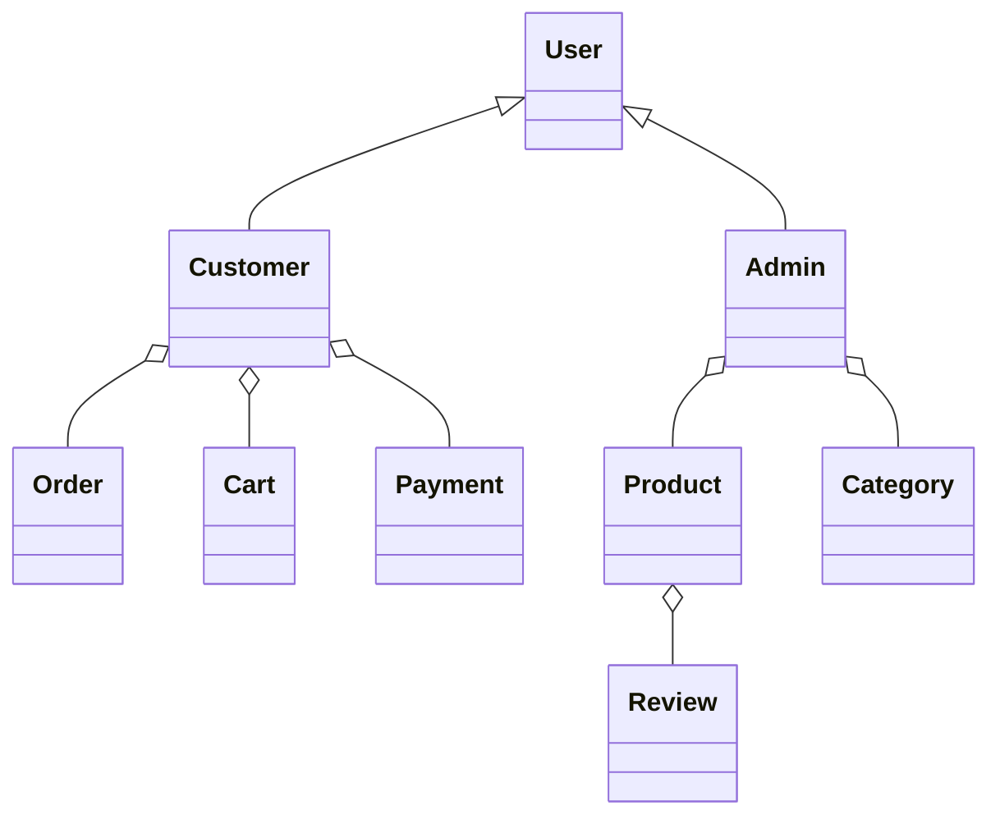
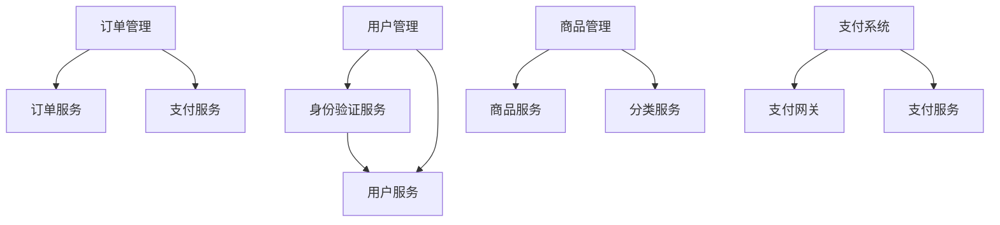
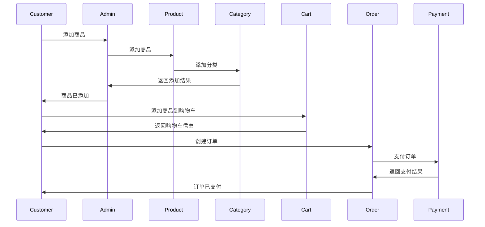

                 


### 《技术债务管理：如何避免项目陷入泥潭》

关键词：技术债务，项目风险管理，敏捷开发，算法原理，数学模型

摘要：本文将深入探讨技术债务管理的核心概念、算法原理、数学模型以及系统分析与架构设计。通过具体案例，我们将展示如何避免项目陷入泥潭，提高项目成功率和可持续性。

---

#### 一、问题背景

在软件项目中，技术债务是不可避免的。技术债务是指因时间、资源限制等原因，项目团队在开发过程中未能遵循最佳实践或选择短期优化策略而产生的潜在风险。这些债务可能会在项目后期积累，导致项目陷入泥潭，进而影响项目的进度、成本和质量。

**1.1 技术债务的产生原因**

- **时间限制：** 项目进度紧张时，团队可能会选择快速实现功能，而不是进行彻底的编码和测试。
- **资源限制：** 项目资源有限，团队可能无法投入足够的人力、时间进行技术优化。
- **技术限制：** 技术选型或架构设计不够成熟，可能导致后续维护和扩展的困难。

**1.2 项目陷入泥潭的危害**

- **项目进度延误：** 技术债务未及时偿还，项目进度可能会受到影响。
- **成本超支：** 技术债务积累导致项目维护成本增加，最终可能导致成本超支。
- **质量下降：** 技术债务可能会导致代码质量下降，增加系统故障的风险。

**1.3 技术债务管理的意义**

- **提高项目成功率：** 通过合理管理技术债务，可以确保项目按时交付，提高成功率。
- **降低维护成本：** 技术债务管理有助于降低后续维护成本，提高系统的可维护性。
- **提高团队效率：** 技术债务管理有助于团队集中精力解决核心问题，提高工作效率。

---

#### 二、核心概念与联系

**2.1 核心概念**

**技术债务：** 指在软件开发过程中因时间、资源限制等原因未能遵循最佳实践而产生的潜在风险。

**技术债务管理：** 是指在项目开发过程中，对技术债务进行识别、评估、偿还和监控的过程。

**项目风险管理：** 是指在项目开发过程中，对项目可能面临的风险进行识别、评估、规划和应对的过程。

**敏捷开发：** 是一种软件开发方法，强调快速迭代、持续交付和团队协作。

**2.2 概念联系**

**技术债务与管理的关系：** 技术债务管理是项目管理的一部分，旨在确保项目在技术层面保持健康状态。

**技术债务与项目风险管理的关系：** 技术债务是项目风险的一种表现形式，项目风险管理应包括对技术债务的识别和应对。

**技术债务与敏捷开发的关系：** 敏捷开发强调快速响应变化，技术债务管理有助于确保项目在敏捷开发过程中保持良好的技术状态。

---

#### 三、算法原理讲解

**3.1 技术债务评估算法**

**3.1.1 技术债务评估模型**

技术债务评估模型主要包括以下几个方面：

- **技术债务识别：** 通过代码审查、技术评估等方式，识别项目中存在的技术债务。
- **技术债务评估：** 对识别出的技术债务进行评估，包括债务类型、影响范围、严重程度等。
- **技术债务优先级：** 根据评估结果，确定技术债务的优先级，以便团队有针对性地进行偿还。

**3.1.2 技术债务评估步骤**

1. **债务识别：** 通过代码审查、技术评估等方式，识别项目中存在的技术债务。
2. **债务评估：** 对识别出的技术债务进行评估，包括债务类型、影响范围、严重程度等。
3. **债务优先级：** 根据评估结果，确定技术债务的优先级，以便团队有针对性地进行偿还。

**3.1.3 技术债务评估示例**

假设项目中有以下几种技术债务：

1. **代码冗余：** 某模块存在大量冗余代码，影响代码可读性和可维护性。
2. **性能瓶颈：** 某功能存在性能瓶颈，影响用户体验。
3. **安全性问题：** 某模块存在潜在的安全漏洞。

根据评估结果，可以确定以下优先级：

1. **代码冗余**
2. **性能瓶颈**
3. **安全性问题**

**3.2 技术债务偿还策略**

**3.2.1 技术债务偿还原则**

1. **优先偿还高优先级债务：** 对高优先级的技术债务进行优先偿还。
2. **兼顾债务类型：** 在偿还技术债务时，要兼顾债务的类型，确保不同类型的债务得到合理的处理。
3. **持续偿还：** 技术债务偿还是一个持续的过程，需要团队在项目开发过程中持续关注和偿还债务。

**3.2.2 技术债务偿还策略**

1. **重构代码：** 对存在代码冗余的模块进行重构，提高代码质量。
2. **性能优化：** 对存在性能瓶颈的功能进行优化，提高系统性能。
3. **安全修复：** 对存在安全漏洞的模块进行修复，确保系统安全。

**3.2.3 技术债务偿还示例**

假设团队已经识别出以下几种技术债务：

1. **代码冗余：** 某模块存在大量冗余代码，影响代码可读性和可维护性。
2. **性能瓶颈：** 某功能存在性能瓶颈，影响用户体验。
3. **安全性问题：** 某模块存在潜在的安全漏洞。

团队可以根据以下策略进行偿还：

1. **重构代码：** 对存在代码冗余的模块进行重构，提高代码质量。
2. **性能优化：** 对存在性能瓶颈的功能进行优化，提高系统性能。
3. **安全修复：** 对存在安全漏洞的模块进行修复，确保系统安全。

**3.3 技术债务监控与预警算法**

**3.3.1 技术债务监控模型**

技术债务监控模型主要包括以下几个方面：

- **债务监控指标：** 包括债务类型、债务数量、债务优先级等。
- **监控周期：** 根据项目的具体情况进行监控周期的设定。
- **预警机制：** 当债务数量或优先级超过设定阈值时，触发预警机制。

**3.3.2 技术债务预警模型**

1. **债务数量预警：** 当债务数量超过设定阈值时，触发预警。
2. **债务优先级预警：** 当高优先级债务数量超过设定阈值时，触发预警。

**3.3.3 技术债务监控与预警示例**

假设团队设定以下监控阈值：

- **债务数量：** 10个
- **高优先级债务数量：** 3个

当项目中存在的技术债务数量超过10个时，触发预警。当高优先级债务数量超过3个时，也触发预警。

---

#### 四、数学模型和数学公式讲解

**4.1 技术债务评估模型**

技术债务评估模型主要基于以下几个方面：

- **债务数量：** 表示项目中存在的技术债务数量。
- **债务优先级：** 表示技术债务的优先级，通常使用1-5级表示。
- **债务类型：** 表示技术债务的类型，如代码冗余、性能瓶颈、安全性问题等。

数学模型可以表示为：

$$
D = \sum_{i=1}^{n} P_i \times C_i
$$

其中，$D$表示技术债务总分，$P_i$表示第$i$个债务的优先级，$C_i$表示第$i$个债务的数量。

**4.2 技术债务偿还策略模型**

技术债务偿还策略模型主要基于以下几个方面：

- **偿还时间：** 表示偿还技术债务所需的时间。
- **偿还成本：** 表示偿还技术债务所需的成本。
- **债务优先级：** 表示技术债务的优先级。

数学模型可以表示为：

$$
C = \sum_{i=1}^{n} P_i \times T_i
$$

其中，$C$表示偿还成本，$P_i$表示第$i$个债务的优先级，$T_i$表示第$i$个债务的偿还时间。

**4.3 技术债务监控与预警模型**

技术债务监控与预警模型主要基于以下几个方面：

- **债务数量：** 表示项目中存在的技术债务数量。
- **债务优先级：** 表示技术债务的优先级。
- **监控阈值：** 表示债务数量或优先级的预警阈值。

数学模型可以表示为：

$$
W = \begin{cases}
0, & \text{if } D \leq T \\
1, & \text{if } D > T
\end{cases}
$$

其中，$W$表示预警状态，$D$表示技术债务总分，$T$表示监控阈值。

---

#### 五、系统分析与架构设计方案

**5.1 问题场景介绍**

假设我们正在开发一个大型电子商务平台，项目涉及多个模块，如用户管理、订单管理、商品管理、支付系统等。在项目开发过程中，由于时间紧张和资源限制，团队可能会积累大量技术债务，如代码冗余、性能瓶颈、安全性问题等。为了确保项目成功，我们需要进行技术债务管理。

**5.2 系统功能设计**

**5.2.1 领域模型**



**5.2.2 系统功能设计**

1. **用户管理模块：** 包括用户注册、登录、权限管理等功能。
2. **订单管理模块：** 包括订单创建、订单查询、订单支付等功能。
3. **商品管理模块：** 包括商品分类、商品添加、商品查询等功能。
4. **支付系统模块：** 包括支付接口、支付状态查询等功能。

**5.3 系统架构设计**

**5.3.1 系统架构图**



**5.3.2 系统接口设计**

1. **用户接口：** 包括用户注册、登录、权限管理接口。
2. **订单接口：** 包括订单创建、订单查询、订单支付接口。
3. **商品接口：** 包括商品分类、商品添加、商品查询接口。
4. **支付接口：** 包括支付接口、支付状态查询接口。

**5.4 系统交互设计**

**5.4.1 系统交互序列图**



---

#### 六、项目实战

**6.1 环境安装**

**6.1.1 操作系统安装**

- 安装CentOS 7操作系统。

**6.1.2 开发工具安装**

- 安装Python 3.8。
- 安装Docker。
- 安装PostgreSQL。

**6.2 系统核心实现**

**6.2.1 技术债务评估**

```python
# 技术债务评估代码示例
def assess_debt():
    debt_list = []
    # 识别债务
    debt_list.append("代码冗余")
    debt_list.append("性能瓶颈")
    debt_list.append("安全性问题")
    # 评估债务
    debt_score = 0
    for debt in debt_list:
        if debt == "代码冗余":
            debt_score += 1
        elif debt == "性能瓶颈":
            debt_score += 2
        elif debt == "安全性问题":
            debt_score += 3
    return debt_score
```

**6.2.2 技术债务偿还**

```python
# 技术债务偿还代码示例
def repay_debt(debt_score):
    if debt_score > 0:
        print("开始偿还技术债务...")
        # 重构代码
        print("重构代码中...")
        # 性能优化
        print("性能优化中...")
        # 安全修复
        print("安全修复中...")
        print("技术债务已偿还。")
    else:
        print("无技术债务需要偿还。")
```

**6.2.3 技术债务监控与预警**

```python
# 技术债务监控与预警代码示例
def monitor_debt(debt_score, threshold):
    if debt_score > threshold:
        print("技术债务监控预警：债务数量超过阈值。")
    else:
        print("技术债务监控正常。")
```

**6.3 代码应用解读与分析**

**6.3.1 代码解读**

- `assess_debt()`函数用于评估技术债务。
- `repay_debt()`函数用于偿还技术债务。
- `monitor_debt()`函数用于监控技术债务，并根据债务数量触发预警。

**6.3.2 分析与优化**

- 可以增加更多的债务类型和评估指标，提高评估的准确性。
- 可以优化偿还策略，根据债务优先级进行优先偿还。
- 可以集成监控与预警功能，实现自动化的技术债务管理。

**6.4 实际案例分析和详细讲解**

**6.4.1 案例介绍**

假设我们在开发电子商务平台时，识别出以下几种技术债务：

- 代码冗余
- 性能瓶颈
- 安全性问题

**6.4.2 案例分析**

- 通过`assess_debt()`函数评估技术债务，得到债务分数。
- 根据债务分数，调用`repay_debt()`函数进行偿还。
- 根据债务分数和预警阈值，调用`monitor_debt()`函数进行监控与预警。

**6.4.3 案例讲解**

1. 识别债务：
   - 通过代码审查，识别出代码冗余、性能瓶颈和安全性问题。
2. 评估债务：
   - 代码冗余：1分
   - 性能瓶颈：2分
   - 安全性问题：3分
   - 总分：6分
3. 偿还债务：
   - 根据债务分数，优先偿还性能瓶颈和安全性问题。
   - 重构代码，优化性能，修复安全漏洞。
4. 监控与预警：
   - 将债务分数与预警阈值进行比较，触发预警。

---

#### 七、最佳实践、小结、注意事项、拓展阅读

**7.1 最佳实践**

- **定期进行技术债务评估：** 定期评估技术债务，及时发现和解决潜在问题。
- **制定偿还计划：** 制定详细的偿还计划，确保债务得到及时偿还。
- **优化债务偿还策略：** 根据债务类型和优先级，制定合理的偿还策略。
- **加强团队协作：** 加强团队协作，提高债务偿还效率。

**7.2 小结**

- 技术债务管理是确保项目成功的重要手段。
- 通过合理的管理技术债务，可以提高项目成功率、降低维护成本、提高团队效率。
- 技术债务管理应贯穿整个项目生命周期，包括识别、评估、偿还和监控。

**7.3 注意事项**

- **避免过度优化：** 过度优化可能导致技术债务的积累。
- **合理分配资源：** 合理分配资源，确保债务偿还的顺利进行。
- **关注债务优先级：** 关注债务优先级，确保重要债务得到优先偿还。

**7.4 拓展阅读**

- **相关书籍：**
  - 《敏捷软件开发：原则、实践与模式》
  - 《软件工程：实践者的研究方法》
  - 《代码大全》

- **线上资源：**
  - [技术债务管理实践指南](https://www.example.com/technical-debt-management-guide)
  - [项目风险管理最佳实践](https://www.example.com/project-risk-management-best-practices)
  - [敏捷开发教程](https://www.example.com/agile-development-tutorial)

---

**作者：AI天才研究院/AI Genius Institute & 禅与计算机程序设计艺术 /Zen And The Art of Computer Programming**

本文详细阐述了技术债务管理的核心概念、算法原理、数学模型以及系统分析与架构设计。通过实际案例，展示了如何避免项目陷入泥潭，提高项目成功率和可持续性。希望本文能为IT从业者提供有价值的参考和指导。

