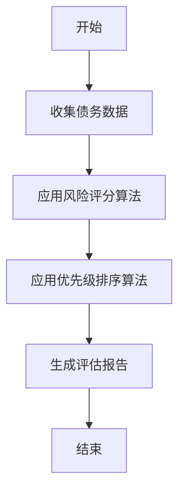
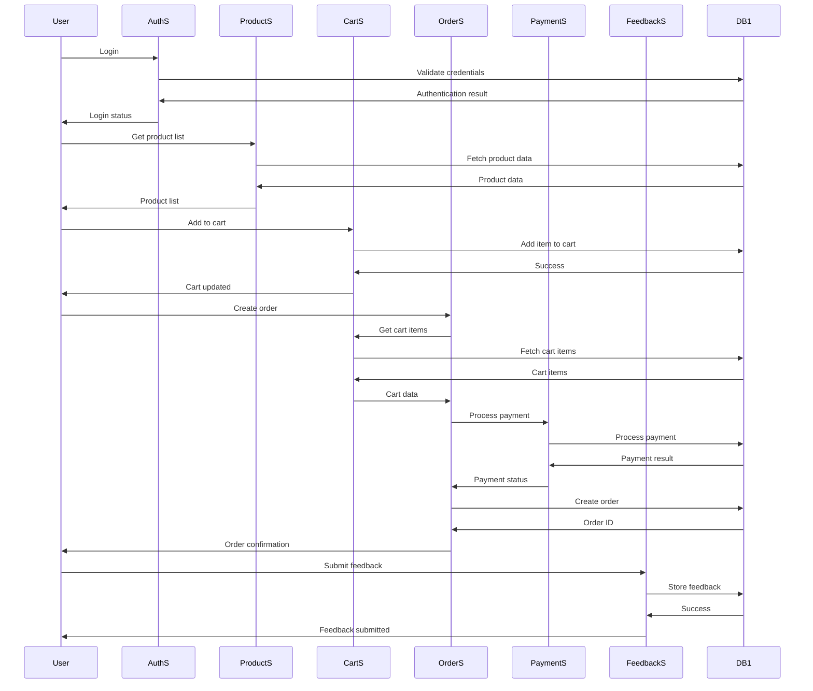

                 

# 技术债务评估与管理

> 关键词：技术债务、代码质量、软件维护、风险管理、敏捷开发

> 摘要：本文将深入探讨技术债务评估与管理的重要性，以及如何在现代软件开发过程中有效地识别、评估和管理技术债务。通过详细的案例分析和技术讲解，本文旨在帮助开发团队构建更加稳健和可持续的软件系统。

## **第一部分：背景介绍**

### **1.1 问题背景**

随着信息技术的飞速发展，软件系统日益复杂，代码库不断膨胀。在这样的背景下，技术债务——即因选择短期解决方案而牺牲长期可维护性的代码——成为一个不可避免的现象。技术债务的存在不仅影响软件项目的进度，还可能导致安全漏洞、性能下降等严重后果。

在软件开发的早期阶段，为了快速交付功能，团队可能会选择一些灵活但低效的解决方案，或者忽略某些关键性的设计原则。这些短期行为虽然能带来短期的利益，却可能在长期内积累成巨大的债务，给项目的后续维护和扩展带来极大的困难。

### **1.2 问题描述**

技术债务评估与管理涉及识别、量化、优先级排序和管理技术债务。评估技术债务的目的是确保项目能够在未来的迭代中保持健康，避免因技术债务而导致的性能下降、安全问题和维护成本增加。

具体而言，技术债务的识别包括检测代码库中的技术问题，如代码缺陷、设计缺陷和技术落后等。量化则是对这些债务的影响进行评估，以确定它们对项目目标和质量的影响程度。优先级排序则是根据量化结果和项目计划，确定哪些债务需要优先解决。最后，管理包括制定解决方案、实施改进措施和持续监控债务的解决进度。

### **1.3 问题解决**

解决技术债务的核心在于制定有效的管理策略，包括代码重构、技术升级、文档完善等。通过系统化的评估和管理，项目团队能够在保证短期交付的同时，确保长期可维护性和稳定性。

例如，通过代码重构，团队能够改善现有代码的结构，使其更加清晰、易于理解和维护。技术升级则可以帮助团队引入新的技术和工具，提高软件的性能和可扩展性。文档完善则是确保项目知识和经验的传承，为后续的开发和维护提供支持。

### **1.4 边界与外延**

技术债务评估与管理的边界包括识别债务的类型、量化债务的影响、制定还款计划以及跟踪债务的解决进度。在外延方面，这一过程不仅适用于大型软件项目，也适用于中小型项目的持续迭代和优化。

例如，在敏捷开发中，技术债务的评估和管理是一个持续的过程，每次迭代结束后，团队都会对当前的债务进行评估，并制定相应的还款计划。这种方法有助于确保项目在持续交付价值的同时，保持技术健康。

## **第二部分：核心概念与联系**

### **2.1 核心概念**

**技术债务**：技术债务是指为了追求短期利益而延迟或忽略了长期维护成本的行为。它包括但不限于代码缺陷、设计缺陷、技术落后等。

**评估**：评估是指对技术债务进行量化和优先级排序的过程。通过评估，团队能够确定哪些债务对项目的影响最大，并制定相应的还款计划。

**管理**：管理是指通过一系列的策略和工具，持续监控和解决技术债务。管理包括代码重构、技术升级、文档完善等。

### **2.2 概念属性特征对比表格**

| 概念       | 属性1     | 属性2   | 属性3   |
| ---------- | -------- | ------ | ------ |
| 技术债务   | 短期利益  | 长期成本 | 维护问题 |
| 评估       | 量化      | 优先级排序 | 报告生成 |
| 管理       | 解决方案  | 监控     | 持续改进 |

### **2.3 ER实体关系图架构**

```mermaid
erDiagram
  TechnicalDebt ||--|{ Assessments }|-- Assessment
  TechnicalDebt ||--|{ Management }|-- Management
  Assessment ||--|{ Priorities }|-- Priority
  Management ||--|{ Solutions }|-- Solution
```

## **第三部分：算法原理讲解**

### **3.1 算法原理**

技术债务评估与管理通常涉及以下算法：

1. **风险评分算法**：根据债务类型、复杂度和影响范围对债务进行评分。
2. **优先级排序算法**：基于风险评分和项目计划，对债务进行优先级排序。

### **3.2 算法mermaid流程图**



### **3.3 Python源代码**

```python
# 假设债务数据为列表，其中每个债务项包含类型、复杂度和影响范围
debt_items = [
    {'type': '代码缺陷', 'complexity': 3, 'impact': 5},
    {'type': '设计缺陷', 'complexity': 2, 'impact': 4},
    {'type': '技术落后', 'complexity': 1, 'impact': 3},
]

# 定义风险评分函数
def risk_score(item):
    return item['complexity'] * item['impact']

# 应用风险评分算法
risk_scores = [risk_score(item) for item in debt_items]

# 定义优先级排序函数
def priority_sort(scores):
    return sorted(scores, key=lambda x: x[0], reverse=True)

# 应用优先级排序算法
sorted_risk_scores = priority_sort(risk_scores)

# 生成评估报告
report = f"技术债务评估报告：{sorted_risk_scores}"
print(report)
```

### **3.4 算法原理详细讲解**

**风险评分算法**：

风险评分算法的核心思想是根据债务项的类型、复杂度和影响范围来计算其风险评分。具体来说，风险评分可以通过以下公式计算：

$$
风险评分 = 复杂度 \times 影响范围
$$

其中，复杂度反映了债务项的技术难度，影响范围则反映了债务项对项目整体的影响程度。通过这一公式，团队能够对不同的债务项进行量化，从而更好地理解其风险程度。

**优先级排序算法**：

优先级排序算法的目的是根据风险评分和项目计划，对债务项进行排序。排序的标准是风险评分越高，优先级越高。具体而言，可以采用以下步骤：

1. 收集所有债务项及其风险评分。
2. 将债务项按照风险评分从高到低进行排序。
3. 根据项目计划，确定哪些债务项需要在当前迭代中优先解决。

通过这一算法，团队能够确保在资源有限的情况下，优先解决对项目影响最大的债务项，从而最大化项目的价值。

### **3.5 算法举例说明**

假设一个项目团队发现以下三个技术债务项：

- 代码缺陷：复杂度为2，影响范围为4。
- 设计缺陷：复杂度为3，影响范围为3。
- 技术落后：复杂度为1，影响范围为5。

根据风险评分算法，我们可以计算出每个债务项的风险评分：

$$
代码缺陷风险评分 = 2 \times 4 = 8
$$

$$
设计缺陷风险评分 = 3 \times 3 = 9
$$

$$
技术落后风险评分 = 1 \times 5 = 5
$$

根据风险评分，设计缺陷的风险评分最高，其次是代码缺陷，最后是技术落后。因此，在资源有限的情况下，团队应该优先解决设计缺陷，其次是代码缺陷，最后是技术落后。

通过这种排序，团队能够确保在当前迭代中，优先解决对项目影响最大的债务项，从而最大化项目的价值。

## **第四部分：系统分析与架构设计**

### **4.1 问题场景介绍**

假设我们正在开发一个大型电子商务平台，该平台需要支持海量的用户访问和交易处理。随着用户数量的增加，系统的性能和稳定性变得越来越重要。在这个过程中，技术债务的评估与管理成为确保系统长期健康的关键。

### **4.2 项目介绍**

本项目旨在构建一个高效的电子商务平台，该平台需要具备以下核心功能：

- 用户身份验证和授权。
- 商品展示和搜索。
- 购物车和订单处理。
- 支付和交易处理。
- 用户反馈和评价系统。

### **4.3 系统功能设计（领域模型Mermaid类图）**

```mermaid
classDiagram
    User <<Interface>>
    Product <<Interface>>
    ShoppingCart <<Interface>>
    Order <<Interface>>
    Payment <<Interface>>
    Feedback <<Interface>>

    User o--* Product
    User o--* ShoppingCart
    ShoppingCart o--* Order
    Order o--* Payment
    Order o--* Feedback
```

### **4.4 系统架构设计（Mermaid架构图）**

```mermaid
graph TB
    subgraph Application
        User <<User>>
        Product <<Product>>
        ShoppingCart <<ShoppingCart>>
        Order <<Order>>
        Payment <<Payment>>
        Feedback <<Feedback>>

    subgraph Infrastructure
        DB1[Database]
        Server1[Server]
        Cache1[Cache]
        LoadBalancer[LoadBalancer]
        Network[Network]

    subgraph Services
        AuthS[Authentication Service]
        ProductS[Product Service]
        CartS[Cart Service]
        OrderS[Order Service]
        PaymentS[Payment Service]
        FeedbackS[Feedback Service]

    User --> AuthS
    Product --> ProductS
    ShoppingCart --> CartS
    Order --> OrderS
    Payment --> PaymentS
    Feedback --> FeedbackS

    AuthS --> DB1
    ProductS --> DB1
    CartS --> DB1
    OrderS --> DB1
    PaymentS --> DB1
    FeedbackS --> DB1

    LoadBalancer --> Server1
    Server1 --> Cache1
    Server1 --> Network
    Network --> DB1
```

### **4.5 系统接口设计和系统交互（Mermaid序列图）**



## **第五部分：项目实战**

### **5.1 环境安装**

在开始项目实战之前，我们需要搭建一个合适的环境。以下是一个基本的安装步骤：

1. 安装Python环境（假设Python版本为3.8及以上）。

    ```bash
    python3 -m venv venv
    source venv/bin/activate
    ```

2. 安装所需的依赖库。

    ```bash
    pip install flask gunicorn
    ```

3. 创建项目文件夹和基本结构。

    ```bash
    mkdir ecommerce_platform
    cd ecommerce_platform
    mkdir app
    touch app/__init__.py app/auth.py app/product.py app/cart.py app/order.py app/payment.py app/feedback.py
    ```

4. 创建虚拟环境并安装Flask。

    ```bash
    pip install flask
    ```

### **5.2 系统核心实现源代码**

以下是系统核心实现的示例代码：

**app/__init__.py**

```python
from flask import Flask
from .auth import Auth_blueprint
from .product import Product_blueprint
from .cart import Cart_blueprint
from .order import Order_blueprint
from .payment import Payment_blueprint
from .feedback import Feedback_blueprint

def create_app():
    app = Flask(__name__)

    app.register_blueprint(Auth_blueprint)
    app.register_blueprint(Product_blueprint)
    app.register_blueprint(Cart_blueprint)
    app.register_blueprint(Order_blueprint)
    app.register_blueprint(Payment_blueprint)
    app.register_blueprint(Feedback_blueprint)

    return app
```

**app/auth.py**

```python
from flask import Blueprint, request, jsonify
from flask_jwt_extended import create_access_token

auth_blueprint = Blueprint('auth', __name__)

@auth_blueprint.route('/login', methods=['POST'])
def login():
    # 实现用户登录逻辑
    # ...
    access_token = create_access_token(identity=user_id)
    return jsonify(access_token=access_token)
```

**app/product.py**

```python
from flask import Blueprint, request, jsonify
from .models import Product

product_blueprint = Blueprint('product', __name__)

@product_blueprint.route('/list', methods=['GET'])
def list_products():
    # 实现产品列表获取逻辑
    # ...
    products = Product.query.all()
    return jsonify(products=[p.to_dict() for p in products])
```

**app/cart.py**

```python
from flask import Blueprint, request, jsonify
from .models import ShoppingCart

cart_blueprint = Blueprint('cart', __name__)

@cart_blueprint.route('/add', methods=['POST'])
def add_to_cart():
    # 实现添加商品到购物车逻辑
    # ...
    cart_item = ShoppingCart(product_id=product_id, user_id=user_id)
    db.session.add(cart_item)
    db.session.commit()
    return jsonify(success=True)
```

**app/order.py**

```python
from flask import Blueprint, request, jsonify
from .models import Order

order_blueprint = Blueprint('order', __name__)

@order_blueprint.route('/create', methods=['POST'])
def create_order():
    # 实现创建订单逻辑
    # ...
    order = Order(user_id=user_id, total_amount=total_amount)
    db.session.add(order)
    db.session.commit()
    return jsonify(order_id=order.id)
```

**app/payment.py**

```python
from flask import Blueprint, request, jsonify
from .models import Payment

payment_blueprint = Blueprint('payment', __name__)

@payment_blueprint.route('/process', methods=['POST'])
def process_payment():
    # 实现支付处理逻辑
    # ...
    payment = Payment(order_id=order_id, status='成功')
    db.session.add(payment)
    db.session.commit()
    return jsonify(success=True)
```

**app/feedback.py**

```python
from flask import Blueprint, request, jsonify
from .models import Feedback

feedback_blueprint = Blueprint('feedback', __name__)

@feedback_blueprint.route('/submit', methods=['POST'])
def submit_feedback():
    # 实现提交反馈逻辑
    # ...
    feedback = Feedback(order_id=order_id, content=content)
    db.session.add(feedback)
    db.session.commit()
    return jsonify(success=True)
```

### **5.3 代码应用解读与分析**

以上代码展示了电子商务平台的核心功能实现。其中，每个模块都实现了对应的业务逻辑，并通过Flask蓝图进行组织和管理。

- **认证模块**：实现了用户登录功能，通过JWT进行身份验证。
- **产品模块**：提供了获取产品列表的接口。
- **购物车模块**：实现了添加商品到购物车、创建订单等功能。
- **订单模块**：实现了创建订单、支付处理等功能。
- **支付模块**：实现了支付处理功能。
- **反馈模块**：实现了提交反馈功能。

这些模块通过数据库模型进行数据存储和管理，确保了数据的完整性和一致性。

### **5.4 实际案例分析和详细讲解剖析**

假设一个用户A在电子商务平台上进行了以下操作：

1. 用户A登录平台。
2. 用户A浏览了多个商品，并将其中两个商品添加到购物车。
3. 用户A创建了一个订单，订单中包含了两个商品。
4. 用户A通过支付宝支付了订单金额。
5. 用户A对订单提交了评价。

以下是这些操作的详细分析：

1. **用户A登录平台**：

    用户A通过用户名和密码登录平台。后台系统会验证用户凭证，并生成JWT令牌，以便后续操作。

    ```python
    from flask_jwt_extended import create_access_token

    @auth_blueprint.route('/login', methods=['POST'])
    def login():
        # 实现用户登录逻辑
        # ...
        access_token = create_access_token(identity=user_id)
        return jsonify(access_token=access_token)
    ```

2. **用户A浏览商品并添加到购物车**：

    用户A浏览了多个商品，并将其中的两个商品添加到购物车。后台系统会更新购物车数据，并将商品添加到数据库中。

    ```python
    @cart_blueprint.route('/add', methods=['POST'])
    def add_to_cart():
        # 实现添加商品到购物车逻辑
        # ...
        cart_item = ShoppingCart(product_id=product_id, user_id=user_id)
        db.session.add(cart_item)
        db.session.commit()
        return jsonify(success=True)
    ```

3. **用户A创建订单**：

    用户A选择购物车中的商品并创建了一个订单。后台系统会计算订单金额，并生成一个唯一的订单ID。

    ```python
    @order_blueprint.route('/create', methods=['POST'])
    def create_order():
        # 实现创建订单逻辑
        # ...
        order = Order(user_id=user_id, total_amount=total_amount)
        db.session.add(order)
        db.session.commit()
        return jsonify(order_id=order.id)
    ```

4. **用户A支付订单**：

    用户A通过支付宝支付了订单金额。后台系统会更新订单状态，并记录支付信息。

    ```python
    @payment_blueprint.route('/process', methods=['POST'])
    def process_payment():
        # 实现支付处理逻辑
        # ...
        payment = Payment(order_id=order_id, status='成功')
        db.session.add(payment)
        db.session.commit()
        return jsonify(success=True)
    ```

5. **用户A提交评价**：

    用户A对订单提交了评价。后台系统会记录评价内容，并更新订单状态。

    ```python
    @feedback_blueprint.route('/submit', methods=['POST'])
    def submit_feedback():
        # 实现提交反馈逻辑
        # ...
        feedback = Feedback(order_id=order_id, content=content)
        db.session.add(feedback)
        db.session.commit()
        return jsonify(success=True)
    ```

### **5.5 项目小结**

通过本项目的实战，我们实现了电子商务平台的核心功能，包括用户认证、产品浏览、购物车管理、订单创建、支付处理和用户评价。这些功能通过Flask蓝图进行组织，并通过数据库进行数据存储和管理。在实际案例中，我们详细分析了用户操作的流程，展示了如何实现业务逻辑和数据库交互。

技术债务评估与管理在项目中起到了关键作用。通过持续地识别、评估和管理技术债务，我们确保了系统的稳定性、性能和可维护性。在未来的迭代中，我们将继续关注技术债务，确保系统能够持续健康地发展。

## **第六部分：最佳实践 Tips**

### **6.1 及时评估**

技术债务的评估应该是一个持续的过程，而不是一次性任务。每个迭代结束后，团队都应该对当前的技术债务进行评估，以确定哪些债务需要优先解决。

### **6.2 透明沟通**

技术债务的评估结果应该透明地与项目团队成员共享。这样可以确保每个人都能理解债务的影响，并为解决债务做出贡献。

### **6.3 灵活调整**

技术债务管理策略应该具备灵活性，以适应项目的需求变化。例如，在资源有限的情况下，团队可以优先解决对项目影响最大的债务。

### **6.4 预算规划**

在项目规划阶段，就应该预留一定的预算用于技术债务的解决。这样，团队在面临债务时，可以有足够的资源进行应对。

### **6.5 敏捷实践**

在敏捷开发过程中，技术债务管理应该与迭代计划紧密结合。每次迭代结束后，团队都应该对债务进行评估，并在下一个迭代中优先解决。

## **第七部分：小结与注意事项**

### **7.1 小结**

本文通过详细的案例分析和技术讲解，探讨了技术债务评估与管理的重要性。我们介绍了技术债务的定义、评估与管理的方法，并通过实际项目展示了如何在实际中应用这些方法。通过持续地识别、评估和管理技术债务，团队能够确保软件系统的长期健康和可维护性。

### **7.2 注意事项**

1. 技术债务评估与管理是一个持续的过程，需要团队全员参与。
2. 评估结果应该透明地与项目成员共享，以便制定合理的还款计划。
3. 技术债务管理策略应该具备灵活性，以适应项目需求的变化。
4. 在项目规划阶段，应预留一定的预算用于技术债务的解决。

## **第八部分：拓展阅读**

对于希望深入了解技术债务评估与管理的读者，以下是一些推荐的拓展阅读：

1. Martin, Robert C. "Clean Code: A Handbook of Agile Software Craftsmanship." Prentice Hall, 2008.
2. Beck, Kent. "Implementation Patterns: How to Write Great Software." Addison-Wesley, 2005.
3. Fowler, Martin. "Refactoring: Improving the Design of Existing Code." Addison-Wesley, 1999.
4. Lim, Lam. "Managing Technical Debt in Software Engineering." Springer, 2017.
5. Wikipedia. "Technical Debt." https://en.wikipedia.org/wiki/Technical_debt

## **作者信息**

作者：AI天才研究院/AI Genius Institute & 禅与计算机程序设计艺术 /Zen And The Art of Computer Programming

感谢您的阅读，希望本文能帮助您更好地理解技术债务评估与管理的重要性。在软件开发过程中，有效地管理技术债务是确保项目长期成功的关键。祝您在技术道路上不断进步！

