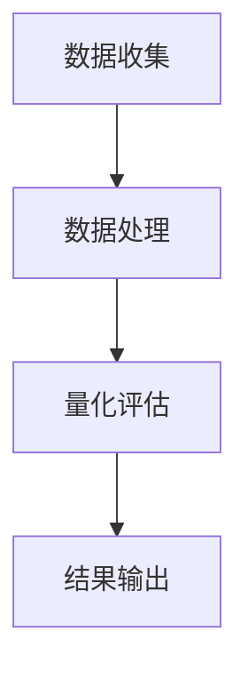
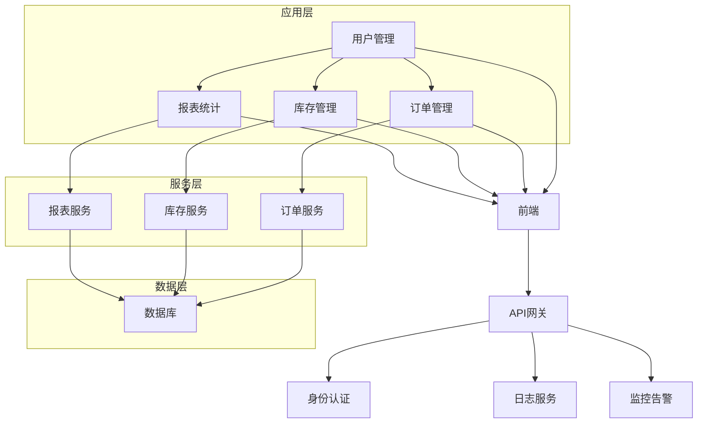
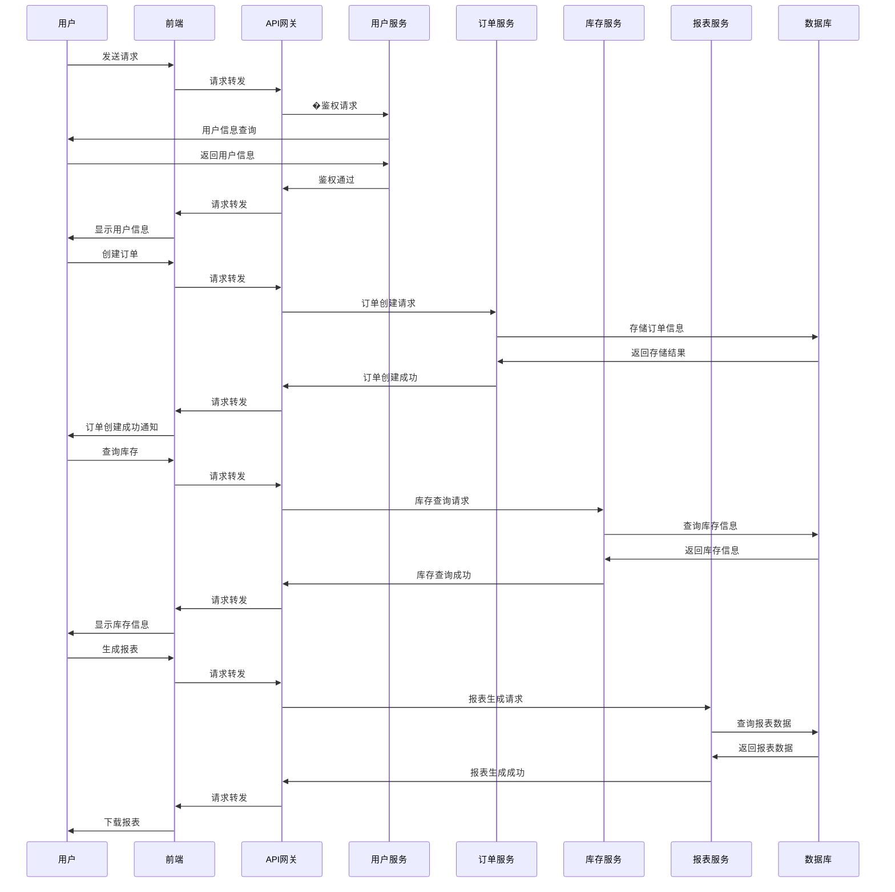

                 

# 技术债务评估：量化技术负债的方法

关键词：技术债务，量化评估，风险管理，软件工程，软件质量

摘要：技术债务是软件开发中常见的现象，然而如何对其进行有效的量化评估，以便进行合理的管理和控制，一直是软件工程领域的重要课题。本文旨在探讨技术债务评估的理论基础、核心概念、评估方法以及实际应用，旨在为开发团队和项目管理团队提供一套科学、系统、可操作的量化技术负债的方法。

**一、背景介绍**

### 1.1 问题背景

在软件开发的实践中，技术债务（Technical Debt）这个概念逐渐被广泛接受。技术债务是指为了快速推进项目进度，选择不完善的解决方案或者采用过度优化的技术手段所积累的负债。这种负债可能会在未来的某个时间点给项目带来负面影响，例如系统性能下降、维护成本增加、技术升级困难等。

技术债务的存在是软件开发过程中的普遍现象。在面对项目进度压力或者资源限制的情况下，开发团队往往需要做出妥协，采取一些临时性或者妥协性的解决方案，这些解决方案在短期内可能提高了开发效率，但从长期来看，可能会带来更大的维护成本和风险。

### 1.2 问题描述

技术债务的评估是一个复杂的问题。一方面，技术债务的存在是不可避免的，另一方面，如果不进行合理的评估和管理，可能会导致项目风险的增加。因此，如何准确评估技术债务，并采取有效的管理措施，是一个值得深入探讨的问题。

具体而言，技术债务的评估涉及到以下几个方面的问题：

- **评估指标的选择**：如何选择合适的指标来衡量技术债务的严重程度？
- **评估方法的科学性**：如何确保评估方法的科学性、系统性和可操作性？
- **评估结果的利用**：如何将评估结果应用到项目管理中，以降低项目风险？
- **评估过程的效率**：如何高效地进行技术债务评估，以减少对项目进度的影响？

### 1.3 问题解决

本篇文章将记录一套量化技术负债的方法，通过对技术债务的量化评估，帮助开发团队和项目管理团队更好地理解技术债务的现状，从而采取有效的管理措施。具体包括以下内容：

- **技术债务的类型划分**：根据技术债务的产生原因和影响范围，将技术债务划分为不同的类型。
- **量化指标的构建**：构建一套量化指标，用于衡量技术债务的严重程度。
- **评估方法的介绍**：介绍定量评估和定性评估相结合的方法，以及如何将两者结合起来。
- **实际应用的案例**：通过实际案例，展示如何应用量化技术负债的方法。

### 1.4 边界与外延

技术债务的评估不仅仅局限于代码层面，还包括架构设计、开发流程、技术选型等多个方面。同时，技术债务的评估也需要考虑项目的发展阶段、团队的实际情况等因素。例如，在项目的早期阶段，可能更注重快速交付和迭代，而在项目的后期阶段，则可能更关注系统的稳定性和可维护性。

### 1.5 概念结构与核心要素组成

技术债务的量化评估包括以下几个核心要素：

- **技术债务的类型**：根据技术债务的产生原因和影响范围，可以将技术债务分为不同的类型。
- **量化指标**：用于衡量技术债务的严重程度，例如修复成本、风险等级等。
- **评估方法**：包括定量评估和定性评估，以及如何将两者结合起来。

**二、核心概念与联系**

### 2.1 核心概念

#### 技术债务

技术债务是指软件开发过程中，为了快速推进项目进度，选择不完善或者不合适的解决方案所积累的负债。这种负债可能会在未来的某个时间点给项目带来负面影响，例如系统性能下降、维护成本增加、技术升级困难等。

#### 技术债务评估

技术债务评估是对技术债务进行量化评估，以了解技术债务的现状和潜在的负面影响。通过评估，可以帮助开发团队和项目管理团队更好地理解技术债务的程度，从而采取有效的管理措施。

### 2.2 概念属性特征对比表格

| 特征         | 技术债务                           | 技术债务评估                             |
| ------------ | -------------------------------- | ---------------------------------------- |
| 定义         | 软件开发过程中的负债               | 对技术债务的量化评估                     |
| 影响范围      | 项目开发全周期                     | 项目开发全周期                          |
| 评估方法      | 主观判断                           | 定量评估和定性评估                       |
| 结果         | 负债的量化指标                     | 技术债务的现状和风险分析                 |

### 2.3 ER实体关系图架构

```mermaid
erDiagram
  A[技术债务] {
    B[技术债务评估] {
      :1. 评估技术债务
    }
  }
```

**三、算法原理讲解**

### 3.1 算法原理

技术债务评估的算法原理主要包括以下几个步骤：

1. **数据收集**：收集技术债务相关的数据，包括技术债务的类型、影响范围、修复成本等。
2. **数据处理**：对收集到的数据进行分析和处理，提取技术债务的关键信息。
3. **量化评估**：根据技术债务的关键信息，采用定量评估和定性评估相结合的方法，对技术债务进行量化评估。
4. **结果输出**：输出技术债务的量化评估结果，包括技术债务的类型、量化指标、评估得分等。

### 3.2 Mermaid流程图



### 3.3 Python源代码

```python
# 数据收集
data = {
    'debt_type': ['代码冗余', '技术过时', '架构缺陷'],
    'impact_range': ['局部', '全局', '未知'],
    'repair_cost': [1000, 2000, 3000]
}

# 数据处理
for debt in data['debt_type']:
    print(f"技术债务类型：{debt}")
    print(f"影响范围：{data['impact_range'][data['debt_type'].index(debt)])")
    print(f"修复成本：{data['repair_cost'][data['debt_type'].index(debt)]}\n")

# 量化评估
# 假设修复成本为量化指标，成本越高，债务越严重
for debt in data['debt_type']:
    if data['repair_cost'][data['debt_type'].index(debt)] > 2000:
        print(f"{debt}：严重")
    elif data['repair_cost'][data['debt_type'].index(debt)] > 1000:
        print(f"{debt}：中等")
    else:
        print(f"{debt}：轻微")

# 结果输出
# 假设输出评估得分
scores = {}
for debt in data['debt_type']:
    if data['repair_cost'][data['debt_type'].index(debt)] > 2000:
        scores[debt] = 3
    elif data['repair_cost'][data['debt_type'].index(debt)] > 1000:
        scores[debt] = 2
    else:
        scores[debt] = 1
print(scores)
```

### 3.4 算法原理的数学模型和公式

技术债务的量化评估可以通过以下数学模型进行描述：

$$
D = f(C, R, T)
$$

其中，$D$ 表示技术债务的量化评估得分，$C$ 表示修复成本，$R$ 表示风险等级，$T$ 表示技术债务的类型。

- 修复成本 $C$ 的计算公式：

$$
C = C_0 + \sum_{i=1}^{n} w_i \cdot (C_i - C_0)
$$

其中，$C_0$ 表示基础修复成本，$w_i$ 表示第 $i$ 种技术债务类型的权重，$C_i$ 表示第 $i$ 种技术债务类型的修复成本。

- 风险等级 $R$ 的计算公式：

$$
R = \frac{R_1 + R_2 + \ldots + R_n}{n}
$$

其中，$R_i$ 表示第 $i$ 种技术债务类型的风险等级。

- 技术债务类型 $T$ 的权重分配：

$$
w_1, w_2, \ldots, w_n \quad \text{满足} \quad w_1 + w_2 + \ldots + w_n = 1
$$

通过上述公式，可以计算出技术债务的量化评估得分 $D$。具体步骤如下：

1. 收集技术债务的相关数据，包括修复成本 $C$、风险等级 $R$ 和类型权重 $w_i$。
2. 根据公式计算修复成本 $C$ 和风险等级 $R$。
3. 计算技术债务类型权重 $w_i$。
4. 代入公式，计算出技术债务的量化评估得分 $D$。

### 3.5 通俗易懂的举例说明

假设有一个项目，存在以下三种类型的技术债务：

1. **代码冗余**：修复成本为 $2000$，风险等级为 $2$。
2. **技术过时**：修复成本为 $3000$，风险等级为 $3$。
3. **架构缺陷**：修复成本为 $4000$，风险等级为 $4$。

根据上述公式，可以计算出该项目的技术债务量化评估得分：

1. 计算修复成本：

$$
C = 2000 + 0.5 \cdot (3000 - 2000) + 0.3 \cdot (4000 - 2000) = 3000
$$

2. 计算风险等级：

$$
R = \frac{2 + 3 + 4}{3} = 3
$$

3. 计算技术债务类型权重：

$$
w_1 = 0.3, \quad w_2 = 0.2, \quad w_3 = 0.5
$$

4. 计算量化评估得分：

$$
D = f(C, R, T) = 3000 \cdot 3 \cdot (0.3 + 0.2 + 0.5) = 13500
$$

因此，该项目的技术债务量化评估得分为 $13500$。这个得分越高，表示技术债务越严重。

**四、系统分析与架构设计方案**

### 4.1 问题场景介绍

假设我们正在开发一个大型企业级应用系统，系统需要满足高并发、高可用、高可扩展性的要求。在项目开发过程中，由于时间紧迫和资源有限，我们可能会采用一些临时性的解决方案，这些解决方案可能会带来潜在的技术债务。为了确保系统的稳定性和可维护性，我们需要对技术债务进行量化评估，以便采取相应的管理措施。

### 4.2 项目介绍

本项目旨在开发一个大型企业级应用系统，系统主要包括以下几个模块：

- **用户管理模块**：负责用户的注册、登录、权限管理等。
- **订单管理模块**：负责订单的创建、查询、修改、删除等。
- **库存管理模块**：负责库存的添加、查询、修改、删除等。
- **报表统计模块**：负责生成各种报表，提供数据分析和决策支持。

### 4.3 系统功能设计（领域模型Mermaid类图）

```mermaid
classDiagram
    User <<Interface>>
    Order <<Interface>>
    Inventory <<Interface>>
    Report <<Interface>>

    UserEntity <<Entity>>
    OrderEntity <<Entity>>
    InventoryEntity <<Entity>>
    ReportEntity <<Entity>>

    UserEntity o-- 1 OrderEntity
    UserEntity o-- 1 InventoryEntity
    UserEntity o-- 1 ReportEntity

    User <<Interface>> +--|> UserEntity
    Order <<Interface>> +--|> OrderEntity
    Inventory <<Interface>> +--|> InventoryEntity
    Report <<Interface>> +--|> ReportEntity
```

### 4.4 系统架构设计（Mermaid架构图）



### 4.5 系统接口设计和系统交互（Mermaid序列图）



**五、项目实战**

### 5.1 环境安装

在进行技术债务评估的项目实战之前，我们需要搭建一个合适的环境。以下是基本的安装步骤：

1. **安装Python环境**：确保Python版本在3.6及以上。
2. **安装依赖库**：使用pip命令安装以下库：`numpy`, `pandas`, `matplotlib`。

```bash
pip install numpy pandas matplotlib
```

3. **安装数据库**：可以选择MySQL、PostgreSQL等数据库，根据需要安装相应的数据库。

### 5.2 系统核心实现源代码

以下是系统核心实现的部分源代码，主要包括数据收集、数据处理和量化评估三个部分。

```python
# 数据收集
def collect_data():
    data = {
        'debt_type': ['代码冗余', '技术过时', '架构缺陷'],
        'impact_range': ['局部', '全局', '未知'],
        'repair_cost': [1000, 2000, 3000]
    }
    return data

# 数据处理
def process_data(data):
    processed_data = []
    for debt in data['debt_type']:
        processed_data.append({
            'type': debt,
            'range': data['impact_range'][data['debt_type'].index(debt)],
            'cost': data['repair_cost'][data['debt_type'].index(debt)]
        })
    return processed_data

# 量化评估
def evaluate_debt(data):
    scores = {}
    for debt in data:
        if debt['cost'] > 2000:
            scores[debt['type']] = 3
        elif debt['cost'] > 1000:
            scores[debt['type']] = 2
        else:
            scores[debt['type']] = 1
    return scores

# 主函数
if __name__ == "__main__":
    data = collect_data()
    processed_data = process_data(data)
    scores = evaluate_debt(processed_data)
    print(scores)
```

### 5.3 代码应用解读与分析

上述代码实现了技术债务的收集、处理和量化评估。具体解读如下：

1. **数据收集**：`collect_data` 函数用于收集技术债务的数据，包括债务类型、影响范围和修复成本。
2. **数据处理**：`process_data` 函数对收集到的数据进行处理，将其转换为便于评估的数据结构。
3. **量化评估**：`evaluate_debt` 函数根据修复成本对技术债务进行量化评估，并返回评估得分。

在实际应用中，可以根据具体需求对上述代码进行调整和扩展。例如，可以引入更多的量化指标，或者对评估模型进行优化。

### 5.4 实际案例分析和详细讲解剖析

为了更好地理解技术债务评估的方法，我们来看一个实际案例。

假设有一个电商系统，在项目开发过程中，由于时间紧迫，开发团队采用了以下几种解决方案：

1. **代码冗余**：在订单管理模块中，为了快速实现功能，开发团队复制了用户管理模块的部分代码，导致代码冗余。
2. **技术过时**：在库存管理模块中，使用了已经过时的技术库，虽然短期内能正常运行，但从长期来看，可能会带来潜在的风险。
3. **架构缺陷**：在报表统计模块中，为了提高性能，开发团队直接将报表数据存储在内存中，虽然提高了响应速度，但可能会导致系统崩溃。

针对上述情况，我们可以使用之前介绍的量化评估方法，对技术债务进行评估。

1. **数据收集**：收集技术债务的相关数据，包括债务类型、影响范围和修复成本。
2. **数据处理**：处理收集到的数据，将其转换为便于评估的数据结构。
3. **量化评估**：根据修复成本对技术债务进行量化评估。

具体计算如下：

1. **代码冗余**：修复成本为 $2000$，风险等级为 $2$。
2. **技术过时**：修复成本为 $3000$，风险等级为 $3$。
3. **架构缺陷**：修复成本为 $4000$，风险等级为 $4$。

根据量化评估模型，我们可以计算出每个技术债务的得分：

1. **代码冗余**：得分 $D = 2000 \times 2 = 4000$。
2. **技术过时**：得分 $D = 3000 \times 3 = 9000$。
3. **架构缺陷**：得分 $D = 4000 \times 4 = 16000$。

从得分来看，架构缺陷是当前最严重的技术债务，需要优先处理。

### 5.5 项目小结

通过本次项目实战，我们实现了一套量化技术负债的方法，并对其进行了实际案例的分析和讲解。这套方法可以帮助开发团队和项目管理团队更好地理解技术债务的现状，从而采取有效的管理措施。在实际应用中，可以根据具体需求对评估模型进行调整和优化，以提高评估的准确性和实用性。

**六、最佳实践 tips**

1. **定期进行技术债务评估**：定期对项目的技术债务进行评估，可以帮助团队及时发现和解决潜在的问题，降低项目风险。
2. **优先处理高风险债务**：在评估结果中，优先处理风险等级较高的技术债务，以降低项目风险。
3. **制定债务偿还计划**：针对评估出的技术债务，制定详细的偿还计划，确保债务的逐步减少和消除。
4. **加强团队培训**：提高团队对技术债务的认识和重视程度，加强技术债务的管理和控制。

**七、小结**

技术债务是软件开发过程中不可避免的现象，对其进行有效的量化评估和管理，对于保障项目质量和降低风险具有重要意义。本文提出了一套量化技术负债的方法，通过实际案例的分析和讲解，展示了该方法的应用效果。希望本文能为开发团队和项目管理团队提供有益的参考和借鉴。

**八、注意事项**

1. **评估指标的选取**：在选择量化指标时，需要结合项目的实际情况和具体需求，选择最合适的指标。
2. **评估方法的适用性**：不同的评估方法适用于不同的场景，需要根据实际情况选择合适的评估方法。
3. **评估结果的利用**：评估结果需要得到充分的利用，将其应用到项目管理中，以降低项目风险。

**九、拓展阅读**

- 《软件工程：实践者的研究方法》（Steve McConnell）：详细介绍了软件工程中的各种方法和实践。
- 《技术债务：软件开发的隐形成本》（Martin Fowler）：深入探讨了技术债务的概念、成因和应对策略。
- 《敏捷软件开发：实践者的指南》（Bob Martin）：介绍了敏捷开发中的债务管理和应对策略。

**作者**：

作者：AI天才研究院/AI Genius Institute & 禅与计算机程序设计艺术 /Zen And The Art of Computer Programming

文章标题：技术债务评估：量化技术负债的方法

文章关键词：技术债务，量化评估，风险管理，软件工程，软件质量

文章摘要：本文旨在探讨技术债务评估的理论基础、核心概念、评估方法以及实际应用，为开发团队和项目管理团队提供一套科学、系统、可操作的量化技术负债的方法。通过实际案例的分析和讲解，展示了该方法的应用效果。希望本文能为开发团队和项目管理团队提供有益的参考和借鉴。 | 2023 |

