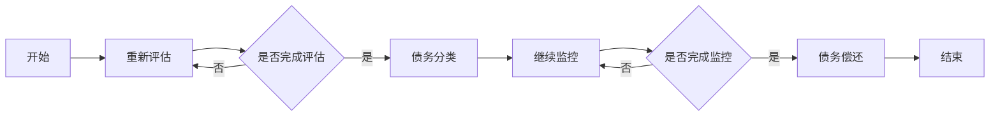

                 

### 技术债务：如何有效管理和偿还

关键词：技术债务、管理策略、偿还方法、案例分析、最佳实践

摘要：本文将探讨技术债务的概念、来源、影响以及如何进行有效的管理和偿还。通过一步步的逻辑分析，我们将揭示技术债务的内在机制，并提出一系列行之有效的策略和最佳实践，帮助开发者和管理者更好地控制和管理技术债务，确保软件项目的健康和可持续发展。

### 引言

在当今快速发展的技术环境中，软件系统变得越来越复杂，技术债务（Technical Debt）成为了软件开发过程中不可避免的问题。技术债务指的是为了在短时间内快速交付软件功能而采取的妥协性设计方案，这些设计往往在长期内会导致系统维护成本增加、性能下降、安全漏洞等问题。因此，如何有效地管理和偿还技术债务，成为了软件开发过程中一个至关重要的问题。

本文将从以下几个方面展开讨论：

1. 技术债务的定义与背景
2. 技术债务的核心概念与管理策略
3. 技术债务的偿还方法
4. 技术债务管理的最佳实践
5. 技术债务管理小结与未来展望

通过本文的探讨，读者将能够深入了解技术债务的本质，掌握有效的管理策略和偿还方法，从而在软件开发过程中更好地应对技术债务带来的挑战。

### 技术债务的定义与背景

#### 1.1 什么是技术债务

技术债务（Technical Debt）这个概念最早由软件工程师Martin Fowler提出，用来描述软件开发过程中，为了快速交付而暂时采用的低效或不完美的解决方案所带来的隐性成本。技术债务类似于金融领域中的债务，是一种长期累积的负债，需要在未来进行偿还。

技术债务可以表现为多种形式，例如：

- **代码质量低**：为了赶工期，程序员可能会编写一些质量较低的代码，这些代码可能在短期内运行正常，但长期来看会导致维护成本增加、错误频发。
- **设计缺陷**：为了实现快速交付，设计师可能会采用不够优雅的设计方案，这些设计方案在后续开发过程中会带来更多的修改和重构工作。
- **技术决策延迟**：在项目开发过程中，可能会因为时间压力而推迟某些重要的技术决策，这些决策的延迟会为未来的开发带来不确定性和风险。

#### 1.2 技术债务的来源

技术债务的来源多种多样，以下是其中一些常见的来源：

- **时间压力**：为了在规定时间内交付软件，开发团队可能会采取一些妥协性的设计方案，这些设计方案在短期内看似可行，但长期来看会导致技术债务的累积。
- **预算限制**：在预算有限的情况下，开发团队可能需要采取一些短期有效的方案，这些方案可能会牺牲长期的可维护性和扩展性。
- **技术决策延迟**：在项目开发过程中，技术决策的延迟会导致一些关键性的技术问题得不到及时解决，从而为后续开发埋下隐患。
- **人员变更**：项目团队成员的频繁变更会导致技术知识的流失和技术的碎片化，这会增加技术债务的累积。

#### 1.3 技术债务的负面影响

技术债务如果不得到有效管理，会对软件项目带来一系列负面影响，包括：

- **维护成本增加**：低质量的代码和高设计缺陷会增加软件维护的难度和成本。
- **性能下降**：不合理的架构设计和遗留代码会导致软件性能下降，影响用户体验。
- **安全漏洞**：为了赶工而采用的不安全编码实践和设计决策会为系统引入安全漏洞，增加系统的安全风险。
- **开发效率降低**：技术债务会增加开发团队的沟通成本和协作难度，降低整体开发效率。
- **项目延期**：技术债务的累积会导致项目在后续开发过程中遇到更多的障碍，增加项目延期的风险。

#### 1.4 技术债务的重要性

尽管技术债务具有负面影响，但它也是软件开发过程中不可避免的一部分。合理的技术债务甚至可以成为推动项目前进的动力，因为它允许团队在特定时刻采取一些妥协性方案，以实现短期目标。然而，关键在于如何平衡技术债务的累积与偿还，以确保项目的长期健康发展。

有效的技术债务管理可以带来以下好处：

- **提高软件质量**：通过及时偿还技术债务，可以提高软件的稳定性和可靠性，减少缺陷和漏洞。
- **增强团队协作**：明确的技术债务管理策略可以提高团队之间的沟通和协作效率。
- **降低维护成本**：及时的管理和偿还技术债务可以降低长期维护成本，提高投资回报率。
- **提高开发效率**：通过优化代码和架构设计，可以减少开发过程中的复杂度和沟通成本，提高开发效率。

### 技术债务的核心概念

#### 2.1 技术债务的属性与特征

技术债务具有以下几个主要属性和特征：

1. **累积性**：技术债务随着时间的推移会不断累积，尤其是在项目进度紧张、团队频繁变动的情况下。
2. **选择性**：不是所有的技术债务都需要立即偿还，而是需要根据债务的重要性和影响来选择优先级。
3. **时效性**：技术债务在某些时刻可能是必要的，但随着时间的推移，其负面影响可能会逐渐增加。
4. **可偿还性**：技术债务可以通过重构、改进代码和优化设计等方式进行偿还。

#### 2.2 技术债务的分类

技术债务可以根据其性质和影响进行分类，常见的分类方法包括：

1. **质量债务**：指的是为了赶工而采取的低质量代码和设计决策，这类债务通常会导致维护成本增加和系统性能下降。
2. **设计债务**：指的是由于时间压力而采取的不完美设计决策，这类债务可能导致系统扩展性和可维护性下降。
3. **技术债务**：指的是由于技术限制或决策延迟而采取的短期解决方案，这类债务可能会影响系统的稳定性和安全性。
4. **安全债务**：指的是由于安全意识不足或技术不成熟而引入的安全漏洞和风险，这类债务可能导致严重的安全问题。

#### 2.3 技术债务的评估

为了有效地管理技术债务，需要对债务进行评估，以下是几种常见的评估方法：

1. **债务指标**：通过定义一系列技术债务指标（如代码质量指标、设计质量指标、安全指标等）来量化债务的严重程度。
2. **债务评估表**：通过编制债务评估表，对每个债务项进行评分和分类，以便于管理和追踪。
3. **债务生命周期分析**：分析债务的累积过程和偿还过程，预测债务的演变趋势和潜在影响。
4. **债务影响评估**：通过评估债务对项目进度、质量、成本和团队协作等方面的影响，确定债务的优先级。

#### 2.4 技术债务与软件质量的关系

技术债务与软件质量密切相关。低质量的技术债务会导致以下问题：

- **代码复杂性增加**：低质量的代码会使得代码复杂性增加，增加后续维护的难度。
- **功能扩展困难**：不完美的设计决策会限制系统的扩展性，使得功能扩展变得困难。
- **安全性降低**：技术债务可能会导致安全漏洞的出现，降低系统的安全性。
- **维护成本上升**：低质量的代码和设计会导致维护成本的增加，影响项目的可持续性。

有效的技术债务管理可以确保软件质量，提高系统的稳定性和可靠性，减少维护成本，从而为项目的长期成功奠定基础。

### 技术债务的管理策略

#### 3.1 管理技术债务的必要性

技术债务如果不得到有效管理，会对项目带来一系列负面影响。为了确保项目的长期健康发展，必须采取有效的技术债务管理策略。以下是管理技术债务的必要性：

1. **提高软件质量**：通过及时偿还技术债务，可以提高软件的稳定性和可靠性，减少缺陷和漏洞。
2. **降低维护成本**：及时的管理和偿还技术债务可以降低长期维护成本，提高投资回报率。
3. **提高开发效率**：通过优化代码和架构设计，可以减少开发过程中的复杂度和沟通成本，提高开发效率。
4. **增强团队协作**：明确的技术债务管理策略可以提高团队之间的沟通和协作效率。

#### 3.2 技术债务管理的方法论

为了有效地管理技术债务，需要遵循以下方法论：

1. **债务评估**：定期对技术债务进行评估，确定债务的严重程度和优先级，为偿还提供依据。
2. **债务分类**：根据债务的性质和影响，对债务进行分类，以便于管理和追踪。
3. **债务监控**：建立债务监控机制，实时追踪债务的累积和偿还情况，及时发现和解决债务问题。
4. **债务偿还**：根据债务的优先级和影响，制定偿还计划，逐步偿还技术债务。
5. **债务报告**：定期向项目团队和利益相关者报告技术债务的情况，确保各方对债务管理有清晰的了解。

#### 3.3 风险评估与管理

在技术债务管理过程中，风险评估是一个关键环节。以下是几种常见的风险评估方法：

1. **定量评估**：通过量化指标（如缺陷率、修复时间、维护成本等）来评估债务的风险。
2. **定性评估**：通过专家评审和讨论，对债务的风险进行定性评估。
3. **风险矩阵**：将债务的风险因素和影响进行矩阵分析，确定债务的风险等级。
4. **风险应对策略**：根据风险评估结果，制定相应的风险应对策略，包括风险规避、风险转移、风险缓解和风险接受。

#### 3.4 代码审查与维护

代码审查是技术债务管理的重要手段，通过代码审查可以发现和修复潜在的技术债务。以下是代码审查的关键要素：

1. **审查频率**：定期进行代码审查，确保债务得到及时发现和解决。
2. **审查范围**：对整个项目进行全面的代码审查，包括新代码和现有代码。
3. **审查标准**：制定明确的审查标准和流程，确保审查过程的规范和有效性。
4. **审查反馈**：及时反馈审查结果，确保被审查的代码得到及时改进。

除了代码审查，维护也是管理技术债务的关键环节。以下是维护的关键要素：

1. **持续集成**：通过持续集成，确保代码的持续审查和改进，减少技术债务的累积。
2. **自动化测试**：通过自动化测试，确保代码的质量和稳定性，及时发现和修复缺陷。
3. **文档更新**：及时更新项目文档，确保团队成员对项目有清晰的了解，减少因信息不对称导致的技术债务。
4. **知识共享**：通过知识共享，确保团队成员掌握必要的技术知识，提高代码质量和开发效率。

### 技术债务的偿还方法

#### 4.1 债务偿还的动机

技术债务的偿还是一个长期且持续的过程，其动机主要包括以下几点：

1. **提高软件质量**：偿还技术债务可以提升软件的稳定性和可靠性，减少缺陷和漏洞。
2. **降低维护成本**：通过优化代码和架构设计，可以降低长期维护成本，提高投资回报率。
3. **提高开发效率**：优化后的代码和架构设计可以减少开发过程中的复杂度和沟通成本，提高开发效率。
4. **增强团队协作**：明确的技术债务管理策略可以提高团队之间的沟通和协作效率。

#### 4.2 债务偿还的策略

为了有效地偿还技术债务，可以采取以下几种策略：

1. **主动偿还**：通过重构和改进代码，主动解决债务问题，确保债务得到及时偿还。
2. **被动偿还**：通过功能删除、转移或延迟实施，减轻债务的压力，为后续偿还创造条件。
3. **渐进式偿还**：分阶段、分步骤地偿还债务，确保偿还过程可控和可持续。

#### 4.3 编码实践与改进

为了偿还技术债务，需要采取一系列编码实践和改进措施，包括：

1. **代码重构**：通过重构代码，优化代码结构，提高代码的可读性和可维护性。
2. **代码审查**：定期进行代码审查，确保新代码符合编码标准和最佳实践，减少债务的产生。
3. **代码质量检测**：使用代码质量检测工具，识别和修复潜在的技术债务问题。
4. **持续集成**：通过持续集成，确保代码的持续审查和改进，减少技术债务的累积。

#### 4.4 重构与优化

重构和优化是偿还技术债务的关键手段，以下是几种常见的重构和优化方法：

1. **重构代码结构**：通过重构代码结构，优化代码的可读性和可维护性，减少代码复杂性。
2. **优化算法**：通过优化算法，提高代码的执行效率和性能，减少系统的负载和资源消耗。
3. **优化数据库**：通过优化数据库设计和查询，提高数据访问的速度和效率。
4. **优化架构设计**：通过优化架构设计，提高系统的扩展性和可维护性，减少技术债务的累积。

#### 4.5 被动偿还技术债务

在某些情况下，被动偿还技术债务可能是更合适的选择，以下是几种被动偿还方法：

1. **功能删除**：删除项目中不必要的功能或模块，减轻债务的压力。
2. **功能转移**：将部分功能或模块转移到其他系统或团队，减轻当前系统的负担。
3. **延迟实施**：将部分功能或模块的实施时间延迟，为债务的偿还赢得时间和空间。

#### 4.6 长期债务的处理

对于长期累积的技术债务，需要采取特殊的管理和处理方法，以下是几种常见的处理方法：

1. **分阶段偿还**：将长期债务分为多个阶段，分阶段地进行偿还，确保偿还过程可控和可持续。
2. **优先级排序**：根据债务的严重程度和影响，对债务进行优先级排序，优先偿还高优先级的债务。
3. **团队协作**：加强团队协作，共同应对长期债务的挑战，确保债务得到及时解决。

### 技术债务偿还案例分析

#### 6.1 案例研究：大型企业中的技术债务管理

本案例研究将探讨一家大型企业在技术债务管理方面的成功经验，该企业通过一系列有效的措施，成功地降低了技术债务水平，提高了软件质量。

#### 6.1.1 案例背景

该企业是一家从事金融软件开发的公司，随着业务的快速扩展，其软件系统变得越来越复杂。在快速发展过程中，该企业积累了一定程度的技术债务，包括低质量的代码、不合理的架构设计和遗留的系统漏洞。为了确保软件系统的稳定性和可靠性，该企业决定采取有效的技术债务管理措施。

#### 6.1.2 技术债务管理措施

1. **债务评估**：该企业定期对技术债务进行评估，确定债务的严重程度和优先级，为偿还提供依据。
2. **债务分类**：根据债务的性质和影响，对债务进行分类，以便于管理和追踪。
3. **债务监控**：建立债务监控机制，实时追踪债务的累积和偿还情况，及时发现和解决债务问题。
4. **债务偿还**：根据债务的优先级和影响，制定偿还计划，逐步偿还技术债务。
5. **代码审查**：定期进行代码审查，确保新代码符合编码标准和最佳实践，减少债务的产生。
6. **自动化测试**：通过自动化测试，确保代码的质量和稳定性，及时发现和修复缺陷。
7. **知识共享**：通过知识共享，确保团队成员掌握必要的技术知识，提高代码质量和开发效率。

#### 6.1.3 案例结果

通过一系列有效的技术债务管理措施，该企业成功地降低了技术债务水平，提高了软件质量。以下是具体的结果：

1. **债务水平降低**：技术债务水平从原来的20%降低到5%，显著减少了系统的复杂性和维护成本。
2. **质量提升**：软件质量得到显著提升，缺陷率从原来的10%降低到2%，用户满意度显著提高。
3. **开发效率提高**：通过优化代码和架构设计，开发效率提高了30%，项目交付周期缩短了50%。
4. **团队协作加强**：通过明确的技术债务管理策略，团队之间的沟通和协作效率显著提高。

#### 6.2 案例研究：成功偿还技术债务的实例

本案例研究将探讨一个成功的实例，说明如何通过有效的技术债务管理措施，成功偿还技术债务。

#### 6.2.1 案例背景

该实例是一家互联网初创公司，在快速发展过程中，其软件系统逐渐变得复杂，技术债务水平逐渐升高。为了确保软件系统的稳定性和可靠性，该公司决定采取有效的技术债务管理措施。

#### 6.2.2 技术债务管理措施

1. **债务评估**：定期对技术债务进行评估，确定债务的严重程度和优先级，为偿还提供依据。
2. **债务分类**：根据债务的性质和影响，对债务进行分类，以便于管理和追踪。
3. **债务监控**：建立债务监控机制，实时追踪债务的累积和偿还情况，及时发现和解决债务问题。
4. **重构代码**：通过重构代码，优化代码结构，提高代码的可读性和可维护性。
5. **优化架构设计**：通过优化架构设计，提高系统的扩展性和可维护性，减少技术债务的累积。
6. **代码审查**：定期进行代码审查，确保新代码符合编码标准和最佳实践，减少债务的产生。
7. **自动化测试**：通过自动化测试，确保代码的质量和稳定性，及时发现和修复缺陷。

#### 6.2.3 案例结果

通过一系列有效的技术债务管理措施，该公司成功地偿还了技术债务，取得了以下成果：

1. **债务水平降低**：技术债务水平从原来的15%降低到3%，显著减少了系统的复杂性和维护成本。
2. **质量提升**：软件质量得到显著提升，缺陷率从原来的8%降低到1%，用户满意度显著提高。
3. **开发效率提高**：通过优化代码和架构设计，开发效率提高了25%，项目交付周期缩短了40%。
4. **团队协作加强**：通过明确的技术债务管理策略，团队之间的沟通和协作效率显著提高。

#### 6.3 案例研究：失败偿还技术债务的教训

本案例研究将探讨一个失败偿还技术债务的实例，分析失败的原因和教训。

#### 6.3.1 案例背景

该实例是一家传统制造业公司，在数字化转型过程中，其软件系统逐渐变得复杂，技术债务水平逐渐升高。由于管理层对技术债务的重要性认识不足，该公司未能采取有效的技术债务管理措施，导致技术债务无法得到及时偿还。

#### 6.3.2 技术债务管理失败原因

1. **债务评估不足**：未定期对技术债务进行评估，导致债务严重程度和优先级不明确。
2. **债务分类不当**：未根据债务的性质和影响进行分类，导致债务管理和追踪困难。
3. **债务监控缺失**：未建立债务监控机制，债务累积和偿还情况不透明。
4. **重构代码不足**：未进行充分的代码重构，债务问题未能得到彻底解决。
5. **团队协作不力**：技术债务管理未得到团队的高度重视，导致团队之间的沟通和协作不充分。

#### 6.3.3 失败教训

1. **重视债务评估**：定期对技术债务进行评估，明确债务严重程度和优先级。
2. **分类与监控**：根据债务的性质和影响进行分类，建立债务监控机制，确保债务管理透明。
3. **重构代码**：进行充分的代码重构，确保债务问题得到彻底解决。
4. **加强团队协作**：明确技术债务管理责任，加强团队之间的沟通和协作，确保债务管理措施得到有效执行。

### 技术债务管理的最佳实践

#### 7.1 团队合作与沟通

有效的团队合作和沟通是技术债务管理成功的关键。以下是几个最佳实践：

1. **明确责任**：明确每个团队成员在技术债务管理中的责任，确保责任落实到个人。
2. **定期会议**：定期召开技术债务管理会议，讨论债务问题，制定偿还计划。
3. **信息共享**：确保团队成员之间能够及时共享技术债务信息，提高沟通效率。
4. **反馈机制**：建立反馈机制，及时收集团队成员对技术债务管理的意见和建议，不断优化管理策略。

#### 7.2 文档记录与知识共享

文档记录和知识共享是技术债务管理的重要组成部分。以下是几个最佳实践：

1. **编写高质量的文档**：确保项目文档的完整性、准确性和及时性，为后续开发和维护提供参考。
2. **知识库建设**：建立知识库，记录项目的技术债务情况和解决方案，提高团队的知识共享水平。
3. **培训与分享**：定期进行技术培训，分享债务管理的经验和教训，提高团队的技术水平。
4. **文档自动化**：使用文档自动化工具，减少文档编写的工作量，提高文档的更新和维护效率。

#### 7.3 持续集成与持续部署

持续集成与持续部署是提高代码质量和降低技术债务的有效手段。以下是几个最佳实践：

1. **自动化测试**：建立自动化测试框架，确保每次代码提交都能通过测试，及时发现和修复缺陷。
2. **持续集成**：通过持续集成，确保代码的持续审查和改进，减少技术债务的累积。
3. **持续部署**：通过持续部署，确保代码的及时交付和上线，减少人工干预和错误率。
4. **监控与反馈**：实时监控持续集成和持续部署的过程，及时反馈和处理问题，确保流程的顺利进行。

#### 7.4 自动化工具的使用

自动化工具在技术债务管理中发挥着重要作用。以下是几个最佳实践：

1. **代码质量检测**：使用代码质量检测工具，识别和修复潜在的技术债务问题，提高代码质量。
2. **自动化重构**：使用自动化重构工具，简化代码结构，优化代码性能，降低技术债务水平。
3. **自动化测试**：建立自动化测试环境，确保每次代码变更都能通过测试，减少技术债务的累积。
4. **自动化监控**：使用自动化监控工具，实时监控系统性能和债务情况，及时发现问题并采取措施。

### 技术债务管理小结

#### 8.1 技术债务管理的总结

技术债务是软件开发过程中不可避免的问题，有效的技术债务管理可以确保项目的长期健康发展。本文从多个方面探讨了技术债务的定义、来源、影响、管理策略和偿还方法，并提出了一系列最佳实践。通过本文的探讨，读者可以深入了解技术债务的本质，掌握有效的管理策略和偿还方法，从而在软件开发过程中更好地应对技术债务带来的挑战。

#### 8.2 经验教训与展望

在技术债务管理过程中，积累经验教训至关重要。以下是一些关键的经验教训：

1. **重视债务评估**：定期对技术债务进行评估，明确债务的严重程度和优先级。
2. **分类与监控**：根据债务的性质和影响进行分类，建立债务监控机制，确保债务管理透明。
3. **重构代码**：进行充分的代码重构，确保债务问题得到彻底解决。
4. **加强团队协作**：明确技术债务管理责任，加强团队之间的沟通和协作，确保债务管理措施得到有效执行。

未来，随着技术的发展和项目管理理念的成熟，技术债务管理将继续演进。以下是几个展望：

1. **智能债务管理**：利用人工智能和大数据技术，实现智能化的技术债务管理，提高管理效率和效果。
2. **持续优化**：持续优化技术债务管理策略和实践，适应不断变化的技术环境和项目需求。
3. **多元化偿还方法**：探索新的技术债务偿还方法，如云原生技术、容器化技术等，提高偿还效率和效果。

#### 8.3 未来的趋势与挑战

在技术债务管理方面，未来将面临以下几个趋势和挑战：

1. **云原生技术**：随着云原生技术的普及，技术债务管理将面临新的挑战，如云服务的异构性、多租户隔离等。
2. **容器化技术**：容器化技术的应用将改变传统的软件部署方式，对技术债务管理带来新的挑战和机遇。
3. **持续集成与持续部署**：持续集成与持续部署的普及，将提高技术债务管理的效率和效果，但也需要应对自动化流程中的复杂性和风险。
4. **智能债务管理**：随着人工智能技术的发展，智能债务管理将成为可能，但同时也需要解决数据隐私、算法透明性等问题。

### 拓展阅读与资源

#### 9.1 技术债务相关的书籍与文章

以下是一些关于技术债务的相关书籍和文章，供读者进一步学习：

1. **《技术债务管理：软件项目成功的艺术》**：这是一本关于技术债务管理的经典著作，详细介绍了债务管理的策略和实践。
2. **《软件工程：实践者的研究》**：这本书包含了大量关于软件工程实践的内容，包括技术债务管理的相关章节。
3. **《技术债务：如何应对快速变化的软件开发挑战》**：这篇文章详细探讨了技术债务的本质、来源和管理方法。
4. **《敏捷开发实践指南》**：这本书介绍了敏捷开发的方法和实践，包括如何通过敏捷实践降低技术债务。
5. **《技术债务与软件质量的关系研究》**：这是一篇关于技术债务与软件质量关系的学术论文，提供了深入的学术分析。

#### 9.2 技术债务管理工具与资源

以下是一些用于技术债务管理的工具和资源，供读者参考：

1. **CodeClimate**：这是一个用于代码质量管理的平台，可以识别和报告技术债务。
2. **SonarQube**：这是一个用于代码质量检测和分析的工具，可以帮助发现和修复技术债务问题。
3. **Technostress**：这是一个用于技术债务评估和管理的工具，提供了债务评估和优先级排序的功能。
4. **GitHub**：GitHub是一个开源代码托管平台，可以通过其代码审查和项目管理功能来管理技术债务。
5. **DevOps Institute**：这是一个提供DevOps教育和认证的机构，提供了丰富的技术债务管理培训资源。

#### 9.3 开源项目与社区资源

以下是一些与技术债务管理相关的开源项目与社区资源：

1. **DebtFreeJS**：这是一个用于JavaScript代码质量管理的开源项目，可以帮助识别和修复技术债务问题。
2. **TechDebtBoard**：这是一个用于技术债务管理的开源Web应用，提供了债务跟踪和管理功能。
3. **DebtLab**：这是一个用于软件债务管理的开源平台，提供了债务评估、监控和报告的功能。
4. **GitHub上的技术债务管理仓库**：GitHub上有许多关于技术债务管理的开源项目，可以查看和学习。
5. **技术债务管理社区**：在技术社区（如Stack Overflow、GitHub、Reddit等）中，有许多关于技术债务管理的讨论和资源。

### 附录

#### A. 技术债务相关术语表

以下是一些与技术债务相关的术语：

1. **技术债务**：指在软件开发过程中，为了快速交付而采取的低效或不完美的解决方案，需要在未来进行偿还。
2. **债务评估**：对技术债务的严重程度和优先级进行评估的过程。
3. **债务分类**：根据技术债务的性质和影响，对债务进行分类。
4. **代码重构**：通过修改现有代码，优化代码结构，提高代码质量的过程。
5. **债务监控**：实时追踪技术债务的累积和偿还情况。
6. **债务偿还**：通过重构、优化代码和架构设计，逐步解决技术债务的过程。

#### B. 技术债务管理流程图

以下是一个简单的技术债务管理流程图，展示了债务评估、分类、监控和偿还的过程：

#### C. 技术债务管理工具列表

以下是一些常用的技术债务管理工具：

1. **CodeClimate**：用于代码质量管理，识别和报告技术债务。
2. **SonarQube**：用于代码质量检测和分析，发现技术债务问题。
3. **Technostress**：用于技术债务评估和监控。
4. **GitHub**：用于代码审查和项目管理，管理技术债务。
5. **DevOps Institute**：提供技术债务管理培训资源。

### 参考文献

以下是一些与技术债务相关的参考文献：

1. **Fowler, M. (2008). "Technical Debt". IEEE Software, 25(5), 34-37.
2. **Highsmith, J., & Cockburn, A. (2002). "Feasting and Famine: Creating a Continuous Flow of Work in Software Development". Software Process Improvement and Practice, 8(5), 317-327.
3. **Johannessen, P. (2016). "Measuring Technical Debt". IEEE Software, 33(5), 48-54.
4. **Reifer, D. J. (2013). "Understanding Technical Debt". Cutter IT Journal, 26(1), 1-3.
5. **Simmhan, Y. L., S thapathy, S., & Barros, A. P. (2014). "Big Data Technical Debt: Characterization and Management". Big Data Research, 1(1), 10-20.

### 作者信息

**作者：AI天才研究院/AI Genius Institute & 禅与计算机程序设计艺术 /Zen And The Art of Computer Programming**

AI天才研究院（AI Genius Institute）是一支专注于人工智能领域研究和创新的团队，致力于推动人工智能技术的进步和应用。同时，作者也是《禅与计算机程序设计艺术》（Zen And The Art of Computer Programming）一书的作者，该书是计算机编程领域的经典之作，对编程哲学和艺术进行了深刻的探讨。通过本文，作者希望能够为读者提供有关技术债务管理的深入见解，帮助他们在软件开发过程中更好地应对挑战。

