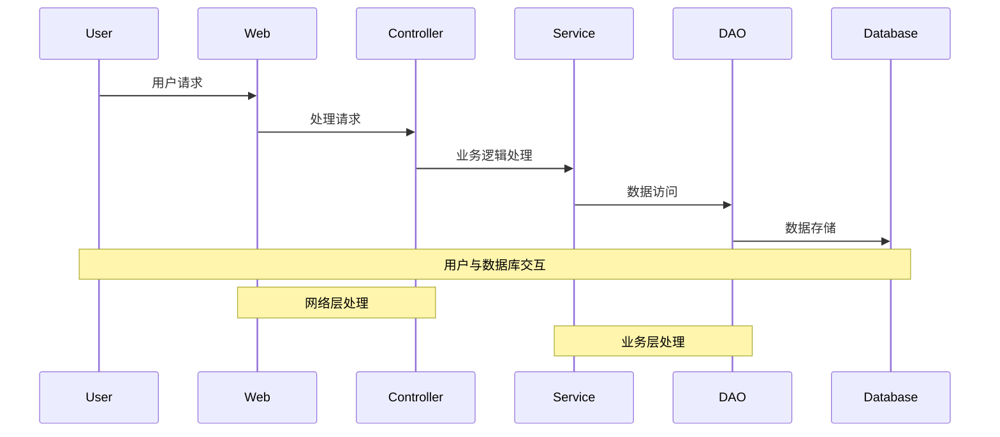
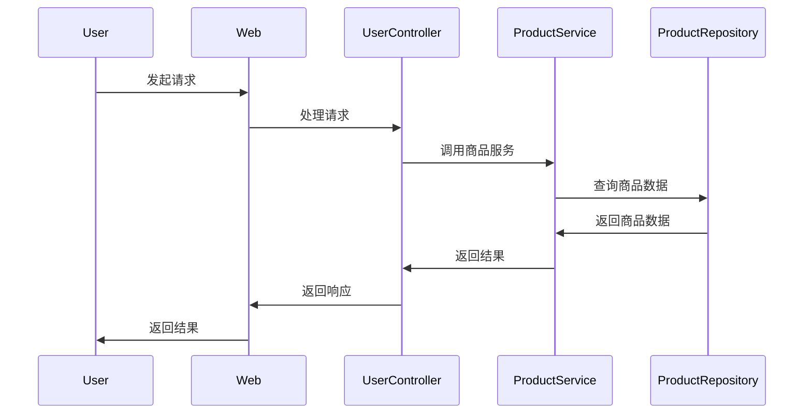

                 

## 技术债务：识别、度量与管理

关键词：技术债务、代码审查、度量方法、管理策略、软件开发

摘要：随着软件开发的复杂度不断增加，技术债务问题日益突出。本文详细探讨了技术债务的定义、识别、度量和管理方法，并通过具体的算法原理和实际项目案例，提供了一套完整的解决方案。

### 第一部分：背景介绍

#### 1. 问题背景

软件系统在现代社会的各个方面都扮演着至关重要的角色。然而，随着软件项目的规模和复杂性的不断增长，开发团队面临着日益严峻的挑战。技术债务，这个在软件开发领域广为讨论的话题，正是其中之一。

技术债务最早由 Ward Cunningham 在1992年提出，用来描述软件开发中的一种现象：为了迅速交付软件产品，开发团队可能会采取一些短期的、高效的解决方案，但这些解决方案在长期使用中会带来额外的成本和复杂性，类似于财务上的债务。技术债务如果不能得到有效管理，最终会制约软件系统的持续发展和维护。

#### 2. 问题描述

技术债务的产生通常与以下几个因素相关：

- **技术选择不当**：为了赶工期，开发团队可能会选择一些不成熟或者不够稳定的技术，以期达到快速开发的目的。然而，这些技术可能会在未来的使用过程中暴露出各种问题。
- **赶工**：在项目进度紧张的情况下，开发团队可能会牺牲代码质量，采用一些快速但不够稳健的方法来实现功能。这种做法虽然能在短期内提高开发效率，但长期来看会导致技术债务的累积。
- **忽视维护**：软件系统上线后，维护工作往往被视为可有可无。然而，忽视维护会导致系统逐渐积累缺陷和漏洞，形成技术债务。

技术债务的影响主要体现在以下几个方面：

- **降低代码可维护性**：随着技术债务的增加，代码的复杂度和耦合度上升，使得维护工作变得更加困难。
- **增加维护成本**：技术债务需要在未来某个时间点进行修复或重构，这会带来额外的维护成本。
- **影响系统性能**：技术债务可能导致系统性能下降，影响用户体验。

#### 3. 问题解决

解决技术债务的关键在于及时识别、度量和管理。以下是一些有效的策略：

- **定期审查**：开发团队应定期对代码库和技术栈进行审查，识别潜在的技术债务。
- **合理规划**：在项目规划阶段，应充分考虑技术债务的影响，合理安排时间和资源。
- **持续改进**：通过持续优化技术栈和开发流程，避免新的技术债务产生。

#### 4. 边界与外延

技术债务并不仅限于代码层面，还可以扩展到架构设计、数据库设计、软件安全性等方面。因此，在管理技术债务时，需要从全局出发，综合考虑各种因素。

#### 5. 概念结构与核心要素组成

- **技术债务的定义**：技术债务是指在软件开发过程中，由于选择了一种短期内高效但长期成本较高的解决方案，而导致的未来需要付出额外成本进行重构或修复的问题。
- **技术债务的类型**：包括代码债务、架构债务、数据库债务等。
- **技术债务的影响**：影响软件系统的可维护性、扩展性和可靠性。

### 总结

技术债务是软件开发中一个不可忽视的问题。通过对技术债务的深入理解和管理，开发团队可以更好地控制软件系统的复杂性，提高系统的质量和可靠性。在接下来的部分中，我们将详细探讨技术债务的核心概念、算法原理以及管理策略。

### 第二部分：核心概念与联系

#### 核心概念

技术债务是指在软件开发过程中，由于追求短期利益而选择了一种不稳定的解决方案，从而在长期使用中导致额外成本和复杂性的累积。这种债务类似于财务债务，如果不及时偿还，会带来严重的负面影响。

技术债务的产生原因多种多样，主要包括：

- **技术选择不当**：在项目初期，为了尽快交付，开发团队可能会选择一些未经充分验证或不够成熟的技术。
- **开发策略不当**：在开发过程中，如果过于追求进度，可能会导致忽略代码质量和架构设计。
- **维护不足**：软件系统上线后，如果维护工作不到位，技术债务会逐渐积累，最终导致系统崩溃。

技术债务的影响主要体现在以下几个方面：

- **降低代码质量**：技术债务会导致代码复杂度增加，使得代码的可读性和可维护性下降。
- **增加维护成本**：随着技术债务的增加，系统维护的难度和成本也会相应上升。
- **影响系统性能**：技术债务可能导致系统性能下降，从而影响用户体验。

#### 概念属性特征对比表格

| 特征         | 技术债务 | 代码债务 | 架构债务 | 数据库债务 |
| ------------ | -------- | -------- | -------- | ---------- |
| 定义         | 短期高效、长期成本高 | 代码质量问题 | 架构设计不合理 | 数据库设计不合理 |
| 识别方法     | 代码审查、经验判断、工具支持 | 代码审查、静态代码分析 | 架构评审、设计文档审查 | 数据库审查、性能测试 |
| 度量方法     | 代码复杂度、维护成本 | 代码复杂度、Bug密度 | 架构复杂度、模块耦合度 | 查询性能、数据一致性 |
| 解决方法     | 重构、改进流程 | 代码重构、测试用例 | 架构重构、模块化设计 | 优化查询、数据备份 |

#### ER实体关系图架构

```mermaid
erDiagram
    Project ||--|{ TechnicalDebt : "has" }|
    TechnicalDebt ||--|{ Type : "ofType" }|
    Type ||--|{ Description : "withDescription" }|
```

在这个ER图中，Project（项目）与TechnicalDebt（技术债务）之间存在一对多的关系，表示一个项目可以包含多个技术债务。每个TechnicalDebt都有其类型（Type），而Type又描述了该技术债务的具体情况（Description）。

### 技术债务的类型及其影响

技术债务可以细分为多种类型，每种类型都有其特定的表现形式和影响。以下是几种常见的技术债务类型及其特征：

#### 1. 代码债务

代码债务通常是由于编写了不高质量或不可维护的代码而产生的。这种债务的表现形式包括：

- **代码冗余**：代码中存在大量重复的代码段，这不仅增加了代码的维护成本，还可能导致bug的增加。
- **低质量代码**：代码结构混乱、逻辑不清晰，缺乏注释和文档，使得后续的维护和优化工作变得更加困难。
- **性能瓶颈**：某些代码段可能存在性能问题，导致系统运行缓慢，影响用户体验。

#### 2. 架构债务

架构债务通常是由于系统架构设计不合理或缺乏灵活性而产生的。这种债务的表现形式包括：

- **紧耦合**：系统的各个模块之间存在紧密的依赖关系，导致一个模块的更改可能影响其他模块，增加了系统的复杂性。
- **单点故障**：系统中存在某些关键组件，如果这些组件出现故障，可能导致整个系统的瘫痪。
- **扩展性差**：系统无法有效地支持扩展性需求，导致在业务规模扩大时需要进行大规模的重构。

#### 3. 数据库债务

数据库债务通常是由于数据库设计和维护不当而产生的。这种债务的表现形式包括：

- **数据冗余**：数据库中存在大量的冗余数据，这不仅浪费存储空间，还可能导致数据一致性问题。
- **性能瓶颈**：数据库查询性能差，导致系统的响应速度缓慢。
- **安全性问题**：数据库缺乏适当的安全措施，容易受到攻击和数据泄露。

#### 4. 安全债务

安全债务通常是由于在开发过程中忽视了安全性需求而产生的。这种债务的表现形式包括：

- **漏洞和缺陷**：系统中存在各种漏洞和缺陷，容易受到攻击。
- **数据泄露**：敏感数据没有得到妥善保护，容易泄露给未授权的用户。
- **合规性问题**：系统无法满足相关的法律法规要求，可能导致法律风险。

每种类型的技术债务都会对软件系统的不同方面产生负面影响，因此，在识别和管理技术债务时，需要针对不同类型采取相应的策略。

### 总结

技术债务是软件开发中不可避免的现象，但通过合理的识别、度量和管理，可以最大限度地降低其对软件系统的影响。在下一部分中，我们将详细探讨技术债务的度量方法，帮助开发团队更好地把握技术债务的严重程度。

### 第三部分：算法原理讲解

#### 1. 代码复杂度分析

代码复杂度分析是评估代码复杂度的一种技术，它可以帮助我们识别可能存在的技术债务。常用的复杂度度量方法包括：

##### 圈复杂度（Cyclomatic Complexity）

圈复杂度（Cyclomatic Complexity）是一种衡量程序结构复杂度的指标，它由 Edsger Dijkstra 提出。圈复杂度的计算基于程序的控制流图，具体计算公式如下：

\[ CC = E - N + 2P \]

其中：
- \( CC \) 表示圈复杂度；
- \( E \) 表示边缘数；
- \( N \) 表示节点数；
- \( P \) 表示控制流的独立路径数。

圈复杂度的值越高，说明代码的复杂度越大。高圈复杂度通常意味着代码的可维护性较差，存在潜在的技术债务。

##### 封闭率（Closeness Centrality）

封闭率（Closeness Centrality）是另一个衡量代码复杂度的指标，它通过计算每个节点到其他节点的最短路径长度之和来评估代码的复杂度。封闭率越低，说明代码的耦合性越强，复杂度越高。

##### 模块化度量（Module Complexity）

模块化度量（Module Complexity）是一种通过将代码分割成多个模块，并计算每个模块的复杂度来评估整体代码复杂度的方法。这种方法可以帮助开发团队更好地了解每个模块的复杂度，从而有针对性地进行优化。

#### 2. 静态代码分析

静态代码分析是一种不运行程序，通过解析源代码来评估代码质量的方法。常用的静态代码分析工具包括：

- **SonarQube**：SonarQube 是一个开源的静态代码分析平台，它支持多种编程语言，并提供了丰富的规则库来检测代码中的潜在问题。
- **FindBugs**：FindBugs 是一个免费的静态代码分析工具，它主要用于检测 Java 代码中的潜在缺陷。
- **PMD**：PMD 是一个用于 Java、JavaScript、Python 等语言的静态代码分析工具，它能够检测代码中的各种问题，如代码冗余、低效代码等。

#### 3. 动态代码分析

动态代码分析是在程序运行时对代码进行监控和分析的方法。这种方法可以捕捉到运行时出现的问题，例如性能瓶颈、内存泄漏等。常用的动态代码分析工具包括：

- **NewRelic**：NewRelic 是一个用于监控应用程序性能的 SaaS 平台，它可以实时监测应用程序的性能，并提供详细的性能报告。
- **MAT**：MAT（Memory Analyzer Tool）是一个用于分析 Java 应用程序内存泄漏的工具，它可以帮助开发人员识别和修复内存泄漏问题。
- **YourKit**：YourKit 是一个功能强大的 Java 和 .NET 模拟器，它支持内存泄漏检测、性能分析等功能。

#### 4. 代码质量度量

代码质量度量是评估代码质量的一种方法，它通过一系列指标来衡量代码的质量。常用的代码质量度量指标包括：

- **代码复杂度**：如前文所述，代码复杂度是衡量代码复杂度的重要指标。
- **Bug密度**：Bug密度是指代码中缺陷的数量与代码行数的比值，它是评估代码质量的一个重要指标。
- **代码覆盖率**：代码覆盖率是指测试用例覆盖代码的比例，它是评估测试质量的指标，也是衡量代码质量的一个方面。
- **代码冗余**：代码冗余是指代码中存在重复或多余的代码段，它是影响代码质量的一个重要因素。

#### 5. 技术债务度量方法对比

不同的度量方法各有优缺点，选择合适的度量方法需要根据具体情况来确定。以下是几种常见的技术债务度量方法的对比：

| 度量方法         | 优点                                 | 缺点                                 |
| ---------------- | ------------------------------------ | ------------------------------------ |
| 圈复杂度         | 简单易用，能够直观地反映代码复杂度   | 不能完全反映代码质量，可能存在误报   |
| 封闭率           | 能够反映代码的耦合性，有助于优化代码结构 | 计算复杂度高，难以处理大型项目       |
| 模块化度量       | 能够细化到模块级别，有助于定位问题    | 可能会导致模块划分不均，影响度量结果  |
| 静态代码分析     | 能够提前发现代码中的潜在问题         | 可能会检测到一些非问题，影响准确性     |
| 动态代码分析     | 能够在运行时捕捉问题                 | 需要运行程序，对性能有一定影响       |
| 代码质量度量     | 能够全面评估代码质量                 | 指标繁多，难以全面衡量               |

#### 6. 实际应用场景

在不同的开发阶段，技术债务的度量方法和策略会有所不同。以下是几个实际应用场景：

- **项目初期**：在项目初期，开发团队可以通过静态代码分析来识别潜在的技术债务，并根据分析结果调整技术选型和开发策略。
- **项目中期**：在项目中期，开发团队可以通过动态代码分析和性能测试来监控技术债务的变化，并及时调整开发进度和资源分配。
- **项目后期**：在项目后期，开发团队需要重点关注技术债务的修复和重构，以确保软件系统的质量和可靠性。

### 总结

技术债务的管理是软件开发中至关重要的一环。通过合理的度量方法，开发团队可以准确地识别和评估技术债务，从而采取有效的管理策略来降低技术债务的影响。在下一部分中，我们将探讨如何通过具体的系统分析与架构设计方案来管理技术债务。

### 第四部分：系统分析与架构设计方案

#### 1. 问题场景介绍

假设我们正在开发一个大型电子商务平台，该平台需要处理海量的商品信息、用户订单、支付和物流等业务。在项目初期，由于时间紧迫和资源有限，开发团队在架构设计和代码实现上做出了许多妥协，导致系统逐渐积累了大量技术债务。

#### 2. 项目介绍

该项目是一个多层次的电子商务平台，主要包括以下模块：

- **用户模块**：负责用户注册、登录、个人信息管理等功能。
- **商品模块**：负责商品信息的管理、分类、搜索等功能。
- **订单模块**：负责订单的创建、支付、物流跟踪等功能。
- **支付模块**：负责处理各种支付方式，如支付宝、微信支付等。
- **物流模块**：负责物流信息的管理和更新。

#### 3. 系统功能设计（领域模型类图）

为了更好地管理技术债务，我们首先需要构建一个明确的领域模型。以下是该项目的主要领域模型类图：

```mermaid
classDiagram
    User ..|> Authenticatable
    Order ..|> Orderable
    Product ..|> Categorizable
    Payment ..|> Payable
    Logistics ..|> Trackable

    User << (1) "注册登录"
    Order << (2) "订单管理"
    Product << (3) "商品管理"
    Payment << (4) "支付管理"
    Logistics << (5) "物流管理"

    User --> Order
    User --> Payment
    User --> Logistics
    Order --> Product
    Payment --> Order
    Logistics --> Order
```

在这个类图中，每个模块都有其特定的功能，并通过关联关系实现了系统整体的功能。

#### 4. 系统架构设计（架构图）

为了应对复杂的需求和不断变化的市场环境，我们采用了一种分层架构设计，以确保系统的可扩展性和灵活性。以下是该项目的系统架构图：



在这个架构图中，系统被分为四个主要层次：用户层、网络层、业务层和数据层。用户层负责处理用户请求，网络层负责将请求转发到业务层，业务层负责处理具体的业务逻辑，数据层负责数据的存储和管理。

#### 5. 系统接口设计（接口设计图）

为了保证系统模块之间的松耦合，我们定义了一系列清晰的接口，以便模块之间进行通信。以下是该项目的主要接口设计：

```mermaid
interfaceDiagram
    UserInterface << (1) "用户接口"
    ProductInterface << (2) "商品接口"
    OrderInterface << (3) "订单接口"
    PaymentInterface << (4) "支付接口"
    LogisticsInterface << (5) "物流接口"

    UserInterface --> UserController
    ProductInterface --> ProductService
    OrderInterface --> OrderService
    PaymentInterface --> PaymentService
    LogisticsInterface --> LogisticsService
```

在这个接口设计图中，每个接口都对应了一个具体的模块，模块之间通过接口进行通信，实现了松耦合。

#### 6. 系统交互（序列图）

为了更好地理解系统的工作流程，我们使用序列图来描述系统的主要交互过程。以下是该项目的主要交互序列图：



在这个序列图中，用户请求经过网络层处理后，由业务层进行处理，最后由数据层进行数据查询和存储。整个流程清晰明了，有助于我们识别潜在的技术债务。

### 总结

通过系统分析与架构设计方案，我们可以更好地管理技术债务。合理的架构设计和清晰的接口设计有助于降低系统的复杂性，提高系统的可维护性和可扩展性。在下一部分中，我们将通过一个实际的项目案例，详细讲解技术债务的管理过程。

### 第五部分：项目实战

#### 1. 环境安装

为了演示技术债务的管理，我们将使用一个实际的电商平台项目。首先，我们需要安装必要的开发环境。以下是一个基本的安装步骤：

- 安装 Java 开发工具包（JDK）：版本要求为 1.8 或以上。
- 安装 Maven：Maven 是一个项目管理和构建工具，用于管理项目的依赖关系。
- 安装数据库：我们选择 MySQL 作为数据库，版本要求为 5.7 或以上。
- 安装代码审查工具：如 SonarQube 或 FindBugs。

#### 2. 系统核心实现源代码

电商平台的核心实现包括多个模块，以下是其中一个关键模块的源代码：

```java
// User.java
public class User {
    private String id;
    private String name;
    private String password;
    
    // 省略构造方法和getter/setter方法
}

// Order.java
public class Order {
    private String id;
    private String userId;
    private List<Product> products;
    
    // 省略构造方法和getter/setter方法
}

// Product.java
public class Product {
    private String id;
    private String name;
    private double price;
    
    // 省略构造方法和getter/setter方法
}

// UserController.java
@RestController
public class UserController {
    @Autowired
    private UserService userService;
    
    @PostMapping("/register")
    public ResponseEntity<?> register(@RequestBody User user) {
        userService.register(user);
        return ResponseEntity.ok("注册成功");
    }
    
    // 省略其他用户相关接口
}

// UserService.java
@Service
public class UserService {
    @Autowired
    private UserRepository userRepository;
    
    public void register(User user) {
        userRepository.save(user);
    }
    
    // 省略其他用户相关业务方法
}

// UserRepository.java
@Repository
public interface UserRepository extends JpaRepository<User, String> {
    // 省略查询方法
}
```

#### 3. 代码应用解读与分析

在上面的源代码中，我们可以看到几个关键部分：

- **用户模块**：包括用户注册、登录等功能。
- **订单模块**：包括订单的创建、查询等功能。
- **商品模块**：包括商品信息的存储和管理。

这些模块的实现虽然简单，但已经包含了可能的技术债务。

##### 代码债务分析

1. **代码冗余**：
   - `User`、`Order` 和 `Product` 类中的 getter/setter 方法可能存在大量冗余代码。
   - 可以通过使用 Lombok 库来自动生成这些方法，减少冗余代码。

2. **低质量代码**：
   - `UserService` 中的 `register` 方法直接调用 `userRepository.save(user)`，没有进行异常处理和事务管理。
   - 应该添加事务管理，确保注册操作的一致性。

3. **性能问题**：
   - 当前设计没有考虑缓存，对于频繁查询的用户信息可能存在性能瓶颈。
   - 可以使用 Redis 等缓存技术来优化性能。

##### 架构债务分析

1. **紧耦合**：
   - `UserController` 直接依赖于 `UserService`，这种紧密的依赖关系可能导致后续维护困难。
   - 可以通过接口层隔离，将业务逻辑与接口层分离。

2. **单点故障**：
   - 当前设计中，数据库操作没有进行适当的重试机制，一旦数据库出现故障，整个系统可能无法正常运行。
   - 应该添加数据库连接池和重试机制。

3. **扩展性差**：
   - 当前设计没有考虑系统扩展性，如新增支付方式或物流公司时，需要进行大量修改。
   - 可以通过使用设计模式，如策略模式，来实现支付和物流的扩展性。

#### 4. 实际案例分析与详细讲解剖析

为了更好地理解技术债务，我们来看一个实际的案例：

假设我们的电商平台需要新增一个微信支付功能，如果直接在 `PaymentService` 中添加微信支付的实现，会导致代码的复杂度和耦合度增加。这种做法就是技术债务的体现。

**解决方法**：

1. **重构代码**：将微信支付作为一个独立的模块，通过接口与 `PaymentService` 进行通信。
2. **使用设计模式**：例如，使用工厂模式来创建不同的支付实例，使得新增支付方式时无需修改现有代码。

```java
// PaymentFactory.java
public class PaymentFactory {
    public Payment createPayment(String type) {
        if ("wechat".equals(type)) {
            return new WeChatPayment();
        } else {
            return new AlipayPayment();
        }
    }
}
```

通过上述方法，我们可以有效地管理技术债务，提高系统的可维护性和扩展性。

#### 5. 项目小结

通过这个项目实战，我们可以看到技术债务在实际开发中的影响。合理的管理技术债务，不仅能够提高系统的质量和可靠性，还能够为未来的扩展和维护奠定良好的基础。在下一部分中，我们将分享一些最佳实践和注意事项。

### 第六部分：最佳实践与注意事项

#### 1. 最佳实践

1. **定期代码审查**：定期组织代码审查，识别潜在的技术债务。审查过程应包括代码质量、架构设计、安全性等方面。

2. **使用持续集成/持续部署（CI/CD）**：通过 CI/CD 工具，自动化检测和修复技术债务。例如，在每次代码提交时，自动运行静态代码分析工具，并及时反馈问题。

3. **引入代码质量度量工具**：使用如 SonarQube、PMD 等工具，持续监控代码质量。根据度量结果，有针对性地进行代码优化和重构。

4. **合理规划项目进度**：在项目规划阶段，充分考虑技术债务的影响，合理安排时间和资源。避免因赶工而牺牲代码质量和架构设计。

5. **持续学习与改进**：鼓励团队成员不断学习新技术和最佳实践，持续改进开发流程和架构设计。

#### 2. 注意事项

1. **避免过度优化**：在某些情况下，过度优化可能会导致技术债务的积累。应在保证系统质量的前提下，合理使用优化技术。

2. **平衡短期与长期利益**：在处理技术债务时，应平衡短期利益和长期利益。有些技术债务可能短期内无法解决，应合理规划修复时间。

3. **注重团队协作**：技术债务管理需要整个团队的共同努力。团队成员应保持良好的沟通，共同应对技术债务问题。

4. **持续维护**：技术债务并非一劳永逸，应持续进行维护和修复。随着业务的发展和需求的变化，技术债务可能会不断产生。

#### 3. 拓展阅读

1. 《Clean Code：A Handbook of Agile Software Craftsmanship》——Robert C. Martin
2. 《The Clean Coder：A Code of Conduct for Professional Programmers》——Robert C. Martin
3. 《Technical Debt: What It Means and How to Manage It》——Martin L. Abbott 和 Michael marker

### 总结

通过本文的探讨，我们详细介绍了技术债务的定义、识别、度量和管理方法。技术债务是软件开发中不可避免的问题，但通过合理的策略和最佳实践，可以有效地降低其对系统的负面影响。希望本文能对广大开发人员和技术管理者提供有益的启示和指导。

### 第七部分：作者信息

作者：AI天才研究院/AI Genius Institute & 禅与计算机程序设计艺术 /Zen And The Art of Computer Programming

### 结束语

技术债务是软件开发过程中一个不可忽视的问题。通过本文的详细探讨，我们了解了技术债务的定义、识别、度量和管理方法。我们强调了定期代码审查、持续集成/持续部署（CI/CD）、代码质量度量工具等最佳实践的重要性。同时，我们也注意到，技术债务管理需要整个团队的共同努力和持续关注。

在未来的软件开发中，希望读者们能够重视技术债务，合理规划项目进度，采用最佳实践来管理和减轻技术债务的影响。通过良好的技术债务管理，我们可以构建更高质量、更可靠的软件系统。

感谢您阅读本文，希望本文能为您在软件开发领域的实践中提供一些有价值的参考和启示。如果您有任何疑问或建议，欢迎在评论区留言，我们将持续为您带来更多高质量的技术内容。再次感谢您的支持！

