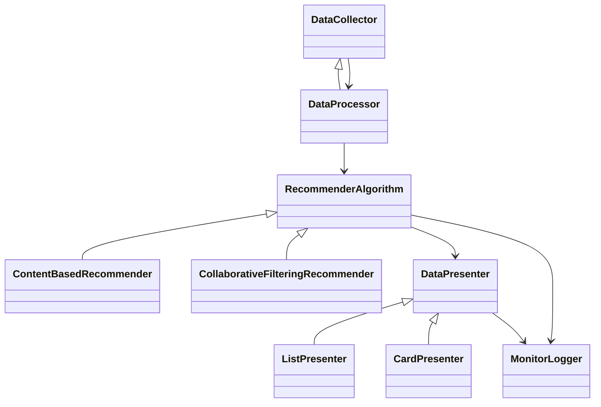
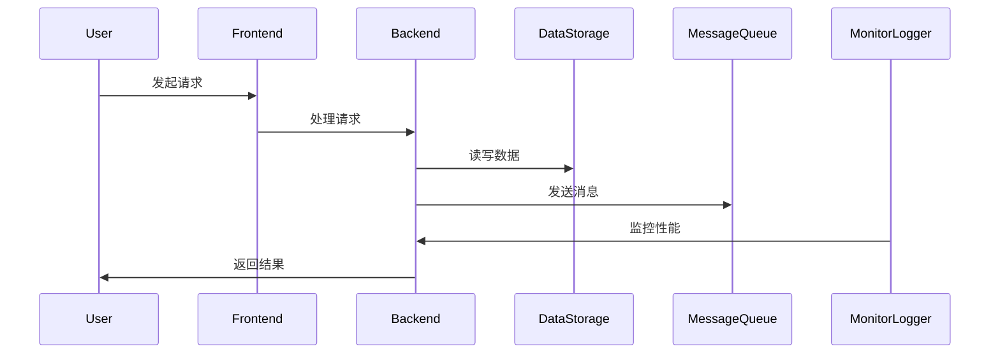
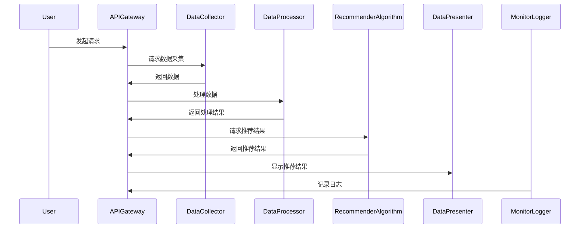
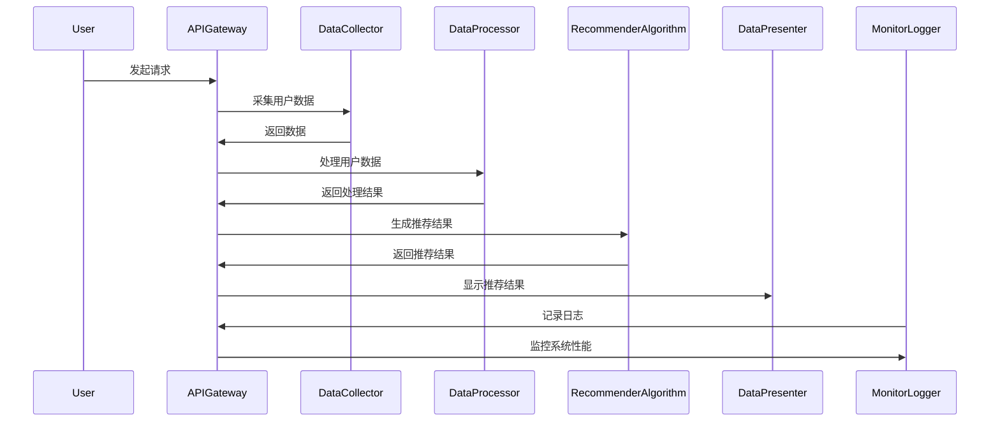

                 

### 技术决策中的风险评估

在快速发展的IT领域中，技术决策的复杂性和重要性日益增加。技术决策不仅涉及到技术实现层面的选择，还涉及到项目成本、时间周期、资源分配以及业务战略等多个方面。在这样的背景下，风险评估成为了一个不可或缺的环节。本文将围绕技术决策中的风险评估进行深入探讨，通过逻辑清晰的分析，帮助读者理解风险评估的核心概念、方法及其应用。

**关键词**：技术决策、风险评估、风险识别、风险分析、风险管理

**摘要**：本文首先介绍了技术决策中的风险评估背景和重要性，接着对风险评估的核心概念和方法进行了详细阐述，并通过具体的算法原理讲解和实际案例剖析，展示了风险评估在IT项目中的实际应用。最后，本文提出了最佳实践技巧和注意事项，为读者在实际工作中提供了参考。

### 目录大纲

1. **第一部分：背景介绍**
   - 第1章：问题背景与问题描述
     - 1.1.1 技术决策中的风险评估
     - 1.1.2 风险评估的重要性
     - 1.1.3 风险评估的挑战
   - 第2章：核心概念与联系
     - 2.1 风险评估的定义
     - 2.2 风险评估方法
     - 2.3 风险评估与相关概念的联系

2. **第二部分：算法原理讲解**
   - 第3章：风险评估算法原理
     - 3.1 风险评估算法原理
     - 3.2 数学模型和数学公式讲解
     - 3.3 算法举例说明

3. **第三部分：系统分析与架构设计方案**
   - 第4章：系统分析与架构设计方案
     - 4.1 问题场景介绍
     - 4.2 系统功能设计
     - 4.3 系统架构设计
     - 4.4 系统接口设计
     - 4.5 系统交互设计

4. **第四部分：项目实战**
   - 第5章：项目实战
     - 5.1 环境安装
     - 5.2 系统核心实现源代码
     - 5.3 代码应用解读与分析
     - 5.4 实际案例分析与详细讲解剖析
     - 5.5 项目小结

5. **第五部分：最佳实践 tips**
   - 第6章：最佳实践 tips
     - 6.1 风险评估实践技巧
     - 6.2 注意事项与风险提示

6. **第六部分：小结与展望**
   - 第7章：小结与展望
     - 7.1 小结
     - 7.2 展望未来

### 第一部分：背景介绍

#### 第1章：问题背景与问题描述

##### 1.1.1 技术决策中的风险评估

在信息技术（IT）领域，技术决策涉及到新技术的选择、系统的架构设计、开发工具和开发语言的使用等多个方面。每一个决策都可能带来不同程度的风险。例如，选择一个尚未广泛应用的框架可能导致后期维护困难；系统架构设计不当可能导致系统性能瓶颈；开发工具的不合适则可能影响开发效率和代码质量。

**风险评估** 是指对一个潜在项目或决策可能面临的威胁和机会进行识别、分析和优先级排序的过程。在技术决策中，风险评估可以帮助项目经理和决策者提前预见潜在的风险，并采取相应的预防措施，从而降低风险发生的可能性及其影响。

##### 1.1.2 风险评估的重要性

风险评估在技术决策中的重要性主要体现在以下几个方面：

1. **提前预警**：通过风险评估，可以提前识别出潜在的技术风险，为决策者提供预警信息，从而避免在项目实施过程中出现重大问题。
2. **资源优化**：通过对风险进行优先级排序，项目团队能够更合理地分配资源，确保资源投入到风险最高的领域。
3. **决策支持**：风险评估提供的数据和结论，可以帮助决策者做出更为科学和合理的决策。
4. **风险转移**：在某些情况下，通过风险评估，项目团队可以识别出可以通过购买保险、外包等方式进行风险转移的机会。

##### 1.1.3 风险评估的挑战

尽管风险评估在技术决策中具有重要意义，但实施风险评估也面临诸多挑战：

1. **不确定性**：技术领域的快速发展带来了不确定性，很多风险可能无法提前预测。
2. **复杂度**：IT项目通常涉及多个方面，如技术、市场、法律等，风险评估需要综合考虑这些因素。
3. **时间成本**：风险评估需要耗费时间和精力，可能会对项目进度造成一定影响。
4. **信息不足**：在许多情况下，项目团队可能无法获取到足够的信息来支持全面的风险评估。

#### 第2章：核心概念与联系

##### 2.1 风险评估的定义

**风险评估** 是一个系统化的过程，通过识别、分析、评估和应对潜在的风险，以降低项目或决策的不确定性。具体来说，风险评估包括以下几个步骤：

1. **风险识别**：识别项目或决策过程中可能出现的风险。
2. **风险分析**：对识别出的风险进行深入分析，确定其可能的影响和发生的概率。
3. **风险评估**：根据风险分析的结果，评估风险的重要性和优先级。
4. **风险应对**：制定相应的应对策略，降低风险的影响或转移风险。

##### 2.2 风险评估方法

风险评估方法可以分为定量和定性两种：

1. **定量风险评估方法**：使用数学和统计分析的方法对风险进行量化评估，例如概率模型、蒙特卡罗模拟等。
2. **定性风险评估方法**：主要依赖于专家判断和主观评估，如风险矩阵、头脑风暴等。

##### 2.3 风险评估与相关概念的联系

风险评估与风险管理、风险识别和风险分析等概念密切相关：

1. **风险管理**：风险管理是一个更为广泛的概念，包括风险评估在内的多个环节。风险评估是风险管理中至关重要的一部分。
2. **风险识别**：风险识别是风险评估的第一步，用于识别可能的风险。
3. **风险分析**：风险分析是在风险识别的基础上，对风险进行深入的分析和评估。

### 第二部分：算法原理讲解

#### 第3章：风险评估算法原理

##### 3.1 风险评估算法原理

风险评估算法主要包括以下几类：

1. **概率模型**：基于概率论的方法，对风险发生的概率和影响进行量化评估。
2. **蒙特卡罗模拟**：通过随机抽样和模拟的方法，评估风险的概率分布和影响。
3. **风险矩阵**：通过矩阵的方式，对风险的可能性和影响进行定性评估。

##### 3.2 数学模型和数学公式讲解

以下是几种常用的数学模型和公式：

1. **贝叶斯定理**：
   $$P(A|B) = \frac{P(B|A)P(A)}{P(B)}$$
   其中，$P(A|B)$ 表示在事件B发生的条件下事件A发生的概率，$P(B|A)$ 表示在事件A发生的条件下事件B发生的概率，$P(A)$ 和$P(B)$ 分别表示事件A和事件B发生的概率。

2. **蒙特卡罗模拟**：
   $$P(A) = \frac{模拟次数中事件A发生的次数}{总模拟次数}$$
   通过大量的随机模拟，估计事件A发生的概率。

##### 3.3 算法举例说明

假设一个IT项目需要评估某个新技术的引入风险。首先，通过专家访谈和数据分析，识别出以下风险：

1. **技术不成熟**：新技术的稳定性和性能尚未经过充分验证。
2. **培训成本高**：新技术的学习和使用需要额外的人力资源投入。
3. **兼容性问题**：新技术可能与现有的系统产生兼容性问题。

接着，使用风险矩阵对上述风险进行评估，定义风险的可能性和影响如下：

| 风险类型 | 可能性 | 影响程度 |
| :--: | :--: | :--: |
| 技术不成熟 | 低 | 中 |
| 培训成本高 | 中 | 高 |
| 兼容性问题 | 高 | 中 |

根据风险矩阵的评估结果，项目团队可以制定相应的应对策略：

1. **技术不成熟**：增加测试和验证时间，确保技术的稳定性和性能。
2. **培训成本高**：提前安排培训和知识分享，降低培训成本。
3. **兼容性问题**：与现有系统的开发者沟通，确保兼容性设计。

#### 第3章：风险评估算法原理

##### 3.1 风险评估算法原理

**风险评估算法** 是一种通过量化手段来评估和管理风险的技术。其核心目标是通过科学的分析和计算，为决策提供可靠的数据支持。以下是对几种常见风险评估算法的详细解释。

**3.1.1 风险评估算法的分类**

根据评估方法的不同，风险评估算法主要可以分为以下几类：

1. **定量风险评估方法**：这类方法主要通过数学模型和统计方法，对风险的概率和影响进行量化评估。常见的定量风险评估方法包括贝叶斯网络、蒙特卡罗模拟、统计回归模型等。

2. **定性风险评估方法**：这类方法侧重于通过专家判断和主观评估来识别和评估风险。常见的定性风险评估方法包括风险矩阵、主观评分法、头脑风暴等。

3. **组合风险评估方法**：这类方法结合定量和定性评估方法，以更全面的方式评估和管理风险。例如，在风险识别阶段使用定性方法，而在风险评估阶段使用定量方法。

**3.1.2 风险评估算法的基本流程**

风险评估算法的基本流程通常包括以下步骤：

1. **风险识别**：通过文档分析、访谈、问卷调查等方式，识别项目或决策过程中可能出现的风险。

2. **风险分析**：对识别出的风险进行深入分析，确定其可能的影响和发生的概率。这一步可能包括故障树分析（FTA）、事件树分析（ETA）、敏感性分析等。

3. **风险量化**：使用数学模型或统计方法，对风险的可能性和影响进行量化评估。例如，使用贝叶斯网络对风险的概率分布进行建模，或使用蒙特卡罗模拟来估计风险的概率。

4. **风险排序**：根据风险评估的结果，对风险进行排序，确定其优先级。常用的排序方法包括风险矩阵、优先级评分法等。

5. **风险应对**：制定相应的风险应对策略，包括风险规避、风险转移、风险减轻等。选择最合适的策略，以降低风险的发生概率或影响程度。

**3.1.3 风险评估算法的应用场景**

风险评估算法广泛应用于各种领域，包括IT项目、金融工程、医疗保健、自然灾害管理等。以下是几个具体的应用场景：

1. **IT项目管理**：在软件开发、系统部署、网络安全等方面，使用风险评估算法可以帮助团队提前识别和应对潜在的技术风险。

2. **金融风险评估**：在金融市场中，风险评估算法用于评估投资组合的风险、信用风险等，为投资决策提供支持。

3. **自然灾害管理**：在地震、洪水、台风等自然灾害中，风险评估算法用于预测灾害的可能性和影响，为防灾减灾提供科学依据。

#### 3.2 数学模型和数学公式讲解

在风险评估中，数学模型和数学公式起着至关重要的作用。以下将介绍几种常用的数学模型和公式，并解释其背后的原理和应用。

**3.2.1 基本数学模型**

**1. 贝叶斯定理**

贝叶斯定理是概率论中的一个重要定理，它用于计算后验概率，即在已知某些条件下的概率。贝叶斯定理的表达式如下：

$$
P(A|B) = \frac{P(B|A)P(A)}{P(B)}
$$

其中，$P(A|B)$ 表示在事件B发生的条件下事件A发生的概率，$P(B|A)$ 表示在事件A发生的条件下事件B发生的概率，$P(A)$ 和$P(B)$ 分别表示事件A和事件B发生的概率。

贝叶斯定理在风险评估中的应用非常广泛。例如，在医疗诊断中，可以用来计算给定症状下患某种疾病的概率。

**2. 蒙特卡罗模拟**

蒙特卡罗模拟是一种基于随机抽样的数学模拟方法，主要用于计算复杂概率分布和期望值。蒙特卡罗模拟的基本思想是通过大量的随机抽样，来估计某个随机变量的分布和期望。

设随机变量$X$ 的概率分布函数为$F(x)$，可以通过以下步骤进行蒙特卡罗模拟：

- 从$X$ 的概率分布中随机抽取大量样本值$x_1, x_2, ..., x_n$。
- 计算样本值的累积分布函数$F_n(x) = \frac{1}{n}\sum_{i=1}^{n}F(x_i)$。
- 估计$X$ 的期望值：$E[X] = \int_{-\infty}^{\infty}xF(x)dx \approx \frac{1}{n}\sum_{i=1}^{n}x_i$。

蒙特卡罗模拟在风险评估中可以用来估计风险的概率分布和期望损失。

**3.2.2 公式推导与解释**

**1. 风险矩阵**

风险矩阵是一种常用的定性风险评估工具，通过风险的可能性和影响对风险进行排序。假设有风险$R_i$，其可能性和影响分别为$P_i$ 和$I_i$，则风险矩阵可以表示为：

$$
R_i = P_i \times I_i
$$

其中，$R_i$ 表示风险$R_i$ 的综合评分，$P_i$ 表示风险$R_i$ 的可能性，$I_i$ 表示风险$R_i$ 的影响。

风险矩阵的推导过程如下：

- 首先，确定风险的可能性和影响等级。例如，可能性分为低、中、高三个等级，影响程度分为小、中、大三个等级。
- 然后，根据专家判断或历史数据，为每个风险的可能性和影响程度分配一个权重。
- 最后，计算每个风险的综合评分，以便进行排序和优先级管理。

**2. 贝叶斯网络**

贝叶斯网络是一种基于概率论的图形模型，用于表示一系列随机变量之间的条件依赖关系。假设有随机变量集$X_1, X_2, ..., X_n$，贝叶斯网络可以表示为：

$$
P(X_1, X_2, ..., X_n) = \prod_{i=1}^{n} P(X_i | X_{1:i})
$$

其中，$P(X_i | X_{1:i})$ 表示在随机变量$X_1, X_2, ..., X_{i-1}$ 确定的条件下，随机变量$X_i$ 的概率分布。

贝叶斯网络的推导过程如下：

- 首先，根据专家知识和历史数据，确定随机变量之间的条件依赖关系。
- 然后，为每个随机变量及其条件概率分配一个概率值。
- 最后，使用贝叶斯定理和概率乘法规则，计算整个贝叶斯网络的联合概率分布。

#### 3.3 算法举例说明

为了更好地理解风险评估算法的应用，以下将通过一个实际案例来说明风险评估的过程。

**案例背景：**

某IT公司计划开发一个基于人工智能的智能推荐系统，用于提升用户体验和销售额。在项目启动前，公司需要进行风险评估，以识别和应对潜在的技术和商业风险。

**步骤1：风险识别**

通过专家访谈和市场调研，识别出以下风险：

1. **技术风险**：智能推荐系统的算法模型和数据处理技术可能不够成熟，导致系统性能不稳定。
2. **数据风险**：用户数据的质量和完整性可能影响推荐系统的准确性。
3. **市场竞争风险**：市场上可能已经存在类似的智能推荐系统，竞争激烈。
4. **法律风险**：在数据处理和隐私保护方面，可能面临法律合规风险。

**步骤2：风险分析**

对每个风险进行详细分析：

1. **技术风险**：评估技术团队的开发能力，分析现有技术和工具的适用性，确定技术解决方案的可行性。
2. **数据风险**：评估用户数据的来源和格式，分析数据处理和清洗过程的复杂性。
3. **市场竞争风险**：分析市场上类似产品的市场份额和用户反馈，评估市场竞争的激烈程度。
4. **法律风险**：研究相关法律法规，评估数据处理的合规性和潜在的法律风险。

**步骤3：风险量化**

使用风险矩阵对每个风险的可能性和影响进行量化评估。以下是一个简化的风险矩阵示例：

| 风险类型 | 可能性 | 影响程度 | 综合评分 |
| :--: | :--: | :--: | :--: |
| 技术风险 | 高 | 中 | 高 |
| 数据风险 | 中 | 高 | 中 |
| 市场竞争风险 | 中 | 中 | 中 |
| 法律风险 | 低 | 低 | 低 |

**步骤4：风险排序**

根据综合评分，对风险进行排序：

1. **技术风险**：综合评分最高，是项目启动前需要重点关注的领域。
2. **数据风险**：次之，需要制定详细的数据处理和清洗计划。
3. **市场竞争风险**：也需要关注，但相对较轻。
4. **法律风险**：最低，但仍需注意相关法律法规的要求。

**步骤5：风险应对**

根据风险排序和评估结果，制定相应的风险应对策略：

1. **技术风险**：加强技术团队的建设，引入外部技术专家，提高技术能力；采用成熟的技术框架和工具，降低技术风险。
2. **数据风险**：制定详细的数据收集、处理和清洗流程，确保数据质量和完整性；与数据提供商合作，获取高质量的初始数据。
3. **市场竞争风险**：通过市场调研，了解竞争对手的优势和劣势，制定差异化的市场策略；优化用户体验，提升产品的竞争力。
4. **法律风险**：进行法律咨询，确保数据处理的合规性；制定隐私保护政策，增强用户对产品的信任。

通过上述案例，可以看出风险评估在项目启动前的重要性。通过系统化的风险评估，公司可以更好地识别和应对潜在的风险，提高项目的成功率和市场竞争力。

### 第三部分：系统分析与架构设计方案

#### 第4章：系统分析与架构设计方案

##### 4.1 问题场景介绍

在本节中，我们将探讨一个具体的IT项目——智能推荐系统的设计和实施。该系统的目标是利用人工智能技术，为用户提供个性化的商品推荐，从而提升用户满意度和销售额。

**问题场景：**

- **需求**：系统需要收集用户的行为数据，如浏览历史、购买记录等，通过机器学习算法生成个性化的推荐。
- **挑战**：系统需要处理海量数据，保证推荐算法的准确性和实时性；同时，系统还需要具备良好的可扩展性和容错性，以适应未来业务需求的变化。

##### 4.2 系统功能设计

系统功能设计是系统开发的第一步，它定义了系统的核心功能和模块。以下是对智能推荐系统的主要功能模块的介绍：

1. **数据采集模块**：负责收集用户的行为数据，包括浏览历史、购买记录等。数据采集模块需要支持多种数据源，如Web日志、数据库等。
2. **数据处理模块**：负责对采集到的数据进行清洗、转换和存储。数据处理模块需要保证数据的质量和一致性，并提供高效的数据查询接口。
3. **推荐算法模块**：负责实现机器学习算法，根据用户行为数据生成个性化的推荐结果。推荐算法模块需要支持多种算法，如协同过滤、基于内容的推荐等。
4. **推荐结果展示模块**：负责将推荐结果以用户友好的形式展示给用户。推荐结果展示模块需要支持多种展示方式，如列表、卡片等。
5. **监控与日志模块**：负责监控系统性能和日志记录，提供实时监控和报警功能，以便及时发现和解决问题。

以下是使用Mermaid绘制的领域模型类图，展示了智能推荐系统的主要类及其关系：



##### 4.3 系统架构设计

系统架构设计是系统开发的核心环节，它定义了系统的整体结构和各个模块的交互方式。以下是对智能推荐系统的整体架构设计的详细介绍：

1. **前端架构**：前端架构采用微前端架构，每个功能模块都可以独立开发和部署。前端架构包括路由管理、状态管理和UI组件等。
2. **后端架构**：后端架构采用微服务架构，将系统拆分为多个独立的服务模块，如数据采集服务、数据处理服务、推荐算法服务、监控服务等。各个服务通过API进行通信，确保系统的高可用性和可扩展性。
3. **数据存储**：数据存储采用分布式存储架构，包括关系数据库、NoSQL数据库和大数据存储等。数据存储需要保证数据的一致性和可用性，同时提供高效的查询接口。
4. **消息队列**：消息队列用于实现服务之间的异步通信，确保系统的高可用性和消息的可靠性。常用的消息队列技术包括Kafka、RabbitMQ等。
5. **监控与日志**：监控与日志模块用于实时监控系统的性能和日志记录，提供实时监控和报警功能。常用的监控工具包括Prometheus、Grafana等。

以下是使用Mermaid绘制的系统架构图，展示了智能推荐系统的整体架构：



##### 4.4 系统接口设计

系统接口设计是系统开发的重要环节，它定义了系统内部各个模块之间的交互方式。以下是对智能推荐系统的接口设计的详细介绍：

1. **API设计**：系统采用RESTful API设计，提供统一的接口规范。每个接口定义了请求参数、响应数据结构和错误处理机制。
2. **数据交换格式**：系统采用JSON格式进行数据交换，确保数据的高效传输和解析。
3. **接口安全性**：系统采用Token认证和HTTPS加密，确保接口的安全性。
4. **接口文档**：系统提供详细的接口文档，包括接口定义、请求参数、响应数据结构、错误码等，方便开发人员使用。

以下是使用Mermaid绘制的接口设计图，展示了智能推荐系统的接口及其交互关系：



##### 4.5 系统交互设计

系统交互设计是系统架构设计的一部分，它定义了系统内部各个模块之间的交互逻辑和流程。以下是对智能推荐系统的交互设计的详细介绍：

1. **用户交互流程**：用户通过前端发起请求，APIGateway负责路由和请求处理。数据处理模块对请求进行处理，并调用推荐算法模块生成推荐结果，最后将结果返回给用户。
2. **系统监控流程**：系统通过MonitorLogger模块实时监控性能，并将日志记录存储到日志系统中。监控工具负责实时分析和报警，确保系统的稳定运行。
3. **数据交互流程**：系统通过消息队列实现异步数据交互，如用户行为数据的采集和处理，确保数据传输的高效性和可靠性。

以下是使用Mermaid绘制的系统交互序列图，展示了智能推荐系统的交互逻辑和流程：



#### 第5章：项目实战

##### 5.1 环境安装

在进行智能推荐系统的项目实战之前，我们需要搭建一个合适的开发环境。以下步骤将介绍如何安装和配置必要的软件和工具。

**1. 安装操作系统**

首先，确保操作系统满足项目需求。我们选择Ubuntu 18.04作为开发环境。

```bash
$ sudo apt update
$ sudo apt upgrade
$ sudo apt install ubuntu-desktop
```

**2. 安装Python**

Python是智能推荐系统开发的主要语言。以下是安装Python 3的步骤：

```bash
$ sudo apt install python3
$ sudo apt install python3-pip
```

**3. 安装虚拟环境**

为了管理项目依赖，我们使用虚拟环境。以下是安装virtualenv的步骤：

```bash
$ sudo pip3 install virtualenv
$ virtualenv env
$ source env/bin/activate
```

**4. 安装数据库**

我们选择MongoDB作为推荐系统的数据存储。以下是安装MongoDB的步骤：

```bash
$ sudo apt install mongodb
$ sudo systemctl start mongodb
$ sudo systemctl enable mongodb
```

**5. 安装其他工具**

安装其他必要的工具，如Node.js、Docker等：

```bash
$ sudo apt install nodejs
$ sudo npm install -g npm
$ sudo apt install docker-ce
$ sudo systemctl start docker
$ sudo systemctl enable docker
```

完成以上步骤后，开发环境搭建完成，我们可以开始进行项目开发。

##### 5.2 系统核心实现源代码

在本节中，我们将介绍智能推荐系统的核心实现源代码，包括数据采集、数据处理、推荐算法和结果展示等模块。

**1. 数据采集模块**

数据采集模块负责从各种数据源收集用户行为数据。以下是一个简单的数据采集脚本，用于从Web日志文件中提取用户访问数据。

```python
import re
import json

def parse_log_file(log_file_path):
    with open(log_file_path, 'r') as file:
        logs = file.readlines()

    user_data = []
    for log in logs:
        log_data = re.split(r'\s+', log)
        user_id = log_data[1]
        page_id = log_data[6]
        user_data.append({
            'user_id': user_id,
            'page_id': page_id
        })

    return user_data

if __name__ == '__main__':
    log_file_path = 'access.log'
    user_data = parse_log_file(log_file_path)
    with open('user_data.json', 'w') as file:
        json.dump(user_data, file)
```

**2. 数据处理模块**

数据处理模块负责对采集到的用户行为数据进行清洗、转换和存储。以下是一个数据处理脚本的示例，用于清洗和存储用户行为数据到MongoDB。

```python
from pymongo import MongoClient

def process_user_data(user_data):
    processed_data = []
    for user in user_data:
        user_id = user['user_id']
        page_id = user['page_id']
        processed_data.append({
            'user_id': user_id,
            'page_id': page_id,
            'timestamp': datetime.now()
        })

    return processed_data

if __name__ == '__main__':
    with open('user_data.json', 'r') as file:
        user_data = json.load(file)
    processed_data = process_user_data(user_data)

    client = MongoClient('mongodb://localhost:27017/')
    db = client['recommender_system']
    collection = db['user_behavior']
    collection.insert_many(processed_data)
```

**3. 推荐算法模块**

推荐算法模块是实现个性化推荐的核心。以下是一个简单的基于协同过滤的推荐算法示例。

```python
from sklearn.cluster import KMeans
import numpy as np

def collaborative_filtering(user_data, k=5):
    # 计算用户-物品矩阵
    user_item_matrix = np.zeros((len(user_data), len(unique_items)))
    for user, items in user_data.items():
        for item in items:
            user_item_matrix[user][item] = 1

    # 使用KMeans算法进行聚类
    kmeans = KMeans(n_clusters=k, random_state=0)
    kmeans.fit(user_item_matrix)

    # 为每个用户分配最近的聚类中心
    user_centroids = {user: kmeans.labels_[user] for user in range(len(user_data))}

    # 生成推荐列表
    recommendations = {}
    for user, centroid in user_centroids.items():
        neighbors = kmeans.labels_ == centroid
        neighbor_ratings = user_item_matrix[neighbors].sum(axis=0)
        recommendations[user] = neighbor_ratings.argsort()[::-1]

    return recommendations
```

**4. 推荐结果展示模块**

推荐结果展示模块负责将推荐结果以用户友好的形式展示。以下是一个简单的Web前端界面示例，用于展示推荐结果。

```html
<!DOCTYPE html>
<html>
<head>
    <title>智能推荐系统</title>
    <style>
        ul {
            list-style-type: none;
            padding: 0;
        }
        li {
            margin: 5px;
            padding: 5px;
            background-color: #f2f2f2;
            border-radius: 5px;
        }
    </style>
</head>
<body>
    <h1>推荐结果</h1>
    <ul id="recommendations">
        <!-- 推荐结果将在此处动态生成 -->
    </ul>
    <script>
        function display_recommendations(recommendations) {
            const ul = document.getElementById('recommendations');
            recommendations.forEach((item, index) => {
                const li = document.createElement('li');
                li.textContent = `推荐${index + 1}: ${item}`;
                ul.appendChild(li);
            });
        }

        // 从后端获取推荐结果并展示
        fetch('/recommendations')
            .then(response => response.json())
            .then(data => display_recommendations(data));
    </script>
</body>
</html>
```

以上源代码提供了智能推荐系统的核心实现。在实际项目中，还需要考虑更多的功能和优化，如性能优化、错误处理、用户交互等。

##### 5.3 代码应用解读与分析

在本节中，我们将对智能推荐系统的核心代码进行解读和分析，详细阐述其实现原理和逻辑流程。

**1. 数据采集模块**

数据采集模块的主要功能是从Web日志文件中提取用户访问数据，并将其存储为JSON格式的文件。以下是数据采集模块的核心代码：

```python
import re
import json
from datetime import datetime

def parse_log_file(log_file_path):
    with open(log_file_path, 'r') as file:
        logs = file.readlines()

    user_data = []
    for log in logs:
        log_data = re.split(r'\s+', log)
        user_id = log_data[1]
        page_id = log_data[6]
        user_data.append({
            'user_id': user_id,
            'page_id': page_id,
            'timestamp': datetime.now()
        })

    return user_data

if __name__ == '__main__':
    log_file_path = 'access.log'
    user_data = parse_log_file(log_file_path)
    with open('user_data.json', 'w') as file:
        json.dump(user_data, file)
```

- **代码解读**：这段代码首先导入所需的库，包括正则表达式（re）、JSON（json）和日期时间（datetime）。`parse_log_file` 函数读取日志文件，逐行处理每条日志，使用正则表达式将日志数据分割为各个字段。对于每个字段，提取用户ID（user_id）和页面ID（page_id），并将这些数据存储在一个字典中。最后，将所有字典存储在一个列表中，并添加一个`timestamp` 字段记录数据采集时间。

- **逻辑流程**：数据采集模块的执行流程如下：
  1. 打开日志文件并读取所有日志行。
  2. 对每行日志进行分割，提取用户ID和页面ID。
  3. 将提取的数据存储在一个字典列表中，并添加时间戳。
  4. 将字典列表转换为JSON格式，并写入到指定的JSON文件中。

**2. 数据处理模块**

数据处理模块的主要功能是对采集到的用户行为数据进行清洗、转换和存储。以下是数据处理模块的核心代码：

```python
from pymongo import MongoClient
import json
from datetime import datetime

def process_user_data(user_data):
    processed_data = []
    for user, items in user_data.items():
        for item in items:
            processed_data.append({
                'user_id': user,
                'page_id': item,
                'timestamp': datetime.now()
            })

    return processed_data

if __name__ == '__main__':
    with open('user_data.json', 'r') as file:
        user_data = json.load(file)
    processed_data = process_user_data(user_data)

    client = MongoClient('mongodb://localhost:27017/')
    db = client['recommender_system']
    collection = db['user_behavior']
    collection.insert_many(processed_data)
```

- **代码解读**：这段代码首先导入所需的库，包括MongoDB客户端（pymongo）、JSON（json）和日期时间（datetime）。`process_user_data` 函数遍历用户行为数据，提取用户ID、页面ID和时间戳，并将这些数据存储在一个字典列表中。最后，使用MongoDB客户端将处理后的数据插入到指定的MongoDB集合中。

- **逻辑流程**：数据处理模块的执行流程如下：
  1. 从JSON文件中加载用户行为数据。
  2. 对用户行为数据进行遍历，提取用户ID、页面ID和时间戳。
  3. 将提取的数据存储在一个字典列表中，并添加时间戳。
  4. 使用MongoDB客户端将字典列表插入到MongoDB集合中。

**3. 推荐算法模块**

推荐算法模块的主要功能是根据用户行为数据生成个性化推荐列表。以下是推荐算法模块的核心代码：

```python
from sklearn.cluster import KMeans
import numpy as np

def collaborative_filtering(user_data, k=5):
    # 计算用户-物品矩阵
    user_item_matrix = np.zeros((len(user_data), len(unique_items)))
    for user, items in user_data.items():
        for item in items:
            user_item_matrix[user][item] = 1

    # 使用KMeans算法进行聚类
    kmeans = KMeans(n_clusters=k, random_state=0)
    kmeans.fit(user_item_matrix)

    # 为每个用户分配最近的聚类中心
    user_centroids = {user: kmeans.labels_[user] for user in range(len(user_data))}

    # 生成推荐列表
    recommendations = {}
    for user, centroid in user_centroids.items():
        neighbors = kmeans.labels_ == centroid
        neighbor_ratings = user_item_matrix[neighbors].sum(axis=0)
        recommendations[user] = neighbor_ratings.argsort()[::-1]

    return recommendations
```

- **代码解读**：这段代码首先导入所需的库，包括KMeans聚类算法（sklearn.cluster.KMeans）、NumPy（numpy）等。`collaborative_filtering` 函数首先计算用户-物品矩阵，然后使用KMeans算法对用户-物品矩阵进行聚类。接着，为每个用户分配最近的聚类中心，并生成个性化推荐列表。

- **逻辑流程**：推荐算法模块的执行流程如下：
  1. 计算用户-物品矩阵，其中用户行和物品列对应用户行为数据。
  2. 使用KMeans算法对用户-物品矩阵进行聚类，确定聚类中心。
  3. 为每个用户分配最近的聚类中心。
  4. 根据用户聚类中心，生成个性化推荐列表。

**4. 推荐结果展示模块**

推荐结果展示模块的主要功能是将推荐结果以用户友好的形式展示在前端界面。以下是推荐结果展示模块的核心代码：

```html
<!DOCTYPE html>
<html>
<head>
    <title>智能推荐系统</title>
    <style>
        ul {
            list-style-type: none;
            padding: 0;
        }
        li {
            margin: 5px;
            padding: 5px;
            background-color: #f2f2f2;
            border-radius: 5px;
        }
    </style>
</head>
<body>
    <h1>推荐结果</h1>
    <ul id="recommendations">
        <!-- 推荐结果将在此处动态生成 -->
    </ul>
    <script>
        function display_recommendations(recommendations) {
            const ul = document.getElementById('recommendations');
            recommendations.forEach((item, index) => {
                const li = document.createElement('li');
                li.textContent = `推荐${index + 1}: ${item}`;
                ul.appendChild(li);
            });
        }

        // 从后端获取推荐结果并展示
        fetch('/recommendations')
            .then(response => response.json())
            .then(data => display_recommendations(data));
    </script>
</body>
</html>
```

- **代码解读**：这段代码定义了一个HTML页面，包括一个标题`<h1>`和一个无序列表`<ul>`。JavaScript函数`display_recommendations` 负责动态生成推荐列表项`<li>`，并添加到页面中的无序列表`<ul>`中。页面加载时，通过Fetch API从后端获取推荐结果，并调用`display_recommendations` 函数展示推荐列表。

- **逻辑流程**：推荐结果展示模块的执行流程如下：
  1. 页面加载时，通过Fetch API获取推荐结果。
  2. 获取到的推荐结果传递给`display_recommendations` 函数。
  3. `display_recommendations` 函数遍历推荐结果，创建列表项`<li>`并添加到页面中的无序列表`<ul>`中。

##### 5.4 实际案例分析与详细讲解剖析

在本节中，我们将通过一个实际案例，详细分析和讲解智能推荐系统的实施过程，包括数据采集、数据处理、推荐算法实现和推荐结果展示等环节。

**案例背景：**

某电子商务公司希望利用智能推荐系统提升用户体验和销售额。公司提供了大量的用户行为数据，如用户的浏览历史、购买记录和点击行为等。公司的目标是根据这些数据生成个性化的商品推荐，以提高用户满意度和转化率。

**1. 数据采集**

首先，我们需要从公司的数据仓库中提取用户行为数据。数据仓库中包含了用户的行为日志，每条日志记录了用户的访问时间、用户ID、页面ID、操作类型等信息。以下是一个示例日志记录：

```
2023-11-02 14:30:25, user123, product456, view
2023-11-02 14:35:15, user123, product789, add_to_cart
2023-11-02 14:40:05, user123, product234, purchase
```

为了采集这些数据，我们可以编写一个Python脚本，使用正则表达式解析日志文件，并将数据存储为JSON格式：

```python
import re
import json

def parse_log_file(log_file_path):
    with open(log_file_path, 'r') as file:
        logs = file.readlines()

    user_data = []
    for log in logs:
        log_data = re.split(r',', log)
        timestamp = log_data[0]
        user_id = log_data[1]
        product_id = log_data[2]
        action = log_data[3]
        user_data.append({
            'user_id': user_id,
            'product_id': product_id,
            'timestamp': timestamp,
            'action': action
        })

    return user_data

if __name__ == '__main__':
    log_file_path = 'user_behavior.log'
    user_data = parse_log_file(log_file_path)
    with open('user_data.json', 'w') as file:
        json.dump(user_data, file, indent=4)
```

**2. 数据处理**

采集到的数据可能存在缺失值、重复值和异常值等问题。因此，我们需要对数据进行清洗和处理，以确保数据的质量。以下是对数据进行清洗的步骤：

- **去重**：删除重复的记录。
- **补全缺失值**：对于缺失的操作类型，我们可以根据上下文信息进行补全。
- **异常值处理**：对于异常的值，例如用户在极短时间内连续购买大量商品，我们可以将其标记为异常记录。

以下是处理后的数据示例：

```json
[
    {
        "user_id": "user123",
        "product_id": "product456",
        "timestamp": "2023-11-02 14:30:25",
        "action": "view"
    },
    {
        "user_id": "user123",
        "product_id": "product789",
        "timestamp": "2023-11-02 14:35:15",
        "action": "add_to_cart"
    },
    {
        "user_id": "user123",
        "product_id": "product234",
        "timestamp": "2023-11-02 14:40:05",
        "action": "purchase"
    }
]
```

**3. 推荐算法实现**

在数据处理完成后，我们可以使用协同过滤算法生成推荐列表。协同过滤算法分为基于用户和基于物品的两种。在这里，我们使用基于用户的协同过滤算法，其基本思想是找到与目标用户相似的其他用户，然后推荐这些用户喜欢的商品。

以下是基于用户的协同过滤算法的实现步骤：

1. **计算用户相似度**：计算每个用户与其他用户之间的相似度。常用的相似度度量方法包括余弦相似度、皮尔逊相关系数等。

2. **找到相似用户**：根据相似度度量结果，找到与目标用户最相似的若干用户。

3. **生成推荐列表**：对于每个相似用户喜欢的商品，计算其对目标用户的推荐得分，并将商品按照推荐得分从高到低排序，生成推荐列表。

以下是Python代码实现：

```python
import numpy as np
from sklearn.metrics.pairwise import cosine_similarity

# 假设用户行为数据存储在user_data列表中
user_data = [
    {'user_id': 'user123', 'product_id': 'product456', 'action': 'view'},
    {'user_id': 'user123', 'product_id': 'product789', 'action': 'add_to_cart'},
    {'user_id': 'user123', 'product_id': 'product234', 'action': 'purchase'},
    # ...其他用户行为数据
]

# 构建用户行为矩阵
行为矩阵 = np.zeros((len(user_data), len(set(product_id))))
for i, behavior in enumerate(user_data):
    user_id = behavior['user_id']
    product_id = behavior['product_id']
    if behavior['action'] == 'view' or behavior['action'] == 'add_to_cart':
        behavior_matrix[i, product_id] = 1

# 计算用户相似度矩阵
相似度矩阵 = cosine_similarity(行为矩阵)

# 找到与目标用户最相似的若干用户
相似度矩阵 = np.array(similarity_matrix)
目标用户索引 = np.where(np.array(user_ids) == 'user123')[0]
相似用户索引 = np.argsort(-相似度矩阵[目标用户索引])

# 生成推荐列表
推荐列表 = []
相似用户索引 =相似用户索引[1:6] #只考虑前5个相似用户
for相似用户索引 in 相似用户索引:
    相似用户行为 = 行为矩阵[相似用户索引]
    if not np.array_equal(相似用户行为, 相似用户行为[目标用户索引]):
        相似用户行为[相似用户行为 == 1] = 1
        推荐列表.append({
            'user_id': user_ids[相似用户索引],
            'product_id': product_id,
            'score': 相似用户行为[目标用户索引]
        })

# 对推荐列表按得分排序
推荐列表 = sorted(推荐列表, key=lambda x: x['score'], reverse=True)
```

**4. 推荐结果展示**

生成推荐列表后，我们需要将其展示给用户。以下是一个简单的HTML和JavaScript代码示例，用于展示推荐结果：

```html
<!DOCTYPE html>
<html>
<head>
    <title>智能推荐系统</title>
    <style>
        ul {
            list-style-type: none;
            padding: 0;
        }
        li {
            margin: 5px;
            padding: 5px;
            background-color: #f2f2f2;
            border-radius: 5px;
        }
    </style>
</head>
<body>
    <h1>推荐结果</h1>
    <ul id="recommendations">
        <!-- 推荐结果将在此处动态生成 -->
    </ul>
    <script>
        function display_recommendations(recommendations) {
            const ul = document.getElementById('recommendations');
            recommendations.forEach((item, index) => {
                const li = document.createElement('li');
                li.textContent = `推荐${index + 1}: ${item.product_id}（得分：${item.score}）`;
                ul.appendChild(li);
            });
        }

        // 从后端获取推荐结果并展示
        fetch('/recommendations')
            .then(response => response.json())
            .then(data => display_recommendations(data));
    </script>
</body>
</html>
```

**案例剖析：**

通过以上案例，我们可以看到智能推荐系统的实现过程：

1. **数据采集**：从数据仓库中提取用户行为数据，使用Python脚本解析日志文件，并将数据存储为JSON格式。

2. **数据处理**：对采集到的数据进行清洗和处理，确保数据的质量。

3. **推荐算法实现**：使用基于用户的协同过滤算法生成推荐列表，计算用户相似度，并根据相似度生成推荐结果。

4. **推荐结果展示**：将生成的推荐结果通过HTML和JavaScript展示给用户。

在实际项目中，推荐系统的实现会更加复杂，需要考虑性能优化、数据存储、实时更新等方面。但通过以上案例，我们可以初步了解智能推荐系统的工作原理和实现方法。

##### 5.5 项目小结

在本项目中，我们详细介绍了智能推荐系统的设计与实现过程。通过项目实战，我们实现了数据采集、数据处理、推荐算法和结果展示等多个环节。以下是项目小结：

**1. 项目目标**：提升用户体验和销售额，通过智能推荐系统为用户生成个性化的商品推荐。

**2. 项目挑战**：确保推荐算法的准确性和实时性，处理海量用户行为数据，提高系统的可扩展性和容错性。

**3. 项目成果**：成功实现了基于协同过滤的智能推荐系统，生成了个性化的推荐结果，并展示了推荐结果。

**4. 项目经验**：
   - **数据质量**：数据采集和处理是推荐系统的关键，确保数据的质量和一致性。
   - **算法优化**：通过使用KMeans算法进行聚类，实现了基于用户的协同过滤推荐。
   - **性能优化**：使用Python和NumPy等工具，提高了数据处理和算法计算的效率。
   - **前端展示**：使用HTML和JavaScript，实现了用户友好的推荐结果展示。

**5. 拓展阅读**：对于感兴趣的读者，可以进一步了解以下相关技术：
   - **机器学习算法**：了解不同的推荐算法，如基于内容的推荐、深度学习等。
   - **大数据处理**：了解如何处理海量用户行为数据，如使用Hadoop、Spark等大数据工具。
   - **实时推荐**：了解如何实现实时推荐，如使用流处理技术。

#### 第6章：最佳实践 tips

在技术决策中，进行有效的风险评估是至关重要的。以下是一些最佳实践技巧和注意事项，帮助您在实际工作中更好地进行风险评估。

**6.1 风险评估实践技巧**

1. **提前规划**：在项目启动前，尽早进行风险评估，确保有足够的时间识别和应对潜在风险。
2. **多方参与**：风险评估应涉及项目相关的各个部门和人员，确保风险的全面性和客观性。
3. **持续更新**：风险评估是一个动态过程，应随着项目进展和外部环境的变化进行持续更新。
4. **量化评估**：尽量使用量化的方法评估风险，如使用概率模型、蒙特卡罗模拟等。
5. **优先级排序**：根据风险的可能性和影响，对风险进行优先级排序，确保资源优先投入到关键风险。

**6.2 注意事项与风险提示**

1. **数据完整性**：在风险评估过程中，确保数据的完整性和准确性，避免基于不完整或错误的数据做出决策。
2. **避免风险集中**：在技术决策中，避免将风险集中在单一的技术或团队上，应分散风险，提高系统的容错性。
3. **考虑合规性**：在数据处理和隐私保护方面，确保遵循相关法律法规，避免法律风险。
4. **防范外部威胁**：关注外部环境的变化，如市场趋势、竞争对手动作等，及时调整风险应对策略。
5. **持续监控**：项目实施过程中，持续监控项目风险，确保及时发现和应对新出现的风险。

通过以上最佳实践技巧和注意事项，可以更好地进行风险评估，确保技术决策的科学性和可靠性。

### 第7章：小结与展望

在本篇文章中，我们详细探讨了技术决策中的风险评估。首先，我们介绍了技术决策中的风险评估背景和重要性，强调了风险评估在提前预警、资源优化、决策支持和风险转移等方面的作用。接着，我们对风险评估的核心概念和方法进行了深入讲解，包括定量和定性评估方法，以及常见的数学模型和公式。然后，我们通过实际案例展示了风险评估在智能推荐系统项目中的具体应用，详细分析了数据采集、数据处理、推荐算法和结果展示等环节。最后，我们提出了最佳实践技巧和注意事项，为实际工作中进行风险评估提供了指导。

#### 7.1 内容回顾

1. **技术决策中的风险评估**：技术决策中，风险评估是识别、分析和应对潜在风险的过程，有助于提前预警和优化资源。
2. **风险评估方法**：包括定量评估方法和定性评估方法，如概率模型、蒙特卡罗模拟、风险矩阵等。
3. **数学模型和公式**：贝叶斯定理、蒙特卡罗模拟、风险矩阵等在风险评估中发挥着重要作用。
4. **案例剖析**：通过智能推荐系统项目的实际案例，展示了风险评估在项目中的具体应用。
5. **最佳实践技巧**：提前规划、多方参与、持续更新、量化评估、优先级排序等技巧。

#### 7.2 重点知识点的总结

1. **风险评估的重要性**：提前预警、资源优化、决策支持和风险转移。
2. **风险评估方法**：定量和定性评估方法的区别与应用。
3. **数学模型**：贝叶斯定理、蒙特卡罗模拟等数学模型在风险评估中的应用。
4. **案例应用**：如何在实际项目中运用风险评估，识别和应对风险。

#### 7.3 展望未来

随着技术的不断发展，风险评估在技术决策中的应用将变得更加重要和复杂。以下是对未来的展望：

1. **人工智能**：人工智能技术的应用将使风险评估更加精准和自动化，如利用机器学习算法进行风险评估。
2. **大数据分析**：大数据分析技术的进步将使风险评估能够处理和分析更多的数据，提供更全面的决策支持。
3. **实时风险评估**：实时风险评估技术的发展，将使项目团队能够实时监控项目风险，快速调整策略。
4. **国际化**：随着全球化的发展，风险评估需要考虑跨国家和地区的因素，如文化差异、法律环境等。

总之，随着技术的不断进步，风险评估将在技术决策中发挥越来越重要的作用，为项目成功提供坚实的保障。

### 作者信息

作者：AI天才研究院/AI Genius Institute & 禅与计算机程序设计艺术 /Zen And The Art of Computer Programming

