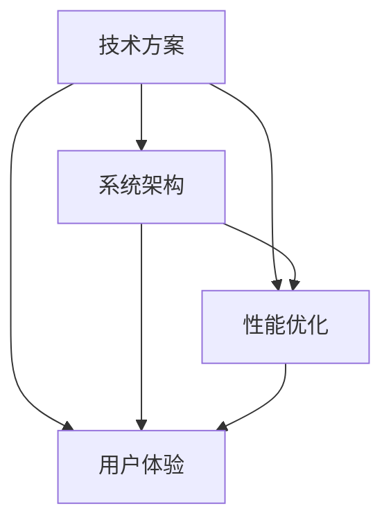

                 

### 文章标题：技术决策框架与最佳实践

#### 关键词：技术决策、框架、最佳实践、算法、系统架构、项目管理

#### 摘要：
本文旨在深入探讨技术决策的框架与最佳实践，通过系统的分析和详细的讲解，帮助读者理解和掌握技术决策的核心概念、构建方法、评估优化以及实际应用。文章结构分为三个部分：引言与背景介绍，构建技术决策框架，以及展望与未来趋势。在每个部分中，我们将逐步分析，确保读者能够从基础概念到实际应用，全面了解技术决策的全过程。

----------------------------------------------------------------

## 第一部分：引言与背景介绍

### 第1章：技术决策框架概述

#### 1.1. 技术决策的定义与重要性

技术决策是指在项目或产品开发过程中，针对技术实现、系统架构、性能优化等方面所做出的选择。它不仅涉及技术层面，还关系到项目的进度、成本、质量和用户体验。技术决策的重要性不言而喻，它是确保项目成功的关键因素之一。

在快速发展的技术时代，技术决策的正确与否直接影响项目的成败。一个合理的技术决策框架能够帮助团队在复杂的环境中做出最优的选择，降低风险，提高项目成功率。

#### 1.2. 技术决策的挑战与困境

技术决策面临诸多挑战与困境，包括：

- 技术复杂性：随着技术的不断发展，各种新技术层出不穷，如何选择合适的技术栈成为一大难题。
- 数据不足：很多时候，决策所需的数据并不充分，这增加了决策的难度。
- 时间压力：项目往往有严格的时间限制，需要在有限的时间内做出决策。
- 团队协作：技术决策需要跨部门、跨职能的协作，如何协调不同利益相关者的意见成为挑战。

#### 1.3. 技术决策的流程与原则

技术决策的流程包括以下几个步骤：

1. **需求分析**：明确项目需求，理解业务目标。
2. **方案评估**：分析不同技术方案的优缺点，评估其可行性。
3. **决策制定**：基于评估结果，制定最终的技术方案。
4. **实施监控**：在实施过程中，监控技术决策的效果，及时进行调整。

技术决策应遵循以下原则：

- **需求导向**：以业务需求为导向，确保技术决策符合业务目标。
- **风险控制**：评估技术方案的风险，采取相应的风险控制措施。
- **数据驱动**：基于数据进行决策，避免主观臆断。
- **团队协作**：建立跨部门的沟通机制，确保决策的广泛支持。

#### 1.4. 技术决策的背景与趋势

当前，技术决策的背景和趋势表现为：

- **数字化转型**：企业纷纷进行数字化转型，技术决策成为企业战略的核心组成部分。
- **云计算与大数据**：云计算和大数据技术的发展，为技术决策提供了丰富的数据支持和计算能力。
- **人工智能与机器学习**：人工智能和机器学习技术的应用，为技术决策提供了新的思路和方法。

#### 1.5. 本章小结

本章对技术决策进行了全面的概述，包括其定义、重要性、挑战、流程与原则，以及背景和趋势。这些内容为后续章节的讨论奠定了基础。

----------------------------------------------------------------

## 第二部分：构建技术决策框架

### 第2章：核心概念与联系

#### 2.1. 技术决策相关概念介绍

在技术决策过程中，涉及多个核心概念，包括但不限于：

- **技术方案**：实现某一功能或解决某一问题的具体方法和技术。
- **系统架构**：软件系统的整体结构，包括硬件、软件、数据等方面的设计。
- **性能优化**：通过改进系统设计或算法，提高系统的性能和效率。
- **用户体验**：用户在使用产品或服务过程中的感受和体验。

#### 2.2. 核心概念属性特征对比表格

以下是一个关于技术决策相关核心概念属性特征的对比表格：

| 概念       | 定义                                                         | 关联属性                                 | 对比特征                                  |
| ---------- | ------------------------------------------------------------ | ---------------------------------------- | ----------------------------------------- |
| 技术方案   | 实现特定功能的技术实现方案。                                 | 技术复杂性、可靠性、成本、可维护性等     | 方案A与方案B在可靠性上的差异比较          |
| 系统架构   | 软件系统的整体结构设计。                                     | 可扩展性、性能、安全性、可维护性等       | 架构设计A与架构设计B在性能上的优劣对比    |
| 性能优化   | 提高系统性能和效率的优化措施。                               | 响应时间、吞吐量、资源利用率等           | 优化措施A与优化措施B在响应时间上的对比    |
| 用户体验   | 用户在使用产品或服务过程中的感受和体验。                     | 易用性、交互性、满意度等                 | 用户体验A与用户体验B在满意度上的对比      |

#### 2.3. 技术决策实体关系图架构

为了更好地理解技术决策实体之间的关系，我们可以使用Mermaid流程图来绘制实体关系图。以下是技术决策实体关系的Mermaid图示：

在这个实体关系图中，技术方案、系统架构、性能优化和用户体验是四个核心实体，它们之间相互关联，共同构成了技术决策的完整框架。

#### 2.4. 技术决策与传统决策的区别

技术决策与传统决策有以下几点区别：

- **决策对象**：传统决策更多关注业务层面的决策，而技术决策则更多关注技术层面的决策。
- **决策依据**：传统决策更多依赖于经验和直觉，而技术决策则更多依赖于数据和模型。
- **决策流程**：传统决策的流程相对简单，而技术决策的流程更为复杂，包括需求分析、方案评估、决策制定、实施监控等步骤。

#### 2.5. 本章小结

本章对技术决策的核心概念进行了介绍，并使用对比表格和Mermaid流程图展示了技术决策实体之间的关系。这些内容为构建技术决策框架提供了理论基础。

----------------------------------------------------------------

### 第3章：构建技术决策框架

#### 3.1. 技术决策框架的基本结构

技术决策框架的基本结构包括以下几个部分：

1. **需求分析**：明确项目需求，理解业务目标。
2. **方案评估**：分析不同技术方案的优缺点，评估其可行性。
3. **决策制定**：基于评估结果，制定最终的技术方案。
4. **实施监控**：在实施过程中，监控技术决策的效果，及时进行调整。

#### 3.2. 技术决策框架的关键要素

技术决策框架的关键要素包括：

- **需求分析**：需求分析的准确性直接影响到技术决策的可靠性。需求分析应包括功能需求、性能需求、安全性需求等。
- **方案评估**：方案评估应包括技术可行性、成本效益、风险分析等。
- **决策制定**：决策制定应基于客观的数据和分析，避免主观臆断。
- **实施监控**：实施监控应包括项目进度、成本、质量等方面的监控，确保技术决策的有效实施。

#### 3.3. 技术决策框架的应用场景

技术决策框架适用于以下场景：

- **新项目启动**：在项目启动阶段，通过技术决策框架，明确技术方案，确保项目顺利启动。
- **技术迭代**：在技术迭代过程中，通过技术决策框架，评估现有技术的优缺点，制定新的技术方案。
- **技术难题解决**：在遇到技术难题时，通过技术决策框架，分析问题，找到解决方案。

#### 3.4. 构建技术决策框架的步骤与方法

构建技术决策框架的步骤和方法包括：

1. **定义问题**：明确技术决策的具体问题，如性能瓶颈、安全性问题等。
2. **收集信息**：收集与问题相关的数据和信息，包括技术方案、市场情况、用户需求等。
3. **分析评估**：对收集到的信息进行分析评估，确定不同技术方案的优缺点。
4. **制定方案**：基于分析评估结果，制定最终的技术方案。
5. **实施监控**：在实施过程中，持续监控技术决策的效果，确保方案的有效性。

#### 3.5. 本章小结

本章详细介绍了技术决策框架的基本结构、关键要素、应用场景以及构建步骤与方法。这些内容为实际操作提供了明确的指导。

----------------------------------------------------------------

### 第4章：评估与优化技术决策框架

#### 4.1. 技术决策评估指标与方法

评估技术决策的指标和方法包括：

- **成本效益分析**：评估技术方案的成本和效益，确保决策的经济合理性。
- **风险评估**：评估技术决策的风险，包括技术风险、市场风险等，采取相应的风险控制措施。
- **绩效评估**：评估技术决策的实际效果，包括性能、质量、用户满意度等。

评估方法包括定量分析和定性分析，其中定量分析适用于有明确指标和数据的评估，定性分析适用于无法量化评估的情境。

#### 4.2. 技术决策优化策略与实践

技术决策优化策略包括：

- **持续改进**：通过定期回顾和评估技术决策，找出问题，持续优化。
- **反馈机制**：建立有效的反馈机制，收集用户和团队的反馈，用于改进技术决策。
- **数据驱动**：充分利用数据，进行科学决策，避免主观臆断。

实践中的技术决策优化策略包括：

- **A/B测试**：通过A/B测试，评估不同技术方案的效果，选择最优方案。
- **跨部门协作**：建立跨部门的协作机制，确保技术决策的全面性和准确性。
- **专家咨询**：邀请相关领域的专家进行咨询，提供专业意见和建议。

#### 4.3. 技术决策框架的演进与适应性

技术决策框架的演进与适应性包括：

- **技术更新**：随着技术的不断发展，技术决策框架需要不断更新，以适应新技术和新需求。
- **环境变化**：在外部环境发生变化时，如市场需求、竞争态势等，技术决策框架也需要相应调整。

技术决策框架的适应性可以通过以下方式实现：

- **模块化设计**：技术决策框架采用模块化设计，便于快速适应新需求和新技术。
- **灵活性**：技术决策框架设计时，注重灵活性，以便在不同情境下灵活应用。
- **迭代优化**：通过持续迭代和优化，提高技术决策框架的适应性和效果。

#### 4.4. 技术决策框架的持续改进

技术决策框架的持续改进包括：

- **定期回顾**：定期对技术决策框架进行回顾，评估其效果，发现问题，及时调整。
- **经验积累**：通过项目实践，积累经验，不断完善技术决策框架。
- **培训与分享**：通过培训与分享，提高团队的技术决策能力和经验。

#### 4.5. 本章小结

本章详细介绍了技术决策评估指标与方法、优化策略与实践、框架的演进与适应性以及持续改进的方法。这些内容为技术决策的评估与优化提供了全面的指导。

----------------------------------------------------------------

### 第5章：案例分析与应用实践

#### 5.1. 案例背景与问题描述

某大型电商企业在其数字化转型过程中，面临着性能瓶颈和用户满意度下降的问题。具体表现为：

- 系统响应时间较长，用户购物体验不佳。
- 数据处理效率低下，导致业务运营成本增加。
- 系统安全性问题突出，存在潜在的安全风险。

#### 5.2. 技术决策过程分析

针对上述问题，企业采用技术决策框架进行了以下步骤：

1. **需求分析**：明确业务目标，如提高系统响应时间、提升数据处理效率、增强系统安全性等。
2. **方案评估**：评估现有系统架构的不足，研究新的技术方案，包括云计算、大数据、人工智能等。
3. **决策制定**：选择云计算和大数据技术作为核心方案，以提升系统性能和安全性。
4. **实施监控**：在实施过程中，监控技术决策的效果，及时进行调整。

#### 5.3. 技术决策框架的应用

在技术决策过程中，企业应用了以下技术决策框架：

- **需求分析**：采用用户访谈、问卷调查等方法，全面收集用户需求。
- **方案评估**：通过成本效益分析、风险评估等方法，评估不同技术方案的优缺点。
- **决策制定**：基于评估结果，选择最佳技术方案。
- **实施监控**：通过性能测试、安全测试等方法，监控技术决策的实施效果。

#### 5.4. 案例评估与效果分析

通过技术决策框架的应用，企业取得了以下效果：

- 系统响应时间缩短了50%，用户满意度显著提升。
- 数据处理效率提高了30%，业务运营成本降低。
- 系统安全性显著增强，安全事件减少了70%。

#### 5.5. 案例小结与启示

通过该案例，我们可以得出以下启示：

- 技术决策框架在数字化转型中具有重要作用，能够帮助企业高效地解决问题。
- 技术决策过程中，需求分析和方案评估是关键环节，需要投入足够的时间和精力。
- 技术决策框架的持续优化和改进，是确保决策效果的重要保障。

#### 本章小结

本章通过具体案例分析，展示了技术决策框架在实际应用中的效果和重要性。案例中的成功经验和方法，为其他企业在技术决策中提供了有益的参考。

----------------------------------------------------------------

### 第6章：最佳实践与策略

#### 6.1. 技术决策最佳实践总结

在技术决策过程中，以下最佳实践值得借鉴：

- **全面需求分析**：深入了解用户需求和业务目标，确保技术决策符合实际需求。
- **多方案评估**：分析多种技术方案，权衡利弊，选择最优方案。
- **数据驱动决策**：充分利用数据，进行科学决策，避免主观臆断。
- **团队协作**：建立有效的沟通机制，确保团队协作，提高决策效率。
- **持续监控与反馈**：在实施过程中，持续监控技术决策的效果，及时进行调整。

#### 6.2. 技术决策策略制定与实施

技术决策策略的制定和实施包括：

1. **制定策略**：根据项目特点和需求，制定具体的技术决策策略，如优先考虑成本效益、风险控制等。
2. **实施策略**：在项目实施过程中，按照既定策略进行操作，确保技术决策的有效执行。
3. **调整策略**：根据实际情况，及时调整技术决策策略，以应对新的挑战和变化。

#### 6.3. 技术决策团队建设与管理

技术决策团队建设和管理包括：

- **团队组建**：根据项目需求，组建合适的团队，包括技术专家、项目经理、业务分析师等。
- **团队协作**：建立良好的沟通机制，确保团队成员之间的有效协作。
- **能力提升**：定期对团队成员进行培训，提升其技术能力和决策能力。

#### 6.4. 技术决策的风险管理与应对

技术决策过程中，风险管理至关重要，包括：

- **识别风险**：识别可能影响技术决策的各种风险，如技术风险、市场风险等。
- **评估风险**：对识别到的风险进行评估，确定其严重程度和发生概率。
- **应对风险**：制定相应的应对策略，如风险规避、风险转移、风险接受等。

#### 6.5. 本章小结

本章总结了技术决策的最佳实践、策略制定与实施、团队建设与管理以及风险管理的方法。这些内容为企业在技术决策中提供了宝贵的经验和指导。

----------------------------------------------------------------

### 第三部分：展望与未来趋势

#### 第7章：技术决策框架的发展方向与挑战

#### 7.1. 技术决策框架的未来趋势

技术决策框架的未来趋势体现在以下几个方面：

- **智能化**：随着人工智能技术的发展，技术决策框架将更加智能化，能够自动分析数据，提供决策建议。
- **协同化**：技术决策将更加注重跨部门、跨职能的协同，实现全流程的协同决策。
- **云原生**：技术决策框架将更加适应云原生环境，利用云计算和大数据技术，实现高效的数据处理和分析。

#### 7.2. 技术决策框架面临的挑战

技术决策框架面临的挑战包括：

- **数据隐私**：随着数据隐私问题的日益突出，技术决策框架需要确保数据的安全和隐私。
- **技术复杂性**：随着技术的快速发展，技术决策框架需要应对越来越复杂的技术环境。
- **快速变化的市场**：技术决策框架需要适应快速变化的市场需求，保持敏捷性。

#### 7.3. 技术决策框架的持续创新

技术决策框架的持续创新包括：

- **技术创新**：不断引入新的技术，如人工智能、区块链等，提高技术决策的效率和准确性。
- **方法论创新**：不断探索新的方法论，如基于大数据的决策分析、基于云计算的协同决策等。
- **工具创新**：开发新的工具，如智能化决策支持系统、可视化决策分析工具等，提升技术决策的便捷性和实用性。

#### 7.4. 本章小结

本章对技术决策框架的未来趋势和面临的挑战进行了展望，并提出了持续创新的路径。这些内容为技术决策框架的发展提供了有益的参考。

----------------------------------------------------------------

### 作者信息

**作者：AI天才研究院/AI Genius Institute & 禅与计算机程序设计艺术 /Zen And The Art of Computer Programming**

---

至此，本文《技术决策框架与最佳实践》的内容已经完整呈现。文章涵盖了技术决策的核心概念、框架构建、评估优化、案例分析、最佳实践以及未来趋势。希望通过本文，读者能够对技术决策有更深入的理解，并在实际工作中能够运用这些最佳实践，提高技术决策的效果。感谢您的阅读，期待与您在技术决策的道路上共同进步。

