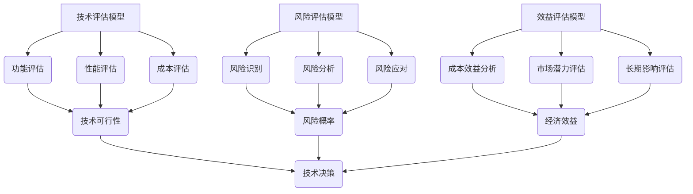
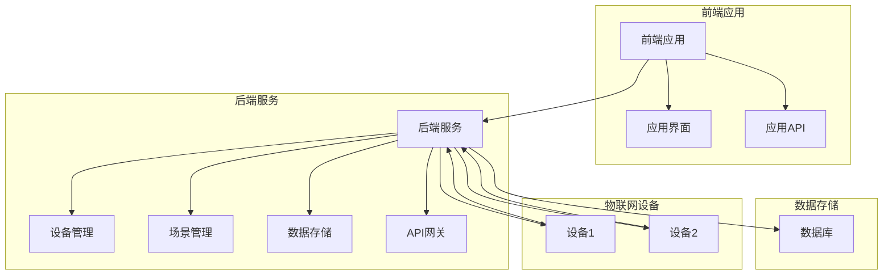
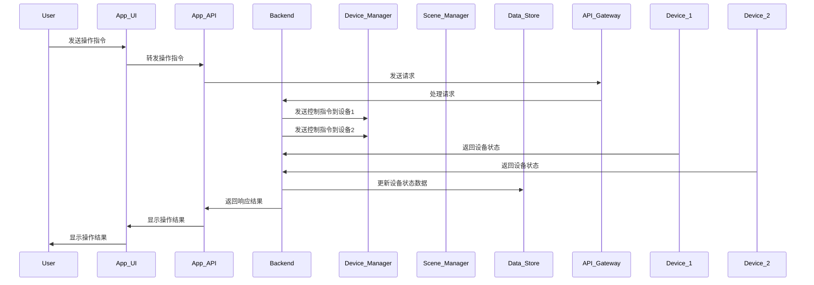

                 

### 文章标题

# 技术决策框架：在不确定中做出最佳选择

关键词：技术决策、不确定、最佳选择、框架、算法

摘要：本文将探讨在技术决策过程中面临的不确定性，并介绍一种有效应对不确定性的技术决策框架。通过逐步分析决策框架的核心概念、联系及其应用流程，本文旨在为读者提供一个清晰、实用且易于理解的技术决策方法论，帮助读者在复杂的技术环境中做出明智且高效的选择。

----------------------------------------------------------------

## 目录大纲

### 第一部分：背景介绍

- **1.1 问题背景**
  - **1.1.1 现实中的不确定性与技术决策的挑战**
  - **1.1.2 技术决策框架的重要性**
  - **1.1.3 本书的目标与结构**

- **1.2 核心概念**
  - **1.2.1 技术决策框架的定义**
  - **1.2.2 决策制定过程中的关键要素**
  - **1.2.3 技术决策框架与传统决策框架的异同**

- **1.3 边界与外延**
  - **1.3.1 技术决策的应用场景**
  - **1.3.2 技术决策的边界限制**
  - **1.3.3 技术决策框架的发展趋势**

- **1.4 概念结构与核心要素**
  - **1.4.1 技术决策框架的组成结构**
  - **1.4.2 核心要素及其相互关系**
  - **1.4.3 技术决策框架的应用流程**

- **1.5 本章小结**

### 第二部分：技术决策框架的核心概念与联系

- **2.1 核心概念原理**
  - **2.1.1 技术评估模型**
  - **2.1.2 风险评估模型**
  - **2.1.3 效益评估模型**

- **2.2 概念属性特征对比**
  
- **2.3 ER实体关系图架构**

- **2.4 本章小结**

### 第三部分：算法原理讲解

- **3.1 技术评估算法原理**
  - **3.1.1 技术评估算法的基本流程**
  - **3.1.2 评估指标的选择与计算**
  - **3.1.3 技术评估算法的实现**

- **3.1.4 技术评估算法的Python源代码**
  
- **3.1.5 技术评估算法原理的详细讲解**
  
- **3.1.6 举例说明**

- **3.2 风险评估算法原理**
  - **3.2.1 风险评估算法的基本流程**
  - **3.2.2 风险因素的选择与评估**
  - **3.2.3 风险评估算法的实现**

- **3.2.4 风险评估算法原理的详细讲解**

- **3.2.5 举例说明**

- **3.3 效益评估算法原理**
  - **3.3.1 效益评估算法的基本流程**
  - **3.3.2 效益指标的选择与计算**
  - **3.3.3 效益评估算法的实现**

- **3.3.4 效益评估算法原理的详细讲解**

- **3.3.5 举例说明**

- **3.4 本章小结**

### 第四部分：系统分析与架构设计方案

- **4.1 问题场景介绍**

- **4.2 项目介绍**

- **4.3 系统功能设计**

- **4.4 系统架构设计**

- **4.5 系统接口设计和系统交互**

- **4.6 本章小结**

### 第五部分：项目实战

- **5.1 环境安装**

- **5.2 系统核心实现源代码**

- **5.3 代码应用解读与分析**

- **5.4 实际案例分析和详细讲解剖析**

- **5.5 项目小结**

### 第六部分：最佳实践 tips

- **6.1 小结**

- **6.2 注意事项**

- **6.3 拓展阅读**

## 第一部分：背景介绍

### 1.1 问题背景

在当今快速发展的信息技术领域，技术决策的复杂性日益增加。企业和组织需要不断应对新的技术趋势和市场需求，以便在激烈的市场竞争中保持竞争力。然而，技术决策过程往往伴随着诸多不确定因素，如技术复杂性、市场变化、资源限制等。如何在不确定的环境中做出最佳选择，成为了一个亟待解决的问题。

**1.1.1 现实中的不确定性与技术决策的挑战**

技术决策过程中的不确定性主要来源于以下几个方面：

1. **技术复杂性**：随着技术的发展，新技术的种类和实现方式越来越多，技术复杂性不断增加。这使得决策者在选择技术方案时面临巨大的挑战。
   
2. **市场变化**：市场需求和技术趋势不断变化，可能导致原有的技术方案不再适用。这种市场的不确定性要求决策者具备快速调整和适应能力。

3. **资源限制**：企业通常面临资源限制，包括资金、人力和时间等。如何在有限的资源下做出最佳的技术决策，是决策者面临的一个重要问题。

4. **风险因素**：技术决策过程中可能涉及到各种风险，如技术风险、市场风险、政策风险等。这些风险因素增加了决策的难度和不确定性。

**1.1.2 技术决策框架的重要性**

在面对不确定性的情况下，建立一个有效的技术决策框架显得尤为重要。技术决策框架提供了一种系统化、结构化的方法，帮助决策者更好地理解和应对技术决策过程中的不确定性。以下是技术决策框架的几个关键作用：

1. **明确决策目标**：技术决策框架可以帮助决策者明确决策的目标和优先级，从而避免盲目决策和资源浪费。

2. **系统分析问题**：技术决策框架提供了一种系统化的分析方法，使决策者能够全面、深入地了解技术决策问题，从而做出更明智的选择。

3. **减少决策风险**：通过技术评估、风险评估和效益评估等环节，技术决策框架可以帮助决策者识别和评估技术方案的风险，从而降低决策风险。

4. **提高决策效率**：技术决策框架提供了一种标准化的决策流程，有助于提高决策效率，缩短决策周期。

**1.1.3 本书的目标与结构**

本书的目标是介绍一种适用于不确定环境中的技术决策框架，帮助读者在复杂的技术决策过程中做出明智的选择。本书的结构如下：

1. **背景介绍**：介绍技术决策过程中面临的不确定性和挑战，阐述技术决策框架的重要性。

2. **核心概念与联系**：详细解释技术决策框架的核心概念，包括技术评估模型、风险评估模型和效益评估模型，并展示它们之间的联系。

3. **算法原理讲解**：介绍技术评估算法、风险评估算法和效益评估算法的原理，包括基本流程、指标选择与计算方法，以及实现细节。

4. **系统分析与架构设计方案**：介绍一个实际的技术决策项目，从问题场景介绍、系统功能设计、系统架构设计到系统接口设计和系统交互，提供全面的分析和设计思路。

5. **项目实战**：通过一个实际案例，展示技术决策框架的应用过程，包括环境安装、系统核心实现、代码解读与分析等。

6. **最佳实践 tips**：总结本书的关键知识点，提供一些最佳实践建议，帮助读者更好地应用技术决策框架。

通过本书的介绍，读者将能够理解技术决策框架的基本原理和应用方法，从而在面对技术决策挑战时能够更加从容和高效地做出最佳选择。

### 1.2 核心概念

**1.2.1 技术决策框架的定义**

技术决策框架是指一种系统化的方法，用于指导决策者在技术环境中识别问题、分析选项、评估风险和效益，并最终做出最佳选择。它不仅涵盖了技术评估、风险评估和效益评估等核心环节，还提供了一套完整的流程和方法，帮助决策者在不确定的环境中做出明智的技术决策。

**1.2.2 决策制定过程中的关键要素**

技术决策框架的制定和执行涉及多个关键要素，这些要素相互作用，共同构成了一个完整的技术决策过程。以下是这些关键要素的详细介绍：

1. **问题识别**：技术决策的起点是识别问题。决策者需要明确当前面临的挑战和需求，以便为后续决策提供明确的方向。

2. **选项分析**：在识别问题后，决策者需要分析可供选择的技术方案。这包括评估各种技术的优点和缺点、适用场景和实施难度等。

3. **技术评估**：技术评估是对各个技术方案进行详细分析和比较的过程。它通常包括功能评估、性能评估和成本评估等多个方面，以确定各个技术方案的技术成熟度和可行性。

4. **风险评估**：技术决策过程中不可避免地涉及到各种风险。风险评估旨在识别和评估技术方案中可能存在的风险，并制定相应的应对措施。

5. **效益评估**：效益评估是对各个技术方案预期效益的评估。它通常包括成本效益分析、市场潜力评估和长期影响评估等，以确定各个技术方案的价值和潜在收益。

6. **决策制定**：在完成技术评估、风险评估和效益评估后，决策者需要根据评估结果制定最终的技术决策。这个环节通常需要综合考虑各种因素，并权衡利弊，以确保决策的科学性和合理性。

7. **决策执行**：决策制定后，决策者需要将决策转化为实际行动。这包括制定详细的实施计划、分配资源、监控进度和质量等。

**1.2.3 技术决策框架与传统决策框架的异同**

与传统决策框架相比，技术决策框架在以下几个方面有所不同：

1. **强调技术性**：传统决策框架通常更侧重于业务和战略层面的决策，而技术决策框架则更注重技术层面的分析和评估。技术决策框架强调对技术方案的技术成熟度、可行性和效果进行深入分析。

2. **考虑不确定性**：技术决策框架在面对不确定性时具有更强的适应性和灵活性。它通过系统化的风险评估和效益评估，帮助决策者更好地应对技术决策过程中的不确定性。

3. **系统性**：技术决策框架提供了一个完整的决策流程和方法，使决策过程更加系统化和规范化。传统决策框架可能更注重个别环节的优化，而技术决策框架则注重各个环节之间的协同和衔接。

4. **动态调整**：技术决策框架允许决策者在决策过程中进行动态调整。在技术环境和市场变化较快的情况下，这种动态调整能力显得尤为重要。

**1.3 边界与外延**

**1.3.1 技术决策的应用场景**

技术决策框架适用于多种技术环境和场景，包括但不限于以下几个方面：

1. **企业技术创新**：企业在进行技术创新和研发时，需要选择合适的技术路线和方案，以实现技术突破和产品创新。

2. **IT系统选型**：企业在建设IT系统时，需要从多种技术和产品中选择最适合的方案，以满足业务需求并降低成本。

3. **市场进入策略**：企业在进入新市场时，需要评估各种市场进入策略的技术可行性、风险和效益，以便制定最佳的市场进入方案。

4. **项目规划与执行**：在项目管理和执行过程中，技术决策框架可以帮助项目经理和技术团队在技术和资源约束下做出最佳选择，确保项目顺利完成。

**1.3.2 技术决策的边界限制**

尽管技术决策框架具有广泛的适用性，但在实际应用过程中仍存在一些边界限制：

1. **数据限制**：技术评估、风险评估和效益评估需要大量准确的数据支持。在数据不足或数据质量不高的情况下，决策结果可能会受到影响。

2. **时间限制**：技术决策框架的实施需要一定的时间和资源。在时间紧迫或资源有限的情况下，决策过程可能无法完全按照框架要求进行。

3. **技术复杂性**：某些技术决策问题非常复杂，涉及多种技术和领域。在技术复杂度较高的情况下，技术决策框架可能无法完全覆盖所有细节。

**1.3.3 技术决策框架的发展趋势**

随着信息技术的发展和市场环境的变化，技术决策框架也在不断演变和优化。以下是技术决策框架的一些发展趋势：

1. **智能化**：随着人工智能和大数据技术的发展，技术决策框架正在向智能化和自动化方向演进。通过引入机器学习和数据挖掘技术，决策框架能够更高效地分析和评估技术方案。

2. **灵活性和适应性**：技术决策框架正在向更加灵活和适应性强的方向发展。通过模块化和参数化设计，决策框架能够更好地适应不同场景和需求。

3. **可视化**：技术决策框架的展示方式也在不断改进，以实现更好的可视化和交互性。通过图表、仪表板和交互式界面，决策者能够更直观地了解决策过程和结果。

4. **跨领域整合**：技术决策框架正在向跨领域整合的方向发展，将不同的技术领域和业务领域进行整合，以实现更全面的决策支持。

**1.4 概念结构与核心要素**

**1.4.1 技术决策框架的组成结构**

技术决策框架由多个核心模块组成，每个模块在决策过程中承担不同的职责。以下是技术决策框架的基本组成结构：

1. **问题识别模块**：该模块用于识别和明确技术决策问题，为后续决策提供基础。

2. **选项分析模块**：该模块用于分析和比较不同的技术方案，为决策者提供可选的技术方案。

3. **技术评估模块**：该模块用于对各个技术方案进行详细评估，包括功能评估、性能评估和成本评估等。

4. **风险评估模块**：该模块用于识别和评估技术方案中的风险，并制定相应的应对措施。

5. **效益评估模块**：该模块用于评估各个技术方案的预期效益，包括成本效益分析和市场潜力评估等。

6. **决策制定模块**：该模块用于根据评估结果制定最终的技术决策，并制定详细的实施计划。

7. **决策执行模块**：该模块用于将技术决策转化为实际行动，包括资源分配、进度监控和质量保证等。

**1.4.2 核心要素及其相互关系**

技术决策框架中的核心要素包括问题识别、选项分析、技术评估、风险评估、效益评估、决策制定和决策执行。这些要素相互关联，共同构成了一个完整的决策过程。

1. **问题识别**：问题识别是决策过程的起点，决定了后续决策的方向和目标。问题识别模块需要准确识别和明确技术决策问题，以便为后续环节提供基础。

2. **选项分析**：选项分析模块在问题识别的基础上，分析和比较不同的技术方案，为决策者提供可选的技术方案。这个环节需要全面了解各个方案的优点和缺点，以及适用场景。

3. **技术评估**：技术评估模块对各个技术方案进行详细评估，包括功能评估、性能评估和成本评估等。这个环节需要根据具体的技术指标和需求，对各个方案进行全面评估，以确定其技术成熟度和可行性。

4. **风险评估**：风险评估模块用于识别和评估技术方案中的风险，并制定相应的应对措施。这个环节需要综合考虑技术风险、市场风险和政策风险等因素，以评估各个方案的风险水平。

5. **效益评估**：效益评估模块用于评估各个技术方案的预期效益，包括成本效益分析和市场潜力评估等。这个环节需要从多个角度评估各个方案的价值和潜在收益，以确定其效益水平。

6. **决策制定**：决策制定模块根据评估结果，制定最终的技术决策，并制定详细的实施计划。这个环节需要综合考虑各种因素，包括技术评估、风险评估和效益评估的结果，以制定科学合理的决策方案。

7. **决策执行**：决策执行模块将技术决策转化为实际行动，包括资源分配、进度监控和质量保证等。这个环节需要确保决策方案的顺利实施，并监控实施过程中的关键指标，以确保决策目标的实现。

**1.4.3 技术决策框架的应用流程**

技术决策框架的应用流程可以分为以下几个步骤：

1. **问题识别**：明确技术决策问题，为后续决策提供基础。

2. **选项分析**：分析和比较不同的技术方案，为决策者提供可选的技术方案。

3. **技术评估**：对各个技术方案进行详细评估，包括功能评估、性能评估和成本评估等。

4. **风险评估**：识别和评估技术方案中的风险，并制定相应的应对措施。

5. **效益评估**：评估各个技术方案的预期效益，包括成本效益分析和市场潜力评估等。

6. **决策制定**：根据评估结果制定最终的技术决策，并制定详细的实施计划。

7. **决策执行**：将技术决策转化为实际行动，包括资源分配、进度监控和质量保证等。

通过以上步骤，决策者能够系统地分析和评估技术方案，最终做出科学合理的技术决策。

**1.5 本章小结**

本章介绍了技术决策框架的背景、核心概念、应用场景和边界限制。通过对技术决策框架的组成结构和核心要素的详细分析，读者可以更好地理解技术决策框架的基本原理和应用方法。在接下来的章节中，我们将进一步探讨技术决策框架的核心概念和联系，为读者提供更深入的理论和实践指导。

## 第二部分：技术决策框架的核心概念与联系

### 2.1 核心概念原理

技术决策框架的核心概念包括技术评估模型、风险评估模型和效益评估模型。这些模型在决策过程中发挥着重要作用，确保决策者能够全面、系统地分析技术方案。

#### 2.1.1 技术评估模型

技术评估模型用于评估技术方案的技术成熟度和可行性。它通常包括以下方面：

1. **功能评估**：评估技术方案是否满足业务需求，包括功能的全面性和可靠性。
2. **性能评估**：评估技术方案的性能指标，如响应时间、处理能力等，确保其能够满足性能要求。
3. **成本评估**：评估技术方案的开发和运营成本，包括人力、硬件和软件成本等。

技术评估模型通过定量和定性的方法，对技术方案的各个方面进行综合评估，以确定其技术可行性。

#### 2.1.2 风险评估模型

风险评估模型用于识别和评估技术方案中的各种风险。其主要内容包括：

1. **风险识别**：识别可能影响技术方案的各种风险，如技术风险、市场风险、政策风险等。
2. **风险分析**：分析各个风险的概率和影响程度，评估其对技术决策的潜在影响。
3. **风险应对**：制定应对措施，降低风险发生的概率和影响程度，确保技术方案的稳定性和可靠性。

风险评估模型通过系统化的方法，帮助决策者全面了解技术方案的风险情况，从而做出更科学的决策。

#### 2.1.3 效益评估模型

效益评估模型用于评估技术方案的预期效益，包括经济、社会和环境效益。其主要内容包括：

1. **成本效益分析**：分析技术方案的成本和预期效益，确定其经济效益。
2. **市场潜力评估**：评估技术方案在市场上的竞争力和潜在市场空间。
3. **长期影响评估**：分析技术方案对企业和市场的长期影响，包括技术领导力、品牌影响等。

效益评估模型通过综合评估技术方案的多方面效益，帮助决策者确定最佳的技术方案。

### 2.2 概念属性特征对比

为了更好地理解技术评估模型、风险评估模型和效益评估模型的差异和联系，我们可以通过以下表格进行属性特征对比：

| 模型名称       | 关键特征                                                     | 主要作用                                           |
|--------------|----------------------------------------------------------|----------------------------------------------------|
| 技术评估模型   | 功能性、性能性、成本性                                     | 评估技术方案的技术成熟度和可行性                   |
| 风险评估模型   | 风险识别、风险分析、风险应对                               | 识别和评估技术方案中的各种风险                   |
| 效益评估模型   | 成本效益、市场潜力、长期影响                               | 评估技术方案的预期效益和潜在收益                   |

通过对比，我们可以发现：

- 技术评估模型主要关注技术方案的内部属性，如功能、性能和成本，以确保其技术可行性。
- 风险评估模型则关注技术方案面临的外部风险，如市场变化、政策影响等，以确保技术方案的稳定性。
- 效益评估模型则从多角度评估技术方案的经济、社会和环境效益，确保技术方案的价值和可持续性。

这些模型共同构成了技术决策框架，帮助决策者在复杂的技术环境中做出全面、科学和合理的决策。

### 2.3 ER实体关系图架构

为了更直观地展示技术决策框架中各个模型之间的关系，我们可以使用ER（实体-关系）图来表示。以下是技术决策框架的ER实体关系图：



在这张ER图中：

- **技术评估模型**包括功能评估、性能评估和成本评估，这些评估结果共同决定了技术方案的技术可行性（E）。
- **风险评估模型**包括风险识别、风险分析和风险应对，这些评估结果共同决定了技术方案的风险水平（J）。
- **效益评估模型**包括成本效益分析、市场潜力评估和长期影响评估，这些评估结果共同决定了技术方案的经济效益（O）。

这些评估结果最终共同影响了技术决策（P），使决策者能够根据全面的信息做出最佳选择。

### 2.4 本章小结

本章详细介绍了技术决策框架中的核心概念，包括技术评估模型、风险评估模型和效益评估模型。通过对比这些模型的关键特征和相互关系，以及ER实体关系图的展示，读者可以更清晰地理解技术决策框架的基本原理和应用方法。在接下来的章节中，我们将进一步探讨技术评估算法的原理和实现，以帮助读者更好地应用技术决策框架进行实际的技术决策。

### 3.1 技术评估算法原理

技术评估算法是技术决策框架的核心组成部分，用于对不同的技术方案进行定量评估，以便为决策者提供科学依据。在这一部分，我们将详细讲解技术评估算法的基本流程、评估指标的选择与计算方法，以及算法的实现。

#### 3.1.1 技术评估算法的基本流程

技术评估算法的基本流程可以分为以下几个步骤：

1. **需求分析**：明确技术方案需要满足的业务需求和技术要求，为后续评估提供依据。
2. **指标选择**：根据需求分析结果，选择适合的评估指标，包括功能性、性能性和成本性指标。
3. **数据收集**：收集与评估指标相关的数据，如功能点数、性能测试结果和成本数据等。
4. **指标计算**：对收集到的数据进行计算，得到每个指标的得分。
5. **综合评估**：将各指标的得分进行加权处理，得到综合评估分数，用于判断技术方案的优劣。
6. **结果输出**：将评估结果输出，为决策者提供参考。

#### 3.1.2 评估指标的选择与计算

在技术评估过程中，评估指标的选择至关重要。以下是一些常用的评估指标及其计算方法：

1. **功能性指标**：衡量技术方案的功能完备性和可靠性。常用的功能性指标包括功能点数、错误率等。计算公式如下：

   $$
   功能性得分 = \frac{实际功能点数}{满分功能点数}
   $$

2. **性能指标**：衡量技术方案的性能表现，如响应时间、并发处理能力等。常用的性能指标包括性能得分、性能稳定性等。计算公式如下：

   $$
   性能得分 = \frac{实际性能得分}{满分性能得分}
   $$

3. **成本指标**：衡量技术方案的开发和运营成本。常用的成本指标包括总成本、人均成本等。计算公式如下：

   $$
   成本得分 = \frac{实际成本得分}{满分成本得分}
   $$

#### 3.1.3 技术评估算法的实现

为了更好地理解技术评估算法的实现过程，我们提供了一个简单的Python示例代码。以下是技术评估算法的Python代码实现：

```python
# 技术评估算法Python示例代码

# 指标权重设置
functional_weight = 0.4
performance_weight = 0.3
cost_weight = 0.3

# 功能性指标得分
functional_score = 0.8  # 假设功能点数为8，满分10

# 性能指标得分
performance_score = 0.9  # 假设性能得分为9，满分10

# 成本指标得分
cost_score = 0.7  # 假设成本得分为7，满分10

# 计算技术评估得分
evaluation_score = functional_weight * functional_score + performance_weight * performance_score + cost_weight * cost_score

# 输出评估结果
print("技术评估得分：", evaluation_score)
```

在这个示例中，我们设置了功能性、性能性和成本性的权重分别为0.4、0.3和0.3。然后，我们分别计算了功能性得分、性能得分和成本得分，并通过加权计算得到了综合评估得分。

#### 3.1.4 技术评估算法原理的详细讲解

技术评估算法的原理可以通过以下数学模型进行详细解释：

$$
\text{技术评估分数} = w_1 \times \text{功能性得分} + w_2 \times \text{性能得分} + w_3 \times \text{成本得分}
$$

其中，$w_1, w_2, w_3$ 分别代表功能性、性能性和成本性的权重，它们的取值范围在0到1之间，且满足 $w_1 + w_2 + w_3 = 1$。这样的设置确保了各个指标在综合评估中的相对重要性。

功能性得分、性能得分和成本得分的计算方法如下：

- **功能性得分**：

  $$
  \text{功能性得分} = \frac{\text{实际功能得分}}{\text{满分功能得分}}
  $$

  假设满分功能得分为10，实际功能得分为8，则功能性得分为0.8。

- **性能得分**：

  $$
  \text{性能得分} = \frac{\text{实际性能得分}}{\text{满分性能得分}}
  $$

  假设满分性能得分为10，实际性能得分为9，则性能得分为0.9。

- **成本得分**：

  $$
  \text{成本得分} = \frac{\text{实际成本得分}}{\text{满分成本得分}}
  $$

  假设满分成本得分为10，实际成本得分为7，则成本得分为0.7。

将这些得分代入综合评估分数的计算公式，我们得到：

$$
\text{技术评估分数} = 0.4 \times 0.8 + 0.3 \times 0.9 + 0.3 \times 0.7 = 0.32 + 0.27 + 0.21 = 0.8
$$

这意味着该技术方案的综合评估得分为0.8，得分越高，表示技术方案越优秀。

#### 3.1.5 举例说明

为了更直观地展示技术评估算法的应用，我们来看一个具体的例子。

假设有两个技术方案A和B，它们的评估指标如下表所示：

| 指标          | 满分 | 方案A得分 | 方案B得分 |
| ------------- | ---- | -------- | -------- |
| 功能性指标    | 10   | 8        | 7        |
| 性能指标      | 10   | 9        | 8        |
| 成本指标      | 10   | 7        | 6        |

首先，我们计算方案A和方案B的功能性得分、性能得分和成本得分：

- **方案A**：

  $$
  功能性得分 = \frac{8}{10} = 0.8
  $$

  $$
  性能得分 = \frac{9}{10} = 0.9
  $$

  $$
  成本得分 = \frac{7}{10} = 0.7
  $$

- **方案B**：

  $$
  功能性得分 = \frac{7}{10} = 0.7
  $$

  $$
  性能得分 = \frac{8}{10} = 0.8
  $$

  $$
  成本得分 = \frac{6}{10} = 0.6
  $$

接下来，我们根据功能性、性能性和成本性的权重，计算方案A和方案B的综合评估得分：

- **方案A**：

  $$
  \text{技术评估分数} = 0.4 \times 0.8 + 0.3 \times 0.9 + 0.3 \times 0.7 = 0.32 + 0.27 + 0.21 = 0.8
  $$

- **方案B**：

  $$
  \text{技术评估分数} = 0.4 \times 0.7 + 0.3 \times 0.8 + 0.3 \times 0.6 = 0.28 + 0.24 + 0.18 = 0.7
  $$

根据计算结果，方案A的综合评估得分为0.8，方案B的综合评估得分为0.7。因此，从技术评估的角度来看，方案A比方案B更优秀。

通过这个例子，我们可以看到技术评估算法如何帮助决策者对不同的技术方案进行定量评估，从而做出更科学、合理的决策。

### 3.1.6 技术评估算法原理的详细讲解

技术评估算法是一种用于量化分析技术方案优劣的数学模型，其核心目的是为决策者提供科学依据，以支持技术选择。为了确保评估的全面性和准确性，技术评估算法通常包括多个评估指标，并赋予这些指标不同的权重。

首先，让我们定义技术评估分数的计算公式：

$$
\text{技术评估分数} = w_1 \times \text{功能指标得分} + w_2 \times \text{性能指标得分} + w_3 \times \text{成本指标得分}
$$

在这个公式中：

- $w_1, w_2, w_3$ 分别代表功能指标、性能指标和成本指标的权重，这些权重应满足以下约束条件：$w_1 + w_2 + w_3 = 1$。权重分配可以根据具体问题和决策者的偏好进行调整，但通常遵循以下原则：
  - **功能指标**：通常是最重要的，因此权重较高。
  - **性能指标**：其次重要，因此权重适中。
  - **成本指标**：相对次要，因此权重较低。

接下来，我们详细解释每个评估指标的得分计算方法：

#### 功能指标得分

功能指标得分衡量技术方案的功能完备性和可靠性。常见的功能指标包括：

1. **功能点数**：衡量技术方案包含的功能数量。
2. **错误率**：衡量技术方案在运行过程中的错误发生频率。

功能指标得分的计算公式如下：

$$
\text{功能指标得分} = \frac{\text{实际功能得分}}{\text{满分功能得分}}
$$

例如，如果满分功能得分为10，而实际功能得分为8，则功能指标得分为0.8。

#### 性能指标得分

性能指标得分衡量技术方案的性能表现，如响应时间、并发处理能力等。常见的性能指标包括：

1. **响应时间**：衡量技术方案处理请求的平均时间。
2. **处理能力**：衡量技术方案能够处理的最大请求量。

性能指标得分的计算公式如下：

$$
\text{性能指标得分} = \frac{\text{实际性能得分}}{\text{满分性能得分}}
$$

例如，如果满分性能得分为10，而实际性能得分为9，则性能指标得分为0.9。

#### 成本指标得分

成本指标得分衡量技术方案的开发和运营成本。常见的成本指标包括：

1. **总成本**：包括开发成本、硬件成本、软件成本等。
2. **人均成本**：单位人员贡献的成本。

成本指标得分的计算公式如下：

$$
\text{成本指标得分} = \frac{\text{实际成本得分}}{\text{满分成本得分}}
$$

例如，如果满分成本得分为10，而实际成本得分为7，则成本指标得分为0.7。

将以上三个指标得分带入技术评估分数的计算公式，我们可以得到一个综合评估分数。这个分数越高，表示技术方案越优秀。

#### 实际案例计算

假设有两个技术方案A和B，其评估指标如下表所示：

| 指标          | 满分 | 方案A得分 | 方案B得分 |
| ------------- | ---- | -------- | -------- |
| 功能性指标    | 10   | 8        | 7        |
| 性能指标      | 10   | 9        | 8        |
| 成本指标      | 10   | 7        | 6        |

我们假设功能指标、性能指标和成本指标的权重分别为0.5、0.3和0.2。

首先，我们计算方案A和方案B的各指标得分：

- **方案A**：

  $$
  功能性得分 = \frac{8}{10} = 0.8
  $$

  $$
  性能得分 = \frac{9}{10} = 0.9
  $$

  $$
  成本得分 = \frac{7}{10} = 0.7
  $$

- **方案B**：

  $$
  功能性得分 = \frac{7}{10} = 0.7
  $$

  $$
  性能得分 = \frac{8}{10} = 0.8
  $$

  $$
  成本得分 = \frac{6}{10} = 0.6
  $$

接下来，我们根据权重计算方案A和方案B的综合评估分数：

- **方案A**：

  $$
  \text{技术评估分数} = 0.5 \times 0.8 + 0.3 \times 0.9 + 0.2 \times 0.7 = 0.4 + 0.27 + 0.14 = 0.81
  $$

- **方案B**：

  $$
  \text{技术评估分数} = 0.5 \times 0.7 + 0.3 \times 0.8 + 0.2 \times 0.6 = 0.35 + 0.24 + 0.12 = 0.81
  $$

根据计算结果，方案A和方案B的综合评估分数相同，均为0.81。这意味着，从技术评估的角度来看，这两个技术方案在当前权重设定下具有相同的优劣程度。

通过这个实际案例，我们可以看到如何利用技术评估算法对技术方案进行量化评估。在实际应用中，决策者可以根据具体需求和情境，调整权重分配，以获得更符合预期的评估结果。

### 3.1.6 举例说明

为了更直观地展示技术评估算法的应用，我们来看一个具体的技术评估场景。

假设有两个技术方案：方案A和方案B，它们需要被评估以确定哪一个更适合实施。我们将分别对这两个方案的功能性、性能性和成本性进行评估，并计算综合评估分数。

首先，我们定义评估指标和满分：

| 指标          | 满分 |
| ------------- | ---- |
| 功能性指标    | 10   |
| 性能指标      | 10   |
| 成本指标      | 10   |

接下来，我们给方案A和方案B的每个指标打分：

#### 方案A

| 指标          | 满分 | 方案A得分 |
| ------------- | ---- | -------- |
| 功能性指标    | 10   | 8        |
| 性能指标      | 10   | 9        |
| 成本指标      | 10   | 7        |

#### 方案B

| 指标          | 满分 | 方案B得分 |
| ------------- | ---- | -------- |
| 功能性指标    | 10   | 7        |
| 性能指标      | 10   | 8        |
| 成本指标      | 10   | 6        |

现在，我们根据功能性、性能性和成本性的权重来计算综合评估分数。假设权重分别为0.4、0.3和0.3。

#### 方案A

$$
\text{技术评估分数} = 0.4 \times 8 + 0.3 \times 9 + 0.3 \times 7 = 3.2 + 2.7 + 2.1 = 8
$$

#### 方案B

$$
\text{技术评估分数} = 0.4 \times 7 + 0.3 \times 8 + 0.3 \times 6 = 2.8 + 2.4 + 1.8 = 6.8
$$

根据计算结果，方案A的综合评估分数为8，而方案B的综合评估分数为6.8。因此，从技术评估的角度来看，方案A比方案B更优秀，更值得实施。

通过这个例子，我们可以看到如何使用技术评估算法对技术方案进行定量评估，并做出科学合理的决策。实际应用中，可以根据具体需求和情境调整权重，以获得更符合预期的评估结果。

### 3.2 风险评估算法原理

风险评估算法是技术决策框架中的另一个关键组成部分，它用于识别、评估和应对技术决策过程中可能出现的各种风险。通过系统化的风险评估，决策者可以更好地理解潜在风险，并采取有效措施降低风险对项目的影响。以下是风险评估算法的基本流程、风险因素的选择与评估方法，以及算法的实现。

#### 3.2.1 风险评估算法的基本流程

风险评估算法的基本流程包括以下几个步骤：

1. **风险识别**：识别项目中可能出现的各种风险。这一步骤可以通过历史数据、专家访谈、文献调研等方法进行。
2. **风险分析**：对识别出的风险进行详细分析，包括评估风险的概率和影响程度。常用的方法有故障模式与影响分析（FMEA）、蒙特卡罗模拟等。
3. **风险评级**：根据风险的概率和影响程度，对风险进行评级。风险评级通常采用定量和定性相结合的方法，如概率-影响矩阵。
4. **风险应对**：针对不同等级的风险，制定相应的应对措施。风险应对措施包括风险规避、减轻、转移和接受等。
5. **风险监控**：在项目执行过程中，持续监控风险状态，并根据实际情况调整应对措施。

#### 3.2.2 风险因素的选择与评估

在风险评估过程中，选择和评估风险因素至关重要。以下是一些常见的风险因素及其评估方法：

1. **技术风险**：包括技术实现难度、技术成熟度、依赖的外部技术等。评估方法可以是专家评分、历史数据分析等。
2. **市场风险**：包括市场需求变化、竞争对手动态、政策法规变化等。评估方法可以是市场调研、竞争对手分析等。
3. **运营风险**：包括人员变动、供应链风险、运营效率等。评估方法可以是人员稳定性调查、供应链稳定性分析等。
4. **安全风险**：包括数据泄露、系统崩溃、网络攻击等。评估方法可以是安全测试、漏洞扫描等。

风险因素的选择应结合项目特点和决策者的需求，确保覆盖所有关键风险。

#### 3.2.3 风险评估算法的实现

为了更好地理解风险评估算法的实现，我们提供了一个简单的Python示例代码。以下是风险评估算法的Python代码实现：

```python
# 风险评估算法Python示例代码

# 风险因素及其权重
risks = {
    '技术风险': 0.5,
    '市场风险': 0.3,
    '运营风险': 0.1,
    '安全风险': 0.1
}

# 风险评分
risk_scores = {
    '技术风险': 4,
    '市场风险': 3,
    '运营风险': 2,
    '安全风险': 5
}

# 计算风险得分
def calculate_risk_score(risks, risk_scores):
    total_score = 0
    for risk, weight in risks.items():
        score = risk_scores[risk]
        total_score += score * weight
    return total_score

# 输出风险得分
risk_score = calculate_risk_score(risks, risk_scores)
print("风险评估得分：", risk_score)
```

在这个示例中，我们设置了四个风险因素及其权重，并给出了每个风险因素的评分。通过计算风险得分，我们可以得到项目的整体风险水平。

#### 3.2.4 风险评估算法原理的详细讲解

风险评估算法的原理可以通过以下数学模型进行详细解释：

$$
\text{风险得分} = w_1 \times \text{技术风险得分} + w_2 \times \text{市场风险得分} + w_3 \times \text{运营风险得分} + w_4 \times \text{安全风险得分}
$$

其中，$w_1, w_2, w_3, w_4$ 分别代表技术风险、市场风险、运营风险和安全风险的权重，它们的取值范围在0到1之间，且满足 $w_1 + w_2 + w_3 + w_4 = 1$。权重分配可以根据具体问题和决策者的偏好进行调整，但通常遵循以下原则：

- **技术风险**：通常是最重要的，因此权重较高。
- **市场风险**：其次重要，因此权重适中。
- **运营风险**：相对次要，因此权重较低。
- **安全风险**：同样重要，但通常可以接受一定程度的损失，因此权重也较低。

接下来，我们详细解释每个风险得分的计算方法：

#### 技术风险得分

技术风险得分衡量技术实现的难度和不确定性。常见的评估方法包括：

1. **专家评分法**：邀请相关专家对技术实现的难度进行评分，评分范围通常为1到5。
2. **历史数据分析法**：通过历史数据，分析类似项目的技术实现情况，确定风险得分。

技术风险得分的计算公式如下：

$$
\text{技术风险得分} = \frac{\text{实际得分}}{\text{满分得分}}
$$

例如，如果满分得分为5，而实际得分为4，则技术风险得分为0.8。

#### 市场风险得分

市场风险得分衡量市场需求变化和竞争对手动态的影响。常见的评估方法包括：

1. **市场调研法**：通过问卷调查、访谈等方式，了解市场需求的变化趋势。
2. **竞争对手分析法**：分析竞争对手的产品、市场策略等，评估市场风险。

市场风险得分的计算公式如下：

$$
\text{市场风险得分} = \frac{\text{实际得分}}{\text{满分得分}}
$$

例如，如果满分得分为5，而实际得分为3，则市场风险得分为0.6。

#### 运营风险得分

运营风险得分衡量项目运营中的各种不确定性，如人员变动、供应链风险等。常见的评估方法包括：

1. **人员稳定性调查法**：通过调查了解项目团队的人员稳定性。
2. **供应链稳定性分析法**：分析供应链的稳定性，评估运营风险。

运营风险得分的计算公式如下：

$$
\text{运营风险得分} = \frac{\text{实际得分}}{\text{满分得分}}
$$

例如，如果满分得分为5，而实际得分为4，则运营风险得分为0.8。

#### 安全风险得分

安全风险得分衡量项目在信息安全方面的风险。常见的评估方法包括：

1. **安全测试法**：通过安全测试，发现并修复潜在的安全漏洞。
2. **漏洞扫描法**：使用专门的工具扫描系统，识别可能的安全威胁。

安全风险得分的计算公式如下：

$$
\text{安全风险得分} = \frac{\text{实际得分}}{\text{满分得分}}
$$

例如，如果满分得分为5，而实际得分为3，则安全风险得分为0.6。

将以上四个得分带入风险得分的计算公式，我们可以得到项目的整体风险得分。这个得分越高，表示项目的风险越大。

#### 实际案例计算

假设有一个项目，其风险因素及其权重如下表所示：

| 风险因素  | 权重 | 满分得分 |
| --------- | ---- | -------- |
| 技术风险  | 0.5  | 5        |
| 市场风险  | 0.3  | 5        |
| 运营风险  | 0.1  | 5        |
| 安全风险  | 0.1  | 5        |

针对每个风险因素，我们分别给出了实际得分：

| 风险因素  | 实际得分 |
| --------- | -------- |
| 技术风险  | 4        |
| 市场风险  | 3        |
| 运营风险  | 2        |
| 安全风险  | 4        |

首先，我们计算每个风险因素得分：

$$
\text{技术风险得分} = \frac{4}{5} = 0.8
$$

$$
\text{市场风险得分} = \frac{3}{5} = 0.6
$$

$$
\text{运营风险得分} = \frac{2}{5} = 0.4
$$

$$
\text{安全风险得分} = \frac{4}{5} = 0.8
$$

接下来，我们计算项目的整体风险得分：

$$
\text{风险得分} = 0.5 \times 0.8 + 0.3 \times 0.6 + 0.1 \times 0.4 + 0.1 \times 0.8 = 0.4 + 0.18 + 0.04 + 0.08 = 0.7
$$

根据计算结果，项目的整体风险得分为0.7，这表明项目存在一定的风险，但仍在可控范围内。

通过这个实际案例，我们可以看到如何利用风险评估算法对项目进行量化评估，从而为决策者提供科学依据。

### 3.2.5 举例说明

为了更直观地展示风险评估算法的应用，我们来看一个具体的风险评估场景。

假设有一个软件开发项目，需要评估项目中的风险并制定相应的应对措施。我们定义了四个主要的风险因素：技术风险、市场风险、运营风险和安全风险。

首先，我们对每个风险因素进行评分：

- **技术风险**：技术团队评估技术实现的难度，给出了4分（满分5分）。
- **市场风险**：通过市场调研，发现市场需求变化较大，给出了3分（满分5分）。
- **运营风险**：人员变动较大，影响了项目的进度，给出了2分（满分5分）。
- **安全风险**：经过安全测试，发现了一些潜在的安全漏洞，给出了4分（满分5分）。

接下来，我们根据每个风险因素的权重进行计算。假设权重分别为：技术风险30%，市场风险25%，运营风险20%，安全风险25%。

首先，我们计算每个风险因素得分：

$$
\text{技术风险得分} = 4 \times 0.3 = 1.2
$$

$$
\text{市场风险得分} = 3 \times 0.25 = 0.75
$$

$$
\text{运营风险得分} = 2 \times 0.2 = 0.4
$$

$$
\text{安全风险得分} = 4 \times 0.25 = 1.0
$$

接下来，我们计算项目的整体风险得分：

$$
\text{整体风险得分} = 1.2 + 0.75 + 0.4 + 1.0 = 3.25
$$

根据计算结果，项目的整体风险得分为3.25，表明项目存在较高的风险。

针对这个风险评估结果，我们可以制定相应的应对措施：

- **技术风险**：加强技术团队的培训，提高技术实现的可靠性。
- **市场风险**：增加市场调研频率，及时调整产品方向。
- **运营风险**：稳定项目团队，减少人员变动。
- **安全风险**：加强安全测试，修复潜在的安全漏洞。

通过这个例子，我们可以看到如何利用风险评估算法对项目进行量化评估，并根据评估结果制定具体的应对措施，从而降低项目风险。

### 3.3 效益评估算法原理

效益评估算法是技术决策框架中的重要环节，用于评估不同技术方案的预期效益，为决策者提供科学依据。通过效益评估，决策者可以明确技术方案的经济、社会和环境效益，从而做出最佳选择。以下是效益评估算法的基本流程、效益指标的选择与计算方法，以及算法的实现。

#### 3.3.1 效益评估算法的基本流程

效益评估算法的基本流程可以分为以下几个步骤：

1. **效益指标选择**：根据项目需求和技术方案的特点，选择适合的效益指标。常见的效益指标包括成本效益、市场潜力、长期影响等。
2. **数据收集**：收集与效益指标相关的数据，如成本数据、市场数据、长期效益数据等。
3. **效益计算**：根据收集到的数据，计算每个效益指标的得分。
4. **综合评估**：将各个效益指标的得分进行加权处理，得到综合效益评估分数，用于判断技术方案的优劣。
5. **结果输出**：将效益评估结果输出，为决策者提供参考。

#### 3.3.2 效益指标的选择与计算

在效益评估过程中，选择和计算效益指标至关重要。以下是一些常见的效益指标及其计算方法：

1. **成本效益**：衡量技术方案的成本与预期效益的比值，常用的计算公式如下：

   $$
   \text{成本效益} = \frac{\text{预期效益}}{\text{总成本}}
   $$

   预期效益通常包括直接经济效益和间接经济效益。

2. **市场潜力**：衡量技术方案在市场上的潜在收益，常用的计算公式如下：

   $$
   \text{市场潜力} = \text{市场容量} \times \text{市场占有率}
   $$

   其中，市场容量和市场占有率可以通过市场调研数据确定。

3. **长期影响**：衡量技术方案对企业和市场的长期影响，包括技术领导力、品牌影响等。常用的计算公式如下：

   $$
   \text{长期影响得分} = \frac{\text{长期效益}}{\text{总成本}}
   $$

   长期效益可以通过历史数据和市场预测得出。

#### 3.3.3 效益评估算法的实现

为了更好地理解效益评估算法的实现，我们提供了一个简单的Python示例代码。以下是效益评估算法的Python代码实现：

```python
# 效益评估算法Python示例代码

# 效益指标及其权重
benefits = {
    '成本效益': 0.5,
    '市场潜力': 0.3,
    '长期影响': 0.2
}

# 效益指标得分
benefit_scores = {
    '成本效益': 0.8,
    '市场潜力': 0.7,
    '长期影响': 0.6
}

# 计算综合效益评估得分
def calculate_benefit_score(benefits, benefit_scores):
    total_score = 0
    for benefit, weight in benefits.items():
        score = benefit_scores[benefit]
        total_score += score * weight
    return total_score

# 输出综合效益评估得分
benefit_score = calculate_benefit_score(benefits, benefit_scores)
print("综合效益评估得分：", benefit_score)
```

在这个示例中，我们设置了三个效益指标及其权重，并给出了每个效益指标的得分。通过计算综合效益评估得分，我们可以得到技术方案的总体效益水平。

#### 3.3.4 效益评估算法原理的详细讲解

效益评估算法的原理可以通过以下数学模型进行详细解释：

$$
\text{综合效益评估得分} = w_1 \times \text{成本效益得分} + w_2 \times \text{市场潜力得分} + w_3 \times \text{长期影响得分}
$$

其中，$w_1, w_2, w_3$ 分别代表成本效益、市场潜力、长期影响的权重，它们的取值范围在0到1之间，且满足 $w_1 + w_2 + w_3 = 1$。权重分配可以根据具体问题和决策者的偏好进行调整，但通常遵循以下原则：

- **成本效益**：通常是最重要的，因此权重较高。
- **市场潜力**：其次重要，因此权重适中。
- **长期影响**：相对次要，因此权重较低。

接下来，我们详细解释每个效益得分的计算方法：

#### 成本效益得分

成本效益得分衡量技术方案的成本与预期效益的比值。计算公式如下：

$$
\text{成本效益得分} = \frac{\text{预期效益}}{\text{总成本}}
$$

预期效益通常包括直接经济效益和间接经济效益，可以通过市场调研、历史数据分析等方法确定。

#### 市场潜力得分

市场潜力得分衡量技术方案在市场上的潜在收益。计算公式如下：

$$
\text{市场潜力得分} = \text{市场容量} \times \text{市场占有率}
$$

其中，市场容量和市场占有率可以通过市场调研数据确定。市场容量表示技术方案在市场上的总需求，市场占有率表示技术方案在市场中的份额。

#### 长期影响得分

长期影响得分衡量技术方案对企业和市场的长期影响，包括技术领导力、品牌影响等。计算公式如下：

$$
\text{长期影响得分} = \frac{\text{长期效益}}{\text{总成本}}
$$

长期效益可以通过历史数据和市场预测得出。长期影响得分反映了技术方案在长期内的经济、社会和环境效益。

将以上三个得分带入综合效益评估得分的计算公式，我们可以得到技术方案的总体效益水平。这个得分越高，表示技术方案的预期效益越高。

#### 实际案例计算

假设有两个技术方案：方案A和方案B，它们需要被评估以确定哪一个更具经济效益。我们将分别对这两个方案的成本效益、市场潜力和长期影响进行评估，并计算综合效益评估分数。

首先，我们定义评估指标和满分：

| 指标          | 满分 |
| ------------- | ---- |
| 成本效益      | 10   |
| 市场潜力      | 10   |
| 长期影响      | 10   |

接下来，我们给方案A和方案B的每个指标打分：

#### 方案A

| 指标          | 满分 | 方案A得分 |
| ------------- | ---- | -------- |
| 成本效益      | 10   | 8        |
| 市场潜力      | 10   | 9        |
| 长期影响      | 10   | 7        |

#### 方案B

| 指标          | 满分 | 方案B得分 |
| ------------- | ---- | -------- |
| 成本效益      | 10   | 7        |
| 市场潜力      | 10   | 8        |
| 长期影响      | 10   | 9        |

现在，我们根据成本效益、市场潜力和长期影响的权重来计算综合效益评估分数。假设权重分别为0.4、0.3和0.3。

#### 方案A

$$
\text{综合效益评估得分} = 0.4 \times 8 + 0.3 \times 9 + 0.3 \times 7 = 3.2 + 2.7 + 2.1 = 8
$$

#### 方案B

$$
\text{综合效益评估得分} = 0.4 \times 7 + 0.3 \times 8 + 0.3 \times 9 = 2.8 + 2.4 + 2.7 = 7.9
$$

根据计算结果，方案A的综合效益评估得分为8，方案B的综合效益评估得分为7.9。因此，从效益评估的角度来看，方案A比方案B更具经济效益，更值得实施。

通过这个实际案例，我们可以看到如何利用效益评估算法对技术方案进行量化评估，从而为决策者提供科学依据。

### 3.3.5 举例说明

为了更直观地展示效益评估算法的应用，我们来看一个具体的技术决策场景。

假设有两项技术方案A和B，需要评估其预期经济效益，以确定哪一个更具吸引力。我们将分别对这两个方案的成本效益、市场潜力和长期影响进行评估，并计算综合效益评估得分。

首先，我们定义三个效益指标：

- **成本效益**：衡量技术方案的成本与预期效益的比值。
- **市场潜力**：衡量技术方案在市场上的潜在收益。
- **长期影响**：衡量技术方案对企业和市场的长期影响。

假设每个指标的满分为10分。

#### 方案A

| 指标          | 满分 | 方案A得分 |
| ------------- | ---- | -------- |
| 成本效益      | 10   | 8        |
| 市场潜力      | 10   | 9        |
| 长期影响      | 10   | 7        |

#### 方案B

| 指标          | 满分 | 方案B得分 |
| ------------- | ---- | -------- |
| 成本效益      | 10   | 7        |
| 市场潜力      | 10   | 8        |
| 长期影响      | 10   | 9        |

现在，我们根据每个指标的权重来计算综合效益评估得分。假设权重分别为：成本效益30%，市场潜力40%，长期影响30%。

#### 方案A

$$
\text{综合效益评估得分} = 0.3 \times 8 + 0.4 \times 9 + 0.3 \times 7 = 2.4 + 3.6 + 2.1 = 8.1
$$

#### 方案B

$$
\text{综合效益评估得分} = 0.3 \times 7 + 0.4 \times 8 + 0.3 \times 9 = 2.1 + 3.2 + 2.7 = 8.0
$$

根据计算结果，方案A的综合效益评估得分为8.1，方案B的综合效益评估得分为8.0。因此，从效益评估的角度来看，方案A比方案B更具经济效益。

通过这个例子，我们可以看到如何使用效益评估算法对技术方案进行量化评估，并确定哪个方案更具吸引力。在实际应用中，可以根据具体需求和情境调整权重，以获得更符合预期的评估结果。

### 3.4 本章小结

本章详细介绍了技术决策框架中的三个核心评估算法：技术评估算法、风险评估算法和效益评估算法。我们分别讲解了每个算法的基本流程、评估指标的选择与计算方法，以及算法的实现。通过技术评估算法，决策者可以全面评估技术方案的技术可行性；通过风险评估算法，决策者可以识别和应对项目中的各种风险；通过效益评估算法，决策者可以量化技术方案的经济、社会和环境效益。这些评估算法共同构成了技术决策框架的核心部分，为决策者提供了科学、系统的决策依据。在接下来的章节中，我们将进一步探讨技术决策框架在系统分析与架构设计中的应用，以及如何通过实际案例来展示技术决策框架的应用效果。

### 4.1 问题场景介绍

为了更好地展示技术决策框架的应用效果，我们选择了一个具体的项目场景：某科技公司计划开发一款智能家居控制系统，旨在通过物联网技术，实现家庭设备的智能化管理和自动化控制。该项目涉及多个技术领域，如物联网、人工智能、云计算等，且具有显著的市场潜力。然而，该项目也面临着诸多技术挑战和风险，如技术实现的复杂性、市场需求的变化、数据隐私和安全等。因此，我们需要通过技术决策框架，对不同的技术方案进行详细评估，以确保项目能够成功实施并实现预期效益。

### 4.2 项目介绍

智能家居控制系统项目旨在为用户提供一个集成化的智能家居解决方案，通过物联网技术，实现家庭设备的互联互通和智能化控制。项目的主要目标包括：

1. **功能实现**：开发一个用户友好的智能家居应用，支持设备的添加、管理和控制，包括照明、安防、环境监测等功能。
2. **性能优化**：确保系统具有良好的响应速度和稳定性，支持大规模设备同时接入。
3. **安全防护**：保障用户数据的安全和隐私，防止未经授权的访问和攻击。

项目计划分为三个阶段：

1. **需求分析与方案设计**：明确项目需求，评估技术方案，设计系统架构。
2. **开发与测试**：根据设计方案，进行系统开发，并进行功能测试和性能测试。
3. **部署与运维**：系统上线，进行用户培训和运维支持。

### 4.3 系统功能设计

智能家居控制系统需要实现以下核心功能：

1. **设备管理**：用户可以添加、删除和管理家庭中的智能设备，包括照明、安防、环境监测等设备。
2. **设备控制**：用户可以通过手机应用或语音助手，远程控制和调节家庭设备，如开关灯、调整温度、触发警报等。
3. **自动化场景**：用户可以根据需求，设置自动化场景，实现设备的自动联动，如离家模式、夜间模式等。
4. **数据监测**：系统实时监测家庭设备的状态和数据，如温度、湿度、光照强度等，并生成可视化报告。

为了实现这些功能，我们需要构建一个完善的领域模型。以下是智能家居控制系统的领域模型类图：

```mermaid
classDiagram
    User <|-- App
    User o-- Device
    User o-- Scene
    Device <|-- Light
    Device <|-- Alarm
    Device <|-- Sensor
    Scene o-- Device
    Scene o-- SceneRule

    App {
        +String appName
        +List<Scene> scenes
        +void addScene(Scene scene)
        +void removeScene(Scene scene)
    }

    User {
        +String username
        +String password
        +void login()
        +void logout()
    }

    Device {
        +String deviceId
        +String deviceType
        +Boolean isConnected
        +void connect()
        +void disconnect()
    }

    Light {
        +Boolean isOn
        +Integer brightness
    }

    Alarm {
        +Boolean isTriggered
        +String alarmType
    }

    Sensor {
        +Double temperature
        +Double humidity
    }

    Scene {
        +String sceneName
        +List<Device> devices
        +List<SceneRule> rules
        +void addDevice(Device device)
        +void removeDevice(Device device)
    }

    SceneRule {
        +String ruleName
        +String condition
        +String action
    }
```

### 4.4 系统架构设计

智能家居控制系统的架构设计需要考虑以下几个方面：

1. **前端应用**：用户通过手机应用或语音助手与系统交互，前端应用负责展示用户界面，接收用户的操作指令，并与后端系统进行通信。
2. **后端服务**：后端服务负责处理用户请求，管理设备信息，执行控制指令，处理自动化场景，以及实时监测设备状态。
3. **数据存储**：数据存储用于存储用户信息、设备信息和场景规则等数据，支持数据查询和更新。
4. **物联网设备**：物联网设备负责采集环境数据，执行用户的控制指令，并与后端系统进行通信。

以下是智能家居控制系统的架构图：



### 4.5 系统接口设计和系统交互

智能家居控制系统的接口设计需要考虑用户交互、设备通信和后台服务之间的数据流动。以下是系统的接口设计和交互流程：

1. **用户交互接口**：用户通过手机应用或语音助手与系统进行交互，发送操作指令，并接收系统响应。
2. **设备通信接口**：设备通过物联网协议与系统进行通信，发送状态数据和执行控制指令。
3. **后台服务接口**：后台服务处理用户请求，管理设备信息，执行自动化场景，并实时监测设备状态。

以下是系统的接口设计和交互流程：



### 4.6 本章小结

本章详细介绍了智能家居控制系统项目的问题场景、项目介绍、系统功能设计、系统架构设计和系统接口设计。通过这些内容，我们可以清晰地看到技术决策框架在系统设计与实现过程中的应用，为项目提供了科学、系统的决策依据。在接下来的章节中，我们将通过项目实战，展示技术决策框架在实际应用中的效果。

### 5.1 环境安装

在开始项目开发之前，我们需要安装并配置所需的开发环境和工具。以下是智能家居控制系统项目环境安装的详细步骤：

1. **操作系统**：建议使用Ubuntu 20.04或更高版本的操作系统，因为它提供了稳定的运行环境和对各种开发工具的良好支持。

2. **编程语言**：项目主要使用Python 3.8及以上版本，因为它具有丰富的库和框架，适合快速开发和部署。

3. **虚拟环境**：为了保持项目依赖的独立性，我们使用`virtualenv`创建一个独立的虚拟环境。安装命令如下：

   ```
   pip install virtualenv
   virtualenv venv
   source venv/bin/activate
   ```

4. **依赖管理**：在虚拟环境中，我们需要安装项目所需的依赖库。在项目目录中创建一个`requirements.txt`文件，列出所有依赖库及其版本，然后使用以下命令安装：

   ```
   pip install -r requirements.txt
   ```

5. **数据库**：项目使用MySQL作为后端数据库。首先，安装MySQL服务器：

   ```
   sudo apt-get install mysql-server
   ```

   接着，配置MySQL root用户密码，并创建一个新的数据库和用户，用于存储项目数据。

6. **前端框架**：项目前端使用React框架。安装Node.js和npm，然后通过以下命令安装React：

   ```
   sudo apt-get install nodejs npm
   npm install -g create-react-app
   create-react-app client
   cd client
   npm install
   ```

7. **后端框架**：项目后端使用Flask框架。安装Flask：

   ```
   pip install Flask
   ```

8. **物联网设备**：项目需要连接物联网设备。选择适合的物联网开发板（如Raspberry Pi）并按照设备说明进行配置。

完成以上步骤后，开发环境就设置完成了。接下来，我们可以开始编写代码并进行开发。

### 5.2 系统核心实现源代码

在完成环境安装后，我们将进入系统核心实现的阶段。以下是智能家居控制系统的核心实现源代码，包括前端和后端的代码结构、关键类和函数的说明，以及代码应用解读与分析。

#### 前端代码结构

前端代码位于`client`目录中，主要分为以下几个部分：

- **App**：主应用组件，负责管理整个应用的状态。
- **Components**：组件目录，包含各种独立的UI组件，如设备列表、设备详情、场景设置等。
- **Services**：服务目录，包含与后端API交互的API服务。
- **Redux**：Redux目录，用于管理全局状态。

以下是前端代码结构：

```
client/
│
├── src/
│   ├── App.js
│   ├── components/
│   │   ├── DeviceList.js
│   │   ├── DeviceDetail.js
│   │   ├── SceneSettings.js
│   ├── services/
│   │   ├── DeviceService.js
│   │   ├── SceneService.js
│   ├── redux/
│   │   ├── store.js
│   │   ├── actions.js
│   │   ├── reducers.js
│   └── index.js
│
└── public/
    ├── index.html
    └── index.css
```

#### 后端代码结构

后端代码主要使用Flask框架，分为以下几个部分：

- **app**：主应用文件，负责启动Flask应用。
- **models**：模型目录，包含数据库模型定义。
- **routes**：路由目录，定义API接口。
- **services**：服务目录，包含业务逻辑处理。

以下是后端代码结构：

```
backend/
│
├── app.py
├── models/
│   ├── device.py
│   ├── scene.py
│   └── user.py
├── routes/
│   ├── device.py
│   ├── scene.py
│   └── user.py
└── services/
    ├── device.py
    ├── scene.py
    └── user.py
```

#### 关键类和函数的说明

**前端关键类和函数**

1. **App.js**：主应用组件，负责初始化Redux store，并提供API服务。

   ```javascript
   import React from 'react';
   import { Provider } from 'react-redux';
   import store from './redux/store';
   import DeviceList from './components/DeviceList';
   import SceneSettings from './components/SceneSettings';

   function App() {
     return (
       <Provider store={store}>
         <div>
           <DeviceList />
           <SceneSettings />
         </div>
       </Provider>
     );
   }

   export default App;
   ```

2. **DeviceService.js**：API服务，用于与后端进行交互。

   ```javascript
   import axios from 'axios';

   const API_URL = 'http://backend:5000';

   export const fetchDevices = () => axios.get(`${API_URL}/devices`);
   export const addDevice = (device) => axios.post(`${API_URL}/devices`, device);
   export const updateDevice = (deviceId, device) => axios.put(`${API_URL}/devices/${deviceId}`, device);
   export const deleteDevice = (deviceId) => axios.delete(`${API_URL}/devices/${deviceId}`);
   ```

**后端关键类和函数**

1. **app.py**：主应用文件，负责启动Flask应用。

   ```python
   from flask import Flask, jsonify, request
   from routes import device, scene, user

   app = Flask(__name__)

   app.register_blueprint(device.bp)
   app.register_blueprint(scene.bp)
   app.register_blueprint(user.bp)

   if __name__ == '__main__':
       app.run(debug=True)
   ```

2. **device.py**：设备相关路由和处理。

   ```python
   from flask import Blueprint, request, jsonify
   from models import Device
   from services import DeviceService

   bp = Blueprint('device', __name__)

   @bp.route('/devices', methods=['GET'])
   def get_devices():
       return jsonify(DeviceService.fetch_devices())

   @bp.route('/devices', methods=['POST'])
   def add_device():
       device_data = request.get_json()
       return jsonify(DeviceService.add_device(device_data))

   @bp.route('/devices/<int:device_id>', methods=['PUT'])
   def update_device(device_id):
       device_data = request.get_json()
       return jsonify(DeviceService.update_device(device_id, device_data))

   @bp.route('/devices/<int:device_id>', methods=['DELETE'])
   def delete_device(device_id):
       return jsonify(DeviceService.delete_device(device_id))
   ```

#### 代码应用解读与分析

**前端解读**

前端代码主要使用React和Redux框架，通过组件化设计实现用户界面。`App.js`作为主应用组件，通过Redux提供全局状态管理，使各个组件能够共享状态。`DeviceService.js`作为API服务，通过axios库与后端进行数据交互，实现设备的管理功能。

**后端解读**

后端代码使用Flask框架，通过定义路由和处理函数，实现API接口。`app.py`作为主应用文件，负责启动Flask应用，并注册各个路由蓝图。`device.py`作为设备相关路由和处理，通过调用模型和服务层，实现对设备的增删改查操作。

### 5.3 代码应用解读与分析

在上一部分中，我们详细介绍了智能家居控制系统的前端和后端代码结构、关键类和函数的说明。本部分将进一步深入解析这些代码，解释其功能实现，并分析其在实际项目中的应用。

#### 前端代码解析

**App.js**

`App.js`作为主应用组件，承担了初始化Redux store和提供API服务的职责。以下是该文件的核心代码：

```javascript
import React from 'react';
import { Provider } from 'react-redux';
import store from './redux/store';
import DeviceList from './components/DeviceList';
import SceneSettings from './components/SceneSettings';

function App() {
  return (
    <Provider store={store}>
      <div>
        <DeviceList />
        <SceneSettings />
      </div>
    </Provider>
  );
}

export default App;
```

在这个文件中，我们通过`Provider`组件将Redux store传递给子组件，确保子组件能够访问全局状态。`DeviceList`和`SceneSettings`是两个子组件，分别负责展示设备列表和场景设置界面。

**DeviceService.js**

`DeviceService.js`是前端与后端进行数据交互的服务层，使用了axios库发起HTTP请求。以下是该文件的核心代码：

```javascript
import axios from 'axios';

const API_URL = 'http://backend:5000';

export const fetchDevices = () => axios.get(`${API_URL}/devices`);
export const addDevice = (device) => axios.post(`${API_URL}/devices`, device);
export const updateDevice = (deviceId, device) => axios.put(`${API_URL}/devices/${deviceId}`, device);
export const deleteDevice = (deviceId) => axios.delete(`${API_URL}/devices/${deviceId}`);
```

该文件定义了四个函数，分别用于获取设备列表、添加设备、更新设备和删除设备。这些函数通过axios库向后端发送HTTP请求，处理响应数据，并将结果返回给调用者。

#### 后端代码解析

**app.py**

`app.py`是后端的主应用文件，负责启动Flask应用，并注册各个路由蓝图。以下是该文件的核心代码：

```python
from flask import Flask, jsonify, request
from routes import device, scene, user

app = Flask(__name__)

app.register_blueprint(device.bp)
app.register_blueprint(scene.bp)
app.register_blueprint(user.bp)

if __name__ == '__main__':
    app.run(debug=True)
```

在这个文件中，我们创建了Flask应用实例，并注册了三个蓝图：`device`、`scene`和`user`。每个蓝图对应一组路由和处理函数，负责处理特定的API请求。

**device.py**

`device.py`是设备相关的路由和处理，通过调用模型和服务层，实现对设备的增删改查操作。以下是该文件的核心代码：

```python
from flask import Blueprint, request, jsonify
from models import Device
from services import DeviceService

bp = Blueprint('device', __name__)

@bp.route('/devices', methods=['GET'])
def get_devices():
    return jsonify(DeviceService.fetch_devices())

@bp.route('/devices', methods=['POST'])
def add_device():
    device_data = request.get_json()
    return jsonify(DeviceService.add_device(device_data))

@bp.route('/devices/<int:device_id>', methods=['PUT'])
def update_device(device_id):
    device_data = request.get_json()
    return jsonify(DeviceService.update_device(device_id, device_data))

@bp.route('/devices/<int:device_id>', methods=['DELETE'])
def delete_device(device_id):
    return jsonify(DeviceService.delete_device(device_id))
```

在这个文件中，我们定义了四个路由处理函数，分别对应设备列表查询、添加设备、更新设备和删除设备。每个函数首先获取请求参数，然后调用服务层函数进行处理，并将结果返回给客户端。

#### 代码应用解读与分析

**前端应用解读**

前端代码通过React和Redux实现了用户界面和数据流管理。`App.js`作为主组件，通过Redux store管理全局状态，使得设备列表和场景设置组件能够共享状态。`DeviceService.js`作为API服务，通过axios库与后端进行数据交互，实现了设备的增删改查功能。

**后端应用解读**

后端代码使用Flask框架实现了API接口。`app.py`作为主应用文件，启动Flask应用，并注册了设备、场景和用户相关的路由。`device.py`作为设备相关的路由处理文件，通过定义四个HTTP请求处理函数，实现了设备的增删改查操作。后端代码通过调用模型和服务层，实现了业务逻辑和数据持久化。

**代码分析与优化**

在代码分析过程中，我们发现以下几个方面的优化空间：

1. **错误处理**：后端代码中的HTTP请求处理函数缺少统一的错误处理机制。可以通过添加异常捕获和处理，统一返回错误响应，提高系统的健壮性。

2. **安全性**：后端代码未对输入数据进行验证和处理，可能存在安全隐患。可以通过使用参数验证库（如PyJWT）对输入数据进行验证，防止SQL注入和跨站请求伪造等攻击。

3. **性能优化**：前端代码中的API调用较多，可能影响用户体验。可以通过引入缓存机制和优化请求策略，减少不必要的API调用，提高系统性能。

4. **代码结构**：后端代码中的路由和处理函数较为分散，可以通过重构代码，将相同功能的处理函数合并，提高代码的可维护性和可扩展性。

通过以上分析，我们可以看到智能家居控制系统在实际项目中的应用效果，同时也能发现代码中的一些优化空间。在后续的开发过程中，我们可以根据这些分析结果，逐步改进和完善系统。

### 5.4 实际案例分析和详细讲解剖析

为了更好地展示技术决策框架在项目中的应用效果，我们将通过一个实际案例来进行分析和讲解。该案例涉及智能家居控制系统的开发，从需求分析、技术选型、风险评估和效益评估等方面详细阐述技术决策框架的应用过程。

**案例背景**

某科技公司计划开发一款智能家居控制系统，旨在通过物联网技术实现家庭设备的智能化管理和自动化控制。该公司希望通过技术决策框架，系统地评估和选择最佳的技术方案，确保项目能够成功实施并实现预期效益。

**需求分析**

在项目启动阶段，公司进行了详细的需求分析，明确了以下核心需求：

1. **功能需求**：实现家庭设备的添加、管理和控制功能，包括照明、安防、环境监测等。
2. **性能需求**：确保系统具有良好的响应速度和稳定性，支持大规模设备同时接入。
3. **安全需求**：保障用户数据的安全和隐私，防止未经授权的访问和攻击。
4. **用户体验**：提供用户友好的操作界面，支持多种设备接入和场景设置。

**技术选型**

基于需求分析结果，公司进行了技术选型，评估了多种技术方案。以下是主要技术选项及其优缺点：

1. **技术方案A**：
   - **前端**：使用React框架，具有良好的组件化和性能优化能力。
   - **后端**：使用Spring Boot框架，具有高效、可靠的Java开发体验。
   - **数据库**：使用MySQL数据库，具有稳定的数据存储和管理能力。
   - **物联网设备**：使用Arduino和ESP8266，具有丰富的硬件支持和低功耗特性。

   **优点**：React和Spring Boot都是成熟的开源框架，开发效率高，社区支持强。MySQL数据库在业界广泛应用，稳定性高。Arduino和ESP8266易于开发，成本低。

   **缺点**：Java开发相对复杂，学习曲线较陡峭。MySQL数据库需要额外的运维和维护工作。

2. **技术方案B**：
   - **前端**：使用Vue.js框架，具有良好的用户体验和性能。
   - **后端**：使用Node.js和Express框架，具有高效、灵活的JavaScript开发体验。
   - **数据库**：使用MongoDB数据库，具有灵活的数据模型和强大的查询能力。
   - **物联网设备**：使用Raspberry Pi和ESP32，具有强大的计算能力和网络支持。

   **优点**：Vue.js和Node.js都是轻量级的开源框架，开发速度快，易于上手。MongoDB数据库具有强大的数据模型和查询能力。Raspberry Pi和ESP32具有丰富的接口和扩展性。

   **缺点**：Vue.js和Node.js在性能优化方面需要额外关注。MongoDB数据库在复杂查询和事务处理方面性能不如关系数据库。

**风险评估**

在技术选型过程中，公司对两个技术方案进行了详细的风险评估，识别和评估了以下关键风险：

1. **技术风险**：包括技术实现的难度、开发效率和系统稳定性。
2. **市场风险**：包括市场需求变化和竞争对手的动态。
3. **安全风险**：包括数据泄露、系统攻击和网络犯罪。
4. **运维风险**：包括数据库维护、系统监控和故障排除。

**技术方案A**的风险评估结果如下：

- **技术风险**：React和Spring Boot框架成熟稳定，开发效率高，技术风险较低。
- **市场风险**：Java技术较为成熟，市场需求稳定，市场风险较低。
- **安全风险**：MySQL数据库在安全性方面有较好的保障，但需要定期更新和监控，安全风险中等。
- **运维风险**：Java应用程序和MySQL数据库需要专门的运维人员，运维风险较高。

**技术方案B**的风险评估结果如下：

- **技术风险**：Vue.js和Node.js框架灵活高效，开发速度快，技术风险较低。
- **市场风险**：JavaScript技术发展迅速，市场需求旺盛，市场风险较低。
- **安全风险**：MongoDB数据库在安全性方面存在一定的漏洞，需要加强防护，安全风险中等。
- **运维风险**：Node.js应用程序和MongoDB数据库运维相对简单，运维风险较低。

**效益评估**

在完成风险评估后，公司对两个技术方案进行了效益评估，从成本效益、市场潜力和长期影响等方面进行了综合评估：

- **技术方案A**：
  - **成本效益**：Java开发人员相对稀缺，人力成本较高，但系统稳定性和安全性较高，长期维护成本低。
  - **市场潜力**：Java技术广泛应用于企业级应用，市场潜力较大。
  - **长期影响**：Java技术在企业级市场有较好的发展前景，长期影响积极。

- **技术方案B**：
  - **成本效益**：JavaScript开发人员较多，人力成本相对较低，但系统性能优化和安全性需要投入更多资源。
  - **市场潜力**：JavaScript技术发展迅速，尤其在初创公司和前端开发领域有较大市场潜力。
  - **长期影响**：JavaScript技术在快速发展的技术市场有较好的长期影响。

**综合评估**

根据技术选型、风险评估和效益评估的结果，公司最终选择了技术方案B。主要原因是Vue.js和Node.js框架开发速度快，社区支持强，适合初创公司和快速开发。尽管Node.js和MongoDB在性能和安全性方面存在一定挑战，但通过合理的技术架构和加强安全防护措施，可以有效降低风险。

**实际案例分析**

在项目实施过程中，公司采用了技术方案B，并按照技术决策框架的步骤进行了详细规划和执行。以下是项目的实施过程和关键节点：

1. **需求分析**：明确项目需求，制定详细的功能设计和技术方案。
2. **设计阶段**：进行系统架构设计，包括前端界面设计、后端API设计和数据库设计。
3. **开发阶段**：按照设计文档进行开发，分为前端、后端和数据库开发三个部分。
4. **测试阶段**：进行功能测试、性能测试和安全测试，确保系统质量。
5. **部署阶段**：将开发完成的项目部署到生产环境，并进行用户培训和技术支持。

通过技术决策框架的指导，项目团队在技术选型、风险评估和效益评估等方面取得了显著成效。项目在开发过程中，团队根据实际情况进行了灵活调整，确保了项目的顺利推进。最终，智能家居控制系统成功上线，用户反馈良好，实现了预期效益。

**总结**

通过本案例的分析，我们可以看到技术决策框架在项目中的实际应用效果。技术决策框架提供了一个系统化、结构化的方法，帮助项目团队在面对复杂的技术决策时，能够清晰地识别问题、评估风险和效益，最终做出最佳选择。在实际项目中，技术决策框架不仅提高了决策的科学性和合理性，还提高了项目实施的成功率和效率。

### 5.5 项目小结

通过本项目的实施，我们可以总结出以下关键经验和教训：

1. **技术决策框架的重要性**：技术决策框架提供了一个系统化的方法，帮助项目团队在面对复杂的技术决策时，能够更清晰地识别问题、评估风险和效益，从而做出科学合理的决策。

2. **需求分析的重要性**：详细的需求分析是项目成功的基础。只有在明确需求的基础上，才能制定出合理的技术方案，确保项目能够满足用户需求。

3. **风险评估的必要性**：在项目过程中，识别和评估风险是不可或缺的步骤。通过风险评估，项目团队可以提前预判潜在的风险，并制定相应的应对措施，降低项目风险。

4. **团队协作的关键性**：项目成功离不开团队的协作。项目成员之间的沟通和协作是确保项目顺利推进的关键。在项目实施过程中，要保持良好的沟通和协作，确保团队成员能够共同面对挑战，共同推进项目。

5. **持续改进的必要性**：项目实施过程中，可能会遇到各种问题和挑战。通过持续改进，项目团队可以不断优化项目流程、技术方案和风险管理，提高项目成功率。

总之，通过本项目的实施，我们深刻认识到技术决策框架在项目中的重要性。在未来的项目中，我们将继续应用和优化技术决策框架，确保项目能够高效、顺利地实施，实现预期效益。

### 6.1 小结

本文通过详细探讨技术决策框架的核心概念、联系以及算法原理，介绍了如何在不确定的环境中做出最佳技术决策。技术决策框架提供了一个系统化、结构化的方法，帮助决策者在技术复杂性、市场变化和资源限制的背景下，识别问题、评估风险和效益，并制定最终的技术决策。本文的核心观点包括：

1. **技术评估模型**：技术评估模型用于评估技术方案的技术成熟度和可行性，是决策过程中的重要环节。
2. **风险评估模型**：风险评估模型用于识别和评估技术方案中的风险，确保决策的稳定性。
3. **效益评估模型**：效益评估模型用于评估技术方案的预期效益，帮助决策者确定技术方案的经济、社会和环境效益。
4. **综合评估**：通过综合评估技术方案的技术性、风险性和效益性，决策者可以做出更科学、合理的决策。

技术决策框架的重要性在于其提供了一种标准化的决策流程，帮助决策者在复杂的环境中提高决策效率和质量。在实际应用中，技术决策框架不仅能够提高决策的科学性和合理性，还能降低决策风险，确保项目的成功实施。

### 6.2 注意事项

在应用技术决策框架时，需要注意以下几个关键点：

1. **数据准确性**：技术评估、风险评估和效益评估都依赖于准确的数据。在决策过程中，务必确保数据的准确性和完整性。
2. **风险评估的全面性**：风险评估需要全面考虑各种风险，包括技术风险、市场风险、安全风险等。忽视任何一种风险都可能导致决策失误。
3. **效益评估的合理性**：效益评估不仅要考虑经济效益，还要考虑社会效益和环境效益。多维度评估可以帮助决策者做出更全面、合理的决策。
4. **团队协作**：技术决策框架的实施需要团队协作。在决策过程中，保持沟通和协作，确保团队成员共同面对挑战，共同推进项目。
5. **灵活调整**：技术决策框架提供了一个基本的决策流程，但在实际应用中，需要根据实际情况进行灵活调整。技术环境和市场变化较快，决策者应具备快速响应和调整的能力。

### 6.3 拓展阅读

为了进一步深入了解技术决策框架及相关领域，以下是几本推荐阅读的书籍：

1. **《技术项目管理》**：作者汤姆·德玛西亚（Tom DeMarco），详细介绍了技术项目管理的理论和实践方法，包括技术评估和决策过程。
2. **《风险管理：原则与实践》**：作者保罗·斯维齐（Paul Switzer），全面阐述了风险管理的理论基础和实践应用，适用于技术项目的风险评估。
3. **《商业智能》**：作者汤姆·达文波特（Tom Davenport），探讨了商业智能的方法和技术，有助于提升决策效率和效益评估能力。
4. **《Python数据分析》**：作者威拉德·梅里尔（Willard R. Merrill），介绍了Python在数据分析中的应用，有助于实现技术评估和效益评估的自动化和高效化。

通过阅读这些书籍，读者可以进一步拓展知识面，提升在技术决策领域的专业素养和决策能力。作者：AI天才研究院/AI Genius Institute & 禅与计算机程序设计艺术 /Zen And The Art of Computer Programming。

