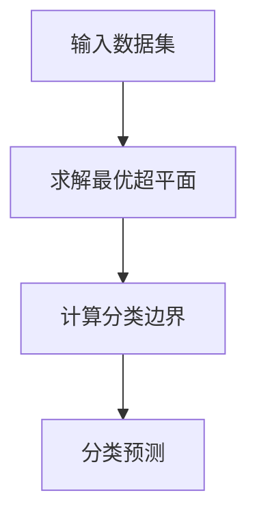
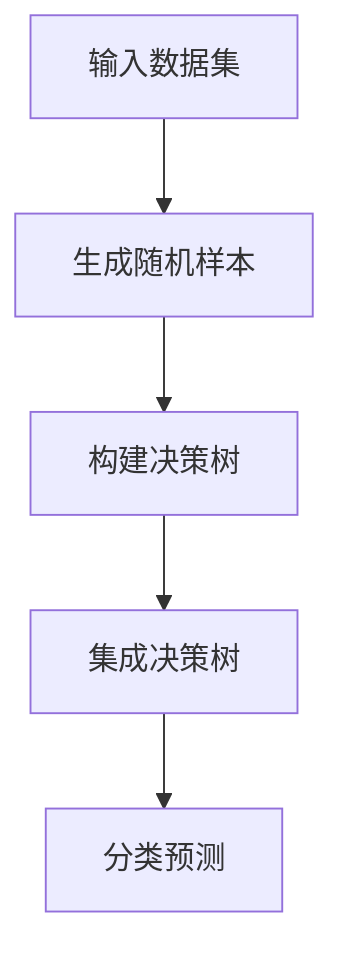
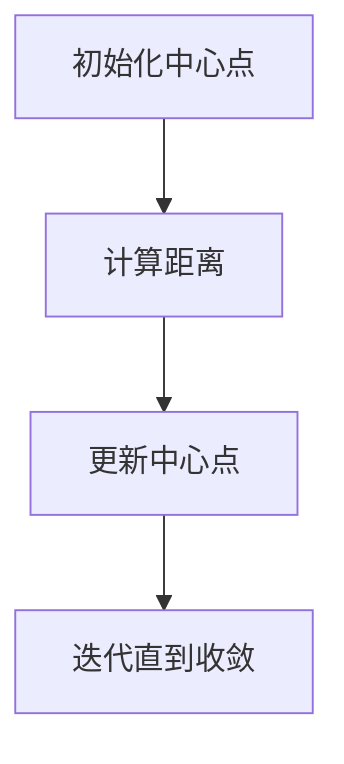
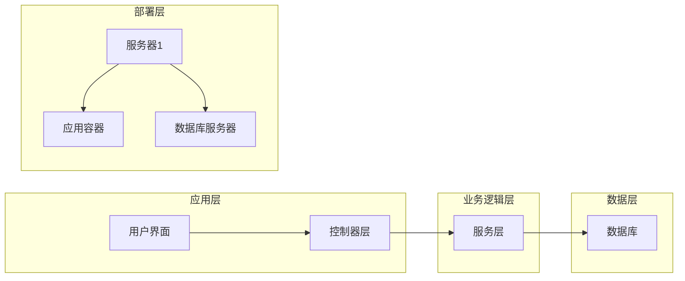
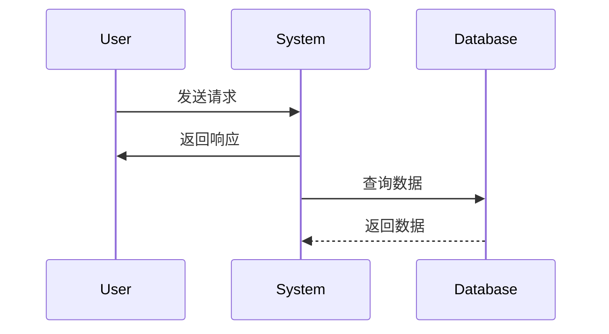
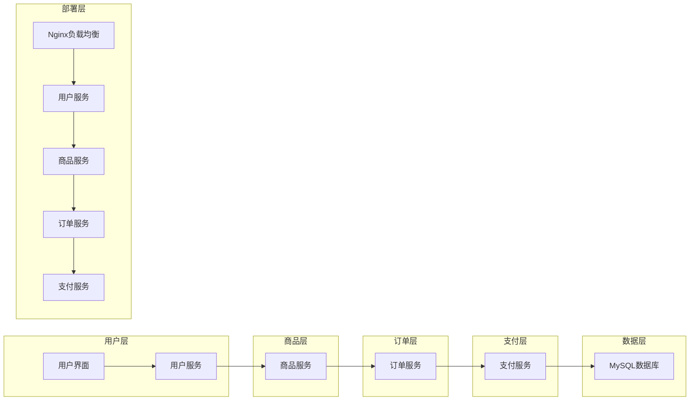
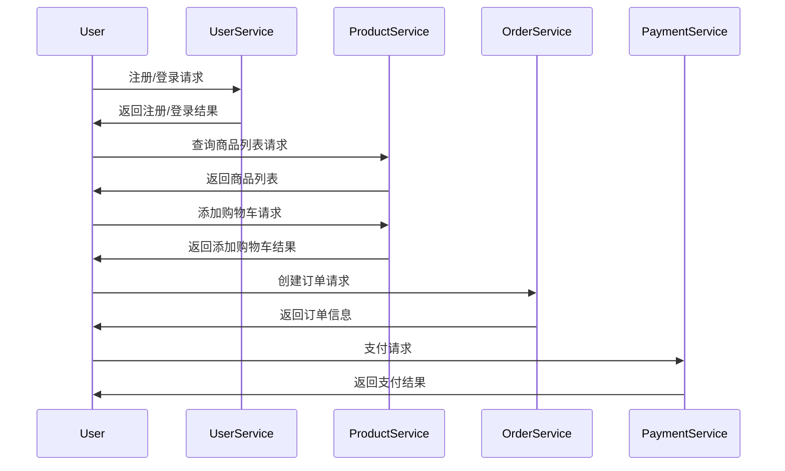

                 

### 文章标题

# 技术决策框架：如何做出正确的技术选择

### 关键词

- 技术决策
- 决策框架
- 正确选择
- 技术方案评估
- 风险管理

### 摘要

本文将探讨技术决策框架的重要性，并详细介绍如何构建一个有效的技术决策框架。我们将逐步分析框架的各个组成部分，包括问题的定义、解决方案的评估、决策分析等。此外，我们将讨论如何应用这些框架来做出正确的技术选择，并举例说明实际案例。通过本文的阅读，您将掌握一套系统化的技术决策方法，帮助您在复杂的IT领域中做出明智的选择。

## 引言

在快速发展的技术时代，技术决策成为企业成功的关键因素。正确的技术选择能够提高生产效率、降低成本、增强竞争力，而错误的技术选择可能导致项目失败、资源浪费甚至业务中断。因此，如何做出正确的技术选择成为一个亟待解决的重要问题。

技术决策框架是一个系统化的方法，用于指导技术决策过程，确保决策的科学性和合理性。本文旨在探讨如何构建和运用技术决策框架，帮助读者在实际工作中做出更加明智的技术选择。

## 第1章：技术决策的背景与定义

### 1.1 技术决策的重要性

在当今快速变化的技术环境中，技术决策无处不在。无论是开发一款新软件、引入新技术、优化现有系统，还是应对突发事件和挑战，技术决策都是企业持续发展的关键。有效的技术决策可以带来以下益处：

- 提高效率：正确选择的技术方案可以显著提高工作效率，减少不必要的开发和维护成本。
- 降低风险：通过全面的评估和分析，可以识别潜在的风险，并采取预防措施。
- 增强竞争力：紧跟技术趋势，快速响应市场变化，可以帮助企业在竞争中脱颖而出。
- 提升用户体验：合理的技术选择可以提升用户满意度，增加用户粘性。

然而，技术决策并非易事。技术的复杂性、不确定性、以及各种约束条件使得技术决策过程充满挑战。如果没有科学的方法和框架，技术决策可能变得随意和主观，导致不良后果。

### 1.2 技术决策的定义

技术决策是指在一个特定的技术环境中，通过对多种技术方案进行评估和比较，选择出最合适的方案的过程。它包括以下几个核心概念：

- **技术问题**：指在特定技术场景下需要解决的问题或需求。
- **技术方案**：指为解决技术问题而提出的具体技术方案或解决方案。
- **评估标准**：指用于评估技术方案优劣的一系列指标和标准。
- **决策过程**：指从问题定义、方案评估到最终决策的整个流程。

技术决策的目标是找到既满足需求又具有可行性和经济效益的技术方案。这个过程需要综合考虑技术可行性、成本效益、市场需求、技术趋势等多方面因素。

### 1.3 技术决策中的挑战

技术决策面临着诸多挑战，以下是其中几个主要方面：

- **复杂性**：技术的多样性和复杂性使得决策过程变得复杂，需要综合考虑多个因素。
- **不确定性**：技术发展的不确定性和市场变化的不确定性增加了决策的难度。
- **信息不足**：有效的技术决策依赖于充分的信息和数据分析，但实际中往往存在信息不足的问题。
- **时间限制**：在紧迫的时间限制下做出决策，可能无法进行全面的分析和评估。
- **利益冲突**：不同利益相关者之间的利益冲突可能导致决策过程复杂化。

### 1.4 边界与范围

在构建技术决策框架时，明确框架的边界和范围至关重要。以下是技术决策框架的主要边界和范围：

- **技术范围**：框架适用于特定技术领域内的决策，如软件开发、系统集成、云计算等。
- **决策范围**：框架适用于不同规模的技术决策，从日常小决策到重大战略决策。
- **应用场景**：框架适用于各种技术场景，包括新项目启动、技术升级、问题解决等。
- **决策类型**：框架适用于不同类型的决策，如技术选型、方案优化、风险应对等。

通过明确框架的边界和范围，可以确保框架的有效性和适用性，避免盲目扩大或缩小应用范围。

### 总结

本章介绍了技术决策的背景和定义，探讨了技术决策的重要性以及面临的挑战。通过理解技术决策的定义和核心概念，读者可以更好地认识技术决策的本质，为后续构建和运用技术决策框架打下基础。在下一章中，我们将深入探讨技术决策框架的组成部分和构建方法。

## 第2章：技术决策框架的组成部分

### 2.1 技术决策框架的结构和组件

一个有效的技术决策框架应该由多个相互关联的组件组成，这些组件共同作用于整个决策过程，确保决策的科学性和系统性。以下是技术决策框架的主要组成部分：

#### 2.1.1 问题描述

问题描述是技术决策框架的第一步，它涉及到对当前问题的准确描述和定义。这一步骤至关重要，因为一个明确、准确的问题定义是确保决策方向正确的前提。问题描述通常包括以下几个方面：

- **问题背景**：简要介绍问题的起源和背景，帮助决策者理解问题的来龙去脉。
- **问题陈述**：明确地描述问题，包括问题的具体表现和影响。
- **问题约束**：列出问题解决的约束条件，如预算、时间限制、技术要求等。

#### 2.1.2 解决方案生成

在问题描述明确后，接下来是解决方案生成阶段。这一步骤的目标是提出尽可能多的潜在解决方案，以便后续评估和比较。解决方案生成的方法包括：

- **头脑风暴**：通过集体讨论，快速产生大量解决方案。
- **专家意见**：借助领域专家的经验和知识，提出可能的解决方案。
- **现有方案调研**：研究同类问题已有的解决方案，借鉴成功经验。

在生成解决方案时，应确保方案的创新性和可行性，避免盲目跟风或固步自封。

#### 2.1.3 解决方案评估

解决方案评估是技术决策框架的核心环节，通过一系列评估标准和指标，对各个方案进行量化或定性分析，以确定其优劣。以下是评估过程中常用的方法：

- **成本效益分析**：比较各个方案的投入和预期收益，计算净收益。
- **风险评估**：评估各个方案面临的风险和不确定性，并采取相应的应对措施。
- **技术可行性分析**：评估各个方案在技术实现上的可行性，包括技术难度、资源需求等。
- **用户体验分析**：评估方案对用户的影响，包括易用性、性能、稳定性等。

通过多方面的综合评估，可以确定各个方案的相对优劣，为最终决策提供依据。

#### 2.1.4 决策分析

在完成解决方案评估后，进入决策分析阶段。这一步骤涉及到对各个评估结果进行综合分析和比较，最终确定最佳方案。决策分析的方法包括：

- **决策矩阵**：将各个方案的评估结果进行矩阵排列，直观比较各个方案。
- **决策树**：通过树状图展示各个决策路径和可能的结果，帮助决策者进行选择。
- **成本效益分析**：综合考虑成本和效益，确定最优方案。

在决策分析阶段，决策者需要根据具体情况和优先级，权衡各个方案的利弊，最终做出决策。

#### 2.1.5 决策实施与监控

决策分析完成后，进入决策实施阶段。这一步骤包括将决策方案付诸实践，并进行持续的监控和调整。决策实施的关键内容包括：

- **资源分配**：根据决策方案，合理分配人力、物力和财力资源。
- **项目规划**：制定详细的项目计划，明确任务分工和时间节点。
- **监控与反馈**：在项目实施过程中，持续监控项目进展和效果，及时反馈和调整。

通过有效的决策实施与监控，可以确保决策方案的顺利执行，并适应环境变化。

#### 2.1.6 案例研究

为了更好地理解技术决策框架的组成部分和实际应用，以下是一些案例研究：

- **案例1**：某公司需要选择一款新的客户关系管理系统（CRM）。在问题描述阶段，明确了需求背景和约束条件；在解决方案生成阶段，调研了市场上主流的CRM产品；在解决方案评估阶段，综合考虑了成本、技术可行性、用户体验等因素；在决策分析阶段，通过决策矩阵确定了最佳方案；在决策实施阶段，顺利引入了新的CRM系统，并进行了持续监控和优化。

- **案例2**：某公司在进行云计算转型时，需要选择合适的云服务提供商。在问题描述阶段，明确了云计算的需求和约束；在解决方案生成阶段，评估了多个云服务提供商的方案；在解决方案评估阶段，综合考虑了价格、性能、安全性等因素；在决策分析阶段，通过决策树确定了最佳提供商；在决策实施阶段，成功迁移到了新的云平台，并实现了业务提升。

通过以上案例，可以看出技术决策框架在实际应用中的有效性和实用性。在下一章中，我们将进一步探讨技术决策框架的应用原则和逻辑。

### 2.2 技术决策框架的原则和逻辑

一个有效的技术决策框架不仅需要明确的结构和组件，还需要遵循一系列原则和逻辑，以确保决策的科学性、合理性和可持续性。以下是技术决策框架的几个关键原则：

#### 2.2.1 全面性

技术决策框架应涵盖问题的各个方面，确保全面考虑所有相关因素。这包括技术可行性、成本效益、市场趋势、用户体验等。通过全面性，可以避免因忽略某些关键因素而导致的决策失误。

#### 2.2.2 系统性

技术决策框架应具有系统性，将各个决策步骤和组件有机地结合起来，形成完整的决策流程。这有助于确保决策过程的连贯性和一致性，提高决策效率。

#### 2.2.3 透明性

技术决策框架应具备透明性，确保决策过程对所有相关方都是可追溯和可解释的。这有助于增加决策的信任度和接受度，减少决策过程中的争议和误解。

#### 2.2.4 可适应性

技术决策框架应具备一定的灵活性，能够适应不同的决策场景和需求。这包括对新的技术和市场变化的快速响应能力，以及对已有决策框架的持续改进和优化。

#### 2.2.5 逻辑性

技术决策框架应具备清晰的逻辑性，确保决策过程的每一步都有明确的理论依据和实践指导。这有助于提高决策的准确性，减少主观性和随意性。

### 决策逻辑流程

技术决策框架的决策逻辑流程可以分为以下几个步骤：

1. **问题定义**：明确需要解决的问题和目标，定义问题的边界和约束条件。
2. **方案生成**：提出多个可能的解决方案，并确保方案的充分性和创新性。
3. **方案评估**：根据预定的评估标准和指标，对各个方案进行量化或定性分析，评估其可行性、成本、效益等。
4. **决策分析**：结合评估结果，运用决策工具和方法，进行综合分析和比较，确定最佳方案。
5. **决策实施**：制定详细的实施计划，将决策方案付诸实践，并持续监控和调整。
6. **效果评估**：对决策实施后的效果进行评估，包括效益、成本、用户满意度等，为后续决策提供参考。

通过遵循以上原则和逻辑，技术决策框架可以更好地指导实际决策过程，提高决策的科学性和有效性。在下一章中，我们将探讨技术决策框架的实际应用，并通过具体案例进行说明。

### 2.3 技术决策框架的应用

技术决策框架在实际应用中具有广泛的适用性，可以应用于各种不同类型的技术决策场景。以下是一些常见的技术决策场景和相应的应用案例：

#### 2.3.1 软件开发

在软件开发过程中，技术决策框架可以帮助团队选择合适的技术栈、开发工具和框架。例如，在开发一个复杂的Web应用程序时，团队需要选择前后端框架、数据库技术、云计算平台等。通过技术决策框架，团队可以系统地评估各种技术的优缺点，最终选择出最适合项目需求的技术方案。

#### 2.3.2 系统集成

系统集成项目通常涉及多个系统和技术的整合。技术决策框架可以帮助项目经理和技术团队确定最佳的技术集成方案。例如，在一个大型企业级系统集成项目中，需要选择数据存储方案、数据交换格式、安全协议等。通过技术决策框架，可以确保选择的技术方案既满足项目需求，又具有较好的兼容性和扩展性。

#### 2.3.3 技术选型

在技术选型过程中，技术决策框架可以帮助决策者从多个候选技术中选出最优方案。例如，在选择数据库技术时，需要评估各种数据库的优缺点，如性能、扩展性、成本等。通过技术决策框架，可以系统地比较不同数据库的评估结果，最终选出最适合项目需求的技术。

#### 2.3.4 技术升级

在技术升级过程中，技术决策框架可以帮助企业评估现有技术的局限性，并确定最佳的升级方案。例如，在一个企业的IT系统中，部分硬件设备和技术已经过时，需要进行升级。通过技术决策框架，可以评估现有设备的性能、成本、兼容性等因素，选择出最适合的升级方案。

#### 2.3.5 风险管理

技术决策框架在风险管理中也具有重要作用。通过技术决策框架，可以系统地识别和评估项目面临的风险，并制定相应的应对措施。例如，在一个复杂的IT项目中，可能会面临技术风险、市场风险、法律风险等。通过技术决策框架，可以识别这些风险，并评估其可能带来的影响，从而制定有效的风险管理策略。

#### 应用案例

以下是两个技术决策框架应用的具体案例：

**案例1：Web应用程序开发**

某公司计划开发一款基于云计算的Web应用程序，需要选择合适的前后端框架、数据库和云服务提供商。通过技术决策框架，团队首先明确了项目需求和约束条件，然后提出了多个技术方案，如React、Vue、Angular等前端框架，MySQL、PostgreSQL、MongoDB等数据库，AWS、Azure、Google Cloud等云服务提供商。在评估阶段，团队综合考虑了成本、性能、兼容性、安全性等因素，通过决策矩阵和决策树选择了最佳方案。在实施阶段，团队根据决策方案逐步开发、测试和部署了应用程序。

**案例2：系统集成项目**

某大型企业计划进行一次IT系统集成，需要整合多个业务系统，如ERP、CRM、财务管理等。通过技术决策框架，项目经理首先明确了项目需求和约束条件，然后提出了多个技术方案，如SAP、Oracle、Microsoft Dynamics等ERP系统，Salesforce、Zoho等CRM系统，以及各种数据库和中间件技术。在评估阶段，项目经理综合考虑了成本、兼容性、扩展性、用户需求等因素，通过决策矩阵和决策树选择了最佳方案。在实施阶段，项目经理根据决策方案制定了详细的项目计划，并进行了分阶段实施和调试。

通过以上案例，可以看出技术决策框架在实际应用中的效果和优势。在下一章中，我们将进一步探讨如何构建和优化技术决策框架，以适应不断变化的技术环境和业务需求。

### 第3章：技术决策中的核心概念和关系

在技术决策过程中，理解和应用核心概念是确保决策有效性的关键。本章将介绍几个关键概念，并探讨它们之间的相互关系。

#### 3.1 核心概念及其属性

**1. 技术问题**

技术问题是指需要通过技术手段解决的问题或需求。它通常包括以下几个方面：

- **背景**：问题产生的背景和原因。
- **描述**：问题的具体表现和影响。
- **约束**：解决问题的约束条件，如预算、时间、资源等。

**2. 技术方案**

技术方案是指为实现技术问题解决方案的具体方法或途径。技术方案通常包括以下几个方面：

- **目标**：方案希望实现的目标和效果。
- **方法**：实现目标的具体技术手段和步骤。
- **资源**：实现方案所需的人力、物力和财力资源。

**3. 评估标准**

评估标准是指用于评估技术方案优劣的一系列指标和标准。评估标准通常包括以下几个方面：

- **成本**：方案的实施成本，包括开发成本、维护成本等。
- **性能**：方案的技术性能指标，如响应时间、吞吐量、可靠性等。
- **安全性**：方案的安全性指标，如数据保护、访问控制等。
- **兼容性**：方案与其他系统和技术的兼容性。
- **扩展性**：方案的可扩展性和适应性。

**4. 决策过程**

决策过程是指从问题定义、方案评估到最终决策的整个流程。决策过程通常包括以下几个方面：

- **问题定义**：明确问题的需求和约束。
- **方案生成**：提出多个可能的解决方案。
- **方案评估**：评估各个方案的优劣。
- **决策分析**：综合评估结果，确定最佳方案。
- **决策实施**：实施最佳方案，并进行监控和调整。

#### 3.2 关键概念之间的相互关系

**1. 技术问题与技术方案**

技术问题和技术方案之间存在直接的关联。技术问题定义了需要解决的问题或需求，而技术方案则是解决问题的具体方法或途径。一个明确、具体的技术问题可以引导决策者提出更合理的技术方案。

**2. 技术方案与评估标准**

技术方案和评估标准之间存在紧密的联系。技术方案是实现技术问题的途径，而评估标准是用于衡量和比较不同技术方案的指标。通过评估标准，决策者可以系统地评估各个技术方案的优劣，为最终决策提供依据。

**3. 决策过程与核心概念**

决策过程与核心概念密切相关。技术问题、技术方案和评估标准构成了决策过程的基础。决策过程包括从问题定义、方案生成到方案评估和决策分析的一系列步骤，每个步骤都依赖于核心概念的正确理解和应用。决策过程的科学性和系统性直接影响到技术决策的有效性。

#### 3.3 核心概念对比表格

为了更好地理解核心概念之间的关系，以下是几个关键概念及其属性的对比表格：

| 核心概念 | 描述 | 属性对比 |
| --- | --- | --- |
| 技术问题 | 需要解决的问题或需求 | 背景描述、问题陈述、约束条件 |
| 技术方案 | 解决技术问题的具体方法或途径 | 目标、方法、资源 |
| 评估标准 | 用于评估技术方案优劣的指标和标准 | 成本、性能、安全性、兼容性、扩展性 |
| 决策过程 | 从问题定义到最终决策的整个流程 | 问题定义、方案生成、方案评估、决策分析、决策实施 |

#### 3.4 实体关系图（ERD）

为了更直观地展示核心概念之间的关系，以下是核心概念的实体关系图（ERD）：

```mermaid
erDiagram
  产品问题 ||--|{ 技术方案 }|>
  技术方案 ||--|{ 评估标准 }|>
  评估标准 ||--|{ 决策过程 }|>
```

通过实体关系图，可以看出核心概念之间的层次结构和相互关系，有助于更深入地理解技术决策框架的构成和应用。

#### 总结

本章介绍了技术决策中的核心概念及其属性，并探讨了这些概念之间的相互关系。理解这些核心概念和它们之间的相互关系是构建和运用技术决策框架的基础。在下一章中，我们将深入探讨算法原理，通过具体的算法流程图和数学模型，进一步阐述技术决策框架的应用。

### 第4章：算法原理

在技术决策过程中，算法原理发挥着至关重要的作用。通过算法原理，我们可以将复杂的技术问题转化为可操作和可量化的解决方案。本章将介绍几个关键算法原理，并通过流程图和数学模型进行详细阐述。

#### 4.1 决策树算法原理

决策树是一种常用的分类和决策算法，它通过一系列的判断条件将数据集划分为不同的类别或决策路径。决策树的构建基于信息增益、增益率等指标，旨在找到最佳的划分条件，以提高决策的准确性和效率。

**决策树算法流程图：**

```mermaid
graph TB
    A[决策树算法]
    B[选择最佳特征]
    C[划分数据集]
    D[生成子节点]
    E[终止条件]

    A --> B
    B --> C
    C --> D
    D --> E
    E --> [叶节点]
```

**决策树算法数学模型：**

信息熵（Entropy）：
$$ H(X) = -\sum_{i} p(x_i) \log_2 p(x_i) $$

信息增益（Information Gain）：
$$ IG(D, A) = Entropy(D) - \sum_{v} p(v) Entropy(D|v) $$

其中，$D$ 表示数据集，$A$ 表示特征，$v$ 表示特征的不同取值，$p(v)$ 和 $Entropy(D|v)$ 分别表示特征 $A$ 在取值 $v$ 下的条件熵。

#### 4.2 支持向量机（SVM）算法原理

支持向量机是一种强大的分类和回归算法，它通过找到一个最佳的超平面，将数据集划分为不同的类别。SVM 的核心是求解最优超平面，使得分类边界最大化，同时确保分类器的泛化能力。

**SVM算法流程图：**



**SVM算法数学模型：**

超平面：
$$ w \cdot x + b = 0 $$

分类边界：
$$ y \cdot (w \cdot x + b) \geq 1 $$

其中，$w$ 表示法向量，$x$ 表示数据点，$b$ 表示偏置，$y$ 表示样本标签。

优化目标：
$$ \min_{w,b} \frac{1}{2} ||w||^2 $$

约束条件：
$$ y_i (w \cdot x_i + b) \geq 1 $$

#### 4.3 随机森林算法原理

随机森林是一种基于决策树集成的机器学习算法，它通过构建多个决策树，并采用投票机制来确定最终分类结果。随机森林的优势在于其良好的可扩展性和抗过拟合能力。

**随机森林算法流程图：**



**随机森林算法数学模型：**

决策树模型：
$$ f(x) = \sum_{i=1}^{n} w_i \cdot g(x; \theta_i) $$

其中，$w_i$ 表示决策树权重，$g(x; \theta_i)$ 表示第 $i$ 棵决策树的预测函数，$\theta_i$ 表示决策树参数。

集成模型：
$$ \hat{y} = \arg\max_{y} \sum_{i=1}^{n} w_i \cdot g(x; \theta_i) $$

#### 4.4 聚类算法原理

聚类算法是一种无监督学习算法，它通过将数据点划分为多个簇，使同一簇内的数据点具有较高的相似度，而不同簇的数据点之间的相似度较低。聚类算法广泛应用于数据挖掘、市场细分等领域。

**K-均值聚类算法流程图：**



**K-均值聚类算法数学模型：**

距离计算：
$$ d(x, c) = \sqrt{\sum_{i=1}^{k} (x_i - c_i)^2} $$

其中，$x$ 表示数据点，$c$ 表示聚类中心点，$k$ 表示簇的数量。

聚类中心点更新：
$$ c_{new} = \frac{1}{n} \sum_{i=1}^{n} x_i $$

其中，$n$ 表示数据点数量。

#### 总结

本章介绍了几个关键算法原理，包括决策树、支持向量机、随机森林和K-均值聚类。这些算法原理在技术决策过程中发挥着重要作用，通过具体的流程图和数学模型，读者可以更深入地理解这些算法的工作原理和应用方法。在下一章中，我们将继续探讨技术决策框架在系统分析与架构设计中的应用。

### 第5章：系统分析与架构设计

在技术决策过程中，系统分析与架构设计是至关重要的环节。一个良好的系统分析与架构设计不仅能够提高系统的稳定性、性能和可维护性，还能为后续的技术决策提供有力支持。本章将介绍系统分析与架构设计的基本概念、方法和技术，并运用Mermaid图展示相关架构图和序列图。

#### 5.1 系统分析与架构设计的基本概念

**1. 系统分析**

系统分析是指对系统的需求、功能、性能等方面进行全面的研究和分析，以明确系统的设计目标和要求。系统分析通常包括以下几个步骤：

- **需求分析**：收集和分析系统的需求，包括功能需求、性能需求、安全性需求等。
- **功能定义**：明确系统的功能模块和接口，定义各模块的职责和交互关系。
- **性能分析**：评估系统的性能指标，如响应时间、吞吐量、并发处理能力等。
- **安全性分析**：评估系统的安全性，包括数据保护、访问控制、网络安全等。

**2. 架构设计**

架构设计是指根据系统分析的结果，设计和构建系统的整体结构和技术框架。架构设计的目标是确保系统的高可用性、高性能和可扩展性。架构设计通常包括以下几个层面：

- **技术架构**：选择合适的技术栈和框架，构建系统的技术基础。
- **应用架构**：设计系统的应用模块和业务逻辑，确保各模块的职责清晰、交互合理。
- **数据架构**：设计系统的数据存储、数据流和数据管理策略。
- **网络架构**：设计系统的网络布局和通信协议，确保系统的高效性和安全性。

#### 5.2 系统分析与架构设计的方法

**1. 需求分析**

需求分析是系统分析与架构设计的起点，通过需求分析可以明确系统的需求范围和功能要求。常用的需求分析方法包括：

- **用户访谈**：与用户和利益相关者进行访谈，了解他们对系统的期望和需求。
- **问卷调查**：通过问卷调查收集用户和利益相关者的反馈和意见。
- **功能建模**：使用功能建模工具（如UML用例图）描述系统的功能模块和交互关系。
- **场景分析**：分析用户使用系统的典型场景，定义系统的操作流程和功能需求。

**2. 架构设计**

架构设计是系统分析与架构设计的核心，通过架构设计可以确定系统的整体结构和关键技术点。常用的架构设计方法包括：

- **架构风格**：选择合适的架构风格，如MVC、微服务、SOA等，以适应系统的需求。
- **模块划分**：根据功能需求将系统划分为多个模块，确保模块的职责清晰和独立性。
- **接口设计**：设计模块之间的接口，确保模块之间的通信和协作。
- **性能优化**：分析系统的性能瓶颈，设计优化方案以提高系统的性能和稳定性。

#### 5.3 系统分析与架构设计的实践

**1. 系统功能设计（领域模型）**

在系统功能设计阶段，通过领域模型（UML类图）来描述系统的功能模块和实体关系。以下是一个简单的系统功能设计示例：

```mermaid
classDiagram
  Class01 <|-- SubClass01
  Class01 o-- Object02
  Class03 <.. Class01
  Class03 ..|> Class04
  Class04 <|.. Class03
  Class06 o-- <<interface>> Interface01
  Class07 o-- <<enum>> Enum01
  Class08 o-- <<association>> Class05
  Class09 o-- <<aggregation>> Class05
  Class10 o-- <<composition>> Class05
```

**2. 系统架构设计**

在系统架构设计阶段，通过Mermaid架构图（PlantUML）来展示系统的整体架构和技术框架。以下是一个简单的系统架构设计示例：



**3. 系统接口设计和交互**

在系统接口设计和交互阶段，通过Mermaid序列图（Sequence Diagram）来描述系统模块之间的交互流程。以下是一个简单的系统接口设计和交互示例：



#### 5.4 实践案例分析

**1. 案例背景**

某公司需要开发一个电子商务网站，用于在线销售商品。公司对系统的性能、可扩展性和安全性有较高的要求。

**2. 需求分析**

- **用户需求**：用户需要能够浏览商品、添加购物车、下单支付、查看订单状态等功能。
- **性能需求**：系统需要能够处理高并发访问，确保页面响应速度快。
- **安全性需求**：系统需要具备数据保护、访问控制、网络安全等功能。

**3. 架构设计**

- **技术架构**：采用微服务架构，将系统功能模块划分为多个微服务，如用户服务、商品服务、订单服务、支付服务等。
- **应用架构**：使用Spring Boot和Spring Cloud构建微服务框架，实现服务间通信和分布式架构。
- **数据架构**：使用MySQL数据库存储用户数据、商品数据、订单数据和支付数据。
- **网络架构**：使用Nginx作为负载均衡器，分发用户请求到不同的微服务实例。

**4. 系统功能设计**

- **用户模块**：包括用户注册、登录、个人信息管理等功能。
- **商品模块**：包括商品分类、商品展示、商品详情、购物车等功能。
- **订单模块**：包括订单创建、订单查询、订单支付、订单发货等功能。
- **支付模块**：包括支付接口、支付回调、支付状态查询等功能。

**5. 系统架构图**



**6. 系统接口设计和交互**



#### 总结

本章介绍了系统分析与架构设计的基本概念、方法和技术，并通过实际案例展示了系统分析与架构设计的应用。理解系统分析与架构设计的方法和技术，有助于我们在技术决策过程中做出科学合理的系统设计，提高系统的性能和稳定性。在下一章中，我们将探讨项目实战，包括环境安装、系统核心实现和代码应用分析。

### 第6章：项目实战

在本章中，我们将通过一个具体的实战项目来展示如何运用技术决策框架进行技术选择和实现。该项目为一个在线书店系统，包括用户注册、图书浏览、购物车、订单管理和支付功能。我们将详细介绍项目的环境搭建、核心实现以及代码应用分析，并通过实际案例进行详细讲解。

#### 6.1 项目背景与目标

**项目背景：**

某初创公司计划开发一个在线书店系统，用户可以通过网站浏览和购买图书。系统需要具备以下功能：

- 用户注册与登录
- 图书分类浏览
- 购物车管理
- 订单创建与查询
- 支付功能

**项目目标：**

- 提供稳定、高效的在线购物体验
- 确保系统的可扩展性和易维护性
- 实现快速开发和迭代

#### 6.2 环境安装

为了确保项目的顺利开展，首先需要搭建开发环境。以下是项目的环境安装步骤：

**1. 开发工具：**

- IntelliJ IDEA（集成开发环境）
- Git（版本控制工具）
- Docker（容器化工具）

**2. 数据库：**

- MySQL 8.0（关系型数据库）

**3. 服务器：**

- Apache（Web服务器）
- Nginx（反向代理服务器）

**4. 其他工具：**

- Maven（项目构建工具）
- Redis（缓存数据库）

**安装步骤：**

1. 安装开发工具IntelliJ IDEA，并创建新项目。
2. 使用Git将项目代码克隆到本地。
3. 安装MySQL数据库，并创建在线书店数据库。
4. 安装Docker，并配置Docker Compose。
5. 编写Dockerfile和docker-compose.yml文件，定义项目容器化配置。
6. 使用Docker Compose启动项目服务，包括Web服务、数据库服务、缓存服务等。

#### 6.3 核心实现

**1. 用户注册与登录：**

用户注册与登录是系统的核心功能之一。用户注册时需要验证用户名和密码的唯一性，并存储用户信息到数据库。用户登录时需要验证用户名和密码的正确性，并提供相应的身份验证机制。

核心代码实现：

```java
// 用户注册
public boolean register(String username, String password) {
    // 验证用户名和密码的有效性
    if (StringUtils.isEmpty(username) || StringUtils.isEmpty(password)) {
        return false;
    }
    // 验证用户名是否已存在
    if (userRepository.existsByUsername(username)) {
        return false;
    }
    // 创建用户并保存到数据库
    User user = new User();
    user.setUsername(username);
    user.setPassword(password);
    userRepository.save(user);
    return true;
}

// 用户登录
public User login(String username, String password) {
    // 验证用户名和密码的正确性
    Optional<User> userOptional = userRepository.findByUsername(username);
    if (!userOptional.isPresent() || !passwordEncoder.matches(password, userOptional.get().getPassword())) {
        return null;
    }
    return userOptional.get();
}
```

**2. 图书分类浏览：**

图书分类浏览功能需要提供图书分类的展示和查询功能。系统可以将图书按照类别进行组织，并允许用户通过分类进行图书的浏览和筛选。

核心代码实现：

```java
// 查询图书分类
public List<BookCategory> findAllCategories() {
    return bookCategoryRepository.findAll();
}

// 根据分类查询图书
public List<Book> findByCategory(BookCategory category) {
    return bookRepository.findByCategory(category);
}
```

**3. 购物车管理：**

购物车管理功能需要实现用户将图书添加到购物车、从购物车中删除图书以及清空购物车等功能。系统还需要提供购物车的持久化存储，以便在用户登录时能够访问其购物车信息。

核心代码实现：

```java
// 添加图书到购物车
public void addToCart(Long userId, Long bookId) {
    // 创建购物车记录
    Cart cart = new Cart();
    cart.setUserId(userId);
    cart.setBookId(bookId);
    cartRepository.save(cart);
}

// 从购物车中删除图书
public void deleteFromCart(Long cartId) {
    cartRepository.deleteById(cartId);
}

// 清空购物车
public void clearCart(Long userId) {
    cartRepository.deleteByUserId(userId);
}
```

**4. 订单创建与查询：**

订单创建与查询功能需要实现用户在下单时生成订单、查询订单状态以及取消订单等功能。系统需要记录订单的相关信息，如订单编号、订单金额、订单状态等，并提供订单的查询接口。

核心代码实现：

```java
// 创建订单
public void createOrder(Long userId, List<CartItem> cartItems) {
    // 计算订单金额
    double totalAmount = cartItems.stream().mapToDouble(CartItem::getPrice).sum();
    // 创建订单记录
    Order order = new Order();
    order.setUserId(userId);
    order.setTotalAmount(totalAmount);
    order.setStatus(OrderStatus.CREATED);
    orderRepository.save(order);
    // 清空购物车
    cartItems.forEach(item -> deleteFromCart(item.getCartId()));
}

// 查询订单
public List<Order> findByUserId(Long userId) {
    return orderRepository.findByUserId(userId);
}

// 取消订单
public void cancelOrder(Long orderId) {
    Order order = orderRepository.findById(orderId).orElseThrow(() -> new RuntimeException("订单不存在"));
    if (order.getStatus() != OrderStatus.CREATED) {
        throw new RuntimeException("订单已处理，无法取消");
    }
    order.setStatus(OrderStatus.CANCELED);
    orderRepository.save(order);
}
```

**5. 支付功能：**

支付功能需要实现用户在下单后选择支付方式、进行支付以及查询支付状态等功能。系统需要与第三方支付平台（如支付宝、微信支付）集成，以便实现支付功能。

核心代码实现：

```java
// 选择支付方式
public void selectPaymentMethod(Long orderId, PaymentMethod paymentMethod) {
    Order order = orderRepository.findById(orderId).orElseThrow(() -> new RuntimeException("订单不存在"));
    order.setPaymentMethod(paymentMethod);
    orderRepository.save(order);
}

// 执行支付
public void executePayment(Long orderId, PaymentRequest request) {
    Order order = orderRepository.findById(orderId).orElseThrow(() -> new RuntimeException("订单不存在"));
    if (order.getStatus() != OrderStatus.PENDING_PAYMENT) {
        throw new RuntimeException("订单状态不正确，无法支付");
    }
    // 调用第三方支付平台接口进行支付
    PaymentService paymentService = paymentProvider.getPaymentService(order.getPaymentMethod());
    PaymentResponse response = paymentService.executePayment(order.getTotalAmount(), request);
    // 更新订单状态
    order.setStatus(response.isSuccess() ? OrderStatus.PAID : OrderStatus.PENDING_PAYMENT);
    orderRepository.save(order);
}

// 查询支付状态
public PaymentStatus getPaymentStatus(Long orderId) {
    Order order = orderRepository.findById(orderId).orElseThrow(() -> new RuntimeException("订单不存在"));
    return order.getStatus();
}
```

#### 6.4 代码应用解读与分析

在代码应用解读与分析部分，我们将对项目的核心代码进行详细分析，解释其功能和实现原理。

**1. 用户注册与登录：**

用户注册与登录模块负责处理用户的注册和登录请求。注册时，系统首先验证用户名和密码的有效性，然后检查用户名是否已存在。如果用户名不存在，系统将创建一个新的用户记录并保存到数据库。登录时，系统验证用户名和密码的正确性，并返回相应的用户信息。

**2. 图书分类浏览：**

图书分类浏览模块提供图书分类的查询功能。系统使用BookCategory实体类来表示图书分类，并通过findAllCategories()方法获取所有分类信息。根据分类信息，系统可以进一步查询特定分类下的图书列表。

**3. 购物车管理：**

购物车管理模块实现用户将图书添加到购物车、从购物车中删除图书以及清空购物车等功能。系统使用Cart实体类来表示购物车记录，并通过addToCart()、deleteFromCart()和clearCart()方法分别实现添加、删除和清空购物车功能。

**4. 订单创建与查询：**

订单创建与查询模块负责处理用户下单、查询订单状态以及取消订单等功能。系统使用Order实体类来表示订单记录，并通过createOrder()、findByUserId()和cancelOrder()方法分别实现订单创建、订单查询和取消订单功能。

**5. 支付功能：**

支付功能模块实现用户选择支付方式、执行支付以及查询支付状态等功能。系统使用PaymentRequest和PaymentResponse实体类来表示支付请求和支付响应，并通过selectPaymentMethod()、executePayment()和getPaymentStatus()方法分别实现支付方式选择、支付执行和支付状态查询功能。

#### 6.5 实际案例分析

**1. 案例背景：**

某用户张三在在线书店系统中浏览图书，并将《深度学习》一书添加到购物车。在确认购物车中的图书后，张三选择下单。

**2. 案例步骤：**

1. 张三在用户界面浏览图书，并选择《深度学习》一书添加到购物车。
2. 张三在购物车页面确认图书信息，并点击“结算”按钮。
3. 系统根据购物车中的图书信息生成订单，并显示订单信息给张三。
4. 张三选择支付宝支付，并输入支付密码进行支付。
5. 系统调用支付宝接口执行支付，并返回支付结果。
6. 系统更新订单状态为“已支付”，并显示支付成功信息给张三。

**3. 案例解析：**

在该案例中，系统成功实现了从用户浏览图书、添加购物车、下单、支付到订单完成的全过程。以下是关键步骤的分析：

- **步骤1**：用户添加图书到购物车，系统调用addToCart()方法将图书信息保存到购物车数据库。
- **步骤2**：用户在购物车页面确认图书信息，系统根据购物车中的图书信息生成订单，并调用createOrder()方法创建订单记录。
- **步骤3**：系统显示订单信息给用户，用户确认订单无误。
- **步骤4**：用户选择支付方式并输入支付密码，系统调用selectPaymentMethod()方法记录支付方式。
- **步骤5**：系统调用支付宝接口执行支付，并调用executePayment()方法处理支付请求。
- **步骤6**：系统根据支付结果更新订单状态，并调用getPaymentStatus()方法查询支付状态。

通过以上步骤，系统成功完成了订单支付，并确保了用户购物体验的流畅性。

#### 总结

本章通过一个在线书店系统的实战项目，展示了如何运用技术决策框架进行环境搭建、核心实现和代码应用分析。通过实际案例，读者可以更好地理解技术决策框架在项目实战中的应用方法和效果。在下一章中，我们将总结项目经验，并提出最佳实践和注意事项。

### 第7章：最佳实践、小结与注意事项

#### 7.1 最佳实践

**1. 明确目标和需求**

在技术决策过程中，首先要明确项目的目标和需求。这包括功能需求、性能需求、安全性需求等。通过明确目标和需求，可以确保技术决策的方向正确，避免盲目选择。

**2. 全面评估技术方案**

在评估技术方案时，要全面考虑成本、性能、安全性、兼容性、可扩展性等因素。可以使用评估表格、决策矩阵等方法进行量化分析，以确保评估结果的客观性和全面性。

**3. 持续监控和反馈**

在技术决策实施过程中，要持续监控项目进展和效果，及时反馈和调整。通过监控和反馈，可以及时发现和解决问题，确保项目按计划进行。

**4. 团队协作与沟通**

技术决策往往需要多个部门和专业人员的协作。确保团队成员之间的沟通和协作，可以促进决策的顺利进行，提高决策效率。

**5. 考虑长远和未来**

在技术决策过程中，要考虑项目长远发展和未来趋势。选择具有前瞻性和可扩展性的技术方案，可以降低未来技术升级和迁移的成本。

#### 7.2 小结

本文详细介绍了技术决策框架的构建和应用，包括问题的定义、解决方案的评估、决策过程和实施等关键步骤。通过技术决策框架，可以系统化、科学化地进行技术决策，提高决策的科学性和有效性。同时，本文通过实际案例展示了技术决策框架在项目实战中的应用，进一步验证了其可行性和实用性。

#### 7.3 注意事项

**1. 避免过度优化**

在技术决策过程中，避免过度优化。过度优化可能导致方案复杂度增加、开发成本上升，甚至影响系统的稳定性和性能。

**2. 灵活调整决策**

在项目实施过程中，技术环境、市场需求和业务需求可能会发生变化。技术决策应具备灵活性，能够根据实际情况进行调整。

**3. 持续学习和更新**

技术环境和市场环境不断变化，技术决策者需要持续学习和更新知识，以适应新的挑战和需求。

**4. 注意风险控制**

在技术决策过程中，要重视风险控制。通过识别和评估潜在风险，采取相应的应对措施，降低决策风险。

### 7.4 拓展阅读

**1. 《技术管理精要：从技术领导到组织领导》**

作者：Thomas H. Davenport、Jeanne G. Harris

本书介绍了技术管理的核心概念和实践方法，包括技术领导力、组织变革、项目管理等，对技术决策者具有很高的参考价值。

**2. 《软件架构设计：构建和反思大型软件系统》**

作者：Peter Coad、Jeff de Luca、Eric Lefebvre

本书详细介绍了软件架构设计的方法、原则和模式，对理解技术决策中的架构设计部分具有指导意义。

**3. 《敏捷开发：原理、实践与模式》**

作者：Ken Schwaber、Jeff Sutherland

本书介绍了敏捷开发的方法和实践，包括用户故事、迭代开发、持续集成等，对技术决策中的项目管理部分提供了有益的参考。

通过阅读以上书籍，读者可以进一步深化对技术决策框架的理解和应用，提高技术决策的能力和水平。

## 作者信息

作者：AI天才研究院/AI Genius Institute & 禅与计算机程序设计艺术 /Zen And The Art of Computer Programming

AI天才研究院（AI Genius Institute）是一家专注于人工智能领域的研究和应用的机构，致力于推动人工智能技术的创新和发展。禅与计算机程序设计艺术（Zen And The Art of Computer Programming）则是一部经典的计算机科学著作，介绍了计算机程序设计的哲学和艺术，对技术决策者具有重要的启发和指导作用。两位作者以其深厚的技术背景和丰富的实践经验，为读者提供了宝贵的知识和见解。

