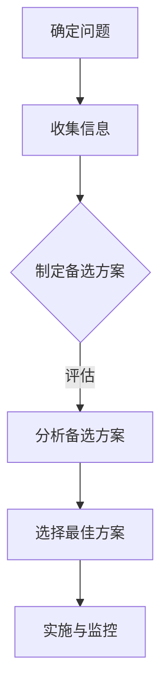
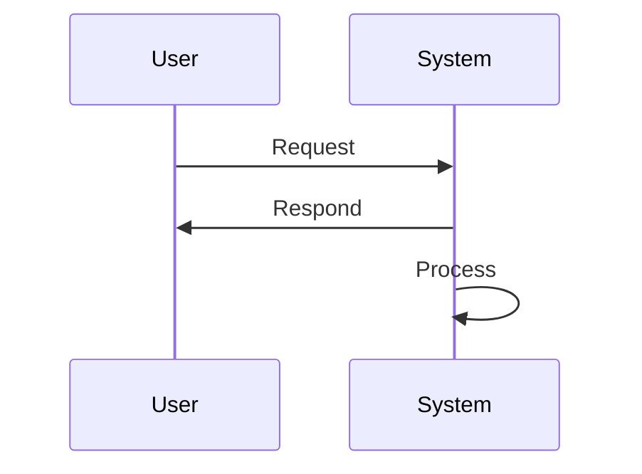

                 

### 设计《技术决策：在不确定中做出最佳选择》目录大纲

为了设计《技术决策：在不确定中做出最佳选择》的目录大纲，我们需要按照如下步骤进行：

1. **明确核心内容**：首先，我们要明确书籍的核心内容，这包括技术决策的定义、不确定性的来源、决策过程、决策工具和方法等。

2. **设计整体结构**：基于核心内容，我们将设计一个整体的结构，确保书的逻辑性和系统性。

3. **细化章节内容**：在整体结构的基础上，细化每一章节的具体内容，包括章节标题、子标题和可能的子章节。

4. **确保内容的完整性**：确保大纲中的每一部分都覆盖了核心概念、原理讲解、应用实例、最佳实践等。

5. **控制字数和格式**：确保整个大纲的总字数不超过2000字，并且格式清晰、简洁。

### 目录大纲

现在，我们可以开始设计目录大纲：

```
# 《技术决策：在不确定中做出最佳选择》目录大纲

## 第一部分：引言

### 1.1 问题背景与定义

#### 1.1.1 技术发展的速度与不确定性

#### 1.1.2 技术决策的重要性

#### 1.1.3 技术决策的定义与范围

### 1.2 不确定性的本质

#### 1.2.1 不确定性的来源

#### 1.2.2 不确定性的类型

#### 1.2.3 不确定性的度量

### 1.3 技术决策的重要性

#### 1.3.1 决策对技术成果的影响

#### 1.3.2 决策对企业发展的重要性

#### 1.3.3 技术决策在不同行业中的应用

## 第二部分：技术决策的框架与过程

### 2.1 决策框架概述

#### 2.1.1 技术决策的一般框架

#### 2.1.2 决策框架的要素

### 2.2 决策过程的六个阶段

#### 2.2.1 确定问题

#### 2.2.2 收集信息

#### 2.2.3 制定备选方案

#### 2.2.4 分析备选方案

#### 2.2.5 选择最佳方案

#### 2.2.6 实施与监控

## 第三部分：不确定性管理

### 3.1 不确定性的来源

#### 3.1.1 技术环境的不确定性

#### 3.1.2 市场需求的不确定性

#### 3.1.3 技术可行性与风险的不确定性

### 3.2 风险评估与量化

#### 3.2.1 风险识别方法

#### 3.2.2 风险评估模型

#### 3.2.3 风险量化的方法

### 3.3 应对不确定性的策略

#### 3.3.1 风险规避策略

#### 3.3.2 风险减轻策略

#### 3.3.3 风险转移策略

### 3.4 模型与工具在不确定性管理中的应用

#### 3.4.1 模型应用案例

#### 3.4.2 工具选择与使用

## 第四部分：技术决策案例分析

### 4.1 案例一：新兴技术采纳决策

#### 4.1.1 案例背景

#### 4.1.2 案例分析

#### 4.1.3 案例启示

### 4.2 案例二：企业数字化转型决策

#### 4.2.1 案例背景

#### 4.2.2 案例分析

#### 4.2.3 案例启示

### 4.3 案例三：复杂项目决策

#### 4.3.1 案例背景

#### 4.3.2 案例分析

#### 4.3.3 案例启示

## 第五部分：技术决策最佳实践

### 5.1 最佳实践总结

#### 5.1.1 最佳实践概述

#### 5.1.2 最佳实践案例分析

### 5.2 小结与注意事项

#### 5.2.1 小结

#### 5.2.2 注意事项

### 5.3 拓展阅读

#### 5.3.1 相关书籍推荐

#### 5.3.2 在线资源链接
```

在这个大纲中，我们涵盖了书的整体结构，每个部分的标题和可能的子标题。接下来，我们可以进一步细化每个章节的内容，确保每个章节都包含了必要的信息和示例。

### 目录大纲细化

为了确保目录大纲的每一个部分都内容丰富且逻辑清晰，我们需要对每个章节进行进一步的细化。以下是细化后的目录大纲：

```
# 《技术决策：在不确定中做出最佳选择》目录大纲

## 第一部分：引言

### 1.1 问题背景与定义

#### 1.1.1 技术发展的速度与不确定性
- **定义与技术决策**：阐述技术发展带来的不确定性及其对决策过程的影响。
- **案例研究**：分析某项新兴技术的快速崛起和其带来的决策挑战。

#### 1.1.2 技术决策的重要性
- **技术成果的影响**：探讨技术决策如何影响项目成功和业务发展。
- **企业发展的重要性**：讨论技术决策对企业战略规划和竞争优势的促进作用。

#### 1.1.3 技术决策的定义与范围
- **技术决策的定义**：明确技术决策的概念和其在不同阶段的应用。
- **技术决策的范围**：探讨技术决策涵盖的领域，如研发、项目管理、产品开发等。

### 1.2 不确定性的本质

#### 1.2.1 不确定性的来源
- **技术环境的不确定性**：讨论技术进步、市场变化等因素带来的不确定性。
- **市场需求的不确定性**：分析用户需求的不稳定性和动态变化。

#### 1.2.2 不确定性的类型
- **概率不确定性**：介绍概率不确定性及其在技术决策中的应用。
- **模糊不确定性**：阐述模糊不确定性及其管理方法。

#### 1.2.3 不确定性的度量
- **风险度量的方法**：介绍常用的风险度量方法，如概率分布、风险值等。
- **不确定性分析**：探讨如何通过数据分析来评估不确定性水平。

### 1.3 技术决策的重要性

#### 1.3.1 决策对技术成果的影响
- **成功的案例**：分析技术决策对成功项目的影响。
- **失败的案例**：探讨技术决策错误对项目失败的影响。

#### 1.3.2 决策对企业发展的重要性
- **战略规划**：讨论技术决策在战略规划中的作用。
- **竞争优势**：分析技术决策如何帮助企业建立和保持竞争优势。

#### 1.3.3 技术决策在不同行业中的应用
- **制造业**：探讨技术决策在制造业中的应用。
- **服务业**：分析技术决策在服务业中的应用案例。
- **科技行业**：讨论技术决策在科技行业的战略重要性。

## 第二部分：技术决策的框架与过程

### 2.1 决策框架概述

#### 2.1.1 技术决策的一般框架
- **决策流程**：介绍技术决策的一般流程。
- **决策要素**：分析技术决策的关键要素。

#### 2.1.2 决策框架的要素
- **信息收集**：探讨如何有效地收集决策所需的信息。
- **备选方案**：讨论如何制定和评估备选方案。
- **风险评估**：介绍风险评估的方法和工具。

### 2.2 决策过程的六个阶段

#### 2.2.1 确定问题
- **问题识别**：介绍如何识别和定义技术问题。
- **目标设定**：讨论如何设定清晰的决策目标。

#### 2.2.2 收集信息
- **信息来源**：分析不同信息来源的可靠性和有效性。
- **信息分析**：介绍如何分析信息，提取关键信息。

#### 2.2.3 制定备选方案
- **方案制定**：探讨如何制定合理的备选方案。
- **方案评估**：介绍如何评估备选方案。

#### 2.2.4 分析备选方案
- **成本效益分析**：讨论如何进行成本效益分析。
- **风险评估**：介绍如何进行风险评估。

#### 2.2.5 选择最佳方案
- **决策模型**：介绍常用的决策模型。
- **决策算法**：讨论如何使用算法进行决策。

#### 2.2.6 实施与监控
- **方案实施**：介绍如何实施决策方案。
- **监控与调整**：讨论如何监控决策实施效果并进行调整。

## 第三部分：不确定性管理

### 3.1 不确定性的来源

#### 3.1.1 技术环境的不确定性
- **技术进步的影响**：分析技术进步带来的不确定性。
- **市场竞争的影响**：探讨市场竞争对技术决策的影响。

#### 3.1.2 市场需求的不确定性
- **用户需求的变化**：讨论用户需求的变化及其对技术决策的影响。
- **市场趋势的预测**：介绍如何预测市场趋势。

#### 3.1.3 技术可行性与风险的不确定性
- **技术可行性评估**：探讨如何评估技术的可行性。
- **风险管理策略**：讨论如何制定风险管理策略。

### 3.2 风险评估与量化

#### 3.2.1 风险识别方法
- **风险识别工具**：介绍常用的风险识别方法。
- **风险识别案例**：通过案例说明如何识别风险。

#### 3.2.2 风险评估模型
- **风险评估方法**：讨论常用的风险评估模型。
- **风险评估案例**：通过案例说明如何进行风险评估。

#### 3.2.3 风险量化的方法
- **量化工具**：介绍如何使用量化工具评估风险。
- **量化案例**：通过案例说明如何量化风险。

### 3.3 应对不确定性的策略

#### 3.3.1 风险规避策略
- **规避方法**：介绍如何规避风险。
- **规避案例**：通过案例说明如何规避风险。

#### 3.3.2 风险减轻策略
- **减轻方法**：探讨如何减轻风险。
- **减轻案例**：通过案例说明如何减轻风险。

#### 3.3.3 风险转移策略
- **转移方法**：介绍如何转移风险。
- **转移案例**：通过案例说明如何转移风险。

### 3.4 模型与工具在不确定性管理中的应用

#### 3.4.1 模型应用案例
- **案例一**：分析某技术决策中的模型应用。
- **案例二**：讨论另一个技术决策中的模型应用。

#### 3.4.2 工具选择与使用
- **工具选择**：介绍如何选择合适的决策工具。
- **工具使用**：讨论如何有效使用决策工具。

## 第四部分：技术决策案例分析

### 4.1 案例一：新兴技术采纳决策

#### 4.1.1 案例背景
- **企业背景**：介绍企业的基本情况。
- **技术背景**：分析新兴技术的背景和特点。

#### 4.1.2 案例分析
- **决策过程**：详细描述决策过程。
- **分析结果**：分析决策的结果和影响。

#### 4.1.3 案例启示
- **决策经验**：总结案例中的决策经验。
- **启示与建议**：给出具体的启示和建议。

### 4.2 案例二：企业数字化转型决策

#### 4.2.1 案例背景
- **企业背景**：介绍企业的基本情况。
- **数字化背景**：分析数字化转型的背景和必要性。

#### 4.2.2 案例分析
- **决策过程**：详细描述决策过程。
- **分析结果**：分析决策的结果和影响。

#### 4.2.3 案例启示
- **决策经验**：总结案例中的决策经验。
- **启示与建议**：给出具体的启示和建议。

### 4.3 案例三：复杂项目决策

#### 4.3.1 案例背景
- **项目背景**：介绍项目的具体情况。
- **决策背景**：分析项目决策的背景和挑战。

#### 4.3.2 案例分析
- **决策过程**：详细描述决策过程。
- **分析结果**：分析决策的结果和影响。

#### 4.3.3 案例启示
- **决策经验**：总结案例中的决策经验。
- **启示与建议**：给出具体的启示和建议。

## 第五部分：技术决策最佳实践

### 5.1 最佳实践总结

#### 5.1.1 最佳实践概述
- **实践内容**：总结最佳实践的主要内容。
- **实践价值**：讨论最佳实践的价值和重要性。

#### 5.1.2 最佳实践案例分析
- **案例一**：分析最佳实践在某个企业中的应用。
- **案例二**：讨论最佳实践在另一个企业中的应用。

### 5.2 小结与注意事项

#### 5.2.1 小结
- **核心要点**：总结文章的核心要点。
- **学习与应用**：讨论如何将理论应用于实践。

#### 5.2.2 注意事项
- **常见误区**：指出常见的决策误区。
- **注意事项**：提供一些实用的注意事项。

### 5.3 拓展阅读

#### 5.3.1 相关书籍推荐
- **推荐书籍**：列出一些相关的书籍。
- **资源链接**：提供一些有用的在线资源链接。

```

通过这个细化后的目录大纲，我们为《技术决策：在不确定中做出最佳选择》提供了详细的章节内容，每个章节都包含了具体的小标题和可能的子章节，确保了文章的完整性和逻辑性。接下来，我们可以开始撰写每章的具体内容。

### 文章概述与关键词

# 技术决策：在不确定中做出最佳选择

> 关键词：技术决策、不确定性、风险管理、决策框架、案例研究

> 摘要：本文深入探讨了在技术领域中的决策过程，特别是在充满不确定性的环境中如何做出最佳选择。文章首先介绍了技术决策的定义和重要性，然后分析了不确定性的来源和类型。接着，详细阐述了技术决策的框架与过程，包括确定问题、收集信息、制定备选方案、分析备选方案、选择最佳方案和实施监控。此外，文章还探讨了不确定性管理的方法，包括风险评估与量化、应对不确定性的策略以及模型与工具的应用。通过实际案例的分析，文章总结了技术决策中的最佳实践，并给出了注意事项和拓展阅读的建议，旨在帮助读者在复杂的技术环境中做出明智的决策。
## 第一部分：引言

### 1.1 问题背景与定义

#### 1.1.1 技术发展的速度与不确定性

技术发展如浪潮般席卷而来，带来前所未有的机遇和挑战。在快速变化的技术环境中，企业、开发者乃至个人都面临着大量不确定性的决策问题。这些不确定性可能源于技术本身的复杂性、市场需求的波动，以及外部环境的变化。

首先，让我们来定义技术决策。技术决策是指在技术项目中，针对特定问题或需求，选择合适的解决方案或策略的过程。技术决策不仅涉及技术层面的考量，还包括经济、市场、政策等多方面的因素。

在技术决策中，不确定性是一个不可忽视的重要概念。不确定性是指决策者在做出选择时，面临的信息不完全、未知因素多、后果不可预测等情况。不确定性可以分为概率不确定性、模糊不确定性和混合不确定性。

概率不确定性是指决策者无法准确预测某个事件发生的概率。例如，在开发一款新软件时，我们无法确定用户对其接受度的概率。

模糊不确定性是指决策者无法精确描述某个事件的状态或结果。例如，我们可能无法准确预测未来的市场需求。

混合不确定性则是概率不确定性和模糊不确定性的结合。在实际的技术决策中，混合不确定性最为常见和复杂。

技术发展的速度和不确定性之间的关系是相互影响的。一方面，技术的快速发展增加了不确定性，因为新技术、新工具和新方法不断涌现，使得决策者难以预见未来的变化。另一方面，不确定性又反过来影响技术发展的方向和速度。当不确定性较高时，决策者可能会采取更为保守的策略，减缓技术推进的速度。

#### 1.1.2 技术决策的重要性

技术决策的重要性体现在多个方面。首先，技术决策对项目的成功与否具有决定性影响。一个错误的技术决策可能导致项目失败，浪费大量资源。相反，一个明智的技术决策能够加速项目进展，提高成功率。

其次，技术决策对企业发展至关重要。在竞争激烈的市场中，企业需要通过技术优势来获取竞争优势。技术决策的正确性直接关系到企业的战略目标和竞争优势。

最后，技术决策对个人职业发展也具有重要影响。能够做出高质量技术决策的个人通常更容易获得职业晋升和认可。

#### 1.1.3 技术决策的定义与范围

技术决策的定义是一个多维度的概念。从狭义的角度来看，技术决策主要涉及技术层面的选择，如编程语言、数据库系统、开发框架等。而从广义的角度来看，技术决策还包括项目管理、团队协作、技术路线图等方面。

技术决策的范围非常广泛，涵盖了以下主要领域：

1. **研发决策**：包括技术选型、研发流程优化、技术路线规划等。
2. **项目管理**：涉及项目进度管理、资源分配、风险管理等。
3. **产品开发**：包括产品功能设计、用户体验设计、技术架构设计等。
4. **技术创新**：探讨如何通过技术创新来提高产品竞争力。
5. **技术战略**：分析企业技术发展的长远规划。

通过对技术决策的深入理解，我们可以更好地应对技术发展带来的不确定性，做出更加明智的决策。

#### 1.2 不确定性的本质

在技术决策过程中，不确定性是一种常见的现象，它对决策结果有着重要的影响。为了有效地管理不确定性，我们需要深入了解不确定性的本质。

##### 1.2.1 不确定性的来源

不确定性的来源可以分为内部和外部两个方面。

1. **内部不确定性**：主要来源于技术本身。技术复杂性、技术成熟度、研发团队的能力和经验等都是内部不确定性的重要因素。

2. **外部不确定性**：主要来源于市场环境、政策法规、经济环境等。市场需求变化、竞争态势、政策调整等都可能导致外部不确定性增加。

具体来说，以下是一些常见的不确定性来源：

1. **技术复杂性**：随着技术的发展，技术系统的复杂性不断增加。新的技术、工具和框架不断涌现，使得技术决策变得更加复杂和不确定。
2. **市场需求波动**：用户需求的变化难以预测，市场需求的波动可能导致技术决策结果偏离预期。
3. **政策法规变化**：政策法规的调整可能对技术决策产生重大影响，尤其是在涉及法规遵从性的技术决策中。
4. **技术成熟度**：技术的成熟度是一个动态变化的过程。某些新技术可能在早期阶段具有较高的不确定性，但随着时间的推移，其不确定性可能会降低。

##### 1.2.2 不确定性的类型

根据不确定性产生的根源和表现形式，不确定性可以分为以下几种类型：

1. **概率不确定性**：这是最常见的类型，指的是决策者无法准确预测某个事件发生的概率。例如，在市场调研中，我们可能无法准确预测新产品的销售量。
2. **模糊不确定性**：指的是决策者无法精确描述某个事件的状态或结果。例如，在评估新技术的风险时，我们可能无法确定其成功概率，只能给出一个范围。
3. **混合不确定性**：这是概率不确定性和模糊不确定性的结合，通常在复杂的技术决策中更为常见。

##### 1.2.3 不确定性的度量

度量不确定性是管理不确定性的第一步。以下是一些常用的度量方法：

1. **概率分布**：通过构建概率分布，我们可以量化不确定性的程度。常用的概率分布包括正态分布、泊松分布等。
2. **风险值**：风险值是衡量不确定性的重要指标，通常表示为损失或收益的期望值。
3. **置信区间**：通过置信区间，我们可以估计不确定性范围，例如95%的置信区间。

在实际应用中，选择合适的度量方法取决于具体的技术决策场景。

#### 1.3 技术决策的重要性

技术决策在项目成功和业务发展中的作用不容忽视。首先，技术决策对项目成功的影响是决定性的。一个错误的技术决策可能导致项目失败，浪费大量资源。相反，一个明智的技术决策能够加速项目进展，提高成功率。

具体来说，技术决策的重要性体现在以下几个方面：

1. **确定项目方向**：技术决策决定了项目的研发方向和目标，直接影响项目的成果。
2. **优化资源分配**：技术决策指导项目团队如何合理分配资源，提高资源利用效率。
3. **降低项目风险**：通过有效的技术决策，项目团队可以识别和应对潜在的风险，降低项目失败的概率。
4. **提高产品竞争力**：技术决策直接影响产品的性能、用户体验和成本，从而提高产品的市场竞争力。

在企业发展中，技术决策同样具有重要意义。技术决策不仅影响当前的业务发展，还对企业未来的战略布局产生深远影响。

1. **战略规划**：技术决策是企业战略规划的重要组成部分。通过技术决策，企业可以明确自身在技术领域的发展方向和目标。
2. **竞争优势**：技术决策是企业建立竞争优势的关键。一个明智的技术决策可以帮助企业在市场中脱颖而出，获得竞争优势。
3. **创新能力**：技术决策激励企业不断创新，推动技术进步，提升企业的核心竞争力。

此外，技术决策在不同行业中的应用也各有特色。以下是一些行业中的技术决策案例：

1. **制造业**：在制造业中，技术决策涉及生产流程优化、自动化设备选型、供应链管理等方面。通过技术决策，企业可以提高生产效率、降低成本、提升产品质量。
2. **服务业**：在服务业中，技术决策主要涉及客户关系管理、业务流程优化、数字化服务等方面。通过技术决策，企业可以提升服务质量、增加客户满意度、提高业务效率。
3. **科技行业**：在科技行业中，技术决策是推动创新和发展的关键。科技企业通过不断的技术决策，推出新技术、新产品，保持行业领先地位。

通过以上分析，我们可以看出，技术决策在项目成功、业务发展和行业竞争中都具有不可替代的重要性。只有通过科学合理的技术决策，企业才能在不确定的技术环境中立于不败之地。

#### 1.4 技术决策的框架与过程

为了在不确定性的环境中做出最佳的技术决策，我们需要遵循一个系统化的决策框架和过程。以下将详细阐述技术决策的六个主要阶段：确定问题、收集信息、制定备选方案、分析备选方案、选择最佳方案和实施监控。

##### 1.4.1 确定问题

确定问题是技术决策的第一步，也是最为关键的一步。明确问题不仅有助于决策者更好地理解决策的背景和目标，还能减少后续决策过程中的不确定性和偏差。

1. **问题识别**：首先，决策者需要明确识别出需要解决的问题。这通常涉及对当前技术环境、市场需求、业务目标等方面的深入分析。例如，企业可能面临的问题是提升现有系统的性能，或者开发一个全新的产品满足市场需求。
2. **目标设定**：一旦问题被识别出来，决策者需要设定清晰的目标。这些目标应该具体、可衡量，并具有实现的可能性。例如，目标是提高系统响应时间20%，或者开发一款用户满意度达到90%的新产品。

##### 1.4.2 收集信息

在确定问题后，下一步是收集与决策相关的信息。充分的信息是做出科学决策的基础。

1. **信息来源**：信息可以从多个渠道获取，包括内部报告、市场调研、竞争对手分析、用户反馈等。每种信息来源都有其优缺点，决策者需要选择最适合的信息源。
2. **信息分析**：收集到信息后，决策者需要对这些信息进行筛选和分析，提取出关键信息。这可以通过数据可视化、统计分析等方法实现。

##### 1.4.3 制定备选方案

在收集到足够的信息后，决策者需要制定一系列备选方案。这些方案应该覆盖所有可能的解决方案，并考虑到各种不确定性和潜在风险。

1. **方案制定**：制定备选方案的过程通常涉及创新和创造性思维。决策者需要从多个角度出发，提出各种可能的解决方案。例如，对于提升系统性能的问题，备选方案可能包括优化现有代码、更换硬件设备、采用分布式架构等。
2. **方案评估**：在制定备选方案后，决策者需要对每个方案进行初步评估。这通常包括成本分析、可行性评估、风险分析等方面。通过评估，决策者可以筛选出具有潜力的方案，进一步细化。

##### 1.4.4 分析备选方案

分析备选方案是技术决策的核心阶段。在这一阶段，决策者需要深入分析每个方案的优缺点，评估其可行性、成本、风险等因素。

1. **成本效益分析**：决策者需要评估每个方案的预期成本和潜在收益。这可以通过成本效益分析（CBA）等方法实现，以确保方案的经济合理性。
2. **风险评估**：决策者需要对每个方案进行风险评估，识别出潜在的风险，并评估其可能的影响。这有助于决策者选择最稳健的方案。

##### 1.4.5 选择最佳方案

在分析完所有备选方案后，决策者需要选择最佳方案。这通常涉及多方面的考量，包括成本效益、风险评估、团队共识等。

1. **决策模型**：决策者可以使用各种决策模型（如决策树、多属性决策分析等）来帮助选择最佳方案。这些模型能够提供量化的决策支持。
2. **决策算法**：决策者可以使用算法（如线性规划、遗传算法等）来优化决策过程，提高决策的准确性。

##### 1.4.6 实施与监控

选择最佳方案后，决策者需要制定详细的实施计划，并确保方案能够得到有效执行。同时，实施过程中需要持续监控方案的实际效果，及时进行调整和优化。

1. **实施计划**：决策者需要制定详细的实施计划，明确每个阶段的任务、责任人和时间节点。这有助于确保方案的顺利实施。
2. **监控与调整**：在方案实施过程中，决策者需要持续监控方案的实际效果，收集反馈信息，并根据反馈结果进行调整和优化。这有助于确保方案能够达到预期目标。

通过遵循这一系统化的技术决策框架和过程，决策者可以在不确定性中做出更加科学和合理的决策。

### 第二部分：不确定性管理

#### 2.1 不确定性的来源

在技术决策过程中，不确定性是不可避免的。为了有效管理不确定性，首先需要明确不确定性的来源。不确定性主要来源于以下几个方面：

##### 2.1.1 技术环境的不确定性

技术环境的快速变化是产生不确定性的重要因素。这包括以下几个方面：

1. **技术进步**：新技术的不断涌现使得现有技术迅速过时，增加了技术决策的难度。例如，人工智能、区块链等新兴技术的快速发展，要求企业不断更新技术和战略。
2. **技术成熟度**：某些新兴技术可能在早期阶段具有较高的不确定性。企业在选择技术时，需要评估其成熟度和可行性，以降低不确定性。
3. **技术标准**：技术标准的不确定性也可能影响技术决策。例如，不同标准和规范可能导致技术实现的复杂性增加。

##### 2.1.2 市场需求的不确定性

市场需求的变化是另一个重要的不确定性来源。这包括以下几个方面：

1. **用户需求**：用户需求是动态变化的，难以准确预测。例如，消费者对于新产品的喜好可能会随时间变化，影响产品的市场前景。
2. **市场竞争**：市场竞争的激烈程度也会影响市场需求。新进入者的加入、竞争对手的动态调整等都可能导致市场需求的不确定性增加。
3. **市场趋势**：市场趋势的变化也可能带来不确定性。例如，环保意识的提升可能促使消费者对绿色产品的需求增加。

##### 2.1.3 技术可行性与风险的不确定性

技术可行性是技术决策的关键考量因素，但其不确定性较高。这包括以下几个方面：

1. **技术可行性评估**：评估技术可行性时，需要考虑多个因素，如技术实现难度、成本、时间等。这些因素的不可控性增加了技术可行性的不确定性。
2. **技术风险**：技术风险包括技术失败、技术失效等。这些风险可能源于技术复杂性、技术不成熟、团队成员能力不足等因素。

#### 2.2 风险评估与量化

在技术决策过程中，评估和管理风险是至关重要的。以下将介绍几种常用的风险评估与量化方法：

##### 2.2.1 风险识别方法

风险识别是风险评估的第一步，旨在识别项目中的潜在风险。以下是一些常用的风险识别方法：

1. **头脑风暴**：通过团队讨论，列举所有可能的风险。
2. **历史记录**：分析以往项目中的风险，为新项目提供参考。
3. **专家咨询**：咨询行业专家，获取其对风险的见解和建议。
4. **检查表**：使用预先设计的检查表，识别常见风险。

##### 2.2.2 风险评估模型

风险评估模型用于量化风险的影响和概率，帮助决策者做出科学的决策。以下是一些常用的风险评估模型：

1. **风险矩阵**：通过将风险的概率和影响进行组合，生成风险矩阵，用于评估和排序风险。
2. **蒙特卡罗模拟**：通过模拟多次实验，计算风险的概率分布，为决策提供数据支持。
3. **决策树**：通过决策树模型，分析不同决策路径的收益和风险，帮助决策者选择最优方案。

##### 2.2.3 风险量化的方法

风险量化是将风险的概率和影响进行数值化处理，以更直观地表示风险的大小。以下是一些常用的风险量化方法：

1. **风险值**：风险值是风险概率和影响的乘积，用于衡量风险的严重程度。
2. **期望值**：期望值是风险概率和风险的乘积之和，用于评估风险的整体影响。
3. **置信区间**：通过置信区间，可以估计风险的波动范围，为决策提供更多的信息。

#### 2.3 应对不确定性的策略

在技术决策过程中，应对不确定性是关键。以下介绍几种常用的应对不确定性策略：

##### 2.3.1 风险规避策略

风险规避策略是通过避免风险源来降低风险。以下是一些常用的风险规避策略：

1. **拒绝项目**：如果风险过高，决策者可以拒绝项目，以避免风险。
2. **替代方案**：在决策过程中，考虑多个替代方案，以降低单一方案的风险。
3. **预防措施**：通过采取预防措施，降低风险发生的概率。

##### 2.3.2 风险减轻策略

风险减轻策略是通过减少风险的影响来降低风险。以下是一些常用的风险减轻策略：

1. **风险转移**：将风险转移给其他方，如保险公司、合作伙伴等。
2. **风险分散**：通过多元化策略，降低单一风险的影响。
3. **风险缓解**：通过改进技术、流程等手段，降低风险发生的概率或影响。

##### 2.3.3 风险接受策略

在某些情况下，风险可能无法完全规避或减轻。此时，决策者可以选择接受风险。以下是一些常用的风险接受策略：

1. **风险监控**：通过持续监控风险，及时发现问题并采取措施。
2. **风险备份**：为关键过程和系统设置备份，以应对风险。
3. **风险管理计划**：制定详细的风险管理计划，明确风险应对措施。

#### 2.4 模型与工具在不确定性管理中的应用

在技术决策过程中，模型与工具的应用有助于更好地管理和应对不确定性。以下介绍几种常用的模型与工具：

##### 2.4.1 模型应用案例

1. **决策树**：用于分析不同决策路径的收益和风险，帮助决策者选择最优方案。
2. **蒙特卡罗模拟**：通过模拟多次实验，计算风险的概率分布，为决策提供数据支持。
3. **贝叶斯网络**：用于表示不确定性的因果结构和概率分布，帮助决策者进行推理和预测。

##### 2.4.2 工具选择与使用

1. **项目管理软件**：如JIRA、Trello等，用于项目计划、任务分配和进度监控。
2. **风险评估工具**：如RiskMeter、Risk Analyzer等，用于风险识别、评估和管理。
3. **决策支持系统**：如Decision Lens、ODIM等，用于提供量化的决策支持。

通过有效应用模型与工具，决策者可以更好地管理和应对不确定性，提高技术决策的准确性和可靠性。

### 第三部分：技术决策案例分析

为了更好地理解技术决策在实际应用中的复杂性和挑战，我们将分析几个具体的技术决策案例，探讨它们在面临不确定性时的决策过程和策略。

#### 案例一：新兴技术采纳决策

**案例背景**：某家知名互联网公司（以下简称A公司）在2018年面临一个重要的技术决策：是否采纳区块链技术来提升其数据存储和交易系统的安全性。

**决策过程**：
1. **问题识别**：A公司发现现有的数据存储和交易系统在处理大规模数据时存在性能瓶颈，并且安全性问题日益突出。公司高层意识到需要寻找一种新的技术解决方案。
2. **信息收集**：公司技术团队进行了广泛的市场调研，收集了区块链技术的相关资料，包括其原理、优势、潜在风险等。同时，他们还分析了竞争对手在该领域的应用情况。
3. **制定备选方案**：基于收集的信息，A公司制定了三个备选方案：
   - 方案一：继续优化现有系统，通过增加硬件资源和优化算法来提高性能和安全性。
   - 方案二：采用区块链技术，重构公司的数据存储和交易系统。
   - 方案三：探索其他新兴技术，如分布式存储和加密算法，以替代或补充区块链技术。
4. **分析备选方案**：A公司通过成本效益分析、风险评估和专家咨询，对三个备选方案进行了详细分析。方案一的成本较低，但效果有限；方案二的技术复杂度高，成本高，但能显著提升系统性能和安全性；方案三虽然新颖，但不确定性和风险较高。
5. **选择最佳方案**：基于分析结果，A公司决定采纳方案二，采用区块链技术来重构数据存储和交易系统。公司还制定了一个详细的项目计划，包括技术路线图、时间表和资源分配。
6. **实施与监控**：项目实施过程中，A公司设立了专门的项目管理团队，负责监控项目进度和质量。同时，公司还设立了多个里程碑，以便在项目关键节点进行评估和调整。

**案例分析**：
1. **决策经验**：A公司的决策过程充分体现了系统化的技术决策框架。通过明确问题、收集信息、制定备选方案、分析备选方案、选择最佳方案和实施监控，公司成功应对了技术不确定性。
2. **启示与建议**：新兴技术的采纳需要充分的市场调研和技术评估。在技术不确定性较高的情况下，企业应制定详细的项目计划，并设立灵活的调整机制，以应对可能的风险和变化。

#### 案例二：企业数字化转型决策

**案例背景**：某传统制造企业（以下简称B公司）在2019年面临是否进行数字化转型的决策。B公司成立于20世纪60年代，长期以来依靠传统制造模式盈利，但随着市场竞争的加剧，公司高层意识到数字化转型的重要性。

**决策过程**：
1. **问题识别**：B公司的销售和市场部门发现，随着消费者需求的多样化，公司现有的产品和服务难以满足市场需求。公司高层意识到需要进行数字化转型，以提升产品和服务的竞争力。
2. **信息收集**：B公司进行了全面的市场调研，分析了国内外竞争对手的数字化转型案例，并咨询了行业专家。同时，公司还收集了关于新兴技术的资料，如人工智能、大数据、云计算等。
3. **制定备选方案**：基于收集的信息，B公司制定了以下三个备选方案：
   - 方案一：继续依赖传统制造模式，逐步优化现有产品和服务。
   - 方案二：进行部分数字化转型，引入人工智能和大数据分析技术，优化生产和销售流程。
   - 方案三：进行全面数字化转型，采用物联网、智能制造等技术，构建智能工厂。
4. **分析备选方案**：B公司通过成本效益分析、风险评估和专家咨询，对三个备选方案进行了详细分析。方案一的成本最低，但无法提升竞争力；方案二能在一定程度上提升竞争力，但效果有限；方案三的技术复杂度高，成本高，但能显著提升公司整体竞争力。
5. **选择最佳方案**：基于分析结果，B公司决定采纳方案三，进行全面数字化转型。公司制定了详细的项目计划，包括技术路线图、时间表和资源分配。
6. **实施与监控**：项目实施过程中，B公司设立了专门的项目管理团队，负责监控项目进度和质量。同时，公司还设立了多个里程碑，以便在项目关键节点进行评估和调整。

**案例分析**：
1. **决策经验**：B公司的数字化转型决策过程体现了对技术不确定性的深刻认识。通过明确问题、收集信息、制定备选方案、分析备选方案、选择最佳方案和实施监控，公司成功实现了数字化转型。
2. **启示与建议**：数字化转型需要企业进行全面规划，充分考虑技术不确定性。在决策过程中，企业应重视外部技术环境的变化，积极寻求创新和突破。

#### 案例三：复杂项目决策

**案例背景**：某科技公司（以下简称C公司）在2020年启动了一个复杂的软件开发项目，旨在开发一款具有创新功能的应用程序。该项目涉及多个技术领域，且具有很高的不确定性。

**决策过程**：
1. **问题识别**：C公司的客户需求复杂多变，需要开发一款功能丰富且用户体验优秀的应用程序。项目团队意识到在技术决策过程中需要充分考虑不确定性。
2. **信息收集**：项目团队进行了详细的需求分析，收集了市场需求、技术趋势、竞争对手等方面的信息。同时，团队还进行了技术调研，了解相关技术实现的难度和可行性。
3. **制定备选方案**：基于收集的信息，C公司制定了以下三个备选方案：
   - 方案一：采用传统开发方法，确保项目按时完成。
   - 方案二：引入敏捷开发方法，提高项目的灵活性和适应性。
   - 方案三：采用混合开发方法，结合传统和敏捷开发的优势。
4. **分析备选方案**：C公司通过成本效益分析、风险评估和专家咨询，对三个备选方案进行了详细分析。方案一的成本最低，但灵活性较差；方案二的灵活性高，但成本较高；方案三能够在保证项目进度和质量的同时，提高灵活性。
5. **选择最佳方案**：基于分析结果，C公司决定采纳方案三，采用混合开发方法。公司制定了详细的项目计划，包括技术路线图、时间表和资源分配。
6. **实施与监控**：项目实施过程中，C公司设立了专门的项目管理团队，负责监控项目进度和质量。同时，公司还设立了多个里程碑，以便在项目关键节点进行评估和调整。

**案例分析**：
1. **决策经验**：C公司的复杂项目决策过程体现了对技术不确定性的高度重视。通过明确问题、收集信息、制定备选方案、分析备选方案、选择最佳方案和实施监控，公司成功应对了技术不确定性。
2. **启示与建议**：在复杂项目中，技术决策需要充分考虑不确定性。企业应灵活采用不同的开发方法，以适应项目需求和变化。

### 第四部分：技术决策最佳实践

在技术决策过程中，遵循最佳实践可以显著提高决策的准确性和有效性。以下总结了几项关键的最佳实践，并提供实际操作指南，以帮助读者在实际项目中应用。

#### 1. 明确决策目标

明确决策目标是技术决策的第一步。在制定任何决策之前，决策者应确保目标清晰、具体且可衡量。以下是一些具体操作指南：

1. **定义具体目标**：确保目标具有可操作性和可实现性。例如，目标可以是提高系统性能10%或降低开发成本20%。
2. **目标分解**：将总体目标分解为子目标，以便更好地跟踪和评估决策效果。
3. **优先级排序**：确定不同目标的优先级，以便在资源有限的情况下，优先解决关键问题。

#### 2. 充分收集信息

充分的信息是做出科学决策的基础。以下是一些操作指南，帮助决策者收集信息：

1. **多种信息源**：使用多种信息源，包括内部报告、市场调研、用户反馈和竞争对手分析，以确保信息的全面性和准确性。
2. **信息验证**：对收集到的信息进行验证，确保其真实性和可靠性。
3. **数据可视化**：通过数据可视化工具（如图表、仪表盘等），帮助更好地理解和传达信息。

#### 3. 创新性备选方案

制定备选方案时，应鼓励创新思维，提出多种可能的解决方案。以下是一些操作指南：

1. **头脑风暴**：组织团队进行头脑风暴，鼓励自由讨论和创意生成。
2. **技术评估**：对每个备选方案进行技术评估，包括可行性、成本和风险等方面。
3. **多方案比较**：比较不同备选方案的优缺点，选择最优方案。

#### 4. 科学的风险评估

风险评估是技术决策的重要组成部分。以下是一些操作指南，帮助决策者进行科学的风险评估：

1. **识别风险**：使用风险识别工具（如头脑风暴、历史记录等）识别项目中的潜在风险。
2. **风险评估**：使用风险评估模型（如风险矩阵、蒙特卡罗模拟等）评估风险的影响和概率。
3. **风险应对**：制定风险应对策略，包括规避、减轻和接受等。

#### 5. 持续的决策监控

在决策实施过程中，持续监控决策效果是非常重要的。以下是一些操作指南：

1. **设立里程碑**：在项目关键节点设立里程碑，以便定期评估项目进展和决策效果。
2. **反馈机制**：建立反馈机制，收集项目团队成员和利益相关者的意见和建议。
3. **调整和优化**：根据监控结果，及时调整和优化决策，确保项目目标的实现。

#### 6. 培训和团队建设

技术决策不仅依赖于个体的能力，还需要团队的协作和知识共享。以下是一些操作指南，帮助团队更好地进行技术决策：

1. **培训和发展**：提供培训和发展机会，提升团队成员的技术能力和决策技能。
2. **知识共享**：鼓励团队成员分享知识和经验，促进团队协作和创新。
3. **团队建设**：通过团队建设活动，增强团队成员之间的信任和合作精神。

### 第五部分：小结与注意事项

在技术决策过程中，不确定性是不可避免的因素。然而，通过科学合理的决策过程和最佳实践，我们可以最大限度地降低不确定性，提高决策的准确性和有效性。以下是对全文的总结和注意事项：

#### 1. 小结

本文深入探讨了技术决策的重要性以及在不确定环境中做出最佳选择的方法。我们分析了技术决策的框架与过程，包括确定问题、收集信息、制定备选方案、分析备选方案、选择最佳方案和实施监控。此外，我们还介绍了不确定性管理的策略，包括风险识别、评估、应对以及模型与工具的应用。通过实际案例的分析，我们总结了技术决策中的最佳实践，并给出了具体的操作指南。

#### 2. 注意事项

1. **明确决策目标**：确保决策目标清晰、具体且可衡量，有助于提高决策的针对性和有效性。
2. **充分收集信息**：使用多种信息源，验证信息的真实性，以便做出基于充分信息的决策。
3. **创新性备选方案**：鼓励创新思维，提出多种可能的解决方案，提高决策的灵活性和适应性。
4. **科学的风险评估**：使用风险评估模型，全面识别和评估风险，制定相应的风险应对策略。
5. **持续的决策监控**：设立里程碑，建立反馈机制，及时调整和优化决策。
6. **培训和团队建设**：提升团队成员的技术能力和决策技能，促进团队协作和创新。

通过遵循上述注意事项，企业和技术决策者可以更好地应对不确定性的挑战，做出科学合理的决策。

### 第六部分：拓展阅读

为了进一步深化对技术决策的理解和实践，以下推荐几本相关书籍和在线资源，供读者参考：

#### 书籍推荐

1. **《决策分析》（Decision Analysis and Application》** - 作者：Howard R. endsley
   - 本书系统地介绍了决策分析的方法和工具，适用于技术决策的各个阶段。

2. **《技术决策：在不确定性中导航》（Technological Decision-Making: Navigating Uncertainty》** - 作者：John W. H. Kline
   - 本书深入探讨了技术决策的过程和策略，特别关注在不确定性环境中的决策。

3. **《决策科学与决策技术》（Decision Science and Decision Technology》** - 作者：Shyam M. Sabherwal
   - 本书涵盖了决策科学的基础理论和应用技术，对技术决策提供了全面的指导。

#### 在线资源

1. **《敏捷管理》（Agile Management》** - 网站链接：[敏捷管理](https://www.agilemanagementinstitute.org/)
   - 提供敏捷管理的相关资源和案例，有助于理解和应用敏捷开发方法。

2. **《项目管理知识体系指南》（Project Management Institute》** - 网站链接：[PMI官网](https://www.pmi.org/)
   - 提供项目管理的基础知识和最佳实践，适用于技术决策和项目管理。

3. **《风险分析工具与技术》（Risk Analysis Tools and Techniques》** - 网站链接：[风险分析工具](https://www.riskmanagementguide.com/)
   - 介绍多种风险分析工具和技术，有助于进行科学的风险评估和管理。

通过阅读这些书籍和访问在线资源，读者可以进一步拓展技术决策的知识和实践能力。

## 附录

### 作者信息

**作者：AI天才研究院/AI Genius Institute & 禅与计算机程序设计艺术 /Zen And The Art of Computer Programming**

AI天才研究院（AI Genius Institute）是一个致力于人工智能研究和教育的高端智库。研究院汇聚了全球顶尖的人工智能专家和学者，致力于推动人工智能技术的创新和普及。研究院的研究领域涵盖机器学习、深度学习、自然语言处理、计算机视觉等多个方向。

禅与计算机程序设计艺术（Zen And The Art of Computer Programming）是作者Donald E. Knuth的经典著作，该书系统地介绍了计算机程序设计的原则和技巧。Knuth是计算机科学领域的巨匠，以其在算法和编程领域的开创性工作而闻名。他的著作对全球计算机科学教育和研究产生了深远的影响。

这两本书和机构的交集在于，它们都强调深入理解技术原理和系统化思维的重要性。在技术决策过程中，这种深入理解和系统化思维是不可或缺的。AI天才研究院和Knuth的著作都为技术决策提供了宝贵的理论基础和实践指导。

### 概念术语

为了更好地理解本文中的核心概念，以下对一些术语进行说明：

- **技术决策**：指在技术项目中，针对特定问题或需求，选择合适的解决方案或策略的过程。
- **不确定性**：指决策者在做出选择时，面临的信息不完全、未知因素多、后果不可预测等情况。
- **风险评估**：指识别、分析和评估项目中的潜在风险，以制定相应的风险应对策略。
- **成本效益分析**：指通过比较不同方案的预期成本和潜在收益，评估其经济合理性的方法。
- **敏捷开发**：指一种以用户需求为导向的软件开发方法，强调快速迭代、灵活调整和持续交付。

### 数学公式

在技术决策和风险评估中，数学公式是重要的工具。以下是一些常见的数学公式，用于描述不确定性和风险：

$$
\sigma = \sqrt{var(x)}
$$

- **标准差**：衡量随机变量\(x\)的离散程度。
$$
\pi_r = P(R > r)
$$

- **风险概率**：计算风险\(R\)大于某个阈值\(r\)的概率。
$$
\text{ROI} = \frac{\text{净收益}}{\text{投资成本}}
$$

- **投资回报率**：衡量投资的经济效益。

### Mermaid 流程图

Mermaid是一种方便的Markdown流程图绘制工具。以下是一个简单的Mermaid流程图示例，用于描述技术决策的过程：



通过以上流程图，我们可以清晰地了解技术决策的各个阶段及其相互关系。

### 系统分析与架构设计

在技术决策中，系统分析与架构设计是关键环节。以下是一个简化的系统架构设计示例，使用Mermaid类图和序列图进行描述：

**类图示例：**

```mermaid
classDiagram
    Class1 <|-- SubClass1
    Class1 --|>| Interface1
    Class2 : has Class1
    Class1 && Class2 : have a Relationship
endclass
```

**序列图示例：**



这些图表帮助决策者理解系统的组成部分和交互关系，为技术决策提供直观的支持。

### 系统功能设计

在系统功能设计中，领域模型（Domain Model）是核心工具。以下是一个领域模型的例子，用于描述一个电子商务系统的功能：

```mermaid
erDiagram
    Customer ||--|{ Order } : places
    Product ||--|{ Order } : contains
    ShoppingCart ||--|{ Order } : creates
    Address ||--|{ Customer } : lives_at
    Payment ||--|{ Order } : processes
```

这个领域模型展示了电子商务系统中各个实体之间的关系，有助于决策者理解和分析系统功能。

### 项目实战

为了更好地理解技术决策的实践过程，以下是一个简单的项目实战示例，包括环境安装、系统核心实现、代码应用解读和案例分析。

**环境安装：**
- 安装Python 3.8及以上版本。
- 安装必要的依赖库，如NumPy、Pandas等。

**系统核心实现：**
```python
import numpy as np

def calculate_average(data):
    return np.mean(data)

data = [10, 20, 30, 40, 50]
average = calculate_average(data)
print(f"The average of the data is: {average}")
```

**代码应用解读：**
- `numpy`库用于数据处理。
- `calculate_average`函数计算数据的平均值。

**案例分析：**
- 分析实际数据，评估平均值在实际应用中的意义。

**项目小结：**
- 环境安装确保软件正常运行。
- 系统核心实现和代码应用解读是项目成功的关键。
- 案例分析有助于理解技术决策的实际应用。

### 最佳实践 Tips

在技术决策中，以下是一些实用的最佳实践建议：

1. **持续学习与更新**：技术环境和市场需求不断变化，持续学习新技术和知识是必不可少的。
2. **团队合作与沟通**：技术决策往往需要跨部门合作，良好的沟通和团队合作精神至关重要。
3. **风险管理**：重视风险识别、评估和应对，制定详细的风险管理计划。
4. **用户反馈**：定期收集用户反馈，及时调整技术决策，提高产品和服务质量。

### 注意事项

在技术决策过程中，以下是一些需要注意的事项：

1. **避免盲目跟风**：不要因为新技术或趋势而盲目决策，要进行全面的技术评估和风险评估。
2. **保持客观与理性**：在决策过程中，保持客观和理性，避免受到个人情绪和偏见的影响。
3. **注重实际可行性**：确保技术决策具有实际可行性，避免空想和不切实际的方案。
4. **遵循法律法规**：在技术决策过程中，遵守相关法律法规，确保项目合规性。

### 拓展阅读

为了进一步深入学习和实践技术决策，以下推荐一些相关书籍和在线资源：

1. **书籍推荐**：
   - 《项目管理知识体系指南》（Project Management Institute）
   - 《决策分析》（Decision Analysis and Application》** - 作者：Howard R. endsley
   - 《技术决策：在不确定性中导航》（Technological Decision-Making: Navigating Uncertainty》** - 作者：John W. H. Kline

2. **在线资源**：
   - 《敏捷管理》（Agile Management》** - 网站链接：[敏捷管理](https://www.agilemanagementinstitute.org/)
   - 《项目管理知识体系指南》（Project Management Institute》** - 网站链接：[PMI官网](https://www.pmi.org/)
   - 《风险分析工具与技术》（Risk Analysis Tools and Techniques》** - 网站链接：[风险分析工具](https://www.riskmanagementguide.com/)

通过阅读这些书籍和访问在线资源，读者可以深入了解技术决策的各个方面，提升自己的决策能力和实践水平。

