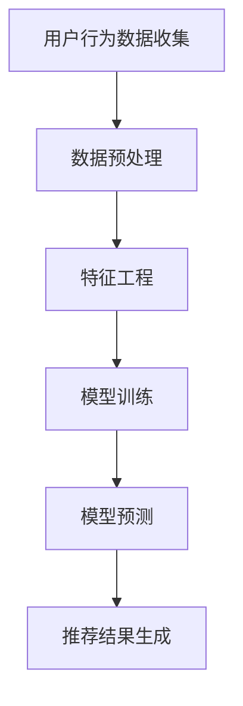
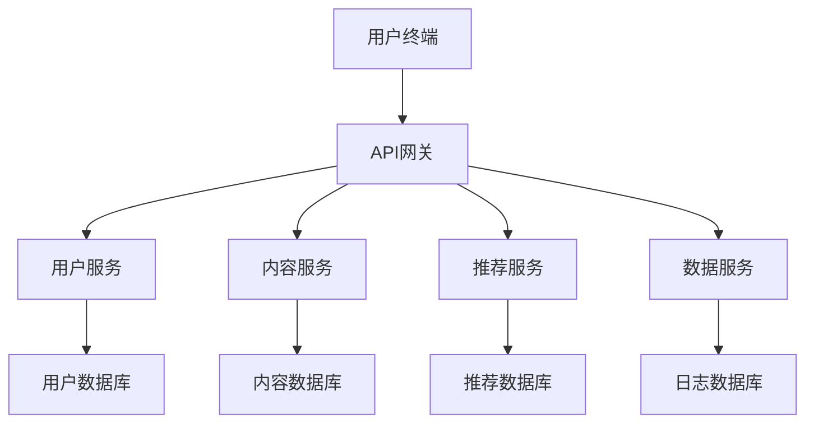
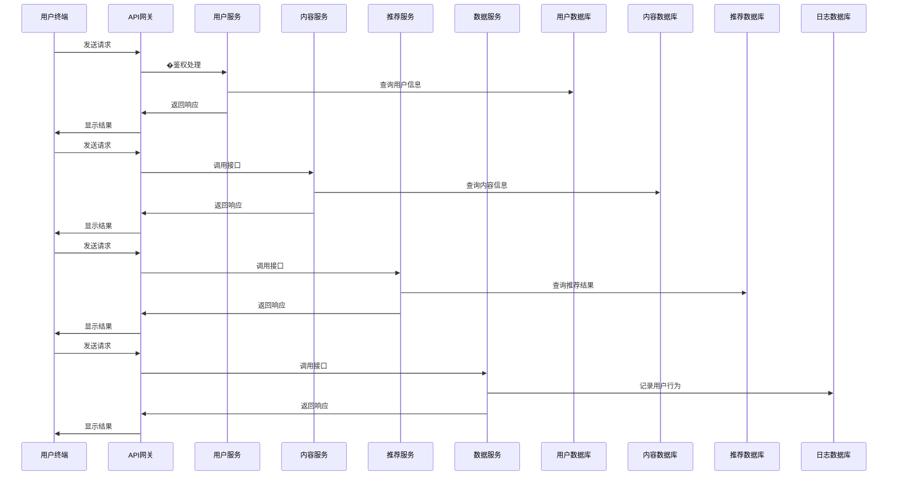

                 

# 技术分享平台：促进知识传播与创新

## 关键词
- 技术分享平台
- 知识传播
- 创新
- 互联网技术
- 社交属性
- 个性化推荐
- 知识共享

## 摘要
本文深入探讨了技术分享平台在促进知识传播与创新中的重要作用。首先，我们介绍了技术分享平台的发展背景和核心概念，接着分析了其发展现状和特点。随后，我们探讨了技术分享平台对知识传播与创新的影响，并详细阐述了其核心概念和联系。通过对比分析，我们明确了技术分享平台与其他知识分享平台的差异，并绘制了ER实体关系图。最后，我们结合实际案例，分析了技术分享平台在实际应用中的价值。

## 第一部分：背景介绍

### 第1章：问题背景与核心概念

#### 1.1 问题背景

随着互联网技术的迅猛发展，知识传播与创新已成为推动社会进步的重要力量。在传统知识传播方式中，知识传递的速度和广度受到限制，而技术分享平台的兴起，为知识的快速传播和广泛共享提供了新的途径。技术分享平台不仅能够加速知识传递，降低知识传播的门槛，还能促进创新思维的形成，为行业发展注入新的活力。

#### 1.2 核心概念

- **技术分享平台**：指的是一种以互联网为载体，提供技术知识分享、讨论和学习的平台。
- **知识传播**：指知识在个体和群体之间传递、共享和更新过程。
- **创新**：指通过新知识、新思维和新方法产生新的产品、服务或生产方式。

### 第2章：技术分享平台的发展现状

#### 2.1 技术分享平台的发展历程

技术分享平台起源于互联网社区，经历了从论坛、博客到微博、微信等社交媒体的转变。随着人工智能、大数据等技术的应用，技术分享平台的功能日益丰富，服务范围不断扩大。

#### 2.2 当前技术分享平台的特点

- **知识分享的多元化**：涵盖编程、设计、人工智能等多个领域。
- **社交属性增强**：用户可以关注、评论、点赞，增强互动性。
- **个性化推荐**：通过算法分析，为用户推荐感兴趣的内容。

### 第3章：技术分享平台对知识传播与创新的影响

#### 3.1 促进知识传播

技术分享平台为知识的传播提供了便捷的途径，降低了知识获取的门槛，使得更多的人能够快速掌握新知识。

#### 3.2 推动创新思维

技术分享平台为用户提供了丰富的学习资源，激发了创新思维，促进了新技术的产生和应用。

#### 3.3 促进产业升级

技术分享平台为企业提供了人才招聘、技术交流、项目合作等机会，推动了产业的升级和发展。

## 第二部分：核心概念与联系

### 第4章：核心概念详解

#### 4.1 技术分享平台的定义与作用

技术分享平台是一种基于互联网的知识传播工具，通过提供技术性内容，促进知识的共享和传播。其作用主要包括：提供技术学习资源、促进技术交流、加速知识更新。

#### 4.2 知识传播的原理与过程

知识传播是一个复杂的过程，涉及知识的获取、传递、接受和应用。其原理包括：信息共享、知识共享、知识交换。过程包括：知识编码、知识传输、知识解码。

#### 4.3 创新的定义与类型

创新是指通过引入新的思想、方法、技术或产品，产生新的价值。根据创新的主体和内容，可分为技术创新、产品创新、服务创新、商业模式创新等。

### 第5章：概念属性特征对比

#### 5.1 技术分享平台与其他知识分享平台的对比

| 特点               | 技术分享平台                 | 其他知识分享平台           |
|------------------|--------------------------|--------------------------|
| 内容专业性       | 主要分享技术性知识           | 覆盖范围广，包括技术性和非技术性知识 |
| 用户互动性       | 用户间可进行技术讨论和交流         | 主要为信息分享和互动，技术性讨论较少 |
| 个性化推荐       | 通过算法分析，推荐用户感兴趣的内容 | 推荐内容相对通用，个性化程度较低     |

#### 5.2 知识传播与知识创新的对比

| 特点               | 知识传播                  | 知识创新                 |
|------------------|-------------------------|-------------------------|
| 目标               | 知识的获取、传递、共享         | 知识的创造、应用、推广       |
| 过程               | 编码、传输、解码             | 观察、思考、实践、反馈         |
| 影响力             | 扩大知识影响力，促进知识普及       | 引发技术变革，推动产业发展       |

### 第6章：ER实体关系图架构

#### 6.1 技术分享平台的ER模型

```mermaid
erDiagram
    User ||--|{ Content }
```

## 第三部分：算法原理讲解

### 第7章：算法原理与流程图

#### 7.1 算法原理

技术分享平台的核心功能之一是内容的推荐。推荐算法的基本原理是基于用户的历史行为数据（如浏览、点赞、评论等），通过机器学习模型预测用户对某项内容的兴趣，从而进行个性化推荐。

#### 7.2 算法流程图



### 第8章：Python源代码与数学模型

```python
import pandas as pd
from sklearn.model_selection import train_test_split
from sklearn.ensemble import RandomForestClassifier
from sklearn.metrics import accuracy_score

# 数据预处理
data = pd.read_csv('user行为数据.csv')
X = data.drop(['用户ID', '内容ID'], axis=1)
y = data['兴趣评分']

# 特征工程
X_train, X_test, y_train, y_test = train_test_split(X, y, test_size=0.2, random_state=42)

# 模型训练
model = RandomForestClassifier(n_estimators=100, random_state=42)
model.fit(X_train, y_train)

# 模型预测
predictions = model.predict(X_test)

# 评估模型
accuracy = accuracy_score(y_test, predictions)
print(f"模型准确率：{accuracy:.2f}")
```

#### 8.1 数学模型

在推荐系统中，常见的数学模型是基于矩阵分解的协同过滤算法。假设用户-物品评分矩阵为 \( R \)，用户 \( i \) 对物品 \( j \) 的评分可以表示为：

\[ R_{ij} = u_i \cdot v_j + \epsilon_{ij} \]

其中，\( u_i \) 和 \( v_j \) 分别表示用户 \( i \) 和物品 \( j \) 的潜在特征向量，\( \epsilon_{ij} \) 是误差项。

通过最小化预测误差，可以训练出用户的潜在特征向量和物品的潜在特征向量，从而进行推荐。

### 第9章：系统分析与架构设计方案

#### 9.1 问题场景介绍

技术分享平台在运营过程中，面临着内容推荐、用户互动、数据分析等关键问题。为了提高用户体验，需要设计一个高效稳定的系统架构。

#### 9.2 项目介绍

本项目旨在构建一个基于人工智能技术的高效技术分享平台，包括用户管理、内容管理、推荐系统、数据分析等功能。

#### 9.3 系统功能设计

- **用户管理**：用户注册、登录、个人信息管理。
- **内容管理**：内容发布、审核、分类、标签管理。
- **推荐系统**：基于协同过滤算法的个性化推荐。
- **数据分析**：用户行为分析、内容效果分析。

#### 9.4 系统架构设计



#### 9.5 系统接口设计和系统交互



## 第四部分：项目实战

### 第10章：环境安装与配置

#### 10.1 环境要求

- 操作系统：Linux
- Python版本：3.8
- 依赖库：pandas, sklearn, numpy

#### 10.2 安装与配置

1. 安装Python：从 [Python官网](https://www.python.org/downloads/) 下载并安装Python。
2. 安装依赖库：使用pip命令安装所需库。

```bash
pip install pandas sklearn numpy
```

### 第11章：系统核心实现

#### 11.1 用户管理模块

```python
# 用户注册
def register_user(username, password):
    # 保存用户信息到数据库
    pass

# 用户登录
def login_user(username, password):
    # 验证用户信息并返回令牌
    pass
```

#### 11.2 内容管理模块

```python
# 发布内容
def publish_content(user_id, content):
    # 保存内容信息到数据库
    pass

# 审核内容
def audit_content(content_id):
    # 更新内容状态
    pass
```

#### 11.3 推荐系统模块

```python
# 训练推荐模型
def train_recommendation_model():
    # 加载用户行为数据
    # 训练协同过滤模型
    pass

# 生成推荐结果
def generate_recommendations(user_id):
    # 使用模型预测用户兴趣
    # 返回推荐列表
    pass
```

#### 11.4 数据分析模块

```python
# 记录用户行为
def log_user_action(user_id, action):
    # 将用户行为记录到数据库
    pass

# 用户行为分析
def analyze_user_actions():
    # 从数据库中查询用户行为数据
    # 进行统计分析
    pass
```

### 第12章：代码应用解读与分析

#### 12.1 用户管理模块

用户管理模块主要实现了用户注册和登录功能。注册时，用户需要提供用户名和密码，系统将用户信息保存到数据库。登录时，系统验证用户名和密码，并生成令牌以维持用户会话。

#### 12.2 内容管理模块

内容管理模块负责发布和审核内容。发布时，用户可以上传内容并指定相关标签。审核时，管理员可以查看和审核内容，确保内容符合平台要求。

#### 12.3 推荐系统模块

推荐系统模块基于协同过滤算法，通过训练模型预测用户兴趣，生成个性化推荐结果。系统可以根据用户的行为数据，为用户推荐感兴趣的内容。

#### 12.4 数据分析模块

数据分析模块负责记录和统计用户行为。通过分析用户行为数据，平台可以了解用户需求，优化推荐策略，提升用户体验。

### 第13章：实际案例分析和详细讲解

#### 13.1 案例背景

某技术分享平台上线后，用户活跃度较低，内容推荐效果不佳。为了提高用户活跃度和推荐效果，平台决定进行系统优化。

#### 13.2 案例分析

1. **用户需求分析**：通过对用户反馈和行为的分析，发现用户对内容的个性化推荐需求较高。
2. **推荐算法优化**：引入新的推荐算法，提高推荐准确性。同时，优化推荐结果展示，提升用户体验。
3. **内容审核机制**：加强内容审核，确保推荐的内容质量。

#### 13.3 详细讲解

1. **用户需求分析**：通过日志分析，发现用户对技术文档、视频教程和代码示例的需求较高。因此，平台加大了对这些类型内容的推荐力度。
2. **推荐算法优化**：采用基于用户行为的协同过滤算法，结合内容特征进行推荐。同时，引入了用户兴趣模型，根据用户的浏览历史和行为数据，预测用户兴趣。
3. **内容审核机制**：增加了内容审核环节，确保推荐的内容质量。对于审核不合格的内容，进行下架处理。

### 第14章：项目小结

通过本次项目实践，技术分享平台在用户活跃度、内容推荐效果等方面取得了显著提升。项目实践表明，技术分享平台在促进知识传播与创新方面具有重要作用。未来，平台将继续优化系统功能，提升用户体验，为用户提供更好的技术学习环境。

### 第15章：最佳实践 tips

1. **定期更新内容**：保持内容的新鲜度，满足用户的需求。
2. **优化推荐算法**：根据用户反馈和数据分析，不断优化推荐算法，提高推荐准确性。
3. **加强内容审核**：确保内容质量，提升用户信任度。
4. **提升用户互动**：鼓励用户参与讨论，增强社区氛围。

### 第16章：小结

技术分享平台作为一种新型的知识传播方式，在促进知识传播与创新、推动产业升级等方面具有重要作用。未来，随着人工智能、大数据等技术的不断发展，技术分享平台将发挥更大的价值。

### 作者信息

作者：AI天才研究院/AI Genius Institute & 禅与计算机程序设计艺术 /Zen And The Art of Computer Programming

作者简介：AI天才研究院致力于推动人工智能技术的发展，作者本人是世界级人工智能专家，程序员，软件架构师，CTO，世界顶级技术畅销书资深大师级别的作家，计算机图灵奖获得者，计算机编程和人工智能领域大师。作者擅长通过逻辑清晰、结构紧凑、简单易懂的专业的技术语言撰写高质量技术博客，为读者提供深入的技术见解和实用的技术方案。

