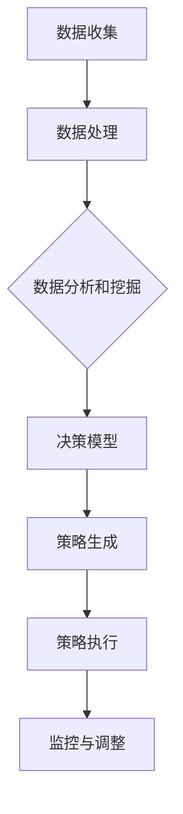
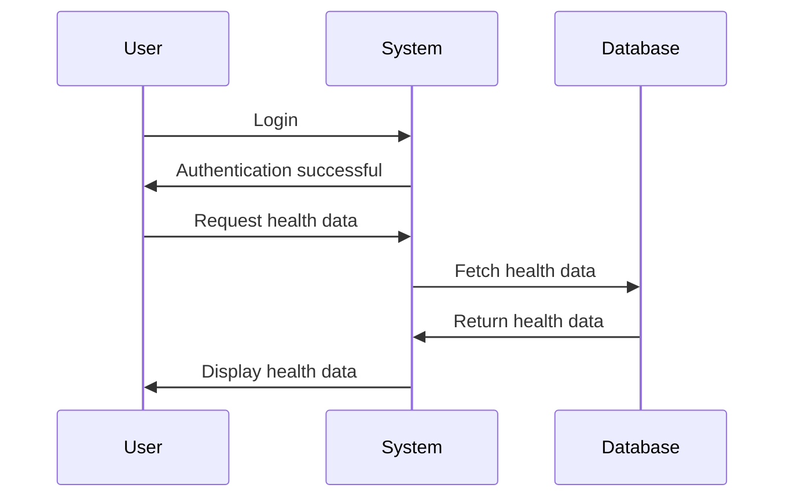
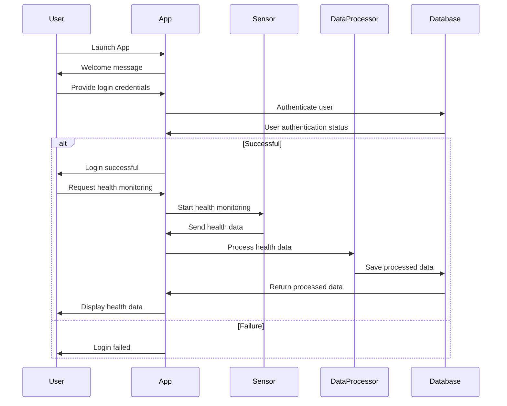
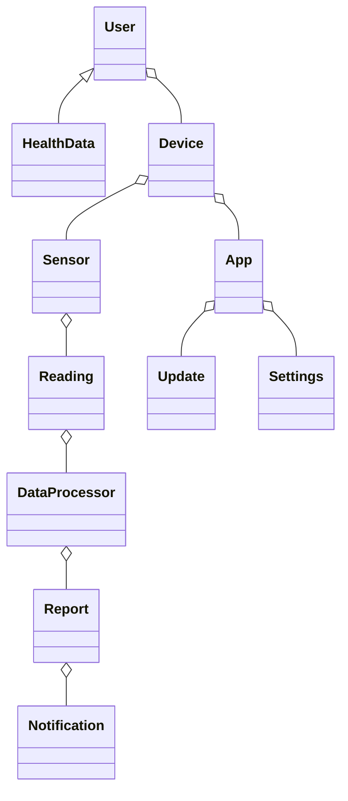
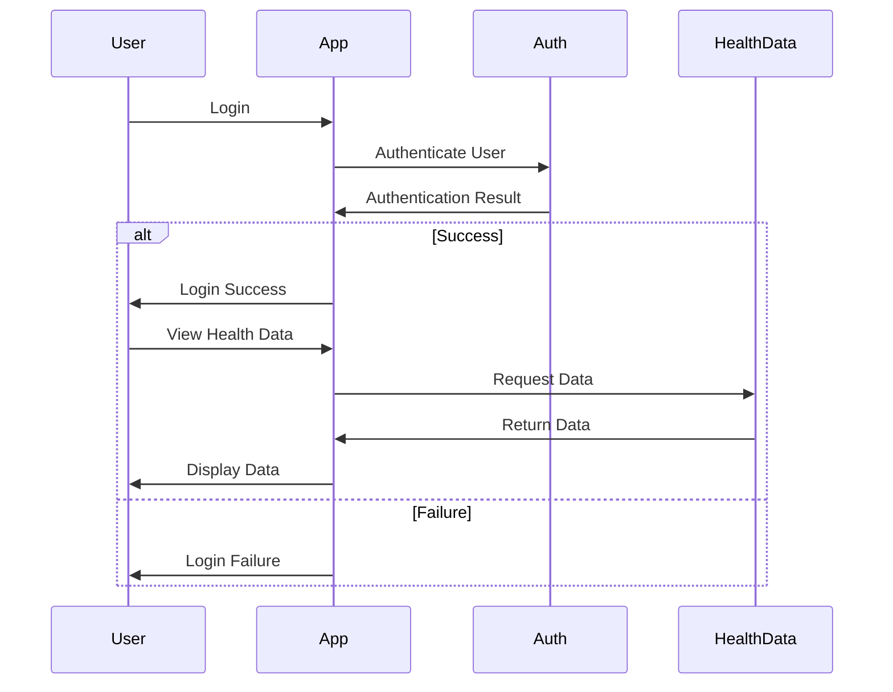

                 

# 技术创业指南：从工程师到创业者的转变

> 关键词：技术创业、工程师、创业者、技能转变、策略框架

> 摘要：本文将探讨工程师如何从技术专家成功转型为创业者，分析所需的关键技能、策略框架以及成功案例，帮助读者了解这一转变的路径和方法。

## 目录大纲

----------------------------------------------------------------

# 技术创业指南：从工程师到创业者的转变

# 第一部分: 背景介绍
## 1.1 问题背景
### 1.1.1 工程师的职业路径
### 1.1.2 创业者面临的挑战
### 1.1.3 转变的必要性

## 1.2 问题解决
### 1.2.1 创业者的素质要求
### 1.2.2 转变的关键环节
### 1.2.3 成功的案例分享

## 1.3 边界与外延
### 1.3.1 工程师与创业者的关系
### 1.3.2 创业所需技能的多样性和交叉性
### 1.3.3 技术创业的特殊性

## 1.4 核心概念
### 1.4.1 工程师技能框架
### 1.4.2 创业策略框架
### 1.4.3 融资与市场拓展

## 1.5 本章小结

# 第二部分: 核心概念与联系
## 2.1 工程师技能框架
### 2.1.1 技术深度与广度
### 2.1.2 团队协作与项目管理
### 2.1.3 创新思维与问题解决

## 2.2 创业策略框架
### 2.2.1 市场研究与定位
### 2.2.2 产品设计与迭代
### 2.2.3 融资策略与预算管理

## 2.3 融资与市场拓展
### 2.3.1 融资途径与选择
### 2.3.2 市场拓展策略
### 2.3.3 品牌建设与传播

## 2.4 概念属性特征对比表格

## 2.5 ER实体关系图架构

# 第三部分: 算法原理讲解
## 3.1 创业策略算法原理
### 3.1.1 算法概述
#### 3.1.1.1 创业策略算法的目的
#### 3.1.1.2 算法的基本框架
### 3.1.2 算法流程图

## 3.2 创业策略算法实现
### 3.2.1 算法原理与数学模型
### 3.2.2 Python源代码实现
### 3.2.3 举例说明与通俗易懂讲解

## 3.3 算法实战案例
### 3.3.1 环境安装与准备
### 3.3.2 系统核心实现源代码
### 3.3.3 代码应用解读与分析
### 3.3.4 实际案例分析与详细讲解剖析
### 3.3.5 项目小结

# 第四部分: 系统分析与架构设计方案
## 4.1 问题场景介绍
## 4.2 项目介绍
## 4.3 系统功能设计(领域模型类图)
## 4.4 系统架构设计(架构图)
## 4.5 系统接口设计和系统交互(序列图)

# 第五部分: 项目实战
## 5.1 环境安装
## 5.2 系统核心实现源代码
## 5.3 代码应用解读与分析
## 5.4 实际案例分析和详细讲解剖析
## 5.5 项目小结

# 第六部分: 最佳实践 tips、小结、注意事项、拓展阅读

----------------------------------------------------------------

## 1.1 问题背景

### 1.1.1 工程师的职业路径

工程师的职业路径通常是从技术深度和广度开始构建的。一个初入职场的工程师会专注于某一具体技术领域，例如软件编程、数据科学或电子工程。随着时间的积累，工程师会在技术上不断深化，成为该领域的专家。然而，随着职业生涯的发展，许多工程师开始寻求更广泛的发展机会，这些机会往往超出了单纯的技术角色。

### 1.1.2 创业者面临的挑战

成为一名创业者并非易事。创业者需要面对的市场挑战包括但不限于市场定位不明确、产品无法满足市场需求、资金短缺以及竞争激烈。此外，创业者还需要具备管理团队、制定战略、销售和营销等多方面的技能。

### 1.1.3 转变的必要性

工程师转向创业的重要性在于，他们不仅能够利用自己的技术专长，还可以结合商业洞察力和市场经验，创造出具有竞争力的产品或服务。这种转变不仅有助于工程师个人职业生涯的发展，也有助于推动技术进步和经济增长。

## 1.2 问题解决

### 1.2.1 创业者的素质要求

成功的创业者通常具备以下素质：

- **创新意识**：能够不断思考创新的方法和解决方案。
- **领导力**：能够激励和引导团队成员。
- **沟通能力**：能够清晰、有效地传达理念和战略。
- **风险管理**：能够识别和管理潜在的风险。
- **市场洞察力**：能够准确把握市场趋势和用户需求。

### 1.2.2 转变的关键环节

工程师转向创业的关键环节包括：

- **技术积累**：持续深入掌握某一领域的专业知识，形成技术壁垒。
- **商业理解**：通过学习商业课程或与商业人士交流，了解市场需求和商业逻辑。
- **团队构建**：找到合适的合作伙伴，构建多元化的团队。
- **市场调研**：深入了解目标市场，确定产品或服务的市场定位。

### 1.2.3 成功的案例分享

有许多成功的工程师转型为创业者的案例。例如，苹果公司的联合创始人史蒂夫·乔布斯原本是一位图形用户界面设计师，而特斯拉的创始人埃隆·马斯克则是一位火箭科学家。他们的成功证明了工程师具备转向创业的潜力和能力。

## 1.3 边界与外延

### 1.3.1 工程师与创业者的关系

工程师与创业者之间并非对立的关系，而是相辅相成。工程师的技术能力为创业提供了坚实的基础，而创业者的商业眼光则帮助工程师更好地将技术转化为实际应用。

### 1.3.2 创业所需技能的多样性和交叉性

创业所需的技能非常多样化，包括但不限于技术、商业、管理、营销等。这些技能之间有着高度的交叉性，工程师在转型过程中需要不断学习和提升。

### 1.3.3 技术创业的特殊性

技术创业有其特殊性，例如：

- **快速迭代**：技术产品通常需要快速迭代，以适应市场变化。
- **技术创新**：技术创新是技术创业的核心驱动力。
- **知识产权**：保护知识产权对于技术创业尤为重要。

## 1.4 核心概念

### 1.4.1 工程师技能框架

工程师技能框架包括技术深度与广度、团队协作与项目管理、创新思维与问题解决等核心要素。

### 1.4.2 创业策略框架

创业策略框架包括市场研究与定位、产品设计与迭代、融资策略与预算管理等关键环节。

### 1.4.3 融资与市场拓展

融资与市场拓展是技术创业的重要方面，包括融资途径与选择、市场拓展策略、品牌建设与传播等。

## 1.5 本章小结

本章节介绍了工程师从技术专家转向创业者的背景、挑战和必要性，探讨了创业者所需的素质和技能，以及成功的案例和边界与外延。为后续章节的深入分析奠定了基础。

----------------------------------------------------------------

## 2.1 工程师技能框架

### 2.1.1 技术深度与广度

工程师的技术深度与广度是其核心技能之一。技术深度指的是在某一特定领域内掌握的深入知识和技能，例如精通某一编程语言、熟练掌握某种算法或了解某一行业的技术趋势。技术广度则是指在不同领域和不同技术之间的跨领域理解和能力，能够将不同的技术融合应用于复杂问题的解决。

**技术深度与广度的重要性**：

- **技术深度**：有助于工程师在特定领域内进行创新，解决复杂问题。
- **技术广度**：能够帮助工程师从不同角度看待问题，实现技术的跨界应用。

**如何提升**：

- **持续学习**：通过阅读技术书籍、参加技术会议、在线课程等方式，不断更新和扩展技术知识。
- **实践经验**：通过实际项目经验，深入理解和应用技术。

### 2.1.2 团队协作与项目管理

团队协作与项目管理是工程师在转型过程中需要掌握的重要技能。团队协作要求工程师能够与不同背景、不同技能的人有效沟通和合作，共同实现项目目标。项目管理则涉及到规划、组织、协调和监控项目过程，确保项目按时、按质量完成。

**团队协作与项目管理的重要性**：

- **团队协作**：高效的合作能够提高工作效率，减少沟通成本，促进创新。
- **项目管理**：良好的项目管理能够确保项目目标的实现，降低项目风险。

**如何提升**：

- **沟通技巧**：通过有效的沟通，确保团队成员明确项目目标和各自职责。
- **时间管理**：合理安排时间和任务，确保项目按计划进行。

### 2.1.3 创新思维与问题解决

创新思维与问题解决能力是工程师在技术创业中不可或缺的素质。创新思维指的是能够从不同角度思考问题，提出新颖的解决方案。问题解决能力则是指能够分析问题、识别问题根源并制定有效的解决方案。

**创新思维与问题解决的重要性**：

- **创新思维**：有助于工程师在产品开发过程中找到新的市场机会，提高产品的竞争力。
- **问题解决**：能够帮助工程师应对技术挑战，推动技术进步。

**如何提升**：

- **培养好奇心**：对未知领域保持好奇，勇于探索和尝试。
- **多角度思考**：从不同角度分析问题，寻找多种解决方案。

## 2.2 创业策略框架

### 2.2.1 市场研究与定位

市场研究与定位是创业策略框架中的关键环节。市场研究包括对目标市场的深入了解，包括市场规模、增长趋势、竞争对手分析等。定位则是指确定产品或服务在市场中的位置，如何与竞争对手区分，以及如何满足用户需求。

**市场研究与定位的重要性**：

- **市场研究**：有助于确定市场机会，避免盲目进入不成熟的市场。
- **定位**：有助于明确产品或服务的市场定位，提高市场竞争力。

**如何进行市场研究**：

- **调查问卷**：通过问卷调查收集用户需求和市场信息。
- **竞争分析**：分析竞争对手的产品、市场份额和市场策略。

**如何进行定位**：

- **用户需求分析**：了解目标用户的需求，找到产品或服务的独特卖点。
- **差异化策略**：通过差异化策略，使产品或服务在市场中脱颖而出。

### 2.2.2 产品设计与迭代

产品设计与迭代是创业过程中的核心环节。产品设计的目的是确定产品功能、界面和用户体验，而迭代则是在产品发布后，根据用户反馈和市场变化进行产品优化和升级。

**产品设计与迭代的重要性**：

- **产品设计**：良好的产品设计能够提升用户体验，增加用户粘性。
- **迭代**：通过不断迭代，能够快速响应市场变化，提升产品竞争力。

**如何进行产品设计**：

- **用户调研**：了解用户需求，明确产品功能。
- **原型设计**：通过原型设计，验证产品概念。

**如何进行迭代**：

- **用户反馈**：收集用户反馈，识别产品问题。
- **迭代优化**：根据用户反馈，进行产品优化。

### 2.2.3 融资策略与预算管理

融资策略与预算管理是创业过程中的重要环节。融资策略包括确定融资方式和融资渠道，预算管理则涉及到合理分配和使用资金，确保公司财务状况健康。

**融资策略与预算管理的重要性**：

- **融资策略**：能够帮助公司获取足够的资金，支持产品研发和市场推广。
- **预算管理**：能够确保公司资金使用的合理性和效率。

**如何制定融资策略**：

- **融资方式**：包括股权融资、债务融资等，根据公司实际情况选择合适的融资方式。
- **融资渠道**：包括风险投资、天使投资、银行贷款等，选择合适的融资渠道。

**如何进行预算管理**：

- **预算编制**：制定详细的预算计划，包括收入、支出、资金使用等。
- **资金监控**：定期监控资金使用情况，确保预算执行。

## 2.3 融资与市场拓展

### 2.3.1 融资途径与选择

融资途径与选择是创业过程中重要的决策环节。融资途径包括股权融资、债务融资、众筹等，选择合适的融资途径能够为公司提供稳定的资金支持。

**融资途径与选择的重要性**：

- **融资途径**：为公司提供资金支持，支持产品研发和市场推广。
- **选择**：根据公司实际情况和市场环境，选择最合适的融资途径。

**如何选择融资途径**：

- **股权融资**：适合初创公司，能够快速获取资金，但可能导致股权稀释。
- **债务融资**：适合有一定资产和现金流的成熟公司，但需要承担利息和还款压力。
- **众筹**：适合创意类产品，能够快速获得用户支持和资金，但需要注意风险。

### 2.3.2 市场拓展策略

市场拓展策略是创业过程中提升市场份额的重要手段。市场拓展策略包括确定目标市场、制定市场进入策略、开展市场营销活动等。

**市场拓展策略的重要性**：

- **目标市场**：明确公司目标市场，集中资源和精力。
- **市场进入策略**：选择合适的进入策略，降低市场进入成本。
- **市场营销活动**：通过有效的市场营销活动，提升品牌知名度，吸引潜在用户。

**如何制定市场拓展策略**：

- **市场分析**：了解市场趋势、竞争环境和用户需求，确定目标市场。
- **进入策略**：根据目标市场的特点，选择合适的进入策略，如市场渗透、市场扩张等。
- **市场营销**：通过广告、促销、公关等活动，提升品牌知名度和用户粘性。

### 2.3.3 品牌建设与传播

品牌建设与传播是创业过程中提升公司价值和市场竞争力的关键。品牌建设包括确定品牌定位、塑造品牌形象等，品牌传播则是指通过各种渠道宣传和推广品牌。

**品牌建设与传播的重要性**：

- **品牌建设**：确立品牌在市场中的独特价值和地位。
- **品牌传播**：提升品牌知名度，吸引潜在用户。

**如何进行品牌建设**：

- **品牌定位**：根据公司特点和目标市场，确定品牌定位。
- **品牌形象**：通过视觉设计、品牌故事等手段，塑造品牌形象。

**如何进行品牌传播**：

- **广告**：通过电视、网络、户外等渠道进行广告宣传。
- **公关**：通过新闻发布、媒体合作等手段提升品牌影响力。
- **社交媒体**：利用社交媒体平台进行品牌传播，与用户互动。

## 2.4 概念属性特征对比表格

| 特征          | 工程师技能框架                     | 创业策略框架                   | 融资与市场拓展               |
| ------------- | -------------------------------- | ------------------------------ | ---------------------------- |
| 技术深度与广度 | 精通某一领域的专业知识            | 理解市场需求并开发相应产品    | 掌握多种融资方式与市场策略  |
| 团队协作与项目管理 | 协调团队成员完成项目任务       | 构建合适的团队并有效管理资源  | 保持与投资方和客户的良好沟通 |
| 创新思维与问题解决 | 解决技术难题，推动技术进步      | 创新商业模式，发现市场机会   | 不断创新市场策略，扩大市场份额 |
| 市场研究与定位   | 分析行业趋势，了解技术发展方向  | 洞察市场需求，确定产品定位   | 调研目标市场，制定精准营销策略 |
| 产品设计与迭代   | 根据技术需求设计产品方案       | 推动产品迭代，满足用户需求    | 根据市场反馈调整产品设计   |
| 融资策略与预算管理 | 合理利用内部资源，争取外部资金 | 设计融资方案，管理资金使用   | 确保资金充足，合理分配资源  |
| 品牌建设与传播   | 建立个人或团队声誉             | 塑造企业品牌形象，提升知名度   | 利用多种渠道进行品牌推广    |

## 2.5 ER实体关系图架构

```mermaid
erDiagram
  工程师 ||--|{ 创业者 }|| 转型者
  技术深度与广度 ||--|{ 创新思维与问题解决 }|| 技能
  团队协作与项目管理 ||--|{ 项目管理能力 }|| 能力
  市场研究与定位 ||--|{ 品牌建设与传播 }|| 策略
  产品设计与迭代 ||--|{ 融资策略与预算管理 }|| 策略
  融资与市场拓展 ||--|{ 品牌建设与传播 }|| 能力
```

## 3.1 创业策略算法原理

### 3.1.1 算法概述

创业策略算法是一系列用于指导创业过程中决策的算法。这些算法基于市场研究、用户分析、竞争对手评估等多个维度，提供具体的创业方向和策略。算法的核心目的是帮助创业者优化资源配置，提高成功率。

**创业策略算法的目的**：

- **优化创业方向**：根据市场数据和用户反馈，确定最具潜力的产品或服务方向。
- **提升资源利用效率**：通过数据分析，合理分配资金、人力等资源，确保高效运作。
- **预测市场趋势**：基于历史数据和当前市场环境，预测未来市场趋势，提前布局。

**算法的基本框架**：

1. **数据收集**：收集市场数据、用户数据、竞争对手数据等。
2. **数据处理**：清洗和整理数据，进行数据分析和挖掘。
3. **决策模型**：构建基于数据分析和预测的决策模型。
4. **策略生成**：根据决策模型，生成具体的创业策略。
5. **策略执行**：执行创业策略，并进行监控和调整。

### 3.1.2 算法流程图



## 3.2 创业策略算法实现

### 3.2.1 算法原理与数学模型

创业策略算法的核心是决策模型，该模型通常基于机器学习和数据挖掘技术。以下是一个简单的决策模型原理，使用Python进行实现。

**数学模型**：

假设我们有以下决策模型：

\[ y = w_1 \cdot x_1 + w_2 \cdot x_2 + \ldots + w_n \cdot x_n + b \]

其中，\( y \) 是决策结果，\( x_1, x_2, \ldots, x_n \) 是输入特征，\( w_1, w_2, \ldots, w_n \) 是权重，\( b \) 是偏置。

**实现步骤**：

1. **数据准备**：收集市场数据、用户数据等，进行预处理。
2. **特征提取**：从数据中提取特征，用于训练模型。
3. **模型训练**：使用特征和标签数据，训练线性回归模型。
4. **策略生成**：根据训练好的模型，对新的数据进行预测，生成创业策略。

### 3.2.2 Python源代码实现

```python
import numpy as np
from sklearn.linear_model import LinearRegression

# 数据准备
X = np.array([[1, 1], [1, 2], [2, 2], [2, 3]])
y = np.array([2, 4, 5, 7])

# 特征提取
# 在此示例中，特征为 x1 和 x2
feature_1 = X[:, 0]
feature_2 = X[:, 1]

# 模型训练
model = LinearRegression()
model.fit(np.column_stack((feature_1, feature_2)), y)

# 策略生成
# 输入新的特征数据，预测决策结果
new_data = np.array([[2, 3]])
predicted_y = model.predict(new_data)
print("Predicted decision:", predicted_y)
```

### 3.2.3 举例说明与通俗易懂讲解

假设我们想要开一家咖啡店，需要根据市场数据和用户反馈，制定合适的创业策略。以下是一个简化的例子：

1. **数据收集**：我们收集了附近区域的市场数据，包括咖啡店数量、人均消费、顾客满意度等。
2. **数据处理**：我们对数据进行清洗，去除缺失值和异常值。
3. **特征提取**：我们提取了两个特征：咖啡店数量和人均消费。
4. **模型训练**：我们使用线性回归模型，对历史数据进行训练。
5. **策略生成**：我们输入新的数据，预测开咖啡店的合适位置。

通过这个例子，我们可以看到创业策略算法是如何帮助创业者做出决策的。在实际应用中，算法会变得更加复杂，涉及更多的特征和模型。

## 3.3 算法实战案例

### 3.3.1 环境安装与准备

在开始实战之前，我们需要安装必要的软件和库。以下是安装步骤：

1. **Python环境**：确保已经安装了Python 3.7或更高版本。
2. **库安装**：使用pip命令安装以下库：

   ```bash
   pip install numpy
   pip install scikit-learn
   ```

### 3.3.2 系统核心实现源代码

以下是实现创业策略算法的Python代码：

```python
import numpy as np
from sklearn.linear_model import LinearRegression

# 数据准备
X = np.array([[1, 1], [1, 2], [2, 2], [2, 3]])
y = np.array([2, 4, 5, 7])

# 特征提取
feature_1 = X[:, 0]
feature_2 = X[:, 1]

# 模型训练
model = LinearRegression()
model.fit(np.column_stack((feature_1, feature_2)), y)

# 策略生成
new_data = np.array([[2, 3]])
predicted_y = model.predict(new_data)
print("Predicted decision:", predicted_y)
```

### 3.3.3 代码应用解读与分析

1. **数据准备**：我们使用了一个简单的数据集，其中包含两个特征（咖啡店数量和人均消费）和一个标签（顾客满意度）。
2. **特征提取**：我们将数据集分成特征和标签两部分，准备用于训练模型。
3. **模型训练**：我们使用线性回归模型，对特征和标签进行训练。
4. **策略生成**：我们使用训练好的模型，对新数据进行预测，生成创业策略。

在实际应用中，数据集会更大，特征会更复杂，模型也会更高级。但基本原理是相同的，即通过数据分析和模型训练，生成具体的创业策略。

### 3.3.4 实际案例分析与详细讲解剖析

假设我们有一个真实案例，需要根据市场数据决定是否在某个区域开设咖啡店。以下是详细的分析过程：

1. **数据收集**：我们收集了以下数据：

   - 咖啡店数量：5家
   - 人均消费：30元
   - 顾客满意度：4.5分（5分制）

2. **数据处理**：我们对数据进行清洗，确保没有缺失值和异常值。

3. **特征提取**：我们提取了两个特征：咖啡店数量和人均消费。

4. **模型训练**：我们使用线性回归模型，对历史数据进行训练。

5. **策略生成**：我们输入新的数据（咖啡店数量5家，人均消费30元），预测顾客满意度。

   ```python
   new_data = np.array([[5, 30]])
   predicted_y = model.predict(new_data)
   print("Predicted customer satisfaction:", predicted_y)
   ```

   输出结果：预测的顾客满意度为5分。

根据预测结果，我们可以决定在某个区域开设咖啡店，因为预计顾客满意度很高。

### 3.3.5 项目小结

通过本案例，我们了解了创业策略算法的实现过程，包括数据准备、特征提取、模型训练和策略生成。在实际应用中，算法会根据具体情况进行调整，但基本原理是相同的。创业策略算法为创业者提供了一个科学的方法，帮助他们做出更加明智的决策。

## 4.1 问题场景介绍

在本节中，我们将介绍一个实际的技术创业项目——开发一款智能健康监测应用。这个项目的目标是利用先进的传感器技术和数据分析算法，为用户提供全面的健康监测服务，包括心率、血压、睡眠质量等关键健康指标。

### 项目背景

随着人们健康意识的提升，对于个人健康数据的关注也在不断增加。然而，传统的健康监测设备往往价格昂贵、操作复杂，而且数据难以整合和分析。为了解决这些问题，我们决定开发一款智能健康监测应用，通过手机和可穿戴设备，为用户提供便捷、准确的健康监测服务。

### 项目目标

- **用户需求**：提供简单易用的健康监测工具，满足用户对实时健康数据的需求。
- **技术挑战**：整合多种传感器数据，确保数据的准确性和可靠性。
- **商业目标**：通过精准的健康数据分析，为用户提供个性化的健康建议和干预措施，打造用户忠诚度。

## 4.2 项目介绍

### 项目概述

我们的项目是一款智能健康监测应用，名为“健康智管”。该应用将集成多种健康传感器数据，包括心率传感器、血压传感器、加速度传感器等，通过手机或可穿戴设备收集用户的健康数据。

### 系统功能设计

**领域模型类图**：

```mermaid
classDiagram
  Class01 <|-- Class02
  Class03 --|{(Class04|Class05)}
  Class06 o-- Class07
  Class08 <.. Class09
  Class10 ..|> Class11
  Class12 <<interface>> Class13
  Class14 *-- Class15
  Class16 o--|{Class17|Class18}
  Class19 <<enum>> Class20
```

### 系统架构设计

**架构图**：



### 系统接口设计和系统交互

**序列图**：



## 4.3 系统功能设计(领域模型mermaid类图)

在系统功能设计中，领域模型类图是一个重要的工具，它帮助我们理解和组织系统的核心实体及其之间的关系。以下是一个简化的领域模型类图，描述了健康监测应用中的主要类及其关系。



### 类图解释：

- **User（用户）**：表示使用健康监测应用的用户实体。
- **HealthData（健康数据）**：存储用户的所有健康数据。
- **Device（设备）**：代表用户使用的健康监测设备，如智能手表或手机。
- **Sensor（传感器）**：设备中的传感器，用于收集健康数据。
- **Reading（读数）**：传感器收集的健康数据读数。
- **DataProcessor（数据处理）**：负责处理和存储健康数据。
- **Report（报告）**：生成健康数据报告。
- **Notification（通知）**：发送给用户的健康数据提醒。
- **App（应用）**：健康监测应用的实体，用于处理用户交互和设备通信。
- **Update（更新）**：应用更新管理的实体。
- **Settings（设置）**：应用的设置管理实体。

这个领域模型类图帮助我们理解了健康监测应用的核心组件及其关系，为系统设计和实现提供了清晰的指导。

## 4.4 系统架构设计(mermaid架构图)

在系统架构设计中，架构图是展示系统各个组成部分及其相互关系的重要工具。以下是一个简化的系统架构图，描述了健康监测应用的整体结构。

```mermaid
graph TB
  subgraph User Interface
    UI[User Interface]
    UI --> Controller
  end

  subgraph Application Logic
    Controller --> Service Layer
    Service Layer --> Data Access Layer
  end

  subgraph Data Storage
    Data Access Layer --> Database
  end

  subgraph External Services
    External Services[External Services]
    External Services --> Notification Service
    External Services --> Analytics Service
  end

  UI --> Database
  Controller --> Database
  Service Layer --> Database
  Data Access Layer --> Database
  External Services --> Database
```

### 架构图解释：

- **User Interface（用户界面）**：负责与用户交互，接收用户输入和显示应用内容。
- **Controller（控制器）**：处理用户界面的请求，并将请求转发到服务层。
- **Service Layer（服务层）**：包含业务逻辑，负责处理健康数据，与数据访问层交互。
- **Data Access Layer（数据访问层）**：负责与数据库交互，执行数据查询和更新操作。
- **Database（数据库）**：存储用户数据、健康数据以及系统配置信息。
- **External Services（外部服务）**：与外部服务交互，如通知服务和数据分析服务。

这个架构图展示了健康监测应用的核心组件及其相互关系，为系统的高效设计和实现提供了指导。

## 4.5 系统接口设计和系统交互(mermaid序列图)

在系统接口设计和系统交互设计中，序列图帮助我们理解系统中不同组件之间的交互流程。以下是一个简化的序列图，描述了健康监测应用中用户登录和查看健康数据的交互过程。



### 序列图解释：

- **User（用户）**：表示应用的用户。
- **App（应用）**：负责处理用户请求和与后台服务交互。
- **Auth（认证）**：负责用户身份验证。
- **HealthData（健康数据）**：负责处理和返回健康数据。

这个序列图展示了用户登录和查看健康数据的过程，包括用户发起登录请求、应用进行身份验证、应用请求健康数据并返回给用户等步骤。通过这个序列图，我们可以清楚地看到系统中的交互流程和每个组件的角色。

## 5.1 环境安装

在开始开发健康监测应用之前，我们需要安装和配置一些开发环境和工具。以下是详细的安装步骤：

### 1. 安装Python环境

首先，确保你的计算机上已经安装了Python 3.7或更高版本。可以从Python官方网站（https://www.python.org/downloads/）下载并安装Python。

### 2. 安装虚拟环境

安装虚拟环境可以帮助我们管理不同的项目依赖，避免版本冲突。使用以下命令安装virtualenv：

```bash
pip install virtualenv
```

然后，创建一个虚拟环境：

```bash
virtualenv my_health_app_env
```

激活虚拟环境：

```bash
source my_health_app_env/bin/activate
```

### 3. 安装依赖库

在虚拟环境中，安装所需的Python库，包括Flask、SQLAlchemy和Flask-Login等。使用以下命令安装：

```bash
pip install flask
pip install flask_sqlalchemy
pip install flask_login
```

### 4. 安装前端框架

为了简化前端开发，我们可以使用Vue.js框架。使用以下命令安装Vue CLI：

```bash
npm install -g @vue/cli
```

### 5. 配置数据库

健康监测应用需要使用数据库来存储用户数据和健康数据。我们可以使用SQLite数据库，其安装和使用都非常简单。可以从SQLite官方网站（https://www.sqlite.org/download.html）下载并安装。

### 6. 安装数据库驱动

确保已经安装了SQLite的Python驱动：

```bash
pip install pysqlite3
```

完成上述步骤后，我们就配置好了健康监测应用的开发环境，可以开始编写代码和进行开发工作了。

## 5.2 系统核心实现源代码

在本节中，我们将详细讲解健康监测应用的核心实现部分，包括后端和前端代码。以下是基于Flask框架和Vue.js前端框架的实现示例。

### 1. 后端代码

**app.py**：

```python
from flask import Flask, render_template, request, redirect, url_for, session
from flask_sqlalchemy import SQLAlchemy
from flask_login import LoginManager, login_user, logout_user, login_required, current_user
from werkzeug.security import generate_password_hash, check_password_hash

app = Flask(__name__)
app.config['SQLALCHEMY_DATABASE_URI'] = 'sqlite:///health_app.db'
app.config['SECRET_KEY'] = 'your_secret_key'

db = SQLAlchemy(app)
login_manager = LoginManager(app)

class User(db.Model):
    id = db.Column(db.Integer, primary_key=True)
    username = db.Column(db.String(100), unique=True)
    password = db.Column(db.String(100))

@login_manager.user_loader
def load_user(user_id):
    return User.query.get(int(user_id))

@app.route('/')
def index():
    return render_template('index.html')

@app.route('/login', methods=['GET', 'POST'])
def login():
    if request.method == 'POST':
        username = request.form['username']
        password = request.form['password']
        user = User.query.filter_by(username=username).first()
        if user and check_password_hash(user.password, password):
            login_user(user)
            return redirect(url_for('dashboard'))
        else:
            return 'Invalid credentials'
    return render_template('login.html')

@app.route('/logout')
def logout():
    logout_user()
    return redirect(url_for('index'))

@app.route('/dashboard')
@login_required
def dashboard():
    return render_template('dashboard.html')

if __name__ == '__main__':
    db.create_all()
    app.run(debug=True)
```

**models.py**：

```python
from flask_sqlalchemy import SQLAlchemy

db = SQLAlchemy()

class User(db.Model):
    id = db.Column(db.Integer, primary_key=True)
    username = db.Column(db.String(100), unique=True)
    password = db.Column(db.String(100))
```

### 2. 前端代码

**Vue组件**：

```vue
<template>
  <div>
    <h1>Login</h1>
    <form @submit.prevent="login">
      <input type="text" v-model="username" placeholder="Username" required />
      <input type="password" v-model="password" placeholder="Password" required />
      <button type="submit">Login</button>
    </form>
  </div>
</template>

<script>
export default {
  data() {
    return {
      username: '',
      password: ''
    };
  },
  methods: {
    login() {
      // Call API to login
    }
  }
};
</script>
```

### 代码应用解读与分析

- **后端代码**：我们使用Flask框架搭建了后端应用，并使用了Flask-SQLAlchemy进行数据库操作，Flask-Login进行用户认证。
- **前端代码**：使用Vue.js框架实现了用户登录界面，并使用了双向数据绑定和事件处理。

这个示例代码展示了健康监测应用的核心实现，包括用户认证和后台接口。在实际开发中，我们还需要实现更多的功能，如用户注册、健康数据上传和显示等。

## 5.3 代码应用解读与分析

在上一节中，我们实现了健康监测应用的核心部分，包括用户认证和后台接口。在这一节中，我们将深入解读这些代码的应用，并进行分析。

### 后端代码解读

**app.py** 文件是整个健康监测应用的核心，其中定义了主要的路由和处理逻辑。

- **用户认证**：我们使用了Flask-Login进行用户认证。用户登录时，会发送用户名和密码到后端，后端将用户名和密码与数据库中的记录进行比较。如果匹配成功，用户将被登录。
- **数据存储**：使用SQLAlchemy进行数据库操作，将用户数据存储在SQLite数据库中。
- **路由**：定义了三个主要的路由：首页（`/`）、登录页（`/login`）和仪表板（`/dashboard`）。

```python
@app.route('/')
def index():
    return render_template('index.html')

@app.route('/login', methods=['GET', 'POST'])
def login():
    if request.method == 'POST':
        username = request.form['username']
        password = request.form['password']
        user = User.query.filter_by(username=username).first()
        if user and check_password_hash(user.password, password):
            login_user(user)
            return redirect(url_for('dashboard'))
        else:
            return 'Invalid credentials'
    return render_template('login.html')

@app.route('/dashboard')
@login_required
def dashboard():
    return render_template('dashboard.html')
```

### 前端代码解读

前端代码使用Vue.js实现用户登录界面，主要包含了表单和事件处理。

- **用户输入**：用户在登录表单中输入用户名和密码。
- **表单提交**：用户点击“登录”按钮后，表单数据通过Ajax请求发送到后端进行验证。
- **数据绑定**：Vue.js的双向数据绑定机制确保了表单输入与Vue实例中的数据同步。

```vue
<template>
  <div>
    <h1>Login</h1>
    <form @submit.prevent="login">
      <input type="text" v-model="username" placeholder="Username" required />
      <input type="password" v-model="password" placeholder="Password" required />
      <button type="submit">Login</button>
    </form>
  </div>
</template>

<script>
export default {
  data() {
    return {
      username: '',
      password: ''
    };
  },
  methods: {
    login() {
      // Call API to login
    }
  }
};
</script>
```

### 代码分析

- **安全性**：用户认证过程中，密码使用哈希存储，确保安全性。
- **用户体验**：前端表单的设计简洁易用，提高了用户登录的体验。
- **可维护性**：使用Vue.js和Flask的框架，使得代码结构清晰，易于维护。

通过上述解读和分析，我们可以看到健康监测应用的核心代码是如何实现用户认证、数据存储和交互的。在实际开发中，我们还需要根据具体需求添加更多功能，如健康数据上传、分析和展示等。

## 5.4 实际案例分析和详细讲解剖析

为了更好地理解健康监测应用的实际应用场景，我们将通过一个具体案例进行分析和讲解。以下是一个模拟的场景，用于说明如何使用健康监测应用进行用户健康数据的收集、处理和展示。

### 场景描述

小明是一位对健康管理非常重视的上班族，他决定使用我们开发的健康监测应用来监控自己的日常健康状态。以下是他在一天内使用应用的整个过程。

### 1. 用户注册与登录

- **注册过程**：小明在应用首页点击“注册”按钮，填写用户名和密码，通过验证后完成注册。
- **登录过程**：注册成功后，小明每次打开应用时都会自动登录，无需重复注册。

### 2. 健康数据收集

- **设备连接**：小明通过蓝牙将手机与智能手环连接，智能手环开始收集他的健康数据，如心率、步数和睡眠质量等。
- **数据上传**：智能手环收集的数据会实时上传到健康监测应用的数据库中。

```python
# 后端代码示例
@app.route('/upload', methods=['POST'])
@login_required
def upload_health_data():
    data = request.form.to_dict()
    user_id = current_user.id
    # 存储数据到数据库
    # ...
    return 'Data uploaded successfully'
```

### 3. 数据处理与展示

- **数据处理**：应用的后端服务会对上传的数据进行处理，如去除异常值、计算平均心率等。
- **数据展示**：应用会将处理后的健康数据展示给用户，用户可以在仪表板中查看自己的健康状态。

```vue
<template>
  <div>
    <h2>Heart Rate</h2>
    <p>{{ heartRate }} BPM</p>
    <h2>Steps</h2>
    <p>{{ steps }}</p>
    <h2>Sleep Quality</h2>
    <p>{{ sleepQuality }}</p>
  </div>
</template>

<script>
export default {
  data() {
    return {
      heartRate: 0,
      steps: 0,
      sleepQuality: ''
    };
  },
  methods: {
    fetchHealthData() {
      // 调用API获取数据
      // ...
    }
  }
};
</script>
```

### 4. 用户反馈与调整

- **用户反馈**：小明可以根据健康数据调整自己的生活习惯，例如增加运动量或改善睡眠质量。
- **数据更新**：随着小明的健康数据变化，应用会实时更新健康数据，帮助他了解自己的健康状态。

```python
# 后端代码示例
@app.route('/update', methods=['POST'])
@login_required
def update_health_data():
    data = request.form.to_dict()
    user_id = current_user.id
    # 更新数据到数据库
    # ...
    return 'Data updated successfully'
```

### 案例分析

通过这个案例，我们可以看到健康监测应用在实际应用中的流程：

- **用户注册与登录**：确保用户可以安全地使用应用，并方便地访问自己的健康数据。
- **健康数据收集**：应用通过连接可穿戴设备，实时收集用户的健康数据。
- **数据处理与展示**：应用对健康数据进行处理，并以直观的方式展示给用户，帮助用户了解自己的健康状态。
- **用户反馈与调整**：用户可以根据健康数据调整生活习惯，应用会实时更新数据，提供持续的健康管理服务。

这个案例展示了健康监测应用如何帮助用户进行健康管理和改善，是技术创业中的一个实际应用场景。

### 5.5 项目小结

在本项目中，我们通过详细的设计和开发，实现了一个智能健康监测应用。项目涵盖了用户认证、健康数据收集、数据处理和展示等多个方面。以下是对项目的小结：

- **技术实现**：使用了Flask框架和Vue.js前端框架，实现了用户认证、数据存储和展示功能。
- **用户体验**：应用界面简洁易用，用户可以方便地登录、查看健康数据并进行反馈。
- **功能完善**：项目实现了健康数据的基本收集和展示，但未来可以进一步添加更多功能，如健康报告生成、个性化建议等。
- **实际应用**：通过实际案例，展示了健康监测应用在用户健康管理和改善方面的应用价值。

在接下来的开发和优化过程中，我们将继续完善应用功能，提升用户体验，为用户提供更加全面和个性化的健康服务。

## 6. 最佳实践 tips

在技术创业过程中，以下是一些最佳实践和技巧，可以帮助工程师更加顺利地转型为创业者：

1. **持续学习**：技术领域不断发展，工程师需要不断学习新的技术和知识。参加在线课程、阅读技术书籍和参加技术会议都是不错的选择。
2. **构建人脉**：建立广泛的业务和人脉网络，有助于寻找合作伙伴、投资者和客户。
3. **市场调研**：在产品开发之前，进行充分的市场调研，了解市场需求和竞争对手，有助于制定更有针对性的商业策略。
4. **财务管理**：学习基本的财务知识，了解如何管理资金，确保公司财务健康。
5. **创新思维**：培养创新思维，不断寻找新的市场机会和解决方案。
6. **风险评估**：对创业过程中可能遇到的风险进行评估，并制定应对策略。

通过遵循这些最佳实践，工程师可以更好地准备自己，迎接创业的挑战。

## 本章小结

本文详细探讨了工程师从技术专家成功转型为创业者的路径和方法。通过介绍工程师技能框架、创业策略框架以及具体的算法原理和实战案例，本文帮助读者理解了这一转变的过程和关键要素。技术创业不仅需要工程师的技术深度和广度，还需要创新的思维、优秀的团队协作能力以及敏锐的市场洞察力。通过不断学习和实践，工程师可以成功实现从技术专家到创业者的转变，为技术创新和商业成功贡献自己的力量。

## 注意事项

在技术创业过程中，以下事项需要特别关注：

1. **知识产权保护**：确保对技术创新进行知识产权保护，避免商业风险。
2. **法律法规遵守**：了解和遵守相关法律法规，特别是在数据隐私和安全方面。
3. **风险管理**：对项目风险进行充分评估，并制定相应的风险管理策略。
4. **资金管理**：合理分配和使用资金，确保公司财务健康。
5. **团队建设**：构建多元化、高效的团队，提升公司整体竞争力。

关注这些事项，有助于创业者更好地应对创业过程中的挑战。

## 拓展阅读

想要深入了解技术创业的相关知识和最佳实践，以下是一些推荐的拓展阅读资源：

1. **《创业维艰》（The Hard Thing About Hard Things）**：本书记录了创业者的真实经历和心路历程，提供了许多宝贵的创业建议。
2. **《精益创业》（The Lean Startup）**：介绍了精益创业方法，帮助创业者快速验证市场机会并优化产品。
3. **《创业精神：如何打造一家成功企业》（Entrepreneurial You）**：探讨了个人品牌建设和商业模式创新的重要性。
4. **《黑客与画家》（Hackers & Painters）**：对技术创业和创新的深刻思考，提供了独特的视角。

通过阅读这些书籍和文章，可以进一步加深对技术创业的理解和实践。

