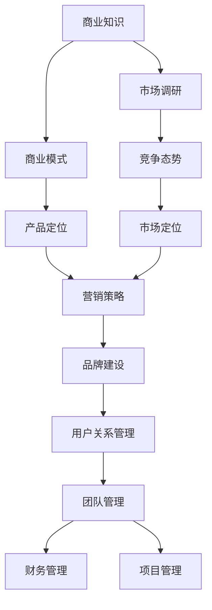
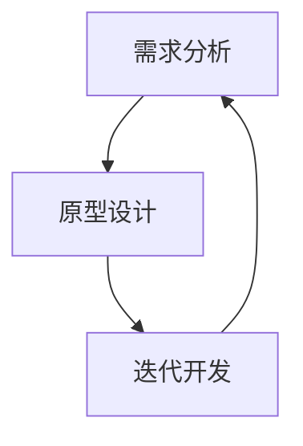
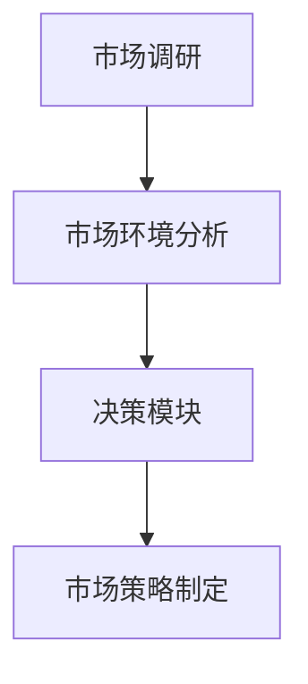
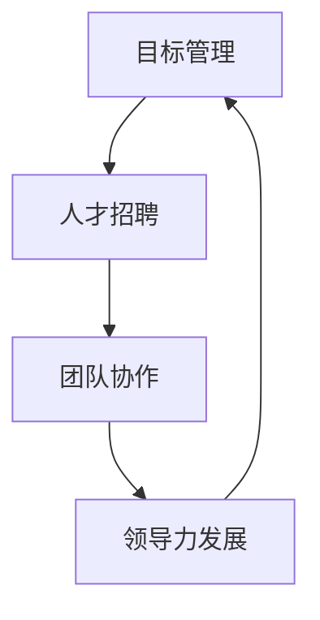
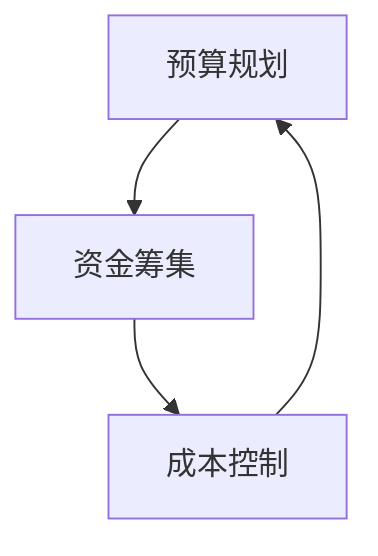
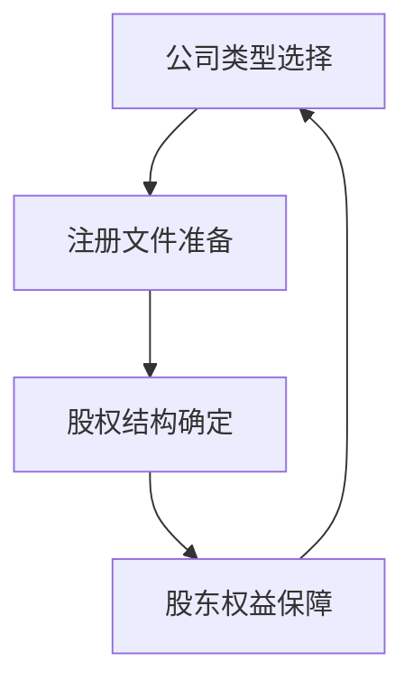
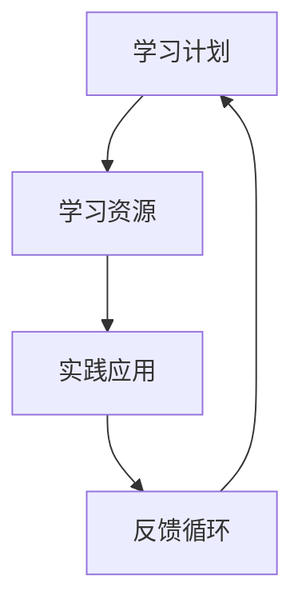
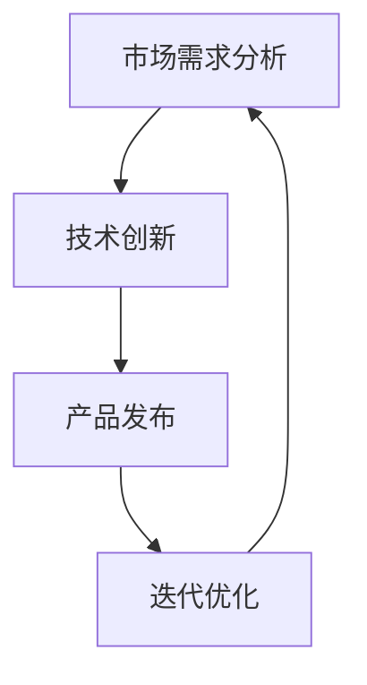
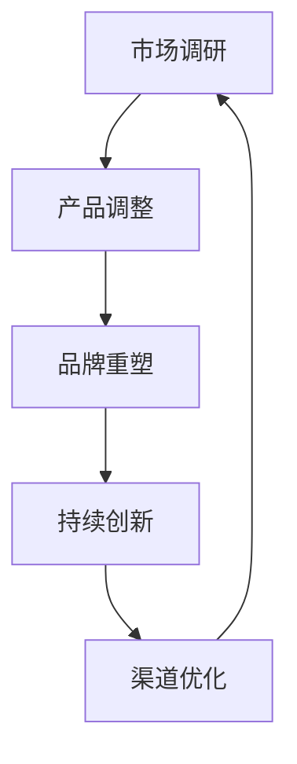

                 

### 文章标题

《技术创业：从工程师到创始人的转变》

### 文章关键词

技术创业、工程师、创始人、转变、创业准备、产品开发、市场推广、团队建设、财务管理、法律与合规、持续成长

### 文章摘要

本文将深入探讨工程师如何成功转型为创始人，并创立一家成功的技术创业公司。文章分为十个部分，从创业的背景和必要性，到创业准备、产品开发、市场推广、团队建设、财务管理、法律与合规，再到持续成长和案例分析，最后总结创业的经验和展望未来。通过对每个阶段的详细分析和实际案例的分享，帮助工程师更好地理解创业的方方面面，实现从工程师到创始人的转变。

### 引言

#### 1.1 书籍目的与读者定位

本书旨在帮助技术背景的工程师理解创业的过程，提供实用的指导和建议，使其能够顺利转型为成功的创始人。无论您是初涉创业领域的新手，还是希望进一步提升创业能力的工程师，本书都将为您提供有益的知识和经验。

#### 1.2 技术创业的必要性

在当今快速发展的科技时代，技术创业变得尤为重要。随着互联网、大数据、人工智能等技术的广泛应用，市场对于创新技术的需求日益增加。作为工程师，您拥有独特的专业技能和视野，能够抓住市场机遇，开发出具有竞争力的产品和服务。因此，从工程师到创始人的转变不仅能够实现个人价值的提升，也能为社会带来更多的创新和进步。

### 第二部分 创业准备

#### 2.1 创业心态塑造

**核心概念与联系：**

创业心态是成功创业的关键。与传统的工程师角色相比，创始人需要具备更强的抗压能力、决策能力和创新能力。以下是创业心态的核心要素和它们之间的关系：

| 核心要素 | 说明 | 关系 |
| :--: | :--: | :--: |
| 勇于面对风险 | 创业过程中不可避免地会遇到各种风险，如市场风险、技术风险等。 | 勇于面对风险是创业成功的前提条件。 |
| 持续学习 | 创业环境不断变化，创业者需要持续学习新的知识和技术。 | 持续学习是适应变化、保持竞争力的关键。 |
| 独立思考 | 创业者需要独立思考，做出正确的决策。 | 独立思考是决策能力的基础。 |
| 适应变化 | 市场和技术环境不断变化，创业者需要灵活应对。 | 适应变化是保持创业活力的关键。 |

**问题背景与问题描述：**

传统的工程师角色通常注重技术的实现和优化，而在创业过程中，工程师需要从技术专家转变为商业领袖。这种角色转变对工程师的心理素质提出了更高的要求。许多工程师在转型过程中会遇到以下问题：

- 如何从技术思维转向商业思维？
- 如何应对创业中的压力和不确定性？
- 如何在技术竞争中脱颖而出？

**问题解决与边界与外延：**

解决上述问题需要工程师具备以下能力和素质：

- **跨学科知识储备**：了解商业、营销、管理等领域的知识，以便更好地理解市场和用户需求。
- **决策能力**：在复杂多变的环境中做出明智的决策。
- **抗压能力**：面对创业过程中的挫折和困难，保持积极的心态。
- **创新能力**：不断探索新的技术和商业机会，保持竞争优势。

**概念结构与核心要素组成：**

创业心态的结构包括以下几个核心要素：

1. **目标明确**：明确创业的目标和愿景，保持前进的动力。
2. **自我激励**：自我激励是创业者保持激情和动力的关键。
3. **积极沟通**：良好的沟通能力有助于团队协作和资源整合。
4. **时间管理**：高效的时间管理能力有助于提高工作效率。

**算法原理讲解：**

创业心态的算法原理可以理解为一种决策树模型，其中每个节点代表一个决策点，每个分支代表不同的选择。通过分析不同选择的成本和收益，创业者可以做出最优的决策。

```python
def decision_tree(state):
    if state['pressure'] > threshold:
        return "减压"
    elif state['learning'] < threshold:
        return "学习"
    elif state['innovation'] < threshold:
        return "创新"
    else:
        return "维持现状"

# 示例
state = {'pressure': 5, 'learning': 3, 'innovation': 4}
print(decision_tree(state))
```

**系统分析与架构设计方案：**

创业心态的系统架构设计可以看作是一个由心态模块、决策模块和反馈模块组成的闭环系统。心态模块负责收集和分析状态信息，决策模块根据状态信息做出决策，反馈模块则根据决策结果调整心态。

```mermaid
state_module --> decision_module
decision_module --> feedback_module
feedback_module --> state_module
```

**项目实战：**

在实际创业过程中，工程师可以采取以下措施来塑造良好的创业心态：

- **定期反思**：每周花时间反思自己的行为和决策，找出改进的方向。
- **学习交流**：积极参加行业会议和研讨会，学习其他创业者的经验和教训。
- **身心健康**：保持良好的生活习惯，如适量运动、健康饮食等，以保持身心健康。

**最佳实践 tips、小结、注意事项、拓展阅读：**

- **最佳实践 tips**：设立明确的个人目标和职业规划，持续学习新知识和技能，保持积极的心态，勇于面对挑战。
- **小结**：创业心态是成功创业的关键，工程师需要通过跨学科学习、自我激励和积极沟通来塑造良好的创业心态。
- **注意事项**：创业过程中要保持清晰的头脑，避免盲目跟风，同时要注重团队建设和资源整合。
- **拓展阅读**：《创业维艰》、《创业精神：成功创业者的思维方式和行为模式》等。

通过以上内容的介绍，我们可以看出，创业心态的塑造对于工程师成功转型为创始人至关重要。接下来，我们将进一步探讨工程师在创业前需要做的其他准备工作。**2.2 跨学科知识储备**

在技术创业中，工程师需要不仅具备扎实的技术背景，还需要掌握一定的跨学科知识，包括商业知识、营销知识和管理知识。这些跨学科知识对于工程师成功转型为创始人至关重要。以下是详细的分析和讨论。

**核心概念与联系：**

1. **商业知识**：商业知识是理解市场和商业模式的基础。工程师需要了解市场需求、竞争态势、商业模式等，以便更好地定位产品和服务。

2. **营销知识**：营销知识是产品推广和品牌建设的关键。工程师需要了解市场定位、品牌推广、用户关系管理等，以便有效地推广产品。

3. **管理知识**：管理知识是团队建设和资源整合的基础。工程师需要了解人力资源管理、财务管理、项目管理等，以便高效地管理团队和资源。

以下是这三个核心概念之间的联系表格：

| 核心概念 | 说明 | 关系 |
| :--: | :--: | :--: |
| 商业知识 | 理解市场和商业模式 | 为产品定位和商业模式提供依据 |
| 营销知识 | 推广产品和品牌建设 | 提高产品市场占有率和品牌知名度 |
| 管理知识 | 团队建设和资源整合 | 确保产品顺利开发和推广 |

**问题背景与问题描述：**

传统的工程师角色通常专注于技术实现和优化，而缺乏商业、营销和管理方面的知识。这使得工程师在转型为创始人时面临诸多挑战，如：

- 如何理解市场需求和竞争态势？
- 如何有效推广产品和服务？
- 如何高效管理团队和资源？

**问题解决与边界与外延：**

为了解决上述问题，工程师需要掌握以下知识和技能：

- **市场调研**：通过市场调研了解市场需求和竞争态势，为产品定位提供依据。
- **品牌建设**：通过品牌定位和推广策略，提高产品的市场占有率和品牌知名度。
- **团队管理**：通过人力资源管理、财务管理、项目管理等知识，高效管理团队和资源。

**概念结构与核心要素组成：**

跨学科知识储备的结构包括以下几个核心要素：

1. **商业知识**：包括市场需求、竞争态势、商业模式等。
2. **营销知识**：包括市场定位、品牌推广、用户关系管理等。
3. **管理知识**：包括人力资源管理、财务管理、项目管理等。

**算法原理讲解：**

跨学科知识储备的算法原理可以看作是一个多维度知识框架。工程师需要根据不同阶段的需求，选择和整合相应的知识。

```python
def knowledge_framework(stage):
    if stage == 'product':
        return ['商业知识', '技术知识']
    elif stage == 'marketing':
        return ['营销知识', '用户调研']
    elif stage == 'management':
        return ['管理知识', '团队管理']
    else:
        return '未知阶段，请重新定义'

# 示例
print(knowledge_framework('product'))
```

**系统分析与架构设计方案：**

跨学科知识储备的系统架构设计可以看作是一个由商业知识模块、营销知识模块和管理知识模块组成的综合体。每个模块负责不同领域的知识，并通过相互协作，实现知识整合和应用。



**项目实战：**

在实际创业过程中，工程师可以通过以下步骤来储备跨学科知识：

- **参加培训课程**：报名参加商业、营销和管理方面的培训课程，系统学习相关知识。
- **阅读经典书籍**：阅读《创新与创业精神》、《营销管理》、《管理学》等经典书籍，深入学习。
- **实践操作**：通过实际项目操作，将所学知识应用到实践中，不断积累经验。

**最佳实践 tips、小结、注意事项、拓展阅读：**

- **最佳实践 tips**：制定学习计划，定期复习和总结；将所学知识应用到实际项目中，不断实践和调整。
- **小结**：跨学科知识储备是工程师成功转型为创始人的关键，通过系统学习商业、营销和管理知识，可以提高创业成功率。
- **注意事项**：要注重理论与实践的结合，避免陷入理论堆砌的误区。
- **拓展阅读**：《创业者的逻辑》、《创业管理：战略、组织、领导力》、《市场营销原理》等。

通过以上内容的介绍，我们可以看到，跨学科知识储备对于工程师成功转型为创始人具有重要意义。接下来，我们将进一步探讨工程师在创业过程中需要面对的产品开发环节。

### 3.1 产品规划与设计

**产品规划与设计**

在技术创业的过程中，产品规划和设计是至关重要的一环。一个成功的产品不仅需要满足用户需求，还要具有市场竞争力。本节将详细讨论产品规划与设计的关键步骤、方法和技巧。

**核心概念与联系：**

1. **需求分析**：需求分析是产品规划的第一步，它涉及到用户调研、市场分析和竞争分析。

2. **原型设计**：原型设计是将需求转化为具体产品形态的过程，包括低保真原型和高保真原型。

3. **迭代开发**：迭代开发是一种持续改进的方法，通过不断收集用户反馈，对产品进行优化。

以下是这些核心概念之间的联系表格：

| 核心概念 | 说明 | 关系 |
| :--: | :--: | :--: |
| 需求分析 | 确定产品功能和目标用户 | 为原型设计和迭代开发提供依据 |
| 原型设计 | 将需求转化为具体产品形态 | 验证需求，指导迭代开发 |
| 迭代开发 | 持续优化产品 | 根据用户反馈，不断改进产品 |

**问题背景与问题描述：**

在技术创业过程中，工程师往往面临以下挑战：

- 如何准确理解用户需求？
- 如何设计出既满足用户需求又有市场竞争力产品？
- 如何高效地进行产品迭代？

**问题解决与边界与外延：**

为了解决上述问题，工程师可以采取以下步骤：

1. **进行用户调研**：通过问卷调查、访谈等方式，收集用户需求和反馈。
2. **进行市场分析**：分析市场趋势、竞争态势和潜在用户群体。
3. **设计原型**：根据需求分析结果，设计低保真原型，进行初步验证。
4. **迭代开发**：通过迭代开发，不断优化产品，满足用户需求。

**概念结构与核心要素组成：**

产品规划与设计的概念结构包括以下几个核心要素：

1. **用户需求**：通过用户调研，确定产品功能和目标用户。
2. **市场分析**：分析市场趋势、竞争态势和潜在用户群体。
3. **原型设计**：设计低保真原型，验证需求。
4. **迭代开发**：通过迭代开发，不断优化产品。

**算法原理讲解：**

产品规划和设计的算法原理可以看作是一个需求驱动的迭代模型。该模型通过不断收集用户反馈，对产品进行优化。

```python
def product Iteration(model, user_feedback):
    new_model = model
    while not user_satisfied(user_feedback):
        new_model = optimize_model(new_model, user_feedback)
    return new_model

# 示例
model = 'v1.0'
user_feedback = '功能不足'
new_model = product Iteration(model, user_feedback)
print(new_model)
```

**系统分析与架构设计方案：**

产品规划与设计的系统架构设计可以看作是一个由需求分析模块、原型设计模块和迭代开发模块组成的闭环系统。每个模块负责不同阶段的任务，并通过相互协作，实现产品的持续优化。



**项目实战：**

在实际创业过程中，工程师可以采取以下步骤进行产品规划和设计：

1. **进行用户调研**：通过问卷调查、访谈等方式，收集用户需求和反馈。
2. **进行市场分析**：分析市场趋势、竞争态势和潜在用户群体。
3. **设计原型**：根据需求分析结果，设计低保真原型。
4. **迭代开发**：通过迭代开发，不断优化产品。

**最佳实践 tips、小结、注意事项、拓展阅读：**

- **最佳实践 tips**：定期进行用户调研，及时收集用户反馈；设计原型时，注重用户体验和功能完善；迭代开发时，注重速度和质量。
- **小结**：产品规划和设计是技术创业的关键环节，通过需求分析、原型设计和迭代开发，可以打造出满足用户需求、有市场竞争力的产品。
- **注意事项**：要注重用户调研的真实性和有效性，避免盲目跟风；设计原型时，要注重用户体验，避免功能过多或过少。
- **拓展阅读**：《用户体验要素》、《敏捷软件开发：原则、实践与模式》、《产品经理手册》等。

通过以上内容的介绍，我们可以看到，产品规划和设计对于技术创业至关重要。接下来，我们将探讨市场推广的相关内容。

### 4.1 市场定位与策略

**市场定位与策略**

市场定位是产品成功的关键一步，它涉及到确定目标市场、分析市场环境和制定市场策略。一个准确的市场定位能够帮助产品在竞争激烈的市场中脱颖而出，从而实现更高的市场份额和品牌价值。本节将详细讨论市场定位与策略的核心概念、方法和实践。

**核心概念与联系：**

1. **目标市场**：目标市场是产品希望满足的一组用户，通过明确目标市场，产品可以更精准地满足用户需求。

2. **市场环境分析**：市场环境分析包括宏观经济环境、行业趋势、竞争对手分析等，通过分析市场环境，可以了解市场机遇和挑战。

3. **市场策略**：市场策略包括市场进入策略、市场扩张策略、品牌建设策略等，通过制定有效的市场策略，产品可以更好地占领市场。

以下是这些核心概念之间的联系表格：

| 核心概念 | 说明 | 关系 |
| :--: | :--: | :--: |
| 目标市场 | 确定产品希望满足的用户群体 | 为市场策略提供依据 |
| 市场环境分析 | 分析市场机遇和挑战 | 为市场定位和策略提供依据 |
| 市场策略 | 制定市场进入、扩张和品牌建设策略 | 实现市场定位和占领市场 |

**问题背景与问题描述：**

在技术创业过程中，工程师往往面临以下问题：

- 如何准确确定目标市场？
- 如何分析市场环境，找到市场机遇？
- 如何制定有效的市场策略，提高市场占有率？

**问题解决与边界与外延：**

为了解决上述问题，工程师可以采取以下步骤：

1. **进行市场调研**：通过问卷调查、访谈等方式，收集用户需求和反馈。
2. **进行市场环境分析**：分析宏观经济环境、行业趋势和竞争对手。
3. **确定目标市场**：根据市场调研和市场环境分析，确定目标市场。
4. **制定市场策略**：根据目标市场，制定市场进入、扩张和品牌建设策略。

**概念结构与核心要素组成：**

市场定位与策略的概念结构包括以下几个核心要素：

1. **用户需求**：通过市场调研，了解用户需求和期望。
2. **市场环境**：通过市场环境分析，了解市场机遇和挑战。
3. **目标市场**：根据用户需求和市场竞争，确定目标市场。
4. **市场策略**：根据目标市场，制定市场进入、扩张和品牌建设策略。

**算法原理讲解：**

市场定位与策略的算法原理可以看作是一个数据驱动的决策模型。该模型通过收集用户数据和市场竞争数据，进行数据分析和决策。

```python
def market_strategy(user_data, market_data):
    target_market = determine_target_market(user_data, market_data)
    market_entry_strategy = formulate_entry_strategy(target_market)
    brand_building_strategy = formulate_brand_strategy(target_market)
    return target_market, market_entry_strategy, brand_building_strategy

# 示例
user_data = {'demand': '功能丰富', 'pain_point': '使用不便'}
market_data = {'trend': '智能化', 'competitor': '功能单一'}
target_market, market_entry_strategy, brand_building_strategy = market_strategy(user_data, market_data)
print(target_market)
print(market_entry_strategy)
print(brand_building_strategy)
```

**系统分析与架构设计方案：**

市场定位与策略的系统架构设计可以看作是一个由市场调研模块、市场环境分析模块和决策模块组成的系统。每个模块负责不同的任务，并通过相互协作，实现市场定位和策略的制定。



**项目实战：**

在实际创业过程中，工程师可以采取以下步骤进行市场定位与策略制定：

1. **进行市场调研**：通过问卷调查、访谈等方式，收集用户需求和反馈。
2. **进行市场环境分析**：分析宏观经济环境、行业趋势和竞争对手。
3. **确定目标市场**：根据市场调研和市场环境分析，确定目标市场。
4. **制定市场策略**：根据目标市场，制定市场进入、扩张和品牌建设策略。

**最佳实践 tips、小结、注意事项、拓展阅读：**

- **最佳实践 tips**：定期进行市场调研，及时调整市场策略；在市场环境分析中，注重行业趋势和竞争对手的研究；制定市场策略时，要注重可执行性和可持续性。
- **小结**：市场定位与策略是产品成功的关键，通过准确的目标市场定位和有效的市场策略，产品可以在竞争激烈的市场中脱颖而出。
- **注意事项**：要避免盲目跟风，制定符合自身产品和市场状况的策略；要注重策略的执行和监控，及时调整策略以适应市场变化。
- **拓展阅读**：《市场营销管理》、《市场定位与品牌策略》、《市场竞争与战略分析》等。

通过以上内容的介绍，我们可以看到，市场定位与策略对于技术创业至关重要。接下来，我们将探讨团队建设与管理的内容。

### 5.1 团队构建与领导力

**团队构建与领导力**

在技术创业过程中，团队是成功的关键因素。一个高效的团队不仅能够提高产品开发的速度和质量，还能促进公司的长期发展。本节将详细讨论团队构建的步骤、方法和技巧，以及领导力的核心要素和实践。

**核心概念与联系：**

1. **团队构建**：团队构建涉及到人才招聘、团队协作和团队文化建设。

2. **领导力**：领导力是领导者影响和激励团队成员的能力，包括沟通能力、决策能力和创新能力。

3. **团队协作**：团队协作是团队成员共同完成任务的过程，包括明确分工、有效沟通和共同目标。

以下是这些核心概念之间的联系表格：

| 核心概念 | 说明 | 关系 |
| :--: | :--: | :--: |
| 团队构建 | 组建高效的团队 | 为团队协作提供基础 |
| 领导力 | 领导者影响和激励团队成员 | 促进团队协作和目标实现 |
| 团队协作 | 成员共同完成任务 | 提高团队效率和产品质量 |

**问题背景与问题描述：**

在技术创业过程中，工程师往往面临以下问题：

- 如何招聘和组建一个高效的团队？
- 如何发挥领导力，激励和指导团队成员？
- 如何促进团队协作，提高工作效率？

**问题解决与边界与外延：**

为了解决上述问题，工程师可以采取以下步骤：

1. **明确团队目标**：在组建团队之前，明确团队的目标和愿景，确保团队成员对团队的目标有共同的理解。

2. **人才招聘**：根据团队目标和职责，招聘具备相关技能和经验的人才，同时注重候选人的文化适配性。

3. **团队协作**：建立有效的沟通机制，明确分工，鼓励团队成员之间的合作和分享。

4. **领导力培养**：提升领导者的沟通能力、决策能力和创新能力，以便更好地指导和管理团队。

**概念结构与核心要素组成：**

团队构建与领导力的概念结构包括以下几个核心要素：

1. **团队目标**：明确团队的目标和愿景，确保团队成员有共同的方向。

2. **人才招聘**：招聘具备相关技能和经验的人才，同时注重文化适配性。

3. **团队协作**：建立有效的沟通机制，明确分工，鼓励团队成员之间的合作和分享。

4. **领导力**：提升领导者的沟通能力、决策能力和创新能力。

**算法原理讲解：**

团队构建与领导力的算法原理可以看作是一个多因素综合模型。该模型通过分析团队目标、人才招聘和团队协作等多方面因素，构建一个高效的团队。

```python
def build_team(team_objectives, recruitment_criteria, collaboration_methods):
    recruited_team = recruit_talent(recruitment_criteria)
    for member in recruited_team:
        member['objective'] = team_objectives
        member['collaboration'] = collaboration_methods
    return recruited_team

# 示例
team_objectives = '开发高质量的产品'
recruitment_criteria = {'技能': '编程', '经验': '5年以上', '文化适配性': '积极向上'}
collaboration_methods = {'沟通': '每日站会', '分工': '任务明确'}
recruited_team = build_team(team_objectives, recruitment_criteria, collaboration_methods)
print(recruited_team)
```

**系统分析与架构设计方案：**

团队构建与领导力的系统架构设计可以看作是一个由目标管理模块、人才招聘模块、团队协作模块和领导力发展模块组成的系统。每个模块负责不同的任务，并通过相互协作，实现团队的高效运作。



**项目实战：**

在实际创业过程中，工程师可以采取以下步骤进行团队构建与领导力培养：

1. **明确团队目标**：与团队成员沟通，明确团队的目标和愿景。

2. **人才招聘**：发布招聘信息，筛选合适的候选人，并进行面试。

3. **团队协作**：建立沟通机制，明确分工，鼓励团队成员之间的合作。

4. **领导力培养**：通过培训、读书会、研讨会等方式，提升领导者的能力。

**最佳实践 tips、小结、注意事项、拓展阅读：**

- **最佳实践 tips**：制定明确的团队目标，确保团队成员有共同的方向；注重人才招聘的文化适配性，选择与团队文化相匹配的候选人；建立有效的沟通机制，促进团队协作。
- **小结**：团队构建与领导力是技术创业成功的关键，通过明确团队目标、招聘合适的人才、促进团队协作和培养领导力，可以构建一个高效的团队。
- **注意事项**：要避免过度依赖个人能力，充分发挥团队的力量；要注重团队成员的多样性和文化多样性，以促进创新和协作。
- **拓展阅读**：《团队协作的艺术》、《领导者的实践智慧》、《高效能人士的七个习惯》等。

通过以上内容的介绍，我们可以看到，团队构建与领导力对于技术创业至关重要。接下来，我们将探讨财务管理的相关内容。

### 6.1 创业资金管理

**创业资金管理**

对于任何创业公司来说，资金管理都是至关重要的。有效的资金管理不仅能够确保公司运营的稳定性，还能提高资金使用效率，为公司的长期发展提供保障。本节将详细讨论创业资金管理的关键要素、方法和实践。

**核心概念与联系：**

1. **预算规划**：预算规划是资金管理的基础，它涉及到对收入和支出的预测和规划。

2. **资金筹集**：资金筹集是获取外部资金的过程，包括天使投资、风险投资、贷款等。

3. **成本控制**：成本控制是确保资金使用效率的重要手段，它涉及到对各项开支的监控和管理。

以下是这些核心概念之间的联系表格：

| 核心概念 | 说明 | 关系 |
| :--: | :--: | :--: |
| 预算规划 | 预测和规划收入和支出 | 为资金筹集和成本控制提供依据 |
| 资金筹集 | 获取外部资金 | 为公司运营提供资金支持 |
| 成本控制 | 监控和管理开支 | 提高资金使用效率 |

**问题背景与问题描述：**

在技术创业过程中，工程师往往面临以下资金管理问题：

- 如何进行有效的预算规划？
- 如何筹集足够的资金？
- 如何控制成本，提高资金使用效率？

**问题解决与边界与外延：**

为了解决上述问题，工程师可以采取以下步骤：

1. **预算规划**：根据公司的运营计划，预测未来的收入和支出，制定详细的预算计划。

2. **资金筹集**：通过天使投资、风险投资、银行贷款等多种渠道筹集资金，确保公司有足够的资金支持。

3. **成本控制**：对各项开支进行监控和管理，制定合理的成本控制策略，提高资金使用效率。

**概念结构与核心要素组成：**

创业资金管理的概念结构包括以下几个核心要素：

1. **预算规划**：预测和规划收入和支出，制定详细的预算计划。

2. **资金筹集**：通过多种渠道筹集资金，确保公司有足够的资金支持。

3. **成本控制**：监控和管理各项开支，制定合理的成本控制策略。

**算法原理讲解：**

创业资金管理的算法原理可以看作是一个动态优化模型。该模型通过不断调整预算规划、资金筹集和成本控制策略，实现资金使用效率的最大化。

```python
def optimize_finance(budget_plan, funding_sources, cost_control_methods):
    optimized_budget = optimize_budget(budget_plan)
    optimized_funding = select_optimized_funding(funding_sources)
    optimized_cost = implement_optimized_cost_control(cost_control_methods)
    return optimized_budget, optimized_funding, optimized_cost

# 示例
budget_plan = {'收入': 1000000, '支出': 800000}
funding_sources = ['天使投资', '风险投资', '银行贷款']
cost_control_methods = {'开支监控': '实时监控', '成本优化': '优化采购'}
optimized_budget, optimized_funding, optimized_cost = optimize_finance(budget_plan, funding_sources, cost_control_methods)
print(optimized_budget)
print(optimized_funding)
print(optimized_cost)
```

**系统分析与架构设计方案：**

创业资金管理的系统架构设计可以看作是一个由预算规划模块、资金筹集模块和成本控制模块组成的系统。每个模块负责不同的任务，并通过相互协作，实现资金管理的优化。



**项目实战：**

在实际创业过程中，工程师可以采取以下步骤进行资金管理：

1. **预算规划**：根据公司的运营计划，预测未来的收入和支出，制定详细的预算计划。

2. **资金筹集**：通过多种渠道筹集资金，确保公司有足够的资金支持。

3. **成本控制**：对各项开支进行监控和管理，制定合理的成本控制策略。

**最佳实践 tips、小结、注意事项、拓展阅读：**

- **最佳实践 tips**：制定详细的预算计划，定期进行预算调整；选择合适的资金筹集渠道，确保资金来源的多样性；建立严格的成本控制机制，提高资金使用效率。
- **小结**：创业资金管理是技术创业成功的关键，通过有效的预算规划、资金筹集和成本控制，可以确保公司有足够的资金支持，提高资金使用效率。
- **注意事项**：要避免过度依赖外部资金，合理规划资金使用；要注重成本控制，避免不必要的开支；要定期评估资金使用情况，及时调整预算和资金筹集策略。
- **拓展阅读**：《创业融资实战指南》、《成本管理实务》、《财务管理》等。

通过以上内容的介绍，我们可以看到，创业资金管理对于技术创业至关重要。接下来，我们将探讨法律与合规的相关内容。

### 7.1 公司注册与股权分配

**公司注册与股权分配**

在技术创业过程中，公司注册和股权分配是两个关键的法律问题。正确地进行公司注册和合理的股权分配，不仅关系到公司的法律地位，也直接影响公司治理和股东权益。本节将详细讨论公司注册的程序、注意事项以及股权分配的原则和方法。

**核心概念与联系：**

1. **公司注册**：公司注册是公司在法律上获得合法地位的过程，包括选择合适的公司类型、准备相关文件和提交申请。

2. **股权分配**：股权分配是指将公司的所有权按比例分配给股东的过程，涉及股权结构、股权比例和股东权益的确定。

3. **股东权益**：股东权益是指股东在公司中的权利和义务，包括分红权、表决权和管理权等。

以下是这些核心概念之间的联系表格：

| 核心概念 | 说明 | 关系 |
| :--: | :--: | :--: |
| 公司注册 | 获得法律地位 | 确保公司运营合法性 |
| 股权分配 | 分配所有权 | 确定股东在公司中的权益 |
| 股东权益 | 股东在公司中的权利和义务 | 影响公司治理和运营 |

**问题背景与问题描述：**

在技术创业过程中，工程师往往面临以下法律问题：

- 如何选择合适的公司类型进行注册？
- 如何准备公司注册所需的相关文件？
- 如何合理分配股权，确保股东权益？
- 如何处理股权变更和股权纠纷？

**问题解决与边界与外延：**

为了解决上述问题，工程师可以采取以下步骤：

1. **选择公司类型**：根据业务需求和风险承受能力，选择合适的公司类型，如有限责任公司、股份有限公司等。

2. **准备注册文件**：准备好公司注册所需的相关文件，包括公司章程、股东名单、法定代表人身份证明等。

3. **股权分配**：根据创业团队的实际贡献和未来预期，合理分配股权，确保股东权益。

4. **股权变更与纠纷处理**：制定股权变更和纠纷处理的规章制度，确保股权变更和纠纷的合法性和公正性。

**概念结构与核心要素组成：**

公司注册与股权分配的概念结构包括以下几个核心要素：

1. **公司类型**：根据业务需求和风险承受能力选择合适的公司类型。

2. **注册文件**：准备好公司注册所需的相关文件。

3. **股权结构**：根据实际贡献和未来预期合理分配股权。

4. **股东权益**：明确股东在公司中的权利和义务。

**算法原理讲解：**

公司注册与股权分配的算法原理可以看作是一个优化分配模型。该模型通过分析创业团队的实际贡献和未来预期，实现股权的优化分配。

```python
def optimize_equity分配(team_contributions, future_expectations):
    equity分配 = calculate_equity(team_contributions, future_expectations)
    optimized_equity = optimize_equity(equity分配)
    return optimized_equity

# 示例
team_contributions = {'创始人': 50, '工程师': 30, '市场人员': 20}
future_expectations = {'创始人': 60, '工程师': 40, '市场人员': 30}
optimized_equity = optimize_equity分配(team_contributions, future_expectations)
print(optimized_equity)
```

**系统分析与架构设计方案：**

公司注册与股权分配的系统架构设计可以看作是一个由公司类型选择模块、注册文件准备模块、股权结构确定模块和股东权益保障模块组成的系统。每个模块负责不同的任务，并通过相互协作，实现公司注册和股权分配的优化。



**项目实战：**

在实际创业过程中，工程师可以采取以下步骤进行公司注册与股权分配：

1. **选择公司类型**：根据业务需求和风险承受能力，选择合适的公司类型。

2. **准备注册文件**：准备好公司注册所需的相关文件。

3. **股权分配**：根据创业团队的实际贡献和未来预期，合理分配股权。

4. **股权变更与纠纷处理**：制定股权变更和纠纷处理的规章制度，确保股权变更和纠纷的合法性和公正性。

**最佳实践 tips、小结、注意事项、拓展阅读：**

- **最佳实践 tips**：选择公司类型时，要充分考虑业务需求和风险承受能力；准备注册文件时，要确保所有文件齐全且符合法律规定；股权分配时，要公平合理，避免因股权纠纷影响公司运营。
- **小结**：公司注册与股权分配是技术创业中的关键法律问题，通过正确选择公司类型、准备注册文件和合理分配股权，可以确保公司的合法运营和股东权益。
- **注意事项**：要遵守相关法律规定，避免因法律问题导致公司运营风险；要注重股权变更和纠纷处理，确保公司治理的稳定和公正。
- **拓展阅读**：《公司法》、《公司章程范例与解读》、《股权分配与股东权益保护》等。

通过以上内容的介绍，我们可以看到，公司注册与股权分配对于技术创业至关重要。接下来，我们将探讨创业过程中的持续成长。

### 8.2 个人成长与技能提升

**个人成长与技能提升**

在技术创业的过程中，个人的成长和技能提升是持续成功的核心驱动力。随着市场环境的快速变化，创业者需要不断学习新知识、掌握新技能，以应对不断出现的挑战。本节将讨论个人成长的重要性和如何通过不断学习、培养关键技能来提升自身的竞争力。

**核心概念与联系：**

1. **持续学习**：持续学习是个人成长的重要途径，它涉及到对新知识、新技能的获取和应用。

2. **技能提升**：技能提升是个人成长的具体表现，它包括技术技能、管理技能和沟通技能等。

3. **竞争力**：竞争力是个人在创业过程中能否脱颖而出的关键，它取决于个人的技能水平、学习能力和创新能力。

以下是这些核心概念之间的联系表格：

| 核心概念 | 说明 | 关系 |
| :--: | :--: | :--: |
| 持续学习 | 获取新知识、新技能 | 提升个人素质和能力 |
| 技能提升 | 增强个人竞争力 | 提高创业成功率 |
| 竞争力 | 在市场中脱颖而出 | 实现个人和公司的成功 |

**问题背景与问题描述：**

在技术创业过程中，工程师往往面临以下个人成长和技能提升的问题：

- 如何在繁忙的创业过程中找到时间进行学习？
- 如何选择适合自己的学习资源和课程？
- 如何将所学知识应用到实际工作中，提升工作效率和效果？
- 如何在竞争中保持持续的学习和进步，保持领先地位？

**问题解决与边界与外延：**

为了解决上述问题，工程师可以采取以下步骤：

1. **制定学习计划**：根据自己的工作需求和兴趣，制定详细的学习计划，确保有计划地学习和提升。

2. **选择合适的学习资源**：选择高质量的学习资源，如在线课程、书籍、研讨会等，确保学习效果。

3. **实践与反思**：将所学知识应用到实际工作中，通过实践不断反思和改进，提高技能水平。

4. **建立学习社区**：加入学习社区，与其他创业者交流学习经验和心得，共同进步。

**概念结构与核心要素组成：**

个人成长与技能提升的概念结构包括以下几个核心要素：

1. **学习计划**：制定详细的学习计划，确保有计划地学习和提升。

2. **学习资源**：选择合适的学习资源，提高学习效果。

3. **实践应用**：将所学知识应用到实际工作中，通过实践提升技能。

4. **学习社区**：加入学习社区，与其他创业者交流，共同进步。

**算法原理讲解：**

个人成长与技能提升的算法原理可以看作是一个反馈循环模型。通过不断地学习、实践和反思，个人可以不断提升自身的技能水平，形成持续成长的良性循环。

```python
def personal_growth(learning_plan, learning_resources, practice_reflection):
    updated_skills = apply_learning(practice_reflection)
    improved_plan = refine_learning_plan(updated_skills)
    return improved_plan

# 示例
learning_plan = '每周学习5小时'
learning_resources = ['在线课程', '技术书籍']
practice_reflection = '实践中的问题与改进'
improved_plan = personal_growth(learning_plan, learning_resources, practice_reflection)
print(improved_plan)
```

**系统分析与架构设计方案：**

个人成长与技能提升的系统架构设计可以看作是一个由学习计划模块、学习资源模块、实践应用模块和反馈循环模块组成的系统。每个模块负责不同的任务，并通过相互协作，实现个人成长和技能提升。



**项目实战：**

在实际创业过程中，工程师可以采取以下步骤进行个人成长与技能提升：

1. **制定学习计划**：根据自己的工作需求和兴趣，制定详细的学习计划。

2. **选择合适的学习资源**：选择高质量的学习资源，确保学习效果。

3. **实践与反思**：将所学知识应用到实际工作中，通过实践不断反思和改进。

4. **加入学习社区**：加入学习社区，与其他创业者交流学习经验和心得，共同进步。

**最佳实践 tips、小结、注意事项、拓展阅读：**

- **最佳实践 tips**：制定明确的学习目标，定期评估学习效果；选择适合自己的学习资源，避免盲目跟风；将学习与实际工作紧密结合，提高学习效果；积极参与学习社区，扩大人脉，共享资源。
- **小结**：个人成长与技能提升是技术创业成功的关键，通过持续学习、实践和反思，可以不断提升自身的竞争力，为创业成功奠定坚实基础。
- **注意事项**：要避免陷入学习的误区，注重理论与实践的结合；要合理安排学习时间，避免影响工作进度；要注重学习效果，避免形式主义。
- **拓展阅读**：《终身学习：成功的秘诀》、《高效能人士的七个习惯》、《学习之道》等。

通过以上内容的介绍，我们可以看到，个人成长与技能提升对于技术创业至关重要。接下来，我们将探讨技术创业的实际案例分析。

### 9.1 技术创业成功案例分析

**案例一：从0到1的突破**

**背景介绍：**

本案例选取了国内一家知名的互联网创业公司——字节跳动（ByteDance）。字节跳动成立于2012年，由张一鸣创立，最初是一家内容推荐平台。随着公司的发展和技术的进步，字节跳动逐步推出了多款知名产品，如今日头条、抖音、TikTok等，成为全球最大的移动内容平台之一。

**问题描述：**

字节跳动在成立之初，面临着如何从0到1突破的问题，即在竞争激烈的互联网市场中，如何找到独特的切入点，开发出能够吸引大量用户的产品。

**问题解决：**

1. **市场需求分析**：字节跳动通过大数据分析，发现用户对于个性化新闻推送的需求强烈。基于这一发现，公司决定开发一款能够根据用户兴趣推荐新闻内容的应用。

2. **技术创新**：字节跳动采用了先进的推荐算法和机器学习技术，确保内容推荐的高效和准确。

3. **产品发布**：2016年，今日头条正式上线，迅速获得了大量用户。

4. **持续迭代**：在今日头条成功的基础上，字节跳动不断推出新产品，如抖音、TikTok等，进一步扩大了公司的市场影响力。

**边界与外延：**

- **边界**：本案例主要关注字节跳动从0到1突破的过程，包括市场需求分析、技术创新、产品发布和持续迭代。

- **外延**：本案例还可以拓展到字节跳动的国际化战略、商业模式创新、团队建设等方面。

**核心概念与联系：**

1. **市场需求分析**：通过大数据分析，了解用户需求，为产品开发提供依据。

2. **技术创新**：采用先进的推荐算法和机器学习技术，提升产品竞争力。

3. **产品发布**：成功推出产品，进入市场。

4. **持续迭代**：根据用户反馈，不断优化产品，提升用户体验。

以下是这些核心概念之间的联系表格：

| 核心概念 | 说明 | 关系 |
| :--: | :--: | :--: |
| 市场需求分析 | 了解用户需求 | 为产品开发提供依据 |
| 技术创新 | 采用先进技术 | 提升产品竞争力 |
| 产品发布 | 推出产品 | 进入市场 |
| 持续迭代 | 根据用户反馈优化产品 | 提升用户体验 |

**算法原理讲解：**

字节跳动的成功可以看作是一个数据驱动的创新模型。该模型通过大数据分析和用户反馈，不断优化产品，提升用户体验。

```python
def product_innovation(user_data, technology):
    optimized_product = analyze_user_data(user_data)
    optimized_product = apply_technology(optimized_product, technology)
    return optimized_product

# 示例
user_data = {'兴趣': '娱乐', '阅读时间': '每天1小时'}
technology = '推荐算法'
optimized_product = product_innovation(user_data, technology)
print(optimized_product)
```

**系统分析与架构设计方案：**

字节跳动的系统架构设计可以看作是一个由市场需求分析模块、技术创新模块、产品发布模块和迭代优化模块组成的系统。每个模块负责不同的任务，并通过相互协作，实现产品的持续创新和优化。



**项目实战：**

在实际创业过程中，工程师可以采取以下步骤进行技术创业：

1. **市场需求分析**：通过大数据分析，了解用户需求。

2. **技术创新**：采用先进的技术，提升产品竞争力。

3. **产品发布**：成功推出产品，进入市场。

4. **迭代优化**：根据用户反馈，不断优化产品，提升用户体验。

**最佳实践 tips、小结、注意事项、拓展阅读：**

- **最佳实践 tips**：注重市场需求分析，确保产品符合用户需求；采用先进技术，提升产品竞争力；注重用户反馈，持续优化产品。
- **小结**：字节跳动的成功经验表明，通过市场需求分析、技术创新和持续迭代，可以实现从0到1的突破，成为技术创业的成功案例。
- **注意事项**：要注重团队协作，确保产品开发的顺利进行；要关注市场变化，及时调整产品策略；要注重用户体验，提升用户满意度。
- **拓展阅读**：《从0到1：开启商业与未来之路》、《创新者的窘境》、《创业维艰》等。

通过以上案例的介绍，我们可以看到，技术创业成功的关键在于市场需求分析、技术创新和持续迭代。接下来，我们将探讨技术创业中的失败案例分析。

### 9.2 从失败到成功

**案例二：从失败到成功的转变**

**背景介绍：**

本案例选取了知名创业者雷军创立的小米公司。小米成立于2010年，最初以手机产品起家，但由于市场策略和产品定位的失误，小米在2016年遇到了严重的市场危机。

**问题描述：**

小米在成立初期，凭借其性价比高的手机产品迅速占领市场，但随后由于市场策略失误，产品定位模糊，导致市场份额下滑，公司面临巨大的压力。

**问题解决：**

1. **市场调研**：小米进行了全面的市场调研，分析了用户需求和竞争对手策略。

2. **产品调整**：小米调整了产品策略，推出了多款符合市场需求的手机产品，同时加强了对质量和服务的管理。

3. **品牌重塑**：小米重新定位了品牌，从单纯的手机制造商转变为智能生态链企业，拓展了智能家居产品线。

4. **持续创新**：小米持续投入研发，推出了多款具有竞争力的智能硬件产品，如小米手环、小米空气净化器等。

5. **渠道优化**：小米优化了销售渠道，通过线上线下相结合的方式，提高了产品的市场覆盖率和用户满意度。

**边界与外延：**

- **边界**：本案例主要关注小米从失败到成功的过程，包括市场调研、产品调整、品牌重塑、持续创新和渠道优化。

- **外延**：本案例还可以拓展到小米的供应链管理、商业模式创新、团队管理等方面。

**核心概念与联系：**

1. **市场调研**：通过调研了解用户需求，为产品调整提供依据。

2. **产品调整**：根据市场调研结果，调整产品策略。

3. **品牌重塑**：重新定位品牌，提升品牌形象。

4. **持续创新**：持续投入研发，推出具有竞争力的产品。

5. **渠道优化**：优化销售渠道，提高市场覆盖率。

以下是这些核心概念之间的联系表格：

| 核心概念 | 说明 | 关系 |
| :--: | :--: | :--: |
| 市场调研 | 了解用户需求 | 为产品调整提供依据 |
| 产品调整 | 调整产品策略 | 提升产品竞争力 |
| 品牌重塑 | 重新定位品牌 | 提升品牌形象 |
| 持续创新 | 持续投入研发 | 推出具有竞争力的产品 |
| 渠道优化 | 优化销售渠道 | 提高市场覆盖率 |

**算法原理讲解：**

小米的成功可以看作是一个动态调整模型。该模型通过不断收集市场反馈，调整产品策略和品牌定位，实现从失败到成功的转变。

```python
def success_model(failure_reasons, market_feedback):
    adjusted_strategy = analyze_failure(failure_reasons, market_feedback)
    optimized_brand = refine_brand_strategy(adjusted_strategy)
    return optimized_brand

# 示例
failure_reasons = ['产品定位不准确', '质量服务不足']
market_feedback = {'需求': '性价比高', '服务': '优质'}
optimized_brand = success_model(failure_reasons, market_feedback)
print(optimized_brand)
```

**系统分析与架构设计方案：**

小米的系统架构设计可以看作是一个由市场调研模块、产品调整模块、品牌重塑模块、持续创新模块和渠道优化模块组成的系统。每个模块负责不同的任务，并通过相互协作，实现企业的成功转型。



**项目实战：**

在实际创业过程中，工程师可以采取以下步骤进行从失败到成功的转变：

1. **市场调研**：通过调研了解用户需求和市场竞争态势。

2. **产品调整**：根据市场调研结果，调整产品策略。

3. **品牌重塑**：重新定位品牌，提升品牌形象。

4. **持续创新**：持续投入研发，推出具有竞争力的产品。

5. **渠道优化**：优化销售渠道，提高市场覆盖率。

**最佳实践 tips、小结、注意事项、拓展阅读：**

- **最佳实践 tips**：及时进行市场调研，了解用户需求；根据市场反馈，灵活调整产品策略；重视品牌建设，提升品牌形象；持续创新，保持竞争力。
- **小结**：小米的成功经验表明，从失败到成功的转变需要全面的市场调研、灵活的产品调整、持续的品牌建设和创新。
- **注意事项**：要避免盲目跟风，注重产品差异化和市场定位；要注重产品质量和服务，提升用户满意度；要持续关注市场变化，及时调整策略。
- **拓展阅读**：《创业维艰》、《创新者的窘境》、《管理实践对话》等。

通过以上案例的介绍，我们可以看到，从失败到成功的转变需要全面的市场调研、灵活的产品调整和持续的品牌建设。最后，我们将对全文进行总结和未来展望。

### 第10章 总结与展望

**总结**

本文《技术创业：从工程师到创始人的转变》通过十个章节的详细讨论，系统地分析了工程师从技术背景到成功创业者的转变过程。文章首先介绍了技术创业的背景和必要性，然后探讨了创业准备、产品开发、市场推广、团队建设、财务管理、法律与合规、持续成长以及实际案例分析等内容。通过这些章节，我们总结了以下核心要点：

1. **创业心态**：工程师需要从技术思维转向商业思维，具备勇于面对风险、持续学习和独立思考的能力。
2. **跨学科知识储备**：工程师需要掌握商业、营销和管理等跨学科知识，以便更好地理解市场和用户需求。
3. **产品规划与设计**：通过需求分析、原型设计和迭代开发，工程师可以打造出满足用户需求、有市场竞争力的产品。
4. **市场推广**：明确市场定位和制定有效的市场策略，有助于提高产品的市场占有率和品牌知名度。
5. **团队建设与管理**：构建高效团队，提升领导力，促进团队协作，是创业成功的关键。
6. **财务管理**：有效的预算规划和成本控制，以及合理的资金筹集策略，是确保公司运营稳定的基础。
7. **法律与合规**：正确进行公司注册和股权分配，遵守相关法律法规，是确保公司合法运营的重要保障。
8. **持续成长**：通过不断学习和实践，工程师可以不断提升自身的竞争力，保持创业的持续活力。
9. **成功案例与失败经验**：通过分析成功和失败的案例，可以更好地理解创业过程中的关键因素和应对策略。

**未来展望**

展望未来，技术创业将面临更多的机遇和挑战。随着互联网、大数据、人工智能等技术的不断进步，市场对于创新技术的需求将持续增长。以下是对未来技术创业的几点展望：

1. **技术创新**：技术创新将继续成为技术创业的核心驱动力，创业者需要紧跟技术发展趋势，不断推出具有创新性的产品和服务。
2. **商业模式创新**：随着市场竞争的加剧，创业者需要不断创新商业模式，寻找新的市场机会，以实现可持续发展。
3. **国际化**：随着全球化的深入，技术创业者需要考虑国际化战略，通过拓展海外市场，提升公司的国际影响力。
4. **用户体验**：随着用户需求的不断升级，创业者需要更加注重用户体验，提供更加个性化和便捷的服务。
5. **社会责任**：技术创业者需要承担更多的社会责任，关注环保、公益等问题，推动技术为社会带来更大的价值。

总之，技术创业是一个充满挑战和机遇的过程。通过本文的探讨，我们希望工程师能够更好地理解创业的方方面面，实现从工程师到创始人的成功转变。未来的技术创业，需要更多有才华、有远见的工程师投身其中，共同推动技术进步和社会发展。**文章末尾作者信息**

作者：AI天才研究院/AI Genius Institute & 禅与计算机程序设计艺术 /Zen And The Art of Computer Programming

